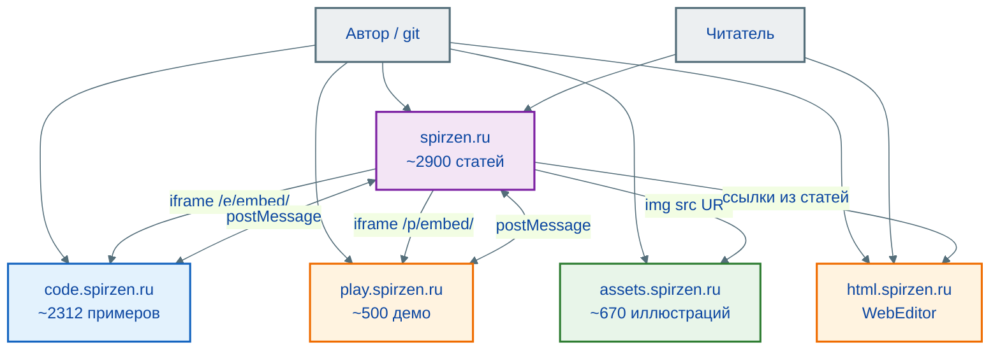
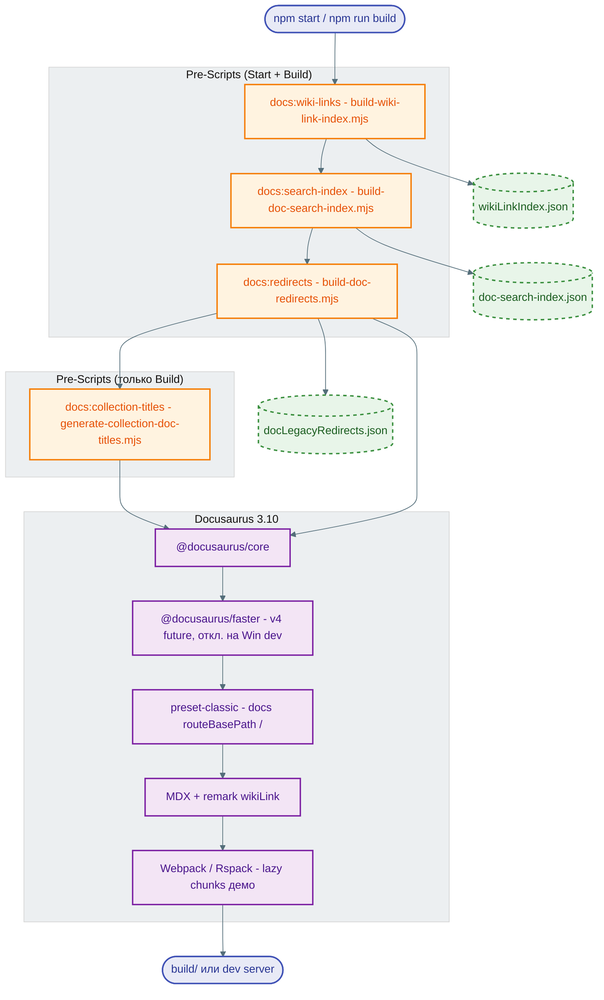

import DocCardList from '@theme/DocCardList';

# О проекте

<DocCardList />

---

<div class="callout callout--tip">
  <div class="callout-title">Для новичков</div>

  <div class="callout-body">
  В проекте есть интерактивный [Навигатор новичка и профилей](/lab/Планы%20развития/7): он помогает пройти путь от базовых тем к осознанному выбору направления.
</div>
  </div>


---

## Вселенная IT

"Вселенная IT" — это масштабный проект по систематизации, унификации и долгосрочному хранению знаний в области информационных технологий. 

Материалы для сайта я пишу ещё с 2018 года. Сам сайт запущен в 2025 году. Именно благодаря многолетнему труду здесь **более трёх тысяч** материалов в `docs/` (из них **~2900 статей** в энциклопедии), плюс **~2300 примеров кода** на [code.spirzen.ru](https://code.spirzen.ru/), **~500 интерактивных демо** на [play.spirzen.ru](https://play.spirzen.ru/), **~670 иллюстраций** на [assets.spirzen.ru](https://assets.spirzen.ru/) и **онлайн-редактор** [html.spirzen.ru](https://html.spirzen.ru/) (WebEditor).

Здесь:
- нет слежки;
- нет сбора данных;
- нет рекламы и платных услуг;
- нет пропаганды и скрытых целей.

Цель проекта — создание единой, непротиворечивой, проверяемой и доступной базы знаний, охватывающей всю широту IT-дисциплин, от фундаментальных основ до современных инженерных практик.

Если проще - дать вам, читателям, удобную возможность развиваться, читать и знать больше.

Материалы ориентированы на профессионалов, преподавателей, студентов и тех, кто начинает свой путь в IT. Каждый раздел проектируется с учётом научной строгости, практической применимости и доступности изложения.

Вселенная IT охватывает всю сферу IT в **единой модели знаний**: текст и навигация — на [spirzen.ru](https://spirzen.ru/), длинные листинги — на [code.spirzen.ru](https://code.spirzen.ru/), тяжёлый интерактив (эмуляторы, тренажёры, визуализаторы) — на [play.spirzen.ru](https://play.spirzen.ru/), иллюстрации и скриншоты — на [assets.spirzen.ru](https://assets.spirzen.ru/), практика веб-стека в браузере — на [html.spirzen.ru](https://html.spirzen.ru/) (WebEditor). Код и интерактив в статьях связаны через iframe; картинки — по URL в markdown. Бесплатность, отсутствие рекламы, открытый код. Подробнее о витрине демо — в разделе [Интерактив](/about/interactive).

У Вселенной IT есть осознанные минусы:
- уникальность и актуальность контента — я работаю сам и как хочу, поэтому если что-то обновится, то всё в моих руках;
- комьюнити и модель развития — многие базы знаний погибают из-за отсутствия авторов, а я одиночка.

Поиск по статьям **восстановлен**: собственный клиентский DocSearch (Ctrl+K) без Algolia и внешних SaaS — индекс `doc-search-index.json` собирается при `npm run build`.

Любите игры? Хотите улучшить компьютерную грамотность? Желаете выучить язык программирования? Ищете гайд для решения какой-то задачи? Не можете разобраться в какой-то теме?


<div class="callout callout--tip">
  <div class="callout-title">💡 Совет</div>

  <div class="callout-body">
В каждой статье есть теги, рекомендую обращать внимание. 
Они определяют обязательность и целевую аудиторию статьи, к примеру, тег "В РАЗРАБОТКЕ" говорит о том, что работа ещё не окончена, и кидаться тухлыми помидорами не нужно.
</div>
  </div>


На реальной статье в каждой паре указывается **один** тег (обязательность, уровень, статус). Ниже — как они выглядят по отдельности:

<div class="article-tags">
  <span class="tag tag-required">ОБЯЗАТЕЛЬНО</span>
</div>

<div class="article-tags">
  <span class="tag tag-notrequired">НЕ ОБЯЗАТЕЛЬНО</span>
</div>

<div class="article-tags">
  <span class="tag tag-beginner">ДЛЯ НОВИЧКОВ</span>
</div>

<div class="article-tags">
  <span class="tag tag-advanced">НЕ ДЛЯ НОВИЧКОВ</span>
</div>

<div class="article-tags">
  <span class="tag tag-inprogress">В РАЗРАБОТКЕ</span>
</div>

Роль читателя (обычно одна–две на статью): <span class="complexity-badge">Разработчику</span>, <span class="complexity-badge">Аналитику</span>, <span class="complexity-badge">Всем</span> и другие — см. [систему тегов](/about/tags).

```
Я стараюсь всегда приводить примеры кода. Можете копировать через кнопку справа в таких блоках. -->
```

Пользуйтесь **навигацией** — в меню **семь разделов** (плюс пункт «Общее содержание»):
- О проекте
- Энциклопедия (девять блоков — см. ниже)
- Инструменты
- Глоссарий
- Лаборатория
- Контекст
- Философия
- Общее содержание (`toc`)

Здесь есть всякое разное - списки игр, глоссарий терминов, подборка литературы и официальной документации, много интересных статей и теоретических основ.

> **📌 Внимание**  
> Правила и позиция проекта изложены в Манифесте.

---

## Цели проекта

### Основная цель

Формирование независимого, достоверного и устойчивого источника знаний, не подверженного коммерческому влиянию, временным трендам или региональным ограничениям. Проект стремится стать стандартом первичного обращения за информацией в русскоязычном IT-пространстве.

---

### Задачи
- **Систематизация знаний**: Устранение фрагментарности знаний через логическую декомпозицию и иерархическую структуризацию. Устранение дублирования, противоречий и терминологической неоднозначности.
- **Доступность**: Обеспечение свободного доступа к материалам без финансовых, географических или технических барьеров. Поддержка офлайн-использования и локального развёртывания.
- **Актуальность**: Регулярное обновление содержания на основе анализа изменений в стандартах, платформах и индустриальных практиках.
- **Практичность**: Интеграция теории с примерами использования, диаграммами архитектур, ссылками на спецификации и официальную документацию.
- **Нейтральность и объективность**: Исключение маркетингового влияния, сравнительный анализ технологий на основе измеримых характеристик.

---

## Принципы

Проект следует принципам **мультиисточности** (используется много источников информации для формирования полной картины), **нейтральности** (сравнение проводится объективно, без предвзятости), **долгосрочности** (чтобы материал можно было применять в течение многих лет), **профессионализма** - если что-то пишем, значит уже проверили сами. Поэтому верификация у нас происходит систематически по первичным и независимым источникам.

---

## Источники

Я провожу кросс-валидацию источников (я уже работал с факт-чекингом, так что разбираюсь в этой теме), и проверяю достоверность информации путём сопоставления данных из всех доступных источников - официальные, коммерческие, независимые и надёжные. К примеру, это может быть документация Microsoft, учебники и научная литература, статьи экспертов, мой личный опыт и практика, рекомендации коллег и знакомых профессионалов, проверка от ИИ-агентов (GPT, DeepSeek, Qwen, Яндекс).

Данные триангулируются (используются несколько методов или источников для подтверждения одного и того же факта).

Если данные спорные, устаревшие или ненадёжные - я прямо об этом скажу. Приоритет, конечно, отдаём оригинальным материалам - спецификациям, исходному коду, документации. Вторичные источники вроде блогов, статей или видео используются лишь как дополнение.

К сожалению, отметить какую-то конкретную литературу сложно - в основном курсы, учебники и прочие материалы преследуют коммерческую направленность, поэтому рассчитаны на узкое изучение с дальнейшим обращением к экспертам.

Но ведь мы с вами и так эксперты, не так ли? Чем вы отличаетесь от любого учёного? Тем, что он изучал чуть больше. Так станьте учёным и изучите!!!

---

<span id="arhitektura-proekta"></span>

## Как устроен проект технически

«Вселенная IT» — это не только тысячи статей, но и **распределённая программная платформа**: пять публичных доменов на GitHub Pages (текст, код, интерактив, медиа, веб-редактор), связанных с энциклопедией через iframe/postMessage, прямые URL иллюстраций и ссылки на standalone-приложения, плюс локальная панель разработчика и мобильное приложение. На продакшене **нет общего backend и базы данных** — читатель получает статический HTML и JavaScript; вся подготовка контента и индексов происходит при сборке и в CI.

### Экосистема (пять доменов + инструменты)

| Сервис | URL | Репозиторий | Содержание |
|--------|-----|-------------|------------|
| Энциклопедия | [spirzen.ru](https://spirzen.ru/) | `it-knowledge-base` | ~2900 статей в энциклопедии, DocSearch (Ctrl+K) |
| Примеры кода | [code.spirzen.ru](https://code.spirzen.ru/) | `it-code-examples` | ~2312 листингов (Astro + Shiki) |
| Интерактив | [play.spirzen.ru](https://play.spirzen.ru/) | `it-play` | ~500 демо (Astro + React) |
| Медиа | [assets.spirzen.ru](https://assets.spirzen.ru/) | `it-encyclopedia-media` | ~670 иллюстраций (статика, без сборки) |
| Веб-редактор | [html.spirzen.ru](https://html.spirzen.ru/) | [`WebEditor`](https://github.com/Spirzen/WebEditor) | HTML/CSS/JS с живым предпросмотром |
| Панель (локально) | `127.0.0.1:8787` | `it-management` | Start/Build/Deploy веб-проектов |
| Android | APK на главной | `itu-mobile-app` | WebView → spirzen.ru |

### Распределённая архитектура

Пять независимых доменов на GitHub Pages разгружают репозиторий энциклопедии: код и интерактив «стягиваются» в статьи через iframe и postMessage, иллюстрации — по абсолютным URL с **assets** (без участия билда Docusaurus), практика веб-стека — на **html** как отдельное приложение со ссылками из статей.


> Если картинка кажется слишком мелкой - нажмите ПКМ и выберите "Открыть в новой вкладке".

Исходник схемы — `info/it-universe-three-tier.drawio`. Иллюстрации статей и общие диаграммы — в [`it-encyclopedia-media`](https://github.com/Spirzen/it-encyclopedia-media); путь в репозитории повторяет путь статьи, общие PNG — в `_shared/img/`.

Длинные листинги и тяжёлые симуляторы **не раздувают** билд энциклопедии: статьи встраивают их через `ExternalCodeEmbed` и `ExternalPlayEmbed` (iframe, синхрон темы, авто-высота). Подробно — в служебном [`info/ECOSYSTEM.md`](https://github.com/Spirzen/it-knowledge-base/blob/main/info/ECOSYSTEM.md) на GitHub.

<div class="callout callout--info">
  <div class="callout-title">Живой пример</div>

  <div class="callout-body">
  Схема ниже описывает тот же проект, из которого собран сайт <a href="https://spirzen.ru">spirzen.ru</a>. Её можно использовать в учебных главах про архитектуру, аналитику и DevOps как эталон as-is.
</div>
  </div>


> Если картинка кажется слишком мелкой - нажмите ПКМ и выберите "Открыть в новой вкладке".

### Что показано на схеме (Draw.io)

| Зона | Содержание |
| :--- | :--- |
| **0. Экосистема** | Пять репозиториев GitHub → пять доменов Pages (spirzen, code, play, assets, html); it-management (локально); APK |
| **0b. Интеграция** | ExternalCodeEmbed / ExternalPlayEmbed, postMessage, CSP; иллюстрации — URL с assets |
| **1. it-knowledge-base** | `docs/` (~3400), `src/`, embed-компоненты, DocSearch |
| **2. Сборка spirzen.ru** | wiki-links, search-index, Docusaurus 3.10 → `build/` |
| **3–4. code / play** | Astro-каталоги, embed-маршруты, `dist/` |
| **4b. assets** | `it-encyclopedia-media` → `public/encyclopedia/` → assets.spirzen.ru |
| **5. Деплой** | GitHub Actions → deploy-pages на каждый домен |
| **6. Runtime** | Статья → iframe code/play + `img` с assets + inline lazyDemo; 9 блоков энциклопедии |

<span id="it-universe-c4-mermaid"></span>

### Экосистема (Mermaid)



<span id="it-universe-build-mermaid"></span>

### Пайплайн сборки (Mermaid)



Исходники диаграмм в репозитории — `info/it-universe-three-tier.drawio` (обзорная схема хаб + code + play) и `info/it-universe-architecture.drawio` (полная экосистема); редактор [diagrams.net](https://app.diagrams.net/) или расширение Draw.io в VS Code. PNG для статей и этой страницы — на [assets.spirzen.ru](https://assets.spirzen.ru/) (`it-encyclopedia-media/public/encyclopedia/_shared/img/`). Пересборка полной схемы: `node scripts/generate-architecture-drawio.mjs`, затем экспорт PNG в media-репозиторий.

Развёрнутое текстовое описание и дополнительные фрагменты Mermaid — в [`info/ARCHITECTURE.md`](https://github.com/Spirzen/it-knowledge-base/blob/main/info/ARCHITECTURE.md) на GitHub (каталог `info/` в публичную сборку сайта не входит). Якоря на этой странице: [C4-контекст](#it-universe-c4-mermaid), [пайплайн сборки](#it-universe-build-mermaid). Тот же материал разобран по темам энциклопедии — в статьях про [веб и SSG](/encyclopedia/2-system-network/2-04-kak-rabotayut-sayty-i-veb-sayty/114), [основы C4 и нотаций](/encyclopedia/7-project/7-04-analitika/1231), [инструменты C4](/encyclopedia/7-project/7-04-analitika/126), [CI/CD](/encyclopedia/8-infra-security/8-04-devops-ci-cd/11) и [GitHub Actions](/encyclopedia/8-infra-security/8-04-devops-ci-cd/2112).

---

<span id="struktura-bazy-znaniy"></span>

## Структура базы знаний

Сайт [spirzen.ru](https://spirzen.ru/) собран на Docusaurus. В боковом меню — **семь разделов** (плюс «Общее содержание»); ядро — **Энциклопедия** с **девятью блоками** (условный порядок погружения). Остальные разделы дополняют её: инструменты, глоссарий, лаборатория, контекст, философия.

---

### 1. Основы
<span class="complexity-badge">Всем</span>

Фундаментальные знания о компьютерах, программном обеспечении и IT-сфере в целом, и таких основах, как двоичная система, ПО, лицензирование, типы приложений, история развития IT. Идеально подходит для новичков, так как фактически развивает компьютерную грамотность, вводя в вычислительные системы.

---

### 2. Система и сеть
<span class="complexity-badge">Разработчику</span>
<span class="complexity-badge">Аналитику</span>
<span class="complexity-badge">Тестировщику</span>  
<span class="complexity-badge">Архитектору</span>
<span class="complexity-badge">Инженеру</span>

Операционные системы (Windows, Linux, Unix-подобные), сетевые технологии, системное администрирование, процессы, потоки, файловые системы, сетевые модели (OSI, TCP/IP), маршрутизация, DNS, DHCP, VPN, базовая безопасность.

---

### 3. Данные и разметка
<span class="complexity-badge">Всем</span>

Работа с данными, базы данных, SQL, NoSQL, HTML, CSS, анализ информации и структуры данных, сериализация, форматы (JSON, XML, YAML), нормализация, транзакции, индексация.

---

### 4. Код и разработка
<span class="complexity-badge">Разработчику</span>
<span class="complexity-badge">Архитектору</span>
<span class="complexity-badge">Инженеру</span>

Программирование, алгоритмы, архитектура приложений, инструменты разработки и методологии, отладка, контроль версий, сборка, цикл разработки ПО.

---

### 5. Языки программирования
<span class="complexity-badge">Разработчику</span>
<span class="complexity-badge">Архитектору</span>

Глубокое изучение языков: C#, Python, Java, JavaScript/TypeScript, C++, PHP, Ruby, Rust, Lua, а также анализ старых и нишевых языков (например, COBOL, Pascal). Для каждого — семантика, runtime, особенности компиляции/интерпретации, экосистема.

---

### 6. Искусственный интеллект
<span class="complexity-badge">Разработчику</span>
<span class="complexity-badge">Архитектору</span>
<span class="complexity-badge">Инженеру</span>

Основы AI и машинного обучения, модели и инструменты, разработка и применение ИИ.

---

### 7. Управление проектами
<span class="complexity-badge">Разработчику</span>
<span class="complexity-badge">Аналитику</span>
<span class="complexity-badge">Тестировщику</span>  
<span class="complexity-badge">Архитектору</span>
<span class="complexity-badge">Руководителю</span>
<span class="complexity-badge">Техническому писателю</span>

Методологии (Agile, Scrum, Kanban, Waterfall), управление требованиями, метрики, командная работа, роль бизнес-аналитика, взаимодействие с заказчиком, карьерные траектории.

---

### 8. Инфраструктура и безопасность
<span class="complexity-badge">Разработчику</span>
<span class="complexity-badge">Архитектору</span>
<span class="complexity-badge">Инженеру</span>

DevOps-практики, контейнеризация (Docker), оркестрация (Kubernetes), облачные платформы (AWS, Azure, GCP), мониторинг (Prometheus, Grafana), логирование, шифрование, аутентификация, аудит.

---

### 9. Дополнительные темы
<span class="complexity-badge">Всем</span>

Блокчейн, IoT, мобильная разработка, игровые движки, IT-этика, энергоэффективность, влияние IT на общество. Также включает спин-офф материалы — например, исторический анализ технологий или культурные аспекты цифровизации.

Но полная информация имеется в содержании.

---

## Особенности проекта

Как можно понять, проект простой и держится на моём энтузиазме. Я не знаю точно, что мною движило - но я люблю писать, систематизировать и приводить всё в порядок. Сначала я вёл базу знаний для себя, а потом всё как-то разрослось, и я подумал - а почему бы не поделиться со всем миром?

---

### Открытость
- Все материалы **бесплатны** и доступны каждому, даже самым вредным товарищам))
- Проект имеет **открытую лицензию** и позволяет спокойно получать знания.
- Исходный код хранится в **нескольких** публичных репозиториях на GitHub (`it-knowledge-base`, `it-code-examples`, `it-play`, `it-encyclopedia-media` и др.).
- Вы можете скачать себе и развернуть, но тогда книга потеряет главное свойство - актуальность. Лучше пользуйтесь этим сайтом - spirzen.ru

---

### Формат "книги-энциклопедии"
- Проект представляет собой **статический сайт**, собранный с помощью современного генератора документации.
- Пользователи могут **только читать** материалы - это гарантирует целостность и авторскую экспертизу.
- Ведётся также работа над форматом книги, так что однажды сможем почитать и оффлайн.

---

### Многоязычность
- Основной язык: **Русский**
- Архитектура сайта готова к добавлению языковых веток без перестройки структуры (**i18n-ready**).
- На текущем этапе локализация на другие языки **не ведётся и не планируется**, так как при текущем масштабе контента это нерационально.

---

## Безопасность

### Почему только чтение?
- **Защита от вандализма**: Исключается риск намеренного искажения или удаления информации.
- **Стабильность**: Постоянные URL позволяют использовать материалы в курсах, статьях и цитатах.
- **Качество**: Все изменения проходят ревизию автора, что исключает распространение неточных формулировок.

---

### Как обновляется контент?
- Обновления производятся **только автором**
- Все изменения **тщательно проверяются**
- **Регулярные обновления** с учетом новых технологий
- **Обратная связь** от сообщества учитывается при обновлениях

---

## Статистика проекта

- **7 разделов** в меню (+ «Общее содержание»)
- **~2900 статей** в энциклопедии, **~3400 материалов** в `docs/` всего
- **~2312 примеров кода** на [code.spirzen.ru](https://code.spirzen.ru/)
- **~500 интерактивных демо** на [play.spirzen.ru](https://play.spirzen.ru/)
- **~670 иллюстраций** на [assets.spirzen.ru](https://assets.spirzen.ru/)
- **WebEditor** на [html.spirzen.ru](https://html.spirzen.ru/) — практика HTML/CSS/JS в браузере
- **15+ языков программирования** в каталоге примеров
- **Поиск** по статьям (Ctrl+K), без Algolia
- **100% бесплатно**, постоянно обновляется
- Выглядит так, будто я продаю что-то, не так ли? А вот и нет, всё открыто.

---

## Планы развития

### Краткосрочные планы
- Экспертиза и улучшение существующей информации
- Поиск, изучение и добавление нового материала
- Масштабирование разделов и каталогов code/play
- Добавление новых статей и примеров
- Улучшение DocSearch и навигации
- Новые интерактивные демо на play.spirzen.ru

---

### Долгосрочные планы
- Создание видео-материалов
- Развитие Android-приложения (APK уже на [главной](https://spirzen.ru/))
- Интеграция с образовательными платформами

---

## Сообщество

### Как принять участие?

Проект не является коллегиальным в части написания контента. Автор остаётся единственным редактором, гарантируя единство стиля, точность формулировок и качество контента. Однако он открыт для сотрудничества.

Хотя редактирование недоступно, вы можете:
- **Предлагать улучшения** через GitHub Issues
- **Сообщать об ошибках** в материалах
- **Предлагать новые темы** для статей

---

### Обратная связь

Ваше мнение важно для развития проекта! Свяжитесь с автором через:
- GitHub Issues
- Email: tim.tagirov@mail.ru
- Социальные сети: [https://t.me/spirzenverse](https://t.me/spirzenverse)


---

## Планы

Планируется расширение разделов, оптимизация производительности сайтов и постоянное добавление практических кейсов. Сначала разберёмся с теорией.

---

## Лицензия

Проект распространяется под открытой лицензией, которая позволяет свободно использовать материалы для обучения и некоммерческих целей.

---

*Создано с уважением и любовью для IT-сообщества*

---
