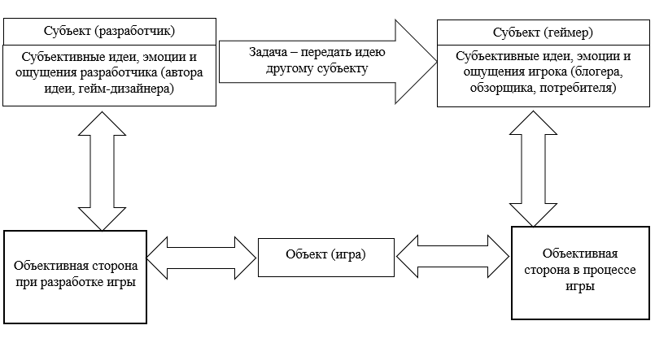

# Искусство: сюжеты, герои, миры, музыка

  НЕ ОБЯЗАТЕЛЬНО
  ДЛЯ НОВИЧКОВ

## Искусство

Для понимания, нужно обозначить ключевые элементы игры:
	- Геймплей – система управления, правила игры и взаимодействия игрока с миром;
	- Сюжет (история) – события, персонажи, развитие сюжета;
	- Визуальный ряд – графика, анимация, окружение, модели;
	- Звуковое оформление – музыка, эффекты, озвучка.

Сюжеты игр могут быть разными — фантастическими, историческими, фэнтезийными, реалистичными. Важно, чтобы сюжет был интересным, заставлял нас сопереживать героям и думать о глубоких вопросах. Ну, если он, конечно, нужен для жанра. Джон Кармак, к примеру, говорил: «Сюжет в игре – как сюжет в порно фильме. Он должен быть, но совершенно не важен». И такая тема сработала с его «Doom», и для «бумер-шутеров» действительно не важна, как и, к примеру, для головоломок, кликеров, гоночных симуляторов. Скорее, сюжет нужен для ролевых игр, приключений, квестов, экшен-адвенчур, платформеров, шутеров и стратегий с однопользовательской кампанией.

Конфликт — движущая сила любого сюжета. Он может быть внутренним (герой борется с собственными демонами), внешним (герой сражается с противниками) или комбинированным. Порой для базового сюжета достаточно придумать героя и противников. Но сюжету нужно развитие. Хороший сюжет не стоит на месте, развивается, преодолевает препятствия, удивляет нас неожиданными поворотами и приводит к завершению истории. 
«Warcraft», серия стратегических игр в реальном времени, действие которых происходит в фэнтезийном мире на планете Азерот, получила грамотное развитие в своих сиквелах, закрепила культовый статус, а по мотивам игры была написана целая серия романов, снят неплохой фильм, а также выпущены рассказы, комиксы и короткометражки. Всё это неплохо расширило лор игры, ввело новых персонажей и позволило авторам рассказать о происходящих в Азероте (и не только) событиях с новой точки зрения. У той же «Diablo» есть крайне примечательная серия книг цикла «Войны греха», охватывающая очень интересный период, раскрывающая подробности вечного противостояния.

Иногда мир игры, наоборот, вдохновляется книгами. К примеру – игра «Metro 2033», шутер от первого лица, действие которого происходит в московском метро, где человечество укрылось от катастрофы, основана на одноименном романе Дмитрия Глуховского. Но если книга больше сосредоточена на психологической стороне событий, на жизни людей в постапокалиптическом мире, то игра представляет собой классический научно-фантастический экшен. В книгах персонажи часто получают более глубокую проработку, чем в играх. Читатель узнаёт об их прошлом, мотивах и психологических особенностях.

А в ряде случаев книги и вовсе интегрируются в саму игру, становясь неотъемлемой частью игрового мира. К примеру, в «The Elder Scrolls V: Skyrim» и «The Elder Scrolls Online» содержатся огромные библиотеки, наполненные книгами, которые украшают локации, и становятся интерактивными элементами игры. Игрок может свободно брать эти книги в руки, открывать их, листать страницы, как в реальном мире, и погружаться в читаемый текст. Такой интерактивный опыт чтения расширяет и углубляет игровой процесс. Книги становятся источниками знаний, которые рассказывают о мире, его истории, культуре, персонажах и событиях, а порой информация может даже пригодиться при дальнейшем прохождении игры. Серия «Древних Свитков» вообще является находкой для любителей интересных историй, так как содержит много подробных материалов, раскрывающих хронологию событий в разные периоды времени, имеет богатый запас игр с многочасовыми сюжетными линиями.

Разнообразие игровых вселенных выходит далеко за рамки игр, и сейчас уже «перемешано» с другими развлечениями, такими как литература и кино. Изучение игровых (и не только) миров, можно назвать неким «лороведением». Давайте проверим вас на эрудированность несколькими простыми вопросами по разным вселенным, без привязки к играм.

	- Сколько приблизительно солдат насчитывала армия Саурона во время осады Минас-Тирита?
	- Кто такие двемеры и какова их судьба в мире Нирн?
	- Кем был Ульдиссиан и какую роль он сыграл в истории Санктуария?
	- Что такое Цикл Моров и как он влияет на события в мире?
	- Какова настоящая природа Гэндальфа и какое место он занимает в мифологии Средиземья?
	- Может ли Джон Сноу быть воплощением Азор Ахая? (примечание - в тюркских языках «агай» или «ахай» это старший брат, дядя, так что воспринимается как «дядя Азор», что вызывает улыбку)
	- Как связаны между собой Fantasy Battles, End Times и Age of Sigmar?
	- Кто создал зерглингов и как это отразилось на развитии расы зергов?
	- Что такое Проклятие Плоти и как оно связано с Древними Богами?
	- Кто такие дедайты?

Такой список вопросов можно увеличивать до бесконечности, а если вы смогли ответить хотя бы на большую часть этих вопросов, то поздравляю вас, вы действительно интересуетесь «лороведением» и довольно хорошо эрудированы в этой области. Лично я бы порекомендовал изучить миры таких вселенных, как Легендариум Толкина, мир Песни Льда и Пламени, «The Elder Scrolls», «Warcraft», «Warhammer» (тут осторожно, можно застрять на многие годы), «Diablo», «Dragon Age», «Forgotten Realms», не пройти мимо «Marvel», «DC» и «Звездных войн».

Лороведение — это изучение лора , то есть истории, мифологии, культуры и других элементов вымышленного мира, представленного в той или иной медиа-франшизе. В первую очередь нужно знакомиться с каноническими источниками, а затем уже развивать полученные знания, анализируя все доступные материалы – книги, игры, фильмы, комиксы, интервью с разработчиками, статьи в журналах и на вики-ресурсах. В некоторых случаях таким образом можно найти скрытые связи, пасхалки, намёки, которые могут раскрывать больше информации о мире, персонажах, событиях. Лороведы часто разрабатывают свои собственные теории, пытаются интерпретировать неясные моменты, прогнозировать грядущие события и предлагать свои версии ответов на вопросы, которые не были прямо затронуты в источнике, но мучают головы фанатов. Это не просто хобби, а серьёзное и увлекательное занятие, позволяющее глубоко погрузиться в любимый мир, узнать о нём больше и поделиться своими открытиями с другими энтузиастами.

Адаптации игр на большом экране в кинематографе в основном неудачны, так как это не простое задание, и часто мы сталкиваемся с плохими фильмами по мотивам игр, как и плохими играми по мотивам фильмов. Некоторые даже считают это проклятьем. Почему? Часто игры представляют собой простую механическую переработку сюжета фильма, лишены глубины, оригинальности и часто не учитывают особенности игрового процесса, отдавая приоритет попытке передать атмосферу фильма, вследствие чего могут быть однообразными, лишенными инноваций и не вызвать у игрока интереса. Они не развивают игровой мир и не предлагают новые истории, а просто повторяют сюжет фильма и не дают игроку полностью «раскусить» вселенную.

Фильмы имеют другую проблему. Часто режиссеры, продюсеры не учитывают особенности игрового мира и пытаются перевести его на язык кино, не понимая его суть. Игры часто имеют более обширный и многогранный сюжет, чем фильмы, равно как и имеют другие возможности для раскрытия событий — если фильм ограничен 2-3 часами, то игра не ограничена во времени. Поэтому в попытке уложиться в стандартные рамки кино, режиссеры могут сильно сжать сюжет и утратить важные детали. Кроме этого, фильмы по мотивам игр включают в себя часто ненужные события, которые отсутствовали в оригинале, искажают сюжет, и не соответствуют канону. А несоответствие канону вызовет гнев геймеров. Представьте, если бы в «Star Wars Battlefront» дроиды сражались за Сопротивление, причислялись к джедаям, выглядели по-другому (допустим, как милые плюшевые игрушки розового цвета), истекали кровью и использовали силу? Думаю, фанаты бы не оценили издевательство над каноном. Но почему-то с фильмами создатели не церемонятся — стоит вспомнить «DOOM: Аннигиляция» или «шедевры» Уве Болла (никогда не простил бы ему экранизацию «Far Cry»). Чтобы создать успешную адаптацию игры, нужно играть в игру для начала, понять, в чем её суть, учесть особенности игрового мира, характер персонажей и не утратить уникальность игрового процесса – потому что целевой аудиторией являются геймеры, фанаты игры.

Неоднозначной экранизацией игры был фильм «Варкрафт», который сосредоточился на сюжете первого столкновения людей и орков (Альянса и Орды тогда ещё не было). К сожалению, он унаследовал большую часть проблем – попытался охватить огромное количество информации за относительно короткое время И вместо того, чтобы ознакомить зрителя с предысторией — что такое Дренор, что такое Азерот, кто такой Саргерас, почему дренеи у орков в плену, и зачем они открыли портал, как они его создали — все это было пропущено и в первые минуты фильма орки уже вторгаются в Азерот через Тёмный портал. Создатели торопились? Но ведь они потом не пожалели времени на сомнительную романтическую линию Лотара и Гароны, на ненужный диалог у костра. То есть, нерационально распределили имеющиеся два часа. Сюжет насыщен множеством персонажей, локаций и событий, которые могли быть трудными для восприятия зрителями, не знакомыми с игровой вселенной. Казалось, что фильм пытается слишком много рассказать за один раз, не представляя достаточно времени для глубокого раскрытия персонажей и их мотивов. Кино скорее выступает как красочное иллюстрированное руководство по вселенной Warcraft, чем как полноценное произведение. 

Конкретно в этом фильме есть ещё проблема того, что большая часть сцен оставлена на CGI (компьютерную графику), тогда как эффективнее и достовернее было бы подойти к декорациям и костюмам, а также гриму. Возможно, стоило ограничиться одной сюжетной линии, и начать повествование ещё с Дренора, а закончить фильм открытием портала и вторжением. Такими темпами, они бы разозлили фанатов третьим фильмом, в который бы запихнули весь третий Warcraft, с невероятнейшей историей Короля-лича. Но, так уж и быть, видимо, киноделам виднее.

Есть конечно и хорошие экранизации, которые сообществом приняты тепло — «Аркейн» по мотивам «League of Legends», «Fallout», «Братья Супер-Марио», «Соник в кино», «Детектив Пикачу». Сейчас определенно замечается тенденция увеличения количества экранизаций игр, их всё больше и больше с каждым годом – киноделы наконец обратили внимание на богатство игровых сюжетов, и начинают учитывать определенные ошибки, что не может не радовать.

Герои в играх — это не просто аватары игрока, это живые и дышащие персонажи с собственной историей, характером и мотивацией. Они должны быть не просто сильными и мощными, но и запоминающимися, харизматичными и вдохновляющими. Мы должны сопереживать их проблемам, радоваться победам, горевать о поражениях. Примеры великолепных героев – Джоэл из «The Last Of Us», судьба которого вызывает бурю эмоций, Геральт из Ривии, Астарион из «Baldur’s Gate 3», Джим Рейнор из «Starcraft II», Артас Менетил из «Warcraft III». Они должны быть харизматичными, запоминающимися и вызывать у нас интерес. У героев должна быть четкая мотивация, которая толкает их к действию и определяет их поступки. Герои не должны быть идеальными (прости, Палач Рока). Они должны расти, меняться, учиться на ошибках и развиваться на протяжении сюжета.

Игровой мир должен быть проработан до мелочей. Детализация делает мир более реалистичным и позволяет нам погрузиться в него с головой. Он не должен быть просто статичным фоном для приключений героя. Он должен быть живым, дышащим, взаимодействующим с героем. В идеале, он должен иметь свою историю, традиции, культуру и население. Примеры роскошных игровых миров – «The Elder Scrolls V: Skyrim», огромный и живой мир с холодными горами, таинственными лесами и заснеженными равнинами, «The Witcher 3: Wild Hunt» - мир с огромным количеством деталей, населенный разными расами и фракциями, «Red Dead Redemption 2» - мир Дикого Запада с проработанными мелочами, с реалистичными пейзажами и живыми персонажами. Серьёзно, они очень живые.

Атмосфера игры — незримая нить, которая связывает все элементы игрового процесса в единое целое, создавая неповторимое настроение и погружение игрока. Она формируется из множества элементов: музыки, звуковых эффектов, освещения, цвета, деталей окружения, а также визуальных эффектов. Она может быть пугающей, тайной, мистической, уютной, драматической, эпической или любой другой, в зависимости от целей разработчиков. Когда игрок погружается в события, он словно становится частью истории игры и даже откликается на действия персонажей, сопереживая им, радуясь успехам, огорчаясь неудачам. Игрок на время забывает о своих проблемах и заботах реальной жизни. Это важный элемент игрового опыта, правильно подобранный подход может погрузить игрока надолго и глубоко. Примеры замечательной атмосферы можно заметить, к примеру, в серии игр «Dark Souls», «Silent Hill» или «Bioshock». Гейм-дизайнер использует все возможные инструменты, но в итоге восприятие игры зависит от множества факторов, свойственных каждому игроку — личный опыт, эмоциональное состояние, настроение, культурные особенности и индивидуальные предпочтения. Допустим, геймер, находящийся в плохом настроении, может воспринимать атмосферу игры более пессимистично. Задача же гейм-дизайнера — создать условия, когда у игроков будут вызываться определённые эмоции, сделать так, чтобы его идеи перенеслись в сознание игрока. Поэтому, лично я считаю, что атмосфера – субъективное ощущение. В некоторых жанрах это ключевой аспект — допустим, хоррор-игры базируются на атмосфере ужаса, страха и жути.

Некоторые могут не согласиться с мнением об атмосфере, но для понимания важно ознакомиться с ключевыми понятиями. Субъективность – это восприятие и оценка чего-либо с точки зрения конкретного человека, с учетом его личных особенностей, опыта и предпочтений. Объективность — восприятие и оценка чего-либо с точки зрения безличного наблюдателя, без учёта субъективных факторов. И вот именно атмосферу каждый игрок будет воспринимать по-разному. Поэтому считать, что атмосфера — это нечто объективное, что заложено в игру разработчиками — скорее неверно, потому что восприятие игрока формируется на основе элементов. То есть, атмосфера это последствие, а разработчики работают над элементами. Играя в игру, первый игрок ощутит страх, второй — удивление, третий посмеётся, а четвёртый испытает скуку. И объективно оцениваются именно условия для возникновения определенных эмоций. Поэтому «объективное мнение» — оксюморон, так как мнение всегда субъективно, объективность же относится к фактам, а не их интерпретации.

Пример:
	- Объект – игра. Игра — фактически это просто совокупность файлов, работающих с электронным устройством в определённой конфигурации.
	- Субъект – человек. Это может быть как игрок, который играет в игру, так и разработчик, который её разрабатывает, издатель, который её издаёт — в зависимости от характера общественных отношений, субъектом является соответствующее лицо.
	- Объективная сторона – технологии (движок, графика, физика), геймплей (механики, управление, системы), интерфейс, сюжет, средства, методы, орудия и инструменты – способы создания файлов, место создания, порядок их использования, параметры конфигурации, принципы взаимодействия с субъектом.
	- Субъективная сторона зависит от субъекта. Личные предпочтения, нравится процесс или нет, мотивы, цели, эмоции, ощущения, восприятие, трактовка — при прохождении игры для игрока, при создании игры для разработчика. Причем, сюда относится личный опыт игры, впечатление, мнение, поведение, настроение, и даже внешние факторы, воспитание и история жизни. Разработчик может вкладывать определённый смысл, иметь своё видение игры, иметь свои мотивы и свои знания, а потребитель воспримет всё абсолютно иначе.

Ключевая мысль, для которой мы разбирали этот состав — субъективная сторона — это то, что делает игру особенной для каждого человека, формирует уникальный опыт, который не может быть полностью объективизирован, и объективного мнения, восприятия атмосферы не существует. Объективным «обзором» было бы перечисление способов создания, истории, используемых технологий, механик и решений. Словом, объективно = фактически.

И атмосфера как раз связана с этим понятием — субъективность. В игре, разработчик, используя определенные средства и руководствуясь своими эмоциями и целями, старается добиться того, чтобы игрок, при эксплуатации объекта, используя соответствующие средства, получал именно те эмоции, которые хотел бы видеть у него разработчик. Вот в этом и заключается искусство. Допустим, проходя «The Walking Dead» в первый раз, я прослезился в конце, проходя её в одиночестве и ночью. Стример же, проходя эту же игру с бутылкой пива и в весёлой компании, развлекаясь с аудиторией в чате, в этом же моменте не испытывал тех же эмоций по понятной причине. И порой, чтобы получить ровно те ощущения, которые задуманы разработчиками, нужно воссоздать нужные условия.

Говоря об атмосфере, нельзя не подчеркнуть следующую составляющую. Звуки игр, и в том числе музыка – это важная часть игрового опыта, которая создает напряжение, или наоборот, расслабляет, подчеркивает эмоции. Композиторы используют историю игры, её персонажей, атмосферу и настроение как источник вдохновения. Они изучают игровой процесс, общаются с разработчиками, чтобы понять суть игры и создать музыку, которая будет соответствовать ее духу, используют разные инструменты и технологии, чтобы создать звуковое оформление. От классических оркестров до синтезаторов и электронных звуков, музыканты используют все возможности для создания живого и завораживающего звука. Музыка интегрируется в игровой прогресс так, чтобы она подчеркивала важные моменты. Музыка должна запоминаться, создавать определённое настроение и поддерживать атмосферу, быть динамичной и изменяться в зависимости от ситуации в игре. Именно музыка потом будет вызывать у нас ассоциации с игрой даже после её завершения. Признайтесь, какая музыка у вас сейчас заиграла в голове? Лично у меня возникает в голове «Secunda» из «The Elder Scrolls V: Skyrim». Ох, я помню впечатления от первого невероятного трейлера, когда от крика «FUS RO DAH» и хорового пения пошли мурашки по коже.

Визуальные эффекты — это свет, тени, отражения, частицы огня, дыма, пыли, тумана и взрывов. Это дополнительные элементы, обеспечивающие «оживление» графических объектов, некие украшения игры. Допустим, проливной ливень в драматической сцене. Так же это эффекты пост-обработки, которые накладываются на игру после её рендеринга, например размытие движения, глубина резкости, цветные фильтры. Визуальное оформление — целая наука, включающая в себя грамотное использование цветовой палитры игры, источников света, что позволяет создавать нужную картинку. Они генерируются в игре в реальном мире с помощью графического процессора (поэтому, кстати, при слабом процессоре на ПК следует уменьшить нагрузку, связанную с эффектами и количеством частиц, а при малом количестве видеопамяти – уменьшить размер и качество текстур). 

Спецэффекты — это визуальные элементы, которые делают игру более зрелищной и захватывающей. Они могут быть использованы для создания взрывов, огня, воды и других эффектов, которые делают игру более динамичной и интересной. Спецэффекты постоянно развиваются вместе с технологиями, и современные игры могут похвастаться уникальными решениями в этой области. К примеру, «DOOM Eternal» и «Gears 5» просто забросают спецэффектами, которые играют ключевую роль в динамике игры.

Графика же в играх — важнейшая составляющая, без которой бы экран не понадобился. Основные составляющие - модели (своего рода «скелеты»), и текстуры («мясо», которое накладывается на «скелет»). Трёхмерная графика визуализируется путём «рендеринга» 3D-моделей и текстур, создавая картинку на экране. Модели формируются с помощью полигонов. Двумерная (2D) графика создаётся с помощью пикселей, каждый из которых имеет свой цвет, и из них собирается картинка.  Современные игры отличаются высоким качеством графики, она делает игровой мир реалистичным и красивым. Причём, под «реалистичным» подразумевается не всегда соответствие нашей реальности, скорее это когда мы верим в реальность мира игры. Качество графики влияет на восприятие игрового мира, к примеру, те же «Red Dead Redemption 2» или «The Last Of Us Part II» позволяют нам увидеть детали окружающего мира и погрузиться с головой.

Анимация — это последовательность изображений или кадров, которые меняются с определённой скоростью, чтобы создать иллюзию движения. Она делает игру более живой и динамичной, помогает лучше понять характер персонажей и взаимодействовать с миром. Классным примером является «моушен-кэпчер»  — технология, позволяющая записать движения реального человека и использовать их в игре, начиная от простых движений, заканчивая мимикой. В играх используется разный тип анимации – от простой до очень сложной и реалистичной, что делает сцены боев и диалоги еще более захватывающими. 

Поэтому можно сказать, что игры — это целая совокупность различных творческих и технических решений, которые позволяют произвести на игрока впечатление, и когда кто-то сразу и резко говорит, что игра «кал», это не означает, что она таковой является объективно. Не слушайте других, пробуйте сами.

Игры — это искусство, сочетающее в себе множество элементов: от геймплея и сюжета до визуального оформления и музыки. Каждый из этих элементов вносит свой вклад в создание уникального опыта для игрока. Важно помнить, что восприятие игры всегда будет субъективным и зависит от множества факторов, как личных предпочтений, так и внешних условий. Поэтому, чтобы получить полное удовольствие от игры, стоит погружаться в неё самостоятельно и оценивать все её аспекты с позиции своего уникального опыта и впечатлений.

---
