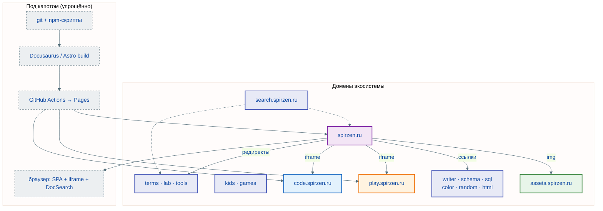
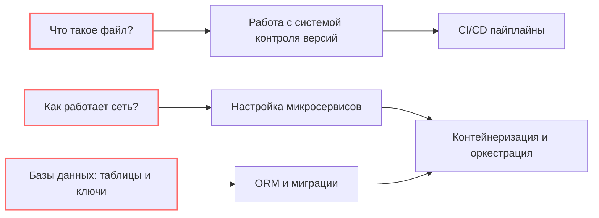
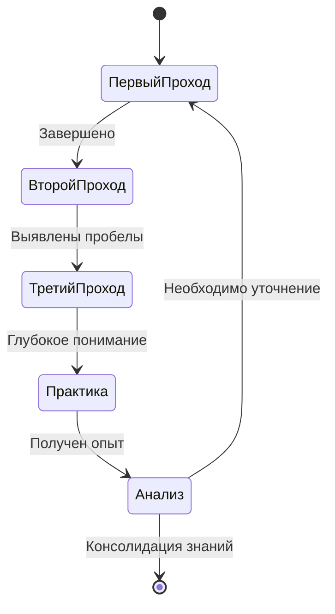

---
tags:
  - all
  - required
  - beginner
title: Обзор структуры Вселенной IT
description: "Данная база знаний должна выполнить сложнейшую задачу – выступить в роли антикризисного пакета для IT-новичка и глотком свежего воздуха для профессионала."
---

import ExternalPlayEmbed from '@site/src/components/ExternalPlayEmbed';

# Обзор структуры Вселенной IT

  ОБЯЗАТЕЛЬНО
  ДЛЯ НОВИЧКОВ

Всем

Совсем с нуля, без опыта за ПК — начните с [Основы компьютерной грамотности](/encyclopedia/1-basics/1-035-bazovaya-informatika/101), затем вернитесь к этому обзору.

---

## Обзор структуры Вселенной IT

Данная база знаний должна выполнить сложнейшую задачу – выступить в роли антикризисного пакета для IT-новичка и глотком свежего воздуха для профессионала. Она является как обучающим материалом, так и настольным руководством-справочником. Возможно, даже *энциклопедией*. Теория, конечно, будет, но мы сократим её и структурируем, отметим всё в формате тезисов так, чтобы получить инструкцию по выживанию в IT для тех, кто устал от сложных объяснений. Конечно, я встречал такие учебники, которые громко заявляют о себе с приписками "с нуля", "для начинающих", "для чайников", но нет.

1. Проблема, которую решает ресурс - отсутствие единого источника.
2. Подход к подаче материала - глубокий и системный.
3. Аудитория - любой заинтересованный человек.
4. Структура — энциклопедия (9 блоков) на spirzen.ru плюс **порталы экосистемы**: search, terms, lab, tools, kids, games, writer, schema, sql, color, random, code, play, assets, html (каждый — свой домен и репозиторий).
5. Достоверность и актуальность - ежедневно проверяется, исправляется и улучшается.
6. Сложность - максимальная. Если вы решили погрузиться в эту сферу, будьте готовы к её высочайшей сложности.
7. Стиль - смешанный. Я использую как разговорный, так наставнический и научный стиль.
8. Политики нет. Я соблюдаю законы и не лоббирую ничьи интересы.
9. Форумы и обратная связь не интересуют на текущий момент. У меня просто нет ресурсов и сил на такое.

<ExternalPlayEmbed example="about/interactive-roadmap" title="Interactive Roadmap" minHeight={520} />

### Живой пример — проект "Вселенная IT"

Платформа — **не один сайт** и **не «три уровня»**. Это **более пятнадцати поддоменов** `*.spirzen.ru`: энциклопедический хаб, контентные порталы, утилиты, поиск, медиа — каждый со своей сборкой и деплоем. Карта всех сервисов: [status.spirzen.ru](https://status.spirzen.ru). Полная техническая схема — [О проекте → архитектура](/about/project#arhitektura-proekta).

#### Ядро

| Сервис | URL | Содержание |
|--------|-----|------------|
| Энциклопедия | [spirzen.ru](https://spirzen.ru/) | ~2900 статей; поиск **по энциклопедии** — Ctrl+K |
| Поиск везде | [search.spirzen.ru](https://search.spirzen.ru) | Сквозной поиск: spirzen + code + play + terms + lab + tools |
| Медиа | [assets.spirzen.ru](https://assets.spirzen.ru/) | ~670 иллюстраций по URL в статьях |
| Хаб | [status.spirzen.ru](https://status.spirzen.ru) | Все домены экосистемы на одной странице |

#### Обучение (отдельные сайты)

| Сервис | URL | Содержание |
|--------|-----|------------|
| Глоссарий | [terms.spirzen.ru](https://terms.spirzen.ru) | ~4250 IT-терминов |
| Лаборатория | [lab.spirzen.ru](https://lab.spirzen.ru) | Практика, тренажёры, экзамены |
| Для детей | [kids.spirzen.ru](https://kids.spirzen.ru) | Упрощённые материалы |
| Игры | [games.spirzen.ru](https://games.spirzen.ru) | IT-игры и головоломки |

#### Код, интерактив и редакторы

| Сервис | URL | Содержание |
|--------|-----|------------|
| Примеры кода | [code.spirzen.ru](https://code.spirzen.ru/) | ~2312 листингов; в статьях — iframe |
| Интерактив | [play.spirzen.ru](https://play.spirzen.ru/) | ~500 демо; в статьях — iframe |
| WebEditor | [html.spirzen.ru](https://html.spirzen.ru/) | HTML/CSS/JS в браузере |
| Writer | [writer.spirzen.ru](https://writer.spirzen.ru) | Редактор статей для автора |
| Schema | [schema.spirzen.ru](https://schema.spirzen.ru) | Диаграммы и блок-схемы |
| SQL | [sql.spirzen.ru](https://sql.spirzen.ru) | SQL-песочница |

#### Утилиты

| Сервис | URL | Содержание |
|--------|-----|------------|
| Tools | [tools.spirzen.ru](https://tools.spirzen.ru) | Справочник инструментов разработчика |
| Color | [color.spirzen.ru](https://color.spirzen.ru) | Студия цвета, конвертеры, WCAG |
| Random | [random.spirzen.ru](https://random.spirzen.ru) | Генераторы случайных данных |

Пункты меню **Глоссарий**, **Лаборатория** и **Инструменты** на spirzen.ru ведут на terms, lab и tools (старые URL сохраняются через редирект). Внутри энциклопедии — **девять блоков** (от «Основ» до «Дополнительных тем»). Код и тяжёлые демо в статьях — iframe с code/play; картинки — с assets.

Подробный разбор — [Как устроена Вселенная IT → Архитектура](/about/kak-ustroena-vselennaya-it/arkhitektura).

> Схема выше — **полная** (восемь swimlanes). Упрощённый обзор «хаб + code + play» — на той же странице [О проекте](/about/project#arhitektura-proekta). Если картинка мелкая — ПКМ → «Открыть в новой вкладке».

---

### Проверенная ли информация?

**Источники**? *Я не буду брать непроверенную информацию*. В моём распоряжении мой личный опыт, сотни прочитанных книг и исследований, тысячи статей и материалов, поэтому для простого перечисления придётся выделить отдельную книгу, что, на мой взгляд, излишний труд. Условимся на том, что важные моменты я помечу, и если будут хорошие источники, с которыми стоит ознакомиться, я оставлю на них ссылки.

---

### Я новичок!

**Вы новичок?** Тогда давайте договоримся. *Вы — потенциальный специалист*. У вас получится. Не сдавайтесь. Не слушайте злые языки, не переживайте из-за ошибок, и не питайте иллюзий, что это не для вас. В айти есть много различных видов деятельности, и вы точно могли бы заняться чем-то из этого множества. И чтобы конкурировать, вам нужно разобраться в предмете, быть полезным для работодателя (даже если вы сами себе начальник!). Именно знания дают возможность получить опыт, а опыт открывает двери.

---

### Я опытный!

**Вы уже опытный специалист?** Тогда примите мою благодарность за проявленный интерес. Я надеюсь, что у вас есть тяга к знаниям, и данный цикл книг будет вам полезен, подарив что-то новое. Конечно, для опытного человека будет немного забавно читать, как устроен компьютер, что такое файл, как работает интернет, и так далее - но представьте, что много людей, которые этого действительно не знают! Многие не знают даже самых верхних основ, и если моя книга попала в руки к таким людям - это хорошо!

---

### Материал подаётся странно

**Важно**: любая картина - паззл, состоящий из элементов. Я специально выстроил всё так, чтобы паззл сложился именно корректно. Поначалу будет очень легко, и порой покажется "а, я это уже знаю!" и захочется пропустить. Но потом, когда перейдём к сложной теме, именно пропушенный фундамент даст о себе знать. И будет очень больно. А порой будет наоборот, сначала непонятный термин - но понимание придёт позднее. Мы будем и повторяться, и углубляться. Поверьте, если в начальных главах будет казаться, что мы разбираем слишком простые вещи, то, когда вы дойдёте до работы с контейнеризацией, могут возникнуть очень большие проблемы с пониманием.

---

### Заметка автора

  
Запомните

  Ваша задача - изучить, понять и научиться, а не просто закрыть вопросы на собеседовании! Вы - не "вкатун", и не обманщик. Вы - хороший, подготовленный специалист, который разбирается в предмете, знает, как всё устроено. Потому что в вашем распоряжение действительно полный материал, позволяющий стать профессионалом.

**IT — это не легко**. Я не хочу, чтобы вы просто научились писать на одном языке. Сейчас у нас нет выбора, придётся учиться всему, разбираться во всём. Представьте, насколько можно стать ценным сотрудником, если разбираться во всей сфере? А ведь это реально. К тому же, если в процессе изучения вам покажется, что программирование даётся тяжело - возможно, интересно будет в другом аспекте. Поэтому, не беспокойтесь - всё идёт по плану. Просто читайте. Так получилось, что я интересуюсь довольно большим спектром наук, в том числе историей, правом, экономикой, политологией, социологией, психологией, философией, поэтому постараюсь частично затрагивать важные аспекты технологий.

Хочу отметить, что многие книги в сфере являются *настольными*, и именно поэтому так сложны для освоения. Допустим, изучить C# и все особенности .NET Framework не получилось бы, просто пробежавшись – на практике всё равно придется вернуться к нужной главе и углубиться. Постарайтесь использовать подход чтения несколько раз.

	- В первый раз пробегитесь от начала до конца;

	- Во второй раз можете более бегло проходит по темам, в понимании которых вы уверены;

	- В третий раз – углубитесь в интересное. Возможно, именно после третьего раза вы будете точно готовы к профессиональной литературе высокого уровня.

При переходе в новую сферу, любого человека пугает "духота" изложения, обилие "воды" и сложные термины. Для удобства, в приложении, я подготовлю глоссарий и словарь важных англоязычных слов, которые встретятся на практике. Рекомендую пару раз пробежаться по ним после прочтения. При этом, если вы встретите непонятное слово, вы найдёте его значение в этих приложениях. Возможно, эта книга даже и не должна считаться учебником, скорее научно-исследовательской работой, используемой в качестве учебного материала.

Частенько, когда происходит обучение навыкам работы с какой-то платформой, возникают вопросы общего характера. Поэтому это действительно важно – понимать теоретический минимум. Именно понимать, потому что чтение большого количества теории мешает понять суть, вода отнимает внимание, и теряется понимание важной части. Каждый продвинутый пользователь работает с инструментами так часто, что уже не осознает важность обучения новичка таким "азам" этого инструмента. Данная книга каждую главу преподносит не просто так – важен каждый элемент, каждая крупица и каждое понятие.

---

Если вы хотите программировать, вам придётся перестроить свой мозг (если уже не перестроили ранее). Если же вы не планируете углубляться – можете не заучивать методы, классы, и прочие технические особенности языков. Однако разбираться в чём-то новом всегда хорошо. Чтобы помочь новичку научиться правильно мыслить, понимать код и разработку, я бы посоветовал следующее:

---

#### 1. Фокус на абстрактном

Не пытайтесь сразу писать код, сначала разберите задачу, разбейте её на маленькие, легко решаемые подзадачи. Визуализируйте процесс – таблицей, списком, схемой, используйте диаграммы, блок-схемы или даже просто рисуйте набросок. Это поможет структурировать мысли и увидеть всю картину. Абстрактное мышление – это ключ.
	
---

#### 2. Декомпозиция задач 

Сложные задачи всегда нужно разделять на более простые, и декомпозировать задачу нужно до тех пор, пока не останутся только базовые операции. Это поможет понять логику и разработать алгоритм решения.
	
---

#### 3. Понимание типов данных и структур 

Мы достаточно углубимся в эту часть, поэтому важно уделить особое внимание типам данных и структурам данных. Понимание того, как хранится и обрабатывается информация, критически важно для понимания кода. Изучите массивы, списки, словари, объекты – и как они работают.
	
---

#### 4. Рассматривайте мир как объекты, и определяйте им характеристики

Представьте, что умеет ваш кот. Кот – это объект, объект какого типа? Типа животное. Какие у него есть свойства? Пушистый, толстый. Что он умеет? Мяукать. Анализируйте мир, определяя ключевое – "какими свойствами обладает объект?" и "что умеет выполнять этот объект?".
	
---

#### 5. Отладка кода как навык

Позднее вы разберетесь, что это такое. Но смысл в другом – не бойтесь ошибок! Они – неотъемлемая часть процесса обучения. Никто не может работать без ошибок, поэтому смело учитесь использовать отладчики, прослеживать поток выполнения программы, находить ошибки и исправлять их. Это очень ценный навык. Всегда задавайте вопрос – "как это работает?" и "почему произошло именно так?".
	
---

#### 6. Чтение чужого кода
	
Читайте много кода. Конечно, вы поначалу ещё должны привыкнуть, и начать с простых проектов, и лишь потом перейти к более сложным. Всегда старайтесь понять логику чужого кода, анализируйте его структуру, ищите лучшие практики и изучайте новые приёмы. Не копируйте слепо – понимайте, что вы читаете.
	
---

#### 7. Практика, практика, практика

Пишите код каждый день – время бежит, а любой опыт – это опыт. Начните с простых проектов, постепенно увеличивая сложность. Это лучший способ закрепить знания и научиться решать реальные задачи. Не стесняйтесь экспериментировать и пробовать новые вещи. Увидели новый фреймворк? Скачайте, установите, попробуйте. Зато потом, вы смело ответите положительно на вопрос, "был ли опыт работы" с этим фреймворком.

> Фреймворк это что-то вроде подхода к разработке.
	
---

#### 8. Используйте как можно больше ресурсов

Обращайтесь за помощью к коллегам, читайте официальную документацию, форумы, проходите онлайн-курсы, задавайте вопросы, делитесь опытом – это ускорит ваше обучение.

---

Это, наверное, самое главное – **понять, а не запомнить**.

  
Важно

  

  Прошу учесть, что информация представляется "как есть" и предназначена для образовательных целей, автор не несёт ответственности за любые последствия. Автор приложил все усилия для обеспечения актуальности информации, но не гарантирует точность на момент чтения. Информация представляется непредвзято, без какой-либо рекламы, пропаганды или эмоциональности – исключительно для того, чтобы поделиться знаниями. Постараемся охватить максимум, однако на практике будьте внимательны, не пытайтесь слепо следовать указанному – обдумайте, проанализируйте и поймите суть, убедитесь в актуальности и безопасности.

Читайте, перечитывайте, делайте пометки. И помните - каждый эксперт когда-то не знал фундаментальных основ.

  

---

Самое сложное - начать, поэтому сейчас мы начнём с рассмотрения дорожной карты.

Если говорить о нескольких повторных прочтениях, то это всегда полезно!
Давайте схематично.

---

---
