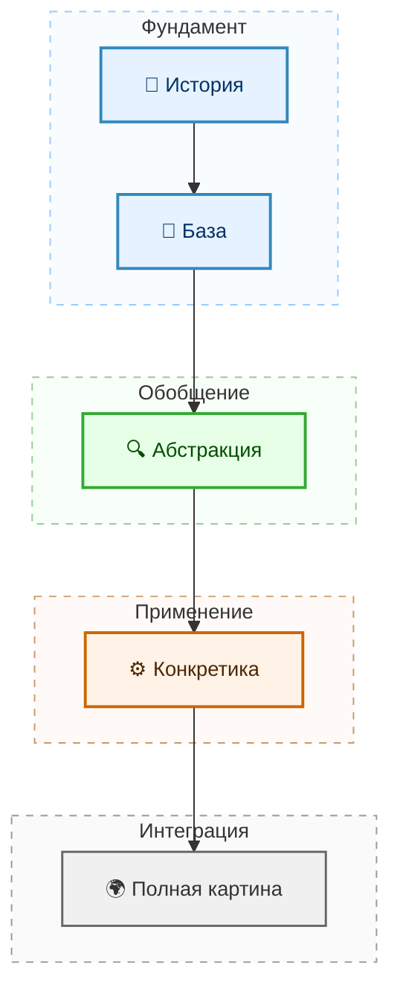

---
tags:
  - all
  - required
  - beginner
title: Архитектура знаний
description: "Предмет этой статьи - разъяснение того, как устроена система подачи информации проекта, о моём подходе объяснения и преподавания."
---

# Архитектура знаний

  ОБЯЗАТЕЛЬНО
  ДЛЯ НОВИЧКОВ

Всем

---

## Архитектура знаний

  
Внимание

  

  Предмет этой статьи - разъяснение того, как устроена система подачи информации проекта, о моём подходе объяснения и преподавания.

  

---

### Как устроена архитектура "Вселенной IT"

*"Вселенная IT"* является уникальным проектом, хоть порой кажется рядовым образовательным сайтом. По своей концепции, её выделяет несколько вещей - бесплатность, объём и содержимое.
Поскольку к объёму и бесплатности может быть минимум вопросов, рассмотрим самое *"вкусное"*.

У меня есть особый стиль обучения и донесения информации, который вырабатывался годами - при передаче знаний я словно *"строю дом"*, закладывая кирпичик за кирпичиком, начиная издалека, с основ и истории. Большинство людей не одобряют этот подход (и они глубоко ошибаются!), кто-то в шутку называет меня *"душнилой"*, но сейчас я расскажу о сути.

Мои наблюдения показывают, что люди, которые жили в период появления какого-то явления или технологии (например, первых языков программирования, зарождения политических движений, трендов или кризисов), показывают более высокий уровень знаний и пониманий, чем те, которые пришли к современному состоянию. Почему? Потому что когда что-то начинается, оно находится в своём базовом, начальном, зачаточном состоянии, с минимальным набором свойств и функций. К примеру, как первые социальные сети - простые сайты с HTML. А какие они теперь? Разница  в том, что первым исследователям нужно было заложить лёгкий фундамент понимания всего в пару абзацев, а с появлением каждой новой функции или нового свойства, к этим абзацам добавляются новые дополнения. Так информация плавно наращивается, не вызывает перегруза и выстраивает картину.

Люди же, которые сразу пришли в современное состояние, вынуждены видеть перед собой уже не абзац, а целую многотомную книгу, где всё перемешано, и нужно выстраивать цепочку и вникать, хотя времени на чтения этой книги уже нет! Старички изучали годами, а мы - днями, и именно поэтому мы страдаем. 

Представим, что вы хотите получить ответ на свой вопрос - *"Что такое SQL"*. Вы ожидаете получить ответ на вопрос сразу и коротко - *"язык запросов"*. Но знаете ли вы, что такое запрос, что такое база данных, и нужна ли вам эта информация?

Хорошо, разберём по полочкам.

1. Знаете ли вы контекст, зачем оно нужно? Если нет, то вас придётся погрузить, рассказав всё, что нужно для понимания баз данных - что такое данные, информация, структуры данных, что такое хранилище и ОЗУ, и так далее - зависит от того, насколько вы много знаете. Всегда есть какой-то пробел. А почему такой пробел существует? Потому что вы, скорее всего, приступали к изучению чего-то *"сразу"* и *"сейчас"*.

2. Знаете ли вы предысторию, предпосылки и решаемую проблему данной технологии? Если нет, то у вас возникнут вопросы о том, *"зачем"* нужна та или иная операция. Для понимания нужна история.

3. А нужна ли вам эта информация? Здесь ключевое, и зачастую обманчивое. Порой вы думаете как типичный менеджер - "плевать на контекст, давай сразу к делу". Это нормально, так как люди привыкли к тому, что получают желаемое быстро, отсюда и вечное стремление ускориться. Вы с неохотой смотрите многочасовые вебинары, читаете огромные статьи и слушаете "душных" преподавателей. Это связано с текущим образом жизни, ведь даже если видео в TikTok будет длиться больше 20 секунд, вам захочется перелистнуть и пойти дальше, потому что это "слишком долго". Но, даже если вы считаете, что информация вам нужна (более того, ваш мозг может отметать, как фильтр), то вы ошибаетесь, ведь вы ещё не знаете суть информации!

Как можно судить о том, нужна ли информация вам, если вы ещё не обладаете этой информацией? Представьте, что вам впервые вручили смартфон, ноутбук и игровую приставку, а вы, даже не вдаваясь в подробности, выкидываете их в мусорку, потому что "они вам не нужны". Ведь вы даже не знаете, что это!

Можно сказать, на все вышеперечисленные вопросы у вас будет ответ, скорее всего "давай быстрее, плевать на это". Но рано или поздно, вы столкнётесь, споткнётесь или ошибётесь именно из-за отсутствия знаний, потому что "прыгали".

Представьте, что вы взяли, и прочитали "Графа Монте-Кристо" за 5 минут, перепрыгивая, пропуская. Да, сюжет прост, но вспомните ли вы персонажей, их мотивацию и диалоги? А ведь они важны. Это лишь простая аналогия, но суть проста - контекст, история и необходимость всегда нужны.

Проект "Вселенная IT" подчеркивает мою идею, как раз основываясь на том, чтобы предоставить плавное погружение в отрасль, закладывая информацию кирпич за кирпичом. Здесь три ключевых слоя:
1. **История и предпосылки**.
2. **Сущность и структура**.
3. **Складывание паззла, осознание и практика**.

Каждый слой опирается на предыдущий, и пропуск первого слоя ломает концепцию, делая обучение хрупким, ведь знания будут поверхностными, не интегрированными в общую модель мира. Именно такие знания забываются или приводят к ошибочным суждениям, обобщениям и взглядам.

---

### История важна

Любое явление, технология и принцип всегда требуют **понимания**. А оно возникнет тогда, когда получим ответ на вопрос *"почему оно возникло?"*. Для этого нужна реконструкция условий, в которых явление стало возможным, целесообразным или неизбежным.

К сожалению, люди не обладают ни эмпатией (способностью *"ставить себя на место целевых субъектов"*), ни терпением, ни стремлением к пониманию чего-то нового. Современная потребительская модель окончательно уничтожила нас как полноценных развивающихся личностей, превратив в роботов, которые лишь бегут, торопятся и не вникают.

Я люблю историю, экономику, философию, психологию и юридическую логику - эти науки очень хорошо выстраивают картину происходящего - когда ты знаешь истинные предпосылки, выстраиваешь причинно-следственную связь, учитываешь политические и экономические факторы, размышляешь над смыслом, ищешь реального получателя выгоды - картина совсем меняется.

Если бы это понимание было у бизнесменов, они бы практически владели *"чит-кодом"*. Но они вынуждены бежать вперёд, и только вперёд, не тратя время на рефлексию и познание.

История представляет собой последовательность событий, решений и деяний, которые влекли за собой последствия, порождая цепочку, породившую текущую картину. Например, чтобы расследовать преступление, требуется выстроить полную картину - хронологию событий, наличие умысла, собрать все факты. А когда вы что-то изучаете, то как раз играете роль следователя, так что без этого никак.

---

### Фундамент

Человеческое мышление опирается на метафоры и аналогии, служат *"якорями"* для новых понятий. Зачастую, когда рассказываешь что-то, то "торопыги" перебивают и говорят *"да-да, как там"* (где *"там"* - аналогия). Это интуитивно, но ведет к заблуждениям.

Я работаю над тем, чтобы человек получал информацию *поэтапно*, *порционно*, и в дальнейшем мог в нужный момент эффективно использовать ассоциативное мышление, моментально *"вспомнив"* нужный фундаментальный факт. При этом, для суперподготовленных людей - материала много. И самое главное - охват как можно больший, чтобы вопросов не оставалось.

Архитектура знаний подразумевает, что должна быть *структура*, *последовательность* и *системность* информации. Обучающийся должен сначала понять, как работает HTTP, и лишь потом приступать к веб-разработке на HTML. Как можно делать сайт, не зная, как он работает?

Нужно погружаться максимально глубоко, но никак не ограничиваться знаниями обо всём как простые ассоциации с реальной жизнью.

Поэтому рассуждаем последовательно:
1. *История*.
2. *Железо и физические устройства*.
3. *Организация и цели. Общая схема*.
4. *Важные часто затрагиваемые темы, которые легко изучить*.
5. *Базовые абстракции и принципы*.
6. *Композиция абстракций и плавный переход к деталям*.
7. *Детализация и усложнение*.
8. *Инструменты и реализации*.
9. *Построение общей картины*. 

Немного условно, но смысл ясен - каждое новое понятие имеет точку опоры в уже усвоенном. Именно поэтому, чтобы не повторять некоторый базис в языках программирования, я выделил отдельный раздел *"Код и разработка"*. Чтобы человек не путал разметку и запросы с программированием, всё выделено в *"Данные и разметку"*. А чтобы незаинтересованным не стало скучно, ИИ, игры и отраслевые решения выделены в *"Спин-офф"*.

Такой концепцией пронизана вся *"Вселенная IT"*.

---

### Сопротивление немедленному результату

Сейчас весь мир, и в том числе образовательные платформы себя позиционируют с ориентиром на ощущение прогресса, мол, через 15 минут уже первая программа, через час - нейросеть, через день - уже Junior.

А потом удивляемся, почему рынок перенасыщен, а Junior-ы никому не нужны. Такой подход эффективен для мотивации в краткосрочной перспективе, но он формирует иллюзию компетентности.

Проблема в том, что образование таким образом адаптировалось к современному темпу жизни, и винить их в этом не нужно, однако проблема всё же есть.

Архитектура знаний во *"Вселенной IT"* не стремится к быстрому результату, а строит свою, независимую модель, которая требует времени и усилий.

Первые разделы могут показаться избыточными и будут вопросы вроде *"зачем изучать перфокарты, если их сегодня никто не использует?"*. Вы можете не видеть всю картину, и я не обязан вам объяснять, что это парадигма ввода данных, на которой построена логика, определяющая представление о пакетной обработке, о разделении программы и данных, небходимости предварительной подготовки задания. Вам и не нужно вникать в обоснование, ведь вы не согласующий, а лишь читатель.

Просто знакомьтесь, если знаете - отлично, а нет - *"поглощайте"*!. Медленное обучение является инвестицией в масштаб понимания и вашу *"качественность"* как эксперта.

Критику этого подхода я не принимаю. Она обоснована современными условиями, и исключительно субъективна. Это мой педагогический приём, метод проектирования образовательного продукта, позволяющий выявлять зависимости между темами, формировать последовательность изучения, оценивать интеграцию в существующие структуры и обнаруживание слепых зон.

В идеале, хотелось бы проводить:
- *историческую валидацию*;
- *структурную валидацию*;
- *прогностическую валидацию*.

Но времени катастрофически мало, поэтому - **стараюсь, как могу**. Есть ошибки, *знаю*.  Правлю, как могу, и буду стараться делать это на самом высшем уровне.

Технологии устаревают, инструменты меняются, языки приходят, уходят, но логика проектирования, понимание ограничений и умение реконструировать причинно-следственные связи - остаются.

Так что - поехали!

Теперь пора познакомиться с дорожной картой.

---
