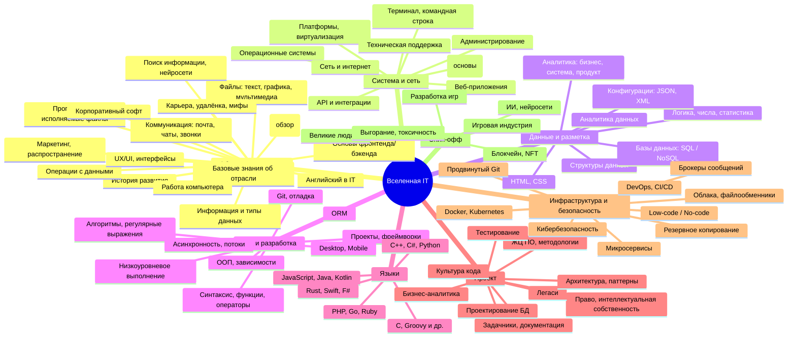
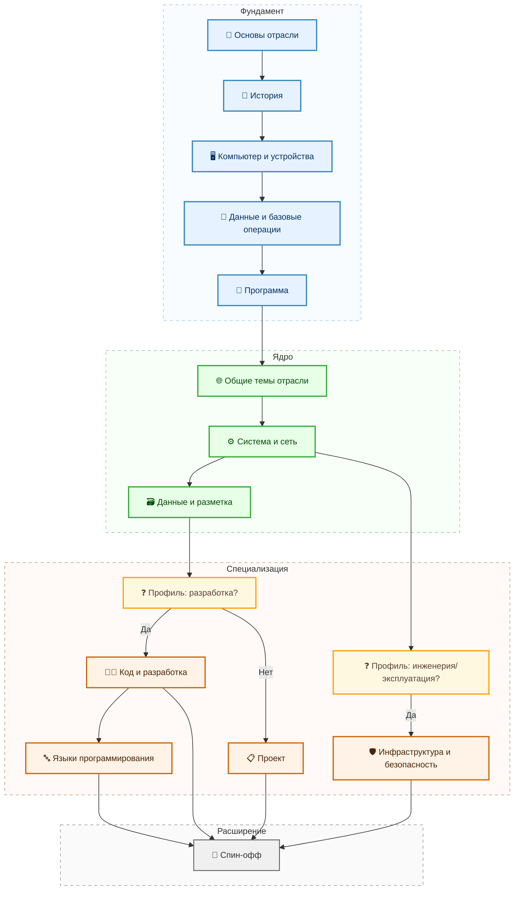

---
tags:
  - all
  - required
  - beginner
title: Дорожная карта изучения
description: "Краткий маршрут для новичка и ссылки на тематические подборки статей — удобнее, чем листать всю энциклопедию подряд."
---

import ExternalPlayEmbed from '@site/src/components/ExternalPlayEmbed';

# Дорожная карта изучения

  ОБЯЗАТЕЛЬНО
  ДЛЯ НОВИЧКОВ

Всем

  
Важно

  

  Тематические маршруты по статьям собраны на странице [Тематические подборки](/about/collections) и в блоке "С чего начать?" на [главной](/). Совсем с нуля — сначала [Основы компьютерной грамотности](/encyclopedia/1-basics/1-035-bazovaya-informatika/101). Эта статья даёт свой краткий список тем для старта. Чем чаще вы встречаете новые термины в контексте, тем легче мозгу к ним привыкать.

  

  
Профориентация по ходу чтения

  

  Если хотите не просто читать по порядку, а сразу видеть, что вам подходит, пройдите [Навигатор новичка и профилей](/lab/Планы%20развития/7):

  - ставьте оценки статьям;
  - получайте очки по направлениям;
  - рекомендации в реальном времени.

  

---

## Дорожная карта изучения

С чего начать? Мы выделим дорожную карту, и начнём с большой. Согласитесь, менеджерам, смежникам, маркетологам не так важно, как работает код - но им может быть интересно, как всё устроено! 

> **Дорожная карта (Планы развития)** представляет собой стратегический документ или визуальную схему, описывающую долгосрочный план развития продукта, проекта, технологии или организации. Она фиксирует ключевые цели, этапы реализации и ожидаемые результаты на определенном временном горизонте.

Важно понимать, что нельзя сразу бросаться в технологию. Кто-то много лет учится в университетах, чтобы изучить работу компьютера на низком уровне, а кто-то просто посмотрел видеокурсы по Python на YouTube, а потом они оба устраиваются на одинаковые должности, но первый имеет хороший багаж знаний, а второй лишь поверхностные фичи.

Если хотите добиться успеха, вам нужен профессионализм.

  
Запомните

  Ваша задача - изучить, понять и научиться, а не просто закрыть вопросы на собеседовании! Вы - не "вкатун", и не обманщик. Вы - хороший, подготовленный специалист, который разбирается в предмете, знает, как всё устроено. Потому что в вашем распоряжение действительно полный материал, позволяющий стать профессионалом.

Совсем с нуля, без опыта за ПК — начните с [Основы компьютерной грамотности](/encyclopedia/1-basics/1-035-bazovaya-informatika/101), затем вернитесь к этой карте.

Если вы проходите **школьный курс информатики** — готовый маршрут по типовым темам программы (без дублирования больших разделов): [Базовая информатика](/encyclopedia/1-basics/1-035-bazovaya-informatika/intro).

<ExternalPlayEmbed example="about/interactive-roadmap" title="Interactive Roadmap" minHeight={520} />

Для тех, кто впервые садится за ПК, старт — [Основы компьютерной грамотности](/encyclopedia/1-basics/1-035-bazovaya-informatika/101). Начальную базу нужно изучить всем — это общее направление. Затем обязательно всем нужно изучить систему, сеть и данные. А потом — уже по профилям.

Схематично, это выглядит так:

Поэтому мы разделим на несколько условных направлений:

---

### 1. Общее направление

Оно нужно для всех, включая менеджеров, администраторов, аналитиков, тестировщиков, разработчиков, так как включает следующее:
	- базовые знания об отрасли и обзор сферы;
	- история развития;
	- работа компьютера и его компонентов;
	- информация, понятие и типы данных;
	- базовые операции с данными, чтение/запись, ввод/вывод;
	- разбор ключевых программ для новичков и продвинутых;
	- советы для новичков и продвинутых;
	- работа с текстовыми, графическими, аудио/видео файлами;
	- основы компьютерных игр;
	- программа - понятие и основы работы;
	- исполняемые файлы и архивация, конфигурация;
	- поиск информации, технологии, поисковики и нейросети;
	- коммуникация - чаты, встречи, звонки, почта;
	- основы фронтенда и бэкенда;
	- обзор языков в IT;
	- интерфейс, UX/UI;
	- особенности карьеры в IT, разбор мифов, подготовка к [тестовым заданиям](/encyclopedia/1-basics/1-26-karera-v-it-i-mify/13);
	- удаленная работа;
	- маркетинг и распространение;
	- корпоративный софт - государство, бизнес;
	- английский язык в IT.

Это своего рода комплекс фундаментальных положений компьютерной и цифровой грамотности.

---

### 2. Система и сеть

После того, как мы разберемся в отрасли и компьютере, пора углубиться, и здесь самое важное будет в изучении сети, веб-приложений и интеграции. Аналитики, менеджеры, тестировщики, дизайнеры могут не углубляться в главы, посвященные терминалу и системному администрированию, однако всё остальное является важным и для вас. Администраторам, DevOps, безопасникам и разработчикам лучше изучить всё. Здесь изучается следующее:

	- операционная система - понятие, виды, особенности;
	- платформы - понятие, виды, а также виртуализация;
	- сеть и интернет, разбор сетевых технологий;
	- основы работы сайтов и веб-приложений;
	- терминал (консоль, командная строка);
	- системное администрирование;
	- техническая поддержка;
	- основы информационной безопасности;
	- интеграции и API.

---

### 3. Данные и разметка

Это очень важный раздел, посвящённый данным. Он нужен всем, и особенно разработчикам и аналитикам. Здесь мы изучим следующее:

	- продвинутые операции с данными;
	- структуры данных;
	- мыслительная база, включающая основы логики, чисел, вероятности и статистики;
	- конфигурации, XML, JSON и прочее;
	- основы баз данных и СУБД;
	- NoSQL;
	- SQL;
	- HTML;
	- CSS;
	- основы аналитики данных.

  
PostgreSQL — установите и потренируйтесь

  

  PostgreSQL — рекомендуемая СУБД для практики **всем** в IT — разработчикам, аналитикам, тестировщикам, инженерам, администраторам и архитекторам — независимо от языка программирования. Поставьте сервер локально (или поднимите в Docker), пройдите [Первые шаги с SQL](/encyclopedia/3-data-markup/3-07-sql/101), закрепите на [демобазе авиакомпании](/encyclopedia/3-data-markup/3-07-sql/891) и держите под рукой [практическую работу с PostgreSQL](/encyclopedia/3-data-markup/3-07-sql/888).

  Обзор инструментов — [СУБД в разделе Инструменты](/tools/data/1).

  

---

### 4. Код и разработка

Можно сказать, что программирование в целом очень тесно связано, независимо от языка, поэтому сначала нужно понять, как вообще работать с кодом. Глава по сути нужна имено разработчикам. Здесь изучается следующее:

	- алгоритмы, регулярные выражения;
	- код, операторы, функции, уровни языка;
	- выполнение кода на низком уровне;
	- проект и фреймворки;
	- асинхронность, процессы и потоки;
	- архитектура выполнения, оптимизация, производительность;
	- объектно-ориентированное программирование;
	- зависимости и управление ими;
	- ORM и работа с данными;
	- разработка десктопных приложений;
	- разработка мобильных приложений;
	- основы работы с Git;
	- разработка и отладка.

---

### 5. Языки

Учитывая, что разметка и базы данных нами уже будет изучена, остаются лишь языки программирования. Это полный разбор:

	- JavaScript;
	- Java;
	- Groovy;
	- Kotlin;
	- C++;
	- C#;
	- Python;
	- PHP;
	- Go;
	- Ruby;
	- Rust;
	- Swift;
	- F#, C и прочих языков.

---

### 6. Проект

Не всем нужен код, но всем нужно разбираться в проекте. Аналитикам, менеджерам, тестировщикам, разработчикам и вообще всем, кто задействован в проекте, придётся работать в команде. Поэтому здесь будет изучено следующее:

	- методология и жизненный цикл ПО;
	- базы знаний, задачники (таск-менеджеры);
	- документация и нормативка;
	- основы бизнеса;
	- интеллектуальные права;
	- аналитика, системный анализ;
	- тестирование и инструменты;
	- культура кода, соглашения;
	- легаси-код;
	- проектирование и архитектура;
	- паттерны, принципы и подходы проектирования;
	- проектирование баз данных.

На этапе проектирования БД и проверки данных в QA полезен локальный **PostgreSQL** — [Первые шаги с SQL](/encyclopedia/3-data-markup/3-07-sql/101), [SQL для тестировщика](/encyclopedia/7-project/7-05-testirovanie/129).

---

### 7. Инфраструктура и безопасность

Как можно понять, основы сетей, архитектуры и безопасности, которые нужны всем, изучены в начале, а теперь уже происходит полное погружение в эту часть. 
Здесь изучается следующее:

	- облачные технологии и файлообменники;
	- Low-code/No-code;
	- забота о коде, продвинутая работа с Git;
	- защита данных, резервное копирование;
	- DevOps, CI/CD;
	- микросервисы;
	- интеграция, коммуникация, брокеры сообщений;
	- контейнеризация и оркестрация, Docker, Kubernetes;
	- информационная и кибербезопасность.

---

### 8. Всё остальное

Это я объединил в томе "Спин-офф". Это то, что не пригодится всем, но может быть интересным для многих. Сюда включены:

	- великие люди в IT и их достижения;
	- токсичность, выгорание, усталость;
	- игровая индустрия;
	- разработка игр;
	- блокчейн, криптография, NFT;
	- ИИ и нейросети;
	- отраслевое ПО;
	- компьютерная графика;
	- медиа-контент и стриминг.

---

## Перед первыми откликами
Этап **после** базы из раздела "Основы" (1.01–1.12), знакомства с [ролями и мифами](/encyclopedia/1-basics/1-26-karera-v-it-i-mify/intro) и **начала** профильной ветки (код, данные, QA, аналитика — по выбранной специализации). Цель — показать работодателю **тип задач**, который встретится на отборе.

---

### Порядок действий

1. **Выбрать роль** — [специализации](/encyclopedia/1-basics/1-26-karera-v-it-i-mify/2), [грейд](/encyclopedia/1-basics/1-26-karera-v-it-i-mify/3) и формат работы ([аутсорс / продукт / госсектор](/encyclopedia/1-basics/1-26-karera-v-it-i-mify/61)).
2. **Собрать витрину** — GitHub, резюме под ATS, [портфолио](/encyclopedia/1-basics/1-26-karera-v-it-i-mify/7).
3. **Сделать 2–3 учебных проекта** по *типу* целевых вакансий (свой код, свой README). Ориентиры по ролям — в [шпаргалке по тестовому](/encyclopedia/1-basics/1-26-karera-v-it-i-mify/131#подготовка-до-отклика).
4. **Повторить базу под интервью** — [техническое собеседование](/encyclopedia/1-basics/1-26-karera-v-it-i-mify/4), Git, HTTP, SQL; для разработки — задачи на логику, без заучивания всего стека.
5. **Разобрать формат тестового** — [статья 13](/encyclopedia/1-basics/1-26-karera-v-it-i-mify/13), перед каждой сдачей — [чек-лист 131](/encyclopedia/1-basics/1-26-karera-v-it-i-mify/131).
6. **Откликаться выборочно** — резюме под текст вакансии; на [HR-этапе](/encyclopedia/1-basics/1-26-karera-v-it-i-mify/6) и [собеседовании](/encyclopedia/1-basics/1-26-karera-v-it-i-mify/5) задавать вопросы о команде и задачах.

Ориентир по срокам

  

  На пункты 2–4 у многих уходит **2–4 месяца** параллельно с учёбой.

  Стажировка или первый коммерческий опыт часто сокращают объём take-home на отборе — их тоже стоит искать в [карьерном плане](/encyclopedia/1-basics/1-26-karera-v-it-i-mify/911).

  

Диагностика "готов ли я к коду": [тест на программирование](./2). Компьютерная грамотность: [тест 211](./211).

---

## Практика на Microsoft Learn

После прохождения теории по разделам 1–8 можно закрепить навыки на официальных модулях Microsoft (Azure, C#, ИИ, Power BI, безопасность). Сводная таблица "глава энциклопедии → схема Learn": [Внешние треки Microsoft Learn](/encyclopedia/1-basics/1-03-dorozhnaya-karta-izucheniya/214). Интерактивный каталог: [навигатор в разделе Инструменты](/tools/documentation/6).

---
