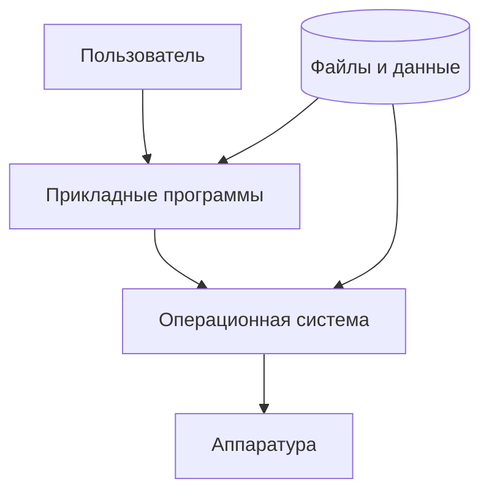
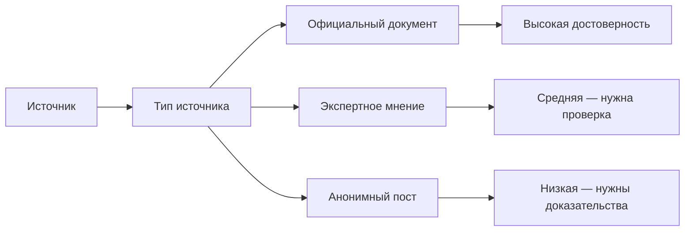
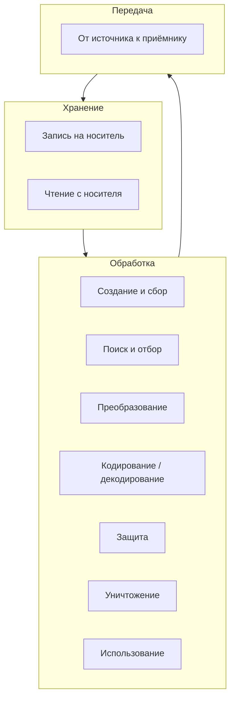
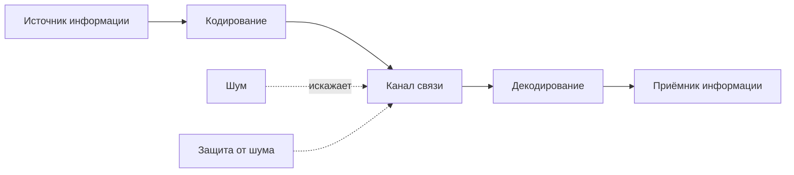
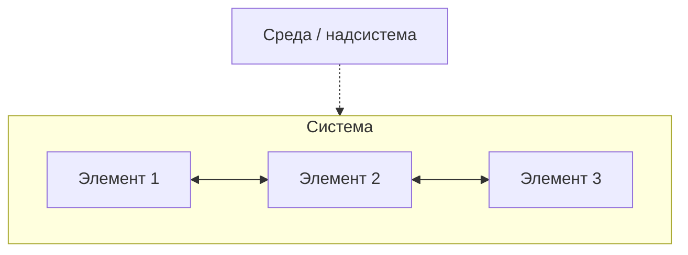
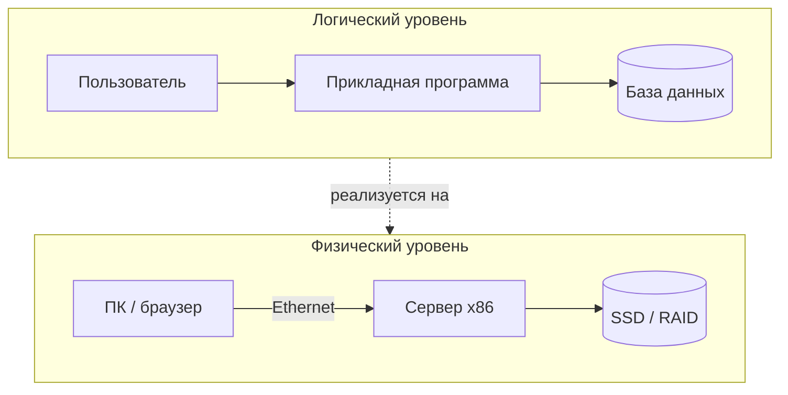
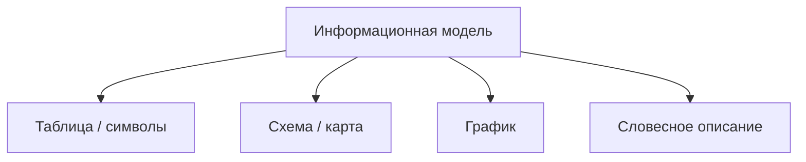
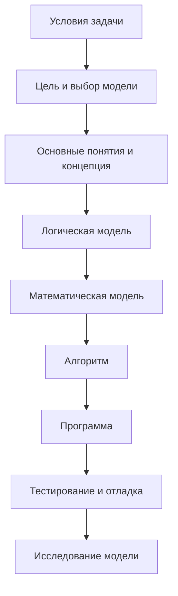
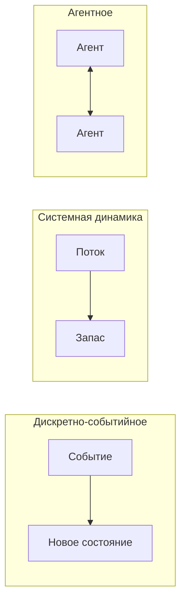
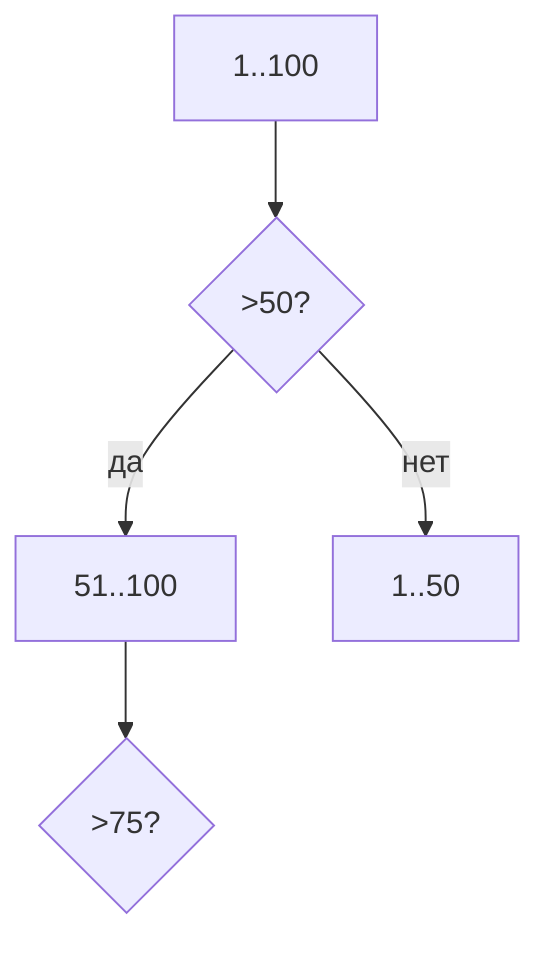

---
tags:
  - all
  - required
  - beginner
  - inprogress
title: Базовая информатика
description: >-
  Фундамент computer science: информация и данные, свойства и процессы,
  информационные системы и моделирование — с картой глав курса.
related:
  - title: "Основы компьютерной грамотности"
    doc: encyclopedia/1-basics/1-035-bazovaya-informatika/101
  - title: "Терминология новичка"
    doc: encyclopedia/1-basics/1-035-bazovaya-informatika/102
  - title: "Базовая информатика — о разделе"
    doc: encyclopedia/1-basics/1-035-bazovaya-informatika/intro
  - title: "Дорожная карта изучения"
    doc: encyclopedia/1-basics/1-03-dorozhnaya-karta-izucheniya/1
  - title: "Данные и информация — о разделе"
    doc: encyclopedia/1-basics/1-09-dannye-i-informatsiya/intro
  - title: "Как работает компьютер — о разделе"
    doc: encyclopedia/1-basics/1-08-kak-rabotaet-kompyuter/intro
---

import ExternalPlayEmbed from '@site/src/components/ExternalPlayEmbed';


# Базовая информатика

<div class="article-tags">
  <span class="tag tag-required">ОБЯЗАТЕЛЬНО</span>
  <span class="tag tag-beginner">ДЛЯ НОВИЧКОВ</span>
  <span class="tag tag-inprogress">В РАЗРАБОТКЕ</span>
</div>

<span class="complexity-badge">Всем</span>

Прежде, чем приступить к изучению сферы информационных технологий и начать изучать программирование, нужно немного вспомнить школьную программу.

Слышали ли вы термин **Computer Science**? Буквально, это "компьютерная наука", которую у нас можно назвать как раз информатикой. Её в школах, колледжах, университетах и изучают - это основные концепции о том, что такое информация и данные, как они измеряются, преобразуются и встраиваются в вычислительные системы. Информатика - это научный фундамент, на котором строятся кодирование, архитектура машин, алгоритмы и сети.

Computer Science (компьютерные науки) — это обширная область знаний, которая изучает теоретические основы вычислений, алгоритмы, методы обработки, хранения и передачи информации с помощью вычислительной техники. Говоря простыми словами, это наука о том, как устроены компьютеры и программы изнутри, и как эффективно решать сложные задачи с их помощью. В русском языке наиболее близким аналогом является термин информатика, однако за рубежом Computer Science делает гораздо больший упор на фундаментальную математику, логику и теорию вычислений, чем на простое пользовательское владение технологиями. Всю компьютерную науку можно разделить на несколько фундаментальных и практических блоков:
- алгоритмы и структуры данных (это у нас раскрывается очень большими разделами энциклопедии);
- теория вычислений (очень смежная с математикой, но именно формирует мышление);
- архитектура компьютеров (изучение аппаратной части, процессоров, памяти);
- языки программирования и компиляторы;
- иногда искусственный интеллект и машинное обучение, но это более современная сфера;
- в профильных частях - базы данных и операционные системы.

Писать простые сайты или мобильные приложения можно и без глубокого знания теории. Однако знание базы Computer Science кардинально меняет уровень инженера - учит оптимизировать код, создавать новые архитектурные решения и закладывает фундаментальные математические принципы. Если вы хотите углубиться в устройство IT-индустрии, то вам как раз и нет нужды знать больше об информатике - наверняка вы уже более продвинут, чем кажется.

Желаете проверить? Давайте изучать.

Определения терминов собраны в [Терминологии новичка](./102). 

Практика работы за компьютером — в [Основах компьютерной грамотности](./101). 

Как байты связаны с железом — в [Данные и информация](/encyclopedia/1-basics/1-09-dannye-i-informatsiya/intro) и [Как работает компьютер](../1-08-kak-rabotaet-kompyuter/intro).

Давайте приступим к изучению материала так, чтобы немного повторить школьный материал.

---

## Ключевые понятия

> **Базовая информатика** — как информация становится данными на компьютере, как устроены железо, программы, сеть и правила безопасной работы.

Множество понятий тянут за собой целые пласты важных ньюансов, поэтому в статьях по информатике вы будете встречать ссылки на разделы по теме.

| Понятие | Суть | Глава курса |
|---------|------|-------------|
| **Данные и кодирование** | Текст, числа, звук, картинка — всё хранится как байты по правилам | [Данные и информация](/encyclopedia/1-basics/1-09-dannye-i-informatsiya/intro), [архивы](/encyclopedia/1-basics/1-20-ispolnyaemye-fayly-i-arhivy/2) |
| **Вычислительная техника** | [Центральный процессор (CPU)](/encyclopedia/1-basics/1-08-kak-rabotaet-kompyuter/3), [оперативная память (ОЗУ)](/encyclopedia/1-basics/1-08-kak-rabotaet-kompyuter/3), накопитель, периферия — роли в системе | [Как работает компьютер](/encyclopedia/1-basics/1-08-kak-rabotaet-kompyuter/intro) |
| **Алгоритм и программа** | План задачи → запись на языке → исполнение [операционной системой (ОС)](/encyclopedia/2-system-network/2-01-operatsionnaya-sistema/intro) | [Алгоритмы, языки и программирование](/encyclopedia/1-basics/1-035-bazovaya-informatika/4) |
| **ОС и файлы** | [ОС](/encyclopedia/2-system-network/2-01-operatsionnaya-sistema/intro) — посредник между пользователем, [программами](/encyclopedia/1-basics/1-19-programma/intro) и железом | [ОС, файловые системы и служебные программы](/encyclopedia/1-basics/1-035-bazovaya-informatika/5#программное-обеспечение--структура-и-термины) |
| **Интернет и сервисы** | Сеть, [протоколы](/encyclopedia/2-system-network/2-03-set-i-internet/1), [DNS](/encyclopedia/2-system-network/2-03-set-i-internet/611) (система доменных имён), веб, почта, поиск | [Интернет и сетевые сервисы](/encyclopedia/1-basics/1-035-bazovaya-informatika/6) |
| **Право и защита** | Авторское право на [ПО](/encyclopedia/1-basics/1-19-programma/intro), лицензии, [персональные данные](/encyclopedia/2-system-network/2-08-osnovy-informatsionnoy-bezopasnosti/1) | [Право и защита информации в РФ](/encyclopedia/1-basics/1-035-bazovaya-informatika/7) |
| **Рабочее место** | Эргономика, перерывы, правила класса | [Организация рабочего места](/encyclopedia/1-basics/1-035-bazovaya-informatika/8) |
| **Организация и уровни** | Аппаратура + ПО, фон Нейман, уровни от транзистора до Python | [Организация, архитектура и уровни](/encyclopedia/1-basics/1-035-bazovaya-informatika/10#архитектура-компьютера--уровни-05) |

Подробнее по темам — [данные](/encyclopedia/1-basics/1-09-dannye-i-informatsiya/1), [железо](/encyclopedia/1-basics/1-08-kak-rabotaet-kompyuter/1), [программы](/encyclopedia/1-basics/1-19-programma/1), [сеть](/encyclopedia/2-system-network/2-03-set-i-internet/intro).

---

## Вычислительная система

Любая вычислительная система сочетает **аппаратуру**, **программы**, **данные** и **пользователя**. Вычислительная система — это взаимосвязанная совокупность аппаратных средств и программного обеспечения, предназначенная для совместного решения сложных задач, обработки больших массивов данных и управления процессами. Главное отличие вычислительной системы от обычного одиночного компьютера заключается в совместном использовании вычислительных ресурсов (процессоров, памяти, дисков) для достижения высокой производительности, надежности и отказоустойчивости.

Удобная схема:

| Составляющая | Что входит | Глава курса |
|--------------|------------|-------------|
| **Аппаратное обеспечение (АО)** | CPU, ОЗУ, накопители, плата, периферия, сеть | [Как работает компьютер](../1-08-kak-rabotaet-kompyuter/intro) |
| **Программное обеспечение (ПО)** | ОС, драйверы, прикладные и служебные программы | [5](./5), [4](./4) |
| **Данные** | Закодированная информация в файлах и потоках | [Данные и информация](/encyclopedia/1-basics/1-09-dannye-i-informatsiya/intro) |
| **Пользователь** | Задаёт смысл и получает результат | [101](./101) |

Всё это в комплексе и формирует основной набор сущностей. Всегда есть какая-то информация, подлежащая сбору, обработке или хранению, есть какое-то устройство, которое будет выполнять операции, какие-то данные, в которых структурируется информация, и собственно субъект, пользователь, который будет работать со всем этим.



Современные компьютеры опираются на **архитектуру хранимой программы** (модель фон Неймана): команды и данные лежат в общей памяти, процессор по очереди читает инструкции и записывает результаты обратно. Благодаря этому одна и та же машина выполняет разные программы без перепайки «железа». Узкое место часто не в скорости вычислений, а в доставке данных между процессором и памятью. Эта концепция была сформулирована математиком Джоном фон Нейманом в 1945 году, в честь него и названа. Подавляющее большинство современных компьютеров, смартфонов и серверов до сих пор работают именно по этому принципу. Любой компьютер фоннеймановского типа состоит из четырех основных блоков:
- Арифметико-логическое устройство (АЛУ). Выполняет математические операции и логические сравнения.
- Устройство управления (УУ). Руководит процессом — расшифровывает команды из памяти и координирует работу всех узлов (АЛУ и УУ вместе образуют процессор).
- Основная память (ОЗУ). Единый массив ячеек, где одновременно находятся и выполняемый код, и числа для расчетов.
- Устройства ввода и вывода. Механизмы для взаимодействия с внешним миром (клавиатура, монитор, диски).

Компьютер не отличает команду программы от числа. Все это — просто набор байтов. Программа может изменять саму себя во время работы. Память же состоит из пронумерованных ячеек, а процессор может мгновенно обратиться к любой ячейке по её адресу, выполняя команды строго одну за другой, по цепочке, пока не встретит команду перехода (например, цикл или условие).

Самая большая проблема этой архитектуры — Бутылочное горлышко фон Неймана (Von Neumann bottleneck). Поскольку процессор и память разделены, данные вынуждены постоянно перемещаться между ними по системной шине. Скорость современных процессоров огромна, а скорость памяти растет медленнее. В итоге процессор часто простаивает в ожидании, пока данные скопируются из памяти или запишутся обратно. Для решения этой проблемы инженеры придумали быструю кэш-память (L1, L2, L3) внутри самого процессора.

Подробный разбор архитектуры, уровней абстракции (от транзистора до языка программирования) и организации памяти — в главах [10](./10) и [11](./11).

---

## Информатика как наука

Что такое информатика?

> **Информатика** — наука об общих свойствах информации, закономерностях и способах её **создания, хранения, поиска, преобразования и использования** с помощью компьютерных систем.

Можно сказать, что это наука в том же смысле, что физика или математика: она описывает закономерности, а не строит продукты. Разработка ПО — прикладное ремесло; информатика даёт язык и модели, на которых это ремесло опирается.

Информатика изучает:
- саму природу информации, как её можно измерить, сжать, обработать;
- алгоритмы, формулы и доказательства;
- теории вычислений;
- и да, языки программирования, но с точки зрения их внутреннего устройства, как лингвисты изучают грамматику языка, не думая о том, как и где эту грамматику применять.

В академической и прикладной программе информатика пересекается с соседними дисциплинами — [данные](/encyclopedia/1-basics/1-09-dannye-i-informatsiya/intro), [алгоритмы](/encyclopedia/4-code-dev/4-01-algoritmy/intro), [сети](/encyclopedia/2-system-network/2-03-set-i-internet/intro). У каждой дисциплины свой фокус — см. таблицу ниже.

| Дисциплина | Что изучает | Пример вопроса |
|------------|-------------|----------------|
| **Теория информации** | Математические модели передачи и измерения информации (К. Шеннон, Р. Хартли) | Сколько бит в сообщении "выпала 3 на кубике"? |
| **Кибернетика** | Связь и управление в машинах, живых системах, обществе | Как термостат поддерживает температуру? |
| **Семиотика** | Знаки и знаковые системы | Почему красный свет — "стоп"? |
| **Информатика** | Практика работы с данными на компьютере — кодирование, ПО, сети | Как сохранить фото в JPEG и отправить по почте? |
| **Инженерная информатика** | Проектирование вычислительных систем | Как выбрать SSD для ноутбука? |
| **Прикладная информатика** | Использование ИТ в бизнесе, медицине, образовании | Как электронный журнал хранит оценки? |

Для этой главы достаточно помнить, что информатика связывает **смысл для человека** с **правилами записи на машине**.

В науке часто встречаются слова "предмет", "объект", "субъект". Субъект — это тот, кто действует, мыслит или познает мир (источник активности), а объект — это то, на что эта активность направлена (предмет воздействия). Ученый (субъект) исследует структуру атома (объект). Ученый — познает, атом — познается. Предмет — это конкретная грань, свойство или сторона объекта, которую прямо сейчас изучает, изменяет или использует субъект. Если объект — это вся вещь или явление целиком, то предмет — это лишь конкретная точка внимания субъекта в этом объекте. Объект существует независимо от исследователя. Он шире, материальнее и включает в себя множество разных качеств. Предмет создается самим исследователем. Он уже, абстрактнее и жестко ограничен границами конкретной задачи. Один и тот же объект можно изучать через десятки разных предметов.

Если вернуться к теме Computer Science:
- Субъект это программист или аналитик.
- Объект это база данных крупного банка.
- Предмет это скорость выполнения поисковых запросов (или защита данных от взлома).

Объектом науки информатики является то, на что направлено внимание ученых и инженеров. Область реальности, которую исследует информатика. Это информационные процессы (сбор, передача, хранение), данные и информация (в любых видах), а также вычислительные системы (ЭВМ, сети, робототехника) и программные комплексы.

Предмет же создаётся исследователем, это специфические свойства, законы и методы, которые выделяют в объекте для изучения - методы и алгоритмы автоматизации, закономерности обработки и передачи данных, принципы оптимизации вычислительных систем, способы защиты информации от угроз.

| | Определение | Примеры |
|---|-------------|---------|
| **Объект** | То, что изучают | Информационные процессы, данные, программы, сети |
| **Предмет** | С какой стороны изучают | Закономерности, методы, средства автоматизации |

Теория (свойства информации, энтропия, модели) проверяется на практике запуском программы, чтением файла, передачей пакета по сети.

Слово **informatics** закрепилось в Европе во второй половине XX века. В СССР и России с середины 1980-х ввели курс основ информатики и вычислительной техники (ОИВТ). Сегодня программы шире — [Python](/encyclopedia/5-languages/5-02-python/intro), [базы данных](/encyclopedia/3-data-markup/3-07-sql/intro), [информационная безопасность](/encyclopedia/2-system-network/2-08-osnovy-informatsionnoy-bezopasnosti/intro) — но фундаментальные понятия (данные, алгоритм, сеть) те же.

Подробнее об эволюции вычислительной техники — [Немного о прошлом](/encyclopedia/1-basics/1-07-nemnogo-o-proshlom/intro).

---

## Виды информации

Какие бывают виды информации?

В теории информации информатики информацию классифицируют по **нескольким независимым признакам**. Один и тот же объект можно описать сразу в нескольких классификациях: например, новостной ролик — это **видеоинформация** (форма), **визуальная и аудиальная** (восприятие), **массовая** (назначение) и **истинная или ложная** (соответствие фактам).

Подробный разбор кодирования и цифровых форматов — в [Виды информации](/encyclopedia/1-basics/1-09-dannye-i-informatsiya/2).

---

### По способу восприятия

Способ восприятия информации — это канал, через который органы чувств человека получают сигналы из внешнего мира, а мозг преобразует их в понятные образы и ощущения. В отличие от компьютера, который воспринимает только биты, человек воспринимает мир мультисенсорно - глазами, ушами, кожей, носом, языком. Очень часто люди путают формат записи и способ восприятия. Например:
- Текст на бумаге по формату записи — это текстовая информация. Но человек воспринимает её визуально (глазами). Если этот же текст перевести в шрифт Брайля, формат останется текстовым, но способ восприятия станет тактильным. Если прочитать его вслух — способ станет аудиальным.
- Видео на экране — это мультимедийный цифровой формат, но человек воспринимает его одновременно по двум каналам, визуальному и аудиальному.

Какой орган чувств получает сигнал у человека:

| Вид | Определение | Примеры | В цифровой среде |
|-----|-------------|---------|------------------|
| **Визуальная** | Сведения, воспринимаемые **зрением** — форма, цвет, движение, свет | Фото, картина, схема, экран смартфона | PNG, JPEG, SVG, видеокадр |
| **Аудиальная** (слуховая) | Сведения, воспринимаемые **слухом** — речь, музыка, шум | Подкаст, звонок, сирена | WAV, MP3, AAC |
| **Вкусовая** (гастрономическая) | Сведения, воспринимаемые **вкусовыми рецепторами** языка | Сладкий, солёный, горький, умами | Пока нет общепринятых форматов |
| **Обонятельная** | Сведения, воспринимаемые **обонянием** — запахи и ароматы | Запах дыма, парфюм, еда | Экспериментальные «ароматические» устройства |
| **Тактильная** | Сведения, воспринимаемые **кожей** — давление, температура, текстура | Ткань, клавиша, вибрация телефона | Вибромотор, геймпад с обратной связью |
| **Вестибулярная** | Сведения о **положении тела, ускорении и равновесии**, воспринимаемые вестибулярным аппаратом внутреннего уха | Качка в автобусе, вращение в VR | Имитируется в симуляторах (наклон кресла, движение в VR) |
| **Мышечная** (кинестетическая, проприоцептивная) | Сведения о **положении и напряжении мышц и суставов** — «где находится рука», «насколько сильно нажато» | Печать вслепую, жест с геймпадом, сила на руле | Force-feedback, трекеры движения |

Для **визуальной, аудиальной, тактильной, вестибулярной и мышечной** информации в IT есть устройства ввода-вывода (монитор, динамик, геймпад, VR-шлем). **Вкусовая и обонятельная** в повседневных компьютерах почти не кодируются — в теории их перечисляют как виды восприятия, но не как стандартные форматы файлов.

---

### По назначению (доступу)

Наверняка вы встречали такие термины - "массовая информация", "секретная информация" или "личная информация", и понимаете, что отличаются они именно доступом.

Кто имеет право получать сведения:

| Вид | Определение | Примеры |
|-----|-------------|---------|
| **Массовая** | Доступна **широкому кругу людей** без специального допуска | Новости на сайте, расписание автобусов, энциклопедия |
| **Специальная** | Предназначена для **специалистов** определённой области; без подготовки смысл трудно понять | Медицинская карта в терминах врача, чертёж инженера, исходный код программы |
| **Секретная** | Доступ **ограничен законом** — государственная, коммерческая или служебная тайна | Документы с грифом «секретно», коммерческая тайна компании |
| **Личная** | Относится к **конкретному человеку** и затрагивает его частную жизнь | Дневник, переписка, [персональные данные](/encyclopedia/2-system-network/2-08-osnovy-informatsionnoy-bezopasnosti/1) (ФИО, телефон, фото) |

Один документ может быть одновременно **специальной** (для врача) и **личной** (о пациенте) информацией. Правовые режимы — в [главе 7](./7).

---

### По форме представления

Компьютеру на самом низком уровне (в памяти и процессоре) абсолютно всё равно, какой это вид информации. Для него видео, текст и звук — это просто гигантские цепочки из 0 и 1. Разница лишь в том, какой программе передаются эти байты и какой алгоритм их расшифровывает.

Как сведения **записаны или закодированы** — независимо от того, каким органом чувств мы их потом воспримем:

| Вид | Определение | Примеры носителей | Цифровые форматы | Как кодируется (кратко) |
|-----|-------------|-------------------|------------------|-------------------------|
| **Текстовая** | Последовательность **знаков** (букв, символов) естественного или формального языка | Книга, SMS, статья | `.txt`, HTML, DOCX | Таблица символов → байты ([UTF-8](/encyclopedia/1-basics/1-15-tekst/1)) |
| **Числовая** | Сведения в виде **чисел** — целых, дробных, дат, измерений | Счёт, таблица, показания датчика | CSV, ячейки Excel, JSON | Двоичное или десятичное представление |
| **Графическая** (изобразительная) | **Изображение** — распределение цвета и яркости в пространстве | Рисунок, фото, схема | PNG, JPEG, SVG | Матрица пикселей или векторные кривые |
| **Звуковая** | **Звуковой сигнал** во времени — речь, музыка, шум | Запись на диктофон, мелодия | WAV, MP3, AAC | Дискретизация амплитуды во времени |
| **Видеоинформация** | **Последовательность кадров** (графика) с **звуковым** сопровождением | Кино, ролик, трансляция | MP4, WebM | Кадры + аудиодорожка, синхронизированные по времени |

**Текстовая** и **числовая** информация легко обрабатывается программами (поиск, расчёты). **Графическая, звуковая и видео** — объёмнее, но ближе к естественному восприятию человека.

Переход от аналогового сигнала (непрерывная волна звука) к цифре называют **дискретизацией** — разбиением на отдельные отсчёты и присвоением каждому кода. Подробно — [Виды информации](/encyclopedia/1-basics/1-09-dannye-i-informatsiya/2).

---

### По истинности

Истинность информации — это её свойство соответствовать реальному положению дел, фактам и объективной действительности. Если информация отражает мир таким, какой он есть на самом деле, она является истинной. Если она искажает реальность, содержит ошибки или вымысел — она является ложной. В информатике и логике истинность часто принимает всего два значения: «Да» (Истина / True / 1) или «Нет» (Ложь / False / 0). В реальной жизни все немного сложнее.

Соответствует ли сообщение **действительности**:

| Вид | Определение | Примеры |
|-----|-------------|---------|
| **Истинная** (достоверная) | Сообщение **соответствует фактам** и может быть проверено | Показания исправного термометра; официальное расписание поездов |
| **Ложная** (недостоверная) | Сообщение **не соответствует фактам** — ошибка, вымысел, умышленное искажение | Фейковая новость; слух «завтра отменят уроки» без объявления |

Ложная информация редко бывает случайной. В зависимости от причин её появления, её делят на три группы:
- Дезинформация. Намеренное, осознанное искажение фактов с целью ввести кого-то в заблуждение (например, фейковые новости).
- Заблуждение. Искренняя вера человека в то, что ложная информация является правдой (например, когда-то люди искренне считали, что Земля плоская).
- Искажение (шум). Случайные ошибки, возникшие при передаче данных из-за помех в каналах связи или опечаток человека.

**Истинность** — отдельный признак от **полноты** и **актуальности**: сообщение может быть правдивым, но неполным («идёт дождь» — верно, но без указания города) или устаревшим. Свойства информации подробнее — [ниже](#свойства-информации).

Достоверность - это степень нашей уверенности в истинности данных. Если информация получена из надежного, проверенного источника (например, официальный документ или научное исследование), мы считаем её достоверной.

Актуальность - это новизна и применимость информации на текущий момент. Информация может быть истинной, но бесполезной, если она устарела. Пример: «Доллар стоит 30 рублей» — это истинное утверждение, но для 2026 года оно неактуально.

Полнота - это целостность информации, ведь если из истинной информации вырезать важный кусок, она может превратиться в ложь. Пример: Фраза «Этот человек устроил аварию» — истинна, но без дополнения «...пытаясь уйти от лобового столкновения с нарушителем» она искажает суть ситуации.

В Computer Science истинность проверяется с помощью логических выражений. Компьютер оценивает условия на основе жестких правил:
- Выражение `5 > 3` — возвращает значение Истина (`True`).
- Выражение `2 * 2 == 5` — возвращает значение Ложь (`False`).

---

### Аналоговая и цифровая информация

Аналоговая и цифровая информация — это два разных способа представления, передачи и хранения данных, которые отличаются тем, как кодируется физический сигнал. Главное отличие заключается в непрерывности: аналоговая информация непрерывна, а цифровая — прерывиста (дискретна).

Аналоговая информация — это данные, представленные в виде физических величин, которые меняются непрерывно и могут принимать любые бесконечные значения в заданном диапазоне. Вся окружающая нас природа аналогова. Наши органы чувств воспринимают мир именно в таком виде. Сигнал в точности повторяет (аналогичен) первоисточнику. Например, на виниловой пластинке звуковая волна физически «вырезана» в виде извилистой дорожки. Игла идет по ней, в точности повторяя все изгибы звука.

Цифровая информация — это данные, представленные в виде дискретных (изолированных) числовых значений, чаще всего в виде двоичного кода (нулей и единиц). Чтобы превратить аналоговый мир в цифровой, компьютер делает «снимки» сигнала через равные промежутки времени (это называется дискретизацией) и округляет их до ближайших чисел (это называется квантованием). Компьютер не записывает плавную волну звука. Он измеряет её громкость, например, 44 100 раз в секунду и записывает эти измерения в виде цепочки чисел.

Краткое сравнение — в таблице ниже; полный разбор **дискретного представления**, **дискретизации** и **сигналов** — в [отдельном разделе](#аналоговое-и-дискретное-представление-информации).

| | Аналоговая | Цифровая (дискретная) |
|---|------------|------------------------|
| **Суть** | Непрерывное изменение величины | Отдельные значения (отсчёты, коды) |
| **Пример** | Пластинка, магнитофонная лента | MP3-файл, JPEG |
| **Копирование** | Каждая копия чуть хуже оригинала | Копия побитово идентична |
| **Обработка** | Сложно без потерь | Легко фильтровать, сжимать, передавать |

Цифровая запись удобнее для компьютера, потому что процессор оперирует **дискретными** [битами](/encyclopedia/1-basics/1-09-dannye-i-informatsiya/2).

---

### Смешанные виды

Реальные объекты часто содержат несколько видов сразу:

| Объект | Виды информации внутри |
|--------|------------------------|
| Веб-страница | Текст, графика, возможно видео и звук |
| Презентация PowerPoint | Текст, изображения, анимация, встроенное видео |
| PDF-документ | Текст, векторная и растровая графика |
| Мессенджер | Текст, голосовые, фото, стикеры (графика) |

В современной ИТ-индустрии для таких объектов есть профессиональный термин — мультимедиа (multimedia) или комбинированные форматы данных. Почти любое приложение сегодня — это контейнер для разных видов информации. Для пользователя все эти объекты выглядят как единое целое благодаря интеграции. Программы-вьюеры (браузер, Telegram, Acrobat Reader) берут разные потоки данных (нули и единицы) и синхронно собирают их на экране компьютера в один смешанный объект.

---

## Свойства информации

Какие бывают свойства информации?

**Свойства информации** — это качественные характеристики, которые определяют степень полезности информации для человека или компьютерной системы, а также её пригодность для принятия правильных решений. Информация не существует сама по себе; она всегда создается, передается и используется. То, насколько успешно её можно применить, зависит от её ключевых свойств.

В теории информации выделяют **семь основных свойств**:

| Свойство | Определение | Пример | Антипример |
|----------|-------------|--------|------------|
| **Объективность** | Сведения **не зависят от личного мнения**; их можно проверить измерением, документом или наблюдением | Термометр показал **+23 °C** | «На улице тепло» — ощущение без числа |
| **Актуальность** | Информация **соответствует моменту времени** и задаче; не устарела | Курс доллара **на сегодня** для обмена валюты | Расписание **прошлого** семестра |
| **Полнота** | В сообщении есть **все нужные сведения** для понимания и решения задачи | Адрес: город, улица, дом, квартира — для доставки | Адрес без номера квартиры — курьер не доставит |
| **Достоверность** | Сведения **соответствуют действительности**; нет ошибки и умышленного обмана | Показания **исправного** датчика | Фейковая новость с чужим фото |
| **Полезность** (ценность) | Информация **помогает достичь цели** — принять решение, выполнить действие | Отчёт о продажах для директора | Случайные цифры без контекста |
| **Понятность** | Получатель **понимает смысл** — знает язык, термины, контекст | Инструкция на **родном** языке | Техдокументация только на японском, если вы его не знаете |
| **Дискретность** | Информация представлена **отдельными конечными элементами** (символами, числами, отсчётами) | Текст из букв; цифровое фото из пикселей | Аналоговая запись на магнитной ленте без оцифровки |

Самая ценная для решений информация — **объективная, достоверная, полная, актуальная и понятная**. Субъективное сообщение («тепло») стоит сопоставлять с **измерением прибором** («+23 °C»).

---

### Объективность и субъективность

Объективность и субъективность — это два противоположных свойства информации, которые определяют, зависит ли она от человеческого фактора (мнения, чувств, желаний) или отражает реальность сама по себе. Информация является объективной, если она не зависит от мнения, предвзятости, настроения или суждения того, кто её передает или принимает. Она опирается исключительно на факты и измеримые показатели. Её получают с помощью измерительных приборов, фотофиксации или строгих математических расчётов.

Субъективная информация же создана на основе личного восприятия человека, его вкусов, жизненного опыта, эмоций или трактовок. Один и тот же объект у разных людей вызовет разную субъективную информацию. Получить легче - достаточно спросить мнение человека, его отзыв, оценку или почувствовать что-то органами чувств без приборов.

Вся информация изначально немного субъективна, потому что её создаёт, кодирует или воспринимает человек. Даже шкалу термометра (Цельсия) когда-то придумал человек, выбрав удобные для себя точки (замерзание воды). Разработчики постоянно пытаются превратить субъективную информацию в объективную. Например, отзыв пользователя «приложение лагает» (субъективно) превращается для программиста в объективный лог-файл: «время отклика сервера — 4.2 секунды, загрузка процессора — 98%».

| | Объективно | Субъективно |
|---|------------|-------------|
| **Признак** | Есть число, дата, документ | Есть «мне кажется», «нравится», «скучно» |
| **Пример** | «Длина стола 120 см» | «Стол слишком большой» |

Субъективная информация **не всегда плохая** — она нужна для оценок, предпочтений, обратной связи:

| Субъективное сообщение | Когда оно ценно |
|------------------------|-----------------|
| «Фильм скучный» | Выбор досуга с друзьями |
| «Лекция была сложной» | Обратная связь автору курса |
| «Интерфейс неудобный» | UX-исследование |

---

### Другие свойства

В учебниках и на практике встречаются и другие характеристики — их полезно знать:
| Свойство | Суть | Пример |
|----------|------|--------|
| **Доступность** | Можно получить нужным способом | Статья в открытом доступе |
| **Защищённость** | Не доступна посторонним | Зашифрованный архив с паролем |
| **Старение** | Ценность падает со временем | Прогноз погоды неделю назад |

---

### Достоверность и источник

Достоверность информации — это её свойство быть правдивой, точной и не иметь скрытых ошибок. Это показатель того, насколько сильно мы можем доверять полученным данным. Она критически зависит от её источника. Если источник надежен, то и вероятность достоверности данных стремится к 100%.

Все источники информации можно разделить на три ключевые категории, каждая из которых имеет свой уровень надежности:
- Первоисточники (прямые свидетели). Измерительные приборы, официальные документы, сырые логи серверов, фото/видеофиксация. Обладают наивысшей достоверностью, так как за ними стоят голые факты без человеческой интерпретации.
- Вторичные источники (посредники). Экспертные статьи, крупные СМИ, рецензируемые научные журналы, государственные порталы. Обладают высокой достоверностью, так как информация в них проходит проверку (верификацию), но элемент человеческой трактовки уже присутствует.
- Анонимные или непроверенные источники. Слухи, посты в соцсетях без ссылок на факты, блоги без авторов. Обладают крайне низкой достоверностью.



| Источник | Ориентир по достоверности |
|----------|----------------------------|
| Государственный реестр, судебное решение | Высокая (в рамках юрисдикции) |
| Рецензируемая научная статья | Высокая после проверки сообществом |
| Официальный сайт компании | Средне-высокая |
| Блог без ссылок | Низкая без перекрёстной проверки |

Даже если источник кажется надежным, достоверность может пострадать на этапе передачи информации - может быть наличие шума (технические ошибки, сбои, опечатки), субъективный фактор (искажение информации человеком из-за его личных эмоций, невнимательности или пробелов в знаниях), устаревание или умышленное искажение, называемое дезинформацией.

Чтобы убедиться в достоверности, аналитики и программисты используют правило триангуляции (перекрестной проверки):
- Сверить с другими. Подтверждают ли этот факт минимум 2–3 независимых друг от друга источника?
- Проверить репутацию. Известен ли данный источник высокой точностью данных в прошлом?
- Найти первоисточник. Можно ли докопаться до «сырых» цифр, документов или логов, с которых всё началось?

---

## Единицы измерения и объём информации

В информатике под единицей измерения информации понимают стандартную меру, которая позволяет численно выразить объем данных или уровень неопределенности. Поскольку информация используется в двух разных смыслах (техническом и содержательном), единицы измерения привязаны к двум разным подходам.

1. Единица измерения в техническом (алфавитном) смысле используется в компьютерах, где информация — это просто последовательность символов или сигналов, независимо от их человеческого смысла. Здесь бит является наименьшей, базовой единицей измерения, а байт - укрупнённый подсчёт данных (1 Байт = 8 бит).
2. Единица измерения в содержательном (вероятностном) смысле - этот подход оценивает информацию с точки зрения человека. Здесь информация — это новые знания, которые уменьшают наше незнание (неопределенность). В этом смысле 1 бит — это количество информации, которое мы получаем при выборе одного из двух равновероятных вариантов.

| Понятие | О чём речь | Единица | Формула |
|---------|------------|---------|---------|
| **Количество информации в сообщении** | Насколько сообщение **уменьшило неопределённость** (теория информации) | бит | I = log₂(N) — см. [ниже](#количество-информации-в-сообщении) |
| **Информационный объём** (объём данных) | Сколько **места занимает запись** на носителе | бит, байт | **V = n × i** — разбор в этом разделе |

Подробнее о битах и размерах файлов — [Данные и информация](/encyclopedia/1-basics/1-09-dannye-i-informatsiya/1).

---

### Бит и байт — наименьшие единицы

**Бит** (bit, «бинарная цифра») — **наименьшая** единица информации. Один бит — один выбор из двух равных вариантов: 0 или 1, «да» или «нет», «сигнал есть» / «сигнала нет».

**Байт** (byte, B) — **8 бит**, подряд. Буквы, цифры и байты файла в памяти обычно считают **в байтах**; теорию информации и коды команд — **в битах**.

В раннюю эпоху компьютеров инженеры экспериментировали с ячейками по 4, 6 и 9 битов. В 1960-х IBM в мейнфрейм-системе System/360 зафиксировала стандарт **8 бит**. Число 8 — степень двойки (`2³`), что упрощает адресацию памяти; `2⁸ = 256` комбинаций хватило на латиницу, цифры и знаки препинания ASCII.

| Единица | Обозначение | Сколько | Пример |
|---------|-------------|---------|--------|
| 1 бит | bit | 0 или 1 | Один ответ «орёл/решка» |
| 1 байт | B (байт) | 8 бит | Один символ в ASCII; часть символа в UTF-8 |
| 1 КиБ (килобайт) | KiB | 1024 байта | Небольшой текстовый файл |
| 1 МиБ (мегабайт) | MiB | 1024 КиБ | Фото среднего размера |
| 1 ГиБ (гигабайт) | GiB | 1024 МиБ | Объём флешки или раздела диска |

**Примеры перевода:**

- 16 бит = 16 ÷ 8 = **2 байта**
- 3 байта = 3 × 8 = **24 бита**
- Файл 4 КиБ = 4 × 1024 = **4096 байт** = 4096 × 8 = **32 768 бит**

<div class="callout callout--tip">
  <div class="callout-title">Не путать МБ и Мбит/с</div>

  <div class="callout-body">
  <strong>Мегабайт (МБ)</strong> — объём файла или памяти. <strong>Мегабит в секунду (Мбит/с)</strong> — скорость интернета. В одном байте <strong>8 бит</strong>, поэтому канал 80 Мбит/с передаёт примерно 10 МБ данных в секунду (без учёта служебных заголовков).
</div>
</div>

---

### Объём запоминающих устройств

Объём запоминающих устройств (емкость накопителя) — это максимальное количество цифровой информации, которое физический носитель (диск, флешка, чип памяти) способен надежно хранить в себе одновременно. Это базовая техническая характеристика любого цифрового устройства, которая измеряется в байтах и их производных (Гигабайтах, Терабайтах). Когда вы покупаете жесткий диск на 1 Тбайт, подключаете его к компьютеру, система показывает всего около 931 Гбайт. Это не брак и не обман, а разница в математических подходах - маркетинговый (десятичный), когда производители считают 1 Кбайт как 1000 Байт, а 1 Гбайт - 1 000 000 000 Байт. В результате деления на 1024 вместо 1000 «теряется» около 7% объема на каждые 1000 Гбайт. Чтобы устранить эту путаницу, Международная электротехническая комиссия ввела новые стандарты наименований (Кибибайт, Мебибайт, Гибибайт), где 1 Гибибайт (GiB) = 1024 МиБ, но на практике люди и операционные системы продолжают использовать привычное «Гбайт».

**Объём запоминающего устройства** — сколько **байт** (или бит) данных может **хранить** носитель: [жёсткий диск (HDD)](/encyclopedia/1-basics/1-08-kak-rabotaet-kompyuter/3), [SSD](/encyclopedia/1-basics/1-08-kak-rabotaet-kompyuter/3), флешка, карта памяти.

| Носитель | Типичный объём | Что хранится |
|----------|----------------|--------------|
| USB-флешка | 16–128 ГиБ | Файлы, резервные копии |
| SSD ноутбука | 256 ГиБ – 2 ТиБ | ОС, программы, документы |
| Облако | По тарифу | Копии файлов на сервере |

Объём указывают в **байтах** и кратных единицах (КиБ, МиБ, ГиБ). В проводнике Windows размер файла — тоже в байтах (с привычными подписями КБ, МБ).

Память в любой вычислительной системе делится на типы, и их объемы сильно различаются в зависимости от назначения:
- Кэш-память процессора (L1, L2, L3). Самая быстрая, но и самая дорогая память. Находится прямо внутри процессора. Типичный объем от 512 Кбайт до 128 Мбайт.
- Оперативная память (ОЗУ / RAM). Временная память для работы запущенных программ. Очищается при выключении ПК. Типичный объем от 8 Гбайт до 64 Гбайт (в современных смартфонах и ПК).
- Постоянная память (SSD / HDD / Flash). Энергонезависимая память для долгосрочного хранения файлов, ОС и игр.Типичный объем от 256 Гбайт до 4–8 Тбайт.

---

### Количество памяти, используемое программой

Количество памяти, используемое программой (или память процесса) — это объём оперативной памяти (ОЗУ / RAM), который операционная система выделяет запущенному приложению для хранения его исполняемого кода, переменных, загруженных файлов и внутренних структур данных. Если программа запрашивает больше памяти, чем физически доступно в системе, компьютер начинает тормозить, задействует файл подкачки на диске (виртуальную память) или принудительно закрывает приложение с ошибкой «Out of Memory».

Память запущенной программы (её адресное пространство) логически делится на четыре основных сегмента:
- Сегмент кода (Text segment). Область памяти, куда загружаются сами инструкции программы (машинный код), которые процессор должен выполнять. Этот сегмент обычно защищен от записи.
- Сегмент данных (Data segment). Здесь хранятся глобальные и статические переменные, которые создаются при старте программы и живут всё время её работы.
- Стек (Stack). Сверхбыстрая память, которая управляется автоматически. Сюда складываются локальные переменные внутри функций и адреса возврата из этих функций. Как только функция завершает работу, её стек мгновенно очищается.
- Куча (Heap). Самый большой и гибкий сегмент динамической памяти. Сюда программа складывает «тяжелые» объекты, размеры которых заранее неизвестны (например, загруженную картинку, массив данных из базы или вкладку браузера). Управляется либо программистом вручную, либо автоматически (сборщиком мусора).

Общий объём памяти программы зависит от того, какие переменные в ней создаются. Каждый тип данных занимает строго определенное количество байт.

**Память программы** — сколько **[оперативной памяти (ОЗУ)](/encyclopedia/1-basics/1-08-kak-rabotaet-kompyuter/3)** занимает **процесс** во время работы: код программы, переменные, открытые файлы в памяти, буферы.

| Где смотреть | Что показывает |
|--------------|----------------|
| Диспетчер задач (Windows) | Столбец «Память» у каждого процесса |
| Монитор системы, `htop` (Linux) | RAM на процесс |

Это **не то же самое**, что размер `.exe`-файла на диске: программа при запуске может занять в ОЗУ **больше** (загрузила данные) или **меньше** (часть кода не используется). Объём на диске — **хранение**; объём в ОЗУ — **работа сейчас**.

---

### Формула информационного объёма

Информационный объём (или информационная емкость) — это числовая мера, которая показывает, сколько именно единиц информации (битов, байтов) содержится в конкретном сообщении, файле или фрагменте данных. Говоря простыми словами, это физический «вес» информации, переведенный в двоичный код. Он зависит исключительно от двух факторов: количества элементов (символов, пикселей, отсчетов звука) и длины двоичного кода, которым закодирован каждый такой элемент.

В задачах по информатике и на практике расчет информационного объема (I) всегда строится на перемножении количества элементов на вес одного элемента (i). 

Когда нужно найти, **сколько бит занимает текст** (или другое дискретное сообщение) при известной длине и «весе» символа:

```
V = n × i
```

| Обозначение | Смысл | Единица |
|-------------|-------|---------|
| **V** | Информационный **объём** всего сообщения | бит |
| **n** | **Количество символов** в сообщении (длина) | шт. |
| **i** | **Информационный вес одного символа** — сколько бит нужно для кодирования одного символа алфавита | бит/символ |

Если в задаче дана **мощность алфавита K** (число разных символов, например 33 буквы русского алфавита) и все символы **равновероятны**, сначала находят вес одного символа:

```
i = log₂(K)
```

затем подставляют в **V = n × i**.

**Пример расчёта i.** Алфавит из 32 символов (2⁵) → i = log₂(32) = **5 бит** на символ.

**Пример расчёта V.** Слово «КОД» — n = 3 символа, алфавит K = 32 → i = 5 бит → V = 3 × 5 = **15 бит**.

---

## Количество информации в сообщении

Количество информации в сообщении — это числовая мера, которая показывает, сколько новых сведений, знаний или двоичного кода содержится в переданном нам сигнале или тексте. В зависимости от того, как мы оцениваем это сообщение — с точки зрения человека (узнали ли мы что-то новое) или с точки зрения компьютера (сколько байт весит строка), — количество информации рассчитывается совершенно по-разному. В Computer Science и теории информации существуют два классических подхода к этому понятию.

1. Содержательный (вероятностный) подход оценивает, насколько сообщение уменьшает наше незнание (неопределенность). Его разработал ученый Клод Шеннон. Главный принцип: чем более неожиданным или редким является сообщение, тем большее количество информации оно в себе несет. И наоборот: если событие было стопроцентно предсказуемым, количество информации в сообщении о нем равно нулю.
2. Алфавитный (технический) подход используется в компьютерах и программировании. Ему совершенно не важен смысл сообщения — компьютер не думает, удивительно событие или нет. Количество информации здесь зависит только от длины сообщения и размера алфавита, которым оно записано.

Представьте две фразы, которые вы получили в мессенджере:
- «АБВГДЕЖЗИЙКЛМНО» (случайный набор 15 букв).
- «Завтра экзамен!» (осмысленная фраза из 15 символов).

С точки зрения технического подхода, количество информации в них абсолютно одинаковое, потому что в памяти компьютера они займут одинаковое количество байт (по 15 символов) [UTF-8]. А с точки зрения содержательного подхода, первая фраза несет 0 бит полезной информации (это просто шум), а вторая фраза обладает высоким количеством информации, так как она полностью меняет ваши планы и убирает неопределенность касательно завтрашнего дня.

Существует формула:

```
I = log₂(N)  бит
```

где **N** — число равновероятных вариантов, один из которых произошёл.

| Событие | N | I = log₂(N) | Пояснение |
|---------|---|-------------|-----------|
| Монета: орёл или решка | 2 | 1 бит | Минимальное нетривиальное сообщение |
| Игральная кость (1–6) | 6 | ≈ 2,58 бит | Не целое число бит — нормально |
| Буква русского алфавита (33, равновероятно) | 33 | ≈ 5,04 бит | Теоретическая оценка на символ |
| Угадали число от 1 до 8 | 8 | 3 бита | 2³ = 8 |
| Выбор из 16 равных вариантов | 16 | 4 бита | 2⁴ = 16 |
| Шахматная доска: клетка 8×8 | 64 | 6 бит | log₂(64) = 6 |
| Карта из колоды 36 | 36 | ≈ 5,17 бит | log₂(36) |
| День недели (7 вариантов) | 7 | ≈ 2,81 бит | log₂(7) |

**Пример.** Сообщение "выпала 5 на кубике" среди шести граней даёт log₂(6) ≈ 2,58 бит — столько же, сколько нужно, чтобы закодировать один из шести равных исходов.

---

### Пошаговый расчёт log₂(N)

Если калькулятор не умеет log₂, используйте:

```
log₂(N) = ln(N) / ln(2)  ≈  lg(N) / lg(2)
```

---

### Формула Шеннона (неравновероятные исходы)

Формула Шеннона — это математический закон теории информации, который позволяет рассчитать среднее количество информации, приходящееся на одно сообщение в системе с неравновероятными исходами (когда одни события происходят чаще, а другие — реже). Эту формулу в 1948 году вывел «отец цифровой эпохи» Клод Шеннон. Число, которое получается в результате вычислений, также называют информационной энтропией (мерой хаоса, неопределенности или неожиданности системы). 

Когда исходы **не равны**, применяют **энтропию Шеннона**:

```
H = − Σ pᵢ · log₂(pᵢ)  бит на символ
```

где **pᵢ** — вероятность i-го исхода, сумма всех pᵢ = 1.

| Ситуация | p | Вклад −p·log₂(p) |
|----------|---|------------------|
| Буква "а" в русском тексте | ≈ 0,08 | ≈ 0,29 бит |
| Редкая буква "ъ" | ≈ 0,001 | ≈ 0,01 бит |

**Смысл:** в реальном тексте буквы встречаются с разной частотой, поэтому среднее количество информации на символ **меньше**, чем log₂(33) ≈ 5,04 бит. Именно поэтому сжатие (ZIP, архиваторы) работает — в данных есть **избыточность**.

Подробнее — [теория информации](/encyclopedia/1-basics/1-09-dannye-i-informatsiya/1).

Где это применяется в Computer Science?
- Сжатие данных без потерь (Архиваторы). Алгоритмы (например, кодирование Хаффмана в ZIP или JPEG) анализируют, какие символы или пиксели встречаются чаще всего. Частым символам они дают короткие двоичные коды (например, 2 бита), а редким — длинные (например, 12 бит). Формула Шеннона показывает теоретический предел — то, насколько сильно в принципе можно сжать этот файл.
- Машинное обучение (AI). В алгоритмах «Деревьев решений» (Decision Trees) энтропия Шеннона используется для того, чтобы понять, по какому признаку эффективнее всего разделить данные на группы.

---

### Сравнение Хартли и Шеннона

Ралф Хартли (Ralph Hartley) — это американский ученый и инженер-электронщик, один из пионеров теории цифровой связи. В 1928 году (за 20 лет до Клода Шеннона) он опубликовал революционную статью «Передача информации», где впервые в истории предложил ввести меру количества информации и вывел свою знаменитую формулу. Хартли заложил фундамент, а Шеннон расширил его идеи на реальный мир, где события редко происходят с одинаковой вероятностью.

Подход Хартли — идеализированный (комбинаторный). Он считает, что все события в мире имеют абсолютно равные шансы случиться. Подбрасывание идеальной монетки, бросок кубика, выбор буквы из алфавита, где все буквы используются одинаково часто.

Подход Шеннона — реалистичный (вероятностный). Он учитывает, что в жизни одни события случаются чаще других. Например, в русском языке буква «О» встречается в текстах очень часто, а буква «Ф» — крайне редко.

| | Хартли | Шеннон |
|---|--------|--------|
| **Когда** | Все N исходов равновероятны | Разные вероятности |
| **Формула** | I = log₂(N) | H = −Σ pᵢ log₂ pᵢ |

| **Пример** | Кубик, монета | Естественный язык, погода |

---

## Информационные процессы

Любая работа с данными — набор **информационных процессов**. В теории информации их сводят к **трём основным видам** и разбирают **сигналы**, **каналы**, **носители**, **кодирование** и **передачу**.

### Что такое процесс и информационный процесс

**Процесс** — **последовательность действий** (изменений), происходящих во времени и ведущих к результату. Процесс всегда имеет **начало**, **ход** и **конец**. В зависимости от сферы, процессы бывают физическими (плавление льда), биологическими (рост дерева), социальными (выборы президента) и технологическими (сборка автомобиля на конвейере).

**Информационный процесс** — процесс, в котором **создают, хранят, ищут, преобразуют, передают, используют или уничтожают** информацию (сведения). Если в физических процессах меняется вещество или энергия, то в информационных процессах меняется состояние данных: их форма, местонахождение, объём или структура.

| Обычный процесс | Информационный процесс |
|-----------------|------------------------|
| Варка супа | Набор рецепта в текстовом редакторе |
| Бег на уроке физкультуры | Отправка файла по электронной почте |
| Рост растения | Индексация страниц поисковиком |

Не путать с **процессом в ОС** — это запущенная программа в памяти ([глава 4](./4), [глава 5](./5)). Слово одно, смысл разный: **информационный процесс** — про работу со **сведениями**; **процесс ОС** — про **исполнение кода**.

---

### Три основных вида информационных процессов

В учебниках информатики все действия со сведениями относят к **трём видам**:

| Вид | Определение | Примеры |
|-----|-------------|---------|
| **Хранение** | Сохранение информации на **носителе** для использования позже | Файл на SSD, фото в облаке, запись в тетради |
| **Обработка** | Любое **действие** над информацией — сбор, преобразование, кодирование, защита, уничтожение | Сжатие JPEG, поиск в базе, шифрование, печать |
| **Передача** | **Перемещение** информации от источника к приёмнику по каналу | Письмо по SMTP, звонок, USB-флешка «из рук в руки» |

Иногда выделяют четвертый - сбор/получение, это процесс поиска, восприятия и фиксации данных из внешнего вида.

В полной  программе часто перечисляют **шесть–восемь** процессов — они **входят** в три вида:



| Процесс (детализация) | К какому виду относится | Бытовой пример |
|-----------------------|-------------------------|----------------|
| **Создание** | Обработка | Набрали текст, сняли фото |
| **Хранение** | Хранение | Сохранили файл на диск или в облако |
| **Поиск** | Обработка (сбор) | Нашли документ по имени или в Google |
| **Преобразование** | Обработка | Сжали фото, конвертировали MP4→GIF |
| **Передача** | Передача | Отправили файл по почте или в мессенджере |
| **Использование** | Обработка | Прочитали, распечатали, посчитали сумму |
| **Защита** | Обработка | Пароль на архив, [HTTPS](./6) |
| **Уничтожение** | Обработка | Удалили файл, стёрли носитель |

Цепочка **кодирование → хранение → передача → декодирование** повторяется в каждой главе курса — от [данных](/encyclopedia/1-basics/1-09-dannye-i-informatsiya/intro) до [интернета](./6).

---

### Сигнал

**Сигнал** — **физическое или логическое представление** информации, которое можно **передать** по каналу и **воспринять** источником или приёмником. Сам по себе физический процесс (свет, звук, электрический ток) становится сигналом только тогда, когда человек или компьютер договорились придать его изменениям определенный смысл (закодировать информацию).

| Тип сигнала | Чем несётся информация | Пример |
|-------------|------------------------|--------|
| **Световой** | Яркость, цвет, вспышки | Монитор, оптоволокно, лазерная указка |
| **Звуковой** | Колебания воздуха | Речь, музыка, гудок |
| **Ультразвуковой** | Колебания выше слышимого диапазона | УЗ-датчик, эхолокация летучей мыши |
| **Текстовый** (символьный) | Последовательность знаков | SMS, строка в файле `.txt` |
| **Электрический** | Напряжение, ток, импульсы | USB, Ethernet, микрофон |
| **Графический** | Изображение, схема | Фото, QR-код, блок-схема |
| **Радиосигнал** | Электромагнитная волна | Wi‑Fi, сотовая связь |
| **Механический** | Давление, вибрация | Клавиша клавиатуры, сейсмодатчик |

В компьютере любой сигнал в итоге сводится к **электрическим импульсам** (0 и 1), но для человека на выходе снова появляются свет, звук или текст.

---

### Канал передачи

**Канал передачи** (канал связи) — **среда или путь**, по которому сигнал движется от **источника** к **приёмнику**. Если информация — это «груз», а сигнал — это «машина», то канал передачи — это «дорога», по которой эта машина едет.

В теории информации Клода Шеннона классическая схема передачи данных выглядит так:
```
[Источник] ➔ [Кодировщик] ➔ [КАНАЛ СВЯЗИ (Шумы/Помехи)] ➔ [Декодировщик] ➔ [Приемник]
```

Во время движения по каналу на сигнал всегда воздействуют помехи (шумы) — внешние факторы, которые искажают данные (например, бетонные стены для Wi-Fi или гроза для радио).

Все каналы передачи делятся на две большие группы - проводные и беспроводные.

| Канал | Как передаётся | Пример |
|-------|----------------|--------|
| **Воздух** | Звуковые и радиоволны | Разговор, FM-радио |
| **Электрический кабель** | Ток, импульсы | USB, витая пара Ethernet |
| **Оптоволокно** | Световые импульсы | Магистральный интернет |
| **Человек** | Устная речь, бумажная записка | Передача пароля «на словах» (небезопасно) |
| **Нервные клетки** | Электрохимические импульсы | Зрение: от сетчатки к мозгу |
| **Эфир (беспроводной)** | Радиоволны | Wi‑Fi, Bluetooth, LTE |
| **Вода / металл** | Специализированные среды | Подводные кабели, старые телеграфные линии |

Канал может **искажать** сигнал — тогда говорят о **шуме** (см. [передачу информации](#процесс-передачи-информации) ниже).

---

### Носитель информации

**Носитель информации** — **материальный или логический объект**, на котором информация **хранится** в виде данных. Если канал связи — это дорога, по которой информация перемещается, то носитель — это склад или бумага, где она неподвижно лежит и ждет своего часа. Чтобы объект стал носителем, его физические свойства (форма, намагниченность, отражение света) должны уметь изменяться и сохранять это измененное состояние надолго.

| Носитель | Форма записи | Пример |
|----------|--------------|--------|
| **Человек** | Память, речь | Ученик помнит формулу |
| **Бумага** | Текст, рисунок | Учебник, чертёж |
| **Внутренний диск** (HDD, SSD) | Магнитные/электронные ячейки | Файлы в `C:\` |
| **Внешний диск** | То же, съёмный корпус | USB-HDD для бэкапа |
| **Флеш-карта / USB-флешка** | Флеш-память | Фотоаппарат, флешка с презентацией |
| **Облачный сервис** | Данные на серверах провайдера | Google Drive, Яндекс.Диск |
| **CD / DVD / Blu-ray** | Оптическая дорожка | Архив программ |
| **Плёнка, магнитофонная лента** | Аналоговая запись | Старые аудиозаписи |

Один и тот же файл может **храниться** на нескольких носителях одновременно (диск + облако) — это **дублирование** для надёжности.

---

### Обработка информации

**Обработка информации** — выполнение **операций** над сведениями. Это целенаправленное изменение содержания, формы представления или структуры данных по определенным правилам (алгоритмам), один из самых главных информационных процессов, который превращает «сырые» данные в полезные знания или готовый результат. Если хранение и передача просто сохраняют информацию в неизменном виде, то обработка всегда меняет её.

Основные виды обработки в теории:

| Вид обработки | Суть | Примеры |
|---------------|------|---------|
| **Сбор** | Получение новых сведений из окружающего мира или источников | Опрос, датчик, ввод с клавиатуры |
| **Защита** | Предотвращение потери, искажения и несанкционированного доступа | Пароль, шифрование, бэкап |
| **Преобразование** | Изменение **формы** без потери смысла (или с допустимой потерей) | JPG→PNG, перевод текста |
| **Кодирование** | Перевод в **код** (символы, биты) для хранения или передачи | UTF-8, MP3, QR |
| **Декодирование** | Обратный перевод из кода в воспринимаемую форму | Просмотр JPEG, воспроизведение MP3 |
| **Считывание** | Чтение данных с носителя | Открытие файла с диска |
| **Уничтожение** | Удаление или необратимое стирание | Корзина, форматирование диска |

Подробнее о байтах и форматах — [Данные и информация](/encyclopedia/1-basics/1-09-dannye-i-informatsiya/intro).

Компьютер обрабатывает информацию формально. Он не понимает смысла текста или картинки. Ему дали алгоритм «заменить все буквы А на Б», он это сделает с колоссальной скоростью, даже если текст превратится в бессмыслицу.

Человек обрабатывает информацию творчески и осмысленно. Он опирается на интуицию, жизненный опыт и контекст, поэтому способен решать задачи, для которых нет четких инструкций.

---

### Сбор информации

**Сбор информации** — часть **обработки**: получение сведений для дальнейшего использования. Это целенаправленный процесс поиска, восприятия и фиксации данных из внешнего мира, необходимых для решения конкретной задачи или принятия решения, самый первый этап любого информационного процесса. Если информация не будет собрана, её невозможно будет сохранить, передать или обработать. От того, насколько качественно проведен сбор, напрямую зависят такие свойства информации, как объективность, полнота и достоверность. Если на этапе сбора допустить ошибку, вся дальнейшая обработка потеряет смысл (в ИТ-индустрии есть правило: «Мусор на входе — мусор на выходе»). 

| Способ | Как происходит | Пример |
|--------|----------------|--------|
| **Поиск** | Намеренный поиск в источниках | Запрос в Google, поиск файла по имени |
| **Отбор** | Выбор нужного из потока | Фильтр писем, выборка в Excel |
| **Наблюдение** | Фиксация без вмешательства | Камера наблюдения, лог сервера |
| **Измерение** | Снятие показаний прибором | Термометр, датчик влажности |
| **Опрос, анкетирование** | Ответы людей | Голосование в классе |
| **Ввод вручную** | Человек вводит данные | Заполнение таблицы в Word |

Сбор связан со **свойствами информации**: неполный сбор даёт [неполные](/encyclopedia/1-basics/1-035-bazovaya-informatika/1#свойства-информации) сведения.


---

### Защита информации

**Защита информации** — меры против **угроз** при хранении, обработке и передаче, комплекс правовых, организационных и технических мер, направленных на предотвращение несанкционированного доступа, уничтожения, модификации, копирования или блокирования данных. В Computer Science защита информации обеспечивает безопасность данных на всех этапах их жизненного цикла: во время сбора, обработки, передачи по каналам связи и хранения на носителях.

| Угроза | Что происходит | Способы защиты |
|--------|----------------|----------------|
| **Потеря** | Данные недоступны или уничтожены | Резервная копия, RAID, облако |
| **Изменение** | Содержимое искажено без ведома владельца | Контрольные суммы, цифровая подпись |
| **Повреждение** | Носитель или файл испорчен | Бэкап, проверка диска (`chkdsk`) |
| **Несанкционированный доступ** | Чужой человек прочитал или скопировал | Пароль, шифрование, [2FA](/encyclopedia/1-basics/1-035-bazovaya-informatika/112) |
| **Утечка** | Данные стали известны посторонним | Политика доступа, не публиковать лишнее |

Для обеспечения безопасности ИТ-системы используют комбинацию различных технологий - криптография, шифрование, аутентификация и авторизация, контроль целостности и подлинности, технические и организационные меры (резервные копирования, межсетевые экраны, антивирусы).

Подробнее — [глава 7](./7), [цифровая безопасность](./112).

---

### Кодирование и декодирование

Коду посвящено больше половины энциклопедии и даже отдельный сервис экосистемы.

**Кодирование** — перевод информации в **символьную (знаковую) форму** или в **последовательность бит** по правилам, чтобы **хранить** или **передавать**.

Компьютеры не понимают человеческий язык, они работают только на уровне электрических сигналов, поэтому для работы техники кодирование неизбежно. Для сжатия данных, чтобы видео, музыка и картинки занимали меньше места в памяти телефона или компьютера, а также для защиты информации используются и прочие разновидности кодирования.

Можно далеко не ходить за примером - если вы хотите передать другу тайное слово «ПРИВЕТ» и решаете заменить каждую букву её порядковым номером в алфавите (П=17, Р=18, И=10...). Запись 17 18 10... — это кодирование. Друг берёт листок с номерами букв и по ним собирает слово «ПРИВЕТ» назад — это декодирование.

Наверняка знаете пример с истории - это Азбука Морзе. Буква «С» превращается в три точки (...), а буква «О» — в три тире (---). Перевод букв в звуки или символы — кодирование, а перевод точек и тире обратно в текст радистом — декодирование.

Внутри компьютера кодирование работает так -  когда вы нажимаете клавишу «A» на клавиатуре, компьютер моментально переводит эту букву в цепочку из нулей и единиц, например, в двоичный код 01000001. Это кодирование. Когда файл открывается, видеокарта превращает эти нули и единицы в пиксели на экране, чтобы вы увидели привычную букву «A». Это декодирование.

| Этап | Суть |
|------|------|
| Выбор **алфавита** (мощности **K**) | Какие символы допустимы — 2, 10, 33, 256… |
| Назначение **кода** каждому символу | Строка из 0 и 1 (или других знаков) |
| **Применение** | Запись в файл, передача по сети |

**Декодирование** — **обратное** преобразование: по коду восстановить исходный символ или сообщение.

| Понятие | Определение |
|---------|-------------|
| **Код** | Правило или таблица «символ → кодовое слово» |
| **Длина кода** | Число символов в кодовом слове (для одного знака) |
| **Мощность алфавита K** | Число различных символов в алфавите |
| **Равномерное кодирование** | У **всех** символов кодовые слова **одинаковой** длины |
| **Неравномерное кодирование** | Длины кодов **разные** (частым буквам — короче) |
| **Однозначное декодирование** | Сообщение можно расшифровать **только одним** способом |
| **Неоднозначное декодирование** | Один поток бит даёт **несколько** толкований |

**Пример равномерного кода** (K = 4, длина 2 бита):

| Символ | Код |
|--------|-----|
| А | 00 |
| Б | 01 |
| В | 10 |
| Г | 11 |

**Пример неравномерного кода** (частая буква «А» — короче):

| Символ | Код |
|--------|-----|
| А | 0 |
| Б | 10 |
| В | 110 |
| Г | 111 |

---

#### Условие Фано

Роберт Марио Фано — это выдающийся итальяно-американский учёный и профессор MIT, один из создателей теории информации и пионеров компьютерной эры. В теории кодирования он знаменит тем, что сформулировал фундаментальное правило, известное как условие Фано, которое гарантирует, что закодированное сообщение можно будет однозначно расшифровать. Когда компьютер считывает поток нулей и единиц, он должен чётко понимать, где заканчивается код одной буквы и начинается код другой. Условие Фано решает эту проблему простым правилом: никакое кодовое слово не должно быть началом (префиксом) другого кодового слова.

Коды, которые подчиняются этому правилу, называют префиксными. Их главное свойство — однозначное и мгновенное декодирование. Компьютеру не нужно читать всё сообщение до конца или ждать пробелов, он расшифровывает символы прямо на лету.

**Условие Фано** — ни одно кодовое слово **не является началом** (префиксом) другого. Если условие выполнено, код допускает **однозначное** декодирование **слева направо** без разделителей.

| Код | Условие Фано | Декодирование |
|-----|--------------|---------------|
| А=0, Б=10, В=110, Г=111 | **Выполнено** | Однозначно |
| А=0, Б=01, В=1 | **Нарушено** (0 — начало 01) | Неоднозначно: `01` → Б или А+В? |

---


### Процесс передачи информации

Передача информации — это физический процесс перемещения сообщений от источника к приёмнику через специальный канал связи. В теории информации этот процесс всегда состоит из пяти обязательных элементов, которые выстроил в одну цепочку знаменитый математик Клод Шеннон:
- Источник информации — тот, кто создаёт сообщение (человек, датчик, компьютер, телеканал).
- Кодирующее устройство — переводит сообщение в сигналы, удобные для передачи (например, микрофон превращает голос в электросигналы, а компьютер переводит текст в нули и единицы).
- Канал связи — физическая среда, по которой летит сигнал (провода, радиоволны, оптоволокно, воздух для звука).
- Декодирующее устройство — совершает обратный процесс, превращая сигналы обратно в понятную форму (динамик телефона, видеокарта, программа-архиватор).
- Приёмник информации — тот, кому сообщение предназначалось (человек, сервер, робот).

Передача описывается **схемой связи**:



| Элемент | Определение | Пример |
|---------|-------------|--------|
| **Источник** | Тот, кто **формирует** и **отправляет** сообщение | Микрофон, камера, клавиатура, сервер |
| **Приёмник** | Тот, кто **получает** и **воспринимает** сообщение | Уши, монитор, почтовый клиент |
| **Канал связи** | Путь сигнала между источником и приёмником | Кабель, Wi‑Fi, воздух |
| **Шум** | Посторонние воздействия, **искажающие** сигнал | Помехи в эфире, плохой контакт, опечатка |
| **Защита от шума** | Способы **обнаружить или исправить** искажения | Повторная отправка, контрольная сумма, [корректирующие коды](https://ru.wikipedia.org/wiki/Код_с_исправлением_ошибок), [HTTPS](./6) |

В процессе передачи в канал связи всегда вмешиваются помехи (шум). Это любые искажения, из-за которых сигнал на входе не равен сигналу на выходе. Информация кодируется с запасом (вводятся избыточные биты контроля). Если часть данных потеряется или исказится из-за помех, компьютер приёмника сможет автоматически вычислить ошибку и восстановить исходный текст.

**Пример.** Голосовой звонок: **источник** — ваш микрофон; **кодирование** — сжатие в цифровой поток; **канал** — сотовая сеть; **шум** — трафик, слабый сигнал; **защита** — протоколы с повтором пакетов; **приёмник** — динамик собеседника; **декодирование** — восстановление звука в телефоне.

Самый важный параметр любого канала связи — это его пропускная способность (или скорость передачи информации). Она измеряется в битах в секунду (бит/с), килобитах (Кбит/с), мегабитах (Мбит/с) и так далее. Она показывает, какой максимальный объём данных может пройти по каналу за единицу времени.

---

### Сквозной пример — отправка отчёта по почте

| Шаг | Процесс | Что происходит |
|-----|---------|----------------|
| 1 | Создание | Набрали отчёт в редакторе |
| 2 | Преобразование | Сохранили как PDF |
| 3 | Хранение | Файл на диске |
| 4 | Передача | Прикрепили к письму, SMTP отправил на сервер |
| 5 | Хранение | Копия в папке «Отправленные» и на сервере почты |
| 6 | Поиск | Получатель нашёл письмо по теме |
| 7 | Использование | Открыл PDF, принял решение по содержанию |
| 8 | Защита | Пароль на почту, HTTPS при входе |

### Сквозной пример — просмотр видео на YouTube

| Шаг | Процесс | Технология |
|-----|---------|------------|
| Создание | Автор смонтировал ролик | Редактор видео |
| Преобразование | Кодек H.264 сжал поток | Транскодирование на сервере |
| Хранение | Файл на CDN Google | Распределённое хранилище |
| Передача | Потоковая передача по HTTP | Стриминг, адаптивный битрейт |
| Использование | Вы смотрите в браузере | Декодирование, вывод на экран |
| Поиск | Нашли по запросу или рекомендации | Индекс, алгоритм рекомендаций |

---

## Аналоговое и дискретное представление информации

Компьютер работает только с **дискретными** данными. Окружающий мир чаще **аналоговый** (непрерывный). Любой аналоговый сигнал (например, живой голос) можно превратить в дискретный код с помощью процесса оцифровки. Переход между ними — ключевая тема курса и раздела [Виды информации](/encyclopedia/1-basics/1-09-dannye-i-informatsiya/2).

Аналоговый сигнал принимает бесконечное множество значений в любой промежуток времени. Он точно отражает окружающий физический мир. Изменение физической величины (напряжения, давления, высоты ртутного столба) полностью повторяет изменение источника информации. На виниловой пластинке вырезана непрерывная дорожка. Игла звукоснимателя колеблется в точном соответствии со звуковой волной, воссоздавая оригинальный аналоговый звук.

Дискретная информация прерывиста. Она состоит из фиксированных порций данных, которые можно пересчитать и записать в виде чисел. Непрерывный процесс делится на микроскопические шаги во времени (дискретизация) и округляется до ближайших известных значений (квантование). В компьютерах эти значения кодируются двоичным кодом: есть сигнал (1) или нет сигнала (0). При записи MP3-файла компьютер измеряет громкость звуковой волны десятки тысяч раз в секунду (например, \(44.1\) кГц). Каждому измерению присваивается числовое значение, которое затем сохраняется в памяти устройства.

Для перевода информации из аналоговой формы в дискретную используется специальное устройство — аналого-цифровой преобразователь (АЦП). Обратный процесс выполняет цифро-аналоговый преобразователь (ЦАП).

---

### Дискретное представление

**Дискретное представление** — запись информации **отдельными конечными элементами**, каждому из которых сопоставлен **уникальный код**.

| Элемент | Что это | Уникальный код | Пример |
|---------|---------|----------------|--------|
| **Знак** | Графический символ письма | Номер в таблице Unicode | Буква «А» → U+0410 |
| **Символ** | Единица алфавита (буква, цифра, знак) | Байты в UTF-8 | «Я» → `D0 AF` |
| **Пиксель** | Точка растрового изображения | RGB-тройка (R, G, B) | (255, 0, 0) — красный |
| **Отсчёт звука** | Значение амплитуды в момент времени | Число фиксированной разрядности | 16-битный сэмпл |
| **Электрический импульс** | Уровень напряжения на проводе | 0 или 1 (бит) | «Сигнал есть» / «нет» |

**Уникальный код** — правило «одному элементу — одно кодовое значение», по которому приёмник **однозначно** восстанавливает элемент (см. также [кодирование](#информационные-процессы)).

Текст, таблица Excel, JPEG и MP3 — всё это **дискретные** представления на носителе, даже если исходно звук или свет были непрерывными.

---

### Аналоговый и дискретный сигнал

**Сигнал** — физическое носитель информации во времени или пространстве (см. [информационные процессы](#информационные-процессы)).

| | **Аналоговый** (непрерывный) | **Дискретный** (цифровой) |
|---|------------------------------|---------------------------|
| **Определение** | Величина меняется **плавно**, без разрывов; принимает **бесконечно много** значений в интервале | Величина задана **отдельными отсчётами** в фиксированные моменты или узлах |
| **График** | Гладкая кривая | «Лесенка» или набор точек |
| **Примеры** | Звук с микрофона, напряжение на старой телефонной линии, яркость на плёнке | Цифровой аудиофайл, биты на шине USB, пиксели монитора |
| **Запись** | Виниловая пластинка, аналоговая ВХС | WAV, MP3, файл на SSD |


---

### Дискретизация

**Дискретизация** — перевод **непрерывного** (аналогового) сигнала в **набор отдельных значений** (отсчётов), пригодных для кодирования в биты.

Непрерывный физический процесс (например, звук или свет) изменяется каждую миллисекунду. Чтобы компьютер мог его обработать, этот бесконечный поток делят на шаги:
- шаг времени (интервал, через который устройство делает замеры сигнала);
- частота дискретизации (количество таких замеров в секунду);
- формула связи.

Чтобы восстановить аналоговый сигнал из цифровых точек без потери информации, нужно делать замеры достаточно часто. Частота дискретизации должна быть как минимум в два раза выше максимальной частоты, присутствующей в исходном аналоговом сигнале. Если частота дискретизации будет слишком низкой, возникнет эффект алиасинга (наложение спектров).

| Понятие | Определение | Пример |
|---------|-------------|--------|
| **Шаг дискретизации** (период Δt или Δx) | **Интервал** между соседними отсчётами по времени или по координате | Звук CD: Δt = 1/44100 с ≈ 23 мкс |
| **Частота дискретизации** | f = 1/Δt — сколько отсчётов в секунду | 44,1 кГц для CD-аудио |
| **Квантование** | Округление каждого отсчёта до **ближайшего** допустимого уровня (разрядность) | 16 бит → 65 536 уровней громкости |

Квантование — это процесс преобразования непрерывной величины сигнала в набор ближайших фиксированных цифровых значений. В природе амплитуда звука или яркость света могут принимать бесконечное количество значений. Компьютер не может сохранить бесконечное число, поэтому он заменяет точное значение сигнала на ближайший разрешенный уровень. Поскольку при квантовании происходит округление, компьютер всегда немного искажает исходный сигнал. Разница между реальным значением и округленным называется ошибкой квантования.

**Дискретная функция** — функция, заданная **только в отдельных точках** (узлах), а не на всём непрерывном интервале. После дискретизации звук `A(t)` превращается в последовательность `A₀, A₁, A₂, …` — это и есть дискретная функция времени.

**Пример (звук).** Микрофон выдаёт плавную волну. АЦП (аналого-цифровой преобразователь) каждые Δt измеряет амплитуду и записывает число — получается дискретная функция, затем **уникальные коды** (биты) в файле WAV.

**Пример (изображение).** Свет с объектива непрерывен; матрица камеры делит кадр на **пиксели** — дискретизация по **пространству**; каждому пикселю — код цвета.

| Объект | Что дискретизируют | Шаг |
|--------|-------------------|-----|
| Звук | Время | Δt (частота, Гц) |
| Фото | Плоскость кадра | Размер пикселя (разрешение) |
| Видео | Время + плоскость | Кадры в секунду + пиксели |

Подробнее о кодировании звука и графики — [Виды информации](/encyclopedia/1-basics/1-09-dannye-i-informatsiya/2).

---

## Искажение информации, помехи и шумы

При [передаче](#процесс-передачи-информации) и [хранении](#информационные-процессы) информация может **исказиться**. Часть искажений случайна (**шум**), часть — умышленна (**атака**, перехват).

Искажение — это изменение формы самого сигнала из-за свойств системы, помеха — это внешнее воздействие, а шум — это случайный внутренний хаос.

Защита от шумов и помех — это главная причина, почему весь мир перешел с аналоговых технологий на цифровые. В аналоговых системах любая помеха или шум намертво сливаются с сигналом. Если скопировать аудиокассету, шум перезапишется вместе с музыкой, а копия станет хуже оригинала. В цифровых системах компьютеру важно распознать только два состояния: есть ток (1) или нет тока (0). Даже если из-за помехи «единица» немного деформируется, система все равно поймет, что это была единица, и восстановит ее до идеального состояния.

Если помеха оказывается слишком сильной и превращает 0 в 1 (происходит битовая ошибка), в цифровых информационных системах срабатывает математическая защита.

---

### Искажение информации

**Искажение информации** — любое **расхождение** между отправленным и полученным сообщением: потеря символов, изменение битов, задержка, подмена смысла, необратимое изменение формы или структуры сигнала, вызванное несовершенством самой аппаратуры или среды передачи. Возникает из-за ограниченной пропускной способности кабеля, затухания сигнала на больших расстояниях, а также перегрузки усилителя. Проявляется в виде хрипа в динамиках, если включить музыку слишком громко. Система сама портит свой же сигнал, потому что не справляется с его параметрами.

| Вид | Что произошло | Пример |
|-----|---------------|--------|
| **Потеря** | Часть данных не дошла | Обрыв загрузки файла |
| **Изменение** | Биты или символы заменены | Опечатка при перепечатке; битовая ошибка в канале |
| **Искажение смысла** | Данные целы, но интерпретация неверна | Файл открыли не в той кодировке — «кракозябры» |
| **Подмена** | Сообщение заменено целиком | Фишинговая страница вместо банка |

Искажение снижает [достоверность](#свойства-информации) и [полноту](#свойства-информации) сведений.

---

### Помехи и шумы

Шум — это случайные, хаотичные колебания физической природы, которые присутствуют в любой системе по умолчанию, даже когда полезный сигнал отсутствует. Причина - тепловое движение электронов в проводниках (тепловой шум), квантовые эффекты в полупроводниках. Проявляется в постоянном тихом шипении в наушниках, зернистостью или цифровым шумом на фотографии при ночной съёмке. Полностью избавиться от шума невозможно физически, его можно только минимизировать.

Помеха — это стороннее, чаще всего регулярное или импульсное воздействие на систему из внешнего мира, которое накладывается на полезный сигнал и портит его. Причина - работа электромоторов, линий электропередач, микроволновок, грозовые разряды, сигналы соседних Wi-Fi роутеров. Проявляется в виде треска в радиоприемнике при ударе молнии, полос на экране телевизора при включении блендера.

| Понятие | Определение | Примеры |
|---------|-------------|---------|
| **Помехи** | Внешние воздействия, **накладывающиеся** на полезный сигнал | Радиопомехи, наводки от силовых кабелей, разговоры в классе при диктовке |
| **Шум** | Случайные **нежелательные** изменения сигнала в канале | Треск на линии, «снег» на старом ТВ, потеря Wi‑Fi-пакетов |

**Аналоговый канал:** шум накапливается при каждом копировании (качество падает).

**Цифровой канал:** биты либо переданы верно, либо с ошибкой — проще **обнаружить** (контрольная сумма, CRC) и **повторить** передачу (TCP).

Способы борьбы с шумом:

| Способ | Суть |
|--------|------|
| **Повторная передача** | Отправить пакет заново при ошибке |
| **Избыточность** | Добавить проверочные биты (чётность, CRC) |
| **Корректирующие коды** | Восстановить бит по избыточности |
| **Экранирование, фильтры** | Уменьшить помехи на физическом уровне |
| **Цифровая вместо аналоговой** | Копии без накопления шума |

Существуют следующие способы защиты цифровых данных от помех:
- Контроль четности (Parity check) - к каждым 8 битам данных добавляется 9-й бит, помогающий понять, не исказился ли по дороге один из битов.
- Контрольные суммы (CRC) - математический хэш файла. Если при получении файла хэш не совпал, система понимает, что файл поврежден помехой, и запрашивает его повторную отправку.
- Коды Рида-Соломона и Хэмминга - избыточное кодирование, которое позволяет не просто обнаружить ошибку из-за помехи, но и автоматически исправить поврежденные биты прямо на лету (используется в QR-кодах, CD-дисках и космической связи).

Подробнее о шифровании и защите данных — [Цифровая безопасность](./112).

---

## Скорость передачи информации

При [передаче](#процесс-передачи-информации) важно, **сколько данных** канал успевает доставить **за единицу времени**.

**Скорость передачи информации** — **количество информации** (объём данных), переданное по [каналу связи](#информационные-процессы) **за единицу времени**.

**Пропускная способность канала** — **максимальная** скорость, с которой канал может надёжно передавать информацию при данных условиях (оборудование, протокол, расстояние).

В быту «скорость интернета» — это как раз пропускная способность канала до провайдера (с запасом и оговорками). Максимальная теоретическая скорость передачи информации жестко ограничена законами физики и математики - она зависит от полосы пропускания частот и уровня шума в канале. Заявленная провайдером скорость (например, 100 Мбит/с) — это технический максимум. Реальная скорость скачивания файлов всегда ниже из-за трех факторов:
- Служебные данные (Overhead). Чтобы пакет данных дошел без ошибок, к вашим файлам «дописываются» IP-адреса, контрольные суммы для защиты от помех и технические команды. Это съедает до 10–20% трафика.
- Затухание сигнала. Чем дальше вы от Wi-Fi роутера или вышки связи, тем слабее сигнал и тем ниже падает скорость.
- Задержка (Ping / Latency). Время, за которое пакет долетает от вас до сервера и обратно. На общую скорость скачивания огромных файлов пинг влияет мало, но для онлайн-игр и видеозвонков он критичен.

---

### Единицы измерения

Главной единицей измерения скорости в вычислительной технике является бит в секунду (бит/с или bps), а также производные от нее величины (Кбит/с, Мбит/с, Гбит/с).

Часто люди путают физическую скорость изменения сигнала и реальную скорость передачи данных. В инженерии их строго разделяют:
- Модуляционная (техническая) скорость измеряется в бодах (Baud). Это количество изменений физического сигнала (амплитуды, частоты или фазы) в секунду.
- Информационная скорость измеряется в битах в секунду (бит/с). Это количество чистого двоичного кода, переданного за секунду.

| Единица | Обозначение | Сколько |
|---------|-------------|---------|
| Бит в секунду | **бит/с**, bit/s | 1 бит за 1 с |
| Килобит в секунду | **кбит/с**, kbit/s | 10³ бит/с (в маркетинге) или 2¹⁰ в точных расчётах |
| Мегабит в секунду | **Мбит/с**, Mbit/s | Тариф «100 Мбит/с» у провайдера |
| Гигабит в секунду | **Гбит/с**, Gbit/s | Ethernet 1 Гбит/с |

**Объём файла** измеряют в **байтах** (КБ, МБ, ГБ); **скорость канала** — в **битах в секунду**. Перевод:

```
1 байт = 8 бит
скорость в МБ/с ≈ (Мбит/с) ÷ 8
```

**Пример.** Канал **80 Мбит/с** → примерно **10 МБ/с** полезных данных (без учёта служебных заголовков протоколов).

---

### Формулы

Связь **объёма**, **скорости** и **времени** передачи:

```
V = R × t
```

| Обозначение | Смысл | Единицы |
|-------------|-------|---------|
| **V** | Объём переданной информации | бит или байт |
| **R** | Скорость передачи (пропускная способность) | бит/с (или байт/с) |
| **t** | Время передачи | с (секунды) |

Из формулы:

| Найти | Формула |
|-------|---------|
| **Объём V** | V = R × t |
| **Время t** | t = V ÷ R |
| **Скорость R** | R = V ÷ t |

**Важно:** перед расчётом приведите **V** и **R** к **одним единицам** (оба в битах или оба в байтах).

---

## Система

Прежде чем говорить об **информационной системе**, нужно общее понятие **системы** — оно используется в информатике, биологии, технике и проектировании.

### Что такое система

**Система** — **совокупность элементов**, которые **взаимодействуют** друг с другом и образуют **целостность**, **единство** — то есть выполняют общую функцию, которую нельзя свести к работе одного элемента в отрыве от остальных.

| Понятие | Определение | Пример |
|---------|-------------|--------|
| **Элемент системы** | Составная **часть** системы, выполняющая определённую роль | Процессор в компьютере; оператор в колл-центре |
| **Структура системы** | **Устройство** системы — как элементы **связаны** и **организованы** | «CPU — ОЗУ — диск»; «клиент — оператор — CRM» |
| **Архитектура системы** | **Принципиальная схема** устройства и взаимодействия элементов — *что* с *чем* связано и *на каком уровне* | Трёхзвенная схема «клиент — сервер — БД»; архитектура фон Неймана ([глава 10](./10)) |

**Среда** и **надсистема** — то, что **окружает** систему (класс, интернет, электросеть). **Подсистема** — часть системы, сама являющаяся системой (например, блок питания в ПК).



---

### Свойства системы

В теории информации и в теории систем выделяют **свойства**, по которым описывают любую систему — в том числе информационную:

| Свойство | Определение | Пример |
|----------|-------------|--------|
| **Целостность** | Система ведёт себя как **единое целое**; разрушение связей разрушает систему | ПК без ОС — набор железа, а не рабочая система |
| **Иерархичность** | Элементы объединены в **уровни** и **подсистемы** | Файл → папка → диск → сервер → ЦОД |
| **Множественность** | Система состоит из **многих** элементов разного типа | Данные + программы + люди + техника |
| **Делимость** | Систему можно **разбить** на части (подсистемы), сохранив анализ каждой | «Только сервер» или «только клиентская часть» ИС |
| **Сложность** | Число элементов и связей **велико**; поведение трудно предсказать «в лоб» | Портал с каталогом, заказами и аналитикой |
| **Структурность** | Связи между элементами **организованы**, а не случайны | Таблицы в БД связаны ключами, а не «как попало» |
| **Адаптивность** | Система **подстраивается** под изменения среды | Сайт выдерживает рост числа пользователей; команда меняет регламент |
| **Интегрируемость** | Систему можно **соединить** с другими системами | Электронный журнал + Госуслуги; API между сервисами |
| **Безопасность** | Способность **защищать** целостность, доступность и конфиденциальность | Пароли, бэкапы, [глава 7](./7) |

При описании системы обычно называют **элементы** и **структуру связей** — не только список железа.

---

## Информационная система и её архитектура

### Что такое информационная система

**Информационная система (ИС)** — [система](#система-понятия-и-свойства), предназначенная для **сбора, хранения, поиска, обработки, передачи и использования** [информации](#информационные-процессы).

| Компонент ИС | Роль | Пример |
|--------------|------|--------|
| **Данные** | Содержание, с которым работает ИС | Заказы, каталог товаров, ФИО клиентов |
| **Программы** | Правила обработки данных | CRM, складская система |
| **Технические средства** | Аппаратура для выполнения программ и хранения | Сервер, ПК, сеть |
| **Пользователи** | Люди, которые **задают задачи** и **получают результат** | Менеджер, оператор, администратор |
| **Регламент** (организационное обеспечение) | Правила работы: кто, что и когда может делать | Кто подтверждает заказ; политика бэкапов |

Без **людей** и **правил** даже мощный сервер — не ИС, а просто оборудование.

---

### Архитектура информационной системы

**Архитектура ИС** — **общая схема** построения системы: из каких **частей** она состоит, как они **взаимодействуют**, какие **уровни** и **слои** выделяют.

Различают два основных взгляда на архитектуру:

| | **Логическая архитектура** (логический уровень) | **Физическая архитектура** (физический уровень) |
|---|---------------------------------------------------|--------------------------------------------------|
| **О чём** | **Что делает** система и **какие функции** связаны — без привязки к конкретному железу | **На каком оборудовании** и **где физически** выполняется |
| **Вопрос** | «Какие подсистемы и потоки данных?» | «Сколько серверов, где стоят, какой кабель?» |
| **Пример** | «Клиент → веб-сервер → БД» | «Ноутбук в каб. 204 → Wi‑Fi → сервер в серверной» |



| Понятие | Определение |
|---------|-------------|
| **Компонент** | Законченная **часть** ИС с понятной ролью (модуль, сервис, программа) | Веб-сервер, модуль «оценки», СУБД |
| **Слой** (уровень) | Группа компонентов с **одним типом задач**; верхние слои опираются на нижние | Слой интерфейса → слой логики → слой данных |

Типичная **трёхслойная** логическая схема:

1. **Представление** (интерфейс) — что видит пользователь.
2. **Бизнес-логика** — правила (можно ли поставить оценку, расчёт среднего балла).
3. **Данные** — хранение в [базе данных](#база-данных-в-составе-ис).

Углубление по уровням компьютера (ISA, ОС, Python) — [глава 10](./10); это архитектура **вычислительной** системы, а не любой ИС, но идея **слоёв** та же.

---

### База данных в составе ИС

**База данных (БД)** — организованное **хранилище связанных данных**, с которым работают программы ИС через **запросы** (часто на языке [SQL](/encyclopedia/3-data-markup/3-07-sql/intro)).

**Структура базы данных** — как данные **разбиты** и **связаны**:

| Элемент структуры | Суть | Пример |
|-------------------|------|--------|
| **Таблица** | Набор записей об однотипных объектах | `Клиенты`, `Заказы` |
| **Поле (столбец)** | Один **атрибут** объекта | `Фамилия`, `Дата`, `Сумма` |
| **Запись (строка)** | Один **экземпляр** объекта | Иванов, 15.05, 1250 |
| **Ключ** | Поле, по которому **однозначно** находят запись или связывают таблицы | `id_клиента` |

Программа ИС **не обязана** хранить всё в СУБД — малые ИС могут использовать файлы (CSV, JSON). Крупные системы обычно центрируют слой данных вокруг **БД**.

---

### Программа в составе ИС

**Программа** (программное обеспечение) в ИС — **набор инструкций**, реализующий **информационные процессы**: ввод, расчёт, вывод, обмен с БД и сетью.

| Тип в ИС | Назначение | Пример |
|----------|------------|--------|
| **Прикладная** | Решает задачу пользователя | Клиент электронного журнала |
| **Системная** | Обслуживает аппаратуру и другие программы | [ОС](./5), драйверы |
| **Служебная** | Администрирование, бэкап, мониторинг | Скрипт резервного копирования |

Одна ИС обычно включает **несколько** программ (клиент, сервер, СУБД). Подробнее — [Программа](/encyclopedia/1-basics/1-19-programma/intro).

---

### Технические средства

**Технические средства** (аппаратное обеспечение, **АО**) — **физическое оборудование** ИС: компьютеры, серверы, сетевое оборудование, носители, периферия.

| Категория | Примеры |
|-----------|---------|
| **Серверы и рабочие станции** | CPU, ОЗУ, диски ([Как работает компьютер](/encyclopedia/1-basics/1-08-kak-rabotaet-kompyuter/intro)) |
| **Сеть** | Роутер, коммутатор, кабель, Wi‑Fi ([глава 6](./6)) |
| **Периферия** | Монитор, принтер, сканер |
| **Носители** | SSD, лента бэкапа, облачный том |

На **физическом уровне** архитектуры именно техсредства **реализуют** логические компоненты.

---

### Пользователи

**Пользователи** — **люди** (или внешние системы-клиенты), которые **используют** ИС: вводят данные, получают отчёты, принимают решения.

| Роль | Действия в ИС |
|------|----------------|
| **Клиент** | Оформляет заказ, смотрит статус |
| **Менеджер** | Обрабатывает заявки, формирует отчёты |
| **Администратор** | Учётные записи, права, бэкапы |

У каждой роли — свой **доступ** (что видно и что можно менять); это часть [безопасности](#система-понятия-и-свойства) и регламента ИС.

---

### Сквозной пример — интернет-магазин

| Логический уровень | Физический уровень |
|--------------------|--------------------|
| Браузер → веб-приложение → СУБД | ПК покупателя → сервер в ЦОД → SSD в RAID |
| Менеджер как пользователь | Человек с логином и паролем |
| Таблицы `Клиенты`, `Заказы` | Файлы данных на диске сервера |

**Информационные процессы:** клиент **создаёт** заказ → **хранение** в БД → менеджер **ищет** и **использует** данные → администратор **защищает** (бэкап, права).

---

## Виды информационных систем

Одну и ту же [ИС](#информационная-система-и-её-архитектура) можно отнести к **нескольким классификациям** — по автоматизации, назначению и сфере применения.

---

### По степени автоматизации

| Вид | Определение | Примеры |
|-----|-------------|---------|
| **Ручные** | Человек **сам** выполняет все [информационные процессы](#информационные-процессы) **без** (или почти без) техсредств | Бумажный журнал; картотека в шкафу |
| **Автоматические** | Система работает **без участия человека** по заданным правилам; человек лишь наблюдает или задаёт режим | Автоматическое включение света по датчику; скрипт ночного бэкапа по расписанию |
| **Автоматизированные** (АИС) | **Человек и компьютер** совместно: машина обрабатывает данные, человек **принимает решения** и управляет | CRM: менеджер вводит сделки, система строит воронку продаж |

**Автоматическая** система работает без человека в цикле; **автоматизированная** — **помогает** человеку, а не заменяет его полностью.

---

### По целевому назначению

| Вид | Назначение | Примеры |
|-----|------------|---------|
| **Управляющие** | Сбор данных и **управление** объектом или процессом в реальном времени | АСУ на заводе; система «умный дом»; диспетчеризация лифтов |
| **Информационно-справочные** | **Хранение и выдача** сведений по запросу без сложного выбора решения | Энциклопедия, библиотечный каталог, справочник аптеки |
| **Системы принятия решений** (СППР) | **Анализ** данных и **поддержка выбора** варианта (человек решает) | Прогноз продаж для директора; выбор маршрута доставки |
| **Информационно-поисковые** | **Поиск** нужных фрагментов в больших массивах данных | Google, Яндекс; поиск по базе судебных дел |

Одна система может сочетать признаки: интернет-магазин — и **справочная** (каталог), и **управляющая** (склад, заказы), и **поисковая** (строка поиска).

---

### По сфере применения

| Сфера | Примеры ИС |
|-------|------------|
| **Образование** | Электронный журнал, дистанционная платформа, библиотека вуза |
| **Торговля** | Касса + учёт товара, интернет-магазин |
| **Медицина** | Электронная карта пациента, запись к врачу |
| **Транспорт** | Продажа билетов, навигация, диспетчеризация |
| **Государство** | Порталы госуслуг, налоговая отчётность |
| **Наука** | Базы статей, моделирование экспериментов |
| **Развлечения** | Стриминг, игровые сервисы |

Классификацию удобно проверять на примерах: банкомат, Википедия, метеостанция — у каждой свой **вид по назначению** и **сфера**.

---

## Моделирование

**Моделирование** — построение и изучение **модели** — упрощённого заместителя реального объекта или процесса.

---

### Что такое модель

**Модель** — **объект или описание**, которое **отражает** интересующие свойства оригинала (**прототипа**) и позволяет **изучать** его без полного эксперимента на самом объекте.

| Прототип | Модель |
|----------|--------|
| Самолёт | Макет в аэродинамической трубе |
| Расписание смен | Таблица в Excel |
| Эпидемия | Программа на Python с формулами |
| Алгоритм сортировки | [Блок-схема](./4) |

Модель **всегда проще** реальности — иначе это не модель, а копия один в один.

---

### Виды моделей

Модели классифицируют по **нескольким признакам** (одна модель — в нескольких графах сразу).

#### По форме представления

| Вид | Суть | Примеры |
|-----|------|---------|
| **Материальные** | Физический объект, похожий на прототип | Глобус, макет здания, молекулярный конструктор |
| **Информационные** | Сведения об объекте в **любой** форме записи | База данных «ученики», файл с измерениями |
| **Знаковые** | Условные **знаки**, символы, формулы | Граф, таблица, карта метро |
| — **компьютерные** | Знаковая модель в **программе** | 3D-модель в Blender, симуляция в Scratch |
| — **некомпьютерные** | Знаки на бумаге, доске | Блок-схема алгоритма, чертёж |
| **Вербальные** (словесные) | Описание **словами** | Инструкция, правило игры, закон физики текстом |

#### С учётом фактора времени

| Вид | Суть | Пример |
|-----|------|--------|
| **Статические** | Не описывают изменение во времени | Чертёж здания; снимок таблицы оценок |
| **Динамические** | Показывают **изменение** состояния | Анимация движения; модель роста популяции |
| **Дискретные** | Время или состояние — **отдельные шаги** | Пошаговая симуляция по дням; клеточный автомат |
| **Непрерывные** | Величины меняются **плавно** | Математическая модель с функцией `v(t)` |

#### По области использования

| Вид | Назначение | Пример |
|-----|------------|--------|
| **Учебные** | Обучение, наглядность | Интерактивная модель Солнечной системы в классе |
| **Опытные** | Проверка идеи до полномасштабного внедрения | Прототип интерфейса сайта |
| **Научно-технические** | Исследование и расчёт | Модель моста в CAE; климатическая модель |
| **Игровые** | Развлечение, соревнование | Правила шахмат; симулятор фермы |
| **Имитационные** | Воспроизведение работы системы на компьютере | Имитация очереди в банке; тренажёр пилота |

#### По характеристике объекта моделирования

| Вид | Что отражает | Пример |
|-----|--------------|--------|
| **Внешнего вида** | Форма, цвет, облик | Макет корабля; 3D-модель персонажа |
| **Структуры** | Состав частей и связей | Органиграмма компании; схема «клиент — сервер — БД» |
| **Поведения** | Как объект **ведёт себя** во времени | Модель «хищник — жертва»; блок-схема алгоритма |

#### По степени формализации

| Вид | Суть | Пример |
|-----|------|--------|
| **Неформализованные** | Словесное описание без строгих правил | «Если дождь — возьми зонт» |
| **Частично формализованные** | Есть правила, но не всё строго | Бизнес-процесс в BPMN с текстовыми пояснениями |
| **Формализованные** | Строгие символы, формулы, однозначные правила | Уравнение движения; программа на Python; SQL-запрос |

---

### Цели моделирования

| Цель | Зачем строят модель |
|------|---------------------|
| **Познание** окружающего мира | Понять, как устроен объект (модель Солнечной системы) |
| **Создание** объектов с заданными свойствами | Спроектировать деталь до изготовления (CAD) |
| **Определение последствий** воздействия и **принятие решения** | «Что будет, если поднять цену на 10%?» — модель продаж |
| **Эффективное управление** объектом или процессом | Модель склада для сокращения простоев |

Связь с [информатикой](#информатика-как-наука): [алгоритм](./4) — формализованная модель **действий**; [ИС](#информационная-система-и-её-архитектура) — модель организации работы с данными.

---

### Этапы моделирования

Типичная цепочка в теории:


| Этап | Содержание |
|------|------------|
| **1. Постановка цели** | Зачем модель: что хотим узнать или сделать |
| **2. Анализ и выделение известных свойств** | Перечислить всё, что знаем об объекте |
| **3. Анализ с точки зрения цели** | Какие свойства **важны** для цели, какие можно отбросить |
| **4. Выбор формы представления** | Макет, граф, таблица, программа… |
| **5. Формализация** | Записать модель в выбранной форме (формулы, код, схема) |
| **6. Анализ на непротиворечивость** | Нет ли **противоречий** внутри модели |
| **7. Анализ адекватности** | Насколько модель **соответствует** реальности |

**Противоречие** — ситуация, когда в модели одновременно следуют **несовместимые** утверждения (например, «возраст ученика = 15» и «возраст ученика = 20» в одной записи).

**Адекватность** — **соответствие** модели прототипу **в рамках цели**: модель адекватна, если по ней можно **надёжно отвечать** на те вопросы, для которых её строили. Глобус адекватен для изучения континентов, но неадекватен для рельефа в масштабе 1:1.

**Пример.** Цель — спрогнозировать выручку магазина к концу квартала.

1. Цель: прогноз среднего балла.
2. Свойства: оценки по предметам, посещаемость, ДЗ.
3. Существенные: только оценки за последний месяц (посещаемость отбросили).
4. Форма: таблица Excel + формула среднего.
5. Формализация: столбцы «предмет», «балл», `=СРЗНАЧ(...)`.
6. Непротиворечивость: нет двух разных оценок за один тест в одной ячейке.
7. Адекватность: сравнили прогноз с фактом прошлой четверти — погрешность приемлема.

Практика моделирования в коде — [алгоритмы](./4), [лаборатория](https://lab.spirzen.ru/lab/tasks/intro); 3D-модели — [глава 9](./9) (Blender).

---

## Информационное моделирование

**Информационное моделирование** — построение **информационной модели**: описание объекта или процесса в виде **сведений** (данных и связей между ними), без обязательного перехода сразу к формулам или программе.

Информационная модель — частный случай [модели](#моделирование): акцент на **форме представления знаний**, а не на материальном макете.

---

### Формы представления информационных моделей

На [этапе 4](#этапы-моделирования) моделирования выбирают, **как записать** модель. В теории информации выделяют такие **формы**:

| Форма | Определение | Примеры |
|-------|-------------|---------|
| **Сигналы** | Информация в виде **физических или логических** сигналов | Световые индикаторы на панели; биты в шине; звуковой сигнал тревоги |
| **Устная** | Передача **на слух**, без фиксации | Объяснение учителя; устный отчёт |
| **Словесная** (вербальная) | Описание **текстом** | Инструкция; статья в Wikipedia; ТЗ проекта |
| **Символьная** | **Знаки**, формулы, коды по правилам | `F = m·a`; программа на Python; SQL |
| **Табличная** | Данные в **строках и столбцах** | Расписание уроков; таблица оценок в Excel |
| **Схемы** | **Условные обозначения** и связи | Блок-схема алгоритма; схема ИС; электрическая принципиальная схема |
| **Карты** | **Пространственное** отображение на плоскости | Карта метро; генная карта; план эвакуации |
| **Графики** | Зависимость величин на **координатной плоскости** | График температуры по дням; кривая роста продаж |

Одна задача часто использует **несколько форм**: текст (словесная) + таблица исходных данных + график результата.



---

## Математическое моделирование

**Математическое моделирование** — описание объекта или процесса **системой математических соотношений** (формул, уравнений, неравенств) и **вычисление** по ним результатов.

| Понятие | Определение | Пример |
|---------|-------------|--------|
| **Система математических соотношений** | Набор **формул**, **уравнений** и **неравенств**, связанных общими переменными | `v = s/t`, `s = v·t`, `v > 0` |
| **Формула** | Выражение, показывающее, как **вычислить** одну величину из других | `I = U/R` |
| **Уравнение** | Равенство с **неизвестными**; ищут значения, при которых оно верно | `2x + 5 = 15` |
| **Неравенство** | Условие «больше», «меньше», «не меньше»… | `x ≥ 0`, `температура < 100` |
| **График** | **Визуальное** представление зависимости (часто по результатам формул) | Парабола `y = x²` |
| **Связи** | Отношения между **элементами** модели (кто от кого зависит) | «Скорость зависит от расстояния и времени» |
| **Параметры объекта** | Величины, **характеризующие** объект в модели | Масса, температура, цена |
| **Система объектов** | Несколько объектов с **общими** связями и правилами | Солнечная система; склад + поставщики + покупатели |
| **Процесс** | **Изменение** во времени (последовательность состояний) | Нагревание воды; очередь в кассу |
| **Явление** | Проявление закономерности в природе или технике | Закон Ома; рост популяции |

---

### Расчёты, точность и достоверность

**Математические расчёты** — подстановка **числовых значений** параметров в формулы и получение результата (вручную, в Excel или программе).

| Понятие | Суть |
|---------|------|
| **Точность** | Насколько **близок** результат к истинному значению; зависит от **погрешности** данных и округления |
| **Достоверность** | Можно ли **доверять** результату как отражению реальности (см. [свойства информации](#свойства-информации)) |
| **Визуализация** | Представление результатов **наглядно** — график, диаграмма, анимация |
| **Контролируемые параметры** | Величины, которые **намеренно меняют** в эксперименте или модели | Температура в реакции; цена в модели спроса |
| **Точная обработка данных** | Вычисления по **строгим** правилам без произвольных допущений | Расчёт в Python с типом `float` или `Decimal` |
| **Приборы** | Источник **исходных параметров**; их погрешность влияет на модель | Термометр, вольтметр, датчик в Arduino |

**Пример.** Модель пути: `s = v·t`. Параметры сняты прибором: `v = 5 м/с ± 0,1`, `t = 10 с ± 0,5` → `s = 50 м`, но **точность** результата ограничена погрешностью измерений.

---

## Компьютерное моделирование

**Компьютерное моделирование** — реализация [модели](#моделирование) в виде **программы** на ЭВМ: расчёт, **имитация** поведения, **визуализация**, сбор и анализ данных.

### Виды деятельности при компьютерном моделировании

| Вид | Суть | Пример |
|-----|------|--------|
| **Имитация** | Воспроизведение **поведения** системы на компьютере | Модель очереди в банке |
| **Прогнозирование** | Предсказание **будущих** состояний по модели | Прогноз погоды; прогноз оценок к четверти |
| **Воспроизведение** | Повторение **известного** сценария для анализа | Реконструкция аварии по логам |
| **Сбор и анализ данных** | Ввод измерений, статистика, фильтрация | Обработка показаний датчиков |
| **Демонстрация и визуализация** | **Наглядный** показ для обучения или презентации | 3D-модель молекулы; график в Desmos |
| **Исследование** | Перебор условий, поиск закономерностей | Меняем параметр — смотрим график |
| **Виртуальность** | Объект существует **только в модели**, не в железе | VR-класс; виртуальный прототип здания |
| **Симуляция** | Компьютерный **эксперимент** с моделью | Симулятор полёта; Scratch-игра с физикой |
| **Симуляторы** | **Программы** или стенды для симуляции | Тренажёр вождения; Cisco Packet Tracer |

---

### Области применения

| Область | Примеры |
|---------|---------|
| **Научные исследования** | Климат, физика частиц, биоинформатика |
| **Образование** | Интерактивные модели, [лаборатория](https://lab.spirzen.ru/lab/tasks/intro), Scratch |
| **Разработка приборов** | Бытовая техника, промышленные контроллеры — тест до сборки |
| **Системы безопасности** | Моделирование эвакуации, нагрузка на датчики |
| **Информационные и справочные службы** | Поиск, рекомендации, аналитика |
| **Компьютерные сети** | Моделирование топологии и трафика ([глава 6](./6)) |
| **Мобильные устройства** | Прототипы интерфейсов, симуляторы в Android Studio |
| **Искусство и дизайн** | 3D, анимация ([Blender](./9)), визуальные эффекты |

---

### Этапы компьютерного моделирования

Расширенная цепочка от задачи до **исследования** готовой модели:



| Этап | Содержание |
|------|------------|
| **1. Выделение условий задачи** | Что дано, ограничения, исходные данные |
| **2. Цель и выбор модели** | Что исследуем; информационная, математическая или имитационная |
| **3. Основные понятия и концепция** | Имена сущностей, общая идея («очередь», «скорость», «цена») |
| **4. Логическая модель** | **Схема** шагов и связей без чисел — блок-схема, диаграмма ([глава 4](./4)) |
| **5. Математическая модель** | Формулы, уравнения, параметры |
| **6. Алгоритм** | Пошаговый план вычислений и ветвлений |
| **7. Реализация на языке программирования** | Код на [Python](/encyclopedia/5-languages/5-02-python/intro), Pascal, Scratch… |
| **8. Тестирование** | Проверка на **типичных** и **граничных** данных |
| **9. Отладка** | Исправление ошибок в логике и коде |
| **10. Исследование модели** | Прогоны с разными параметрами, выводы, [адекватность](#моделирование) |

---

## Имитационное моделирование

**Имитационное моделирование** — вид [компьютерного моделирования](#компьютерное-моделирование), при котором **реальную систему заменяют моделью** с заданной **точностью описания**: воспроизводят **события**, **потоки** и **изменения состояний** во времени, а не только одну формулу.

Цель — увидеть, **как ведёт себя система** при разных правилах и нагрузках, **без** полного эксперимента на объекте (очередь в живую больницу, авария на заводе).

---

### Виды имитационного моделирования

| Вид | Суть | Пример |
|-----|------|--------|
| **Дискретно-событийное** | Система меняется в **отдельные моменты** при **событиях** («клиент пришёл», «кончилось обслуживание») | Очередь на кассу; сеть пакетов |
| **Абстрагирование** | **Отбрасывание** несущественных деталей, выделение главного для модели | Модель города без каждого дерева — только дороги и трафик |
| **Системная динамика** | Непрерывные **потоки** и **запасы** (stocks and flows), обратные связи | Модель «население — ресурсы»; запас на складе |
| **Агентное моделирование** | Много **автономных агентов** с правилами поведения; система — результат их взаимодействия | Модель роя птиц; покупатели на рынке; клеточный автомат |



**Абстрагирование** — не отдельный «движок» симуляции, а **приём** на всех этапах: без него модель слишком сложна. Его применяют и в дискретно-событийных, и в агентных моделях.

Учебные среды: пошаговая **имитация** в Scratch; простые очереди в Excel; продвинутый уровень — AnyLogic, NetLogo (агенты).

---

---

## Системы счисления

Числа в информатике — не только арифметика: это **знаковая система** и основа **кодирования** в [битах](#бит-и-байт--наименьшие-единицы).

Система счисления — это правила и знаки, с помощью которых записываются числа. Люди в повседневной жизни используют десятичную систему (пальцев на руках десять), а компьютеры — двоичную (ток либо есть, либо нет). В компьютерных науках используют четыре основные системы. Они отличаются основанием — количеством цифр, которые используются для записи:
- двоичная;
- восьмеричная;
- десятичная;
- шестнадцатеричная.

Инженерам было бы невероятно сложно и дорого создать надёжный компьютер, работающий на десятичной системе. Для этого потребовалось бы электронное устройство (транзистор), способное чётко различать 10 разных уровней напряжения (например, от 0 до 9 Вольт). Из-за малейших помех 4 Вольта легко превратились бы в 5 Вольт, вызывая кучу ошибок. В двоичной системе уровней всего два: напряжения нет (0) или напряжение есть (1). Это делает систему максимально устойчивой к помехам и простой в производстве.

Двоичный код слишком длинный для человека. Число 250 в двоичном виде выглядит как 11111010. Читать такие строки тяжело, в них легко ошибиться. Шестнадцатеричная система — это компактная обёртка для двоичного кода. Ровно 4 бита (полубайт или «ниббл») идеально превращаются в одну шестнадцатеричную цифру.

---

### Знаковая система и язык

**Знаковая система** — набор **знаков** и **правил**, по которым из знаков составляют **сообщения** (тексты, числа, формулы, программы).

Знак — это материальный объект (звук, рисунок, жест), который заменяет собой реальный предмет, явление или понятие. Совокупность таких знаков, устроенная по определённым правилам, образует знаковую систему. Именно с помощью знаковых систем люди и компьютеры хранят, обрабатывают и передают информацию. Знак имеет прямое, конкретное и часто однозначное значение. Его смысл понятен сразу из контекста или договорённости. Символ — это более сложный знак, который несёт в себе скрытый, глубокий, образный или культурный смысл. Он требует толкования.

Все знаки по типу их связи с реальным объектом делятся на три группы:
- знаки-иконы (иконические), похожие на объект визуально;
- знаки-индексы (указательные), связаны с объектом причинно-следственной связью;
- знаки-символы (условные), связаны абсолютно условно — люди просто договорились.

Любая знаковая система состоит из двух элементов: набора знаков (алфавита) и правил их сочетания (грамматики/синтаксиса). Языки человеческого общения (русский, английский) — это естественные знаковые системы. Они формировались тысячелетиями, правила в них могут меняться, в них много исключений и двусмысленностей. А вот искусственные, или формальные, созданы людьми целенаправленно для конкретных задач. В них нет исключений, а правила строго фиксированы.

**Язык** — знаковая система для **общения** или **записи знаний**. У любого языка есть составляющие:

| Составляющая | Определение | Пример |
|--------------|-------------|--------|
| **Алфавит** | Конечный набор **базовых знаков** | Буквы А–Я; цифры 0–9; {0, 1} в двоичной СС |
| **Грамматика** | Правила **построения** правильных высказываний | «В русском предложении есть подлежащее и сказуемое» |
| **Синтаксис** | Правила **формы** записи (структура без смысла) | В Python после `if` — двоеточие; скобки в выражении |
| **Семантика** | **Смысл** знаков и выражений | Что означает `+` в `2 + 3`; что такое «переменная» |

| | **Естественные языки** | **Формальные языки** |
|---|------------------------|----------------------|
| **Примеры** | Русский, английский | Языки программирования, математика, SQL |
| **Правила** | Гибкие, много исключений | Строгие, однозначные |
| **Смысл** | Часто зависит от контекста | Задаётся формально |
| **В информатике** | Комментарии, документация | Код, запросы к БД, [алгоритмы](./4) |

**Система счисления** — формальный язык для **записи чисел**: свой алфавит (цифры) и правила (позиционные или нет).

Компьютер — это абсолютная машина по обработке формальных знаковых систем. Он не понимает «смысла» слов, но строго следует правилам синтаксиса, заложенным в его коде.

---

### Позиционные системы счисления

**Позиционная система счисления** — значение цифры зависит от её **положения** (разряда) в записи числа. Если сдвинуть цифру всего на один разряд влево, её значение увеличится в несколько раз. Противоположностью являются непозиционные системы (например, римская), где символ X всегда означает десять, где бы он ни стоял.

Каждая позиционная система характеризуется своим основанием (количеством доступных цифр). Внутри числа позиции отсчитываются справа налево, начиная с нуля:
- **разряд** — порядковый номер позиции цифры;
- **базис (вес) разряда** — основание системы, возведённое в степень, равную номеру разряда.

Чтобы понять, как работает позиционный принцип, любое число можно разложить в сумму произведений его цифр на вес их разрядов.

| Понятие | Определение |
|---------|-------------|
| **Основание** (база) **q** | Число цифр в алфавите; во сколько раз увеличивается вес соседнего разряда |
| **Разряд** | Позиция цифры в числе (единицы, «двойки», «восьмёрки»…) |
| **Разрядность** | **Количество разрядов** в записи числа (сколько цифр занимает число) |
| **Цифра** | Знак из алфавита системы (от 0 до q−1) |

#### Основные системы в курсе информатики

| Система | Основание q | Алфавит цифр | Где применяется |
|---------|-------------|--------------|-----------------|
| **Двоичная** | 2 | 0, 1 | Биты, память, логика процессора |
| **Восьмеричная** | 8 | 0–7 | Права Unix (`chmod`), компактная запись |
| **Десятичная** | 10 | 0–9 | Повседневная жизнь, ввод с клавиатуры |
| **Шестнадцатеричная** | 16 | 0–9, A–F | Цвета `#FF0000`, MAC-адреса, отладка байтов |
| **q-ичная** | q | 0…(q−1) | Обобщение (троичная q=3 и т.д.) |

#### Свёрнутая и развёрнутая форма записи

| Форма | Вид | Пример для 13₁₀ в двоичной |
|-------|-----|----------------------------|
| **Свёрнутая** | Последовательность цифр | **1101₂** |
| **Развёрнутая** | Сумма «цифра × степень основания» | 1·2³ + 1·2² + 0·2¹ + 1·2⁰ = 8+4+0+1 = **13** |

Развёрнутая форма — основа **перевода из q-ичной в десятичную**.

#### Таблица соответствий 0–15

| Десят. | Двоич. | Восьм. | Шестнад. |
|--------|--------|--------|----------|
| 0 | 0 | 0 | 0 |
| 1 | 1 | 1 | 1 |
| 2 | 10 | 2 | 2 |
| 3 | 11 | 3 | 3 |
| 4 | 100 | 4 | 4 |
| 5 | 101 | 5 | 5 |
| 6 | 110 | 6 | 6 |
| 7 | 111 | 7 | 7 |
| 8 | 1000 | 10 | 8 |
| 9 | 1001 | 11 | 9 |
| 10 | 1010 | 12 | A |
| 11 | 1011 | 13 | B |
| 12 | 1100 | 14 | C |
| 13 | 1101 | 15 | D |
| 14 | 1110 | 16 | E |
| 15 | 1111 | 17 | F |

### Перевод между системами

| Направление | Метод |
|-------------|--------|
| **Из десятичной в q-ичную** | Делить на **q**, остатки — цифры **снизу вверх** |
| **Из q-ичной в десятичную** | **Развёрнутая** форма: сумма цифра × q^разряд |
| **Двоичная ↔ восьмеричная** | **Триады** — группы по **3** бита справа налево |
| **Двоичная ↔ шестнадцатеричная** | **Тетрады** — группы по **4** бита справа налево |
| **Через десятичную** | Любая q₁ → десятичная → q₂ |

#### Метод триад (двоичная → восьмеричная)

Разбить двоичное число **справа** на группы по 3 бита; каждую группу заменить одной восьмеричной цифрой.

**Пример.** `101 110 001`₂ → 5 6 1 → **561₈**.

#### Метод тетрад (двоичная → шестнадцатеричная)

Группы по **4** бита справа; каждая тетрада — одна hex-цифра.

**Пример.** `1111 0010`₂ → F 2 → **F2₁₆** (= 242₁₀).

Обратный перевод: восьмеричная цифра → 3 бита; hex-цифра → 4 бита.

### Сложение и умножение в позиционной системе

Правила те же, что в десятичной: **перенос**, когда сумма цифр **≥ основания q**.

#### Сложение в двоичной системе

0+0=0, 0+1=1, 1+1=10₂ (0 и перенос 1).

```
  1011₂  (11₁₀)
+  110₂  ( 6₁₀)
-------
 10001₂  (17₁₀)
```

#### Умножение в двоичной системе

```
    101₂  (5)
  ×  11₂  (3)
  -------
    101
   101
  -------
   1111₂  (15)
```

### Непозиционные системы счисления

**Непозиционная система** — значение цифры **не определяется** позицией так же, как в позиционной (отдельные правила для каждого знака).

| Пример | Особенность |
|--------|-------------|
| **Римские числа** | I=1, V=5, X=10…; IV=4, IX=9 (вычитание слева) |
| Древнегреческие | Отдельные знаки для 1, 5, 10, 50… |

**XIV** = 14₁₀. Компьютер использует **позиционную** двоичную систему — проще схемы в процессоре.

Целые и дробные числа в памяти, кодировки символов — [Данные и информация](/encyclopedia/1-basics/1-09-dannye-i-informatsiya/intro); виды файлов и сжатие — [Виды информации](/encyclopedia/1-basics/1-09-dannye-i-informatsiya/2), [архивы](/encyclopedia/1-basics/1-20-ispolnyaemye-fayly-i-arhivy/2).

---

## Метод "половинного деления" и биты

Метод половинного деления (дихотомия) — это алгоритм поиска, который на каждом шаге уменьшает область поиска ровно в два раза. Связь этого метода с битами (базовыми единицами информации) фундаментальна: каждый шаг деления пополам математически эквивалентен получению ровно 1 бита информации. Когда вы отсекаете ровно половину ложных вариантов (отвечая на вопрос «да» или «нет»), вы сужаете неопределенность в два раза, что и составляет суть кодирования информации в двоичной системе.

Угадывание числа от 1 до 100: каждый вопрос "больше/меньше половины?" отсекает половину вариантов. Максимум вопросов ≈ log₂(100) ≈ 7. Это интуиция **бита** как вопроса с ответом да/нет.



Это применяется в следующих примерах:
- Бинарный поиск (Binary Search). Самый быстрый способ найти элемент в отсортированном массиве данных. Компьютер сразу смотрит в середину массива и понимает, в какой половине (левой или правой) искать дальше.
- Аналого-цифровое преобразование (АЦП последовательного приближения). Физический процесс перевода звука или напряжения в цифру (биты). Измерительный прибор сравнивает сигнал с половиной шкалы (выставляя старший бит в 1 или 0), затем с четвертью, с восьмой частью и так далее, собирая значение по битам.

Связь метода половинного деления и бит заключается в том, что каждый шаг деления пространства поиска пополам генерирует или поглощает ровно 1 бит информации, а максимальное число шагов алгоритма строго равно логарифму по основанию 2 от количества вариантов.

---

Дальше — [Как работает компьютер](../1-08-kak-rabotaet-kompyuter/intro).
