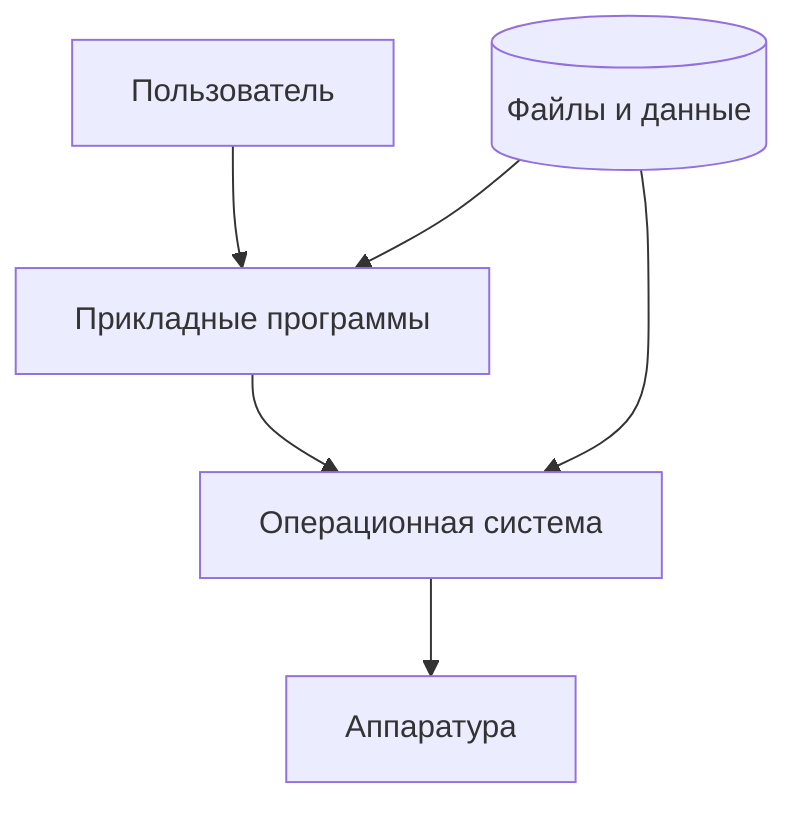
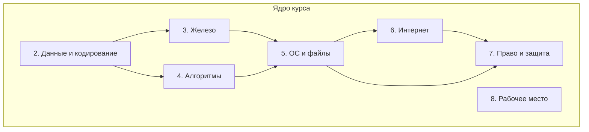
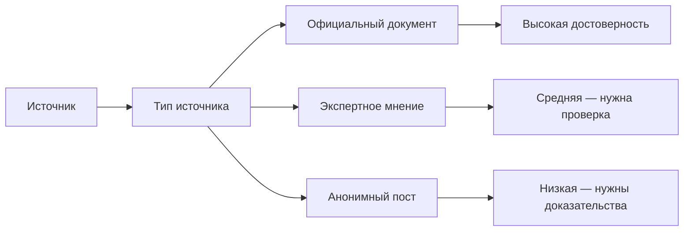
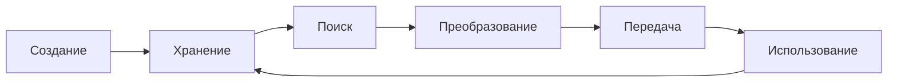
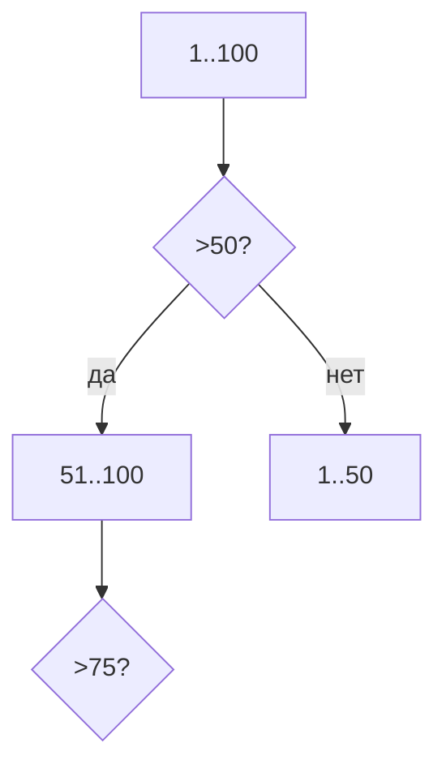
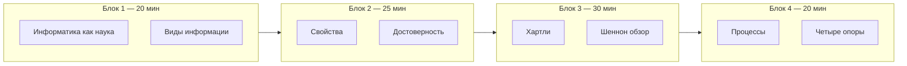
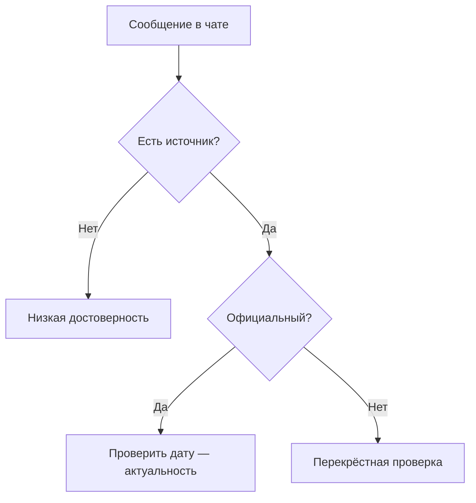
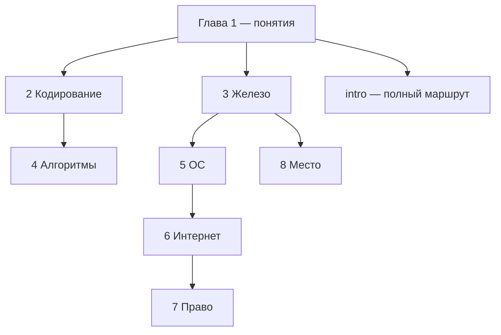
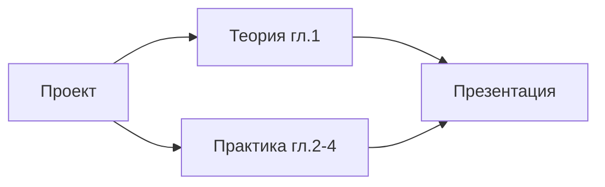

---
tags:
  - all
  - required
  - beginner
  - inprogress
title: Базовая информатика — ключевые понятия и маршрут
description: >-
  Ключевые понятия курса, карта глав, четыре опоры цифровой грамотности и маршруты
  прохождения — школьный зачёт, базовая грамотность или вход в разработку.
related:
  - title: "Основы компьютерной грамотности"
    doc: encyclopedia/1-basics/1-035-bazovaya-informatika/101
  - title: "Терминология новичка"
    doc: encyclopedia/1-basics/1-035-bazovaya-informatika/102
  - title: "Базовая информатика — о разделе"
    doc: encyclopedia/1-basics/1-035-bazovaya-informatika/intro
  - title: "Дорожная карта изучения"
    doc: encyclopedia/1-basics/1-03-dorozhnaya-karta-izucheniya/1
  - title: "Данные и информация — о разделе"
    doc: encyclopedia/1-basics/1-09-dannye-i-informatsiya/intro
  - title: "Как работает компьютер — о разделе"
    doc: encyclopedia/1-basics/1-08-kak-rabotaet-kompyuter/intro
---

import ExternalPlayEmbed from '@site/src/components/ExternalPlayEmbed';


# Базовая информатика — ключевые понятия и маршрут

<div class="article-tags">
  <span class="tag tag-required">ОБЯЗАТЕЛЬНО</span>
  <span class="tag tag-beginner">ДЛЯ НОВИЧКОВ</span>
  <span class="tag tag-inprogress">В РАЗРАБОТКЕ</span>
</div>

<span class="complexity-badge">Всем</span>

Прежде, чем разбираться в информационных технологиях, нужно повторить основы информатики.

Краткая карта курса — ключевые понятия, порядок глав и ссылки на подробные разделы [базовой информатики](./intro). Бытовые термины (файл, [операционная система (ОС)](/encyclopedia/2-system-network/2-01-operatsionnaya-sistema/intro), [браузер](/encyclopedia/2-system-network/2-04-kak-rabotayut-sayty-i-veb-sayty/intro)…) собраны в [Терминологии новичка](./102). Практика "с нуля за столом" — в [Основах компьютерной грамотности](./101). Связь [данных](/encyclopedia/1-basics/1-09-dannye-i-informatsiya/1) и [железа](/encyclopedia/1-basics/1-08-kak-rabotaet-kompyuter/1) разбирается в главах [2](./2) и [3](./3).

---

## Ключевые понятия

> **Базовая информатика** — как информация становится данными на компьютере, как устроены железо, программы, сеть и правила безопасной работы.

| Понятие | Суть | Глава курса |
|---------|------|-------------|
| **Данные и кодирование** | Текст, числа, звук, картинка — всё хранится как байты по правилам | [Кодирование, сжатие и архивация](/encyclopedia/1-basics/1-035-bazovaya-informatika/2) |
| **Вычислительная техника** | [Центральный процессор (CPU)](/encyclopedia/1-basics/1-08-kak-rabotaet-kompyuter/3), [оперативная память (ОЗУ)](/encyclopedia/1-basics/1-08-kak-rabotaet-kompyuter/3), накопитель, периферия — роли в системе | [Компьютер, периферия и сетевое оборудование](/encyclopedia/1-basics/1-035-bazovaya-informatika/3) |
| **Алгоритм и программа** | План задачи → запись на языке → исполнение [операционной системой (ОС)](/encyclopedia/2-system-network/2-01-operatsionnaya-sistema/intro) | [Алгоритмы, языки и программирование](/encyclopedia/1-basics/1-035-bazovaya-informatika/4) |
| **ОС и файлы** | [ОС](/encyclopedia/2-system-network/2-01-operatsionnaya-sistema/intro) — посредник между пользователем, [программами](/encyclopedia/1-basics/1-19-programma/intro) и железом | [ОС, файловые системы и служебные программы](/encyclopedia/1-basics/1-035-bazovaya-informatika/5) |
| **Интернет и сервисы** | Сеть, [протоколы](/encyclopedia/2-system-network/2-03-set-i-internet/1), [DNS](/encyclopedia/2-system-network/2-03-set-i-internet/611) (система доменных имён), веб, почта, поиск | [Интернет и сетевые сервисы](/encyclopedia/1-basics/1-035-bazovaya-informatika/6) |
| **Право и защита** | Авторское право на [ПО](/encyclopedia/1-basics/1-19-programma/intro), лицензии, [персональные данные](/encyclopedia/2-system-network/2-08-osnovy-informatsionnoy-bezopasnosti/1) | [Право и защита информации в РФ](/encyclopedia/1-basics/1-035-bazovaya-informatika/7) |
| **Рабочее место** | Эргономика, перерывы, правила класса | [Организация рабочего места](/encyclopedia/1-basics/1-035-bazovaya-informatika/8) |
| **Организация и уровни** | Аппаратура + ПО, фон Нейман, уровни от транзистора до Python | [Организация, архитектура и уровни](/encyclopedia/1-basics/1-035-bazovaya-informatika/10) |

Подробнее по темам — [данные](/encyclopedia/1-basics/1-09-dannye-i-informatsiya/1), [железо](/encyclopedia/1-basics/1-08-kak-rabotaet-kompyuter/1), [программы](/encyclopedia/1-basics/1-19-programma/1), [сеть](/encyclopedia/2-system-network/2-03-set-i-internet/intro).

---

## Вычислительная система

В школьном и вузовском курсе информатики материал делят на **общие сведения об информации**, **аппаратное** и **программное обеспечение**. Для экзамена запомните простую схему:

| Составляющая | Что входит | Глава курса |
|--------------|------------|-------------|
| **Аппаратное обеспечение (АО)** | CPU, ОЗУ, накопители, плата, периферия, сеть | [3](./3) |
| **Программное обеспечение (ПО)** | ОС, драйверы, прикладные и служебные программы | [5](./5), [4](./4) |
| **Данные** | Закодированная информация в файлах и потоках | [2](./2) |
| **Пользователь** | Задаёт смысл и получает результат | [101](./101) |



Архитектура фон Неймана и **уровни абстракции** (от логических вентилей до Python) разобраны в [главе 10](./10) — она связывает железо, ОС и языки в одну картину.

### Как связаны главы курса



Каждая глава опирается на предыдущие: без понимания **байта** трудно объяснить **файл**; без **файла** — **программу**; без **программы** — **сетевой протокол**. На экзамене часто дают сквозную задачу: "опишите путь письма от набора текста до получения адресатом" — это цепочка из нескольких глав сразу.

---

## Информатика как наука

Что такое информатика?

> **Информатика** — наука об общих свойствах информации, закономерностях и способах её **создания, хранения, поиска, преобразования и использования** с помощью компьютерных систем.

В школьной и вузовской программе информатика пересекается с соседними дисциплинами — [данные](/encyclopedia/1-basics/1-09-dannye-i-informatsiya/intro), [алгоритмы](/encyclopedia/4-code-dev/4-01-algoritmy/intro), [сети](/encyclopedia/2-system-network/2-03-set-i-internet/intro). У каждой дисциплины свой фокус — см. таблицу ниже.

| Дисциплина | Что изучает | Пример вопроса |
|------------|-------------|----------------|
| **Теория информации** | Математические модели передачи и измерения информации (К. Шеннон, Р. Хартли) | Сколько бит в сообщении "выпала 3 на кубике"? |
| **Кибернетика** | Связь и управление в машинах, живых системах, обществе | Как термостат поддерживает температуру? |
| **Семиотика** | Знаки и знаковые системы | Почему красный свет — "стоп"? |
| **Информатика** | Практика работы с данными на компьютере — кодирование, ПО, сети | Как сохранить фото в JPEG и отправить по почте? |
| **Инженерная информатика** | Проектирование вычислительных систем | Как выбрать SSD для ноутбука? |
| **Прикладная информатика** | Использование ИТ в бизнесе, медицине, образовании | Как электронный журнал хранит оценки? |

Для курса "Базовая информатика" достаточно помнить — информатика связывает **смысл для человека** с **правилами записи на машине**.

### Объект и предмет информатики

| | Определение | Примеры |
|---|-------------|---------|
| **Объект** | То, что изучают | Информационные процессы, данные, программы, сети |
| **Предмет** | С какой стороны изучают | Закономерности, методы, средства автоматизации |

На уроке информатики вы одновременно изучаете **теорию** (свойства информации, формулы) и **практику** (работа в Word, [написание скрипта](/encyclopedia/4-code-dev/4-01-algoritmy/intro), [настройка сети](/encyclopedia/2-system-network/2-03-set-i-internet/intro)). Итог можно проверить на реальном компьютере: запустить программу, открыть файл, отправить пакет по сети.

### История в двух абзацах

Слово **informatics** (информатика) закрепилось в Европе во второй половине XX века. В СССР и России курс "Основы информатики и вычислительной техники" (ОИВТ) с 1985 года ввели в школы — с алгоритмами, БЯМ (базовым языком моделирования) и первыми персональными компьютерами. Сегодня школьная программа включает программирование на [Python](/encyclopedia/5-languages/5-02-python/intro), работу с [базами данных](/encyclopedia/3-data-markup/3-07-sql/intro) и основы [информационной безопасности (ИБ)](/encyclopedia/2-system-network/2-08-osnovy-informatsionnoy-bezopasnosti/intro). Фундаментальные понятия — данные, алгоритм, сеть — остаются теми же.

Подробнее об эволюции вычислительной техники — [Немного о прошлом](/encyclopedia/1-basics/1-07-nemnogo-o-proshlom/intro).

---

## Виды информации по форме представления

Какие бывают виды информации?

В учебниках для информатики выделяют виды, у которых есть **устоявшиеся способы кодирования и хранения**:

| Вид | Примеры носителей | Цифровые форматы | Как кодируется (кратко) |
|-----|-------------------|------------------|-------------------------|
| **Графическая (изобразительная)** | Рисунок, фото, схема | PNG, JPEG, SVG | Матрица пикселей или векторные кривые |
| **Звуковая** | Запись речи, шум улицы | WAV, MP3, AAC | Дискретизация амплитуды во времени |
| **Текстовая** | Книга, SMS, статья | `.txt`, HTML, DOCX | Таблица символов → байты ([UTF-8](/encyclopedia/1-basics/1-035-bazovaya-informatika/2) — универсальная кодировка текста) |
| **Числовая** | Счёт, таблица, измерение | CSV, ячейки Excel, JSON | Двоичное или десятичное представление |
| **Видео** | Кино, ролик, трансляция | MP4, WebM | Кадры (графика) + звуковая дорожка |

Есть виды, которые человек воспринимает (запах, тактильные ощущения), но для них **общепринятых цифровых стандартов** пока нет — в школьном курсе их обычно только упоминают.

Переход от аналогового сигнала (непрерывная волна звука) к цифре называют **дискретизацией** — разбиением на отдельные отсчёты и присвоением каждому кода. Подробно — [глава 2](/encyclopedia/1-basics/1-035-bazovaya-informatika/2).

### Аналоговая и цифровая информация

| | Аналоговая | Цифровая |
|---|------------|----------|
| **Суть** | Непрерывное изменение величины | Отдельные значения (отсчёты) |
| **Пример** | Пластинка, магнитофонная лента | MP3-файл, JPEG |
| **Копирование** | Каждая копия чуть хуже оригинала | Копия побитово идентична |
| **Обработка** | Сложно без потерь | Легко фильтровать, сжимать, передавать |

На экзамене могут спросить: "Почему цифровая запись удобнее для компьютера?" — потому что процессор оперирует **дискретными** значениями: [битами](/encyclopedia/1-basics/1-09-dannye-i-informatsiya/2) (нули и единицы), которые можно точно копировать и обрабатывать по правилам.

### Смешанные виды

Реальные объекты часто содержат несколько видов сразу:

| Объект | Виды информации внутри |
|--------|------------------------|
| Веб-страница | Текст, графика, возможно видео и звук |
| Презентация PowerPoint | Текст, изображения, анимация, встроенное видео |
| PDF-документ | Текст, векторная и растровая графика |
| Мессенджер | Текст, голосовые, фото, стикеры (графика) |

---

## Свойства информации

Какие бывают свойства информации?

Информация в жизни и в курсе информатики описывается **свойствами**, от которых зависит, можно ли ей доверять и насколько она полезна **сейчас**.

| Свойство | Суть | Пример | Антипример |
|----------|------|--------|------------|
| **Объективность и субъективность** | Измерена прибором или выражает мнение | Термометр +23 °C — объективно | "На улице тепло" — субъективно |
| **Достоверность** | Соответствует факту | Показания исправного датчика | Слух в чате без источника |
| **Недостоверность** | Ошибка, устаревание, искажение при передаче | Фейковая новость с чужим фото | — |
| **Полнота** | Хватает данных для решения | Адрес с домом, но без номера квартиры — неполный для доставки | Рецепт без указания температуры духовки |
| **Актуальность** | Сведения ещё верны для задачи | Курс валют "вчера" для сделки "сегодня" | Расписание прошлого семестра |
| **Старение (моральное устаревание)** | Ценность падает со временем | Прогноз погоды на неделю назад | Справочник телефонов 1990 года |
| **Доступность** | Можно получить нужным способом | Статья в открытом доступе | Данные за платным API без ключа |
| **Защищённость** | Не доступна посторонним | Зашифрованный архив с паролем | Пароль в открытом тексте в чате |
| **Понятность (ясность)** | Получатель понимает смысл | Инструкция на родном языке | Техдокументация только на японском |
| **Ценность (полезность)** | Помогает принять решение | Отчёт о продажах для директора | Случайный набор цифр без контекста |

Самая ценная для решений информация — **объективная, достоверная, полная и актуальная**. На экзамене часто просят привести пример субъективного сообщения и сравнить его с **измерением прибором** — см. [свойства информации](#свойства-информации).

### Субъективность не всегда плохо

Субъективная информация полезна, когда речь о **оценках, предпочтениях, эмоциях**:

| Субъективное сообщение | Когда оно ценно |
|------------------------|-----------------|
| "Фильм скучный" | Выбор досуга с друзьями |
| "Урок был сложным" | Обратная связь учителю |
| "Интерфейс неудобный" | UX-исследование |

На экзамене важно **различать** субъективность и объективность:

- **субъективность** — нет измерения прибором, есть мнение или ощущение;
- **объективность** — есть число, дата, документ, который можно проверить.

### Достоверность и источник



| Источник | Ориентир по достоверности |
|----------|----------------------------|
| Государственный реестр, судебное решение | Высокая (в рамках юрисдикции) |
| Рецензируемая научная статья | Высокая после проверки сообществом |
| Официальный сайт компании | Средне-высокая |
| Блог без ссылок | Низкая без перекрёстной проверки |

---

## Количество информации в сообщении

В школьном курсе часто используют **формулу Хартли** для равновероятных исходов:

```
I = log₂(N)  бит
```

где **N** — число равновероятных вариантов, один из которых произошёл.

| Событие | N | I = log₂(N) | Пояснение |
|---------|---|-------------|-----------|
| Монета: орёл или решка | 2 | 1 бит | Минимальное нетривиальное сообщение |
| Игральная кость (1–6) | 6 | ≈ 2,58 бит | Не целое число бит — нормально |
| Буква русского алфавита (33, равновероятно) | 33 | ≈ 5,04 бит | Теоретическая оценка на символ |
| Угадали число от 1 до 8 | 8 | 3 бита | 2³ = 8 |
| Выбор из 16 равных вариантов | 16 | 4 бита | 2⁴ = 16 |
| Шахматная доска: клетка 8×8 | 64 | 6 бит | log₂(64) = 6 |
| Карта из колоды 36 | 36 | ≈ 5,17 бит | log₂(36) |
| День недели (7 вариантов) | 7 | ≈ 2,81 бит | log₂(7) |

**Пример.** Сообщение "выпала 5 на кубике" среди шести граней даёт log₂(6) ≈ 2,58 бит — столько же, сколько нужно, чтобы закодировать один из шести равных исходов.

### Пошаговый расчёт log₂(N)

Если калькулятор не умеет log₂, используйте:

```
log₂(N) = ln(N) / ln(2)  ≈  lg(N) / lg(2)
```

**Задача.** В коробке 10 одинаковых по виду деталей, но одна отличается весом. Сообщение "отличающаяся — седьмая" при равной вероятности даёт I = log₂(10) ≈ 3,32 бит.

### Формула Шеннона (неравновероятные исходы)

Когда исходы **не равны**, применяют **энтропию Шеннона**:

```
H = − Σ pᵢ · log₂(pᵢ)  бит на символ
```

где **pᵢ** — вероятность i-го исхода, сумма всех pᵢ = 1.

| Ситуация | p | Вклад −p·log₂(p) |
|----------|---|------------------|
| Буква "а" в русском тексте | ≈ 0,08 | ≈ 0,29 бит |
| Редкая буква "ъ" | ≈ 0,001 | ≈ 0,01 бит |

**Смысл:** в реальном тексте буквы встречаются с разной частотой, поэтому среднее количество информации на символ **меньше**, чем log₂(33) ≈ 5,04 бит. Именно поэтому сжатие (ZIP, архиваторы) работает — в данных есть **избыточность**.

Подробнее — [теория информации](/encyclopedia/1-basics/1-09-dannye-i-informatsiya/1).

### Сравнение Хартли и Шеннона

| | Хартли | Шеннон |
|---|--------|--------|
| **Когда** | Все N исходов равновероятны | Разные вероятности |
| **Формула** | I = log₂(N) | H = −Σ pᵢ log₂ pᵢ |
| **Школьный уровень** | ОГЭ, базовые задачи | Частично ЕГЭ, углублённый курс |
| **Пример** | Кубик, монета | Естественный язык, погода |

---

## Задачи на свойства и количество информации — разбор

### Задача 1. Свойства сообщения

"Вчера на улице было холодно" — какие свойства нарушены или соблюдены?

| Свойство | Оценка | Почему |
|----------|--------|--------|
| Объективность | Субъективно | Нет числа, только ощущение |
| Достоверность | Неизвестно | Может быть правдой, но без даты и места не проверить |
| Полнота | Неполно | Нет температуры, города, времени суток |
| Актуальность | Устарело | "Вчера" без календарной даты бесполезно через неделю |

**Улучшенный вариант:** "15 мая 2026 в Москве в 14:00 термометр показал −2 °C" — объективно, проверяемо, с датой и местом.

### Задача 2. Объективное измерение

Датчик показал "+18,3 °C в 14:02" — объективно, измеримо, можно проверить калибровкой прибора.

### Задача 3. Хартли — выбор из списка

В справочнике 128 городов с равной вероятностью выбирают один для встречи. Сколько бит несёт сообщение "встреча в городе № 47"?

**Решение:** N = 128 = 2⁷ → I = 7 бит.

### Задача 4. Хартли — неполный набор

В урне 5 шаров разных цветов. Сообщили цвет вытянутого шара. I = log₂(5) ≈ 2,32 бит.

### Задача 5. Сравнение сообщений

| Сообщение | Больше информации? |
|-----------|-------------------|
| "Завтра будет дождь" (без города) | Меньше — неполно |
| "16 июня в Казани вероятность дождя 70% по данным Гидромета" | Больше — конкретика и источник |

### Задача 6. ЕГЭ-стиль (упрощённо)

Автомат передаёт равновероятно одну из 512 команд. Минимальная длина двоичного кода одной команды?

**Решение:** 512 = 2⁹ → **9 бит** на команду.

### Задача 7. На избыточность

Фраза "привет привет привет" несёт мало **новой** информации после первого слова — это **избыточность** естественного языка (повторы, предсказуемость).

<div class="callout callout--tip">
  <div class="callout-title">Шпаргалка для экзамена</div>

  <div class="callout-body">
  <ul>
    <li>Субъективно — нет измерения, есть мнение.</li>
    <li>Неполно — не хватает данных для решения задачи.</li>
    <li>Неактуально — верно было раньше, сейчас нет.</li>
    <li>I = log₂(N) только если все N исходов <strong>равновероятны</strong>.</li>
    <li>Если N — степень двойки, ответ целый (8→3, 16→4, 32→5…).</li>
  </ul>
</div>
</div>

---

## Информационные процессы

Любая работа с ПК — один или несколько процессов из списка:



| Процесс | Бытовой пример | Школьный / технический пример |
|---------|----------------|------------------------------|
| **Создание** | Набрали текст, сняли фото | Ввод данных в Excel, запись с микрофона |
| **Хранение** | Сохранили файл на диск или в облако | Запись на SSD в NTFS, реплика в облаке |
| **Поиск** | Нашли документ по имени или через поисковик | SQL-запрос, индекс в базе данных |
| **Преобразование** | Сжали фото, отформатировали таблицу | Конвертация MP4→GIF, [OCR](/encyclopedia/1-basics/1-15-tekst/41) (распознавание скана в текст) |
| **Передача** | Отправили файл по почте или в мессенджере | [HTTP](/encyclopedia/2-system-network/2-03-set-i-internet/1), [SMTP](/encyclopedia/2-system-network/2-03-set-i-internet/614) (почта), Bluetooth-передача |
| **Использование** | Прочитали, распечатали, посчитали сумму | Построение графика, печать на принтере |
| **Защита** | Пароль на архив, шифрование диска | [HTTPS](/encyclopedia/2-system-network/2-03-set-i-internet/616), антивирус, [резервная копия](/encyclopedia/2-system-network/2-06-sistemnoe-administrirovanie/63) |
| **Уничтожение** | Удалили файл, очистили корзину | Безвозвратное стирание; в ЕС — "право на забвение" по [GDPR](/encyclopedia/2-system-network/2-08-osnovy-informatsionnoy-bezopasnosti/1) |

Цепочка **кодирование → хранение → передача → декодирование** повторяется в каждой главе курса — от [данных](/encyclopedia/1-basics/1-035-bazovaya-informatika/2) до [интернета](/encyclopedia/1-basics/1-035-bazovaya-informatika/6).

### Сквозной пример — отправка домашнего задания

| Шаг | Процесс | Что происходит |
|-----|---------|----------------|
| 1 | Создание | Набрали отчёт в Word |
| 2 | Преобразование | Сохранили как PDF |
| 3 | Хранение | Файл на диске `C:\Users\…\Документы\` |
| 4 | Передача | Прикрепили к письму, SMTP отправил на сервер |
| 5 | Хранение | Копия в папке "Отправленные" и на сервере почты |
| 6 | Поиск | Учитель нашёл письмо по теме |
| 7 | Использование | Открыл PDF, поставил оценку в журнал |
| 8 | Защита | Пароль на почту, HTTPS при входе |

### Сквозной пример — просмотр видео на YouTube

| Шаг | Процесс | Технология |
|-----|---------|------------|
| Создание | Автор смонтировал ролик | Редактор видео |
| Преобразование | Кодек H.264 сжал поток | Транскодирование на сервере |
| Хранение | Файл на CDN Google | Распределённое хранилище |
| Передача | Потоковая передача по HTTP | Стриминг, адаптивный битрейт |
| Использование | Вы смотрите в браузере | Декодирование, вывод на экран |
| Поиск | Нашли по запросу или рекомендации | Индекс, алгоритм рекомендаций |

### Информационная система

> **Информационная система (ИС)** — совокупность данных, программ, техники и людей, организованная для выполнения информационных процессов.

| Компонент ИС | Пример в школе |
|--------------|----------------|
| Данные | Оценки, расписание, ФИО учеников |
| Программы | Электронный журнал, 1С |
| Техника | Сервер, ПК учителя, планшеты |
| Люди | Администратор, учителя, ученики |
| Регламент | Кто может менять оценки, бэкапы |

---

## Этот раздел и соседние главы

| Раздел | Роль |
|--------|------|
| [Дорожная карта](/encyclopedia/1-basics/1-03-dorozhnaya-karta-izucheniya/1) | Путь от новичка до IT-специалиста на годы |
| **Базовая информатика** (здесь) | Фокус на **школьной / начальной** программе |
| [Как работает компьютер](/encyclopedia/1-basics/1-08-kak-rabotaet-kompyuter/intro) | Устройство ПК — подробно, с инженерными деталями |
| [Данные и информация](/encyclopedia/1-basics/1-09-dannye-i-informatsiya/intro) | Кодирование, типы, метаданные |
| [Программа](/encyclopedia/1-basics/1-19-programma/intro) | Что такое ПО, компиляция, процессы |

Школьный зачёт — с [Кодирование, сжатие и архивация](/encyclopedia/1-basics/1-035-bazovaya-informatika/2) по номерам. Путь в профессию — после курса [дорожная карта](/encyclopedia/1-basics/1-03-dorozhnaya-karta-izucheniya/1).

---

## Четыре опоры, которые стоит запомнить

Типичные заблуждения новичка — и как их заменить правильной картиной:

- компьютер "думает" сам по себе → вычисления выполняет **программа** по шагам [алгоритма](./4);
- машина оперирует чем угодно, кроме нулей и единиц → внутри только **биты**; смысл задаёт [кодировка](./2);
- программа на диске и запущенный процесс — одно и то же → **файл** хранит код, **процесс** — его исполнение в [ОЗУ](/encyclopedia/1-basics/1-08-kak-rabotaet-kompyuter/3);
- интернет, IP-адрес, порт и протокол — синонимы → это разные уровни [сетевой модели](./6).

Четыре опоры курса:

- **Смысл задаёт человек или алгоритм.** Машина работает с битами по правилам программ. См. [Данные и информация](/encyclopedia/1-basics/1-09-dannye-i-informatsiya/1).
- **Любая задача на ПК** — ввод → обработка ([CPU](/encyclopedia/1-basics/1-08-kak-rabotaet-kompyuter/3) + программа + [ОС](/encyclopedia/2-system-network/2-01-operatsionnaya-sistema/intro)) → вывод. См. [Принцип работы компьютера](/encyclopedia/1-basics/1-08-kak-rabotaet-kompyuter/1).
- **Интернет** — сеть сетей с общими правилами ([протоколами](/encyclopedia/2-system-network/2-03-set-i-internet/1)). См. [Сеть и интернет](/encyclopedia/2-system-network/2-03-set-i-internet/1).
- **Программа, процесс и параллелизм** — алгоритм описывает шаги, **программа** фиксирует их в файле, **процесс** — живое исполнение в памяти. Один файл может породить несколько процессов; внутри процесса — **потоки выполнения**, которые ОС чередует на ядре (многозадачность) или распределяет по ядрам (параллелизм). Общая память потоков требует [мьютексов](https://ru.wikipedia.org/wiki/%D0%9C%D1%8C%D1%8E%D1%82%D0%B5%D0%BA%D1%81) и защиты от [гонок](https://ru.wikipedia.org/wiki/%D0%A1%D0%BE%D1%81%D1%82%D0%BE%D1%8F%D0%BD%D0%B8%D0%B5_%D0%B3%D0%BE%D0%BD%D0%BA%D0%B8). См. [главу 4](/encyclopedia/1-basics/1-035-bazovaya-informatika/4), [Программа](/encyclopedia/1-basics/1-19-programma/intro), [Процессы и потоки](/encyclopedia/4-code-dev/4-05-asinhronnost/1).

### Разбор сценария — открытие фото в проводнике

| Этап | Что происходит | Опора курса |
|------|----------------|-------------|
| Двойной щелчок | ОС находит файл на диске (NTFS), читает байты с SSD | [Глава 5](./5) |
| Запуск программы | Проводник вызывает просмотрщик → новый **процесс** в ОЗУ | [Глава 4](./4), [Глава 5](./5) |
| Декодирование | Просмотрщик по правилам JPEG восстанавливает пиксели | [Глава 2](./2) |
| Вывод | GPU рисует кадр на монитор | [Глава 3](./3) |

Просмотрщик применил таблицу декодирования JPEG и вывел пиксели. Интерпретация "на фото кот" — на вашей стороне.

### Разбор сценария — поиск в Google

| Этап | Опора |
|------|-------|
| Вы ввели запрос в браузере | Прикладная программа + UI |
| Браузер отправил HTTPS-запрос | [Глава 6](./6) — протоколы |
| DNS перевёл google.com в IP | [Глава 6](./6) — [DNS](/encyclopedia/2-system-network/2-03-set-i-internet/611) (имя сайта → числовой адрес) |
| Сервер вернул HTML | Кодирование текста [глава 2](./2) |
| Браузер отрисовал страницу | [Глава 3](./3) — вывод на экран |

---

## Маршруты прохождения

| Цель | Маршрут | Время |
|------|---------|-------|
| **Школьный зачёт** | [Кодирование, сжатие и архивация](/encyclopedia/1-basics/1-035-bazovaya-informatika/2) → [Компьютер, периферия и сетевое оборудование](/encyclopedia/1-basics/1-035-bazovaya-informatika/3) → [ОС, файловые системы и служебные программы](/encyclopedia/1-basics/1-035-bazovaya-informatika/5) → [Интернет и сетевые сервисы](/encyclopedia/1-basics/1-035-bazovaya-informatika/6) → [Алгоритмы, языки и программирование](/encyclopedia/1-basics/1-035-bazovaya-informatika/4) → [Право и защита информации в РФ](/encyclopedia/1-basics/1-035-bazovaya-informatika/7) → [Базовая информатика — итоги](/encyclopedia/1-basics/1-035-bazovaya-informatika/98) | 2–3 недели |
| **Уже пишете код** | [Алгоритмы, языки и программирование](/encyclopedia/1-basics/1-035-bazovaya-informatika/4) первой, затем [Кодирование, сжатие и архивация](/encyclopedia/1-basics/1-035-bazovaya-informatika/2) и [Компьютер, периферия и сетевое оборудование](/encyclopedia/1-basics/1-035-bazovaya-informatika/3) | по выбору |
| **Мало времени** | [Компьютер, периферия и сетевое оборудование](/encyclopedia/1-basics/1-035-bazovaya-informatika/3) (таблица периферии), [Алгоритмы, языки и программирование](/encyclopedia/1-basics/1-035-bazovaya-informatika/4) (алгоритмы), [Интернет и сетевые сервисы](/encyclopedia/1-basics/1-035-bazovaya-informatika/6) (сервисы), [Базовая информатика — чек-лист](/encyclopedia/1-basics/1-035-bazovaya-informatika/99) | 1–2 дня |
| **Самопроверка** | [Базовая информатика — чек-лист](/encyclopedia/1-basics/1-035-bazovaya-informatika/99) после каждой главы | — |

После каждой главы — 5–7 терминов своими словами и один практический пример из жизни.

### Недельный план для школьного зачёта

| День | Главы | Фокус |
|------|-------|-------|
| 1–2 | 2, 3 | Биты, кодирование, CPU (процессор), ОЗУ (оперативная память) |
| 3–4 | 5, 6 | Файлы, ОС, интернет, DNS (доменное имя → IP) |
| 5 | 4 | Алгоритмы, блок-схемы |
| 6 | 7, 8 | Право, эргономика |
| 7 | 99, 98 | Чек-лист, итоги |

---

## Типовые вопросы экзамена и ОГЭ

| Вопрос | Куда смотреть в курсе |
|--------|----------------------|
| Назовите виды информации | Раздел выше + [глава 2](./2) |
| Свойства информации — примеры | Таблица свойств |
| I = log₂(N) — вычислите | Раздел Хартли |
| Информационные процессы в ситуации | Таблица процессов |
| Чем данные отличаются от информации | [Данные и информация](/encyclopedia/1-basics/1-09-dannye-i-informatsiya/2) |
| Роль ОС | [Глава 5](./5) |
| Безопасность в сети | [Глава 6](./6), [Глава 7](./7) |

### Мини-тест (ответы — в тексте выше)

1. Сколько бит в сообщении о выборе одного из 64 равных вариантов?
2. "Красивый закат" — объективно или субъективно?
3. Назовите три информационных процесса при скачивании файла с сайта.
4. Чем информатика отличается от теории информации?

**Ответы:** 1) 6 бит; 2) субъективно; 3) передача, хранение, использование (и др.); 4) информатика шире и практичнее — ПО, сети, данные на ПК.

---

## Интерактивная карта

<ExternalPlayEmbed example="about/interactive-roadmap" title="Interactive Roadmap" minHeight={520} />

<div class="callout callout--tip">
  <div class="callout-title">Самопроверка</div>

  <div class="callout-body">
  После каждой главы — 2–3 вопроса из [чек-листа](/encyclopedia/1-basics/1-035-bazovaya-informatika/99).

  Слабый ответ — откройте главу из колонки "Подробнее" в [оглавлении](/encyclopedia/1-basics/1-035-bazovaya-informatika/intro).
</div>
</div>

## Данные и информация — углубление

В школьном курсе важно не путать два уровня:

| | **Информация** | **Данные** |
|---|----------------|------------|
| **Для кого** | Имеет смысл для человека | Формальная запись для машины |
| **Пример** | "Температура +5 °C" | Байты `2B 30 35` в UTF-8 или регистр датчика |
| **Зависимость от контекста** | Да — "+5" зимой и летом значит разное | Нет — байты те же |
| **Где в ПК** | В голове пользователя и в UI | На диске, в ОЗУ, в пакете сети |

**Преобразование:** датчик → **данные** (число в регистре) → программа форматирует → **информация** на экране ("+5 °C").


### Задачи на данные и информацию

**Задача 8.** Файл `weather.json` содержит `{"temp": 5}`. Это данные или информация?

**Ответ:** **Данные** — смысл "+5 градусов" появляется после интерпретации поля `temp` и единиц измерения.

**Задача 9.** Таблица Excel с продажами — данные. График "рост на 20%" — информация для менеджера.

---

## Расширенный банк задач — формула Хартли

Во всех задачах исходы **равновероятны**, если не сказано иное.

| № | Условие | N | Ответ I = log₂(N) |
|---|---------|---|-------------------|
| 1 | Монета | 2 | 1 бит |
| 2 | Кубик | 6 | ≈ 2,58 бит |
| 3 | Число от 1 до 16 | 16 | 4 бита |
| 4 | Число от 1 до 100 (равновероятно) | 100 | ≈ 6,64 бит |
| 5 | Шар из 8 цветов | 8 | 3 бита |
| 6 | Клетка шахматной доски | 64 | 6 бит |
| 7 | Карта из 52 (покер) | 52 | ≈ 5,70 бит |
| 8 | Буква латинского алфавита (26) | 26 | ≈ 4,70 бит |
| 9 | Выбор одного из 256 вариантов | 256 | 8 бит |
| 10 | Сообщение "страница 1024 из 1024" | 1024 | 10 бит |
| 11 | Результат броска двух монет (4 исхода) | 4 | 2 бита |
| 12 | День месяца (1–31, равновероятно) | 31 | ≈ 4,95 бит |
| 13 | Выбор порта из 65536 равных | 65536 | 16 бит |
| 14 | Один символ из ASCII (128) | 128 | 7 бит |
| 15 | Угадывание числа 0–7 | 8 | 3 бита |

### Задачи с решением по шагам

**Задача 10.** В корзине 20 яблок неотличимы на вид, одно гнилое. Сообщили номер гнилого (от 1 до 20). Сколько бит информации?

**Решение:** N = 20 → I = log₂(20) = log₂(4·5) = 2 + log₂(5) ≈ 2 + 2,32 = **4,32 бит**.

**Задача 11.** Передают код из 4 символов, каждый — одна из 8 букв (равновероятно). Сколько бит в **одном** символе? Сколько в **четырёх**?

**Решение:** На символ: log₂(8) = 3 бита. На четыре независимых символа: 4 × 3 = **12 бит** (если символы независимы).

**Задача 12.** Сколько равновероятных исходов нужно, чтобы сообщение несло ровно 5 бит?

**Решение:** N = 2⁵ = **32** исхода.

---

## Примеры энтропии Шеннона (упрощённые)

### Два исхода с разными вероятностями

Монета несимметрична: орёл p = 0,9, решка p = 0,1.

```
H = −(0,9·log₂(0,9) + 0,1·log₂(0,1)) ≈ 0,47 бит
```

Меньше 1 бита — потому что орёл **ожидаем**, сообщение "выпал орёл" почти не удивляет.

### Три погодных исхода

| Исход | p |
|-------|---|
| Ясно | 0,5 |
| Облачно | 0,3 |
| Дождь | 0,2 |

H ≈ −(0,5·log₂0,5 + 0,3·log₂0,3 + 0,2·log₂0,2) ≈ **1,49 бит** на сообщение.

На ЕГЭ обычно дают 2–3 исхода с явными вероятностями — подставляйте в формулу по строкам.

---

## Свойства информации — расширенные сценарии

### Сценарий — новости в мессенджере

| Сообщение | Объективность | Достоверность | Полнота | Актуальность |
|-----------|---------------|---------------|---------|--------------|
| "Слух: завтра отменят уроки" | Субъективно | Низкая | Неполно (нет источника) | Может устареть за час |
| "Официальный приказ директора №12 от 15.06" | Документ | Высокая при подлинности | Полно для приказа | Актуально до отмены |
| "На улице +30" без города | Полуобъективно | ? | Неполно | Зависит от даты |

### Сценарий — медицинские данные

| Данные | Свойства |
|--------|----------|
| Анализ крови в PDF с подписью лаборатории | Объективно, достоверно при верной лаборатории |
| "Мне кажется, температура" | Субъективно — нужен термометр |
| Результат анализа годичной давности | Может быть недостоверен для **текущего** диагноза — потеря актуальности |

### Сценарий — навигация

| Сообщение | Проблема |
|-----------|----------|
| "Поверните через 200 м" | Актуально в моменте; через минуту устарело |
| Карта без обновления дорог | Недостоверность или неполнота |
| GPS-координаты | Объективны; ошибка прибора → недостоверность |

---

## Информационные процессы — каталог ситуаций

### В школе

| Ситуация | Процессы |
|----------|----------|
| Учитель показал презентацию | Хранение (файл), использование (проектор), возможно передача (сеть) |
| Сдали работу на флешке | Хранение, передача (физическая), использование (проверка) |
| Поиск в электронном учебнике | Поиск, использование |
| Конвертация DOCX в PDF | Преобразование |
| Удаление черновика | Уничтожение |

### Дома

| Ситуация | Процессы |
|----------|----------|
| Стриминг фильма | Передача, преобразование (декодирование), использование |
| Резервная копия фото в облако | Хранение (две копии), передача, защита (пароль) |
| Сжатие папки в ZIP перед отправкой | Преобразование, затем передача |
| Голосовое сообщение | Создание (запись), преобразование (кодек), передача, использование (прослушивание) |

### На работе программиста

| Ситуация | Процессы |
|----------|----------|
| `git push` | Передача, хранение на сервере |
| Сборка проекта | Преобразование исходников в исполняемый файл |
| Логирование ошибок | Создание, хранение, поиск при отладке |
| CI/CD деплой | Передача, преобразование, использование на сервере |

---

## Информатика и смежные предметы в школе

| Предмет | Пересечение с информатикой |
|---------|---------------------------|
| **Математика** | Логика, графы, log₂, комбинаторика в задачах на информацию |
| **Физика** | Дискретизация сигналов, единицы измерения |
| **Обществознание** | Право на информацию, персональные данные [глава 7](./7) |
| **Труд и технология** | 3D-печать, черчение — связь с [инструментами](./9) |
| **Английский** | Команды в коде, документация API |

---

## Термины главы 1 — мини-глоссарий

| Термин | Кратко |
|--------|--------|
| **Информатика** | Наука о работе с информацией с помощью ВТ |
| **Информация** | Сведения, снимающие неопределённость у получателя |
| **Данные** | Формальное представление информации для обработки |
| **Бит** | Минимальная единица информации (0 или 1) |
| **Информационный процесс** | Создание, хранение, поиск, преобразование, передача, использование |
| **Дискретизация** | Переход от непрерывного сигнала к отсчётам |
| **Объективность** | Независимость от мнения наблюдателя |
| **Актуальность** | Соответствие моменту решения задачи |
| **Энтропия (Шеннон)** | Среднее количество информации при неравных вероятностях |
| **ИС** | Информационная система — данные + ПО + люди + техника |

Бытовые термины — в [Терминологии новичка](./102).

---

## Ещё задачи для самопроверки (с ответами)

**13.** Сообщение выбрало один из 512 равных вариантов. I = ? **Ответ:** 9 бит.

**14.** "Мне нравится этот фильм" — назовите два свойства. **Ответ:** субъективность; ценность/полезность для рекомендации.

**15.** Перечислите цепочку процессов при печати документа. **Ответ:** хранение файла → использование (открытие) → преобразование (растеризация) → передача (в принтер) → использование (бумага).

**16.** Чем отличается старение от неактуальности? **Ответ:** старение — общее снижение ценности со временем; неактуальность — не подходит **для конкретной задачи сейчас** (может быть формально верным).

**17.** log₂(1) = ? Сколько информации в сообщении "единственный исход уже известен"? **Ответ:** 0 бит — неопределённости не было.

**18.** 3 бита — максимум скольких равновероятных исходов? **Ответ:** 2³ = 8.

**19.** Назовите три вида информации в одном PDF-учебнике. **Ответ:** текстовая, графическая, возможно числовая (таблицы).

**20.** Зачем в формуле Шеннона минус перед суммой? **Ответ:** log₂(p) для p&lt;1 отрицателен; минус делает вклад положительным.

---

## Хронология понятий информатики

| Период | Веха |
|--------|------|
| 1948 | К. Шеннон — математическая теория связи |
| 1960-е | Появление термина "informatics" в Европе |
| 1985 | ОИВТ в школах СССР |
| 1990-е | Массовый интернет, гипертекст |
| 2000-е | Облака, смартфоны, Web 2.0 |
| 2010-е | Python в школе, мобильная разработка |
| 2020-е | ИИ-инструменты, усиление ИБ и персональных данных |

---

## Связь главы 1 с остальным курсом — матрица

| Тема гл. 1 | Глава курса | Раздел энциклопедии |
|------------|-------------|---------------------|
| Кодирование | 2 | [Данные и информация](/encyclopedia/1-basics/1-09-dannye-i-informatsiya/intro) |
| Железо | 3 | [Как работает компьютер](/encyclopedia/1-basics/1-08-kak-rabotaet-kompyuter/intro) |
| Алгоритмы | 4 | [Алгоритмы](/encyclopedia/4-code-dev/4-01-algoritmy/intro) |
| ОС | 5 | [Операционные системы](/encyclopedia/2-system-network/2-01-operatsionnaya-sistema/intro) |
| Сеть | 6 | [Сеть и интернет](/encyclopedia/2-system-network/2-03-set-i-internet/intro) |
| Право | 7 | [ИБ](/encyclopedia/2-system-network/2-08-osnovy-informatsionnoy-bezopasnosti/intro) |
| Эргономика | 8 | [Советы новичку](/encyclopedia/1-basics/1-12-sovety-dlya-novichka/intro) |
| Инструменты | 9 | [Языки](/encyclopedia/5-languages/languages) |

---

## Практические задания без компьютера

1. Выпишите из газеты один абзац и отметьте: объективные факты, субъективные оценки, неполные данные.
2. Посчитайте log₂(N) для N = 3, 9, 27, 81 (заметьте закономерность степеней тройки).
3. Опишите информационные процессы при звонке другу по видеосвязи (не менее пяти).
4. Составьте таблицу: вид информации → пример файла у себя на ПК.

---

## Практические задания за компьютером

1. Создайте текстовый файл — процесс **создания** и **хранения**.
2. Найдите его через Win+S — **поиск**.
3. Скопируйте в другую папку — **хранение** (вторая копия) и фактически **преобразование** структуры каталога.
4. Отправьте себе на почту — **передача**.
5. Откройте на телефоне — **использование**.

Зафиксируйте размер файла в байтах — связь с [главой 2](./2).

---

## Частые ошибки на контрольных

| Ошибка | Как правильно |
|--------|---------------|
| Путают бит и байт | 1 байт = 8 бит |
| log₂(6) ≈ 2,58 записывают как 2 или 3 без пояснения | Округляйте только если просят; иначе оставьте log₂(6) |
| Любое сообщение называют "объективным" | Нужен критерий измерения или документа |
| "Интернет" и "сайт" — одно и то же | Интернет шире |
| Пропускают процесс **поиска** | Поиск — отдельный процесс, не подвид использования |

---

## Вопросы для обсуждения в классе

1. Может ли информация быть одновременно субъективной и ценной?
2. Почему сжатие MP3 — это преобразование, а не уничтожение информации? (Часть данных отбрасывается — спорный момент для дискуссии.)
3. Нужно ли учить log₂ наизусть для степеней двойки?
4. Является ли пароль "данными" или "информацией" для злоумышленника?

---

## Резюме главы

Информатика связывает **смысл** и **машинную запись**. Виды информации определяют способ кодирования. **Свойства** помогают оценить качество сведений. **Хартли** и **Шеннон** измеряют количество информации. Любая работа за ПК — **информационные процессы** из фиксированного набора. Четыре **опоры** курса удерживают картину мира: биты, ввод-обработка-вывод, сеть, программа/процесс.

---

## Полный банк задач ОГЭ-стиля — количество информации

### Блок A — степени двойки (ответ целый)

| № | Условие | N | Ответ |
|---|---------|---|-------|
| A1 | Монета | 2 | 1 бит |
| A2 | Число 0–1 (1 бит) | 2 | 1 бит |
| A3 | Число 0–3 | 4 | 2 бита |
| A4 | Число 0–7 | 8 | 3 бита |
| A5 | Число 0–15 | 16 | 4 бита |
| A6 | Число 0–31 | 32 | 5 бит |
| A7 | Число 0–63 | 64 | 6 бит |
| A8 | Число 0–127 | 128 | 7 бит |
| A9 | Число 0–255 | 256 | 8 бит |
| A10 | Байт (256 значений) | 256 | 8 бит |
| A11 | Клетка 8×8 | 64 | 6 бит |
| A12 | Клетка 16×16 | 256 | 8 бит |
| A13 | Выбор из 512 | 512 | 9 бит |
| A14 | Выбор из 1024 | 1024 | 10 бит |
| A15 | Выбор из 2048 | 2048 | 11 бит |

### Блок B — нестепени двойки (десятичный ответ)

| № | N | log₂(N) ≈ |
|---|-----|-----------|
| B1 | 3 | 1,58 |
| B2 | 5 | 2,32 |
| B3 | 6 | 2,58 |
| B4 | 7 | 2,81 |
| B5 | 9 | 3,17 |
| B6 | 10 | 3,32 |
| B7 | 12 | 3,58 |
| B8 | 20 | 4,32 |
| B9 | 25 | 4,64 |
| B10 | 33 | 5,04 |
| B11 | 50 | 5,64 |
| B12 | 100 | 6,64 |
| B13 | 365 | ≈ 8,51 |
| B14 | 1000 | ≈ 9,97 |
| B15 | 52 (карты) | ≈ 5,70 |

### Блок C — составные сообщения

**C1.** Два броска монеты (4 исхода). I = log₂(4) = **2 бита**.

**C2.** Бросок кубика + монета: N = 6×2 = 12 → I = log₂(12) ≈ **3,58 бит**.

**C3.** Буква (33) + цифра (10): N = 330 → I = log₂(330) ≈ **8,36 бит** (если независимы и равновероятны).

**C4.** Сообщение одно из 20 городов И **одно** из 5 видов транспорта: N = 100 → I = log₂(100) ≈ **6,64 бит**.

### Блок D — Шеннон (два исхода)

**D1.** p₁ = 0,5, p₂ = 0,5 → H = **1 бит** (как монета).

**D2.** p₁ = 0,25, p₂ = 0,75 → H ≈ **0,81 бит**.

**D3.** p₁ = 0,01, p₂ = 0,99 → H ≈ **0,08 бит** — редкое событие почти не удивляет.

**D4.** Три исхода: p = 0,5; 0,25; 0,25 → H = 0,5+0,5+0,5 = **1,5 бит**.

### Блок E — свойства — развернутые ответы

**E1.** "Кажется, завтра будет дождь" — субъективно, возможно достоверно, неполно (нет места), актуально только до завтра.

**E2.** "Табло показывает 14:37" — объективно (часы), достоверно при исправности, полно для времени, актуально секунды.

**E3.** Расписание 2020 года для поездки 2026 — недостоверно/неактуально.

**E4.** Отзыв "сервис отличный" без деталей — субъективно, неполно для выбора.

**E5.** Координаты GPS 55,75° N — объективны, полны для точки на карте.

---

## Информационные процессы — 20 ситуаций для тренировки

Определите процессы (может быть несколько):

| № | Ситуация | Ответ |
|---|----------|-------|
| 1 | Сфотографировали на телефон | Создание, хранение |
| 2 | Отправили фото в чат | Передача |
| 3 | Удалили фото | Уничтожение |
| 4 | Нашли фото по дате | Поиск |
| 5 | Сжали фото в JPEG меньшего размера | Преобразование |
| 6 | Посмотрели фото | Использование |
| 7 | Зашифровали архив паролем | Защита, преобразование |
| 8 | Скачали учебник PDF | Передача, хранение |
| 9 | Распечатали документ | Использование |
| 10 | OCR сканирования | Преобразование |
| 11 | Индексация Google | Поиск, хранение |
| 12 | Бэкап на внешний диск | Хранение, защита |
| 13 | Форматирование флешки | Уничтожение (данных) |
| 14 | Запись лекции на диктофон | Создание |
| 15 | Подкаст в Spotify | Передача, использование |
| 16 | Редактирование видео | Преобразование |
| 17 | Загрузка в облако | Передача, хранение |
| 18 | Восстановление из корзины | Хранение (возврат) |
| 19 | Сортировка писем по папкам | Поиск, преобразование структуры |
| 20 | Хеширование пароля на сервере | Преобразование, защита |

---

## Информатика как наука — вопросы для эссе

1. Почему информатику иногда относят к естественным, иногда — к техническим наукам?
2. Как теория информации помогает проектировать сжатие MP3?
3. Чем информационное общество отличается от индустриального?
4. Роль информатики в междисциплинарных проектах (биоинформатика, цифровая гуманитаристика).

Краткие ориентиры: информатика **прикладная** и **теоретическая**; связь с математикой через логику и алгоритмы; влияние на все отрасли через **данные**.

---

## Классификация видов информации — дополнительные примеры

| Вид | Цифровой пример | Аналоговый пример |
|-----|-----------------|-------------------|
| Текстовая | SMS, README.md | Газета |
| Числовая | Датчик температуры | Термометр со шкалой |
| Графическая | SVG-иконка | Плакат |
| Звуковая | Подкаст MP3 | Концерт в зале |
| Видео | Zoom-запись | Кинотеатр |
| Тактильная | — (редко) | Брайль на бумаге |
| Обонятельная | — | Аромат (не стандартизирован в ПК) |

---

## Метод "половинного деления" и биты

Угадывание числа от 1 до 100: каждый вопрос "больше/меньше половины?" отсекает половину вариантов. Максимум вопросов ≈ log₂(100) ≈ 7. Это интуиция **бита** как вопроса с ответом да/нет.



---

## Связь с ЕГЭ по информатике (темы пересечения)

| Тема ЕГЭ | Связь с этой главой |
|----------|---------------------|
| Кодирование информации | Виды, биты, Хартли |
| Системы счисления | log₂, двоичный код |
| Файлы и маски | Информационные процессы |
| Логика | Объективность утверждений |

Полная подготовка — [глава 4](./4) и раздел [алгоритмы](/encyclopedia/4-code-dev/4-01-algoritmy/intro).

---

## Глоссарий расширенный (гл. 1)

| Термин | Определение для экзамена |
|--------|--------------------------|
| Информатика | Наука о закономерностях создания, хранения, передачи и использования информации с помощью ВТ |
| Информация | Сведения, устраняющие неопределённость |
| Данные | Формализованное представление информации для обработки |
| Дискретизация | Перевод непрерывного сигнала в последовательность отсчётов |
| Избыточность | Повторяемость, позволяющая сжимать без потери (или с контролируемой потерей) |
| Энтропия | Среднее количество информации на символ сообщения |
| Актуальность | Соответствие времени использования |
| Достоверность | Соответствие действительности |
| Полнота | Достаточность для решения задачи |
| Информационный процесс | Единичный вид преобразования информации в системе |

---

## Итоговая таблица "что запомнить наизусть"

| Вопрос | Ответ в одну строку |
|--------|---------------------|
| Формула Хартли | I = log₂(N) бит |
| 1 байт | 8 бит |
| Виды информации (школа) | Текст, число, графика, звук, видео |
| 6 процессов | Создание, хранение, поиск, преобразование, передача, использование |
| 4 опоры курса | Биты; ввод-обработка-вывод; сеть; программа и процесс — разные сущности |

Дальше по курсу — [Кодирование, сжатие и архивация](./2) или практика в [Основах компьютерной грамотности](./101).

---

## Связь с ФГОС и программой школы

Глава 1 закрывает **базовые понятия** предмета "Информатика" в рамках **ФГОС** (федерального государственного образовательного стандарта):

| Требование программы (смысл) | Раздел статьи |
|------------------------------|---------------|
| Понятие информатики, информации | "Информатика как наука" |
| Виды информации | Таблица видов |
| Свойства информации | Таблица свойств |
| Количество информации | Хартли, Шеннон |
| Информационные процессы | Каталог процессов |
| Информационные системы | Компоненты ИС |

| Класс | Акцент на уроке |
|-------|-----------------|
| 7 | Виды, свойства, примеры |
| 8 | log₂(N), процессы |
| 9 | Сравнение дисциплин, ИС |
| 10–11 | Шеннон, сквозные задачи ЕГЭ |

Официальный текст ФГОС — на [сайте Минпросвещения](https://edu.gov.ru).

---

## Дорожная карта внутри главы 1



| Этап | Время | Проверка |
|------|-------|----------|
| Прочитать определение информатики | 10 мин | Сформулировать своими словами |
| Таблица видов | 15 мин | 3 примера файлов у себя |
| Свойства + сценарии | 20 мин | Задача 1 из раздела |
| Хартли | 25 мин | Задачи 1–5 из банка |
| Процессы | 15 мин | Цепочка для YouTube |
| Маршруты | 10 мин | Выбрать свой путь в [intro](./intro) |

---

## Школьные сценарии — применение понятий

### Сценарий А. Урок в кабинете информатики

| Момент | Понятие | Процесс |
|--------|---------|---------|
| Учитель включил проектор | Текст + графика на слайде | Использование |
| Сохранили тетрадь в PDF | Преобразование | Преобразование, хранение |
| Загрузили в электронный дневник | Передача | Передача, хранение |
| Ученик ищет тему в PDF | Поиск | Поиск |

### Сценарий Б. Переписка о домашнем задании

| Сообщение | Свойство | Комментарий |
|-----------|----------|-------------|
| "Задание сложное" | Субъективность | Мнение |
| "Сдать до 23:59" | Объективность, актуальность | Дедлайн из журнала |
| "Говорят, отменят" | Недостоверность? | Нужен источник — приказ |

### Сценарий В. Олимпиада по информатике

| Элемент | Связь с главой 1 |
|---------|------------------|
| Задача на log₂ | Количество информации |
| Описание процесса ввода-вывода | Четыре опоры |
| Проверка источника условия | Достоверность |

### Сценарий Г. Школьный сайт с новостями

| Контент | Вид информации | Свойства |
|---------|----------------|----------|
| Текст новости | Текстовая | Проверить актуальность даты |
| Фото с линейки | Графическая | Согласие на ПДн — [глава 7](./7) |
| Таблица результатов олимпиады | Числовая | Достоверность при официальном источнике |

---

## Этические дилеммы — информация и правда

| Дилемма | Вопросы для дискуссии |
|---------|----------------------|
| Репост "срочной новости" без проверки | Какие свойства нарушены? Кто пострадает? |
| "Улучшить" оценку в скриншоте Photoshop | Достоверность, честность, возможные последствия |
| Слить "правду" о учителе анонимно | Субъективность и клевета; не ПДн учителя? |
| Использовать ИИ для реферата без указания | Плагиат? [Глава 7](./7) |



---

## Расширенный банк экзаменационных вопросов

### Тест — выбор ответа (ключ в конце)

**1.** Информатика изучает:

- а) только программирование  
- б) создание, хранение и использование информации с помощью ВТ  
- в) только железо  

**2.** log₂(8) =

- а) 2  
- б) 3  
- в) 4  

**3.** "Красивый закат" — это:

- а) объективная информация  
- б) субъективная информация  
- в) числовая  

**4.** Сколько бит несёт выбор одного из 32 равновероятных вариантов?

- а) 4  
- б) 5  
- в) 6  

**5.** Дискретизация звука — это:

- а) сжатие без потерь  
- б) переход к отсчётам во времени  
- в) шифрование  

**6.** Кибернетика ближе к:

- а) управлению и связи в системах  
- б) только к кодированию текста  
- в) только к праву  

**7.** Информационная система обязательно включает:

- а) только компьютер  
- б) данные, ПО, людей, технику  
- в) только интернет  

**8.** Старение информации — это:

- а) когда данные стали ложными  
- б) когда ценность со временем падает  
- в) когда файл удалили  

**9.** 2⁵ равновероятных исходов — это … бит.

- а) 4  
- б) 5  
- в) 10  

**10.** Процесс "конвертация видео в GIF" — это:

- а) только хранение  
- б) преобразование  
- в) уничтожение  

**Ключ:** 1-б, 2-б, 3-б, 4-б, 5-б, 6-а, 7-б, 8-б, 9-б, 10-б.

---

### Развёрнутые вопросы (как на контрольной)

**Р1.** Дайте определение информатики. Назовите два смежных предмета и чем они отличаются.

**Р2.** Приведите по одному примеру графической, звуковой, текстовой и числовой информации в одном файле (укажите формат).

**Р3.** Сообщение: "Вчера было жарко". Укажите нарушенные свойства информации и предложите улучшенную формулировку.

**Р4.** В урне 10 шаров. Сообщили цвет одного. Найдите I в битах (при равной вероятности).

**Р5.** Опишите не менее пяти информационных процессов при отправке голосового сообщения в мессенджере.

**Р6.** Чем данные отличаются от информации? Приведите пример.

**Р7.** Нарисуйте (словами) цепочку: двойной щелчок по файлу .jpg → картинка на экране. Укажите главы курса.

**Р8.** Зачем нужна формула Шеннона, если есть Хартли?

---

## Самопроверка — расширенный чек-лист

| Умею | Проверка |
|------|----------|
| ☐ | Объяснить информатику за 2 предложения |
| ☐ | Назвать 5 видов информации с примерами форматов |
| ☐ | Отличить объективное от субъективного |
| ☐ | Назвать 6 свойств информации |
| ☐ | Посчитать log₂(N) для N = 2, 4, 8, 16, 32, 64 |
| ☐ | Объяснить, когда N не степень двойки |
| ☐ | Перечислить 6 информационных процессов |
| ☐ | Описать компоненты ИС на примере школы |
| ☐ | Назвать четыре опоры курса |
| ☐ | Выбрать маршрут из [intro](./intro) под свою цель |

Если не отмечено ≥ 3 пунктов — перечитайте соответствующий раздел и решите 5 задач из банка Хартли.

---

## Задачи повышенной сложности

**Задача 13.** Алфавит из 5 символов. Сообщение из 3 символов (равновероятно, независимо). Сколько бит в сообщении?

**Решение:** На символ: log₂(5). На три: 3·log₂(5) ≈ **6,97 бит**.

**Задача 14.** Монета: орёл 0,25, решка 0,75. H = ?

**Решение:** H ≈ **0,81 бит** (меньше 1 — исходы неравны).

**Задача 15.** Сколько равновероятных исходов для ровно 10 бит информации?

**Решение:** N = 2¹⁰ = **1024**.

**Задача 16.** Сравните полноту: "Встреча в Москве" и "Встреча 20.06.2026 в 15:00, метро Кропоткин, выход 2".

**Ответ:** Второе полнее для задачи "прийти на встречу".

---

## Интеграция с главами 2–8 — что читать дальше

| Если интересно… | Следующая глава | Почему |
|-----------------|-----------------|--------|
| Как байты кодируют буквы | [2](./2) | UTF-8, сжатие |
| Как CPU обрабатывает данные | [3](./3) | Железо |
| Как написать алгоритм | [4](./4) | Программирование |
| Где лежит файл | [5](./5) | ОС |
| Как пакет идёт в интернет | [6](./6) | Сеть |
| Закон и этика | [7](./7) | Право |
| Осанка за ПК | [8](./8) | Эргономика |



---

## Для учителя — план урока на 45 минут (глава 1)

| Мин | Деятельность |
|-----|--------------|
| 0–7 | Опрос: "что такое информатика?" — фиксация мифов |
| 7–15 | Таблица видов + примеры файлов у учеников |
| 15–22 | Свойства: разбор сообщения из чата |
| 22–32 | Хартли на доске: N=8, 16, 32 |
| 32–40 | Цепочка процессов — YouTube |
| 40–45 | Домашнее: задачи 3, 4, 5 + вопросы 21–22 из [99](./99) |

---

## Итоговая таблица "понятие — глава — экзамен"

| Понятие | Где в курсе | Типичный экзамен |
|---------|-------------|------------------|
| Виды информации | § выше | ОГЭ, школьный |
| Свойства | § выше | ОГЭ, устный ответ |
| log₂(N) | § Хартли | ОГЭ, ЕГЭ база |
| Процессы | § процессы | Ситуационная задача |
| ИС | § ИС | 9 класс, устно |
| Данные и информация | § углубление | ЕГЭ теория |

---

## ОГЭ и ЕГЭ — типовые формулировки по теме главы 1

### ОГЭ (информатика) — фрагменты тем

| Тип задания | Что проверяют | Подготовка в статье |
|-------------|---------------|---------------------|
| Количество информации | log₂(N) | Банк задач Хартли |
| Кодирование символов | Связь с главой 2 | [2](./2) после главы 1 |
| Логика и алгоритмы | Не глава 1 | [4](./4) |
| Информационные модели | Процессы, ИС | Таблицы процессов |

### ЕГЭ — теоретические вопросы (база)

| Тема | Пример формулировки |
|------|---------------------|
| Свойства | "Укажите свойство информации в сообщении…" |
| Измерение | "Найдите информационный объём…" |
| Модели | "Какой процесс доминирует в ситуации…" |

**Связка с ЕГЭ:** после главы 1 пройдите [1128 Big-O](/lab/Примеры/1128) и задачи на кодирование из [2](./2).

---

## Проектная деятельность на базе главы 1

| Проект | Описание | Оценка |
|--------|----------|--------|
| "Мой цифровой день" | Дневник: 10 информационных процессов за день | Таблица процессов |
| "Газета класса" | Анализ 5 новостей по свойствам | Достоверность, источник |
| "Калькулятор log₂" | Программа в Python/Pascal | [4](./4) |
| "Инфосистема школы" | Схема компонентов ИС | Раздел ИС |



---

## Сравнение школьных учебников и этой статьи

| Тема | Учебник Босова/Семакин (типично) | Эта статья |
|------|----------------------------------|------------|
| Определение информатики | Да | Да + ссылки в энциклопедию |
| Виды информации | 5 видов | 5 + смешанные |
| Хартли | Да | Расширенный банк |
| Шеннон | Частично | Упрощённые примеры |
| Практика ПК | В учебнике мало | [101](./101), [5](./5) |

Статья **дополняет** учебник навигацией по курсу, не заменяет задания из него.

---

## Метакогниция — как учить главу 1

| Этап | Действие ученика |
|------|------------------|
| До чтения | Записать 3 вопроса, на которые хотите ответить |
| Во время | Конспект: термин — определение — свой пример |
| После | 5 задач Хартли без подглядывания |
| Через неделю | Повторить мини-тест из 4 вопросов |

| Ошибка обучения | Как избежать |
|-----------------|--------------|
| Зубрёжка без примеров | К каждому свойству — свой случай из жизни |
| Пропуск log₂ | 10 минут практики в день |
| Путаница информатики и "компьютерной грамотности" | Информатика = теория + практика; 101 = только практика ПК |

---

## Дополнительные сценарии — дом и семья

### Сценарий Д. Умный колонник с микрофоном

| Аспект | Связь с курсом |
|--------|----------------|
| Запись голоса | ПДн, 152-ФЗ — [7](./7) |
| Обработка на сервере | Передача, хранение — процессы |
| "Случайно включилась" | Защищённость, настройки |

### Сценарий Е. Семейный чат в мессенджере

| Сообщение | Вид / свойство |
|-----------|----------------|
| Голосовое | Звуковая информация |
| "Дома в 18:00" | Текстовая, актуальность ограничена |
| Фото ребёнка | Графическая + ПДн |

### Сценарий Ж. Покупка онлайн-курса

| Процесс | Этап |
|---------|------|
| Поиск | Поиск курса |
| Оплата | Передача данных (осторожно — фишинг) |
| Скачивание материалов | Хранение, использование |
| Сертификат PDF | Создание, хранение |

---

## Расширенный мини-глоссарий (ещё 15 терминов)

| Термин | Кратко |
|--------|--------|
| **Аналоговый сигнал** | Непрерывная величина |
| **Цифровой сигнал** | Дискретные отсчёты |
| **Избыточность** | Повторяемость, предсказуемость данных |
| **Энтропия** | Средняя информация на символ (Шеннон) |
| **Носитель** | Объект хранения (диск, бумага) |
| **Канал связи** | Среда передачи |
| **Рецензирование** | Проверка научной статьи экспертами |
| **Фейк** | Заведомо ложная или искажённая информация |
| **Метаданные** | Данные о данных |
| **Интерфейс** | Средство взаимодействия человека и системы |
| **Субъект** | Тот, к кому относится информация |
| **Объект информатики** | Информационные процессы |
| **ВТ** | Вычислительная техника |
| **ЭВМ** | Электронно-вычислительная машина |
| **ОИВТ** | Историческое название школьного курса |

---

## Вопросы для письменной работы (30 минут)

1. Дайте определение информационного процесса. Приведите три примера из школьной жизни.
2. Сравните аналоговую и цифровую запись звука (таблица из 4 строк).
3. Вычислите количество информации при выборе одного из 50 равновероятных вариантов.
4. Объясните, почему сообщение "погода хорошая" неполно для планирования похода.
5. Опишите четыре опоры курса на примере открытия веб-сайта.

---

## Связь с UN SDG и цифровой грамотностью (справка)

Цели устойчивого развития ООН включают **качественное образование** и **инновации**. Базовая информатика вносит вклад:

| Цель (обобщённо) | Связь с главой 1 |
|------------------|------------------|
| Образование | Понятия, измерение информации |
| Информационное общество | Достоверность, процессы |
| Равенство | Доступность знаний через энциклопедию |

Это **контекст**, не часть экзамена.

---

## Резюме расширенной главы 1

| Блок | Ключевые артефакты |
|------|-------------------|
| Наука | Определение, смежные дисциплины |
| Виды | Таблица + смешанные объекты |
| Свойства | Сценарии, антипримеры |
| Количество | Хартли + Шеннон + 15+ задач |
| Процессы | Школа, дом, YouTube, ДЗ |
| Маршрут | [intro](./intro), четыре опоры |
| Экзамен | Тест 10 вопросов + Р1–Р8 |
| Этика | Дилеммы достоверности |

Дальше — [Кодирование, сжатие и архивация](./2).

---

## Быстрая самопроверка — 5 минут

Ответьте без подглядывания, затем сверьтесь с текстом:

1. Запишите формулу Хартли и подставьте N = 64.
2. Назовите три свойства информации и пример нарушения каждого.
3. Перечислите виды информации в файле MP4.
4. Назовите пять информационных процессов при печати документа.
5. Объясните одну из четырёх опор курса на бытовом примере.

**Ответы:** 1) I = log₂(64) = 6 бит; 2) на выбор; 3) видео, звук, графика; 4) хранение, использование, преобразование, передача, использование; 5) на выбор.

---
