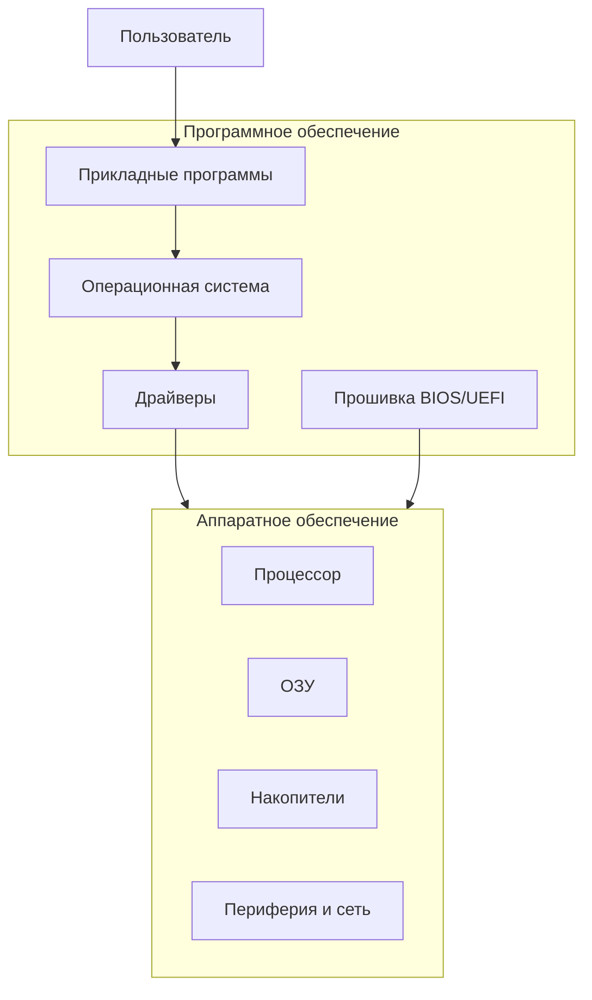
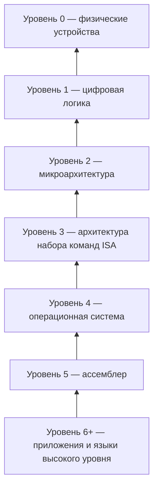
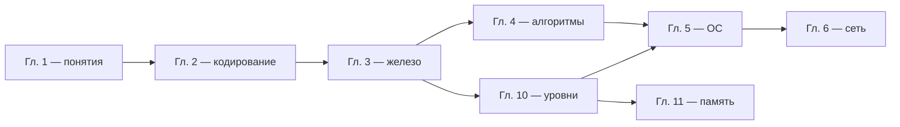

---
tags:
  - all
  - required
  - beginner
  - inprogress
title: Организация, архитектура и уровни компьютера
description: >-
  Как устроен компьютер «слоисто» — от транзисторов до Python; архитектура фон
  Неймана, аппаратура и программы, шесть уровней абстракции и связь с главами курса.
related:
  - title: "Компьютер, периферия и сетевое оборудование"
    doc: encyclopedia/1-basics/1-035-bazovaya-informatika/3
  - title: "ОС, файловые системы и служебные программы"
    doc: encyclopedia/1-basics/1-035-bazovaya-informatika/5
  - title: "Память и вычисления"
    doc: encyclopedia/1-basics/1-035-bazovaya-informatika/11
  - title: "Многоуровневая организация"
    doc: encyclopedia/1-basics/1-08-kak-rabotaet-kompyuter/13
  - title: "Архитектура фон Неймана"
    doc: encyclopedia/2-system-network/2-10-zhelezo/11
---

# Организация, архитектура и уровни компьютера

  ОБЯЗАТЕЛЬНО
  ДЛЯ НОВИЧКОВ
  В РАЗРАБОТКЕ

Всем

Как устроен компьютер?

В первую очередь, рекомендую начать с изучения главы [Как работает компьютер](/encyclopedia/1-basics/1-08-kak-rabotaet-kompyuter/1).

Когда говорят «компьютер», обычно имеют в виду **коробку с железом**. Но без **программ** она бесполезна: процессор умеет только выполнять простые команды, а смысл задачи задаёт человек через софт. В школьном и вузовском курсе информатики эта картина дополняется идеей **уровней абстракции**: от физических транзисторов до привычного браузера или игры.

Эта глава — **сквозной мост** между [кодированием данных](./2), [железом](./3), [ОС](./5), [алгоритмами](./4) и [памятью](./11). Подробная инженерная версия — в [Многоуровневой организации](/encyclopedia/1-basics/1-08-kak-rabotaet-kompyuter/13).

  
Когда читать

  

  Оптимально — <strong>после глав 2 и 3</strong>, до или вместе с главой 5. Тогда «файл на диске», «процесс в ОЗУ» и «машинная команда» складываются в одну систему.
  

---

## Ключевые понятия

| Понятие | Суть одной фразой |
|---------|-------------------|
| **ЭВМ / компьютер** | Аппаратура + программы, выполняющие обработку информации |
| **Аппаратное обеспечение** | Физические узлы: CPU, память, диски, периферия |
| **Программное обеспечение** | Инструкции и данные на носителе: ОС, драйверы, приложения |
| **Организация** | *Как* соединены и взаимодействуют части (шины, память, ввод-вывод) |
| **Архитектура** | *Какие* команды и правила видит программист (ISA, фон Нейман) |
| **Уровень абстракции** | «Язык» и модель, на которой удобно думать, не углубляясь в детали ниже |
| **Виртуальная машина** | Программная или аппаратная среда, имитирующая другой компьютер |

---

## Два составляющих: аппаратура и программы

В типичном курсе информатики **аппаратное обеспечение** и **программное обеспечение** изучают отдельно — потому что это разные «половины» одной системы.

| Слой | Примеры | Глава курса |
|------|---------|-------------|
| **Аппаратура** | Материнская плата, CPU, SSD, монитор | [3](./3) |
| **Системное ПО** | Windows, Linux, драйвер NVIDIA | [5](./5) |
| **Прикладное ПО** | Браузер, Word, игра | [4](./4), [5](./5) |
| **Служебное ПО** | 7-Zip, антивирус, архиватор | [5](./5) |
| **Данные** | Файлы `.docx`, `.mp3`, `.html` | [2](./2) |

★ **Данные** (байты в файле) — не программа, но без правил кодирования ([глава 2](./2)) и без ОС ([глава 5](./5)) к ним не подобраться.

---

## Организация и архитектура — в чём разница

На экзаменах и в учебниках по архитектуре ЭВМ термины **не взаимозаменяемы**.

| | **Организация** | **Архитектура** |
|---|-----------------|-----------------|
| **Вопрос** | Как устроено и связано железо? | Какие команды «видит» программа? |
| **Пример** | Сколько уровней кэша, ширина шины PCIe, объём ОЗУ | Набор команд x86-64, регистры, адресация памяти |
| **Меняется** | От модели к модели CPU (Intel vs AMD) | Реже; нужна пересборка программы при смене семейства |
| **Аналогия** | Планировка дома: где комнаты и двери | Правила общения: на каком языке говорят жильцы |

**Микроархитектура** — промежуточный уровень: *как конкретный чип* (например, Core i7) **реализует** архитектуру x86 — конвейер, кэш, предсказание переходов. Две модели с одной архитектурой x86 могут иметь разную микроархитектуру и разную скорость.

Подробнее — [RISC и CISC](/encyclopedia/2-system-network/2-10-zhelezo/122), [ЭВМ](/encyclopedia/1-basics/1-08-kak-rabotaet-kompyuter/8).

---

## Архитектура фон Неймана

Классическая схема **хранимой программы** (Джон фон Нейман, 1940-е) до сих пор лежит в основе ПК, ноутбуков и серверов.

| Принцип | Смысл |
|---------|--------|
| **Единая память** | И **программа**, и **данные** хранятся в одной адресуемой памяти (ОЗУ / накопитель) |
| **Последовательное выполнение** | CPU по очереди читает команды из памяти и исполняет их |
| **Двоичное кодирование** | Команды и данные — биты и байты |
| **Устройство управления + АЛУ** | Одно устройство управляет потоком, другое считает |
| **Ввод — обработка — вывод** | Периферия подключается к той же схеме |

**Следствия для курса:**

- Несохранённый документ в Word может жить **только в ОЗУ** — при сбое питания пропадёт ([глава 3](./3)).
- Вирус — тоже **программа в памяти**; антивирус и ОС борются на уровне процессов ([глава 5](./5)).
- Файл на диске — **данные**, пока вы его не запустили; `.exe` при запуске копируется в ОЗУ как **код**.

Современные процессоры добавляют **кэш**, **несколько ядер**, **конвейер** — это усложнение организации, но **логическая** картина фон Неймана остаётся.

---

## Шесть уровней абстракции

Компьютер удобно описывать как **иерархию уровней**. Каждый уровень предоставляет **более удобный интерфейс** верхнему и опирается на нижний. Так не нужно писать игру на языке транзисторов.

### Таблица уровней для школьного курса

| Уровень | Название | Что здесь происходит | Пример |
|---------|----------|----------------------|--------|
| **0** | Физика | Электричество, свет, магнитное поле диска | Ток в проводнике |
| **1** | Цифровая логика | Вентили И, ИЛИ, НЕ; регистры; шины | Сложение двух бит в схеме |
| **2** | Микроархитектура | Конвейер, кэш L1–L3, декодирование команд | «Внутренности» Core i5 |
| **3** | ISA (набор команд) | Машинные инструкции: `mov`, `add`, `jmp` | x86-64, ARM |
| **4** | Операционная система | Файлы, процессы, память, сокеты | Windows, Linux |
| **5** | Ассемблер | Мнемоники вместо числовых кодов | `MOV AX, 5` |
| **6+** | Языки и приложения | Python, C++, браузер, Excel | Ваш код и привычные программы |

### Два способа связать уровни

| Способ | Суть | Пример |
|--------|------|--------|
| **Трансляция** | Вся программа верхнего уровня **переводится** в нижний, потом выполняется | C → машинный код (компилятор) |
| **Интерпретация** | Каждая команда верхнего уровня **разбирается и выполняется** по ходу | Python (байт-код + интерпретатор) |

Верхний уровень можно назвать **виртуальной машиной** для программиста: вы пишете для «Python-машины», а реальный CPU исполняет через цепочку переводчиков.

---

## Сквозной пример — от клика до транзистора

Пользователь нажимает **Enter** в поле поиска Google.

| Уровень | Что происходит |
|---------|----------------|
| **6 — приложение** | Браузер обрабатывает событие клавиатуры, формирует HTTP-запрос |
| **4 — ОС** | Планировщик даёт браузеру время CPU; сетевой стек отправляет пакет |
| **3 — ISA** | CPU выполняет миллионы машинных команд библиотек и ядра |
| **2 — микроархитектура** | Конвейер, кэш, предсказание ветвлений ускоряют те же команды |
| **1 — логика** | АЛУ складывает, компараторы сравнивают |
| **0 — физика** | Напряжение на транзисторах кристалла |

Обратный путь — **ответ сервера** → пакеты → TCP/IP ([глава 6](./6)) → декодирование HTML ([глава 2](./2)) → отрисовка GPU ([глава 3](./3)).

---

## Иерархия памяти — ещё одна «лестница»

Помимо уровней **вычислений**, есть иерархия **памяти** (подробно — [глава 11](./11)):

| Уровень | Объём | Скорость | Технология |
|---------|-------|----------|------------|
| Регистры CPU | Минимальный | Максимальная | Триггеры на кристалле |
| Кэш L1–L3 | КБ – МБ | Очень высокая | SRAM |
| ОЗУ | ГБ | Высокая | DRAM |
| SSD / HDD | ТБ | Ниже | NAND / магнитные диски |
| Лента, облако | Очень много | Самая низкая | Архив, CDN |

**Закон:** чем ближе к процессору — тем **меньше** объём и **дороже** бит, но **быстрее** доступ.

---

## Как уровни связаны с главами курса «Базовая информатика»

| Тема курса | Уровни | Глава |
|------------|--------|-------|
| Виды информации, кодирование, байты | 6 (данные приложений) | [1](./1), [2](./2) |
| CPU, ОЗУ, диск, периферия | 0–3 | [3](./3) |
| Алгоритмы и языки | 5–6 | [4](./4) |
| ОС, файлы, драйверы, утилиты | 4 | [5](./5) |
| Сеть и интернет | 4–6 (сокеты, протоколы) | [6](./6) |
| Кэш, задержки, «стена памяти» | 1–2, иерархия RAM | [11](./11) |

---

## Классификация ЭВМ по масштабу (обзор)

Полезно не путать бытовой ПК с сервером в дата-центре — у них разный масштаб и назначение.

| Тип | Назначение | Отличия от desktop |
|-----|------------|-------------------|
| **Микроконтроллер** | Управление устройством (стиралка, Arduino) | Мало RAM, прошивка, без ОС общего назначения |
| **Персональный компьютер** | Учёба, офис, игры | Баланс цена/мощность |
| **Сервер** | 24/7, сеть, базы данных | ECC-RAM, RAID, удалённое управление |
| **Кластер** | Много серверов как одна система | Суперкомпьютеры, облака |
| **Мейнфрейм** | Критичные транзакции банков | Огромная надёжность, дорого |

См. также раздел про серверы в [главе 3](./3#серверы-рабочие-станции-и-бытовой-пк).

---

## Поколения ЭВМ — историческая шкала

| Поколение | Технология | Годы (ориентир) |
|-----------|------------|-----------------|
| 0 | Механика, реле | до 1945 |
| 1 | Электронные лампы | 1945–1955 |
| 2 | Транзисторы | 1955–1965 |
| 3 | Интегральные схемы | 1965–1980 |
| 4 | Большие и сверхбольшие ИС (CPU на одном кристалле) | 1980-е — н.в. |
| 5 | Параллелизм, мобильные, «невидимые» компьютеры (IoT) | 2000-е — н.в. |

История не отменяет **архитектуру фон Неймана** — она эволюционирует внутри тех же принципов.

---

## Задачи для закрепления

**1.** Чем **аппаратное обеспечение** отличается от **программного**? Приведите по два примера.

**2.** Чем **организация** CPU отличается от его **архитектуры** (ISA)?

**3.** Назовите **четыре принципа** архитектуры фон Неймана.

**4.** Расположите по возрастанию уровня абстракции: ассемблер, транзистор, Python, ОС, машинная команда `ADD`.

**5.** Почему программа на Python **не выполняется** напрямую процессором?

**6.** Какой уровень иерархии памяти самый быстрый и самый маленький?

Ответы

1. Аппаратура — физические устройства (CPU, монитор); ПО — программы (Windows, браузер).
2. Организация — как устроен чип внутри; архитектура — какой набор команд видит программист.
3. Единая память для программ и данных; последовательное выполнение; двоичное кодирование; блоки управления и АЛУ; ввод-вывод.
4. Транзистор → машинная команда → ассемблер → ОС → Python (грубо: уровни 0–1 → 3 → 5 → 4 → 6).
5. Нужен интерпретатор или компилятор — уровень 6 переводится на уровни 4–3.
6. Регистры CPU.

---

## Вопросы ОГЭ / ЕГЭ — шпаргалка

| Вопрос | Краткий ответ |
|--------|---------------|
| Архитектура фон Неймана | Программа и данные в памяти; команды по порядку |
| Устройства по фон Нейману | Ввод, память, CPU (УУ+АЛУ), вывод |
| Системное ПО | ОС, драйверы, прошивка |
| Прикладное ПО | Word, браузер, игра |
| Роль ОС | Посредник между программами и железом |
| Чем ISA отличается от микроархитектуры | ISA — «что» можно командовать; микроархитектура — «как» чип это делает |

---

## Куда углубляться дальше

| Тема | Материал |
|------|----------|
| Полная лестница уровней | [Многоуровневая организация](/encyclopedia/1-basics/1-08-kak-rabotaet-kompyuter/13) |
| Фон Нейман, шины | [Архитектура фон Неймана](/encyclopedia/2-system-network/2-10-zhelezo/11) |
| Кэш и задержки | [Память и вычисления](./11) |
| Классификация ПО | [ОС и утилиты](./5) |
| Компиляторы | [Программа — трансляторы](/encyclopedia/1-basics/1-19-programma/2) |

---

Дальше по курсу — [ОС, файловые системы и служебные программы](./5) или углубление [Память и вычисления](./11).
