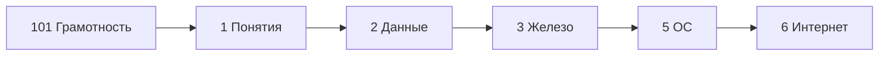

---
tags:
  - all
  - required
  - beginner
  - inprogress
title: Основы компьютерной грамотности
description: >-
  Компьютерная грамотность с нуля - включение ПК, клавиатура и мышь, файлы, интернет,
  почта, облако, установка программ и базовое обслуживание — со ссылками на подробные
  главы энциклопедии.
related:
  - title: "Терминология новичка"
    doc: encyclopedia/1-basics/1-035-bazovaya-informatika/102
  - title: "Базовая информатика — о разделе"
    doc: encyclopedia/1-basics/1-035-bazovaya-informatika/intro
  - title: "Как работает компьютер — о разделе"
    doc: encyclopedia/1-basics/1-08-kak-rabotaet-kompyuter/intro
  - title: "Данные и информация — о разделе"
    doc: encyclopedia/1-basics/1-09-dannye-i-informatsiya/intro
  - title: "Программа — о разделе"
    doc: encyclopedia/1-basics/1-19-programma/intro
  - title: "Советы для новичка — о разделе"
    doc: encyclopedia/1-basics/1-12-sovety-dlya-novichka/intro
  - title: "Основы информационной безопасности — о разделе"
    doc: encyclopedia/2-system-network/2-08-osnovy-informatsionnoy-bezopasnosti/intro
  - title: "Платформы — о разделе"
    doc: encyclopedia/2-system-network/2-02-platformy/intro
---

# Основы компьютерной грамотности

<div class="article-tags">
  <span class="tag tag-required">ОБЯЗАТЕЛЬНО</span>
  <span class="tag tag-beginner">ДЛЯ НОВИЧКОВ</span>
  <span class="tag tag-inprogress">В РАЗРАБОТКЕ</span>
</div>

<span class="complexity-badge">Всем</span>

Здравствуйте! Добро пожаловать во вступительный курс по компьютерной грамотности.

Итак, ПК - это персональный компьютер. 

Компьютерная грамотность в первую очередь определяет, умеете ли вы пользоваться ПК:
- решать повседневные или рабочие задачи;
- понимать принципы работы операционной системы;
- уметь управлять компьютером, включать, выключать, печатать;
- уметь устанавливать, запускать, использовать и удалять программы;
- уметь создавать файлы, папки, копировать, перемещать, искать;
- уметь работать в интернете, использовать браузер;
- уметь отправлять письма по электронной почте;
- знать основную терминологию.

Давайте для начала обзорно познакомимся с самым основным фундаментом.

Если вы **впервые** садитесь за компьютер или давно им не пользовались — эта статья для вас. Глубокую теорию мы не разбираем — вместо этого даём **короткие объяснения** и **ссылки** на отдельные главы энциклопедии.

<div class="callout callout--tip">
  <div class="callout-title">Как читать эту статью</div>

  <div class="callout-body">
  Идите сверху вниз — разделы выстроены в порядке "от включения ПК к уходу за системой". Если тема уже знакома, пролистайте к нужному блоку. После прочтения логичный следующий шаг — <a href="./1">ключевые понятия курса</a> и остальные главы <a href="./intro">базовой информатики</a>.
</div>
</div>

---

## Что такое компьютерная грамотность

★ **Компьютерная грамотность** — умение уверенно работать с персональным компьютером и интернетом: включать устройство, управлять программами, хранить файлы, искать информацию, общаться по сети и не подставлять себя под риски.

Это **набор привычек**:

| Навык | Зачем нужен |
|-------|-------------|
| Понимать, что такое компьютер, программа и файл | Не путать "экран" с "интернетом" и не бояться открыть нужную папку |
| Включать и выключать ПК правильно | Сохранить документы и не повредить данные на диске |
| Пользоваться клавиатурой и мышью | Открывать программы, печатать, копировать текст |
| Работать с файлами и папками | Найти фото, отчёт или установщик, а не "потерять" их на рабочем столе |
| Безопасно пользоваться сетью | Не попасть на мошенников, не раздать пароль и не скачать вирус |
| Устанавливать и обновлять программы | Поставить браузер, офис или мессенджер из надёжного источника |
| Поддерживать компьютер в порядке | Освободить место на диске, закрыть зависшую программу, проверить систему |

Компьютер может быть:
- серверным (без навыков администрирования нужно быть осторожным);
- рабочим (принадлежит работодателю, а работнику предоставляется для выполнения задач);
- личным (принадлежит пользователю).

С *личным компьютером* - можете устанавливать что хотите, играть, смотреть фильмы, разбирать и даже ломать. Это ваша техника, но учтите, что она, как правило, не дешевая.

С *рабочим компьютером* - нельзя устанавливать всё подряд, играть или развлекаться - используйте только для рабочих задач. Ставьте только то, что необходимо, и не удаляйте лишнего.

С *серверами* - максимально аккуратно. На них, как правило, содержится важнейшая информация и ключевые программы, а допуск к управлению имеют администраторы, инженеры и разработчики - продвинутые пользователи, обладающие особыми навыками.

Правила доступа к любым файлам, папкам и устройствам могут ограничиваться политикой компании - за их реализацию отвечают системные администраторы.

Компьютерная грамотность — **база** для учёбы, работы и для тех, кто потом захочет разобраться в программировании или IT-профессии. Карта всего курса — в [оглавлении раздела](./intro).

---

## Термины — куда смотреть

Прежде чем углубляться в практику, полезно иметь словарь. Все бытовые термины (компьютер, файл, ОС, браузер, интернет, почта и типичные путаницы) собраны в отдельной статье — **[Терминология новичка](./102)**. Открывайте её по мере чтения или держите под рукой (**Ctrl+F** на странице).

<div class="callout callout--tip">
  <div class="callout-title">Минимум на старт</div>

  <div class="callout-body">
  Для абсолютного начала достаточно понять: <strong>компьютер</strong> — аппарат + ОС + ваши программы; <strong>файл</strong> — сохранённый на диске документ, фото или программа. Остальное — в <a href="./102">словаре новичка</a>.
</div>
</div>

---

## Как включать и выключать компьютер

### Включение

На любом корпусе есть кнопка включения ⏻ - как правило, это большая круглая или квадратная кнопка питания (Power). Обычно на ней нанесён значок в виде круга с вертикальной палочкой внутри.

Компьютер обладает блоком питания (в отличие от ноутбука и смартфона), и он может быть отключён отдельно ("I" - включен, "O" - выключен). Именно блок питания подключается к розетке проводом 🔌, и питает остальные компоненты. 

1. Убедитесь, что **монитор**, **клавиатура** и **мышь** подключены (на ноутбуке — достаточно зарядки или батареи).
2. Нажмите кнопку **питания** на системном блоке или на крышке ноутбука. На некоторых клавиатурах есть отдельная клавиша питания.
3. Подождите: сначала может мелькнуть логотип производителя, затем появится **экран входа** (пароль, PIN или выбор пользователя).
4. После входа вы увидите **рабочий стол** — фон, значки и панель задач (внизу в Windows, вверху или внизу на Mac и Linux).


При включении компьютер проходит цепочку: проверка железа → загрузка ОС → рабочий стол. Если что-то "зависло" на чёрном экране — см. [загрузку системы](/encyclopedia/1-basics/1-08-kak-rabotaet-kompyuter/6).

Обычно компьютер загружается 1-2 минуты. Старые компьютеры могут грузить дольше - новые запускаются быстро благодаря современным технологиям (например, переход форматов дисков с HDD на SSD).

---

### Выключение и перезагрузка

Компьютер выключается поэтапно:
- сначала закрываются все программы;
- завершаются процессы операционной системы;
- очищается оперативная память;
- запускается процесс отключения устройств.

Электричество - это не шутки. При скачках электроэнергии или резких отключениях, вы можете повредить компоненты, поэтому относитесь к технике бережно - сначала закройте всё, затем выключайте компьютер программно, через средства операционной системы. Сейчас разберёмся, как это сделать.

Во-первых, следует знать, что в компьютере есть несколько вариантов.

| Действие | Как сделать (Windows) | Зачем |
|----------|----------------------|-------|
| **Завершение работы** | Пуск → "Выключение" или "Завершение работы" | Закрыть все программы корректно, сохранить данные |
| **Перезагрузка** | Пуск → "Перезагрузка" | После обновлений, при "тормозах" или сбоях сети |
| **Сон / гибернация** | Закрыть крышку ноутбука или Пуск → "Сон" | Быстро вернуться к работе без полного выключения |

Во-вторых, программное завершение работы - это буквально подразумевается "найти команду завершения работы и запустить".


В-третьих, будьте аккуратны с механическим выключением по кнопке ⏻.

Принудительное выключение устройства - это механический "рубильник", когда вы нажимаете кнопку выключения ⏻ несколько секунд, пока компьютер "не умрёт". Да, именно "умрёт", потому что вы буквально механически его вырубаете. Это опасно, и, вы понимаете, что вы пропускаете этапы закрытия процессов. Поэтому ваши данные не будут сохранены, если вы прямо это не сделаете.

**Не выдёргивайте шнур питания** и не держите кнопку питания 10 секунд, пока не сохранили документы — можно потерять несохранённую работу. Жёсткое отключение допустимо только если компьютер **полностью завис** и не реагирует минуту и больше.

Подробнее о разнице перезагрузки и "выключения с кнопки" — в [итогах раздела "Как работает компьютер"](/encyclopedia/1-basics/1-08-kak-rabotaet-kompyuter/98).

---

## Как управлять компьютером

Компьютер управляется периферийными устройствами ввода:
- клавиатура;
- мышь;
- геймпад, игровые устройства;
- сенсорный (тач-скрин) экран;
- тачпад (сенсорный эмулятор мышки на ноутбуке).

Каждое из этих устройств имеет свои возможности и особенности.

---

### Клавиатура

Клавиатура — главный способ **вводить текст**: буквы, цифры, пробелы. Есть служебные клавиши:

| Клавиша | Для чего |
|---------|----------|
| **Enter** | Подтвердить, перейти на новую строку |
| **Backspace** | Стереть символ слева от курсора |
| **Delete** | Стереть символ справа или выделенный фрагмент |
| **Shift** | Заглавная буква; вместе с другими — сочетания |
| **Ctrl** (Cmd на Mac) | Сочетания: копировать, вставить, сохранить |
| **Alt** | Меню, переключение языка (зависит от настроек) |
| **Tab** | Перейти к следующему полю в форме |
| **Esc** | Отмена, закрыть диалог |

На Windows важно запомнить клавишу 🪟 - Win. Ключевые сочетания клавиш позволяют блокировать компьютер, открывать меню пуск, открывать различные системные приложения.

Если нажать определённые клавиши одновременно (нажать сочетание, комбинацию клавиш), то выполнятся определённые действия.

Примеры:

| Комбинация | Действие |
|------------|----------|
| `Ctrl + C` / `Ctrl + V` | Копировать / Вставить |
| `Ctrl + Z` | Отменить последнее действие |
| `Ctrl + S` | Сохранить файл |
| `Alt + Tab` | Переключиться между окнами |
| `Win + L` | Заблокировать компьютер |
| `Win + D` | Свернуть все окна / показать рабочий стол |
| `Ctrl + Shift + Esc` | Открыть Диспетчер задач |

Полезные сочетания в Windows — в статье [Горячие клавиши](/encyclopedia/1-basics/1-12-sovety-dlya-novichka/3). Карта клавиш для новичка — [Клавиши для новичка](/encyclopedia/1-basics/1-08-kak-rabotaet-kompyuter/7131); устройство клавиатуры — [Клавиатура](/encyclopedia/1-basics/1-08-kak-rabotaet-kompyuter/713). Набор текста вслепую — [Как научиться быстро печатать](/encyclopedia/1-basics/1-12-sovety-dlya-novichka/14).

---

### Мышь

Мышь позволяет вам использовать указатель, и даёт больше возможностей, позволяя перемещать точки в пространстве.

| Действие | Результат |
|----------|-----------|
| **Один щелчок** | Выделить объект, поставить курсор в тексте |
| **Двойной щелчок** | Открыть файл или программу |
| **Правый щелчок** | Контекстное меню (копировать, удалить, свойства) |
| **Колёсико** | Прокрутка страницы |
| **Перетаскивание** | Переместить файл или выделить область |

Подробнее об устройстве мыши — [Мышь и геймпад](/encyclopedia/1-basics/1-08-kak-rabotaet-kompyuter/714). Удобное положение рук — [Эргономика рабочего места](/encyclopedia/1-basics/1-12-sovety-dlya-novichka/2).

---

### Базовые элементы операционной системы

Операционная система - это главный комплекс программ, которым вы пользуетесь ежедневно. Именно через неё вы работаете с файлами, папками, программами. Они бывают нескольких основных семейств:
- Десктопные (Windows, Linux, macOS);
- Мобильные (адаптированные под смартфоны - iOS, Android, iPadOS);
- Серверные (Windows Server, Linux, FreeBSD и прочие).

Скорее всего, вы работаете через десктопную систему, и самая популярная - Windows. Почти каждый человек сталкивается с этой системой, так как она является самой дружелюбной к новичкам, и оптимизирована под офисные задачи.

При включении Windows вы увидите экран входа в систему:


Бывают действия, которые система выполняет самостоятельно - через службы и менеджеры.

А бывают действия, которые выполняет человек через наборы команд и программ - это пользовательские действия.

Чтобы работать в системе, требуется наличие учётной записи. По умолчанию, такая запись создаётся ещё при установке системы. Можно выделить три вида пользователей:
- Гость (минимальный набор возможностей);
- Пользователь (обычный набор);
- Администратор (полный набор, с возможностью изменения и удаления критических элементов).


Можно создавать несколько пользователей. Например, по одному профилю для каждого члена семьи, или сотрудника отдела. У каждого будет своё имя и пароль - для входа в систему нужно использовать именно их.

Windows предполагает использование графического интерфейса, поэтому после входа в систему вы работаете с несколькими привычными зонами экрана:

| Элемент | Назначение |
|---------|------------|
| **Рабочий стол** | Значки программ и файлов, фоновая картинка |
| **Панель задач** | Кнопка "Пуск", открытые программы, часы, сеть, звук |
| **Меню "Пуск"** | Список программ, параметры, выключение |
| **Окно программы** | Заголовок, кнопки свернуть / развернуть / закрыть |
| **Проводник** (Проводник Windows, Finder на Mac) | Просмотр дисков, папок и файлов |
| **Параметры / Настройки** | Язык, Wi‑Fi, учётная запись, обновления |

Основной инструмент - Проводник. Именно он отвечает за работу с файлами, данными, предоставляет структуру, навигацию и организацию. Он, или его аналоги, есть практически везде - на macOS называется Finder, а на Linux и вовсе можно использовать любую на свой вкус.

Именно через проводник вы можете работать с папками, библиотеками, избранным, загрузками и рабочим столом:


Вы можете хранить данные в файлах и папках, располагая их в удобном порядке как на рабочем столе, так и в целом на диске.

На Windows начальная настройка — [Настройка Windows](/encyclopedia/1-basics/1-12-sovety-dlya-novichka/11). Обзор функций ОС — [глава 5 курса](/encyclopedia/1-basics/1-035-bazovaya-informatika/5) и раздел [Операционная система](/encyclopedia/2-system-network/2-01-operatsionnaya-sistema/intro).

Визуально, все программы открываются в виде окна, имеющего характерные особенности:
- заголовок;
- кнопки управления (свернуть, развернуть, закрыть);
- рамки и содержимого.


Система Windows потому и называется "Окна", потому что её архитектура в принципе закладывает удобство визуального использования графического интерфейса через окна.

Любое окно вы можете закрыть, нажав на крестик в углу, и свернуть, нажав на черточку "-".

Сворачивание предполагает, что программа не прекращает свою работу, а лишь перестаёт занимать место на экране, аккуратно "прячась" в панель задач. Пользователь в любой момент может вернуться и развернуть окно заново.

А закрытие же предполагает, что программа завершает свою работу, и освобождает ресурсы компьютера.

Но! Многие современные программы не закрываются этим крестиком, а сворачиваются в специальную панель в углу, называемую "трей":


Системный трей (область уведомлений) - это специальная часть панели задач, которая находится в правом нижнем углу экрана (возле часов). Она используется для отображения времени, фоновых программ, статуса сети, громкости и входящих уведомлений. Здесь висят иконки программ, которые продолжают работать, даже когда вы закрываете их главное окно (например, антивирусы, мессенджеры, плееры, лаунчеры игр). Всплывающие сообщения о статусе системы (например, необходимость перезагрузки для обновлений) или сообщения от приложений появляются именно здесь.

В трее вы видите лишь иконки запущенных приложений, и можете их закрыть или развернуть, а также использовать контекстное меню при нажатии по иконке правой кнопкой мыши.

Если вы нажали на "крестик", программа может не закрыться полностью - проверяйте область уведомлений.

---

### Обязательно загляните в "Советы для новичка"

Раздел [Советы для новичка — о разделе](/encyclopedia/1-basics/1-12-sovety-dlya-novichka/intro) — практическая "шпаргалка" повседневной работы:

| Задача | Статья |
|--------|--------|
| Первые шаги, пароли, антивирус, бэкап | [Советы для начинающего пользователя ПК](/encyclopedia/1-basics/1-12-sovety-dlya-novichka/1) |
| Работа с папками в Windows | [Работа с проводником Windows](/encyclopedia/1-basics/1-12-sovety-dlya-novichka/1111) |
| Запуск и перезапуск программ | [Запуск и перезапуск приложений](/encyclopedia/1-basics/1-12-sovety-dlya-novichka/13) |
| Скриншоты | [Создание скриншотов](/encyclopedia/1-basics/1-12-sovety-dlya-novichka/5) |
| Безопасность за столом | [Техника безопасности при работе за компьютером](/encyclopedia/1-basics/1-12-sovety-dlya-novichka/1112) |
| Самопроверка | [Чек-лист](/encyclopedia/1-basics/1-12-sovety-dlya-novichka/99) |

---

## Как работать с файлами и папками

### Что такое файл и папка

★ **Файл** 📄 — именованный набор данных на диске, например, документ, фотография, музыка, установщик программы.

У каждого файла свой формат. Вот некоторые из них:

| Расширение | Тип | Чем открывается |
|------------|-----|-----------------|
| `.docx`, `.txt` | Текст | Word, Блокнот |
| `.pdf` | Документ | Браузер, Adobe Reader |
| `.jpg`, `.png` | Изображение | Просмотрщик фото |
| `.mp3`, `.mp4` | Медиа | Плеер, браузер |
| `.exe`, `.msi` | Установщик | Запускает установку или другую программу (осторожно!) |
| `.zip`, `.rar` | Архив | Архиватор |


★ **Папка (каталог)** 📁 — "контейнер" для файлов и других папок. Вместе они образуют **дерево** — как шкаф с полками и папками-разделителями.


При клике по папке вы перейдёте внутрь такого каталога - и папки могут быть внутри других папок, образуя цепочку `Папка1\Папка2\Папка3\` - такой путь разделяется символом `\`.

Пример пути в Windows: `C:\Users\Иван\Documents\отчёт.docx` — диск `C:`, затем вложенные папки, затем имя файла.

Обратите внимание - файлы бывают разные. Они отличаются расширениями, которые определяются символами после названия, разделяемыми точкой, например `файл.txt` - это файл с именем "файл" и расширением ".txt". По умолчанию вы не увидите расширения - это отключено для безопасности. Чтобы включать отображение, нужно поставить галочку в панели управления:

1. Сначала нажмите Win+R или нажмите правой кнопкой на "Пуск" и выберите "Выполнить":


2. Откроется специальное приложение для выполнения команд - "Выполнить". Запомните - оно удобно для запуска важных программ, например, Проводника, Редактора реестра, или Панели управления. Нам как раз нужна последняя - пишем `control` и жмём "ОК":


3. Теперь переходим в "Оформление и персонализация":


4. Выбираем "Показ скрытых файлов и папок":


5. Убираем галочку "Скрывать расширения для зарегистрированных типов файлов":


Теперь вы будете видеть расширения файлов. Аккуратно - не меняйте их без надобности, при переименовании - иначе измените формат. Но порой это нужно. Например, возьмём наш текстовый файл:


Мы можем поменять его расширение на `html` - и он станет веб-страницей. Система заботливо предупредит нас о том, что мы меняем его формат:


После нашего подтверждения - мы получаем другой файл, который будет открывать уже не текстовый редактор, а браузер.


Чтобы отменить изменения - вы можете нажать Ctrl+Z - это комбинация клавиш, которая отменяет любые действия в системе. Также отменить можно через контекстное меню, если нажать правой кнопкой по пустому месту окна:


Обратите внимание - если нажать на пустом месте - вы будете управлять текущей папкой, а если на конкретном файле - управлять именно этим файлом. Это и есть контекстное меню.

Вот пример - когда вы кликаете по пустому месту в окне, вы можете открыть эту папку в терминале, что-то создать, отменить последние действия, а также выполнять другие действия с этим каталогом:


А вот другой пример - когда мы кликнули по конкретному файлу - теперь мы можем именно его открыть, изменить, удалить, переименовать, отправить и прочее - но возможностей работы с папки здесь нет:


---

### Основные действия

Какие же действия могут быть важнейшими?

| Действие | Как обычно делают |
|----------|-------------------|
| **Создать папку** | Правый щелчок в пустом месте → "Создать" → "Папку" |
| **Переименовать** | Медленный двойной щелчок по имени или F2 |
| **Копировать / вставить** | Выделить → Ctrl+C, перейти в папку → Ctrl+V |
| **Переместить** | Перетащить мышью или Ctrl+X, затем Ctrl+V |
| **Удалить** | Delete → файл попадает в **Корзину**; "Очистить корзину" — удалить окончательно |
| **Найти файл** | Поиск в проводнике или Win+S (Windows) / Spotlight (Mac) |

Когда вы нажимаете правой кнопкой по любому элементу в системе - вы вызываете **контекстное меню** - динамический набор действий, доступный в зависимости от выбранного объекта.


Удаление - не всегда сразу удаляет файл. Для безопасности и удобства изобрели "Корзину" - специальный скрытый каталог в системе, в котором временно хранится удалённое, пока "Корзина" не будет очищена. Вы можете найти её на рабочем столе:


Поэтому, если вы случайно удалили файл - можете его восстановить из той самой "Корзины".

---

### Как не запутаться

- Не складывайте всё на **рабочий стол** — заведите папки "Документы", "Фото", "Загрузки".
- Давайте файлам **понятные имена**: `Договор_2025_Иванов.pdf`, а не `Новый документ (3).docx`.
- Раз в месяц просматривайте папку **Загрузки** — там скапливается лишнее.
- Перед удалением незнакомого файла проверьте **расширение** (`.docx`, `.jpg`, `.exe`) — переименование не меняет тип файла.

В Проводнике есть "Быстрый доступ" - туда можно закреплять папки, которые вы часто открываете. Просто перетащите нужную папку на эту панель.


Подробный разбор путей, NTFS и прав доступа — [глава 5 курса](/encyclopedia/1-basics/1-035-bazovaya-informatika/5). Практика в проводнике — [Работа с проводником Windows](/encyclopedia/1-basics/1-12-sovety-dlya-novichka/1111). Поиск текста **внутри** файлов на компьютере — [поиск в терминале и редакторах](/encyclopedia/2-system-network/2-05-terminal/104).

---

### Резервная копия

Как вы поняли, если файл удалить из корзины - он окончательно удалится из файловой системы (есть конечно секретики, как можно его восстановить, но это отдельная тема, как-нибудь позже). И есть другие события - например, если диск выйдет из строя, то информация неизбежно пропадёт.

Чтобы не остаться без важных данных, дублируйте - копируйте файлы на другой источник.


Здесь как раз пример - мы сделали копию файлов на другом диске.

Если файл важен — храните **копию** на другом диске, флешке или в облаке. Простое правило **3-2-1**: три копии данных, на двух разных носителях, одна — вне дома (облако или другой адрес). Подробнее — в [советах для начинающего](/encyclopedia/1-basics/1-12-sovety-dlya-novichka/1).

Важно помнить, что если вы не сохраните файл - то данные не восстановить.

Например, если вы работали с документом или презентацией, а потом сразу выключили компьютер, предварительно не сохранив данные в файл на диске, то они будут потеряны безвозвратно.

Это потому что в момент открытия файла, данные хранятся в оперативной памяти, а после сохранения файла - уже на диске.

Отличие в том, что при перезагрузке компьютера оперативная память очищается, и всё, что не сохранено на диск, уничтожается. Диски для этого и предназначены - чтобы хранить данные постоянно.

> Простой совет - всегда нажимайте Ctrl+S каждые 10-15 минут, на всякий случай. Делайте копии, если не хотите менять сохранением оригинал.

---

## Работа в сети

Сеть - это просто бесчисленное множество компьютеров, соединённых между собой различными способами - проводными и беспроводными.

Интернет - это глобальная, всемирная сеть, созданная с целью связи всех стран, независимо от их местоположения. Именно благодаря современным технологиям, вы, находясь, к примеру, в Москве, открываете за считанные секунды программы, запущенные на серверах в Калифорнии.

Интернет позволяет вам открывать файлы с других компьютеров, и некоторые файлы организованы в особые виды приложений, называемые "сайтами".

Сайт - это совокупность веб-страниц, данных и скриптов, скачиваемых на компьютер при открытии ссылки.

Браузер - это не интернет, а программа для просмотра тех самых веб-страниц и запуска скриптов.

---

### Подключение к интернету

Поскольку вы открыли этот сайт, скорее всего, вы уже умеете работать с браузером. Тем не менее, в этой энциклопедии вы найдёте целый раздел, посвящённый сетям - [Сеть и интернет](/encyclopedia/2-system-network/2-03-set-i-internet/1).

Компьютер подключается к сети несколькими способами.

Дома чаще всего используют **Wi‑Fi** (беспроводно) или **кабель** к роутеру. Пароль от сети обычно на наклейке на роутере или выдаёт провайдер. Настройка — в "Параметрах" → "Сеть и интернет". Если страницы не открываются — [Ускорение интернета](/encyclopedia/1-basics/1-12-sovety-dlya-novichka/312) и [глава 6 курса](/encyclopedia/1-basics/1-035-bazovaya-informatika/6).

Доступ к сети позволяет вам:
- открывать веб-страницы по различным адресам;
- скачивать файлы на свой компьютер;
- загружать файлы на внешние сервера;
- передавать данные другим людям.

---

### Безопасность в интернете — минимум для новичка

Интернет опасен. Вы можете попасть к злоумышленникам, скачать опасный файл, и потерять свои данные. Будьте внимательны. Наша энциклопедия уделяет огромные материалы угрозам и борьбе с ними.

| Правило | Почему |
|---------|--------|
| Не переходите по подозрительным ссылкам из SMS и писем | Мошенники подделывают банки и магазины |
| Не вводите пароль на сайте без **замка** (HTTPS) | Данные могут перехватить |
| Не скачивайте программы с "левых" сайтов | Часто в установщике — вирус |
| Используйте **разные пароли** для важных сервисов | Украли один — не откроют всё |
| Не отправляйте фото паспорта и коды из SMS незнакомцам | Социальная инженерия |

Базовый курс по защите — [Основы информационной безопасности — о разделе](/encyclopedia/2-system-network/2-08-osnovy-informatsionnoy-bezopasnosti/intro): [триада CIA](/encyclopedia/2-system-network/2-08-osnovy-informatsionnoy-bezopasnosti/1), [пароли](/encyclopedia/2-system-network/2-08-osnovy-informatsionnoy-bezopasnosti/114), [открытый Wi‑Fi](/encyclopedia/2-system-network/2-08-osnovy-informatsionnoy-bezopasnosti/113). Право и персональные данные в школьном курсе — [глава 7](/encyclopedia/1-basics/1-035-bazovaya-informatika/7).

---

### Поиск информации

Часто мы используем поиск. Этому у нас посвящён целый раздел.

Кратко, чтобы найти ответ в интернете:

1. Сформулируйте запрос **своими словами**, можно добавить год или "как сделать".
2. Сравните **несколько источников** — не верьте первой ссылке.
3. Официальные сайты производителя и `.gov` / `.edu` надёжнее случайных форумов.

Практика запросов — [Эффективный поиск в интернете](/encyclopedia/1-basics/1-21-poisk-informatsii/3). Как устроены поисковики — [Поиск информации — о разделе](/encyclopedia/1-basics/1-21-poisk-informatsii/intro). На сайте "Вселенной IT" свой поиск — **Ctrl+K** в шапке.

В Windows вы можете искать всё, что угодно, благодаря встроенной системе поиска. Обычно это можно выполнить в меню Пуск или сразу по значку лупы 🔍 в панели задач. В поиске можете написать что угодно, например "Очистка диска", и увидите результат:


Пользуйтесь регулярно - это сильно экономит вам время.

---

### Электронная почта

Официальные переписки с работодателями, компаниями, коллегами ведётся через электронную почту - это специальный способ общения, подразумевающий использование особых протоколов, позволяющих передавать сообщения от отправителя к адресату.

Почта часто нужна для регистрации на сайтах, переписки с учебой и работой, получения чеков и кодов подтверждения.

Другое название - `e-mail`, такое сокращение с английского языка. Вам нужно научиться создавать электронную почту.

Можете потренироваться - если у вас нет электронной почты, создайте её на одном из популярных провайдеров:
- [Gmail](https://support.google.com/mail/answer/56256?hl=ru);
- [Mail.ru](https://new.mail.ru/);
- [Яндекс](https://mail.yandex.ru/).

| Понятие | Смысл |
|---------|--------|
| **Адрес** | `имя@сервис.ru` — уникальный "ящик" |
| **Входящие** | Письма, которые вам отправили |
| **Вложение** | Файл в письме — проверяйте отправителя перед открытием |
| **Спам** | Нежелательная реклама и мошенничество — не отвечайте |

Подробно — [Электронная почта](/encyclopedia/1-basics/1-22-kommunikatsiya-i-obschenie/3) и раздел [Коммуникация и общение](/encyclopedia/1-basics/1-22-kommunikatsiya-i-obschenie/intro). Деловой тон и структура письма — [Организационная и деловая переписка](/encyclopedia/1-basics/1-22-kommunikatsiya-i-obschenie/5).

---

### Облачные хранилища

Не обязательно хранить данные только на своём диске - некоторые корпорации обладают такими деньгами и возможностями, что готовы за небольшую плату предоставить вам место, и обеспечить безопасность - от вас потребуется только помнить свой пароль. Это называют "облачным хранением".

Это как арендовать место в чужой квартире для хранения своих вещей.

**Облако** — файлы лежат на серверах компании в интернете, а на вашем ПК часто есть **синхронизированная папка**. 


Плюсы: доступ с телефона, общий доступ, резервная копия. 

Минусы: нужен интернет; важно не путать личный и рабочий аккаунт.

| Сервис | Для кого |
|--------|----------|
| Google Drive | Пользователи Gmail и Android |
| OneDrive | Пользователи Windows и Microsoft 365 |
| Яндекс.Диск | Экосистема Яндекса |

Обзор "облака для людей" и облака для программистов — [Модели и сервисы облачных технологий](/encyclopedia/8-infra-security/8-01-oblachnye-tehnologii/1). Платформы в IT в целом — [Платформы — о разделе](/encyclopedia/2-system-network/2-02-platformy/intro).

---

### Защита личных данных

- Не публикуйте в открытом доступе **адрес, телефон, паспорт**, фото детей без необходимости.
- В соцсетях проверьте **настройки приватности** — кто видит ваши посты.
- Перед установкой приложения на телефон смотрите, **к каким данным** оно просит доступ.
- Удаляйте старые аккаунты, которыми не пользуетесь.

См. также [главу 7 курса](/encyclopedia/1-basics/1-035-bazovaya-informatika/7) и [родительский контроль](/encyclopedia/1-basics/1-12-sovety-dlya-novichka/111), если настраиваете устройство ребёнку.

---

## Установка и обслуживание программ

### Как устанавливать программы

В системе некоторые программы установлены по умолчанию, но порой их недостаточно. Например, отличный браузер Google Chrome не будет в системе сразу, и его понадобится установить - и аналогично бывает со всеми задачами.

Вам понадобится установить:
- архиваторы;
- медиаплееры для фильмов и музыки;
- веб-браузеры для работы в интернете;
- средства для видеосвязи и звонков;
- мессенджеры и клиенты электронной почты;
- офисные пакеты для работы с документами;
- инструменты для редактирования фото и видео;
- антивирусы;
- редакторы кода;
- отраслевые программы по вашим задачам.

1. **Скачайте** установщик с **официального сайта** разработчика или из **магазина приложений** (Microsoft Store, App Store).
2. Запустите файл (часто `.exe` в Windows). Если система спрашивает "Разрешить изменения?" — соглашайтесь только если **сами** запустили известную программу.
3. На шагах мастера выбирайте **"Выборочная установка"** и снимайте галочки "установить дополнительный софт".
4. Дождитесь окончания и при необходимости **перезагрузите** компьютер.

Некоторые программы или устройства требуют подготовки, чтобы система могла правильно с ними работать.

Пример - вы купили новую видеокарту, чтобы играть в современные и крутые игры с хорошей графикой. Вы её успешно установили, но - что-то не так - она либо тормозит, либо шумит, либо не включается вовсе. Порой необходимо установить специальный набор программ, который обеспечит совместимость, выступая как "переводчик" между ОС и железом.

Такие программы-переводчики называют **драйвер** - их нужно устанавливать на компьютер для каждого устройства - принтеры, аудио, видео, периферийные, и даже внутренние устройства. Без правильного драйвера устройство может работать плохо или не работать вовсе. Например, ваш микрофон может просто не работать.

Драйверы - это программы, которые можно скачать с официальных сайтов производителей.

Обычно при первой установке Windows, система автоматически обнаруживает все устройства, и скачивает всё необходимое из Центра обновления Windows - именно для этого необходим доступ к интернету при первой установке.

Подробные рекомендации — [Советы для начинающего](/encyclopedia/1-basics/1-12-sovety-dlya-novichka/1). Софт для обычного пользователя — раздел [Софт рядового пользователя](/encyclopedia/1-basics/1-11-soft-ryadovogo-polzovatelya/intro).

---

### Диспетчер задач

Для управления множеством программ существует специальная программа-менеджер, называемая Диспетчер задач (Task Manager). Она позволяет посмотреть, что сейчас запущено, сколько ресурсов использует, а также предоставляет возможности принудительного завершения процессов.

Через Диспетчер задач, вы можете "Снять задачу" и решить большинство проблем.


Если программа **зависла** или компьютер **тормозит**:

- Windows: **Ctrl+Shift+Esc** → вкладка "Процессы" → завершить задачу.
- Смотрите загрузку **процессора**, **памяти** и **диска** — кто "съедает" ресурсы.

Те же идеи — в [главе 5 курса](/encyclopedia/1-basics/1-035-bazovaya-informatika/5) и [советах по автозагрузке](/encyclopedia/1-basics/1-12-sovety-dlya-novichka/1). Для Windows глубже — [Windows — диспетчер и защита](/encyclopedia/2-system-network/2-06-sistemnoe-administrirovanie/97).

---

### Очистка системы

Порой место на диске заканчивается - и Проводник об этом предупреждает:


В такой ситуации, вам нужно выяснить, что именно занимает много места, и удалить, если оно является лишним. Вы можете либо найти такие проблемы вручную, пройдясь по всем папкам, либо автоматически, через специальные возможности.

| Что делать | Как |
|------------|-----|
| Освободить место | Удалить ненужные файлы, очистить "Загрузки", корзину; встроенная "Очистка диска" (Windows) |
| Обновления | Пуск → Параметры → Обновление — ставить **обновления безопасности** |
| Не ставить "чудо-оптимизаторы" | CCleaner с чисткой реестра "наугад" может навредить |

Иногда системная папка WinSxS может занимать много места - важно периодически проводить очистку.


WinSxS (Windows Side by Side) — это системная папка в Windows, которая выступает в роли хранилища компонентов. Папка постепенно увеличивается в размерах, так как сохраняет предыдущие версии системных компонентов и обновлений. Это сделано намеренно, чтобы в случае сбоя или некорректного обновления вы могли беспрепятственно откатить систему до стабильного состояния или удалить установленный апдейт. 

Для очистки хранилища компонентов используйте исключительно встроенные инструменты Microsoft:
- либо "Очистка диска" - встроенный инструмент;
- либо вручную, через командную строку и утилиту DISM.

1. Нажмите `Win + R`, введите `cmd` и нажмите `Ctrl + Shift + Enter`, чтобы запустить командную строку от имени Администратора.
2. Чтобы посмотреть, рекомендуется ли очистка, введите команду:
```
DISM.exe /online /Cleanup-Image /AnalyzeComponentStore
```
3. Чтобы сразу удалить все замененные и неиспользуемые компоненты (без возможности их отката), введите:
```
DISM.exe /online /Cleanup-Image /StartComponentCleanup /ResetBase
```

> Если команды выше вас пугают - значит, вам точно нужно обучиться владению терминалом. Подробности можете получить в отдельном разделе [Терминал](/encyclopedia/2-system-network/2-05-terminal/1).

Проблемы могут наблюдаться и в других папках, например, AppData:


Запомните:
- программы часто используют временные файлы;
- картинки, которые вы видите в браузере - сохраняются на вашем компьютере и копятся как кэш;
- если программа показывает вам какой-то веб-контент - этот контент тоже сохраняется в кэш;
- разработка порой очень требовательная к месту в хранилище;
- такие временные файлы можно удалять, потому что они всё равно снова загрузятся, когда вы вернётесь к просмотру контента.

| Симптом | Что проверить |
|---------|---------------|
| "Недостаточно места" | Свободное место на диске `C:`; корзина; папка "Загрузки"; старые игры и фильмы |
| Медленная работа | Диск заполнен почти полностью — ОС и программам не хватает места для временных файлов |
| Большие файлы | Перенесите видео и архивы на диск `D:` или внешний накопитель |

Как устроены диски и разделы — [Накопители](/encyclopedia/1-basics/1-08-kak-rabotaet-kompyuter/3), [глава 3 курса](/encyclopedia/1-basics/1-035-bazovaya-informatika/3). Правила обращения с HDD — [Правила работы с жёстким диском](/encyclopedia/2-system-network/2-06-sistemnoe-administrirovanie/data-restoring/114). Проверка диска на ошибки — в [советах для начинающего](/encyclopedia/1-basics/1-12-sovety-dlya-novichka/1).

---

### Защита от вирусов

Система Windows по умолчанию имеет стандартное средство защиты - Windows Defender (Защитник Windows). От обычных проблем оно защитит, но от продвинутых угроз - нет.

Рекомендуется использовать продвинутые системы защиты от проверенных вендоров с регулярным обновлением баз. Компании-разработчики антивирусов профильно занимаются информационной безопасностью, в отличие от многосторонней Microsoft, поэтому рациональнее довериться профессионалам.

Единственный минус антивирусов, на мой взгляд - это трата ресурсов - ОЗУ, процессор и диск. Сканер регулярно проверяет хранилище, ищет угрозы и порой даже мешает запуску вполне полезных, но подозрительных программ.

Здесь можно сказать следующее:
- Обзаведитесь антивирусом, или держите включённым **Защитник Windows** (или аналог на Mac/Linux).
- Не открывайте вложения от незнакомых отправителей.
- Делайте **резервные копии** важных файлов — от шифровальщиков это спасает чаще всего.
- Не качайте и не устанавливайте непроверенные файлы.

Если вы скачали незнакомый (или непроверенный) файл, и не можете на все 100% гарантировать, что он не заражён, на всякий случай просканируйте его антивирусной программой.

Классификация угроз и антивирусы — [глава 5 курса](/encyclopedia/1-basics/1-035-bazovaya-informatika/5), [Антивирус и лечение](/encyclopedia/2-system-network/2-08-osnovy-informatsionnoy-bezopasnosti/112), раздел [Информационная безопасность](/encyclopedia/8-infra-security/8-07-informatsionnaya-bezopasnost/intro).

Не отключайте **встроенный антивирус** "ради скорости" без замены защиты — [чек-лист новичка](/encyclopedia/1-basics/1-12-sovety-dlya-novichka/99).


---

## Базовое администрирование системы

"Администрирование" звучит сложно, но на домашнем ПК это несколько привычных действий, чтобы компьютер **стабильно работал**.

Администратор системы (системный администратор, сисадмин) - это специалист, который отвечает за бесперебойную работу, настройку и безопасность всей компьютерной инфраструктуры организации.

Дома - вы сам себе администратор. Вы самостоятельно делаете абсолютно то же самое, что сисадмин в компании:
- настраиваете и обслуживаете технику (сборка, подключение и ремонт компьютеров, принтеров);
- управляете серверами и компьютерами (настройка операционной системы, баз данных, почты и программ);
- контролируете сеть (прокладываете и настраиваете локальную сеть, управляете Wi-Fi);
- отвечаете за резервные копии (храните важные данные и копируете их, а в случае атаки или аварийных ситуаций - восстанавливаете);
- следите за безопасностью (установка антивирусов, разграничение прав доступа, защита от взломов).

Словом, чтобы обладать базовыми навыками администрирования, достаточно просто разобраться у себя дома.

Изучайте:
- аппаратное обеспечение (устройства, компьютеры, "железо");
- операционные системы (Windows, Linux, Android, iOS);
- сетевые протоколы (IP-адресация, DNS, DHCP, маршрутизацию данных);
- автоматизацию (учите основы работы с консолью (терминалом), пишите скрипты, автоматизируйте рутинные задачи);
- облачные технологии и виртуализацию (например, поставьте для интереса Virtual Box и разверните себе Linux внутри Windows).

---

### Терминал

Всё, что вы видите визуально, и чем можете управлять при помощи мыши, представляет собой графический интерфейс. Те самые окна, кнопки, ползунки, иконки, контекстное меню и действия в меню.

Но многие задачи выполняются через терминал:


Такой интерфейс называют интерфейсом командной строки - CLI (Command Line Interface).

Технически, это выполнение абсолютно таких же команд, что и через графический интерфейс, но используя ручное печатание команд (условно, "запустить эту программу", "перейти в эту папку", "удалить этот файл").

Можете попробовать - напишите в поиске "Терминал" или "PowerShell" (если не найдётся терминал), и откройте, затем попробуйте написать `ping google.com` - это вы проверите доступность сайта Google с вашего компьютера.

Для остановки выполнения текущей программы в Windows нужно нажать `Ctrl + C`, иначе команда будет выполняться бесконечно. Да, эта комбинация отвечает как за копирование, так и за остановку команды, если применить в терминале. Аккуратнее.

Важно уметь работать с терминалом, и научиться этому прежде, чем начнёте программировать.

Подробности - в отдельном разделе [Терминал](/encyclopedia/2-system-network/2-05-terminal/1).

---

### Службы и фоновые программы

Некоторые программы не предназначены, чтобы вы ими управляли, и работают на фоне, автоматически, выполняя свои задачи. Их называют службами.

**Служба** — программа, которая работает в фоне без окна: обновления, синхронизация облака, печать. Обычному пользователю **не нужно** отключать службы наугад — это может сломать Wi‑Fi, звук или печать.

Безопасные действия:

- отключить лишнее в **автозагрузке** (Диспетчер задач → "Автозагрузка");
- закрыть ненужные иконки в трее (угол панели задач);
- перезагрузить компьютер раз в несколько дней при активной работе.

Подробнее для Windows — [Управление службами](/encyclopedia/2-system-network/2-06-sistemnoe-administrirovanie/64). Обзор раздела — [Системное администрирование — о разделе](/encyclopedia/2-system-network/2-06-sistemnoe-administrirovanie/intro).

---

### Настройки для стабильной работы

| Область | Рекомендация |
|---------|--------------|
| **Обновления ОС** | Не откладывать обновления безопасности месяцами |
| **Драйверы** | Обновлять с сайта производителя ноутбука или через Windows Update |
| **Температура и пыль** | Не закрывать вентиляционные отверстия; при перегреве — чистка у мастера |
| **Учётная запись** | Пароль на вход; отдельный профиль для детей |
| **Резервная копия** | Внешний диск или облако для документов и фото |

Жизненный цикл Windows на рабочей станции — [Windows на рабочей станции](/encyclopedia/2-system-network/2-06-sistemnoe-administrirovanie/95). Диагностика ошибок — [Диагностика системных ошибок](/encyclopedia/2-system-network/2-06-sistemnoe-administrirovanie/9).

---

### Возможности для людей с ограниченными возможностями

Некоторые люди имеют сложности в использовании стандартных возможностей. Для них существуют специальные инструменты:
- **Экранная лупа** (`Win + +`) и **экранная клавиатура**;
- **Высокая контрастность** и **озвучка текста** (Narrator / VoiceOver);
- Где найти: *Параметры → Специальные возможности*.

Обычно можно их настроить ещё при первой установке системы.

Такие потребности возникают редко, но всё же возникают.

---

## Что изучать дальше

Вы прошли "нулевой" уровень. Дальше по курсу **базовой информатики**:



| Шаг | Куда перейти |
|-----|--------------|
| 0 | [Терминология новичка](./102) — словарь по ходу чтения |
| 1 | [Ключевые понятия и маршрут](./1) |
| 2 | [Данные и кодирование](./2) |
| 3 | [Железо и периферия](./3) |
| 4 | [ОС и файлы](./5) |
| 5 | [Интернет и сервисы](./6) |
| 6 | [Советы для новичка](/encyclopedia/1-basics/1-12-sovety-dlya-novichka/intro) — по мере задач |
| 7 | [Чек-лист самопроверки](./99) |

---


## В подборках

Статья входит в [тематические подборки](/about/collections) и блок «С чего начать?» на [главной](/). Соседние шаги того же маршрута:

**Компьютерная грамотность** — [Как работает компьютер — о разделе](/encyclopedia/1-basics/1-08-kak-rabotaet-kompyuter/intro), [Программа — о разделе](/encyclopedia/1-basics/1-19-programma/intro), [Исполняемые файлы и архивы — о разделе](/encyclopedia/1-basics/1-20-ispolnyaemye-fayly-i-arhivy/intro), [Операционная система — о разделе](/encyclopedia/2-system-network/2-01-operatsionnaya-sistema/intro), [Советы для новичка — о разделе](/encyclopedia/1-basics/1-12-sovety-dlya-novichka/intro), [Софт рядового пользователя — о разделе](/encyclopedia/1-basics/1-11-soft-ryadovogo-polzovatelya/intro).

**Старт в IT** — [Базовая информатика — о разделе](/encyclopedia/1-basics/1-035-bazovaya-informatika/intro), [Дорожная карта изучения — о разделе](/encyclopedia/1-basics/1-03-dorozhnaya-karta-izucheniya/intro), [Советы для новичка — о разделе](/encyclopedia/1-basics/1-12-sovety-dlya-novichka/intro), [Восприятие IT в обществе](/encyclopedia/1-basics/1-04-kak-vidyat-it-obychnye-lyudi/1), [Карьера в IT и мифы — о разделе](/encyclopedia/1-basics/1-26-karera-v-it-i-mify/intro), [Обзор структуры Вселенной IT — о разделе](/encyclopedia/1-basics/1-02-vvedenie/intro).

{/* /sidebar-collections */}
