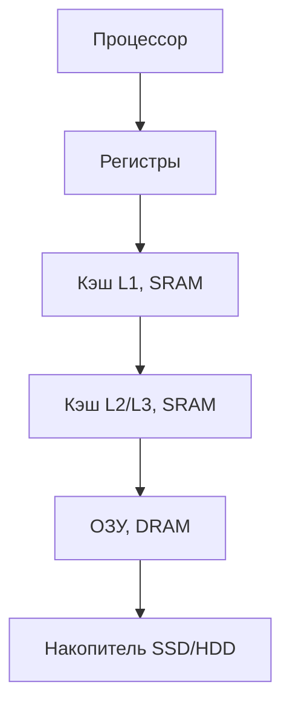
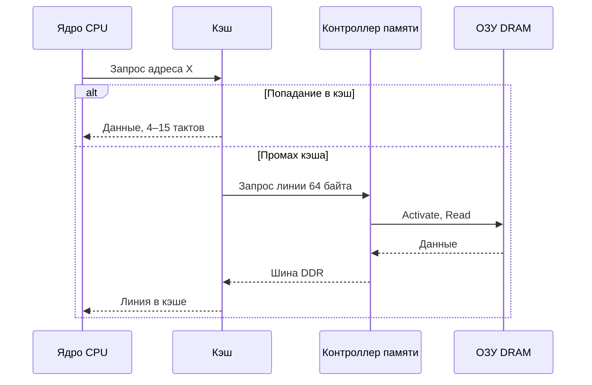

---
tags:
  - all
  - beginner
  - inprogress
title: Память и вычисления
description: >-
  От транзистора до кэш-линии. Как устроена память, почему процессор чаще ждёт
  данные, чем выполняет операции, и чем отличаются ограничения памятью и вычислениями.
related:
  - title: "Компьютер, периферия и сетевое оборудование"
    doc: encyclopedia/1-basics/1-035-bazovaya-informatika/3
  - title: "Алгоритмы, языки и программирование"
    doc: encyclopedia/1-basics/1-035-bazovaya-informatika/4
  - title: "Память и накопители"
    doc: encyclopedia/1-basics/1-08-kak-rabotaet-kompyuter/12
  - title: "Кодирование, сжатие и архивация"
    doc: encyclopedia/1-basics/1-035-bazovaya-informatika/2
---

# Память и вычисления

<div class="article-tags">
  <span class="tag tag-beginner">ДЛЯ НОВИЧКОВ</span>
  <span class="tag tag-inprogress">В РАЗРАБОТКЕ</span>
</div>

<span class="complexity-badge">Всем</span>

В учебной литературе компьютер нередко описывают как устройство для арифметических операций. На практике центральный процессор **значительную долю времени ждёт операнды** из иерархии памяти. Две программы с одинаковым числом операций могут отличаться по времени выполнения в **7–10 раз** — из‑за различий в порядке обращения к данным.

Глава даёт теоретический обзор — от физического хранения бита до ограничений производительности современных вычислительных систем. Обзор компонентов ПК — в [главе 3](./3); подробная энциклопедия — [Память и накопители](/encyclopedia/1-basics/1-08-kak-rabotaet-kompyuter/12).

---

## Вводный пример

Две программы складывают **один и тот же** набор из 16 миллионов чисел на **одном и том же** процессоре. Результат совпадает, число сложений совпадает, но время выполнения — нет.

| Параметр | Программа A | Программа B |
|----------|-------------|-------------|
| Число операций сложения | 16 777 216 | 16 777 216 |
| Результат | Идентичен | Идентичен |
| Порядок обхода данных | Последовательный (по строкам массива) | С шагом через строку (по столбцам) |
| Время | Короткое | В 7–10 раз больше |

**Вывод.** Узким местом стала **передача данных** между уровнями памяти. Стоимость перемещения байта нередко превышает стоимость операции над ним.

---

## Основные определения

Ниже — термины, на которых строится остальной текст. Формулировки ориентированы на курс информатики и архитектуру ЭВМ.

### Вычисление

★ **Вычисление** — детерминированное преобразование входных данных в выходные по заданному правилу.

В контексте процессора вычисление реализуется **машинными командами** — элементарными шагами конвейера исполнения: загрузка операнда, арифметико-логическая операция, запись результата, условный переход. Программа на языке высокого уровня (Python, C++, Pascal) компилируется или интерпретируется в такую последовательность команд.

**Важно.** Каждая команда требует **готовых операндов** в регистрах. Пока операнд не доставлен из памяти, ядро **простаивает**, независимо от тактовой частоты.

### Транзистор

★ **Транзистор** — полупроводниковый прибор, работающий как **управляемый ключ**: при подаче управляющего сигнала пропускает или не пропускает электрический ток.

В цифровой схемотехнике два устойчивых состояния транзистора кодируют биты:

| Физическое состояние | Логическое значение |
|----------------------|---------------------|
| Проводящее (ключ замкнут) | `1` |
| Непроводящее (ключ разомкнут) | `0` |

Из транзисторов собирают **логические элементы** (И, ИЛИ, НЕ), регистры, арифметико-логическое устройство (АЛУ), ячейки памяти. Любая цифровая операция в итоге сводится к переключению транзисторов.

Сигнал в проводнике распространяется с конечной скоростью — порядка **18 см/нс** в меди на печатной плате. **Физическое расстояние между хранилищем и процессором задаёт минимальную задержку доступа** — фундаментальное ограничение физики проводников.

### Память (в вычислительной системе)

★ **Память** — совокупность устройств и областей адресного пространства, предназначенных для **хранения машинных команд и данных** на время выполнения программы или длительного хранения.

Функции памяти в работающей системе:

- хранение **исполняемого кода**;
- хранение **операндов и результатов**;
- организация **стека** вызовов и **кучи** динамических объектов;
- буферизация **ввода-вывода**;
- кэширование на уровне ОС и приложений.

Без достаточного объёма оперативной памяти ОС прибегает к **подкачке (swap)** на накопитель — производительность резко падает (см. [главу 3](/encyclopedia/1-basics/1-035-bazovaya-informatika/3)).

### Оперативная память (ОЗУ, RAM)

★ **Оперативная память (RAM, Random Access Memory)** — энергозависимое запоминающее устройство с **произвольным доступом**: время чтения ячейки не зависит от её физического адреса (в отличие, например, от магнитной ленты).

В современных ПК основной объём ОЗУ реализован на **DRAM** — динамической памяти с произвольным доступом.

### Кэш-память

★ **Кэш-память (cache)** — быстрая буферная память небольшого объёма, размещённая между процессором и основной RAM. Хранит **копии** недавно использованных блоков данных и команд с целью сократить обращения к более медленным уровням иерархии.

### Кэш-линия

★ **Кэш-линия (cache line)** — **минимальный блок** данных, который процессор и подсистема памяти передают между RAM и кэшем за одну операцию. На архитектурах x86 и ARM типичный размер — **64 байта**.

Чтение одного байта инициирует загрузку **всей линии** (64 байта). Стоимость обращения к новой линии примерно одинакова независимо от того, используется один байт или все 64.

### Задержка и пропускная способность

★ **Задержка (latency)** — интервал между **запросом** данных и получением **первого** байта ответа.

★ **Пропускная способность (bandwidth)** — объём данных, передаваемых по каналу **непрерывным потоком** за единицу времени (байт/с, ГБ/с).

Это **независимые** характеристики. Удвоение пропускной способности (например, переход DDR4 → DDR5) **не обязательно** сокращает задержку первого байта.

### Иерархия памяти

★ **Иерархия памяти** — организация запоминающих устройств по уровням: чем **ближе** к процессору, тем **меньше** объём и **выше** скорость, тем **дороже** хранение одного бита.



| Уровень | Технология | Порядок задержки | Типичный объём |
|---------|------------|------------------|----------------|
| Регистры | Триггеры на кристалле CPU | Единицы тактов | Десятки–сотни слов |
| Кэш L1–L3 | SRAM | Единицы–десятки тактов | Килобайты–мегабайты |
| ОЗУ | DRAM | ~60–100 нс (~200+ тактов) | Гигабайты |
| Накопитель | NAND/HDD | Миллисекунды | Терабайты |

**Процессор** — единственный компонент, **исполняющий** команды. **Память** — хранит данные и код. **Шины и контроллеры** обеспечивают передачу. **ОС** управляет виртуальным адресным пространством и размещением страниц.

---

## Статическая и динамическая память

Один логический бит можно физически реализовать разными схемами. Два основных типа — **SRAM** и **DRAM**.

### SRAM (статическая RAM)

★ **SRAM (Static Random Access Memory)** — запоминающее устройство, в котором каждый бит хранится в **статической ячейке** — обратносвязной схеме из **шести транзисторов**.

| Свойство | Характеристика |
|----------|----------------|
| Сохранение данных | Пока подано питание — без периодического обновления |
| Скорость доступа | Очень высокая |
| Плотность размещения | Низкая (6 транзисторов на бит) |
| Стоимость бита | Высокая |
| Деструктивность чтения | Нет |

**Применение:** кэш L1/L2/L3 процессора, быстрые буферы на кристалле GPU (shared memory).

### DRAM (динамическая RAM)

★ **DRAM (Dynamic Random Access Memory)** — запоминающее устройство, в котором бит хранится как **заряд конденсатора**, доступ к которому осуществляется через **один транзистор-ключ** (ячейка 1T1C).

| Свойство | Характеристика |
|----------|----------------|
| Сохранение данных | Заряд **утекает**; требуется **регенерация (refresh)** — по стандарту JEDEC не реже чем раз в **64 мс** |
| Скорость доступа | Ниже, чем у SRAM; зарядка конденсатора занимает время |
| Плотность | Высокая (1 транзистор и 1 конденсатор на бит) |
| Стоимость бита | Низкая |
| Деструктивность чтения | **Да** — чтение разряжает конденсатор; требуется немедленная **обратная запись** |

**Применение:** модули ОЗУ компьютера, глобальная память видеокарты (VRAM).

### Сравнение SRAM и DRAM

| Критерий | SRAM | DRAM |
|----------|------|------|
| Элементарная ячейка | 6 транзисторов | 1 транзистор + 1 конденсатор |
| Обновление (refresh) | Не требуется | Обязательно, ~64 мс |
| Типичная роль | Кэш | Основная RAM, VRAM |

Архитектура современного ПК — **компромисс**: основной объём — дешёвая DRAM; поверх неё — кэш из SRAM объёмом порядка **1/1000** от RAM. Ограничение объёма быстрой памяти обусловлено **физикой и экономикой** производства.

---

## Передача данных от накопителя к процессору

Типичная цепочка при чтении операнда из ОЗУ:

- Программа формирует **виртуальный адрес**.
- **MMU** (блок управления памятью) преобразует его в **физический адрес**; справочник переводов кэшируется в **TLB**.
- **Кэш процессора** проверяет наличие блока, содержащего адрес.
- При **промахе кэша (cache miss)** запрос направляется **контроллеру памяти**.
- Контроллер выполняет цикл доступа к **DRAM** (открытие строки, выбор столбца) и передаёт данные по **шине DDR**.
- Блок помещается в кэш; ядро загружает нужное **машинное слово** в **регистр**.



Каждый дополнительный уровень промаха добавляет **сотни тактов** ожидания.

### Каналы передачи в составе ПК

| Интерфейс | Связь | Назначение |
|-----------|-------|------------|
| Шина DDR | CPU — модули ОЗУ | Основная RAM |
| PCIe | CPU — GPU, NVMe SSD | Высокоскоростные периферийные устройства |
| QPI / Infinity Fabric | Сокеты в многопроцессорных системах | Доступ к удалённой памяти (NUMA) |
| Внутренняя шина GPU | Вычислительные блоки — VRAM | Параллельные вычисления |

Wulf и McKee (1995) описали растущий разрыв между скоростью процессора и памяти как **"стену памяти" (memory wall)** — доминирующий фактор производительности при сохранении тенденции к росту тактовой частоты CPU без пропорционального сокращения задержки DRAM.

---

## Блочный обмен и единицы адресации

Процессор не обменивается данными по одному байту. Используются блоки фиксированного размера:

| Единица | Размер | Назначение |
|---------|--------|------------|
| Машинное слово | 4 или 8 байт | Операнд одной команды АЛУ |
| Кэш-линия | 64 байта | Минимальный блок обмена CPU — RAM |
| Страница памяти | 4 КБ (иногда 2 МБ) | Единица виртуальной памяти ОС |
| Сектор накопителя | 512 байт – 4 КБ | Единица чтения SSD/HDD |

**Правило 64 байт.** Стоимость загрузки новой кэш-линии не зависит от того, сколько байт из неё реально использует программа. Эффективный код **задействует соседние элементы** в пределах одной линии.

---

## Организация DRAM и порядок доступа

Биты DRAM физически расположены в **двумерной матрице** (строки и столбцы). Произвольный доступ к одному биту невозможен — требуется цикл **открытия строки (RAS/Activate)**.

| Этап | Операция | Задержка |
|------|----------|----------|
| 1 | Открытие строки (Activate) | Высокая (~десятки нс) |
| 2 | Выбор столбца (CAS) в открытой строке | Низкая |
| 3 | Закрытие строки (Precharge) перед другой | Высокая |

- **Попадание в строку (row hit)** — следующий запрос к той же открытой строке обслуживается быстро.
- **Конфликт строк (row conflict)** — требуется закрыть текущую строку и открыть новую; задержка возрастает в разы.

Двумерный массив в языках C/C++ в памяти размещается **построчно**. Обход **по столбцам** на каждом шаге переходит к элементу в другой строке матрицы → серия конфликтов строк → падение производительности при **неизменном** числе арифметических операций.

Контроллер памяти распределяет запросы по **банкам** и **каналам**, чтобы параллельно обслуживать несколько потоков обращений — основа **скрытия задержек**.

---

## Локальность обращений и кэширование

Реальные программы демонстрируют **локальность обращений** — предсказуемость шаблона доступа к памяти.

| Тип локальности | Определение | Пример |
|-----------------|-------------|--------|
| **Временная** | Недавно использованные данные будут использованы снова | Переменная-счётчик в цикле |
| **Пространственная** | После обращения к адресу X вероятно обращение к X+1 | Последовательный обход массива |

Кэш использует локальность, удерживая рядом с процессором недавние блоки данных.

Среднее время доступа к памяти описывается соотношением:

```
AMAT = время попадания + (вероятность промаха × штраф промаха)
```

где **AMAT** (Average Memory Access Time) — среднее время доступа к памяти. Снижение числа промахов или перекрытие штрафа промаха — основные направления оптимизации.

---

## Ожидание процессора и стена памяти

Современное ядро выполняет сложение за **долю наносекунды** (единицы тактов). Полный цикл доступа к DRAM — **60–100 наносекунд**. За время ожидания одного операнда из ОЗУ ядро могло бы выполнить **сотни** команд — но конвейер **останавливается** из‑за отсутствия данных.

| Уровень | Порядок задержки |
|---------|------------------|
| Регистр / L1 | ~1–4 такта |
| L2 / L3 | ~10–40 тактов |
| DRAM | ~200+ тактов |
| Накопитель (после промаха всех кэшей) | Миллионы тактов |

**Вывод.** Вычислительная система — прежде всего механизм **организации и маскировки ожидания памяти**.

---

## Когерентность кэша и ложное разделение

В многоядерном процессоре у каждого ядра — **собственный кэш**. Запись в один байт инициирует загрузку **всей 64-байтной линии**, модификацию и пометку линии как **грязной (dirty)**.

Протоколы **когерентности кэша** (например, MESI) гарантируют согласованность копий одной линии между ядрами. При записи одним ядром копии у других **инвалидируются**.

★ **Ложное разделение (false sharing)** — деградация производительности, при которой потоки модифицируют **разные переменные**, расположенные в **одной кэш-линии**, вызывая взаимную инвалидацию копий ("пинг-понг" линии между кэшами). Логическая независимость данных не предотвращает физический конфликт.

**Смягчение** — выравнивание и **дополнение (padding)** структур данных, чтобы независимо обновляемые поля разных потоков попадали в **разные кэш-линии**:

```c
struct counters {
    long a;
    char gap[56];   /* 8 + 56 = 64: поле b начинается в новой линии */
    long b;
};
```

В многопроцессорных серверах дополнительный фактор — **NUMA** (Non-Uniform Memory Access): задержка доступа зависит от того, к какому сокету CPU физически подключён модуль памяти.

---

## Скрытие задержек и параллелизм уровня памяти

Задержку DRAM **нельзя устранить**, но можно **перекрыть** полезной работой.

★ **Параллелизм уровня памяти (Memory-Level Parallelism, MLP)** — одновременное обслуживание **множества незавершённых запросов** к памяти, чтобы простой конвейера из‑за ожидания одного запроса заполнялся другими.

Механизмы:

- **аппаратный префетчинг** — упреждающая загрузка линий при обнаружении последовательного шаблона;
- **многобанковая организация DRAM** — параллельное открытие строк в разных банках;
- **внеочерёдное исполнение (out-of-order)** — выполнение независимых команд, пока одна ожидает память;
- **массовый параллелизм потоков на GPU** — тысячи потоков перекрывают задержку VRAM.

### Закон Литтла в контексте памяти

Для непрерывной загрузки канала памяти необходим объём данных **"в полёте"**:

```
байт в полёте ≈ пропускная способность × задержка
```

Для GPU класса RTX 3060 (~360 ГБ/с, задержка ~100 нс):

```
360 × 10⁹ × 100 × 10⁻⁹ ≈ 36 000 байт  →  36 000 / 64 ≈ 560 запросов
```

Чтобы шина памяти не простаивала, одновременно должно обслуживаться **сотни** 64-байтных транзакций — отсюда необходимость **десятков тысяч потоков** на GPU, даже при умеренной вычислительной нагрузке на поток.

---

## Ограничение памятью и ограничение вычислениями

★ **Арифметическая интенсивность (arithmetic intensity)** — отношение числа операций к объёму передаваемых данных (операций на байт).

По этому показателю различают два режима ограничения производительности:

| Термин | Определение | Узкое место | Пример |
|--------|-------------|-------------|--------|
| **Ограничение памятью (memory-bound)** | Мало операций на перенесённый байт | Пропускная способность RAM/VRAM | Поэлементное сложение векторов |
| **Ограничение вычислениями (compute-bound)** | Много операций на перенесённый байт | Пиковая производительность CPU/GPU | Умножение матриц большого размера |

| Задача | Операций | Байт | Интенсивность | Режим |
|--------|----------|------|---------------|-------|
| `y = a·x + y` | ~2 на элемент | ~12 | ~0,17 | Память |
| Умножение матриц N×N | ~2N³ | ~N² | растёт с N | Вычисления (при больших N) |
| Генерация одного токена LLM | ~2 на вес | ~2 | ~1 | Память |

При **ограничении памятью** замена процессора на более быстрый **мало влияет** на результат; эффективны увеличение полосы памяти, улучшение локальности, сокращение объёма передаваемых данных (квантование).

При **ограничении вычислениями** значимы более мощный CPU/GPU, векторные инструкции, алгоритмические улучшения.

Модель **roofline** (Williams, Waterman, Patterson, 2009) графически разделяет эти режимы: наклонная часть — ограничение пропускной способностью памяти, горизонтальная — пиковыми FLOPS.

---

## Генерация текста и ограничение памятью

При **авторегрессивной генерации** большой языковой модели каждый новый токен требует **полного прохода по всем весам** сети. При 16-битных весах:

```
интенсивность ≈ 2 операции / 2 байта ≈ 1 оп/байт  →  ограничение памятью
```

Оценка скорости (batch = 1):

```
токенов/с ≈ пропускная способность памяти / байт весов на токен
```

Для модели ~7·10⁹ весов × 2 байта ≈ **14 ГБ чтения на токен**:

| GPU | Пропускная способность | Оценка токенов/с |
|-----|------------------------|------------------|
| RTX 3060 | ~360 ГБ/с | 360 / 14 ≈ 25 |
| H100 | ~3350 ГБ/с | 3350 / 14 ≈ 240 |

Скорость генерации упирается в **пропускную способность памяти** при чтении весов.

Инженерные приёмы снижения нагрузки на память:

| Проблема | Решение |
|----------|---------|
| Большой объём весов | Квантование (INT8, INT4) |
| Низкая утилизация при batch = 1 | Пакетная обработка (batching) |
| Неэффективный доступ к KV-кэшу | Компактная раскладка в памяти |
| Запись промежуточных матриц в DRAM | Flash Attention — удержание данных в SRAM на кристалле |

---

## Сводка

- **Расстояние задаёт задержку** — сигнал распространяется с конечной скоростью.
- **SRAM** — быстрая, дорогая, малый объём; **DRAM** — плотная, дешёвая, требует refresh.
- **Иерархия памяти** компенсирует разрыв скоростей кэшем из SRAM.
- **DRAM** обслуживает доступ **строками**; порядок обхода данных критичен.
- **Кэш-линия 64 байта** — минимальная единица передачи; локальность снижает промахи.
- **Ложное разделение** — соседние переменные в одной линии вызывают лишние инвалидации между ядрами.
- **MLP и закон Литтла** — перекрытие задержек множеством параллельных запросов.
- **Арифметическая интенсивность** показывает, упирается ли задача в память или в вычисления.

---

## Связь с курсом

| Глава | Тема |
|-------|------|
| [3. Железо](/encyclopedia/1-basics/1-035-bazovaya-informatika/3) | Роли CPU, ОЗУ, GPU |
| [4. Алгоритмы](/encyclopedia/1-basics/1-035-bazovaya-informatika/4) | Порядок обхода данных |
| [Память и накопители](/encyclopedia/1-basics/1-08-kak-rabotaet-kompyuter/12) | Углубление в иерархию |
| [Big-O — шпаргалка](/lab/examples/1128) | Сложность алгоритма и реальная скорость |

<div class="callout callout--tip">
  <div class="callout-title">Самопроверка</div>

  <div class="callout-body">
  <ol>
    <li>Дайте определение транзистора и объясните связь расстояния с задержкой.</li>
    <li>Чем SRAM отличается от DRAM по устройству ячейки и необходимости refresh?</li>
    <li>В чём разница между задержкой и пропускной способностью памяти?</li>
    <li>Почему обход матрицы по столбцам медленнее обхода по строкам при том же числе сложений?</li>
    <li>Что такое ложное разделение и как его предотвратить?</li>
    <li>По какому признаку задача ограничена памятью или вычислениями?</li>
  </ol>
</div>
  </div>

---

## Полезные материалы по теме

- [A Visual Guide to How Memory Really Works](https://abhisheklearn12.github.io/blogs/memory.html) — Abhishek, 2026. Пошаговый наглядный разбор от ячейки DRAM до GPU и генеративных моделей.
- Ulrich Drepper, *What Every Programmer Should Know About Memory* (2007).
- Wulf, McKee, *Hitting the Memory Wall* (1995).
- Williams, Waterman, Patterson, *Roofline: an insightful visual performance model for multicore architectures* (2009).

Дальше по курсу — [Итоги](./98) или [аппаратное обеспечение](/encyclopedia/2-system-network/2-10-zhelezo/intro).

---
