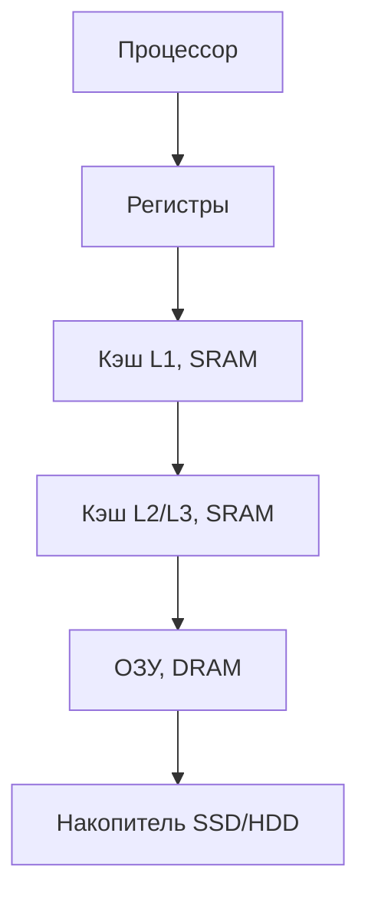
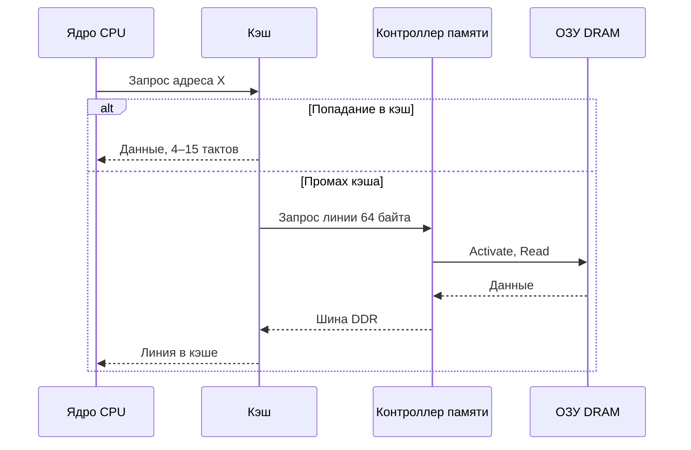
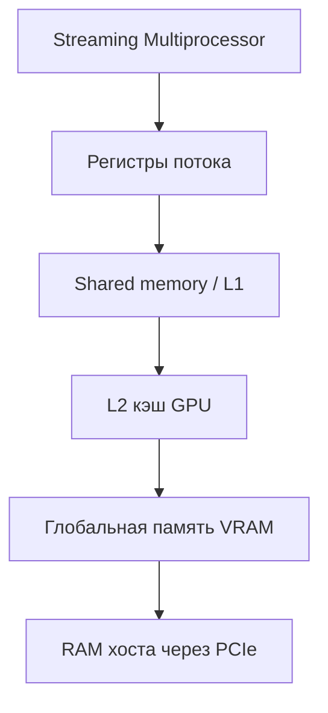
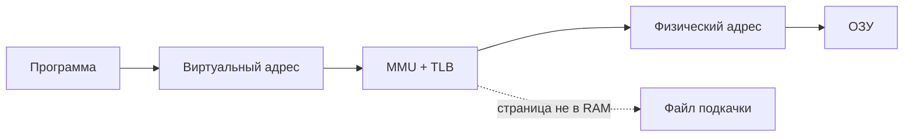
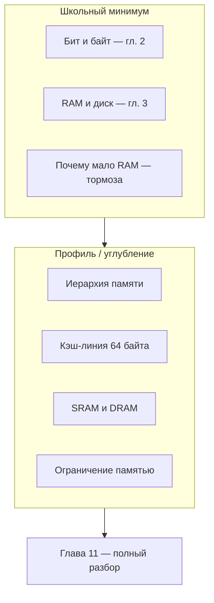
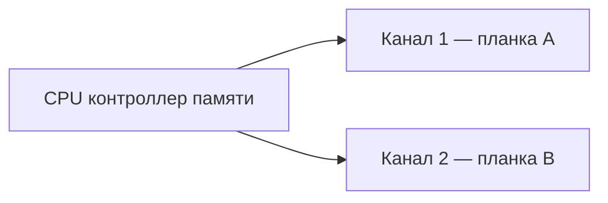
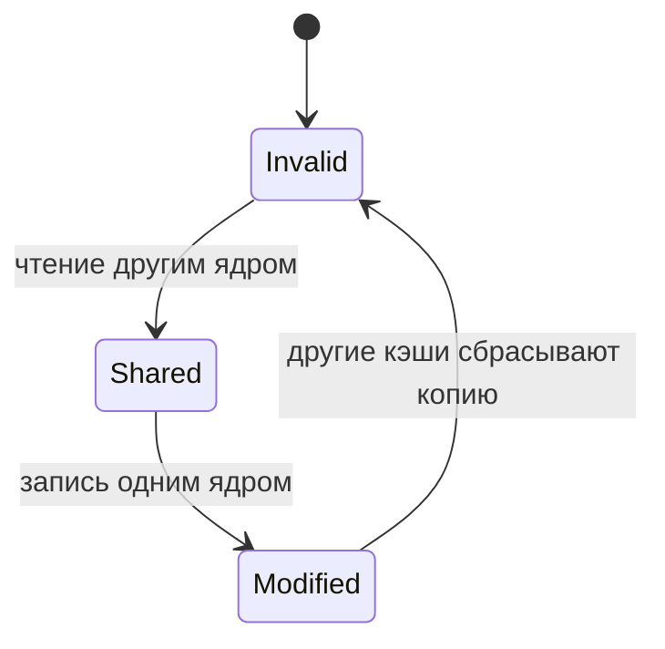
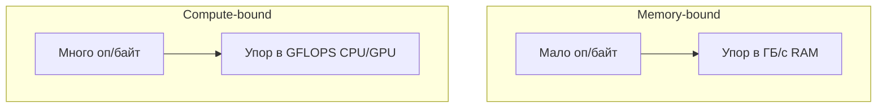

---
tags:
  - all
  - beginner
  - inprogress
title: Память и вычисления
description: >-
  От транзистора до кэш-линии. Как устроена память, почему процессор чаще ждёт
  данные, чем выполняет операции, и чем отличаются ограничения памятью и вычислениями.
related:
  - title: "Компьютер, периферия и сетевое оборудование"
    doc: encyclopedia/1-basics/1-035-bazovaya-informatika/3
  - title: "Организация, архитектура и уровни"
    doc: encyclopedia/1-basics/1-035-bazovaya-informatika/10
  - title: "Алгоритмы, языки и программирование"
    doc: encyclopedia/1-basics/1-035-bazovaya-informatika/4
  - title: "Память и накопители"
    doc: encyclopedia/1-basics/1-08-kak-rabotaet-kompyuter/12
  - title: "Кодирование, сжатие и архивация"
    doc: encyclopedia/1-basics/1-035-bazovaya-informatika/2
---

# Память и вычисления

<div class="article-tags">
  <span class="tag tag-beginner">ДЛЯ НОВИЧКОВ</span>
  <span class="tag tag-inprogress">В РАЗРАБОТКЕ</span>
</div>

<span class="complexity-badge">Всем</span>

В учебной литературе компьютер нередко описывают как устройство для арифметических операций. На практике **центральный процессор (CPU)** значительную долю времени **ждёт данные** из иерархии памяти — из кэша, оперативной памяти (**ОЗУ**, RAM) или накопителя. Две программы с одинаковым числом операций могут отличаться по времени выполнения в **7–10 раз** — из‑за различий в порядке обращения к данным.

Теоретический обзор — от физического хранения бита до ограничений производительности современных систем. Обзор компонентов ПК — в [главе 3](./3); **уровни абстракции и фон Нейман** — в [главе 10](./10); подробная энциклопедия — [Память и накопители](/encyclopedia/1-basics/1-08-kak-rabotaet-kompyuter/12).

---

## Вводный пример

Две программы складывают **один и тот же** набор из 16 миллионов чисел на **одном и том же** процессоре. Результат совпадает, число сложений совпадает, но время выполнения — нет.

| Параметр | Программа A | Программа B |
|----------|-------------|-------------|
| Число операций сложения | 16 777 216 | 16 777 216 |
| Результат | Идентичен | Идентичен |
| Порядок обхода данных | Последовательный (по строкам массива) | С шагом через строку (по столбцам) |
| Время | Короткое | В 7–10 раз больше |

**Вывод.** Узким местом стала **передача данных** между уровнями памяти. Переместить один байт из оперативной памяти в процессор часто **дороже**, чем сложить два числа внутри CPU.

---

## Основные определения

Ниже — термины, на которых строится остальной текст. Формулировки ориентированы на курс информатики и архитектуру ЭВМ.

### Вычисление

★ **Вычисление** — детерминированное преобразование входных данных в выходные по заданному правилу.

В контексте процессора вычисление реализуется **машинными командами** — элементарными шагами конвейера исполнения — загрузка операнда, арифметико-логическая операция, запись результата, условный переход. Программа на языке высокого уровня (Python, C++, Pascal) компилируется или интерпретируется в такую последовательность команд.

**Важно.** Каждая команда требует **готовых операндов** в регистрах. Пока операнд не доставлен из памяти, ядро **простаивает**, независимо от тактовой частоты.

### Транзистор

★ **Транзистор** — полупроводниковый прибор, работающий как **управляемый ключ**: при подаче управляющего сигнала пропускает или блокирует электрический ток.

В цифровой схемотехнике два устойчивых состояния транзистора кодируют биты:

| Физическое состояние | Логическое значение |
|----------------------|---------------------|
| Проводящее (ключ замкнут) | `1` |
| Непроводящее (ключ разомкнут) | `0` |

Из транзисторов собирают **логические элементы** (И, ИЛИ, НЕ), регистры, арифметико-логическое устройство (АЛУ), ячейки памяти. Любая цифровая операция в итоге сводится к переключению транзисторов.

Сигнал в проводнике распространяется с конечной скоростью — порядка **18 см/нс** в меди на печатной плате. **Физическое расстояние между хранилищем и процессором задаёт минимальную задержку доступа** — фундаментальное ограничение физики проводников.

### Память (в вычислительной системе)

★ **Память** — совокупность устройств и областей адресного пространства, предназначенных для **хранения машинных команд и данных** на время выполнения программы или длительного хранения.

Функции памяти в работающей системе:

- хранение **исполняемого кода**;
- хранение **операндов и результатов**;
- организация **стека** вызовов и **кучи** динамических объектов;
- буферизация **ввода-вывода**;
- кэширование на уровне ОС и приложений.

Без достаточного объёма оперативной памяти ОС прибегает к **подкачке (swap)** на накопитель — производительность резко падает (см. [главу 3](/encyclopedia/1-basics/1-035-bazovaya-informatika/3)).

### Оперативная память (ОЗУ, RAM)

★ **Оперативная память (RAM, Random Access Memory)** — энергозависимое запоминающее устройство с **произвольным доступом** — время чтения ячейки не зависит от её физического адреса (в отличие, например, от магнитной ленты).

В современных ПК основной объём ОЗУ реализован на **DRAM** — динамической памяти с произвольным доступом.

### Кэш-память

★ **Кэш-память (cache)** — быстрая буферная память небольшого объёма, размещённая между процессором и основной RAM. Хранит **копии** недавно использованных блоков данных и команд с целью сократить обращения к более медленным уровням иерархии.

### Кэш-линия

★ **Кэш-линия (cache line)** — **минимальный блок** данных, который процессор и подсистема памяти передают между RAM и кэшем за одну операцию. На архитектурах x86 и ARM типичный размер — **64 байта**.

Чтение одного байта инициирует загрузку **всей линии** (64 байта). Стоимость обращения к новой линии примерно одинакова независимо от того, используется один байт или все 64.

### Задержка и пропускная способность

★ **Задержка (latency)** — интервал между **запросом** данных и получением **первого** байта ответа.

★ **Пропускная способность (bandwidth)** — объём данных, передаваемых по каналу **непрерывным потоком** за единицу времени (байт/с, ГБ/с).

Это **независимые** характеристики. Удвоение пропускной способности (например, переход DDR4 → DDR5) **не обязательно** сокращает задержку первого байта.

### Иерархия памяти

★ **Иерархия памяти** — организация запоминающих устройств по уровням — чем **ближе** к процессору, тем **меньше** объём и **выше** скорость, тем **дороже** хранение одного бита.



| Уровень | Технология | Порядок задержки | Типичный объём |
|---------|------------|------------------|----------------|
| Регистры | Триггеры на кристалле CPU | Единицы тактов | Десятки–сотни слов |
| Кэш L1–L3 | SRAM | Единицы–десятки тактов | Килобайты–мегабайты |
| ОЗУ | DRAM | ~60–100 нс (~200+ тактов) | Гигабайты |
| Накопитель | NAND/HDD | Миллисекунды | Терабайты |

**Процессор** — единственный компонент, **исполняющий** команды. **Память** — хранит данные и код. **Шины и контроллеры** обеспечивают передачу. **ОС** управляет виртуальным адресным пространством и размещением страниц.

---

## Статическая и динамическая память

Один логический бит можно физически реализовать разными схемами. Два основных типа — **SRAM** и **DRAM**.

### SRAM (статическая RAM)

★ **SRAM (Static Random Access Memory)** — запоминающее устройство, в котором каждый бит хранится в **статической ячейке** — обратносвязной схеме из **шести транзисторов**.

| Свойство | Характеристика |
|----------|----------------|
| Сохранение данных | Пока подано питание — без периодического обновления |
| Скорость доступа | Очень высокая |
| Плотность размещения | Низкая (6 транзисторов на бит) |
| Стоимость бита | Высокая |
| Деструктивность чтения | Нет |

**Применение:** кэш L1/L2/L3 процессора, быстрые буферы на кристалле GPU (shared memory).

### DRAM (динамическая RAM)

★ **DRAM (Dynamic Random Access Memory)** — запоминающее устройство, в котором бит хранится как **заряд конденсатора**, доступ к которому осуществляется через **один транзистор-ключ** (ячейка 1T1C).

| Свойство | Характеристика |
|----------|----------------|
| Сохранение данных | Заряд **утекает**; требуется **регенерация (refresh)** — по стандарту JEDEC не реже чем раз в **64 мс** |
| Скорость доступа | Ниже, чем у SRAM; зарядка конденсатора занимает время |
| Плотность | Высокая (1 транзистор и 1 конденсатор на бит) |
| Стоимость бита | Низкая |
| Деструктивность чтения | **Да** — чтение разряжает конденсатор; требуется немедленная **обратная запись** |

**Применение:** модули ОЗУ компьютера, глобальная память видеокарты (VRAM).

### SRAM и DRAM рядом

| Критерий | SRAM | DRAM |
|----------|------|------|
| Элементарная ячейка | 6 транзисторов | 1 транзистор + 1 конденсатор |
| Обновление (refresh) | Не требуется | Обязательно, ~64 мс |
| Типичная роль | Кэш | Основная RAM, VRAM |

Архитектура современного ПК — **компромисс**: основной объём — дешёвая DRAM; поверх неё — кэш из SRAM объёмом порядка **1/1000** от RAM. Ограничение объёма быстрой памяти обусловлено **физикой и экономикой** производства.

---

## Передача данных от накопителя к процессору

Типичная цепочка при чтении операнда из ОЗУ:

- Программа формирует **виртуальный адрес**.
- **MMU** (блок управления памятью) преобразует его в **физический адрес**; справочник переводов кэшируется в **TLB**.
- **Кэш процессора** проверяет наличие блока, содержащего адрес.
- При **промахе кэша (cache miss)** запрос направляется **контроллеру памяти**.
- Контроллер выполняет цикл доступа к **DRAM** (открытие строки, выбор столбца) и передаёт данные по **шине DDR**.
- Блок помещается в кэш; ядро загружает нужное **машинное слово** в **регистр**.



Каждый дополнительный уровень промаха добавляет **сотни тактов** ожидания.

### Каналы передачи в составе ПК

| Интерфейс | Связь | Назначение |
|-----------|-------|------------|
| Шина DDR | CPU — модули ОЗУ | Основная RAM |
| PCIe | CPU — GPU, NVMe SSD | Высокоскоростные периферийные устройства |
| QPI / Infinity Fabric | Сокеты в многопроцессорных системах | Доступ к удалённой памяти (NUMA) |
| Внутренняя шина GPU | Вычислительные блоки — VRAM | Параллельные вычисления |

Wulf и McKee (1995) описали растущий разрыв между скоростью процессора и памяти как **"стену памяти" (memory wall)** — доминирующий фактор производительности при росте тактовой частоты CPU без пропорционального сокращения задержки DRAM. Подробнее о ролях CPU и ОЗУ в быту — [глава 3](./3).

---

## Блочный обмен и единицы адресации

Процессор не обменивается данными по одному байту. Используются блоки фиксированного размера:

| Единица | Размер | Назначение |
|---------|--------|------------|
| Машинное слово | 4 или 8 байт | Операнд одной команды АЛУ |
| Кэш-линия | 64 байта | Минимальный блок обмена CPU — RAM |
| Страница памяти | 4 КБ (иногда 2 МБ) | Единица виртуальной памяти ОС |
| Сектор накопителя | 512 байт – 4 КБ | Единица чтения SSD/HDD |

**Правило 64 байт.** Стоимость загрузки новой кэш-линии не зависит от того, сколько байт из неё реально использует программа. Эффективный код **задействует соседние элементы** в пределах одной линии.

---

## Организация DRAM и порядок доступа

Биты DRAM физически расположены в **двумерной матрице** (строки и столбцы). Произвольный доступ к одному биту невозможен — требуется цикл **открытия строки (RAS/Activate)**.

| Этап | Операция | Задержка |
|------|----------|----------|
| 1 | Открытие строки (Activate) | Высокая (~десятки нс) |
| 2 | Выбор столбца (CAS) в открытой строке | Низкая |
| 3 | Закрытие строки (Precharge) перед другой | Высокая |

- **Попадание в строку (row hit)** — следующий запрос к той же открытой строке обслуживается быстро.
- **Конфликт строк (row conflict)** — требуется закрыть текущую строку и открыть новую; задержка возрастает в разы.

Двумерный массив в языках C/C++ в памяти размещается **построчно**. Обход **по столбцам** на каждом шаге переходит к элементу в другой строке матрицы → серия конфликтов строк → падение производительности при **неизменном** числе арифметических операций.

Контроллер памяти распределяет запросы по **банкам** и **каналам**, чтобы параллельно обслуживать несколько потоков обращений — основа **скрытия задержек**.

---

## Локальность обращений и кэширование

Реальные программы демонстрируют **локальность обращений** — предсказуемость шаблона доступа к памяти.

| Тип локальности | Определение | Пример |
|-----------------|-------------|--------|
| **Временная** | Недавно использованные данные будут использованы снова | Переменная-счётчик в цикле |
| **Пространственная** | После обращения к адресу X вероятно обращение к X+1 | Последовательный обход массива |

Кэш использует локальность, удерживая рядом с процессором недавние блоки данных.

Среднее время доступа к памяти описывается соотношением:

```
AMAT = время попадания + (вероятность промаха × штраф промаха)
```

где **AMAT** (Average Memory Access Time) — среднее время доступа к памяти. Снижение числа промахов или перекрытие штрафа промаха — основные направления оптимизации.

---

## Ожидание процессора и стена памяти

Современное ядро выполняет сложение за **долю наносекунды** (единицы тактов). Полный цикл доступа к DRAM — **60–100 наносекунд**. За время ожидания одного операнда из ОЗУ ядро могло бы выполнить **сотни** команд — но конвейер **останавливается** из‑за отсутствия данных.

| Уровень | Порядок задержки |
|---------|------------------|
| Регистр / L1 | ~1–4 такта |
| L2 / L3 | ~10–40 тактов |
| DRAM | ~200+ тактов |
| Накопитель (после промаха всех кэшей) | Миллионы тактов |

**Вывод.** Вычислительная система — прежде всего механизм **организации и маскировки ожидания памяти**.

---

## Когерентность кэша и ложное разделение

В многоядерном процессоре у каждого ядра — **собственный кэш**. Запись в один байт инициирует загрузку **всей 64-байтной линии**, модификацию и пометку линии как **грязной (dirty)**.

Протоколы **когерентности кэша** (например, MESI) гарантируют согласованность копий одной линии между ядрами. При записи одним ядром копии у других **инвалидируются**.

★ **Ложное разделение (false sharing)** — деградация производительности, при которой потоки модифицируют **разные переменные**, расположенные в **одной кэш-линии**, вызывая взаимную инвалидацию копий ("пинг-понг" линии между кэшами). Логическая независимость данных не предотвращает физический конфликт.

**Смягчение** — выравнивание и **дополнение (padding)** структур данных, чтобы независимо обновляемые поля разных потоков попадали в **разные кэш-линии**:

```c
struct counters {
    long a;
    char gap[56];   /* 8 + 56 = 64: поле b начинается в новой линии */
    long b;
};
```

В многопроцессорных серверах дополнительный фактор — **NUMA** (Non-Uniform Memory Access): задержка доступа зависит от того, к какому сокету CPU физически подключён модуль памяти.

---

## Скрытие задержек и параллелизм уровня памяти

Задержку DRAM **нельзя устранить**, но можно **перекрыть** полезной работой.

★ **Параллелизм уровня памяти (Memory-Level Parallelism, MLP)** — одновременное обслуживание **множества незавершённых запросов** к памяти, чтобы простой конвейера из‑за ожидания одного запроса заполнялся другими.

Механизмы:

- **аппаратный префетчинг** — упреждающая загрузка линий при обнаружении последовательного шаблона;
- **многобанковая организация DRAM** — параллельное открытие строк в разных банках;
- **внеочерёдное исполнение (out-of-order)** — выполнение независимых команд, пока одна ожидает память;
- **массовый параллелизм потоков на GPU** — тысячи потоков перекрывают задержку VRAM.

### Закон Литтла в контексте памяти

Для непрерывной загрузки канала памяти необходим объём данных **"в полёте"**:

```
байт в полёте ≈ пропускная способность × задержка
```

Для GPU класса RTX 3060 (~360 ГБ/с, задержка ~100 нс):

```
360 × 10⁹ × 100 × 10⁻⁹ ≈ 36 000 байт  →  36 000 / 64 ≈ 560 запросов
```

Чтобы шина памяти не простаивала, одновременно должно обслуживаться **сотни** 64-байтных транзакций — отсюда необходимость **десятков тысяч потоков** на GPU, даже при умеренной вычислительной нагрузке на поток.

---

## Ограничение памятью и ограничение вычислениями

★ **Арифметическая интенсивность (arithmetic intensity)** — отношение числа операций к объёму передаваемых данных (операций на байт).

По этому показателю различают два режима ограничения производительности:

| Термин | Определение | Узкое место | Пример |
|--------|-------------|-------------|--------|
| **Ограничение памятью (memory-bound)** | Мало операций на перенесённый байт | Пропускная способность RAM/VRAM | Поэлементное сложение векторов |
| **Ограничение вычислениями (compute-bound)** | Много операций на перенесённый байт | Пиковая производительность CPU/GPU | Умножение матриц большого размера |

| Задача | Операций | Байт | Интенсивность | Режим |
|--------|----------|------|---------------|-------|
| `y = a·x + y` | ~2 на элемент | ~12 | ~0,17 | Память |
| Умножение матриц N×N | ~2N³ | ~N² | растёт с N | Вычисления (при больших N) |
| Генерация одного токена LLM | ~2 на вес | ~2 | ~1 | Память |

При **ограничении памятью** замена процессора на более быстрый **мало влияет** на результат; эффективны увеличение полосы памяти, улучшение локальности, сокращение объёма передаваемых данных (квантование).

При **ограничении вычислениями** значимы более мощный CPU/GPU, векторные инструкции, алгоритмические улучшения.

Модель **roofline** (Williams, Waterman, Patterson, 2009) графически разделяет эти режимы: наклонная часть — ограничение пропускной способностью памяти, горизонтальная — пиковыми FLOPS.

---

## Генерация текста и ограничение памятью

При **авторегрессивной генерации** большой языковой модели каждый новый токен требует **полного прохода по всем весам** сети. При 16-битных весах:

```
интенсивность ≈ 2 операции / 2 байта ≈ 1 оп/байт  →  ограничение памятью
```

Оценка скорости (batch = 1):

```
токенов/с ≈ пропускная способность памяти / байт весов на токен
```

Для модели ~7·10⁹ весов × 2 байта ≈ **14 ГБ чтения на токен**:

| GPU | Пропускная способность | Оценка токенов/с |
|-----|------------------------|------------------|
| RTX 3060 | ~360 ГБ/с | 360 / 14 ≈ 25 |
| H100 | ~3350 ГБ/с | 3350 / 14 ≈ 240 |

Скорость генерации упирается в **пропускную способность памяти** при чтении весов.

Инженерные приёмы снижения нагрузки на память:

| Проблема | Решение |
|----------|---------|
| Большой объём весов | Квантование (INT8, INT4) |
| Низкая утилизация при batch = 1 | Пакетная обработка (batching) |
| Неэффективный доступ к KV-кэшу | Компактная раскладка в памяти |
| Запись промежуточных матриц в DRAM | Flash Attention — удержание данных в SRAM на кристалле |

---

## Расширенные примеры иерархии памяти

Иерархия памяти — это объяснение реальных задержек в браузере, игре, нейросети и школьной программе на Python. Ниже — сопоставление уровней с конкретными ситуациями.

### Пример 1. Открытие сайта в браузере

| Этап | Уровень иерархии | Что происходит |
|------|------------------|----------------|
| Пользователь нажимает ссылку | — | Браузер запрашивает HTML |
| Код страницы уже в кэше | L1/L2 CPU, дисковый кэш ОС | Мгновенный отклик вкладки |
| Страница не в кэше | SSD → RAM | Задержка десятки миллисекунд |
| Много вкладок, мало ОЗУ | RAM → swap на SSD | Вкладки "подвисают" при переключении |
| Тяжёлый JavaScript | CPU ждёт данные из RAM | Прокрутка лагает при слабом CPU и узком канале памяти |

**Вывод.** Браузер с десятком вкладок — наглядный пример: код и данные страниц конкурируют за ОЗУ; при нехватке ОС вытесняет страницы на диск.

### Пример 2. Запуск игры

| Ресурс | Где хранится | Роль |
|--------|--------------|------|
| Исполняемый файл и ресурсы | SSD → RAM при загрузке | Первый запуск дольше из‑за чтения с диска |
| Текстуры и модели уровня | VRAM (глобальная память GPU) | GPU читает их тысячи раз за кадр |
| Геометрия в обработке | Shared memory / L2 на кристалле GPU | Быстрый доступ потоков в одном блоке |
| Сохранения | SSD | Не влияют на FPS, пока не идёт запись |

При нехватке VRAM игра подгружает текстуры из RAM по PCIe — FPS падает резко: канал CPU–GPU уже, чем внутренняя шина GPU.

### Пример 3. Сортировка массива в Python

```python
# Быстрый вариант — последовательный доступ
data = list(range(10_000_000))
total = sum(data)  # хорошая пространственная локальность

# Медленнее — случайные индексы
import random
idx = list(range(10_000_000))
random.shuffle(idx)
total = sum(data[i] for i in idx)  # много промахов кэша
```

Одинаковое число обращений к элементам, разное время: второй вариант "прыгает" по массиву и выбивает новые кэш-линии на каждом шаге.

### Пример 4. Сервер базы данных

| Компонент | Уровень | Почему важно |
|-----------|---------|-------|
| Индекс в RAM | ОЗУ | Быстрый поиск по ключу |
| Таблица на диске | SSD | Основной объём данных |
| Буферный пул СУБД | RAM | Кэш страниц таблиц — аналог L3 для приложения |
| Реплика на другом сервере | Сеть + диск | Задержка миллисекунды, не наносекунды |

Администратор увеличивает `shared_buffers` (PostgreSQL) или `innodb_buffer_pool_size` (MySQL), чтобы чаще обслуживать запросы из оперативной памяти (RAM), без обращения к диску.

### Пример 5. Смартфон

| Уровень | Технология | Объём (ориентир) |
|---------|------------|------------------|
| Регистры / L1 | В SoC (Apple A-серия, Snapdragon) | Килобайты |
| L2/L3 | В кристалле | Мегабайты |
| RAM | LPDDR5 | 4–16 ГБ |
| Хранилище | UFS / NVMe | 64–512 ГБ |

Фоновые приложения выгружаются из RAM — при возврате "перезагружаются" с диска. Это та же логика подкачки, что на ПК, только агрессивнее из‑за ограниченного ОЗУ.

### Сводная таблица — "где болит"

| Симптом | Вероятный уровень узкого места | Что проверить |
|---------|--------------------------------|---------------|
| Долгая загрузка программы | Диск (HDD хуже SSD) | Тип накопителя, фоновые копии |
| Лаги при многозадачности | ОЗУ + swap | Диспетчер задач, объём RAM |
| Низкий FPS при нормальном GPU | VRAM или PCIe | Настройки текстур, объём видеопамяти |
| Медленный цикл по массиву | Кэш CPU, порядок обхода | Профилировщик, layout данных |
| Тормозит только одна вкладка | Кэш браузера, JS в RAM | Закрыть лишние вкладки |

---

## Память GPU — VRAM, shared memory и иерархия на видеокарте

**GPU** (Graphics Processing Unit, графический процессор) решает другую задачу, чем CPU: тысячи простых потоков выполняют одну операцию над множеством данных (пиксели, вершины, элементы тензора). Иерархия памяти у GPU **шире и глубже**, чем у классического описания "CPU — RAM — диск".

### Уровни памяти GPU



| Уровень | Размер (типично) | Задержка | Кто видит |
|---------|------------------|----------|-----------|
| Регистры потока | Десятки–сотни байт на поток | 1 такт | Один поток |
| Shared memory | 48–228 КБ на SM | ~20–30 тактов | Потоки одного блока |
| L2 кэш | Единицы–десятки МБ | Десятки тактов | Все SM на кристалле |
| VRAM (GDDR6/HBM) | 6–24+ ГБ | Сотни тактов | Все вычисления GPU |
| RAM хоста | Гигабайты | Тысячи тактов через PCIe | При нехватке VRAM |

### VRAM и GDDR

★ **VRAM** (Video RAM) — выделенная память на видеокарте или в составе SoC (встроенная графика делит RAM с CPU).

Современные дискретные карты используют **GDDR6** или **GDDR6X** — специализированную DRAM с **очень высокой пропускной способностью** (сотни ГБ/с), но задержка первого байта всё равно выше, чем у SRAM на кристалле.

| Карта (класс) | VRAM | Пропускная способность (ориентир) |
|---------------|------|-----------------------------------|
| Встроенная в CPU | 0,5–2 ГБ из RAM | Ограничена каналом к ОЗУ |
| RTX 3060 | 12 ГБ GDDR6 | ~360 ГБ/с |
| RTX 4090 | 24 ГБ GDDR6X | ~1000 ГБ/с |
| H100 (ЦОД) | 80 ГБ HBM3 | ~3350 ГБ/с |

**HBM** (High Bandwidth Memory) — память, расположенная **на одном кристалле** с GPU через тысячи коротких соединений; используется в серверных ускорителях для ИИ.

### Shared memory (общая память блока)

★ **Shared memory** — быстрая SRAM-область, **разделяемая потоками одного блока** (thread block) на GPU. Программист (или компилятор) явно кладёт туда данные для повторного использования — аналог ручного управления L1.

Пример: свёртка в нейросети — фрагмент матрицы весов загружается в shared memory один раз, десятки потоков читают его многократно.

### Unified Memory (CUDA) и аналоги

В экосистемах CUDA, ROCm, Metal часть API позволяет использовать **единое адресное пространство** CPU и GPU: данные могут мигрировать между RAM и VRAM **по требованию**. Удобно для разработки, но при неаккуратном использовании скрытые копии по PCIe **убивают** производительность.

### Почему GPU "любит" большие батчи

Как показано в разделе про закон Литтла, GPU нужны **сотни параллельных запросов** к памяти. Поэтому:

- нейросети обучают с **batch size** 32–256 и выше;
- при `batch = 1` (один токен LLM) утилизация GPU низкая — узкое место VRAM/пропускная способность;
- игры компенсируют тысячами пикселей и вершин за кадр.

### CPU и GPU по памяти

| Аспект | CPU | GPU |
|--------|-----|-----|
| Цель иерархии | Минимизировать задержку для **одного** потока | Максимизировать **пропускную способность** для тысяч потоков |
| Кэш | L1/L2/L3, прозрачен для программиста | Shared + L2, часто нужна ручная оптимизация |
| Основная RAM | DRAM на материнской плате | VRAM на карте |
| Типичная задача | Ветвления, ОС, браузер | Матрицы, шейдеры, inference |

---

## Виртуальная память — страницы, TLB и подкачка

Программа видит **непрерывное** адресное пространство (миллиарды байт), но физически данные разбросаны по RAM и диску. За этим стоит **виртуальная память** — один из главных механизмов ОС.

### Виртуальный и физический адрес

★ **Виртуальный адрес** — номер ячейки, с которым работает программа.

★ **Физический адрес** — реальное положение байта в модуле DRAM.

★ **MMU** (Memory Management Unit, блок управления памятью) — аппаратура в CPU, переводящая виртуальный адрес в физический по таблицам, которые ведёт ОС.



### Страница памяти

★ **Страница (page)** — фиксированный блок виртуальной памяти, обычно **4 КБ** на x86-64; также используются **большие страницы** 2 МБ и 1 ГБ для снижения накладных расходов на перевод.

| Размер страницы | Плюс | Минус |
|-----------------|------|-------|
| 4 КБ | Гибкость, мало внутренней фрагментации | Много записей в таблице страниц |
| 2 МБ / 1 ГБ | Меньше промахов TLB, быстрее перевод | Больше "пустого" места внутри страницы |

### Таблица страниц и TLB

**Таблица страниц** хранится в RAM. Поиск перевода на каждое обращение был бы катастрофически медленным.

★ **TLB** (Translation Lookaside Buffer) — кэш **последних** переводов виртуальный → физический адрес.

| Событие | Штраф |
|---------|-------|
| Попадание в TLB | ~0 дополнительных тактов |
| Промах TLB | Десятки–сотни тактов на обход таблицы |

Много мелких случайных обращений (указатели, хеш-таблицы) дают **промахи TLB** — отдельный источник тормозов помимо промахов кэша данных.

### Подкачка (swap, paging)

Когда суммарная "память" запущенных программ **превышает** физическое ОЗУ, ОС **выгружает** редко используемые страницы на диск в **файл подкачки** (Windows: `pagefile.sys`; Linux: swap-раздел или swap-файл).

| Параметр | HDD | SSD |
|----------|-----|-----|
| Задержка доступа к странице | Миллисекунды | Сотни микросекунд |
| Ощущение пользователя | Система "замирает" | Заметные лаги, но терпимо |
| Рекомендация | Избегать swap на HDD при нехватке RAM | SSD лучше, но RAM всё равно нужна |

★ **Page fault** (ошибка страницы) — обращение к странице, которой **нет** в RAM. ОС загружает её с диска — программа ждёт.

**Thrashing** ("трепетание") — катастрофический режим, когда система почти всё время качает страницы туда-обратно и почти не выполняет полезную работу. Лечение — закрыть программы или добавить RAM.

### Сегменты — стек, куча, код

Виртуальное пространство процесса обычно разделено на области:

| Область | Содержимое | Рост |
|---------|------------|------|
| Код (text) | Машинные команды программы | Фиксирован при запуске |
| Данные (data, bss) | Глобальные переменные | Фиксирован |
| Куча (heap) | `malloc` / `new` | Вверх по адресам |
| Стек (stack) | Локальные переменные, вызовы функций | Вниз по адресам |

Переполнение стека или утечка в куче — отдельные классы ошибок; обе конкурируют за **то же** физическое ОЗУ через страницы.

### Изоляция процессов

Виртуальная память даёт каждому процессу **своё** адресное пространство. Программа A не может напрямую прочитать память программы B — это основа **безопасности** и стабильности ОС. Ядро ОС имеет особые права и таблицы страниц.

### Практические следствия для пользователя

| Ситуация | Механизм | Действие |
|----------|----------|----------|
| 8 ГБ RAM, 40 вкладок Chrome | Подкачка на SSD | Добавить RAM или закрыть вкладки |
| "Память утекла" у программы | Куча растёт, страницы не возвращаются ОС | Перезапуск приложения, обновление |
| Виртуальные машины | Каждая ВМ — отдельное адресное пространство | Выделить достаточно RAM хосту |
| Игры + стрим + браузер | Конкуренция за физические страницы | Мониторинг RAM, настройка приоритетов |

### Связь с кэшем CPU

Цепочка при чтении одного байта в худшем случае:

1. Промах TLB → обход таблицы страниц.
2. Страница на диске → page fault, чтение с SSD.
3. Страница в RAM, но байт не в кэше L1 → загрузка кэш-линии из DRAM.
4. Конфликт строк DRAM → дополнительная задержка.

Оптимизация "только алгоритма" без учёта памяти игнорирует уровни 1–4.

---

## Практикум — задачи и разборы

Задачи рассчитаны на уровень курса базовой информатики. Сначала попробуйте ответить сами, затем сверьтесь с разбором.

### Задача 1. Кэш-линия

Массив из 1 000 000 целых чисел (`int`, 4 байта). Сколько **кэш-линий** (по 64 байта) минимум затронет **последовательный** обход всего массива?

<details>
<summary>Разбор</summary>

Размер массива: 1 000 000 × 4 = 4 000 000 байт ≈ 3,81 МБ.

Линий: 4 000 000 / 64 = **62 500**.

При последовательном обходе каждая линия загружается один раз (идеальный случай пространственной локальности).
</details>

### Задача 2. Row hit и столбцы

Матрица 4096×4096 элементов `double` (8 байт). Обход **по столбцам** внешним циклом. Почему это медленнее обхода **по строкам**?

<details>
<summary>Разбор</summary>

Строка матрицы: 4096 × 8 = 32 768 байт = **512 кэш-линий**.

При обходе по столбцам соседние обращения отстоят на 32 768 байт — каждый шаг попадает в **новую строку DRAM** → серия **row conflict** → задержка в разы выше, чем row hit внутри одной строки DRAM.

Число операций одинаково; меняется только **паттерн доступа**.
</details>

### Задача 3. AMAT

Кэш L1: попадание 90 %, штраф промаха в L2 — 10 тактов. L2: попадание 80 % от промахов L1, штраф промаха в RAM — 200 тактов. Попадание в L1 — 1 такт. Оцените **среднее время доступа** (AMAT).

<details>
<summary>Разбор</summary>

Доля промахов L1: 10 %.

Из них 80 % попадают в L2: 0,1 × 0,8 = 8 % обращений с временем ~11 тактов (1 + 10).

2 % идут в RAM: 0,1 × 0,2 = 2 % с временем ~211 тактов.

90 % × 1 + 8 % × 11 + 2 % × 211 ≈ 0,9 + 0,88 + 4,22 ≈ **6 тактов** (упрощённая модель без L3).

Вывод: даже при "хорошем" L1 редкие промахи в RAM доминируют в сумме.
</details>

### Задача 4. Ограничение памятью или вычислениями?

Для каждой задачи укажите режим.

| Задача | Режим? |
|--------|--------|
| a) Побитовое XOR двух массивов по 1 ГБ | |
| b) Умножение матриц 2048×2048 | |
| c) Поиск максимума в массиве 10⁶ элементов | |
| d) Inference LLM 70B, batch=1 | |

<details>
<summary>Разбор</summary>

- **a)** Память — ~1 операция на байт, мало арифметики.
- **b)** При N=2048 интенсивность ~N/3 операций на элемент — часто **вычисления** на современных GPU/CPU с BLAS.
- **c)** Память — один проход, минимум операций на элемент.
- **d)** Память — каждый токен читает все веса.
</details>

### Задача 5. Ложное разделение

Два потока на двух ядрах: поток A каждую миллисекунду увеличивает `counter_a`, поток B — `counter_b`. Поля лежат подряд в структуре без padding. Почему производительность может быть **хуже**, чем у одного потока?

<details>
<summary>Разбор</summary>

`counter_a` и `counter_b` с высокой вероятностью в **одной кэш-линии** 64 байта. Запись одним ядром помечает линию dirty и **инвалидирует** копию у другого — "пинг-понг" линии между кэшами (false sharing). Решение — padding до 64 байт между полями.
</details>

### Задача 6. Виртуальная память

На ПК 8 ГБ RAM. Суммарный "рабочий набор" открытых программ — 12 ГБ. Что сделает ОС? Почему система при этом "тормозит" даже с быстрым SSD?

<details>
<summary>Разбор</summary>

ОС будет **выгружать** страницы в swap. При переключении на программу, чьи страницы на диске, возникает **page fault** — задержка на чтение с SSD (микросекунды–миллисекунды против наносекунд RAM). Частые промахи → постоянное ожидание диска (thrashing при тяжёлой нагрузке).
</details>

### Задача 7. GPU и LLM

Модель 7B параметров, веса в FP16 (2 байта на параметр). Сколько **гигабайт** весов нужно прочитать на **один** токен при полном forward pass? Почему увеличение тактовой частоты GPU без роста пропускной способности памяти мало помогает?

<details>
<summary>Разбор</summary>

7×10⁹ × 2 байта ≈ **14 ГБ** чтения на токен (упрощённо, без кэширования слоёв).

Арифметическая интенсивность низкая — узкое место **пропускная способность VRAM**. Быстрее "крутить" ALU бесполезно, если веса не успевают подаваться из памяти.
</details>

---

## Карта курса — память в программе информатики

| Когда читать | Почему важно | Связанные главы |
|--------------|-------|-----------------|
| После [главы 3](./3) | Понять, **почему** тормозит ПК при нехватке RAM | [ОС и файлы](./5) |
| Перед олимпиадой / профильным ЕГЭ | Локальность, кэш, разница между теорией и железом | [Алгоритмы](./4), [Big-O](/lab/examples/1128) |
| Перед курсом по C++/Python | Порядок обхода массивов, false sharing | [Память и накопители](/encyclopedia/1-basics/1-08-kak-rabotaet-kompyuter/12) |
| Интерес к ИИ / GPU | VRAM, memory-bound inference | [Применение ИИ](/encyclopedia/6-ai/6-06-primenenie-ii/intro) |



**[Глава 3](./3)** разбирает **роли** устройств (что купить, как подключить). Здесь — **физика и архитектура** доступа к данным.

---

## ЕГЭ и ОГЭ по теме памяти

### Базовый уровень (ОГЭ, 8–9 класс)

| Вопрос | Правильная идея |
|--------|-----------------|
| Чем ОЗУ отличается от диска? | ОЗУ быстрее, энергозависимо, для **текущей** работы |
| Что хранится в ОЗУ? | Код и данные **запущенных** программ |
| Почему при выключении теряется несохранённое? | ОЗУ не сохраняет заряд без питания |
| Что такое байт? | 8 бит |

### Профильный уровень (10–11 класс, ЕГЭ информатика)

| Тема | Как может звучать |
|------|-------------------|
| Иерархия | "Упорядочите по скорости: HDD, регистр, ОЗУ, кэш" |
| Единицы | Перевод КБ, МБ, ГБ; объём файла и время передачи |
| Локальность | Почему последовательный обход массива быстрее (словами) |
| Виртуальная память | Роль ОС при нехватке RAM (подкачка) |

### Типовая ловушка на экзамене

> "Увеличили тактовую частоту CPU в 2 раза — программа ускорилась в 2 раза".

**Неверно**, если программа **ограничена памятью**: CPU простаивает в ожидании DRAM. Ускорение будет меньше или нулевое.

---

## DDR — поколения оперативной памяти

Модули **DDR** (Double Data Rate) передают данные **дважды за такт**. Поколения **несовместимы** по слоту.

| Поколение | Годы (ориентир) | Частоты (MT/s) | Напряжение | Платформы |
|-----------|-----------------|----------------|------------|-----------|
| DDR3 | 2007–2015 | 800–2133 | 1,5 В | Старые ПК, не покупать для новой сборки |
| DDR4 | 2014–2023 | 2133–3600+ | 1,2 В | Intel 10–13, Ryzen 1000–5000 |
| DDR5 | 2021+ | 4800–8000+ | 1,1 В | Intel 12+, Ryzen 7000+ |

| Параметр модуля | Пример на наклейке | Смысл |
|-----------------|-------------------|-------|
| Объём | 16 ГБ | Суммарная ёмкость планки |
| Частота | DDR5-5600 | Пиковая скорость с XMP/EXPO |
| Тайминги | CL36-36-36-96 | Задержки в тактах |
| Dual-rank | 2Rx8 | Две стороны чипов — чуть выше ёмкость на модуль |

**Каналы:** две одинаковые планки в правильных слотах → **dual-channel** — удвоение ширины шины до CPU (практически +20–50 % пропускной способности RAM).



★ На экзамене по информатике **не** спрашивают номера слотов — но в жизни для dual-channel ставят планки в слоты 2 и 4 (на 4-слотовой плате), см. мануал платы.

---

## ROM, flash и "виды памяти" в учебнике

Школьники путают **ОЗУ**, **ПЗУ (ROM)** и **накопитель**. Сводная таблица:

| Тип | Запись | После питания | Пример |
|-----|--------|---------------|--------|
| RAM (DRAM) | Много раз | Теряется | ОЗУ ПК |
| SRAM | Много раз | Теряется | Кэш CPU |
| ROM | Заводская / редко | Сохраняется | Старые микроконтроллеры |
| Flash / NAND | Ограниченно | Сохраняется | SSD, USB, BIOS чип |
| EEPROM | По байтам | Сохраняется | Настройки, прошивки |

**BIOS/UEFI** сегодня хранится в **flash** — можно обновить прошивку с USB. Это не "оперативная" и не "жёсткий диск" в бытовом смысле, но **энергонезависимая** память.

---

## Протокол MESI на школьном курсе

В **многоядерном** CPU у каждого ядра свой кэш. Если два ядра читают одну линию — копии **согласованы**. Если одно **пишет** — другие копии **инвалидируются**.

| Состояние линии | Значение |
|-----------------|----------|
| **M** (Modified) | Только в этом кэше, изменена, не сброшена в RAM |
| **E** (Exclusive) | Только в этом кэше, совпадает с RAM |
| **S** (Shared) | Есть в нескольких кэшах, чтение |
| **I** (Invalid) | Копия устарела |



Для курса достаточно связи: **ложное разделение** → лишние переходы S↔I → падение скорости многопоточности.

---

## Модель roofline

**Roofline** — способ ответить: задача упирается в **ГБ/с памяти** или в **GFLOPS процессора**.

| Зона графика | Ограничение | Что помогает |
|--------------|-------------|--------------|
| Наклонная (слева) | Пропускная способность RAM/VRAM | Больше каналов RAM, локальность, меньше данных |
| Горизонтальная (справа) | Пик CPU/GPU | Быстрее чип, векторные инструкции, лучший алгоритм |

**Пример:** сложение двух векторов по 1 ГБ — ~2 операции на ~8 байт ≈ 0,25 оп/байт → **memory-bound**. Умножение матриц 4096×4096 — интенсивность растёт → может стать compute-bound на GPU.



---

## Задачи формата ЕГЭ (дополнительные)

### Задача 8. Объём и время

Файл 80 МБ передают по каналу 40 Мбит/с. Сколько **секунд** займёт передача (без накладных расходов)?

<details>
<summary>Разбор</summary>

80 МБ = 80 × 8 = 640 Мбит.

640 / 40 = **16 секунд**.

Ловушка: путать **Мб** (мегабит) и **МБ** (мегабайт).
</details>

### Задача 9. Иерархия

Расположите по **возрастанию времени доступа**: кэш L1, SSD, регистр, HDD, ОЗУ.

<details>
<summary>Разбор</summary>

Регистр → L1 → ОЗУ → SSD → HDD.
</details>

### Задача 10. Подкачка

На ПК 4 ГБ RAM, суммарный рабочий набор программ 6 ГБ, диск — HDD. Почему переключение между приложениями занимает секунды?

<details>
<summary>Разбор</summary>

ОС выгружает страницы в **swap** на HDD. При возврате к приложению — **page fault**, чтение с медленного диска (миллисекунды на страницу 4 КБ). Много страниц → секунды ожидания.
</details>

### Задача 11. Кэш-линии

Структура из 100 полей `char` (1 байт). Потоки обновляют поля с шагом 1 байт в разных потоках. Почему это плохо для производительности?

<details>
<summary>Разбор</summary>

64 поля попадают в одну **кэш-линию**. Разные ядра пишут в одну линию → **false sharing**, инвалидации MESI, сериализация доступа.
</details>

---

## Практикум — измерить "стену памяти" дома

Безопасные эксперименты на своём ПК (с разрешения взрослых):

| Эксперимент | Действие | Ожидание |
|-------------|----------|----------|
| Мало RAM | Открыть 30+ вкладок при 8 ГБ | Диспетчер задач: RAM 90 %+, диск активен |
| SSD и HDD | Загрузка ОС (если есть старый ПК) | SSD — секунды, HDD — минуты |
| Диспетчер | Вкладка "Производительность" → Память | Скорость канала, занято, кэш сжатия |
| Игра | Снизить объём VRAM в настройках | Меньше текстур — выше FPS при нехватке VRAM |

**Не делайте** искусственно малый swap на HDD для "эксперимента" на единственном учебном ПК — можно потерять данные.

---

## Сводная шпаргалка к экзамену

| Фраза в билете | Ответ в 2 предложения |
|----------------|----------------------|
| Иерархия памяти | Ближе к CPU — меньше и быстрее. Кэш компенсирует медленную DRAM. |
| SRAM и DRAM | SRAM — 6 транзисторов, кэш; DRAM — конденсатор, нужен refresh, ОЗУ. |
| Кэш-линия | Минимум 64 байта за одну загрузку; важна локальность. |
| Стена памяти | CPU ждёт данные из RAM чаще, чем считает. |
| Memory-bound | Мало операций на байт; быстрее CPU не помогает. |
| Page fault | Страницы нет в RAM — ОС читает с диска. |
| VRAM | Память видеокарты; при нехватке — подгрузка по PCIe. |

---

## Сводка

- **Расстояние задаёт задержку** — сигнал распространяется с конечной скоростью.
- **SRAM** — быстрая, дорогая, малый объём; **DRAM** — плотная, дешёвая, требует refresh.
- **Иерархия памяти** компенсирует разрыв скоростей кэшем из SRAM.
- **DRAM** обслуживает доступ **строками**; порядок обхода данных критичен.
- **Кэш-линия 64 байта** — минимальная единица передачи; локальность снижает промахи.
- **Ложное разделение** — соседние переменные в одной линии вызывают лишние инвалидации между ядрами.
- **MLP и закон Литтла** — перекрытие задержек множеством параллельных запросов.
- **Арифметическая интенсивность** показывает, упирается ли задача в память или в вычисления.
- **GPU** добавляет VRAM, shared memory и массовый параллелизм для перекрытия задержек.
- **Виртуальная память** (страницы, TLB, swap) расширяет RAM диском, но с большим штрафом за page fault.

---

## Связь с курсом

| Глава | Тема |
|-------|------|
| [3. Железо](/encyclopedia/1-basics/1-035-bazovaya-informatika/3) | Роли CPU, ОЗУ, GPU |
| [4. Алгоритмы](/encyclopedia/1-basics/1-035-bazovaya-informatika/4) | Порядок обхода данных |
| [Память и накопители](/encyclopedia/1-basics/1-08-kak-rabotaet-kompyuter/12) | Углубление в иерархию |
| [Big-O — шпаргалка](/lab/examples/1128) | Сложность алгоритма и реальная скорость |

<div class="callout callout--tip">
  <div class="callout-title">Самопроверка</div>

  <div class="callout-body">
  <ol>
    <li>Дайте определение транзистора и объясните связь расстояния с задержкой.</li>
    <li>Чем SRAM отличается от DRAM по устройству ячейки и необходимости refresh?</li>
    <li>В чём разница между задержкой и пропускной способностью памяти?</li>
    <li>Почему обход матрицы по столбцам медленнее обхода по строкам при том же числе сложений?</li>
    <li>Что такое ложное разделение и как его предотвратить?</li>
    <li>По какому признаку задача ограничена памятью или вычислениями?</li>
    <li>Чем VRAM отличается от shared memory на GPU?</li>
    <li>Что такое page fault и когда возникает thrashing?</li>
    <li>Почему нужен TLB при виртуальной памяти?</li>
  </ol>
</div>
  </div>

---

## Полезные материалы по теме

- [A Visual Guide to How Memory Really Works](https://abhisheklearn12.github.io/blogs/memory.html) — Abhishek, 2026. Пошаговый наглядный разбор от ячейки DRAM до GPU и генеративных моделей.
- Ulrich Drepper, *What Every Programmer Should Know About Memory* (2007).
- Wulf, McKee, *Hitting the Memory Wall* (1995).
- Williams, Waterman, Patterson, *Roofline: an insightful visual performance model for multicore architectures* (2009).

Дальше по курсу — [Итоги](./98) или [аппаратное обеспечение](/encyclopedia/2-system-network/2-10-zhelezo/intro).

---
