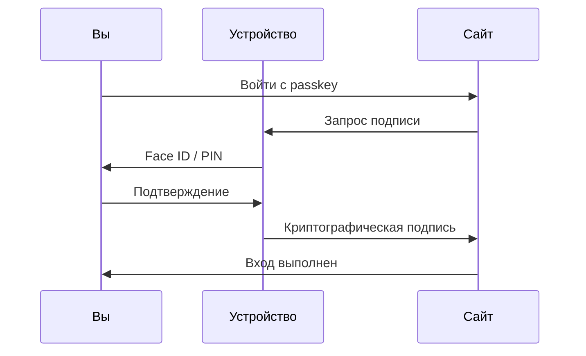

---
tags:
  - all
  - required
  - beginner
title: Passkeys и современный вход в аккаунты
description: >-
  Passkeys (ключи доступа), биометрия и WebAuthn — как входить без пароля, чем
  отличаются от 2FA и что настроить на телефоне и компьютере.
related:
  - title: "Цифровая безопасность для пользователя"
    doc: encyclopedia/1-basics/1-035-bazovaya-informatika/112
  - title: "Как устроены пароли"
    doc: encyclopedia/2-system-network/2-08-osnovy-informatsionnoy-bezopasnosti/114
  - title: "Аутентификация и авторизация"
    doc: encyclopedia/2-system-network/2-08-osnovy-informatsionnoy-bezopasnosti/111
  - title: "Шифрование и SSH"
    doc: encyclopedia/2-system-network/2-08-osnovy-informatsionnoy-bezopasnosti/116
  - title: "Основы компьютерной грамотности"
    doc: encyclopedia/1-basics/1-035-bazovaya-informatika/101
  - title: "Облако, синхронизация и бэкап"
    doc: /encyclopedia/1-basics/1-14-obmen-dannymi-i-sovmestnyy-dostup/7
  - title: "Интернет и сетевые сервисы"
    doc: /encyclopedia/2-system-network/2-03-set-i-internet/intro
---

# Passkeys и современный вход в аккаунты

<div class="article-tags">
  <span class="tag tag-required">ОБЯЗАТЕЛЬНО</span>
  <span class="tag tag-beginner">ДЛЯ НОВИЧКОВ</span>
</div>

<span class="complexity-badge">Всем</span>

Уже много десятков лет доступ к устройствам защищается простым паролем. Это легко - закройте дверь в свою комнату и не открывайте никому, пока не назовут правильную комбинацию. А если за дверью кто-то упорно три и более раз пытается угадать - вы просто отправляете его подальше. Так и работает система паролей.

Но даже сложнейшие пароли несовершенны - их можно узнать, украсть, подсмотреть и - да, угадать подбором или логикой.

Чтобы победить эту проблему, изобрели особый криптографический способ - **passkey**.

Представьте, что у вас есть две половинки ключа от двери:
- одна половинка (публичный ключ) лежит на сервере сайта (например, у Google). Она похожа на замок.
- вторая половинка (приватный ключ) лежит в защищённом чипе вашего телефона. Эту половинку никто никогда не видит, даже Google.

И при входе, сайт говорит телефону "Подпиши вот это случайное число". Телефон подписывает его вашей секретной половинкой (после того, как вы приложили палец) и отправляет обратно. Сайт проверяет подпись своим замком и пускает вас. Главный фокус здесь в том, что секретная половинка никогда не передаётся по сети, благодаря чему её нельзя украсть фишингом, потому что мошенники попросту не смогут заставить ваш телефон подписать их поддельный сайт. Passkey нельзя украсть физически, а для каждого сайта создаётся уникальный новый ключ. Это новый уровень защиты.

**Passkey** (ключ доступа, "pass key" — буквально "ключ для прохода") — способ войти в аккаунт **без ввода пароля**. На телефоне или компьютере хранится пара **криптографических ключей** (математически связанных, но разных строк данных); вы подтверждаете личность **отпечатком**, **Face ID**, **PIN устройства** или **USB-ключом**. Сайт проверяет **цифровую подпись**. Секретная строка-пароль на сервер не отправляется, поэтому её сложнее украсть через фишинг.

Стандарт называется **WebAuthn** / **FIDO2** (открытые спецификации для входа без пароля в браузере и приложениях). Поддерживают Google, Apple, Microsoft, Яндекс и многие банки.

Базовые привычки безопасности — в [Цифровой безопасности для пользователя](/encyclopedia/1-basics/1-035-bazovaya-informatika/112). Как устроены обычные пароли на сервере — [Как устроены пароли](/encyclopedia/2-system-network/2-08-osnovy-informatsionnoy-bezopasnosti/114).

---

## История проблемы паролей

Десятилетиями **пароль** был единственным способом доказать, что вы — владелец аккаунта. Пароль — строка, которую вы **знаете**. Сервер хранит её копию (обычно в виде **хеша** — необратимого отпечатка).

С ростом интернета появились системные проблемы:

| Проблема | Что происходит |
|----------|----------------|
| Повторное использование | Один пароль на 50 сайтов — утечка одного сайта открывает все |
| Слабые пароли | Люди выбирают "123456", "password", даты рождения |
| Утечки баз данных | Хакеры выкладывают миллионы паролей в открытый доступ |
| Фишинг | Поддельная страница просит ввести пароль — вы вводите сами |
| Сложность запоминания | Длинные случайные пароли нужен **менеджер паролей** |

**2FA** (двухфакторная аутентификация) добавила второй шаг — код из SMS или приложения. Это помогло, но:

- SMS можно перехватить (**SIM-swap**);
- фишинг в **реальном времени** может переслать код на сервер мошенника, пока он действует;
- пользователю всё равно нужно помнить или хранить пароль.

В 2010-х консорциум **FIDO Alliance** (Fast IDentity Online) предложил другой подход:

- **секретный ключ** никогда не покидает ваше устройство;
- сайт получает только **открытый ключ** (public key) для проверки подписи;
- подтверждение — биометрия или PIN **на устройстве**.

С 2022–2023 годов Apple, Google и Microsoft договорились о **синхронизации passkeys** между устройствами через iCloud Keychain, Google Password Manager и Microsoft account — passkeys стали массовым продуктом, а не только USB-ключом для IT-отделов.

---

## Сравнение способов входа

Так, мы выявили, что Passkey - крайне безопасен. А что если сравнить его с другими способами?

| Способ | Как работает | Слабое место |
|--------|--------------|--------------|
| Только пароль | Строка, которую вы помните или хранит менеджер | Утечки баз, повторное использование, фишинг |
| Пароль + SMS | После пароля — код в SMS | SIM-swap, перехват SMS |
| Пароль + TOTP | После пароля — код из приложения (30 сек) | Фишинг в реальном времени (реже, но возможен) |
| Passkey | Ключ на устройстве; сайт проверяет подпись | Потеря всех устройств без резервного способа |
| Аппаратный ключ | Passkey на USB/NFC-носителе | Потеря ключа без запасного |

Даже если вы перейдёте на поддельную страницу, система поймёт, что адрес сайта неправильный, и не даст ключ мошенникам. Это безопаснее паролей, ведь если хакеры украдут с сервера, это будет лишь половина ключа.

| Критерий | Пароль | TOTP (приложение) | Passkey | Аппаратный ключ |
|----------|--------|-------------------|---------|-----------------|
| Защита от фишинга | Слабая | Средняя | **Сильная** | **Сильная** |
| Удобство | Нужно вводить | Нужно копировать код | Отпечаток / Face ID | Достать ключ |
| Синхронизация | Менеджер паролей | Обычно одно устройство | iCloud / Google / Bitwarden | Нет (физический носитель) |
| Восстановление | Email, SMS | Резервные коды | Другой passkey, резервные коды | Запасной ключ |
| Поддержка сайтов | Везде | Большинство | Растёт | Крупные сервисы |

**TOTP** (Time-based One-Time Password) — одноразовый код, который меняется каждые 30 секунд в приложении вроде Google Authenticator или Яндекс.Ключ.

**SMS-код** — самый слабый второй фактор: SIM можно подменить, код перехватить.

**Passkey** на поддерживающих сайтах **заменяет** пароль; фишинговая страница не получит ваш секретный ключ — браузер привязывает вход к **домену** сайта.

На старых сайтах passkeys пока нет — оставляйте **менеджер паролей + TOTP**. См. [Цифровая безопасность](/encyclopedia/1-basics/1-035-bazovaya-informatika/112).

---

## Как это работает (упрощённо)



### Регистрация passkey

1. Вы уже вошли на сайт (паролем или другим способом).
2. Сайт предлагает "Создать passkey".
3. Устройство генерирует пару ключей:
   - **приватный ключ** (private key) — остаётся **только на устройстве**, защищён PIN или биометрией;
   - **публичный ключ** (public key) — отправляется на сервер сайта.
4. Сервер сохраняет публичный ключ и связывает его с вашим аккаунтом.

### Вход с passkey

1. Вы нажимаете "Войти с passkey".
2. Сайт отправляет **случайный вызов** (challenge).
3. Устройство подписывает вызов **приватным ключом** после вашего Face ID / PIN.
4. Сайт проверяет подпись **публичным ключом** — если совпало, вход разрешён.

Поддельная страница на другом домене **не сможет** использовать ваш ключ — браузер проверяет соответствие домена (**origin binding**).

### Биометрия

**Биометрия** (отпечаток пальца, Face ID, Windows Hello) здесь подтверждает, что ключ используете **именно вы**, а не хранит пароль на сервере компании. Отпечаток остаётся в **защищённом чипе** телефона или ноутбука (Secure Enclave, TPM).

Подробнее про криптографию с открытым ключом — [шифрование и SSH](/encyclopedia/2-system-network/2-08-osnovy-informatsionnoy-bezopasnosti/116).

---

## Настройка по платформам

Общие требования для всех платформ:

1. **Обновите ОС и браузер** — Chrome, Edge, Safari, Firefox последних версий.
2. **Включите блокировку экрана** и биометрию или надёжный PIN на телефоне.
3. Сохраните **резервные коды** и второй способ входа **до** удаления пароля.

---

### iPhone и iPad (iOS / iPadOS)

**Где хранятся passkeys:** **iCloud Keychain** (Связка ключей iCloud) — синхронизация между iPhone, iPad и Mac с тем же Apple ID.

#### Шаг 1. Подготовка Apple ID

1. **Настройки** → имя аккаунта → **Вход и безопасность**.
2. Включите **Двухфакторную аутентификацию** Apple ID (обычно уже включена).
3. **Face ID / Touch ID** → настройте биометрию.
4. Запишите **код восстановления** (Recovery Key) — 28 символов.

#### Шаг 2. Создание passkey на сайте

1. Откройте Safari (или Chrome на iOS).
2. Войдите на сайт с поддержкой passkeys (Google, Microsoft, PayPal, eBay и др.).
3. В настройках безопасности аккаунта → **Добавить passkey** / **Ключ доступа**.
4. Появится запрос **Face ID / Touch ID** → подтвердите.
5. Passkey сохранится в iCloud Keychain.

#### Шаг 3. Вход с passkey

1. На странице входа нажмите **Sign in with passkey** / **Войти с ключом доступа**.
2. Подтвердите Face ID.
3. Если passkey на другом устройстве — iPhone предложит **QR-код** для сканирования (cross-device authentication).

#### Шаг 4. Просмотр сохранённых passkeys

**Настройки** → **Пароли** → **Ключи доступа** (или через поиск "passkey" в настройках). Здесь видны passkeys по приложениям и сайтам.

---

### Android

**Где хранятся passkeys:** **Google Password Manager** (встроен в Android 9+ и Chrome) или сторонний менеджер (Bitwarden, 1Password).

#### Шаг 1. Подготовка

1. Обновите Android до актуальной версии.
2. **Настройки** → **Безопасность** → **Блокировка экрана** — PIN или биометрия.
3. Войдите в аккаунт **Google** на устройстве.

#### Шаг 2. Включение Google Password Manager

1. **Настройки Google** → **Автозаполнение** → **Google**.
2. Или в Chrome: **Настройки** → **Google Password Manager** → **Настройки** → включите синхронизацию passkeys.

#### Шаг 3. Создание passkey

1. Откройте Chrome, войдите на сайт (например, google.com или github.com).
2. Настройки аккаунта → **Passkeys** → **Create a passkey**.
3. Подтвердите **отпечаток** или PIN.
4. Passkey синхронизируется на другие Android-устройства и Chrome под тем же Google-аккаунтом.

#### Шаг 4. Вход

1. На странице входа — **Sign in with a passkey**.
2. Выберите аккаунт Google → отпечаток.
3. Для входа с компьютера — телефон покажет уведомление для подтверждения (если passkey только на телефоне).

---

### Windows 10 / 11

**Где хранятся passkeys:** **Windows Hello** + синхронизация через **Microsoft account** (для потребительских аккаунтов) или **Windows Hello for Business** (корпоративные).

#### Шаг 1. Настройка Windows Hello

1. **Параметры** → **Учётные записи** → **Параметры входа**.
2. Настройте **PIN**, **отпечаток** или **распознавание лиц** (Windows Hello).
3. Убедитесь, что используете **Microsoft account** (не только локальную учётную запись) — для синхронизации passkeys между устройствами.

#### Шаг 2. Браузер

- **Edge** — полная поддержка passkeys из коробки.
- **Chrome** — поддержка через Windows Hello API.

#### Шаг 3. Создание passkey

1. В Edge откройте сайт (microsoft.com, google.com).
2. Войдите паролем → **Security** → **Advanced security options** → **Passkeys**.
3. **Add a passkey** → подтвердите Windows Hello (PIN или биометрия).

#### Шаг 4. Управление passkeys в Windows

**Параметры** → **Учётные записи** → **Параметры входа** → **Управление ключами доступа** (Passkeys) — список сохранённых ключей.

---

### macOS

**Где хранятся passkeys:** **iCloud Keychain** — те же passkeys, что на iPhone, если один Apple ID.

#### Шаг 1. Подготовка

1. **Системные настройки** → **Apple ID** → **iCloud** → включите **Связка ключей** (Keychain).
2. Настройте **Touch ID** или **Apple Watch** для подтверждения.

#### Шаг 2. Создание passkey

1. Safari → сайт с поддержкой → настройки безопасности → **Add passkey**.
2. Подтвердите Touch ID или пароль пользователя Mac.

#### Шаг 3. Синхронизация

Passkey, созданный на Mac, появится на iPhone через iCloud через несколько секунд (нужен интернет).

---

### Linux

Поддержка passkeys на Linux **растёт**, но менее однородна, чем на Windows и Mac.

- **Chrome** и **Firefox** поддерживают WebAuthn через системные API.
- Нужен менеджер: **Bitwarden**, **KeePassXC** (с поддержкой FIDO), или **GNOME Keyring** / **KWallet** в зависимости от дистрибутива.
- Для надёжной работы проверьте документацию вашего дистрибутива (Ubuntu 22.04+, Fedora 38+ обычно работают с Chrome).

Практичный путь для Linux-пользователя: **Bitwarden** с passkeys и TOTP как резерв.

---

## Какие сервисы поддерживают passkeys

Список меняется — проверяйте настройки безопасности конкретного сервиса. По состоянию на 2024–2025 год:

| Категория | Сервис | Примечание |
|-----------|--------|------------|
| Почта и облако | Google (Gmail, Drive) | Passkey + TOTP |
| Почта и облако | Microsoft (Outlook, OneDrive) | Passkey через Microsoft account |
| Почта и облако | Apple (iCloud) | Apple ID passkey |
| Почта | Yahoo, Proton Mail | Passkey в настройках |
| Разработка | GitHub, GitLab | Passkey для входа и git-операций |
| Платежи | PayPal, Stripe Dashboard | Passkey для входа |
| Маркетплейсы | eBay, Amazon (частично) | Региональные отличия |
| Соцсети | LinkedIn, X (Twitter) | В настройках безопасности |
| Россия | Яндекс ID | Passkey в id.yandex.ru |
| Банки | Крупные банки (Сбер, Тинькофф и др.) | Зависит от приложения; часто биометрия в приложении по тому же принципу |
| Менеджеры паролей | Bitwarden, 1Password, Dashlane | Хранение и синхронизация passkeys |
| Корпоративные | Microsoft Entra, Okta | Для рабочих аккаунтов |

Если passkey недоступен — используйте **менеджер паролей + TOTP**. Список поддержки FIDO — на [passkeys.directory](https://passkeys.directory) (англоязычный каталог).

---

## Миграция с пароля на passkey

Переход безопаснее делать **постепенно**, не удаляя пароль сразу.

### Этап 1. Подготовка (день 1)

- [ ] Менеджер паролей настроен — [инструкция](/encyclopedia/1-basics/1-035-bazovaya-informatika/112#настройка-менеджера-паролей-bitwarden)
- [ ] 2FA включена (TOTP, не только SMS)
- [ ] **Резервные коды** сохранены (распечатка или зашифрованная заметка)
- [ ] Второе устройство или запасной passkey запланирован

### Этап 2. Добавление passkey (день 2–7)

1. Войдите на сайт **обычным паролем**.
2. Настройки → Безопасность → **Add passkey**.
3. Создайте passkey на **основном телефоне**.
4. Проверьте вход: выйдите и войдите **только через passkey**.
5. Добавьте **второй passkey** на другом устройстве (ноутбук, планшет).

### Этап 3. Passkey как основной способ (неделя 2)

- Используйте passkey для ежедневного входа.
- Пароль пока **не удаляйте** — он резерв.
- Убедитесь, что passkey синхронизируется (iCloud / Google / Bitwarden).

### Этап 4. Отключение пароля (опционально)

Некоторые сервисы позволяют **удалить пароль** и оставить только passkey (Google Advanced Protection, Apple). Делайте это только если:

- есть passkey на **двух устройствах** или аппаратный ключ;
- **резервные коды** сохранены;
- email восстановления актуален.

### Этап 5. Старые сайты без passkeys

Оставьте **уникальный пароль в менеджере + TOTP**. Passkey и пароль могут сосуществовать на одном аккаунте на переходный период.

---

## Синхронизация и резервные копии

| Способ синхронизации | Плюсы | Минусы |
|---------------------|-------|--------|
| iCloud Keychain | Бесшовно на Apple | Привязка к Apple ID |
| Google Password Manager | Бесшовно на Android / Chrome | Привязка к Google |
| Microsoft account | Windows + Edge | Меньше сайтов |
| Bitwarden / 1Password | Кроссплатформенность | Нужна подписка / настройка |
| USB YubiKey | Не зависит от облака | Можно потерять; нужен второй ключ |

**Резервные коды восстановления** — одноразовые коды (обычно 8–10 штук), которые выдаёт сервис при настройке 2FA. Сохраните их **до** потери телефона.

**Второй passkey** — лучший резерв: создайте ключ на телефоне и на ноутбуке, или телефон + USB YubiKey.

См. [облако и бэкап](/encyclopedia/1-basics/1-14-obmen-dannymi-i-sovmestnyy-dostup/7) — принципы резервного копирования применимы и к кодам восстановления (хранить отдельно от основного устройства).

---

## Аппаратные ключи (YubiKey и аналоги)

**Аппаратный ключ безопасности** — USB- или NFC-устройство (YubiKey, Google Titan, Feitian), которое хранит passkey **вне** телефона и компьютера.

### Когда имеет смысл

- почта и облако с **конфиденциальными** данными;
- работа с **криптовалютой** или финансами;
- **журналисты**, **активисты**, публичные персоны;
- требование **корпоративной политики**.

### Настройка (общая схема)

1. Купите ключ у **официального** продавца (не с маркетплейса без проверки).
2. В настройках безопасности Google / Microsoft / GitHub → **Add security key**.
3. Вставьте USB или приложите NFC → коснитесь кнопки на ключе.
4. **Купите второй ключ** — храните в другом месте (сейф, у родственников).

### Passkey на ключе и passkey в телефоне

Можно иметь **несколько passkeys** на одном аккаунте: один в iCloud, второй на YubiKey. При потере телефона войдёте через ключ.

---

## Passkeys в семье и на общих устройствах

### Семейный iPad или "общий компьютер"

Passkey привязан к **Apple ID / Google account того, кто его создал**. На общем устройстве:

- каждый член семьи должен войти в **свой** аккаунт Google / Apple;
- не создавайте passkey для **вашего** банка в профиле ребёнка;
- используйте **отдельные профили** Windows / macOS / Chrome для каждого человека.

### Семейный доступ Apple / Google

**Семейный доступ Apple** и **Google Family Link** **не делят** passkeys между взрослыми и детьми автоматически — у каждого свой ключ доступа в своей связке.

### Смерть или incapacitation близкого

Passkeys **не передаются** по наследству так же просто, как бумажный список паролей. Рекомендации:

- для критичных аккаунтов оставьте **резервный пароль** в сейфе (запечатанный конверт);
- используйте **менеджер паролей** с экстренным доступом (Bitwarden Emergency Access, 1Password Emergency Kit);
- **аппаратный ключ** в сейфе с инструкцией.

### Дети

- для детских аккаунтов — **родительский контроль** — [статья](/encyclopedia/1-basics/1-035-bazovaya-informatika/218);
- passkey на детском телефоне — нормально, если у ребёнка свой Apple ID / Google account под вашим контролем.

---

## Если потеряли телефон

1. **Заблокируйте SIM** у оператора — защита от SMS-2FA.
2. С **другого устройства**, где уже есть passkey или активная сессия:
   - войдите в аккаунт;
   - проверьте **активные сессии**, удалите подозрительные;
   - при необходимости **удалите passkey** потерянного телефона из настроек безопасности.
3. **Find My iPhone** / **Google Find My Device** → режим потери → **удалённое стирание**.
4. Используйте **резервные коды** или **второй passkey** / **аппаратный ключ**.
5. Если остались только passkey на потерянном телефоне — **восстановление через поддержку** Google / Apple / Microsoft (может занять дни, нужны документы).

Подробный чек-лист — [Цифровая безопасность](/encyclopedia/1-basics/1-035-bazovaya-informatika/112#безопасность-смартфона).

---

## Типичные проблемы и решения

### Passkey не предлагается на сайте

**Причины:**

- сайт ещё не поддерживает WebAuthn;
- вы используете **старый браузер** — обновите Chrome / Edge / Safari;
- на Linux не настроен системный хранили ключей.

**Решение:** менеджер паролей + TOTP. Проверьте [passkeys.directory](https://passkeys.directory).

### "Не удалось создать passkey"

**Причины:**

- не настроен **Windows Hello** / **Face ID** / PIN;
- **iCloud Keychain** выключен на Mac / iPhone;
- корпоративная политика блокирует FIDO.

**Решение:**

- Windows: Параметры → Учётные записи → PIN Windows Hello;
- iPhone: Настройки → Face ID → настроить заново;
- Mac: iCloud → Связка ключей → включить.

### Passkey есть на телефоне, но не на компьютере

**Причины:**

- разные аккаунты Google / Apple на устройствах;
- синхронизация iCloud / Google отключена;
- passkey создан **только локально** без синхронизации.

**Решение:**

- проверьте один ли Apple ID / Google account;
- создайте **второй passkey** прямо на компьютере (оба будут работать);
- или используйте **Bitwarden** для кроссплатформенной синхронизации.

### Браузер просит телефон при входе с ноутбука

Это **нормально** — cross-device authentication. На экране ноутбука QR-код → сканируете камерой телефона → подтверждаете Face ID. Убедитесь, что Bluetooth включён на обоих устройствах (для некоторых сценариев).

### Сменил телефон — passkeys пропали

Если была **синхронизация iCloud / Google** — войдите в новый телефон под **тем же аккаунтом**, passkeys подтянутся автоматически (может занять до часа).

Если passkey был **только на старом телефоне** без облака:

- войдите **резервным паролем** (если не удаляли);
- используйте **резервные коды**;
- обратитесь в поддержку сервиса.

### Passkey и корпоративный аккаунт

IT-отдел может **запретить** личные passkeys или **требовать** аппаратный ключ. Уточните политику — не привязывайте рабочий Entra / AD к личному iCloud.

### Firefox не видит passkey

В Firefox включите **about:config** → `security.webauthn` или используйте последнюю версию с поддержкой passkeys. Альтернатива — Edge / Chrome для сайтов с passkey.

---

## Passkeys и 2FA одновременно

На многих сервисах passkey **заменяет** пароль, но **2FA для чувствительных операций** (смена email, удаление аккаунта) может остаться.

| Ситуация | Рекомендация |
|----------|--------------|
| Только passkey | Минимум для входа на современном сайте |
| Passkey + TOTP | Максимальная защита; TOTP как второй фактор для настроек |
| Passkey + аппаратный ключ | Два passkey на одном аккаунте |
| Passkey + резервные коды | Обязательный минимум резерва |

Passkey **не отменяет** необходимость **резервных кодов** — сохраните их при любой конфигурации.

---

## Частые вопросы (FAQ)

### Passkey — это то же самое, что пароль?

Нет. **Пароль** — строка, которую вы вводите и которую можно украсть через фишинг. **Passkey** — пара ключей на устройстве; секретная часть **никогда не передаётся** на сайт.

### Можно ли украсть passkey через фишинг?

Классический фишинг с поддельной страницей **не получает** ваш приватный ключ — браузер проверяет домен. Это главное преимущество passkeys.

### Нужен ли менеджер паролей, если есть passkeys?

Да, для **сайтов без passkeys** и для **резервных паролей**. Bitwarden и 1Password сами хранят passkeys.

### Passkey заменяет 2FA?

На многих сайтах passkey **заменяет связку пароль+2FA** для входа. Для восстановления аккаунта часто нужны **резервные коды** или второй passkey — это отдельный слой.

### Безопасно ли хранить passkeys в iCloud / Google?

Ключи **зашифрованы**; Apple и Google не могут использовать их без вашего устройства и биометрии. Риск — **компрометация всего Apple ID / Google account** — защищайте его 2FA и длинным паролем.

### Сколько passkeys нужно на один аккаунт?

Минимум **два** на разных устройствах или один passkey + аппаратный ключ. Один passkey на одном телефоне без резерва — рискованно.

### Работают ли passkeys offline?

**Вход** на уже известный сайт иногда возможен без интернета на устройстве, но **первичная регистрация** и проверка на сервере требуют сети. Практически — нужен интернет.

### Можно ли использовать passkey в приложении на телефоне?

Да, если приложение поддерживает **FIDO2** / passkey (банки, Google apps). Логика та же — биометрия вместо пароля.

### Что лучше для бабушки — passkey или пароль?

Если телефон с Face ID / отпечатком и один Apple ID — **passkey проще** (не нужно помнить пароль). Обязательно настройте **доверенный контакт** Apple / резервные коды с вашей помощью — [телефон для пожилых](/encyclopedia/1-basics/1-035-bazovaya-informatika/206).

### Passkeys в России — legal?

Да. **Яндекс ID** и российские банки внедряют passkeys / биометрический вход. Стандарт FIDO — международный, не привязан к санкциям на конкретные бренды ключей (проверяйте доступность YubiKey в вашем регионе).

### Удалят ли пароли полностью?

Переход займёт **годы**. Пароли останутся для старых систем, корпоративных VPN, локальных учётных записей. Passkeys — дополнение и постепенная замена на современных сервисах.

---

## Настройка passkey в Bitwarden

**Bitwarden** — кроссплатформенный менеджер паролей, который с 2023 года хранит и синхронизирует passkeys между Windows, macOS, Linux, Android и iOS. Удобен, если вы не хотите привязываться только к iCloud или Google.

### Шаг 1. Аккаунт и расширение

1. Зарегистрируйтесь на [bitwarden.com](https://bitwarden.com) — см. [настройку менеджера](/encyclopedia/1-basics/1-035-bazovaya-informatika/112#настройка-менеджера-паролей-bitwarden).
2. Установите **расширение Bitwarden** для Chrome, Edge или Firefox.
3. Войдите в аккаунт Bitwarden в расширении.

### Шаг 2. Включение passkeys в Bitwarden

1. В веб-кабинете Bitwarden: **Settings** → **Account settings** → включите **Allow passkeys**.
2. На телефоне в приложении Bitwarden: **Настройки** → **Unlock with biometrics** — для быстрого доступа к ключам.

### Шаг 3. Сохранение passkey с сайта

1. Войдите на сайт с поддержкой passkeys (например, github.com) обычным паролем.
2. В настройках безопасности сайта → **Add passkey**.
3. Браузер предложит выбрать хранилище — выберите **Bitwarden**.
4. Подтвердите мастер-пароль Bitwarden или биометрию.
5. Passkey сохранится в вашем vault и синхронизируется на все устройства с Bitwarden.

### Шаг 4. Вход через Bitwarden

1. На странице входа нажмите **Sign in with passkey**.
2. Расширение Bitwarden предложит ключ → подтвердите.
3. Если passkey на телефоне — откроется приложение Bitwarden с запросом биометрии.

### Плюсы Bitwarden для passkeys

- один vault для **паролей, TOTP и passkeys**;
- работает на **Linux** и смешанных экосистемах (iPhone + Windows PC);
- семейный план — отдельные vault для каждого, passkeys не смешиваются.

---

## Passkeys в браузерах

Каждый браузер делегирует хранение passkeys **операционной системе** или **менеджеру паролей**.

| Браузер | Где хранятся passkeys | Примечание |
|---------|----------------------|------------|
| Safari (Mac, iOS) | iCloud Keychain | Лучшая интеграция в экосистеме Apple |
| Chrome (Windows, Android) | Google Password Manager / Windows Hello | Синхронизация через Google account |
| Edge (Windows) | Microsoft account + Windows Hello | Встроено в Windows 11 |
| Firefox | OS keychain или Bitwarden | Может потребовать ручной выбор хранилища |
| Chrome (Mac) | iCloud Keychain или Google | При установке спросит предпочтение |

### Как выбрать хранилище при первом passkey

При создании passkey браузер покажет диалог:

- **"Save passkey to …"** — выберите iCloud, Google, Bitwarden или Windows Hello;
- решение можно **изменить позже**, создав второй passkey в другом хранилище;
- для кроссплатформенности удобнее **Bitwarden** или **1Password**.

### Очистка старых passkeys

Если passkey создан по ошибке в не том хранилище:

1. Зайдите в настройки безопасности **аккаунта на сайте** → список passkeys → удалите лишний.
2. Удалите ключ из **локального хранилища** (iCloud Keychain, Google Password Manager).
3. Создайте passkey заново в нужном месте.

---

## Мифы о passkeys

| Миф | Правда |
|-----|--------|
| "Passkey — это просто Face ID" | Face ID **разблокирует** ключ на устройстве; сам passkey — криптографическая пара, привязанная к сайту |
| "Если украдут телефон — украдут все аккаунты" | Без Face ID / PIN ключ недоступен; можно удалённо стереть телефон |
| "Passkeys заменят менеджеры паролей завтра" | Переход займёт годы; старые сайты останутся на паролях |
| "Passkey привязан к одному устройству навсегда" | Синхронизация через iCloud / Google / Bitwarden; можно добавить несколько ключей |
| "Биометрия отправляется на сервер" | На сервер уходит только **подпись**; отпечаток остаётся в чипе телефона |
| "Passkeys не работают в России" | Яндекс ID и российские банки внедряют поддержку |
| "Нужно покупать YubiKey обязательно" | Для большинства достаточно passkey в телефоне; YubiKey — дополнительная защита |
| "Passkey = пароль в файле на диске" | Секретный ключ защищён **Secure Enclave** / **TPM**, не экспортируется как текст |

---

## Сценарии использования

### Ежедневный вход в почту

1. Открываете gmail.com.
2. Браузер предлагает **войти с passkey**.
3. Face ID — вы внутри за 2 секунды.
4. Пароль не вводите, фишинговая страница не получит секрет.

### Новый ноутбук

1. Включаете ноутбук, входите в **Apple ID / Google account**.
2. Passkeys **синхронизируются** автоматически (iCloud Keychain / Google Password Manager).
3. На github.com / google.com входите passkey без повторной настройки.
4. Если синхронизация задержалась — создайте **второй passkey** на ноутбуке при первом входе паролем.

### Банковское приложение

Многие банки используют **биометрический вход** по тому же принципу FIDO:

- ключ хранится в **защищённой области** телефона;
- подтверждение — отпечаток;
- пароль от приложения может не понадобиться после первой настройки.

Уточняйте в вашем банке: раздел "Безопасность" → "Биометрия" / "Ключ доступа".

### Работа с GitHub

1. github.com → **Settings** → **Password and authentication** → **Passkeys**.
2. **Add a passkey** → подтвердите Windows Hello / Face ID.
3. При `git push` через HTTPS может потребоваться passkey или **Personal Access Token** — passkey покрывает вход в веб-интерфейс.

---

## Passkeys и корпоративная безопасность

На работе IT-отдел может управлять входом через **Microsoft Entra ID** (бывший Azure AD), **Okta** или **Google Workspace**.

| Политика компании | Что делать |
|-------------------|------------|
| Passkeys разрешены | Создайте passkey на **рабочем** аккаунте, не смешивайте с личным iCloud |
| Только аппаратный ключ | Используйте **YubiKey**, выданный IT, или купленный по списку моделей |
| Passkeys запрещены | Оставьте пароль + TOTP по корпоративным правилам |
| BYOD (личный телефон) | Уточните, не получит ли IT доступ к **личным** passkeys при MDM-профиле |

**MDM** (Mobile Device Management) — корпоративное управление телефоном. При установке рабочего профиля passkeys **рабочего аккаунта** могут храниться отдельно от личных — зависит от настроек.

Подробнее про рабочую безопасность — [Цифровая безопасность](/encyclopedia/1-basics/1-035-bazovaya-informatika/112#безопасность-на-рабочем-месте).

---

## Будущее passkeys

Тренды на 2025–2026 год:

- **Passkeys по умолчанию** — Google и Apple предлагают создать passkey при регистрации на новых сайтах;
- **Cross-platform sync** — Bitwarden, 1Password, Dashlane конкурируют с iCloud / Google за хранение ключей;
- **Passkeys для приложений** — не только сайты, но и нативные apps (банки, госуслуги);
- **Удаление паролей** — Google Account позволяет жить **только на passkeys** для продвинутых пользователей;
- **Regulation** — регуляторы (в т.ч. в ЕС) подталкивают банки к сильной аутентификации; FIDO2 подходит под требования **SCA** (Strong Customer Authentication).

Пароли **полностью не исчезнут** ещё долго: старые системы, embedded-устройства, корпоративные VPN. Стратегия — passkeys на новых сервисах, менеджер паролей + TOTP на остальных.

---

## Passkeys в корпоративной среде (enterprise)

Домашний сценарий "создал passkey в iCloud" в компании **дополняется** политиками IT, аудитом и разделением личного и рабочего. Ниже — что важно сотруднику и администратору.

### Платформы управления идентификацией

| Платформа | Роль | Passkeys / FIDO |
|-----------|------|-----------------|
| **Microsoft Entra ID** (Azure AD) | Учётные записи Microsoft 365, Windows | Passwordless, FIDO2-ключи, Windows Hello for Business |
| **Okta** | Единый вход (SSO) в SaaS | WebAuthn, аппаратные ключи, политики по группам |
| **Google Workspace** | Почта и документы организации | Passkeys для Google account, 2-Step Verification |
| **Ping Identity, OneLogin** | Enterprise SSO | FIDO2, адаптивная аутентификация |
| **Keycloak** (self-hosted) | Open source IAM | WebAuthn через настройку realm |

★ **SSO** (Single Sign-On) — один вход открывает несколько корпоративных сервисов; passkey может быть **первым фактором** в этой цепочке.

### Типичные корпоративные политики

| Политика | Смысл для сотрудника |
|----------|----------------------|
| **Passwordless required** | Пароль отключён; только passkey или ключ |
| **Phishing-resistant MFA** | Только FIDO2 / passkey, **не** SMS |
| **Managed devices only** | Passkey только на ноутбуке компании с MDM |
| **Block personal iCloud** | Личные passkeys не для `corp@company.com` |
| **Hardware key mandatory** | Для админов — YubiKey, выданный IT |

### Windows Hello for Business и потребительский Hello

| Аспект | Windows Hello (дом) | WHfB (работа) |
|--------|---------------------|---------------|
| Привязка | Microsoft account | **Entra ID** (Azure AD) |
| Восстановление | Облако Microsoft | Политики IT, escrow ключей |
| Синхронизация | Между личными ПК | В пределах домена организации |
| TPM | Желательно | **Обязательно** на корп. устройствах |

**TPM** (Trusted Platform Module) — чип на материнской плате, хранящий ключи passkey в защищённой области.

### Регистрация рабочего passkey (общая схема)

1. IT включает **FIDO2** в Entra ID / Okta.
2. Сотрудник на **корпоративном** ноутбуке входит паролем + старым 2FA.
3. Портал безопасности → **Register security key** / **Add passkey**.
4. Подтверждение Windows Hello / Touch ID / YubiKey.
5. Тестовый вход **только** через passkey.
6. (Опционально) IT отключает пароль по политике.

### MDM и контейнеризация

**MDM** (Mobile Device Management) — профиль на телефоне от работодателя.

| Режим | Passkeys личные | Passkeys рабочие |
|-------|-----------------|------------------|
| Полное управление устройством | Риск стирания при увольнении | В рабочем профиле Android / iOS |
| BYOD, только рабочий контейнер | Остаются в личном Keychain | В **Work Profile** |
| Без MDM | Полная свобода | Не рекомендуется для секретов |

**Правило:** не создавайте passkey `ceo@company.com` в **личном** iCloud ребёнка на семейном iPad.

### Аудит и отзыв доступа

В отличие от домашнего аккаунта, IT видит:

- список **зарегистрированных** FIDO-учётных данных;
- дату последнего входа;
- возможность **отозвать** ключ при увольнении за минуты.

При увольнении сотрудника админ **удаляет** все passkeys и сессии — уносить "ключ в кармане" нельзя, если это корпоративный YubiKey (его сдают).

### Гибрид — личное и рабочее на одном ноутбуке

| Практика | Рекомендация |
|----------|--------------|
| Два профиля Chrome / Edge | Рабочий — только `corp@`; личный — `personal@` |
| Разные менеджеры | Bitwarden: отдельные vault "Work" / "Personal" |
| Passkeys | Рабочие — WHfB / Entra; личные — iCloud / Google |
| Выход из системы | Win+L; не смешивать сеансы Remote Desktop |

### Соответствие регуляторике

| Требование | Как passkeys помогают |
|------------|----------------------|
| **PSD2 / SCA** (ЕС, банки) | FIDO2 — "сильная" аутентификация |
| **NIST 800-63B** (США) | Phishing-resistant authenticators |
| **152-ФЗ** (РФ) | Сильная аутентификация к системам с ПДн — зона ответственности оператора; passkeys — один из технических вариантов |

Точное соответствие определяет **ИБ-отдел** и юристы; сотруднику достаточно следовать инструкции IT.

### Enterprise FAQ

**Можно ли отказаться от корпоративного passkey?** Только если политика разрешает пароль + TOTP; всё чаще passwordless **обязателен**.

**Что при смене ноутбука?** Новый WHfB / регистрация ключа в портале; старый ключ отзывается.

**Работает ли YubiKey с Entra ID?** Да, для моделей из списка совместимости Microsoft.

**Нужен ли VPN после passkey?** Passkey защищает **вход**; VPN защищает **канал** к внутренним серверам — это разные слои.

---

## Матрица устранения неполадок (troubleshooting)

Используйте таблицу сверху вниз: найдите симптом, выполните проверки по порядку.

### Симптом — passkey не предлагается при входе

| № | Проверка | Если не помогло → |
|---|----------|-------------------|
| 1 | Сайт в списке [passkeys.directory](https://passkeys.directory)? | Пароль + TOTP |
| 2 | Браузер обновлён (Chrome 109+, Safari 16+, Edge 109+)? | Обновить |
| 3 | Вход в **приватном режиме** — повторить | Отключить блокировщики |
| 4 | Другой браузер (Edge вместо Firefox) | См. раздел браузеров |
| 5 | Корпоративная политика блокирует WebAuthn | Обратиться в IT |

### Симптом — "Не удалось создать passkey"

| № | Проверка | Действие |
|---|----------|----------|
| 1 | Windows Hello / Face ID / PIN настроены? | Параметры входа → настроить PIN |
| 2 | iCloud Keychain включён (Apple)? | iCloud → Связка ключей |
| 3 | Google account на Android? | Настройки → Автозаполнение |
| 4 | Сайт открыт по **HTTPS**? | Не создавать на http |
| 5 | TPM / Secure Enclave доступен? | Обновить BIOS / драйверы |
| 6 | Лимит passkeys на аккаунте | Удалить старые в настройках сайта |

### Симптом — passkey на телефоне, ноутбук просит QR бесконечно

| № | Проверка | Действие |
|---|----------|----------|
| 1 | Bluetooth включён на обоих устройствах | Включить BT |
| 2 | Один Apple ID / Google account | Выровнять аккаунты |
| 3 | Камера ноутбука / телефона работает | Повторить сканирование |
| 4 | Создать **второй passkey** прямо на ноутбуке | Настройки безопасности сайта |
| 5 | Firewall блокирует WebAuthn | Временно отключить для теста |

### Симптом — после смены телефона passkeys пропали

| № | Сценарий | Действие |
|---|----------|----------|
| 1 | Была синхронизация iCloud / Google | Войти в **тот же** аккаунт на новом телефоне, подождать до 1 ч |
| 2 | Только локальный ключ, пароль не удаляли | Войти паролем → создать passkey заново |
| 3 | Пароль удалён, один ключ на старом телефоне | Резервные коды → поддержка сервиса |
| 4 | Bitwarden | Войти в Bitwarden на новом устройстве — vault синхронизируется |

### Симптом — Firefox / Linux не видит ключ

| № | Действие |
|---|----------|
| 1 | Firefox ≥ 119, `about:config` → `security.webauthn` = true |
| 2 | Ubuntu: пакет `fido2-tools`, служба `pcscd` для USB-ключей |
| 3 | Использовать **Bitwarden** как authenticator |
| 4 | Временно Chrome / Edge для регистрации ключа |

### Симптом — корпоративный аккаунт отклоняет личный passkey

| Причина | Решение |
|---------|---------|
| Политика Entra | Зарегистрировать ключ через **корпоративный портал** |
| Ключ в личном iCloud | Создать passkey в **WHfB** или YubiKey |
| Устройство не в домене | Подключить к Azure AD / Intune |

### Сводная матрица — платформа × проблема

| Проблема | Windows 11 | macOS | iOS | Android | Linux |
|----------|------------|-------|-----|---------|-------|
| Нет PIN / Hello | Параметры → Вход | Touch ID в настройках | Face ID | Блокировка экрана | Bitwarden |
| Нет синхронизации | Microsoft account | iCloud Keychain | iCloud | Google PM | Bitwarden |
| Cross-device fail | BT, Phone Link | Continuity, BT | Камера QR | BT, Nearby | QR + телефон |
| Корп. блокировка | Entra policy | MDM profile | MDM | Work profile | IT + Bitwarden |

---

## Passkeys и аппаратные ключи — детальное сравнение

### Три типа authenticator

| Тип | Примеры | Где хранится секрет | Переносимость |
|-----|---------|---------------------|---------------|
| **Platform** (встроенный) | Face ID, Windows Hello, Touch ID | Secure Enclave, TPM | Синхронизация через облако вендора |
| **Roaming** (переносной) | YubiKey 5, Google Titan, Feitian | Чип на USB/NFC | Физически с вами |
| **Hybrid** | Passkey в Bitwarden | Vault менеджера | Любое устройство с Bitwarden |

### Сравнительная таблица — passkey в телефоне и YubiKey

| Критерий | Passkey (iCloud / Google) | YubiKey 5 NFC |
|----------|---------------------------|---------------|
| Стоимость | Бесплатно (в устройстве) | ~$25–80 за ключ |
| Удобство ежедневного входа | Отпечаток / Face ID | Вставить USB / приложить NFC |
| Фишинг | Устойчив | Устойчив |
| Потеря устройства | Стереть телефон; ключи в облаке | Ключ **физически** потерян — нужен запасной |
| SIM-swap | Не зависит от SMS | Не зависит |
| Компрометация Apple ID / Google | **Риск** для всех passkeys | Не зависит от облака вендора |
| Работа без батареи телефона | Нет | USB-ключ работает от порта |
| Корпоративный аудит | Ограничен | Серийный номер ключа в логах |
| Второй фактор на том же аккаунте | Второй passkey на другом устройстве | **Два** ключа в комплекте рекомендуют |

### Когда что выбирать

| Профиль | Рекомендация |
|---------|--------------|
| Обычный пользователь | Passkey в телефоне + резервный на ноутбуке |
| Фриланс, доступ к деньгам | + YubiKey на почту и GitHub |
| Корпоративный админ | Два YubiKey по политике IT |
| Публичная персона, журналист | YubiKey + passkey; минимум SMS |
| Семья, один Apple ID на iPad | Отдельные аккаунты; не смешивать банк |

### Популярные модели аппаратных ключей

| Модель | Интерфейс | NFC | Примечание |
|--------|-----------|-----|------------|
| YubiKey 5 NFC | USB-A | Да | Универсальный вариант |
| YubiKey 5C NFC | USB-C | Да | Для новых ноутбуков |
| Google Titan | USB / NFC | Да | Интеграция с Google |
| Feitian K40 | USB-C | Да | Бюджетная альтернатива |
| Thetis FIDO2 | USB-A | Нет | Только USB |

Покупайте у **официальных** дилеров; подделки встречаются на маркетплейсах.

### Настройка двух YubiKey на одном аккаунте (Google)

1. [myaccount.google.com](https://myaccount.google.com) → Безопасность → **Ключи доступа и безопасности**.
2. **Добавить ключ безопасности** → основной YubiKey.
3. Повторить для **запасного** ключа — хранить в другом месте.
4. Сохранить **резервные коды** отдельно от ключей.
5. (Опционально) Добавить passkey в телефоне как третий фактор удобства.

### Миф — "YubiKey всегда лучше passkey в телефоне"

**Правда:** YubiKey лучше при угрозе компрометации **облачного аккаунта** и для **политик** enterprise; passkey в телефоне **удобнее** и для большинства бытовых рисков достаточен. Идеал — **оба**: телефон для ежедневного входа, YubiKey для почты и восстановления.

---

## Дополнительные детали по платформам

### iOS 17 / iPadOS 17 и новее

| Функция | Описание |
|---------|----------|
| **Passkeys в приложениях** | Нативные app используют ASAuthorizationController |
| **Shared passkeys** (семья) | Ограничено; банковские ключи не делятся |
| **QR cross-device** | Стандарт FIDO Alliance для входа с ПК |
| **Recovery Contact** | Доверенный контакт Apple для восстановления |

**Настройка Recovery Contact:** Настройки → Apple ID → Пароль и безопасность → **Контакт для восстановления** — укажите родственника.

### Android 14+

| Функция | Описание |
|---------|----------|
| **Credential Manager API** | Единый выбор passkey / пароля |
| **Google Password Manager** | Синхронизация между Android и Chrome на desktop |
| **Сторонние провайдеры** | 1Password, Bitwarden как хранилище по выбору |
| **Work profile** | Отдельные passkeys для `work@` |

**Путь:** Настройки → Google → **Автозаполнение** → Google → Passkeys.

### Windows 11 23H2+

| Функция | Описание |
|---------|----------|
| **Passkey settings** | Параметры → Учётные записи → Ключи доступа |
| **Backup to Microsoft** | Синхронизация passkeys в MS account |
| **Hello PIN** | Минимум для platform authenticator |
| **WebAuthn в Edge** | Полная поддержка; Chrome использует тот же API |

**Важно:** локальная учётная запись Windows **без** Microsoft account не синхронизирует passkeys между ПК.

### macOS Sonoma / Sequoia

| Функция | Описание |
|---------|----------|
| **iCloud Keychain passkeys** | Общий vault с iPhone |
| **Safari** | Лучшая интеграция; Chrome на Mac — выбор хранилища |
| **Touch ID на внешней клавиатуре** | Passkey на Mac mini с Magic Keyboard |

### Браузеры — тонкости 2025

| Браузер | Регистрация | Вход cross-device | Удаление ключа |
|---------|-------------|-------------------|----------------|
| Safari | iCloud | QR + iPhone | Настройки → Пароли |
| Chrome | Google PM / Bitwarden | QR + Android | `passwords.google.com` |
| Edge | Microsoft + Hello | QR + телефон | Параметры Windows |
| Firefox | OS / Bitwarden | QR | about:logins |
| Brave | Как Chrome (Chromium) | Как Chrome | Настройки Brave |

### Яндекс ID и российские сервисы

1. [id.yandex.ru](https://id.yandex.ru) → Безопасность → **Ключи доступа**.
2. Подтверждение через приложение Яндекс с биометрией.
3. Банки с биометрией в приложении часто используют **тот же принцип** FIDO, но без экспорта ключа в систему.

Проверяйте формулировки в приложении: "Вход по отпечатку" ≠ всегда полноценный passkey WebAuthn, но угроза фишинга ниже, чем у пароля.

---

## Сценарии enterprise — развёртывание по ролям

### Роль — обычный сотрудник

| День | Действие |
|------|----------|
| 1 | Получить ноутбук с предустановленным MDM |
| 2 | Войти в Entra ID / Google Workspace паролем + старый 2FA |
| 3 | Зарегистрировать **Windows Hello** или YubiKey по инструкции IT |
| 4 | Проверить вход в Outlook / Teams **без пароля** |
| 5 | Сохранить резервные коды в **корпоративный** сейф (не личный Telegram) |

### Роль — администратор IT

| Задача | Инструмент |
|--------|------------|
| Включить FIDO2 | Entra ID → Security → Authentication methods |
| Требовать phishing-resistant MFA | Conditional Access policy |
| Инвентаризация ключей | Отчёт registered security keys |
| Отзыв при увольнении | Disable user + revoke sessions + delete FIDO |
| Запасные ключи | Два YubiKey на админа в разных сейфах |

### Роль — разработчик

| Сервис | Рекомендация |
|--------|--------------|
| GitHub Enterprise | Passkey + **запасной** PAT с ограниченным сроком |
| AWS / Azure console | Аппаратный ключ для root / owner |
| CI/CD secrets | Не в passkey; секреты в vault пайплайна |
| Локальный `git` | SSH-ключ отдельно от passkey веб-интерфейса |

### Conditional Access (упрощённо)

**Conditional Access** — правила Microsoft Entra: "вход разрешён, если…"

| Условие | Пример политики |
|---------|-----------------|
| Местоположение | Блокировать вход из "рисковых" стран без VPN |
| Устройство | Только **Hybrid Azure AD joined** ПК |
| Аутентификация | Только FIDO2, без SMS |
| Приложение | Строже для админ-портала Azure |

Сотрудник видит только сообщение "Доступ заблокирован" — причина в политике, не в "сломанном" passkey.

---

## Расширенная матрица — симптом → причина → решение

| Симптом | Вероятная причина | Решение |
|---------|-------------------|---------|
| "Это устройство не может создать passkey" | Нет PIN / TPM отключён в BIOS | Включить TPM 2.0, настроить Windows Hello |
| Passkey создался, вход не работает | Часы на ПК сбиты | Синхронизация времени NTP |
| На iPhone работает, на Windows нет | Разные аккаунты iCloud и Microsoft | Создать passkey на Windows отдельно |
| Bitwarden не предлагается | Расширение не разблокировано | Ввести мастер-пароль Bitwarden |
| После обновления iOS пропал вход | Баг / сброс Keychain | Обновить iOS, войти паролем, пересоздать |
| YubiKey мигает, браузер молчит | Неверный порт USB-хаба | Прямо в порт ноутбука |
| Entra: "Admin approval required" | Регистрация ключа не разрешена | Заявка в IT на регистрацию FIDO |
| QR сканируется, но "отменено" | Bluetooth выключен на Mac | Включить BT; кабельный ключ как обход |
| Два passkey, вход случайный | Оба валидны | Удалить старый в настройках сайта |
| Linux: `No authenticator` | Нет `fido2` backend | `sudo apt install libfido2-1` |

### Дерево решений (текстовое)

```
Не работает passkey?
├─ Сайт поддерживает? (нет → пароль + TOTP)
├─ Браузер актуален? (нет → обновить)
├─ PIN / биометрия настроены? (нет → настроить)
├─ Корпоративный аккаунт? (да → портал IT / WHfB)
├─ Только на одном устройстве? (да → QR или второй passkey)
└─ Всё да → резервные коды / поддержка сервиса
```

---

## Сравнение хранилищ passkeys (итоговая таблица)

| Хранилище | Кроссплатформа | Зависимость от вендора | Корпоративный аудит | Рекомендация |
|-----------|----------------|------------------------|---------------------|--------------|
| iCloud Keychain | Apple only | Apple ID | Низкий | Семья в экосистеме Apple |
| Google PM | Android + Chrome | Google account | Низкий | Android + Chrome |
| Microsoft account | Windows + Edge | Microsoft account | Средний | Дом на Windows |
| Bitwarden | **Все** | Свой vault | Средний | Смешанные устройства |
| 1Password | Все | Подписка | Средний | Удобство + семья |
| YubiKey | USB/NFC везде | Физический носитель | **Высокий** | Админы, финансы |
| WHfB / Entra | Корп. Windows | Организация | **Высокий** | Рабочий ноутбук |

### Комбинированные стратегии

| Профиль | Стек |
|---------|------|
| Студент | Google PM + passkey на почту; Bitwarden для редких сайтов |
| Удалёнщик | WHfB на работе; личный Bitwarden отдельно |
| Родитель | Apple Family; passkey на банк; YubiKey в сейфе для почты |
| Пенсионер | Один iPhone + Face ID; Recovery Contact у ребёнка |

---

## Пошаговые сценарии — edge cases

### Новый iPhone, старый Android был основным

1. На Android последний раз войти в Google → убедиться, что passkeys синхронизированы в [passwords.google.com](https://passwords.google.com).
2. На iPhone установить Chrome → войти в Google → проверить passkeys.
3. Для Apple-сервисов создать passkey в iCloud отдельно.
4. Банки с привязкой к старому устройству — переавторизация в приложении.

### Переустановка Windows с нуля

1. Passkeys в **Microsoft account** восстановятся после входа в ту же учётную запись.
2. Passkeys только в **Bitwarden** — установить расширение, войти в vault.
3. **Только YubiKey** — вставить ключ; пароль не нужен, если passkey не удаляли на сервисе.
4. Локальная учётная запись без синхронизации — **потеря platform passkeys**; вход паролем + пересоздание.

### Смена фамилии / email

Passkey привязан к **аккаунту**, не к имени. Смена email на сервисе **не удаляет** passkeys; проверьте вход после смены логина.

### Публичный компьютер (библиотека, интернет-кафе)

- **Не создавать** passkey на чужом ПК.
- Вход через **QR с личного телефона** (cross-device) предпочтительнее ввода пароля.
- После сеанса — выход из аккаунта, "Забыть устройство" в настройках безопасности.

### Виртуальная машина

Platform passkey внутри ВМ часто **недоступен** без проброса TPM (vTPM в VMware / Hyper-V). Практично: passkey на **хосте** или YubiKey, проброшенный в ВМ.

---

## Глоссарий

| Термин | Объяснение |
|--------|------------|
| **WebAuthn** | Web Authentication — стандарт W3C для входа через браузер без пароля |
| **FIDO2** | Вторая версия стандарта FIDO Alliance; включает WebAuthn и CTAP (протокол для USB/NFC-ключей) |
| **CTAP** | Client to Authenticator Protocol — как браузер общается с USB-ключом или телефоном |
| **Authenticator** | Устройство, хранящее ключ: телефон, YubiKey, Windows Hello |
| **Relying Party** | Сайт или сервис, в который вы входите (Google, GitHub, банк) |
| **Challenge** | Случайное число от сайта, которое устройство подписывает для доказательства владения ключом |
| **Credential** | Сохранённая пара ключей для конкретного сайта |
| **Cross-device** | Вход на ноутбуке с passkey, хранящимся на телефоне (через QR и Bluetooth) |
| **Platform authenticator** | Встроенный в устройство (Face ID, Windows Hello) |
| **Roaming authenticator** | Переносной USB/NFC-ключ (YubiKey) |
| **Entra ID** | Облачная служба идентификации Microsoft для организаций |
| **WHfB** | Windows Hello for Business — корпоративные passkeys с привязкой к домену |
| **Conditional Access** | Политики доступа "если устройство / риск / место — то…" |
| **MDM** | Удалённое управление мобильными и иногда ПК в организации |

Термины аутентификации подробнее — [Аутентификация и авторизация](/encyclopedia/2-system-network/2-08-osnovy-informatsionnoy-bezopasnosti/111).

---

## Чек-лист настройки passkeys

- [ ] Обновлены ОС и браузер
- [ ] Блокировка экрана и биометрия / PIN на телефоне
- [ ] Passkey создан на **Google / Apple / Microsoft** account
- [ ] Passkey добавлен на **2–3 важных сервиса** (почта, банк, GitHub)
- [ ] **Второй passkey** на другом устройстве или аппаратный ключ
- [ ] **Резервные коды** 2FA сохранены
- [ ] Старые сайты — менеджер паролей + TOTP
- [ ] Семья знает, где лежат резервные коды (сейф, не в открытом доступе)

---

## Куда дальше

- [Цифровая безопасность для пользователя](/encyclopedia/1-basics/1-035-bazovaya-informatika/112) — фишинг, 2FA, менеджер паролей
- [Как устроены пароли](/encyclopedia/2-system-network/2-08-osnovy-informatsionnoy-bezopasnosti/114) — хеши, соль, утечки
- [Аутентификация и авторизация](/encyclopedia/2-system-network/2-08-osnovy-informatsionnoy-bezopasnosti/111) — кто вы и что вам разрешено
- [Шифрование и SSH](/encyclopedia/2-system-network/2-08-osnovy-informatsionnoy-bezopasnosti/116) — криптография с открытым ключом
- [Интернет и сетевые сервисы](/encyclopedia/2-system-network/2-03-set-i-internet/intro) — браузер и HTTPS
- [Облако и бэкап](/encyclopedia/1-basics/1-14-obmen-dannymi-i-sovmestnyy-dostup/7) — резервные копии кодов и данных

---
