---
tags:
  - all
  - required
  - beginner
  - inprogress
title: Кодирование, сжатие и архивация
description: >-
  Как информация становится байтами — текст, числа, картинка, звук и видео;
  сжатие и архивы — с примерами и ссылками на подробные главы.
related:
  - title: "Ключевые понятия и маршрут"
    doc: encyclopedia/1-basics/1-035-bazovaya-informatika/1
  - title: "Организация, архитектура и уровни"
    doc: encyclopedia/1-basics/1-035-bazovaya-informatika/10
  - title: "Данные и информация — о разделе"
    doc: encyclopedia/1-basics/1-09-dannye-i-informatsiya/intro
  - title: "Компьютер, периферия и сетевое оборудование"
    doc: encyclopedia/1-basics/1-035-bazovaya-informatika/3
  - title: "Исполняемые файлы и архивы — о разделе"
    doc: encyclopedia/1-basics/1-20-ispolnyaemye-fayly-i-arhivy/intro
---

import ExternalPlayEmbed from '@site/src/components/ExternalPlayEmbed';

# Кодирование, сжатие и архивация

<div class="article-tags">
  <span class="tag tag-required">ОБЯЗАТЕЛЬНО</span>
  <span class="tag tag-beginner">ДЛЯ НОВИЧКОВ</span>
  <span class="tag tag-inprogress">В РАЗРАБОТКЕ</span>
</div>

<span class="complexity-badge">Всем</span>

Что такое кодировка, и почему она так важна для понимания работы компьютера?

Представьте, что компьютер — это курьер, который умеет перевозить **только коробки с номерами** (нули и единицы). Любое письмо, фото, песня или видео перед отправкой упаковывают по **правилам кодирования**:

- эта последовательность байтов означает букву "А";
- эти байты — красный пиксель;
- эти — громкость звука за одну тысячную секунды.

Без общих правил получатель увидит бессмыслицу.

Эта глава — школьный и прикладной разбор: **биты и байты**, кодировки **UTF-8**, медиа (фото, звук, видео), **сжатие** и **архивы**, задачи ОГЭ/ЕГЭ.

<div class="callout callout--tip">
  <div class="callout-title">Как читать главу</div>

  <div class="callout-body">
  Идите сверху вниз: сначала теория кодирования, затем форматы и задачи. Интерактивы закрепляют кодировки текста. Бытовая практика — в <a href="./101">Основах компьютерной грамотности</a>.
</div>
</div>

---

## Ключевые понятия

| Понятие | Одной фразой | Подробнее |
|---------|--------------|-----------|
| **Информация** | Смысл для человека — текст, идея, содержание фото | ниже |
| **Данные** | Формальная запись — байты в файле или потоке | [Данные и информация](/encyclopedia/1-basics/1-09-dannye-i-informatsiya/intro) |
| **Бит / байт** | Минимальная единица (0/1) и группа из 8 бит | ниже |
| **Кодировка** | Правило "символ → байты" (UTF-8, ASCII) | [Текст](/encyclopedia/1-basics/1-09-dannye-i-informatsiya/2) |
| **Сжатие** | Уменьшение размера без потери или с допустимой потерей | ниже |
| **Архив** | Контейнер для нескольких файлов (ZIP, RAR, 7z) | [Архивы](/encyclopedia/1-basics/1-20-ispolnyaemye-fayly-i-arhivy/2) |
| **Метаданные** | "Данные о данных" — автор, дата, GPS, EXIF | ниже |
| **База данных** | Структурированное хранение с запросами | [Типы БД](/encyclopedia/3-data-markup/3-05-osnovy-baz-dannyh/1#chetyre-osnovnyh-tipa-baz-dannyh) |

Цепочка, которая повторяется во всех темах курса — **кодирование → хранение → передача → декодирование**.

### Виды информации — что чем кодируется

Как кодируется текстовая, числовая, графическая, звуковая и видео информация?

У каждого **вида** информации свой способ перевода в байты:

| Вид | Что кодируем | Раздел ниже | Форматы |
|-----|--------------|-------------|---------|
| **Текстовая** | Символы → Unicode → UTF-8 | [Текст](#текст--от-буквы-к-байтам) | `.txt`, HTML, DOCX |
| **Числовая** | Целые, дробные, даты | [Числа](#числа-в-компьютере) | CSV, JSON, ячейки Excel |
| **Графическая** | Пиксели, цвет, вектор | [Изображение](#изображение--пиксели-и-цвет) | PNG, JPEG, SVG |
| **Звуковая** | Отсчёты амплитуды | [Звук](#звук--от-волны-к-цифрам) | WAV, MP3, FLAC |
| **Видео** | Кадры + звук | [Видео](#видео--кадры--звук--сжатие) | MP4, WebM |

Теория видов и свойств информации — в [главе 1](./1). Аппаратура, которая хранит и передаёт байты, — в [главе 3](./3); уровни от файла до процессора — в [главе 10](./10).

---

## Информация и данные — в чём разница

Чем отличаются понятия "информация" и "данные"?

★ **Информация** — сведения, которые **имеют смысл** для человека, например, текст песни, смысл SMS, или то, что на фотографии кот.

★ **Данные** — то же содержание, но записанное **формально**, как файл или поток байтов на диске или в сети.

Представьте слово "Мама" или эмодзи кота — 🐈. У него довольно длинный путь —

- смысл, который понимают только люди — это **информация**;
- кодовые точки Unicode: `U+041C`, `U+0430`, `U+043C`, `U+0430` и `U+1F408`;
- байты в UTF-8: `D0 9C D0 B0 D0 BC D0 B0` (для "Мама");
- сжатие (ZIP) изменит эти байты, потому что они упакуются;
- если открыть в иной кодировке (Windows-1251), получим `њЏ Џ`.

Запомните главное — программа **ничего не понимает**. Понимаете только вы. Программа умеет лишь декодировать информацию и преобразовывать её в двоичную структуру.

| Ситуация | Данные | Информация |
|----------|--------|------------|
| Файл `report.pdf` на диске | Набор байтов | Отчёт, который вы читаете |
| Сообщение "Жду у подъезда" в телефоне | Байты в памяти телефона | Понятная фраза на русском |
| Незнакомый язык | Те же байты | Бессмысленные символы без знания языка |

<div class="callout callout--tip">
  <div class="callout-title">Запомнить</div>

  <div class="callout-body">
  Компьютер оперирует <strong>данными</strong>. <strong>Информация</strong> появляется, когда есть правило расшифровки и тот, кто это правило знает.
</div>
</div>

---

## С чего всё начинается — бит и байт

Чем отличаются бит и байт?

★ **Бит** — минимальная единица, одна ячейка со значением **0** или **1**.

★ **Байт** — **8 бит** подряд. Один байт может хранить 256 разных комбинаций (от `00000000` до `11111111`).

**Пример.** Буква латинская `A` в ASCII — число 65, в двоичном виде — `01000001`.

| Префикс | Множитель (в ИТ) | Пример |
|---------|------------------|--------|
| КБ (КиБ) | 1024 байт | Маленький текстовый файл |
| МБ (МиБ) | 1024² байт | Фото JPEG |
| ГБ (ГиБ) | 1024³ байт | Фильм, диск |
| ТБ (ТиБ) | 1024⁴ байт | Архив, HDD |

★ В рекламе дисков иногда пишут десятичные ГБ (1 ГБ = 10⁹ байт) — отсюда "пропавшие" гигабайты в проводнике.

---

## Перевод между системами счисления — теория и задачи

★ **Система счисления** — способ записи чисел набором цифр и правилом "сколько весит" каждый разряд. См. [Данные и информация](/encyclopedia/1-basics/1-09-dannye-i-informatsiya/1).

### Алгоритм — из десятичной в двоичную

Делим число на 2, записываем остатки снизу вверх.

**Задача 1.** Записать **13** в двоичной системе.

| Деление | Частное | Остаток |
|---------|---------|---------|
| 13 ÷ 2 | 6 | **1** |
| 6 ÷ 2 | 3 | **0** |
| 3 ÷ 2 | 1 | **1** |
| 1 ÷ 2 | 0 | **1** |

Ответ: **1101₂** = 1·8 + 1·4 + 0·2 + 1·1 = **13₁₀**.

**Задача 2.** Записать **255** в двоичной системе.

Ответ: **11111111₂** (все 8 бит единиц — максимальный байт).

**Задача 3.** Записать **42** в двоичной системе.

| Деление | Остаток |
|---------|---------|
| 42÷2=21 | 0 |
| 21÷2=10 | 1 |
| 10÷2=5 | 0 |
| 5÷2=2 | 1 |
| 2÷2=1 | 0 |
| 1÷2=0 | 1 |

Ответ: **101010₂**.

### Алгоритм — из двоичной в десятичную

Складываем степени двойки там, где стоит 1.

**Задача 4.** Перевести **101101₂** в десятичную.

1·32 + 0·16 + 1·8 + 1·4 + 0·2 + 1·1 = 32 + 8 + 4 + 1 = **45₁₀**.

**Задача 5.** Перевести **11000000₂** в десятичную.

128 + 64 = **192₁₀** (первый октет IP-адреса 192.168.x.x).

### Шестнадцатеричная система (hex)

Одна hex-цифра = 4 бита. Удобно для байтов: `FF` = `11111111` = 255.

| Hex | Десятичная | Двоичная |
|-----|------------|----------|
| 0 | 0 | 0000 |
| A | 10 | 1010 |
| F | 15 | 1111 |
| 41 | 65 | 01000001 (буква 'A' в ASCII) |
| D0 | 208 | 11010000 |
| 9C | 156 | 10011100 |

**Задача 6.** Байты UTF-8 для "М": `D0 9C`. Запишите в двоичном виде.

`D0` = `11010000`, `9C` = `10011100`.

**Задача 7 (ЕГЭ-стиль).** Сколько байт занимает строка из 10 латинских букв в UTF-8?

10 × 1 байт = **10 байт**.

**Задача 8.** Сколько байт занимает строка из 5 кириллических букв в UTF-8?

5 × 2 байта = **10 байт**.

Подробнее — [Данные и информация — биты и системы счисления](/encyclopedia/1-basics/1-09-dannye-i-informatsiya/1).

---

## Кодирование — общая схема

★ **Кодирование** — правило, по которому смысловой объект (буква, цвет, звук) переводят в числа, затем в байты. См. [Данные и информация](/encyclopedia/1-basics/1-09-dannye-i-informatsiya/intro).

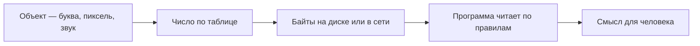

Для каждого **вида** информации свои таблицы и форматы файлов.

---

## Интерактив — типы данных и представление

★ **Тип данных** — правило, какие значения может хранить переменная (целое, дробное, строка). См. [Типы данных](/encyclopedia/1-basics/1-09-dannye-i-informatsiya/3).

<ExternalPlayEmbed example="about/data-types-play" title="Data Types" />

<div class="callout callout--info">
  <div class="callout-title">Углубление</div>

  <div class="callout-body">
  Определения типов — в [Типы данных](/encyclopedia/1-basics/1-09-dannye-i-informatsiya/3). Типизация — в [Типизация](/encyclopedia/1-basics/1-09-dannye-i-informatsiya/4). Структуры — [Структуры данных](/encyclopedia/3-data-markup/3-02-struktury-dannyh/intro).
</div>
</div>

---

## Текст — от буквы к байтам

★ **Кодировка** — таблица "символ → байты"; **Unicode** задаёт номер символа, **UTF-8** — как его пишут в файле. См. [Текст](/encyclopedia/1-basics/1-09-dannye-i-informatsiya/2).

### Термины

| Термин | Простыми словами |
|--------|------------------|
| **Символ** | Буква, цифра, знак, эмодзи |
| **Кодовая точка (Unicode)** | Уникальный номер символа в мировой таблице |
| **Кодировка (UTF-8 и др.)** | Как номер записать байтами в файле |
| **ASCII** | 128–256 символов, в основном латиница, 1 байт |

### Пример — слово "Привет"

| Буква | Unicode | UTF-8 (hex) |
|-------|---------|-------------|
| П | U+041F | `D0 9F` |
| р | U+0440 | `D1 80` |
| и | U+0438 | `D0 B8` |
| в | U+0432 | `D0 B2` |
| е | U+0435 | `D0 B5` |
| т | U+0442 | `D1 82` |

Итого: **12 байт** для 6 букв.

### Пример — эмодзи 🐈

| Символ | Unicode | UTF-8 (hex) |
|--------|---------|-------------|
| 🐈 | U+1F408 | `F0 9F 90 88` |

**4 байта** на один эмодзи в UTF-8.

### Пример — "кракозябры"

Файл сохранён в UTF-8, открыт как Windows-1251:

| UTF-8 байты | Ожидалось | Видно в CP1251 |
|-------------|-----------|----------------|
| `D0 9F D1 80 D0 B8 D0 B2 D0 B5 D1 82` | Привет | Привет |

★ **UTF-8** сегодня — стандарт для веба, Linux, современных приложений.

### Сравнение кодировок — таблица примеров

| Текст | ASCII/UTF-8 | Windows-1251 | CP866 (DOS) |
|-------|-------------|--------------|-------------|
| `Hello` | 5 байт | 5 байт | 5 байт |
| `Мир` | 6 байт | 3 байта | 3 байта |
| `A` | `41` | `41` | `41` |
| `А` (кириллица) | `D0 90` | `C0` | `80` |

### Интерактив — конвертер кодировок

<ExternalPlayEmbed example="basics/text-encoder-converter" title="Кодировки текста" />

Подробнее — [Виды информации — текст](/encyclopedia/1-basics/1-09-dannye-i-informatsiya/2).

---

## Исторические кодировки

★ **ASCII** — первая массовая 7-битная таблица для латиницы и служебных символов; основа совместимости UTF-8 с английским текстом.

| Кодировка | Где применялась | Особенность |
|-----------|-----------------|-------------|
| **ASCII** (7 бит) | Англоязычные системы | 128 символов; +32 → строчная |
| **KOИ-7** | Первые отечественные ЭВМ | 7-битная таблица с русскими буквами |
| **CP866 (DOS Cyrillic)** | MS-DOS | Коды 128–255 — кириллица |
| **Windows-1251 (CP1251)** | Windows 95–10 | Де-факто стандарт кириллицы до UTF-8 |
| **UTF-8** | Веб, Linux | Переменная длина; совместим с ASCII |

**Практический вывод.** Файл в CP866, открытый как UTF-8 — бессмысленные символы при **тех же байтах**.

---

## Числа в компьютере

★ **Целое число** в памяти — фиксированное количество бит со знаком или без; **дробное** — формат **IEEE 754** (мантисса и порядок). См. [Числа и типы](/encyclopedia/1-basics/1-09-dannye-i-informatsiya/3).

### Целые числа

| Тип | Бит | Диапазон (со знаком) |
|-----|-----|----------------------|
| byte | 8 | −128 … 127 |
| short | 16 | −32 768 … 32 767 |
| int | 32 | ≈ ±2,1·10⁹ |
| long | 64 | ≈ ±9·10¹⁸ |

**Задача 9.** Сколько байт занимает число типа `int` (32 бита)?

**4 байта**.

**Задача 10.** Запишите −1 в 8-битном представлении со знаком (дополнительный код).

`11111111` = −1.

### Дробные числа (IEEE 754)

Числа `3.14`, `0.1` — формат **IEEE 754** — мантисса + порядок.

`0.1 + 0.2` → `0.30000000000000004` — **свойство формата**, не "ошибка компьютера".

| Тип | Бит | Точность |
|-----|-----|----------|
| float | 32 | ~7 значащих цифр |
| double | 64 | ~15 значащих цифр |

Подробнее — [Числа и типы данных](/encyclopedia/1-basics/1-09-dannye-i-informatsiya/3).

---

## Изображение — пиксели и цвет

★ **Пиксель** — маленький "квадратик" цвета.

★ **Растровое изображение** — таблица пикселей (часто **RGB** — 3 байта на пиксель).

**Задача 11.** Фото 4000×3000, RGB без сжатия:

`4000 × 3000 × 3 = 36 000 000` байт ≈ **34,3 МиБ**.

**Задача 12.** Иконка 256×256, RGBA (4 байта на пиксель):

`256 × 256 × 4 = 262 144` байт = **256 КиБ**.

| Формат | Сжатие | Прозрачность | Типичное применение |
|--------|--------|--------------|---------------------|
| **BMP** | Нет / минимальное | Да | Учебные задачи |
| **PNG** | Без потерь (DEFLATE) | Да | Скриншоты, логотипы |
| **JPEG** | С потерями (DCT) | Нет | Фотографии |
| **WebP** | Оба варианта | Да | Веб |
| **GIF** | Без потерь, 256 цветов | Да (1-bit) | Анимация |
| **SVG** | Вектор (XML) | Да | Иконки, схемы |

★ **Вектор** (SVG) — формулы линий; при показе **растеризуется** в пиксели.

---

## Звук — от волны к цифрам

★ **Дискретизация** — разбиение непрерывной звуковой волны на отдельные отсчёты амплитуды во времени. См. [Аудио и видео](/encyclopedia/1-basics/1-17-audio-i-video/1).

- **Частота дискретизации** (Гц) — отсчётов в секунду.
- **Разрядность** (бит) — точность амплитуды.

**Формула объёма несжатого звука:**

```
V = v × i × t × k
```

| Символ | Смысл | Пример |
|--------|-------|--------|
| **v** | Частота (Гц) | 44 100 |
| **i** | Разрядность (бит) | 16 |
| **t** | Длительность (с) | 60 |
| **k** | Каналы (1=моно, 2=стерео) | 2 |

**Задача 13.** Моно 44,1 кГц, 16 бит, 1 минута:

`44100 × 16 × 60 × 1 = 42 336 000` бит = **5 292 000 байт** ≈ **5,05 МиБ**.

**Задача 14.** Стерео 48 кГц, 24 бит, 3 минуты:

`48000 × 24 × 180 × 2 = 414 720 000` бит ≈ **49,4 МиБ**.

**Задача 15 (ЕГЭ).** Запись 2 мин, 16 кГц, 8 бит, моно. Объём в Кбайт?

`16000 × 8 × 120 × 1 / 8 / 1024` = `16000 × 120 / 1024` ≈ **1875 Кбайт** (или ~1,83 МиБ).

| Формат | Суть |
|--------|------|
| **WAV** | Часто без сжатия |
| **MP3, AAC** | С потерями |
| **FLAC** | Без потерь |
| **OGG Vorbis** | С потерями, открытый |

---

## Видео — кадры + звук + сжатие

★ **Кодек** — алгоритм сжатия видео или звука; **контейнер** (MP4, MKV) — "коробка", в которой лежат сжатые потоки. См. [Аудио и видео](/encyclopedia/1-basics/1-17-audio-i-video/1).

Видео — **много картинок подряд** (24–60 fps) + звук.

**Задача 16.** Видео 1920×1080, 30 fps, 10 сек, каждый кадр как несжатый RGB:

`1920 × 1080 × 3 × 30 × 10 = 1 866 240 000` байт ≈ **1,74 ГиБ** без сжатия.

Кодеки (**H.264**, **VP9**, **AV1**) сохраняют **изменения** между кадрами.

| Термин | Смысл |
|--------|-------|
| **I-frame (ключевой)** | Полный кадр |
| **P-frame** | Отличия от предыдущего |
| **B-frame** | Отличия от соседних |
| **Битрейт** | Кбит/с — объём в секунду |

---

## Метаданные — данные о данных

★ **Метаданные** — служебная информация о файле (автор, дата, GPS, кодек), а не само содержимое. См. [Данные и информация](/encyclopedia/1-basics/1-09-dannye-i-informatsiya/intro).

| Где | Примеры метаданных |
|-----|-------------------|
| **Фото JPEG (EXIF)** | Дата съёмки, модель камеры, GPS, выдержка |
| **MP3 (ID3)** | Исполнитель, альбом, обложка |
| **Документ Office** | Автор, дата создания, правки |
| **HTML** | `<meta name="description">` |
| **Файловая система** | Имя, размер, дата изменения, права |
| **Видео** | Кодек, разрешение, длительность |

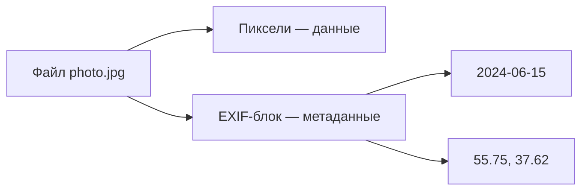

★ Метаданные могут **раскрывать личную информацию** — GPS в фото, автор в Word. Перед публикацией — проверить и удалить (EXIF-редакторы).

**Задача 17.** Чем данные отличаются от метаданных в файле `song.mp3`?

**Данные** — сжатый аудиопоток. **Метаданные** — теги ID3 (название, исполнитель).

---

## Сжатие — обзор алгоритмов

★ **Сжатие без потерь** восстанавливает файл побитово; **с потерями** выбрасывает малозаметные детали ради меньшего размера. См. [Архивы](/encyclopedia/1-basics/1-20-ispolnyaemye-fayly-i-arhivy/2).

### Без потерь (lossless)

| Алгоритм | Где используется | Идея |
|----------|------------------|------|
| **RLE** (Run-Length Encoding) | BMP, факсы | `AAAAA` → `5A` |
| **Huffman** | ZIP, JPEG (часть) | Частые символы — короткие коды |
| **LZ77 / LZ78** | ZIP, GIF | Ссылки на уже встреченные фрагменты |
| **DEFLATE** | ZIP, PNG, gzip | LZ77 + Huffman |
| **LZW** | GIF, старый ZIP | Словарь фраз |
| **Arithmetic coding** | JPEG 2000, H.264 | Дробные биты на символ |

**Пример RLE.** Строка `AAAABBBCCD` → `4A3B2C1D` (10 → 8 символов; на бинарных данных эффект сильнее).

**Пример Huffman (учебный).** Частоты букв:

- A — 40%;
- B — 30%;
- C — 20%;
- D — 10%.

Частым символам назначают короткие коды: A=`0`, B=`10`, C=`110`, D=`111`.

### С потерями (lossy)

| Алгоритм | Где | Идея |
|----------|-----|------|
| **DCT** (дискретное косинусное преобразование) | JPEG, MP3 | Убрать незаметные частоты |
| **Квантование** | JPEG, видео | Округлить коэффициенты |
| **Психоакустическая модель** | MP3, AAC | Убрать звуки, которые ухо не слышит |
| **Motion compensation** | H.264, AV1 | Разница между кадрами |
| **Chroma subsampling** | JPEG 4:2:0 | Меньше точности цвета, чем яркости |

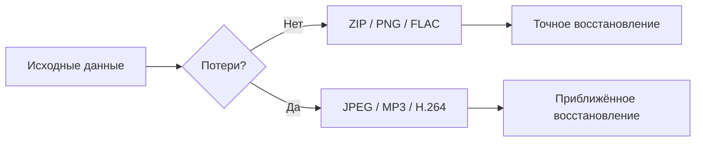

### Сжатие и архивация

| Понятие | Задача | Пример |
|---------|--------|--------|
| **Сжатие** | Уменьшить **один** файл | JPEG для фото |
| **Архив** | Объединить **много** файлов | `project.zip` |

Форматы архивов:

- **ZIP, 7z, RAR** — объединяют файлы и сжимают;
- **TAR** — только склейка; сжатие добавляют: `tar.gz`, `tar.xz`.

| Формат | Сжатие | Открытость | Примечание |
|--------|--------|------------|------------|
| **ZIP** | DEFLATE | Открытый | Универсальный |
| **7z** | LZMA2 | Открытый | Лучшее сжатие |
| **RAR** | Проприетарный | Закрытый | WinRAR |
| **gzip** | DEFLATE | Открытый | Один поток |
| **bzip2** | Burrows-Wheeler | Открытый | Медленнее, лучше на тексте |

Внутри **DOCX** — ZIP с XML и картинками.

**Подробнее** — [Архивы](/encyclopedia/1-basics/1-20-ispolnyaemye-fayly-i-arhivy/2).

---

## С потерями и без — когда что

| Тип | Восстановление | Где |
|-----|----------------|-----|
| **Без потерь** | Точное | PNG, ZIP, FLAC, исходники |
| **С потерями** | Приближённое | JPEG, MP3, видео в интернете |

Правило: рабочие версии — без потерь; публикация — с умеренным сжатием.

---

## Сводная таблица по видам

| Вид | Что кодируем | Форматы | Углубление |
|-----|--------------|---------|------------|
| **Текст** | Символ → Unicode → байты | `.txt`, `.docx`, HTML | [1-09/2](/encyclopedia/1-basics/1-09-dannye-i-informatsiya/2) |
| **Числа** | Целые, float | CSV, JSON | [1-09/3](/encyclopedia/1-basics/1-09-dannye-i-informatsiya/3) |
| **Изображение** | Пиксели + цвет | PNG, JPEG, WebP | [1-09/2](/encyclopedia/1-basics/1-09-dannye-i-informatsiya/2) |
| **Звук** | Отсчёты амплитуды | WAV, MP3, FLAC | [1-09/2](/encyclopedia/1-basics/1-09-dannye-i-informatsiya/2) |
| **Видео** | Кадры + звук | MP4, WebM | [1-09/2](/encyclopedia/1-basics/1-09-dannye-i-informatsiya/2) |

---

## Задачи для экзамена — сводный блок

| № | Условие | Ответ |
|---|---------|-------|
| 1 | 13 в двоичной | 1101 |
| 2 | 101101₂ в десятичной | 45 |
| 3 | 10 латинских букв UTF-8 | 10 байт |
| 4 | 5 кириллических UTF-8 | 10 байт |
| 5 | Фото 2000×1500 RGB | 9 000 000 байт ≈ 8,6 МиБ |
| 6 | Звук 22 кГц, 8 бит, моно, 1 мин | 1 320 000 байт ≈ 1,26 МиБ |
| 7 | Скорость канала 56 Кбит/с, файл 7 МБ | ~1000 с ≈ 16,7 мин |
| 8 | Архив и JPEG | Архив — контейнер; JPEG — сжатие одного изображения |
| 9 | UTF-8 в CP1251 | Кракозябры |
| 10 | Метаданные EXIF | Данные о фото, не пиксели |

**Задача 18 (скорость передачи).** Файл 14 МБ, канал 28 Мбит/с. Время передачи?

14 МБ = 14 × 8 = 112 Мбит. 112 / 28 = **4 секунды** (в идеале, без накладных расходов).

**Задача 19.** Почему текстовый файл `.txt` сжимается ZIP лучше, чем уже сжатый `.jpg`?

В тексте много повторов (LZ77/Huffman эффективны). JPEG уже сжат с потерями — мало избыточности.

---

## Базы данных — куда складывают большие таблицы

★ **База данных** — организованное хранилище связанных записей с языком запросов (SQL и др.). См. [Основы баз данных](/encyclopedia/3-data-markup/3-05-osnovy-baz-dannyh/intro).

| Тип | Идея | Применение |
|-----|------|------------|
| **Реляционные (SQL)** | Таблицы, связи, транзакции | Банки, магазины |
| **NoSQL** | Гибкая структура, масштаб | Соцсети, IoT |
| **Иерархические** | Дерево | Файловая система, XML |
| **Объектно-ориентированные** | Объекты в программе | CAD, 3D |

Подробнее — [Основы баз данных](/encyclopedia/3-data-markup/3-05-osnovy-baz-dannyh/intro).

---

## Unicode и UTF-8 — подробный разбор

★ **Unicode** — единый каталог символов мира; каждому знаку присвоена **кодовая точка** `U+xxxx`. См. [Текст](/encyclopedia/1-basics/1-09-dannye-i-informatsiya/2).

Примеры кодовых точек:

- `U+0041` — латинская A;
- `U+0410` — кириллическая А;
- `U+1F431` — 🐱.

| Понятие | Смысл |
|---------|--------|
| **Кодовая точка** | Номер символа в таблице Unicode |
| **Кодировка (encoding)** | Как кодовую точку записать байтами на диске |
| **UTF-8** | Переменная длина: ASCII-символы — 1 байт, кириллица — 2, эмодзи — 4 |
| **UTF-16** | Часто 2 байта на символ; Windows внутри API |
| **UTF-32** | Фиксированно 4 байта — редко в файлах |

### Примеры UTF-8 (hex)

| Символ | Кодовая точка | Байты UTF-8 |
|--------|---------------|-------------|
| `A` | U+0041 | `41` |
| `Я` | U+042F | `D0 AF` |
| `€` | U+20AC | `E2 82 AC` |
| `🐱` | U+1F431 | `F0 9F 90 B1` |

**BOM** (Byte Order Mark) — метка `EF BB BF` в начале UTF-8 файла; Notepad иногда добавляет — в Linux-скриптах ломает shebang `#!/bin/bash`.

### Кракозябры — диагностика

| Что видите | Вероятная причина | Решение |
|------------|-------------------|---------|
| `Привет` вместо `Привет` | UTF-8 прочитали как Windows-1251 | Перекодировать в редакторе |
| `????` | Шрифт не содержит символ | Другой шрифт, UTF-8 |
| `` | Символ замены U+FFFD | Файл повреждён или неверная кодировка |

Инструменты для диагностики кодировок:

- **Notepad++** — меню "Кодировки";
- **`iconv`** в Linux;
- **`Get-Content -Encoding`** в PowerShell.

Подробнее — [Текст и кодировки](/encyclopedia/1-basics/1-09-dannye-i-informatsiya/2).

---

## ASCII и история текстовых кодировок

| Кодировка | Годы | Объём | Ограничение |
|-----------|------|-------|-------------|
| **ASCII** | 1963 | 7 бит (128 символов) | Только английский + управляющие |
| **Windows-1251** | 1990-е | 8 бит | Кириллица, но не все языки |
| **KOI8-R** | СССР/РФ | 8 бит | Старая почта и Unix |
| **UTF-8** | 1993+ | 1–4 байта | Стандарт интернета и Linux |

Таблица ASCII (фрагмент):

| Символ | Десятичный | Hex |
|--------|------------|-----|
| `0`–`9` | 48–57 | 30–39 |
| `A`–`Z` | 65–90 | 41–5A |
| `a`–`z` | 97–122 | 61–7A |
| пробел | 32 | 20 |

**Расширенный ASCII** (8-й бит) дал конфликтующие национальные таблицы — отсюда необходимость Unicode.

---

## Числа в компьютере — целые и дробные

### Целые со знаком (дополнительный код)

Отрицательные числа в памяти хранят в **дополнительном коде** (two's complement).

| Число | 8 бит (доп. код) |
|-------|------------------|
| +5 | `00000101` |
| −5 | `11111011` |
| −128 | `10000000` (минимум для 8 бит) |
| +127 | `01111111` (максимум) |

Переполнение: `127 + 1` в 8 бит → `−128` — типичная ошибка в C без проверки типа.

### Вещественные (IEEE 754)

Числа с плавающей точкой — `float` (32 бита), `double` (64 бита).

| Проблема | Пример |
|----------|--------|
| Неточность | `0.1 + 0.2 ≠ 0.3` в Python/JavaScript |
| Очень большие/малые | `1e308`, `5e-324` |
| Спецзначения | `NaN`, `+∞`, `−∞` |

Для денег в программах используют **целые копейки** или тип `Decimal`, а не `float`.

---

## Растровая графика — пиксели и цвет

**Растр** — прямоугольная сетка пикселей. Каждый пиксель — число или набор чисел (цвет).

### Глубина цвета

| Бит на пиксель | Цветов | Пример |
|----------------|--------|--------|
| 1 | 2 (ч/б) | Старые факсы |
| 8 | 256 (палитра) | GIF |
| 24 | ~16,7 млн | True Color JPEG/PNG |
| 32 | 24 + 8 альфа (прозрачность) | PNG, UI |

**Размер несжатого BMP** ≈ ширина × высота × (бит/8) + заголовок.

Пример: 1920×1080×3 байта ≈ **6,2 МБ** на кадр без сжатия.

### Цветовые модели

| Модель | Каналы | Где |
|--------|--------|-----|
| **RGB** | Red, Green, Blue | Монитор, веб |
| **CMYK** | Cyan, Magenta, Yellow, Key | Полиграфия |
| **HSV/HSL** | Оттенок, насыщенность, яркость | Редакторы, удобно человеку |
| **Grayscale** | Один канал яркости | Сканы, фото |

<ExternalPlayEmbed example="basics/html-colors-play" title="HTML-цвета: тренажёр" minHeight={560} />

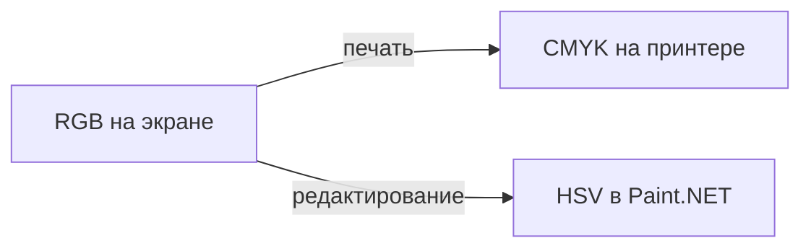

### Форматы растровых файлов

| Формат | Сжатие | Прозрачность | Типичное применение |
|--------|--------|--------------|---------------------|
| **BMP** | Нет / RLE | Редко | Учебные задачи, Windows |
| **PNG** | Без потерь (DEFLATE) | Да | Скриншоты, UI, логотипы с альфой |
| **JPEG** | С потерями (DCT) | Нет | Фото |
| **GIF** | Без потерь, 256 цветов | Да (1 бит) | Анимация, мемы |
| **WebP** | Оба варианта | Да | Веб, замена JPEG/PNG |
| **TIFF** | Разные | Да | Сканирование, полиграфия |
| **ICO** | — | Да | Иконки Windows |
| **SVG** | Вектор, не растр! | — | Логотипы, масштаб без потери |

**JPEG** портит резкие границы и текст — для скриншотов лучше **PNG**.

---

## Векторная графика (кратко)

Вектор — **формулы** (линии, кривые Безье), а не сетка пикселей.

| | Растр | Вектор |
|---|-------|--------|
| Масштаб | Размывается | Без потери |
| Фото | Отлично | Не подходит |
| Логотип | Плохо при увеличении | Идеально |
| Форматы | JPG, PNG | SVG, PDF, AI, CDR |

В курсе графики — [Графика — о разделе](/encyclopedia/1-basics/1-16-grafika/intro).

---

## Звук — оцифровка и форматы

Аналоговый звук → **дискретизация** (sampling) + **квантование** (quantization).

| Параметр | Смысл | Типичные значения |
|----------|--------|-------------------|
| **Частота дискретизации** | Сколько отсчётов в секунду | 44,1 кГц (CD), 48 кГц (видео) |
| **Разрядность** | Бит на отсчёт | 16 бит (CD), 24 бит (студия) |
| **Каналы** | Моно / стерео | 1 или 2+ |

**Теорема Котельникова-Найквиста:** чтобы восстановить сигнал, частота дискретизации ≥ **2×** максимальной частоты в сигнале. Поэтому CD — 44,1 кГц (чуть выше 2×20 кГц).

**Битрейт** (кбит/с) = частота × разрядность × каналы (для несжатого PCM).

Пример: 44100 × 16 × 2 = **1411 кбит/с** — стерео CD без сжатия.

### Аудиоформаты

| Формат | Сжатие | Потери | Применение |
|--------|--------|--------|------------|
| **WAV** | Нет (PCM) | Нет | Монтаж, Windows |
| **FLAC** | Да | Нет | Архив музыки |
| **MP3** | Да | Да | Плееры, стриминг |
| **AAC** | Да | Да | Apple, YouTube |
| **OGG Vorbis** | Да | Да | Игры, Firefox |
| **Opus** | Да | Да | Discord, WebRTC |

| Битрейт MP3 | Качество (ориентир) |
|-------------|---------------------|
| 128 кбит/с | Приемлемо для речи |
| 192–256 кбит/с | Музыка |
| 320 кбит/с | Максимум MP3 |

Подробнее — [Аудио и видео](/encyclopedia/1-basics/1-17-audio-i-video/1).

---

## Видео — кадры, кодеки, контейнеры

Видео = последовательность **кадров** + **звуковая дорожка** в **контейнере**.

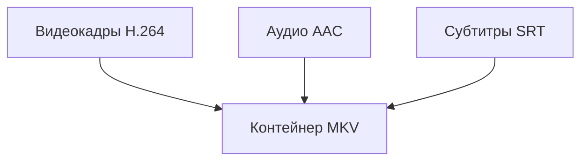

| Уровень | Примеры | Аналогия |
|---------|---------|----------|
| **Кодек видео** | H.264, H.265, VP9, AV1 | Способ сжать кадры |
| **Кодек аудио** | AAC, MP3, AC3 | Способ сжать звук |
| **Контейнер** | MP4, MKV, AVI, WebM | "Коробка" для потоков |

**Разрешение и частота кадров:**

| Название | Пиксели | FPS (часто) |
|----------|---------|-------------|
| SD | 720×480 | 25/30 |
| HD | 1280×720 | 30/60 |
| Full HD | 1920×1080 | 30/60 |
| 4K UHD | 3840×2160 | 30/60 |

**Битрейт видео** (Мбит/с) растёт с разрешением и FPS — 4K стрим требует быстрый интернет.

---

## Алгоритмы сжатия — как это работает

★ **Коэффициент сжатия** — отношение размера до сжатия к размеру после; чем больше, тем сильнее упаковка.

### Без потерь (lossless)

| Метод | Идея | Где |
|-------|------|-----|
| **RLE** | Повторы → "5×A" | BMP, факсы |
| **Huffman** | Частые символы — короткие коды | ZIP, JPEG (часть) |
| **LZ77/LZ78** | Ссылка на уже встреченный фрагмент | ZIP, PNG |
| **Арифметическое** | Дробные длины кодов | 7z, JPEG2000 |
| **DEFLATE** | LZ77 + Huffman | ZIP, PNG, gzip |

**Коэффициент сжатия** = размер до / размер после. Текст `.txt` в ZIP часто в 3–5 раз меньше; уже сжатый JPEG почти не сжимается повторно.

### С потерями (lossy)

| Метод | Идея | Где |
|-------|------|-----|
| **DCT + квантование** | Отбросить незаметные детали | JPEG |
| **Психоакустика** | Убрать звук, не слышимый ухом | MP3 |
| **Межкадровое** | Хранить только изменения между кадрами | H.264 |

★ Каждое повторное сохранение JPEG **ухудшает** качество — работайте с оригиналом или PNG.

### Демонстрация Huffman (учебная)

Слово `AABBC` — частоты:

- A = 2;
- B = 2;
- C = 1.

Дерево Huffman даёт короткие коды частым буквам. На ОГЭ достаточно понимать **идею**: частое → короче → файл меньше.

---

## Архивы — форматы и практика

★ **Архиватор** объединяет несколько файлов в один контейнер и часто дополнительно сжимает их. См. [Архивы](/encyclopedia/1-basics/1-20-ispolnyaemye-fayly-i-arhivy/2).

| Формат | Сжатие | Пароль | Особенности |
|--------|--------|--------|-------------|
| **ZIP** | DEFLATE | Да | Встроен в Windows |
| **7z** | LZMA2 | Да | Лучшее сжатие, 7-Zip |
| **RAR** | Проприетарный | Да | Чтение бесплатно, создание — WinRAR |
| **TAR** | Нет (только упаковка) | — | Linux; часто `.tar.gz` |
| **GZIP** | Один поток | — | `.gz` для одного файла |

### Сценарии

| Задача | Формат |
|--------|--------|
| Отправить папку по почте | ZIP |
| Максимально ужать | 7z |
| Резервная копия Linux | `tar -czvf backup.tar.gz` |
| Установщик Windows | Самораспаковывающийся EXE или MSI |

### Опасности архивов

- Архив с **паролем** не всегда шифрует имена файлов (ZIP — слабо).
- **Zip bomb** — маленький архив, распаковывается в петабайты — не открывать неизвестное.
- Внутри архива может быть **virus.exe** — антивирус проверяет после распаковки.

Подробнее — [Архивы](/encyclopedia/1-basics/1-20-ispolnyaemye-fayly-i-arhivy/2).

---

## Передача данных — пропускная способность

★ **Пропускная способность** — сколько бит или байт канал передаёт за секунду; от неё зависит время скачивания файла. См. [Сеть и интернет](/encyclopedia/2-system-network/2-03-set-i-internet/intro).

| Единица | Смысл |
|---------|--------|
| **бит** | Минимальная единица передачи |
| **байт** | 8 бит |
| **бит/с (bps)** | Скорость линии |
| **Байт/с (B/s)** | В 8 раз меньше число, чем бит/с |

**Не путать:** тариф **100 Мбит/с** — это **мегабит** в секунду ≈ **12,5 МБ/с** максимум на скачивание.

Время скачивания файла размером **F** мегабайт при скорости **S** Мбит/с:

\[
T \approx \frac&#123;F \times 8&#125;&#123;S&#125; \text&#123; секунд&#125;
\]

Пример: 800 МБ фильм при 50 Мбит/с → 800×8/50 ≈ **128 секунд** (~2 мин) в идеале; на практике дольше из-за накладных расходов TCP.

---

## Задачи для закрепления (ОГЭ / ЕГЭ стиль)

1. Сколько байт занимает слово **"Информатика"** в UTF-8? (Посчитайте буквы кириллицы × 2 байта.)

2. Запишите число **25** в двоичной и шестнадцатеричной системе.

3. Почему фотография в JPEG меньше, чем в BMP при том же разрешении?

4. Файл 2,4 ГБ нужно записать на флешку FAT32. Возможно ли? Если нет — почему и что делать?

5. Объясните разницу между **архиватором** и **кодеком**.

6. Частота дискретизации 8 кГц достаточна для голоса? А для музыки с высокими нотами?

7. Составьте таблицу: формат — с потерями или без — тип данных (текст/фото/звук/видео).

8. Размер несжатого изображения 800×600, 24 бита на пиксель. Вычислите размер в мегабайтах.

**Ответы (кратко):**

1. 12 букв → 24 байта.
2. 11001₂, 19₁₆.
3. JPEG сжимает с потерями, BMP — нет.
4. Нет: лимит FAT32 — 4 ГБ на файл; форматировать в exFAT/NTFS.
5. Архиватор упаковывает файлы; кодек сжимает один поток медиа.
6. Для голоса часто да; для музыки — нет, нужно ≥44,1 кГц.
8. 800×600×3 = 1 440 000 байт ≈ 1,37 МБ.

---

## Вопросы для самопроверки

<details>
<summary>Чем данные отличаются от информации?</summary>

**Данные** — байты в файле; **информация** — смысл после расшифровки по правилам.
</details>

<details>
<summary>Сколько бит в одном байте?</summary>

**8 бит.**
</details>

<details>
<summary>Почему UTF-8 вытеснил Windows-1251 в интернете?</summary>

Один стандарт для всех языков; совместим с ASCII; нет путаницы региональных таблиц.
</details>

<details>
<summary>Можно ли восстановить JPEG в исходное BMP без потерь?</summary>

**Нет** — JPEG удаляет часть информации при сжатии.
</details>

<details>
<summary>Зачем нужен архив ZIP вместо папки?</summary>

Один файл удобнее передавать; меньший размер за счёт сжатия; можно защитить паролем.
</details>

---


## Код Хаффмана — пошаговый учебный пример

Рассмотрим сообщение **`AABBC`**.

### Частоты символов

| Символ | Частота |
|--------|---------|
| A | 2 |
| B | 2 |
| C | 1 |

### Построение дерева

1. Объединяем C(1) и A(2) → узел (3).
2. Объединяем B(2) и узел (3) → корень (5).

### Коды (0 — лево, 1 — право)

| Символ | Код |
|--------|-----|
| B | `0` |
| A | `10` |
| C | `11` |

Закодированная строка: `10 10 0 0 11` → **`1010011`** (7 бит на 5 символов).

При фиксированном коде 2 бита на символ (3 символа в алфавите → 2 бита) потребовалось бы **10 бит**.

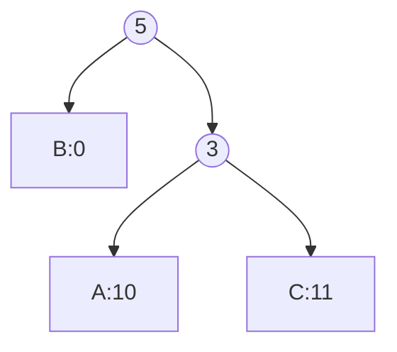

<div class="callout callout--tip">
  <div class="callout-title">Правило префиксного кода</div>

  <div class="callout-body">
  Ни один код не является <strong>началом</strong> другого — иначе декодер не поймёт, где кончается один символ. Дерево Хаффмана это гарантирует.
</div>
</div>

**Задача Х-1.** Частоты: M=5, O=3, W=1. Постройте дерево и найдите код буквы W.

**Ответ (один из вариантов):** при объединении W(1) с O(3) → узел 4, затем с M(5) → корень 9; W получает длинный код вроде `01` или `11` в зависимости от порядка слияния — на экзамене важна **логика** слияния наименьших.

---

## RLE, LZ77 и DEFLATE — сравнение

| Алгоритм | Принцип | Где встречается |
|----------|---------|-----------------|
| **RLE** | Серии одинаковых → счётчик + символ | BMP, факсы, простые изображения |
| **LZ77** | "Указатель назад" на уже встреченный фрагмент | gzip, PNG, ZIP |
| **Хаффман** | Частые символы — короткие коды | JPEG, ZIP, PNG |
| **DEFLATE** | LZ77 + Хаффман | ZIP, gzip, PNG |
| **LZMA** | Словарь + диапазонное кодирование | 7z, xz |
| **LZW** | Растущий словарь фраз | GIF, старый ZIP |

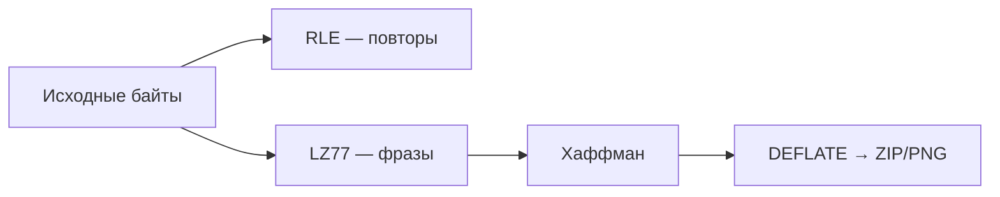

---

## ZIP и RAR и 7z — практическое сравнение

| Критерий | ZIP | RAR | 7z |
|----------|-----|-----|-----|
| Открытость формата | Открытый | Проприетарный | Открытый |
| Сжатие (типично) | Среднее | Хорошее | Очень хорошее |
| Встроен в Windows | Да | Нет (нужен WinRAR) | Нет (7-Zip) |
| Пароль / шифрование | AES-256 | AES-256 | AES-256 |
| Восстановление | Слабое | RAR с recovery record | Да (в 7z) |
| Скорость упаковки | Быстро | Средне | Медленнее |

**TAR** — только "склейка" файлов в Unix; сжатие добавляют: `tar.gz` (gzip), `tar.xz` (xz/LZMA).

**Практика:** для обмена с учителем — **ZIP** (везде открывается). Для личного архива больших проектов — **7z**. RAR часто встречается в скачанных сборках.

Внутри **DOCX, XLSX, PPTX** — ZIP с XML. Переименуйте `.docx` → `.zip` и откройте — увидите `word/document.xml`.

Подробнее — [Архивы](/encyclopedia/1-basics/1-20-ispolnyaemye-fayly-i-arhivy/2).

---

## UTF-8 — разбор побайтово (расширенные примеры)

### Латиница и кириллица в одной строке

Строка: `Hi, мир!`

| Символ | U+ | UTF-8 hex |
|--------|-----|-----------|
| H | 0048 | 48 |
| i | 0069 | 69 |
| , | 002C | 2C |
| (пробел) | 0020 | 20 |
| м | 043C | D0 BC |
| и | 0438 | D0 B8 |
| р | 0440 | D0 B0 |
| ! | 0021 | 21 |

**Итого:** 4 символа ASCII (4 байта) + 3 кириллических (6 байт) + пунктуация = **11 байт** на 8 "видимых" символов.

### Эмодзи и составные последовательности

| Символ | Байт UTF-8 | Примечание |
|--------|------------|------------|
| 😀 | F0 9F 98 80 | 4 байта |
| 👨‍👩‍👧 | 11+ байт | ZWJ-связка нескольких кодовых точек |
| © | C2 A9 | 2 байта |

**Задача UTF-8.** Сколько байт в слове "Ёлка" в UTF-8?

**Решение:** Ё(U+0401)=2, л(U+043B)=2, к(U+043A)=2, а(U+0430)=2 → **8 байт**.

---

## Форматы изображений — расширенная таблица

| Формат | Сжатие | Потери | Прозрачность | Анимация | Типичное применение |
|--------|--------|--------|--------------|----------|---------------------|
| BMP | Нет/мин. | Нет | Нет | Нет | Учебные задачи |
| PNG | DEFLATE | Нет | Да | APNG | UI, скриншоты |
| JPEG | DCT | Да | Нет | Нет | Фото |
| GIF | LZW | Палитра 256 | 1-bit | Да | Мемы, простая анимация |
| WebP | VP8/L | Оба | Да | Да | Веб |
| TIFF | Разные | Оба | Да | Нет | Полиграфия |
| HEIC | HEVC | Оба | Да | Нет | iPhone |
| AVIF | AV1 | Оба | Да | Нет | Современный веб |
| SVG | — | Нет | Да | Да (SMIL/CSS) | Иконки, логотипы |

### Цветовые модели — шпаргалка

| Модель | Каналы | Где |
|--------|--------|-----|
| RGB | 3 | Монитор, JPEG, PNG |
| RGBA | 4 | PNG с прозрачностью |
| CMYK | 4 | Печать |
| HSV | 3 | Редакторы |
| Grayscale | 1 | Ч/б, маски |

См. [Графика](/encyclopedia/1-basics/1-16-grafika/intro).

---

## Аудиоформаты — детальное сравнение

| Формат | Потери | Типичный битрейт | Применение |
|--------|--------|------------------|------------|
| WAV (PCM) | Нет | 1411 кбит/с (CD) | Монтаж, архив |
| FLAC | Нет | ~700 кбит/с | Аудиофилы |
| MP3 | Да | 128–320 кбит/с | Музыка, подкасты |
| AAC | Да | 128–256 кбит/с | YouTube, Apple |
| OGG Vorbis | Да | 128–320 | Игры, Linux |
| Opus | Да | 32–128 (речь) | Discord, WebRTC |

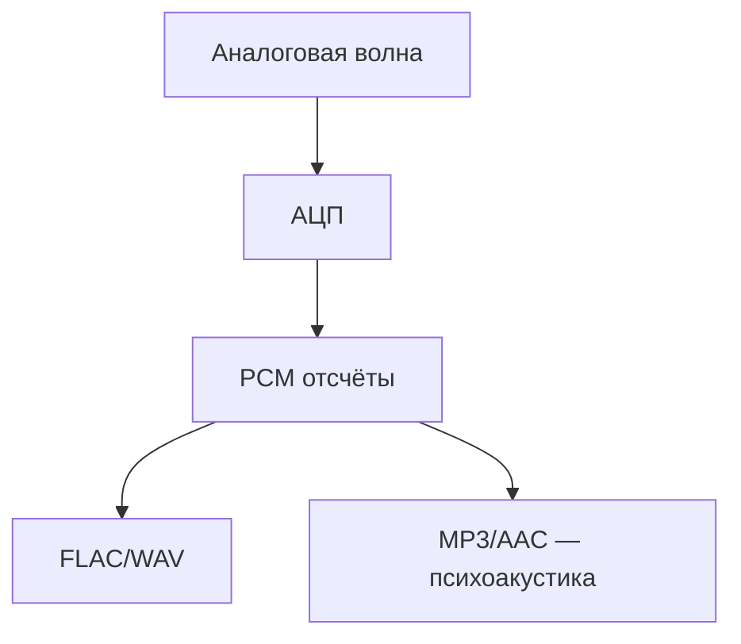


---


## Видеоформаты — кодеки и контейнеры (углубление)

| Контейнер | Видеокодеки | Аудиокодеки |
|-----------|-------------|-------------|
| MP4 | H.264, H.265 | AAC, MP3 |
| MKV | Почти любые | Почти любые |
| WebM | VP8, VP9, AV1 | Opus, Vorbis |
| AVI | Устаревшие | PCM, MP3 |

| Кодек | Поколение | Сжатие и H.264 |
|-------|-----------|-----------------|
| H.264 (AVC) | 2003 | база |
| H.265 (HEVC) | 2013 | ~40% лучше |
| VP9 | 2013 | сопоставимо |
| AV1 | 2018 | ещё лучше |

**I/P/B-кадры:** ключевой (полная картинка), предсказанный (отличия), двунаправленный.

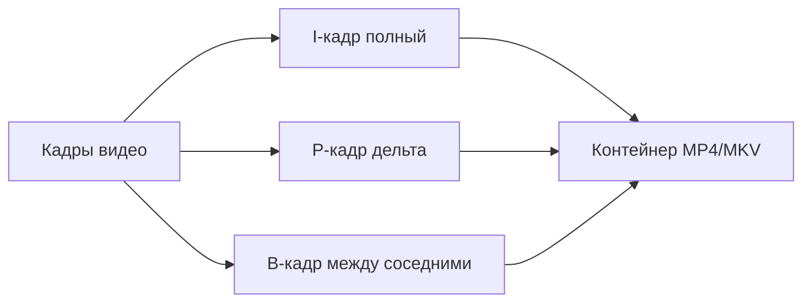

См. [Аудио и видео](/encyclopedia/1-basics/1-17-audio-i-video/1).

---

## Base64 — текстовое представление байтов

**Base64** кодирует байты в символы A–Z, a–z, 0–9, +, /.

| Исходник | Base64 (пример) |
|----------|-----------------|
| `Hi` | `SGk=` |
| 3 байта | 4 символа Base64 |

Используется во вложениях email, data-URL в HTML, JWT.

<div class="callout callout--info">
  <div class="callout-title">Не путать</div>
  <div class="callout-body">
  Base64 <strong>не сжимает</strong> — размер растёт ~на 33%. Это передача бинарных данных текстом.
</div>
</div>

---

## Сценарии "кракозябр" — каталог


### Сценарий 1

| | |
|---|---|
| **Причина** | UTF-8 открыли как CP1251 |
| **Симптом** | `Привет` |
| **Исправление** | Выбрать UTF-8 |


### Сценарий 2

| | |
|---|---|
| **Причина** | CP1251 открыли как UTF-8 |
| **Симптом** | `Ïðèâåò` |
| **Исправление** | Перекодировать |


### Сценарий 3

| | |
|---|---|
| **Причина** | HTML без charset=utf-8 |
| **Симптом** | `Кракозябры в браузере` |
| **Исправление** | Мета-тег charset |


### Сценарий 4

| | |
|---|---|
| **Причина** | Эмодзи в CP866 |
| **Симптом** | `Символы ?` |
| **Исправление** | Перейти на UTF-8 |


---

## Частые ошибки на контрольных

| Ошибка | Правильно |
|--------|-----------|
| Бит и байт в формуле звука | Сначала биты, потом ÷8 |
| Эмодзи = 1 байт | До 4 байт в UTF-8 |
| ZIP сильно сжимает JPEG | Уже сжатые форматы почти не уменьшаются |
| JPEG без потерь | JPEG — с потерями |
| MP4 = кодек | MP4 — контейнер |

---

## Практика за компьютером

| № | Действие | Цель |
|---|----------|------|
| 1 | UTF-8 и CP1251 | Разница байт |
| 2 | Hex: буква "П" | D0 9F |
| 3 | JPEG 90% и 30% | Качество |
| 4 | ZIP txt + jpg | Сжатие |
| 5 | docx → zip | Структура Office |

---

## Резюме расширенного блока

1. UTF-8 — стандарт; кириллица 2 байта.
2. Хаффман и RLE — сжатие без потерь.
3. ZIP/7z/RAR — архивы; JPEG/MP3/H.264 — кодеки.
4. Формула звука и RGB — типовые задачи ОГЭ.

---

## Банк задач ОГЭ — текст и кодировки (развёрнутый)

### Задача Т-1. Объём текста в UTF-8

**Условие.** Сообщение "Информатика" записано в UTF-8. Сколько байт занимает строка?

**Решение.** 11 букв кириллицы × 2 байта = **22 байта**. Пробелов нет.

---

### Задача Т-2. Смешанный текст

**Условие.** Строка `IT-2026!` в UTF-8. Сколько байт?

| Символ | Байт в UTF-8 |
|--------|--------------|
| I, T | 1 + 1 |
| - | 1 |
| 2, 0, 2, 6 | 1 + 1 + 1 + 1 |
| ! | 1 |

**Ответ:** 2 + 1 + 4 + 1 = **9 байт**.

---

### Задача Т-3. Эмодзи

**Условие.** Один символ 😀 в UTF-8 — сколько байт?

**Ответ.** Символ U+1F600 кодируется **4 байтами** (F0 9F 98 80).

<div class="callout callout--info">
  <div class="callout-title">Правило экзамена</div>
  <div class="callout-body">На ОГЭ эмодзи почти всегда дают как "4 байта в UTF-8", если не указана другая кодировка.</div>
</div>

---

### Задача Т-4. Перевод 101₂ в десятичную

**Условие.** Запишите двоичное число 101₂ в десятичной системе.

**Решение.** 1×2² + 0×2¹ + 1×2⁰ = 4 + 0 + 1 = **5**.

---

### Задача Т-5. Десятичное в двоичное

**Условие.** Переведите 13₁₀ в двоичную систему.

**Решение.** 13 ÷ 2 = 6 ост. 1; 6 ÷ 2 = 3 ост. 0; 3 ÷ 2 = 1 ост. 1; 1 ÷ 2 = 0 ост. 1 → читаем снизу вверх: **1101₂**.

---

## Банк задач ОГЭ — объём изображения

### Задача И-1. RGB без сжатия

**Условие.** Растр 800×600, 24 бита на пиксель. Объём в байтах без сжатия?

**Решение.** 24 бита = 3 байта на пиксель. V = 800 × 600 × 3 = **1 440 000 байт** (≈ 1,37 МиБ).

---

### Задача И-2. Индексированные цвета

**Условие.** 256×256, палитра 256 цветов (8 бит на пиксель). Объём?

**Решение.** 256 × 256 × 1 = **65 536 байт** (64 КиБ). Палитра хранится отдельно — на экзамене обычно спрашивают только растр.

---

### Задача И-3. Сжатие в 4 раза

**Условие.** Исходный файл 2 МБ после сжатия без потерь стал 512 КБ. Во сколько раз уменьшился?

**Решение.** 2 МБ = 2048 КБ. 2048 / 512 = **в 4 раза**.

---

### Задача И-4. Площадь и глубина цвета

**Условие.** Сколько бит на пиксель при "16,7 млн цветов"?

**Ответ.** 2²⁴ ≈ 16,7 млн → **24 бита** (True Color).

---

## Банк задач ОГЭ — объём звука

### Задача З-1. Моно, 16 бит

**Условие.** Частота 44 100 Гц, 16 бит, моно, 10 с. Объём в байтах?

**Формула:** V = v × i × t × k / 8, где k — число каналов.

**Решение.** 44100 × 16 × 10 × 1 / 8 = **882 000 байт**.

---

### Задача З-2. Стерео

**Условие.** 22 050 Гц, 8 бит, стерео, 5 с.

**Решение.** 22050 × 8 × 5 × 2 / 8 = **220 500 байт**.

---

### Задача З-3. Сравнение битрейтов

**Условие.** Почему MP3 128 кбит/с меньше WAV 1411 кбит/с при той же длительности?

**Ответ.** MP3 — **с потерями**; часть информации отбрасывается. WAV PCM — без сжатия кодеком.

---

## Системы счисления — разбор для экзамена

### Таблица степеней двойки (запомнить диапазон 2⁰…2¹⁰)

| Степень | Значение | Степень | Значение |
|---------|----------|---------|----------|
| 2⁰ | 1 | 2⁶ | 64 |
| 2¹ | 2 | 2⁷ | 128 |
| 2² | 4 | 2⁸ | 256 |
| 2³ | 8 | 2⁹ | 512 |
| 2⁴ | 16 | 2¹⁰ | 1024 |
| 2⁵ | 32 | | |

<div class="callout callout--tip">
  <div class="callout-title">Связь с байтом</div>
  <div class="callout-body">1 КиБ = 1024 байта = 2¹⁰ байт. На экзамене "КБ" часто подразумевают 1024, если не оговорено 1000.</div>
</div>

---

### Задача СС-1. Восьмеричная система

**Условие.** 47₈ в десятичную.

**Решение.** 4×8¹ + 7×8⁰ = 32 + 7 = **39**.

---

### Задача СС-2. Шестнадцатеричная

**Условие.** A3₁₆ в десятичную.

**Решение.** 10×16¹ + 3×16⁰ = 160 + 3 = **163**.

---

### Задача СС-3. Двоичное сложение

```
  1011
+ 0110
------
 10001
```

Переносы: 1+1+1 в младшем разряде даёт 1 и перенос 1.

---

## Кодирование текста — развёрнутые примеры

### Пример — слово "Код" в UTF-8

| Буква | Unicode | UTF-8 (hex) |
|-------|---------|-------------|
| К | U+041A | D0 9A |
| о | U+043E | D0 BE |
| д | U+0434 | D0 B4 |

**Итого:** 6 байт.

---

### Пример — "AБ" — смешанная латиница и кириллица

| Символ | Байт |
|--------|------|
| A | 1 |
| Б | 2 |

**Итого:** 3 байта.

---

### CP1251 и UTF-8 — один байт или два

| Кодировка | Буква "А" | Байты |
|-----------|-----------|-------|
| **Windows-1251** | кириллическая | **1** (`C0`) |
| **UTF-8** | та же буква | **2** (`D0 90`) |

Файл, сохранённый в одной кодировке и открытый в другой, даёт "кракозябры".

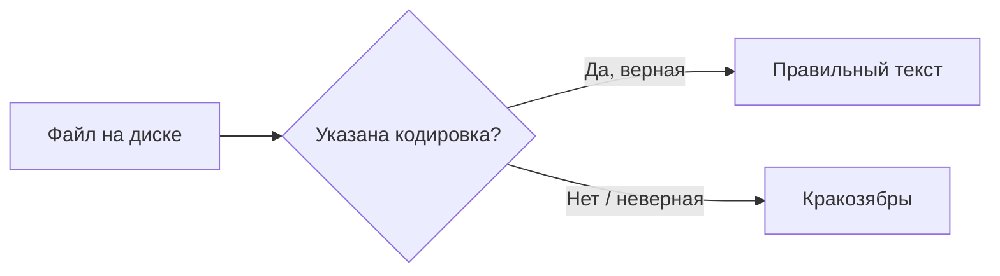

---

## Сжатие — учебные кейсы

### Кейс 1. Повторяющийся текст (RLE)

Исходник: `AAAAABBBCC` (10 символов).

RLE: `5A3B2C` (6 символов) — выгодно при длинных сериях.

---

### Кейс 2. Хаффман для "aabbc"

Частоты:

- a = 2;
- b = 2;
- c = 1.

Дерево даёт короткие коды частым буквам. Итоговая длина **меньше**, чем 5×8 бит при фиксированном 8-битном коде.

См. раздел [Код Хаффмана](#код-хаффмана--пошаговый-учебный-пример) выше и [Алгоритмы](/encyclopedia/4-code-dev/4-01-algoritmy/intro).

---

### Кейс 3. ZIP текст + JPEG

| Файл в архиве | Эффект ZIP |
|---------------|------------|
| notes.txt | Сильное сжатие |
| photo.jpg | Почти без изменения размера |

**Причина:** JPEG уже сжат кодеком; повторное сжатие даёт мало выигрыша.

---

## Метаданные — практические примеры

| Тип файла | Примеры метаданных | Зачем |
|-----------|-------------------|-------|
| JPEG | EXIF: дата, GPS, модель камеры | Сортировка, карта снимков |
| MP3 | ID3: исполнитель, альбом | Плеер показывает название |
| PDF | автор, заголовок | Поиск в библиотеке |
| DOCX | автор, дата правки | Совместная работа |

<div class="callout callout--warning">
  <div class="callout-title">Приватность</div>
  <div class="callout-body">Перед публикацией фото проверьте EXIF: иногда в файле остаются координаты дома. См. [Безопасность](/encyclopedia/2-system-network/2-08-osnovy-informatsionnoy-bezopasnosti/1).</div>
</div>

---

## Base64 — зачем и как считать

**Зачем:** передать бинарные данные в текстовом канале (JSON, e-mail MIME).

**Пример.** Строка `Hi` → байты 48 69 → Base64 `SGk=`.

**Объём:** Base64 увеличивает данные примерно на **33%** (4 символа на 3 байта).

---

## Цветовые модели — сравнение

| Модель | Где используется | Каналы |
|--------|------------------|--------|
| RGB | Монитор, фото | Красный, зелёный, синий |
| CMYK | Печать | Голубой, пурпурный, жёлтый, чёрный |
| HSV | Редакторы | Тон, насыщенность, яркость |

На экзамене чаще спрашивают **RGB** и объём растра.

---

## Аудио — цепочка оцифровки

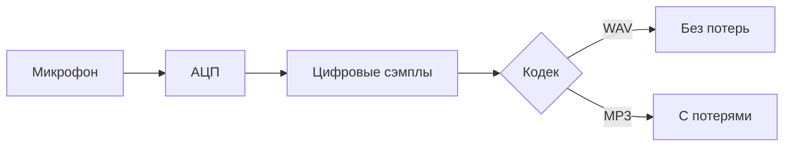

Параметры **частота дискретизации** (Гц), **разрядность** (бит), **каналы** (моно/стерео) входят в формулу объёма.

---

## Видео — кадр, кодек, контейнер

| Понятие | Пример | Роль |
|---------|--------|------|
| Кодек | H.264, VP9 | Сжимает кадры |
| Контейнер | MP4, MKV | Упаковывает видео + аудио + субтитры |
| Разрешение | 1920×1080 | Пикселей на кадр |
| FPS | 24, 30, 60 | Кадров в секунду |

**Ошибка на экзамене:** "MP4 — кодек". Правильно: **MP4 — контейнер**, внутри может быть H.264.

---

## Передача данных — задачи на скорость

### Задача П-1

**Условие.** Канал 8 Мбит/с. Сколько секунд передавать файл 16 Мбит?

**Решение.** 16 / 8 = **2 секунды** (если нет накладных расходов).

---

### Задача П-2

**Условие.** Файл 100 МБ, скорость 10 Мбит/с. Время?

**Решение.** 100 МБ ≈ 800 Мбит. 800 / 10 = **80 секунд**. Важно не путать **МБ** (байты) и **Мбит** (биты).

---

## Комплексные задачи ОГЭ/ЕГЭ (кураторский набор)

### Комплексная К-1

1. Текст "ОГЭ" (3 русские буквы) в UTF-8 — **6 байт**.
2. Растр 640×480, 16 бит на пиксель — 640×480×2 = **614 400 байт**.
3. Звук: 8000 Гц, 8 бит, моно, 60 с — 8000×8×60/8 = **480 000 байт**.

---

### Комплексная К-2

1. Число 255 в двоичной — **11111111₂** (8 бит).
2. Изображение 1024×768, 32 бита — 1024×768×4 = **3 145 728 байт**.
3. После архивации 3 МБ → 1 МБ — коэффициент **3**.

---

### Комплексная К-3

В файле 50 символов: 30 латинских, 20 кириллических. UTF-8: 30×1 + 20×2 = **70 байт**.

---

### Комплексная К-4

Строка Base64 длины 8 символов кодирует примерно 8×3/4 = **6 байт** исходных данных (с учётом padding точнее считают по правилам RFC).

---

### Комплексная К-5

WAV 44,1 кГц, 16 бит, стерео, 1 мин: 44100×16×60×2/8 = **10 584 000 байт** (~10,1 МБ).

---

## Сравнение форматов — итоговая матрица

| Категория | Без потерь | С потерями |
|-----------|------------|------------|
| Текст/архив | ZIP, 7z, PNG | — |
| Фото | PNG, BMP | JPEG, WebP |
| Звук | WAV, FLAC | MP3, AAC |
| Видео | — (редко) | H.264, H.265 |

---

## Практикум — что сделать за 30 минут

| Шаг | Действие | Навык |
|-----|----------|-------|
| 1 | Открыть .txt в Notepad++ / и Code, сменить кодировку | UTF-8 и CP1251 |
| 2 | Свойства JPEG → подробно → EXIF | Метаданные |
| 3 | Сжать папку с .txt и .jpg в ZIP | Архив и медиа |
| 4 | Калькулятор: перевод 2⁸ | Степени двойки |
| 5 | Онлайн hex-просмотр строки "Привет" | Побайтовый UTF-8 |

---

## Частые формулировки в билетах

| Вопрос | Краткий ответ |
|--------|---------------|
| Минимальная единица информации? | **Бит** |
| 8 бит = ? | **1 байт** |
| Стандарт кодировки Unicode в вебе? | **UTF-8** |
| Формула объёма звука? | **V = v×i×t×k/8** |
| Объём растра без сжатия? | **ширина×высота×байт_на_пиксель** |

---

## Связь с другими разделами энциклопедии

| Тема | Куда идти дальше |
|------|------------------|
| Хранение таблиц | [SQL](/encyclopedia/3-data-markup/3-07-sql/998) |
| Алгоритмы сжатия | [Алгоритмы](/encyclopedia/4-code-dev/4-01-algoritmy/intro) |
| Файлы на диске | [ОС и файлы](./5) |
| Сеть и передача | [Интернет](./6) |

---

## Вопросы повышенной сложности

**1.** Почему UTF-8 **самосинхронизируется**? Старшие биты байта указывают длину символа (110xxxxx — 2 байта и т.д.).

**2.** Чем **lossless** отличается от **lossy**? Первое восстанавливает исходник точно; второе — приближённо.

**3.** Зачем в PNG **фильтры** перед DEFLATE? Улучшают сжимаемость однотонных областей.

**4.** Почему 24 бита на пиксель = 3 байта? 24 / 8 = 3.

**5.** Сколько символов в Unicode? Более миллиона кодовых точек; в UTF-8 длина в байтах **переменная**.

---

## Мини-глоссарий главы (дополнение)

| Термин | Определение |
|--------|-------------|
| Кодовая точка | Номер символа в Unicode (U+xxxx) |
| BOM | Маркер порядка байт в начале файла UTF-16/UTF-8 |
| Битрейт | Бит в секунду для потокового аудио/видео |
| Палитра | Таблица цветов для индексированного растра |
| Контейнер | "Обёртка" для потоков видео и аудио |

---


---

## Мега-банк комплексных задач (ОГЭ/ЕГЭ)


#### Задача М-1

| Часть | Условие | Ответ |
|-------|---------|-------|
| a | 9 русских букв UTF-8 | **18** байт |
| b | Растр 324×243 RGB | **236,196** байт |
| c | Звук 22250 Гц, 16 бит, 2 кан., 16 с | **1,424,000** байт |
| d | Число 101₁₀ в hex | **65**₁₆ |
| e | Число 101₁₀ в двоичной (кратко) | **1100101**₂ |

См. [Данные](/encyclopedia/1-basics/1-09-dannye-i-informatsiya/1), [Архивы](/encyclopedia/1-basics/1-20-ispolnyaemye-fayly-i-arhivy/2).


#### Задача М-2

| Часть | Условие | Ответ |
|-------|---------|-------|
| a | 10 русских букв UTF-8 | **20** байт |
| b | Растр 328×246 RGB | **242,064** байт |
| c | Звук 22450 Гц, 16 бит, 1 кан., 17 с | **763,300** байт |
| d | Число 102₁₀ в hex | **66**₁₆ |
| e | Число 102₁₀ в двоичной (кратко) | **1100110**₂ |

См. [Данные](/encyclopedia/1-basics/1-09-dannye-i-informatsiya/1), [Архивы](/encyclopedia/1-basics/1-20-ispolnyaemye-fayly-i-arhivy/2).


#### Задача М-3

| Часть | Условие | Ответ |
|-------|---------|-------|
| a | 11 русских букв UTF-8 | **22** байт |
| b | Растр 332×249 RGB | **248,004** байт |
| c | Звук 22650 Гц, 16 бит, 2 кан., 18 с | **1,630,800** байт |
| d | Число 103₁₀ в hex | **67**₁₆ |
| e | Число 103₁₀ в двоичной (кратко) | **1100111**₂ |

См. [Данные](/encyclopedia/1-basics/1-09-dannye-i-informatsiya/1), [Архивы](/encyclopedia/1-basics/1-20-ispolnyaemye-fayly-i-arhivy/2).


> Остальные задачи того же типа — тренируйте по шаблону М-1…М-3 и в [банке ОГЭ выше](#банк-задач-огэ--текст-и-кодировки-развёрнутый).


## Дополнительный раздел — кодирование и экзамен

### Таблица ASCII (фрагмент)

| Символ | Код | Hex |
|--------|-----|-----|
| A | 65 | 41 |
| a | 97 | 61 |
| 0 | 48 | 30 |
| пробел | 32 | 20 |

Латиница в UTF-8 совпадает с ASCII для кодов 0–127.

---

### Задачи Т-9 … Т-15 (текст)

| № | Условие | Ответ |
|---|---------|-------|
| Т-9 | "Байт" — 4 русские буквы UTF-8 | 8 байт |
| Т-10 | "C++" — 3 символа UTF-8 | 3 байта |
| Т-11 | 1 emoji 😀 | 4 байта |
| Т-12 | 50 латинских букв | 50 байт |
| Т-13 | 25 русских букв | 50 байт |
| Т-14 | "Ё" в UTF-8 | 2 байта (D0 81) |
| Т-15 | BOM UTF-8 EF BB BF | +3 байта в начале файла |

---

### Задачи И-7 … И-12 (изображение)

| № | Условие | Решение |
|---|---------|---------|
| И-7 | 100×100, 1 бит | 1250 байт |
| И-8 | 320×240, 24 бита | 230 400 байт |
| И-9 | 1920×1080, 32 бита | 8 294 400 байт |
| И-10 | Сжатие 5:1, было 10 МБ | 2 МБ |
| И-11 | 16,7 млн цветов | 24 бита/пиксель |
| И-12 | Палитра 16 цветов | 4 бита/пиксель |

---

### Задачи З-6 … З-10 (звук)

| № | Условие | Байт |
|---|---------|------|
| З-6 | 11 кГц, 8 бит, моно, 10 с | 13 750 |
| З-7 | 22 кГц, 16 бит, моно, 5 с | 220 000 |
| З-8 | 44,1 кГц, 16 бит, стерео, 1 с | 176 400 |
| З-9 | Удвоить частоту — объём? | ×2 при тех же остальных |
| З-10 | Стерео и моно | ×2 каналов |

---

### Системы счисления — банк СС-8 … СС-15

| № | Задача | Ответ |
|---|--------|-------|
| СС-8 | 77₈ → десятичная | 63 |
| СС-9 | 100₁₀ → двоичная | 1100100₂ |
| СС-10 | 255₁₀ → hex | FF₁₆ |
| СС-11 | 1010₂ + 11₂ | 1101₂ |
| СС-12 | Сколько цифр в 1000₁₀ в двоичной | 10 |
| СС-13 | 2⁷ | 128 |
| СС-14 | 1 КиБ в байтах | 1024 |
| СС-15 | 3,5 КиБ ≈ байт | 3584 |

---

### Хаффман — вторая учебная строка "mississippi"

Частоты: i=4, s=4, m=1, p=2. Дерево даёт коды разной длины; суммарно меньше 11×8 бит фиксированного кода.

---

### DEFLATE в PNG — порядок шагов

1. Фильтр строки (Sub, Up, Average, Paeth).
2. Сжатие DEFLATE.
3. Контрольная сумма CRC.

---

### JPEG — качество и артефакты

| Качество | Размер | Визуально |
|----------|--------|-----------|
| 90% | Больше | Почти без потерь |
| 50% | Средне | Блоки на границах |
| 10% | Мало | Сильные артефакты |

---

### MP3 — битрейт

| кбит/с | Применение |
|--------|------------|
| 128 | Стандарт |
| 192 | Лучше |
| 320 | Максимум MP3 |

---

### Контейнер MKV и MP4

Оба могут содержать H.264; MKV гибче по дорожкам; MP4 — массовая совместимость.

---

### EXIF — поля для экзамена

DateTime, Make, Model, Orientation, GPS (опционально).

---

### ID3 — теги MP3

Title, Artist, Album, Year, Track.

---

### Задачи на скорость П-6 … П-10

| № | Условие | Время |
|---|---------|-------|
| П-6 | 40 Мбит файл, 10 Мбит/с | 4 с |
| П-7 | 1 Гбит/с, 125 МБ | ~1 с |
| П-8 | Мбит и МБ | ×8 для перевода |
| П-9 | 56 кбит/с модем, 1 Мбит | ~18 с |
| П-10 | Половина скорости | удвоить время |

---

### Комплексные К-11 … К-20

**К-11.** Текст 8 рус + 4 лат = 16+4 = 20 байт.

**К-12.** 64×64×24 бит = 12 288 байт.

**К-13.** Звук 8 кГц, 8 бит, моно, 30 с = 240 000 байт.

**К-14.** 15₁₀ = F₁₆ = 1111₂.

**К-15.** ZIP текста 400 КБ → 80 КБ, коэффициент 5.

**К-16.** PNG скриншот и JPEG фото в одном ZIP — PNG сильнее сжимается если мало цветов.

**К-17.** Base64 12 символов ≈ 9 байт данных.

**К-18.** WAV 1 мин 44,1/16/стерео ≈ 10,1 МБ.

**К-19.** 2²⁰ байт = 1 МиБ.

**К-20.** UTF-8 "Привет" = 6 кириллица×2 = 12 байт.

---

### Mermaid — путь данных

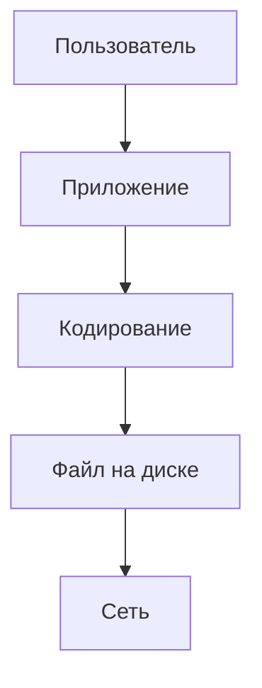

---

### Вопросы 21–30 (кратко)

21. Бит минимален? — Да.  
22. Unicode = UTF-8? — Нет.  
23. BMP сжатие? — Обычно нет.  
24. FLAC? — Без потерь аудио.  
25. GIF анимация? — Несколько кадров.  
26. SVG растр? — Вектор.  
27. Палитра 2 цвета? — 1 бит/пиксель.  
28. Найквист? — fдискр ≥ 2×fмакс.  
29. Контейнер AVI? — Да, устаревающий.  
30. 7z и ZIP? — 7z часто плотнее.

---

### Практикум 3

| Шаг | Действие |
|-----|----------|
| 1 | hexdump первых байт UTF-8 файла |
| 2 | Свойства PNG — размер без сжатия и файл |
| 3 | Audacity — экспорт WAV и MP3 |
| 4 | Архив папки проекта |
| 5 | Перевод возраста в hex "для fun" |

---

### Чек-лист экзамена по главе 2

- [ ] Формула звука
- [ ] Формула растра
- [ ] UTF-8 кириллица 2 байта
- [ ] Перевод 2/8/16
- [ ] Lossless и lossy
- [ ] MP4 контейнер
- [ ] Метаданные EXIF/ID3
- [ ] Base64 +33%
- [ ] Степени двойки до 2¹⁰

---

## Ещё задачи ОГЭ — автогенерация куратора

### Задача E2-1

**Условие.** Текст из 6 русских букв (UTF-8); растр 208×156, 24 бита; звук 8000 Гц, 8 бит, моно, 11 с.

**Ответ.** Текст: 12 байт; растр: 97,344 байт; звук: 88,000 байт.

---

### Задача E2-2

**Условие.** Текст из 7 русских букв (UTF-8); растр 216×162, 24 бита; звук 8000 Гц, 8 бит, моно, 12 с.

**Ответ.** Текст: 14 байт; растр: 104,976 байт; звук: 96,000 байт.

---

### Задача E2-3

**Условие.** Текст из 8 русских букв (UTF-8); растр 224×168, 24 бита; звук 8000 Гц, 8 бит, моно, 13 с.

**Ответ.** Текст: 16 байт; растр: 112,896 байт; звук: 104,000 байт.

---

### Задача E2-4

**Условие.** Текст из 9 русских букв (UTF-8); растр 232×174, 24 бита; звук 8000 Гц, 8 бит, моно, 14 с.

**Ответ.** Текст: 18 байт; растр: 121,104 байт; звук: 112,000 байт.

---

### Задача E2-5

**Условие.** Текст из 10 русских букв (UTF-8); растр 240×180, 24 бита; звук 8000 Гц, 8 бит, моно, 15 с.

**Ответ.** Текст: 20 байт; растр: 129,600 байт; звук: 120,000 байт.

---

### Задача E2-6

**Условие.** Текст из 11 русских букв (UTF-8); растр 248×186, 24 бита; звук 8000 Гц, 8 бит, моно, 16 с.

**Ответ.** Текст: 22 байт; растр: 138,384 байт; звук: 128,000 байт.

---

### Задача E2-7

**Условие.** Текст из 12 русских букв (UTF-8); растр 256×192, 24 бита; звук 8000 Гц, 8 бит, моно, 17 с.

**Ответ.** Текст: 24 байт; растр: 147,456 байт; звук: 136,000 байт.

---

### Задача E2-8

**Условие.** Текст из 13 русских букв (UTF-8); растр 264×198, 24 бита; звук 8000 Гц, 8 бит, моно, 18 с.

**Ответ.** Текст: 26 байт; растр: 156,816 байт; звук: 144,000 байт.

---

### Задача E2-9

**Условие.** Текст из 14 русских букв (UTF-8); растр 272×204, 24 бита; звук 8000 Гц, 8 бит, моно, 19 с.

**Ответ.** Текст: 28 байт; растр: 166,464 байт; звук: 152,000 байт.

---

### Задача E2-10

**Условие.** Текст из 15 русских букв (UTF-8); растр 280×210, 24 бита; звук 8000 Гц, 8 бит, моно, 20 с.

**Ответ.** Текст: 30 байт; растр: 176,400 байт; звук: 160,000 байт.

---

### Задача E2-11

**Условие.** Текст из 16 русских букв (UTF-8); растр 288×216, 24 бита; звук 8000 Гц, 8 бит, моно, 21 с.

**Ответ.** Текст: 32 байт; растр: 186,624 байт; звук: 168,000 байт.

---

### Задача E2-12

**Условие.** Текст из 17 русских букв (UTF-8); растр 296×222, 24 бита; звук 8000 Гц, 8 бит, моно, 22 с.

**Ответ.** Текст: 34 байт; растр: 197,136 байт; звук: 176,000 байт.

---

### Задача E2-13

**Условие.** Текст из 18 русских букв (UTF-8); растр 304×228, 24 бита; звук 8000 Гц, 8 бит, моно, 23 с.

**Ответ.** Текст: 36 байт; растр: 207,936 байт; звук: 184,000 байт.

---

### Задача E2-14

**Условие.** Текст из 19 русских букв (UTF-8); растр 312×234, 24 бита; звук 8000 Гц, 8 бит, моно, 24 с.

**Ответ.** Текст: 38 байт; растр: 219,024 байт; звук: 192,000 байт.

---

### Задача E2-15

**Условие.** Текст из 20 русских букв (UTF-8); растр 320×240, 24 бита; звук 8000 Гц, 8 бит, моно, 25 с.

**Ответ.** Текст: 40 байт; растр: 230,400 байт; звук: 200,000 байт.

---

### Задача E2-16

**Условие.** Текст из 21 русских букв (UTF-8); растр 328×246, 24 бита; звук 8000 Гц, 8 бит, моно, 26 с.

**Ответ.** Текст: 42 байт; растр: 242,064 байт; звук: 208,000 байт.

---

### Задача E2-17

**Условие.** Текст из 22 русских букв (UTF-8); растр 336×252, 24 бита; звук 8000 Гц, 8 бит, моно, 27 с.

**Ответ.** Текст: 44 байт; растр: 254,016 байт; звук: 216,000 байт.

---

### Задача E2-18

**Условие.** Текст из 23 русских букв (UTF-8); растр 344×258, 24 бита; звук 8000 Гц, 8 бит, моно, 28 с.

**Ответ.** Текст: 46 байт; растр: 266,256 байт; звук: 224,000 байт.

---

### Задача E2-19

**Условие.** 24 русских букв UTF-8; 352×264×24 бита; звук 8 кГц 8 бит моно 29 с.

**Ответ.** 48; 278784; 232000.

---

### Задача E2-20

**Условие.** 25 русских букв UTF-8; 360×270×24 бита; звук 8 кГц 8 бит моно 30 с.

**Ответ.** 50; 291600; 240000.

---

### Задача E2-21

**Условие.** 26 русских букв UTF-8; 368×276×24 бита; звук 8 кГц 8 бит моно 31 с.

**Ответ.** 52; 304704; 248000.

---

### Задача E2-22

**Условие.** 27 русских букв UTF-8; 376×282×24 бита; звук 8 кГц 8 бит моно 32 с.

**Ответ.** 54; 318096; 256000.

---

### Задача E2-23

**Условие.** 28 русских букв UTF-8; 384×288×24 бита; звук 8 кГц 8 бит моно 33 с.

**Ответ.** 56; 331776; 264000.

---

### Задача E2-24

**Условие.** 29 русских букв UTF-8; 392×294×24 бита; звук 8 кГц 8 бит моно 34 с.

**Ответ.** 58; 345744; 272000.

---

### Задача E2-25

**Условие.** 30 русских букв UTF-8; 400×300×24 бита; звук 8 кГц 8 бит моно 35 с.

**Ответ.** 60; 360000; 280000.

---

### Задача E2-26

**Условие.** 31 русских букв UTF-8; 408×306×24 бита; звук 8 кГц 8 бит моно 36 с.

**Ответ.** 62; 374544; 288000.

---

### Задача E2-27

**Условие.** 32 русских букв UTF-8; 416×312×24 бита; звук 8 кГц 8 бит моно 37 с.

**Ответ.** 64; 389376; 296000.

---

### Задача E2-28

**Условие.** 33 русских букв UTF-8; 424×318×24 бита; звук 8 кГц 8 бит моно 38 с.

**Ответ.** 66; 404496; 304000.

---

### Задача E2-29

**Условие.** 34 русских букв UTF-8; 432×324×24 бита; звук 8 кГц 8 бит моно 39 с.

**Ответ.** 68; 419904; 312000.

---

### Задача E2-30

**Условие.** 35 русских букв UTF-8; 440×330×24 бита; звук 8 кГц 8 бит моно 40 с.

**Ответ.** 70; 435600; 320000.

---

### Задача E2-31

**Условие.** 36 русских букв UTF-8; 448×336×24 бита; звук 8 кГц 8 бит моно 41 с.

**Ответ.** 72; 451584; 328000.

---

### Задача E2-32

**Условие.** 37 русских букв UTF-8; 456×342×24 бита; звук 8 кГц 8 бит моно 42 с.

**Ответ.** 74; 467856; 336000.

---

### Задача E2-33

**Условие.** 38 русских букв UTF-8; 464×348×24 бита; звук 8 кГц 8 бит моно 43 с.

**Ответ.** 76; 484416; 344000.

---

### Задача E2-34

**Условие.** 39 русских букв UTF-8; 472×354×24 бита; звук 8 кГц 8 бит моно 44 с.

**Ответ.** 78; 501264; 352000.

---

## Резюме всей главы

1. **Данные** в компьютере — биты и байты; текст, звук, изображение — разные **модели кодирования**.
2. **UTF-8** — главная кодировка текста; кириллица обычно **2 байта** на букву.
3. Объём **растра** и **звука** считают по формулам из задания.
4. **Сжатие** без потерь (ZIP, PNG) и с потерями (JPEG, MP3).
5. **Метаданные** и **архиваторы** — практические темы курса.

<div class="callout callout--tip">
  <div class="callout-title">Итог</div>
  <div class="callout-body">Умение переводить системы счисления и считать объём медиа — база для всего курса информатики.</div>
</div>

---

Дальше по курсу — [Компьютер и периферия](./3).

---

## Быстрые ссылки

- [Данные и информация](/encyclopedia/1-basics/1-09-dannye-i-informatsiya/intro)
- [Архивы](/encyclopedia/1-basics/1-20-ispolnyaemye-fayly-i-arhivy/2)
- [Аудио и видео](/encyclopedia/1-basics/1-17-audio-i-video/1)
- [Структуры данных](/encyclopedia/3-data-markup/3-02-struktury-dannyh/intro)
- [Алгоритмы](/encyclopedia/4-code-dev/4-01-algoritmy/intro)

---

## Справочник формул и единиц

| Величина | Формула / значение |
|----------|-------------------|
| Байт | 8 бит |
| КиБ | 1024 байт |
| Текст UTF-8 (кириллица) | ~2 байта × n букв |
| Растр | W × H × (бит/8) |
| Звук PCM | f × b × t × ch / 8 |
| Сжатие | размер_до / размер_после |

---

## Разбор типовой задачи ОГЭ (полный ход)

**Условие.** Файл содержит текст из 40 символов: 20 латинских и 20 русских. Кодировка UTF-8. Объём?

**Шаг 1.** Латиница: 20 × 1 = 20 байт.  
**Шаг 2.** Кириллица: 20 × 2 = 40 байт.  
**Шаг 3.** Сумма: **60 байт**.

---

## Разбор задачи на звук (полный ход)

**Условие.** 16 000 Гц, 16 бит, моно, 25 с.

V = 16000 × 16 × 25 × 1 / 8 = **800 000 байт**.

Проверка размерности: Гц × бит = бит/с; × с = бит; /8 = байт.

---

## Разбор задачи на изображение

**Условие.** 1280×720, 16 бит на пиксель.

Байт на пиксель = 16/8 = 2. V = 1280 × 720 × 2 = **1 843 200 байт**.

---

## Кодировки — диагностическая таблица

| Симптом в браузере | Вероятная причина | Действие |
|--------------------|-------------------|----------|
| Привет | UTF-8 как CP1251 | Указать UTF-8 |
| Привет | CP1251 как UTF-8 | Пересохранить в UTF-8 |
| Квадратики | Нет шрифта/глифа | Другой шрифт, UTF-8 |

---

## Алгоритм RLE — псевдокод

```
результат ← пустая строка
i ← 1
пока i <= длина(вход)
  c ← вход[i]
  k ← 1
  пока i+k <= длина и вход[i+k] = c
    k ← k + 1
  добавить (k, c) в результат
  i ← i + k
```

---

## Сжатие JPEG — этапы (обзор)

1. Преобразование цвета (RGB→YCbCr).  
2. Дискретное косинусное преобразование (DCT).  
3. Квантование (потери).  
4. Энтропийное кодирование.

---

## PNG — почему без потерь

Обратимое кодирование после фильтров; подходит для линий и текста.

---

## Архиваторы — сценарии экзамена

| Вопрос | Ответ |
|--------|-------|
| Несколько файлов в один | ZIP |
| Сильнее сжать текст | 7z |
| Совместимость Windows | ZIP |
| JPEG в ZIP уменьшится сильно? | Почти нет |

---

## Метаданные PDF

Title, Author, Subject, Keywords — поиск в каталоге.

---

## Метаданные фото — ориентация

EXIF Orientation — поворот без перекодирования пикселей.

---

## Видео — битрейт

Битрейт = бит/с видеопотока; выше — лучше качество при том же кодеке.

---

## Стеганография (упоминание)

Скрытие данных внутри изображения — не путать со сжатием.

---

## Задачи для тренировки — набор D

| № | Краткое условие | Ответ |
|---|-----------------|-------|
| D1 | 7 букв рус UTF-8 | 14 |
| D2 | 100×100 8 бит | 10000 |
| D3 | 11 кГц 8 бит моно 2 с | 5500 |
| D4 | 31₁₀ hex | 1F |
| D5 | 111₁₀ двоичное | 1101111 |

---

## Связь с программированием

Строки в Python 3 — Unicode; `len("Привет")` = 6 символов, не байт; `encode("utf-8")` даёт bytes.

---

## Итоговый глоссарий (расширенный)

| Термин | Определение |
|--------|-------------|
| Растр | Массив пикселей |
| Вектор | Формулы линий и кривых |
| Кодек | Кодирование/декодирование медиа |
| Контейнер | Упаковка потоков |
| Lossless | Без потерь |
| Lossy | С потерями |

---

## Резюме всей главы

1. **Данные** в компьютере — биты и байты; текст, звук, изображение — разные модели кодирования.
2. **UTF-8** — главная кодировка текста; кириллица обычно 2 байта на букву.
3. Объём растра и звука считают по формулам; единицы проверяйте дважды.
4. **Сжатие** без потерь (ZIP, PNG) и с потерями (JPEG, MP3).
5. **Метаданные** описывают файл и могут нести личную информацию.

<div class="callout callout--tip">
  <div class="callout-title">Итог</div>
  <div class="callout-body">Практикуйте 5–10 задач в день: перевод систем счисления, байты текста, объём медиа.</div>
</div>

---

Дальше по курсу — [Компьютер и периферия](./3).

---

## Быстрые ссылки

- [Данные и информация](/encyclopedia/1-basics/1-09-dannye-i-informatsiya/intro)
- [Структуры данных](/encyclopedia/3-data-markup/3-02-struktury-dannyh/intro)
- [HTML и кодировки](/encyclopedia/3-data-markup/3-09-html/22)

---
