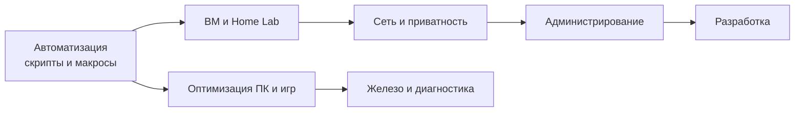
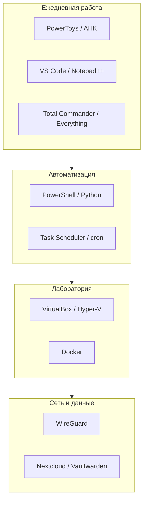

---
tags:
  - all
  - required
  - beginner
title: Советы для начинающего пользователя ПК
description: Практические рекомендации по настройке и оптимизации рабочего места.
---

import ExternalPlayEmbed from '@site/src/components/ExternalPlayEmbed';


# Советы для начинающего пользователя ПК

<div class="article-tags">
  <span class="tag tag-required">ОБЯЗАТЕЛЬНО</span>
  <span class="tag tag-beginner">ДЛЯ НОВИЧКОВ</span>
</div>

<span class="complexity-badge">Всем</span>

Мы живём в таком мире, где устройства становятся центром нашей цифровой жизни, забрав себе деньги, документы, общение и творчество. Наши зарплаты теперь лишь циферки в компьютере, а все развлечения только на экране.

Поэтому и относиться к компьютеру как к обычному ящику уже не получится. Заложим правильные привычки:
- не мусорить на компьютере;
- не скачивать вирусы;
- делать бэкапы;
- не паниковать, если что-то пошло не так.

<div class="callout callout--tip">
  <div class="callout-title">С чего начать</div>

  <div class="callout-body">
  Совсем с нуля — сначала <a href="/encyclopedia/1-basics/1-035-bazovaya-informatika/101">Основы компьютерной грамотности</a>. Если многое уже знаете — пролистайте к блокам про <b>кэш</b>, <b>менеджер паролей</b>, <b>правило 3-2-1</b> для бэкапа и <b>chkdsk</b>. Там часто остаются пробелы даже у опытных пользователей.
</div>
  </div>

---

## Сначала - обучитесь

> Начинающий пользователь ПК — это человек, который обладает базовыми навыками работы с компьютером и может решать только самые простые повседневные задачи. На этом уровне пользователь уже преодолел страх перед техникой, но все еще нуждается в подсказках или инструкциях при столкновении с незнакомыми программами и ошибками.

Вам нужно научиться:
- управлять устройством - включать, выключать, перезагружать компьютер;
- использовать периферию, уверенно работать с клавиатурой, мышью или тачпадом.
- работать с файлами, создавать, копировать, переименовывать, перемещать и удалять папки и документы.
- пользоваться интернетом, открывать браузер, находить информацию через поисковики и заходить на сайты.
- взаимодействовать с почтой,  отправлять и принимать электронные письма, а также прикреплять к ним файлы.
- вводить текст, набирать простые тексты в базовых редакторах (например, Блокнот или MS Word на начальном уровне).
- использовать флешки, подключать внешние носители, скачивать на них или переносить с них информацию.

Неизбежно придётся научиться самостоятельно устранять технические неполадки, системные сбои или ошибки, устанавливать сложные программы, драйверы или переустанавливать операционную систему, а порой даже защищать компьютер. Но это уровень продвинутого, не пугайтесь.

Начните с основ. Мой первый компьютер был безумно слабым, на нём невозможно было запустить хорошие игры, в которые играли мои одноклассники, и мне приходилось развлекать себя довольно необычным образом - запускать всё подряд, задавать себе вопрос "А это что за кнопка?" и нажимать на неё. Так и закрепилось много фундамента.

Из своего опыта скажу главное - **не бойтесь компьютера**. Всё, что опасно, от вас уже спрятано, главное лишь научиться работать с тем, что есть, и всё бывает в первый раз.

---

## Советы для новичка

Компьютер - мощный инструмент, но любой пользователь, так или иначе, совершает ошибки. Какие-то широко распространены, какие-то встречаются реже. Важно соблюдать некоторые правила, чтобы эффективно использовать своё устройство.

Если коротко:
- как запускать программы (exe, IDE, терминал, dev-сервер) — [Запуск и перезапуск приложений](/encyclopedia/1-basics/1-035-bazovaya-informatika/208);
- не качаем всё подряд;
- не мусорим на компьютере;
- красиво называем папки и файлы;
- внимательнее к своим паролям;
- проверяемся на вирусы.

<div class="callout callout--tip">
  <div class="callout-title">Запомните</div>
  Ваша задача - изучить, понять и научиться, а не просто закрыть вопросы на собеседовании! Вы - не "вкатун", и не обманщик. Вы - хороший, подготовленный специалист, который разбирается в предмете, знает, как всё устроено. Потому что в вашем распоряжение действительно полный материал, позволяющий стать профессионалом.
</div>

---

### Безопасность

Безопасность прежде всего. Главная задача любого пользователя - защитить свои данные и устройство от угроз. Никогда не скачивайте программы с непроверенных источников, таких как торрент-трекеры или подозрительные сайты (наверняка встречали сайты с десятками кнопок "Скачать", где нажатие на любую вызывает скачивание всего, но только не нужного файла?). 

**Источник программного обеспечения** определяет степень риска при установке приложений. Официальные сайты разработчиков предоставляют гарантию подлинности и безопасности установочных файлов. Торрент-трекеры и ресурсы с неясным статусом создают условия для попадания вредоносного кода на систему.

| Категория источника | Уровень доверия | Риски | Рекомендация |
|---------------------|-----------------|-------|--------------|
| Официальный сайт | Высокий | Минимальный | Предпочтительно |
| Магазин приложений | Средний/Высокий | Умеренный | Допустимо |
| Третичные ресурсы | Низкий | Высокий | Избегать |
| Торренты | Неизвестный | Критический | Не использовать |

Официальные сайты разработчиков — это гарантия того, что вы получите безопасную версию программы. Кроме того, будьте внимательны при установке программ - часто в установщиках скрывается "дополнительный софт", который может замедлить работу системы или даже оказаться вредоносным. Всегда отказывайтесь от предложений установить ненужные утилиты. 

Процесс установки содержит дополнительные опции, которые пользователь может упустить из виду. Некоторые пакеты предлагают установку сопутствующих программ в виде дополнительных флажков. Эти утилиты могут занимать системные ресурсы и создавать конфликт между компонентами.

**Рекомендации по установке:**

1. Внимательно изучать каждый шаг мастера установки
2. Отмечать опцию "кастомная установка" вместо стандартной
3. Снимать галочки с предложений установить дополнительный софт
4. Выбирать путь установки вне папки Windows по умолчанию

Создание копий защищённых файлов предотвращает потерю важной информации при сбоях или повреждении накопителей.

**Правило 3-2-1** (простая схема для важных данных):

1. **3** копии данных (оригинал + две резервные);
2. **2** типа носителей (например, диск компьютера + облако или внешний HDD);
3. **1** копия вне дома (облако или флешка у родственников).


**Методы резервного копирования:**

*   **Локальное хранение**: внешний жёсткий диск или флеш-накопитель
*   **Облачное хранилище**: Яндекс.Диск, Google Drive, Dropbox


*   **Автономное копирование**: периодическое сохранение версий документов

Пользователи должны поддерживать актуальность резервных копий путём добавления новых изменений к существующим архивам. Автосохранение функций редактирования документов выступает дополнением к полному резервному копированию.

Итого:

- *Не устанавливать "всё подряд"*:
	- скачивать программы только с официальных сайтов (не с торрент-трекеров или подозрительных страниц);
	- внимательно читать установщики – часто там скрыт "дополнительный софт";
	
- *Резервное копирование*:
	- хранить важные файлы в облаке (Google, Яндекс) или на внешнем диске;
	- не забывать использовать автосохранение (да и в целом почаще сохраняться);

- *Не отключать Windows Defender и антивирусы*.


Если сохранять всё на один диск, то в случае поломки устройства - данные будут потеряны. Резервные копии можно сделать, используя другие (запасные) устройства и облачные сервисы (Google Drive, Яндекс.Диск). Помните, что потерять файлы гораздо проще, чем кажется.


---

### Браузеры

Браузер служит основной точкой доступа к интернет-ресурсам. Он обеспечивает отображение веб-страниц, обработку форм, воспроизведение медиа и выполнение интерактивных скриптов.

**Функции современных браузеров:**

*   Отображение HTML, CSS и JavaScript контента
*   Хранение истории посещений и закладок
*   Управление сеансами и вкладками
*   Интеграция с расширениями и дополнениями
*   Синхронизация между устройствами

**Браузеры** — это наши основные инструменты для работы в интернете, и важно использовать их правильно. Установите блокировщик рекламы (например, uBlock Origin), чтобы защититься от надоедливой и потенциально опасной рекламы. Старайтесь не оставлять открытые вкладки, если они вам не нужны — это замедляет работу браузера и может привести к перегрузке оперативной памяти. Вместо этого добавляйте часто посещаемые страницы в закладки.

<details>
<summary><b>Что такое кэш браузера?</b></summary>

**Кэш** — локальные копии картинок, стилей и скриптов с посещённых сайтов. При повторном открытии страница загружается быстрее. Очищать кэш имеет смысл, если сайт "глючит" или после обновления не отображается новая версия — а не "раз в месяц по календарю". Регулярная очистка без причины только замедляет повседневный серфинг.
</details>

<details>
<summary><b>Пароли: браузер или менеджер?</b></summary>

Сохранение паролей в браузере удобно, но рискованнее: при взломе учётной записи или синхронизации злоумышленник получает доступ сразу ко многим сайтам. **Менеджер паролей** (Bitwarden, KeePass и др.) хранит базу отдельно, генерирует сложные пароли и поддерживает двухфакторную аутентификацию.
</details>

- *Работа с браузером*:
	- использовать блокировщик рекламы – это может ускорить загрузку страниц и защитить от вредоносной рекламы;
	- очищать кэш при проблемах с отображением сайтов, а не по расписанию;
	- не хранить пароли только в браузере — лучше менеджер паролей;
	- закрывать за собой вкладки в браузере и использовать закладки.

Многие пользователи халатно относятся к вкладкам, и их браузеры выглядят так:


Они не закрывают вкладки - так делать не нужно. Люди так делают, потому что не хотят "терять" или записывать ссылку на сайт. Но есть специальный механизм закладок в любом браузере, позволяющий группировать сохранённые сайты (и файлы) по папкам,что может позволить вам навести порядок в браузере. Важно создавать папки вроде "Учёба", "Инструменты", "Работа" и прочее - и группировать всё там в порядке иерархии.

Операционная система выделяет ресурс каждой открытой вкладке. Большое количество одновременно открытых страниц приводит к увеличению потребления оперативной памяти и замедлению общей производительности компьютера.

**Проблема открытых вкладок:**

```
Текущая конфигурация:
├── Рабочие документы      → закрыто после завершения
├── Новости                → закрыть по окончании чтения
├── Поиск товаров          → сохранить в закладки при необходимости
└── Развлечения            → закрыть после просмотра
```

**Рекомендуемое поведение:**

1. Использовать группы вкладок для разделения по темам
2. Загружать ссылки через систему закладок вместо сохранения открытыми
3. Периодически проводить чистку незадействованных вкладок
4. Применять расширенные функции управления (например, OneTab)

---

### Беспорядок

Частая проблема начинающих пользователей - беспорядок на рабочем столе. Складывать все файлы на рабочий стол - привычка, схожая с "открытыми вкладками", но это удобно лишь первое время, потом найти нужный документ становится настоящим испытанием. Согласитесь, тяжеловато будет работать с замусоренным рабочим столом.


Лучше организовать свои файлы в логические папки и давать им потом осмысленные названия, например "2025" и внутри "Работа", "Отпуск". А в Windows, например, и вовсе есть специальные коллекции - готовые директории для размещения файлов - "Изображения", "Музыка", "Видео", "Документы" - почему бы не использовать их? Поэтому в этой ОС нет необходимости создавать такие же дубликаты. А если проблема в диске, когда есть диск с меткой "D", к примеру, на котором 4 ТБ, и диск "C", на котором 256 ГБ. В Windows можно изменить место хранения коллекций, допустим, переместив папку "Загрузки" или "Изображения" на другой диск.

Грамотная структура папок облегчает поиск документов и повышает эффективность работы с данными. Файлы следует распределять по логическим категориям с использованием понятных наименований.

**Стандартные директории Windows:**

| Директория | Назначение | Рекомендации |
|------------|------------|--------------|
| Документы | Текстовые файлы, отчёты | Группировать по годам и проектам |
| Изображения | Фотографии, сканы | Разделять по событиям и типам |
| Музыка | Аудиофайлы, подкасты | Классифицировать по жанрам |
| Видео | Видеоролики, фильмы | Категоризировать по длительности и источнику |
| Загрузки | Временно скачанные файлы | Очищать после использования |
| Рабочий стол | Текущие активные проекты | Не хранить долгосрочные данные |

Названия папок должны содержать информацию о содержимом для быстрого поиска. Использование дат в формате ГГГГ помогает группировать материалы по периодам времени.

**Пример структуры каталогов:**

```
Документы/
├── 2025/
│   ├── Работа/
│   │   ├── Проекты/
│   │   └── Финансы/
│   └── Личное/
├── 2024/
│   └── Архив/
└── Шаблоны/
    └── Резюме/
```

**Этика именования папок:**

*   Избегать общих названий вроде "Новая папка" или "Файлы"
*   Использовать единую систему кодирования
*   Применять разделители слов (тире, нижнее подчеркивание)
*   Учитывать регистр букв единообразно

---

### Замедление работы

Многие пользователи также сталкиваются с тем, что их компьютер начинает работать медленнее после нескольких месяцев использования. Часто это связано с программами, которые автоматически запускаются при старте системы. Чтобы ускорить загрузку компьютера, проверьте автозагрузку через "Диспетчер задач" и отключите ненужные приложения. Также важно помнить, что не стоит использовать "оптимизатор" вроде CCleaner или Advanced SystemCare, если вы не понимаете, как они работают. Эти программы могут нанести больше вреда, чем пользы, особенно если чистят реестр без вашего контроля. Лучше сосредоточьтесь на регулярной проверке устройств (дисков) на ошибки и мониторинге температуры компонентов. Если процессор слабый, а ОЗУ маловато, то бесполезно "оптимизировать систему".

А порой причина медленной работы в пыли. Да, пыль засоряет компоненты, к примеру, систему охлаждения (вентиляторы), из-за чего количество воздуха уменьшается, устройства греются и замедляются. Процессор имеет такое характерное свойство, как тротлинг - когда при высокой температуре выполнение процессов "приостанавливается" для понижения температуры, а при достигнутом лимите - и вовсе отключение. Будьте внимательны и не забывайте ухаживать за устройством! Но вернёмся к файлам.

Таким образом, при работе с файлами лучше придерживаться советов:

- *Не сохранять файлы на рабочий стол* (лучше самостоятельно найти место через проводник);
- *Проверять автозагрузку* и отключать ненужные программы из автозапуска.
- *Подписывать папки* и не оставлять их как "Новая папка";
- *Не использовать оптимизаторы* (CCleaner, Advanced SystemCare, Auslogics BoostSpeed).

При наличии дисков разного объёма целесообразно перенастроить стандартные директории ОС. Папку "Загрузки" рекомендуется разместить на диске с достаточным свободным пространством.


**Настройка местоположения директорий:**

1. Открыть свойства папки в проводнике
2. Перейти в раздел "Расположение"
3. Указать целевой диск
4. Подтвердить перемещение существующих файлов

Некоторые приложения запускаются автоматически при включении компьютера без явной команды пользователя. Этот механизм улучшает удобство работы, но избыточные элементы замедляют старт системы.

**Проверка автозапуска через Диспетчер задач:**

```
Ctrl + Shift + Esc → вкладка "Автозагрузка"
```


(Комбинация `Ctrl + Shift + Esc` открывает диспетчер сразу, без экрана безопасности. Через `Ctrl + Alt + Delete` путь длиннее: "Диспетчер задач" → "Автозагрузка".)

| Элемент | Рекомендация | Обоснование |
|---------|--------------|-------------|
| Обновление драйверов | Включить | Стабильность системы |
| Мессенджеры | Отключить | По требованию |
| Антивирус | Включить | Защита системы |
| Сервисы принтеров | По необходимости | При использовании |
| Дополнительные utilities | Отключить | Экономия ресурсов |


Регулярная проверка температурных показателей и использования ресурсов позволяет своевременно выявлять проблемы. Программы мониторинга отображают текущие значения процессора, видеокарты и оперативной памяти.

**Инструменты контроля температуры:**

*   HWMonitor — комплексный анализ всех датчиков
*   CPU-Z — информация о процессоре
*   GPU-Z — характеристики видеокарты
*   Open Hardware Monitor — бесплатный аналог

Вентиляционные отверстия накапливают мелкодисперсные частицы. Накопление пыли уменьшает поток воздуха через радиаторы охлаждения. Это приводит к повышению рабочей температуры компонентов. Процессор реагирует на перегрев снижением тактовой частоты. В критических случаях происходит автоматическое отключение.

**Периодичность обслуживания:**

*   Ноутбук — каждые 6 месяцев
*   Системный блок — каждые 12 месяцев
*   Помещение с высокой запылённостью — чаще указанного графика

**Процедура очистки:**

1. Обесточить устройство и отсоединить кабели
2. Открыть крышку корпуса
3. Пройтись щёткой по поверхностям
4. Продуть сжатым воздухом вентиляторы
5. Проверить посадку кулеров и термопасты

---

### Ещё о безопасности

Windows Defender поставляется в составе операционной системы. Программа проводит сканирование при подключении внешних носителей, проверке загруженных файлов и мониторинге процессов.

**Преимущества встроенного решения:**

*   Отсутствие платных подписок
*   Интеграция с системой безопасности
*   Минимальное влияние на производительность
*   Автоматические обновления определений

Антивирусное программное обеспечение должно работать постоянно для предотвращения проникновения вредоносных программ. Отключение защитных механизмов открывает доступ потенциальным атакам.

Не забывайте также о базовых мерах защиты - не отключайте установленные антивирусы, регулярно обновляйте систему и используйте сложные пароли. Для удобства управления паролями лучше воспользоваться специальным менеджером, чем хранить их в браузере.

Хранение учётных данных в специальном инструменте предпочтительнее запоминания вручную или записи в текстовые файлы. Генератор паролей создаёт комбинации символов высокой сложности. Шифрование базы данных обеспечивает защиту от несанкционированного доступа.

**Функции менеджеров паролей:**

*   Генерация уникальных сложных паролей
*   Автоматическое заполнение форм авторизации
*   Синхронизация между несколькими устройствами
*   Экспорт и импорт баз данных

Требование дополнительного кода подтверждения снижает вероятность кражи учётной записи. Код может поступать через SMS, почтовый сервис или генератор токенов.

**Уровни двухфакторной защиты:**

| Способ доставки | Надёжность | Практичность |
|-----------------|------------|---------------|
| SMS-сообщение | Средняя | Высокая |
| E-mail | Средняя | Высокая |
| Приложение-аутентификатор | Высокая | Средняя |
| Аппаратный токен | Очень высокая | Низкая |

Точки восстановления фиксируют состояние системы перед внесением важных изменений. Восстановление предыдущего образа возвращает параметры к исходным значениям.

**Процедура создания точки:**

```
Панель управления → Система → Защита системы → Создать
```

**Сценарии применения:**

*   Перед установкой крупного обновления
*   До начала тестирования нового программного обеспечения
*   После внесения значительных настроек конфигурации

Ошибка файловой системы возникает при неправильном завершении работы или сбое питания. Утилита **`chkdsk`** (Check Disk) проверяет файловую систему и при необходимости — поверхность накопителя.

**Команда проверки диска** (запускайте в командной строке или PowerShell **от имени администратора**):

```cmd
chkdsk C: /f /r
```

| Параметр | Назначение |
|----------|------------|
| `/f` | Исправить найденные ошибки файловой системы |
| `/r` | Найти повреждённые сектора и восстановить читаемые данные (долго, обычно требует перезагрузки) |

**Результаты проверки:**

*   Ошибки файловой системы исправляются автоматически
*   Плохие сектора помечаются и исключаются из оборота
*   Потерянные кластеры маркируются как повреждённые

Системное планирование профилактических процедур сокращает время простоя оборудования и поддерживает работоспособность компонентов в пределах нормативных значений.

**Ежемесячный график обслуживания:**

| Период | Действие | Инструмент |
|--------|----------|------------|
| 1 раз в неделю | Удаление временных файлов | Disk Cleanup |
| 1 раз в месяц | Проверка обновлений | Центр обновлений Windows |
| 1 раз в месяц | Очистка истории браузера | Настройки браузера |
| 1 раз в квартал | Резервное копирование данных | Облако или внешний диск |
| 1 раз в год | Физическая чистка | Компрессор или пылесос |

Итого:

- *Управление паролями*:
	- Уникальный сложный пароль для каждого сервиса (генератор в менеджере паролей);
	- Смена пароля — только если он утёк или сервис об этом предупредил (не "раз в три месяца" без причины);
	- Двухфакторная аутентификация — лучше приложение-аутентификатор, чем SMS.

- *Профилактические меры*:
	- Создание точек восстановления системы;
	- Периодическая проверка дисков на ошибки;
	- Мониторинг температуры компонентов компьютера.

---

---

---
tags:
  - all
  - required
title: Путь продвинутого пользователя
description: >-
  Кто считается опытным пользователем ПК, какие навыки дают реальный рост и куда
  вести обучение дальше — к администрированию, разработке и домашней
  инфраструктуре.
related:
  - title: Софт продвинутого
    doc: /encyclopedia/1-basics/1-035-bazovaya-informatika/201#софт-продвинутого-пользователя--обзор
  - title: Скрипты и автоматизация
    doc: /encyclopedia/4-code-dev/4-011-instrumenty-razrabotki/402
  - title: Программирование
    doc: encyclopedia/4-code-dev/code-dev
---

# Путь продвинутого пользователя

<div class="article-tags">
  <span class="tag tag-required">ОБЯЗАТЕЛЬНО</span>
</div>

<span class="complexity-badge">Опытному пользователю</span>

<div class="callout callout--tip">
  <div class="callout-title">Зачем этот раздел</div>

  <div class="callout-body">
  Продвинутый пользователь редко ищет "ещё один совет по Excel". Ему нужны <strong>рычаги</strong> — автоматизация, изолированные эксперименты, контроль данных, сеть и производительность под конкретные задачи — от домашнего сервера до соревновательных игр.
</div>
  </div>


---

## Кто такой продвинутый пользователь

**Продвинутый (power user)** — не тот, кто знает больше кнопок в Word, а тот, кто:

- понимает, **что делает система**, когда он нажимает "Установить" или "Очистить";
- умеет **воспроизвести** настройку на другом ПК (скрипт, документ, образ ВМ);
- **диагностирует** тормоза по метрикам (CPU, диск, сеть), а не по ощущению "всё лагает";
- осознанно выбирает между **удобством облака** и **контролем self-hosting**.

Это ступень между "уверенным офисным пользователем" и специалистом IT. Многие отсюда уходят в системное администрирование, DevOps, разработку или кибербезопасность — но можно остаться "сильным пользователем" дома и на работе без смены профессии.

<div class="callout callout--tip">
  <div class="callout-title">Запомните</div>
  Ваша задача - изучить, понять и научиться, а не просто закрыть вопросы на собеседовании! Вы - не "вкатун", и не обманщик. Вы - хороший, подготовленный специалист, который разбирается в предмете, знает, как всё устроено. Потому что в вашем распоряжение действительно полный материал, позволяющий стать профессионалом.
</div>

---

### Power user, администратор и разработчик

Роли пересекаются, но **не совпадают**:

| Роль | Фокус | Типичные инструменты |
| :--- | :--- | :--- |
| **Power user** | Свой ПК и домашняя сеть: скорость, приватность, эксперименты | Скрипты, ВМ, VPN, редакторы |
| **Системный администратор** | Стабильность **чужих** систем: пользователи, политики, SLA | AD, мониторинг, бэкапы, [2.06](/encyclopedia/2-system-network/2-06-sistemnoe-administrirovanie/intro) |
| **Разработчик** | Продукт: код, тесты, релизы | Git, IDE, CI, [4-code-dev](/encyclopedia/4-code-dev/code-dev) |

Скрипт на 30 строк для бэкапа — это power user. Сопровождение десятка серверов и runbook'ов — уже ближе к админу. Сервис с API и базой — разработка. Переход между ролями естественный; снобизм "настоящие только пишут на C++" здесь неуместен.

**Blast radius** (радиус поражения) — сколько систем пострадает от одной ошибки. Отдельная [ВМ](/encyclopedia/2-system-network/2-06-sistemnoe-administrirovanie/10), учётка без прав администратора в быту и бэкап перед `robocopy /MIR` — способы **сузить** blast radius, не "паранойя".

---

## Чем продвинутый отличается от новичка и "среднего" уровня

| Навык | Уверенный пользователь | Продвинутый |
| :--- | :--- | :--- |
| Установка ПО | С официального сайта, без лишних галочек | Понимает зависимости, portable-версии, winget/choco, WSL |
| Файлы | Папки, поиск в проводнике | Everything, [поиск по содержимому](/encyclopedia/2-system-network/2-05-terminal/104), ripgrep, синхронизация, версии, бэкап 3-2-1 |
| Проблемы | Перезагрузка, "почистить диск" | Журнал событий, Process Explorer, изоляция в ВМ |
| Безопасность | Антивирус + сложный пароль | 2FA, менеджер паролей, VPN, свой DNS-фильтр |
| Рост | Курсы по Office | Скрипты, Linux, Home Lab, [программирование](/encyclopedia/4-code-dev/code-dev) |

Базовые советы по паролям и порядку на диске — в разделе [Советы для новичка](/encyclopedia/1-basics/1-035-bazovaya-informatika/intro). Здесь — следующий виток.

---

## Дорожная карта навыков

Логичный порядок освоения (можно параллелить по интересу):



1. **Автоматизация** — [скрипты и макросы](/encyclopedia/4-code-dev/4-011-instrumenty-razrabotki/402) — снять рутину с плеч ([Python](/encyclopedia/5-languages/5-02-python/intro), [Bash](/encyclopedia/5-languages/5-25-bash/intro), [PowerShell](/encyclopedia/5-languages/5-26-powershell/intro)).
2. **Виртуализация** — [ВМ и Home Lab](/encyclopedia/2-system-network/2-06-sistemnoe-administrirovanie/10) — безопасно пробовать Linux, сервисы, "ломать" систему.
3. **Приватность и данные** — [self-hosting и VPN](/encyclopedia/2-system-network/2-03-set-i-internet/404) — свои облака, пароли, DNS.
4. **Эргономика** — [работа с клавиатуры](/encyclopedia/1-basics/1-035-bazovaya-informatika/405): скорость и меньше RSI от мыши.
5. **Наблюдаемость Windows** — [процессы и кэши](/encyclopedia/1-basics/1-035-bazovaya-informatika/406).
6. **Игры и отзывчивость** — [FPS и input lag](/encyclopedia/1-basics/1-035-bazovaya-informatika/407).
7. **Железо** — [охлаждение и троттлинг](/encyclopedia/1-basics/1-035-bazovaya-informatika/408); основы компонентов — в [Как работает компьютер](/encyclopedia/1-basics/1-08-kak-rabotaet-kompyuter/intro).

---

## Куда расти профессионально

| Направление | Что уже близко power user | Куда углубляться в энциклопедии |
| :--- | :--- | :--- |
| Системное администрирование | Скрипты, ВМ, бэкапы, логи | [2.06 Администрирование](/encyclopedia/2-system-network/2-06-sistemnoe-administrirovanie/intro), [Терминал](/encyclopedia/2-system-network/2-05-terminal/intro) |
| Сети и безопасность | VPN, DNS, фаервол | [Сеть и интернет](/encyclopedia/2-system-network/2-03-set-i-internet/intro), [ИБ](/encyclopedia/8-infra-security/8-07-informatsionnaya-bezopasnost/intro) |
| Разработка | Редакторы, Git, API | [Код и разработка](/encyclopedia/4-code-dev/code-dev) |
| Данные и аналитика | Python, CSV, SQL | [SQL](/encyclopedia/3-data-markup/3-07-sql/intro), [Анализ данных](/encyclopedia/3-data-markup/3-11-analiz-dannyh/intro) |

Продвинутому пользователю не обязательно становиться программистом. Но **уметь прочитать ошибку в терминале и написать 20 строк скрипта** — это граница, после которой компьютер перестаёт быть "чёрным ящиком".

---

## Инструменты — отдельным разделом

Конкретные программы (Total Commander, VS Code, VirtualBox, PowerToys) собраны в [Софт продвинутого пользователя](/encyclopedia/1-basics/1-035-bazovaya-informatika/201#софт-продвинутого-пользователя--обзор). Советы здесь объясняют **зачем** они нужны; софт — **чем** реализовать.

---

## Типичный день power user

Не обязательная рутина, а **срез привычек**, которые отличают продвинутого от "среднего":

| Момент | Действие | Инструмент |
| :--- | :--- | :--- |
| Утро | Проверка, что NAS/сайт жив | Скрипт + уведомление |
| Работа | Открыть проект, терминал в VS Code | ``Ctrl+` ``, Remote-SSH |
| Файлы | Найти лог за вчера | Everything → Notepad++ |
| Эксперимент | Поставить пакет в Ubuntu ВМ | Снапшот → `apt` → откат |
| Вечер | Игра: закрыть лаунчеры, проверить temps | HWiNFO, [глава про игры](/encyclopedia/1-basics/1-035-bazovaya-informatika/407) |

Цель — **сократить повторяющиеся действия** до автоматизма или одной клавиши.

---

## Антипаттерны — что мешает росту

| Миф / привычка | Реальность |
| :--- | :--- |
| "Нужно всё знать на Linux" | Достаточно WSL + одной ВМ под задачу |
| "Очиститель ускорит ПК" | Часто ломает Update; смотрите [процессы](/encyclopedia/1-basics/1-035-bazovaya-informatika/406) |
| "VPN = полная анонимность" | Шифрует канал; сайт всё равно видит аккаунт |
| "Self-host = бесплатно навсегда" | Время на патчи, бэкапы, электричество |
| "Игровой бустер в Steam" | Часто дублирует настройки Windows/GPU |
| "Запомню пароль" | Один утечённый сервис → компрометация почты |

Продвинутый пользователь **проверяет источник** совета — официальная документация, Sysinternals, а не "топ-10 твиков 2024".

---

## Сценарии по интересам

| Вы в основном… | Начните с статей | Софт |
| :--- | :--- | :--- |
| Офис + много файлов | [2 скрипты](/encyclopedia/4-code-dev/4-011-instrumenty-razrabotki/402), [5 клавиатура](/encyclopedia/1-basics/1-035-bazovaya-informatika/405) | Total Commander, PowerToys |
| Игры + стрим | [7 игры](/encyclopedia/1-basics/1-035-bazovaya-informatika/407), [6 процессы](/encyclopedia/1-basics/1-035-bazovaya-informatika/406) | OBS, Afterburner |
| Приватность | [4 self-host](/encyclopedia/2-system-network/2-03-set-i-internet/404), [3 Home Lab](/encyclopedia/2-system-network/2-06-sistemnoe-administrirovanie/10) | Docker, WireGuard |
| Путь в IT | [Скрипты, макросы и локальная автоматизация](/encyclopedia/4-code-dev/4-011-instrumenty-razrabotki/402) → [Виртуальные машины, Home Lab и переход на Linux](/encyclopedia/2-system-network/2-06-sistemnoe-administrirovanie/10) → [2.06](/encyclopedia/2-system-network/2-06-sistemnoe-administrirovanie/intro) | VS Code, PuTTY |
| Контент / дизайн | [Рабочий процесс без мыши](/encyclopedia/1-basics/1-035-bazovaya-informatika/405) | [4 графика](/encyclopedia/1-basics/1-035-bazovaya-informatika/504) |

---

## Практический минимум на ближайший месяц

Если нужен измеримый прогресс:

1. Один рабочий скрипт на [PowerShell](/encyclopedia/5-languages/5-26-powershell/122) или [Python](/encyclopedia/5-languages/5-02-python/16) (бэкап папки, проверка сайта, переименование файлов).
2. Одна [виртуальная машина](/encyclopedia/2-system-network/2-02-platformy/21) с Linux — только для экспериментов.
3. Менеджер паролей + 2FA на почте и облаке.
4. Замер "до/после" — автозагрузка, фоновые процессы, свободное место на системном диске.
5. Десять новых [горячих клавиш](/encyclopedia/1-basics/1-035-bazovaya-informatika/203) — осознанно, с записью в шпаргалку.

---

### Неделя 2–4

6. Папка `Scripts` в Git: все `.ps1`, `.py`, `.ahk` с README.
7. `winget export` или список установленного ПО — восстановление на новом ПК.
8. Один сервис в Docker на старом ноутбуке (Pi-hole или Vaultwarden).
9. Process Explorer в закладках — при любом "тормозит".
10. Прочитать одну главу [терминала](/encyclopedia/2-system-network/2-05-terminal/intro) и выполнить команды из неё в WSL.

Дальше — по карте глав выше.

---

---

---
tags:
  - all
  - required
title: Софт продвинутого пользователя — обзор
description: >-
  Какие программы формируют стек power user, как они связаны с автоматизацией,
  Home Lab и разработкой — без повторения базовых навыков новичка.
related:
  - title: Путь продвинутого
    doc: /encyclopedia/1-basics/1-035-bazovaya-informatika/201#путь-продвинутого-пользователя
  - title: Автоматизация
    doc: /encyclopedia/1-basics/1-035-bazovaya-informatika/506
  - title: PowerToys
    doc: /encyclopedia/2-system-network/2-06-sistemnoe-administrirovanie/11
---

# Софт продвинутого пользователя — обзор

<div class="article-tags">
  <span class="tag tag-required">ОБЯЗАТЕЛЬНО</span>
</div>

<span class="complexity-badge">Опытному пользователю</span>

<div class="callout callout--tip">
  <div class="callout-title">Не дублируем "новичка"</div>

  <div class="callout-body">
  Установка принтеров, сводные таблицы Excel и "как скачать с официального сайта" — в [софте рядового пользователя](/encyclopedia/1-basics/1-035-bazovaya-informatika/intro) и [советах для новичка](/encyclopedia/1-basics/1-035-bazovaya-informatika/intro).

  Здесь — инструменты, которые дают **контроль** над системой и данными.
</div>
  </div>


---

## Кто такой продвинутый пользователь в контексте софта

**Power user** выбирает программы не по рекламе, а по **сценарию**:

- быстро найти и переместить тысячи файлов;
- править конфиги и скрипты в нормальном редакторе;
- поднять сервис в Docker на старом ПК;
- понять, кто съел CPU, без "оптимизатора" из интернета.

Это не обязательно разработчик, но стек пересекается с [терминалом](/encyclopedia/2-system-network/2-05-terminal/intro), [администрированием](/encyclopedia/2-system-network/2-06-sistemnoe-administrirovanie/intro) и при желании — [разработкой](/encyclopedia/4-code-dev/code-dev).

---

## Слои программного стека



| Слой | Примеры | Глава |
| :--- | :--- | :--- |
| Ускорение Windows | [PowerToys](/encyclopedia/2-system-network/2-06-sistemnoe-administrirovanie/11), AutoHotkey | [Microsoft PowerToys](/encyclopedia/2-system-network/2-06-sistemnoe-administrirovanie/11), [Автоматизация — AutoHotkey, PowerShell и планировщик](/encyclopedia/1-basics/1-035-bazovaya-informatika/506) |
| Файлы | Total Commander, 7-Zip, Everything | [Файловые менеджеры и системные утилиты](/encyclopedia/1-basics/1-11-fayly-katalogi-i-puti/502) |
| Код и конфиги | VS Code, Vim, Notepad++ | [Редакторы кода — VS Code, Vim, Notepad++](/encyclopedia/4-code-dev/4-011-instrumenty-razrabotki/503) |
| Виртуализация | VirtualBox, WSL, Proxmox | [Виртуализация и управление операционными системами](/encyclopedia/2-system-network/2-02-platformy/21) |
| Сеть | Wireshark, PuTTY, WinMTR | [Сетевые и системные диагностические утилиты](/encyclopedia/2-system-network/2-03-set-i-internet/505) |
| Безопасность | Sysinternals, VeraCrypt | [Безопасность и системное администрирование](/encyclopedia/2-system-network/2-03-set-i-internet/404) |

Зачем каждый слой в жизни — в [советах продвинутому (401+)](/encyclopedia/1-basics/1-035-bazovaya-informatika/201#путь-продвинутого-пользователя).

---

## Минимальный набор "с первого дня"

1. **[Microsoft PowerToys](https://learn.microsoft.com/windows/powertoys/)** — Run, FancyZones, переименование ([подробнее](/encyclopedia/2-system-network/2-06-sistemnoe-administrirovanie/11)).
2. **Everything** (Windows) — поиск файла по имени быстрее проводника.
3. **7-Zip** — архивы; симулятор форматов: ниже.
4. **Visual Studio Code** — конфиги, Markdown, скрипты, Remote-SSH к Home Lab.
5. **Windows Terminal** + **PowerShell 7** — [экосистема PS](/encyclopedia/5-languages/5-26-powershell/intro).
6. **VirtualBox** или **Hyper-V** — [эксперименты в ВМ](/encyclopedia/2-system-network/2-06-sistemnoe-administrirovanie/10).
7. **Менеджер паролей** (Bitwarden + при желании свой [Vaultwarden](/encyclopedia/2-system-network/2-03-set-i-internet/404)).

Остальное — по задаче — Blender для 3D, Wireshark для сети, AutoHotkey для макросов.

<ExternalPlayEmbed example="tools-development/archive-utility-simulator" title="Archive Utility Simulator" />

---

## Свободное ПО и portable

Продвинутый пользователь часто предпочитает:

- **open source** — прозрачность, перенос на Linux-сервер;
- **portable**-сборки — не засорять реестр на тестовой машине;
- **winget / choco** — воспроизводимая установка (`winget install Microsoft.PowerToys`).

Платные программы (Total Commander, Beyond Compare) оправданы, если окупаются часами каждую неделю.

---

## Связь с языками и скриптами

| Язык | Роль в стеке | Раздел |
| :--- | :--- | :--- |
| PowerShell | Windows, AD, Azure | [5.26 PowerShell](/encyclopedia/5-languages/5-26-powershell/intro) |
| Python | Универсальная автоматизация | [5.02 Python](/encyclopedia/5-languages/5-02-python/intro) |
| Bash | Linux, WSL, серверы | [5.25 Bash](/encyclopedia/5-languages/5-25-bash/intro) · [однострочники (Lab)](/lab/Примеры/1151) |

Софт без скриптов — только половина power user; см. [Скрипты и автоматизация](/encyclopedia/4-code-dev/4-011-instrumenty-razrabotki/402).

---

## Как расширять стек без хаоса

1. Одна новая программа в месяц, с **конкретной задачей**.
2. Удалять дубликаты (три архиватора, два "чистильщика").
3. Хранить список установленного в Git или `winget export`.
4. Для экспериментов — отдельная [ВМ](/encyclopedia/2-system-network/2-02-platformy/21), не рабочая система.

---

## Профили стека под роль

### "Офис + автоматизация"

PowerToys, Everything, VS Code, PowerShell 7, 7-Zip, Bitwarden. Без тяжёлого Adobe и без Proxmox — достаточно WSL.

---

### "Игры + стрим"

OBS, ShareX, MSI Afterburner, Discord (оверлей по желанию), Process Explorer. Лаунчеры — не в автозагрузке. См. [игры](/encyclopedia/1-basics/1-035-bazovaya-informatika/407).

---

### "Home Lab энтузиаст"

Docker, PuTTY, Wireshark, VirtualBox на рабочем ПК + Debian/Proxmox на железе. Vaultwarden, Nextcloud — в [советах](/encyclopedia/2-system-network/2-03-set-i-internet/404).

---

### "Путь в разработку"

VS Code, Git, Windows Terminal, WSL, Docker Desktop, Postman/curl. Языки — [5-languages](/encyclopedia/5-languages/5-02-python/intro).

---

## Portable и второй диск

Папка `D:\Portable\` с подкаталогами:

```
Portable/
  Everything/
  VSCodePortable/   # если нужно
  Sysinternals/
  Scripts/          # .ps1, .ahk
```

Не смешивайте portable с "установкой в Program Files" одной и той же программы — дубликаты в PATH путают.

---

## Лицензии — что помнить

| Тип | Пример | Ограничение |
| :--- | :--- | :--- |
| FOSS | 7-Zip, GIMP, VS Code | Лицензия MIT/GPL |
| Personal free | VMware Workstation Player | Только личное использование |
| Подписка | Adobe, Office 365 | Ежемесячный платёж |
| Shareware | Total Commander | Пробный период |

Продвинутый пользователь **читает EULA** для корпоративного ноутбука — часто запрещены VM, торренты, сторонние драйверы.

Дальше — по категориям в оглавлении раздела или по [дорожной карте советов](/encyclopedia/1-basics/1-035-bazovaya-informatika/201#путь-продвинутого-пользователя).

---

## Под капотом — как слои стека стыкуются

Power user не ставит "всё подряд" — инструменты образуют **цепочки**:

| Сценарий | Цепочка |
|----------|---------|
| Найти конфиг | Everything → путь → VS Code |
| Бэкап проекта | Total Commander / `robocopy` → 7-Zip → внешний диск |
| Проверить сервис | Docker на ПК → `curl` health → логи в VS Code |
| Диагностика тормозов | Process Explorer → Procmon → отключить автозагрузку |

**winget** качает установщик, пишет в `Program Files`, регистрирует uninstall в реестре. **Portable** — один каталог, PATH добавляете вручную или через `.bat`; обновление — замена папки.

**Windows Terminal** — хост вкладок; внутри — PowerShell 7 (кроссплатформенный .NET) или WSL (вызов Linux-ядра). См. [терминал](/encyclopedia/2-system-network/2-05-terminal/intro).

---

## Опыт, мнение и истории

**Первый "боевой" набор.** На новом ноутбуке за вечер — winget установил Terminal, Everything, 7-Zip, VS Code, PowerToys — без "твикеров" из YouTube. Через месяц только PowerToys Run и FancyZones остались в ежедневном использовании; остальное — по запросу.

**Дубликаты.** Поставил 7-Zip и WinRAR — оба перехватывали контекстное меню. Оставил один архиватор — меньше шума в ПКМ.

**Portable на флешке.** Sysinternals и скрипты на USB спасали на чужом ПК без прав админа — `procexp.exe` и `handle.exe` для "кто держит файл".

**Мнение.** Продвинутый софт — про **привычку и сценарий**, не про длинный список в автозагрузке. Лучше освоить пять инструментов глубоко, чем двадцать иконок в трее.

---
