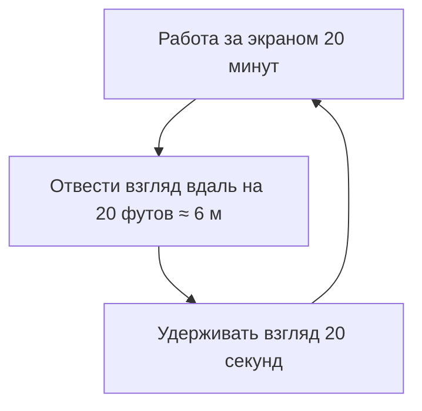

---
tags:
  - all
  - required
  - beginner
title: Эргономика рабочего места
description: Организация рабочего пространства для предотвращения усталости и травм.
---

# Эргономика рабочего места

  ОБЯЗАТЕЛЬНО
  ДЛЯ НОВИЧКОВ

Всем

---

## Эргономика

**Эргономика** - целая наука, которая изучает, как сделать взаимодействие человека с окружающей средой максимально комфортным, безопасным и эффективным. И она применима к рабочему месту — это крайне важно. Если в устройстве и операционной системе порядок, то важно не забывать и о себе, расставив компоненты и выбрав позицию поудобнее. Применительно к работе с компьютером эргономика помогает предотвратить усталость, снижение производительности и даже серьёзные проблемы со здоровьем, такие как боли в спине, запястьях или ухудшение зрения.

Если коротко:
- монитор на уровне глаз;
- использовать второй монитор;
- использовать хорошую и удобную клавиатуру;
- подобрать стул с поддержкой поясницы (эргономичный офисный или качественное игровое кресло с регулировками — не "диван на колёсиках");
- давать отдыхать глазам.

---

## Расстановка компонентов

Первый шаг к комфортной работе — это правильная расстановка компонентов рабочего места. 

> Комфорт — это состояние удобства и безопасности, при котором внешние факторы не отвлекают от работы и не вызывают усталости.

> Расстановка — это упорядоченное размещение предметов в пространстве для максимально эффективного и безопасного использования.

> Рабочее место — это закрепленная за сотрудником зона, оснащенная необходимыми техническими средствами для выполнения обязанностей.

Даже на новом рабочем месте, как правило, на вас никто не давит, не заставляет сидеть именно определённым образом, на определённом расстоянии и смотреть под определённым углом. Здесь **всё в ваших руках**, не ограничивается трудовыми соглашениями.

Самостоятельно:
- организуйте своё рабочее место;
- подвиньте монитор, поверните как удобно;
- попросите второй монитор, если есть возможность;
- попросите хорошую клавиатуру, а если нет возможности - купите себе свою, хорошую;
- попросите хорошую мышь, и тоже купите, если нет возможности - аналогично обеспечьте себе хорошие наушники, микрофон, и прочую периферию;
- расположите руки так, как вам удобно - лично я предпочитаю, чтобы рука лежала на столе полностью, до локтя;
- проведите провода аккуратно, чтобы не задевать их, и чтобы они не мешали работе;
- убедитесь, что кресло позволяет вам сидеть удобно, свободно вставать с него и садиться.

Это важнее, чем кажется - ведь офисная работа предполагает огромное количество времени в сидячем положении.

Можете использовать стильные подушки для сидения, подставки, и прочие эргономические примочки - организм скажет большое "спасибо".

---

### Мониторы

> Монитор — это устройство вывода информации, которое преобразует видеосигнал от компьютера в визуальное изображение на экране.

Монитор должен находиться на уровне глаз, чтобы вам не приходилось наклонять голову вверх или вниз. Верхний край экрана должен быть чуть ниже уровня глаз, а расстояние до монитора - около 50-70 см. Это поможет снизить нагрузку на шею и глаза. Если вы используете ноутбук, поднимите его на подставку и подключите внешнюю клавиатуру, чтобы сохранить правильную осанку. 

Важный момент - второй монитор значительно ускоряет работу, позволяя распределять окна. Руководителям важно не игнорировать этот момент - особенно для монотонных действий. Разработчики, аналитики, и даже простые офисные работники - производительность всегда увеличивается при наличии второго монитора.

Второй монитор повышает эффективность работы в среднем на 20–40%, так как он кардинально увеличивает полезную площадь цифрового рабочего пространства и избавляет от необходимости постоянно переключаться между вкладками:
- Меньше переключений: нет нужды постоянно нажимать Alt+Tab для смены окон.
- Параллельная работа: можно открыть документ на одном экране и писать отчет на другом.
- Быстрый перенос данных: копирование текста, кода или файлов происходит простым перетаскиванием мыши.
- Непрерывный контроль: удобно держать открытыми рабочие чаты, почту или мониторинги на вспомогательном дисплее.
- Снижение когнитивной нагрузки: мозг тратит меньше ресурсов на запоминание информации при переходе между окнами.

Вы можете расположить код на одном экране, документацию на другом, инструменты на одном, вывод результата на другом, таблицы и базы данных слева, а браузер с почтой справа.

И самое удобное - вы можете демонстрировать собеседникам или зрителям на презентации один экран, а на втором делать "закулисье".

---

### Клавиатура и мышь

Клавиатура и мышь — это основные устройства ввода, с помощью которых человек управляет компьютером, вводит текст и отдает команды операционной системе. Их правильный выбор и расположение напрямую влияют на скорость работы и здоровье ваших кистей, предплечий и шеи.

Есть зона комфорта, и она индивидуальна - оба устройства должны лежать на уровне локтей, чтобы руки были согнуты под углом около 90 градусов, а правильный хват мыши и опора для запястий предотвращают защемление нервов в кисти. Клавиатура должна располагаться так, чтобы ваши запястья находились в естественном положении.

Использование эргономичных моделей и горячих клавиш сокращает лишние движения руками на 30%. Эргономичные клавиатуры часто разделены на две части (split) или изогнутые, чтобы кисти находились в естественном положении (я пользуюсь изогнутой).

Мыши тоже важно выбирать удобные - если вы много работаете с графикой или текстами, стоит рассмотреть эргономичные модели с оптимальной формой и кнопками. Это важно - если проигнорировать клавиатуру и мышь, можно заработать проблемы с запястьями - к примеру, туннельный синдром запястья, при котором есть боль, онемение и покалывание в пальцах, а также слабость мышц кисти.

Беспроводные комплекты избавляют рабочий стол от лишних проводов и позволяют свободно менять угол расположения устройств.

---

### Стул и стол

Удобство кресла зависит не от маркетинговой категории ("геймерское" / "офисное"), а от регулировок — высота сиденья, поддержка поясницы, глубина сиденья, подлокотники. Дешёвые модели без настройки быстро утомляют спину. Важно, чтобы ноги стояли на полу или подставке, а спина была прямой, желательно с прогибом в пояснице (можно подложить специальные подушки). Рабочий стол должен быть достаточно просторным, чтобы все необходимые устройства (монитор, клавиатура, мышь, блокноты) располагались в зоне досягаемости.

Стол и стул — это базовый фундамент рабочего места, который формирует осанку, отвечает за кровообращение и определяет, сколько часов вы сможете проработать без боли в теле. 

Геймерские кресла часто оказываются плохим выбором для долгой работы, так как их дизайн скопирован с гоночных автомобильных сидений (ковшей), задача которых — удерживать пилота на крутых поворотах, а не поддерживать позвоночник в статичном положении за столом. Есть несколько причин:
- вогнутая форма «ковша» сжимает плечи внутрь, заставляя человека сутулиться.
- экокожа (полиуретан) в недорогих моделях не дышит, из-за чего тело быстро потеет.
- вместо регулируемого изгиба используются обычные подушки на ремнях, которые постоянно сползают.
- боковая поддержка бедер и плеч жестко фиксирует тело, не позволяя менять позы в течение дня.
- высокая цена обусловлена ярким дизайном, брендингом и спонсорством, а не качеством механизмов.

Важно учитывать вес. Например, я вешу примерно 115 килограмм, и обычное офисное кресло с максимумом веса 100 кг меня попросту не выдерживает. Это критично, для выбора газлифта кресла и высоты стола - существуют модели с регулировкой высоты. Есть ортопедическая модель с сетчатой спинкой, синхромеханизмом (когда спинка и сиденье отклоняются пропорционально) и обязательной регулировкой глубины сиденья.

---

### Длительная работа

Помню, в начале 2000-х старшее поколение активно критиковало младшее за постоянное времяпровождение с компьютером, но реальность подшутила - и теперь они проводят с ним больше времени, чем молодёжь.

Длительная работа за компьютером - то, чего айтишнику не избежать. Даже если врачи советуют не сидеть долго за экраном монитора — это наш хлеб, и есть способы адаптироваться. Чтобы избежать физического и умственного переутомления, важно соблюдать специальный режим работы и отдыха.

Правило 20-20-20 заключается в том, чтобы каждые 20 минут отводить взгляд на 20 футов (около 6 метров) в течение 20 секунд. Это помогает снизить напряжение глаз и предотвратить напряжение зрения.

Раз в час нужно вставать с места, делать несколько шагов или выполнять лёгкую разминку. Это улучшит кровообращение и снизит риск застоя в мышцах. Простые упражнения для шеи, плеч и спины помогут снять напряжение.

Микропаузы (даже короткие паузы по 30-60 секунд), если их выполнять каждые 10-15 минут, существенно повысят продуктивность и уменьшат усталость.

---

### Забота о глазах

> Забота о глазах при работе за компьютером — это комплекс мер, направленный на предотвращение компьютерного зрительного синдрома (сухости, жжения, покраснения и снижения остроты зрения).

Глаза - один из самых уязвимых органов при работе за компьютером. Убедитесь, что ваше рабочее место хорошо освещено, но без ярких бликов на экране. 

Естественный свет - лучший вариант, но если он недоступен, используйте мягкое искусственное освещение. Настройте яркость монитора так, чтобы она соответствовала окружающему освещению. Избегайте слишком тусклого или слишком яркого экрана. 

Также полезно использовать режим "Ночной свет" или аналогичные функции, которые снижают уровень синего света. Если вы много времени проводите за компьютером, возможно, вам стоит рассмотреть специальные очки с антибликовым покрытием или защитой от синего света. Не цвета, а света. Синий свет крайне негативно влияет на наши глаза.

Ещё советую использовать хорошие увлажняющие капли без консервантов при первых признаках сухости, и поддерживать влажность в рабочей зоне на уровне 40–60%, чтобы слеза не испарялась мгновенно.

---

### Комфорт решает

Комфорт — это важная часть эргономики. Иногда даже небольшие изменения в оборудовании могут значительно улучшить опыт взаимодействия - подставки для запястья, для ног, вертикальная мышь. И эргономика касается не только физического состояния, но и психоэмоционального комфорта. Хаотичный рабочий стол может вызывать стресс, поэтому нужно убирать лишние предметы, использовать органайзеры для канцелярии и кабелей. Окружающие цвета могут влиять на ваше настроение и концентрацию, например мягкие оттенки зеленого и синего способствуют расслаблению, а яркие цвета могут стимулировать активность. Если вы работаете в шумной обстановке, используйте наушники с белым шумом или спокойной музыкой. Это поможет сосредоточиться и снизить уровень стресса.

---
