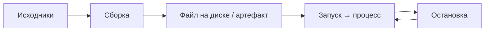

---
tags:
  - all
  - required
  - beginner
title: Запуск и перезапуск приложений
description: >-
  Как запускать exe, проекты из IDE, утилиты в терминале, dev-сервер, службы и
  Docker — и чем отличаются сборка, старт, перезапуск и hot reload.
related:
  - title: Исполняемые файлы
    doc: encyclopedia/1-basics/1-20-ispolnyaemye-fayly-i-arhivy/1
  - title: Что такое программа?
    doc: encyclopedia/1-basics/1-19-programma/1
  - title: Терминал — о разделе
    doc: encyclopedia/2-system-network/2-05-terminal/intro
  - title: Компиляторы и интерпретаторы
    doc: encyclopedia/1-basics/1-19-programma/2
  - title: Справочник по Docker
    doc: encyclopedia/8-infra-security/8-06-konteynerizatsiya-i-orkestratsiya/2
  - title: Dockerfile — 10 типовых образов
    doc: lab/examples/11113
  - title: 'Процесс, приложение и служба'
    doc: /encyclopedia/1-basics/1-035-bazovaya-informatika/301
---

import ExternalPlayEmbed from '@site/src/components/ExternalPlayEmbed';


# Запуск и перезапуск приложений

<div class="article-tags">
  <span class="tag tag-required">ОБЯЗАТЕЛЬНО</span>
  <span class="tag tag-beginner">ДЛЯ НОВИЧКОВ</span>
</div>

<span class="complexity-badge">Всем</span>

## Что такое приложение, запуск, закрытие и перезапуск

### Основные понятия

Любое приложение — это программа, но не каждая программа является приложением.

> Приложение (от англ. application или app) — это конкретный вид программы, созданный для того, чтобы пользователь мог выполнять свои задачи напрямую (например, общаться, играть или монтировать видео).

Программы бывают системными и прикладными. Системные программы управляют «железом» компьютера (драйверы, антивирусы, утилиты очистки диска). Прикладные программы — это и есть приложения.

Приложение создано исключительно для конечного пользователя, имеет понятный визуальный интерфейс, запускается и используется пользователем вручную по его желанию. Например, Telegram, Сбербанк Онлайн, Photoshop, игры. Приложения зависят от операционной системы. Название «приложение» пошло от того, что этот софт «прикладывается» к готовой операционной системе (Windows, iOS, Android) и использует её ресурсы, базы данных и функции для работы.

> Запуск (или открытие) приложения — это процесс, при котором операционная система считывает файлы приложения с диска, загружает их в оперативную память и выводит интерфейс на экран для работы пользователя.

При обычном запуске:
- выполняется команда пользователя (вы кликаете по иконке);
- загружаются данные (система копирует код приложения из медленной постоянной памяти (SSD/HDD) в быструю оперативную память (ОЗУ));
- выделяются ресурсы (процессор и видеокарта начинают обрабатывать задачи приложения);
- стартует интерфейс (на экране появляется окно программы или главный экран приложения).

Когда вы нажимаете на «крестик» на ПК или смахиваете приложение вверх на смартфоне, происходит закрытие.

> Закрытие приложения — это прекращение работы с его интерфейсом пользователем, а остановка — это принудительное завершение всех его процессов самой операционной системой.

Главная разница заключается в том, продолжает ли программа использовать ресурсы устройства (память и батарею) после того, как исчезла с экрана. 

Остановка (или «убить процесс») — это жесткое и полное удаление всех данных приложения из оперативной памяти устройства. Выполняется вручную через настройки смартфона, «Диспетчер задач» на Windows или функцию «Завершить принудительно» на Mac, при этом система мгновенно обрывает все операции приложения.

> Перезапуск — это процесс полного закрытия работающего приложения и его немедленного повторного запуска с нуля.

При перезапуске система сначала полностью выгружает приложение из оперативной памяти (сбрасывая все временные процессы), а затем запускает его заново. На смартфонах (iOS/Android) приложение уходит в фоновый режим. Оно «засыпает», сохраняя свое состояние, чтобы вы могли быстро вернуться к работе. Батарея и процессор при этом почти не расходуются. На компьютерах (Windows/macOS) большинство программ при закрытии окна полностью прекращают работу. Однако некоторые (например, Telegram, Skype или антивирусы) просто сворачиваются в системный трей (возле часов) и продолжают работать в фоне.

Перед первым запуском IDE, Node или Python их обычно **устанавливают** через такой мастер (потом — Run, `npm run dev` или двойной клик по `.exe`):

<ExternalPlayEmbed example="basics/installer-wizard-play" title="Мастер установки" minHeight={480} playProps={{ appName: 'Установка среды разработки', productName: 'Учебное приложение', welcomeText: 'Сначала установщик копирует файлы и настраивает систему — только потом вы запускаете проект из IDE или терминала.', cardSubtitle: 'Установка ≠ запуск: после "Готово" см. сценарии ниже в статье' }} />


| Термин | Суть | Когда слышите |
|--------|------|----------------|
| **Сборка** (*build*) | Превращение исходников в артефакт (`.exe`, `.jar`, папка `dist/`) | "Собери проект", `npm run build`, Build в IDE |
| **Запуск** (*run*, *start*) | ОС или среда создаёт **процесс** из готового файла или команды | Двойной клик, `Run`, `node app.js` |
| **Старт** | То же, что запуск; часто про **службу** или **сервер**, который "поднялся" и слушает порт | "Сервер стартовал на :3000" |
| **Остановка** (*stop*) | Процесс завершается, порт освобождается | Закрыть окно терминала, `docker stop`, Stop в IDE |
| **Перезапуск** (*restart*) | Stop, затем снова run (иногда с новой сборкой) | После смены конфига, "перезапусти nginx" |
| **Hot reload** | Часть кода подхватывается **без полного** перезапуска процесса | Vite, `dotnet watch`, dev-сервер фронта |
| **Отладка** (*debug*) | Запуск **с** остановками на строках, просмотром переменных | F5 в Visual Studio, Debug в IDE |

**Сборка** может идти **без** запуска (получили файл на диске). **Запуск** может идти **без** сборки (готовый `.exe` или интерпретатор читает `.py`). В IDE кнопка **Run** часто делает **оба шага подряд** — отсюда путаница.



Часто крупная программа (например, игра или Photoshop) — это не просто один `.exe` файл, а целая папка. В ней файл `.exe` выполняет роль главного диспетчера, а рядом с ним лежат:
- .dll файлы — библиотеки (кусочки кода, которые .exe вызывает по мере необходимости)
- Папки с графикой, звуками и текстами
- Файлы настроек

Рассмотрим некоторые сценарии.

---

### Готовая программа — файл `.exe` (и аналоги)

Готовая к запуску программа для пользователя чаще всего представляет собой один или несколько исполняемых файлов, главным из которых на Windows является файл с расширением `.exe`. Буквы `exe` — это сокращение от английского `executable` (исполняемый). Когда вы кликаете по такому файлу, операционная система понимает, что внутри находится зашифрованный машинный код, который нужно передать процессору на выполнение.

В зависимости от операционной системы и типа устройства, форматы таких «готовых программ» (пакетов) бывают разными:
- на компьютерах Apple (macOS) - `.app`, `.dmg`;
- на смартфонах Android - `.apk`, `.apks`;
- на iPhone (iOS) - `.ipa`;
- на компьютерах с Linux - `.deb`, `.rpm`, `.AppImage`.

**Сценарий.** Программа уже собрана; на диске лежит [исполняемый файл](/encyclopedia/1-basics/1-20-ispolnyaemye-fayly-i-arhivy/1).

| Шаг | Действие |
|-----|----------|
| 1 | Найти файл (Проводник, ярлык на рабочем столе) |
| 2 | Двойной щелчок или Enter |
| 3 | ОС создаёт процесс; появляется окно или иконка в трее |

**Остановка** — закрыть окно, "Выход" в меню или завершить процесс в [Диспетчере задач](/encyclopedia/1-basics/1-035-bazovaya-informatika/301) (`Ctrl + Shift + Esc`).

**Перезапуск** — закрыть программу и запустить снова. Пересборка не нужна, пока вы не скачали новую версию установщика.

<div class="callout callout--warning">
  <div class="callout-title">Безопасность</div>

  <div class="callout-body">
  Неизвестные <code>.exe</code> с торрентов и "кряков" — риск. Источники и проверка — в <a href="/encyclopedia/1-basics/1-035-bazovaya-informatika/201">советах для начинающего пользователя ПК</a>.
</div>
  </div>


---

### Проект из IDE — Run и Debug

**Сценарий.** Вы учитесь программировать; код в папке проекта, среда — Visual Studio, VS Code, IntelliJ IDEA, PyCharm и т.п.

| Шаг | Действие |
|-----|----------|
| 1 | Открыть **решение** или **папку проекта** (тот каталог, где `package.json`, `.sln`, `pom.xml`) |
| 2 | Выбрать **стартовый проект** (если их несколько) |
| 3 | **Run** (Выполнить) — зелёный треугольник или `Ctrl + F5` / Shift+F10 (зависит от IDE) |

IDE обычно:

- вызывает **сборку** (компилятор, `npm`, `gradle`, `mvn`);
- при ошибках сборки **процесс не стартует** — смотрите панель "Ошибки" / "Problems";
- при успехе **запускает** программу (консольное окно, окно приложения, встроенный браузер).

**Debug** — тот же путь, но с точками остановки (breakpoint); процесс идёт по шагам.

**Перезапуск после правки кода**

- с **hot reload** — сохранили файл, среда сама обновила часть (типично веб-фронт);
- без hot reload — снова **Stop**, затем **Run** (или "Перезапустить" в панели отладки).

Подробнее про компиляцию и интерпретацию — [Компиляторы и интерпретаторы](/encyclopedia/1-basics/1-19-programma/2).

---

### Утилита из терминала — `имя -аргументы`

**Сценарий.** Одноразовая или регулярная команда — `git status`, `python --version`, `7z x archive.zip`.

| Шаг | Действие |
|-----|----------|
| 1 | Открыть терминал в нужной папке (ПКМ по папке → "Открыть в терминале", или `cd` в уже открытом окне) |
| 2 | Убедиться, что утилита в [PATH](/encyclopedia/1-basics/1-19-programma/113#пример-запуск-python) |
| 3 | Ввести команду и Enter |

**Примеры**

```powershell
cd C:\Projects\my-app
git status
```

```powershell
python --version
python main.py --help
```

```bash
cd ~/projects/my-app
ls -la
./script.sh --dry-run
```

Оболочка разбирает строку и **запускает отдельный процесс** утилиты; когда команда закончилась, в приглашении снова можно вводить следующую.

**Остановка** длинной команды — `Ctrl + C` в том же окне терминала.

База по терминалу — [Что такое терминал](/encyclopedia/2-system-network/2-05-terminal/1); знаки `|`, `&&` — [Знаки в командной строке](/encyclopedia/2-system-network/2-05-terminal/11).

---

### Локальный dev-сервер — окно терминала не закрывать

**Сценарий.** Учебный веб-проект, API на Node/Python, фронт на Vite — в инструкции пишут `npm run dev`, `uvicorn`, `dotnet run`.

| Шаг | Действие |
|-----|----------|
| 1 | Открыть терминал в **корне проекта** (где лежит `package.json` или README с командой) |
| 2 | Выполнить команду из документации, например `npm run dev` или `npm start` |
| 3 | Дождаться сообщения вроде `ready`, `listening on http://localhost:5173` |
| 4 | **Не закрывать** это окно — свернуть или отодвинуть; сервер живёт, пока работает процесс |
| 5 | Открыть **браузер**, вставить URL из вывода терминала (или из README) |
| 6 | Работать в браузере — это **веб-интерфейс** приложения; терминал — "двигатель" сзади |

**Остановка** — в том же терминале `Ctrl + C`, дождаться возврата приглашения (`PS C:\...>` или `$`).

**Перезапуск** — снова выполнить ту же команду (`npm run dev`). Если меняли зависимости (`package.json`) — иногда сначала `npm install`.

**Типичная ошибка** — закрыть крестиком окно терминала: сервер исчезает, в браузере "не удаётся подключиться".

**Порт занят** (`EADDRINUSE`, второй `npm run dev`) — готовые команды — [CLI — порты, процессы, dev-сервер](/lab/Примеры/1156).

Первая программа на Node с `npm run` — [Первая программа на Node.js](/encyclopedia/5-languages/5-01-javascript/262); фронт и бэкенд в целом — [Frontend и backend](/encyclopedia/1-basics/1-23-frontend-i-bekend/intro).

---

### Служба Windows или демон Linux

**Сценарий.** Программа работает **в фоне** без окна — печать, PostgreSQL, nginx, агент мониторинга.

| Платформа | Запуск / статус | Остановка / перезапуск |
|-----------|-----------------|-------------------------|
| **Windows** | `services.msc`, PowerShell `Start-Service` | `Stop-Service`, `Restart-Service` |
| **Linux** | `systemctl start имя` | `systemctl stop`, `systemctl restart` |

Служба стартует при загрузке ОС или по команде администратора; пользовательский "двойной клик" тут обычно не используется.

Классификация — [утилиты, модули, службы](/encyclopedia/1-basics/1-19-programma/112); сравнение приложения и службы — [Софт рядового пользователя](/encyclopedia/1-basics/1-035-bazovaya-informatika/301) (таблица "Процесс, приложение и служба").

---

### Docker-контейнер

**Сценарий.** Учебник предлагает поднять БД или веб в контейнере.

| Шаг | Действие |
|-----|----------|
| 1 | **Windows/macOS** — запустить **Docker Desktop** и дождаться статуса "running" (работает демон `dockerd`) |
| 2 | В терминале — `docker run ...` или `docker compose up` из папки с `docker-compose.yml` |
| 3 | Проверить вывод (`Listening`, `Started`) и порты (`-p 8080:80`) |
| 4 | Открыть браузер на `http://localhost:8080` (порт из команды) |

**Остановка**

- один контейнер — `docker stop <имя_или_id>`;
- compose-проект — `docker compose down` в той же папке.

**Перезапуск**

- `docker start` для существующего контейнера;
- или снова `docker run` / `docker compose up` (часто с пересборкой `docker compose up --build`).

Справочник команд — [Docker](/encyclopedia/8-infra-security/8-06-konteynerizatsiya-i-orkestratsiya/2); готовые Dockerfile (Node, Python, Go…) — [Dockerfile — 10 типовых образов](/lab/Примеры/11113); готовые `compose.yaml` (nginx, Postgres, WordPress, Prometheus) — [Docker Compose — готовые стеки](/lab/Примеры/11111); PromQL после стека мониторинга — [Prometheus + Grafana — запросы](/lab/Примеры/11114); опасные флаги — [Опасные скрипты](/encyclopedia/8-infra-security/8-03-zabota-o-kode-i-dannyh/101).

---