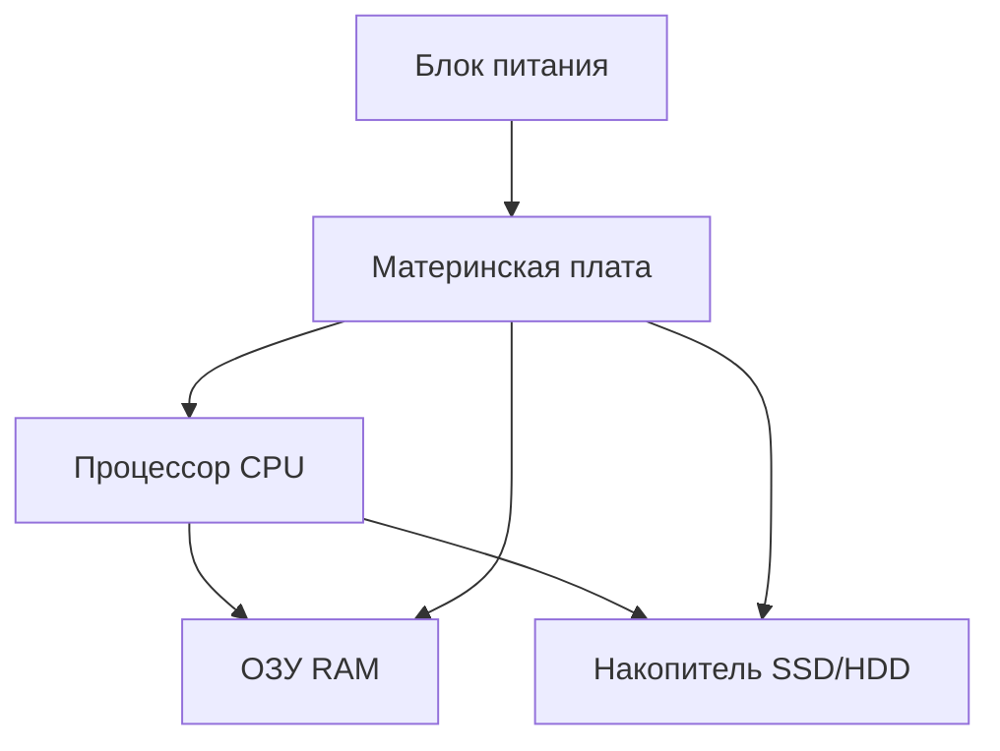

---
tags:
  - all
  - required
  - beginner
  - inprogress
title: Компьютер, периферия и сетевое оборудование
description: >-
  Устройство ПК простыми словами — процессор, память, диски, ввод-вывод и сеть —
  с пояснением терминов и маршрутом по энциклопедии.
---

import ComputerArchitecturePlay from '@site/src/components/ComputerArchitecturePlay';
import IoDevicesPlay from '@site/src/components/IoDevicesPlay';

# Компьютер, периферия и сетевое оборудование

  ОБЯЗАТЕЛЬНО
  ДЛЯ НОВИЧКОВ
  В РАЗРАБОТКЕ

Всем

**Компьютер** в бытовом смысле — это системный блок (или ноутбук "всё в одном"), монитор, клавиатура, мышь и то, что вы к нему подключаете. Внутри работает простая схема — **ввод** → **обработка** → **вывод**. Программа и операционная система говорят железу, *что* именно обрабатывать.

---

## Рамка темы — от "железа как коробки" к "железу как системе"

Большинство людей называет "процессором" весь системный блок и воспринимает компьютер как монолитное устройство. Для школьного курса этого часто "хватает", но для реального понимания проблем и задач — недостаточно. Эта глава нужна, чтобы разложить устройство компьютера на роли и связи между компонентами.

Ключевая мысль здесь инженерная — ни один элемент не существует сам по себе. Процессор бесполезен без памяти, память — без системной платы и контроллеров, накопитель — без файловой системы, периферия — без драйверов. Как только вы начинаете видеть связи, диагностика типовых проблем становится последовательной и обоснованной.

Мы рассмотрим ровно тот уровень детализации, который нужен новичку и школьнику для уверенного ориентирования — что за что отвечает, какие ошибки относятся к "железу", какие — к драйверам/ОС, и как не путать роль компонентов при изучении следующих глав.

Но технически, это программируемое электронное устройство, предназначенное для обработки, хранения и передачи данных. 

Главный раздел по устройству — [Как работает компьютер](/encyclopedia/1-basics/1-08-kak-rabotaet-kompyuter/intro). 

Здесь — очень краткие объяснения для школьного курса, что за что отвечает, какие слова встретите в учебнике и куда идти за деталями.

Нет, ну наверняка вы уже знаете, что такое компьютер, не так ли? Это какая-то вычислительная машина, будь то телефон, ноутбук или персональный компьютер.

---

## Три слова, которые должны сложиться

| Термин | Одной фразой |
|--------|--------------|
| **CPU (процессор)** | "Мозг" — выполняет команды программ |
| **ОЗУ (RAM)** | "Стол" — здесь лежит то, с чем программа работает **прямо сейчас** |
| **Накопитель (HDD/SSD)** | "Шкаф" — файлы остаются **после выключения** |

★ **ОЗУ** очищается при отключении питания. Если вы написали текст в Word и **не сохранили**, он мог остаться только в ОЗУ — после сбоя пропадёт. **Сохранить** — значит записать на диск.

А теперь вопрос. Вы же понимаете, что такое ОЗУ, ЦП, диск? Если нет - вам по следующему маршруту.

---

## Рекомендуемый маршрут по энциклопедии

Для первого прохода —

1. [Принцип работы](/encyclopedia/1-basics/1-08-kak-rabotaet-kompyuter/1) — общая схема ввода–обработки–вывода.
2. [Архитектура "кабинета"](/encyclopedia/1-basics/1-08-kak-rabotaet-kompyuter/7) — наглядная модель.
3. [Компоненты](/encyclopedia/1-basics/1-08-kak-rabotaet-kompyuter/2) — CPU, плата, ОЗУ.
4. [Накопители](/encyclopedia/1-basics/1-08-kak-rabotaet-kompyuter/3) — HDD, SSD, разделы.
5. [Периферия](/encyclopedia/1-basics/1-08-kak-rabotaet-kompyuter/5) — клавиатура, монитор, сеть.
6. По желанию — [Видеокарта](/encyclopedia/1-basics/1-08-kak-rabotaet-kompyuter/4), [Загрузка](/encyclopedia/1-basics/1-08-kak-rabotaet-kompyuter/6).

Глубокая теория (кэш, ISA, NUMA) — в [ЭВМ](/encyclopedia/1-basics/1-08-kak-rabotaet-kompyuter/8); для базового курса можно отложить.

---

## Что внутри системного блока

**Системный блок** — корпус с платой, процессором, памятью, диском и блоком питания. Ноутбук прячет то же самое в один корпус.

> Запомните — большая коробка с вентиляторами, в которую всё подключается, — это **системный блок**. Именно его в быту часто называют "компьютером".

| Компонент | Назначение | Где подробнее |
|-----------|------------|---------------|
| **CPU** | Команды программ | [1-08/2](/encyclopedia/1-basics/1-08-kak-rabotaet-kompyuter/2) |
| **Чипсет** | Связь CPU с остальным | [1-08/2](/encyclopedia/1-basics/1-08-kak-rabotaet-kompyuter/2) |
| **Материнская плата** | Основа сборки | [1-08/2](/encyclopedia/1-basics/1-08-kak-rabotaet-kompyuter/2) |
| **ОЗУ** | Рабочие данные "здесь и сейчас" | [1-08/2](/encyclopedia/1-basics/1-08-kak-rabotaet-kompyuter/2) |
| **Накопитель** | Файлы после выключения | [1-08/3](/encyclopedia/1-basics/1-08-kak-rabotaet-kompyuter/3) |
| **Блок питания** | Питание | [1-08/5](/encyclopedia/1-basics/1-08-kak-rabotaet-kompyuter/5) |
| **GPU** | Изображение, ускорение 3D | [1-08/4](/encyclopedia/1-basics/1-08-kak-rabotaet-kompyuter/4) |

---

### Интерактив — архитектура ПК

Проследите путь команды — CPU -> память -> накопитель -> вывод. Так легче связать таблицу компонентов с реальным исполнением задачи.

<ComputerArchitecturePlay />

После интерактива проверьте себя — можете ли вы на бытовом примере (например, "открыть фото") назвать, какие узлы участвуют и в каком порядке.

---

### Процессор (CPU)

А тогда что такое процессор?

Это главный работяга в компьютере, именно он всё выполняет, считает, рисует, воспроизводит, кодирует, декодирует, двигает, останавливает и запускает.

Процессор выполняет **миллиарды простых операций в секунду**, и это сложение, сравнение, переход к другой строке программы. Одна "тяжёлая" задача (игра, монтаж видео) нагружает CPU сильнее, чем набор текста.

Процессор может быть центральным и графическим. Графический находится в видеокарте, поэтому в основном, когда говорят "процессор", имеют в виду именно центральный процессор.

★ **Ядро** — независимая вычислительная часть внутри одного процессора. "Четырёхъядерный" CPU может параллельно вести несколько потоков работы (с помощью ОС). Когда ядер несколько, процессор многоядерный.

---

### Материнская плата и чипсет

**Материнская плата** — большая плата, на которой сидят процессор, слоты ОЗУ, разъёмы для дисков и USB.

**Чипсет** — набор микросхем, который **связывает** CPU с памятью, видеокартой, дисками и портами. Без него процессор "не достанет" до периферии по единым правилам.

Оставшийся чипсет (PCH/"южный мост") отвечает за SATA, USB, аудио, сетевые порты и низкоуровневые шины.

На практике плата определяет, **что вообще можно установить** в ПК — какой сокет процессора поддерживается, какой тип памяти нужен (DDR4/DDR5), сколько есть M.2-слотов под SSD, сколько PCIe-слотов для плат расширения.

Ещё на плате находится **прошивка BIOS/UEFI**. Она запускается до ОС, проверяет железо и передаёт управление загрузчику системы. Если после сборки ПК "не стартует", часто проверяют совместимость CPU и версию BIOS.

---

### ОЗУ (оперативная память)

Быстрая память для **открытых** программ и их данных. Чем больше вкладок в браузере и чем тяжелее редактор — тем больше занято ОЗУ. Если ОЗУ заканчивается, ОС начинает подгружать часть данных с диска — компьютер **тормозит**.

ОЗУ работает как рабочий стол — пока программа запущена, её код и данные лежат здесь. После выключения питания содержимое ОЗУ исчезает, поэтому важные изменения надо сохранять на накопитель.

Типичные симптомы нехватки памяти — долгое переключение между окнами, "подвисания" при открытии новых вкладок, постоянная загрузка диска даже без тяжёлых задач.

Для базового бытового сценария сегодня обычно комфортно от 8 ГБ, для одновременной работы браузера, IDE, мессенджеров и видеосвязи чаще выбирают 16 ГБ и выше.

---

### Блок питания

Преобразует ток из розетки (220 В) в напряжения для плат и вентиляторов. Мощность (Вт) должна хватать на видеокарту и процессор — иначе ПК выключается под нагрузкой.

Важно не только "сколько ватт написано", но и **качество стабилизации напряжения**. Хороший блок питания снижает риск случайных перезагрузок, ошибок на диске и преждевременного износа компонентов.

Ориентируются на запас мощности — если система в пике потребляет условно 400 Вт, блок часто берут на 550-650 Вт, чтобы он не работал постоянно на пределе.

Сертификаты эффективности (например, 80 PLUS Bronze/Gold) не гарантируют идеальное качество сами по себе, но обычно указывают на более современную и экономичную платформу.

---

### Видеоадаптер (GPU)

Рисует картинку на мониторе. Может быть **встроенным** в процессор или **отдельной видеокартой**. Игры, 3D и нейросети сильно зависят от GPU; для офиса часто хватает встроенного.

GPU отлично справляется с массовыми параллельными вычислениями — одновременно обрабатывает множество пикселей и однотипных операций. Поэтому он важен не только в играх, но и в 3D-рендере, монтаже видео и задачах машинного обучения.

У дискретной видеокарты есть собственная память (VRAM). Чем выше разрешение текстур и сложнее сцена, тем больше VRAM требуется. При её нехватке производительность проседает даже при мощном графическом процессоре.

Для офисных задач и учёбы чаще достаточно встроенной графики; отдельную видеокарту выбирают, когда нужны тяжёлые игры, профессиональные графические пакеты или GPU-ускорение вычислений.

---

## Накопители — HDD, SSD и "экзотика" из учебника

| Устройство | Как устроено | Где встречается сегодня |
|------------|--------------|-------------------------|
| **HDD** | Магнитные пластины, головка движется | Большие архивы, дешёвый объём |
| **SSD** | Флэш-память, без движущихся частей | Системный диск в ПК и ноутбуках |
| **NVMe SSD** | SSD через быструю шину PCIe | Современные ПК |
| **USB-флэш** | Флэш в корпусе | Перенос файлов |
| **Оптический дисковод** | Лазер читает CD/DVD | Редко; см. [главу про ОС](/encyclopedia/1-basics/1-035-bazovaya-informatika/5) |
| **Стример (ленточный)** | Магнитная лента в кассете | Резервные копии в дата-центрах |

★ **Дефрагментация** имела смысл для HDD — ускоряла чтение разбросанных по диску кусков. Для **SSD** её **не применяют** — лишний износ без выигрыша.

Подробно — [Накопители](/encyclopedia/1-basics/1-08-kak-rabotaet-kompyuter/3).

---

## Периферия — ввод и вывод

**Периферия** — всё, что снаружи системного блока (или подключается по USB, Bluetooth, Wi-Fi).

| Устройство | Ввод / вывод | Зачем нужно |
|------------|--------------|-------------|
| Клавиатура | Ввод | Текст, команды, игры |
| Мышь, трекпад | Ввод | Указатель на экране |
| Сканер | Ввод | Бумага → файл (PDF, JPG) |
| **Дигитайзер** | Ввод | Рисование пером **по экрану** (мониторы художников) |
| **Графический планшет** | Ввод | Отдельная плата + перо (Wacom и аналоги) |
| Сенсорный монитор | Ввод и вывод | Касание = координаты |
| Веб-камера | Ввод | Видео для звонков и записи |
| Микрофон | Ввод | Голос в цифровом виде |
| MIDI-клавиатура | Ввод | Ноты и команды для музыкальных программ |
| Монитор | Вывод | Картинка |
| Принтер | Вывод | Бумажная копия |
| **Плоттер** | Вывод | Широкоформатные чертежи, баннеры |
| **Проектор** | Вывод | Изображение на стену или экран |
| Колонки, наушники | Вывод | Звук |
| **Звуковая карта** | Ввод и вывод | Цифро-аналоговое преобразование для аудио |

Основная статья — [Периферия](/encyclopedia/1-basics/1-08-kak-rabotaet-kompyuter/5). Эргономика клавиатуры — [1-08/713](/encyclopedia/1-basics/1-08-kak-rabotaet-kompyuter/713).

---

### Интерактив — устройства ввода и вывода

Попробуйте пройти демо как инвентаризацию рабочего места — отметьте устройства ввода и устройства вывода.

<IoDevicesPlay />

Мини-вывод — разделите устройства на чистый ввод, чистый вывод и комбинированные. Если классификация даётся легко, то тема периферии уже "схлопнулась" в систему.

---

### Драйвер — зачем он нужен

★ **Драйвер** — программа, которая учит ОС **говорить с конкретной моделью** устройства (принтер HP, видеокарта NVIDIA). Без драйвера Windows может "видеть" устройство, но печатать или показывать картинку корректно.

Драйверы ставят с диска производителя, с сайта или через **Windows Update**.

Универсальный ("базовый") драйвер обычно даёт только минимальную работу устройства. Полный драйвер от производителя включает дополнительные функции — профили цвета у видеокарты, двухстороннюю печать у принтера, расширенные настройки сети у адаптера.

Неверный или устаревший драйвер часто проявляется как странные ошибки — мерцание экрана, отвал Wi-Fi, "синий экран", пропадание звука, низкая скорость устройства.

Практическое правило — для обычного ПК сначала ставят обновления ОС, затем при необходимости обновляют драйверы ключевых устройств (чипсет, видеокарта, сеть) с официальных источников.

---

## Сетевое оборудование дома и в классе

Даже один ПК "в интернете" опирается на цепочку устройств —

| Устройство | Роль простыми словами |
|------------|------------------------|
| **Сетевой адаптер (NIC)** | "Сетевая карта" ПК — провод Ethernet или Wi-Fi |
| **Коммутатор (switch)** | Раздаёт трафик между устройствами в **локальной** сети (кабинет, офис) |
| **Маршрутизатор (router)** | Соединяет **домашнюю сеть** с **интернетом**, раздаёт IP-адреса |
| **Модем** | Переводит сигнал **провайдера** (оптика, DSL, кабель) в сигнал для роутера |
| **Точка доступа Wi-Fi** | Беспроводной вход в LAN (часто встроена в домашний роутер) |

Дома обычно один **роутер** совмещает Wi-Fi, раздачу адресов (DHCP) и выход в интернет.

Полезно различать роли устройств —
- **Switch** работает внутри локальной сети и не "выводит в интернет" сам по себе.
- **Router** соединяет разные сети и решает, куда отправить пакет дальше.
- **Modem** нужен там, где сигнал провайдера приходит в специальном физическом формате (например, кабель или DSL).

Скорость и стабильность дома зависят не только от тарифа, но и от размещения роутера, загруженности радиоканала, качества кабеля и числа одновременно активных устройств.

В школьном кабинете и офисе часто используют схему — один маршрутизатор на выход в интернет + несколько коммутаторов по этажам + отдельные точки доступа для равномерного Wi-Fi-покрытия.

Подробнее — [Сетевые устройства](/encyclopedia/2-system-network/2-03-set-i-internet/21), [Wi-Fi и Bluetooth](/encyclopedia/2-system-network/2-03-set-i-internet/71), [Сеть — основы](/encyclopedia/2-system-network/2-03-set-i-internet/1).

  
Самопроверка

  

  <ol>
    <li>Куда пропадёт несохранённый документ при внезапном отключении — из ОЗУ или с диска?</li>
    <li>Чем SSD принципиально отличается от HDD по конструкции?</li>
    <li>Зачем принтеру драйвер?</li>
  </ol>

  

Дальше — [ОС, файлы и утилиты](/encyclopedia/1-basics/1-035-bazovaya-informatika/5).

---
