---
tags:
  - all
  - required
  - beginner
  - inprogress
title: Компьютер, периферия и сетевое оборудование
description: >-
  Устройство ПК простыми словами — процессор, память, диски, ввод-вывод и сеть —
  с пояснением терминов и маршрутом по энциклопедии.
related:
  - title: "Кодирование, сжатие и архивация"
    doc: encyclopedia/1-basics/1-035-bazovaya-informatika/2
  - title: "Память и вычисления"
    doc: encyclopedia/1-basics/1-035-bazovaya-informatika/11
  - title: "Как работает компьютер — о разделе"
    doc: encyclopedia/1-basics/1-08-kak-rabotaet-kompyuter/intro
  - title: "ОС, файловые системы и служебные программы"
    doc: encyclopedia/1-basics/1-035-bazovaya-informatika/5
---

import ExternalPlayEmbed from '@site/src/components/ExternalPlayEmbed';

# Компьютер, периферия и сетевое оборудование

<div class="article-tags">
  <span class="tag tag-required">ОБЯЗАТЕЛЬНО</span>
  <span class="tag tag-beginner">ДЛЯ НОВИЧКОВ</span>
  <span class="tag tag-inprogress">В РАЗРАБОТКЕ</span>
</div>

<span class="complexity-badge">Всем</span>

**Компьютер** в бытовом смысле — это системный блок (или ноутбук "всё в одном"), монитор, клавиатура, мышь и то, что вы к нему подключаете. Внутри работает простая схема — **ввод** (клавиатура, мышь, сканер) → **обработка** (процессор, **CPU** — Central Processing Unit, центральный процессор) → **вывод** (монитор, принтер, колонки).

Программы и **операционная система (ОС)** — Windows, Linux, macOS — передают железу команды, *что* именно обрабатывать.

Обзор для школьного курса и самообразования — от устройства системного блока до выбора комплектующих, диагностики типичных неисправностей и выбора между ноутбуком и настольным ПК. Подробнее о цепочке "данные → железо → ОС" — в [Как работает компьютер](/encyclopedia/1-basics/1-08-kak-rabotaet-kompyuter/intro).

---

## Ключевые понятия

> **Компьютер** — электронное устройство, выполняющее операции **по программе**.  
> **ЭВМ** — комплекс аппаратных и программных средств; в школе термины обычно равнозначны.

| Понятие | Роль | Аналогия |
|---------|------|----------|
| **CPU (процессор)** | Выполняет команды программ — миллиарды простых операций в секунду | "Мозг" |
| **ОЗУ (RAM, Random Access Memory)** | Данные и код **открытых** программ; при выключении очищается | "Стол" |
| **Накопитель (HDD/SSD)** | Файлы и ОС **после** выключения; HDD — диски с пластинами, SSD — флэш-память | "Шкаф" |
| **Системная плата** | Связывает CPU, память, диски, порты | "Скелет" |
| **Периферия** | Ввод-вывод — клавиатура, монитор, принтер | "Руки и глаза" |
| **Драйвер** | Программа, через которую ОС "разговаривает" с конкретным устройством (принтер, видеокарта) | [ОС и драйверы](./5) |
| **Сетевое оборудование** | Роутер, кабель, Wi-Fi — связь машин | [Сеть](/encyclopedia/2-system-network/2-03-set-i-internet/1) |

★ **ОЗУ** очищается при отключении питания. Несохранённый текст в Word может остаться только в ОЗУ — после сбоя пропадёт.

| Слой | Примеры |
|------|---------|
| **Аппаратура** | Плата, CPU, диск, монитор |
| **ПО** | Windows, браузер, файл `.docx` |
| **Сеть** | Интернет как способ связать машины |

Подробнее — [Как работает компьютер](/encyclopedia/1-basics/1-08-kak-rabotaet-kompyuter/intro), [Аппаратное обеспечение](/encyclopedia/2-system-network/2-10-zhelezo/1), [ЭВМ](/encyclopedia/1-basics/1-08-kak-rabotaet-kompyuter/8).

---

### Цифровой и аналоговый принцип

- **Цифровая машина** оперирует **дискретными** числами и символами (0 и 1, байты). Ваш ПК, телефон, школьный компьютерный класс — цифровые системы.
- **Аналоговая вычислительная машина** представляет величины **непрерывными** физическими параметрами (напряжение, давление). Класс задач задаётся **схемой и настройкой** устройства, без файла программы на диске. В повседневной жизни встречается редко; полезно знать термин из программы ЕГЭ и истории техники.

Универсальность школьного ПК — в **хранимой программе**: одна и та же ЭВМ под разные приложения меняет софт и данные, плату перепаивать не нужно.

---

## Рекомендуемый маршрут по энциклопедии

Для первого прохода по энциклопедии удобен такой порядок.

1. [Принцип работы](/encyclopedia/1-basics/1-08-kak-rabotaet-kompyuter/1) — общая схема ввода–обработки–вывода.
2. [Многоуровневая организация](/encyclopedia/1-basics/1-08-kak-rabotaet-kompyuter/13) — уровни от железа до языков.
3. [Память и накопители](/encyclopedia/1-basics/1-08-kak-rabotaet-kompyuter/12) — RAM, ROM, SRAM, DRAM, storage.
4. [Архитектура "кабинета"](/encyclopedia/1-basics/1-08-kak-rabotaet-kompyuter/7) — наглядная модель.
5. [Компоненты](/encyclopedia/1-basics/1-08-kak-rabotaet-kompyuter/2) — CPU, плата, ОЗУ.
6. [Накопители](/encyclopedia/1-basics/1-08-kak-rabotaet-kompyuter/3) — HDD, SSD, разделы.
7. [Периферия](/encyclopedia/1-basics/1-08-kak-rabotaet-kompyuter/5) — клавиатура, монитор, сеть.
8. По желанию — [Видеокарта](/encyclopedia/1-basics/1-08-kak-rabotaet-kompyuter/4), [Загрузка](/encyclopedia/1-basics/1-08-kak-rabotaet-kompyuter/6).

Глубокая теория (кэш, ISA) — [Многоуровневая организация](/encyclopedia/1-basics/1-08-kak-rabotaet-kompyuter/13), [RISC и CISC](/encyclopedia/2-system-network/2-10-zhelezo/122); NUMA — в [ЭВМ](/encyclopedia/1-basics/1-08-kak-rabotaet-kompyuter/8); для базового курса можно отложить.

---

## Ноутбук или настольный ПК

| Критерий | Ноутбук | Настольный ПК (desktop) |
|----------|---------|-------------------------|
| **Мобильность** | Работает от батареи, легко переносить | Стационарный, нужен монитор и клавиатура |
| **Мощность за те же деньги** | Обычно слабее (ограничения по охлаждению и питанию) | Больше производительности на рубль |
| **Апгрейд** | Часто только RAM и SSD; CPU/GPU несъёмные | Почти всё заменяемо по отдельности |
| **Ремонт** | Дороже, запчасти привязаны к модели | Проще найти совместимые детали |
| **Эргономика** | Экран ниже, клавиатура компактнее | Удобнее подобрать монитор, кресло, клавиатуру |
| **Шум и тепло** | Компактный корпус — выше риск перегрева под нагрузкой | Больше места для вентиляторов и радиаторов |
| **Срок службы** | 4–7 лет типично, потом батарея и износ | 8–12+ лет при поэтапной замене компонентов |

**Когда ноутбук логичнее** — учёба, командировки, работа из кафе, когда нет места под стол с системником.

**Когда desktop логичнее** — игры, монтаж видео, 3D, программирование с тяжёлыми IDE, домашний сервер, когда важна цена за производительность и долгий срок службы.

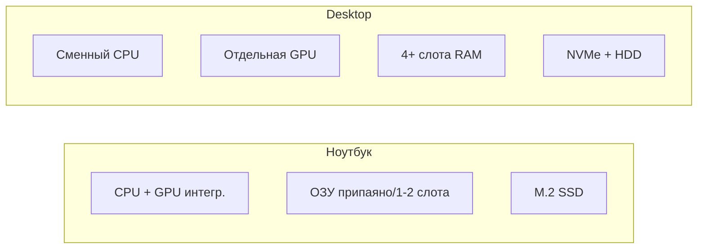

<div class="callout callout--info">
  <div class="callout-title">Моноблок и мини-ПК</div>

  <div class="callout-body">
  <strong>Моноблок</strong> — экран и "системник" в одном корпусе (как iMac). Компромисс между компактностью ноутбука и мощностью desktop, но апгрейд ограничен.<br/>
  <strong>Мини-ПК</strong> (NUC, Mac Mini) — маленький корпус, внешний монитор. Подходит для офиса и медиацентра; игровые задачи — с оговорками по охлаждению.
</div>
</div>

---

## Что внутри системного блока

**Системный блок** — корпус с платой, процессором, памятью, диском и блоком питания. Ноутбук прячет то же самое в один корпус.

> Запомните — большая коробка с вентиляторами, в которую всё подключается, — это **системный блок**. Именно его в быту часто называют "компьютером".

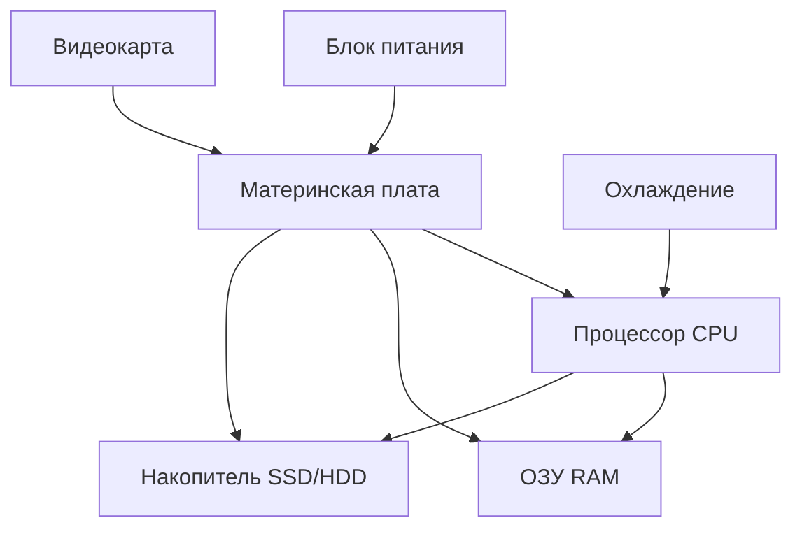

| Компонент | Назначение | Где подробнее |
|-----------|------------|---------------|
| **CPU** | Команды программ | [Компоненты ПК](/encyclopedia/1-basics/1-08-kak-rabotaet-kompyuter/2) |
| **Чипсет** | Связь CPU с остальным | [Компоненты ПК](/encyclopedia/1-basics/1-08-kak-rabotaet-kompyuter/2) |
| **Материнская плата** | Основа сборки | [Компоненты ПК](/encyclopedia/1-basics/1-08-kak-rabotaet-kompyuter/2) |
| **ОЗУ** | Рабочие данные "здесь и сейчас" | [Компоненты ПК](/encyclopedia/1-basics/1-08-kak-rabotaet-kompyuter/2) |
| **Накопитель** | Файлы после выключения | [Накопители](/encyclopedia/1-basics/1-08-kak-rabotaet-kompyuter/3) |
| **Блок питания** | Питание | [Периферия и питание](/encyclopedia/1-basics/1-08-kak-rabotaet-kompyuter/5) |
| **GPU** | Изображение, ускорение 3D | [Видеокарта](/encyclopedia/1-basics/1-08-kak-rabotaet-kompyuter/4) |

---

### Интерактив — архитектура ПК

Проследите путь команды — CPU -> память -> накопитель -> вывод. Так легче связать таблицу компонентов с реальным исполнением задачи.

<ExternalPlayEmbed example="about/computer-architecture-play" title="Computer Architecture" />

После интерактива проверьте себя — можете ли вы на бытовом примере (например, "открыть фото") назвать, какие узлы участвуют и в каком порядке.

---

### Процессор (CPU, центральный процессор)

Это главный работяга в компьютере: считает, управляет потоками данных, координирует периферию.

Процессор выполняет **миллиарды простых операций в секунду** — сложение, сравнение, переход к другой строке программы. Одна "тяжёлая" задача (игра, монтаж видео) нагружает CPU сильнее, чем набор текста.

Упрощённая **внутренняя схема** CPU (по учебной традиции и материалам Intel):

| Блок | Роль |
|------|------|
| **Блок предварительной выборки** | Подтягивает команды и данные из ОЗУ |
| **Блок декодировки** | Переводит команду в форму для исполнения |
| **Управляющий блок** | Координирует шаги |
| **АЛУ (арифметико-логическое устройство)** | Сложение, сравнение, логические операции |
| **Регистры** | Сверхбыстрая память внутри CPU |
| **Кэш L1/L2/L3** | Буфер часто используемых команд и данных |

| Параметр | Что означает | На что влияет |
|----------|--------------|---------------|
| **Тактовая частота** (ГГц) | Скорость тактов внутри ядра | Быстрота однопоточных задач |
| **Число ядер / потоков** | Параллельные вычислительные цепочки | Многозадачность, рендер, компиляция |
| **TDP** (тепловыделение) | Сколько ватт рассеивает охлаждение | Шум, температура, нужен ли мощный кулер |
| **Сокет** | Физический разъём на плате | Совместимость CPU и материнской платы |
| **Поколение** | Архитектура (Intel 12/13/14, AMD Ryzen 5000/7000) | Производительность, поддержка DDR5, PCIe 5.0 |

Скорость CPU зависит от **тактовой частоты**, числа **ядер** и объёма **кэша**, но "узким местом" часто становится **ОЗУ** или **диск**. Подробнее о "стене памяти" — [глава 11](/encyclopedia/1-basics/1-035-bazovaya-informatika/11).

Процессор может быть центральным и графическим. Графический находится в видеокарте или встроен в CPU (iGPU), поэтому когда говорят "процессор", обычно имеют в виду **центральный**.

★ **Ядро** — независимая вычислительная часть внутри одного процессора. "Четырёхъядерный" CPU может параллельно вести несколько потоков работы (с помощью ОС). **Hyper-Threading / SMT** — когда одно физическое ядро ведёт два логических потока.

**Популярные линейки (2024–2026):**

| Линейка | Сегмент | Комментарий |
|---------|---------|-------------|
| Intel Core i3 / i5 / i7 / i9 | Desktop и ноутбуки | i5 — типичный "золотой" баланс |
| AMD Ryzen 3 / 5 / 7 / 9 | Desktop и ноутбуки | Ryzen 5 — аналог i5 по нише |
| Apple M-серия (M1–M4) | MacBook, iMac | ARM-архитектура, высокая энергоэффективность |
| Intel N-серия, Celeron | Бюджетные ноутбуки | Для браузера и офиса, не для игр |

---

### Материнская плата и чипсет

**Материнская плата** — большая плата, на которой сидят процессор, слоты ОЗУ, разъёмы для дисков и USB.

**Чипсет** — набор микросхем, который **связывает** CPU с памятью, видеокартой, дисками и портами. Без него процессор "не достанет" до периферии по единым правилам.

Оставшийся чипсет (PCH/"южный мост") отвечает за SATA, USB, аудио, сетевые порты и низкоуровневые шины.

На практике плата определяет, **что вообще можно установить** в ПК:

| Параметр платы | Пример | Почему важно проверить |
|----------------|--------|-----------------|
| **Сокет** | LGA 1700 (Intel), AM5 (AMD) | CPU должен подходить физически |
| **Чипсет** | B760, Z790, B650, X670 | Разгон, число PCIe-линий, USB |
| **Форм-фактор** | ATX, mATX, Mini-ITX | Размер корпуса |
| **Слоты RAM** | 2 или 4 | Максимум памяти и dual-channel |
| **Тип памяти** | DDR4 или DDR5 | Несовместимы между собой |
| **M.2 слоты** | 1–3 шт. | Количество NVMe SSD |
| **PCIe x16** | 1–2 | Видеокарта, capture-карта |

Ещё на плате находится **прошивка BIOS/UEFI**. Она запускается до ОС, проверяет железо и передаёт управление загрузчику системы. Если после сборки ПК "не стартует", часто проверяют совместимость CPU и версию BIOS — иногда нужно обновить BIOS **до** установки нового процессора (через USB и старый CPU или функция BIOS Flashback).

**Шины и разъёмы на плате:**

| Интерфейс | Скорость (ориентир) | Что подключают |
|-----------|---------------------|----------------|
| **PCIe 4.0 x16** | до ~32 ГБ/с | Видеокарта |
| **PCIe 4.0 x4 (M.2)** | до ~8 ГБ/с | NVMe SSD |
| **SATA III** | ~600 МБ/с | HDD, SATA SSD, оптический привод |
| **USB 3.2 / 2.0** | 5–20 Гбит/с | Периферия, флешки |

---

### ОЗУ (оперативная память, RAM)

Быстрая память для **открытых** программ и их данных. Чем больше вкладок в браузере и чем тяжелее редактор — тем больше занято ОЗУ. Если ОЗУ заканчивается, ОС начинает подгружать часть данных с диска (файл подкачки) — компьютер **тормозит**.

ОЗУ работает как рабочий стол — пока программа запущена, её код и данные лежат здесь. После выключения питания содержимое ОЗУ исчезает.

| Параметр | Пояснение |
|----------|-----------|
| **Объём** (8 / 16 / 32 / 64 ГБ) | Сколько программ одновременно |
| **Тип** DDR4 / DDR5 | Должен совпадать с платой |
| **Частота** (3200, 5600, 6000 МГц) | Пропускная способность |
| **Dual-channel** | Две планки быстрее одной той же ёмкости |
| **Тайминги** (CL16, CL30) | Задержки; для игр иногда важны |
| **ECC** | Контроль ошибок; в серверах и рабочих станциях |

Типичные симптомы нехватки памяти — долгое переключение между окнами, "подвисания" при открытии новых вкладок, постоянная загрузка диска даже без тяжёлых задач.

| Сценарий | Рекомендуемый минимум |
|----------|----------------------|
| Браузер + офис | 8 ГБ |
| Учёба, IDE, мессенджеры, видеосвязь | 16 ГБ |
| Монтаж видео, виртуальные машины, игры | 32 ГБ |
| Профессиональный 3D, ML, сервер дома | 64 ГБ+ |

Почему процессор часто **ждёт** данные из ОЗУ, чем отличаются SRAM и DRAM, что такое кэш-линия — теоретический разбор в [главе 11](/encyclopedia/1-basics/1-035-bazovaya-informatika/11).

---

### Блок питания (PSU, Power Supply Unit)

Преобразует ток из розетки (220 В) в напряжения для плат и вентиляторов. Мощность (Вт) должна хватать на видеокарту и процессор — иначе ПК выключается под нагрузкой.

| Параметр | Почему важно |
|----------|-------|
| **Мощность** (550, 650, 750 Вт) | Запас 20–30% над пиковым потреблением |
| **80 PLUS** (Bronze → Titanium) | КПД; меньше нагрев и счёт за электричество |
| **Модульные кабели** | Удобная укладка, лучший обдув |
| **Защиты** (OVP, OCP, SCP) | От перенапряжения, перегрузки, КЗ |

Ориентируются на запас мощности — если система в пике потребляет условно 400 Вт, блок часто берут на 550–650 Вт.

**Пример расчёта потребления:**

| Компонент | Типичное потребление |
|-----------|---------------------|
| CPU (средний) | 65–125 Вт |
| GPU (игровая) | 150–350 Вт |
| Плата + RAM + диски | 50–80 Вт |
| Вентиляторы, RGB | 10–30 Вт |
| **Итого** | 275–585 Вт → блок 650–750 Вт |

---

### Видеоадаптер (GPU, графический процессор)

Рисует картинку на мониторе. Может быть **встроенным** (iGPU в CPU) или **отдельной видеокартой** (дискретной). Игры, 3D и нейросети сильно зависят от GPU; для офиса часто хватает встроенного.

| Параметр | Смысл |
|----------|-------|
| **VRAM** (4 / 8 / 12 / 16 ГБ) | Память для текстур и кадрового буфера |
| **CUDA / потоковые процессоры** | Параллельные вычисления (рендер, ML) |
| **TDP** | Охлаждение и питание от БП |
| **Выходы** | HDMI, DisplayPort — число мониторов |

GPU отлично справляется с массовыми параллельными вычислениями. У дискретной видеокарты есть собственная память (VRAM). При её нехватке производительность проседает даже при мощном графическом процессоре.

Для офисных задач и учёбы чаще достаточно встроенной графики; отдельную видеокарту выбирают для тяжёлых игр, профессиональных графических пакетов или GPU-ускорения вычислений.

---

## Совместимость компонентов — чек-лист сборки

Перед покупкой деталей проверьте **пять обязательных пар**:

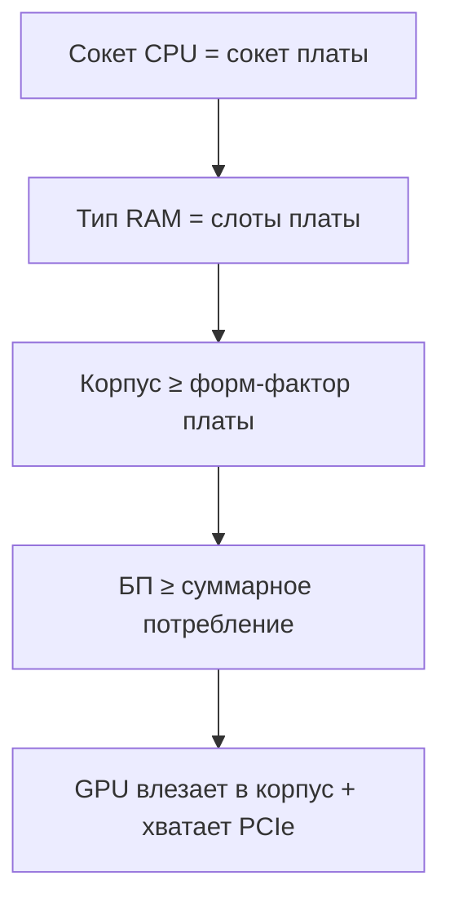

| Проверка | Как убедиться | Типичная ошибка |
|----------|---------------|-----------------|
| CPU + плата | Сайт производителя, PCPartPicker | Купили AM5 CPU к плате AM4 |
| RAM + плата | Спецификация "DDR5-5600, max 128GB" | DDR4 в слот DDR5 |
| БП + GPU | TDP GPU + CPU + 20% запас | Блок 450 Вт с RTX 4070 |
| Корпус + GPU | Max GPU length в спеках корпуса | Карта на 5 см длиннее корпуса |
| Охлаждение + CPU | TDP кулера ≥ TDP процессора | Стоковый кулер на разогнанный CPU |
| BIOS | Список поддерживаемых CPU на сайте платы | Новый CPU без обновления BIOS |

<div class="callout callout--tip">
  <div class="callout-title">Инструменты подбора</div>

  <div class="callout-body">
  Сайты вроде <strong>PCPartPicker</strong> и конфигураторы магазинов автоматически отмечают несовместимые пары. Перед заказом сверьте список с официальной страницей материнской платы — особенно для новых поколений CPU.
</div>
</div>

---

## Руководство по покупке — сценарии

### Офис и учёба

| Компонент | Ориентир |
|-----------|----------|
| CPU | 4–6 ядер, встроенная графика |
| RAM | 16 ГБ |
| Накопитель | 512 ГБ–1 ТБ NVMe SSD |
| GPU | Не нужна (iGPU) |
| Монитор | 24", Full HD, IPS |

### Игры (1080p / высокие настройки)

| Компонент | Ориентир |
|-----------|----------|
| CPU | 6–8 ядер (Ryzen 5 / i5) |
| RAM | 16–32 ГБ DDR5 |
| GPU | Средний сегмент (условно RTX 4060 / RX 7600) |
| SSD | 1 ТБ NVMe |
| БП | 650 Вт, 80 PLUS Gold |

### Монтаж видео и творчество

| Компонент | Ориентир |
|-----------|----------|
| CPU | 8+ ядер (Ryzen 7 / i7) |
| RAM | 32–64 ГБ |
| GPU | С хорошей VRAM (12 ГБ+) |
| SSD | 1–2 ТБ NVMe + HDD для архива |
| Монитор | 27"+, хорошая цветопередача |

### Бюджетный апгрейд старого ПК

1. **SSD вместо HDD** — самый заметный прирост скорости загрузки и отклика.
2. **RAM до 16 ГБ** — если сейчас 4–8 ГБ.
3. **Видеокарта** — только если блок питания и корпус позволяют.
4. CPU и плату меняют **последними** — это почти новая сборка.

★ Не экономьте на блоке питания и SSD — дешёвый БП может вывести из строя всю систему; медленный диск "убивает" ощущение от мощного CPU.

---

## Что происходит при включении ПК

После нажатия кнопки питания цепочка такая:


| Этап | Что делает | Что видит пользователь |
|------|------------|------------------------|
| **POST** (Power-On Self-Test) | Проверяет RAM, видео, клавиатуру | Логотип материнской платы, иногда коды |
| **BIOS/UEFI** | Ищет загрузочное устройство по порядку в настройках | "Press F2 for Setup", выбор диска |
| **Загрузчик** | Читает с диска ядро Windows/Linux | Чёрный экран, индикатор загрузки |
| **ОС** | Поднимает драйверы, службы, вход пользователя | Экран входа, рабочий стол |

Если POST падает — короткие **звуковые сигналы** (beep-коды) или мигание светодиода. Частые причины:

- модуль RAM не вставлен до щелчка;
- при дискретной видеокарте монитор подключён к материнской плате вместо GPU;
- перегрев или неисправность компонента.

**POST-коды на дисплее платы** (если есть двузначный индикатор): `00`, `A2`, `55` и т.д. — расшифровка в мануале к материнской плате.

---

## Порты и разъёмы

| Разъём | Назначение | На что смотреть |
|--------|------------|-----------------|
| **USB-A / USB-C** | Клавиатура, мышь, флешка, принтер | USB 2.0 (чёрный) медленнее; синий — USB 3.x |
| **HDMI / DisplayPort** | Монитор, ТВ | DisplayPort лучше для высоких Hz; HDMI — самый частый |
| **Ethernet (RJ-45)** | Проводной интернет к роутеру | Щелчок разъёма, индикаторы на порту |
| **3,5 мм jack** | Наушники, микрофон | Розовый — мик, зелёный — наушники (цвета на ПК) |
| **M.2 / SATA** | Внутри корпуса — SSD, HDD | M.2 NVMe быстрее SATA SSD |
| **Thunderbolt / USB4** | Док-станции, быстрые диски | На ноутбуках — зарядка + видео + данные |

★ **USB-C** на ноутбуке может быть только для зарядки, только для данных или **универсальным** (Thunderbolt/USB4) — смотрите маркировку у порта в инструкции.

**Цвета USB на задней панели (частая схема):**

| Цвет | Версия |
|------|--------|
| Чёрный | USB 2.0 |
| Синий | USB 3.0 / 3.1 |
| Красный / жёлтый | Питание для зарядки (иногда) |
| Бирюзовый (Type-C) | USB 3.2 / Thunderbolt |

---

## Накопители — HDD, SSD и редкие типы

| Устройство | Как устроено | Где встречается сегодня |
|------------|--------------|-------------------------|
| **HDD** | Магнитные пластины, головка движется | 80–160 МБ/с чтение, дешёвый ТБ |
| **SATA SSD** | Флэш, интерфейс SATA | 400–550 МБ/с, апгрейд старых ПК |
| **NVMe SSD** | Флэш напрямую в PCIe | 2000–7000+ МБ/с, системный диск сейчас |
| **USB-флэш** | Флэш в корпусе | Перенос файлов |
| **Оптический дисковод** | Лазер читает CD/DVD | Редко; см. [главу про ОС](/encyclopedia/1-basics/1-035-bazovaya-informatika/5) |
| **Стример (ленточный)** | Магнитная лента в кассете | Резервные копии в дата-центрах |

**HDD** (винчестер) — название от IBM **30/30** (1973). Внутри — вращающиеся **пластины**; поверхность делят на **дорожки (tracks)**, **секторы**; несколько секторов образуют **кластер** — минимальную единицу адресации для файловой системы.

| Параметр HDD | Типичные значения |
|--------------|-------------------|
| RPM | 5400 (тихий), 7200 (быстрее) |
| Объём | 1–4 ТБ для desktop |
| Форм-фактор | 3,5" (desktop), 2,5" (ноутбук) |

| Параметр SSD | На что смотреть |
|--------------|-----------------|
| Интерфейс | NVMe (M.2) и SATA |
| Объём | 512 ГБ минимум для системы |
| TBW | Ресурс записи (для тяжёлой работы) |
| DRAM-кэш | Ускоряет случайные записи |

★ **Дефрагментация** имела смысл для HDD — ускоряла чтение разбросанных по диску кусков. Для **SSD** её **не применяют** — лишний износ без выигрыша. В Windows для SSD включён **TRIM**.

Подробно — [Накопители](/encyclopedia/1-basics/1-08-kak-rabotaet-kompyuter/3).

---

## Охлаждение и пыль — профилактика

| Тип охлаждения CPU | Плюсы | Минусы |
|--------------------|-------|--------|
| **Воздушное** (башенный кулер) | Дёшево, надёжно | Шум под нагрузкой |
| **AIO жидкостное** | Тише, лучше в компактном корпусе | Дороже, срок службы помпы |
| **Пассивное** | Бесшумно | Только для слабых CPU |

**Признаки перегрева:** троттлинг (снижение частоты), внезапные выключения, вентиляторы на максимуме.

**Профилактика раз в 6–12 месяцев:**

1. Выключить ПК, отключить от сети.
2. Сжатый воздух (не пылесос вплотную к плате) — продуть радиаторы.
3. Проверить, крутятся ли все вентиляторы.
4. Заменить термопасту CPU раз в 2–3 года при активной нагрузке.

---

## Периферия — ввод и вывод

**Периферия** — всё, что снаружи системного блока (или подключается по USB, Bluetooth, Wi-Fi).

| Устройство | Ввод / вывод | Почему важно |
|------------|--------------|-------------|
| Клавиатура | Ввод | Текст, команды, игры |
| Мышь, трекпад | Ввод | Указатель на экране |
| Сканер | Ввод | Бумага → файл (PDF, JPG) |
| **Дигитайзер** | Ввод | Рисование пером **по экрану** (мониторы художников) |
| **Графический планшет** | Ввод | Отдельная плата + перо (Wacom и аналоги) |
| Сенсорный монитор | Ввод и вывод | Касание = координаты |
| Веб-камера | Ввод | Видео для звонков и записи |
| Микрофон | Ввод | Голос в цифровом виде |
| MIDI-клавиатура | Ввод | Ноты и команды для музыкальных программ |
| Монитор | Вывод | Картинка |
| Принтер | Вывод | Бумажная копия |
| **Плоттер** | Вывод | Широкоформатные чертежи, баннеры |
| **Проектор** | Вывод | Изображение на стену или экран |
| Колонки, наушники | Вывод | Звук |
| **Звуковая карта** | Ввод и вывод | Цифро-аналоговое преобразование для аудио |

### Выбор монитора

| Параметр | Офис | Игры | Дизайн |
|----------|------|------|--------|
| Диагональ | 24" | 27" | 27–32" |
| Разрешение | Full HD | QHD / 4K | 4K, широкий цветовой охват |
| Частота | 60 Гц | 144+ Гц | 60–75 Гц |
| Матрица | IPS | IPS / VA | IPS с калибровкой |

Основная статья — [Периферия](/encyclopedia/1-basics/1-08-kak-rabotaet-kompyuter/5). Эргономика клавиатуры — [Эргономика рабочего места](/encyclopedia/1-basics/1-08-kak-rabotaet-kompyuter/713).

---

### Интерактив — устройства ввода и вывода

Попробуйте пройти демо как инвентаризацию рабочего места — отметьте устройства ввода и устройства вывода.

<ExternalPlayEmbed example="about/io-devices-play" title="Io Devices" />

Мини-вывод — разделите устройства на чистый ввод, чистый вывод и комбинированные. Если классификация даётся легко, то тема периферии уже "схлопнулась" в систему.

---

### Что такое драйвер

★ **Драйвер** — программа, которая учит ОС **говорить с конкретной моделью** устройства (принтер HP, видеокарта NVIDIA). Без драйвера Windows может "видеть" устройство, но печатать или показывать картинку корректно.

Драйверы ставят с диска производителя, с сайта или через **Windows Update**.

| Источник | Когда использовать |
|----------|-------------------|
| Windows Update | Базовая работа, чипсет |
| Сайт NVIDIA/AMD/Intel | Видеокарта, свежие исправления |
| Сайт производителя ноутбука | Wi-Fi, тачпад, питание |
| Диск в коробке | Редко — версии устаревают |

Универсальный ("базовый") драйвер обычно даёт только минимальную работу устройства. Полный драйвер от производителя включает дополнительные функции.

Неверный или устаревший драйвер часто проявляется как странные ошибки — мерцание экрана, отвал Wi-Fi, "синий экран", пропадание звука, низкая скорость устройства.

Практическое правило — для обычного ПК сначала ставят обновления ОС, затем при необходимости обновляют драйверы ключевых устройств (чипсет, видеокарта, сеть) с официальных источников.

---

## Сетевое оборудование дома и в классе

Даже один ПК "в интернете" опирается на цепочку устройств.

- **Ваш ПК** → **сетевой адаптер (NIC)** → **маршрутизатор (роутер)** → **модем** → **провайдер (ISP)**


| Устройство | Роль простыми словами |
|------------|------------------------|
| **Сетевой адаптер (NIC)** | "Сетевая карта" ПК — провод Ethernet или Wi-Fi |
| **Коммутатор (switch)** | Раздаёт трафик между устройствами в **локальной** сети (кабинет, офис) |
| **Маршрутизатор (router)** | Управляет **домашней** сетью — маршрутизация, **NAT** (преобразование адресов), раздача частных IP через **DHCP**, часто Wi-Fi |
| **Модем** | Мост к **провайдеру** — переводит сигнал линии (оптика, DSL, кабель) в Ethernet, получает **публичный IP** |
| **Точка доступа Wi-Fi** | Беспроводной вход в LAN (часто встроена в домашний роутер) |

Полезно различать роли устройств.

- **Switch (коммутатор)** работает внутри локальной сети и сам в интернет трафик не выводит.
- **Router (маршрутизатор)** соединяет LAN с WAN, раздаёт частные адреса и выполняет NAT.
- **Modem (модем)** стоит **перед** роутером и отвечает только за линию до провайдера и публичный IP на границе.

Скорость и стабильность дома зависят не только от тарифа, но и от размещения роутера, загруженности радиоканала, качества кабеля и числа одновременно активных устройств.

В школьном кабинете и офисе часто используют схему.

- один маршрутизатор на выход в интернет;
- несколько коммутаторов по этажам;
- отдельные точки доступа для равномерного Wi-Fi-покрытия.

Подробнее — [Сетевые устройства](/encyclopedia/2-system-network/2-03-set-i-internet/21), [Wi-Fi и Bluetooth](/encyclopedia/2-system-network/2-03-set-i-internet/71), [Сеть — основы](/encyclopedia/2-system-network/2-03-set-i-internet/1).

---

## Диагностика и устранение неисправностей

### Алгоритм "ПК не работает"

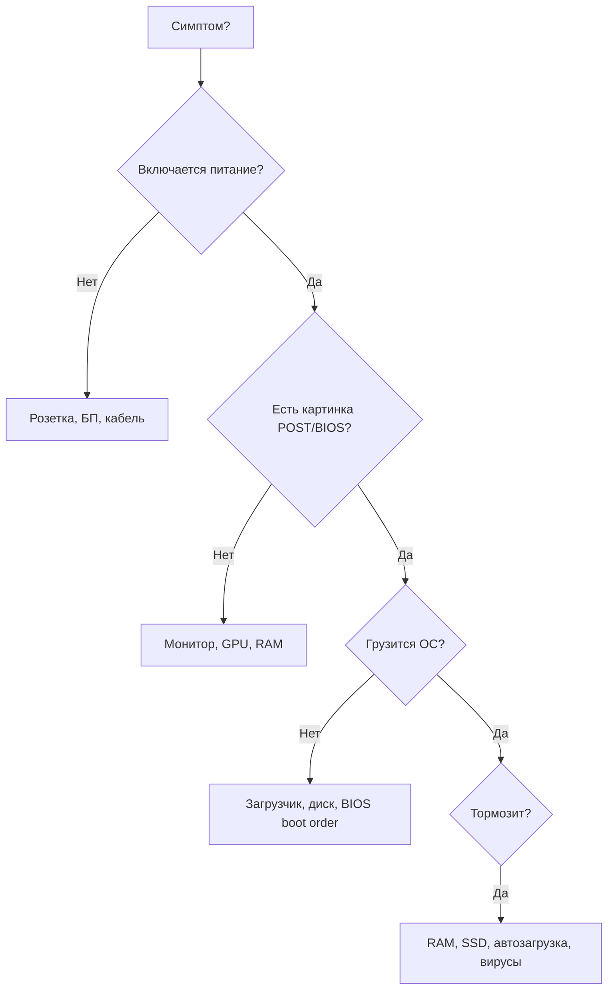

### Симптом → вероятная причина → действие

| Симптом | Что проверить первым | Действие |
|---------|----------------------|----------|
| ПК не включается, нет звука вентиляторов | Розетка, кнопка БП на задней стенке, кабель питания | Другой кабель/розетка |
| Включается и сразу выключается | Перегрев CPU, брак RAM, КЗ на плате | Одна планка RAM, без GPU |
| Чёрный экран, ПК "живой" | Кабель монитора, вход HDMI/DP, дискретная и встроенная GPU | Подключить к видеокарте |
| Долгая загрузка Windows | HDD вместо SSD, мало RAM, автозагрузка | SSD, отключить лишнее в автозагрузке |
| Щелчки/скрежет из корпуса | HDD — бэкап срочно; вентилятор — пыль | Клонировать диск, заменить вентилятор |
| Синий экран (BSOD) | Драйверы, RAM, перегрев | Memtest, обновить/откатить драйвер |
| Wi-Fi пропадает | Драйвер адаптера, роутер, помехи | Кабель Ethernet для проверки |
| USB не видит устройство | Порт, кабель, питание хаба | Другой порт, прямое подключение |
| Перегрев, троттлинг | Пыль, сухая термопаста | Продуть, заменить пасту |

### Инструменты диагностики в Windows

| Инструмент | Как открыть | Почему важно |
|------------|-------------|-------|
| **Диспетчер устройств** | Win+X → Диспетчер устройств | Жёлтый треугольник = проблема драйвера |
| **Монитор ресурсов** | `resmon` | Кто грузит CPU, диск, сеть |
| **Сведения о системе** | `msinfo32` | Модель CPU, RAM, BIOS |
| **Проверка диска** | Свойства диска → Сервис | SMART, ошибки файловой системы |
| **Журнал событий** | `eventvwr` | Коды BSOD, сбои драйверов |

### Тест RAM — MemTest86

Если подозрение на неисправную память:

1. Скачать MemTest86, записать на флешку.
2. Загрузиться с флешки (Boot menu в BIOS).
3. Оставить на несколько проходов — ошибки = замена планки.

### Звуковые коды POST (примеры AMI BIOS)

| Сигналы | Возможная причина |
|---------|-------------------|
| 1 короткий | OK |
| Непрерывный | Проблема питания или перегрев |
| 1 длинный + 2 коротких | Видеокарта |
| 1 длинный + 3 коротких | Клавиатура |
| Повторяющиеся короткие | RAM |

Точная расшифровка — в мануале к материнской плате.

<div class="callout callout--tip">
  <div class="callout-title">Самопроверка</div>

  <div class="callout-body">
  <ol>
    <li>Куда пропадёт несохранённый документ при внезапном отключении — из ОЗУ или с диска?</li>
    <li>Чем SSD принципиально отличается от HDD по конструкции?</li>
    <li>Почему принтеру нужен драйвер?</li>
    <li>Назовите три пары компонентов, которые нужно проверить на совместимость при сборке ПК.</li>
    <li>Чем ноутбук проигрывает desktop при той же цене?</li>
  </ol>
</div>
</div>

---

## Задачи для закрепления (ЕГЭ / ОГЭ стиль)

1. **Классификация.** Распределите устройства: CPU, принтер, ОЗУ, сканер, HDD, мышь — на внутренние компоненты системного блока и периферию.

2. **Цепочка.** Опишите путь данных при печати документа: от нажатия Ctrl+P до появления текста на бумаге. Укажите роль ОС, драйвера, RAM, CPU.

3. **Сравнение.** Составьте таблицу "ноутбук и desktop" по пяти критериям из статьи.

4. **Диагностика.** ПК включается, вентиляторы крутятся, но экран чёрный. Перечислите три наиболее вероятные причины и порядок проверки.

5. **Накопители.** Почему для системного диска в 2026 году рекомендуют NVMe SSD, а HDD оставляют для архива?

Ответы опираются на материал статьи; для углубления — раздел [Как работает компьютер](/encyclopedia/1-basics/1-08-kak-rabotaet-kompyuter/intro).

---

## Форм-факторы корпусов и плат

| Форм-фактор платы | Размер (мм, ориентир) | Корпус | Применение |
|-------------------|----------------------|--------|------------|
| **E-ATX** | 305×330 | Full Tower | Рабочие станции, энтузиасты |
| **ATX** | 305×244 | Mid Tower | Стандарт desktop |
| **mATX** | 244×244 | Micro Tower | Компактные сборки |
| **Mini-ITX** | 170×170 | SFF, мини-корпус | HTPC, компактный ПК |

| Форм-фактор корпуса | Платы | GPU max | Охлаждение |
|---------------------|-------|---------|------------|
| Full Tower | ATX, E-ATX | 350+ мм | Лучший обдув |
| Mid Tower | ATX, mATX | 320–350 мм | Баланс |
| SFF / Mini-ITX | Mini-ITX | 200–280 мм | Ограничено |

★ Перед покупкой видеокарты сверьте **длину GPU** в спецификации корпуса и **высоту кулера** CPU с боковой стенкой.

---

## PCIe — линии и совместимость

**PCI Express** — шина для видеокарт, NVMe SSD, сетевых и звуковых карт.

| Версия | Пропускная способность x16 (теор.) | Поколение |
|--------|-----------------------------------|-----------|
| PCIe 3.0 | ~16 ГБ/с | До Ryzen 3000, Intel 9–10 |
| PCIe 4.0 | ~32 ГБ/с | Ryzen 5000+, Intel 11+ |
| PCIe 5.0 | ~64 ГБ/с | Ryzen 7000, Intel 12+ |

| Слот | Линии | Типичное устройство |
|------|-------|---------------------|
| PCIe x16 | 16 | Видеокарта |
| PCIe x4 (M.2) | 4 | NVMe SSD |
| PCIe x1 | 1 | Wi-Fi, звук, захват |

**Важно:** при установке второго M.2 SSD некоторые платы **отключают** SATA-порты или делят PCIe-линии с GPU — читайте мануал платы (раздел Storage).

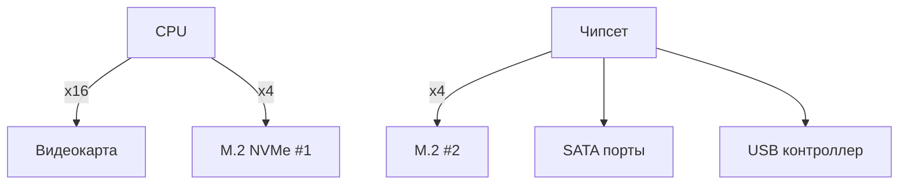

---

## BIOS/UEFI — настройки для сборщика

| Раздел | Параметр | Рекомендация |
|--------|----------|--------------|
| Boot | Boot Order | NVMe SSD первым |
| Boot | CSM / Legacy | Выключить для чистого UEFI + GPT |
| Advanced | XMP / EXPO | Включить профиль RAM (если плата поддерживает) |
| Advanced | Resizable BAR | Включить для современных GPU |
| Monitor | CPU Fan | PWM-режим, кривая по температуре |
| Security | Secure Boot | Включён для Windows 11 |

**XMP/EXPO** — профиль разгона памяти из коробки. Без него RAM может работать на базовой частоте (например, 4800 вместо 6000 МГц).

**Обновление BIOS:** только с официального сайта производителя платы; не отключать питание во время прошивки.

---

## Расширенное руководство по покупке — по бюджету

### Бюджет до 40 000 ₽ (офис / учёба)

| Компонент | Ориентир |
|-----------|----------|
| CPU | 4 ядра с iGPU (Ryzen 5 5600G / Intel i3-12100) |
| Плата | mATX, встроенный Wi-Fi опционально |
| RAM | 16 ГБ DDR4 |
| SSD | 512 ГБ NVMe |
| БП | 400–450 Вт, 80 PLUS |
| Корпус | mATX с сеткой спереди |

### Бюджет 60 000–90 000 ₽ (универсальный ПК)

| Компонент | Ориентир |
|-----------|----------|
| CPU | 6–8 ядер (Ryzen 5 7600 / i5-13400) |
| GPU | Уровень RTX 4060 / RX 7600 |
| RAM | 16–32 ГБ DDR5 |
| SSD | 1 ТБ NVMe Gen4 |
| БП | 650 Вт Gold |

### Бюджет 120 000+ ₽ (игры / работа)

| Компонент | Ориентир |
|-----------|----------|
| CPU | Ryzen 7 / i7 |
| GPU | RTX 4070 Super и выше |
| RAM | 32 ГБ DDR5 |
| SSD | 2 ТБ NVMe + HDD 4 ТБ |
| Охлаждение | Башенный кулер или 240 AIO |

### Ноутбук — на что смотреть в характеристиках

| Параметр | Хорошо | Плохо |
|----------|--------|-------|
| RAM | 16 ГБ, возможность апгрейда | 8 ГБ припаяно |
| Накопитель | 512 ГБ+ NVMe | 256 ГБ eMMC |
| Экран | IPS, 100% sRGB | TN, 45% NTSC |
| Батарея | 60+ Вт·ч | 40 Вт·ч |
| Порты | USB-C с DP/зарядкой | Только USB-A |
| Охлаждение | 2 вентилятора | 1 вентилятор на H-series CPU |

---

## Сборка ПК — пошаговый чек-лист

1. **Подготовка** — антистатический браслет или касание корпуса; инструменты: отвёртка, стяжки.
2. **БП в корпус** — кабели вынуть наружу для удобства.
3. **Стойки (standoffs)** — проверить, что под mATX не лишние стойки (КЗ).
4. **CPU в сокет** — стрелки совпадают; **не** давить на контакты.
5. **Термопаста** — горошина по центру или тонкий слой; не размазывать пальцем без перчатки.
6. **Кулер CPU** — равномерно затянуть винты крест-накрест.
7. **RAM** — в слоты 2 и 4 (для dual-channel на 4-слотовой плате).
8. **M.2 SSD** — под углом, винт-фиксатор; снять пластиковую наклейку с термопрокладкой если есть.
9. **Плата в корпус** — I/O shield, все винты.
10. **GPU** — до щелчка в x16; питание 6/8-pin от БП.
11. **Кабели** — 24-pin ATX, 8-pin CPU, GPU power; SATA при необходимости.
12. **Первый запуск** — монитор к GPU; один POST; потом установка ОС.

<div class="callout callout--info">
  <div class="callout-title">Типичные ошибки новичка</div>

  <div class="callout-body">
  <ul>
    <li>Забыли подключить 8-pin CPU power — не стартует.</li>
    <li>RAM не до щелчка — нет POST.</li>
    <li>Монитор в материнскую плату при дискретной GPU — чёрный экран.</li>
    <li>БП дешёвый без защит — риск для всей системы.</li>
  </ul>
</div>
</div>

---

## Расширенная таблица неисправностей

| Симптом | Дополнительные признаки | Диагноз | Решение |
|---------|------------------------|---------|---------|
| Синий экран PAGE_FAULT | После обновления драйвера | Драйвер RAM/диск | Откат драйвера, chkdsk |
| WHEA_UNCORRECTABLE_ERROR | Под нагрузкой | CPU/RAM/разгон | Сброс BIOS, Memtest |
| KERNEL_SECURITY_CHECK_FAILURE | После обновления Windows | Конфликт драйверов | Безопасный режим, удаление |
| Диск 100% в диспетчере | HDD, мало RAM | Подкачка на HDD | SSD, больше RAM |
| Нет звука | Жёлтый треугольник в диспетчере | Драйвер аудио | Переустановка Realtek |
| USB отваливается | Только передние порты | Слабое питание | Задние порты платы |
| Артефакты на экране | В играх | GPU/перегрев | Проверить температуру, кабель |
| Не видит второй диск | Новый HDD | Не инициализирован | Управление дисками → GPT → раздел |

### Команды Windows для диагностики

```
sfc /scannow
chkdsk C: /f
dism /online /cleanup-image /restorehealth
wmic diskdrive get status
Get-PhysicalDisk | Get-StorageReliabilityCounter
```

---

## Периферия — расширенный обзор

### Клавиатуры

| Тип | Механика | Мембрана |
|-----|----------|----------|
| Ощущение | Чёткий ход, ресурс | Мягче, тише |
| Цена | Выше | Ниже |
| Для кого | Игры, много печати | Офис |

| Раскладка | Особенность |
|-----------|-------------|
| ANSI | Enter в одну строку (США) |
| ISO | Высокий Enter (Европа) |
| ЙЦУКЕН | Русская раскладка |

### Принтеры

| Технология | Плюсы | Минусы |
|------------|-------|--------|
| **Лазерный** | Быстро, дёшево за страницу | Плохо с фото |
| **Струйный** | Цвет, фото | Дорогие картриджи, засыхание |
| **МФУ** | Печать + скан + копир | Крупнее |

### Сканеры

| Тип | DPI | Применение |
|-----|-----|------------|
| Планшетный | 600–4800 | Документы, фото |
| Протяжной | 300–600 | Поток бумаги |
| Встроенный в МФУ | 300–1200 | Дом, офис |

---

## Энергопотребление и экология

| Режим | Потребление desktop (ориентир) |
|-------|-------------------------------|
| Выключен (БП вкл) | 1–5 Вт |
| Простой | 50–80 Вт |
| Офис | 80–120 Вт |
| Игра / рендер | 300–500+ Вт |

**Советы:** режим сна/гибернации; отключать БП выключателем при длительном отсутствии; не оставлять майнинг 24/7 без учёта износа и счёта за электричество.

---

## Сетевое оборудование — расширение

### Кабели Ethernet

| Категория | Скорость | Длина max |
|-----------|----------|-----------|
| Cat 5e | 1 Гбит/с | 100 м |
| Cat 6 | 1 Гбит/с | 100 м |
| Cat 6a | 10 Гбит/с | 100 м |
| Cat 7/8 | 10+ Гбит/с | Офис, ЦОД |

★ Для дома Cat 5e/6 достаточно. Витая пара — обжим RJ-45 (T568B).

### Wi-Fi стандарты

| Стандарт | Частота | Теор. скорость |
|----------|---------|----------------|
| 802.11n (Wi-Fi 4) | 2,4 + 5 ГГц | 600 Мбит/с |
| 802.11ac (Wi-Fi 5) | 5 ГГц | 3+ Гбит/с |
| 802.11ax (Wi-Fi 6) | 2,4 + 5 + 6 ГГц | 9+ Гбит/с |
| Wi-Fi 6E | + 6 ГГц | Меньше помех |

### Схема школьного кабинета

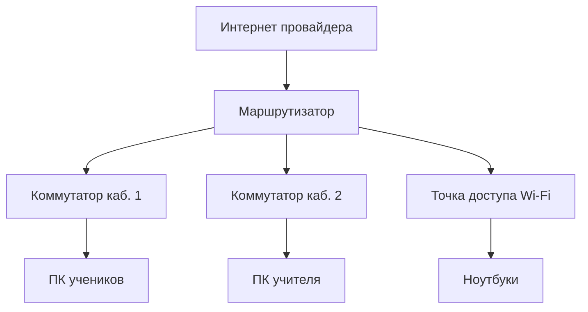

---

## Ответы к задачам для закрепления

1. **Внутренние:** CPU, ОЗУ, HDD. **Периферия:** принтер, сканер, мышь.
2. Ctrl+P → приложение формирует данные → драйвер принтера → spooler ОС → USB/сеть → принтер → бумага.
3. См. таблицу "ноутбук и desktop" в начале статьи.
4. Кабель монитора → правильный видеовыход GPU → одна планка RAM → POST-коды.
5. NVMe — быстрая загрузка ОС и программ; HDD — дёшево за терабайт для архива.

---

## Дополнительные задачи (ЕГЭ / ОГЭ)

**Задача 6.** Укажите последовательность устройств при передаче пакета из браузера на сервер в другой стране: NIC → роутер → модем → … → сервер.

**Задача 7.** Почему при 8 ГБ RAM и HDD компьютер "тормозит" с 20 вкладками браузера?

**Задача 8.** Сравните SATA SSD и NVMe SSD по интерфейсу и скорости.

**Задача 9.** Какие три устройства относятся к **устройствам ввода** в классификации ЕГЭ?

**Задача 10.** Объясните роль **чипсета** на материнской плате.

**Ответы:** 6) LAN → шлюз → магистраль провайдеров → сервер. 7) Нехватка RAM → подкачка на медленный HDD. 8) SATA ~550 МБ/с, NVMe 2000–7000+ МБ/с через PCIe. 9) Клавиатура, мышь, сканер (любые три ввода). 10) Связывает CPU с дисками, USB, сетью, слотами расширения.

---

## Карта курса — где эта глава в программе

Глава 3 закрывает блок **"Аппаратное обеспечение ЭВМ"** в школьном курсе информатики (7–11 класс) и служит мостом к разделу [Как работает компьютер](/encyclopedia/1-basics/1-08-kak-rabotaet-kompyuter/intro).

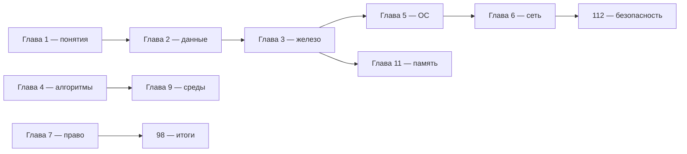

| Этап обучения | Что изучаем в гл. 3 | Следующий шаг |
|---------------|---------------------|---------------|
| 7 класс | Системный блок, ввод-вывод, роли CPU/RAM/диска | [Глава 5](./5) — файлы и ОС |
| 8–9 класс | Периферия, сеть дома, классификация устройств | [Глава 6](./6) — интернет |
| 10–11 класс | Совместимость, диагностика, цифровая и аналоговая ЭВМ | [Глава 11](./11) — иерархия памяти |
| Самообразование | Сборка ПК, выбор ноутбука | [Аппаратное обеспечение](/encyclopedia/2-system-network/2-10-zhelezo/intro) |

**Рекомендуемый порядок чтения внутри главы:** ключевые понятия → системный блок → накопители → периферия → сеть → диагностика → задачи. Интерактивы (`Computer Architecture`, `Io Devices`) — после таблицы компонентов.

---

## Классификация устройств на ОГЭ и ЕГЭ

На экзаменах часто просят распределить устройства по **нескольким осям** одновременно. Запомните четыре "сетки".

### По расположению относительно системного блока

| Категория | Примеры | Примечание |
|-----------|---------|------------|
| **Внутренние** (составные части) | CPU, ОЗУ, HDD, SSD, материнская плата, БП, оптический привод | Сидят в корпусе или на плате ноутбука |
| **Внешние** (периферия) | Монитор, клавиатура, мышь, принтер, сканер, веб-камера, внешний HDD | Подключаются кабелем или беспроводно |
| **Сетевые** (отдельная ось на ЕГЭ) | NIC, роутер, коммутатор, модем, точка доступа | Связывают ЭВМ между собой и с интернетом |

★ На ЕГЭ **сетевая карта** внутри ПК — внутреннее устройство; **роутер** — сетевое оборудование, не периферия одного ПК.

### По направлению потока данных

| Тип | Устройства | Исключения |
|-----|------------|------------|
| **Только ввод** | Клавиатура, мышь, сканер, микрофон, графический планшет | — |
| **Только вывод** | Монитор, принтер, колонки, проектор, плоттер | — |
| **Ввод и вывод** | Сенсорный экран, модем (исторически), сетевая карта, звуковая карта, USB-флешка при чтении и записи | На экзамене уточняйте формулировку: "в момент печати" принтер — вывод |

### Цифровая и аналоговая вычислительная техника

| Признак | Цифровая ЭВМ | Аналоговая вычислительная машина |
|---------|--------------|----------------------------------|
| Представление данных | Дискретные 0 и 1 | Непрерывные физические величины |
| Программа | Хранимая программа (файл на диске) | Задаётся схемой и настройкой |
| Примеры | ПК, смартфон, школьный компьютер | Исторические аналоговые компьютеры, некоторые спец. устройства |
| Универсальность | Высокая — меняется софт | Низкая — под класс задач |

### Устройства хранения — иерархия для экзамена

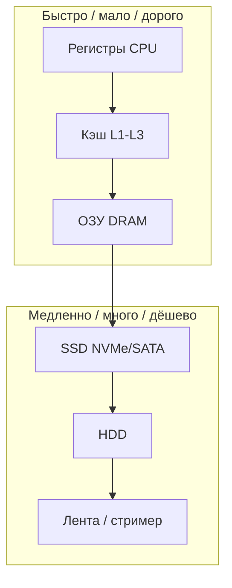

| Уровень | Энергозависимость | После выключения |
|---------|-------------------|------------------|
| ОЗУ | Да | Данные теряются |
| SSD, HDD | Нет | Файлы сохраняются |
| ROM / BIOS | Нет (прошивка) | Настройки и код загрузки |

---

## ЕГЭ и ОГЭ — конспект по аппаратному обеспечению

### Типовые формулировки заданий

| № типа | Формулировка | Алгоритм ответа |
|--------|--------------|-----------------|
| 1 | "Укажите устройства **ввода**" | Только клавиатура, мышь, сканер… — не монитор |
| 2 | "Внутренние компоненты системного блока" | CPU, RAM, плата, диск — не принтер |
| 3 | "Последовательность при включении ПК" | Питание → BIOS/UEFI → POST → загрузчик → ОС |
| 4 | "Роль оперативной памяти" | Хранение данных **работающих** программ; очищается при выкл. |
| 5 | "Чем SSD отличается от HDD" | Нет движущихся частей; быстрее; флэш и магнитные пластины |
| 6 | "Почему нужен драйвер" | ОС управляет конкретной моделью устройства |
| 7 | "Модем и роутер и коммутатор" | Модем — к провайдеру; роутер — между сетями + DHCP; switch — внутри LAN |

### Мини-шпаргалка — определения на одну строку

| Термин | Определение для экзамена |
|--------|--------------------------|
| **Процессор** | Устройство исполнения машинных команд программы |
| **ОЗУ** | Быстрая энергозависимая память для кода и данных открытых программ |
| **Накопитель** | Долговременное хранение файлов и ОС |
| **Материнская плата** | Плата, связывающая CPU, память, диски и порты |
| **BIOS/UEFI** | Прошивка начальной загрузки и настройки железа |
| **Периферия** | Устройства ввода-вывода вне центральных узлов |
| **Драйвер** | Программа взаимодействия ОС с устройством |
| **Кластер** | Группа секторов — минимальная единица размещения файла на диске |

### Задания с развёрнутым ответом (тренировка)

**Задание А.** Опишите путь открытия файла `report.docx` с диска до появления текста на экране. Укажите роль: накопителя, ОЗУ, CPU, GPU, ОС, монитора.

<details>
<summary>Образец ответа</summary>

1. Пользователь двойным щелчком запускает ассоциированную программу (Word) — **ОС** создаёт процесс.
2. **ОС** читает с **накопителя** (SSD) исполняемый файл и часть документа в **ОЗУ**.
3. **CPU** выполняет команды программы: разбор формата, расчёт раскладки.
4. **GPU** (встроенная или дискретная) формирует кадр изображения в видеопамяти.
5. **Монитор** (периферия **вывода**) показывает пиксели.

Если файл был только в ОЗУ и не сохранён — при сбое питания текст на диске не появится.
</details>

**Задание Б.** Объясните, почему замена HDD на SSD ускоряет загрузку Windows сильнее, чем замена i3 на i5 при том же объёме RAM.

<details>
<summary>Образец ответа</summary>

При загрузке ОС и десятки программ **читают тысячи мелких файлов** с диска. HDD ограничен механикой (seek, RPM) — задержки миллисекунды. SSD даёт случайное чтение в сотни раз быстрее. CPU при загрузке часто **ждёт отклика диска** вместо вычислений; более быстрый CPU не сокращает ожидание ввода-вывода (I/O) так же эффективно, как SSD.
</details>

---

## Углубление — конвейер процессора и "простой" CPU

Школьный курс не требует чертить микросхему, но понимание **конвейера** объясняет, почему GHz — не единственный критерий скорости.

| Стадия конвейера | Действие |
|------------------|----------|
| Fetch (выборка) | CPU читает следующую команду из памяти/кэша |
| Decode (декодирование) | Команда переводится во внутренний формат |
| Execute (исполнение) | АЛУ выполняет операцию |
| Memory (доступ к памяти) | Чтение/запись операнда в RAM |
| Writeback (запись) | Результат в регистр |


Пока одна команда на стадии Execute, следующая может быть на Decode — **параллелизм на уровне команд**. Но при **промахе кэша** или **ожидании RAM** конвейер **останавливается (stall)** — отсюда связь с [главой 11](./11).

| Ситуация | Что видит пользователь |
|----------|------------------------|
| Много ядер, слабый диск | Быстро в многозадачности, медленная загрузка |
| Сильный CPU, 4 ГБ RAM | Тормоза при вкладках — подкачка |
| Сильный CPU и SSD, мало RAM | Быстрый старт, лаги при 30+ вкладках |

---

## Серверы, рабочие станции и бытовой ПК

Для полноты картины — чем "большой компьютер в дата-центре" отличается от домашнего.

| Параметр | Домашний desktop | Рабочая станция | Сервер |
|----------|------------------|-----------------|--------|
| CPU | 4–16 ядер, одно сокет | 8–64 ядра, иногда 2 сокета | Много ядер, 2+ сокета, ECC RAM |
| RAM | 8–32 ГБ DDR4/DDR5 | 32–128 ГБ, иногда ECC | 64 ГБ – 1 ТБ+, ECC |
| GPU | Игровая или iGPU | Профессиональная (Quadro/RTX A) | Часто без GPU или слабая |
| Накопители | 1–2 NVMe + HDD | NVMe RAID, большие SSD | Много HDD/SSD, RAID, hot-swap |
| Охлаждение | Воздух / AIO | Мощное, тихое | Потоковое, 24/7 |
| Питание | 1 БП | 1–2 БП | Резервированные БП |
| Форм-фактор | ATX корпус | Tower / rack | 1U/2U стойка |

★ **ECC-память** (Error-Correcting Code) исправляет одиночные битовые ошибки — важно для серверов и научных расчётов; в бытовых ПК редка.

**RAID** (Redundant Array of Independent Disks) — объединение дисков для скорости или отказоустойчивости. Для курса достаточно знать: RAID 1 — зеркало (копия), RAID 0 — скорость без защиты. Подробнее — [Управление накопителями](/encyclopedia/1-basics/1-08-kak-rabotaet-kompyuter/3).

---

## История поколений ПК — краткая шкала

| Период | Характеристика | Пример |
|--------|----------------|--------|
| 1970-е | Микропроцессоры, персональные компьютеры | Altair, Apple II |
| 1980-е | IBM PC, DOS, первые GUI | Intel 8086, 80286 |
| 1990-е | Windows 95, интернет в массы | Pentium, HDD рост |
| 2000-е | Многоядерность, ноутбуки | Core 2 Duo, Wi-Fi |
| 2010-е | SSD, смартфоны как ЭВМ | NVMe, ARM в телефонах |
| 2020-е | Удалёнка, ИИ на GPU | DDR5, PCIe 5.0, NPU в CPU |

Историческая перспектива помогает на экзаменах с вопросами про **аналоговые** и **цифровые** машины: современный бытовой ПК — всегда цифровая ЭВМ с **хранимой программой** (архитектура фон Неймана).

---

## Расширенная самопроверка (с ключами)

Ответьте письменно, затем откройте ключ.

| № | Вопрос |
|---|--------|
| 1 | Назовите пять устройств **только вывода**. |
| 2 | Чем **коммутатор** отличается от **маршрутизатора**? |
| 3 | Почему **дефрагментацию** не делают на SSD? |
| 4 | Какие три проверки совместимости обязательны при покупке CPU и платы? |
| 5 | Что такое **POST** и когда пользователь его замечает? |
| 6 | Где подключать монитор при установленной дискретной видеокарте? |
| 7 | Перечислите этапы цепочки "ввод → обработка → вывод" для сканирования документа. |
| 8 | Чем **Thunderbolt** полезен на ноутбуке? |
| 9 | Что произойдёт с несохранённым документом при отключении питания? |
| 10 | Назовите два признака **цифровой** ЭВМ. |

<details>
<summary>Ключи</summary>

1. Монитор, принтер, колонки, проектор, плоттер (любые пять чистого вывода).
2. Коммутатор соединяет устройства **в одной** локальной сети; маршрутизатор соединяет **разные** сети (LAN и WAN), раздаёт IP, делает NAT.
3. SSD не имеет механических головок; перестановка блоков не ускоряет доступ, но изнашивает ячейки; используется TRIM.
4. Сокет CPU = сокет платы; поддерживаемый чипсет/BIOS; тип RAM (DDR4/DDR5).
5. Power-On Self-Test — самотест железа при включении; логотип платы, beep-коды, задержка до загрузки ОС.
6. К **видеокарте** (HDMI/DP на GPU), не к материнской плате.
7. Сканер (ввод) → драйвер → ОС → RAM → CPU (обработка изображения) → монитор/диск (вывод/хранение).
8. Один порт: питание, видео, быстрые диски, док-станция.
9. Теряется, если был только в ОЗУ; на диске останется только если успели сохранить.
10. Дискретные данные (биты); программа хранится в памяти/на диске и меняется без перепайки.
</details>

---

## Словарь главы — термины для зачёта

| Термин | Кратко |
|--------|--------|
| ЭВМ | Аппаратура + программы |
| Системный блок | Корпус с основными компонентами |
| Чипсет | Мост между CPU и периферией |
| iGPU | Встроенная графика в CPU |
| VRAM | Память видеокарты |
| NVMe | Протокол быстрых SSD через PCIe |
| SATA | Интерфейс дисков и оптики |
| TDP | Тепловыделение чипа |
| UEFI | Современная прошивка вместо legacy BIOS |
| NAT | Преобразование адресов на роутере |
| DHCP | Автоматическая раздача IP в сети |
| NIC | Сетевая карта |

---

## Подробный разбор CPU — линейки и выбор

### Intel Core — поколения (ориентир 2024–2026)

| Серия | Ядра (типично) | Сегмент | iGPU |
|-------|----------------|---------|------|
| Core i3 | 4–8 | Офис, лёгкие задачи | Да |
| Core i5 | 6–14 | Универсальный ПК, игры среднего уровня | Да / нет (K) |
| Core i7 | 8–20 | Творчество, тяжёлые игры | Да / нет |
| Core i9 | 8–24+ | Энтузиасты, рабочие станции | Нет (часто) |

Суффиксы Intel: **K** — разблокированный множитель; **F** — без iGPU; **T** — энергоэффективный; **H** — мобильный высокой мощности; **U** — ультрамобильный.

### AMD Ryzen — суффиксы

| Суффикс | Смысл |
|---------|-------|
| **X** | Высокая частота, разгон |
| **G** | Встроенная графика Radeon |
| **X3D** | Увеличенный кэш L3 — игры |
| **PRO** | Корпоративные функции, ECC на части плат |
| **HS / U** | Мобильные линейки |

### Как читать спецификацию CPU на сайте магазина

| Поле | На что смотреть |
|------|-----------------|
| Сокет | Совпадение с платой |
| TDP / PBP | Охлаждение и БП |
| Базовая / турбо частота | Однопоток и многопоток |
| Кэш L3 | Игры и большие данные |
| PCIe версия | Совместимость с SSD/GPU |
| Поддержка RAM | DDR5-5200 и DDR5-6000 |

**Задача (практика).** Нужен ПК для учёбы: браузер, Word, Zoom, лёгкий Python. Достаточно ли 4 ядер и 8 ГБ RAM?

Ответ: **минимум** — лучше **4–6 ядер и 16 ГБ** для комфортной видеосвязи и IDE.

---

## Память RAM — углубление

### Dual-channel и quad-channel

| Конфигурация | Пропускная способность |
|--------------|------------------------|
| 1 планка | Single-channel — медленнее |
| 2 планки в правильных слотах | Dual-channel — до ~2× |
| 4 планки на HEDT | Quad-channel |

На плате с 4 слотами при **2 планках** ставят во **2-й и 4-й** слот (см. мануал — часто A2+B2).

### Тайминги и частота — пример таблицы

| Профиль | Частота | CL | Применение |
|---------|---------|-----|------------|
| JEDEC базовый | 4800 | 40 | Без XMP |
| XMP 1 | 6000 | 30 | Игры, общий ПК |
| Энтузиаст | 7200+ | 34 | Разгон |

★ Для офиса разница между CL30 и CL36 **незаметна**; для игр на AMD иногда важна синхронизация **Infinity Fabric**.

### ECC и non-ECC

| | Non-ECC | ECC |
|---|---------|-----|
| Исправление ошибок | Нет | 1 бит |
| Цена | Ниже | Выше |
| Где | Бытовые ПК | Серверы, Xeon, Ryzen PRO |

---

## Накопители — SMART, разметка, файловые системы

### SMART-параметры (мониторинг здоровья)

| Атрибут | HDD | SSD |
|---------|-----|-----|
| Reallocated sectors | Плохие сектора переназначены | — |
| Wear leveling | — | Износ ячеек |
| Temperature | Перегрев | Перегрев |
| Power-on hours | Наработка | Наработка |

Утилиты: CrystalDiskInfo, `smartctl` в Linux.

### MBR и GPT

| | MBR | GPT |
|---|-----|-----|
| Разделов | 4 primary | 128+ |
| Диск > 2 ТБ | Проблемы | OK |
| UEFI | Legacy BIOS | Рекомендуется |
| Secure Boot | Ограничено | Да |

### Файловые системы (связь с [главой 5](./5))

| ФС | ОС | Особенность |
|----|-----|-------------|
| NTFS | Windows | Журналирование, большие файлы |
| exFAT | Кроссплатформа | Флешки, внешние диски |
| FAT32 | Везде | Лимит файла 4 ГБ |
| ext4 | Linux | Домашний Linux |
| APFS | macOS | Apple |

**Задача.** Фильм 4,5 ГБ на флешку FAT32. Что делать?

Ответ: отформатировать в **exFAT** или **NTFS**, либо разбить архив.

---

## Видеоподсистема — мониторы и GPU

### Разрешение и плотность пикселей

| Название | Пиксели | PPI на 27" (ориентир) |
|----------|---------|----------------------|
| HD | 1366×768 | Низкий |
| Full HD | 1920×1080 | ~81 |
| QHD | 2560×1440 | ~108 |
| 4K UHD | 3840×2160 | ~163 |

### G-Sync / FreeSync

Синхронизация частоты кадров GPU и монитора — убирает **разрывы кадра (tearing)** и рывки.

### Подключение нескольких мониторов

| Выход GPU | Мониторы |
|-----------|----------|
| 1× HDMI + 1× DP | 2 монитора |
| 2× DP + 1× HDMI | 3 монитора (зависит от модели) |
| USB-C DP Alt Mode | Док-станция с мониторами |

---

## Аудиоподсистема ПК

| Компонент | Роль |
|-----------|------|
| **Кодек на плате** (Realtek ALC…) | ЦАП/АЦП для 3,5 мм |
| **Звуковая карта** PCIe/USB | Лучший ЦАП, входы для микрофонов |
| **USB-наушники** | Свой ЦАП внутри гарнитуры |
| **Bluetooth** | Сжатый аудио (SBC, AAC, aptX) |
| **HDMI/DP** | Звук на монитор/ТВ |

**Драйвер Realtek** — частая причина "пропал звук" после обновления Windows.

---

## USB — поколения и питание

| Версия | Скорость | Разъём |
|--------|----------|--------|
| USB 2.0 | 480 Мбит/с | Type-A |
| USB 3.2 Gen 1 | 5 Гбит/с | Type-A синий |
| USB 3.2 Gen 2 | 10 Гбит/с | Type-A/Type-C |
| USB4 | 40 Гбит/с | Type-C |
| Thunderbolt 4 | 40 Гбит/с + PCIe | Type-C |

| Стандарт питания | Мощность |
|------------------|----------|
| USB 2.0 | 2,5 Вт |
| USB 3.0 | 4,5 Вт |
| USB-C PD | до 100+ Вт (ноутбуки) |

---

## Bluetooth — классы устройств

| Класс | Примеры | Дальность (ориентир) |
|-------|---------|----------------------|
| Мышь, клавиатура | HID | 10 м |
| Наушники | A2DP | 10 м |
| Принтер | SPP | Комната |
| Телефон как модем | PAN | — |

См. [Wi-Fi и Bluetooth](/encyclopedia/2-system-network/2-03-set-i-internet/71).

---

## ИБП — бесперебойное питание

| Тип ИБП | Принцип | Для чего |
|---------|---------|----------|
| **Offline** | Переключение при сбое | Бюджет, краткие сбои |
| **Line-Interactive** | Стабилизация + батарея | Дом, офис |
| **Online** | Постоянно с батареи | Серверы, точное оборудование |

★ ИБП **не бесконечный** — даёт время сохранить работу и корректно выключить ПК.

---

## Эргономика рабочего места

| Элемент | Рекомендация |
|---------|--------------|
| Монитор | Верхний край на уровне глаз |
| Расстояние до экрана | 50–70 см |
| Клавиатура | Запястья прямые, не на краю стола |
| Освещение | Без бликов на экране |
| Перерывы | 5–10 мин каждый час (правило 20-20-20) |

См. [Эргономика](/encyclopedia/1-basics/1-08-kak-rabotaet-kompyuter/713).

---

## Расширенный FAQ по сборке и покупке

<details>
<summary>Можно ли поставить DDR4 в слот DDR5?</summary>

**Нет.** Разъёмы и напряжение разные — физически не вставится или повредит плату.
</details>

<details>
<summary>Нужна ли термопаста на процессоре?</summary>

**Да** (кроме кулеров с преднанесённой пастой). Без пасты — перегрев.
</details>

<details>
<summary>Стоит ли брать б/у видеокарту?</summary>

Риск: майнинг, износ, без гарантии. Проверять тестом FurMark, температуры, артефакты.
</details>

<details>
<summary>Почему ноутбук греется на коленях?</summary>

Перекрыт вентиляционный забор снизу — ставьте на стол или подставку.
</details>

<details>
<summary>Чем отличается OEM Windows от Retail?</summary>

OEM привязан к железу; Retail переносим между ПК. Для курса важно: нужна **лицензия ОС** — см. [главу 5](./5).
</details>

<details>
<summary>Нужен ли антивирус кроме встроенного Defender?</summary>

Для быта Defender достаточен при осторожности; корпоративные политики могут требовать иное.
</details>

---

## Практикум — инвентаризация компьютера

Выполните на своём ПК (с разрешения взрослых):

| Шаг | Действие | Записать |
|-----|----------|----------|
| 1 | `msinfo32` | Модель CPU, RAM, BIOS |
| 2 | Диспетчер устройств | Список 3 устройств ввода, 3 вывода |
| 3 | Проводник → Этот компьютер | Тип диска C: (SSD/HDD) |
| 4 | Настройки → Дисплей | Разрешение монитора |
| 5 | `ipconfig` | IP в домашней сети |

Сравните с таблицами из статьи — ваш ПК ближе к офисному, игровому или учебному профилю?

---

## Связь с другими главами курса

| Глава | Связь с железом |
|-------|-----------------|
| [2 — Кодирование](./2) | Байты на диске и в RAM |
| [4 — Алгоритмы](./4) | CPU выполняет команды |
| [5 — ОС](./5) | Драйверы, файловые системы |
| [6 — Интернет](./6) | NIC, роутер, модем |
| [7 — Право](./7) | Лицензии ПО, персональные данные на диске |
| [9 — Среды](./9) | IDE требует RAM и CPU |
| [11 — Память](./11) | Кэш, иерархия |

---

## Большой блок задач ОГЭ / ЕГЭ (часть 2)

**11.** Перечислите устройства **сетевого оборудования** в домашней сети.

**12.** Укажите **внутренние** компоненты ноутбука (не периферия).

**13.** Почему при нехватке ОЗУ растёт активность диска?

**14.** Сравните **встроенную** и **дискретную** видеокарту по двум признакам.

**15.** Что делает **блок питания**?

**16.** Назовите **три порта** на задней панели ПК и их назначение.

**17.** Объясните термин **кластер** на HDD.

**18.** Почему **операционной системе** нужен драйвер принтера?

**19.** Чем **цифровая** ЭВМ отличается от **аналоговой**?

**20.** Опишите **POST** одним предложением.

**Ключи:** 11) Роутер, модем, коммутатор, точка доступа, NIC. 12) CPU, RAM, SSD, плата, БП. 13) Подкачка на диск (swap). 14) iGPU — в CPU, слабее; дискретная — отдельная плата, мощнее. 15) Преобразует 220 В в низкое напряжение. 16) USB, HDMI, Ethernet — любые три. 17) Группа секторов — минимальное размещение файла. 18) Переводит команды ОС в команды принтера. 19) Дискретные данные, хранимая программа. 20) Самотест железа при включении.

---


---

## Моноблоки, неттопы и мини-ПК

| Форм-фактор | Плюсы | Минусы |
|-------------|-------|--------|
| Моноблок | Экран + ПК в одном корпусе | Сложный апгрейд |
| Неттоп | Компактность, тишина | Слабее для игр |
| Мини-ПК (NUC) | Мало места | Ограниченное охлаждение |

Для учёбы и офиса неттоп часто достаточен; для 3D и монтажа — полноразмерный desktop.

---

## Виртуализация и "два компьютера в одном"

**Гипервизор** (VirtualBox, Hyper-V) запускает гостевые ОС поверх хоста. Нужны **RAM** (каждой VM — своя доля) и поддержка **VT-x/AMD-V** в CPU.

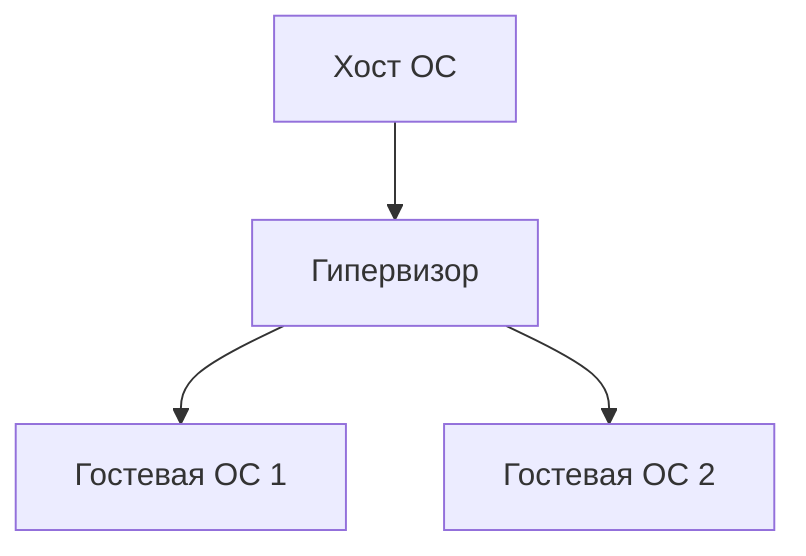

См. [Виртуализация](/encyclopedia/2-system-network/2-02-platformy/311).

---

## RAID — кратко для экзамена

| Уровень | Идея | Почему важно |
|---------|------|-------|
| RAID 0 | Чередование дисков | Скорость, нет отказоустойчивости |
| RAID 1 | Зеркало | Копия при отказе одного диска |
| RAID 5 | Чётность | Баланс ёмкости и надёжности |

Домашнему ПК чаще достаточно **одного SSD + бэкап**, не RAID.

---

## Типы памяти — сводка

| Тип | Энергозависимость | Скорость | Пример |
|-----|-------------------|----------|--------|
| SRAM | Да | Очень высокая | Кэш CPU |
| DRAM | Да | Высокая | ОЗУ DDR |
| Flash | Нет | Средняя | SSD, флешка |
| HDD | Нет | Ниже | Магнитные диски |

---

## Разъёмы питания GPU и БП

| Разъём | Назначение |
|--------|------------|
| 24-pin ATX | Материнская плата |
| 8-pin CPU | Питание процессора |
| 6+2-pin PCIe | Видеокарта |
| SATA power | HDD, SSD SATA |

<div class="callout callout--warning">
  <div class="callout-title">Совместимость БП</div>
  <div class="callout-body">Мощность БП должна покрывать **CPU + GPU + запас 20–30%**. Дешёвый БП — частая причина перезагрузок под нагрузкой.</div>
</div>

---

## Диагностика по POST-кодам и индикаторам

| Сигнал | Возможная причина |
|--------|-------------------|
| Нет изображения, вентиляторы крутятся | RAM, GPU, монитор |
| Писки BIOS | Код ошибки по таблице производителя |
| Сразу выключается | КЗ, БП, перегрев |
| Синий экран после загрузки ОС | Драйвер, диск, RAM |

---

## Температуры — ориентиры

| Компонент | Простой | Нагрузка |
|-----------|---------|----------|
| CPU | 30–45 °C | до 85–95 °C (зависит от модели) |
| GPU | 35–50 °C | до 80–90 °C |
| SSD | 30–50 °C | не выше ~70 °C длительно |

Пыль и высохшая термопаста повышают температуру.

---

## Выбор монитора

| Параметр | Для учёбы | Для игр |
|----------|-----------|---------|
| Диагональ | 24–27" | 27"+ |
| Разрешение | Full HD / 2K | 2K / 4K |
| Частота | 60 Гц | 144+ Гц |
| Матрица | IPS | IPS / VA |

---

## Клавиатуры и мыши — интерфейсы

| Интерфейс | Задержка | Питание |
|-----------|----------|---------|
| USB провод | Низкая | С ПК |
| Bluetooth | Выше | Батарея |
| 2.4 ГГц dongle | Низкая | Батарея |

---

## Принтеры — технологии

| Тип | Как работает | Где |
|-----|--------------|-----|
| Струйный | Капли чернил | Дом, фото |
| Лазерный | Тонер | Офис, много текста |
| МФУ | Печать + скан | Универсально |

**Драйвер** переводит команды ОС в язык устройства.

---

## Сканеры и веб-камеры

Оба относятся к **вводу** информации. Разрешение скана (dpi) влияет на размер файла; веб-камера — на качество видеосвязи.

---

## Сетевые карты и Wi-Fi модули

| Устройство | Уровень OSI (упрощённо) |
|------------|-------------------------|
| NIC Ethernet | Канальный + физический |
| Wi-Fi адаптер | То же, радиоканал |

В ноутбуке часто **комбо** Wi-Fi + Bluetooth на одной плате M.2.

---

## Кабели — краткий справочник

| Кабель | Передаёт |
|--------|----------|
| UTP Cat5e/6 | Ethernet до 1 Гбит/с |
| HDMI / DisplayPort | Видео (+ аудио в HDMI) |
| USB-C | Данные, питание, видео (Alt Mode) |
| SATA | Диск к плате |
| PCIe (внутри) | GPU, NVMe, платы расширения |

---

## Экологическая утилизация

Сдавайте старую технику в **пункты приёма**; батареи и аккумуляторы — отдельно. Личные данные на дисках **стирают** или физически уничтожают носитель.

---

## Сборка ПК — типичные ошибки новичка

| Ошибка | Последствие |
|--------|-------------|
| Не снять защиту с термопады | Перегрев CPU |
| Забыть standoff под платой | КЗ |
| Подключить монитор к материнской плате при наличии GPU | Низкая производительность |
| Одна планка RAM вместо двух каналов | Меньше пропускной способности памяти |

---

## Апгрейд по приоритету

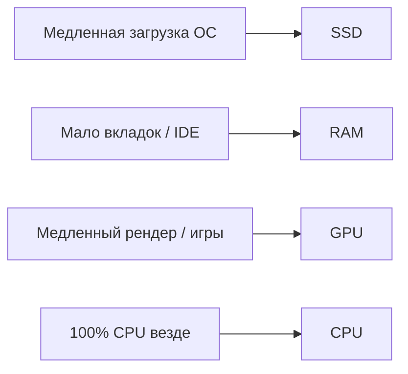

Чаще всего максимальный эффект даёт переход **HDD → SSD**.

---

## Апгрейд ноутбука

| Компонент | Обычно |
|-----------|--------|
| RAM | Иногда (SO-DIMM) |
| SSD | Часто (M.2 / 2.5") |
| CPU/GPU | Почти никогда (пайка) |
| Батарея | Замена на сервисе |

---

## Серверное железо и бытовое

| Признак | Сервер | Домашний ПК |
|---------|--------|-------------|
| ECC RAM | Часто | Редко |
| RAID | Типично | Редко |
| Удалённое управление | iDRAC, iLO | Нет |
| Шум | Высокий | Низкий–средний |

---

## Задачи ОГЭ/ЕГЭ — дополнительный набор

**21.** Какой шины **не** существует в обычном ПК: PCI Express, SATA, USB, TCP?

**Ответ:** **TCP** — протокол сети, не шина ПК.

**22.** Устройство одновременно **ввод и вывод**?

**Ответ:** Сенсорный экран, сетевая карта, модем (по учебнику).

**23.** Что хранится в **CMOS**?

**Ответ:** Настройки BIOS/UEFI, время (с батарейкой CR2032).

**24.** Почему важен **кэш L3**?

**Ответ:** Ускорить доступ CPU к данным между RAM и ядрами.

**25.** HDD 7200 об/мин и SSD — что быстрее на случайное чтение?

**Ответ:** **SSD** (нет механики головки).

---

## Таблица совместимости — память

| Параметр | Проверка |
|----------|----------|
| Тип DDR | DDR4 ≠ DDR5 |
| Форм-фактор | DIMM / SO-DIMM |
| Частота | Плата поддерживает XMP/EXPO |
| Каналы | 2 планки для dual channel |

---

## Таблица совместимости — накопители

| Интерфейс | Слот / кабель |
|-----------|---------------|
| NVMe PCIe | M.2 ключ M |
| SATA SSD | SATA порт + питание |
| HDD 3.5" | Отсек + SATA |

---

## Покупка б/у — риски

| Компонент | На что смотреть |
|-----------|-----------------|
| GPU | Майнинг, тест FurMark |
| SSD | SMART, износ TBW |
| БП | Бренд, не "ноунейм" |
| Ноутбук | Батарея, петли экрана |

---

## Чек-лист осмотра б/у ноутбука

- [ ] Включается с батареи и от сети
- [ ] Нет битых пикселей
- [ ] Клавиши и тачпад работают
- [ ] Wi-Fi и Bluetooth видны в ОС
- [ ] SMART диска без критических атрибутов

---

## Глоссарий — дополнение

| Термин | Пояснение |
|--------|-----------|
| TDP | Тепловыделение, ориентир для кулера |
| SoC | CPU + GPU + контроллеры на одном кристалле |
| Thunderbolt | Высокоскоростной USB-C с PCIe |
| Docking station | Док-станция для ноутбука |

---

## Практикум 2 — диагностика без разборки

| Шаг | Инструмент | Цель |
|-----|------------|------|
| 1 | Диспетчер устройств | Жёлтые значки драйверов |
| 2 | `msinfo32` / "Об системе" | Модель CPU, RAM |
| 3 | CrystalDiskInfo | Здоровье SSD |
| 4 | Диспетчер задач → Производительность | Загрузка CPU/RAM/GPU |

---

## Связь с программированием

Медленный диск увеличивает время **сборки** больших проектов; мало RAM — **своп** и лаг IDE. См. [Алгоритмы и код](./4).

---

## Итоговая таблица "устройство → роль"

| Устройство | Роль в машине фон Неймана |
|------------|---------------------------|
| CPU | Исполнение команд |
| RAM | Хранение открытых данных и программ |
| SSD/HDD | Долговременное хранение |
| GPU | Параллельные вычисления, вывод картинки |
| NIC | Обмен по сети |
| Клавиатура/мышь | Ввод команд пользователя |

---


## Сценарии сборки — игровой ПК (средний бюджет)

| Компонент | Ориентир | Заметка |
|-----------|----------|---------|
| CPU | 6+ ядер, современное поколение | Узкое место в играх реже CPU |
| GPU | Уровень под целевое разрешение | 1080p / 1440p / 4K |
| RAM | 16 ГБ DDR4/DDR5 | Dual channel — 2 планки |
| SSD | 1 ТБ NVMe | Игры + ОС |
| БП | 650–750 Вт, 80+ Bronze | Запас под пики GPU |
| Охлаждение | Башенный кулер или AIO | Корпус с airflow |

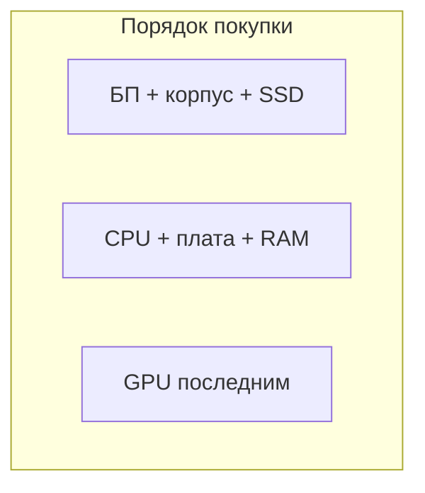

GPU дорожает быстрее — иногда выгоднее купить видеокарту первой, если акция.

---

## Сценарии сборки — офис и учёба

| Компонент | Достаточно |
|-----------|------------|
| CPU | 4 ядра, встроенная графика |
| RAM | 8–16 ГБ |
| SSD | 256–512 ГБ SATA/NVMe |
| GPU | Не нужна при iGPU |
| БП | 400–500 Вт |

Тихий корпус и IPS-монитор важнее мощной видеокарты.

---

## Сценарии — монтаж видео и 3D

| Компонент | Акцент |
|-----------|--------|
| CPU | Много ядер (рендер) |
| RAM | 32+ ГБ |
| SSD | Быстрый NVMe для кэша |
| GPU | CUDA/OpenCL для превью |

---

## Дерево диагностики "ПК не включается"

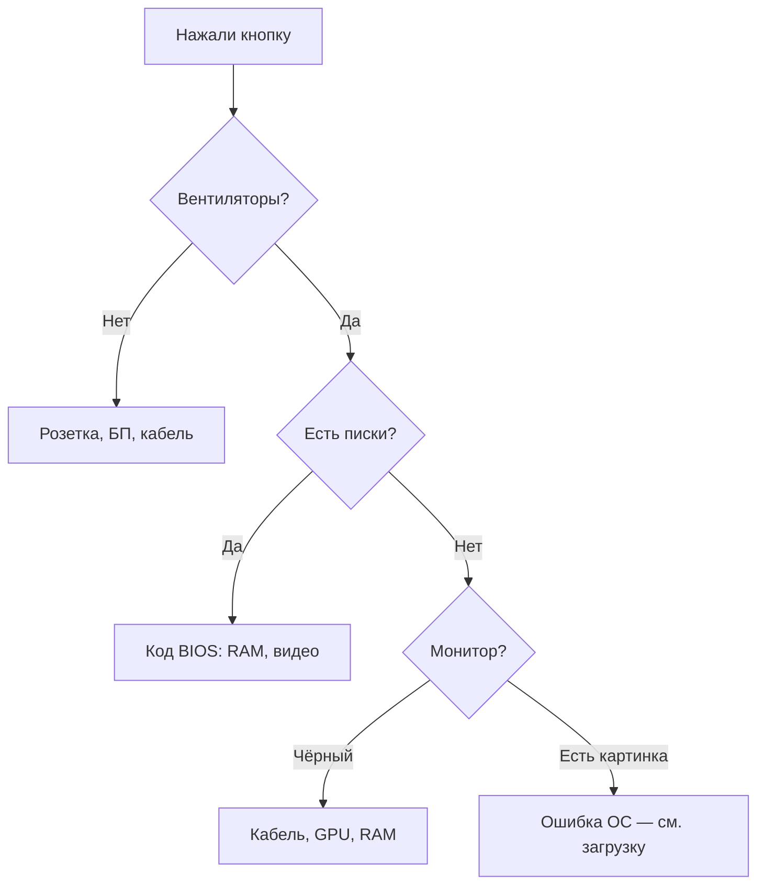

---

## Дерево "медленный компьютер"

| Симптом | Проверить |
|---------|-----------|
| Долгая загрузка | HDD и SSD |
| Тормоза при 20 вкладках | RAM, диспетчер задач |
| Лаги только в игре | GPU, температуры, драйвер |
| Всё тормозит + диск 100% | HDD износ, вирус, индексация |

---

## Совместимость корпуса

| Параметр | Проверка |
|----------|----------|
| Форм-фактор платы | ATX / mATX / ITX |
| Длина GPU | Спецификация корпуса |
| Высота кулера CPU | Зазор до боковой стенки |
| Отсеки 3,5" / 2,5" | Число HDD |

---

## Видеовыходы — куда подключать монитор

| Ситуация | Подключение |
|----------|-------------|
| Есть дискретная GPU | **Порты GPU**, не платы |
| Только встроенная графика | HDMI/DP/VGA на **плате** |
| Ноутбук + внешний монитор | USB-C / HDMI |

---

## Thunderbolt и USB4

Один кабель: питание, монитор, диски, док-станция. Нужны совместимые кабель и порт на ноутбуке.

---

## Оперативная память — тайминги и XMP

| Понятие | Смысл |
|---------|-------|
| JEDEC | Стандартная частота из коробки |
| XMP / EXPO | Профиль разгона в BIOS |
| CL | Задержки (latency) |

Включить XMP в BIOS — простой прирост, если плата и CPU поддерживают.

---

## NVMe — ключи M.2

| Ключ | Устройство |
|------|------------|
| M | NVMe SSD |
| B+M | SATA или NVMe (смотреть спецификацию) |
| E | Wi-Fi модуль |

---

## Звук ПК — цепочка

Микрофон/линейный вход → звуковая карта (встроенная или USB) → драйвер → приложение (Zoom, DAW).

---

## Печать по сети

Принтер с Wi-Fi/Ethernet получает IP; ПК отправляет задание по **протоколам печати** (IPP, иногда SMB). См. [Сеть](./6).

---

## KVM и переключатели

**KVM** — одна клавиатура/мышь/монитор на два ПК. Удобно для сервера и рабочей станции.

---

## Пыль — профилактика раз в 6–12 месяцев

1. Выключить из розетки.
2. Сжатый воздух (не вращать вентиляторы вслепую).
3. Термопаста CPU — раз в 2–3 года при росте температур.

---

## Заземление и ИБП

ИБП даёт время сохранить документы при отключении света; **стабилизатор** сглаживает просадки напряжения. Отдельно от **сетевого фильтра** без батареи — фильтр не продолжит питание при отключении света.

---

## Задачи ЕГЭ — с разбором

**Задача.** Укажите **только** устройства **вывода**: монитор, сканер, принтер, колонки, микрофон.

**Ответ:** монитор, принтер, колонки. Сканер и микрофон — **ввод**.

---

**Задача.** Почему флешка — и ввод, и вывод?

**Ответ.** Чтение с носителя — ввод в ПК; запись файла — вывод на носитель (устройство **ввода-вывода**).

---

## Сравнение Chromebook и ПК

| | Chromebook | Windows ПК |
|---|------------|------------|
| ОС | ChromeOS | Windows |
| Софт | В основном веб | Любой |
| Железо | Слабее, дёшево | Широкий диапазон |

---

## Raspberry Pi — одноплатник

ARM-CPU, GPIO-пины, учебные проекты IoT. Не замена игровому ПК, но отличная платформа для [Python](/encyclopedia/5-languages/5-02-python/intro).

---

## Облако и локальный ПК

| | Локально | Облако |
|---|----------|--------|
| Данные | У вас на диске | На сервере провайдера |
| Мощность | Ваше железо | Аренда VM |

---

## Таблица "симптом → действие" для ноутбука

| Симптом | Действие |
|---------|----------|
| Не держит заряд | Калибровка / замена батареи |
| Греется снизу | Подставка, чистка |
| Треск при открытии | Петли, сервис |
| Нет Wi-Fi | Fn+F?, драйвер, режим полёта |

---

## Глоссарий — ещё термины

| Термин | Пояснение |
|--------|-----------|
| VRM | Питание ядер CPU на плате |
| Chipset | Мост периферии |
| NVMe | Протокол быстрых SSD по PCIe |
| OLED | Матрица без подсветки, глубокий чёрный |

---

## Практикум 3 — апгрейд старого ПК

| Шаг | Действие |
|-----|----------|
| 1 | Узнать модель платы и CPU (CPU-Z) |
| 2 | Проверить слоты RAM и M.2 |
| 3 | Купить SSD — перенос ОС |
| 4 | Добавить RAM до 16 ГБ |
| 5 | Оценить, нужна ли GPU |

Часто **SSD + RAM** продлевают жизнь ПК на 3–5 лет.

---


## Гарантия и сервис — на что смотреть

| Тип покупки | Рекомендация |
|-------------|--------------|
| Новый ПК в магазине | Гарантия 1–3 года, сохранить чек |
| Компоненты по отдельности | RMA производителя, чек обязателен |
| Б/у | Тест перед оплатой, без гарантии — скидка |

Официальный сервис и "мастер у метро": для ноутбука под гарантией — только авторизованный центр.

---

## Типичные конфигурации "под ключ" — оценка

| Профиль | CPU | RAM | Накопитель | GPU |
|---------|-----|-----|------------|-----|
| Браузер + офис | 4 ядра | 8 ГБ | 256 ГБ SSD | iGPU |
| Учёба + IDE | 6 ядер | 16 ГБ | 512 ГБ NVMe | iGPU / бюджетная |
| Игры 1080p | 6–8 ядер | 16 ГБ | 1 ТБ NVMe | средний сегмент |
| Монтаж 4K | 8+ ядер | 32 ГБ | 1–2 ТБ NVMe | мощная + быстрый CPU |

Цифры ориентировочные; смотрите актуальные обзоры и [платформы](/encyclopedia/2-system-network/2-02-platformy/intro).

---

## Материнская плата — зоны ответственности

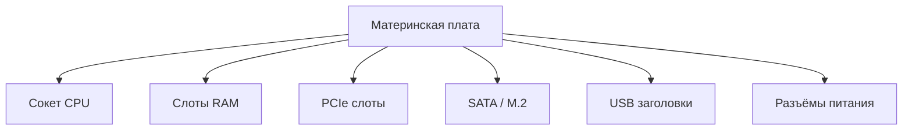

Плата **связывает** компоненты; не "ускоряет" сама по себе, но определяет **совместимость и расширение**.

---

## Внешние накопители — USB-диски и док-станции

| Устройство | Скорость | Применение |
|------------|----------|------------|
| USB-флешка 2.0 | до ~30 МБ/с | Перенос документов |
| USB 3.x SSD в корпусе | сотни МБ/с | Бэкап, библиотека |
| Док-станция Thunderbolt | PCIe устройства | Ноутбук как desktop |

---

## Сетевое оборудование в классе

| Устройство | Роль |
|------------|------|
| Школьный сервер | Хранение материалов |
| Коммутатор | Соединяет ПК в кабинете |
| Точка доступа | Wi-Fi для ноутбуков |
| Межсетевой экран | Фильтрация трафика (упрощённо) |

См. подробнее [Интернет и сервисы](./6).

---

## Экзамен — классификация по фон Нейману

| Компонент | Категория |
|-----------|-----------|
| Арифметико-логическое устройство (в CPU) | Устройство обработки |
| Устройство управления (в CPU) | Устройство обработки |
| ОЗУ | Запоминающее устройство |
| Жёсткий диск | Запоминающее устройство |
| Клавиатура | Устройство ввода |
| Монитор | Устройство вывода |
| Сетевая карта | Ввод-вывод |

---

## Частые путаницы на контрольных

| Неверно | Верно |
|---------|-------|
| "Процессор хранит файлы" | Файлы на **накопителе**; в CPU — только текущие команды |
| "ОЗУ = постоянная память" | ОЗУ **энергозависимое** |
| "Модем и роутер — одно и то же" | Модем — выход в провайдера; роутер — раздача в сети |
| "USB — это устройство" | USB — **интерфейс**; устройство — флешка, принтер |

---

## Итоговый FAQ — 10 вопросов

**1.** Что апгрейдить первым на старом ПК? — **SSD**.

**2.** Сколько RAM для учёбы программированию? — **16 ГБ** комфортно.

**3.** Нужна ли видеокарта для Word? — **Нет**, хватит встроенной.

**4.** Почему ПК шумит? — Высокая нагрузка, пыль, слабый кулер.

**5.** Можно ли смешивать планки RAM разной частоты? — Работает на **минимальной** из них.

**6.** NVMe всегда быстрее SATA SSD? — **Обычно да**, но для офиса разница не всегда заметна.

**7.** Почему полезен второй монитор? — Больше рабочего пространства, код + документация.

**8.** Что такое гарантия OEM? — Коробочная и для сборщиков; условия RMA различаются.

**9.** Почему ноутбук дороже desktop с тем же CPU? — Компактность, батарея, экран, охлаждение.

**10.** Где смотреть температуру? — HWMonitor, BIOS, диспетчер задач (GPU).

---

## Сводная таблица интерфейсов — шпаргалка

| Интерфейс | Типичная скорость | Устройства |
|-----------|-------------------|------------|
| USB 2.0 | до 480 Мбит/с | Мышь, старые флешки |
| USB 3.2 Gen 1 | 5 Гбит/с | SSD-флешки |
| USB 3.2 Gen 2 | 10 Гбит/с | Быстрые диски |
| SATA III | 6 Гбит/с | HDD, SSD 2.5" |
| PCIe 4.0 x4 NVMe | до ~7 ГБ/с чтения | Современные SSD |
| Gigabit Ethernet | 1 Гбит/с | Проводная сеть |
| Wi-Fi 6 | сотни Мбит/с | Беспроводной LAN |

<div class="callout callout--tip">
  <div class="callout-title">Для экзамена</div>
  <div class="callout-body">Достаточно знать <strong>назначение</strong> интерфейса и пример устройства; точные Гбит/с спрашивают редко, кроме сравнения "USB быстрее параллельного порта".</div>
</div>

---


## Финальная шпаргалка аппаратуры

| Компонент | Функция |
|-----------|---------|
| CPU | Выполнение команд |
| RAM | Быстрая память процессов |
| SSD/HDD | Файлы |
| GPU | Графика, параллельные вычисления |
| NIC | Сеть |
| БП | Питание |
| Материнская плата | Шина и слоты |

---

## Мифы о железе — развенчание

| Миф | Реальность |
|-----|------------|
| "Больше GHz = всегда быстрее" | Важны ядра, кэш, архитектура, задача |
| "Нужно полностью разряжать батарею ноутбука" | Li-ion лучше держать 20–80% для долгой жизни |
| "SSD не ломается" | Износ записи; нужен бэкап |
| "Больше RAM = всегда быстрее" | После достаточного объёма прироста нет |
| "Антивирус замедляет в 10 раз" | Современные — умеренный оверхед |
| "Магнит убьёт SSD" | SSD не магнитные пластины; сильный магнит HDD теоретически опасен |

---

## Чек-лист перед экзаменом по теме "Аппаратура"

- [ ] Знаю роли CPU, RAM, накопителя, материнской платы, БП
- [ ] Различаю ввод, вывод, ввод-вывод
- [ ] Понимаю цепочку включения ПК
- [ ] Могу сравнить HDD и SSD
- [ ] Знаю роли модема, роутера, коммутатора
- [ ] Понимаю, зачем драйвер
- [ ] Различаю цифровую и аналоговую ЭВМ
- [ ] Могу назвать 3 симптома и причину неисправности
- [ ] Знаю разницу ноутбук / desktop
- [ ] Прошёл оба интерактива в статье

<div class="callout callout--tip">
  <div class="callout-title">Итог главы</div>

  <div class="callout-body">
  Компьютер — это <strong>система</strong>: процессор исполняет команды, ОЗУ держит открытые данные, накопитель хранит файлы, периферия связывает с человеком, сеть — с другими машинами. Выбор и диагностика железа опираются на те же роли — не на маркетинговые цифры в вакууме.
</div>
</div>

---

Дальше по курсу — [ОС, файлы и утилиты](./5).

---
