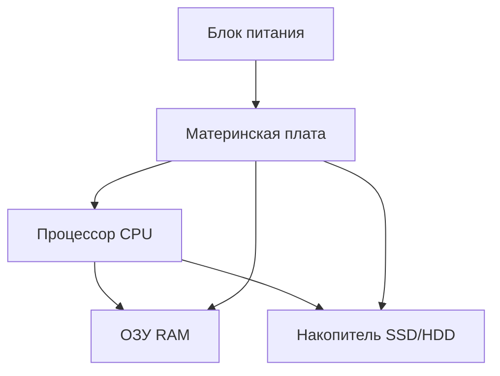

---
tags:
  - all
  - required
  - beginner
title: Компьютер, периферия и сетевое оборудование
description: >-
  Устройство ПК простыми словами: процессор, память, диски, ввод-вывод и сеть —
  с пояснением терминов и маршрутом по энциклопедии.
---

# Компьютер, периферия и сетевое оборудование

  ОБЯЗАТЕЛЬНО
  ДЛЯ НОВИЧКОВ

Всем

**Компьютер** в бытовом смысле — это системный блок (или ноутбук «всё в одном»), монитор, клавиатура, мышь и то, что вы к нему подключаете. Внутри работает простая схема: **ввод** → **обработка** → **вывод**. Программа и операционная система говорят железу, *что* именно обрабатывать.

Главный раздел по устройству — [Как работает компьютер](/encyclopedia/1-basics/1-08-kak-rabotaet-kompyuter/intro). Здесь — объяснения для школьного курса: что за что отвечает, какие слова встретите в учебнике и куда идти за деталями.

## Три слова, которые должны сложиться

| Термин | Одной фразой |
|--------|--------------|
| **CPU (процессор)** | «Мозг»: выполняет команды программ |
| **ОЗУ (RAM)** | «Стол»: здесь лежит то, с чем программа работает **прямо сейчас** |
| **Накопитель (HDD/SSD)** | «Шкаф»: файлы остаются **после выключения** |

★ **ОЗУ** очищается при отключении питания. Если вы написали текст в Word и **не сохранили**, он мог остаться только в ОЗУ — после сбоя пропадёт. **Сохранить** — значит записать на диск.

## Рекомендуемый маршрут по энциклопедии

Для первого прохода:

1. [Принцип работы](/encyclopedia/1-basics/1-08-kak-rabotaet-kompyuter/1) — общая схема ввода–обработки–вывода.
2. [Архитектура «кабинета»](/encyclopedia/1-basics/1-08-kak-rabotaet-kompyuter/7) — наглядная модель.
3. [Компоненты](/encyclopedia/1-basics/1-08-kak-rabotaet-kompyuter/2) — CPU, плата, ОЗУ.
4. [Накопители](/encyclopedia/1-basics/1-08-kak-rabotaet-kompyuter/3) — HDD, SSD, разделы.
5. [Периферия](/encyclopedia/1-basics/1-08-kak-rabotaet-kompyuter/5) — клавиатура, монитор, сеть.
6. По желанию: [Видеокарта](/encyclopedia/1-basics/1-08-kak-rabotaet-kompyuter/4), [Загрузка](/encyclopedia/1-basics/1-08-kak-rabotaet-kompyuter/6).

Глубокая теория (кэш, ISA, NUMA) — в [ЭВМ](/encyclopedia/1-basics/1-08-kak-rabotaet-kompyuter/8); для базового курса можно отложить.

## Что внутри системного блока

**Системный блок** — корпус с платой, процессором, памятью, диском и блоком питания. Ноутбук прячет то же самое в один корпус.

### Процессор (CPU)

Выполняет **миллиарды простых операций в секунду**: сложение, сравнение, переход к другой строке программы. Одна «тяжёлая» задача (игра, монтаж видео) нагружает CPU сильнее, чем набор текста.

★ **Ядро** — независимая вычислительная часть внутри одного процессора. «Четырёхъядерный» CPU может параллельно вести несколько потоков работы (с помощью ОС).

### Материнская плата и чипсет

**Материнская плата** — большая плата, на которой сидят процессор, слоты ОЗУ, разъёмы для дисков и USB. **Чипсет** — набор микросхем, который **связывает** CPU с памятью, видеокартой, дисками и портами. Без него процессор «не достанет» до периферии по единым правилам.

### ОЗУ (оперативная память)

Быстрая память для **открытых** программ и их данных. Чем больше вкладок в браузере и чем тяжелее редактор — тем больше занято ОЗУ. Если ОЗУ заканчивается, ОС начинает подгружать часть данных с диска — компьютер **тормозит**.

### Накопитель

Хранит **файлы**, **операционную систему** и **программы** между сеансами. SSD быстрее HDD; загрузка Windows с SSD заметно короче, чем с винчестера.

### Блок питания

Преобразует ток из розетки (220 В) в напряжения для плат и вентиляторов. Мощность (Вт) должна хватать на видеокарту и процессор — иначе ПК выключается под нагрузкой.

### Видеоадаптер (GPU)

Рисует картинку на мониторе. Может быть **встроенным** в процессор или **отдельной видеокартой**. Игры, 3D и нейросети сильно зависят от GPU; для офиса часто хватает встроенного.

| Компонент | Назначение | Где подробнее |
|-----------|------------|---------------|
| **CPU** | Команды программ | [1-08/2](/encyclopedia/1-basics/1-08-kak-rabotaet-kompyuter/2) |
| **Чипсет** | Связь CPU с остальным | [1-08/2](/encyclopedia/1-basics/1-08-kak-rabotaet-kompyuter/2) |
| **Материнская плата** | Основа сборки | [1-08/2](/encyclopedia/1-basics/1-08-kak-rabotaet-kompyuter/2) |
| **ОЗУ** | Рабочие данные «здесь и сейчас» | [1-08/2](/encyclopedia/1-basics/1-08-kak-rabotaet-kompyuter/2) |
| **Накопитель** | Файлы после выключения | [1-08/3](/encyclopedia/1-basics/1-08-kak-rabotaet-kompyuter/3) |
| **Блок питания** | Питание | [1-08/5](/encyclopedia/1-basics/1-08-kak-rabotaet-kompyuter/5) |
| **GPU** | Изображение, ускорение 3D | [1-08/4](/encyclopedia/1-basics/1-08-kak-rabotaet-kompyuter/4) |

## Накопители — HDD, SSD и «экзотика» из учебника

| Устройство | Как устроено | Где встречается сегодня |
|------------|--------------|-------------------------|
| **HDD** | Магнитные пластины, головка движется | Большие архивы, дешёвый объём |
| **SSD** | Флэш-память, без движущихся частей | Системный диск в ПК и ноутбуках |
| **NVMe SSD** | SSD через быструю шину PCIe | Современные ПК |
| **USB-флэш** | Флэш в корпусе | Перенос файлов |
| **Оптический дисковод** | Лазер читает CD/DVD | Редко; см. [главу про ОС](/encyclopedia/1-basics/1-035-bazovaya-informatika/5) |
| **Стример (ленточный)** | Магнитная лента в кассете | Резервные копии в дата-центрах |

★ **Дефрагментация** имела смысл для HDD: ускоряла чтение разбросанных по диску кусков. Для **SSD** её **не применяют** — лишний износ без выигрыша.

Подробно: [Накопители](/encyclopedia/1-basics/1-08-kak-rabotaet-kompyuter/3).

## Периферия — ввод и вывод

**Периферия** — всё, что снаружи системного блока (или подключается по USB, Bluetooth, Wi-Fi).

| Устройство | Ввод / вывод | Зачем нужно |
|------------|--------------|-------------|
| Клавиатура | Ввод | Текст, команды, игры |
| Мышь, трекпад | Ввод | Указатель на экране |
| Сканер | Ввод | Бумага → файл (PDF, JPG) |
| **Дигитайзер** | Ввод | Рисование пером **по экрану** (мониторы художников) |
| **Графический планшет** | Ввод | Отдельная плата + перо (Wacom и аналоги) |
| Сенсорный монитор | Ввод и вывод | Касание = координаты |
| Веб-камера | Ввод | Видео для звонков и записи |
| Микрофон | Ввод | Голос в цифровом виде |
| MIDI-клавиатура | Ввод | Ноты и команды для музыкальных программ |
| Монитор | Вывод | Картинка |
| Принтер | Вывод | Бумажная копия |
| **Плоттер** | Вывод | Широкоформатные чертежи, баннеры |
| **Проектор** | Вывод | Изображение на стену или экран |
| Колонки, наушники | Вывод | Звук |
| **Звуковая карта** | Ввод и вывод | Цифро-аналоговое преобразование для аудио |

Основная статья: [Периферия](/encyclopedia/1-basics/1-08-kak-rabotaet-kompyuter/5). Эргономика клавиатуры: [1-08/713](/encyclopedia/1-basics/1-08-kak-rabotaet-kompyuter/713).

### Драйвер — зачем он нужен

★ **Драйвер** — программа, которая учит ОС **говорить с конкретной моделью** устройства (принтер HP, видеокарта NVIDIA). Без драйвера Windows может «видеть» устройство, но печатать или показывать картинку корректно.

Драйверы ставят с диска производителя, с сайта или через **Windows Update**.

## Сетевое оборудование дома и в классе

Даже один ПК «в интернете» опирается на цепочку устройств:

| Устройство | Роль простыми словами |
|------------|------------------------|
| **Сетевой адаптер (NIC)** | «Сетевая карта» ПК: провод Ethernet или Wi-Fi |
| **Коммутатор (switch)** | Раздаёт трафик между устройствами в **локальной** сети (кабинет, офис) |
| **Маршрутизатор (router)** | Соединяет **домашнюю сеть** с **интернетом**, раздаёт IP-адреса |
| **Модем** | Переводит сигнал **провайдера** (оптика, DSL, кабель) в сигнал для роутера |
| **Точка доступа Wi-Fi** | Беспроводной вход в LAN (часто встроена в домашний роутер) |

Дома обычно один **роутер** совмещает Wi-Fi, раздачу адресов (DHCP) и выход в интернет.

Подробнее: [Сетевые устройства](/encyclopedia/2-system-network/2-03-set-i-internet/21), [Wi-Fi и Bluetooth](/encyclopedia/2-system-network/2-03-set-i-internet/71), [Сеть — основы](/encyclopedia/2-system-network/2-03-set-i-internet/1).

  
Самопроверка

  <ol>
    <li>Куда пропадёт несохранённый документ при внезапном отключении — из ОЗУ или с диска?</li>
    <li>Чем SSD принципиально отличается от HDD по конструкции?</li>
    <li>Зачем принтеру драйвер?</li>
  </ol>

Дальше: [ОС, файлы и утилиты](/encyclopedia/1-basics/1-035-bazovaya-informatika/5).

---
