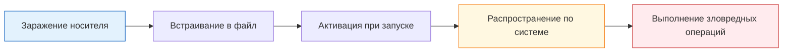

---
tags:
  - all
  - required
  - beginner
title: Безопасность для обычного пользователя
description: Антивирусные программы и средства защиты личного компьютера.
---

# Безопасность для обычного пользователя

<div class="article-tags">
  <span class="tag tag-required">ОБЯЗАТЕЛЬНО</span>
  <span class="tag tag-beginner">ДЛЯ НОВИЧКОВ</span>
</div>

<span class="complexity-badge">Всем</span>

---

## Безопасность для обычного пользователя

Ключевые программы в части безопасности:
- Windows Defender;
- Kaspersky Virus Removal Tool;
- ESET;
- Avast.

Работа с компьютером, особенно подключённым к сети, неотделима от рисков. В отличие от физического мира, где угрозы вроде пожара или кражи требуют явного физического присутствия, цифровые угрозы могут проникнуть в систему мгновенно, незаметно и без участия пользователя — через уязвимости в ПО, фишинговые сайты, заражённые вложения или даже через обновления подменённых приложений.  

**Безопасность устройства** — это целая **экосистема защитных механизмов**:  
- **превентивных** (предотвращают проникновение угроз),  
- **реактивных** (обнаруживают и устраняют уже внедрённые угрозы),  
- **восстановительных** (обеспечивают возврат к безопасному состоянию после инцидента).  

Эта глава посвящена двум ключевым компонентам этой экосистемы: **антивирусному ПО** и **межсетевым экранам (файерволам)**. Мы разберём, как они устроены "под капотом", какие подходы к детектированию и нейтрализации угроз применяются, как взаимодействуют с операционной системой, как их правильно устанавливать, настраивать и использовать — без излишней драматизации и без упрощения.

---

## Основы цифровой безопасности

**Цифровая безопасность устройства** — это совокупность мер защиты информации и ресурсов компьютера от несанкционированного доступа, повреждений или кражи. **Информационная безопасность** охватывает защиту данных при их создании, хранении, передаче и уничтожении.

Работа с компьютером в сети требует соблюдения базовых правил для сохранения целостности системы и конфиденциальности личных данных. Эти правила формируют ежедневную практику безопасного использования цифровых технологий.

Принципы работы с компьютером в интернете включают следующие аспекты:

1. Регулярное обновление операционной системы и приложений;
2. Использование сложных паролей для каждого сервиса;
3. Включение двухфакторной аутентификации на важных аккаунтах;
4. Предосторожность при открытии подозрительных файлов и ссылок;
5. Сохранение резервных копий важной информации.

---

## Типы угроз цифровой среды

**Угроза** представляет собой потенциальную опасность для сохранности данных, функциональности оборудования или стабильности работы программных систем. Угрозы делятся на две основные категории по природе возникновения.

---

### Физические угрозы

Физические угрозы связаны с непосредственным воздействием на аппаратное оборудование:

| Вид угрозы | Описание | Пример воздействия |
|----------|----------|-------------------|
| Кража оборудования | Прямое изъятие устройства | Украденный ноутбук |
| Повреждение компонентов | Механический или электрический вред | Переполнение питания, влага |
| Стихийные бедствия | Естественные катастрофы | Пожар, затопление |
| Недостатки электросети | Перепады напряжения, нестабильность | Скачки тока в розетке |

---

### Программные угрозы

Программные угрозы исходят от вредоносного кода или ошибочных действий пользователей:

| Вид угрозы | Описание | Уровень опасности |
|----------|----------|------------------|
| Вирусы | Программы способные к самовоспроизведению | Высокий |
| Спам | Нежелательные сообщения | Средний |
| Фишинг | Поддельные запросы данных | Высокий |
| Утечка данных | Доступ посторонних лиц | Критический |

---

## Компьютерные вирусы и классификация

**Компьютерный вирус** — это специализированная программа созданная для проникновения в другие файлы или программы без разрешения владельца системы. Основная цель распространения вируса заключается в изменении поведения целевого программного обеспечения.

Механизм действия вируса основывается на нескольких этапах:



Классификация вирусов включает следующие группы по механизму заражения:

| Категория | Способ проникновения | Место нахождения |
|----------|---------------------|------------------|
| Файловые вирусы | Внедрение в исполняемые файлы | .exe, .com, .bat |
| Загрузочные вирусы | Заражение секторов диска | Boot-сектор |
| Скриптовые вирусы | Выполнение через интерпретатор | HTML, JavaScript |
| Макровирусы | Внедрение в документы Office | .doc, .xls |
| Сетевые вирусы | Использование сетевых протоколов | Интернет-соединение |

---

## Источники заражения вредоносным ПО

Существует множество путей проникновения вредоносного программного обеспечения на устройство. Пользователи сталкиваются с потенциальной опасностью в различных ситуациях повседневного использования цифровых устройств.

Вероятные источники заражения включают:

- Получение файлов с неизвестных сайтов и файлообменников;
- Открытие вложений в электронных письмах от незнакомых отправителей;
- Переход по ссылкам в социальных сетях и мессенджерах;
- Использование пиратского программного обеспечения;
- Установка расширений браузера сомнительного происхождения;
- Подключение внешних носителей без проверки.

Специалисты рекомендуют воздержаться от выполнения следующих действий:

<details>
<summary>
<b>На что обратить внимание при получении файлов</b>
</summary>

- Проверять расширение файла перед открытием;
- Открывать документы только после подтверждения источника;
- Не выполнять автоматические загрузки из непроверенных источников;
- Сканировать полученные файлы антивирусными инструментами.

</details>

<div class="callout callout--tip">
<div class="callout-title">Рекомендация безопасности</div>

  <div class="callout-body">
Сохраняйте оригинальность электронных адресов отправителей и проверяйте доменное имя в почте.
</div>
  </div>


---

## Категории вредоносного программного обеспечения

Современное вредоносное программное обеспечение различается по назначению и механизму воздействия на систему. Каждая категория выполняет определённые функции внутри заражённого устройства.

---

### Черви

**Черви** представляют собой автономные программы способные к самостоятельному распространению через сеть без необходимости участия человека. Они используют уязвимости операционной системы и почтовых клиентов для передачи копии себе.

Основные характеристики червей:

- Самостоятельное распространение по сетевым соединениям;
- Отсутствие необходимости прикрепления к другим файлам;
- Высокая скорость тиражирования в электронной почте;
- Создание дополнительных загрузчиков и эксплойтов.

---

### Троянские программы

**Трояны** маскируются под легитимное программное обеспечение для обхода защитных средств пользователя. Они скрывают свою реальную функцию до момента активации злоумышленниками.

Типичное поведение троянов включает:

- Сбор паролей и учетных данных;
- Открытие удалённого доступа к системе;
- Скачивание дополнительного вредоносного кода;
- Модификация настроек безопасности.

---

### Рекламное ПО

**Рекламное ПО** показывает навязчивую рекламу и перенаправляет пользователей на рекламные сайты. Оно часто устанавливается вместе с бесплатными программами как дополнительное приложение.

Характерные признаки рекламного ПО:

- Постоянное появление всплывающих окон;
- Изменение главной страницы браузера;
- Перенаправление поисковых запросов на сторонние ресурсы;
- Снижение производительности системы.

---

### Шпионское ПО

**Шпионское ПО** собирает информацию о деятельности пользователя без его ведома. Программа отслеживает ввод данных, историю посещений и настройки системы.

Цели сбора данных шпионским ПО:

- Регистрация нажатий клавиш (кейлоггеры);
- Сохранение истории браузера и закладок;
- Сбор финансовых реквизитов;
- Фотографирование через веб-камеру.

---

### Майнеры

**Майнеры** используют вычислительные ресурсы процессора и видеокарты для получения криптовалюты. Это приводит к значительному снижению скорости работы устройства.

Признаки присутствия майнеров:

- Высокая загрузка процессора без активных задач;
- Повышенная температура оборудования;
- Шум вентиляторов в состоянии покоя;
- Замедление запуска программ.

---

### Вымогатели

**Вымогатели** блокируют доступ к файлам или системе с требованием выплаты денег за разблокировку. Данные шифруются сложными алгоритмами без возможности восстановления без ключа.

Этапы действия вымогателей:

1. Инфильтрация в систему;
2. Поиск чувствительных файлов;
3. Шифрование данных ключами злоумышленников;
4. Требование оплаты биткоином или альткоинами.

---

## Сетевые атаки и кража информации

**Сетевая атака** представляет собой организованное воздействие на компьютерные сети и системы с целью нарушения их работоспособности или доступа к защищённым данным. Атакующие используют технические уязвимости и человеческие ошибки.

Возможные цели хищения информации хакерами:

| Тип данных | Ценность для злоумышленников |
|-----------|----------------------------|
| Платежные реквизиты | Финансовая транзакция |
| Личные пароли | Контроль над учётными записями |
| Банковские номера | Кража денежных средств |
| Персональные данные | Продажа баз или мошенничество |
| Документы компании | Конкурентное преимущество |

Механизмы реализации сетевой атаки включают использование взломанных систем связи, перехват трафика через общедоступные Wi-Fi точки, подмену сайтов фишинговыми аналогами.

---

## Методы обнаружения вредоносного ПО

Определение наличия вирусов в системе требует комплексного подхода включающего наблюдение за поведением устройства и анализ технических показателей. Существуют явные признаки активности вредоносных программ.

Симптомы заражения системы:

- Необычное замедление работы компьютера;
- Автоматическое открытие окон браузера;
- Появление новых ярлыков и программ;
- Изменение настроек домашней страницы;
- Блокировка доступа к антивирусным сайтам.

Проверка системы на наличие угроз осуществляется следующими способами:

- Полное сканирование антивирусным программным обеспечением;
- Анализ запущенных процессов в диспетчере задач;
- Исследование сетевого трафика специальных утилитами;
- Проверка автозагрузки через конфигурацию системы.

<div class="callout callout--warning">
<div class="callout-title">Предупреждение</div>

  <div class="callout-body">
Не игнорируйте предупреждения антивирусных программ даже при однократном появлении.
</div>
  </div>


---

## Удаление вирусов и восстановление системы

После обнаружения инфекции требуется последовательное удаление вредоносных компонентов и восстановление нормальной работы. Процесс очистки включает несколько обязательных этапов.

Алгоритм действий при выявлении вируса:

1. Изоляция устройства от сети интернет;
2. Запуск полной диагностики антивирусом;
3. Обнаружение и изоляция всех заражённых файлов;
4. Удаление обнаруженных угроз;
5. Проверка результатов повторным сканированием.

Методы удаления вредоносных программ:

- Автоматическая очистка штатными средствами операционной системы;
- Использование специализированных утилит-дезинфекторов;
- Восстановление системы до предыдущего состояния;
- Очистка реестра и автозапуска вручную;
- Переустановка операционной системы при критических повреждениях.

Для эффективного удаления рекомендуется сохранять все важные файлы на внешние носители до начала процесса очистки. После завершения процедуры необходимо выполнить полное сканирование внешнего накопителя.

---

## Основные программы безопасности

Специализированные инструменты предназначены для обнаружения и нейтрализации угроз в цифровой среде. Каждый продукт имеет свои особенности и методы работы с системами безопасности.

---

### Windows Defender

**Windows Defender** — встроенное решение безопасности операционной системы Microsoft Windows. Программа обеспечивает постоянную защиту в фоновом режиме без дополнительных затрат.

Преимущества решения:

- Интеграция с системой на уровне ядра;
- Минимальное влияние на производительность;
- Бесплатное использование для конечных пользователей;
- Регулярное обновление вирусных баз.

Недостатки продукта заключаются в более низком проценте обнаружения угроз по сравнению со специализированными продуктами. Рекомендуется использовать дополнительные средства для усиления защиты.

---

### Kaspersky Virus Removal Tool

**Kaspersky Virus Removal Tool** — бесплатная утилита для сканирования и удаления заражений без установки постоянной защиты. Продукт применяется для однократной очистки инфицированного компьютера.

Возможности инструмента:

- Сканирование всех типов носителей информации;
- Работа с глубоко скрытыми угрозами;
- Возможность создания загрузочной флешки;
- Обновление баз через интернет.

Программа предназначена для временного использования при возникновении проблем с безопасностью. Для постоянной защиты необходим полноценный антивирусный пакет.

---

### ESET NOD32

**ESET NOD32** — профессиональное антивирусное решение с высокой степенью обнаружения угроз. Продукт отличается низким потреблением ресурсов при максимальной эффективности.

Характеристики продукта:

- Технологичность распознавания новых штаммов;
- Настройка политики безопасности под задачи пользователя;
- Защита веб-трафика в реальном времени;
- Управление правами доступа к файлам.

Инструмент подходит для офисных компьютеров и домашних машин с высокими требованиями к безопасности. Лицензионная версия требует ежегодной оплаты обслуживания.

---

### Avast Antivirus

**Avast** — популярное антивирусное программное обеспечение с широкими возможностями для обычных пользователей. Версии включают бесплатную и платную комплектацию.

Функциональные особенности:

- Мониторинг безопасности банковских операций;
- Сканер уязвимостей беспроводных сетей;
- Защита камер видеонаблюдения;
- Контроль активности социальных сетей.

Инструмент отличается дружественным интерфейсом и широким набором инструментов для продвинутых пользователей. Требуется установка дополнительного софта для расширенного функционала.

---

## Антивирус и межсетевой экран

**Антивирус** — комплекс программ предназначенный для выявления и предотвращения распространения вирусов на устройстве. Система работает в трёх основных направлениях поиска угроз.

Основные компоненты антивирусного комплекса:

| Компонент | Функция | Принцип работы |
|----------|---------|---------------|
| Движок | Обработка сигнатур | Сравнение с эталонными образцами |
| Модуль обновления | Получение новых баз | Автозагрузка через сеть |
| Интерфейс | Управление пользователем | Окно настроек и опций |
| Сканер | Проверка файлов | Сканирование диска на лету |

**Межсетевой экран** или **фаервол** контролирует входящий и исходящий трафик между системой и внешними сетями. Устройство пропускает разрешённые подключения и блокирует подозрительные запросы.

Задачи фаервола включают:

- Фильтрация пакетов данных по правилам безопасности;
- Блокировка портов неиспользуемых программ;
- Уведомление о попытках подключения к системе;
- Защита от несанкционированных соединений.

Фаерволы подразделяются на два типа по уровню контроля:

- Программные — работают на уровне операционной системы;
- Аппаратные — размещены на сетевых маршрутизаторах.

Примеры программных решений:

- Брандмауэр Windows;
- ZoneAlarm Free Firewall;
- Comodo Firewall Pro.

---

## Принципы анализа угроз антивирусными движками

Алгоритмы обнаружения вирусов базируются на нескольких методах анализа содержимого файлов и поведения программ. Каждый метод имеет свои преимущества и ограничения в рамках безопасности.

---

### Сигнатурный анализ

**Сигнатурный анализ** — сравнение контрольных сумм файлов с известными базами вирусов. Программа сверяет хэш-код проверяемого объекта с эталонами вредоносных программ.

Преимущества метода:

- Точность определения известных угроз;
- Низкая нагрузка на центральный процессор;
- Быстрое завершение проверки;
- Минимальные ложные срабатывания.

Недостатки метода:

- Бесполезен против новых модификаций;
- Зависимость от своевременности обновлений;
- Невозможность обнаружения полиморфных угроз;
- Необходимость частой синхронизации баз.

---

### Эвристический анализ

**Эвристический анализ** — предсказание опасности файлов по косвенным признакам и аналогиям с уже известными угрозами. Программа оценивает вероятность вредоносного поведения объекта.

Подходы эвристики включают:

- Исследование структуры кода на подозрительные конструкции;
- Проверка попытки изменить системные разделы;
- Анализ запросов к реестру на риски;
- Сверка с поведением других файлов системы.

Эвристика позволяет обнаруживать угрозы до появления сигнатур в базах данных производителей антивирусов. Однако метод склонен к ложным срабатываниям на легитимное программное обеспечение.

---

### Поведенческий анализ

**Поведенческий анализ** — наблюдение за активностью программ во время их выполнения в реальном времени. Движок фиксирует действия вызываемые кодом и реагирует при нарушении политик безопасности.

Объекты наблюдения при анализе:

- Попытки изменения системных параметров;
- Создание файлов с произвольными расширениями;
- Доступ к конфиденциальным областям памяти;
- Инициализация сетевых подключений.

Поведенческая защита наиболее эффективна при работе с новыми видами вредоносных программ и неизвестными угрозами. Технология активно используется облачными платформами безопасности.

---

## Под капотом — как антивирус цепляется к системе

| Механизм | Что делает |
|----------|------------|
| **Драйвер minifilter** | Перехват чтения/записи файлов до открытия приложением |
| **AMSI** | Сканирование скриптов PowerShell, VBA, JS внутри Office |
| **Облачная репутация** | Хеш файла → запрос к серверу → вердикт за миллисекунды |
| **Песочница** | Запуск подозрительного `.exe` в изолированной среде (Pro/корпоративные линейки) |

**Защитник Windows** встроен в ОС: обновления сигнатур через Windows Update, интеграция с SmartScreen при скачивании из Edge.

**Фаервол** — фильтрация **пакетов** по правилам (порт, направление, профиль "домашняя/общественная сеть"). Stateful: ответ на исходящий запрос пропускается автоматически. Блокировка **входящих** на домашнем ПК обычно уже закрыта роутером NAT; фаервол ОС важен в кафе и при трояне, открывающем порт.

```text
Скачивание .exe → SmartScreen → при запуске minifilter + поведение → карантин / блок
```

---

## Опыт, мнение и истории

**Ложное срабатывание.** Самописная утилита для бэкапа попала в карантин Kaspersky — эвристика увидела "массовое копирование". Добавление в исключения + цифровая подпись (позже) — нормальный путь для своих скриптов.

**"Второй антивирус".** Установили Avast поверх Defender — тормоза, конфликты, два сканера на один файл. На Windows 11 достаточно **одного** активного защитника; второй — on-demand сканер (раз в месяц) без постоянного щита.

**Фишинг.** Письмо "блокировка карты" с ссылкой на клон банка — сработала привычка: **не кликать**, открыть приложение банка вручную. Антивирус не заменяет внимание к адресной строке.

**Мнение.** Бесплатный Defender для дома — разумная база. Платные пакеты оправданы при детском контроле, банковском сейфе в одном окне или корпоративной политике. Главное — обновления ОС и здравый смысл при установке `.exe` из почты.

---
