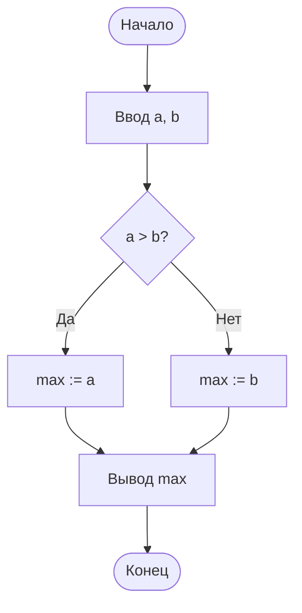

---
tags:
  - all
  - required
  - beginner
  - inprogress
title: Алгоритмы, языки и программирование
description: >-
  Алгоритмизация, блок-схемы, классификация языков, этапы создания программы и
  маршрут по Visual Basic — со ссылками на разделы "Программа" и "Код".
---

import CompilerSimulator from '@site/src/components/CompilerSimulator.jsx';

# Алгоритмы, языки и программирование

  ОБЯЗАТЕЛЬНО
  ДЛЯ НОВИЧКОВ
  В РАЗРАБОТКЕ

Всем

Программа — это инструкции для компьютера. 

---

## Вступление — почему алгоритмы идут раньше языков

Эта глава закрывает одну из самых частых методических ошибок новичка — начинать с синтаксиса языка, не освоив алгоритмическое мышление. Когда человек сразу запоминает конструкции `if`, `for`, `while`, но не умеет формализовать задачу, код получается механическим и хрупким.

Правильная последовательность обратная — сначала постановка задачи и логика решения, затем запись в виде алгоритма (словами, схемой, псевдокодом), и только потом — перенос в конкретный язык программирования. Именно так формируется переносимый навык, который работает в любом стеке — от Visual Basic и Python до современных языков.

Поэтому в этой теме опорой служит дисциплина мышления — входные данные, условия, ветвления, циклы, проверка граничных случаев. Если этот каркас освоен, дальнейшее изучение языков и инструментов становится в разы быстрее и осмысленнее.

**Алгоритм** — план решения задачи, который можно выполнить по шагам. 

В школе часто учат сначала алгоритмы и блок-схемы, затем язык (Visual Basic, Python или другой). 

Подробности про ПО — [Программа](/encyclopedia/1-basics/1-19-programma/intro), а здесь — база для курса информатики.

---

## Что такое алгоритм

> **Алгоритм** — конечная последовательность шагов с понятными правилами, которая за конечное время приводит к результату.

  
Углубление в энциклопедии

  

  Школьная глава даёт основу; развернутый разбор свойств алгоритмов, блок-схем и примеров из программирования — в разделе <strong>"Код и разработка"</strong>: <a href="/encyclopedia/4-code-dev/4-01-algoritmy/intro">Алгоритмы — о разделе</a>, вводная статья <a href="/encyclopedia/4-code-dev/4-01-algoritmy/1">Алгоритмы</a> (интерактивные блок-схемы, свойства, примеры на языках).

  

Свойства, которые обычно перечисляют в учебнике —

- **Дискретность** — шаги отделены друг от друга.
- **Понятность** — исполнитель (человек или машина) знает, что делать на каждом шаге.
- **Конечность** — алгоритм завершается.
- **Результат** — после выполнения получаем ответ или изменение данных.

Пример из быта — "налить чай" — проверить чайник, вскипятить воду, залить в чашку. Это алгоритм; программа на VB/Python — его запись для компьютера.

Важный школьный навык — отделять **идею решения** от конкретного языка. Один и тот же алгоритм можно записать блок-схемой, псевдокодом, на Python или на VB.NET, и суть от этого не меняется.

Термин в глоссарии — [Алгоритм](/glossary/А#алгоритм).

---

## Блок-схемы

Блок-схема — **графическое** описание алгоритма. Удобна на уроке и на экзамене.

Типовые блоки (ГОСТ 19.701 и учебная традиция) —

| Символ | Назначение |
|--------|------------|
| Овал / скругление | Начало, конец |
| Параллелограмм | Ввод, вывод |
| Прямоугольник | Вычисление, действие |
| Ромб | Условие (ветвление) |
| Контур с подписью | Цикл |

**Ветвление —** `если условие то … иначе …`  
**Цикл —** `пока условие` или `для i от 1 до n` — повторение шагов.

**Три семейства циклов в коде** (развёрнуто — [Циклы](/encyclopedia/4-code-dev/4-02-chto-takoe-kod-i-kak-on-rabotaet/5)):

| Идея | Псевдокод | Пример в JavaScript |
|------|-----------|---------------------|
| Счётный цикл | `для i от 1 до n` | `for (let i = 0; i < n; i++)` |
| Условный цикл | `пока условие` | `while (условие)` |
| Перебор коллекции | `для каждого элемента` | `for (const x of список)` |

В JavaScript дополнительно есть `do…while` (минимум одна итерация) и `for…in` (перебор ключей объекта). На Python и Java синтаксис другой, но логика та же — [Python](/encyclopedia/5-languages/5-02-python/23), [Java](/encyclopedia/5-languages/5-03-java/17).

Типичная ошибка новичка в схемах и коде одинакова — забывают обновлять переменную цикла или не обрабатывают "пограничный" случай (пустой ввод, ноль, отрицательное число).

  
Практика

  

  Запишите блок-схему для задачи "проверить, чётное ли число n". Затем перепишите её на псевдокоде, потом — на языке, который проходите в классе. Сверьте — все ветки и циклы совпадают?

  

---

## От алгоритма к программе

1. **Постановка задачи** — что на входе, что на выходе.
2. **Алгоритм** — словами или блок-схемой.
3. **Программа** — код на языке.
4. **Тест** — проверка на примерах (в том числе граничных — 0, пустая строка).

★ **Программа** — файл с командами на языке, понятном человеку и транслятору (компилятору или интерпретатору). См. [Что такое программа](/encyclopedia/1-basics/1-19-programma/1).

После запуска та же логика превращается в **процесс** в оперативной памяти; внутри процесса ОС может вести несколько **потоков** — параллельных цепочек инструкций с общими данными. Схема «диск → RAM → потоки» и примеры из диспетчера задач — [программа, процесс и поток](/encyclopedia/1-basics/1-19-programma/1#programma-protsess-potok).

**Компиляция** — весь код переводят в исполняемый файл заранее (C, Pascal, VB.NET).  
**Интерпретация** — команды выполняются построчно (Python в классическом учебном режиме). Подробнее — [Компиляторы и интерпретаторы](/encyclopedia/1-basics/1-19-programma/2).

Практика показывает — проблемы в программе чаще связаны с постановкой задачи и полнотой тестов. Поэтому этап "что на входе и что на выходе" критически важен.

---

### Интерактив — компилятор и интерпретатор

Перед запуском сформулируйте гипотезу — что будет происходить быстрее при повторном запуске — заранее скомпилированная программа или интерпретируемый скрипт.

<CompilerSimulator />

После демо зафиксируйте ответ в одном предложении — чем отличаются этапы "написать -> выполнить" у компиляции и интерпретации, и где это важно в реальной практике.

---

## Классификация языков (кратко)

| Уровень / признак | Примеры | Комментарий |
|-------------------|---------|-------------|
| Машинный код | опкоды `B4 0E`, `CD 10` | Выполняет CPU напрямую; запись — нули и единицы |
| **Низкоуровневые** | [ассемблер](/encyclopedia/5-languages/5-16-starye-yazyki/assembler/intro) (x86, ARM), CIL | Мнемоники вместо двоичных кодов; привязка к архитектуре |
| **Высокоуровневые** | Python, Java, C#, VB | Абстракции вместо длинного машинного кода; переносимость через компилятор/VM |
| Средний уровень | C, C++, Rust, Go | Абстракции + контроль памяти и скорости |
| Компилируемые | C, Go, VB.NET | Сначала `.exe` / бинарник |
| Интерпретируемые | Python, JavaScript | Запуск через интерпретатор |
| Процедурные | C, Pascal | Последовательность процедур |
| Объектно-ориентированные | Java, C#, Python | Объекты с полями и методами |

**Низкоуровневый язык** близок к машинным командам: одна **мнемоника** обычно даёт одну инструкцию процессора; **макросы** и **директивы** ассемблера (константы, секции `.data` / `.text`) разворачиваются при сборке. Подробный курс — [Ассемблер — о разделе](/encyclopedia/5-languages/5-16-starye-yazyki/assembler/intro), [Основы ассемблера](/encyclopedia/5-languages/5-16-starye-yazyki/assembler/2).

**Высокоуровневый язык** экономит текст за счёт абстракций (типы, циклы, библиотеки). Смысл алгоритма отделяют от платформы; для каждой ОС и процессора нужен свой транслятор. Программу «написал один раз — везде работает» без правок удаётся лишь для задач с малым числом системных вызовов; GUI и мультимедиа почти всегда требуют адаптации или общих библиотек.

Развёрнуто — [таблица уровней с примерами языков](/encyclopedia/1-basics/1-24-osnovnye-yazyki/6#urovni-yazyka), [Уровни абстракции языков](/encyclopedia/4-code-dev/4-02-chto-takoe-kod-i-kak-on-rabotaet/55), [Парадигмы и уровни абстракции](/encyclopedia/4-code-dev/4-07-paradigmy-i-urovni-abstraktsii/111), [Основные языки](/encyclopedia/1-basics/1-24-osnovnye-yazyki/intro).

  
Язык ассемблера в энциклопедии

  

  Если в таблице выше заинтересовала строка про низкоуровневые языки — откройте раздел <a href="/encyclopedia/5-languages/5-16-starye-yazyki/assembler/intro">Ассемблер</a>: там разведены <strong>язык</strong>, программа-<strong>ассемблер</strong> и <strong>дизассемблер</strong>, а маршрут ведёт от <a href="/encyclopedia/5-languages/5-16-starye-yazyki/assembler/2">основ синтаксиса</a> к <a href="/encyclopedia/5-languages/5-16-starye-yazyki/assembler/7">первой программе</a>.

---

## Словарь главы — формулировки, которые стоит запомнить

Эти термины связывают школьный курс с разделами [Программа](/encyclopedia/1-basics/1-19-programma/intro) и [Код и разработка](/encyclopedia/4-code-dev/code-dev).

| Термин | Краткое определение |
|--------|-------------------|
| **Вычисление** | Преобразование входных данных в выходные по правилам (от `2 × 2` до прогноза по опросу) |
| **Программирование** | Создание программ; в узком смысле — написание исходного кода на языке |
| **Исходный текст** | Запись программы на языке: операторы, определения, [комментарии](/encyclopedia/4-code-dev/4-14-razrabotka-i-otladka/intro) для человека |
| **Синтаксис** | Правила «правильной формы» текста; проверяется компилятором или [IDE](/encyclopedia/4-code-dev/4-04-proekt-i-freymvorki/10) (подсветка и анализ в редакторе) |
| **Семантика** | Смысл конструкций при выполнении (что реально произойдёт) |
| **Машинный код** | Система команд конкретного процессора; каждая инструкция — **опкод** (код операции) |
| **Низкоуровневый язык** | Мнемоники и директивы близко к машинным командам ([ассемблер](/encyclopedia/5-languages/5-16-starye-yazyki/assembler/intro), системный C) |
| **Высокоуровневый язык** | Абстракции для человека; платформу подключает компилятор или VM |
| **Императивный стиль** | Программа как последовательность команд, меняющих состояние |
| **Декларативный стиль** | Описание желаемого результата; порядок шагов выбирает платформа (SQL, часть Excel) |
| **Скрипт (сценарий)** | Программа, которую чаще **интерпретируют**, без отдельной сборки в `.exe` |
| **Процесс** | Программа, загруженная в память и выполняемая процессором под управлением ОС |
| **Поток выполнения** | Единица планирования внутри процесса; потоки делят код и память процесса, но имеют свой стек |
| **Многозадачность** | ОС ведёт несколько процессов или потоков, чередуя их на CPU ([мультиплексирование по времени](https://ru.wikipedia.org/wiki/%D0%9C%D1%83%D0%BB%D1%8C%D1%82%D0%B8%D0%BF%D0%BB%D0%B5%D0%BA%D1%81%D0%B8%D1%80%D0%BE%D0%B2%D0%B0%D0%BD%D0%B8%D0%B5_%D1%81_%D1%80%D0%B0%D0%B7%D0%B4%D0%B5%D0%BB%D0%B5%D0%BD%D0%B8%D0%B5%D0%BC_%D0%BF%D0%BE_%D0%B2%D1%80%D0%B5%D0%BC%D0%B5%D0%BD%D0%B8)) |
| **Среда выполнения** | Платформа, на которой исполняется байт-код или скрипт (JVM, CLR, интерпретатор Python) |
| **Библиотека** | Готовый модуль кода, подключаемый к программе |
| **Подпрограмма** | Именованный фрагмент кода (функция, метод), вызываемый из других мест |
| **Промежуточное представление** | Форма кода между исходником и машинными инструкциями (байт-код, IL, P-код) |

**Машинный язык** — крайний низкий уровень: программист или компилятор оперирует инструкциями, которые процессор выполняет напрямую. Между машинным кодом и высокоуровневыми языками стоит **язык ассемблера** — мнемоники вроде `mov` и `add` вместо последовательностей байт; его переводит программа-[ассемблер](/encyclopedia/5-languages/5-16-starye-yazyki/assembler/intro). На практике пишут на **высокоуровневых** языках; транслятор строит машинный код. Набор команд одной линейки процессоров называют **архитектурой** (x86, ARM, RISC-V): программа, собранная под одну архитектуру, на другой без пересборки или эмуляции не запустится.

**Оператор** в языке программирования — элемент синтаксиса, задающий действие (присваивание, вызов, ветвление). **Операция** на уровне процессора — элементарное действие в одной машинной инструкции (сложение, переход). Слово «команда» в терминале или меню — запрос к программе или ОС; он может породить тысячи машинных операций внутри.

  
Аппаратное обеспечение и абстракция

  

  Программа опирается на <strong>аппаратное обеспечение</strong> (процессор, память, устройства), но разработчик редко пишет код «для железа напрямую» — между ними слой <strong>операционной системы</strong> и <a href="https://ru.wikipedia.org/wiki/%D0%A1%D1%80%D0%B5%D0%B4%D0%B0_%D0%B2%D1%8B%D0%BF%D0%BE%D0%BB%D0%BD%D0%B5%D0%BD%D0%B8%D1%8F">среды выполнения</a>. Идея скрыть детали платформы за единым интерфейсом называется <strong>аппаратной абстракцией</strong>; подробнее — <a href="/encyclopedia/4-code-dev/4-07-paradigmy-i-urovni-abstraktsii/111">уровни абстракции</a>, <a href="/encyclopedia/4-code-dev/4-03-vypolnenie-koda/314">байт-код и VM</a>, <a href="/encyclopedia/1-basics/1-19-programma/1">программа и runtime</a>.

  

---

## Проектирование программ (для школьного уровня)

"Проектирование ПО" в профессии — архитектура, требования, команды (см. [Проектирование и архитектура](/encyclopedia/7-project/7-06-proektirovanie-i-arhitektura/intro)). В базовой информатике достаточно —

- разбить задачу на **подзадачи** (модули, функции);
- описать **данные** (переменные, [типы](/encyclopedia/1-basics/1-09-dannye-i-informatsiya/3), [типизация](/encyclopedia/1-basics/1-09-dannye-i-informatsiya/4));
- нарисовать **интерфейс** (кнопки, поля) для оконных программ;
- продумать **тесты**.

Полезный минимальный шаблон тестов —
- обычный случай (типичный вход);
- крайний случай (минимум/максимум);
- ошибочный ввод (пусто, буквы вместо числа).

---

## Ошибки и сбои в программах

Программа на языке сначала проверяется **транслятором** (компилятором или интерпретатором). **Синтаксическая** ошибка — текст не соответствует правилам языка: пропущена скобка, опечатка в ключевом слове. Такой код обычно **не запускают** — среда подсвечивает место и объясняет, что исправить.

Если синтаксис верный, программа может **запуститься** и всё равно вести себя неправильно. Тогда говорят о **программной ошибке** (*баге*) — дефекте в логике или данных. Баг не всегда «гасит» компьютер: иногда просто неверный ответ, иногда — **аварийный отказ** (*крэш*, *вылет*), когда процесс внезапно завершается.

| Что видит пользователь | Что это обычно значит |
|------------------------|------------------------|
| Сообщение «неверный ввод» | Программа **обработала** ожидаемую ошибку — так и задумано |
| Окно «программа прекратила работу» | **Крэш** — необработанный сбой, нужна отладка |
| Окно «не отвечает», всё застыло | **Зависание** — цикл, блокировка или долгое ожидание сети/диска |
| Долгая пауза, потом снова работает | **Подвисание** — тяжёлая операция, перезагрузка не обязательна |

На уроке и в проектах полезно различать **ошибку ввода** (пользователь ввёл буквы вместо числа) и **ошибку программиста** (код не проверил ввод и упал). Вторую ищут **тестами** и **отладкой** — пошаговый прогон, логи, отчёты об ошибках, которые отправляют с компьютера разработчикам.

Языки высокого уровня (Python, Java, C#, JavaScript) предлагают **исключения** — способ перехватить сбой в отдельном блоке (`try` / `except`, `try` / `catch`), не смешивая его с обычными `if`. Общая теория, краши, зависания и отчёты — в статье [Ошибки, исключения и отказоустойчивость](/encyclopedia/4-code-dev/4-06-arhitektura-vypolneniya/111). По конкретным языкам — разделы «Обработка исключений» в [энциклопедии языков](/encyclopedia/5-languages/5-02-python/28).

  
Мини-задание

  

  Возьмите свою программу «средняя оценка» и добавьте ввод букв вместо числа. Зафиксируйте: программа падает, показывает сообщение или зависает? Запишите, какой случай вы хотите получить, и измените код под этот сценарий.

  

---

## Школьные среды — Pascal, блоки, игры

Кроме Visual Basic и Python на кружках часто используют —

| Среда | Материал |
|-------|----------|
| **PascalABC.NET** | [PascalABC.NET](/encyclopedia/9-spinoff/9-11-dlya-detey/5-kod/10) |
| **MIT App Inventor** | [App Inventor](/encyclopedia/9-spinoff/9-11-dlya-detey/5-kod/9) |
| **Scratch** | [Scratch](/encyclopedia/9-spinoff/9-11-dlya-detey/5-kod/3) |
| **Godot / Construct 3** | [Игры без и с кодом](/encyclopedia/9-spinoff/9-11-dlya-detey/2-video-games/27) |

Сводная таблица всех перечисленных инструментов (BeautifulSoup, Blender, Flutter и др.) — [Инструменты и среды](./9).

---

## Visual Basic в учебной программе

В российских школах часто встречаются **VB.NET** (среда Visual Studio) или **VBA** (макросы в Excel). В энциклопедии — полный раздел [Visual Basic](/encyclopedia/5-languages/5-16-starye-yazyki/visual-basic/intro) —

| Шаг | Материал |
|-----|----------|
| 1 | [История VB](/encyclopedia/5-languages/5-16-starye-yazyki/visual-basic/1) |
| 2 | [Основы синтаксиса](/encyclopedia/5-languages/5-16-starye-yazyki/visual-basic/2) |
| 3 | [Первая программа](/encyclopedia/5-languages/5-16-starye-yazyki/visual-basic/7) |
| 4 | [VBA в Excel](/encyclopedia/5-languages/5-16-starye-yazyki/visual-basic/8) — если курс в таблицах |

  
VB6 и VB.NET

  

  Старый <strong>Visual Basic 6</strong> в новых проектах не используют, но логика (переменные, If, циклы For, формы) совпадает с VB.NET. В статьях энциклопедии по умолчанию — <strong>VB.NET</strong>; метки в начале глав подскажут ветку VBA.

  

Общие основы кода (переменные, циклы) — [Код — о разделе](/encyclopedia/4-code-dev/4-02-chto-takoe-kod-i-kak-on-rabotaet/intro).

  
Мини-проект для закрепления

  

  Сделайте программу "Калькулятор средней оценки" — вводите несколько чисел, проверяете корректность ввода, считаете среднее, выводите результат и комментарий по условию (например, "зачёт/незачёт"). Это тренирует переменные, условия, цикл и проверку ошибок.

  

Дальше по курсу можно вернуться к [Интернету](/encyclopedia/1-basics/1-035-bazovaya-informatika/6) или к [Праву](/encyclopedia/1-basics/1-035-bazovaya-informatika/7).

---
