---
tags:
  - all
  - required
  - beginner
  - inprogress
title: Алгоритмы, языки и программирование
description: >-
  Алгоритмизация, блок-схемы, классификация языков, этапы создания программы и
  маршрут по Visual Basic — со ссылками на разделы "Программа" и "Код".
related:
  - title: "Ключевые понятия и маршрут"
    doc: encyclopedia/1-basics/1-035-bazovaya-informatika/1
  - title: "Программа — о разделе"
    doc: encyclopedia/1-basics/1-19-programma/intro
  - title: "Код и разработка"
    doc: encyclopedia/4-code-dev/code-dev
  - title: "Инструменты и среды разработки"
    doc: encyclopedia/1-basics/1-035-bazovaya-informatika/9
---

import ExternalPlayEmbed from '@site/src/components/ExternalPlayEmbed';

# Алгоритмы, языки и программирование

<div class="article-tags">
  <span class="tag tag-required">ОБЯЗАТЕЛЬНО</span>
  <span class="tag tag-beginner">ДЛЯ НОВИЧКОВ</span>
  <span class="tag tag-inprogress">В РАЗРАБОТКЕ</span>
</div>

<span class="complexity-badge">Всем</span>

Программа — это инструкции для компьютера. Прежде чем писать код, задачу описывают **алгоритмом** — конечной последовательностью шагов с понятным результатом.

Эта глава — школьный маршрут: **алгоритмы**, блок-схемы, **языки программирования**, отладка, Git и задачи ОГЭ/ЕГЭ.

<div class="callout callout--tip">
  <div class="callout-title">Как читать главу</div>

  <div class="callout-body">
  Сначала свойства алгоритма и примеры с псевдокодом, затем языки и инструменты. Трассируйте циклы на бумаге — это база для экзамена. Подробнее о коде — в разделе <a href="/encyclopedia/4-code-dev/code-dev">Код и разработка</a>.
</div>
</div>

---

## Ключевые понятия

| Понятие | Суть | Подробнее |
|---------|------|-----------|
| **Алгоритм** | Конечная последовательность шагов с понятным результатом | ниже, [глоссарий](/glossary/А#алгоритм) |
| **Блок-схема** | Графическое описание алгоритма | ниже |
| **Псевдокод** | Алгоритм словами, без привязки к языку | [Алгоритмы](/encyclopedia/4-code-dev/4-01-algoritmy/1) |
| **Программа** | Алгоритм, записанный на языке для машины | [Программа](/encyclopedia/1-basics/1-19-programma/intro) |
| **Язык программирования** | Правила записи программ | [Код и разработка](/encyclopedia/4-code-dev/code-dev) |
| **Компилятор / интерпретатор** | Переводит программу в исполняемый код | [Трансляторы](/encyclopedia/1-basics/1-19-programma/2) |
| **Сложность** | Как растёт время/память с размером входа | ниже |
| **Отладка** | Поиск и исправление ошибок | ниже |

Порядок — **задача → алгоритм → язык**. Один алгоритм переносится между Python, Visual Basic и другими языками без изменения логики.

---

## Что такое алгоритм

> **Алгоритм** — конечная последовательность шагов с понятными правилами, которая за конечное время приводит к результату.

<div class="callout callout--info">
  <div class="callout-title">Углубление</div>

  <div class="callout-body">
  Развёрнутый разбор — [Алгоритмы — о разделе](/encyclopedia/4-code-dev/4-01-algoritmy/intro), [Алгоритмы](/encyclopedia/4-code-dev/4-01-algoritmy/1).
</div>
</div>

Свойства алгоритма —

- **Дискретность** — шаги отделены друг от друга.
- **Понятность** — исполнитель знает, что делать на каждом шаге.
- **Конечность** — алгоритм завершается.
- **Результат** — получаем ответ или изменение данных.
- **Массовость** — описан для **класса** задач с разными входными данными.

---

## Примеры алгоритмов с псевдокодом

### Пример 1 — максимум из двух чисел

| Шаг | Действие |
|-----|----------|
| 1 | Ввести `a`, `b` |
| 2 | Если `a > b`, то `max := a`, иначе `max := b` |
| 3 | Вывести `max` |

**Псевдокод:**

```
ввод a, b
если a > b то
    max := a
иначе
    max := b
вывод max
```

**Python:**

```python
a = int(input())
b = int(input())
max_val = a if a > b else b
print(max_val)
```

**Visual Basic .NET:**

```vb
Dim a, b, maxVal As Integer
a = Integer.Parse(Console.ReadLine())
b = Integer.Parse(Console.ReadLine())
If a > b Then maxVal = a Else maxVal = b
Console.WriteLine(maxVal)
```

**Pascal:**

```pascal
var a, b, maxVal: integer;
begin
  readln(a, b);
  if a > b then maxVal := a else maxVal := b;
  writeln(maxVal);
end.
```

---

### Пример 2 — сумма чисел от 1 до n

**Псевдокод:**

```
ввод n
S := 0
для i от 1 до n:
    S := S + i
вывод S
```

**Трассировка** для n=4:

| i | S до | S после |
|---|------|---------|
| 1 | 0 | 1 |
| 2 | 1 | 3 |
| 3 | 3 | 6 |
| 4 | 6 | 10 |

★ Типичная **ошибка** — цикл `пока i < n` вместо `i ≤ n`: при n=4 сумма = 6 вместо 10.

**Формула (линейный алгоритм не единственный):** S = n·(n+1)/2 — **O(1)** вместо **O(n)**.

---

### Пример 3 — проверка чётности

**Псевдокод:**

```
ввод n
если n mod 2 = 0 то
    вывод "чётное"
иначе
    вывод "нечётное"
```

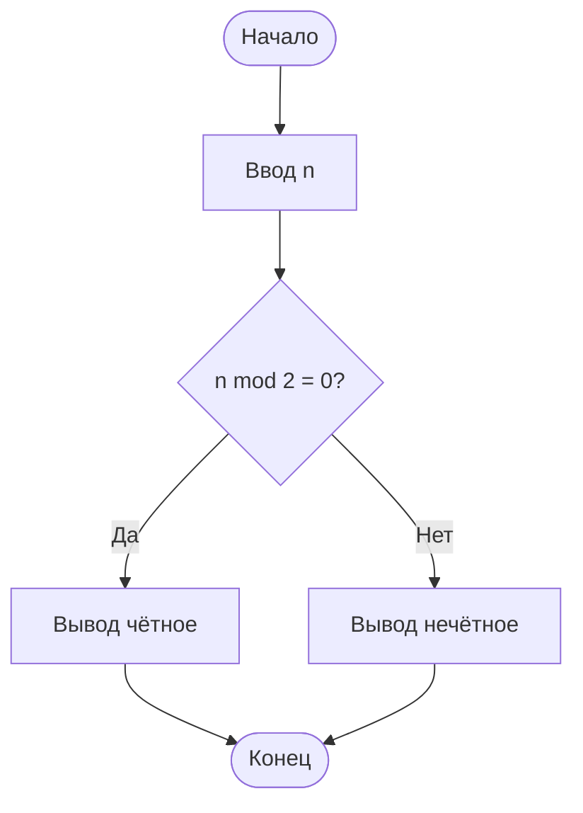

---

### Пример 4 — линейный поиск в массиве

**Задача:** найти индекс первого вхождения `x` в массиве `A[1..n]`, или −1.

**Псевдокод:**

```
ввод n, элементы A[1..n], x
для i от 1 до n:
    если A[i] = x то
        вывод i
        стоп
вывод -1
```

**Python:**

```python
def linear_search(arr, x):
    for i, val in enumerate(arr):
        if val == x:
            return i
    return -1
```

---

### Пример 5 — НОД (алгоритм Евклида)

**Псевдокод:**

```
ввод a, b
пока b ≠ 0:
    r := a mod b
    a := b
    b := r
вывод a
```

Для a=48, b=18: (48,18)→(18,12)→(12,6)→(6,0); ответ **6**.

| Шаг | a | b | r |
|-----|---|---|---|
| 0 | 48 | 18 | — |
| 1 | 18 | 12 | 12 |
| 2 | 12 | 6 | 6 |
| 3 | 6 | 0 | 0 |

---

### Пример 6 — сортировка пузырьком (учебная)

**Псевдокод:**

```
для i от 1 до n-1:
    для j от 1 до n-i:
        если A[j] > A[j+1] то
            поменять A[j] и A[j+1]
```

**Трассировка** [3, 1, 2]:

| Проход | Массив |
|--------|--------|
| начало | [3, 1, 2] |
| j=1 | [1, 3, 2] |
| j=2 | [1, 2, 3] |

---

### Пример 7 — факториал (рекурсия и цикл)

**Цикл:**

```
ввод n
F := 1
для i от 2 до n:
    F := F * i
вывод F
```

**Рекурсия (псевдокод):**

```
функция fact(n):
    если n ≤ 1 то вернуть 1
    иначе вернуть n * fact(n-1)
```

★ Рекурсия без базового случая — **бесконечная** (переполнение стека).

---

## Структура описания алгоритма

★ **Псевдокод** — запись алгоритма обычными словами без привязки к конкретному языку. См. [Алгоритмы](/encyclopedia/4-code-dev/4-01-algoritmy/1).

| Блок | Содержание |
|------|------------|
| **Название** | Суть задачи |
| **Входные данные** | Типы, ограничения |
| **Последовательность действий** | Шаги, блок-схема, псевдокод |
| **Выходные данные** | Результат |

| Вид | Структура | Пример |
|-----|-----------|--------|
| **Линейный** | Шаги подряд | °C → °F |
| **Разветвляющийся** | Условие | Чётное / нечётное |
| **Циклический** | Повтор | Сумма 1..n |

---

## Блок-схемы

★ **Блок-схема** — рисунок алгоритма стандартными фигурами (овал, прямоугольник, ромб). См. [Алгоритмы](/encyclopedia/4-code-dev/4-01-algoritmy/311).


| Символ | Назначение |
|--------|------------|
| Овал | Начало, конец |
| Параллелограмм | Ввод, вывод |
| Прямоугольник | Вычисление |
| Ромб | Условие |
| Контур | Цикл |

**Три семейства циклов:**

| Идея | Псевдокод | JavaScript |
|------|-----------|------------|
| Счётный | `для i от 1 до n` | `for (let i = 0; i < n; i++)` |
| Условный | `пока условие` | `while (условие)` |
| Перебор | `для каждого элемента` | `for (const x of arr)` |

---

## Введение в сложность алгоритмов

★ **Сложность алгоритма** — как растёт время или память при увеличении размера входа **n**; на экзамене сравнивают порядки O(n), O(n²) и др. См. [Big-O](/lab/Примеры/1128).

| O-нотация | Название | Пример |
|-----------|----------|--------|
| **O(1)** | Константная | Доступ к A[i] |
| **O(log n)** | Логарифмическая | Бинарный поиск |
| **O(n)** | Линейная | Линейный поиск, сумма массива |
| **O(n log n)** | Линейно-логарифмическая | Быстрая сортировка |
| **O(n²)** | Квадратичная | Пузырёк, вложенные циклы |
| **O(2ⁿ)** | Экспоненциальная | Полный перебор подмножеств |

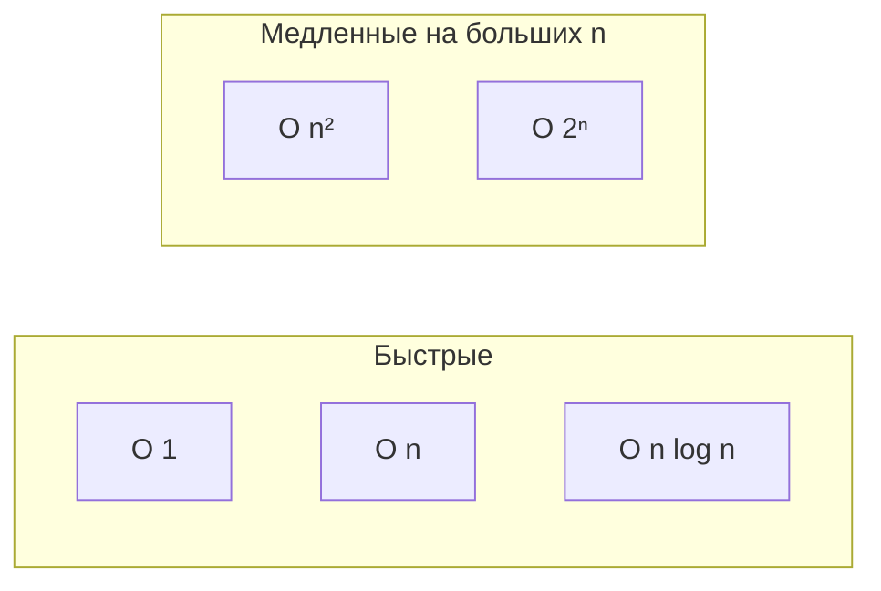

**Сравнение для n = 1000:**

| O(n) | O(n²) | O(2ⁿ) |
|------|-------|-------|
| ~1000 шагов | ~1 000 000 | больше атомов во Вселенной |

★ На экзамене достаточно **качественно** сравнить: "линейный быстрее квадратичного при больших n".

**Примеры:**

| Алгоритм | Время | Память |
|----------|-------|--------|
| Линейный поиск | O(n) | O(1) |
| Бинарный поиск (отсортированный массив) | O(log n) | O(1) |
| Пузырёк | O(n²) | O(1) |
| Слияние (merge sort) | O(n log n) | O(n) |

Подробнее — [Big-O на Python](/lab/Примеры/1128), [Алгоритмы](/encyclopedia/4-code-dev/4-01-algoritmy/intro).

---

## От алгоритма к программе

| Этап | Содержание |
|------|------------|
| **Постановка** | Вход, выход, ограничения |
| **Алгоритм** | Блок-схема, псевдокод |
| **Код** | Язык программирования |
| **Тест** | Обычные и граничные случаи |

★ **Программа** — файл с командами на языке. После запуска — **процесс** в RAM; внутри — **потоки**. См. [Программа](/encyclopedia/1-basics/1-19-programma/1).

Способы выполнения:

- **Компиляция** — весь код → исполняемый файл (C, Pascal, VB.NET);
- **Интерпретация** — построчно (Python в учебном режиме).

См. [Трансляторы](/encyclopedia/1-basics/1-19-programma/2).

---

### Интерактив — компилятор и интерпретатор

<ExternalPlayEmbed example="about/compiler-simulator" title="Compiler Simulator" />

---

## Отладка — поиск и исправление ошибок

★ **Отладка** — поиск причины неверного поведения программы: трассировка, точки останова, просмотр переменных. См. [Отладка](/encyclopedia/4-code-dev/4-06-arhitektura-vypolneniya/111).

### Типы ошибок

| Тип | Когда обнаруживается | Пример |
|-----|---------------------|--------|
| **Синтаксическая** | Компиляция / парсинг | Пропущена `)` |
| **Логическая** | Неверный результат | `i < n` вместо `i ≤ n` |
| **Рантайм** | Во время выполнения | Деление на 0 |
| **Ошибка данных** | Некорректный ввод | Буквы вместо числа |

### Методы отладки

| Метод | Как применять |
|-------|---------------|
| **Трассировка** | Вручную пройти алгоритм на бумаге |
| **Точки останова** | Остановить программу на строке в IDE |
| **Пошаговое выполнение** | F10/F11 в отладчике |
| **Вывод промежуточных значений** | `print(i, S)` в цикле |
| **Логирование** | Запись в файл для долгих программ |
| **Резиновая уточка** | Объяснить код вслух построчно |

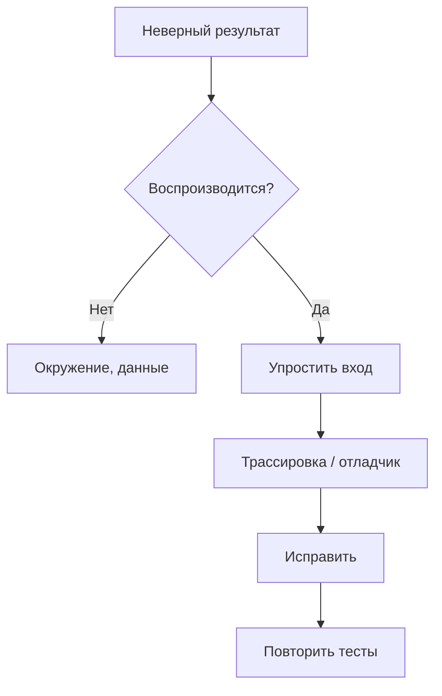

### Чек-лист отладки для школьных задач

1. Проверить **граничные случаи**: n=0, n=1, пустой массив.
2. Проверить **условие цикла**: `<` и `≤`, off-by-one.
3. Проверить **инициализацию** переменных (S=0, i=1).
4. Проверить **типы** (целое и вещественное деление).
5. Сверить **блок-схему** с кодом построчно.

<div class="callout callout--tip">
  <div class="callout-title">Мини-задание</div>

  <div class="callout-body">
  Возьмите программу "средняя оценка" и введите буквы вместо числа. Зафиксируйте — падает, сообщение или зависает? Добавьте проверку ввода.
</div>
</div>

---

## Классификация языков — расширенное сравнение

★ **Язык программирования** — формальные правила записи программ: синтаксис, типы, библиотеки. См. [Код и разработка](/encyclopedia/4-code-dev/code-dev).

| Уровень | Примеры | Плюсы | Минусы |
|---------|---------|-------|--------|
| **Машинный код** | Опкоды | Максимальный контроль | Нечитаем, непереносим |
| **Ассемблер** | x86, ARM | Близко к железу | Долго писать |
| **C / Rust** | Системное ПО | Скорость, контроль памяти | Сложнее для новичка |
| **Python** | Скрипты, ML, учёба | Краткий синтаксис | Медленнее компилируемых |
| **Java / C#** | Корпоративные приложения | VM, библиотеки | Больше шаблонного кода |
| **JavaScript** | Веб, Node.js | Везде в браузере | Асинхронность, типы |
| **Visual Basic** | Office, учеба в РФ | Простой синтаксис, формы | Уже в .NET, не веб-стандарт |

### Сравнение синтаксиса — "Hello, World"

**Python:**

```python
print("Hello, World")
```

**Java:**

```java
public class Main {
    public static void main(String[] args) {
        System.out.println("Hello, World");
    }
}
```

**C#:**

```csharp
Console.WriteLine("Hello, World");
```

**Pascal:**

```pascal
begin
  writeln('Hello, World');
end.
```

**Visual Basic .NET:**

```vb
Module Program
    Sub Main()
        Console.WriteLine("Hello, World")
    End Sub
End Module
```

### Сравнение по признакам

| Признак | Python | Java | C# / VB.NET | Pascal |
|---------|--------|------|-------------|--------|
| Типизация | Динамическая | Статическая | Статическая | Статическая |
| Выполнение | Интерпретатор | JVM байт-код | CLR | Компилятор |
| Синтаксис | Отступы | Фигурные скобки | Слова `Sub`/`End` | `begin`/`end` |
| Типичное применение | DS, автоматизация | Enterprise, Android | Windows, Unity | Учёба, олимпиады |
| Сложность входа | Низкая | Средняя | Средняя | Низкая |

### Парадигмы

| Парадигма | Суть | Языки |
|-----------|------|-------|
| **Императивная** | Последовательность команд | C, Pascal, Python |
| **ООП** | Объекты с полями и методами | Java, C#, Python |
| **Функциональная** | Функции без изменяемого состояния | Haskell, часть Python |
| **Декларативная** | Описание результата | SQL, HTML |

Развёрнуто — [Парадигмы](/encyclopedia/4-code-dev/4-07-paradigmy-i-urovni-abstraktsii/111), [Уровни языка](/encyclopedia/1-basics/1-24-osnovnye-yazyki/6#urovni-yazyka).

---

## Словарь главы

| Термин | Определение |
|--------|-------------|
| **Вычисление** | Преобразование входных данных в выходные по правилам |
| **Программирование** | Создание программ на языке |
| **Исходный текст** | Код + комментарии |
| **Синтаксис** | Правила формы текста |
| **Семантика** | Смысл при выполнении |
| **Машинный код** | Инструкции процессора |
| **Процесс** | Программа в памяти под управлением ОС |
| **Поток** | Цепочка инструкций внутри процесса |
| **Библиотека** | Готовый модуль кода |
| **Подпрограмма** | Функция, процедура, метод |

---

## Проектирование программ

| Стадия | Суть | Школьный аналог |
|--------|------|-----------------|
| **ТЗ** | Что должна делать программа | Формулировка учителя |
| **Проектирование** | Алгоритм, данные, интерфейс | Блок-схема |
| **Реализация** | Код | Лабораторная |
| **Тестирование** | Проверка примеров | Ручной прогон |
| **Сопровождение** | Исправления | Правки после проверки |

Шаблон тестов:

- обычный случай;
- крайний случай;
- ошибочный ввод.

---

<span id="oshibki-i-sboi"></span>

## Ошибки и сбои в программах

| Что видит пользователь | Что это значит |
|------------------------|----------------|
| "Неверный ввод" | Обработанная ошибка |
| "Программа прекратила работу" | Крэш — необработанный сбой |
| "Не отвечает" | Зависание — цикл, блокировка |
| Долгая пауза | Тяжёлая операция |

**Синтаксическая** ошибка — код не компилируется. **Логическая** — работает, но неверно.

Языки предлагают **исключения**:

- `try` / `except` в Python;
- `try` / `catch` в Java и C#.

См. [Ошибки и отказоустойчивость](/encyclopedia/4-code-dev/4-06-arhitektura-vypolneniya/111).

---


## Парадигмы программирования — развёрнуто

★ **Парадигма программирования** — общий стиль описания задачи: командами, объектами, функциями или запросами. См. [Парадигмы](/encyclopedia/4-code-dev/4-07-paradigmy-i-urovni-abstraktsii/intro).

| Парадигма | Суть | Языки | Школьный пример |
|-----------|------|-------|-----------------|
| Императивная | Команды меняют состояние | C, Pascal, Python | `x = x + 1` |
| Процедурная | Программа из процедур | C, Pascal | `Sub Calc()` |
| ООП | Объекты: поля + методы | Java, C#, Python | `class Student` |
| Функциональная | Функции, неизменяемость | Haskell, часть Python | `map`, `filter` |
| Декларативная | Что нужно, не как | SQL, HTML | `SELECT * FROM t` |
| Событийная | Обработчики событий | JS, VB Forms | `OnClick` |

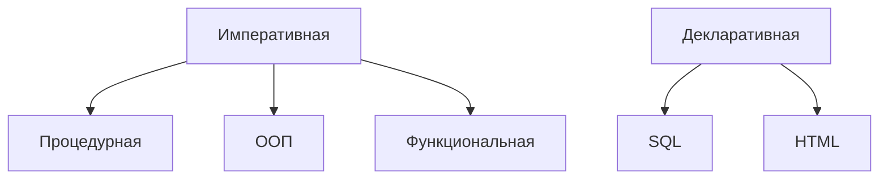

Подробнее — [Парадигмы](/encyclopedia/4-code-dev/4-07-paradigmy-i-urovni-abstraktsii/intro), [ООП](/encyclopedia/4-code-dev/4-08-oop/intro).

---

## Hello World — много языков

### Python
```python
print("Hello, World!")
```

### JavaScript
```javascript
console.log("Hello, World!");
```

### Java
```java
public class Hello {
    public static void main(String[] args) {
        System.out.println("Hello, World!");
    }
}
```

### C#
```csharp
Console.WriteLine("Hello, World!");
```

### C
```c
#include <stdio.h>
int main(void) {
    printf("Hello, World!\n");
    return 0;
}
```

### Pascal
```pascal
begin
  writeln('Hello, World!');
end.
```

### Visual Basic .NET
```vb
Module Program
    Sub Main()
        Console.WriteLine("Hello, World!")
    End Sub
End Module
```

### Kotlin
```kotlin
fun main() {
    println("Hello, World!")
}
```

### Go
```go
package main
import "fmt"
func main() { fmt.Println("Hello, World!") }
```

### Rust
```rust
fn main() { println!("Hello, World!"); }
```

### Сравнение

| Язык | Строк кода (мин.) | Нужен класс? |
|------|-------------------|--------------|
| Python | 1 | Нет |
| JavaScript | 1 | Нет |
| Java | 5+ | Да |
| C | 4+ | Нет |
| Pascal | 3 | Нет |

Дальше по языкам:

- [Python](/encyclopedia/5-languages/5-02-python/intro);
- [Java](/encyclopedia/5-languages/5-03-java/intro);
- [Visual Basic](/encyclopedia/5-languages/5-16-starye-yazyki/visual-basic/intro).

---

## Сравнение языков — таблица для школьника

| Язык | Старт | Где учат | Плюсы |
|------|-------|----------|-------|
| Python | Лёгкий | ЕГЭ, кружки | Читаемость |
| Pascal/Кумир | Лёгкий | ОГЭ | Структура, рус. в Кумире |
| Visual Basic | Лёгкий | Вуз | Окна, Office |
| C++ | Сложный | Олимпиады | Скорость |
| Java | Средний | Вуз | ООП, Android |
| JavaScript | Лёгкий | Веб | Браузер |
| C# | Средний | Unity, .NET | Игры, Windows |
| Kotlin | Средний | Android | Современный JVM |

---

## Блок-схемы — дополнительные примеры

### Чётность числа
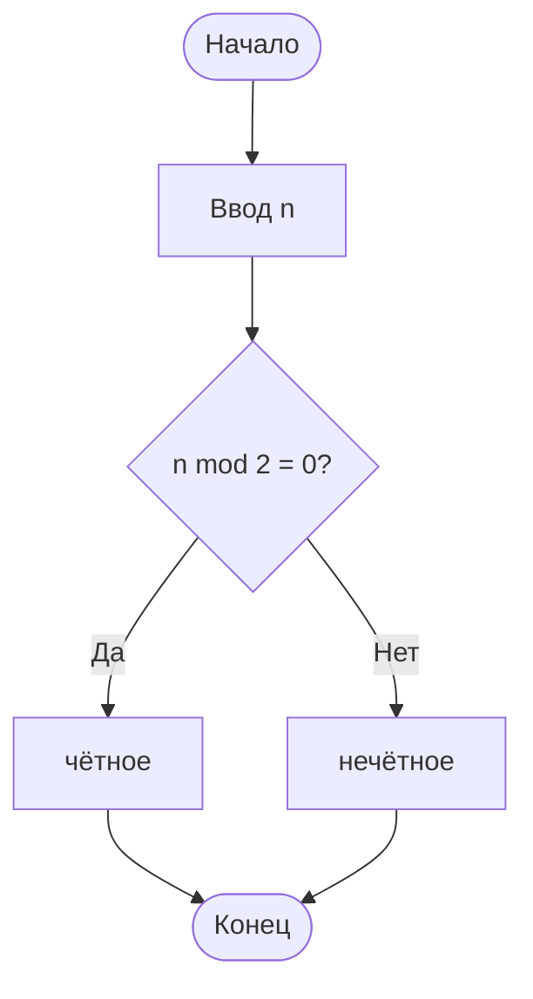

### Сумма цифр
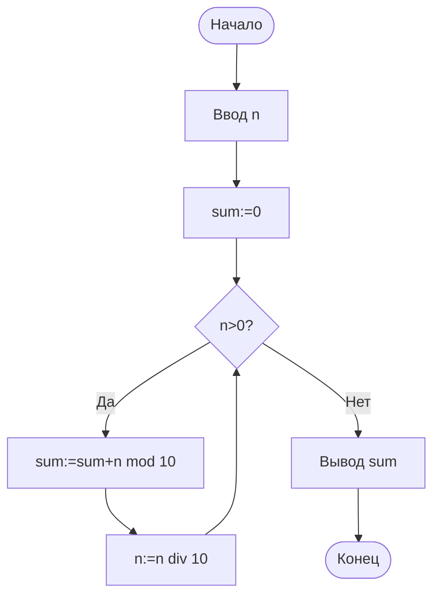

### Двоичный поиск
```mermaid
flowchart TD
    S([Начало]) --> L[left:=1, right:=n]
    L --> W{left<=right?}
    W -->|Нет| NF[Не найдено]
    W -->|Да| M[mid:=(left+right) div 2]
    M --> C{a[mid]=x?}
    C -->|Да| F[Найден]
    C -->|Нет| G{a[mid]<x?}
    G -->|Да| L2[left:=mid+1]
    G -->|Нет| R2[right:=mid-1]
    L2 --> W
    R2 --> W
```

---

## Псевдокод — библиотека алгоритмов

### Сортировка пузырьком
```
для i от 1 до n-1:
  для j от 1 до n-i:
    если a[j] > a[j+1] то обменять a[j], a[j+1]
```

### Простое число
```
если n < 2 то вывод "нет"
d := 2
пока d*d <= n:
  если n mod d = 0 то вывод "составное"; стоп
  d := d + 1
вывод "простое"
```

### НОД (Евклид)
```
пока b <> 0:
  r := a mod b
  a := b
  b := r
вывод a
```

См. [Алгоритмы](/encyclopedia/4-code-dev/4-01-algoritmy/intro).

---

## Отладка — подробное руководство

| Инструмент | Действие |
|------------|----------|
| Breakpoint | Останов перед строкой |
| Step Over (F10) | Следующая строка |
| Step Into (F11) | Войти в функцию |
| Watch | Следить за переменной |
| Call stack | Цепочка вызовов |
| print / log | Вывод промежуточных значений |

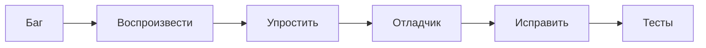

**Метод утёнки:** объясните код вслух построчно.

Подробнее — [Отладка](/encyclopedia/4-code-dev/4-14-razrabotka-i-otladka/intro).

---

## Git и контроль версий — базовый обзор

★ **Git** — система контроля версий: хранит историю изменений файлов проекта и позволяет откатиться к любому коммиту. См. [Git](/encyclopedia/4-code-dev/4-13-osnovy-raboty-s-git/intro).

| Термин | Значение |
|--------|----------|
| Репозиторий | Проект + история |
| Коммит | Снимок с сообщением |
| Ветка | Параллельная линия |
| push / pull | Отправить / получить |
| GitHub | Хостинг репозиториев |

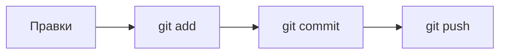

Школьнику: не полагайтесь на `final_final.zip` — фиксируйте изменения в Git.

См. [Git](/encyclopedia/4-code-dev/4-13-osnovy-raboty-s-git/intro), [116](/encyclopedia/4-code-dev/4-13-osnovy-raboty-s-git/116).

---

## Сортировка и поиск — обзор

★ **Сортировка** упорядочивает элементы; **поиск** находит нужный по ключу. Сложность зависит от алгоритма — от O(n) до O(n log n). См. [Алгоритмы](/encyclopedia/4-code-dev/4-01-algoritmy/intro).

| Алгоритм | Идея | Сложность |
|----------|------|-----------|
| Линейный поиск | Перебор | O(n) |
| Двоичный поиск | Делим пополам | O(log n) |
| Пузырёк | Соседи меняются | O(n²) |
| Выбором | Минимум в начало | O(n²) |
| Вставками | Вставка на место | O(n²) |

---

## Рекурсия — введение

★ **Рекурсия** — когда алгоритм вызывает сам себя с упрощённым аргументом до **базового случая**. См. [Алгоритмы](/encyclopedia/4-code-dev/4-01-algoritmy/1).

```
функция Fact(n):
  если n <= 1 то вернуть 1
  иначе вернуть n * Fact(n-1)
```

| n | Fact(n) |
|---|---------|
| 0 | 1 |
| 5 | 120 |
| 10 | 3628800 |

Обязателен **базовый случай**.

---

## Банк задач ОГЭ — алгоритмы

### Трассировка циклов


---

## Массивы и строки

★ **Массив** — упорядоченный набор элементов с доступом по индексу; **строка** — последовательность символов. См. [Структуры данных](/encyclopedia/3-data-markup/3-02-struktury-dannyh/intro).

| Операция | Псевдокод |
|----------|-----------|
| Длина | `n := длина(a)` |
| Элемент | `a[i]` |
| Поиск max | перебор с `max := a[1]` |

**Задача.** `[3,1,4,1,5]`, поиск 4 — сколько сравнений?

**Ответ:** 3.

---

## Тестирование — шаблон

| Тип | Пример |
|-----|--------|
| Обычный | Max2(5,6)→6 |
| Граничный | n=1, пустой ввод |
| Негативный | буквы вместо числа |

---

## Частые ошибки новичков

| Ошибка | Решение |
|--------|---------|
| `=` вместо `==` | В условии — сравнение |
| Бесконечный while | Менять счётчик |
| Off-by-one | Трассировка на бумаге |
| S не инициализирована | `S := 0` |

---

## Термины — расширенный глоссарий

| Термин | Определение |
|--------|-------------|
| Алгоритм | Конечные шаги к результату |
| Блок-схема | Граф алгоритма |
| Псевдокод | Без синтаксиса языка |
| Компилятор | Перевод всего файла |
| Интерпретатор | Построчное выполнение |
| Парадигма | Стиль программирования |
| Рекурсия | Вызов из себя |
| Git | История версий |
| Баг | Ошибка в логике |
| O(n) | Линейное время |

---

## Практические задания

| № | Задание |
|---|---------|
| 1 | Блок-схема "таблица умножения" |
| 2 | НОД Евклидом — код |
| 3 | Hello World на 3 языках |
| 4 | Отладка суммы 1..n |
| 5 | `git init` для папки с кодом |

---

## Резюме расширенного блока

1. Алгоритм → блок-схема → программа → тесты.
2. Парадигмы: императивная, ООП, декларативная.
3. Отладка и Git — часть профессии.
4. Hello World показывает разницу синтаксиса языков.

<div class="callout callout--tip">
  <div class="callout-title">Экзамен</div>
  <div class="callout-body">
  Решите 10 задач на трассировку из банка выше. Нарисуйте блок-схему Max(a,b) и сверьте с кодом на вашем языке.
</div>
</div>

---


## Школьные среды

| Среда | Материал |
|-------|----------|
| **PascalABC.NET** | [PascalABC.NET](/encyclopedia/9-spinoff/9-11-dlya-detey/5-kod/10) |
| **Кумир** | [Кумир](/encyclopedia/9-spinoff/9-11-dlya-detey/5-kod/11) |
| **Scratch** | [Scratch](/encyclopedia/9-spinoff/9-11-dlya-detey/5-kod/3) |
| **MIT App Inventor** | [App Inventor](/encyclopedia/9-spinoff/9-11-dlya-detey/5-kod/9) |

Сводная таблица — [Инструменты и среды](./9).

---

## Visual Basic в учебной программе

| Шаг | Материал |
|-----|----------|
| 1 | [VBScript](/encyclopedia/5-languages/5-16-starye-yazyki/visual-basic/12) |
| 2 | [Синтаксис](/encyclopedia/5-languages/5-16-starye-yazyki/visual-basic/2) |
| 3 | [VBA Excel](/encyclopedia/5-languages/5-16-starye-yazyki/visual-basic/8) |
| 4 | [VBA Word/Access](/encyclopedia/5-languages/5-16-starye-yazyki/visual-basic/13) |
| 5 | [VB.NET](/encyclopedia/5-languages/5-16-starye-yazyki/visual-basic/7) |

<div class="callout callout--info">
  <div class="callout-title">VB6 и VB.NET</div>

  <div class="callout-body">
  Старый <strong>VB6</strong> не используют в новых проектах, но логика (переменные, If, For) совпадает с VB.NET.
</div>
</div>

---

## Задачи для экзамена

**Задача 1.** Запишите псевдокод: ввести три числа, вывести их среднее арифметическое.

**Задача 2.** Нарисуйте блок-схему: если число положительное — вывести "+", если 0 — "0", иначе "−".

**Задача 3.** Сколько итераций внешнего цикла в сортировке пузырьком для n=5?

Ответ: **4** (от 1 до n−1).

**Задача 4.** Какая сложность линейного поиска?

Ответ: **O(n)**.

**Задача 5.** Чем компиляция отличается от интерпретации?

- **Компилятор** переводит весь код заранее в исполняемый файл;
- **Интерпретатор** выполняет программу построчно при запуске.

**Задача 6.** Перепишите на Python:

```
ввод n
F := 1
для i от 2 до n: F := F * i
вывод F
```

```python
n = int(input())
f = 1
for i in range(2, n + 1):
    f *= i
print(f)
```

<div class="callout callout--tip">
  <div class="callout-title">Мини-проект</div>

  <div class="callout-body">
  Программа "Калькулятор средней оценки" — ввод чисел, проверка, среднее, комментарий "зачёт/незачёт". Шаблоны: [Python](/lab/Примеры/1122), [Java](/lab/Примеры/1131), [Pascal](/lab/Примеры/1140).
</div>
</div>

<div class="callout callout--tip">
  <div class="callout-title">Самопроверка</div>

  <div class="callout-body">
  <ol>
    <li>Назовите 5 свойств алгоритма.</li>
    <li>Чем линейный алгоритм отличается от разветвляющегося?</li>
    <li>Что такое O(n²)?</li>
    <li>Какие три метода отладки вы знаете?</li>
    <li>Чем Python отличается от Java по типизации?</li>
  </ol>
</div>
</div>

---

## Бинарный поиск — алгоритм и сложность

★ **Бинарный поиск** делит отсортированный массив пополам на каждом шаге — сложность **O(log n)**. См. [Алгоритмы](/encyclopedia/4-code-dev/4-01-algoritmy/1).

**Условие:** массив **отсортирован** по возрастанию.

**Псевдокод:**

```
лево := 1, право := n
пока лево ≤ право:
    середина := (лево + право) div 2
    если A[середина] = x то вывод середина; стоп
    если A[середина] < x то лево := середина + 1
    иначе право := середина - 1
вывод "не найдено"
```

**Трассировка** поиска `7` в `[1, 3, 5, 7, 9, 11]`:

| Шаг | лево | право | середина | A[середина] |
|-----|------|-------|----------|-------------|
| 1 | 1 | 6 | 3 | 5 |
| 2 | 4 | 6 | 5 | 9 |
| 3 | 4 | 4 | 4 | **7** найден |

**Сложность:** O(log n) — каждый шаг отбрасывает половину массива.

```mermaid
flowchart TD
    START[Отсортированный массив] --> MID[Середина]
    MID --> EQ{x = A[mid]?}
    EQ -->|Да| FOUND[Найдено]
    EQ -->|Нет, x больше| RIGHT[Искать справа]
    EQ -->|Нет, x меньше| LEFT[Искать слева]
```

**Python:**

```python
def binary_search(arr, x):
    lo, hi = 0, len(arr) - 1
    while lo <= hi:
        mid = (lo + hi) // 2
        if arr[mid] == x:
            return mid
        if arr[mid] < x:
            lo = mid + 1
        else:
            hi = mid - 1
    return -1
```

---

## Сортировка выбором и вставками

### Сортировка выбором (Selection Sort)

**Идея:** на каждом шаге найти минимум в неотсортированной части и поставить на место.

**Псевдокод:**

```
для i от 1 до n-1:
    minIdx := i
    для j от i+1 до n:
        если A[j] < A[minIdx] то minIdx := j
    поменять A[i] и A[minIdx]
```

**Сложность:** O(n²). **Плюс:** мало обменов. **Минус:** медленно на больших n.

### Сортировка вставками (Insertion Sort)

**Идея:** как сортировка карт в руке — вставляем каждый элемент на место среди уже отсортированных.

```
для i от 2 до n:
    key := A[i]
    j := i - 1
    пока j ≥ 1 и A[j] > key:
        A[j+1] := A[j]
        j := j - 1
    A[j+1] := key
```

**Сложность:** O(n²) в худшем случае; O(n) на почти отсортированных данных.

| Алгоритм | Лучший | Средний | Худший | Память |
|----------|--------|---------|--------|--------|
| Пузырёк | O(n) | O(n²) | O(n²) | O(1) |
| Выбором | O(n²) | O(n²) | O(n²) | O(1) |
| Вставками | O(n) | O(n²) | O(n²) | O(1) |
| Быстрая сортировка | O(n log n) | O(n log n) | O(n²) | O(log n) |
| Слиянием | O(n log n) | O(n log n) | O(n log n) | O(n) |

---

## Рекурсия — примеры и стек вызовов

**Факториал:**

```
fact(n) = 1, если n ≤ 1
fact(n) = n × fact(n-1), иначе
```

**fact(4):** 4 × fact(3) → 4 × 3 × fact(2) → 4 × 3 × 2 × fact(1) → **24**

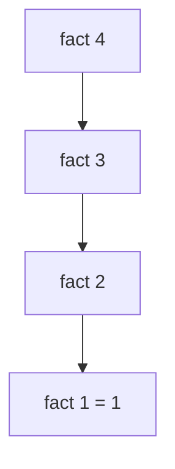

**Числа Фибоначчи (наивная рекурсия):**

```
fib(0) = 0, fib(1) = 1
fib(n) = fib(n-1) + fib(n-2)
```

★ Наивный `fib(n)` имеет сложность **O(2ⁿ)** — для n>40 непрактично. С мемоизацией или циклом — O(n).

---

## Массивы и строки — базовые операции

| Операция | Псевдокод | Сложность |
|----------|-----------|-----------|
| Доступ A[i] | Прямой | O(1) |
| Поиск линейный | Перебор | O(n) |
| Вставка в конец | A[n+1] := x | O(1) |
| Вставка в начало | Сдвиг всех | O(n) |
| Длина строки | Счётчик или хранится | O(1) или O(n) |

---

## Сравнение языков — одна задача, четыре синтаксиса

**Задача:** вывести числа от 1 до n.

**Python:**

```python
n = int(input())
for i in range(1, n + 1):
    print(i)
```

**Java:**

```java
Scanner sc = new Scanner(System.in);
int n = sc.nextInt();
for (int i = 1; i <= n; i++)
    System.out.println(i);
```

**Pascal:**

```pascal
var n, i: integer;
begin
  readln(n);
  for i := 1 to n do writeln(i);
end.
```

**Visual Basic .NET:**

```vb
Dim n As Integer = Integer.Parse(Console.ReadLine())
For i As Integer = 1 To n
    Console.WriteLine(i)
Next
```

**JavaScript:**

```javascript
const n = Number(prompt());
for (let i = 1; i <= n; i++) console.log(i);
```

### Сравнение конструкций

| Конструкция | Python | Java | Pascal | VB.NET |
|-------------|--------|------|--------|--------|
| Присваивание | `x = 5` | `x = 5;` | `x := 5` | `x = 5` |
| Ввод | `input()` | `Scanner` | `readln` | `Console.ReadLine` |
| Если | `if x > 0:` | `if (x > 0)` | `if x > 0 then` | `If x > 0 Then` |
| Цикл for | `for i in range(n):` | `for (i=0; i<n; i++)` | `for i := 1 to n` | `For i = 1 To n` |
| Комментарий | `#` | `//` | `{ }` или `(* *)` | `'` |
| Функция | `def f():` | `void f()` | `function f` | `Sub` / `Function` |

---

## IDE и инструменты разработки

| Инструмент | Назначение |
|------------|------------|
| **IDE** | Редактор + отладчик + сборка (VS Code, PyCharm, Visual Studio) |
| **Компилятор** | Перевод в машинный код |
| **Интерпретатор** | Выполнение построчно |
| **Линтер** | Предупреждения о стиле и ошибках |
| **Отладчик** | Breakpoint, пошагово, просмотр переменных |
| **Git** | Версионирование кода |

См. [Инструменты и среды](./9), [Git](/encyclopedia/4-code-dev/4-13-osnovy-raboty-s-git/intro).

---

## Тестирование программ

| Тип теста | Что проверяет |
|-----------|---------------|
| **Модульный** | Одна функция |
| **Интеграционный** | Связка модулей |
| **Ручной** | Прогон примеров учителем |
| **Граничный** | n=0, пустой ввод, максимум |

**Таблица тест-кейсов** для "среднее оценок":

| Вход | Ожидаемый выход |
|------|-----------------|
| 5, 5, 5 | 5.0 |
| 2, 4 | 3.0 |
| одна 3 | 3.0 |
| буква "a" | Сообщение об ошибке |
| пустой ввод | Сообщение об ошибке |

---

## Отладка — разбор типичных багов

### Off-by-one

```python
# Ошибка — range(1, n) не включает n
for i in range(1, n):  # должно быть n+1
    s += i
```

### Деление целочисленное

```python
# В Python 3 — 5/2 = 2.5 OK
# В Pascal/C — 5/2 = 2 если целые
```

### Неинициализированная переменная

```
S := 0   # забыли — случайное значение в S
```

### Бесконечный цикл

```
пока i ≤ n:
    S := S + i
    # забыли i := i + 1
```

---

## Жизненный цикл ПО — расширенная схема

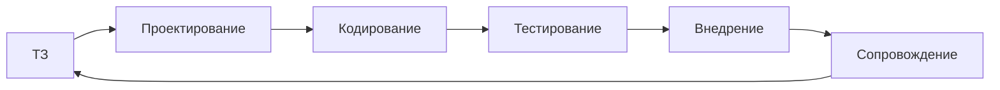

| Модель | Особенность |
|--------|-------------|
| **Каскадная** | Этапы строго по порядку |
| **Итеративная** | Повторные циклы улучшения |
| **Agile** | Короткие спринты, гибкость |

Для школьной лабораторной достаточно: задача → алгоритм → код → тест → сдача.

---

## Дополнительные задачи для экзамена

**Задача 7.** Запишите псевдокод: ввести n чисел, вывести количество положительных.

**Задача 8.** Сколько сравнений в худшем случае для линейного поиска в массиве из n элементов?

Ответ: **n**.

**Задача 9.** Чему равен НОД(1071, 462) по Евклиду?

1071=462×2+147; 462=147×3+21; 147=21×7+0 → **21**.

**Задача 10.** Нарисуйте блок-схему цикла `для i от 1 до n`.

**Задача 11.** Какая сложность бинарного поиска?

Ответ: **O(log n)**.

**Задача 12.** Переведите на Python:

```
ввод a, b, c
D := b² - 4ac
если D < 0 то вывод "нет корней"
иначе x1 := (-b + √D) / (2a); вывод x1
```

```python
import math
a, b, c = map(float, input().split())
d = b*b - 4*a*c
if d < 0:
    print("нет корней")
else:
    x1 = (-b + math.sqrt(d)) / (2*a)
    print(x1)
```

---


## Дополнительные блок-схемы

### Знак числа

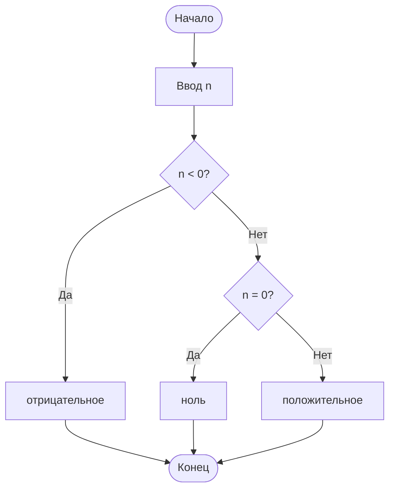

### Факториал (цикл)

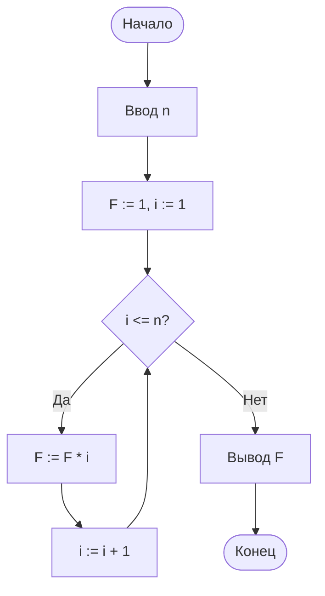

---

## Git — команды для мини-проекта

| Команда | Действие |
|---------|----------|
| `git init` | Создать репозиторий |
| `git status` | Изменения |
| `git add .` | Подготовить коммит |
| `git commit -m "msg"` | Зафиксировать |
| `git log` | История |

См. [Git](/encyclopedia/4-code-dev/4-13-osnovy-raboty-s-git/116).

---

## Банк трассировок — сумма 1..n

---

## Банк — сумма цифр

---

## Резюме дополнительного блока

1. Блок-схема → псевдокод → код → тесты.
2. Git фиксирует историю.
3. Трассировка ловит off-by-one.

---

## Банк задач с полными решениями

### Задача Б-1. Сумма чисел от 1 до n

**Условие.** Ввод n. Вывести сумму 1 + 2 + … + n.

**Псевдокод:**
```
ввод n
s ← 0
для i от 1 до n
  s ← s + i
вывод s
```

**Трассировка (n=4):** i=1→s=1; i=2→s=3; i=3→s=6; i=4→s=10. **Ответ: 10.**

**Сложность:** O(n) по времени, O(1) по памяти.

---

### Задача Б-2. Максимум в массиве

```
ввод n, массив a[1..n]
m ← a[1]
для i от 2 до n
  если a[i] > m то m ← a[i]
вывод m
```

При a = [3, 9, 2, 9] значение **m = 9**.

---

### Задача Б-3. Подсчёт чётных

```
ввод n
k ← 0
для i от 1 до n
  ввод x
  если x mod 2 = 0 то k ← k + 1
вывод k
```

---

### Задача Б-4. Линейный поиск

Ищем значение `key` в массиве слева направо; останавливаемся при первом совпадении.

**Худший случай:** n сравнений → **O(n)**.

---

### Задача Б-5. Факториал (цикл)

```
ввод n
f ← 1
для i от 2 до n
  f ← f * i
вывод f
```

n=5 → f=120. Для больших n в школьных задачах используют **long** / произвольную точность.

---

## Бинарный поиск — дополнительные примеры

**Условие.** Отсортированный массив [2, 5, 8, 12, 16, 23]. Найти 12.

| Шаг | left | right | mid | a[mid] |
|-----|------|-------|-----|--------|
| 1 | 1 | 6 | 3 | 12 ✓ |

**Условие.** Искать 7 в том же массиве.

| Шаг | left | right | mid | a[mid] | Действие |
|-----|------|-------|-----|--------|----------|
| 1 | 1 | 6 | 3 | 12 | 7 &lt; 12, right ← 2 |
| 2 | 1 | 2 | 1 | 2 | 7 > 2, left ← 2 |
| 3 | 2 | 2 | 2 | 5 | 7 > 5, left ← 3 |
| 4 | 3 | 2 | — | — | left > right → **нет** |

---

## Сортировки — трассировки

### Сортировка выбором для [4, 1, 3]

| Проход | Массив | Минимум | Обмен |
|--------|--------|---------|-------|
| 1 | 4,1,3 | 1 на поз. 2 | 4↔1 → 1,4,3 |
| 2 | 1,4,3 | 3 на поз. 3 | 4↔3 → 1,3,4 |

**Сложность:** O(n²).

---

### Сортировка вставками для [5, 2, 4]

| Шаг | Действие | Массив |
|-----|----------|--------|
| 1 | вставить 2 | 2,5,4 |
| 2 | вставить 4 | 2,4,5 |

---

## Рекурсия — разбор стека

**Факториал(3):**

```
fact(3)
  → 3 * fact(2)
       → 2 * fact(1)
            → 1
       → 2 * 1 = 2
  → 3 * 2 = 6
```

**Опасность:** бесконечная рекурсия без базового случая → переполнение стека.

---

## Сложность — сводная таблица для школьника

| Обозначение | Смысл | Пример |
|-------------|-------|--------|
| O(1) | Константа | Доступ a[i] |
| O(log n) | Логарифм | Бинарный поиск |
| O(n) | Линейно | Сумма массива |
| O(n log n) | | Быстрые сортировки |
| O(n²) | Квадрат | Вложенные циклы |

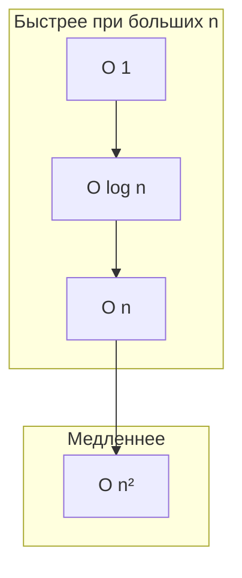

---

## Отладка — сценарии с решением

### Сценарий 1. Off-by-one

**Код:** `for i in range(1, n):` вместо `range(1, n+1)` — пропущен последний элемент.

**Метод:** трассировка на n=3, сравнение с эталоном.

---

### Сценарий 2. = и ==

В языках вроде C/Java `if (x = 5)` — присваивание, не сравнение. В Python присваивание в `if` запрещено.

---

### Сценарий 3. Деление целочисленное

`5 / 2` в Python 3 = 2.5; `5 // 2` = 2. На экзамене по Pascal часто **div**.

---

## Сравнение языков — одна задача

**Задача:** вывести "Hello, World!".

| Язык | Особенность |
|------|-------------|
| Python | `print("Hello, World!")` — интерпретируемый |
| C++ | `#include`, `int main`, компиляция |
| Java | класс, `public static void main` |
| Pascal | `program`, `begin`/`end` |

См. [JavaScript](/encyclopedia/5-languages/5-01-javascript/intro), [Python](/encyclopedia/5-languages/5-02-python/intro).

---

## Парадигмы — когда что учить

| Парадигма | Идея | Где встретится |
|-----------|------|----------------|
| Императивная | Пошаговые команды | Pascal, C |
| ООП | Объекты и классы | Java, C# |
| Функциональная | Функции без побочных эффектов | Haskell (обзор) |
| Событийная | Обработчики событий | GUI, веб |

---

## IDE — что уметь новичку

| Действие | Зачем |
|----------|-------|
| Создать проект | Структура файлов |
| Запустить с отладчиком | Точка останова |
| Смотреть переменные | Трассировка |
| Форматировать код | Читаемость |

---

## Git — мини-сценарий проекта

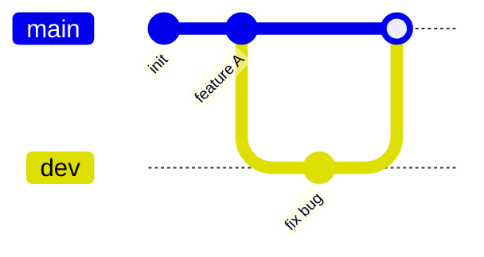

Команды для мини-проекта:

- `git init` — создать репозиторий;
- `git add` — добавить файлы в индекс;
- `git commit` — зафиксировать снимок;
- `git status` — посмотреть состояние;
- `git log --oneline` — краткая история.

См. [Основы Git](/encyclopedia/4-code-dev/4-13-osnovy-raboty-s-git/116).

---

## Тестирование — чек-лист

| Тип теста | Что проверяет |
|-----------|---------------|
| Нормальный ввод | Типичный случай |
| Граничный | n=0, n=1, пустой массив |
| Неверный ввод | Отрицательное n (если запрещено) |

---

## Блок-схема — поиск максимума из трёх

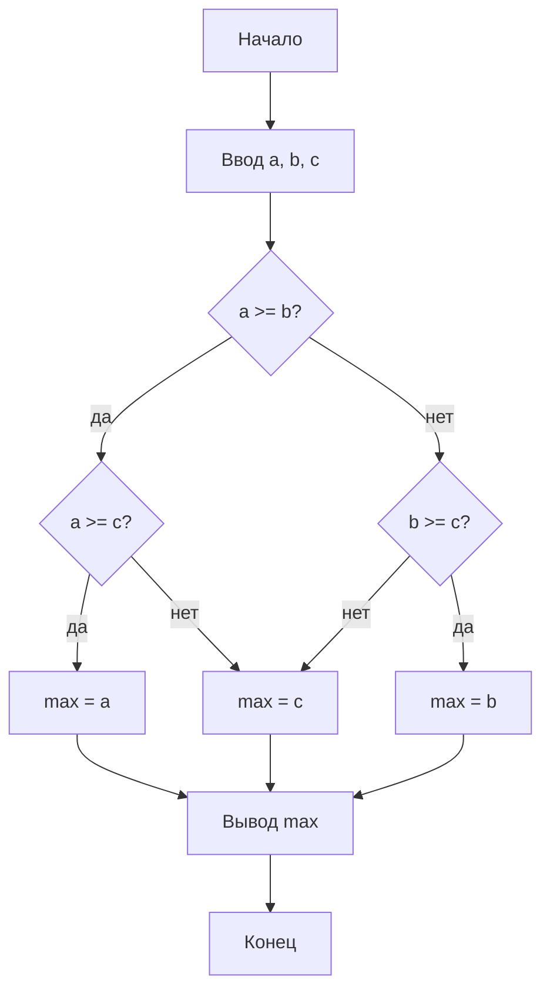

---

## Массивы и строки — задачи

### Задача М-1. Реверс массива

Два указателя: с начала и с конца, менять местами до встречи.

---

### Задача М-2. Подсчёт гласных

Пройти строку, если символ в "аеёиоуыэюя" — увеличить счётчик.

---

### Задача М-3. Палиндром

Сравнить символы с двух концов к центру; игнорировать регистр по условию задачи.

---

## Жизненный цикл ПО — этапы

| Этап | Результат |
|------|-----------|
| Анализ | Требования |
| Проектирование | Алгоритмы, структуры |
| Реализация | Код |
| Тестирование | Отчёт об ошибках |
| Сопровождение | Патчи, обновления |

---

## Задачи ЕГЭ-стиля — трассировка

**Условие.** Что выведет фрагмент с циклом `i` от 1 до 3, на каждом шаге `s = s + i*i`, s₀=0?

| i | i² | s |
|---|----|---|
| 1 | 1 | 1 |
| 2 | 4 | 5 |
| 3 | 9 | 14 |

**Ответ: 14.**

---

## Ошибки логики — каталог

| Симптом | Вероятная причина |
|---------|-------------------|
| Всегда 0 | Не инициализировали сумму |
| Бесконечный цикл | Условие выхода никогда не выполняется |
| Неверный последний элемент | Off-by-one |
| "Почти верно" | Перепутали &lt; и &lt;= |

---

## Языки — таблица для сравнения на экзамене

| Критерий | Компилируемый | Интерпретируемый |
|----------|---------------|------------------|
| Запуск | После сборки .exe | Через интерпретатор |
| Скорость | Обычно выше | Ниже на горячем пути |
| Примеры | C++, Pascal | Python, PHP |

---

## Проекты для закрепления

| № | Проект | Навыки |
|---|--------|--------|
| 1 | Калькулятор двух чисел | Ввод, ветвление |
| 2 | Угадай число | Цикл, сравнение |
| 3 | Таблица умножения | Вложенные циклы |
| 4 | Сортировка списка имен | Массивы, сортировка |
| 5 | Мини-квест с выбором | Условия, строки |

---

## Связь с курсом

| Глава | Связь |
|-------|-------|
| [Данные](./2) | Алгоритмы обрабатывают данные |
| [ОС](./5) | Программа — файл на диске |
| [Интернет](./6) | Клиент-сервер, протоколы |
| [Алгоритмы](/encyclopedia/4-code-dev/4-01-algoritmy/intro) | Углубление |

---

## Вопросы для итогового зачёта

1. Назовите свойства алгоритма (дискретность, определённость, результат, массовость).
2. Чем алгоритм отличается от программы?
3. Что такое блок-схема? Назовите 3 фигуры.
4. Оценка сложности бинарного поиска?
5. Зачем нужен отладчик?

**Ключи:**

1. Классика Кушниренко (дискретность, определённость, результат, массовость).
2. Программа реализует алгоритм на языке.
3. Овал, прямоугольник, ромб.
4. O(log n).
5. Пошаговое исполнение с просмотром состояния.

---


---

## Мега-банк трассировок и псевдокода


#### Трассировка Т-1

**Алгоритм суммы:** `S:=0`, `i:=1`, пока `i≤6`: `S:=S+i`, `i:=i+1`.

| i | S после |
|---|---------|
| 1 | 1 |
| 2 | 3 |
| 3 | 6 |
| 4 | 10 |
| 5 | 15 |
| 6 | 21 |

**Ответ:** S = **21**. Факториал 6! = **720** (для сравнения роста).

**Псевдокод максимума из списка:**
```
max := a[1]
для i от 2 до n:
  если a[i] > max то max := a[i]
вывод max
```

См. [Алгоритмы](/encyclopedia/4-code-dev/4-01-algoritmy/intro).


#### Трассировка Т-2

**Алгоритм суммы:** `S:=0`, `i:=1`, пока `i≤7`: `S:=S+i`, `i:=i+1`.

| i | S после |
|---|---------|
| 1 | 1 |
| 2 | 3 |
| 3 | 6 |
| 4 | 10 |
| 5 | 15 |
| 6 | 21 |
| 7 | 28 |

**Ответ:** S = **28**. Факториал 7! = **5040** (для сравнения роста).

**Псевдокод максимума из списка:**
```
max := a[1]
для i от 2 до n:
  если a[i] > max то max := a[i]
вывод max
```

См. [Алгоритмы](/encyclopedia/4-code-dev/4-01-algoritmy/intro).


#### Трассировка Т-3

**Алгоритм суммы:** `S:=0`, `i:=1`, пока `i≤8`: `S:=S+i`, `i:=i+1`.

| i | S после |
|---|---------|
| 1 | 1 |
| 2 | 3 |
| 3 | 6 |
| 4 | 10 |
| 5 | 15 |
| 6 | 21 |
| 7 | 28 |
| 8 | 36 |

**Ответ:** S = **36**. Факториал 8! = **40320** (для сравнения роста).

**Псевдокод максимума из списка:**
```
max := a[1]
для i от 2 до n:
  если a[i] > max то max := a[i]
вывод max
```

См. [Алгоритмы](/encyclopedia/4-code-dev/4-01-algoritmy/intro).


> Ещё трассировки того же шаблона — в [банке ОГЭ](#банк-задач-огэ--алгоритмы) и [дополнительных задачах](#дополнительные-задачи-для-экзамена).


## Дополнительный раздел — алгоритмы и программирование

### Свойства алгоритма — развёрнуто

| Свойство | Смысл | Нарушение |
|----------|-------|-----------|
| Дискретность | Шаги отделены | "Непрерывный" процесс без шагов |
| Определённость | Однозначность | "Если повезёт" |
| Результат | Конечный выход | Бесконечный цикл без выхода |
| Массовость | Для класса задач | Только одно число |
| Конечность | Завершается | Вечный цикл |

---

### Псевдокод — НОД (Евклид)

```
ввод a, b
пока b ≠ 0
  (a, b) ← (b, a mod b)
вывод a
```

---

### Псевдокод — простое число

```
ввод n
простое ← true
для d от 2 до sqrt(n)
  если n mod d = 0 то простое ← false
вывод простое
```

---

### Трассировка — сумма 1..5

| i | s |
|---|---|
| 1 | 1 |
| 2 | 3 |
| 3 | 6 |
| 4 | 10 |
| 5 | 15 |

---

### Трассировка — факториал 4

f: 1→2→6→24.

---

### Бинарный поиск — массив [1,3,5,7,9], key=3

mid=5→3, left сужается → найден на позиции 2.

---

### Сортировка пузырьком [3,1,2]

Проходы: 3↔1, 3↔2 → [1,2,3].

---

### Big-O — примеры кода

| Фрагмент | O |
|----------|---|
| один цикл до n | n |
| два вложенных до n | n² |
| деление пополам | log n |
| константа | 1 |

---

### Python — чётные числа

```python
n = int(input())
for i in range(1, n + 1):
    if i % 2 == 0:
        print(i)
```

---

### Pascal — максимум двух

```pascal
if a > b then writeln(a) else writeln(b);
```

---

### C# — цикл for

```csharp
for (int i = 1; i <= n; i++) sum += i;
```

---

### Отладка — таблица симптомов

| Симптом | Причина |
|---------|---------|
| NaN | Деление 0 |
| Пустой вывод | Не тот print |
| Всегда первый элемент | break лишний |

---

### Git flow — учебный

init → add → commit → branch → merge.

---

### Тесты — границы

n=0, n=1, n=10⁶ (если позволяет время).

---

### Задачи Б-6 … Б-15

| № | Задача | Идея |
|---|--------|------|
| Б-6 | Сумма цифр числа | mod 10, div 10 |
| Б-7 | Количество делителей | цикл до n |
| Б-8 | Простые до n | решето (обзор) |
| Б-9 | Реверс строки | с конца |
| Б-10 | Подсчёт пробелов | if c=' ' |
| Б-11 | MIN из массива | как MAX |
| Б-12 | Индекс MIN | запомнить i |
| Б-13 | Сортировка 3 чисел | if цепочка |
| Б-14 | Таблица умножения n | вложенный цикл |
| Б-15 | Сумма квадратов 1..n | s+=i*i |

---

### Блок-схема — цикл с условием

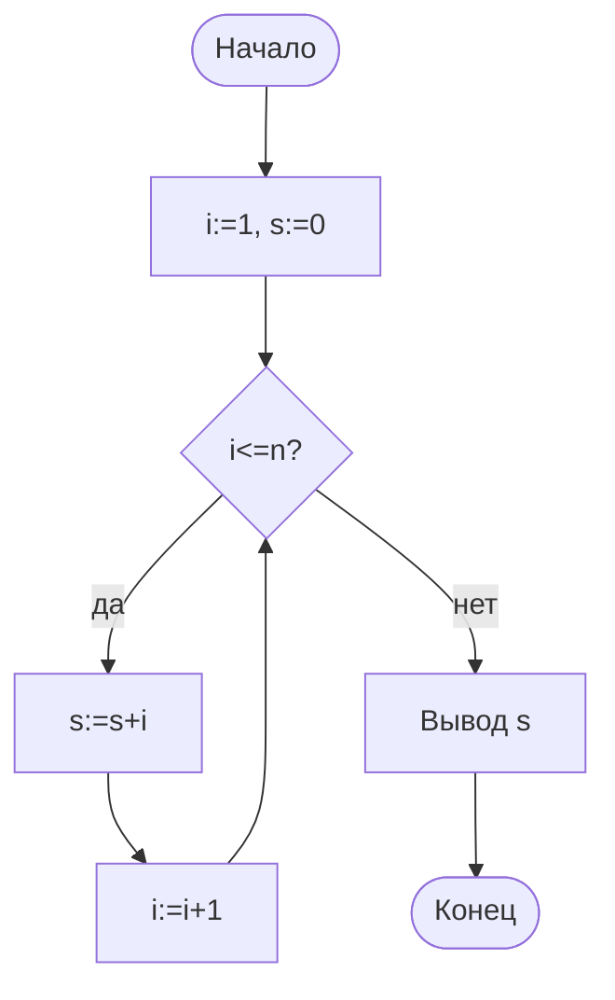

---

### Сравнение IDE

| IDE | Языки |
|-----|-------|
| и Code | Много |
| PyCharm | Python |
| IntelliJ | Java |
| PascalABC | Pascal |

---

### Жизненный цикл — Agile (кратко)

Спринты, итерации, обратная связь пользователя.

---

### Паттерны (только имена)

Singleton, Factory — для общего развития, не на ОГЭ.

---

### Рекурсия — Фибоначчи (медленно)

F(n)=F(n-1)+F(n-2); на больших n лучше цикл.

---

### Стек вызовов — глубина

Каждый рекурсивный вызов — новый кадр; переполнение при n>10⁴ без хвостовой оптимизации.

---

### Язык и платформа

Java → JVM; C# → .NET; Python → интерпретатор CPython.

---

### Компиляция — этапы

Исходник → лексер → парсер → код → объектный файл → линковка → exe.

См. [Compiler Simulator](#интерактив--компилятор) в статье.

---

### Задачи ЕГЭ — фрагменты

**Фрагмент 1:** `s=0; for i in 1..4: s+=i` → s=10.

**Фрагмент 2:** `while n>0: k+=1; n//=10` — число цифр.

**Фрагмент 3:** вложенный цикл 3×3 → 9 итераций.

---

### Вопросы 11–25 зачёта

11. Линейный поиск O(?). — O(n).  
12. Бинарный O(?). — O(log n).  
13. Рекурсия нуждается в ? — базовый случай.  
14. IDE breakpoint? — останов.  
15. Git commit? — снимок.  
16. Императивная парадигма? — команды.  
17. ООП единица? — объект.  
18. Синтаксическая ошибка? — компилятор.  
19. Логическая? — неверный результат.  
20. Псевдокод? — язык-чертёж.  
21–25: см. разделы выше.

---

### Проекты П-6 … П-10

| № | Проект |
|---|--------|
| П-6 | Конвертер температур |
| П-7 | Камень-ножницы-бумага |
| П-8 | Список покупок (массив) |
| П-9 | Проверка простого числа |
| П-10 | Мини-викторина |

---

### Чек-лист экзамена по главе 4

- [ ] Свойства алгоритма
- [ ] Блок-схема фигуры
- [ ] Псевдокод цикла
- [ ] Трассировка
- [ ] O(n), O(n²), O(log n)
- [ ] Отладчик
- [ ] Git add/commit
- [ ] Компилируемый и интерпретируемый

---

## Ещё трассировки — кураторский набор

### Трассировка T4-1

Сумма 1..4 при цикле for. **S = 10.**

---

### Трассировка T4-2

Сумма 1..5 при цикле for. **S = 15.**

---

### Трассировка T4-3

Сумма 1..6 при цикле for. **S = 21.**

---

### Трассировка T4-4

Сумма 1..7 при цикле for. **S = 28.**

---

### Трассировка T4-5

Сумма 1..8 при цикле for. **S = 36.**

---

### Трассировка T4-6

Сумма 1..9 при цикле for. **S = 45.**

---

### Трассировка T4-7

Сумма 1..10 при цикле for. **S = 55.**

---

### Трассировка T4-8

Сумма 1..11 при цикле for. **S = 66.**

---

### Трассировка T4-9

Сумма 1..12 при цикле for. **S = 78.**

---

### Трассировка T4-10

Сумма 1..13 при цикле for. **S = 91.**

---

### Трассировка T4-11

Сумма 1..14 при цикле for. **S = 105.**

---

### Трассировка T4-12

Сумма 1..15 при цикле for. **S = 120.**

---

### Трассировка T4-13

Сумма 1..16 при цикле for. **S = 136.**

---

### Трассировка T4-14

Сумма 1..17 при цикле for. **S = 153.**

---

### Трассировка T4-15

Сумма 1..18 при цикле for. **S = 171.**

---

### Трассировка T4-16

Сумма 1..19 при цикле for. **S = 190.**

---

### Трассировка T4-17

Сумма 1..20 при цикле for. **S = 210.**

---

### Трассировка T4-18

Сумма 1..21 при цикле for. **S = 231.**

---

### Трассировка T4-19

Сумма 1..22 при цикле for. **S = 253.**

---

### Трассировка T4-20

Сумма 1..23 при цикле for. **S = 276.**

---

### Трассировка T4-21

Сумма 1..24 при цикле for. **S = 300.**

---

### Трассировка T4-22

Сумма 1..25 при цикле for. **S = 325.**

---

### Трассировка T4-23

Сумма 1..26 при цикле for. **S = 351.**

---

### Трассировка T4-24

Сумма 1..27 при цикле for. **S = 378.**

---

### Трассировка T4-25

Сумма 1..28 при цикле for. **S = 406.**

---

### Трассировка T4-26

n=29, сумма 1..n = **435**.

---

### Трассировка T4-27

n=30, сумма 1..n = **465**.

---

### Трассировка T4-28

n=31, сумма 1..n = **496**.

---

### Трассировка T4-29

n=32, сумма 1..n = **528**.

---

### Трассировка T4-30

n=33, сумма 1..n = **561**.

---

### Трассировка T4-31

n=34, сумма 1..n = **595**.

---

### Трассировка T4-32

n=35, сумма 1..n = **630**.

---

### Трассировка T4-33

n=36, сумма 1..n = **666**.

---

### Трассировка T4-34

n=37, сумма 1..n = **703**.

---

### Трассировка T4-35

n=38, сумма 1..n = **741**.

---

### Трассировка T4-36

n=39, сумма 1..n = **780**.

---

### Трассировка T4-37

n=40, сумма 1..n = **820**.

---

### Трассировка T4-38

n=41, сумма 1..n = **861**.

---

### Трассировка T4-39

n=42, сумма 1..n = **903**.

---

## Резюме финальное

1. **Алгоритм** → блок-схема → **программа** → тесты.
2. **Парадигмы** и **языки** — инструменты; логика общая.
3. **Отладка** и **Git** — часть разработки.
4. Трассировка циклов на бумаге ловит off-by-one.

<div class="callout callout--tip">
  <div class="callout-title">Итог главы</div>
  <div class="callout-body">Читайте чужой код и трассируйте циклы вручную — главный навык до IDE.</div>
</div>

---

Дальше по курсу — [Интернет и сервисы](./6) или [Право и защита информации](./7).

---

## Быстрые ссылки

- [Алгоритмы](/encyclopedia/4-code-dev/4-01-algoritmy/intro)
- [Код и разработка](/encyclopedia/4-code-dev/code-dev)
- [Git](/encyclopedia/4-code-dev/4-13-osnovy-raboty-s-git/116)
- [Программа](/encyclopedia/1-basics/1-19-programma/intro)
- [Парадигмы](/encyclopedia/4-code-dev/4-07-paradigmy-i-urovni-abstraktsii/intro)

---

## Алгоритмические паттерны для школьника

| Паттерн | Пример |
|---------|--------|
| Накопление | Сумма, произведение |
| Счётчик | Чётные, положительные |
| Поиск | MIN, MAX, есть ли x |
| Флаг | Простое число да/нет |

---

## Вложенные циклы — площадь таблицы

```
для i от 1 до n
  для j от 1 до m
    вывод i, j
```

Число итераций: **n × m**.

---

## Модульность — зачем функции

Разбить программу на `ввод()`, `обработка()`, `вывод()` — проще тестировать.

---

## Исключения (обзор)

`try/except` в Python ловит ошибки времени выполнения; на ОГЭ по Pascal чаще проверяют деление на ноль вручную.

---

## Типы данных — сравнение языков

| Тип | Python | Pascal | C++ |
|-----|--------|--------|-----|
| Целое | int | integer | int |
| Дробное | float | real | double |
| Логический | bool | boolean | bool |
| Строка | str | string | string |

---

## Массив и список

Статический массив фиксированной длины (Pascal); список Python динамический.

---

## Строки — неизменяемость

В Python строка immutable; конкатенация в цикле медленная — используйте `join`.

---

## Блок-схема цикла "пока"

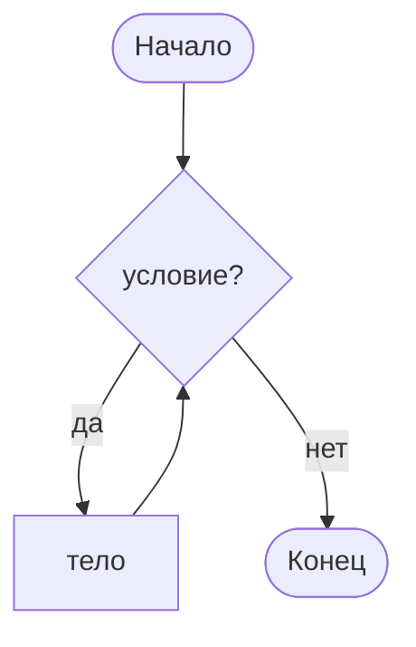

---

## Задача на трассировку — вложенный if

```
если a > b
  если a > c то max ← a
  иначе max ← c
иначе ...
```

При a=5,b=2,c=9 → max=9.

---

## Сортировка слиянием (имя)

Делит массив пополам, сортирует части, сливает — O(n log n); на ОГЭ достаточно знать, что быстрее O(n²).

---

## Хеш-таблица (имя)

Быстрый поиск O(1) в среднем — вне школьной программы, но встречается в словарях Python.

---

## Резюме финальное

1. **Алгоритм** — точная последовательность шагов; проверяйте на малых примерах.
2. **Псевдокод и блок-схема** — до кода; трассировка ловит ошибки.
3. **Сложность** — как растёт время при увеличении n.
4. **Язык** — инструмент; логика важнее синтаксиса.
5. **Отладка и тесты** — часть разработки.

<div class="callout callout--tip">
  <div class="callout-title">Итог главы</div>
  <div class="callout-body">Трассируйте циклы вручную — главный навык до автоматизации в IDE.</div>
</div>

---

Дальше по курсу — [Интернет и сервисы](./6).

---

## Быстрые ссылки

- [Выполнение кода](/encyclopedia/4-code-dev/4-03-vypolnenie-koda/312)
- [ООП](/encyclopedia/4-code-dev/4-08-oop/intro)
- [Git](/encyclopedia/4-code-dev/4-13-osnovy-raboty-s-git/116)

---
