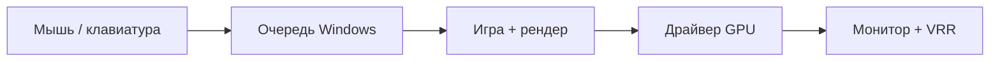

---
tags:
  - all
  - required
title: 'Игры — FPS, латентность и память'
description: >-
  Shader cache, фоновые службы, драйверы, план питания, Game Mode, управление
  памятью и снижение input lag в Windows.
related:
  - title: Компьютерные игры
    doc: encyclopedia/1-basics/1-18-kompyuternye-igry/intro
  - title: Видеокарта
    doc: encyclopedia/1-basics/1-08-kak-rabotaet-kompyuter/4
  - title: Процессы Windows
    doc: /encyclopedia/1-basics/1-035-bazovaya-informatika/406
---

# Игры — FPS, латентность и память

<div class="article-tags">
  <span class="tag tag-required">ОБЯЗАТЕЛЬНО</span>
</div>

<span class="complexity-badge">Опытному пользователю</span>

Эта статья — про **плавность** (frame time и 1% low), **задержку** (input lag) и **память** (RAM/VRAM/SSD) в играх на Windows: как быстро найти узкое место и какие настройки реально помогают.

## Быстрый чеклист (самое частое)

- **Микрофризы / “пила” frametime**: дождитесь компиляции шейдеров, проверьте `Shader cache`, отключите лишние оверлеи, убедитесь, что игра на SSD/NVMe.
- **Низкий FPS при “свободной” видеокарте (GPU 60–80%)**: упор в CPU (дальность прорисовки, толпа/NPC, физика), фоновые службы, режим питания.
- **Тяжёлый input lag**: выключить V‑Sync, включить VRR (G‑Sync/FreeSync) + ограничить FPS чуть ниже Hz, включить Reflex/Anti‑Lag, убрать лишние оверлеи/захват.
- **Фризы при заполнении памяти**: 16 ГБ — компромисс, 32 ГБ — комфорт; файл подкачки не отключать; закрыть тяжёлые фоновые приложения.

## Почему современные игры такие требовательные

Игры становятся требовательными из‑за усложнения технологий, роста стандартов и нехватки времени на оптимизацию. Раньше разработчики «рисовали» свет и тени вручную (запекали их в текстуры). Теперь физика света просчитывается в реальном времени с помощью Ray Tracing (трассировки лучей) и Path Tracing. Это создаёт фотореалистичные отражения и глобальное освещение, но требует колоссальной мощности от видеокарты.

Большинство новинок переходят на движок Unreal Engine 5. В нем используются технологии Nanite (микрополигональная геометрия, стирающая стыки между 3D-моделями) и Lumen (динамическое освещение). Картинка становится киношной, но базовые требования к ПК возрастают в разы. Разработчики больше не ориентируются на старые консоли вроде PS4, что развязывает им руки в плане графики, но бьет по владельцам старых ПК.

Технологии «умного» масштабирования картинок из низкого разрешения в высокое изначально создавались для помощи слабым картам. Однако сегодня разработчики часто закладывают DLSS (NVIDIA) или FSR (AMD) в системные требования как обязательное условие. Игра создается с расчетом на то, что видеокарта будет рендерить ее, например, в 720p, а искусственный интеллект дотянет до 1080p. Без этих технологий «в нативном разрешении» игры выдают мало FPS.

Игры стали огромными, а издатели жестко ограничивают сроки разработки. Оптимизация — это самый сложный, дорогой и долгий этап полировки игры перед релизом. Зачастую разработчикам проще написать код «грубо», рассчитывая, что геймеры просто купят более мощные видеокарты, чем тратить полгода на ручную очистку кода и сжатие текстур.

В основном всё упирается в видеокарту. Чтобы комфортно играть в любые современные игры на высоких настройках графики, вам нужен сбалансированный комплект из процессора, видеокарты и оперативной памяти:
- Процессор: AMD Ryzen 5 7600X или Intel Core i5-13600K / 14600K.
- Видеокарта: NVIDIA GeForce RTX 4070 Super или AMD Radeon RX 7800 XT.
- ОЗУ: 32 GB DDR5 с частотой 6000 MHz (две планки по 16 GB).

Производительность в играх определяется количеством кадров в секунду — FPS (Frames Per Second), а также плавностью их вывода.
1. Средний FPS (Avg FPS). Показывает общую плавность. Для комфортной игры нужно 60+ FPS, для киберспорта — 144+ FPS.
2. Показатели 1% и 0.1% Min FPS. Они показывают частоту падения кадров. Если средний FPS равен 80, а 1% падает до 15 — игра будет постоянно дергаться (фризить).
3. Время кадра (Frametime). График плавности. Ровная линия означает идеальную плавность. Зубья на графике — это микрофризы.

Самая популярная бесплатная программа для измерения - MSI Afterburner + RTSS (RivaTuner Statistics Server). Кроме этого, есть встроенные оверлеи NVIDIA App, AMD Software, Steam.

Во многих тяжелых играх (Cyberpunk 2077, Assassin's Creed, Forza Horizon) в настройках графики есть кнопка «Запустить бенчмарк». Игра сама прокрутит стресс-сцену и выдаст точный отчет по вашему железу.

Включите оверлей во время игры и посмотрите на загрузку компонентов:
- Видеокарта (GPU) загружена на 95–99%: Идеально. Видеокарта работает на максимум, процессор успевает ее нагружать.
- Видеокарта загружена на 60–80%, а процессор на 90–100%: Процессор слишком слабый (эффект «бутылочного горлышка» / Bottleneck). Он сдерживает видеокарту.
- Загрузка ОЗУ близка к максимуму: Памяти не хватает. Начнутся жесткие фризы, так как ПК начнет использовать медленный файл подкачки на диске.

Оперативная память (ОЗУ) напрямую влияет на FPS и плавность игры, определяя, как быстро процессор получает игровые данные (текстуры, физику, логику ботов). Скорость этого взаимодействия зависит от двух параметров: частоты и латентности (задержки).

---

## FPS — не единственная метрика


**FPS (кадров в секунду)** показывает плавность картинки. Для соревновательных игр не менее важны:

- **Frame time** — время одного кадра (стабильность важнее среднего FPS);
- **1% low** — худшие кадры (микрофризы);
- **Input lag** — задержка от действия до кадра на экране.

Frame time (время кадра) — это чистый показатель плавности игры. Это время в миллисекундах (мс), которое требуется видеокарте и процессору, чтобы полностью подготовить и вывести на экран один кадр. В отличие от FPS, который показывает среднее количество кадров за целую секунду, фреймтайм показывает стабильность каждого отдельного кадра.

В мониторинге (например, в MSI Afterburner) фреймтайм отображается в виде живого графика-линии. 

Пример - Счетчик показывает высокий средний FPS (например, 70 кадров). Но если игра на полсекунды замерла из-за подгрузки текстуры, фреймтайм в этот момент прыгнул до 500 мс. Вы увидите сильный рывок (фриз), хотя средний FPS на экране почти не изменится.

1% Low FPS (или показатель «одного процента крайне низких кадров») — это метрика, которая показывает, насколько сильно и часто падает производительность в самые тяжелые моменты игры. В отличие от «среднего FPS», который маскирует проблемы, 1% Low объективно отражает плавность игрового процесса и наличие фризов (подергиваний).

Представьте, что игра шла ровно одну минуту, и видеокарта отрисовала 3600 кадров.
1. Программа мониторинга (например, MSI Afterburner) записывает время отрисовки каждого из этих 3600 кадров.
2. Затем она берет 1% самых медленных кадров (в нашем примере это 36 худших кадров, которые рендерились дольше всего).
3. Из этого худшего процента вычисляется среднее значение FPS. Это и есть ваш 1% Low.

Есть также показатель 0.1% Low — он берет самую экстремальную каплю кадров и показывает разовые, но самые жесткие заикания игры (статтеры).

Если средний FPS вас устраивает, но 1% Low слишком низкий (ниже 45–50 кадров), это признак того, что системе тяжело в пиковые моменты.

Input lag (задержка ввода) — это промежуток времени между вашим действием (нажатием кнопки на мыши, клавиатуре или геймпаде) и видимой реакцией на это действие на экране монитора. Этот показатель измеряется в миллисекундах (мс). Чем он ниже, тем быстрее и отзывчивее ощущается игра, что критически важно для динамичных шутеров (Counter-Strike, Apex Legends, Warzone) и файтингов.

Вертикальная синхронизация (V‑Sync) часто самый главный виновник. V‑Sync убирает разрывы экрана, заставляя видеокарту ждать монитор. Это может добавить заметную задержку (вплоть до десятков миллисекунд), из‑за чего мышь начинает двигаться «как в киселе». Внутри игр чаще всего лучше **выключить V‑Sync** и вместо него использовать аппаратные технологии **G‑Sync** (NVIDIA) или **FreeSync** (AMD) в паре с ограничением FPS чуть ниже частоты обновления монитора (например, 141 FPS для монитора 144 Гц).

Чем меньше кадров выдает ваш ПК, тем реже обновляется картинка. При 30 FPS задержка рендеринга всегда будет намного выше, чем при 144 FPS. Кстати, мониторы на 144, 240 или 360 Гц имеют гораздо более низкую задержку дисплея, чем стандартные офисные 60 Гц.

Искусственное создание промежуточных кадров в технологиях DLSS 3 или FSR 3 увеличивает FPS на счетчике, но физически повышает задержку ввода, так как системе нужно дождаться следующего кадра, чтобы вставить между ними фейковый.

Продвинутый геймер на ПК смотрит MSI Afterburner + RTSS, встроенный оверлей AMD/NVIDIA или [PresentMon](https://github.com/GameTechDev/PresentMon).

**График frame time:** ровная полоса ~8,3 ms (120 FPS) — хорошо; **пики-иглы** — микрофризы, которые средний FPS скрывает.

Основы железа для игр: [видеокарта](/encyclopedia/1-basics/1-08-kak-rabotaet-kompyuter/4), раздел [Игры](/encyclopedia/1-basics/1-18-kompyuternye-igry/intro).

---

## Shader cache (кэш шейдеров)

Shader Cache (кэш шейдеров) — это выделенная область на диске, где хранятся уже скомпилированные (переведенные в понятный для видеокарты код) инструкции для отрисовки графики в игре. Главная задача кэша шейдеров — убрать фризы и статтеры, обеспечивая идеально ровный график времени кадра (Frame time).

Каждая современная игра написана на высокоуровневом языке, но видеокарта (будь то NVIDIA или AMD) не понимает этот код напрямую. Процессор вашего ПК берет инструкции игры и «переводит» их под архитектуру вашей конкретной видеокарты и версию драйвера. Этот процесс требует огромных ресурсов процессора. Если компилировать шейдер прямо во время игры (например, когда вы первый раз открыли дверь и увидели взрыв), процессор на долю секунды загрузится на 100%, игра замерет, а фреймтайм подскочит. Это и есть шейдерный статтер (Shader Stutter).

Чтобы этого не происходило, скомпилированный код один раз записывается в Shader Cache на накопитель. При следующем запуске игра просто моментально считывает готовый файл с диска, и фризов не возникает.

При первом запуске игра **компилирует шейдеры** — возможны рывки и долгая загрузка. Драйвер и лаунчеры кэшируют результат:

| Кэш | Где | Если удалить |
| :--- | :--- | :--- |
| NVIDIA | `%LOCALAPPDATA%\NVIDIA\DXCache`, GLCache | Пересборка, краткий stutter |
| AMD | `C:\Users\...\AppData\Local\AMD\DxCache` | То же |
| Steam | `steamapps\shadercache` | Дольше первый запуск |

При первом запуске игры (например, The Last of Us Part I, Horizon, Hogwarts Legacy) на экране появляется полоса загрузки: «Компиляция шейдеров...». Это может занимать от 2 до 15 минут. Процессор в этот момент загружен на 100%. Важно дождаться окончания! Если нажать «Играть» до завершения, вся игра будет дико тормозить и фризить. Некоторые игры пытаются компилировать файлы прямо во время геймплея или экранов загрузки уровней. Из-за этого первые 20–30 минут в новой локации игра может сильно заикаться (просаживать 1% Low FPS), но по мере наполнения кэша работа становится плавной.

Каждый раз, когда вы обновляете драйвер видеокарты (NVIDIA/AMD) или выходит крупный патч для игры, весь старый кэш шейдеров удаляется как неактуальный. Игра будет компилировать их заново. Поэтому первые матчи после обновления драйвера в условной Apex Legends или Counter-Strike 2 могут слегка подфризивать.

Так как игра постоянно обращается к кэшу шейдеров, он должен находиться на быстром накопителе. Если игра или операционная система установлены на медленный HDD, считывание кэша вызовет те самые задержки, которые он призван устранять.

В панели управления NVIDIA есть важный пункт «Размер кэша шейдеров» (Shader Cache Size). По умолчанию там стоит значение «Контролируется драйвером» (обычно это около 1–4 ГБ). Для современных тяжелых игр рекомендуется вручную выставить там 10 ГБ или Без ограничений (Unlimited). Это предотвратит удаление старого кэша, если вы играете во много разных игр одновременно.

Очистка кэша — легитимный приём при **артефактах** после обновления драйвера, не "магия +50 FPS".

---

### DirectX / Vulkan shader cache

DirectX (DX11, DX12) и Vulkan — это графические API (интерфейсы), через которые игра общается с видеокартой. Процесс создания и хранения кэша шейдеров в них устроен по-разному, что напрямую влияет на плавность картинки и частоту фризов.

DX12 дает разработчикам низкоуровневый доступ к железу. Драйвер больше не помогает игре «угадывать» код — разработчик обязан сам управлять компиляцией. Именно в DX12 появилась та самая обязательная предварительная компиляция в главном меню игры. Игра один раз компилирует огромный массив данных под вашу видеокарту. Если кэш собран полностью, игра идет с идеальным, ровным графиком времени кадра (Frame time). Если разработчики поленились оптимизировать этот процесс, игра страдает от ужасных «шейдерных статтеров» при каждом чихе, так как драйвер видеокарты больше не подстраховывает игру.

Vulkan — это тоже низкоуровневый API (развитие OpenGL). Он используется в таких играх, как Doom Eternal, Red Dead Redemption 2, Baldur's Gate 3 и в эмуляторах. Как и DX12, он требует ручной компиляции от разработчиков. Однако Vulkan обладает уникальной особенностью — фоновым обновлением кэша через лаунчеры.  Если вы играете на Vulkan через Steam (особенно актуально для Linux и Steam Deck), Steam умеет скачивать уже готовый, предварительно скомпилированный кэш для вашей видеокарты из облака. Вы просто скачиваете игру, и она сразу идет плавно, без необходимости сидеть в главном меню.

Игры на DX12 и Vulkan компилируют шейдеры в первые секунды кат-сцены. Stutter "раз в минуту" на первых 10 минутах — часто **догрузка кэша**. Дайте игре прогуляться 15 минут offline или используйте встроенный "precompile shaders" (Cyberpunk 2077, Starfield и др.).

---

### Настройки графики — приоритеты

При настройке графики в играх главная задача — получить чёткую картинку и высокий FPS, сохранив **ровный frame time** и адекватный **input lag**. Ниже — большая шпаргалка по настройкам: что “съедает” FPS (GPU/CPU/VRAM), что чаще всего даёт микрофризы, и что крутить в первую очередь.

> Условные оценки: **низкое / среднее / высокое / очень высокое**. Реальный эффект зависит от движка, API (DX11/DX12/Vulkan) и сцены.

| Настройка | Влияние на FPS (GPU) | Влияние на FPS (CPU) | Риск фризов / 1% low | Влияние на input lag | Визуальный эффект | Рекомендация (соревновательно) | Рекомендация (сюжет/красота) | Быстрая заметка |
| :--- | :---: | :---: | :---: | :---: | :--- | :--- | :--- | :--- |
| **Разрешение** | **очень высокое** | низкое | низкий | косвенно: ниже FPS → выше lag | сильный | снижать, если GPU 95–99% | держать “натив” если тянет | главный рычаг нагрузки на GPU |
| **Render scale** (внутр. масштаб) | **очень высокое** | низкое | низкий | как у разрешения | сильный | 80–100% | 100–120% (если запас) | часто скрыт в “Display” |
| **DLSS/FSR/XeSS (Upscaling)** | **высокое (экономит GPU)** | низкое | низкий | низкое | средний | включать “Quality/Performance” по ситуации | “Quality/Balanced” | апскейл ≠ free, но обычно выгодно |
| **Frame Generation** (DLSS 3/FSR 3) | среднее (поднимает “счётчик”) | низкое | средний | **повышает** | низкий/средний | обычно **выкл** | включать, если упор в GPU и устраивает lag | FPS растёт, но отклик хуже |
| **V‑Sync** | низкое | низкое | средний | **сильно повышает** | низкий | **выкл** | включать только если нет VRR и мешает tearing | лучше VRR + cap FPS |
| **VRR (G‑Sync/FreeSync)** | низкое | низкое | низкий | низкое | низкий | **вкл** + cap FPS | **вкл** + cap FPS | снижает tearing без “тяжёлого” лага |
| **Ограничение FPS (cap)** | низкое | низкое | **снижает пики** | может снизить | низкий | cap чуть ниже Hz | cap по комфорту/тишине | улучшает frame pacing |
| **Ray Tracing (RT)** | **очень высокое** | низкое/среднее | средний | среднее | сильный | **выкл** | “Medium/High” при запасе | №1 потребитель FPS |
| **Path Tracing** | **экстремальное** | низкое | средний | среднее | очень сильный | **выкл** | только топ‑GPU | часто требует апскейла |
| **Global Illumination / Lumen** | **высокое** | среднее | средний | низкое | сильный | medium/low | medium/high | “ультра” редко оправдан |
| **Shadows (качество теней)** | **высокое** | среднее | средний | низкое | средний | low/medium | medium/high | “ультра” — дорогая косметика |
| **Reflections (SSR и т.п.)** | среднее/высокое | низкое | средний | низкое | средний | low/medium | medium/high | SSR часто “шумит” на ультра |
| **Ambient Occlusion (SSAO/HBAO)** | среднее | низкое | низкий | низкое | средний | low/medium | medium/high | приятный объём, но можно срезать |
| **Volumetrics (fog/clouds)** | **высокое** | среднее | средний | низкое | средний/сильный | low/medium | medium | частая причина просадок в сценах “дым/туман” |
| **Anti‑Aliasing (TAA/TSR/FXAA/MSAA)** | низкое/среднее | низкое | низкий | низкое | средний | по вкусу: часто TAA low/FXAA | TAA/TSR medium | TAA может “мылить” картинку |
| **Textures (качество текстур)** | низкое (пока хватает VRAM) | низкое | **высокий при нехватке VRAM** | низкое | сильный | под VRAM (не гнаться за Ultra) | Ultra если VRAM хватает | если VRAM забилась → статтеры |
| **Texture streaming / streaming budget** | среднее | низкое | **высокий** | низкое | средний | увеличивать при VRAM/RAM запасе | увеличивать при запасе | лечит “подгрузки” при беге/езде |
| **Anisotropic Filtering (x16)** | низкое | низкое | низкий | низкое | средний | **x16** | **x16** | почти бесплатная чёткость под углом |
| **View distance / Geometry / LOD** | среднее | **высокое** | средний | низкое | средний | снижать при недогрузе GPU | medium/high | если GPU 60–80% — часто виновато это |
| **NPC density / crowd** | низкое | **высокое** | средний | низкое | низкий/средний | low | medium | лечит “городские” просадки |
| **Physics / destruction** | низкое/среднее | **высокое** | средний | низкое | средний | low/medium | medium/high | особенно в больших боях |
| **HairWorks / “волосы”** | высокое | низкое | средний | низкое | средний | выкл/low | medium | исторически прожорливо |
| **Motion Blur** | низкое | низкое | низкий | низкое | вкусовщина | **выкл** | по вкусу | часто ухудшает читаемость |
| **Depth of Field (DOF)** | низкое/среднее | низкое | низкий | низкое | вкусовщина | выкл | medium | “кинцо”, но мешает в PvP |
| **Film Grain / Chromatic Aberration** | низкое | низкое | низкий | низкое | вкусовщина | выкл | выкл/по вкусу | обычно выключают ради “чистоты” |
| **Overlays (Steam/Discord/NVIDIA/Xbox)** | — | — | **высокий** | **может повысить** | — | оставить 0–1 | оставить 0–1 | конфликт перехвата кадров → статтеры |
| **Exclusive fullscreen / Borderless** | — | — | средний | **может влиять** | — | тестировать, часто exclusive ниже lag | borderless удобнее | DX12/Vulkan часто “flip model” |

Эти параметры сильнее всего нагружают видеокарту и процессор. Снижение их с «Ультра» до «Высоких» или «Средних» вернет вам до 30–50% FPS.
- Трассировка лучей / Ray Tracing (а также Path Tracing): Самая «тяжелая» технология в истории гейминга. Включение съедает до половины вашего FPS. Рекомендация: Выключайте сразу, если у вас не топовая карта серии RTX 4080/4090.
- Глобальное освещение / Global Illumination (включая Lumen в Unreal Engine 5): Отвечает за реалистичный просчет света в комнатах. Рекомендация: Перевод на «Среднее» дает огромный буст производительности при минимальной потере красоты.
- Качество теней / Shadows: Детализированные динамические тени требуют колоссальных ресурсов. Рекомендация: ставьте «Высоко» или «Средне». Разницу между «Ультра» и «Высоко» сложно заметить в динамике, а FPS вырастет на 10–15%.
- Отражения / Reflections (особенно SSR — Screen Space Reflections): отражения в лужах и на глянцевых поверхностях. Рекомендация: «Высоко» или «Средне». На «Ультра» они часто дают лишний шум и могут ухудшать 1% low.

Эти настройки делают картинку красивой, но их нужно подбирать под мощность вашего процессора и объем видеопамяти.
- Качество текстур / Textures: Не влияет на FPS, пока у вас есть свободная видеопамять (VRAM). Если у вас 12-16 ГБ VRAM — смело ставьте «Ультра». Если памяти не хватает (например, 8 ГБ в тяжелой новинке), «Ультра» вызовет жесткие фризы (упадет 1% Low). Снижайте до «Высоких».
- Дальность прорисовки / View Distance / Geometry: Сильно нагружает процессор, а не видеокарту. Если в городе у вас падает FPS, а видеокарта загружена всего на 70% — снизьте этот параметр до «Среднего».
- Плотность толпы / Количество NPC: Еще один параметр, бьющий строго по процессору. В таких играх, как Cyberpunk 2077 или Witcher 3, смело снижайте толпу до «Средней», чтобы убрать микрофризы при быстрой езде.
- Объёмные облака и туман / Volumetric Fog / Clouds: красивые лучи света сквозь туман. Прожорливая настройка. Рекомендация: ставьте «Средне» — это часто спасает около 10% FPS.

Эти параметры улучшают восприятие игры, но практически не снижают заветный счетчик FPS (потери в пределах 1–3%).
- Анизотропная фильтрация / Anisotropic Filtering (AF x16): Делает текстуры под углом к игроку (например, дорогу или стены в коридоре) четкими, а не размытыми. Рекомендация: Всегда включайте на 16x. Нагрузка на современное железо равна нулю.
- Качество моделей / Моделирование (Тесселяция): Сглаживает углы у 3D-объектов, делая их округлыми. Рекомендация: «Высоко». Современные видеокарты щелкают геометрию как орешки.
- Качество звука: На современных ПК аудиопоток почти не нагружает процессор. Наслаждайтесь максимальным качеством.

Эти эффекты созданы для имитации кинокамеры, но многие геймеры отключают их просто потому, что они портит четкость картинки:
- Размытие в движении (Motion Blur): Размазывает экран при повороте камеры. Лучше выключить (добавит четкости и спасет 1-2 FPS).
- Зернистость пленки (Film Grain) и Хроматическая аберрация: Добавляют «шум» и цветные контуры. Практически не влияют на FPS, но делают картинку грязной. Чаще всего их выключают.

Соревновательный режим — низкие тени, отключить лишний AA, лимит FPS чуть ниже Hz монитора при G-Sync (**frame pacing**).

---

### Exclusive fullscreen и borderless

Exclusive Fullscreen (Эксклюзивный режим). В этом режиме игра получает абсолютный и единоличный контроль над видеокартой и монитором. Рабочий стол Windows и все фоновые приложения буквально «засыпают» и перестают отрисовываться. Задержка ввода самая низкая, так как кадры идут из игры на экран напрямую, минуя посредников. Если вы захотите переключиться на браузер или Discord, экран погаснет на 2–5 секунд, пока Windows будет возвращать контроль рабочему столу. Иногда игра при этом может намертво зависнуть или вылететь.

Borderless Windowed (Оконный без рамки). Игра запускается в обычном окне, но растягивается на весь экран, а рамки окна скрываются. Игрой и рабочим столом одновременно управляет системный диспетчер Windows — DWM (Desktop Window Manager). Вы можете моментально переключаться между игрой и другими программами без пауз и черных экранов. Так как кадры сначала проходят через диспетчер Windows (DWM), задержка ввода может увеличиться на 10–20 мс.

| Режим | Суть | Input lag |
| :--- | :--- | :--- |
| **Exclusive fullscreen** | Игра владеет выходом монитора | Обычно ниже |
| **Borderless** | Композитор Windows рисует поверх | Часто выше; удобнее Alt+Tab |

При странной задержке: свойства `.exe` → совместимость → **Отключить оптимизацию во весь экран**.

Если вы играете в современные игры на DirectX 12 или Vulkan, старое правило «Exclusive всегда лучше» больше не работает. В Microsoft обновили систему вывода кадров (технология Flip Model). Теперь в Windows 10/11 для игр на DX12 режим Borderless автоматически получает все преимущества эксклюзивного режима. В некоторых новинках (Cyberpunk 2077, Alan Wake 2) разработчики даже физически вырезали кнопку Exclusive Fullscreen, оставив только Borderless, так как DX12 оптимизирован именно под него.

Выбирайте Borderless, если игра работает на DirectX 12 или Vulkan, а также если у вас два монитора или вы часто сворачиваете игру.

Выбирайте Exclusive Fullscreen, если вы играете в старые игры на DirectX 11 / DX9, или если вы играете в киберспортивные шутеры (CS2, Valorant), где критически важна каждая миллисекунда задержки ввода.

---

## Фоновые службы и конфликты драйверов

Фоновые службы и конфликты драйверов — это главные «невидимые» причины, по которым мощный компьютер может выдавать низкий 1% Low FPS, страдать от заиканий (статтеров) или внезапно вылетать на рабочий стол.

Даже если ваш процессор загружен в простое всего на 5%, фоновые приложения могут вклиниваться в процесс рендеринга, вызывая резкие пики времени кадра (Frame time). Сторонние антивирусы (особенно Avast, McAfee) или встроенный Windows Defender могут начать сканировать файлы игры прямо во время геймплея. Добавляйте папки с тяжелыми играми в «Исключения» антивируса.

Центр обновления Windows, службы сбора данных (Telemetry) и фоновые апдейтеры (Google Update, Adobe Updater) любят запускаться в самый неподходящий момент. Также утилиты для управления подсветкой и разгоном вроде ASUS Armoury Crate, MSI Center, Gigabyte Control Center или Razer Synapse печально известны своей прожорливостью. Они постоянно опрашивают датчики железа, вызывая микрофризы.

Одновременная работа оверлея Steam, Discord, GeForce Experience и MSI Afterburner создает конфликт перехвата кадров. Рекомендация: Оставьте только один нужный оверлей, остальные отключите в настройках приложений.

Самый жесткий конфликт происходит, когда в системе сталкиваются остатки старых и файлы новых драйверов видеокарты. Это часто случается при замене видеокарты (например, перешли с AMD на NVIDIA) или при многократном обновлении драйверов «поверх» старых.

Перед сессией:

1. Закрыть лаунчеры других платформ, браузер с тяжёлыми вкладками.
2. Отключить оверлеи, которые не нужны — Discord (можно оставить голос без overlay), GeForce Experience overlay, Xbox Game Bar (`Win+G` → настройки).
3. Проверить, что RGB-софт не грузит CPU ([процессы](/encyclopedia/1-basics/1-035-bazovaya-informatika/406)).

**Драйвер GPU:** для стабильности — WHQL; "экспериментальные" — только если готовы откатиться (DDU + предыдущая версия). Не смешивайте старый чипсет-драйвер с новым GPU-драйвером без причины.

Конфликты часто дают **два антивируса** или захват экрана третьей программой.

---

## План электропитания и троттлинг

План электропитания и троттлинг — это два важнейших фактора, которые напрямую управляют частотой процессора (CPU) и видеокарты (GPU). Они могут как искусственно урезать мощность мощного ПК, так и спасти железо от перегрева.

План электропитания определяет, как Windows распределяет энергию: дает процессору работать на полную мощность или заставляет его сбавлять частоты ради тишины и экономии.

| Режим | Эффект |
| :--- | :--- |
| **Высокая производительность** / Ultimate Performance | Держит частоты, больше нагрев |
| Сбалансированный | Экономия, просадки FPS на ноутбуке от сети |
| Энергосбережение | Плохо для игр |

Никогда не играйте от батареи. При отключении от розетки ноутбук аппаратно **урезает** частоты видеокарты и процессора в 2–3 раза, чтобы спасти аккумулятор. 1% low падает до дна, игра превращается в слайд‑шоу. Всегда активируйте режим «Производительность» в фирменном софте ноутбука (ASUS Armoury Crate, MSI Center и т.д.) при игре от сети.

Троттлинг — это защитный механизм железа от перегрева. Когда температура процессора или видеокарты доходит до критической отметки, чип начинает намеренно пропускать такты и сбрасывать частоту, чтобы снизить выделение тепла и не сгореть.

Вы запускаете игру, первые 5–10 минут все идет идеально плавно. Затем ПК нагревается, и FPS резко падает в 2–4 раза, начинаются жесткие фризы. Как только чип немного остывает, FPS возвращается в норму, но через минуту ситуация повторяется. На графике времени кадра (Frame time) это выглядит как огромные пики вверх через равные промежутки времени.

У Intel обычно начинается при 95–100°C. У современных AMD Ryzen (серии 7000/9000) рабочая температура под нагрузкой заложена до 95°C, троттлинг начинается выше этой отметки. 

С видеокартами иначе. Троттлинг по чипу начинается в районе 83–85°C. Но важнее показатель Hot Spot (самая горячая точка на чипе) и температура памяти (VRAM) — если там температура уходит за 105°C, карта начнет резко сбрасывать частоты, даже если средняя температура чипа показывает нормальные 70°C.

Ноутбук: играть **от сети**, в панели производителя — режим "Performance". При перегреве — [троттлинг](/encyclopedia/1-basics/1-035-bazovaya-informatika/408), а не только "режим питания".

```powershell
powercfg /list
powercfg /query SCHEME_CURRENT SUB_PROCESSOR PROCTHROTTLEMAX
```

---

## Настройки Windows для игр

Для максимального FPS и стабильного фреймтайма (без фризов) Windows нужно настроить так, чтобы она отдавала все ресурсы железа игре, а не фоновым процессам.

В последних версиях Windows встроенные игровые функции работают отлично. Откройте Параметры (Win + I) -> Игры:

| Параметр | Рекомендация |
| :--- | :--- |
| **Game Mode** | Включён для фокуса на игре (эффект зависит от игры) |
| **HAGS** (аппаратное ускорение GPU) | Пробовать вкл/выкл — зависит от игры и драйвера |
| **Fullscreen optimizations** (свойства exe → Совместимость) | При странном input lag — "Отключить оптимизацию во весь экран" |
| **VRR / G-Sync / FreeSync** | Включить в мониторе и драйвере при поддержке |
| Ограничение фоновых загрузок Windows Update | Часы активности в параметрах |

Перейдите в Параметры -> Система -> Дисплей -> Графика (или «Настройки графики» в старых версиях):
- Планирование графического процессора с аппаратным ускорением (HAGS): Включить. Эта настройка передает управление видеопамятью от процессора к видеокарте. Критически важно для работы генерации кадров (DLSS Frame Generation / FSR 3).
- Перейдите в Дополнительные параметры дисплея и убедитесь, что у вас выставлена максимальная герцовка (например, 144 Гц или 240 Гц), а не стандартные 60 Гц.

Windows по умолчанию отправляет много отчетов и держит программы открытыми. Перейдите в Конфиденциальность -> Фоновые приложения и полностью выключите тумблер. Программы вроде Skype, Spotify или карт не будут жрать ОЗУ под игрой. В Windows 11 это делается вручную для каждого приложения в меню «Приложения -> Установленные приложения». В параметрах конфиденциальности отключите отправку необязательных диагностических данных, чтобы разгрузить процессор от фоновой телеметрии.

Даже если у вас 32 ГБ или 64 ГБ ОЗУ, многие игры (Cyberpunk 2077, CoD) и сама Windows жестко завязаны на него. Отключение приведет к вылетам игр без ошибок. Оставьте размер «По выбору системы» на скоростном SSD.

Программы, обещающие «вырезать всё лишнее в один клик», часто ломают службы Xbox, компиляцию шейдеров, магазин приложений и защиту DirectX, из-за чего новые игры просто отказываются запускаться.

---

## Память под игры

ОЗУ хранит временные данные запущенной игры. Если памяти мало или она медленная, игра начнет использовать диск, что мгновенно уронит показатель 1% Low FPS и вызовет фризы.

Абсолютный минимум для комфортной игры в новинки на высоких настройках графики - 32 ГБ. Такие игры, как Hogwarts Legacy, Cyberpunk 2077, Alan Wake 2 и проекты на движке Unreal Engine 5 в пиках потребляют более 18–22 ГБ ОЗУ вместе с системой.

Бюджетный компромисс - 16 ГБ. Хватит для онлайн-шутеров (CS2, Dota 2, Valorant) и игр прошлых лет. В тяжелых новинках придется закрывать браузер, Discord и снижать качество текстур, иначе игра будет заикаться.

| Объём RAM | Практика |
| :--- | :--- |
| 16 ГБ | Норма для 1080p; закрыть лишнее |
| 32 ГБ | Комфорт + браузер на втором мониторе |
| 64 ГБ | Modded-игры, стрим без swap |

Всегда берите память комплектом из двух модулей (например, 2x16 ГБ) и вставляйте их через один слот (в 2-й и 4-й слоты от процессора). Одна планка режет пропускную способность памяти в два раза, из-за чего процессор начинает «голодать», а фреймтайм превращается в пилу.

Память из коробки всегда запускается на базовой безопасной частоте (например, DDR5 стартует на 4800 МГц). Чтобы она заработала на заявленной производителем скорости, нужно зайти в BIOS при включении ПК и в один клик включить профиль разгона (XMP для плат Intel или EXPO для AMD).

**Виртуальная память (page file):** оставьте управление системе на SSD; фиксированный размер — только если знаете профиль нагрузки. Полное отключение — риск вылетов.

Игры с утечками памяти — перезапуск клиента; мониторинг — [глава про процессы](/encyclopedia/1-basics/1-035-bazovaya-informatika/406).

Эра жестких дисков (HDD) в гейминге полностью завершена. Игры прошлых лет использовали HDD, потому что локации были разделены экранами загрузки. Современные миры бесшовные, и данные должны влетать в видеокарту мгновенно.

Какой SSD выбрать? Строго M.2 NVMe SSD (плата, которая вставляется напрямую в материнскую плату). Старые SATA SSD (в виде коробочек 2.5 дюйма) еще пригодны, но новые игры активно используют технологию DirectStorage — она позволяет видеокарте качать текстуры из NVMe SSD напрямую, минуя процессор, что убирает заикания. Оптимально брать PCIe 4.0 (скорости чтения от 5000 до 7400 МБ/с). Они стоят разумных денег и не перегреваются так сильно, как сверхбыстрые PCIe 5.0. Для диска, где стоит система и тяжелые игры, желательно выбирать модели с DRAM-буфером (выделенный чип оперативной памяти на самом SSD). Он защищает диск от падения скорости при копировании больших файлов.

Разбивайте накопители с умом. Идеальная связка: быстрый M.2 NVMe SSD на 1–2 ТБ под Windows и игры + старый HDD любого объема чисто под хранение фильмов, фото, дистрибутивов и музыки, где скорость чтения не важна.

---

## Input lag — цепочка задержек

Цепочка задержек (или Total System Latency) — это полный путь, который проходит сигнал от физического клика по кнопке до изменения пикселя на экране. Этот процесс состоит из пяти последовательных этапов. Если хотя бы один этап «тормозит», вся цепочка рвется, и вы чувствуете тяжелое, «кисельное» управление.

Время, за которое контроллер мыши или клавиатуры фиксирует замыкание контакта под кнопкой и отправляет сигнал. Bluetooth дает огромную задержку (до 20–40 мс). Радиоканал 2.4 ГГц или качественный провод сводят задержку к 1–3 мс.



Сокращение lag (по убыванию эффекта для многих):

1. Полноэкранный режим с низкой задержкой (exclusive / правильный borderless).
2. Отключение лишних оверлеев и захвата.
3. Монитор 120–240 Гц, кабель DisplayPort.
4. Мышь 1000 Hz — убывающая отдача; важнее **отсутствие фильтрации** в драйвере мыши vs игре.
5. Не загружать CPU фоном — см. RGB, лаунчеры.

**NVIDIA Reflex / AMD Anti-Lag** — включать в соревновательных тайтлах, где поддерживается. Всегда включайте NVIDIA Reflex или AMD Anti-Lag в настройках игры. Эти технологии аппаратно синхронизируют CPU и GPU, полностью очищая очередь рендеринга. Задержка падает драматически.

Очередь рендеринга - это невидимый буфер между процессором и видеокартой. Если видеокарта загружена на 100%, она не успевает разбирать команды. Процессор начинает закидывать кадры «вперед» в очередь. Из-за этого вы управляете персонажем, который видит кадры, просчитанные процессором еще несколько мгновений назад. Здесь задержка может вырастать до 50+ мс.

Переходите на мониторы с высокой герцовкой (144–360+ Гц). Они в разы быстрее обновляют картинку и принимают кадр от видеокарты.

Вертикальная синхронизация искусственно заставляет видеокарту ждать монитор, создавая огромный затор в очереди рендеринга. Пользуйтесь G-Sync/FreeSync с ограничением кадров в драйвере.

---

### Мышь и опрос USB

Частота опроса USB (Polling Rate) определяет, как часто мышь отправляет данные о своем положении в компьютер. В гейминге это важнейший параметр, от которого напрямую зависят плавность движения прицела и минимальный input lag.

| Параметр | Заметка |
| :--- | :--- |
| 1000 Hz polling | Стандарт; 8000 Hz — спорная польза |
| Enhance pointer precision | В Windows **выкл** для многих шутеров |
| Raw input в игре | Включать, если есть |
| DPI | Один профиль; не "ускорять" в драйвере и в игре дважды |

Если у вас монитор на 240 Гц, 360 Гц или 540 Гц, экран обновляется так быстро, что стандартный опрос мыши в 1000 Гц начинает отставать от частоты обновления пикселей. Высокий Polling Rate делает микрокоррекции прицела в шутерах невероятно точными. На сверхвысокой частоте опроса траектория движения прицела становится идеально сглаженной геометрической линией без ступенек и микроразрывов.

Каждые 8000 опросов в секунду вызывают аппаратные прерывания процессора. Если у вас старый или бюджетный процессор (например, Core i5 10-12 поколений или Ryzen 5 3600/5600), включение 4000–8000 Гц может снизить средний FPS в игре и вызвать сильные фризы (уронить 1% Low FPS). Работа на частоте 4000–8000 Гц разряжает аккумулятор беспроводной мыши в 4–8 раз быстрее. Мышка, которая на 1000 Гц жила неделю, сядет за один-два вечера плотной игры. 

Некоторые старые игровые движки (и даже относительно новые, вроде некоторых версий игр на движках прошлых лет) сходят с ума от 8000 Гц. При резком повороте мыши камера может намертво застревать или крутиться вокруг своей оси.

Проводная мышь надёжнее беспроводной для рейтинга (хотя топовые wireless ок).

Скачайте утилиту для вашей мыши (Logitech G Hub, Razer Synapse, Lamzu Software и т.д.) и выставите частоту опроса. Если у вас монитор 60–144 Гц или средний процессор — строго выбирайте 1000 Гц. Это идеальный баланс задержки, стабильности FPS и автономности. Включайте 4000 или 8000 Гц только если у вас мощный современный процессор (уровня Ryzen 7 7800X3D или Core i7-14700K) и монитор от 240 Гц и выше.

Подключайте игровую мышь строго в порты USB 3.0/3.2 (обычно они синего или красного цвета) напрямую в материнскую плату (сзади ПК). Избегайте дешевых USB-хабов и портов на передней панели корпуса — они могут увеличивать задержку и вызывать сбои сигнала.

---

### Монитор — Hz и overdrive

Частота обновления (Hz / Герцы) и разгон матрицы (Overdrive) — это два главных параметра монитора, которые определяют плавность картинки в динамике и отсутствие размытия (шлейфов) за движущимися объектами.

Герцовка показывает, сколько кадров в секунду монитор способен физически вывести на экран.
- 60–75 Гц (Офисный стандарт): Экран обновляется каждые 16.6 мс. Картинка выглядит дерганой в динамичных сценах.
- 144–180 Гц (Игровой стандарт): Экран обновляется каждые 5.5–6.9 мс. Движения становятся плавными, глаза устают значительно меньше, а инпут-лаг падает в разы.
- 240–360+ Гц (Киберспортивный уровень): Экран обновляется каждые 2.7–4.1 мс. Обеспечивает максимальную отзывчивость в шутерах (CS2, Apex, Valorant), но требует очень мощного процессора, способного выдать такой же высокий FPS.

Высокая герцовка работает, только если ваш ПК выдает соответствующий FPS. Если у вас монитор 144 Гц, а игра выдает всего 40 кадров, вы будете видеть картинку уровня 40 Гц.

Даже если монитор обновляет кадр очень быстро (например, на 144 Гц), жидкие кристаллы внутри матрицы должны успеть физически повернуться и изменить свой цвет. Время, за которое они это делают, называется временем отклика (Response Time / GtG). Если кристаллы не успевают за сменой кадров, на экране за бегущим персонажем или летящим объектом появляется «шлейф» или «гостинг» (Ghosting). Картинка смазывается.

Overdrive (или Response Time в меню монитора) — это технология, которая подает повышенное напряжение на жидкие кристаллы, заставляя их меняться в цвете быстрее. Это убирает размытие.

Если выкрутить Overdrive на максимум, напряжение станет слишком высоким. Кристаллы проскочат нужный цвет и уйдут в экстремальное значение, прежде чем стабилизироваться. На экране появятся артефакты разгона (Inverse Ghosting / Overshoot). Вы увидите яркие, темные или цветные (часто фиолетовые или зеленые) контуры, тянущиеся за движущимися объектами. Это выглядит даже хуже, чем обычное размытие.

При первом подключении игрового монитора Windows часто оставляет базовые 60 Гц. Зайдите в Параметры -> Система -> Дисплей -> Расширенный дисплей и вручную выберите максимум Гц. Зайдите в меню самого монитора (кнопками на корпусе). Найдите пункт Overdrive, Response Time или Время отклика. Никогда не ставьте режим «Ultra», «Extreme» или «Highest» — в 95% случаев это вызовет ужасные цветные артефакты (Overshoot). Этот режим добавляется производителями ради красивой надписи «1 мс» на коробке.

OSD (On-Screen Display / Экранное меню) — это интерфейс, который выводится поверх изображения на мониторе.

Проверьте в OSD: режим **144/240 Hz** активен на DisplayPort, не HDMI старой версии. Overdrive "Extreme" даёт inverse ghosting — часто лучше **Normal**.

---

### Латентность Windows

Латентность Windows (DPC Latency) — это задержка, с которой операционная система реагирует на аппаратные прерывания от оборудования. Если эта задержка слишком высока, то даже на мощном компьютере игра будет страдать от микрофризов (статтеров), а звук может трещать или заикаться.

Это скрытый показатель, который напрямую разрушает стабильность Frame time и показатель 1% Low FPS.

Когда вы двигаете мышь, сетевая карта получает пакет данных или звуковая карта воспроизводит аудио, они отправляют процессору сигнал — аппаратное прерывание (ISR).

Как измерить латентность Windows? Для этого используется бесплатная и профессиональная утилита LatencyMon. Запустите тяжелую игру или просто активно пользуйтесь ПК в течение 10–15 минут, и смотрите на результат:
- Зеленый цвет («Your system appears to be suitable...»): Все отлично, латентность в норме (ниже 500 мкс).
- Красный цвет («Your system appears to be having trouble...»): Обнаружены критические задержки (выше 1000–2000 мкс). Система зависает.

Перейдите во вкладку Drivers и отсортируйте список по столбцу Highest execution. Программа покажет конкретный файл драйвера, который тормозит систему.

Есть и базовые рекомендации:

- Отключить Fullscreen Optimizations для конкретного `.exe` (совместимость).
- Режим питания "Высокая производительность".
- Закрыть Chrome с сотней вкладок (VRAM + RAM).
- ReBAR / Resizable BAR в BIOS для современных GPU — проверить, включён ли.

По умолчанию многие старые устройства используют режим прерываний IRQ, который заставляет их делить одну линию прерывания с другими железками. С помощью бесплатной утилиты MSI Mode Utility v3 можно перевести видеокарту и сетевой адаптер в современный режим MSI. Это снижает задержки обработки прерываний в разы.

В некоторых конфигурациях системный таймер HPET вызывает конфликты и микрофризы. Его отключение в BIOS (и в диспетчере устройств Windows в разделе «Системные устройства») делает график фреймтайма ровнее. Но делать это нужно осторожно — на некоторых современных процессорах Intel/AMD система без него может работать нестабильно.

Производители плат часто выпускают обновления BIOS (микрокод AGESA для AMD или патчи для Intel), которые исправляют аппаратные задержки шины PCIe и работы с оперативной памятью.

---

## Сеть для онлайн-игр

Сеть для онлайн-игр — это фундамент, от которого зависят ваши победы в сетевых шутерах и файтингах. В отличие от скачивания фильмов, для игр важна не гигабитная скорость, а стабильность и минимальное время доставки пакетов данных.

Пинг (Ping / Latency): Время в миллисекундах (мс), за которое пакет данных долетает от вашего ПК до сервера игры и возвращается обратно.

Потеря пакетов (Packet Loss): Худшее, что может случиться в игре. Это процент данных, которые «потерялись» по дороге. Если Packet Loss выше 0%, ваш персонаж начнет застревать в текстурах, а пули перестанут регистрироваться (пролетать сквозь врагов).

Джиттер (Jitter): Колебание пинга. Если ваш пинг постоянно прыгает со стабильных 40 мс до 120 мс и обратно — игра будет дергаться, даже если средний пинг кажется нормальным.

Если вы хотите играть без лагов, забудьте про Wi-Fi. Только Ethernet-кабель (LAN)! Подключение по проводу гарантирует 0% Packet Loss и минимальный джиттер. Кабель защищен от помех. Если кабель протянуть невозможно, используйте строго диапазон 5 ГГц или 6 ГГц (Wi-Fi 6E/7). Никогда не играйте на старой частоте 2.4 ГГц — она полностью забита помехами.

Почему Wi-Fi плох для игр? Воздух забит сигналами соседских роутеров, микроволновок и Bluetooth-девайсов. Из-за этого происходят микросбои. Даже современный Wi-Fi 6 или 7 может в случайный момент выдать скачок пинга (джиттер) или потерять пакет данных.

Игровые VPN (например, ExitLag, GearUP Booster) не уменьшают пинг «по физике», но могут менять маршрут ваших данных. Если провайдер ведёт трафик до серверов игры по кривому маршруту, сервис может подобрать более удачный путь. Это иногда помогает снизить пинг и/или убрать потери пакетов, но иногда наоборот ухудшает задержку — нужно проверять на практике по конкретной игре/региону.

Wi‑Fi добавляет джиттер. Для рейтинга — Ethernet. DNS на роутере ([Pi-hole](/encyclopedia/2-system-network/2-03-set-i-internet/404) не заменяет маршрут до сервера игры). VPN обычно **увеличивает** ping.

---