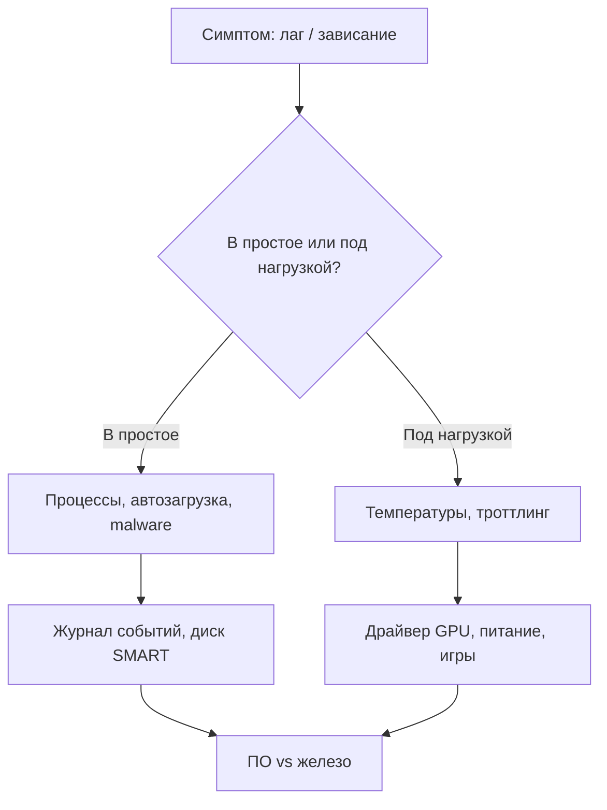

---
tags:
  - all
  - required
title: 'Железо, охлаждение и диагностика'
description: >-
  Как компоненты влияют на производительность, уход за системой охлаждения,
  троттлинг и пошаговая диагностика тормозов и зависаний.
related:
  - title: Как работает компьютер
    doc: encyclopedia/1-basics/1-08-kak-rabotaet-kompyuter/intro
  - title: Игры и FPS
    doc: /encyclopedia/1-basics/1-035-bazovaya-informatika/407
---

# Железо, охлаждение и диагностика

  ОБЯЗАТЕЛЬНО

Опытному пользователю

Для надежной работы компьютера необходимо поддерживать баланс между производительностью «железа», эффективностью охлаждения и регулярной диагностикой. Правильный подбор компонентов охлаждения предотвращает перегрев и продлевает срок службы ПК.

Основные элементы компьютера выделяют много тепла и требуют постоянного отвода энергии:
- Центральный процессор (CPU). Главный источник тепла, резко меняющий температуру при нагрузке.
- Видеокарта (GPU). Потребляет больше всего энергии и выделяет тепло в закрытом корпусе.
- Материнская плата (VRM). Зона питания процессора сильно греется при разгоне.
- M.2 NVMe SSD. Скоростные накопители могут терять скорость (троттлить) без радиатора.

Выбор типа охлаждения зависит от мощности установленного «железа»:
- Воздушное (Кулеры). Простые башенные кулеры надежны, долговечны и не протекают.
- Жидкостное (СЖО / Водянка). Необходима для мощных многоядерных процессоров (например, Core i9 или Ryzen 9).
- Термоинтерфейсы. Обычная термопаста требует замены раз в 1-2 года, а жидкий металл (ЖМ) обеспечивает максимальный отвод тепла, но опасен для алюминиевых радиаторов из-за коррозии.

---

## Как железо связано с "ощущением" скорости

«Ощущение» скорости работы компьютера (субъективная плавность и мгновенный отклик) зависит не от пиковой мощности процессора, а от минимизации задержек (Latency) при повседневных операциях. 

Продвинутый пользователь знает **узкое место** под задачу:

| Задача | Чаще всего упирается в |
| :--- | :--- |
| Компиляция, VM, тяжёлые вкладки | CPU + RAM |
| Игры 1440p+ | GPU |
| Запуск системы, копирование тысяч файлов | SSD / NVMe |
| Долгая работа на ноутбуке | Охлаждение → троттлинг |

Переход со старых жестких дисков (HDD) на твердотельные накопители (SSD) дал самый большой скачок в «ощущении» скорости за всю историю ПК. Мгновенное открытие папок, запуск Windows за 10 секунд и отсутствие «зависаний» при чтении мелких файлов.

Даже самый мощный ПК покажется медленным на старом офисном мониторе - при 144 Гц и выше обновление происходит каждые 6.9 миллисекунд. Перетаскивание окон, прокрутка сайтов и движения мыши становятся идеально плавными.

Для «отзывчивости» интерфейса важна не общая многоядерность процессора, а скорость работы одного ядра (IPC — количество инструкций за такт).

Если RAM заполнена, система скидывает данные на SSD (файл подкачки). Это вызывает секундные фризы при переключении между вкладками браузера.

DPC Latency (Программные задержки железа) - это задержка, с которой драйверы устройств (звуковая карта, Wi-Fi адаптер, видеокарта) обрабатывают прерывания. Если у какого-то компонента плохой драйвер, он задерживает очередь, из-за чего звук может заикаться, а курсор мыши — на мгновение замирать.

Базовая теория компонентов — [1.08 Как работает компьютер](/encyclopedia/1-basics/1-08-kak-rabotaet-kompyuter/intro). Игровой тюнинг — [отдельная глава](/encyclopedia/1-basics/1-035-bazovaya-informatika/407).

1. **CPU** — расчёты, компиляция, симуляция, часть игр.
2. **GPU** — картинка, рендер, нейросети.
3. **RAM** — сколько одновременно "открыто" без swap.
4. **SSD** — время отклика; HDD для архива, не для ОС.
5. Разгон возможен, но цена — тепло, энергия, стабильность; для рабочей машины часто не нужен.

---

## Температуры и троттлинг

**Троттлинг** — снижение частоты при перегреве или лимите питания. Симптомы: FPS падает через 10–20 минут, "раньше было быстрее".

| Термин | Смысл |
| :--- | :--- |
| **TDP** | Тепловой пакет процессора |
| **PL1 / PL2** (Intel) | Длительный и кратковременный лимит мощности |
| **PPT** (AMD) | Лимит мощности пакета CPU |

Для большинства современных чипов границы одинаковы:

| Компонент | Ориентир в нагрузке | Тревога |
| :--- | :--- | :--- |
| CPU | 60–85°C | &gt; 90°C постоянно |
| GPU | 65–80°C | троттлинг, троттл памяти |
| NVMe | 50–70°C | &gt; 80°C — дросселирование |

Как троттлинг ощущается в реальности?
- В играх - внезапные резкие падения кадров (фризы и лаги) каждые несколько минут.
- В работе - рендеринг или компиляция, которые начинались быстро, через время сильно замедляются.
- В системе - компьютер начинает шуметь вентиляторами на 100%, но при этом «тупеет» и медленно реагирует на клики.

Термопаста — это густой состав с высокой теплопроводностью, который заполняет микроскопические неровности и воздушные пустоты между крышкой процессора (или кристаллом GPU) и подошвой радиатора кулера. Воздух крайне плохо проводит тепло, поэтому без пасты даже самый дорогой кулер бесполезен. Со временем термопаста теряет свойства и превращается в камень, переставая передавать тепло от чипа к кулеру.

Пыль в радиаторе — главный «тихий убийца» производительности ПК. Она забивает пространство между металлическими ребрами, превращаясь в плотный войлок (эффект «шубы»), который полностью блокирует воздушный поток от вентилятора и изолирует тепло внутри. Пыль в радиаторах забивает ребра охлаждения, блокируя воздушный поток:
- Воздух не проходит сквозь радиатор, вентиляторы начинают вращаться на максимальных оборотах (100%), создавая сильный шум, но температура чипа продолжает расти до троттлинга.
- Работая на пределе возможностей, подшипники вентиляторов быстро вырабатывают свой ресурс, начинают свистеть, люфтить или полностью останавливаются.
- Бытовая пыль гигроскопична (впитывает влагу из воздуха). Со временем накопившийся плотный слой может начать проводить ток, что приведет к выходу из строя элементов материнской платы или видеокарты.

Настройте вентиляторы так, чтобы на вдув работало больше (или мощнее) вентиляторов, чем на выдув. Это создаст избыточное давление, и воздух (вместе с пылью) будет выталкиваться наружу через все мелкие щели, а не засасываться внутрь.

Установите мелкие магнитные сетки на все зоны вдува воздуха и очищайте их раз в месяц. Промыть сетку гораздо проще, чем разбирать весь ПК.

Мониторинг — HWiNFO64, GPU-Z, встроенные утилиты производителей.

---

### Бенчмарки "до и после"

Проведение бенчмарков «до и после» обслуживания — единственный объективный способ проверить, помогла ли чистка и замена термопасты. Сравнение результатов наглядно показывает восстановление производительности.

Перед разборкой ПК необходимо замерить показатели в состоянии «как есть».

| Тест | Что показывает |
| :--- | :--- |
| Cinebench R23/2024 | CPU многопоток / один поток |
| 3DMark Time Spy | GPU + CPU игровой сдвиг |
| CrystalDiskMark | SSD последовательное чтение |
| AIDA64 cache/mem | Память, задержки |

После тестов стабильности, проведите чистку радиаторов от пыли и замените термопасту по правилам, описанным выше.

После сборки компьютера дайте ему поработать на рабочем столе 5 минут, чтобы термопаста равномерно распределилась под прижимом и прогрелась. Повторите тот же тест с теми же параметрами и на то же время (10–15 минут).

Если тест «до» делался в прохладе, а «после» — в жаре, результаты будут некорректными. Оба теста нужно проводить при одинаковом состоянии корпуса (либо оба раза с закрытой крышкой, либо оба раза с открытой).

Сохраняйте скриншоты после сборки ПК и после чистки — иначе не доказать деградацию.

---

### Разгон — только с измерением

Разгон (Overclocking) без жесткого контроля метрик — это гарантированный способ получить синий экран смерти (BSOD), деградацию кремния или сгоревший компонент. Принцип «изменил параметр — измерил результат» является главным правилом безопасного оверклокинга.

1. Baseline бенчмарк + temps 20 мин.
2. Маленький шаг ( +50 MHz GPU / PBO conservative ).
3. Повтор теста; при WHEA/артефактах — откат.
4. Не гнаться за цифрами в тестах ценой вылетов в рабочих задачах.

Для рабочей машины разгон GPU часто **не окупается**.

**Undervolt** — снижение напряжения при той же или чуть ниже частоте: меньше нагрев и шум. Малыми шагами + стресс-тест 20–30 мин; при артефактах — откат.

---

## Уход за охлаждением

Правильный уход за системой охлаждения — это единственный способ поддерживать тишину и высокую скорость ПК без регулярных трат на новые комплектующие.

Раз в 12–24 месяца (пыльная среда — чаще):

1. Выключить питание, продуть фильтры и радиаторы сжатым воздухом (не "в лицо" вентиляторам на максимум без держания лопастей). Налипшая пыль нарушает балансировку вентилятора. Это вызывает микровибрации, которые разбивают подшипник и создают гул. Протирайте лопасти сухой кистью или салфеткой.
2. Проверить, что все вентиляторы крутятся. Большинство современных вентиляторов — гидродинамические или с подшипником качения. Они герметичны, и смазать их нельзя (только замена). Если вентилятор затрещал, не пытайтесь капать туда машинное масло — это временно размягчит пластик и добьет втулку.
3. Ноутбук: при необходимости — сервисная чистка; термопаста раз в 2–3 года при деградации температур.

**Термопаста** на CPU/GPU — не "чем чаще, тем лучше"; менять при росте температур после чистки или разборе.

Корпус — **приток спереди, выдув сзаду/сверху** лучше, чем один вентилятор.

Радиатор в корпусе должен стоять так, чтобы верхняя точка радиатора была выше помпы. Воздух внутри контура всегда собирается в самой высокой точке. Если им окажется помпа, она начнет шуметь, перегреваться и быстро выйдет из строя.

Даже в закрытых (AIO) системах жидкость постепенно испаряется сквозь поры шлангов (около 5-10% за 3-4 года). Если при запуске ПК слышно отчетливое бульканье, а температуры выросли — СЖО пора менять или дозаправлять (если предусмотрено конструкцией).

При уходе за видеокартой или материнской платой (VRM) вы столкнетесь с термопрокладками. Не трогайте, если они мягкие. Если прокладки эластичные и выделяют немного силикона — они в порядке. Подбирайте точную толщину. Если прокладка порвалась или засохла, её нужно заменить. Важно: толщина новой прокладки должна совпадать с точностью до 0.25 мм (например, 1 мм, 1.25 мм, 1.5 мм). Если прокладка будет слишком толстой, радиатор не прижмется к самому процессору (GPU), и он мгновенно перегреется.

---

## Диагностика — тормоза и зависания

Когда компьютер начинает тормозить, зависать или намертво «застывать», важно разделять два типа проблемы: программный сбой (замусоренная ОС, вирусы, конфликты драйверов) и аппаратный дефект (перегрев, умирающий накопитель, ошибки памяти).

Алгоритм для power user:

| Шаг | Действие |
| :--- | :--- |
| 1 | [Процессы и кэши](/encyclopedia/1-basics/1-035-bazovaya-informatika/406) — кто ест CPU/RAM/диск |
| 2 | Температуры под нагрузкой 10 мин |
| 3 | `chkdsk`, CrystalDiskInfo (SMART SSD/HDD) |
| 4 | Память: Windows Memory Diagnostic / memtest86 при подозрении на вылеты |
| 5 | Драйверы: чистая переустановка GPU при артефактах |
| 6 | BSOD — код в Event Viewer, часто драйвер или RAM |

**Синий экран:** запомнить код `MEMORY_MANAGEMENT`, `WHEA_UNCORRECTABLE_ERROR` и т.д.; обновить BIOS/чипсет осознанно, не "первый попавшийся с форума".

---

## Питание и стабильность

Стабильное питание — это фундамент, без которого даже самое дорогое «железо» не сможет работать на заявленных частотах. Сбои в системе питания вызывают не просто падение производительности, а внезапные перезагрузки, синие экраны (BSOD) и физический выход компонентов из строя.

Блок питания преобразует переменный ток из розетки (220V) в постоянный ток низкого напряжения, необходимый для ПК (+12V, +5V, +3.3V). Современные процессоры и видеокарты питаются почти исключительно по линии 12 вольт. В качественном БП вся заявленная мощность (например, 700 Вт из 750 Вт) должна выдаваться именно по этой линии. По стандартам ATX отклонение напряжения не должно превышать ±5%. Если под нагрузкой линия +12V просаживается ниже 11.4V, система мгновенно теряет стабильность (происходит вылет из игры или перезагрузка).

Недостаточный БП даёт вылеты под нагрузкой GPU, а не "медленный компьютер". Разгон без запаса по ваттам — типичная причина нестабильности.

Хороший БП обязан иметь защиту от короткого замыкания (SCP), перегрузки по мощности (OPP), перегрузки по току (OCP) и перегрева (OTP). Дешевые БП без защит при сгорании могут «утащить» за собой материнскую плату, процессор и видеокарту.

ИБП (UPS) для [Home Lab](/encyclopedia/2-system-network/2-06-sistemnoe-administrirovanie/10) и NAS — защита файловой системы при отключении света.

---

## Когда менять железо

Менять железо нужно тогда, когда оно перестает справляться с вашими текущими задачами, а не тогда, когда производители выпускают новые линейки.

| Сигнал | Апгрейд |
| :--- | :--- |
| RAM постоянно &gt; 85%, активный swap | +16 ГБ или замена на больший комплект |
| SSD системы &gt; 85% заполнен | Больший NVMe или перенос данных |
| GPU 95–100% в целевых играх, CPU &lt; 60% | Видеокарта |
| CPU 100% в рендере/VM, GPU простаивает | CPU / платформа |

Если точечный апгрейд (например, покупка чуть более мощного б/у процессора на текущий сокет) дает прирост производительности менее 30%, тратить на него деньги не имеет смысла. Вы не заметите разницу на глаз.

Продвинутый пользователь **меряет** перед покупкой (логи, бенчмарки), а не ориентируется только на "железный" индекс в интернете.

Переход с DDR3 на DDR4 или с DDR4 на DDR5 требует одновременной замены процессора, платы и самой памяти.

---

### SSD — износ и TRIM

Износ SSD и технология TRIM тесно связаны, так как именно TRIM защищает накопитель от падения скорости и продлевает ему жизнь. Понимание этих механизмов позволяет использовать SSD годами без потери эффективности. 

В отличие от HDD, где данные пишутся на магнитные пластины, SSD состоит из ячеек флэш-памяти (NAND). Каждая ячейка выдерживает ограниченное число циклов перезаписи.

CrystalDiskInfo — атрибут **Percent Used** у NVMe. При &gt; 80% планируйте замену. TRIM в Windows включён по умолчанию для SSD; не дефрагментируйте SSD "как HDD". . Программа CrystalDiskInfo считывает SMART диска и показывает «Здоровье» в процентах на основе израсходованного ресурса.

Главный показатель живучести SSD — TBW (Total Bytes Written), суммарный объем данных в терабайтах, который гарантированно можно записать на диск. Для диска объемом 1 ТБ нормой считается 600–800 TBW.

Обычный пользователь записывает от 15 до 40 ГБ в день. С таким темпом SSD на 1 ТБ исчерпает свой ресурс только через 20–40 лет. Чаще диск выходит из-за сбоя контроллера или проблем с питанием, чем от физического износа ячеек.

**Reallocated Sectors** — рост означает деградацию диска; при активном росте — срочный бэкап и замена.

На физическом уровне SSD устроен так, что он не может записать новые данные в ячейку, если в ней уже что-то записано. Ему сначала нужно полностью стереть старый блок информации. Когда вы удаляете файл в Windows, система просто помечает это место как «свободное», но физически данные остаются в ячейках. Когда SSD захочет записать туда что-то новое, контроллеру придется на ходу сначала стирать старые файлы, а затем писать новые. Это приводит к двукратному падению скорости записи и лишнему износу ячеек.

Команда TRIM передает накопителю информацию о том, какие файлы удалены. Процессор SSD в фоновом режиме (когда компьютер простаивает) заранее очищает эти ячейки. Новая запись всегда происходит мгновенно в уже чистые блоки. Обычно Windows 10 и 11 включают эту функцию автоматически, но её статус стоит проверить.

Оставляйте свободными минимум 10–15% объема. Контроллеру SSD нужно пространство, чтобы перемещать данные и равномерно распределять износ между ячейками.

Никогда не делайте дефрагментацию SSD. Дефрагментация нужна только для HDD. Для SSD она вредна, так как заставляет контроллер гонять гигабайты данных туда-сюда, просто так расходуя ресурс ячеек. Windows вместо дефрагментации делает для SSD «Оптимизацию» (принудительный вызов команды TRIM).

Охлаждайте быстрые NVMe диски. Высокие температуры (выше 70 °C) ускоряют деградацию кремния. Пользуйтесь комплектными радиаторами материнской платы.

---

### Ноутбук — ограничения

Ноутбук — это всегда компромисс между портативностью и производительностью. Из-за жестких ограничений по габаритам и весу мобильное железо работает в экстремальных условиях, которые сильно отличаются от стационарных ПК.

В корпусе толщиной 1.5–2 см физически невозможно разместить массивный радиатор. Один и тот же чип в ПК может потреблять 200 Вт, а в ноутбуке его урезают до 35–45 Вт. Часто процессор и видеокарта охлаждаются одной системой. Если под нагрузкой закипает один компонент, он автоматически подогревает второй. Турбины ноутбуков имеют очень мелкие ребра радиатора. Они забиваются пылью в 2–3 раза быстрее, чем башенные кулеры ПК, вызывая моментальный троттлинг.

Тонкий корпус = троттлинг раньше десктопа. Подставка с вентиляцией, режим "Performance" в BIOS/утилите OEM, снятие пыли раз в год. Игры на батарее — искусственное снижение TDP.

Мобильная видеокарта RTX 4070 для ноутбука и десктопная RTX 4070 для ПК — это совершенно разные чипы. Версия для ноутбука слабее аналога для ПК в среднем на 30–40% из-за урезанного количества ядер и зажатого энергопотребления (TGP).

Ноутбук покупается «как есть», изменить его конфигурацию в будущем почти невозможно. В большинстве современных ноутбуков процессор, видеокарта и даже оперативная память (LPDDR) намертво распаяны на материнской плате. В редких моделях можно добавить оперативную память (если есть слоты SO-DIMM) и установить второй M.2 SSD.

Ноутбук выдает 100% своей мощности только при подключении к оригинальному блоку питания. При работе от аккумулятора контроллер жестко режет частоты CPU и GPU, чтобы батарея не разрядилась за 20 минут и не перегрелась от высокой токоотдачи. Играть или рендерить от батареи не имеет смысла — производительность падает в 2–3 раза.

---

### SFF и малый форм-фактор

SFF (Small Form Factor) — это сегмент ПК с объемом корпуса менее 20 литров. Главная идея SFF заключается в том, чтобы упаковать полноценную мощность десктопного «железа» (вплоть до флагманских CPU и GPU) в габариты игровой консоли или небольшой обувной коробки.

Сборка малого формата требует ювелирного подбора деталей, так как стандартные комплектующие туда просто не влезут. 
- Материнская плата: Используется строго формат Mini-ITX (квадрат 17х17 см). На таких платах всего 2 слота под оперативную память и 1 разъем PCI-Express для видеокарты.
- Блок питания: Вместо стандартных ATX блоков применяются уменьшенные форматы SFX или SFX-L. У них более короткие кабели, чтобы они не занимали драгоценное пространство и не мешали воздушным потокам.
- Видеокарта: Ограничена по длине и толщине (количеству слотов расширения). В корпусах типа «сэндвич» видеокарта устанавливается за материнской платой с помощью гибкого шлейфа (PCIe Riser).
- Охлаждение: Ограничение по высоте кулера процессора (часто до 47–70 мм). Применяются либо низкопрофильные кулеры-«блины» (например, Noctua NH-L9i или Thermalright AXP90), либо необслуживаемые СЖО (водянки) размера 240 мм.

Мини-ПК и ITX: следите за **VRM** и температурой SSD под материнкой. Home Lab на NUC — норм; игровой RTX в 7 л корпусе — компромисс по шуму/темпам.

VRM (Voltage Regulator Module — модуль регулятора напряжения) — это локальная многофазная система питания на материнской плате (или видеокарте). Её главная задача — снизить нестабильные 12 Вольт, поступающие от блока питания, до ~1.1–1.4 Вольт, которые необходимы для работы ядер процессора.

Процессор потребляет огромный ток (вплоть до 200–300 Ампер в нагрузке), поэтому зона VRM испытывает колоссальные нагрузки и является самым горячим местом на материнской плате. Снижая потребление CPU (например, со 180 Вт до 130 Вт), вы пропорционально снижаете нагрузку и нагрев VRM.

---

## Связь с остальным разделом

- Софт и стресс — [процессы](/encyclopedia/1-basics/1-035-bazovaya-informatika/406).
- Игры — [FPS и lag](/encyclopedia/1-basics/1-035-bazovaya-informatika/407).
- Эксперименты без риска для железа "на живую" — [ВМ](/encyclopedia/2-system-network/2-06-sistemnoe-administrirovanie/10).

---
