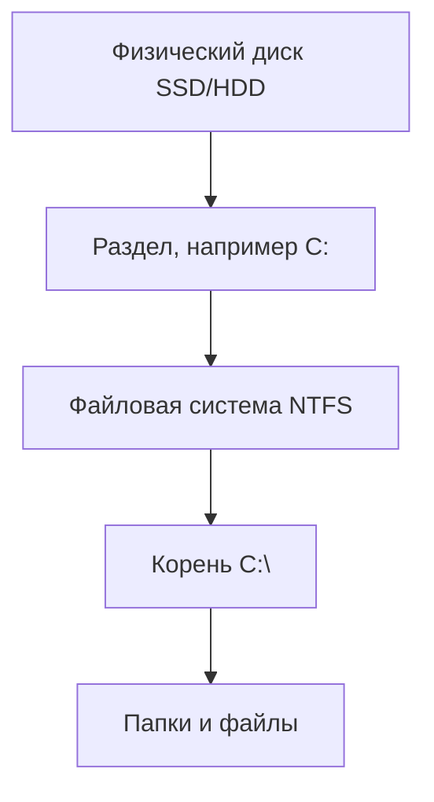

---
tags:
  - all
  - required
  - beginner
  - inprogress
title: ОС, файловые системы и служебные программы
description: >-
  Операционная система, файлы, NTFS и FAT, антивирус и утилиты — с разбором
  терминов для начинающих и ссылками на подробные главы.
related:
  - title: "Компьютер, периферия и сетевое оборудование"
    doc: encyclopedia/1-basics/1-035-bazovaya-informatika/3
  - title: "Основы компьютерной грамотности"
    doc: encyclopedia/1-basics/1-035-bazovaya-informatika/101
  - title: "Операционная система — о разделе"
    doc: encyclopedia/2-system-network/2-01-operatsionnaya-sistema/intro
  - title: "Интернет и сетевые сервисы"
    doc: encyclopedia/1-basics/1-035-bazovaya-informatika/6
---

import ExternalPlayEmbed from '@site/src/components/ExternalPlayEmbed';

# ОС, файловые системы и служебные программы

  ОБЯЗАТЕЛЬНО
  ДЛЯ НОВИЧКОВ
  В РАЗРАБОТКЕ

Всем

Когда вы включаете компьютер, первой "большой" программой, которая берёт управление, становится **операционная система (ОС)**. Без неё пришлось бы вручную загружать каждую игру и каждый драйвер с дискеты — так работали ранние ПК. Сегодня ОС — **посредник** между вами, программами и железом.

---

## Ключевые понятия

| Понятие | Роль | Подробнее |
|---------|------|-----------|
| **ОС (операционная система)** | Управляет процессами, памятью, файлами, устройствами | [ОС](/encyclopedia/2-system-network/2-01-operatsionnaya-sistema/intro) |
| **Процесс** | Запущенная программа в памяти | [Программа](/encyclopedia/1-basics/1-19-programma/1) |
| **Файл / папка** | Именованные байты и дерево каталогов на диске | ниже |
| **Путь** | Адрес файла — `C:\Users\…` или `/home/…` | ниже |
| **Файловая система** | Правила хранения — NTFS, FAT32, ext4 | ниже |
| **Драйвер** | Связь ОС с железом | [глава 3](/encyclopedia/1-basics/1-035-bazovaya-informatika/3) |
| **Утилита** | Служебная программа — архиватор, антивирус, диспетчер задач | ниже |

| Симптом | Вероятный слой | Что проверить |
|---------|----------------|---------------|
| Файл "не открывается" | Приложение или формат | Расширение, нужная программа |
| "Нет места на диске" | Файловая система | Размер, корзина, временные файлы |
| Принтер не печатает | Драйвер или ОС | Очередь печати, драйвер |
| Зависание одной программы | Процесс | Диспетчер задач |

Модели развёртывания (ВМ, контейнеры) — [четыре модели](/encyclopedia/1-basics/1-13-soft-prodvinutogo-polzovatelya/8#chetiryre-modeli-razvertyvaniya).

---

## Что делает операционная система

Представьте ОС как **диспетчера офисного здания**:

| Функция ОС | Что видит пользователь |
|------------|------------------------|
| **Процессы** | Несколько программ "одновременно" — браузер, музыка, Word |
| **Память** | Каждой программе выделяется своя часть ОЗУ |
| **Файловая система** | Папки "Документы", диск `C:`, флешка `E:` |
| **Устройства** | Принтер печатает, Wi-Fi подключается |
| **Интерфейс** | Рабочий стол, окна, меню "Пуск" |
| **Безопасность** | Вход по паролю, права "только чтение" |

В классических курсах информатики современную ОС для ПК описывают через **восемь групп функций** — их удобно сверять с таблицей выше:

| № | Функция | Кратко |
|---|---------|--------|
| 1 | Управление конфигурацией | Учёт железа, драйверов, параметров (в Windows — реестр, WMI) |
| 2 | Управление процессами | Запуск, пауза, завершение программ; **процесс**, **поток**, **задание** (job) |
| 3 | Управление памятью | Выделение ОЗУ, **виртуальная память** на диске |
| 4 | Информационная безопасность | Права на файлы, вход, аудит событий |
| 5 | Подсистема ввода-вывода | Связь приложений с устройствами через драйверы |
| 6 | Внешняя память | Работа с HDD, SSD, флешкой, оптическими носителями |
| 7 | Файловая система | Имена, папки, CreateFile / ReadFile / WriteFile |
| 8 | Поддержка сетей | Сетевые API, протоколы, драйверы адаптера |

Основные семейства для ПК — **Windows**, **Linux** (много дистрибутивов — Ubuntu, Fedora…), **macOS** на Mac. Сравнение — [2-01/2](/encyclopedia/2-system-network/2-01-operatsionnaya-sistema/2).

---

## История ОС для ПК — краткая шкала

| Год / период | Событие |
|--------------|---------|
| **1981** | IBM PC 5150, **PC-DOS 1.0** / **MS-DOS** |
| **1981–1990-е** | MS-DOS 1.0–6.22 — однозадачная ОС с текстовым интерфейсом |
| **1985** | Первая **Microsoft Windows** (графическая оболочка над DOS) |
| **1995** | Windows 95 — интеграция DOS и графики, массовый "рабочий стол" |
| **2000-е** | NTFS, многопользовательский режим, сеть "из коробки" |
| **Сегодня** | Windows 10/11, Linux-дистрибутивы, macOS; DOS — только в эмуляторах и embedded |

MS-DOS запускала программы командами (`dir`, `copy`, `format`); **Norton Commander** и аналоги дали двухпанельный файловый менеджер. Современные Windows сохраняют **cmd.exe** и **PowerShell** как наследие командной строки.

При включении ПК ОС проходит путь загрузки — BIOS/UEFI `->` загрузчик `->` ядро `->` службы `->` рабочий стол. Если на этом пути что-то ломается, вы видите "чёрный экран", циклическую перезагрузку или ошибку загрузчика.

---

## Файл, папка и путь

★ **Файл** — именованный набор байтов на носителе — `essay.docx`, `photo.jpg`, `setup.exe`.

★ **Папка (каталог)** — контейнер для файлов и других папок. Дерево папок помогает не хранить тысячи файлов в одной куче.

---

### Как читать путь в Windows

Пример — `C:\Users\Мария\Documents\report.pdf`

| Часть | Значение |
|-------|----------|
| `C:` | Диск (раздел на накопителе) |
| `\Users\Мария\` | Папки по цепочке |
| `Documents\` | Ещё одна папка |
| `report.pdf` | Имя файла |

В **Linux** и **macOS** один корень `/`, без букв дисков — `/home/maria/report.pdf`.

★ **Расширение** (`.pdf`, `.txt`) — подсказка человеку и ОС, **какой программой** открывать файл. Само расширение содержимое не меняет — переименовать `photo.txt` в `photo.jpg` картинкой не сделает.

Отсюда практическое правило — прежде чем открывать неизвестный файл из интернета, полезно видеть полное имя и расширение файла, включая суффикс после точки.

| Расширение | Тип | Чем открывается |
|------------|-----|-----------------|
| `.docx`, `.txt` | Текст | Word, Блокнот |
| `.pdf` | Документ | Браузер, Adobe Reader |
| `.jpg`, `.png` | Изображение | Просмотрщик фото |
| `.mp3`, `.mp4` | Медиа | Плеер, браузер |
| `.exe`, `.msi` | Установщик | Запуск установки (осторожно!) |
| `.zip`, `.rar` | Архив | Архиватор |

### Типовые операции в Проводнике

| Действие | Как обычно делают |
|----------|-------------------|
| **Создать папку** | Правый щелчок → "Создать" → "Папку" |
| **Копировать / вставить** | Выделить → Ctrl+C, перейти → Ctrl+V |
| **Переместить** | Перетащить или Ctrl+X, затем Ctrl+V |
| **Удалить** | Delete → **Корзина**; "Очистить корзину" — окончательно |
| **Найти файл** | Поиск в проводнике или Win+S |

Подробная практика с скриншотами — в [Основах компьютерной грамотности](./101) (раздел про файлы) и [Работа с проводником Windows](/encyclopedia/1-basics/1-12-sovety-dlya-novichka/1111).

---

### Интерактив — практика с файлами и папками

Попробуйте руками две типовые операции:

- разложить файлы по каталогам;
- найти файл по полному пути.

<ExternalPlayEmbed example="tools-data/file-manager-dual-pane-play" title="File Manager Dual Pane" />

Проверьте результат после интерактива — уверенно ли вы читаете полный путь и понимаете, что изменится при переносе, копировании и переименовании.

---

## Файловая система — правила на диске

**Файловая система (ФС)** — способ организации байтов на разделе — где лежат имена, размеры, даты, права доступа и сами данные файлов.

| ФС | Где встречается | Особенности |
|----|-----------------|-------------|
| **NTFS** | Windows, системные диски | Большие файлы, права, журнал |
| **FAT32** | Старые флешки | Файл **до 4 ГБ** максимум |
| **exFAT** | Современные флешки, карты памяти | Крупные файлы, совместимость Windows/macOS |
| **ext4** | Linux | Стандарт для многих дистрибутивов |
| **APFS** | macOS | Современные Mac |

**Разметка диска (MBR, GPT)** — как разбить физический диск на разделы `C:`, `D:`. Подробнее — [Накопители](/encyclopedia/1-basics/1-08-kak-rabotaet-kompyuter/3), [Windows — файлы](/encyclopedia/2-system-network/2-01-operatsionnaya-sistema/4).

Журналируемые файловые системы (например, NTFS, ext4) лучше переносят внезапные отключения питания — они фиксируют метаданные операций и помогают восстановить целостность структуры.

Флешку для переноса большого фильма (больше 4 ГБ) форматируют в **exFAT** (FAT32 для таких файлов не подходит). Системный диск Windows — **NTFS**.

### MBR и GPT — разметка диска

| | **MBR** | **GPT** |
|---|---------|---------|
| Годы | С 1983, старые BIOS | С UEFI, современные ПК |
| Макс. размер диска | 2 ТБ (практический предел) | Практически без ограничений |
| Число разделов | 4 основных | 128+ |
| Где смотреть | `diskmgmt.msc` → свойства диска | Там же |

Новый ПК с Windows 11 почти всегда на **GPT + UEFI**. Установка Windows на старый ноутбук может потребовать **MBR + Legacy**.

### Права доступа в NTFS

Каждый файл и папка имеют **ACL** — список, кто что может:

| Право | Смысл |
|-------|--------|
| **Чтение** | Открыть, скопировать |
| **Запись** | Изменить содержимое |
| **Выполнение** | Запустить `.exe` |
| **Полный доступ** | Всё, включая смену прав |

Учётная запись **Администратор** может обойти многие ограничения; **Гость** — минимальные права. На рабочем ПК политика компании может запретить установку софта даже администратору локально.

### Виртуальная память и файл подкачки

Когда **ОЗУ заканчивается**, ОС выгружает редко используемые страницы памяти на диск в **файл подкачки** (pagefile.sys в Windows). Симптомы активной подкачки:

- диск постоянно мигает индикатором при лёгких задачах;
- переключение между программами — секунды;
- в Диспетчере задач "Используется" память ≈ 95–100 %.

**Лечение:** закрыть лишнее, добавить RAM, не отключать подкачку "для скорости" на 8 ГБ — система упадёт при пике.

---

## Системные, прикладные и служебные программы

| Тип | Примеры | Кто устанавливает |
|-----|---------|-------------------|
| **ОС** | Windows 11, Ubuntu | Предустановка или чистая установка |
| **Прикладные** | Браузер, Word, игры | Пользователь, магазин приложений |
| **Служебные (утилиты)** | Архиватор, очистка диска | Часто встроены или ставятся отдельно |
| **Драйверы** | Для видеокарты, принтера | Производитель / обновления ОС |

★ **Процесс** — запущенная копия программы. Диспетчер задач (Ctrl+Shift+Esc в Windows) показывает, сколько процессов и сколько ОЗУ они занимают.

---

## Антивирус и защита — как это устроено

**Вредоносная программа** (вирус, троян, шифровальщик) — код, который копируется или выполняется без вашего ведома и вредит — удаляет файлы, крадёт пароли, блокирует диск.

Типичная классификация (и практика антивирусных лабораторий):

| Тип | Как распространяется | Пример из истории |
|-----|----------------------|-------------------|
| **Файловый** | Внедряется в `.exe`, `.dll`, документ с макросами | Заражение при запуске файла |
| **Загрузочный** | Записывается в **загрузочный сектор** диска | Популярен в 1990-х, реже с UEFI |
| **Макро-вирус** | Макросы **Word**, **Excel** (VBA), автозапуск `AutoOpen` | Macro.Word.* |
| **Скриптовый** | VBS, JS, BAT, PHP в письмах и на страницах | Virus.VBS.* |

**Антивирус** обычно —

- **Сканирует файлы** — сравнивает с базой **сигнатур** (известных "отпечатков" вредоноса).
- **Следит за поведением** (**эвристика**) — подозрительные действия (массовое шифрование файлов).
- **Проверяет загрузки** и вложения в браузере.

На Windows встроен **Защитник Windows**; на Mac — **XProtect** и Gatekeeper. В организациях ставят Kaspersky, Dr.Web и др. с централизованным управлением.

Антивирус не даёт абсолютной гарантии, снижает риски, но решающими остаются обновления, резервные копии и осторожное поведение пользователя.

---

### Привычки, которые реально помогают

- Обновлять **ОС и браузер** — закрывают известные дыры.
- Открывать вложения только от **доверенных** отправителей.
- Делать **резервные копии** важных файлов (облако, внешний диск).
- Использовать **разные пароли** или менеджер паролей.

Шире — [Основы информационной безопасности](/encyclopedia/2-system-network/2-08-osnovy-informatsionnoy-bezopasnosti/intro). Для детей — [9-11/1-computer/13](/encyclopedia/9-spinoff/9-11-dlya-detey/1-computer/13).

---

## Архиваторы и другие утилиты

| Утилита | Задача | Примеры |
|---------|--------|---------|
| **Архиватор** | Упаковать/распаковать ZIP, 7z, RAR | 7-Zip, встроенный в ОС |
| **Анализ диска** | Кто занял место | WinDirStat, "Память" в параметрах |
| **Резервное копирование** | Копия важных файлов | OneDrive, Time Machine, `rsync` |
| **Терминал** | Команды текстом | PowerShell, bash |

Теория архивов — [1-20/2](/encyclopedia/1-basics/1-20-ispolnyaemye-fayly-i-arhivy/2).

Для учебной и домашней работы особенно полезны две привычки — регулярная очистка временных файлов и периодическая проверка, куда "исчезает" место на диске (кэш браузера, загрузки, старые архивы).

Папка **WinSxS** хранит старые версии компонентов Windows — её размер со временем растёт; чистить только встроенными средствами ("Очистка диска", DISM):

В **AppData** программы и браузер хранят настройки и кэш — место может "таять" незаметно:

Подробнее с примерами — [Основы компьютерной грамотности](./101#установка-и-обслуживание-программ).

---

## Оптические диски (CD, DVD) — зачем в курсе

**Оптический диск** — пластинка, которую читают или пишут **лазером**. В 2000-х с неё ставили игры и программы; сейчас чаще используют **файл ISO** — образ диска на SSD.

| Тип | Ёмкость (ориентир) | Запись |
|-----|-------------------|--------|
| CD-ROM | ~700 МБ | Только чтение с завода |
| CD-R | ~700 МБ | Однократная запись |
| DVD±R | 4,7–8,5 ГБ | Запись на пустой диск |

**Дисковод** в новых ПК встречается редко. **ISO** монтируют виртуально — ОС "думает", что вставлен диск, хотя это файл на диске.

Типовые шаги в лаборатории:

- Вставить диск → открыть в проводнике.
- Записать файлы на CD-R/DVD-R утилитой записи.
- Создать ISO из папки — один файл для копирования и раздачи.

Сегодня оптические носители чаще встречаются в учебных задачах как исторический пример эволюции хранения данных — от дискет и CD к флеш-накопителям и облачному хранению.

Связь с цифровым звуком — аудио на Audio CD хранится как **цифровые отсчёты** — см. [историю сетей](/encyclopedia/2-system-network/2-03-set-i-internet/2).

  
Самопроверка

  

  <ol>
    <li>Чем папка отличается от файла?</li>
    <li>Почему на FAT32 нельзя записать файл 5 ГБ одним куском?</li>
    <li>Что делает антивирус, кроме "ловли вирусов по имени"?</li>
  </ol>

  

Дальше — [Интернет и сервисы](./6).

---
