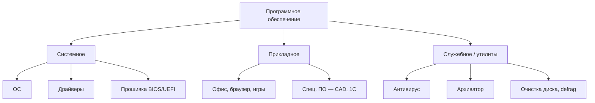
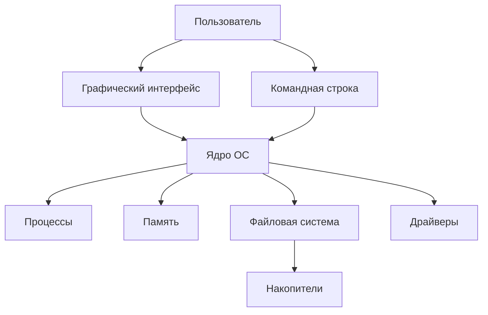
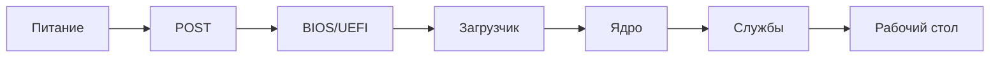
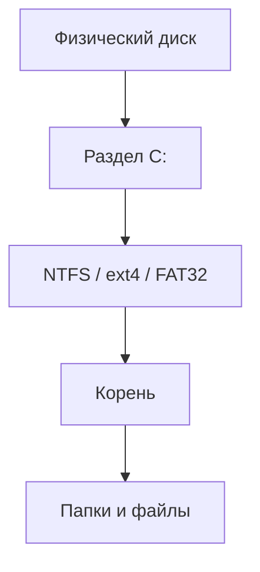
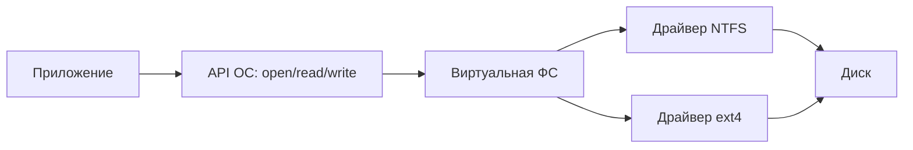
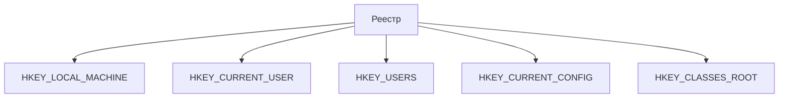
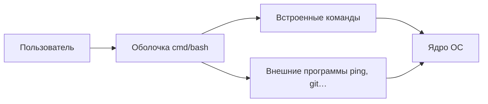
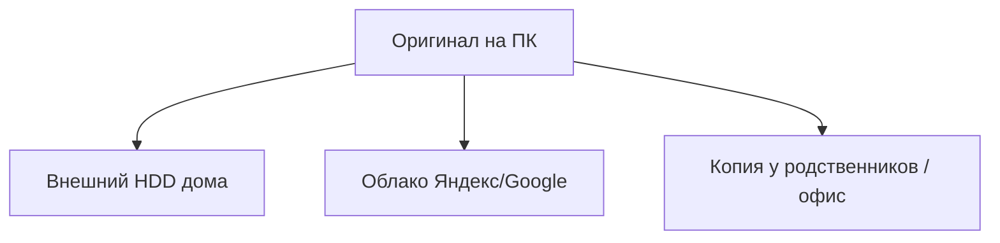
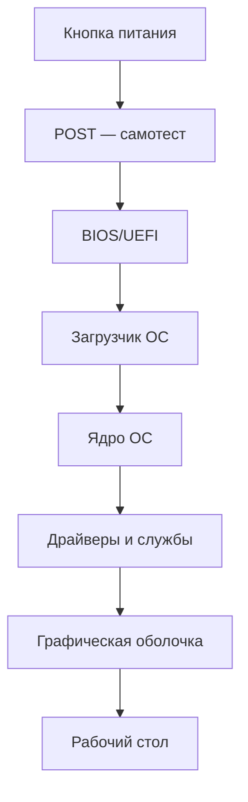

---
tags:
  - all
  - required
  - beginner
  - inprogress
title: ОС, файловые системы и служебные программы
description: >-
  Операционная система, файлы, NTFS и FAT, антивирус и утилиты — с разбором
  терминов для начинающих и ссылками на подробные главы.
related:
  - title: "Компьютер, периферия и сетевое оборудование"
    doc: encyclopedia/1-basics/1-035-bazovaya-informatika/3
  - title: "Организация, архитектура и уровни"
    doc: encyclopedia/1-basics/1-035-bazovaya-informatika/10
  - title: "Основы компьютерной грамотности"
    doc: encyclopedia/1-basics/1-035-bazovaya-informatika/101
  - title: "Операционная система — о разделе"
    doc: encyclopedia/2-system-network/2-01-operatsionnaya-sistema/intro
  - title: "Интернет и сетевые сервисы"
    doc: encyclopedia/1-basics/1-035-bazovaya-informatika/6
---

import ExternalPlayEmbed from '@site/src/components/ExternalPlayEmbed';


# ОС, файловые системы и служебные программы

<div class="article-tags">
  <span class="tag tag-required">ОБЯЗАТЕЛЬНО</span>
  <span class="tag tag-beginner">ДЛЯ НОВИЧКОВ</span>
  <span class="tag tag-inprogress">В РАЗРАБОТКЕ</span>
</div>

<span class="complexity-badge">Всем</span>

Что такое операционная система?

Когда вы включаете компьютер, первой "большой" программой, которая берёт управление, становится **операционная система (ОС)**. Без неё пришлось бы вручную загружать каждую игру и каждый драйвер с дискеты — так работали ранние ПК. Сегодня ОС — **посредник** между вами, программами и железом.

Эта глава — углублённый разбор для школьного курса и для взрослого пользователя.

- **Windows, Linux, macOS** — чем отличаются в быту;
- **файловые системы** — NTFS, FAT32, ext4, exFAT;
- **пути, реестр, командная строка**, резервное копирование, утилиты и защита.

Базовые привычки — в [Основах компьютерной грамотности](./101). Раздел об ОС — [2-01](/encyclopedia/2-system-network/2-01-operatsionnaya-sistema/intro).


<div class="callout callout--tip">
  <div class="callout-title">Как читать главу</div>

  <div class="callout-body">
  Идите сверху вниз. Сравнение трёх ОС поможет не путать термины. Практику закрепите интерактивом и блоками <code>&lt;details&gt;</code> в конце. Базовая практика — <a href="./101">Основы компьютерной грамотности</a>.
</div>
</div>

---

## Ключевые понятия

| Понятие | Роль | Подробнее |
|---------|------|-----------|
| **ОС (операционная система)** | Управляет процессами, памятью, файлами, устройствами | [ОС](/encyclopedia/2-system-network/2-01-operatsionnaya-sistema/intro) |
| **Процесс** | Запущенная программа в памяти | [Программа](/encyclopedia/1-basics/1-19-programma/1) |
| **Файл / папка** | Именованные байты и дерево каталогов на диске | ниже |
| **Путь** | Адрес файла — `C:\Users\…` или `/home/…` | ниже |
| **Файловая система** | Правила хранения — NTFS, FAT32, ext4 | ниже |
| **Драйвер** | Связь ОС с железом | [глава 3](/encyclopedia/1-basics/1-035-bazovaya-informatika/3) |
| **Утилита** | Служебная программа | ниже |
| **Реестр** | База настроек Windows | ниже |
| **CLI / терминал** | Команды текстом | ниже |
| **Резервная копия** | Дубликат данных | ниже |

| Симптом | Вероятный слой | Что проверить |
|---------|----------------|---------------|
| Файл "не открывается" | Приложение или формат | Расширение, программа по умолчанию |
| "Нет места на диске" | Файловая система / мусор | Размер, корзина, Temp, кэш |
| Принтер не печатает | Драйвер или ОС | Очередь, драйвер, кабель |
| Зависание программы | Процесс | Диспетчер задач |
| Синий экран | Ядро / драйвер | Код STOP, обновления |

Модели развёртывания — [четыре модели](/encyclopedia/1-basics/1-13-soft-prodvinutogo-polzovatelya/8#chetiryre-modeli-razvertyvaniya).

---

## Классификация программного обеспечения

**ПО** принято делить на классы по **назначению**. Это дополняет таблицу «железо vs софт» из [главы 10](./10).



| Класс | Назначение | Примеры | Кто ставит |
|-------|------------|---------|------------|
| **Системное** | Управляет ресурсами ЭВМ, связывает программы с железом | Windows, Linux, драйвер принтера, BIOS | Предустановка / администратор |
| **Прикладное** | Решает задачи пользователя в предметной области | Word, Chrome, Photoshop, Python-скрипт | Пользователь |
| **Служебное (утилиты)** | Обслуживание системы и данных; не заменяет ОС | 7-Zip, антивирус, `chkdsk`, WinDirStat | Пользователь |
| **Инструментальное** | Создание других программ | VS Code, компилятор GCC, Android Studio | Разработчик |

### Уровень в общей иерархии

| Уровень абстракции | Что относится к ПО |
|---------------------|-------------------|
| **4 — ОС** | Ядро, планировщик, файловая система, сетевой стек |
| **5 — ассемблер** | Низкоуровневые инструменты (редко в быту) |
| **6+ — языки и приложения** | Python, браузер, LibreOffice |

ОС — **самый важный** слой ПО: без неё прикладная программа не получит доступ к диску и экрану. См. [Организация и уровни](./10).

### Прошивка и драйвер — граница с железом

| Компонент | Где | Роль |
|-----------|-----|------|
| **BIOS/UEFI** | Чип на материнской плате | Старт ПК, настройка железа до ОС |
| **Драйвер** | Файл в ОС | Переводит вызовы ОС в команды устройству |
| **Микропрограмма устройства** | Внутри SSD, принтера | Собственный мини-компьютер на устройстве |

★ Драйвер без ОС бесполезен; ОС без драйверов «видит» устройство, но не умеет им пользоваться — см. [главу 3](./3#что-такое-драйвер).

### Лицензии и право (кратко)

| Тип | Суть | Пример |
|-----|------|--------|
| **Проприетарное** | Исходники закрыты, лицензия по правилам вендора | Windows, Adobe |
| **Свободное (FOSS)** | Можно изучать и распространять по лицензии | Linux, LibreOffice |
| **Условно-бесплатное** | Бесплатно для личного использования | Многие архиваторы |

Подробнее — [глава 7](./7) (право в РФ).

---

## Что делает операционная система

| Функция ОС | Что видит пользователь |
|------------|------------------------|
| **Процессы** | Несколько программ "одновременно" |
| **Память** | Выделение ОЗУ каждой программе |
| **Файловая система** | Папки, диски, флешки |
| **Устройства** | Принтер, Wi‑Fi, звук |
| **Интерфейс** | Рабочий стол, окна |
| **Безопасность** | Пароль, права доступа |
| **Сеть** | Интернет, общие папки |

| № | Функция (школьный курс) | Кратко |
|---|------------------------|--------|
| 1 | Управление конфигурацией | Железо, драйверы, реестр |
| 2 | Управление процессами | Запуск, завершение, планировщик |
| 3 | Управление памятью | ОЗУ, виртуальная память |
| 4 | Информационная безопасность | Права, аудит, шифрование |
| 5 | Подсистема ввода-вывода | Драйверы устройств |
| 6 | Внешняя память | HDD, SSD, USB |
| 7 | Файловая система | Имена, каталоги, операции с файлами |
| 8 | Поддержка сетей | TCP/IP, сокеты — см. [Интернет](./6) |




---

## Windows, Linux и macOS

### Сводная таблица

| Аспект | Windows | Linux | macOS |
|--------|---------|-------|-------|
| Разработчик | Microsoft | Сообщество + дистрибутивы | Apple |
| Файловый менеджер | Проводник | Nautilus, Dolphin… | Finder |
| Настройки | Параметры, Панель управления | Settings, `/etc` | Системные настройки |
| Терминал | cmd, PowerShell | bash, zsh | zsh |
| ФС системного диска | NTFS | ext4, btrfs | APFS |
| Разделитель пути | `\` | `/` | `/` |
| Домашняя папка | `C:\Users\Имя` | `/home/имя` | `/Users/Имя` |
| Диспетчер задач | Ctrl+Shift+Esc | htop, System Monitor | Мониторинг системы |
| Магазин ПО | Microsoft Store | apt, Flatpak… | App Store |
| Игры | Широко | Растёт (Steam/Proton) | Уже |

### Учётные записи

| Роль | Windows | Linux | macOS |
|------|---------|-------|-------|
| Обычный | Standard User | user + группы | Standard |
| Админ | Administrator + UAC | root / sudo | Administrator |
| Гость | Guest (редко) | ограниченный | Guest |

### Горячие клавиши

| Действие | Windows | Linux | macOS |
|----------|---------|-------|-------|
| Копировать / Вставить | Ctrl+C / V | Ctrl+C / V | Cmd+C / V |
| Сохранить | Ctrl+S | Ctrl+S | Cmd+S |
| Переключить окна | Alt+Tab | Alt+Tab | Cmd+Tab |
| Блокировка | Win+L | зависит от DE | Ctrl+Cmd+Q |
| Скриншот | Win+Shift+S | PrtSc | Cmd+Shift+4 |

### Когда что выбирают

| Сценарий | Частый выбор | Причина |
|----------|--------------|---------|
| Школа, офис | Windows | 1С, домен, привычка |
| Сервер, DevOps | Linux | стабильность, Docker |
| Дизайн, видео | macOS | экосистема Apple |
| Старый ПК | Linux Xubuntu | меньше RAM |
| Игры | Windows | DirectX |

Сравнение в энциклопедии — [2-01/2](/encyclopedia/2-system-network/2-01-operatsionnaya-sistema/2).


---

## История ОС для ПК

| Период | Событие |
|--------|---------|
| 1981 | IBM PC, MS-DOS |
| 1985 | Windows 1.0 — GUI над DOS |
| 1991 | Ядро Linux |
| 1995 | Windows 95 — массовый рабочий стол |
| 2001 | Windows XP, macOS X |
| 2010-е | UEFI, SSD, облачные аккаунты |
| Сегодня | Windows 10/11, дистрибутивы Linux, macOS |



MS-DOS — ранняя ОС с текстовыми командами.

- `dir` — список файлов;
- `copy` — копирование;
- `format` — форматирование диска.

Наследие сегодня — **cmd.exe**, **PowerShell**, двухпанельные менеджеры (Total Commander). История ОС — [2-01/2](/encyclopedia/2-system-network/2-01-operatsionnaya-sistema/2).


---

## Файл, папка и путь

★ **Файл** — именованные байты: `essay.docx`, `photo.jpg`.

★ **Папка** — контейнер; вместе образуют **дерево**.


| Тип пути | Windows | Linux/macOS |
|----------|---------|-------------|
| Абсолютный | `C:\Users\Maria\doc.pdf` | `/home/maria/doc.pdf` |
| Относительный | `Documents\doc.pdf` | `Documents/doc.pdf` |
| Вверх | `..\` | `../` |

### Путь Windows — разбор

`C:\Users\Мария\Documents\School\report.pdf`

| Часть | Значение |
|-------|----------|
| `C:` | Том |
| `Users\Мария\` | Профиль |
| `Documents\School\` | Вложенные папки |
| `report.pdf` | Файл |

| Спецпапка | Путь |
|-----------|------|
| Рабочий стол | `%USERPROFILE%\Desktop` |
| Документы | `…\Documents` |
| Загрузки | `…\Downloads` |
| AppData | `…\AppData` (скрыта) |

### Путь Linux

`/home/maria/projects/lab01.py` — корень `/`, дом `~` = `/home/maria`.

| Каталог | Назначение |
|---------|------------|
| `/etc` | Конфигурация |
| `/var` | Логи |
| `/usr` | Программы |
| `/tmp` | Временные файлы |

### Путь macOS

`/Users/Maria/Documents` — аналог Documents. Внешние диски: `/Volumes/Имя/`.

### Расширения

| Расширение | Тип |
|------------|-----|
| `.docx`, `.txt` | Текст |
| `.pdf` | Документ |
| `.jpg`, `.png` | Изображение |
| `.exe`, `.msi` | Windows-установщик |
| `.deb`, `.rpm` | Пакет Linux |
| `.zip`, `.7z` | Архив |

★ Расширение не меняет содержимое — только подсказка программе.

### Операции в файловом менеджере

| Действие | Windows | Linux | macOS |
|----------|---------|-------|-------|
| Создать папку | ПКМ → Создать | ПКМ → New Folder | Cmd+Shift+N |
| Копировать | Ctrl+C, V | Ctrl+C, V | Cmd+C, V |
| Удалить | Delete | Delete | Cmd+Delete |
| Найти | Win+S | Ctrl+F | Cmd+F |

Подробнее — [101](./101), [проводник](/encyclopedia/1-basics/1-12-sovety-dlya-novichka/1111).

---

### Интерактив — практика с файлами и папками

<ExternalPlayEmbed example="tools-data/file-manager-dual-pane-play" title="File Manager Dual Pane" />

Проверьте: читаете ли полный путь; что изменится при копировании и переименовании.


---

## Файловая система — правила на диске

**Файловая система (ФС)** — способ организации данных на разделе: имена, размеры, даты, права, размещение кластеров.



### Сравнение NTFS, FAT32, ext4, exFAT, APFS

| ФС | ОС | Макс. файл | Макс. том | Журнал | Права | Типичное применение |
|----|-----|------------|-----------|--------|-------|---------------------|
| **NTFS** | Windows | 16 ЭиБ−1 | 16 ЭиБ−1 | Да | ACL | Системный диск Windows |
| **FAT32** | Все (чтение) | **4 ГБ** | 2 ТБ (практика) | Нет | Нет | Старые флешки, карты |
| **exFAT** | Win, macOS | 16 ЭиБ | 128 ПБ | Нет | Нет | Большие флешки, SDXC |
| **ext4** | Linux | 16 ТиБ | 1 ЭиБ | Да | chmod/chown | Корень Linux |
| **APFS** | macOS | 8 ЭиБ | 8 ЭиБ | Да | ACL | SSD Mac с 2017 г. |

★ На **FAT32** один файл **не больше 4 ГБ** — отсюда ошибка при копировании большого фильма.

### Внутреннее устройство (упрощённо)

| Понятие | NTFS | ext4 | FAT32 |
|---------|------|------|-------|
| Единица размещения | Кластер | Блок | Кластер |
| Каталог | MFT-запись | inode + имя | таблица |
| Журнал | $LogFile | journal | — |
| Фрагментация | Возможна | Возможна | Частая на больших |



### Когда какую ФС выбрать

| Задача | Рекомендация |
|--------|--------------|
| Диск Windows | NTFS |
| Флешка ≤32 ГБ, совместимость | FAT32 |
| Флешка >32 ГБ, файлы >4 ГБ | exFAT |
| Диск Linux | ext4 |
| Mac с SSD | APFS |
| Обмен Win↔Mac на флешке | exFAT |

Флешку для фильма 8 ГБ форматируют в **exFAT**. Системный диск Windows — **NTFS**.

Подробнее — [Накопители](/encyclopedia/1-basics/1-08-kak-rabotaet-kompyuter/3), [Windows — файлы](/encyclopedia/2-system-network/2-01-operatsionnaya-sistema/4).


---

### MBR и GPT

| | **MBR** | **GPT** |
|---|---------|---------|
| Эпоха | BIOS, старые ПК | UEFI, современные |
| Макс. диск | ~2 ТБ | Практически без лимита |
| Разделов | 4 основных (или extended) | 128+ |
| Проверка | `diskmgmt.msc` | Там же |

Windows 11 на новых ПК: **GPT + UEFI**.

### Права доступа в NTFS (ACL)

**ACL** (Access Control List) — список, кому разрешено читать, писать или запускать файл.

| Право | Смысл |
|-------|--------|
| Чтение | Открыть, копировать |
| Запись | Изменить |
| Выполнение | Запуск .exe |
| Полный доступ | Всё + смена прав |

**Linux — права chmod (rwx)**

| Символ | Бит | Для файла |
|--------|-----|-----------|
| r | 4 | Чтение |
| w | 2 | Запись |
| x | 1 | Запуск |

Пример: `chmod 644 file.txt` — владелец rw-, остальные r--.

| chmod | Восьмерично | Кто |
|-------|-------------|-----|
| rwx | 7 | владелец |
| r-x | 5 | группа |
| r-x | 5 | все |

### Виртуальная память

Когда **ОЗУ мало**, страницы выгружаются в **файл подкачки** (`pagefile.sys` в Windows, swap в Linux).

| Симптом | Причина |
|---------|---------|
| Диск мигает при лёгких задачах | Активный swap |
| 95–100 % RAM в диспетчере | Нужно закрыть лишнее или добавить RAM |

**Не отключайте** подкачку на 8 ГБ "для скорости" — система упадёт при пике.


---

## Реестр Windows

**Реестр** — иерархическая база настроек Windows и многих программ. Аналог разрозненных `.ini` в эпоху Windows 3.x.



| Улей | Содержимое |
|------|------------|
| **HKLM** | Настройки всей машины, драйверы, службы |
| **HKCU** | Рабочий стол, параметры текущего пользователя |
| **HKCR** | Ассоциации расширений (.txt → notepad) |

Редактор: `Win+R` → `regedit`. 

| В Linux/macOS | Аналог |
|---------------|--------|
| `/etc/*.conf` | Системные настройки |
| `~/.config/` | Настройки пользователя |
| `defaults` (macOS) | Параметры приложений |


<div class="callout callout--warning">
  <div class="callout-title">Осторожно с реестром</div>

  <div class="callout-body">
  Неверное изменение ключа может сломать загрузку или программы. Перед правкой — <strong>точка восстановления</strong> или экспорт ветки (Файл → Экспорт). В учебной лаборатории — только с разрешения учителя.
</div>
</div>

| Пример ключа | Назначение |
|--------------|------------|
| `HKCU\Software\Microsoft\Windows\CurrentVersion\Explorer` | Проводник, оболочка |
| `HKLM\SOFTWARE\Microsoft\Windows\CurrentVersion\Run` | Автозапуск программ |
| `HKCR\.pdf` | Чем открывать PDF |

Просмотр автозагрузки безопаснее через **Диспетчер задач → Автозагрузка** или **Параметры → Приложения**.


---

## Командная строка

**CLI** (Command Line Interface) — управление компьютером текстовыми командами. Удобно для пакетных операций и автоматизации. См. [Терминал](/encyclopedia/2-system-network/2-05-terminal/intro).

| ОС | Программы | Как открыть |
|----|-----------|-------------|
| Windows | cmd.exe, PowerShell | Win+R → `cmd` или Terminal |
| Linux | bash, zsh | Ctrl+Alt+T |
| macOS | zsh | Terminal.app |

### Базовые команды

| Задача | Windows (cmd) | PowerShell | Linux/macOS |
|--------|---------------|------------|-------------|
| Список файлов | `dir` | `Get-ChildItem`, `ls` | `ls -la` |
| Сменить папку | `cd` | `cd` | `cd` |
| Копировать | `copy` | `Copy-Item` | `cp` |
| Переместить | `move` | `Move-Item` | `mv` |
| Удалить | `del` | `Remove-Item` | `rm` |
| Создать папку | `mkdir` | `mkdir` | `mkdir` |
| Показать файл | `type` | `Get-Content` | `cat` |
| Очистить экран | `cls` | `cls` | `clear` |
| Сеть | `ipconfig` | `Get-NetIPConfiguration` | `ipconfig` / `ip a` |
| Завершить процесс | `taskkill` | `Stop-Process` | `kill` |



Пример сессии Windows:

```
C:\Users\Ivan> cd Documents
C:\Users\Ivan\Documents> dir
C:\Users\Ivan\Documents> mkdir School2025
C:\Users\Ivan\Documents> copy report.docx School2025\
```

Пример Linux:

```bash
cd ~/Documents
ls -la
mkdir School2025
cp report.docx School2025/
```

Терминал подробнее — [2-05/intro](/encyclopedia/2-system-network/2-05-terminal/intro), [PowerShell](/encyclopedia/5-languages/5-26-powershell/123).


---

## Системные, прикладные и служебные программы

| Тип | Примеры | Кто ставит |
|-----|---------|------------|
| **ОС** | Windows 11, Ubuntu | Предустановка / установка |
| **Прикладные** | Браузер, Word, игры | Пользователь |
| **Служебные** | 7-Zip, CCleaner | Пользователь |
| **Драйверы** | NVIDIA, принтер | Производитель / Update |

★ **Процесс** — запущенная копия программы. **Диспетчер задач** (Ctrl+Shift+Esc) — список процессов и RAM.


| Действие | Windows | Linux |
|----------|---------|-------|
| Завершить зависшее | Диспетчер → Снять задачу | `kill PID` или System Monitor |
| Приоритет | Диспетчер → Подробности | `nice`, `renice` |
| Автозагрузка | Диспетчер → Автозагрузка | `systemctl`, cron |

---

## Антивирус и защита

| Тип угрозы | Механизм | Пример |
|------------|----------|--------|
| Файловый вирус | Заражение .exe | Запуск с флешки |
| Троян | Маскировка под полезное | "ключ к игре" |
| Шифровальщик | Шифрует файлы | Требует выкуп |
| Макро-вирус | VBA в Word/Excel | AutoOpen |
| Загрузочный | MBR (реже с UEFI) | Заражение диска |

**Антивирус** защищает несколькими способами.

- **Сигнатуры** — сравнение с базой известных образцов.
- **Эвристика** — подозрительное поведение (массовое шифрование).
- **Песочница** — запуск в изоляции (в корпоративных решениях).

| ОС | Встроенная защита |
|----|-------------------|
| Windows | Защитник Windows |
| macOS | XProtect, Gatekeeper |
| Linux | Зависит от дистрибутива; меньше файловых вирусов |

### Привычки защиты

- Обновлять ОС и браузер.
- Не открывать вложения от незнакомых.
- Резервные копии.
- Разные пароли / менеджер паролей.

[ИБ](/encyclopedia/2-system-network/2-08-osnovy-informatsionnoy-bezopasnosti/intro).

---

## Архиваторы и утилиты

| Утилита | Задача | Примеры |
|---------|--------|---------|
| Архиватор | ZIP, 7z, RAR | 7-Zip, встроенный в ОС |
| Анализ диска | Кто занял место | WinDirStat, Baobab |
| Очистка | Temp, кэш | Очистка диска, BleachBit |
| Терминал | CLI | PowerShell, bash |
| Мониторинг | Температура, диск | HWMonitor, smartctl |


**WinSxS** — старые компоненты Windows; чистить только "Очистка диска", DISM.


**AppData** — настройки и кэш браузеров.


[Архивы](/encyclopedia/1-basics/1-20-ispolnyaemye-fayly-i-arhivy/2).


---

## Резервное копирование — стратегии

Потеря данных: сбой диска, вирус-шифровальщик, кража ноутбука, случайное удаление.

### Правило 3-2-1

| Цифра | Смысл |
|-------|--------|
| **3** | Три копии данных (оригинал + 2 копии) |
| **2** | На двух **разных** типах носителей (SSD + облако) |
| **1** | Одна копия **вне дома** (облако, офис) |



### Типы копирования

| Тип | Что копируется | Скорость восстановления | Место |
|-----|----------------|-------------------------|-------|
| **Полное** | Всё | Быстро | Много |
| **Инкрементное** | Изменения с последнего бэкапа | Медленнее (цепочка) | Мало |
| **Дифференциальное** | Изменения с последнего полного | Средне | Средне |

### Инструменты по ОС

| ОС | Встроенное | Стороннее |
|----|------------|-----------|
| Windows | История файлов, OneDrive | Acronis, Macrium |
| macOS | Time Machine | Carbon Copy Cloner |
| Linux | rsync, Timeshift | BorgBackup, restic |

### Облако и локальный диск

| | Облако | Внешний HDD |
|---|--------|-------------|
| Плюсы | Вне дома, доступ с телефона | Быстро, без интернета |
| Минусы | Нужен интернет, квота | Может сгореть вместе с ПК |
| Риск | Взлом аккаунта | Кража, поломка |

★ **Проверяйте восстановление** раз в полгода — бэкап без теста может оказаться битым.


[Советы для начинающего](/encyclopedia/1-basics/1-12-sovety-dlya-novichka/1).


<div class="callout callout--tip">
  <div class="callout-title">Мини-практика бэкапа</div>

  <div class="callout-body">
  <ol><li>Выберите папку Документы.</li><li>Скопируйте на флешку или в облако.</li><li>Удалите тестовый файл локально и восстановите из копии.</li></ol>
</div>
</div>

---


## Практикум — 30 путей на трёх ОС

| № | Сценарий | Windows | Linux | macOS |
|---|----------|---------|-------|-------|
| 1 | Документ 1 | `C:\Users\U1\Documents\f1.docx` | `/home/u1/Documents/f1.docx` | `/Users/U1/Documents/f1.docx` |
| 2 | Документ 2 | `C:\Users\U2\Documents\f2.docx` | `/home/u2/Documents/f2.docx` | `/Users/U2/Documents/f2.docx` |
| 3 | Документ 3 | `C:\Users\U3\Documents\f3.docx` | `/home/u3/Documents/f3.docx` | `/Users/U3/Documents/f3.docx` |
| 4 | Документ 4 | `C:\Users\U4\Documents\f4.docx` | `/home/u4/Documents/f4.docx` | `/Users/U4/Documents/f4.docx` |
| 5 | Документ 5 | `C:\Users\U5\Documents\f5.docx` | `/home/u5/Documents/f5.docx` | `/Users/U5/Documents/f5.docx` |
| 6 | Документ 6 | `C:\Users\U6\Documents\f6.docx` | `/home/u6/Documents/f6.docx` | `/Users/U6/Documents/f6.docx` |
| 7 | Документ 7 | `C:\Users\U7\Documents\f7.docx` | `/home/u7/Documents/f7.docx` | `/Users/U7/Documents/f7.docx` |
| 8 | Документ 8 | `C:\Users\U8\Documents\f8.docx` | `/home/u8/Documents/f8.docx` | `/Users/U8/Documents/f8.docx` |
| 9 | Документ 9 | `C:\Users\U9\Documents\f9.docx` | `/home/u9/Documents/f9.docx` | `/Users/U9/Documents/f9.docx` |
| 10 | Документ 10 | `C:\Users\U10\Documents\f10.docx` | `/home/u10/Documents/f10.docx` | `/Users/U10/Documents/f10.docx` |
| 11 | Документ 11 | `C:\Users\U11\Documents\f11.docx` | `/home/u11/Documents/f11.docx` | `/Users/U11/Documents/f11.docx` |
| 12 | Документ 12 | `C:\Users\U12\Documents\f12.docx` | `/home/u12/Documents/f12.docx` | `/Users/U12/Documents/f12.docx` |
| 13 | Документ 13 | `C:\Users\U13\Documents\f13.docx` | `/home/u13/Documents/f13.docx` | `/Users/U13/Documents/f13.docx` |
| 14 | Документ 14 | `C:\Users\U14\Documents\f14.docx` | `/home/u14/Documents/f14.docx` | `/Users/U14/Documents/f14.docx` |
| 15 | Документ 15 | `C:\Users\U15\Documents\f15.docx` | `/home/u15/Documents/f15.docx` | `/Users/U15/Documents/f15.docx` |
| 16 | Документ 16 | `C:\Users\U16\Documents\f16.docx` | `/home/u16/Documents/f16.docx` | `/Users/U16/Documents/f16.docx` |
| 17 | Документ 17 | `C:\Users\U17\Documents\f17.docx` | `/home/u17/Documents/f17.docx` | `/Users/U17/Documents/f17.docx` |
| 18 | Документ 18 | `C:\Users\U18\Documents\f18.docx` | `/home/u18/Documents/f18.docx` | `/Users/U18/Documents/f18.docx` |
| 19 | Документ 19 | `C:\Users\U19\Documents\f19.docx` | `/home/u19/Documents/f19.docx` | `/Users/U19/Documents/f19.docx` |
| 20 | Документ 20 | `C:\Users\U20\Documents\f20.docx` | `/home/u20/Documents/f20.docx` | `/Users/U20/Documents/f20.docx` |
| 21 | Документ 21 | `C:\Users\U21\Documents\f21.docx` | `/home/u21/Documents/f21.docx` | `/Users/U21/Documents/f21.docx` |
| 22 | Документ 22 | `C:\Users\U22\Documents\f22.docx` | `/home/u22/Documents/f22.docx` | `/Users/U22/Documents/f22.docx` |
| 23 | Документ 23 | `C:\Users\U23\Documents\f23.docx` | `/home/u23/Documents/f23.docx` | `/Users/U23/Documents/f23.docx` |
| 24 | Документ 24 | `C:\Users\U24\Documents\f24.docx` | `/home/u24/Documents/f24.docx` | `/Users/U24/Documents/f24.docx` |
| 25 | Документ 25 | `C:\Users\U25\Documents\f25.docx` | `/home/u25/Documents/f25.docx` | `/Users/U25/Documents/f25.docx` |
| 26 | Документ 26 | `C:\Users\U26\Documents\f26.docx` | `/home/u26/Documents/f26.docx` | `/Users/U26/Documents/f26.docx` |
| 27 | Документ 27 | `C:\Users\U27\Documents\f27.docx` | `/home/u27/Documents/f27.docx` | `/Users/U27/Documents/f27.docx` |
| 28 | Документ 28 | `C:\Users\U28\Documents\f28.docx` | `/home/u28/Documents/f28.docx` | `/Users/U28/Documents/f28.docx` |
| 29 | Документ 29 | `C:\Users\U29\Documents\f29.docx` | `/home/u29/Documents/f29.docx` | `/Users/U29/Documents/f29.docx` |
| 30 | Документ 30 | `C:\Users\U30\Documents\f30.docx` | `/home/u30/Documents/f30.docx` | `/Users/U30/Documents/f30.docx` |


---

## NTFS, ext4, FAT32 — шпаргалка

| ФС | Макс. файл | Журнал | Где |
|----|------------|--------|-----|
| NTFS | Очень большой | Да | Windows |
| FAT32 | 4 ГБ | Нет | Старые флешки |
| exFAT | Большой | Нет | Современные флешки |
| ext4 | Большой | Да | Linux |
| APFS | Большой | Да | macOS |

| **Задача** | Нужен файл >4 ГБ? |
|------------|-------------------|
| Да | exFAT или NTFS |
| Нет, нужна совместимость | FAT32 |
| Системный диск Windows | NTFS |

---

## Реестр — таблица примеров

| Ключ | Назначение |
|------|------------|
| HKCU\Software\Microsoft\Windows\CurrentVersion\Explorer | Проводник |
| HKLM\SOFTWARE\Microsoft\Windows\CurrentVersion\Run | Автозапуск (система) |
| HKCR\.txt | Ассоциация .txt |

---

## CLI — расширенная таблица

| cmd | bash | Действие |
|-----|------|----------|
| dir | ls | Список |
| copy | cp | Копия |
| del | rm | Удаление |
| type | cat | Содержимое |
| ipconfig | ip a | Сеть |
| tasklist | ps aux | Процессы |

---

## Установка ПО по ОС

| Windows | Linux | macOS |
|---------|-------|-------|
| .exe, Store | apt, Flatpak | .dmg, App Store |

---

## Оптические диски (CD, DVD)

| Тип | Ёмкость | Запись |
|-----|---------|--------|
| CD-ROM | ~700 МБ | Только чтение |
| CD-R | ~700 МБ | Однократная |
| DVD±R | 4,7–8,5 ГБ | Запись |

**ISO** — образ диска как файл; монтируется без физического привода.

Сегодня — учебный пример эволюции носителей: дискета → CD → флешка → облако.

---

## Задачи для самопроверки и экзамена

1. Перечислите **восемь функций** современной ОС.
2. Чем **абсолютный** путь отличается от **относительного**? Приведите пример для Windows и Linux.
3. Почему на **FAT32** нельзя записать файл 5 ГБ?
4. Сравните **NTFS** и **ext4** (журнал, права, где используется).
5. Что такое **реестр** Windows и чем он похож на `/etc` в Linux?
6. Напишите команды: создать папку `Test`, скопировать в неё `file.txt` — для cmd и bash.
7. Объясните правило **3-2-1** резервного копирования.
8. Чем **полное** резервное копирование отличается от **инкрементного**?
9. Назовите три типа вредоносных программ и способ защиты от каждого.
10. Что делает **файл подкачки** и когда он активируется?
11. Чем **MBR** отличается от **GPT**?
12. Что показывает **Диспетчер задач**?
13. Зачем форматировать флешку в **exFAT**?
14. Что хранится в папке **AppData**?
15. Опишите цепочку **загрузки ОС** от кнопки питания до рабочего стола.


### Задачи ОГЭ — развёрнутые с ответами

#### 1. Функции ОС

**Вопрос:** Перечислите 8 функций ОС.

**Ответ:** См. таблицу в разделе "Что делает ОС" — конфигурация, процессы, память, ИБ, ввод-вывод, внешняя память, ФС, сеть.

#### 2. Путь Windows

**Вопрос:** Путь к otchet.docx в Documents пользователя Ivan.

**Ответ:** `C:\Users\Ivan\Documents\otchet.docx`

#### 3. Путь Linux

**Вопрос:** Тот же файл на Linux.

**Ответ:** `/home/ivan/Documents/otchet.docx`

#### 4. FAT32

**Вопрос:** Файл 5 ГБ на FAT32.

**Ответ:** Лимит 4 ГБ — нужен exFAT или NTFS.

#### 5. NTFS и ext4

**Вопрос:** Журнал и права.

**Ответ:** Обе с журналом; NTFS — ACL, ext4 — chmod.

#### 6. Реестр

**Вопрос:** HKCU.

**Ответ:** Настройки текущего пользователя; править осторожно.

#### 7. cmd

**Вопрос:** mkdir Lab; файл hello.txt.

**Ответ:** `mkdir Lab` & `echo Hi > Lab\hello.txt`

#### 8. bash

**Вопрос:** То же в bash.

**Ответ:** `mkdir Lab` & `echo Hi > Lab/hello.txt`

#### 9. 3-2-1

**Вопрос:** Правило бэкапа.

**Ответ:** 3 копии, 2 носителя, 1 вне дома.

#### 10. Инкремент

**Вопрос:** и полный.

**Ответ:** Инкремент — только изменения; меньше места, сложнее restore.

#### 11. Процесс

**Вопрос:** и программа.

**Ответ:** Программа на диске; процесс — выполнение в RAM.

#### 12. GPT

**Вопрос:** Windows 11.

**Ответ:** GPT + UEFI на новых ПК.

#### 13. pagefile

**Вопрос:** Назначение.

**Ответ:** Виртуальная память при нехватке RAM.

#### 14. Антивирус

**Вопрос:** Методы.

**Ответ:** Сигнатуры, эвристика, поведение.

#### 15. AppData

**Вопрос:** Рост размера.

**Ответ:** Кэш приложений и браузеров.

#### 16. Загрузка

**Вопрос:** 5 этапов.

**Ответ:** UEFI → загрузчик → ядро → службы → shell.

#### 17. exFAT

**Вопрос:** Когда.

**Ответ:** Файлы >4 ГБ, Win+Mac.

#### 18. chmod 755

**Вопрос:** Смысл.

**Ответ:** rwxr-xr-x — типично для каталогов программ.

#### 19. UAC

**Вопрос:** Зачем.

**Ответ:** Подтверждение прав администратора.

#### 20. Шифровальщик

**Вопрос:** Действия.

**Ответ:** Сеть off, бэкап, не платить.

---

## Вопросы для самопроверки


<details>
<summary>1. Чем папка отличается от файла?</summary>

**Папка** — контейнер для имён других объектов; **файл** — именованный набор байтов с содержимым.
</details>

<details>
<summary>2. Почему на FAT32 нельзя записать файл 5 ГБ?</summary>

Максимальный размер файла в FAT32 — **4 ГБ** (32-битное поле размера). Нужен **exFAT** или **NTFS**.
</details>

<details>
<summary>3. Что делает антивирус кроме сигнатур?</summary>

**Эвристику** (поведение), проверку загрузок, иногда песочницу и контроль автозапуска.
</details>

<details>
<summary>4. Где домашняя папка в Windows и Linux?</summary>

Windows: `C:\Users\Имя`. Linux: `/home/имя`, сокращение `~`.
</details>

<details>
<summary>5. Что такое кластер?</summary>

Минимальная единица размещения файла на диске в данной ФС.
</details>

<details>
<summary>6. Зачем журнал в NTFS/ext4?</summary>

Фиксирует незавершённые операции — проще восстановиться после сбоя питания.
</details>

<details>
<summary>7. Что такое UAC?</summary>

User Account Control — запрос подтверждения перед действиями администратора в Windows.
</details>

<details>
<summary>8. Чем cmd отличается от PowerShell?</summary>

PowerShell — объектная оболочка .NET, мощнее для скриптов; cmd — классическая DOS-наследница.
</details>

<details>
<summary>9. Что такое inode в ext4?</summary>

Структура метаданных файла (права, размер, указатели на блоки) без имени; имя — в каталоге.
</details>

<details>
<summary>10. Зачем не трогать WinSxS вручную?</summary>

Можно сломать обновления Windows; чистка — только штатными средствами.
</details>

<details>
<summary>11. Что такое ACL в NTFS?</summary>

Access Control List — список, кому разрешено читать, писать, выполнять.
</details>

<details>
<summary>12. Чем отличается копирование от перемещения на одном диске?</summary>

При **перемещении** на одном томе часто меняется только запись в каталоге; при **копировании** дублируются данные.
</details>

<details>
<summary>13. Что такое pagefile.sys?</summary>

Файл подкачки Windows для виртуальной памяти.
</details>

<details>
<summary>14. Где смотреть автозагрузку в Windows 10/11?</summary>

Диспетчер задач → вкладка **Автозагрузка** или Параметры → Приложения.
</details>

<details>
<summary>15. Что такое форматирование диска?</summary>

Создание новой пустой файловой системы; **уничтожает** данные на разделе.
</details>

<details>
<summary>16. Чем .exe опасен из интернета?</summary>

Может быть вирусом или трояном; запускает произвольный код с правами пользователя.
</details>

<details>
<summary>17. Что такое точка восстановления Windows?</summary>

Снимок системных файлов и реестра для отката при сбое.
</details>

<details>
<summary>18. Зачем показывать расширения файлов?</summary>

Видеть подмену `document.pdf.exe` и не открывать вредонос.
</details>

<details>
<summary>19. Что делает 7-Zip?</summary>

Архивирует и распаковывает ZIP, 7z, RAR и другие форматы.
</details>

<details>
<summary>20. Связь ОС и драйвера?</summary>

Приложение вызывает API ОС → ОС обращается к **драйверу** → драйвер к железу.
</details>
---

## Загрузка компьютера

После нажатия кнопки питания процессор читает **BIOS/UEFI** — прошивку материнской платы. UEFI на современных ПК умеет **Secure Boot** (проверка подписи загрузчика) и GPT-разметку диска.



| Этап | Что происходит | Где сбой |
|------|----------------|----------|
| POST | Проверка RAM, диска, видеокарты | Писки, чёрный экран |
| Загрузчик | Читает ядро с раздела | Boot device not found |
| Ядро | Память, планировщик | Синий экран |
| Службы | Сеть, антивирус | Долгий вход |
| Оболочка | Explorer, Dock | Зависание на логотипе |

Подробнее — [как работает компьютер](/encyclopedia/1-basics/1-08-kak-rabotaet-kompyuter/intro).

---

## MBR и GPT

| Параметр | MBR | GPT |
|----------|-----|-----|
| Макс. диск | ~2 ТБ | Практически без лимита |
| Разделов | 4 (+ расширенный) | 128+ |
| UEFI / Secure Boot | Нет | Да |

`diskmgmt.msc` — управление дисками в Windows.

---

## Виртуальная память

**pagefile.sys** (Windows) и **swap** (Linux) — продолжение RAM на диске. При нехватке RAM система тормозит, но не падает сразу.

---

## Расширенный справочник cmd

| Команда | Назначение |
|---------|------------|
| `cd`, `dir`, `mkdir`, `copy`, `xcopy`, `move`, `del` | Файлы и папки |
| `type`, `echo` | Текст |
| `ipconfig`, `ping` | Сеть |
| `tasklist`, `taskkill` | Процессы |
| `chkdsk C: /f`, `sfc /scannow` | Диск и системные файлы |

---

## PowerShell — первые шаги

```powershell
Get-ChildItem
Get-Content .\file.txt
Copy-Item .\a.txt .\b.txt
Stop-Process -Name notepad -Force
```

См. [PowerShell](/encyclopedia/5-languages/5-26-powershell/intro).

---

## Пакетные файлы (.bat)

```bat
@echo off
xcopy "%USERPROFILE%\Documents\Lab" "D:\Backup\Lab" /E /I /Y
pause
```

Не запускайте .bat из незнакомых писем.

---

## Принтеры — troubleshooting

| Симптом | Действие |
|---------|----------|
| Офлайн | Кабель, Wi-Fi, питание |
| Очередь зависла | Отменить задания, перезапуск Spooler |
| Не в сети | Добавить по IP |

---

## История носителей

Дискета 1,44 МБ → HDD → CD/DVD → USB → SSD. FAT32 на флешках из-за совместимости; большие файлы — exFAT.

---

## BitLocker, UAC и шифровальщик

- **UAC** (User Account Control) — запрос подтверждения перед действиями администратора в Windows.
- **BitLocker** — шифрование системного диска Windows.
- При **шифровальщике** — отключите сеть, не платите выкуп, восстанавливайте из резервной копии.

[ИБ](/encyclopedia/2-system-network/2-08-osnovy-informatsionnoy-bezopasnosti/intro).

---

## Утилиты

**7-Zip**, **WinDirStat**, **Recuva**, `sfc /scannow`.

---

## Linux, macOS, WSL

`~` и `/home/user`; Finder `/Users/name`. WSL — Linux в Windows: `wsl --install`.

---

## Виртуализация и восстановление

VirtualBox / Hyper-V для Ubuntu. Точки восстановления, USB-установщик, Recuva.

---

## Дополнительные экзаменационные задачи

<details>
<summary>Файл 4,5 ГБ на FAT32?</summary>
Лимит 4 ГБ. exFAT или NTFS.
</details>

<details>
<summary>Процесс и программа?</summary>
Программа на диске; процесс в RAM с PID.
</details>

---
## Приложение — лабораторные работы (10 заданий)

| № | Тема | Кратко |
|---|------|--------|
| 1 | Структура каталогов | Создать дерево, записать абсолютные и относительные пути |
| 2 | Флешка и ФС | Определить FAT32/exFAT, попробовать файл >4 ГБ |
| 3 | Командная строка | cmd: cd, mkdir, echo, dir, type |
| 4 | PowerShell | Get-ChildItem, Get-Content — аналог dir/type |
| 5 | Процессы | Диспетчер задач: найти и завершить notepad.exe |
| 6 | Реестр (просмотр) | regedit → HKCU\\Explorer, экспорт .reg |
| 7 | Резервная копия | Копия на флешку, восстановление файла |
| 8 | Права NTFS | Папка TestACL, пользователь "только чтение" |
| 9 | Очистка диска | cleanmgr, сравнить место до/после |
| 10 | Архив | ZIP и 7z одной папки, сравнить размер |

## Справочник — типовые ситуации (Windows / Linux / macOS)

| Ситуация | Windows | Linux | macOS |
|----------|---------|-------|-------|
| Открыть терминал в папке | ПКМ → Терминал | Open in Terminal | Finder → Службы |
| Скрытые файлы | Вид → Показать | Ctrl+H | Cmd+Shift+. |
| Извлечь USB | Значок в трее | umount | Cmd+E |
| Проверка диска | chkdsk C: /f | fsck | Disk Utility |

---

## Итоговый справочник по главе

| Тема | Ключевые термины | Практика |
|------|------------------|----------|
| ОС | процесс, ядро, драйвер | Диспетчер задач |
| Пути | абсолютный, относительный, `~` | Проводник / Finder |
| ФС | NTFS, FAT32, ext4, exFAT | Форматирование флешки |
| Реестр | HKCU, HKLM | regedit только с бэкапом |
| CLI | cmd, PowerShell, bash | mkdir, copy, ls |
| Бэкап | 3-2-1, инкремент | Копия на внешний диск |
| ИБ | антивирус, UAC, обновления | Не открывать .exe из почты |

| Сопоставление | Windows | Linux | macOS |
|---------------|---------|-------|-------|
| Файловый менеджер | Проводник | Nautilus / Dolphin | Finder |
| Домашняя папка | `C:\Users\Имя` | `/home/имя` | `/Users/Имя` |
| Терминал | cmd, PowerShell | bash | zsh |
| Корзина | Recycle Bin | Trash | Trash |
| Обновления | Windows Update | apt / dnf | Software Update |

<div class="callout callout--tip">
  <div class="callout-title">Перед контрольной</div>

  <div class="callout-body">
  Пройдите блок <code>&lt;details&gt;</code> без подглядывания. Выполните одну лабораторную из приложения. Повторите правило 3-2-1 и лимит FAT32 4 ГБ.
</div>
</div>

---

Дальше — [Интернет и сервисы](./6).

---
