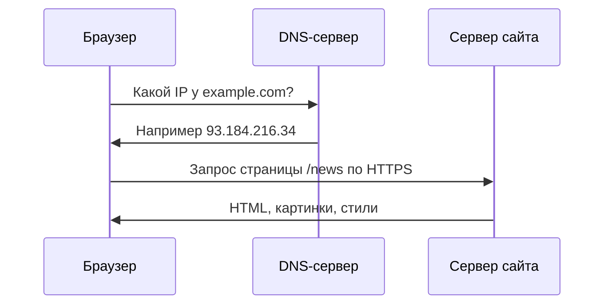

---
tags:
  - all
  - required
  - beginner
  - inprogress
title: Интернет и сетевые сервисы
description: >-
  Интернет, адреса, DNS, URL, почта, поиск, RSS и безопасность — с разбором
  терминов для новичка и маршрутом по энциклопедии.
---

import BrowserAddressBarPlay from '@site/src/components/BrowserAddressBarPlay';
import IpAddressAnalyzer from '@site/src/components/IpAddressAnalyzer';

# Интернет и сетевые сервисы

  ОБЯЗАТЕЛЬНО
  ДЛЯ НОВИЧКОВ
  В РАЗРАБОТКЕ

Всем

**Интернет** — глобальная сеть, в которой миллионы сетей связаны общими **протоколами** (правилами обмена пакетами данных). 

---

## Вступление — интернет как инфраструктура

В бытовом языке интернет часто воспринимают как одну кнопку — "есть интернет" или "нет интернета". С инженерной точки зрения это многоуровневая инфраструктура — адресация, маршрутизация, доменные имена, транспортные и прикладные протоколы, сервисы поверх сети.

Эта глава нужна, чтобы собрать у новичка причинно-следственную модель — как запрос из браузера доходит до сервера, почему доменное имя не равно IP, где в цепочке возникают задержки, и чем веб отличается от других сетевых сервисов. Без этой модели трудно адекватно читать даже базовые материалы по безопасности, веб-разработке и интеграциям.

Здесь мы держим баланс между простотой и строгостью — объясняем без перегруза формулами, но с корректными терминами и реальными сценариями (поиск, почта, мессенджеры, стриминг, электронная коммерция, защита данных).

**Всемирная паутина (WWW)** — один из сервисов поверх интернета — веб-страницы по HTTP/HTTPS в браузере. Почта, онлайн-игры, мессенджеры и видеозвонки тоже идут через интернет, но **без** обязательного браузера.

Глубокий раздел — [Сеть и интернет](/encyclopedia/2-system-network/2-03-set-i-internet/intro). Здесь — карта школьного курса с человеческими объяснениями.

---

## Как "дойти" до сайта — цепочка шагов

Вы вводите в браузере `https://example.com/news`. Что происходит упрощённо —

1. **DNS** переводит имя `example.com` в **IP-адрес** (числовой "адрес дома" в сети).
2. Браузер устанавливает **защищённое** соединение **HTTPS** (порт 443).
3. Сервер отдаёт файлы страницы; браузер рисует их на экране.

Если DNS "лежит", сайт по имени откроется с трудом, хотя интернет в целом может работать.

В реальности между вами и сайтом есть несколько промежуточных узлов (роутер дома, сеть провайдера, магистральные сети), поэтому задержка зависит не только от сервера, но и от качества маршрута.

---

## Термины адресации

| Понятие | Простыми словами | Пример |
|---------|------------------|--------|
| **IP-адрес** | Уникальный "номер" устройства в сети | `192.168.1.5` дома, `93.184.216.34` в интернете |
| **Доменное имя** | Удобное имя вместо IP | `yandex.ru`, `wikipedia.org` |
| **DNS** | Справочник "имя → IP" | Запрос к DNS при каждом новом сайте |
| **URL** | Полный адрес ресурса | `https://shop.ru/catalog?id=12` |
| **Порт** | "Дверь" на компьютере для службы | 80 — HTTP, 443 — HTTPS |

---

### Разбор URL

`https://shop.example/catalog/shoes?size=42#reviews`

| Часть | Роль |
|-------|------|
| `https://` | Протокол, шифрование |
| `shop.example` | Домен (через DNS → IP) |
| `/catalog/shoes` | Путь к странице на сервере |
| `?size=42` | Параметры (размер обуви) |
| `#reviews` | Якорь на странице (блок отзывов) |

★ Домашний **роутер** раздаёт локальные адреса вида `192.168.x.x` (DHCP) и соединяет вашу квартиру с провайдером.

Ещё один важный термин — **NAT**. Он позволяет многим домашним устройствам выходить в интернет через один внешний IP-адрес провайдера.

---

### Интерактив — адресная строка и URL

Возьмите любой знакомый адрес сайта и разберите его на части — протокол, домен, путь, параметры, якорь.

<BrowserAddressBarPlay />

После блока вы должны без подсказки объяснять роли частей URL — адрес хоста, путь к ресурсу и параметры запроса.

---

### Интерактив — IP-адреса и подсети

Теперь переключитесь на числовую сторону сети — сравните локальные и внешние адреса, чтобы закрепить разницу между домашней сетью и интернетом.

<IpAddressAnalyzer />

Если после демо стало понятно, почему одному роутеру хватает одного внешнего IP для многих устройств дома, значит тема адресации легла правильно.

Подробнее — [IP-адресация](/encyclopedia/2-system-network/2-03-set-i-internet/41), [DNS](/encyclopedia/2-system-network/2-03-set-i-internet/6), [URL](/encyclopedia/2-system-network/2-03-set-i-internet/3).

---

## Базовый маршрут по сети в энциклопедии

1. [Основы сети](/encyclopedia/2-system-network/2-03-set-i-internet/1) — LAN, WAN, протоколы.
2. [История](/encyclopedia/2-system-network/2-03-set-i-internet/2) — ARPANET, WWW.
3. [IP-адресация](/encyclopedia/2-system-network/2-03-set-i-internet/41).
4. [DNS](/encyclopedia/2-system-network/2-03-set-i-internet/6).
5. [Загрузка сайта](/encyclopedia/2-system-network/2-03-set-i-internet/3), [5](/encyclopedia/2-system-network/2-03-set-i-internet/5).
6. [Провайдер и роутер](/encyclopedia/2-system-network/2-03-set-i-internet/61), [2111](/encyclopedia/2-system-network/2-03-set-i-internet/2111).

---

## Способы подключения к интернету

| Способ | Где используется | Комментарий |
|--------|------------------|-------------|
| Оптоволокно (FTTH) | Квартиры, офисы | Высокая скорость, низкая задержка |
| DSL / ADSL | Телефонная линия | Встречается реже |
| Кабельный модем | Кабельное ТВ | Интернет по коаксиалу |
| Wi-Fi / LTE / 5G | Телефоны, ноутбуки | Беспроводной "последний участок" |
| Спутник | Удалённые районы | Выше задержка, дороже |

[Интернет-провайдер](/encyclopedia/2-system-network/2-03-set-i-internet/61), [Wi-Fi](/encyclopedia/2-system-network/2-03-set-i-internet/71).

Скорость в тарифе и реальная скорость не всегда совпадают — влияют загруженность канала, расстояние до точки Wi-Fi, помехи от соседних сетей, качество роутера и устройства пользователя.

---

## Сервисы интернета — что есть и зачем

| Сервис | Суть | Куда читать |
|--------|------|-------------|
| **Поиск** | Индекс страниц + ранжирование | [1-21](/encyclopedia/1-basics/1-21-poisk-informatsii/intro) |
| **Почта** | Письма с задержкой, хранятся на сервере | [1-22/3](/encyclopedia/1-basics/1-22-kommunikatsiya-i-obschenie/3) |
| **Мессенджеры** | Чат почти в реальном времени | [1-22/2](/encyclopedia/1-basics/1-22-kommunikatsiya-i-obschenie/2) |
| **VoIP / видеозвонки** | Голос и видео через интернет | [1-22/4](/encyclopedia/1-basics/1-22-kommunikatsiya-i-obschenie/4) |
| **Соцсети, форумы** | Ленты и обсуждения | [1-22/1](/encyclopedia/1-basics/1-22-kommunikatsiya-i-obschenie/1) |
| **Веб-сайты** | HTML, CSS, JS в браузере | [HTML](/encyclopedia/3-data-markup/3-09-html/intro) |
| **RSS** | Подписка на обновления сайтов | Ниже |
| **Стриминг** | Радио/ТВ/видео потоком | Ниже |
| **E-commerce** | Покупки онлайн | Ниже |

---

### Поиск информации

Поисковик (Google, Яндекс и др.) **обходит** сайты роботом, строит **индекс** слов и ссылок и при запросе "сортировка пузырьком" показывает страницы, которые алгоритм считает релевантными. Навык формулировать запрос и отличать рекламу от результата — часть цифровой грамотности. Старт — [Поисковые системы](/encyclopedia/1-basics/1-21-poisk-informatsii/1).

Для учебных задач полезно уточнять запрос операторами — кавычки для точной фразы, `site:` для поиска по конкретному сайту, минус-слово для исключения нерелевантных тем.

---

### Электронная почта

Письмо уходит на **почтовый сервер** получателя (через SMTP); вы забираете его клиентом или веб-интерфейсом (IMAP/POP). Письмо **асинхронно** — собеседник может ответить через час — в отличие от мессенджера.

---

### Мгновенные сообщения и видеосвязь

Мессенджер держит **постоянное** или частое соединение с сервером — сообщения приходят за секунды. Видеозвонок (Zoom, Telegram, Discord) передаёт **сжатый** аудио- и видеопоток; качество зависит от скорости канала.

---

### RSS и ленты новостей

**RSS** (и формат **Atom**) — файл вроде `https://blog.example/feed.xml` со списком **заголовков**, дат и ссылок на новые статьи.

**RSS-агрегатор** (Feedly, встроенные читалки) периодически скачивает ленту — вы видите обновления **без** алгоритмической ленты соцсети. Это модель **pull** — вы сами подписались на источник.

---

### Интернет-радио и интернет-ТВ

**Стриминг** — данные идут **непрерывным потоком**; плеер держит буфер на несколько секунд вперёд. Радио — в основном аудио (MP3, AAC); интернет-ТВ — видео (HLS, DASH) в браузере или приложении.

Отличие от скачивания — полный файл на диск может **никогда не сохраняться**, если вы только слушаете/смотрите.

---

### Электронная коммерция

Типичный путь — каталог → корзина → оплата картой через **платёжный шлюз** → доставка. Технически — HTTPS-сайт, база заказов, банк подтверждает платёж.

Для пользователя важно — адрес с `https`, знакомое имя магазина, осторожность с данными карты на сомнительных страницах, сохранение чека. Юридически — оферта и обработка персональных данных.

---

## Конфиденциальность в сети

| Тема | Суть |
|------|------|
| **HTTPS** | Шифрует трафик между браузером и сайтом; замок в адресной строке |
| **Пароли** | Уникальные для важных сервисов; менеджер паролей запоминает за вас |
| **Фишинг** | Поддельный сайт или письмо, выманивающее пароль |
| **Cookie** | Маленькие данные в браузере — сессия, настройки, иногда реклама |

**Фишинг —** письмо "ваш банк заблокирован, войдите по ссылке" ведёт на копию сайта. Правило — **вводить пароль только** на сайте, который вы сами открыли по закладке или вручную набрали адрес.

Добавьте двухфакторную аутентификацию (2FA) в ключевых сервисах — даже если пароль утечёт, злоумышленнику понадобится второй фактор (код из приложения или аппаратный ключ).

Шире — [Защита в сети](/encyclopedia/2-system-network/2-03-set-i-internet/616), [ИБ](/encyclopedia/2-system-network/2-08-osnovy-informatsionnoy-bezopasnosti/intro), [Cookie](/encyclopedia/2-system-network/2-03-set-i-internet/7).

---

## Создание веб-страниц — с чего начать

**HTML** — каркас (заголовки, абзацы, ссылки). **CSS** — оформление (цвета, шрифты). **JavaScript** — поведение (кнопки, проверка формы).

Старт — [HTML — о разделе](/encyclopedia/3-data-markup/3-09-html/intro). Углубление — [Как работают сайты](/encyclopedia/2-system-network/2-04-kak-rabotayut-sayty-i-veb-sayty/intro).

  
Мини-практика

  Создайте простую страницу-визитку — заголовок, абзац, список и ссылку. Затем откройте инструменты разработчика в браузере и найдите в DOM, как HTML превращается в видимый блок на экране.

  
Самопроверка

  <ol>
    <li>Чем интернет шире, чем WWW?</li>
    <li>Зачем нужен DNS, если есть IP?</li>
    <li>Чем потоковое видео отличается от скачивания файла?</li>
  </ol>

Дальше — [Право и защита информации](/encyclopedia/1-basics/1-035-bazovaya-informatika/7).

---