---
tags:
  - all
  - required
  - beginner
  - inprogress
title: Интернет и сетевые сервисы
description: >-
  Интернет, адреса, DNS, URL, почта, поиск, RSS и безопасность — с разбором
  терминов для новичка и маршрутом по энциклопедии.
related:
  - title: "ОС, файловые системы и служебные программы"
    doc: encyclopedia/1-basics/1-035-bazovaya-informatika/5
  - title: "Сеть и интернет — о разделе"
    doc: encyclopedia/2-system-network/2-03-set-i-internet/intro
  - title: "Право и защита информации в РФ"
    doc: encyclopedia/1-basics/1-035-bazovaya-informatika/7
  - title: "Основы компьютерной грамотности"
    doc: encyclopedia/1-basics/1-035-bazovaya-informatika/101
---

import ExternalPlayEmbed from '@site/src/components/ExternalPlayEmbed';


# Интернет и сетевые сервисы

<div class="article-tags">
  <span class="tag tag-required">ОБЯЗАТЕЛЬНО</span>
  <span class="tag tag-beginner">ДЛЯ НОВИЧКОВ</span>
  <span class="tag tag-inprogress">В РАЗРАБОТКЕ</span>
</div>

<span class="complexity-badge">Всем</span>

Что такое интернет?

**Интернет** — глобальная сеть, в которой миллионы сетей связаны общими **протоколами** (правилами обмена данными). Ниже — адреса, **DNS** (система имён доменов), **HTTP/HTTPS** (протоколы веб-страниц), браузер, почта, облако, соцсети, диагностика и безопасность.


<div class="callout callout--tip">
  <div class="callout-title">Как читать главу</div>

  <div class="callout-body">

  - сначала — [адреса](#mac-ip-arp-dhcp) и [DNS](#dns--пошаговый-разбор);
  - затем — [HTTP и HTTPS](#http-и-https) и [сервисы](#сервисы-интернета);
  - для практики — разделы про [браузер](#браузер), [почту](#электронная-почта) и [облако](#облачное-хранилище);
  - вопросы в `<details>` — для подготовки к контрольной.

  Углубление — [Сеть и интернет](/encyclopedia/2-system-network/2-03-set-i-internet/intro).

</div>
</div>


---

## Ключевые понятия

| Понятие | Простыми словами | Пример |
|---------|------------------|--------|
| **Интернет** | Сеть сетей по всему миру | Кабель, Wi‑Fi, мобильная связь |
| **WWW (веб)** | Сайты, открываемые в браузере | Страница в Chrome |
| **IP-адрес** | Числовой "адрес дома" устройства в сети | `192.168.1.5` |
| **Доменное имя** | Удобное имя сайта вместо IP | `yandex.ru` |
| **DNS** | Справочник "имя сайта → IP" | Срабатывает при каждом новом домене |
| **URL** | Полный адрес страницы или файла | `https://shop.ru/cat?id=1` |
| **Порт** | Номер "двери" службы на компьютере | 80 — HTTP, 443 — HTTPS |
| **Протокол** | Правила обмена данными между программами | TCP, HTTP, [SMTP](#электронная-почта) |

★ **Интернет** шире **веба**. Почта, игры и мессенджеры тоже работают через интернет, но часто **без** браузера.

| Сервис | Протокол | Где открывается |
|--------|----------|-----------------|
| Веб | HTTP/HTTPS | Браузер |
| Почта | SMTP, IMAP | Почтовая программа или сайт почты |
| Мессенджеры | Свои протоколы | Приложение на телефоне или ПК |
| Игры | TCP/UDP | Клиент игры |

Подробнее — [Сеть и интернет](/encyclopedia/2-system-network/2-03-set-i-internet/intro), [IP-адресация](/encyclopedia/2-system-network/2-03-set-i-internet/41).

---

## Как "дойти" до сайта

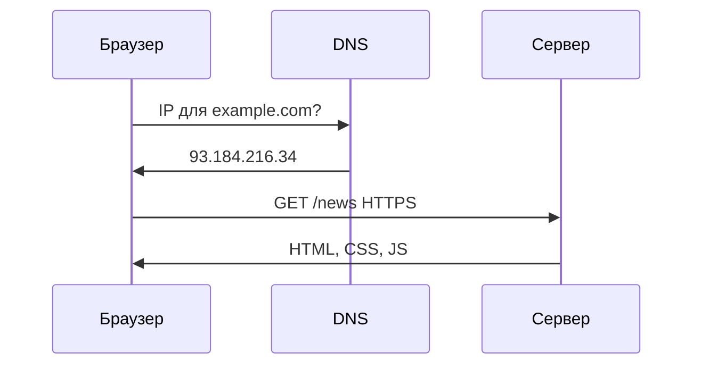

---

## MAC, IP, ARP, DHCP

| | MAC | IP |
|---|-----|-----|
| Уровень | Канал (LAN) | Сеть |
| Вид | `AA:BB:CC:DD:EE:FF` | `192.168.1.5` |
| Меняется? | Редко | DHCP может сменить |

- **MAC-адрес** (Media Access Control) — постоянный идентификатор сетевой карты или Wi‑Fi-модуля внутри домашней сети. Прошит в железо и почти не меняется.
- **IP-адрес** (Internet Protocol) — логический адрес для маршрутизации между сетями. В домашней Wi‑Fi сети часто вида `192.168.x.x`.

**ARP** (Address Resolution Protocol) — протокол, который по IP-адресу узнаёт MAC-адрес устройства в локальной сети. Роутер спрашивает "кто владеет 192.168.1.1?" и получает ответ. Проверка в Windows — `arp -a`.

**DHCP** (Dynamic Host Configuration Protocol) — служба, которая при подключении к Wi‑Fi или кабелю **автоматически** выдаёт устройству

- IP-адрес;
- маску подсети;
- адрес шлюза (обычно роутера);
- адреса DNS-серверов.

Без DHCP каждое устройство пришлось бы настраивать вручную. Подробнее — [IP и адресация](/encyclopedia/2-system-network/2-03-set-i-internet/41).

---

## Диагностика сети

| Команда | Назначение |
|---------|------------|
| `ping` | Доступность хоста и задержка (ICMP) |
| `tracert` / `traceroute` | Маршрут пакетов до узла |
| `ipconfig` / `ip a` | Ваш IP, маска, шлюз, DNS |
| `nslookup` / `dig` | Ответ DNS для домена |

Команды подробнее — [Диагностика сети](/encyclopedia/2-system-network/2-03-set-i-internet/616), [Терминал](/encyclopedia/2-system-network/2-05-terminal/intro).

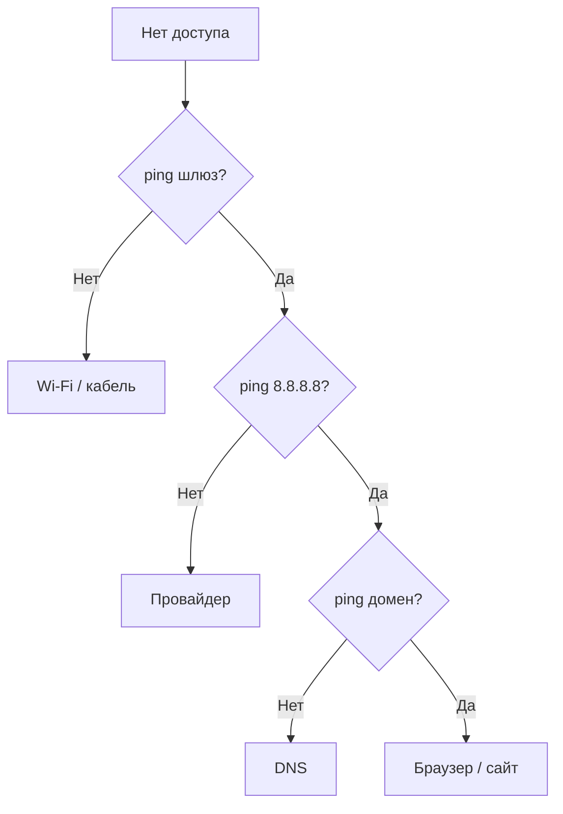

---

## TCP/IP и протоколы

Стек **TCP/IP** — набор правил, по которым данные идут от программы на вашем ПК до сервера в интернете и обратно. Упрощённо его делят на уровни.

| Уровень | Протоколы | Задача |
|---------|-----------|--------|
| Прикладной | HTTP, DNS, SMTP | Сервисы — сайт, справочник имён, почта |
| Транспортный | TCP, UDP | Доставка между программами |
| Сетевой | IP, ICMP | Маршрут между сетями |
| Канальный | Ethernet, Wi‑Fi | Передача кадров по кабелю или эфиру |

На транспортном уровне чаще всего встречаются два протокола.

- **TCP** (Transmission Control Protocol) — надёжная доставка. Отправитель получает подтверждения; потерянные фрагменты пересылают снова. Нужен для веб-страниц, почты, скачивания файлов.
- **UDP** (User Datagram Protocol) — быстрая доставка без гарантии и без повторов. Подходит для DNS-запросов, онлайн-игр и потокового видео, где важнее скорость, чем идеальная целостность каждого пакета.

| Протокол | Порт | Транспорт | Назначение |
|----------|------|-----------|------------|
| HTTP | 80 | TCP | Веб-страница без шифрования |
| HTTPS | 443 | TCP | Веб с шифрованием TLS |
| DNS | 53 | UDP (часто) | Имя сайта → IP |
| SMTP | 25 / 587 | TCP | Отправка почты |
| IMAP | 143 / 993 | TCP | Чтение почты на сервере |

**SMTP** (Simple Mail Transfer Protocol) — протокол **отправки** письма с вашего клиента на почтовый сервер и дальше к получателю. На экзамене обычно запоминают порт **587** с шифрованием. Подробнее — [Почта](/encyclopedia/1-basics/1-22-kommunikatsiya-i-obschenie/3), [Протоколы сети](/encyclopedia/2-system-network/2-03-set-i-internet/6).

---

## IPv4, NAT, IPv6

**IPv4** — привычный формат из четырёх чисел (`192.168.1.5`). Публичных адресов не хватает на все устройства мира, поэтому дома и в офисах используют **частные** диапазоны.

- `10.0.0.0` – `10.255.255.255`
- `172.16.0.0` – `172.31.255.255`
- `192.168.0.0` – `192.168.255.255`

**NAT** (Network Address Translation) — перевод адресов на роутере. Несколько устройств в квартире с адресами `192.168.x.x` выходят в интернет под **одним** публичным IP провайдера. Роутер подменяет внутренний адрес на внешний и обратно — так пакеты находят нужный ноутбук или телефон.

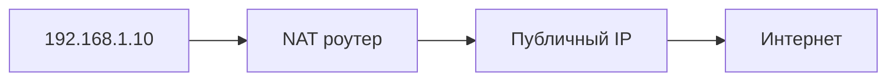

**IPv6** — новый формат с 128 битами, запись вроде `2001:db8::1`. Адресов хватит надолго. **Dual Stack** — когда устройство и провайдер поддерживают IPv4 и IPv6 одновременно. Проверка — [test-ipv6.com](https://test-ipv6.com). Подробнее — [IPv6](/encyclopedia/2-system-network/2-03-set-i-internet/614).

---

## URL

**URL** (Uniform Resource Locator) — полный адрес ресурса в интернете. Пример `https://shop.example/catalog?size=42#reviews` разбирается так.

- `https` — протокол (здесь защищённый веб);
- `shop.example` — доменное имя;
- `/catalog` — путь на сервере;
- `?size=42` — параметры запроса;
- `#reviews` — якорь (прокрутка к блоку на странице).

Подробнее — [Ссылки и URL](/encyclopedia/2-system-network/2-03-set-i-internet/3).

### Интерактив — адресная строка

<ExternalPlayEmbed example="tools-network/browser-address-bar-play" title="Browser Address Bar" />

### Интерактив — IP

<ExternalPlayEmbed example="basics/ip-address-analyzer" title="Анализатор IP-адреса" minHeight={420} />


---

## DNS — пошаговый разбор

**Domain Name System** — распределённая база "имя ↔ IP".

### Шаг за шагом — от ввода адреса до IP

| Шаг | Кто | Действие |
|-----|-----|----------|
| 1 | Браузер | Проверяет **кэш** браузера |
| 2 | ОС | Проверяет **кэш** resolver |
| 3 | Рекурсивный DNS | Запрос к корню |
| 4 | Корневой DNS | "Спроси серверы зоны `.ru`" |
| 5 | TLD `.ru` | "Спроси NS домена `ya.ru`" |
| 6 | Авторитативный NS | Отдаёт **A-запись** |
| 7 | Рекурсивный DNS | Кэширует TTL и отвечает клиенту |

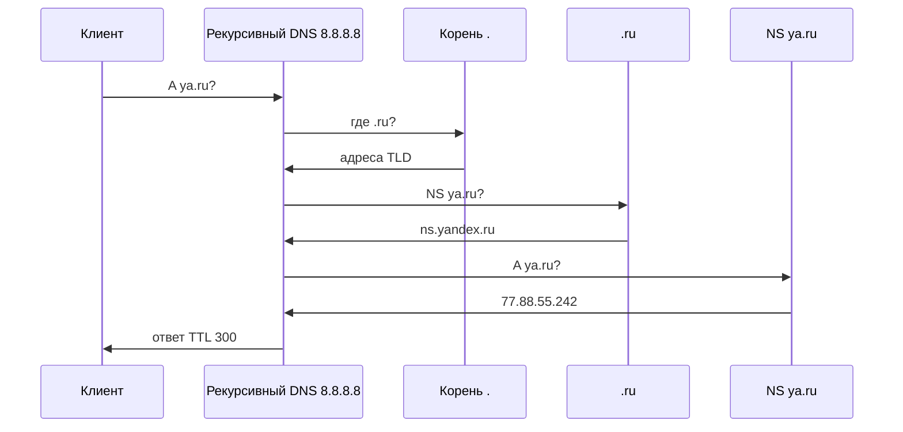

| Тип записи | Назначение | Пример |
|------------|------------|--------|
| **A** | Домен → IPv4 | `example.com → 93.184.216.34` |
| **AAAA** | Домен → IPv6 | `example.com → 2606:…` |
| **CNAME** | Псевдоним | `www → example.com` |
| **MX** | Почтовый сервер | приоритет + хост |
| **NS** | Авторитативные DNS | `ns1.registrar.ru` |
| **TXT** | SPF, верификация | `v=spf1 …` |
| **PTR** | Обратный DNS IP → имя | для почтовых серверов |

### Кэш и сброс

- **TTL** (Time To Live) — сколько секунд хранить ответ в кэше.
- Windows: `ipconfig /flushdns`
- Linux: `sudo systemd-resolve --flush-caches` (зависит от дистрибутива)

### Публичные DNS

| Провайдер | IPv4 |
|-----------|------|
| Google | 8.8.8.8, 8.8.4.4 |
| Cloudflare | 1.1.1.1 |
| Яндекс | 77.88.8.8 |

Если сайты не открываются по имени, но `ping 8.8.8.8` работает — часто проблема **DNS**.


---

## HTTP и HTTPS

**HTTP** (HyperText Transfer Protocol) — протокол передачи веб-страниц. Браузер запрашивает документ, сервер отвечает HTML, картинками и стилями.

**HTTPS** — тот же HTTP, но внутри зашифрованного канала **TLS** (Transport Layer Security). TLS проверяет подлинность сайта по сертификату и шифрует пароли, сообщения и платежи. В адресной строке появляется замок.

| | HTTP | HTTPS |
|---|------|-------|
| Порт | 80 | 443 |
| Шифрование | Нет | TLS |
| Целостность | Нет | Да |
| Индикатор | — | Замок в адресной строке |

Подробнее — [Как работают сайты](/encyclopedia/2-system-network/2-04-kak-rabotayut-sayty-i-veb-sayty/intro).

### Запрос HTTP (упрощённо)

```
GET /index.html HTTP/1.1
Host: example.com
User-Agent: Mozilla/5.0
Accept: text/html
```

Ответ:

```
HTTP/1.1 200 OK
Content-Type: text/html
Content-Length: 1256

<!DOCTYPE html>...
```

| Код | Смысл |
|-----|--------|
| 200 | OK |
| 301/302 | Перенаправление |
| 404 | Не найдено |
| 500 | Ошибка сервера |

### Рукопожатие TLS

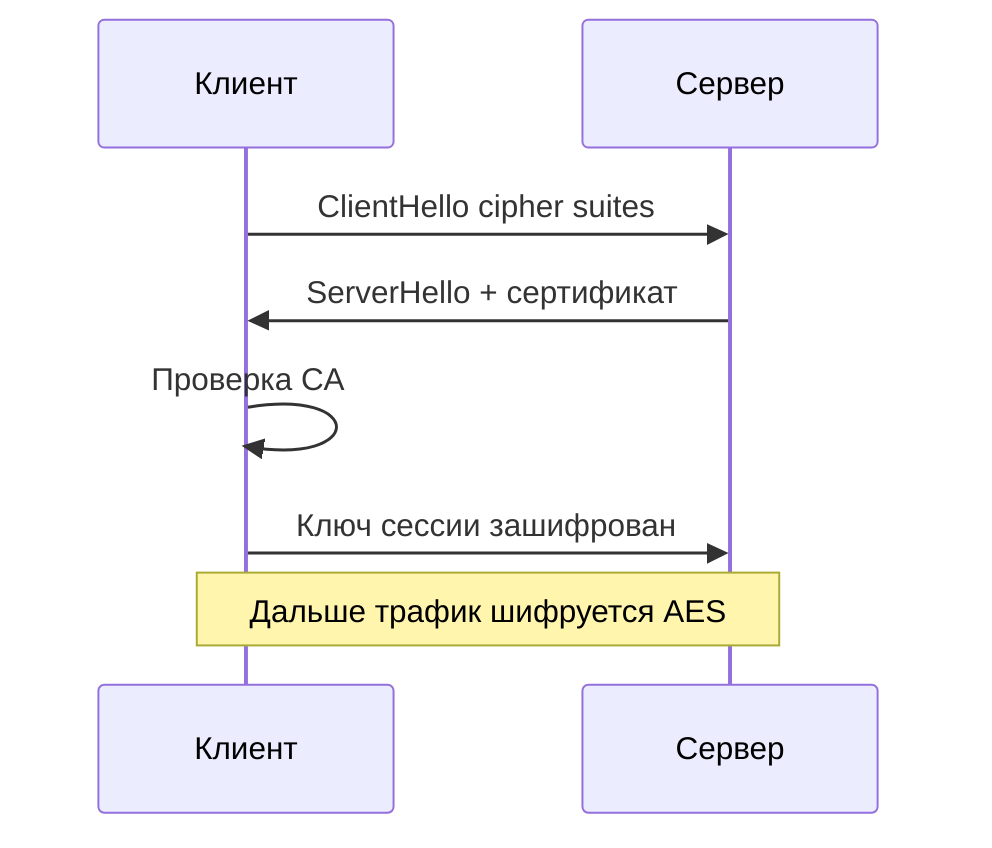

| Шаг | Содержание |
|-----|------------|
| 1 | Клиент предлагает версии TLS и шифры |
| 2 | Сервер выбирает и присылает **сертификат** |
| 3 | Клиент проверяет цепочку до **доверенного CA** |
| 4 | Согласуют симметричный ключ сессии |
| 5 | HTTP внутри зашифрованного канала |

**Сертификат** связывает домен с открытым ключом. **Let's Encrypt** — бесплатные сертификаты.

**HSTS** — заголовок, заставляющий браузер всегда использовать HTTPS.

★ Не вводите пароли на сайтах без замка (или с предупреждением о сертификате).


---

## Файрвол — основы

| Уровень | Примеры |
|---------|---------|
| Персональный | Брандмауэр Windows |
| Роутер | SPI, NAT |
| Корпоративный | Отдельный appliance |

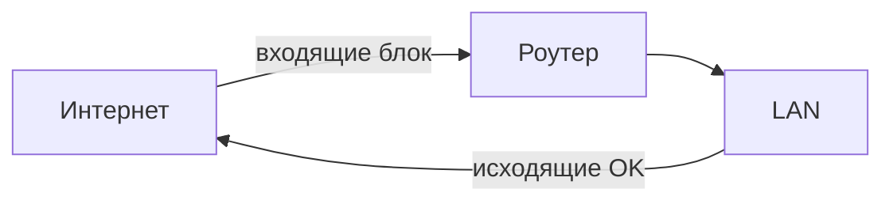

[ИБ](/encyclopedia/2-system-network/2-08-osnovy-informatsionnoy-bezopasnosti/intro).

---

## Способы подключения

| Способ | Комментарий |
|--------|-------------|
| FTTH | Оптика, низкий ping |
| DSL | Телефонная линия |
| LTE/5G | Мобильный интернет |
| Wi‑Fi | Последний участок дома |


---

## Браузер

**Браузер** — клиент WWW: запрашивает HTML/CSS/JS, рисует страницу, выполняет скрипты.

| Браузер | Движок |
|---------|--------|
| Chrome, Edge, Opera | Chromium / Blink |
| Firefox | Gecko |
| Safari | WebKit |

### Из чего состоит работа браузера

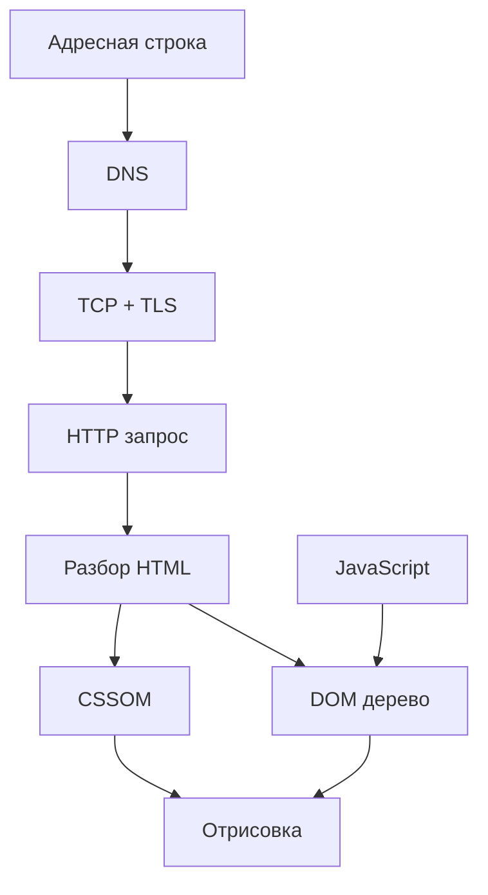

| Элемент | Назначение |
|---------|------------|
| **Вкладки** | Изолированные сессии (частично) |
| **Кэш** | Сохранённые картинки, CSS — быстрее повторный визит |
| **Cookie** | Сессия, настройки, трекинг |
| **LocalStorage** | Данные сайта на диске |
| **Расширения** | Adblock, менеджеры паролей |
| **Режим инкогнито** | Не сохраняет историю локально (не анонимность!) |

### Безопасность браузера

| Угроза | Защита |
|--------|--------|
| Фишинг | Проверять URL, закладки |
| Вредоносная реклама | Блокировщик, не кликать "вы выиграли" |
| Устаревший браузер | Автообновления |
| Поддельный HTTPS | Смотреть на сертификат, HSTS |

**DevTools** (F12) — инструменты разработчика.

- вкладка **Elements** — структура страницы;
- **Network** — какие запросы ушли на сервер;
- **Console** — ошибки JavaScript.

[HTML](/encyclopedia/3-data-markup/3-09-html/intro), [как работают сайты](/encyclopedia/2-system-network/2-04-kak-rabotayut-sayty-i-veb-sayty/intro).


---

## Электронная почта

Почта в интернете работает через несколько протоколов. Главный для **отправки** — **SMTP** (Simple Mail Transfer Protocol): ваш клиент или веб-интерфейс передаёт письмо на SMTP-сервер, тот доставляет его на сервер получателя по **MX-записи** DNS.

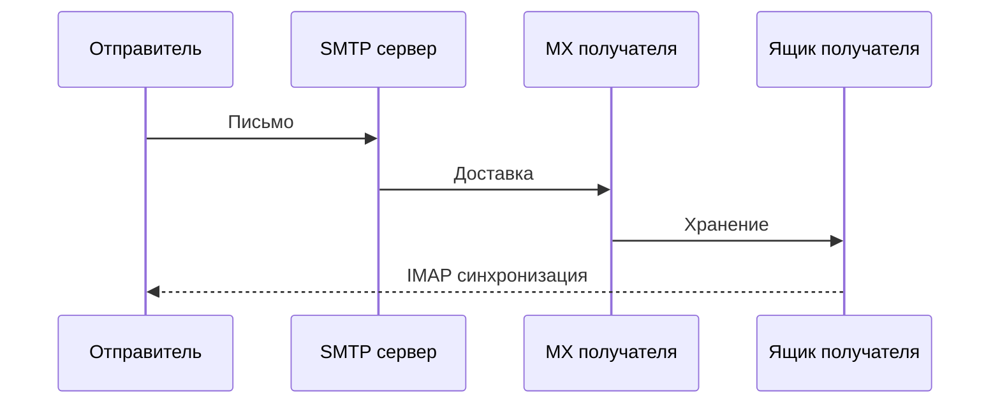

| Протокол | Порт | Роль |
|----------|------|------|
| SMTP | 587 (TLS) | Отправка с шифрованием |
| IMAP | 993 | Чтение и синхронизация папок на сервере |
| POP3 | 995 | Скачать письма на один компьютер |

### Структура письма

| Часть | Примеры полей |
|-------|---------------|
| Заголовки | From, To, Subject, Date |
| Тело | text/plain или text/html |
| Вложения | base64, MIME |

`student@school.ru` — локальная часть + домен; **MX-запись** DNS указывает почтовый сервер.

### Веб-почта и клиент

| | Веб (Gmail в браузере) | Клиент (Thunderbird, Outlook) |
|---|------------------------|-------------------------------|
| Доступ | Любой ПК | Настроенные устройства |
| Оффлайн | Ограничен | Возможен с кэшем |
| Хранение | На сервере провайдера | Локально + сервер |

### Безопасность почты

| Угроза | Признаки | Действия |
|--------|----------|----------|
| Фишинг | Срочность, чужой домен | Не кликать ссылки, проверить From |
| Вложение .exe | "Счёт.zip.exe" | Не открывать |
| Подделка | SPF/DKIM fail | Игнорировать |

**SPF**, **DKIM**, **DMARC** — проверки подлинности отправителя на стороне сервера.

[Почта](/encyclopedia/1-basics/1-22-kommunikatsiya-i-obschenie/3).


---

## Облачное хранилище

**Облако** — файлы на серверах провайдера, доступ по интернету с синхронизацией.

| Сервис | Бесплатно (ориентир) | Особенности |
|--------|----------------------|-------------|
| Google Drive | ~15 ГБ | Docs, интеграция Android |
| Яндекс.Диск | ~10 ГБ | Документы, РФ |
| OneDrive | 5 ГБ+ | Windows |
| Dropbox | 2 ГБ | Синхронизация |
| iCloud | 5 ГБ | Apple |

### Синхронизация и резервная копия

| | Синхронизация | Бэкап |
|---|---------------|-------|
| Удаление локально | Может удалить в облаке | Версии / корзина |
| Конфликты | Две правки одного файла | Меньше |
| Цель | Доступ везде | Восстановление после сбоя |

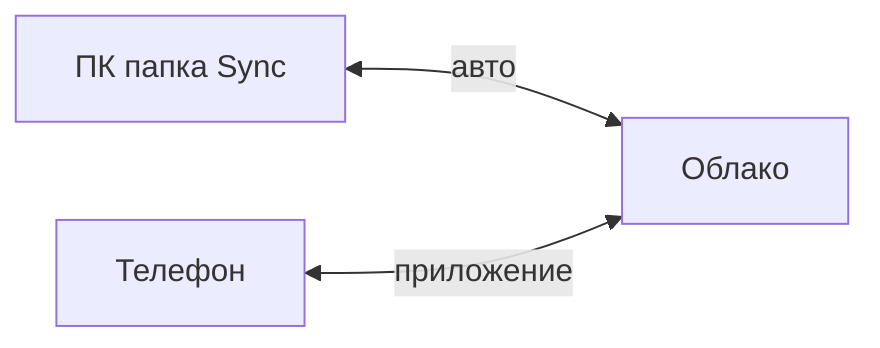

### Общий доступ

- **Ссылка** с правами "только просмотр" / "редактирование".
- Риск: публичная ссылка попадёт к посторонним — ставьте срок действия и пароль.

★ Облако **не заменяет** правило 3-2-1 полностью — комбинируйте с локальным HDD.


---

## Социальные сети — безопасность

| Риск | Описание | Защита |
|------|----------|--------|
| **Перепубликация лишнего** | Адрес, школа, отпуск | Минимум личного в профиле |
| **Кибербуллинг** | Оскорбления, травля | Блокировка, жалоба, взрослый |
| **Фейковые аккаунты** | "Друг" просит деньги | Позвонить другу напрямую |
| **Геометки** | Дом, школа на карте | Отключить геотеги |
| **Мошенничество** | "Выигрыш", "голосование" | Не переходить, не вводить пароль |
| **Пароли** | Один пароль на всё | Уникальные + 2FA |

### Настройки приватности — чек-лист

1. Кто видит публикации — **друзья**, не "все".
2. Кто может писать в ЛС — **друзья друзей** или только друзья.
3. Проверка тегов на фото — **вручную**.
4. Двухфакторная аутентификация — **включена**.
5. Старые посты — периодический аудит.

<div class="callout callout--warning">
  <div class="callout-title">Для несовершеннолетних</div>

  <div class="callout-body">
  Не встречайтесь с "друзьями из интернета" без взрослых. Сообщайте учителю или родителям о травле и подозрительных сообщениях. Скриншоты — доказательство для жалобы.
</div>
</div>

[Общение](/encyclopedia/1-basics/1-22-kommunikatsiya-i-obschenie/1).


---

## Сервисы интернета

| Сервис | Куда читать |
|--------|-------------|
| Поиск | [1-21](/encyclopedia/1-basics/1-21-poisk-informatsii/intro) |
| Почта | выше |
| Мессенджеры | [1-22/2](/encyclopedia/1-basics/1-22-kommunikatsiya-i-obschenie/2) |
| VoIP | [1-22/4](/encyclopedia/1-basics/1-22-kommunikatsiya-i-obschenie/4) |

### Поиск — операторы

| Оператор | Пример |
|----------|--------|
| `"фраза"` | Точное совпадение |
| `site:` | Только на сайте |
| `-слово` | Исключить |
| `filetype:pdf` | Тип файла |

### RSS, стриминг, интернет-магазин

- **RSS** — файл `feed.xml` на сайте; агрегатор периодически проверяет обновления без соцсетей.
- **Стриминг** — видео или музыка идут потоком в плеер; файл может не сохраняться целиком на диск.
- **Интернет-магазин** — оплата только по `https`, подтверждение банка (3-D Secure), сохраняйте чек.

---

## Конфиденциальность в сети

| Тема | Суть |
|------|------|
| HTTPS | Шифрование до сервера |
| Cookie | Сессия и трекинг |
| 2FA | Второй фактор |
| VPN | Туннель, не полная анонимность |

[Защита в сети](/encyclopedia/2-system-network/2-03-set-i-internet/616).

---

## Создание веб-страниц

- **HTML** — каркас страницы (заголовки, ссылки, формы).
- **CSS** — оформление и вёрстка.
- **JavaScript** — поведение на стороне браузера.

[HTML — раздел](/encyclopedia/3-data-markup/3-09-html/intro), [CSS — раздел](/encyclopedia/3-data-markup/3-10-css/intro).


---

## Задачи для самопроверки и экзамена

1. Чем **интернет** шире **WWW**?
2. Зачем **DNS**?
3. Потоковое видео и скачивание?
4. `11000000.10101000.00000001.00000101` в десятичном виде?
5. Порты HTTP и HTTPS?
6. Что делает **NAT**?
7. Три команды диагностики Windows?
8. **TCP** и **UDP**?
9. Зачем **файрвол**?
10. **IPv6** — зачем?
11. Разберите URL на 5 частей.
12. Что такое **MX-запись**?
13. Чем **IMAP** отличается от **POP3**?
14. Что проверяет браузер в **TLS**?
15. Три правила безопасности в соцсетях?

**Краткие ответы**

1. Интернет — вся сеть; веб — только сайты в браузере.
2. DNS переводит имя в IP.
3. Поток не хранится целиком на диске.
4. `192.168.1.5`.
5. Порты 80 и 443.
6. NAT — много устройств дома выходят под одним внешним IP.
7. `ping`, `tracert`, `ipconfig`.
8. TCP — с подтверждением; UDP — быстрее, без гарантии.
9. Файрвол фильтрует трафик.
10. IPv6 расширяет адресное пространство.
11–15 — см. разделы выше.


### Задачи в формате ОГЭ

**Задача 1.** Опишите путь DNS-запроса, когда пользователь вводит `mail.ru` в браузере.

- браузер спрашивает **DNS** (система имён доменов) у настроенного резолвера;
- резолвер при необходимости обращается к корневым и зонным серверам;
- в ответ приходит **IP-адрес** сервера;
- браузер устанавливает соединение с этим IP (обычно по **HTTPS**, порт 443).

Подробнее — раздел [DNS — пошаговый разбор](#dns--пошаговый-разбор) и [Сеть](/encyclopedia/2-system-network/2-03-set-i-internet/6).

**Задача 2.** Сравните **HTTP** и **HTTPS** при вводе пароля на сайте.

- **HTTP** (порт 80) передаёт данные открытым текстом — пароль могут перехватить в сети;
- **HTTPS** (порт 443) шифрует трафик через **TLS** — в адресной строке замок;
- для входа в аккаунт и оплаты нужен только HTTPS.

**Задача 3.** Составьте пять правил безопасной публикации фото в соцсети.

- не выкладывать документы, номера, адрес школы и дома;
- проверить настройки приватности (кто видит пост);
- отключить точную геометку, если она не нужна;
- не отвечать незнакомым "друзьям" и не отправлять коды из SMS;
- при травле — сохранить скриншоты и обратиться к взрослому.

См. [Социальные сети — безопасность](#социальные-сети--безопасность).

**Задача 4.** Сайт по имени не открывается, `ping 8.8.8.8` проходит. План диагностики.

- связь с интернетом есть — проблема чаще в **DNS** или в самом домене;
- `nslookup имя_сайта` — приходит ли IP;
- сменить DNS на 8.8.8.8 или 1.1.1.1, выполнить `ipconfig /flushdns`;
- открыть сайт в другом браузере или без VPN;
- если IP есть, а страница нет — сбой на стороне сервера или блокировка.

Команды — [Диагностика сети](#диагностика-сети).

---

## Вопросы для самопроверки


<details>
<summary>1. Чем MAC отличается от IP?</summary>

**MAC** — адрес адаптера в локальной сети; **IP** — логический адрес для маршрутизации между сетями.
</details>

<details>
<summary>2. Что делает DHCP?</summary>

Автоматически выдаёт IP, маску, шлюз и DNS.
</details>

<details>
<summary>3. Зачем nslookup?</summary>

Проверить, какой IP возвращает DNS для домена.
</details>

<details>
<summary>4. Что такое порт 443?</summary>

Стандартный порт **HTTPS**.
</details>

<details>
<summary>5. Что такое TTL в DNS?</summary>

Время жизни записи в кэше в секундах.
</details>

<details>
<summary>6. Чем TCP надёжнее UDP?</summary>

TCP подтверждает доставку и переотправляет потерянные сегменты.
</details>

<details>
<summary>7. Что такое NAT?</summary>

Подмена частного IP на публичный при выходе в интернет.
</details>

<details>
<summary>8. Зачем IPv6?</summary>

Расширить адресное пространство — IPv4 исчерпан.
</details>

<details>
<summary>9. Что такое URL?</summary>

Uniform Resource Locator — полный адрес ресурса.
</details>

<details>
<summary>10. Что такое CNAME?</summary>

DNS-запись-псевдоним одного имени для другого.
</details>

<details>
<summary>11. Что такое фишинг?</summary>

Обман с целью украсть пароль или данные карты.
</details>

<details>
<summary>12. Зачем 2FA в почте?</summary>

Второй фактор усложняет взлом при утечке пароля.
</details>

<details>
<summary>13. Что такое cookie?</summary>

Небольшие данные сайта в браузере — сессия, настройки.
</details>

<details>
<summary>14. Режим инкогнито = анонимность?</summary>

**Нет** — скрывает только локальную историю; провайдер и сайт видят трафик.
</details>

<details>
<summary>15. Чем IMAP лучше POP3 для двух устройств?</summary>

IMAP синхронизирует папки на сервере; POP3 часто забирает письма локально.
</details>

<details>
<summary>16. Что такое SPF?</summary>

DNS TXT-запись — какие серверы могут отправлять почту от домена.
</details>

<details>
<summary>17. Что такое CDN?</summary>

Сеть кэширующих серверов ближе к пользователю — быстрее загрузка.
</details>

<details>
<summary>18. Зачем HTTPS в магазине?</summary>

Шифрует номер карты и пароль от перехвата.
</details>

<details>
<summary>19. Что такое ping?</summary>

ICMP-запрос для проверки доступности и задержки.
</details>

<details>
<summary>20. Что делает tracert?</summary>

Показывает маршрут и задержку на каждом хопе.
</details>

<div class="callout callout--tip">
  <div class="callout-title">Мини-практика</div>

  <div class="callout-body">
  <ol><li><code>ipconfig /all</code> — записать IP, шлюз, DNS.</li><li><code>tracert ya.ru</code> — максимальная задержка.</li><li>Разобрать URL на 5 частей.</li><li>test-ipv6.com — проверить IPv6.</li><li>Открыть DevTools → Network при загрузке страницы.</li></ol>
</div>
</div>

---

## Приложение — протоколы, порты и ситуации

### Сводная таблица протоколов

| Протокол | Порт | Транспорт | Назначение простыми словами |
|----------|------|-----------|------------------------------|
| **HTTP** | 80 | TCP | Веб-страница без шифрования |
| **HTTPS** | 443 | TCP | Веб с шифрованием TLS |
| **DNS** | 53 | UDP/TCP | Перевод имени сайта в IP |
| **SMTP** | 587 | TCP | Отправка почты |
| **IMAP** | 993 | TCP | Чтение почты с синхронизацией папок |
| **POP3** | 995 | TCP | Скачивание почты на один компьютер |
| **DHCP** | 67/68 | UDP | Автоматическая выдача IP дома |
| **SSH** | 22 | TCP | Безопасный удалённый доступ |
| **ICMP** | — | IP | `ping`, проверка доступности |

### Типовые ситуации

| Ситуация | Что проверить | Действие |
|----------|---------------|----------|
| Не открываются сайты по имени | DNS, кэш | `nslookup`, смена DNS, `flushdns` |
| Медленный Wi‑Fi | Расстояние, канал, помехи | Ближе к роутеру, кабель Ethernet для теста |
| Письмо "банк заблокирован" | Отправитель, ссылки | Не кликать, открыть сайт банка вручную |
| Публичная ссылка на облако | Срок, пароль | Ограничить доступ, не постить в открытый чат |
| Предупреждение HTTPS | Сертификат | Не вводить пароль, сообщить владельцу сайта |
| Стриминг и скачивание | Тип передачи | Поток идёт в плеер; файл сохраняется на диск целиком |
| Фейковый друг в соцсети | Личность | Позвонить другу, не отправлять коды |
| Нет IPv6 | Провайдер, роутер | test-ipv6.com, Dual Stack в настройках |

### Единая шпаргалка диагностики

- `ping 192.168.1.1` — доступен ли роутер
- `ping 8.8.8.8` — есть ли выход в интернет
- `nslookup домен` — отвечает ли DNS
- `tracert домен` — где растёт задержка

---

## IPv6 — подробнее

### Формат адреса

IPv6-адрес — **128 бит**, записывается восемью группами по 4 hex-цифры: `2001:0db8:85a3:0000:0000:8a2e:0370:7334`.

| Сокращение | Правило |
|------------|---------|
| Ведущие нули в группе | `0db8` → `db8` |
| Последовательность нулевых групп | `0000:0000` → `::` (один раз в адресе) |

**Пример:** `2001:0db8:0000:0000:0000:0000:0000:0001` → `2001:db8::1`.

### Типы адресов IPv6

| Тип | Назначение |
|-----|------------|
| Global unicast | Маршрутизация в интернете |
| Link-local `fe80::/10` | Только локальный сегмент |
| Unique local | Частные сети (аналог 192.168.x.x) |
| Multicast | Групповая рассылка |

### IPv4 и IPv6

| | IPv4 | IPv6 |
|---|------|------|
| Длина | 32 бита | 128 бит |
| Запись | 192.168.1.1 | 2001:db8::1 |
| NAT | Повсеместно | Не обязателен |
| IPSec | Опционально | Встроен в стандарт |

### Dual Stack и туннели

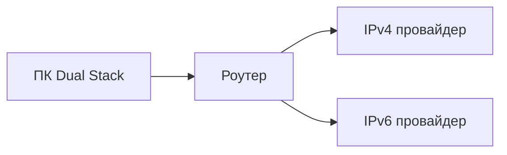

**6to4**, **Teredo** — туннели IPv6 через IPv4 (для учебного курса достаточно знать название).

### Задачи на IPv6

**Задача.** Почему одного IPv6 на квартиру может хватить всем устройствам?

**Ответ.** Пространство адресов огромно; провайдер выдаёт **префикс подсети** (/64), устройства получают адреса через **SLAAC** или DHCPv6.

---

## Файрвол — подробнее

**Межсетевой экран (firewall)** фильтрует пакеты по правилам: разрешить / запретить по IP, порту, протоколу.

| Тип | Где | Пример |
|-----|-----|--------|
| Программный | ОС, антивирус | Windows Defender Firewall |
| Аппаратный | Роутер | NAT + фильтр WAN |
| Корпоративный | Шлюз | Белые списки сайтов |

### Входящий и исходящий трафик

| Направление | Типичное правило дома |
|-------------|----------------------|
| Исходящий | Разрешён (браузер, игры) |
| Входящий | Запрещён, кроме проброса портов |

**Проброс портов (Port Forwarding)** — запрос из интернета на роутер направляется на конкретный ПК в LAN (игровой сервер, камера). Риск: открытая дыра — нужны сильные пароли и обновления.

### Stateful и Stateless

**Stateful** — помнит установленные соединения; ответ на ваш запрос из интернета пропускается автоматически. Современные файрволы ОС — stateful.

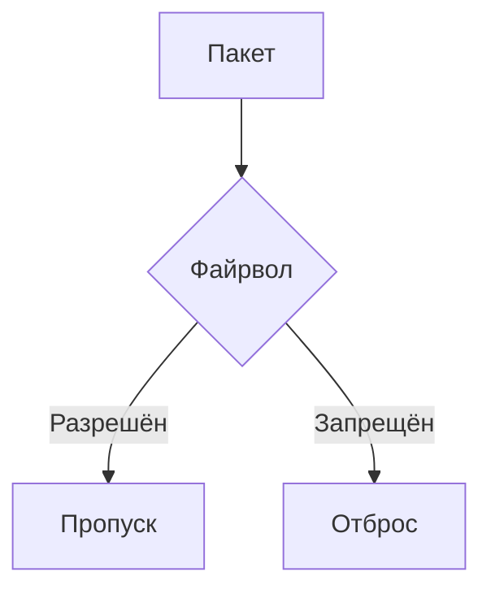

См. [Информационная безопасность](/encyclopedia/2-system-network/2-08-osnovy-informatsionnoy-bezopasnosti/1).

---

## Wi-Fi — стандарты и диагностика

| Стандарт | Частота | Маркетинговое имя |
|----------|---------|-------------------|
| 802.11n | 2,4 / 5 ГГц | Wi-Fi 4 |
| 802.11ac | 5 ГГц | Wi-Fi 5 |
| 802.11ax | 2,4 / 5 / 6 ГГц | Wi-Fi 6 |

| Проблема | Причина | Решение |
|----------|---------|---------|
| Слабый сигнал | Стены, расстояние | Ближе к роутеру, repeater |
| Помехи 2,4 ГГц | Соседние сети, микроволновка | Канал 1/6/11, перейти на 5 ГГц |
| "Подключено, нет интернета" | DNS, провайдер | `ipconfig`, перезагрузка роутера |
| Низкая скорость | Старый стандарт, QoS | Кабель Ethernet для теста |

---

## VPN и прокси

| | Прокси | VPN |
|---|--------|-----|
| Уровень | Часто приложение | Весь трафик ОС (туннель) |
| Шифрование | Не всегда | Обычно да |
| Применение | Обход локальных ограничений | Удалённая работа, приватность в Wi‑Fi |

<div class="callout callout--warning">
  <div class="callout-title">Миф о VPN</div>
  <div class="callout-body">VPN <strong>не делает</strong> вас полностью анонимным: провайдер VPN видит трафик; нужны также HTTPS и осторожность с аккаунтами.</div>
</div>

---

## CDN — доставка контента

**CDN** (Content Delivery Network) — копии статики сайта на серверах ближе к пользователю.

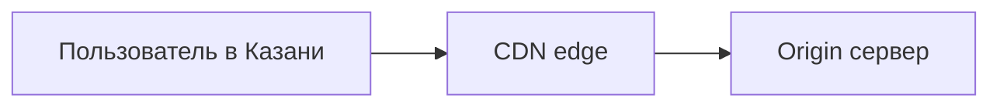

Меньше задержка для картинок и видео YouTube, Netflix.

---

## HTTP — методы и коды ответа

| Метод | Действие |
|-------|----------|
| GET | Получить ресурс |
| POST | Отправить данные (форма) |
| PUT / DELETE | Изменить / удалить (API) |

| Код | Значение |
|-----|----------|
| 200 | OK |
| 301 / 302 | Перенаправление |
| 404 | Не найдено |
| 500 | Ошибка сервера |

---

## HTTPS и TLS — цепочка доверия

1. Браузер запрашивает сертификат сервера.
2. Проверяет подпись **удостоверяющего центра (CA)**.
3. Устанавливает сеансовый ключ **TLS**.
4. Дальше трафик шифруется.

| Элемент | Роль |
|---------|------|
| Сертификат | Подтверждает домен |
| CA | Выдал сертификат |
| HSTS | Браузер запоминает, что сайт открывают только по HTTPS |

---

## DNS — типы записей (расширенная таблица)

| Тип | Назначение | Пример |
|-----|------------|--------|
| A | Домен → IPv4 | `example.com` → 93.184.216.34 |
| AAAA | Домен → IPv6 | `example.com` → 2606:2800:... |
| CNAME | Псевдоним | `www` → `example.com` |
| MX | Почтовый сервер | `mail.example.com` |
| TXT | Произвольный текст | SPF, верификация |
| NS | Серверы зоны | Делегирование домена |

### Рекурсивный и авторитативный DNS

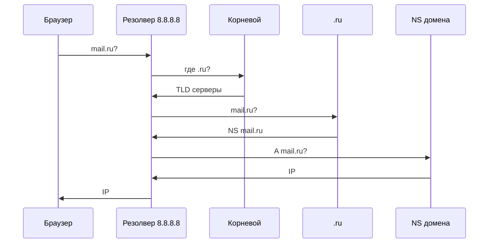

---

## Почта — SPF, DKIM, DMARC

| Механизм | Что проверяет |
|----------|---------------|
| SPF | С каких IP можно слать от имени домена |
| DKIM | Цифровая подпись письма |
| DMARC | Политика при провале SPF/DKIM |

Фишинг часто приходит с чужого домена — проверки помогают почтовому серверу отклонить подделку.

---

## Поисковые системы — как работает выдача (упрощённо)

1. **Краулер** обходит ссылки и индексирует страницы.
2. **Индекс** хранит слова и релевантность.
3. **Ранжирование** сортирует результаты по запросу.

| Оператор | Пример | Эффект |
|----------|--------|--------|
| `site:` | `site:wikipedia.org информатика` | Только на сайте |
| `intitle:` | `intitle:ОГЭ информатика` | Слово в заголовке |
| `..` | `2020..2024` | Диапазон чисел |

См. [Поиск информации](/encyclopedia/1-basics/1-21-poisk-informatsii/intro).

---

## Стриминг — техническая сторона

| | Прогрессивная загрузка | Адаптивный стрим (HLS/DASH) |
|---|------------------------|----------------------------|
| Качество | Фиксированное | Меняется с каналом |
| Буфер | Качает вперёд | Короткие сегменты .ts |
| Пример | Старый MP4 в браузере | YouTube, Netflix |

**Буферизация** — пауза при медленном канале; CDN снижает задержку.

---

## Интернет-магазин — безопасная покупка

| Шаг | Проверка |
|-----|----------|
| Адрес | `https://`, правильный домен |
| Оплата | 3-D Secure, SMS-код банка |
| Отзывы | Не только на сайте магазина |
| Доставка | Трек-номер, официальный курьер |

---

## Мессенджеры и VoIP

| | Мессенджер | VoIP |
|---|------------|------|
| Данные | Текст, файлы, иногда звонки | Голос по IP |
| Протоколы | Закрытые (Signal, Telegram) | SIP, WebRTC |
| Шифрование | End-to-end в части приложений | Зависит от сервиса |

См. [Коммуникация](/encyclopedia/1-basics/1-22-kommunikatsiya-i-obschenie/intro).

---

## Облако — модели обслуживания

| Модель | Что арендуете | Пример |
|--------|---------------|--------|
| IaaS | Виртуальные машины | VPS |
| PaaS | Платформа для приложений | Heroku |
| SaaS | Готовое приложение | Gmail, Google Docs |

Для школьника важнее **SaaS** — сервис через браузер.

---

## RSS и агрегаторы

1. Найти на сайте ссылку **RSS** или `/feed`.
2. Добавить URL в Feedly / Inoreader.
3. Читать заголовки без алгоритмической ленты соцсетей.

---

## Социальные сети — право и этика

| Тема | Рекомендация |
|------|--------------|
| Чужие фото | Согласие перед публикацией |
| Копипаст | Указывать источник |
| Дезинформация | Проверять через [поиск](/encyclopedia/1-basics/1-21-poisk-informatsii/intro) |
| Возрастные ограничения | Соблюдать правила платформы |

---

## Конфиденциальность — чек-лист

- [ ] Уникальные пароли + менеджер паролей
- [ ] 2FA на почте и облаке
- [ ] Минимум данных в публичном профиле
- [ ] VPN в публичном Wi‑Fi (опционально)
- [ ] Регулярные обновления ОС и браузера
- [ ] Не сохранять пароли в чужих браузерах

См. [Право и защита](./7).

---

## Создание сайта — путь новичка

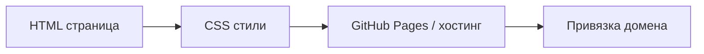

Статический сайт не требует сервера приложений — достаточно хостинга файлов.

---

## Диагностика — сценарии

### Сценарий A — нет интернета на одном устройстве

1. Другие устройства работают? → проблема **локально**.
2. `ipconfig` — есть ли IP?
3. Переподключить Wi‑Fi, забыть сеть.
4. Отключить VPN / прокси.

### Сценарий B — интернет пропал у всех

1. Индикаторы на роутере и модеме.
2. Перезагрузка **модем → роутер** (по очереди).
3. Звонок провайдеру при долгом сбое.

### Сценарий C — один сайт не открывается

1. `ping IP` сайта (если известен).
2. `nslookup` — DNS.
3. [downforeveryoneorjustme.com](https://downforeveryoneorjustme.com) — сбой у всех?

### Сценарий D — очень медленно

1. Speedtest по кабелю и по Wi‑Fi.
2. Фоновые загрузки, торренты.
3. Смена DNS редко ускоряет, но может помочь при сбое резолвера.

---

## Команды Windows и Linux — шпаргалка

| Задача | Windows | Linux |
|--------|---------|-------|
| IP-конфиг | `ipconfig /all` | `ip addr` |
| DNS-кэш | `ipconfig /flushdns` | `systemd-resolve --flush-caches` |
| Маршрут | `tracert` | `traceroute` |
| ARP-таблица | `arp -a` | `ip neigh` |
| Активные соединения | `netstat -an` | `ss -tuln` |

---

## Модель OSI и TCP/IP

| OSI (7) | TCP/IP (4) | Пример |
|---------|------------|--------|
| Прикладной | Прикладной | HTTP |
| Представления | ↑ | TLS (часто здесь) |
| Сеансовый | ↑ | — |
| Транспортный | Транспортный | TCP |
| Сетевой | Сетевой | IP |
| Канальный | Канальный | Ethernet |
| Физический | ↑ | Кабель, радио |

На ОГЭ часто достаточно **TCP/IP из 4 уровней**.

---

## Порты — дополнительные для справки

| Порт | Сервис |
|------|--------|
| 21 | FTP (устарел, небезопасен) |
| 22 | SSH |
| 23 | Telnet (небезопасен) |
| 25 | SMTP (без шифрования) |
| 53 | DNS |
| 80 | HTTP |
| 110 | POP3 |
| 143 | IMAP |
| 443 | HTTPS |
| 3389 | RDP (удалённый рабочий стол) |

---

## NAT — типы

| Тип | Описание |
|-----|----------|
| Static NAT | Один внутренний ↔ один внешний |
| Dynamic NAT | Пул внешних адресов |
| PAT / NAPT | Много LAN → один WAN (домашний роутер) |

---

## Задачи ЕГЭ/ОГЭ — расширенный банк

### Задача С-1

Перевести IP `11000000.10101000.00000001.00000101` в десятичный вид по октетам:

| Октет | Двоичный | Десятичный |
|-------|----------|------------|
| 1 | 11000000 | 192 |
| 2 | 10101000 | 168 |
| 3 | 00000001 | 1 |
| 4 | 00000101 | 5 |

**Ответ:** 192.168.1.5 — типичный **частный** адрес.

### Задача С-2

Сколько уровней в модели TCP/IP? **Четыре.**

### Задача С-3

Какой протокол использует DNS чаще всего? **UDP** на порту 53 (для больших ответов — TCP).

### Задача С-4

Пользователь видит предупреждение "Небезопасно" в Chrome. Что не так?

- нет действительного **TLS-сертификата**;
- или на странице смешанный HTTP-контент.

### Задача С-5

Чем **интернет** отличается от **веб**? Интернет — сеть; веб — сервис HTTP/HTML поверх неё.

### Задача С-6

Назовите три устройства домашней сети: **роутер**, **модем** (или ONT), **коммутатор** / точка доступа.

### Задача С-7

Зачем **кэш DNS** в браузере и ОС? Не спрашивать резолвер при каждом клике — ускорение.

### Задача С-8

Почему UDP в онлайн-играх? Низкая задержка важнее повторной доставки каждого пакета.

### Задача С-9

Что такое **фишинг**? Поддельный сайт/письмо для кражи учётных данных.

### Задача С-10

Перечислите поля URL: протокол, домен, путь, параметры, якорь.

---

## Таблица протокол, уровень, порт

| Протокол | Уровень TCP/IP | Порт | Надёжность |
|----------|----------------|------|------------|
| HTTP | Прикладной | 80 | TCP |
| HTTPS | Прикладной | 443 | TCP + TLS |
| DNS | Прикладной | 53 | UDP/TCP |
| TCP | Транспортный | — | Да |
| UDP | Транспортный | — | Нет |
| IP | Сетевой | — | Best effort |
| ICMP | Сетевой | — | ping |

---

## История интернета — вехи (кратко)

| Год | Событие |
|-----|---------|
| 1969 | ARPANET |
| 1983 | TCP/IP как стандарт |
| 1991 | WWW (Тим Бернерс-Ли) |
| 1990-е | Массовый доступ, браузеры |
| 2000-е | Соцсети, мобильный интернет |
| 2010-е+ | Облако, стриминг, IPv6 |

---

## Мобильный интернет — LTE и 5G

| | Wi‑Fi дома | Мобильная сеть |
|---|------------|----------------|
| Покрытие | Квартира / офис | Город, трасса |
| Тариф | Обычно безлимит | Лимит ГБ |
| Задержка | Низкая в LAN | Зависит от вышки |

Точка доступа с телефона — тот же **NAT**, раздача по Wi‑Fi.

---

## Блокировки и фильтрация (образовательный контекст)

| Уровень | Пример |
|---------|--------|
| DNS | Не резолвить домен |
| IP | Заблокировать адрес |
| DPI | Анализ содержимого пакетов |

В школе и дома обсуждайте **законность** и **безопасность**, не обход правил.

---


## Дополнение — протоколы и сервисы

### UDP и TCP — когда что выбрать

| Критерий | TCP | UDP |
|----------|-----|-----|
| Надёжность | Да | Нет |
| Порядок | Да | Не гарантирован |
| Скорость установки | 3-way handshake | Сразу |
| Примеры | HTTP, SSH | DNS, VoIP, игры |

---

### TCP handshake (упрощённо)

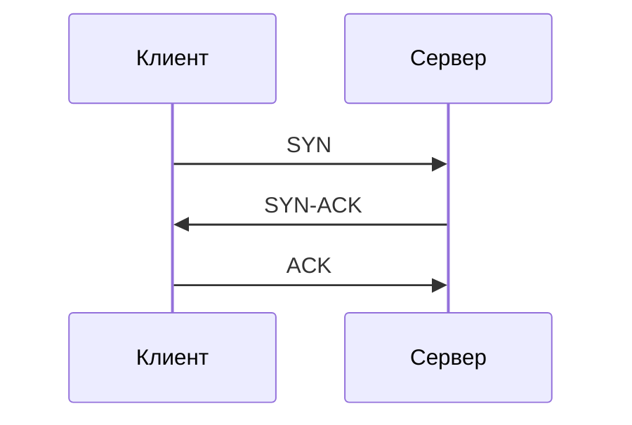

---

### ICMP и ping

**Echo Request** / **Echo Reply** — проверка доступности; TTL уменьшается на каждом маршрутизаторе.

---

### traceroute

Показывает **хопы** до цели; использует TTL и ICMP Time Exceeded.

---

### ipconfig — поля

IPv4 Address, Subnet Mask, Default Gateway, DNS Servers.

---

### Частные и публичные IP

| Тип | Пример | Маршрутизация в интернет |
|-----|--------|--------------------------|
| Частный | 192.168.1.5 | Через NAT |
| Публичный | 93.184.216.34 | Напрямую |

---

### Маска подсети

255.255.255.0 = /24 — 254 хоста в LAN (упрощённо).

---

### DHCP lease

Аренда IP на время; продление автоматическое.

---

### DNS TTL

Короткий TTL — чаще обновления при смене IP; длинный — меньше запросов.

---

### DNS over HTTPS (DoH)

DNS-запросы внутри HTTPS — приватность от провайдера (обзор).

---

### HTTP/2 и HTTP/3 (имена)

Мультиплексирование; HTTP/3 на базе QUIC/UDP.

---

### Cookies — типы

Session, Persistent, Secure, HttpOnly, SameSite.

---

### Сессия и токен на веб-сайте

Сессия хранится на сервере; **JWT** (JSON Web Token) — данные сессии в виде подписанного токена у клиента. В курсе базовой информатики достаточно понимать **cookie-сессию** в браузере.

---

### SMTP путь письма

Клиент → SMTP отправителя → MX получателя → IMAP/POP у получателя.

---

### Веб-почта безопасность

2FA, не открывать вложения, проверять домен отправителя.

---

### Облако — синхронный конфликт

Два офлайн-редактирования одного файла → две версии или конфликт-копия.

---

### Стриминг DASH

Видео нарезано на сегменты; плеер выбирает качество по скорости.

---

### E-commerce HTTPS

Платёжная форма только на `https://`; проверять домен.

---

### Соцсети — deepfake (упоминание)

Поддельное видео; не доверять слепо фразе "видел в сети".

---

### Мессенджер E2E

Шифрование на устройствах; сервер не читает (в идеальной модели).

---

### Wi-Fi WPA3

Улучшенное шифрование относительно WPA2.

---

### Роутер — функции

NAT, DHCP, DNS relay, firewall, Wi-Fi AP.

---

### Модем и роутер

Модем — связь с провайдером; роутер — сеть дома (часто 2 в 1).

---

### IPv6 SLAAC

Устройство само формирует адрес из префикса роутера.

---

### Firewall правило пример

"Разрешить исходящий TCP 443" — браузер работает.

---

### VPN split tunnel

Часть трафика в VPN, часть напрямую.

---

### CDN пример

Статика `cdn.example.com` ближе географически.

---

### Поиск — индекс инвертированный

Слово → список документов (упрощённо).

---

### RSS и алгоритмическая лента

RSS — хронология источника; соцсеть — ранжирование.

---

### Создание сайта — GitHub Pages

Репозиторий → Settings → Pages → публикация HTML.

---

### Задачи С-11 … С-25

| № | Вопрос | Ответ |
|---|--------|-------|
| С-11 | Порт SSH | 22 |
| С-12 | Протокол ping | ICMP |
| С-13 | ARP связывает | IP и MAC |
| С-14 | MX для | почты |
| С-15 | CNAME — | псевдоним |
| С-16 | HTTPS порт | 443 |
| С-17 | Dual Stack | v4+v6 |
| С-18 | Фишинг | обман |
| С-19 | Cookie | данные сайта |
| С-20 | Инкогнито | локальная история |
| С-21 | IMAP sync | да |
| С-22 | POP3 обычно | скачивает |
| С-23 | CDN | ближе сервер |
| С-24 | NAT PAT | много→один IP |
| С-25 | WWW протокол | HTTP |

---

### Диагностика — чек-лист 10 шагов

1. Кабель / Wi‑Fi подключён  
2. Иконка сети ОС  
3. ping шлюз  
4. ping 8.8.8.8  
5. nslookup  
6. другой браузер  
7. отключить VPN  
8. flushdns  
9. перезагрузка роутера  
10. провайдер  

---

### Mermaid — домашняя сеть

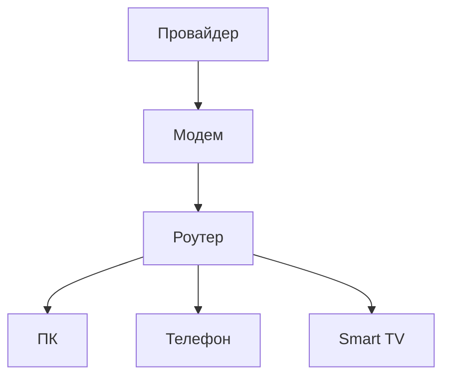

---

### Практикум 2 — сеть

| № | Команда/действие |
|---|------------------|
| 1 | ipconfig |
| 2 | ping шлюз |
| 3 | ping 8.8.8.8 |
| 4 | nslookup |
| 5 | tracert |
| 6 | открыть https:// и проверить сертификат |
| 7 | speedtest |

---

### Чек-лист экзамена по главе 6

- [ ] MAC и IP  
- [ ] DHCP  
- [ ] NAT  
- [ ] TCP и UDP  
- [ ] DNS записи A, MX  
- [ ] URL части  
- [ ] HTTPS  
- [ ] IPv6 зачем  
- [ ] Firewall  
- [ ] Команды ping, tracert  

---


## Службы интернета — углубление

### Веб-поиск

Робот обходит ссылки, строит индекс и ранжирует страницы. Операторы `site:`, кавычки и `-слово` уточняют запрос.

### Онлайн-карты и стриминг

Карты — тайлы + векторные дороги; стриминг — адаптивный битрейт и CDN.

### Интернет-магазин

Каталог на сервере, корзина, оплата по HTTPS и 3-D Secure.

---

## Безопасность Wi‑Fi

| Угроза | Защита |
|--------|--------|
| Подслушивание в кафе | HTTPS, VPN |
| Поддельная точка "Free_WiFi" | Не подключаться без доверия |
| Слабый пароль WPA2 | Длинная фраза, WPA3 |

---

## Сценарии диагностики — кейсы

| Симптом | Вероятная причина | Действие |
|---------|-------------------|----------|
| NXDOMAIN | Опечатка, сбой DNS | nslookup, смена DNS |
| Есть ping 8.8.8.8, нет сайтов | DNS | flushdns |
| Только один сайт не открывается | Сбой сервера | Проверить "у всех" |
| Сертификат недействителен | Просрочен / подделка | Не вводить пароль |
| Высокий ping вечером | Загрузка канала | Ethernet-тест |

---

## IPv6 — практика

Проверка: [test-ipv6.com](https://test-ipv6.com). Команда: `nslookup -type=AAAA домен`. **Dual Stack** — v4 и v6 параллельно.

---

## Файрвол — домашние правила

Запрет входящих по умолчанию; разрешение ответов на исходящие; проброс портов — только при необходимости.

---

## Задачи С-26 … С-45

| № | Вопрос | Ответ |
|---|--------|-------|
| С-26 | Протокол веб-страницы | HTTP(S) |
| С-27 | UDP в DNS | часто |
| С-28 | Шлюз по умолчанию | роутер |
| С-29 | 127.0.0.1 | localhost |
| С-30 | ::1 | IPv6 localhost |
| С-31 | SPF в DNS | TXT |
| С-32 | Stateful firewall | помнит сессии |
| С-33 | Стриминг и файл | поток не хранится целиком |
| С-34 | 3-D Secure | подтверждение банка |
| С-35 | RSS | XML |
| С-36 | Уровень HTTP | прикладной |
| С-37 | Порт DNS | 53 |
| С-38 | Транспорт HTTP | TCP |
| С-39 | Частный IP | 192.168.x.x |
| С-40 | tracert | маршрут |
| С-41 | HttpOnly cookie | не для JS |
| С-42 | HSTS | только HTTPS |
| С-43 | MX | почтовый сервер |
| С-44 | POP3 | скачивание |
| С-45 | IMAP | синхронизация |

---

## Электронная коммерция — цепочка заказа

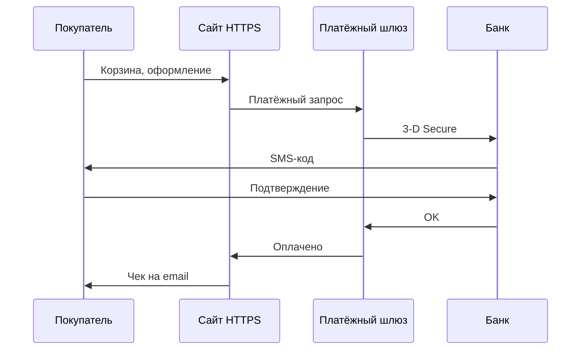

| Этап | Риск | Защита |
|------|------|--------|
| Ввод карты | Перехват | Только HTTPS |
| Подтверждение | Фишинг | Код только в приложении банка |
| Доставка | Поддельный курьер | Трек с официального сайта |

---

## Облачные офисы — Google Docs, Яндекс.Документы

| Возможность | Зачем |
|-------------|-------|
| Совместное редактирование | Проект в классе |
| История версий | Откат ошибки |
| Комментарии | Рецензирование |
| Общая ссылка | Раздача материала |

Файл физически на сервере провайдера; локальная копия — через синхронизацию или экспорт.

---

## Мессенджеры — сравнение моделей

| | Облачный чат | P2P (редко) |
|---|--------------|-------------|
| Хранение | На серверах | На устройствах |
| Синхронизация | Между телефоном и ПК | Сложнее |
| Модерация | Возможна | Минимальна |

**End-to-end encryption (E2E)** — сервер не читает текст; важно для приватности, но не отменяет осторожность с файлами и ссылками.

---

## VoIP и видеозвонки

| Протокол / технология | Где |
|----------------------|-----|
| WebRTC | Браузерные звонки |
| SIP | Корпоративная телефония |
| Закрытые протоколы | Zoom, Teams, Discord |

Качество зависит от **jitter**, **packet loss** и пропускной способности — UDP чаще предпочтительнее TCP для голоса в реальном времени.

---

## Игры онлайн — сеть

| Параметр | Влияние |
|----------|---------|
| Ping | Задержка до сервера матча |
| Потеря пакетов | Рывки, "телепорты" |
| NAT тип | Сложность peer-to-peer |

Проброс портов на роутере иногда нужен для хостинга игровой сессии.

---

## Пиринговые сети (обзор)

Устройства обмениваются данными напрямую без центрального сервера контента (файлообмен). Юридические и этические риски — только легальный контент.

---

## Хостинг и домены — базовые термины

| Термин | Смысл |
|--------|-------|
| Регистратор | Покупка домена `school-project.ru` |
| NS-серверы | Указывают, где DNS зоны |
| Хостинг | Сервер с файлами сайта |
| VPS | Виртуальный сервер с root-доступом |

Связь: домен → DNS A-запись → IP сервера → HTTP.

---

## robots.txt и sitemap.xml

- **robots.txt** — каким роботам можно обходить сайт.
- **sitemap.xml** — список URL для индексации.

Для учебного сайта на GitHub Pages обычно не критично.

---

## Кэш браузера и CDN — два уровня

| Уровень | Где | Что кэшируется |
|---------|-----|----------------|
| Браузер | ПК пользователя | CSS, картинки, JS |
| CDN | Сервер у провайдера | Копии статики ближе к пользователю |

Заголовок **Cache-Control** говорит, как долго хранить ответ.

---

## Сетевые атаки — термины для осведомлённости

| Термин | Суть | Защита |
|--------|------|--------|
| Фишинг | Поддельный сайт/письмо | Проверка URL, 2FA |
| DDoS | Перегрузка сервера запросами | На стороне провайдера/CDN |
| MITM | Перехват между клиентом и сервером | HTTPS, HSTS |
| Сниффинг | Прослушивание трафика | Шифрование, не использовать открытый Wi‑Fi без VPN |

Подробнее — [Информационная безопасность](/encyclopedia/2-system-network/2-08-osnovy-informatsionnoy-bezopasnosti/intro).

---

## Мобильная точка доступа

Телефон раздаёт интернет по Wi‑Fi или USB. Тот же **NAT**; расходуется мобильный трафик; батарея садится быстрее.

---

## Спутниковый интернет (Starlink и аналоги)

Высокая задержка (спутник далеко) по сравнению с оптикой; важен для удалённых регионов без кабеля.

---

## Задачи С-46 … С-55

| № | Вопрос | Краткий ответ |
|---|--------|---------------|
| С-46 | Что такое шлюз по умолчанию? | Обычно роутер |
| С-47 | Зачем MX в DNS? | Указать почтовый сервер |
| С-48 | Чем cookie отличается от session storage? | Cookie отправляются на сервер |
| С-49 | Порт IMAP с TLS | 993 |
| С-50 | Что делает HSTS? | Запоминает HTTPS для домена |
| С-51 | ARP на экзамене | IP → MAC в LAN |
| С-52 | Тип записи AAAA | IPv6 |
| С-53 | Зачем traceroute | Найти узкое место маршрута |
| С-54 | Роль коммутатора | Соединяет устройства в LAN |
| С-55 | WWW без интернета возможен? | Нет, нужна сеть |

---

## Сравнение браузерных движков — для любознательных

| Движок | Браузеры |
|--------|----------|
| Blink (Chromium) | Chrome, Edge, Opera, Яндекс |
| Gecko | Firefox |
| WebKit | Safari |

Сайты тестируют на кросс-браузерность — разная отрисовка CSS.

---

## Протокол QUIC и HTTP/3 (обзор)

**QUIC** работает поверх UDP, сокращает задержку установки соединения по сравнению с TCP+TLS. **HTTP/3** использует QUIC. На экзамене достаточно: "новое поколение веб-протоколов, быстрее на нестабильных сетях".

---

## Резолвер DNS на роутере

Роутер часто перенаправляет DNS-запросы на провайдера или на 8.8.8.8 — настраивается в веб-интерфейсе `192.168.1.1`.

---

## Файл hosts на ПК

`C:\Windows\System32\drivers\etc\hosts` — локальная таблица "имя → IP" без DNS. Используют разработчики для теста; вирусы иногда подменяют hosts для фишинга.

---

## Прокси-сервер в школе

Фильтрация сайтов по белому списку; HTTPS может требовать установки корневого сертификата школы — доверять только если это официальная политика учреждения.

---

## Электронный дневник и госуслуги

Веб-приложения с авторизацией по HTTPS; персональные данные — см. [Право](./7). Не передавать пароль третьим лицам.

---

## Потоковое радио и подкасты

| | Скачивание MP3 | Поток |
|---|----------------|-------|
| Файл на диске | Целиком | Часто нет |
| Прерывание | Продолжить с места | Буфер |

---

## Торренты (термин)

P2P-обмен частями файла; легален для открытого ПО с разрешения правообладателя; нелегален для пиратского контента.

---

## Сетевой экран Windows — профили

| Профиль | Когда |
|---------|-------|
| Частная сеть | Дом, доверенный Wi‑Fi |
| Публичная | Кафе, аэропорт |

В публичной сети блокируют входящие подключения.

---

## Задачи на разбор URL

**URL:** `https://shop.ru/catalog?id=5#top`

| Часть | Значение |
|-------|----------|
| Протокол | https |
| Домен | shop.ru |
| Путь | /catalog |
| Параметры | id=5 |
| Якорь | #top |

---

## Задачи на двоичный IP (повторение)

Октеты `11000000.10101000.00000001.00000101` → **192.168.1.5**.

---

## Сравнение IMAP и POP3 — таблица для экзамена

| | IMAP | POP3 |
|---|------|------|
| Письма на сервере | Остаются | Часто удаляются после скачивания |
| Несколько устройств | Удобно | Неудобно |
| Порт TLS | 993 | 995 |
| Синхронизация папок | Да | Нет |

---

## Безопасность облачных ссылок — сценарии

| Ошибка | Последствие |
|--------|-------------|
| Ссылка "для всех" на фото | Утечка |
| Нет срока действия | Вечный доступ |
| Пароль в чате | Перехват |

---

## Мессенджер в школе — правила

Не отправлять пароли, не публиковать чужие данные, скриншоты травли — доказательство для администрации.

---

## Проверка скорости интернета

**Speedtest** измеряет download/upload/ping. Сравнивайте с тарифом провайдера; Wi‑Fi обычно ниже кабеля.

---

## Домашняя сеть — типовая схема адресов

| Устройство | IP (пример) |
|------------|-------------|
| Роутер | 192.168.1.1 |
| ПК | 192.168.1.10 |
| Телефон | 192.168.1.20 |
| Принтер | 192.168.1.30 |

Выдаёт **DHCP** из пула, например 192.168.1.100–200.

---

## Задачи С-56 … С-65

| № | Вопрос | Ответ |
|---|--------|-------|
| С-56 | Протокол отправки почты | SMTP |
| С-57 | Чтение почты с синхронизацией | IMAP |
| С-58 | Защита веб-формы оплаты | HTTPS |
| С-59 | Проверка доступности узла | ping |
| С-60 | Расшифровка домена в IP | DNS |
| С-61 | Устройство NAT | Роутер |
| С-62 | Wi‑Fi 6 стандарт | 802.11ax |
| С-63 | Блокировка входящих | Файрвол |
| С-64 | Локальный адрес ПК | 127.0.0.1 |
| С-65 | Контейнер RSS | XML |

---

## Итоговая шпаргалка

**Путь:** URL → DNS → IP → TCP:порт → HTTP(S).  
**Дом:** DHCP, NAT, Wi‑Fi, роутер, файрвол.  
**Безопасность:** HTTPS, 2FA, осторожность с ссылками.  
**Диагностика:** ping, tracert, nslookup, ipconfig.

---

## Резюме главы

1. **Путь к сайту:** DNS → IP → TCP → HTTP(S).
2. **Диагностика:** ping шлюз → ping 8.8.8.8 → nslookup → браузер.
3. **Безопасность:** HTTPS, осторожность с ссылками, 2FA, настройки приватности.
4. **IPv6** дополняет IPv4; дома чаще Dual Stack.
5. **Файрвол** ограничивает нежелательный трафик.
6. Сервисы (почта, облако, поиск, стриминг) — прикладной уровень поверх TCP/IP.

<div class="callout callout--tip">
  <div class="callout-title">Итог</div>
  <div class="callout-body">Понимание <strong>имени → IP → порт → протокол</strong> связывает эту главу с [сетевым разделом](/encyclopedia/2-system-network/2-03-set-i-internet/intro) и практикой администрирования.</div>
</div>

---

## Вопросы итогового теста (20 пунктов)

1. MAC и IP  
2. Роль DHCP  
3. NAT  
4. TCP и UDP  
5. Порты 80 и 443  
6. Запись A в DNS  
7. MX для почты  
8. Что такое URL  
9. HTTPS и TLS  
10. Фишинг  
11. IMAP и POP3  
12. Зачем IPv6  
13. Stateful firewall  
14. Команда ping  
15. Wi‑Fi 6  
16. VPN (ограничения)  
17. CDN  
18. Cookie  
19. RSS  
20. 3-D Secure при оплате  

**Ключи:** см. разделы выше; для 20 — подтверждение платежа банком.

---

## Практикум за 45 минут

| № | Действие | Навык |
|---|----------|-------|
| 1 | `ipconfig /all` — записать шлюз и DNS | Конфигурация |
| 2 | `ping` шлюз и 8.8.8.8 | Диагностика |
| 3 | `nslookup ya.ru` | DNS |
| 4 | Открыть DevTools → Network при загрузке страницы | HTTP-запросы |
| 5 | Проверить сертификат HTTPS (замок) | TLS |
| 6 | test-ipv6.com | IPv6 |
| 7 | Настройки приватности одной соцсети | Безопасность |

---

## Связь с другими главами курса

| Глава | Связь |
|-------|-------|
| [3 — Железо](./3) | NIC, роутер, Wi‑Fi |
| [5 — ОС](./5) | Файрвол ОС, hosts |
| [7 — Право](./7) | Персональные данные в сети |
| [2-03 — Сеть](/encyclopedia/2-system-network/2-03-set-i-internet/intro) | Углубление |

---

## Быстрые ссылки

- [Как работают сайты](/encyclopedia/2-system-network/2-04-kak-rabotayut-sayty-i-veb-sayty/intro)
- [Терминал и сеть](/encyclopedia/2-system-network/2-05-terminal/101)
- [Интеграция](/encyclopedia/2-system-network/2-09-osnovy-integratsionnogo-vzaimodeystviya/117)

---

Дальше — [Право и защита информации](./7).

---

---
