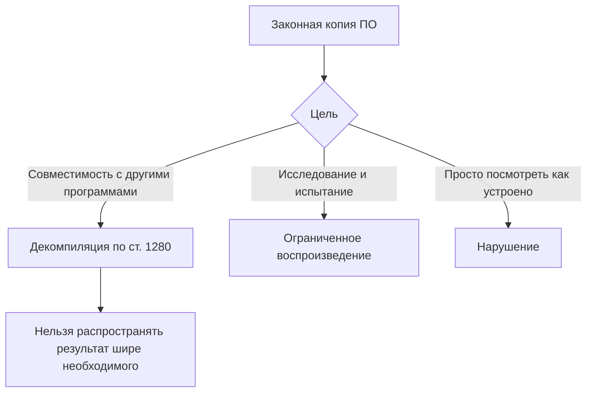
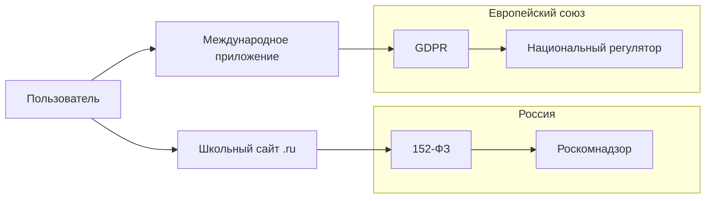
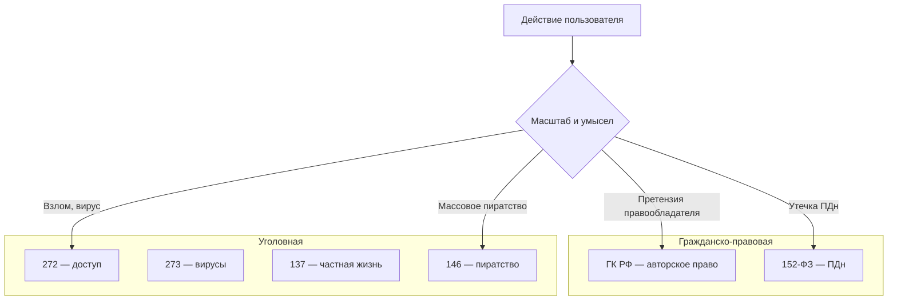
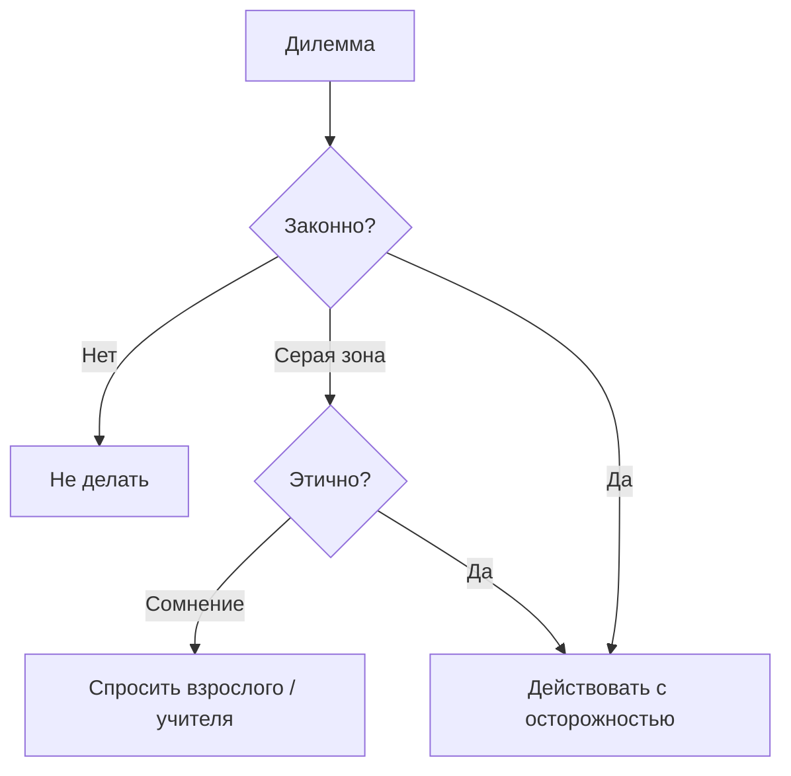
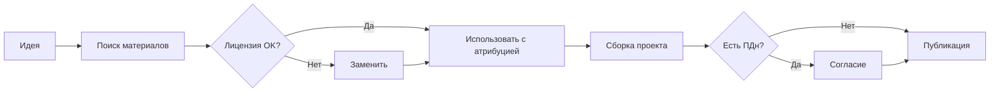
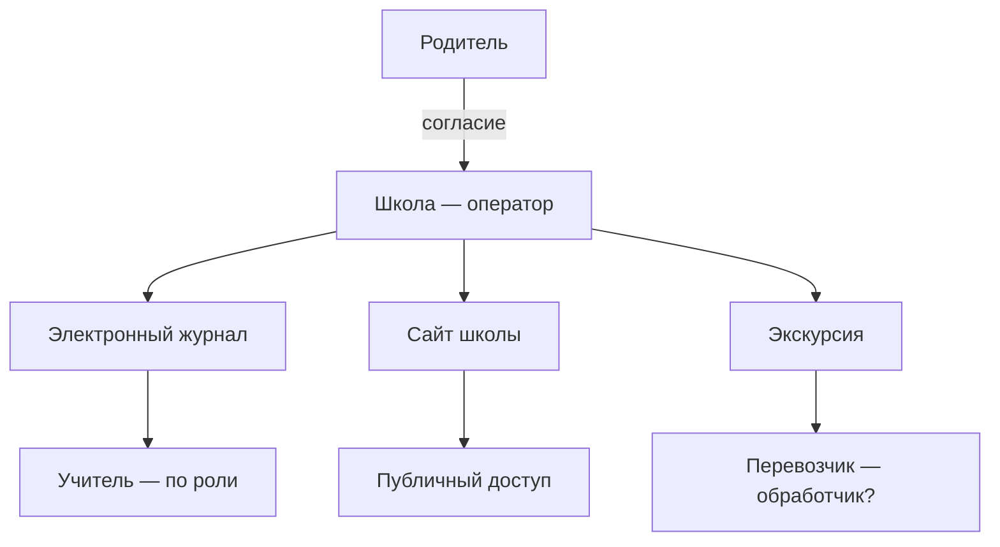
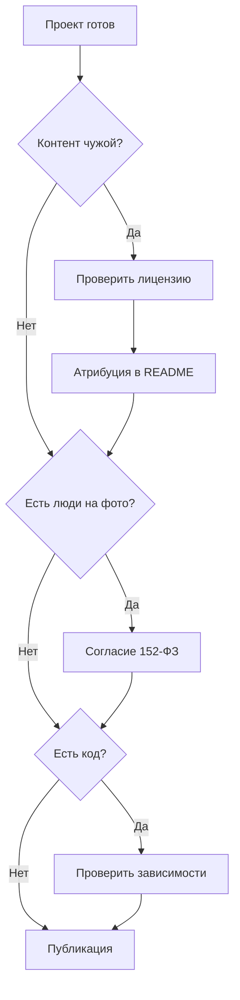
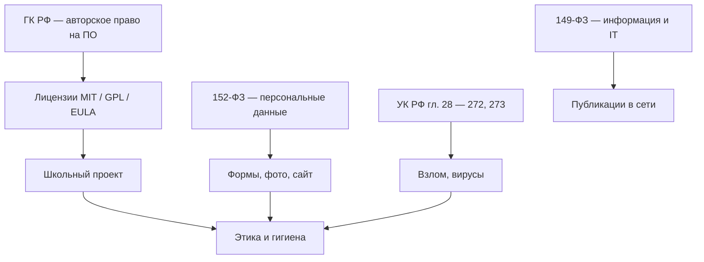

---
tags:
  - all
  - required
  - beginner
  - inprogress
title: Право и защита информации в РФ
description: >-
  Авторское право на программы, лицензии, персональные данные и основные статьи
  УК РФ о преступлениях в сфере компьютерной информации — вводный обзор.
related:
  - title: "Интернет и сетевые сервисы"
    doc: encyclopedia/1-basics/1-035-bazovaya-informatika/6
  - title: "Интеллектуальные права — о разделе"
    doc: encyclopedia/7-project/7-07-intellektualnye-prava/intro
  - title: "Основы информационной безопасности — о разделе"
    doc: encyclopedia/2-system-network/2-08-osnovy-informatsionnoy-bezopasnosti/intro
  - title: "Организация рабочего места"
    doc: encyclopedia/1-basics/1-035-bazovaya-informatika/8
---

import ExternalPlayEmbed from '@site/src/components/ExternalPlayEmbed';


# Право и защита информации в РФ

<div class="article-tags">
  <span class="tag tag-required">ОБЯЗАТЕЛЬНО</span>
  <span class="tag tag-beginner">ДЛЯ НОВИЧКОВ</span>
  <span class="tag tag-inprogress">В РАЗРАБОТКЕ</span>
</div>

<span class="complexity-badge">Всем</span>

<div class="callout callout--tip">
  <div class="callout-title">Важно</div>

  <div class="callout-body">
  Материал рассчитан на **школьный курс**. Спорные случаи уточняйте по официальным текстам законов и у юристов.

  Углубление для IT-профессии — раздел [Интеллектуальные права](/encyclopedia/7-project/7-07-intellektualnye-prava/intro).
</div>
  </div>

В школьной информатике обычно проходят:

- **программы как объект авторского права** — [ГК РФ](/encyclopedia/7-project/7-07-intellektualnye-prava/1);
- **лицензии** на ПО — [MIT, GPL](/encyclopedia/7-project/7-07-intellektualnye-prava/114) и другие;
- **ответственность за неправомерный доступ** — [УК РФ, гл. 28](#уголовная-ответственность-ук-рф--о-чём-говорят-на-уроке);
- **защиту персональных данных** — [152-ФЗ](#152-фз--персональные-данные--углублённый-обзор).

Ниже — карта тем с отсылкой к российскому законодательству, **примерами из жизни**, **разбором типовых экзаменационных вопросов** и **таблицами для заучивания**. Связанные главы: [интернет](./6), [безопасность](./112), [пароли](./113).

---

## Ключевые понятия и нормы

| Понятие | Суть | Где читать |
|---------|------|------------|
| **Программа для ЭВМ** | Объект авторского права (электронно-вычислительная машина — ЭВМ) | ГК РФ, ч. IV, [ст. 1261](/encyclopedia/7-project/7-07-intellektualnye-prava/1) |
| **База данных** | Отдельная охрана структуры и содержания | ГК РФ, ст. 1260, 1334 |
| **Лицензия** | Условия использования ПО — [GPL](/encyclopedia/7-project/7-07-intellektualnye-prava/114) (GNU General Public License), MIT, проприетарная | [Лицензирование](/encyclopedia/7-project/7-07-intellektualnye-prava/114) |
| **EULA** | End User License Agreement — пользовательское соглашение при установке | ниже |
| **Персональные данные (ПДн)** | Любая информация о конкретном человеке | [152-ФЗ](#152-фз--персональные-данные--углублённый-обзор) |
| **Неправомерный доступ** | Взлом, обход защиты, распространение вредоносного ПО | [УК РФ, гл. 28](#уголовная-ответственность-ук-рф--о-чём-говорят-на-уроке) |
| **149-ФЗ** | Федеральный закон "Об информации, информационных технологиях и о защите информации" — общие рамки IT | [ниже](#149-фз--информация-и-it-углубление) |
| **Оператор ПДн** | Организация, решающая цели и способы обработки ПДн | 152-ФЗ |

| Действие | Риск | Правило |
|----------|------|---------|
| "Взломанная" копия ПО | Нарушение авторских прав | Только легальные лицензии |
| Публикация чужого кода как своего | Плагиат, претензии | Указывать источник и лицензию |
| Сбор email/телефонов без согласия | 152-ФЗ | Согласие и политика обработки |
| Размещение чужих фото без разрешения | Авторское право | Согласие автора или лицензия |
| Подбор пароля к чужому аккаунту | ст. 272 УК РФ | Только свой аккаунт или разрешение |
| Отправка "шуточного" вируса другу | ст. 273 УК РФ | Не создавать и не распространять вредоносное ПО |

Углубление для IT — [Интеллектуальные права](/encyclopedia/7-project/7-07-intellektualnye-prava/intro).

---

## Программы для ЭВМ и базы данных

По **Гражданскому кодексу РФ** (часть IV):

- **Программа для ЭВМ** — объект авторского права (ст. 1259, 1261 ГК РФ).
- **База данных** — отдельная охрана (ст. 1260, 1334 ГК РФ).

Автор (или работодатель по договору) получает **исключительное право** — воспроизведение, распространение, переработка. Пользователь может работать с программой только **в рамках лицензии** — договора или текста "Пользовательское соглашение".

**Ст. 1280 ГК РФ** — **свободное воспроизведение** и **декомпиляция** программы **без согласия** правообладателя допустимы только в узких случаях (совместимость, исследование при законном владении копией). "Взлом ради интереса" под это не подпадает.

**Ст. 146 УК РФ** — уголовная ответственность за **нарушение авторских прав** при крупном ущербе (пиратские копии, массовое распространение).

В учебной практике действует простое правило: перед использованием материала из интернета проверяют **источник** и **лицензию** — см. [лицензирование ПО](/encyclopedia/7-project/7-07-intellektualnye-prava/114). Особенно важно, если код или материалы публикуются в проекте.

| Действие | Легально | Нелегально (пример) |
|----------|----------|---------------------|
| Установка купленной или бесплатной (open source) копии | ✅ | — |
| Использование по условиям GPL, MIT и др. | ✅ с соблюдением лицензии | — |
| "Взломанная" копия, ключ из интернета | — | ❌ нарушение авторских прав |
| Публикация чужого кода как своего | — | ❌ |
| Учебное копирование фрагмента с указанием источника | ✅ в рамках задания | — |
| Сдача чужой работы целиком | — | ❌ плагиат |

Подробнее — [Права интеллектуальной собственности в IT](/encyclopedia/7-project/7-07-intellektualnye-prava/1), [Лицензирование ПО](/encyclopedia/7-project/7-07-intellektualnye-prava/114).

---

### Кейс 1 — Школьный проект с картинками из Google

**Ситуация.** Ученик вставил в презентацию любые картинки из поиска без указания автора.

| Вопрос | Ответ |
|--------|-------|
| Это авторское право? | Да, изображение — объект авторского права |
| Что делать правильно? | Фильтр "свободная лицензия", сток с лицензией, свои фото, указание автора |
| Риск | Снятие работы с конкурса, претензия правообладателя |

---

### Кейс 2 — Курсовая с кодом с GitHub

**Ситуация.** Скопирован модуль под MIT без файла LICENSE в отчёте.

| Шаг | Действие |
|-----|----------|
| 1 | Сохранить текст лицензии MIT в проекте |
| 2 | В отчёте: ссылка на репозиторий, автор, лицензия |
| 3 | Если GPL — проверить, можно ли так использовать в закрытом задании |

---

### Кейс 3 — Игры и "репаки"

**Ситуация.** Одноклассник предлагает скачать игру с "взломанной" защитой.

| Факт | Объяснение |
|------|------------|
| Нарушение | Воспроизведение и обход защиты без согласия правообладателя |
| Риск для пользователя | Вирусы в репаках, ст. 146 УК РФ при масштабе |
| Альтернатива | Легальная распродажа, бесплатные игры, подписка |

---

## Лицензии на программное обеспечение

| Тип | Смысл | Примеры |
|-----|--------|---------|
| **Проприетарная** | Исходный код закрыт; копирование ограничено | Windows, Adobe, многие игры |
| **Свободная (open source)** | Можно использовать, изучать, иногда изменять | [Linux](/encyclopedia/2-system-network/2-02-platformy/intro), LibreOffice, Firefox |
| **Shareware** | Пробный период, потом оплата | Старые модели ПО |
| **Freeware** | Бесплатно, но условия в EULA | Многие утилиты |
| **Copyleft** | Производные работы — под той же лицензией | [GPL](/encyclopedia/7-project/7-07-intellektualnye-prava/114) |

**VS Code** — проприетарная сборка при открытых компонентах; смотрите лицензию конкретного продукта. **VSCodium** — сборка без телеметрии с другими условиями.

---

### Сравнение популярных open source лицензий

| Лицензия | Можно в закрытом проекте? | Обязанности | Школьный пример |
|----------|---------------------------|-------------|-----------------|
| **MIT** | Да | Сохранить LICENSE и копирайт | Библиотека в учебном Python-проекте |
| **Apache 2.0** | Да | LICENSE + NOTICE; патентная оговорка | Apache HTTP Server |
| **GPL v3** | Только если весь проект под GPL | Исходники при передаче бинарника | Нельзя встроить в закрытый exe без открытия кода |
| **LGPL** | Линковка из проприетарного при оговорках | Изменения библиотеки — под LGPL | DLL под LGPL в игре |
| **BSD** | Да | Похоже на MIT | Berkeley Software Distribution |
| **CC BY** (не ПО, но контент) | Указать автора | Реферат с иллюстрацией CC | Презентация |

**Пример.** Взяли библиотеку под GPL и встроили в коммерческое приложение без открытия исходников — нарушение. MIT-код в том же проекте — обычно достаточно файла LICENSE в репозитории.

---

### Таблица "что можно и нельзя" по лицензиям (упрощённо)

| Действие | MIT | GPL v3 | Проприетарная |
|----------|-----|--------|---------------|
| Читать исходники | ✅ | ✅ | ❌ обычно |
| Менять код | ✅ | ✅ | ❌ |
| Включить в закрытый проект | ✅ | ❌* | по EULA |
| Продавать копии | ✅ | ✅ с условиями | ❌ без права |
| Убрать имя автора | ❌ | ❌ | — |

\* Без открытия всего производного проекта.

**Пользовательское соглашение (EULA, End User License Agreement)** — правила при установке проприетарного ПО; "галочка" при установке имеет юридическое значение. Дети до 14 лет — согласие законного представителя ([ГК РФ](/encyclopedia/7-project/7-07-intellektualnye-prava/1)).

---

### Кейс 4 — Конфликт лицензий в одном репозитории

**Ситуация.** В проекте смешали MIT-модуль и GPL-библиотеку.

| Проверка | Результат |
|----------|-----------|
| Итоговая лицензия репозитория | Часто GPL "заражает" весь проект при статической линковке |
| Что сделать | Разделить модули, выбрать совместимые лицензии, проконсультироваться |

---

## Информация и персональные данные

**Федеральный закон № 149-ФЗ** "Об информации, информационных технологиях и о защите информации" — общие рамки правовой защиты информации и деятельности в сети. Закон регулирует отношения при **поиске, получении, передаче и распространении** информации, при **применении IT** и при **защите** данных; охрана результатов интеллектуальной деятельности в основном остаётся в ГК РФ.

| 149-ФЗ (обзор) | Содержание |
|----------------|------------|
| Информация | Правовой режим, ограничения (экстремизм, гостайна — отдельные законы) |
| IT | Использование технологий, электронный документ |
| Защита информации | Меры защиты, ответственность операторов |

**Федеральный закон № 152-ФЗ** "О персональных данных" — правила сбора и обработки данных, по которым можно идентифицировать человека:

| Принцип 152-ФЗ | Смысл для школьника |
|----------------|---------------------|
| Законность и справедливость | Не собирать "просто так" |
| Ограничение цели | Форма в школе — для учёта, не для рекламы |
| Минимизация | Только нужные поля (не паспорт, если достаточно ФИО) |
| Точность | Исправлять ошибки в анкете |
| Хранение | Не держать вечно без оснований |
| Безопасность | Пароли, доступ, не сливать в чат |
| Права субъекта | Узнать, что хранят; отозвать согласие |

- данные собирают **с целью** и **с согласия** (или иного законного основания);
- организация должна **защищать** ПДн от утечки;
- у субъекта есть права (уточнение, отзыв согласия и др.).

**ПДн** — любая информация, по которой можно определить человека — ФИО, паспорт, СНИЛС, телефон, email, фото лица, IP (в связке с другими данными), биометрия, история болезни, геолокация с трекера.

| Данные | ПДн? | Комментарий |
|--------|------|-------------|
| "Ученик 7Б сдал контрольную" без имени | Нет | Не идентифицирует |
| "Иванов Пётр, 7Б" | Да | Прямая идентификация |
| Номер телефона в объявлении | Да | Идентификатор |
| Обезличенная статистика посещений сайта | Обычно нет | Если нельзя восстановить личность |
| Никнейм + аватар + школа в профиле | Часто да | Может идентифицировать в совокупности |
| Запись голоса на диктофон | Да | Биометрия и идентификация по голосу |
| Список оценок с ФИО в Excel | Да | Специальная категория не всегда, но ПДн точно |

Школьный сайт с фото класса без согласия родителей — риск по 152-ФЗ; форма "подписать согласие на обработку ПДн" перед экскурсией — как раз законное основание.

---

### Таблица — законные основания обработки ПДн (упрощённо)

| Основание | Пример в школе |
|-----------|----------------|
| Согласие субъекта/родителя | Экскурсия, фото на сайт |
| Договор (образование) | Зачисление, журнал |
| Закон | Обязательная отчётность в ведомства |
| Жизненно важные интересы | Медпомощь на уроке |

---

### Кейс 5 — Google-форма без политики конфиденциальности

**Ситуация.** Ученик создал форму "Анкета класса" с полями ФИО, телефон, адрес и разослал ссылку.

| Ошибка | Почему |
|--------|--------|
| Сбор ПДн без цели и согласия | Нарушение 152-ФЗ |
| Хранение в личном аккаунте | Вы — оператор без мер защиты |
| Правильно | Согласие учителя/школы, минимум полей, не публиковать ссылку открыто |

---

### Кейс 6 — Утечка журнала в мессенджер

**Ситуация.** Скриншот электронного журнала с оценками одноклассников отправили в чат.

| Последствие | Категория |
|-------------|-----------|
| ПДн третьих лиц без согласия | Нарушение 152-ФЗ, этика |
| Возможна дисциплинарная ответственность | Школа |
| Уголовная — при злом умысле и масштабе | Реже, но возможна связка со ст. 137 |

---

### Интерактив — согласие, приватность и данные

Пройдите сценарии как пользователь и как владелец сервиса — это помогает увидеть зоны удобства и зоны юридического и этического риска.

<ExternalPlayEmbed example="basics/privacy-consent-play" title="Privacy Consent" />

После интерактива сформулируйте для себя три правила — какие данные вы готовы отдавать, когда нужно отдельное согласие, и что нельзя публиковать без разрешения.

---

## Уголовная ответственность (УК РФ) — о чём говорят на уроке

Глава 28 УК РФ "Преступления в сфере компьютерной информации" (основные статьи для обзора):

| Статья | Суть (упрощённо) | Бытовой пример |
|--------|------------------|----------------|
| **272** | Неправомерный **доступ** к компьютерной информации | Подбор пароля к чужой почте, вход в чужой аккаунт |
| **273** | Создание, распространение и использование **вредоносных программ** | Вирус в "приколе", ransomware, троян |
| **274** | Нарушение правил эксплуатации СХИ, **тяжкие последствия** | Крупный сбой из-за нарушения регламента |
| **274.1** | Воздействие на **КИИ** (критическую информационную инфраструктуру) | Атака на объекты критической инфраструктуры |

Дополнительно в курсе могут упоминать —

| Статья | Суть | IT-контекст |
|--------|------|-------------|
| **183 УК РФ** | Коммерческая тайна | Утечка исходников, базы клиентов |
| **137 УК РФ** | Неприкосновенность частной жизни | Публикация переписки, скрытая съёмка |
| **146 УК РФ** | Авторские права, крупный ущерб | Массовая пиратская раздача |
| **325 УК РФ** | Нарушение неприкосновенности тайны переписки | Взлом почты с разглашением |

В контексте цифровой среды ответственность может наступить не только за "сложный взлом", но и за более бытовые действия — подбор чужого пароля, передача вредоносного файла, распространение данных без согласия.

---

### Таблица — степень ответственности (обзор)

| Действие | Административное | Уголовное (при отягчающих) |
|----------|------------------|----------------------------|
| Пиратская копия для себя | Возможны гражданско-правовые претензии | ст. 146 при крупном ущербе |
| Взлом аккаунта одноклассника | — | ст. 272 |
| Рассылка вируса | — | ст. 273 |
| ПДн в публичном чате | 152-ФЗ, школа | ст. 137 при обстоятельствах |

<div class="callout callout--info">
  <div class="callout-title">Этика и закон</div>

  <div class="callout-body">
  "Я только посмотрел" или "друг попросил" не отменяет ответственность за взлом и распространение вирусов.

  Пентест и исследование безопасности проводят **только с письменного разрешения** владельца системы — см. [этику в ИБ](/encyclopedia/8-infra-security/8-07-informatsionnaya-bezopasnost/2).

  Для школьников — простым языком в [Основах безопасности](/encyclopedia/9-spinoff/9-11-dlya-detey/1-computer/13).
</div>
  </div>

---

## Справочник статей ГК РФ (часть IV) — для школьного курса

Ниже — **краткая карта статей**, которые чаще всего встречаются в учебниках и на экзаменах. Полный текст — на [pravo.gov.ru](https://pravo.gov.ru).

| Статья | Название (кратко) | Что запомнить для курса |
|--------|-------------------|-------------------------|
| **ст. 1225** | Исключительное право | Правообладатель решает, как использовать результат |
| **ст. 1259** | Объекты авторского права | Программы, тексты, музыка, фото — объекты |
| **ст. 1260** | База данных | Охрана подбора и систематизации материалов |
| **ст. 1261** | Программа для ЭВМ | **Главная** для IT: ПО = авторское право |
| **ст. 1270** | Исключительные права на ПО | Воспроизведение, распространение, переработка |
| **ст. 1280** | Свободное воспроизведение и декомпиляция | Узкие исключения: совместимость, исследование |
| **ст. 1286** | Свободное использование | Цитирование, учебные цели — с оговорками |
| **ст. 1334** | Право изготовителя БД | Инвестиции в создание базы |
| **ст. 146** | УК — нарушение авторских прав | Уголовная ответственность при крупном ущербе |

### Ст. 1261 ГК РФ — разбор для ученика

**Программа для ЭВМ** охраняется как **литературное произведение**. Это значит:

- автор (или правообладатель по договору) контролирует копирование;
- исходный код и объектный код — разные формы одного произведения;
- название, документация, интерфейс могут охраняться отдельно (текст, дизайн).

| Вопрос на уроке | Правильный ориентир |
|-----------------|---------------------|
| Кто владеет кодом, написанным учеником дома? | Обычно сам ученик (если не договор с заказчиком) |
| Кто владеет кодом, написанным на работе? | Работодатель — по трудовому договору |
| Можно ли декомпилировать чужую игру? | Только в случаях ст. 1280, не "из любопытства" |

### Ст. 1280 ГК РФ — когда декомпиляция допустима



| Условие ст. 1280 | Пояснение |
|------------------|-----------|
| Законное владение копией | Купили или получили по лицензии |
| Необходимость для совместимости | Нет другого способа получить сведения |
| Только нужные части | Не копировать всё ПО целиком |
| Не нарушать лицензию | EULA может дополнительно ограничивать |

---

## 152-ФЗ — персональные данные — углублённый обзор

**Федеральный закон № 152-ФЗ** от 27.07.2006 — основной закон о ПДн в России. Для школьника важны **определения**, **принципы** и **права человека**.

### Ключевые определения (ст. 3 152-ФЗ)

| Термин | Суть | Школьный пример |
|--------|------|-----------------|
| **Персональные данные** | Любая информация, относящаяся к прямо или косвенно определённому физлицу | ФИО, фото, телефон, email |
| **Обработка** | Любое действие: сбор, запись, хранение, передача, удаление | Внесение в журнал, публикация на сайте |
| **Оператор** | Кто определяет цели и способы обработки | Школа, Госуслуги, владелец формы |
| **Субъект ПДн** | Человек, о котором данные | Ученик, родитель |
| **Согласие** | Волеизъявление на обработку | Подпись родителя на фото |

### Принципы обработки (ст. 5 152-ФЗ)

| № | Принцип | Практика в школе |
|---|---------|------------------|
| 1 | Законность и справедливость | Не собирать данные "для прикола" |
| 2 | Ограничение конкретными целями | Анкета только для экскурсии, не для рекламы |
| 3 | Недопустимость объединения несовместимых баз | Не смешивать медданные с рассылкой |
| 4 | Соответствие целям объёма данных | Не просить паспорт, если достаточно ФИО |
| 5 | Точность, достаточность, актуальность | Исправить опечатку в фамилии |
| 6 | Хранение не дольше цели | Удалить анкету после поездки |
| 7 | Уничтожение по достижении целей | Старые списки — в шредер/безвозвратное удаление |

### Права субъекта (ст. 14–22 152-ФЗ, обзор)

| Право | Что может сделать ученик/родитель |
|-------|-----------------------------------|
| Получить сведения об обработке | Узнать, что школа хранит и зачем |
| Требовать уточнения | Исправить ошибку в данных |
| Требовать блокирования/уничтожения | При незаконной обработке |
| Отозвать согласие | Например, на публикацию фото |
| Обжаловать действия оператора | Роскомнадзор, суд |

### Специальные категории и биометрия (упоминание)

| Категория | Примеры | Для курса |
|-----------|---------|-----------|
| Расовая принадлежность, здоровье, судимость | Медсправки | Усиленная защита — в школе редко, но знать |
| **Биометрические ПДн** | Отпечаток, голос, лицо | Пропуск по Face ID — нужны основания |

---

## GDPR и 152-ФЗ — краткое сравнение

**GDPR** (General Data Protection Regulation) — регламент ЕС о защите данных. В России действует **152-ФЗ**. Принципы **похожи**; детали **различаются** — см. [основы ИБ](/encyclopedia/2-system-network/2-08-osnovy-informatsionnoy-bezopasnosti/intro).

| Аспект | GDPR (ЕС) | 152-ФЗ (РФ) |
|--------|-----------|-------------|
| **Территория** | ЕС + обработка данных граждан ЕС | РФ, локализация для ряда операторов |
| **Согласие** | Явное, отдельное, отзывное | Согласие + иные основания (договор, закон) |
| **Права субъекта** | Доступ, исправление, удаление ("право на забвение") | Аналогичный набор в ст. 14–21 |
| **DPO** | Data Protection Officer — обязателен при масштабе | Должность ответственного за организацию обработки ПДн |
| **Штрафы** | До 4% оборота или €20 млн | Административные штрафы по КоАП, уголовная — при злоупотреблении |
| **Дети** | С 16 лет (или ниже по закону страны) | Согласие законного представителя до 18 (общие правила) |
| **Уведомление об утечке** | Обязательно в срок | Уведомление Роскомнадзора — по правилам 152-ФЗ |

**Для школьника:** если сервис (соцсеть, игра) обрабатывает данные — смотрите **политику конфиденциальности** и **юрисдикцию**. Российская школа как оператор ориентируется на **152-ФЗ**; зарубежный сервис может ссылаться на GDPR.



---

## УК РФ — глава 28 и смежные статьи — справочник

### Ст. 272 УК РФ — неправомерный доступ

| Элемент | Содержание |
|---------|------------|
| Объект | Компьютерная информация, защищённая законом |
| Действие | Доступ без прав или с превышением прав |
| Примеры | Подбор пароля, эксплойт, вход под чужой учёткой |
| Квалификация | Зависит от последствий и умысла |

### Ст. 273 УК РФ — вредоносные программы

| Действие | Пример |
|----------|--------|
| Создание | Написание трояна "в шутку" |
| Использование | Запуск ransomware |
| Распространение | Ссылка на вирус в чате |

**Важно:** даже "безвредный" вирус, который только показывает окно, может попасть под ст. 273 при распространении.

### Ст. 274 и 274.1 УК РФ

| Статья | Фокус |
|--------|-------|
| **274** | Нарушение правил эксплуатации средств хранения/обработки — при тяжких последствиях |
| **274.1** | Неправомерное воздействие на **критическую информационную инфраструктуру (КИИ)** |

Для школьного курса КИИ — обзорно: больницы, энергетика, транспорт — атаки на них квалифицируются строже.

### Смежные статьи — таблица для зачёта

| Статья | Тема | Цифровой пример |
|--------|------|-----------------|
| **137** | Неприкосновенность частной жизни | Публикация интимных фото, скрытая съёмка |
| **138** | Тайна переписки | Чтение чужой почты без согласия |
| **146** | Нарушение авторских прав | Массовая раздача пиратских копий |
| **183** | Незаконные получение и разглашение коммерческой тайны | Утечка исходников работодателя |
| **325** | Нарушение тайны переписки | Взлом почты с разглашением |



---

## Расширенная таблица лицензий — MIT, GPL, проприетарная

| Критерий | **MIT** | **GPL v3** | **Проприетарная** |
|----------|---------|------------|-------------------|
| Исходный код | Открыт | Открыт | Закрыт |
| Коммерческое использование | ✅ | ✅ с условиями | По договору |
| Модификация | ✅ | ✅ | ❌ без права |
| Закрытый форк | ✅ | ❌ — copyleft | По EULA |
| Патентная оговорка | Нет (MIT) | Есть (GPLv3) | В договоре |
| Обязанность указать автора | ✅ | ✅ | — |
| Передача лицензии дальше | Сохранить текст MIT | Сохранить GPL | Запрещено |
| Типичный риск для ученика | Забыть LICENSE | Смешать с закрытым кодом | Пиратская копия |
| Примеры | React, jQuery | Linux kernel, GIMP | Windows, Photoshop |

### Дерево выбора лицензии для учебного проекта

```mermaid
flowchart TD
    Start[Учебный проект с чужим кодом] --> Q1{Откуда код?}
    Q1 -->|GitHub MIT| A1[Скопировать LICENSE, указать в отчёте]
    Q1 -->|GitHub GPL| Q2{Закрытый exe?}
    Q2 -->|Да| A2[Нельзя без открытия — выбрать другую библиотеку]
    Q2 -->|Весь проект открыт| A3[Весь проект под GPL]
    Q1 -->|Нет лицензии| A4[Считать "все права защищены" — не копировать]
    Q1 -->|Проприетарный SDK| A5[Читать EULA — часто нельзя публиковать]
```

### Кейс 9 — Хакатон с чужими библиотеками

**Ситуация.** Команда собрала мобильное приложение за 24 часа, подтянула 15 npm-пакетов, не проверила лицензии.

| Шаг | Действие |
|-----|----------|
| 1 | `npm ls` + проверка LICENSE каждого пакета |
| 2 | GPL-пакет в закрытом коммерческом продукте — заменить |
| 3 | В README перечислить зависимости и лицензии |
| 4 | Проприетарные шрифты/иконки — заменить на OFL / CC |

---

## Школьные сценарии — разбор по шагам

### Сценарий 1. Домашка — скопировать текст из Википедии

| Шаг | Правильно | Неправильно |
|-----|-----------|-------------|
| 1 | Проверить лицензию (CC BY-SA) | Вставить без ссылки |
| 2 | Указать источник и автора | Выдать за свой текст |
| 3 | При SA — учесть условия производного произведения | Игнорировать ShareAlike |

### Сценарий 2. Групповой чат класса — фото одноклассника-мем

| Норма | Комментарий |
|-------|-------------|
| 152-ФЗ | Фото = ПДн; нужно согласие |
| ст. 137 УК | При унижении и массовой публикации — риск |
| Этика | Согласие человека на кадре |

### Сценарий 3. Учебная лаборатория — общий логин на всех

| Риск | Решение |
|------|---------|
| Неправомерный доступ под чужим именем | Личные учётки |
| Утечка пароля | Смена пароля, не записывать на доске |
| Ответственность за чужие действия | Не передавать пароль |

### Сценарий 4. Онлайн-олимпиада — подсмотреть ответ соседа

| Аспект | Оценка |
|--------|--------|
| Право | Нарушение регламента, возможна дисквалификация |
| Этика | Нечестность, плагиат идеи |
| IT | Не ст. 272, если не взлом системы — но всё равно запрещено |

### Сценарий 5. Родитель просит "взломать" забытый пароль ребёнка

| Вариант | Законность |
|---------|------------|
| Восстановление через "Забыли пароль?" сервиса | ✅ |
| Подбор пароля к чужому аккаунту (не своему ребёнку без согласия платформы) | ❌ риск 272 |
| Обращение в поддержку с документами | ✅ |

### Сценарий 6. Школьный Telegram-канал с оценками

| Ошибка | Последствие |
|--------|-------------|
| Публикация списков с ФИО | 152-ФЗ, этика |
| Анонимные "топы" без ФИО | Меньше риска, но травля возможна |
| Правильно | Только официальные объявления администрации |

---

## Этические дилеммы для обсуждения в классе

| № | Дилемма | Аргументы "за" | Аргументы "против" | Ориентир |
|---|---------|----------------|-------------------|----------|
| 1 | Скачать пиратскую копию дорогого ПО "только для учёбы" | Доступ к образованию | Нарушение прав, риск вирусов | Легальные альтернативы (LibreOffice, и Code, student license) |
| 2 | Сообщить учителю о пиратском ПО на школьном ПК | Законность, безопасность | "Ябедничество" | Этика: защита школы и себя |
| 3 | Нашли уязвимость на школьном сайте — проверить без спроса | Любопытство, "white hat" | ст. 272, нет разрешения | Сообщить админу, не эксплуатировать |
| 4 | Друг дал пароль от стриминга | Экономия | Нарушение EULA, ответственность друга | Своя подписка или легальный контент |
| 5 | Опубликовать скриншот переписки как доказательство обиды | "Правда должна быть" | ПДн, ст. 137, травля | Обратиться к взрослому, не светить переписку |
| 6 | Использовать ИИ для написания курсовой целиком | Быстро | Плагиат, нет навыка | ИИ как помощник с указанием в отчёте (если разрешено) |
| 7 | Собрать анкету одноклассников "для статистики" | Интерес к анализу | Вы — оператор без 152-ФЗ | Согласие учителя, минимум данных |
| 8 | Удалить EXIF с фото перед публикацией чужого кадра | Меньше метаданных | Авторство и согласие всё равно нужны | Согласие + лицензия |



---

## Связь с ФГОС и школьной программой

Федеральный государственный образовательный стандарт (ФГОС) по **информатике** (приказы Минпросвещения) включает блоки, пересекающиеся с этой главой:

| Блок ФГОС (обобщённо) | Содержание главы 7 |
|-----------------------|-------------------|
| Информационная этика | Легальное ПО, уважение к труду |
| Правовые нормы работы с информацией | ГК РФ, 152-ФЗ, 149-ФЗ |
| Защита информации | ПДн, пароли, ответственность |
| Безопасность в цифровой среде | ст. 272–273, фишинг — связь с [112](./112) |

| Класс (ориентир) | Типичные темы права |
|------------------|---------------------|
| 7–8 | Авторское право, этика, вирусы |
| 9–10 | Лицензии, ПДн, основы 152-ФЗ |
| 10–11 | УК гл. 28, коммерческая тайна (обзор) |

**ОГЭ/ЕГЭ:** встречаются вопросы о лицензиях, видах прав, иногда — соответствие действий статьям (в бытовой формулировке).

---

## Дополнительные вопросы для экзамена и самопроверки

### Блок Д — ГК РФ и лицензии

**В16.** Какая статья ГК РФ называет программу для ЭВМ объектом авторского права?

*Ответ:* ст. 1261.

**В17.** Можно ли свободно копировать любую программу "для личного использования"?

*Ответ:* Нет, только в рамках лицензии или исключений закона (ст. 1280 и др.).

**В18.** Что такое copyleft?

*Ответ:* Условие лицензии (GPL), требующее открывать производные работы на тех же условиях.

**В19.** Чем Apache 2.0 отличается от MIT?

*Ответ:* Apache явно оговаривает патентные права и часто требует NOTICE.

**В20.** База данных одноклассников в Excel — объект какого права?

*Ответ:* Охрана структуры/содержания — ст. 1260, 1334 ГК РФ (обзорно).

### Блок Е — 152-ФЗ и GDPR

**В21.** Кто такой оператор персональных данных?

*Ответ:* Лицо, определяющее цели и способы обработки ПДн.

**В22.** Нужна ли политика обработки ПДн на школьном сайте?

*Ответ:* Да, у оператора (школы) должна быть документация по 152-ФЗ.

**В23.** Что общего у GDPR и 152-ФЗ?

*Ответ:* Принципы законности, ограничения цели, права субъекта, безопасность.

**В24.** Является ли IP-адрес персональными данными?

*Ответ:* Может быть, если позволяет идентифицировать человека в совокупности с другими данными.

### Блок Ж — УК и ситуации

**В25.** Чем ст. 272 отличается от ст. 273?

*Ответ:* 272 — доступ к информации; 273 — вредоносные программы.

**В26.** Шуточная программа, удаляющая все файлы на диске друга после запуска — какая статья?

*Ответ:* 273 УК РФ (создание/распространение вредоносных программ).

**В27.** Раздача торрентом коммерческого фильма — какие нормы?

*Ответ:* Гражданско-правовое нарушение; при крупном ущербе — ст. 146 УК.

**З4.** Опишите законный порядок использования фотографии с урока информатики на школьном сайте.

*Ориентир:* согласие родителей/ученика, политика 152-ФЗ, указание цели, срок хранения, право отозвать согласие.

**З5.** Сравните MIT и GPL для школьного проекта на GitHub.

*Ориентир:* MIT проще для закрытых учебных заданий; GPL требует открытости производных при распространении.

### Блок З — Самопроверка (да/нет)

| № | Утверждение | Ответ |
|---|-------------|-------|
| 1 | Исходный код без LICENSE на GitHub — можно брать свободно | ❌ Нет |
| 2 | Пароль от Wi-Fi школы можно продавать | ❌ Нет |
| 3 | Удаление чужого файла "за шутку" без последствий | ❌ Возможна ответственность |
| 4 | EULA — часть договора с пользователем | ✅ Да |
| 5 | Обезличенная статистика посещений — не всегда ПДн | ✅ Да |
| 6 | Декомпиляция любой игры для обучения всегда законна | ❌ Нет |
| 7 | Роскомнадзор контролирует 152-ФЗ | ✅ Да (обзорно) |
| 8 | GDPR действует в России напрямую | ❌ Нет, но на зарубежные сервисы — может |

---

## Кейсы из практики (обобщённые)

### Кейс 10 — Утечка базы клиентов стажёром

**Ситуация.** Стажёр скопировал CSV с email на флешку и ушёл в другую компанию.

| Норма | Применение |
|-------|------------|
| 152-ФЗ | ПДн клиентов |
| ст. 183 УК | Коммерческая тайна |
| Трудовой договор | Ответственность, NDA |

**Урок для школьника:** на практике в IT — не копировать базы "на всякий случай".

### Кейс 11 — Ransomware в муниципальной сети

**Ситуация.** Сотрудник открыл вложение, зашифровались файлы отдела.

| Связь с курсом | ст. 273, [112](./112) — фишинг, бэкапы |
|----------------|------------------------------------------|

### Кейс 12 — Open source в госпроекте

**Ситуация.** Госзаказчик потребовал открыть код, написанный на базе GPL-библиотеки.

| Вывод | GPL совместим с требованием открытости; проприетарные вставки — конфликт |

---

### Кейс 7 — "Я узнал пароль и зашёл посмотреть"

**Ситуация.** Друг оставил открытую сессию; другой ученик зашёл и прочитал переписку.

| Вопрос экзамена | Ответ |
|-----------------|-------|
| Это неправомерный доступ? | Да, если нет разрешения владельца |
| Статья УК? | **272** (обзорно) |
| Этично? | Нет, даже "без вреда" |

---

### Кейс 8 — Файл "crack.exe" в школьном чате

**Ситуация.** Одноклассник скинул "активатор" Windows.

| Риск | Объяснение |
|------|------------|
| Вредоносное ПО | Часто трояны под видом кряков |
| ст. 273 | Распространение вредоносных программ |
| Правильно | Сообщить учителю, не запускать |

---

## 149-ФЗ — информация и IT (углубление)

**Федеральный закон № 149-ФЗ** задаёт общие рамки для цифровой среды в России.

| Раздел закона | Содержание для курса |
|---------------|---------------------|
| Общие положения | Правовой режим информации |
| Информационные технологии | Использование IT, электронный документ |
| Защита информации | Меры защиты, ответственность |
| Ограничения | Запрещённый контент — отдельные законы |

| Вопрос | 149-ФЗ | 152-ФЗ |
|--------|--------|--------|
| О чём | Информация в целом, IT | Персональные данные |
| Кого касается | Все участники сети | Операторы ПДн |
| Школьный пример | Публикация в школьном блоге | ФИО ученика в той же публикации |

### Электронный документ и электронная подпись (обзор)

| Понятие | Смысл |
|---------|-------|
| Электронный документ | Информация в электронной форме |
| Простая ЭП | Логин-пароль, код из SMS |
| Усиленная ЭП | Квалифицированный сертификат (Госуслуги, ЭДО) |

Подпись согласия родителя на обработку ПДн в электронном журнале — пример легитимного электронного документооборота в школе.

---

## Авторское право на контент (не только ПО)

| Объект | Статья ГК | Школьный пример |
|--------|-----------|-----------------|
| Текст реферата | ст. 1259 | Копирование с Реферат.ру |
| Фотография | ст. 1259 | Картинки в презентации |
| Музыка | ст. 1259 | Фон в видеоролике |
| Видео | ст. 1259 | Фрагмент фильма в проекте |
| Программа | ст. 1261 | Код с GitHub |
| База данных | ст. 1260 | Таблица контактов класса |

### Creative Commons — лицензии на контент

| Лицензия | Можно | Нужно |
|----------|-------|-------|
| **CC BY** | Использовать с указанием автора | Имя, ссылка |
| **CC BY-SA** | Как BY + производные под SA | То же + ShareAlike |
| **CC BY-NC** | Некоммерческое использование | Не продавать |
| **CC0** | Почти общественное достояние | Желательно указать источник |

Википедия — **CC BY-SA**; многие стоки — **CC0** или платные.

### Кейс 13 — Видеоролик с музыкой из TikTok

**Ситуация.** Для школьного конкурса взяли популярный трек без разрешения.

| Проблема | Решение |
|----------|---------|
| Авторское право на музыку | Библиотека без авторских отчислений (YouTube Audio Library) |
| Лицензия платформы | Условия TikTok не равны праву на конкурс |
| Правильно | Оригинальная музыка или лицензированный трек |

---

## Ответственность несовершеннолетних — обзор

| Возраст | Гражданская | Уголовная (общий ориентир) |
|---------|-------------|----------------------------|
| До 14 лет | Через родителей | Не подлежит (с исключениями по тяжести — редко в IT) |
| 14–16 | Частичная | Ограниченный перечень |
| 16–18 | Расширенная | Большинство статей с смягчением |
| 18+ | Полная | Полная |

**Для курса:** возраст не отменяет **школьную дисциплину** и **гражданско-правовые претензии** к родителям.

| Действие ученика 13 лет | Последствия |
|-------------------------|-------------|
| Пиратская копия игры | Претензия правообладателя родителям |
| Взлом аккаунта | ст. 272 возможна с учётом возраста |
| Публикация фото без согласия | 152-ФЗ, школа, этика |

---

## Цифровые следы и метаданные

| Метаданные | Риск | Действие |
|------------|------|----------|
| EXIF в фото (GPS, модель) | Утечка места съёмки | Удалить перед публикацией |
| Имя автора в PDF | Идентификация | Проверить перед сдачей |
| История версий в Google Docs | Виден чужой вклад | Права доступа |

**152-ФЗ:** метаданные, позволяющие идентифицировать человека, могут быть ПДн.

---

## Международный контекст — кратко

| Регион | Основной акт | Заметка |
|--------|--------------|---------|
| Россия | 152-ФЗ, ГК ч. IV | Локализация ПДн для ряда операторов |
| ЕС | GDPR | Экстерриториальность для граждан ЕС |
| США | Разрозненные законы штатов (CCPA и др.) | Нет единого федерального GDPR |
| Китай | PIPL | Схожие принципы согласия |

Школьнику достаточно: **российская школа** → 152-ФЗ; **зарубежный сервис** → читать privacy policy.

---

## Дополнительные mermaid-схемы

### Жизненный цикл учебного проекта с правом



### ПДн в школе — поток данных



---

## Ещё 15 вопросов для самопроверки

| № | Вопрос | Краткий ответ |
|---|--------|---------------|
| 28 | Что такое исключительное право? | Право распоряжаться объектом |
| 29 | LGPL и GPL — в чём разница? | LGPL мягче для линковки |
| 30 | Можно ли фото лица без согласия на улице? | Зависит от цели публикации |
| 31 | Что такое обработчик ПДн? | Действует по поручению оператора |
| 32 | ст. 274.1 — про что? | КИИ |
| 33 | EULA и закон — что сильнее? | Закон; EULA не может отменять императивные нормы |
| 34 | Shareware — это open source? | Нет, обычно проприетарная модель |
| 35 | Плагиат кода и нарушение авторских прав — одно? | Связано, но плагиат шире (этика, учёба) |
| 36 | Можно ли сканировать QR неизвестного происхождения? | Осторожно — фишинг |
| 37 | Роскомнадзор и ПДн | Уполномоченный орган по 152-ФЗ |
| 38 | Право на забвение в РФ | Уничтожение/блокирование по 152-ФЗ |
| 39 | Коммерческая тайна и авторское право | Разные режимы |
| 40 | Что такое форензика? | Расследование инцидентов (для справки) |
| 41 | Bug bounty легален? | Да, по правилам программы |
| 42 | Можно ли писать бота для автоматизации своего аккаунта? | Смотреть ToS сервиса |

---

## Рабочий лист для класса (шаблон)

**Задание 1.** Заполните таблицу для трёх программ на вашем ПК:

| Программа | Проприетарная или свободная | Где видели лицензию |
|-----------|---------------------------|---------------------|
| | | |
| | | |
| | | |

**Задание 2.** Ситуация: одноклассник создал опрос "кто кого любит" с ФИО. Укажите нарушенные нормы и три шага исправления.

**Задание 3.** Сопоставьте статьи: 272, 273, 146, 137 — с четырьмя бытовыми примерами.

**Задание 4.** Сравните MIT и проприетарную лицензию по пяти критериям из таблицы выше.

---

## Частые мифы о праве в IT

| Миф | Реальность |
|-----|------------|
| "Из интернета — значит бесплатно" | Нужна лицензия |
| "Некоммерческое — значит можно всё" | CC BY-NC не разрешает коммерцию, но не отменяет другие ограничения |
| "Удалил — значит не было" | Цифровые следы, бэкапы, скриншоты |
| "Анонимный аккаунт — не найдут" | Технически и юридически идентификация возможна |
| "Друг разрешил — можно взломать" | Нужно разрешение владельца системы |
| "Школа не оператор ПДн" | Школа обрабатывает ПДн учеников |
| "GDPR не касается меня" | Касается при использовании EU-сервисов |

---

## Пошаговый алгоритм проверки проекта перед публикацией

| Шаг | Проверка | Инструмент / действие |
|-----|----------|----------------------|
| 1 | Все изображения — лицензия или своё | Поиск "license", сток, EXIF |
| 2 | Музыка и шрифты | OFL, CC, купленная лицензия |
| 3 | Код — LICENSE в репозитории | Файлы LICENSE, README |
| 4 | Зависимости npm/pip | `license-checker`, список в README |
| 5 | Нет чужих ПДн в CSV/скриншотах | Ручной просмотр |
| 6 | Согласия на фото людей | Письменное или электронное |
| 7 | Политика конфиденциальности формы | Текст под формой |
| 8 | README с атрибуцией | Ссылки на источники |



---

## Исторические примеры (для мотивации, не для экзамена)

| Событие | Урок |
|---------|------|
| Первые суды за вирусы Morris worm (1988, США) | "Шутка" в сети имеет последствия |
| Napster и пиратство музыки (2000-е) | Массовое копирование — иски |
| GDPR с 2018 | Усиление защиты данных в мире |
| Штрафы за утечки ПДн в РФ | 152-ФЗ работает на практике |

---

## Сводная шпаргалка на одну страницу (конспект)

**ГК:** ПО = ст. 1261; БД = 1260; декомпиляция = 1280 узко.

**Лицензии:** MIT — свободно с копирайтом; GPL — copyleft; проприетарная — EULA.

**152-ФЗ:** ПДн, оператор, согласие, минимизация, права субъекта.

**149-ФЗ:** информация и IT в целом.

**УК:** 272 доступ; 273 вирусы; 137 частная жизнь; 146 пиратство.

**GDPR:** похожие принципы, другая юрисдикция.

**Этика:** согласие, атрибуция, не взламывать, не сливать.

---

## Перекрёстные ссылки по курсу "Базовая информатика"

| Тема главы 7 | Связанные главы |
|--------------|-----------------|
| Пароли и взлом | [113](./113), [112](./112) |
| Фишинг и вирусы | [112](./112) |
| Публикации в сети | [6](./6) |
| Исходный код в проекте | [4](./4), [9](./9) |
| Эргономика и здоровье | [8](./8) |
| Чек-лист экзамена | [99](./99) |
| Юридическое углубление | [Интеллектуальные права](/encyclopedia/7-project/7-07-intellektualnye-prava/intro) |

После главы 7 рекомендуется пройти вопросы **12–14, 19, 20** в [чек-листе](./99) и обсудить **одну этическую дилемму** в классе или с родителями.

### Мини-кейсы для устного опроса (1 минута на кейс)

| № | Ситуация | Ожидаемый ответ (ключевые слова) |
|---|----------|----------------------------------|
| A | Скачали фильм с торрента | Авторское право, ст. 146, вирусы |
| B | Опрос "рост и вес" в чате класса | 152-ФЗ, согласие, минимизация |
| C | Подсмотрели пароль в дневнике | 272, этика |
| D | Форкнули MIT-проект без LICENSE | Нарушение условий MIT |
| E | Бот обошёл капчу чужого сайта | 272, нет разрешения |
| F | Родители подписали согласие на фото | Законное основание 152-ФЗ |
| G | Использовали GPL-библиотеку в .exe без исходников | Нарушение GPL |
| H | Удалили EXIF перед публикацией чужого фото | Недостаточно — нужно согласие автора |

---

## Коммерческая тайна и исходный код

Коммерческая тайна — режим для сведений, которые приносят компании выгоду, если они неизвестны конкурентам (алгоритмы, клиентская база, исходники при закрытой модели). Требуются **NDA**, приказы, ограничение доступа.

| Элемент режима | Содержание |
|----------------|------------|
| Режим конфиденциальности | Приказ, гриф, доступ по списку |
| NDA | Договор о неразглашении |
| Исходный код закрытого ПО | Часто коммерческая тайна |

Обзор — [Коммерческая тайна и защита исходного кода](/encyclopedia/7-project/7-07-intellektualnye-prava/111).

---

## Цифровая гигиена — свод правил

| № | Правило |
|---|---------|
| 1 | Легальное ПО и контент с проверкой лицензии |
| 2 | Не публиковать чужие ПДн и переписку |
| 3 | Сильные пароли / passkeys — [113](/encyclopedia/1-basics/1-035-bazovaya-informatika/113) |
| 4 | Не открывать подозрительные вложения |
| 5 | Указывать авторов при заимствовании кода и картинок |
| 6 | Согласие перед сбором данных в формах |
| 7 | Не взламывать чужие аккаунты "из интереса" |

---

## Вопросы и ответы для школьного экзамена

### Блок А — Авторское право и лицензии

**В1.** Программа для ЭВМ — объект какого права?

*Ответ:* Авторского права (ГК РФ, ч. IV, ст. 1261).

**В2.** Чем отличается проприетарная лицензия от свободной?

*Ответ:* Проприетарная ограничивает копирование и доступ к исходникам; свободная (open source) даёт права на использование и изучение на условиях лицензии (MIT, GPL…).

**В3.** Можно ли вставить GPL-код в закрытый коммерческий продукт без открытия исходников?

*Ответ:* Нет, GPL требует copyleft при распространении производного ПО.

**В4.** Что такое EULA?

*Ответ:* Пользовательское соглашение — условия использования ПО при установке.

**В5.** Что такое плагиат в программировании?

*Ответ:* Выдача чужого кода или работы за свою без указания источника.

---

### Блок Б — Персональные данные

**В6.** Что регулирует 152-ФЗ?

*Ответ:* Обработку персональных данных — сбор, хранение, использование, защита, права субъекта.

**В7.** Является ли номер телефона персональными данными?

*Ответ:* Да.

**В8.** Нужно ли согласие родителей на фото ребёнка на сайте школы?

*Ответ:* Да, как правило, это обработка ПДн ребёнка.

**В9.** Назовите два права субъекта персональных данных.

*Ответ:* Например: получить сведения об обработке; потребовать уточнения; отозвать согласие.

**В10.** Чем 149-ФЗ отличается от 152-ФЗ?

*Ответ:* 149-ФЗ — общие рамки информации и IT; 152-ФЗ — специально о персональных данных.

---

### Блок В — УК РФ

**В11.** О чём статья 272 УК РФ?

*Ответ:* О неправомерном доступе к компьютерной информации.

**В12.** О чём статья 273 УК РФ?

*Ответ:* О создании, использовании и распространении вредоносных компьютерных программ.

**В13.** Подбор пароля к чужому аккаунту без разрешения — какая статья (обзорно)?

*Ответ:* 272 УК РФ.

**В14.** Можно ли тестировать безопасность школьного сервера без разрешения?

*Ответ:* Нет; только с письменного разрешения администрации.

**В15.** "Друг попросил" — отменяет ли ответственность за взлом?

*Ответ:* Нет, если нет законного основания и разрешения владельца системы.

---

### Блок Г — Ситуации (развёрнутый ответ)

**З1.** Одноклассник выложил в соцсеть скриншот вашей переписки. Какие нормы затронуты?

*Ориентир ответа:* ПДн, неприкосновенность частной жизни (ст. 137), этика; возможна жалоба, обращение к школьному психологу/администрации.

**З2.** Вы нашли на GitHub проект под MIT. Что нужно сделать, чтобы легально использовать код в учебной работе?

*Ориентир:* Сохранить лицензию, указать авторство в отчёте, соблюдать условия MIT.

**З3.** Учитель раздал форму на экскурсию с полями ФИО и паспорт. Законно ли?

*Ориентир:* Возможно при законном основании (экскурсия), но паспорт — избыточно, если достаточно меньше данных; нужна политика и согласие.

---

## Схема связей тем



---

## Что запомнить для экзамена

- Программа = объект **авторского права**; копирование без права — нарушение.
- **Лицензия** определяет, что можно делать с ПО.
- **Персональные данные** регулируются 152-ФЗ.
- **272–273 УК РФ** — доступ без права и вредоносные программы.
- Знание закона дополняет **этику** — уважение к чужому труду и приватности.

| Минимум для зачёта | Расширение |
|--------------------|------------|
| ст. 1261 ГК, лицензия, 152-ФЗ, 272, 273 | 149-ФЗ, 1280 ГК, GPL и MIT, кейсы |

<div class="callout callout--tip">
  <div class="callout-title">Практика цифровой гигиены</div>

  <div class="callout-body">
  Перед публикацией проекта проверьте три пункта — легальные ли изображения/шрифты, нет ли в репозитории чужих персональных данных, соблюдены ли лицензии библиотек. Это простое действие резко снижает юридические риски.
</div>
  </div>

Самопроверка — [Чек-лист](/encyclopedia/1-basics/1-035-bazovaya-informatika/99) (вопросы 12–14, 19, 20).

---

## Практикум для учителя — 45 минут

| Мин | Активность | Материал |
|-----|------------|----------|
| 0–5 | Опрос: "что можно скачать из интернета?" | Таблица "действие — риск" |
| 5–15 | Разбор кейса 1–3 | Презентация, картинки |
| 15–25 | Таблица MIT и GPL — заполнить пропуски | Рабочий лист |
| 25–35 | Дилемма 3 или 5 — дискуссия в парах | Раздел этических дилемм |
| 35–40 | 5 вопросов блока В — устно | Экзаменационные вопросы |
| 40–45 | Домашнее: прочитать [112](./112), ответить на В6–В10 | Самопроверка |

---

## Матрица "действие — норма — последствие"

| Действие | Гражданское право | Административное | Уголовное (при отягчающих) |
|----------|-------------------|------------------|----------------------------|
| Копия Photoshop с торрента | ГК, иск правообладателя | — | ст. 146 |
| Публикация чужого кода без LICENSE | ГК, иск | — | редко 146 |
| Форма с ПДн без согласия | 152-ФЗ, жалоба в РКН | КоАП | ст. 137 |
| Взлом почты одноклассника | — | — | 272, 325 |
| Троян в школьной сети | — | — | 273 |
| Слив исходников работодателя | ГК, иск | — | 183 |

---

## Глоссарий главы 7

| Термин | Определение |
|--------|-------------|
| **Авторское право** | Исключительное право на произведение |
| **Лицензия** | Разрешение на использование на условиях |
| **EULA** | End User License Agreement |
| **Copyleft** | Обязательство сохранять свободу в производных |
| **ПДн** | Персональные данные |
| **Оператор** | Тот, кто решает, зачем обрабатывать ПДн | Школа, форма на экскурсию |
| **Декомпиляция** | Восстановление логики из машинного кода |
| **КИИ** | Критическая информационная инфраструктура — объекты, от которых зависит безопасность страны |
| **NDA** | Соглашение о неразглашении |
| **GDPR** | Регламент ЕС о защите данных |

---

## Резюме расширенного блока

| Тема | Минимум для зачёта | Углубление |
|------|-------------------|------------|
| ГК РФ | ст. 1261, лицензия, плагиат | 1280, 1260, 1334 |
| Лицензии | MIT и GPL и проприетарная | Apache, LGPL, конфликты |
| 152-ФЗ | определения, согласие, права | биометрия, оператор |
| GDPR | сравнение с 152-ФЗ | трансграничная передача |
| УК | 272, 273 | 137, 146, 183, 274.1 |
| Практика | кейсы 1–8, сценарии | дилеммы, практикум |

Дальше — [Организация рабочего места](./8).

---
