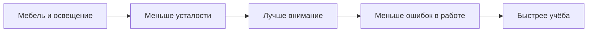
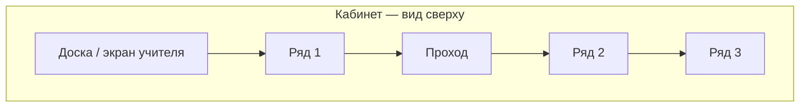
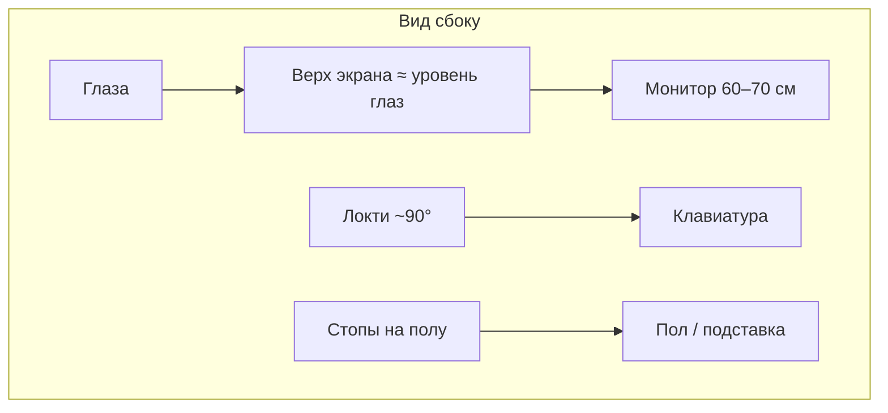
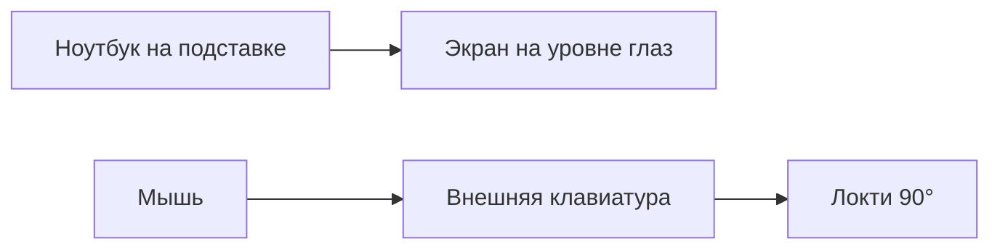

---
tags:
  - all
  - required
  - beginner
  - inprogress
title: Организация рабочего места
description: >-
  Эргономика, освещение, перерывы, правила компьютерного класса и безопасность —
  подробный обзор для школьного курса и домашней учёбы.
related:
  - title: "Право и защита информации в РФ"
    doc: encyclopedia/1-basics/1-035-bazovaya-informatika/7
  - title: "Основы компьютерной грамотности"
    doc: encyclopedia/1-basics/1-035-bazovaya-informatika/101
  - title: "Компьютер, периферия и сетевое оборудование"
    doc: encyclopedia/1-basics/1-035-bazovaya-informatika/3
  - title: "Советы для новичка — о разделе"
    doc: encyclopedia/1-basics/1-12-sovety-dlya-novichka/intro
---

import ExternalPlayEmbed from '@site/src/components/ExternalPlayEmbed';


# Организация рабочего места

<div class="article-tags">
  <span class="tag tag-required">ОБЯЗАТЕЛЬНО</span>
  <span class="tag tag-beginner">ДЛЯ НОВИЧКОВ</span>
  <span class="tag tag-inprogress">В РАЗРАБОТКЕ</span>
</div>

<span class="complexity-badge">Всем</span>

Умение пользоваться компьютером важно вместе с **организацией рабочего места**. От высоты стула и яркости экрана зависят зрение, спина и то, сколько вы успеете без ошибок за урок или домашнее задание. В школьной информатике это отдельная тема — эргономика, правила кабинета, электробезопасность, нормы **СанПиН** и практические упражнения для класса и дома.

**СанПиН** — санитарные правила для школ и офисов: сколько места на ученика, какое расстояние до экрана, как часто делать перерывы. **ПЭВМ** в документах — то же, что привычный персональный компьютер (ПК).

---

## Нормы и чек-лист

| Элемент | Норма | Почему важно |
|---------|-------|--------------|
| **Монитор** | Верхний край на уровне глаз или чуть ниже; 50–70 см от глаз | Меньше нагрузки на шею и зрение |
| **Стул** | Спина на спинке, колени ~90°, стопы на полу | Поясница и кровообращение |
| **Клавиатура и мышь** | Локти у корпуса, запястья без резкого изгиба | Кисти и предплечья |
| **Освещение** | Без бликов на экране, достаточный общий свет | Усталость глаз |
| **Перерывы** | 5–10 мин каждые 45–60 мин; правило 20-20-20 | Отдых для глаз и осанки |
| **Класс** | Сухие руки, не трогать блок питания, не пить у клавиатуры | Электробезопасность |

| Ссылка | Тема |
|--------|------|
| [Клавиатура](/encyclopedia/1-basics/1-08-kak-rabotaet-kompyuter/713) | Осанка и печать |
| [Для детей](/encyclopedia/9-spinoff/9-11-dlya-detey/1-computer/1) | Перерывы, свет, осанка |
| [Право и гигиена](/encyclopedia/1-basics/1-035-bazovaya-informatika/7) | Цифровая гигиена |

---

## СанПиН и нормы для компьютерного класса

Главный нормативный документ в российской традиции — **СанПиН 2.2.2/2.4.1340-03** "Гигиенические требования к персональным электронно-вычислительным машинам и организации работы". Он задаёт требования к **ПЭВМ** (персональным компьютерам), помещению, микроклимату, шуму, освещению, электромагнитным полям и организации рабочих мест.

Типы мониторов, о которых ещё спрашивают на контрольных:

- **ЖК** (жидкокристаллический) — плоский современный экран; норма **4,5 м²** на одно место.
- **ЭЛТ** (электронно-лучевая трубка) — старый "выпуклый" монитор; норма **6 м²** на место, больше расстояние между соседями.

Цифры из документа, которые полезно знать на экзамене —

| Требование | Норма (ориентир) |
|------------|------------------|
| Площадь на одно место с **ЖК/плазменным** монитором | **не менее 4,5 м²** |
| Площадь с монитором на **ЭЛТ** | **не менее 6 м²** |
| Расстояние между боковыми гранями мониторов соседних мест | **не менее 1 м** |
| Расстояние от глаз до экрана | **600–700 мм** (60–70 см) |
| Рабочий стол | Регулируемая высота; поверхность **матовая**, без бликов |
| Стул | Подъёмно-поворотный, с регулировкой высоты сиденья и спинки |
| Угол наклона экрана | **15°–20°** назад от вертикали (ориентир) |
| Высота рабочей поверхности стола | **700–750 мм** (с регулировкой под рост) |

В современных классах ЭЛТ-мониторы почти не встречаются, но вопрос на контрольной "чем отличается норма для ЭЛТ и ЖК" всё ещё возможен.

---

### СанПиН — помещение и микроклимат (обзор)

| Параметр | Ориентир для учебных помещений |
|----------|-------------------------------|
| Температура | **18–24 °C** (зима), допустимые колебания по сезону |
| Влажность | **40–60 %** |
| Освещённость рабочего стола | **300–500 лк** (совмещённо с общим светом) |
| Прямой солнечный свет на экран | **Не допускается** |
| Шум | Не выше норм для учебных кабинетов |
| Проветривание | Регулярное; без сквозняка на ученика |

Полный текст **СанПиН** публикуется на порталах правовой информации; при спорных случаях ориентируются на **актуальную редакцию** документа.

---

### СанПиН — различия по возрасту (упрощённо)

| Группа | Особенности |
|--------|-------------|
| **Дошкольники** | Меньше непрерывного времени за ПК; больше площади; специальная мебель |
| **Школьники** | 4,5 м² на ЖК-место; физкультминутки; контроль осанки |
| **Взрослые на работе** | Свои нормы по длительности и перерывам (трудовое законодательство) |

---

### Экзаменационные вопросы по СанПиН

| Вопрос | Ответ |
|--------|-------|
| Площадь на место с ЖК? | **4,5 м²** |
| Площадь с ЭЛТ? | **6 м²** |
| Расстояние между мониторами? | **≥ 1 м** |
| Расстояние от глаз до экрана? | **60–70 см** |
| Почему ЭЛТ требует больше площади? | ЭЛТ крупнее, выше излучение и нагрузка на зрение |

---

## Что такое эргономика

★ **Эргономика** — наука о том, как устроить работу и мебель так, чтобы **меньше уставать** и **реже** болели шея, спина, глаза и кисти.

Плохое кресло и монитор ниже уровня глаз за год учёбы дают головные боли и сутулость так же реально, как плохая осанка за партой в тетради.

Эргономика влияет не только на здоровье, но и на качество обучения — когда меньше физического дискомфорта, проще держать внимание и меньше ошибок в заданиях.



---

## Рабочее место за стационарным ПК

### Стул

- **Спина** опирается на спинку, поясница поддержана.
- **Колени** согнуты примерно под 90°, стопы **на полу** или на подставке (если ноги не достают).
- Не сидеть на краю стула "полуприсев" — нагрузка на поясницу растёт.
- **Глубина сиденья** — между краем стула и коленом остаётся ладонь.
- **Высота** — стопы на полу, бёдра почти горизонтально.

| Ошибка | Исправление |
|--------|-------------|
| Ноги болтаются | Подставка под стопы |
| Сутулость | Спинка ближе, монитор выше |
| Сидение боком к экрану | Повернуть кресло и стол |

---

### Стол и клавиатура

- **Локти** около корпуса, предплечья почти горизонтально.
- **Клавиатура и мышь** на одной высоте, близко друг к другу — локоть остаётся у корпуса, без вытягивания в сторону.
- **Запястья** не сгибать резко вверх/вниз; лучше не упираться кистью в острый край стола (используют мягкую подушку у клавиатуры).
- **Монитор** — на глубине стола, клавиатура ближе к краю, но не на краю.

---

### Монитор

- **Верхний край экрана** — на уровне глаз или **чуть ниже** (голова слегка наклонена вперёд).
- **Расстояние** примерно 50–70 см (длина предплечья × 2–3 — грубая проверка).
- Экран **прямо** перед вами, по центру линии взгляда — иначе крутится шея.
- **Масштаб** — читать без наклона вперёд; Ctrl + колесо / настройки ОС.

**Быстрая проверка высоты:** сядьте прямо, закройте глаза, откройте — взгляд должен попадать в **верхнюю треть** экрана без наклона головы. Ноутбук на столе без подставки почти всегда слишком низко — поднимите на 10–15 см (книги, подставка, внешняя клавиатура).

### Симптомы перенапряжения — не игнорировать

| Симптом | Вероятная причина | Что сделать |
|---------|-------------------|-------------|
| Сухость, жжение глаз | Редкое моргание, кондиционер | Правило 20-20-20, увлажнитель |
| Боль в шее/плечах | Монитор низко или боком | Поднять экран, кресло ближе к столу |
| Онемение пальцев | Запястье согнуто на клавиатуре | Подложка, клавиатура тоньше, перерывы |
| Головная боль к вечеру | Яркость экрана >> освещённость комнаты | Снизить яркость, включить общий свет |
| Боль в пояснице | Нет опоры спины | Регулировка стула, перерывы стоя |

При симптомах **больше недели** — офтальмолог / невролог, не только "меньше сидеть за ПК".

---

### Освещение

- В комнате **достаточно общего света**; работа "в полной темноте, только монитор" перегружает глаза контрастом.
- **Блики** на экране убирают поворотом монитора или шторами; яркость экрана подстраивают под комнату (не "на максимум" днём).
- **Цветовая температура** — тёплый свет вечером снижает нагрузку на сон (ночной режим ОС).

Если есть настольная лампа, лучше ставить её сбоку от рабочей руки (справа для левши, слева для правши), чтобы уменьшить тени и блики на тетради и клавиатуре.

| Условие | Рекомендация |
|---------|--------------|
| Окно сзади | Занавес, чтобы не слепило в монитор |
| Окно сбоку | Перпендикулярно лучу, штора |
| Люминесцентные лампы | Равномерный свет без мерцания (если возможно) |

---

### Кабели

- Провода **не лежат** на проходе в классе; за системным блоком — аккуратная укладка, чтобы никто не зацепил ногой.
- **Маркировка** розеток в классе — кто за что отвечает (для администратора).
- **Не натягивать** кабель монитора при повороте стола.

| Элемент | Рекомендация |
|---------|--------------|
| **Стул** | Спина, колени ~90°, стопы на опоре |
| **Стол** | Локти у стола, периферия рядом |
| **Монитор** | Верх на уровне глаз, 50–70 см, без бликов |
| **Свет** | Комната + экран без "кинотеатра в темноте" |
| **Кабели** | Вне прохода, без натяжения разъёмов |

---

## Глаза и перерывы

Глаза при работе за экраном **редко моргают**; слезная плёнка сохнет — ощущение "песка", особенно с кондиционером или батареями.

---

### Правило 20-20-20

Каждые **~20 минут** переводите взгляд на объект **вдали** (окно, дальняя стена) на **~20 секунд**. Глазные мышцы отдыхают от фиксации на близком экране.

| Шаг | Действие |
|-----|----------|
| 1 | Таймер на 20 мин (телефон, приложение) |
| 2 | Посмотреть вдаль 20 секунд |
| 3 | Несколько раз медленно моргнуть |
| 4 | Вернуться к работе |

---

### Перерывы на движение

Каждые **45–60 минут** — встать, пройтись, размять шею и плечи **5–10 минут**. На уроке информатики **физкультминутка** — часть безопасной работы за компьютером.

Для домашней практики удобно ставить таймер — короткие регулярные паузы эффективнее, чем один длинный перерыв после двух часов непрерывной работы.

| Тип перерыва | Длительность | Что делать |
|--------------|--------------|------------|
| Микро | 20 сек | 20-20-20 |
| Короткий | 5 мин | Встать, пройтись |
| Средний | 10–15 мин | Разминка + вода |
| После 2 ч | 30 мин | Полноценный отдых от экрана |

---

### Дополнительно

- Сознательно **моргать** при сухом воздухе.
- При постоянном дискомфорте — проверка зрения у офтальмолога (очки подбирают по назначению специалиста).
- **Увлажнитель** в отопительный сезон.
- **Расстояние до экрана** не уменьшать "чтобы лучше видеть" — лучше увеличить шрифт.

---

## Комплекс упражнений и разминок

Выполняйте **медленно**, без боли. На уроке — по команде учителя; дома — в перерывах.

### Разминка для глаз (1–2 мин)

| № | Упражнение | Повторы |
|---|------------|---------|
| 1 | Закрыть глаза на 5 сек, открыть | 3 раза |
| 2 | Круговые движения глазами по часовой и против | по 4 |
| 3 | Взгляд вдаль у окна | 20 сек |
| 4 | "Пальчик": смотреть на палец вынутой руки, приближать и отдалять | 5 раз |
| 5 | Частое моргание 10 сек | 1 раз |

---

### Разминка для шеи и плеч (2–3 мин)

| № | Упражнение | Повторы |
|---|------------|---------|
| 1 | Наклон головы влево-вправо, задержка 5 сек | по 2 |
| 2 | Поворот головы влево-вправо | по 3 |
| 3 | Плечи вверх-вниз ("вздох") | 5 раз |
| 4 | Круги плечами назад | 5 раз |
| 5 | Руки в замок за спиной, раскрыть грудь | 15 сек |

---

### Разминка для кистей и предплечий (1–2 мин)

| № | Упражнение | Повторы |
|---|------------|---------|
| 1 | Сжать и разжать кулаки | 10 раз |
| 2 | Вращение запястьями | по 5 |
| 3 | "Пианино" — поочерёдно разгибать пальцы | 10 сек |
| 4 | Потрясти кистями расслабленно | 10 сек |

---

### Вставание и спина (3–5 мин)

| № | Упражнение | Повторы |
|---|------------|---------|
| 1 | Встать, пройтись по классу/комнате | 1–2 мин |
| 2 | Наклон вперёд к коленям стоя (без рывка) | 15 сек |
| 3 | Руки вверх, потянуться | 2 раза |
| 4 | Боковой наклон корпуса | по 2 |

<div class="callout callout--tip">
  <div class="callout-title">Физкультминутка на уроке</div>

  <div class="callout-body">
  Учителю удобно чередовать блоки: после 20–25 мин работы — <strong>глаза</strong> (20-20-20); после 45 мин — <strong>шея + встать</strong>. Не ждать жалоб — профилактика эффективнее.
</div>
  </div>

---

## Практические упражнения "настрой своё место"

### Упражнение 1 — Аудит за 5 минут

Заполните таблицу для своего домашнего или школьного места:

| Критерий | Да / Нет | Что исправить |
|----------|----------|---------------|
| Верх экрана на уровне глаз | | |
| 50–70 см до монитора | | |
| Стопы на полу или подставке | | |
| Нет сильных бликов | | |
| Есть общий свет в комнате | | |
| Клавиатура и мышь на одной высоте | | |

**Цель:** минимум **5 из 6** "Да".

---

### Упражнение 2 — Фото до/после (дома)

1. Сфотографируйте профиль сидя за ПК (как есть).
2. Отрегулируйте стул, подставку, высоту монитора.
3. Второе фото — сравните наклон шеи и спины.

---

### Упражнение 3 — Карта класса (групповое)

На схеме кабинета отметьте:

- проходы без кабелей;
- расстояние между мониторами (≥ 1 м);
- источники бликов (окна);
- розетки и огнетушитель.

---

## Клавиатура и мышь

- **Слепая печать** (все десять пальцев по своим зонам) снижает наклон головы к клавишам и ускоряет набор — меньше усталости на длинных работах. Подробное руководство и тренажёр — [Как научиться быстро печатать](/encyclopedia/1-basics/1-12-sovety-dlya-novichka/14).
- **Мышь** слева от клавиатуры для левши или симметричная раскладка — чтобы плечо не выворачивалось.
- В играх и длинной работе — **та же** осанка — сутулость "на пять минут" накапливается.

Горячие клавиши (копировать, вставить, переключить окно) уменьшают количество лишних движений мышью и снижают утомление кисти при длинной работе.

| Параметр мыши | Рекомендация |
|---------------|--------------|
| Чувствительность | Средняя — без "махов" локтем |
| Коврик | Достаточного размера для движения |
| Высота | На уровне клавиатуры |

---

### Интерактив — зона клавиатуры

Посмотрите на зоны пальцев и базовую позицию рук — это основа, без которой скорость печати обычно растёт медленно и с лишним напряжением кистей.

<ExternalPlayEmbed example="about/keyboard-play" title="Keyboard" />

После просмотра проверьте посадку и положение ладоней на своей клавиатуре — именно этот перенос в реальную позу делает интерактив полезным.

---

### Интерактив — мини-тренажёр печати

Запустите короткий сет на точность — сначала закрепите правильные движения, затем увеличивайте темп.

<ExternalPlayEmbed example="about/typing-speed-trainer-play" title="Typing Speed Trainer" />

Итоговый ориентир — если ошибок становится меньше от попытки к попытке, вы на правильной траектории даже при умеренной скорости.

Подробнее — [Клавиатура](/encyclopedia/1-basics/1-08-kak-rabotaet-kompyuter/713), [Клавиши для новичка](/encyclopedia/1-basics/1-08-kak-rabotaet-kompyuter/7131).

---

## Компьютерный класс — правила и зачем они

Правила в школах формулируют по-разному, смысл общий —

| Правило | Зачем |
|---------|--------|
| Включать/выключать ПК **по указанию** учителя | Единая загрузка сети, меньше сбоев |
| **Без еды и напитков** у клавиатуры | Пролитая жидкость — частая причина поломки |
| **Не снимать** кабели, **не открывать** системный блок | Безопасность, гарантия, риск удара током |
| **Сохранять** работу, **выходить** из аккаунта | Чужие не увидят ваши файлы и переписку |
| Сообщать о поломке **учителю** | Самостоятельный "ремонт" опасен и запрещён |
| **Не менять** настройки сети и обоев без разрешения | Стабильность класса |
| **Убирать** за собой стул, не оставлять мусор | Порядок и проходы |

---

## Руководство по организации компьютерного класса

Для администрации и учителя — чек-лист соответствия **СанПиН** и безопасности.

### Планировка помещения

| Элемент | Требование |
|---------|------------|
| Площадь | Из расчёта 4,5 м² × число мест (ЖК) |
| Ряды | Проход между рядами для учителя |
| Окна | Шторы от прямого света на экраны |
| Доска | Не слепит при работе за монитором |



---

### Рабочие места

| Проверка | Действие |
|----------|----------|
| Расстояние между мониторами | Измерить ≥ 1 м между боковыми гранями |
| Высота столов | Регулировка под рост (или ступеньки для малышей) |
| Стулья | С регулировкой; не складные "на час" для ежедневных уроков |
| Кабели | Кабель-каналы, не через проход |

---

### Техника и безопасность

| Проверка | Действие |
|----------|----------|
| Заземление | По нормам электробезопасности |
| ИБП на сервер учителя | По возможности |
| Огнетушитель | Видимый, срок годности |
| Инструктаж учеников | В начале года — правила кабинета |
| Журнал инструктажей | Для администрации |

---

### Режим урока

| Время | Активность |
|-------|------------|
| 0–5 мин | Включение по команде, посадка, осанка |
| Каждые 20 мин | 20-20-20 |
| 25–30 мин | Физкультминутка (шея, глаза) |
| 45–50 мин | Сохранение, выход из аккаунта |
| Конец | Выключение по команде |

---

### Пожарная и электробезопасность

- **Не перегружать** одну розетку несколькими удлинителями "цепочкой".
- **Мокрыми руками** оборудование не трогать.
- Знать, где **выключатель**, **огнетушитель** и **выход** из кабинета.
- При запахе гари или искрении — **сообщить взрослому**, самому разбирать проводку не нужно.
- **Не снимать** крышки блоков питания.

| Ситуация | Действие ученика |
|----------|------------------|
| Искра из розетки | Не трогать, позвать учителя |
| Запах гари | Сообщить, эвакуация по команде |
| Кто-то получил удар током | Не трогать голыми руками, отключить питание, вызвать взрослых |

---

## Домашний кабинет и ноутбук

### Ноутбук на кровати или коленях

На **короткое** время сойдёт; для **долгой** учёбы нужны **стол**, стул и при возможности **подставка** под ноутбук (экран выше) плюс **внешняя клавиатура** — иначе сутулость и перегрев корпуса (подушка закрывает вентиляцию).

| Вариант | Оценка для учёбы 1+ ч |
|---------|----------------------|
| Кровать + ноутбук | ❌ |
| Стол + подставка + внешняя клавиатура | ✅ |
| Монитор + док-станция | ✅✅ |

---

### Организация домашнего уголка

| Элемент | Совет |
|---------|-------|
| Стол | Отдельный, не кухонный стол "между делом" |
| Свет | Настольная + потолочный |
| Шум | Наушники с ограничением громкости |
| Отвлечения | Телефон в другой комнате на время урока |
| Вода | Бутылка **в стороне** от клавиатуры |

---

### Наушники

- Громкость **умеренная**; при звонках в наушниках один ухо иногда оставляют свободным, чтобы слышать окружение дома.
- Перерывы для ушей при многочасовом прослушивании.
- Правило **60/60**: не более 60 % громкости дольше 60 минут подряд (ориентир).

---

### Вентиляция

Системный блок и ноутбук **охлаждаются воздухом** через решётки. Не класть ноутбук на мягкую поверхность, не закрывать решётки плотной тканью.

Периодическая чистка от пыли (для стационарного ПК — с помощью взрослых или специалиста) тоже часть безопасной эксплуатации — перегрев сокращает срок службы компонентов.

---

## Типичные ошибки новичков

| Ошибка | Чем грозит |
|--------|------------|
| Монитор слишком низко | Боль в шее, сутулость |
| Яркость экрана "на максимум" ночью | Усталость глаз, нарушение сна |
| Работа без перерывов 2–3 часа | Сухость глаз, скованность |
| Сумка с ноутбуком только на одном плече | Асимметрия спины (дорога в школу) |
| Игнорирование сохранения файла | Потеря работы при сбое |
| Телефон под монитором "для удобства" | Лишний наклон головы |
| Стул без спинки | Боль в пояснице |

---

## Вопросы для экзамена и самопроверки

| Вопрос | Краткий ответ |
|--------|---------------|
| Что такое эргономика? | Наука об удобстве и безопасности труда, снижении усталости |
| Площадь на ЖК-место по СанПиН? | 4,5 м² |
| Расстояние до экрана? | 60–70 см |
| Правило 20-20-20? | Каждые 20 мин — 20 сек вдаль |
| Где должен быть верх монитора? | На уровне глаз или чуть ниже |
| Почему нельзя пить у клавиатуры? | Пролив — поломка; электробезопасность |
| Перерывы каждые…? | 45–60 мин по 5–10 мин |

Связь с [чек-листом](/encyclopedia/1-basics/1-035-bazovaya-informatika/99) — вопросы 15, 20, 25.

---

## Быстрый чек-лист перед занятием

- Экран на нужной высоте и без сильных бликов.
- Стопы устойчиво стоят на полу/подставке.
- Вода под рукой, вдали от клавиатуры.
- Таймер перерывов включён.
- Файл для работы создан и понятно, куда сохранять.
- Плечи расслаблены, локти у корпуса.

---

## Связь с остальным курсом

Организация места дополняет [железо и периферию](/encyclopedia/1-basics/1-035-bazovaya-informatika/3) (вы знаете, *что* перед вами) и [ОС](/encyclopedia/1-basics/1-035-bazovaya-informatika/5) (вы умеете сохранять и выходить из аккаунта **безопасно**). [Право и цифровая гигиена](/encyclopedia/1-basics/1-035-bazovaya-informatika/7) — не публиковать лишнее и беречь здоровье при долгой работе.

Итоги курса — [Базовая информатика — итоги](./98) → [Чек-лист](./99).

---

## СанПиН — полная шпаргалка для экзамена

| № | Вопрос | Ответ |
|---|--------|-------|
| 1 | Номер документа | **СанПиН 2.2.2/2.4.1340-03** |
| 2 | Площадь ЖК/плазма | **≥ 4,5 м²** |
| 3 | Площадь ЭЛТ | **≥ 6 м²** |
| 4 | Между мониторами | **≥ 1 м** |
| 5 | Глаза — экран | **600–700 мм** |
| 6 | Угол наклона экрана | **15°–20°** |
| 7 | Высота стола | **700–750 мм** (регулируемая) |
| 8 | Стул | Подъёмно-поворотный, регулировка |
| 9 | Поверхность стола | Матовая, без бликов |
| 10 | Прямой солнечный свет на экран | Не допускается |

### ЭЛТ и ЖК — почему разная площадь

| Параметр | ЭЛТ (кинескоп) | ЖК / LED |
|----------|----------------|----------|
| Глубина монитора | Большая | Малая |
| Электромагнитное излучение | Выше (исторически) | Ниже |
| Площадь по СанПиН | 6 м² | 4,5 м² |
| Сейчас в школах | Редко | Повсеместно |

### Микроклимат — цифры для конспекта

| Параметр | Зима | Лето |
|----------|------|------|
| Температура | 18–24 °C | 20–26 °C (ориентиры по нормам для офисов/учебных) |
| Относительная влажность | 40–60 % | 40–60 % |
| Скорость движения воздуха | Без сквозняка на работника | То же |

### Освещённость

| Зона | Лк (ориентир) |
|------|---------------|
| Рабочий стол с документами | 300–500 |
| Экран | Без прямого света в глаза |
| Общее освещение | Равномерное, без пульсации |

---

## Программа разминок на учебную неделю

Выполняйте в перерывах между уроками информатики или при домашней учёбе.

| День | Фокус | Упражнения | Время |
|------|-------|------------|-------|
| Пн | Глаза | Блок "Разминка для глаз" | 2 мин |
| Вт | Шея | Блок "Шея и плечи" | 3 мин |
| Ср | Кисти | Блок "Кисти" | 2 мин |
| Чт | Спина | Вставание + наклоны | 5 мин |
| Пт | Комплекс | Все блоки подряд | 8 мин |
| Сб | Домашняя учёба | 20-20-20 каждые 20 мин | весь сеанс |
| Вс | Отдых от экрана | Прогулка без телефона | 30+ мин |

---

## Расширенный комплекс "7 минут в классе"

Учитель ведёт по таблице; ученики стоят за местами.

| Сек | Действие | Счёт / время |
|-----|----------|--------------|
| 0:00 | Встать, потянуться вверх | 2 раза |
| 0:30 | Плечи вверх-вниз | 5 |
| 1:00 | Круги плечами назад | 5 |
| 1:30 | Наклон головы влево-вправо | по 5 сек |
| 2:30 | Поворот головы | по 3 |
| 3:30 | Взгляд в окно (20-20-20) | 20 сек |
| 4:00 | Вращение запястий | по 5 |
| 4:30 | Сжать-разжать кулаки | 10 |
| 5:00 | Наклон вперёд к коленям (мягко) | 15 сек |
| 5:30 | Присесть 5 раз или пройтись по проходу | 1 мин |
| 6:30 | Глубокий вдох-выдох | 3 |
| 7:00 | Сесть, проверить высоту монитора | — |

<div class="callout callout--info">
  <div class="callout-title">Музыка и таймер</div>

  <div class="callout-body">
  Удобно включить 7-минутный таймер с сигналом каждые 30 сек — ученики привыкают к ритму. Не заменяет урок физкультуры, но снижает усталость на двойке информатики.
</div>
  </div>

---

## Домашние упражнения для глаз (подробно)

### Упражнение "Часы"

1. Смотрите на воображаемый циферблат на стене.
2. Медленно ведите взгляд по цифрам 12 → 3 → 6 → 9 → 12.
3. Повторите 2 раза по часовой и против.

### Упражнение "Близко-далеко"

1. Покажите палец на расстоянии 15 см от носа.
2. Смотрите на палец 5 сек, на дальнюю точку 5 сек.
3. Повторите 8–10 раз.

### Упражнение "Моргание"

1. Быстро моргнуть 20 раз.
2. Закрыть глаза на 10 сек.
3. Повторить 3 цикла.

| Симптом | Если не проходит 2 недели |
|---------|---------------------------|
| Двоение | Офтальмолог |
| Резь в глазах | Офтальмолог, проверка сухости |
| Головокружение при наклонах | Врач |

---

## Разминка для спины и поясницы (дома)

| № | Упражнение | Описание | Повторы |
|---|------------|----------|---------|
| 1 | Кошка-верблюд | На четвереньках: прогнуть и округлить спину | 8 |
| 2 | Поворот корпуса сидя | Руки на спинке стула, поворот | по 5 |
| 3 | Подъём колена стоя | К груди поочерёдно | по 8 |
| 4 | "Складка" стоя | Наклон к носкам без рывка | 20 сек |
| 5 | Объятие себя | Плечи вперёд, расслабить | 15 сек |

**Не выполнять** при острой боли — обратиться к врачу.

---

## Настройка монитора в ОС

| Параметр | Windows | Рекомендация |
|----------|---------|--------------|
| Яркость | Параметры → Экран | Как лист бумаги при дневном свете |
| Масштаб | 100–125 % | Читать без наклона |
| Ночной свет | Включить вечером | Меньше синего |
| Частота | 60 Гц минимум | 75+ Гц комфортнее, если монитор поддерживает |

| Параметр | Linux / macOS | Рекомендация |
|----------|---------------|--------------|
| Night Shift / Night Light | Системные настройки | Вечером |
| Разрешение | Нативное | Не ниже рекомендуемого |

---

## Организация класса — пошаговый чек-лист администратора

### Этап 1 — Помещение

- [ ] Площадь ≥ 4,5 м² × N мест
- [ ] Окна с шторами
- [ ] Температура и влажность в норме
- [ ] Нет сквозняка на ряды

### Этап 2 — Мебель

- [ ] Столы регулируемые или под ростовые группы
- [ ] Стулья с спинкой и регулировкой
- [ ] Мониторы на расстоянии 1 м друг от друга
- [ ] Матовые столешницы

### Этап 3 — Техника

- [ ] ЖК-мониторы, диагональ по нормам школы
- [ ] Кабели в каналах
- [ ] ИБП для сервера (по возможности)
- [ ] Розетки не перегружены

### Этап 4 — Безопасность

- [ ] Инструктаж записан в журнале
- [ ] Огнетушитель и план эвакуации
- [ ] Запрет еды у клавиатуры на плакате
- [ ] Правила выхода из аккаунта

### Этап 5 — Режим

- [ ] Физкультминутка в плане урока
- [ ] Перерыв между двойками
- [ ] Максимум непрерывной работы — 45–60 мин

---

## Схема идеального рабочего места



| Элемент | Угол / расстояние |
|---------|-------------------|
| Шея | Нейтральная, без постоянного изгиба вверх |
| Предплечье | Параллельно полу |
| Бедро | Параллельно полу |
| Колено | ~90° |

---

## Сравнение — школьный класс и дом и ноутбук

| Критерий | Школьный класс | Дом за столом | Ноутбук на диване |
|----------|----------------|---------------|-------------------|
| Площадь СанПиН | Регулирует школа | Ваша ответственность | Не соответствует |
| Высота экрана | Часто низко — подложка | Настраивается | Очень низко |
| Перерывы | Учитель | Сами | Часто забывают |
| Электробезопасность | Инструктаж | Родители | Перегрев на подушке |
| Оценка для 2+ ч | ✅ при нормах | ✅ | ❌ |

---

## Типичные вопросы ОГЭ/зачёта по эргономике

| Вопрос | Развёрнутый ответ |
|--------|-------------------|
| Что такое эргономика? | Наука о безопасном и удобном взаимодействии человека с техникой и средой труда |
| Назовите правило 20-20-20 | Каждые 20 мин смотреть вдаль 20 сек на ~6 м |
| Требования СанПиН к площади? | 4,5 м² ЖК; 6 м² ЭЛТ |
| Как расположить монитор? | Верх на уровне глаз, 60–70 см, без бликов, по центру |
| Зачем перерывы? | Снижение нагрузки на зрение, мышцы, кровообращение |
| Почему нельзя есть у клавиатуры? | Поломка техники, гигиена, электробезопасность |
| Какие симптомы перенапряжения? | Сухость глаз, боль в шее, онемение пальцев |
| Роль освещения? | Снижение контраста "тёмная комната — яркий экран" |

---

## Практикум "Настройка за 15 минут" (дома)

| Мин | Действие | Проверка |
|-----|----------|----------|
| 0–3 | Поднять монитор/ноутбук на подставку | Взгляд в верхнюю треть |
| 3–6 | Регулировать стул | Стопы на полу, спина к спинке |
| 6–9 | Клавиатура и мышь ближе | Локти у корпуса |
| 9–12 | Убрать блики, настроить яркость | Нет отражения лица |
| 12–15 | Таймер 20 мин, вода в стороне | Готовность к занятию |

Сфотографируйте место **до** и **после** — приложите к конспекту или портфолио.

---

## Связь с ФГОС и здоровьем

| Блок программы | Содержание главы 8 |
|----------------|-------------------|
| Безопасная работа за ПК | Электробезопасность, правила кабинета |
| Санитарные нормы | СанПиН, площадь, расстояния |
| Здоровый образ жизни | Перерывы, осанка, зрение |
| Информационная культура | Ответственное поведение в классе |

Связь с [правом](/encyclopedia/1-basics/1-035-bazovaya-informatika/7): не публиковать лишнего в чатах и беречь себя при долгой работе — единая культура цифрового гражданина.

---

## Глоссарий главы 8

| Термин | Определение |
|--------|-------------|
| **Эргономика** | Удобство и безопасность труда |
| **СанПиН** | Санитарные правила и нормы |
| **ПЭВМ** | Персональная электронно-вычислительная машина |
| **20-20-20** | Правило отдыха для глаз |
| **Физкультминутка** | Короткая разминка на уроке |
| **Блик** | Отражение света на экране |
| **ЭЛТ** | Электронно-лучевая трубка (старый монитор) |
| **ЖК** | Жидкокристаллический дисплей |

---

## Резюме для зачёта

| Тема | Минимум |
|------|---------|
| Эргономика | Определение + 3 элемента места |
| СанПиН | 4,5 м²; 1 м; 60–70 см |
| Перерывы | 20-20-20; 45–60 мин |
| Класс | 4 правила безопасности |
| Дом | Стол, стул, не кровать |

Полная самопроверка — [чек-лист 99](/encyclopedia/1-basics/1-035-bazovaya-informatika/99), вопросы 15, 20, 25.

---

## Варианты планировки компьютерного класса

### Вариант А — "острова" по 4 места

| Плюс | Минус |
|------|-------|
| Совместная работа в группах | Сложнее контролировать экраны |
| Экономия проходов | Нужно ≥ 1 м между мониторами по бокам |

Рекомендация: для проектной работы в старших классах; для контрольных — рассадка "лицом к стене".

### Вариант Б — ряды лицом к доске

| Плюс | Минус |
|------|-------|
| Учитель видит экраны | Шея при повороте к доске |
| Классическая дисциплина | Монитор может закрывать доску |

Рекомендация: чередовать — работа за ПК и объяснение у доски с отключёнными мониторами.

### Вариант В — периметр по стенам

| Плюс | Минус |
|------|-------|
| Максимум мест | Углы — блики от окон |
| Проход в центре | Кабели длиннее |

---

## Ростовые группы и мебель

| Рост (см) | Высота стула (сиденье) | Высота стола | Подставка под ноги |
|-----------|------------------------|--------------|-------------------|
| 120–140 | Низкая детская | 58–64 см | Часто нужна |
| 140–160 | Школьная стандарт | 64–70 см | Иногда |
| 160–175 | Взрослая | 70–75 см | Обычно нет |
| 175+ | Высокая | 72–75 см | — |

В одном классе разного роста — **регулируемые** стулья или подставки под ноги важнее, чем "красивый" единый ряд.

---

## Упражнения для пальцев при печати (5 мин)

| № | Упражнение | Как |
|---|------------|-----|
| 1 | "Пианино" | Каждый палец поочерёдно приподнимается |
| 2 | "Когти" | Сжать как когти, разжать |
| 3 | "Стена" | Ладони в упор в стену, без боли |
| 4 | Потрясти кистями | 10 сек |
| 5 | Массаж между пальцами | 30 сек |

После — вернуться к [базовой позиции рук](/encyclopedia/1-basics/1-08-kak-rabotaet-kompyuter/713).

---

## Ноутбук + док-станция — эталон домашней установки

| Компонент | Зачем |
|-----------|-------|
| Подставка под ноутбук | Экран на уровне глаз |
| Внешняя клавиатура | Правильный угол локтей |
| Внешняя мышь | Не тянуться к тачпаду |
| Внешний монитор (опционально) | Больше рабочего поля |
| Док-станция / USB-хаб | Один кабель, меньше суеты |



---

## Сезонные рекомендации

| Сезон | Проблема | Решение |
|-------|----------|---------|
| Зима | Сухой воздух от батарей | Увлажнитель, моргание |
| Лето | Кондиционер сушит глаза | Не дуть в спину, 20-20-20 |
| Осень/весна | Мало дневного света | Включать потолочный свет |
| Каникулы | Много игр ночью | Режим сна, яркость вечером |

---

## Оценивание практикума по эргономике (для учителя)

| Критерий | 0 баллов | 1 балл | 2 балла |
|----------|----------|--------|---------|
| Высота монитора | Не настроена | Частично | Верх ≈ глаза |
| Расстояние | &lt; 40 или &gt; 90 см | 50–90 см | 60–70 см |
| Стопы | Висят | Подставка | На полу |
| Перерывы | Нет | Иногда | Таймер 20 мин |
| Правила класса | Нарушены | 3 из 5 | 5 из 5 |

Максимум 10 баллов; проходной — 7.

---

## Ситуации для обсуждения в классе

| Ситуация | Вопрос классу | Ожидаемый вывод |
|----------|---------------|-----------------|
| Ученик пьёт колу над клавиатурой | Что может случиться? | Поломка, правило кабинета |
| Играет 4 ч без перерыва | Какие симптомы? | Глаза, шея, сон |
| Монитор отражает окно | Как исправить? | Поворот, штора, яркость |
| Сумка с ноутбуком на одном плече | К чему приводит? | Асимметрия спины |
| Сидит на ножках стула | Нагрузка на поясницу? | Нужна спинка и стопы |

---

## Дополнительные вопросы экзамена (блок 2)

| № | Вопрос | Ответ |
|---|--------|-------|
| 11 | Минимальное расстояние между мониторами? | 1 м |
| 12 | Какой монитор требует 6 м²? | ЭЛТ |
| 13 | Физкультминутка — зачем? | Снятие статической нагрузки |
| 14 | Можно ли работать в полной темноте? | Нет, нужен общий свет |
| 15 | Где ставить настольную лампу правше? | Слева от клавиатуры |
| 16 | Что делать при запахе гари? | Сообщить, не чинить самому |
| 17 | Ноутбук на подушке — почему плохо? | Перегрев, осанка |
| 18 | Правило 60/60 для наушников? | 60 % громкости до 60 мин |
| 19 | Матовая поверхность стола — зачем? | Меньше бликов |
| 20 | Связь эргономики и успеваемости? | Меньше усталости → лучше внимание |

---

## Журнал самонаблюдения (неделя)

Заполняйте вечером: 0 — нет, 1 — да.

| День | 20-20-20 | Перерыв 45 мин | Осанка ок | Глаза не резало |
|------|----------|----------------|-----------|-----------------|
| Пн | | | | |
| Вт | | | | |
| Ср | | | | |
| Чт | | | | |
| Пт | | | | |
| Сб | | | | |
| Вс | | | | |

**Цель:** ≥ 5 дней с перерывами и 20-20-20.

---

## Инвентарь здорового кабинета (для администрации)

| Предмет | Назначение |
|---------|------------|
| Регулируемые стулья | Рост учеников |
| Подставки под монитор | Высота экрана |
| Подставки под ноги (детские) | Стопы не висят |
| Увлажнитель (зима) | Сухость глаз |
| Плакат правил | Напоминание |
| Таймер / сигнал перерыва | Дисциплина 20-20-20 |
| Кабель-каналы | Безопасность |
| Огнетушитель | Пожарная безопасность |

---

## Связь с другими предметами

| Предмет | Связь |
|---------|-------|
| ОБЖ | Электробезопасность, эвакуация |
| Физкультура | Разминка, осанка |
| Биология | Зрение, опорно-двигательный аппарат |
| Информатика | Правила класса, СанПиН |

---

## Итоговая таблица "запомни 10 цифр"

| № | Цифра | Смысл |
|---|-------|-------|
| 1 | **4,5** | м² на ЖК-место |
| 2 | **6** | м² на ЭЛТ |
| 3 | **1** | м между мониторами |
| 4 | **60–70** | см до экрана |
| 5 | **20** | мин до отдыха глаз |
| 6 | **20** | сек смотреть вдаль |
| 7 | **45–60** | мин до перерыва тела |
| 8 | **5–10** | мин длина перерыва |
| 9 | **90** | ° колени и локти (ориентир) |
| 10 | **700–750** | мм высота стола |

---

## Полный комплекс "15 минут от стола"

Выполняйте после 2 часов работы или между двойками.

### Минуты 0–3 — вставание и ноги

| Время | Упражнение | Детали |
|-------|------------|--------|
| 0:00 | Встать | Отодвинуть стул |
| 0:30 | Ходьба на месте | 30 сек |
| 1:00 | Подъём на носки | 10 раз |
| 1:30 | Приседания | 8 раз, колени не за носки |
| 2:30 | Потянуться вверх | 2 раза, 10 сек |

### Минуты 3–6 — шея и плечи

| Время | Упражнение | Детали |
|-------|------------|--------|
| 3:00 | Наклон головы в стороны | 5 сек × 2 |
| 3:40 | Поворот головы | 3 × 2 |
| 4:20 | Плечи вверх-вниз | 8 |
| 5:00 | Круги плечами | 5 назад |
| 5:40 | Руки в замок за спиной | 20 сек |

### Минуты 6–9 — глаза

| Время | Упражнение | Детали |
|-------|------------|--------|
| 6:00 | Закрыть глаза | 10 сек |
| 6:30 | "Часы" | 1 круг |
| 7:30 | "Близко-далеко" | 8 раз |
| 8:30 | Взгляд в окно | 30 сек |
| 9:00 | Моргание | 20 раз |

### Минуты 9–12 — кисти и предплечья

| Время | Упражнение | Детали |
|-------|------------|--------|
| 9:00 | Вращение запястий | 5 × 2 |
| 9:40 | "Когти" | 10 |
| 10:20 | "Пианино" | 20 сек |
| 11:00 | Потрясти руками | 15 сек |
| 11:30 | Растирание предплечий | 30 сек |

### Минуты 12–15 — спина и посадка

| Время | Упражнение | Детали |
|-------|------------|--------|
| 12:00 | Наклон вперёд стоя | 20 сек |
| 12:30 | Поворот корпуса | 2 × 2 |
| 13:10 | Кошка-верблюд (если есть коврик) | 6 |
| 14:00 | Сесть, проверить монитор | чек-лист |
| 14:30 | Глубокий вдох | 3 |
| 15:00 | Начать работу | таймер 20 мин |

---

## Календарь эргономики на учебный год

| Месяц | Фокус | Действие |
|-------|-------|----------|
| Сентябрь | Настройка места | Упражнение "Аудит 5 мин" |
| Октябрь | Глаза | Правило 20-20-20 каждый урок |
| Ноябрь | Спина | Разминка шеи ежедневно |
| Декабрь | Сухой воздух | Увлажнитель дома |
| Январь | Повтор СанПиН | Контрольная по цифрам |
| Февраль | Кисти | Слепая печать, [713](/encyclopedia/1-basics/1-08-kak-rabotaet-kompyuter/713) |
| Март | Класс | Правила электробезопасности |
| Апрель | Ноутбук к экзаменам | Подставка, не кровать |
| Май | Итог | Чек-лист [99](/encyclopedia/1-basics/1-035-bazovaya-informatika/99) вопр. 15, 25 |

---

## Частые ошибки учителя при организации класса

| Ошибка | Как лучше |
|--------|-----------|
| Мониторы вплотную | ≥ 1 м между боковыми гранями |
| Один рост стула на всех | Регулировка или подставки |
| Нет перерывов на двойке | 20-20-20 + 7 мин в середине |
| Окно за спиной ученика | Блики — шторы, поворот стола |
| Общий пароль на всех ПК | Личные учётки — [глава 7](/encyclopedia/1-basics/1-035-bazovaya-informatika/7) |

---

## Чек-лист родителя — домашний уголок

- [ ] Стол и стул, не кровать
- [ ] Экран на уровне глаз (подставка)
- [ ] Освещение включено вечером
- [ ] Вода не на столе с клавиатурой
- [ ] Перерывы согласованы
- [ ] Игры ночью ограничены (сон)
- [ ] Ноутбук не на подушке
- [ ] Ребёнок знает правила [112](/encyclopedia/1-basics/1-035-bazovaya-informatika/112)

---

## Сводная памятка (можно распечатать)

```
┌─────────────────────────────────────────────┐
│  РАБОЧЕЕ МЕСТО ЗА КОМПЬЮТЕРОМ               │
├─────────────────────────────────────────────┤
│  □ Верх экрана — на уровне глаз             │
│  □ 60–70 см от глаз до монитора             │
│  □ Стопы на полу или подставке              │
│  □ Спина к спинке стула                     │
│  □ Каждые 20 мин — смотреть вдаль 20 сек    │
│  □ Каждые 45–60 мин — встать 5–10 мин       │
│  □ Свет в комнате, не только экран          │
│  □ Не есть и не пить над клавиатурой        │
│  СанПиН: 4,5 м² · 1 м между мониторами      │
└─────────────────────────────────────────────┘
```

---
