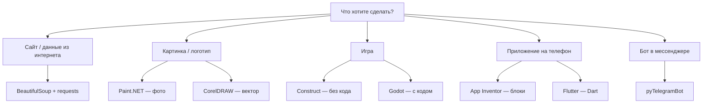

---
tags:
  - all
  - required
  - beginner
  - inprogress
title: Инструменты и среды разработки
description: >-
  Путеводитель по популярным средам — Python-библиотеки, графика, игры, мобильные
  приложения и школьные платформы — с ссылками на подробные главы энциклопедии.
---

import ExternalPlayEmbed from '@site/src/components/ExternalPlayEmbed';

# Инструменты и среды разработки

  ОБЯЗАТЕЛЬНО
  ДЛЯ НОВИЧКОВ
  В РАЗРАБОТКЕ

Всем

На уроках информатики, в кружках и дома часто встречаются **конкретные программы и библиотеки** — BeautifulSoup, Blender, Godot и другие имена с собственными возможностями. Эта глава — **карта** — что это за инструмент, кому подходит и где читать подробнее в энциклопедии.

---

## Как выбрать инструмент

| Критерий | Вопрос |
|----------|--------|
| **Цель** | Бот, игра, сайт, 3D, мобильное app? |
| **Среда** | Школьные ПК, лицензии, нужен интернет? |
| **Порог входа** | Блоки, визуальная среда или код с первого дня? |
| **Рост** | Хватит на один проект или на годы обучения? |

| Задача | Старт | Профессиональный путь |
|--------|-------|------------------------|
| Алгоритмы и код | [Кумир](/encyclopedia/9-spinoff/9-11-dlya-detey/5-kod/11), [PascalABC.NET](/encyclopedia/9-spinoff/9-11-dlya-detey/5-kod/10), [App Inventor](/encyclopedia/9-spinoff/9-11-dlya-detey/5-kod/9) | Python, [глава 4](/encyclopedia/1-basics/1-035-bazovaya-informatika/4) |
| 2D-игры | [Construct 3](/encyclopedia/9-spinoff/9-11-dlya-detey/2-video-games/27) | [Godot](/encyclopedia/9-spinoff/9-04-razrabotka-igr/113) |
| 3D и графика | [Tinkercad](/encyclopedia/9-spinoff/9-11-dlya-detey/3-development/18) | [Blender](/encyclopedia/9-spinoff/9-08-kompyuternaya-grafika/131) |
| Робототехника, LED, датчики | [Tinkercad Circuits](/encyclopedia/2-system-network/2-10-zhelezo/1013), [примеры Arduino/micro:bit](/lab/Примеры/1135) | Arduino IDE, MakeCode |
| Данные из веба | — | [BeautifulSoup](/encyclopedia/5-languages/5-02-python/316) |
| Мобильные app | App Inventor | [Flutter](/encyclopedia/5-languages/5-22-dart/311) |

---

## Сводная таблица

| Инструмент | Назначение | Кому | Подробнее |
|------------|------------|------|-----------|
| **BeautifulSoup** | Парсинг HTML после загрузки страницы | Python, старшие классы, автоматизация | [BeautifulSoup](/encyclopedia/5-languages/5-02-python/316.md) |
| **pyTelegramBot** (`telebot`) | Telegram-боты на Python | Кружки, хобби, простые боты | [Telegram-боты](/encyclopedia/5-languages/5-02-python/317.md) |
| **Paint.NET** | Растровая обработка изображений | Новички, школа, бытовые задачи | [Paint.NET и CorelDRAW](/encyclopedia/1-basics/1-16-grafika/7.md) |
| **CorelDRAW** | Векторная графика, макеты, печать | Дизайн, полиграфия | [Paint.NET и CorelDRAW](/encyclopedia/1-basics/1-16-grafika/7.md) |
| **Blender** | 3D-моделирование, анимация, рендер | Игры, кино, хобби | [Blender](/encyclopedia/9-spinoff/9-08-kompyuternaya-grafika/131.md) |
| **3ds Max** | Профессиональная 3D-визуализация | Студии, архитектура, игровые ассеты | [3ds Max](/encyclopedia/1-basics/1-16-grafika/8.md) |
| **Flutter** | Кроссплатформенные мобильные и десктоп UI | Разработчики на Dart | [Flutter](/encyclopedia/5-languages/5-22-dart/311.md) |
| **Godot** | Игровой движок 2D/3D, open source | Инди, школьные проекты | [Godot и Construct 3](/encyclopedia/9-spinoff/9-11-dlya-detey/2-video-games/27.md), [движки](/encyclopedia/9-spinoff/9-04-razrabotka-igr/113.md) |
| **Construct 3** | 2D-игры без кода (события) | Начинающие, браузер | [Godot и Construct 3](/encyclopedia/9-spinoff/9-11-dlya-detey/2-video-games/27.md) |
| **MIT App Inventor** | Android-приложения из блоков | Школа, первые мобильные app | [App Inventor](/encyclopedia/9-spinoff/9-11-dlya-detey/5-kod/9.md) |
| **PascalABC.NET** | Pascal в среде .NET для школ РФ | Уроки Pascal, олимпиады | [PascalABC.NET](/encyclopedia/9-spinoff/9-11-dlya-detey/5-kod/10.md), [Lab — типовые программы](/lab/Примеры/1140) |
| **Кумир** | Алгоритмический язык на русском, исполнители | ОГЭ, уроки информатики 5–9 класс | [Кумир](/encyclopedia/9-spinoff/9-11-dlya-detey/5-kod/11.md), [Lab — Чертёжник и Робот](/lab/Примеры/1115) |
| **Tinkercad** | 3D в браузере, 3D-печать; режим **Circuits** — Arduino и micro:bit | Дети, CAD-старт, кружок робототехники | [3D Design](/encyclopedia/9-spinoff/9-11-dlya-detey/3-development/18.md), [Circuits](/encyclopedia/2-system-network/2-10-zhelezo/1013), [примеры в Lab](/lab/Примеры/1135) |
| **CoSpaces Edu** | 3D/VR-сцены и простое кодирование | Уроки, VR-классы | [CoSpaces Edu](/encyclopedia/9-spinoff/9-11-dlya-detey/3-development/17.md) |

---

## Интерактив — витрина инструментов

Откройте витрину с конкретной целью — подобрать один инструмент под ваш мини-проект (бот, сайт, 3D-сцена, игра или мобильное приложение).

<ExternalPlayEmbed example="about/spirzen-online-tools-panel" title="Spirzen Online Tools Panel" />

После блока выберите один основной и один запасной инструмент. Такой "план Б" полезен, если первый вариант окажется слишком сложным или не подойдёт по условиям вашей школы/кружка.

---

## Python — данные из веба и боты

**BeautifulSoup** разбирает уже скачанный HTML — находит заголовки, ссылки, таблицы. Работает в паре с **requests** (загрузка страницы). Типичные задачи — мониторинг цен, сбор новостей, учебный парсинг открытых каталогов.

Важно понимать границы инструмента — BeautifulSoup разбирает **структуру HTML** уже скачанной страницы. Для динамических сайтов, где данные появляются после выполнения скриптов, обычно подключают браузерную автоматизацию (например, Selenium/Playwright) и затем разбирают полученный HTML.

**pyTelegramBot** (импорт `telebot`) — обёртка над [Telegram Bot API](https://core.telegram.org/bots/api) — бот отвечает на команды, кнопки и сообщения. Нужен токен от [@BotFather](https://t.me/BotFather). Подходит для школьных проектов "опрос", "расписание", "викторина".

Практически полезный минимум для первого бота — команды `/start` и `/help`, обработка текстовых сообщений, кнопки-меню и логирование ошибок. Даже такой набор уже позволяет собрать учебный сервис для класса или кружка.

Перед запуском в реальной группе стоит продумать базовые вещи — где хранить состояние (файл/SQLite), как ограничить доступ к админ-командам и что делать при падении процесса.

База по HTTP и файлам — [Работа с файлами и сетью](/encyclopedia/5-languages/5-02-python/31.md).

---

## Графика и 3D

**Paint.NET** — бесплатный растровый редактор под Windows — слои, прозрачность, плагины. Удобен после встроенного Paint.

**CorelDRAW** — вектор — логотипы, визитки, обтекание текста, подготовка к печати. Формат `.cdr`.

Короткое правило выбора — фото и цифровая ретушь обычно делают в **растре** (Paint.NET и аналоги), а логотипы, схемы и макеты под печать — во **векторе** (CorelDRAW и аналоги), чтобы масштабировать без потери качества.

**Blender** — полный 3D-конвейер с открытой лицензией; в энциклопедии есть практическая ветка с установкой и редакторами.

**3ds Max** — коммерческий стандарт Autodesk для визуализации и игровых ассетов; в школе чаще упоминают наравне с Blender как "профессиональную студийную программу".

Во всех 3D-средах путь похож — блокинг формы -> детализация -> материалы/текстуры -> свет -> рендер. Даже если интерфейсы разные, навыки композиции, топологии и работы с камерой переносятся между программами.

Для школьного старта обычно проще Blender — бесплатный, много уроков, активное сообщество и доступный вход без лицензий.

Теория форматов — [Графика — о разделе](/encyclopedia/1-basics/1-16-grafika/intro).

---

## Игры и мобильные приложения

**Godot** — бесплатный движок, язык **GDScript** (похож на Python), экспорт на ПК и телефоны.

**Construct 3** — логика через **события** ("если нажали — то"), мало кода; удобен для первой 2D-игры в браузере.

**Flutter** — UI на языке **Dart**; одна кодовая база для Android, iOS, веба и десктопа. Сначала полезно пройти [основы Dart](/encyclopedia/5-languages/5-22-dart/intro).

Выбор обычно зависит от цели проекта —
- если важно быстро увидеть результат без глубокого кода — Construct 3;
- если нужна полноценная игровая архитектура и контроль логики — Godot;
- для интерфейсного приложения (расписание, трекер, каталог) — Flutter.

У каждого пути есть цена — в no-code средах быстрее вход, но меньше гибкости; в кодовых движках дольше обучение, зато выше потолок сложности проекта.

Обзор индустрии — [Разработка игр](/encyclopedia/9-spinoff/9-04-razrabotka-igr/intro).

---

## Школьные и детские среды

| Среда | Идея |
|-------|------|
| **Scratch** | Блоки, браузер — [глава](/encyclopedia/9-spinoff/9-11-dlya-detey/5-kod/3) |
| **Кумир** | Русский алгоритмический язык, Робот и Чертёжник — [глава](/encyclopedia/9-spinoff/9-11-dlya-detey/5-kod/11), [примеры Lab](/lab/Примеры/1115) |
| **MIT App Inventor** | Блоки → APK для Android |
| **PascalABC.NET** | Pascal + .NET, русская среда для олимпиад и ЕГЭ-подготовки |
| **Tinkercad** | Примитивы CSG, экспорт на 3D-принтер, Codeblocks |
| **CoSpaces Edu** | Сцены, персонажи, Blockly/CoBlocks, VR-просмотр |

Эти среды ценят за низкий порог входа — ученик быстрее переходит от идеи к работающему результату и лучше видит связь между алгоритмом и поведением программы.

При этом важно постепенно переходить к "текстовому" коду. Хорошая траектория — блоки -> простые скрипты -> полноценный язык (Python/JavaScript/Dart), чтобы не упереться в ограничения учебной среды.

Раздел для детей — [Для детей — о разделе](/encyclopedia/9-spinoff/9-11-dlya-detey/forkids).

---

## Как выбрать инструмент

Чтобы выбор был практичным, проверьте четыре вопроса перед стартом —
1. **Цель на 2-4 недели —** что должно заработать в конце (игра, бот, приложение, макет)?
2. **Уровень команды —** есть ли опыт кода или нужен no-code/low-code старт?
3. **Ограничения среды —** школьные ПК, лицензии, интернет, мощность компьютеров.
4. **Формат результата —** демо на уроке, публикация в магазине, печать, портфолио.

Если после выбора инструмент "тормозит" прогресс (слишком сложный или, наоборот, слишком ограниченный), лучше сменить его в первые недели, чем тратить месяц на борьбу с неподходящей платформой.

---

## Связь с курсом

| Глава курса | Связь |
|-------------|-------|
| [4. Алгоритмы](/encyclopedia/1-basics/1-035-bazovaya-informatika/4) | Любая среда — запись алгоритма на языке или блоках |
| [6. Интернет](/encyclopedia/1-basics/1-035-bazovaya-informatika/6) | Парсинг и боты используют HTTP и API |
| [Дорожная карта](/encyclopedia/1-basics/1-03-dorozhnaya-karta-izucheniya/1) | Профессиональный маршрут после базы |

  
Мини-план на месяц

  

  <ol>
    <li>Неделя 1 — выбрать один инструмент и повторить базовый туториал.</li>
    <li>Неделя 2 — сделать маленький проект "по образцу" с одним своим изменением.</li>
    <li>Неделя 3 — добавить новую функцию (кнопку, экран, уровень, команду бота).</li>
    <li>Неделя 4 — оформить результат и коротко защитить — цель, стек, сложности, выводы.</li>
  </ol>

  

Дальше — [Итоги](./98) или углубление в [Python](/encyclopedia/5-languages/5-02-python/intro), [графику](/encyclopedia/1-basics/1-16-grafika/intro), [игры](/encyclopedia/9-spinoff/9-04-razrabotka-igr/intro).

---
