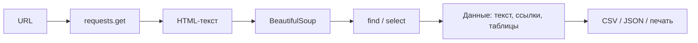
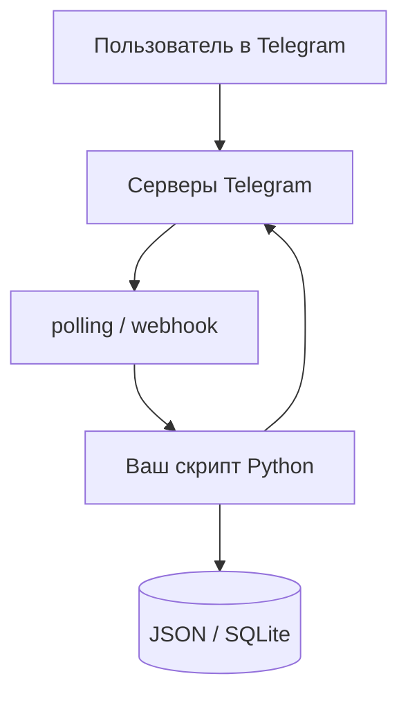
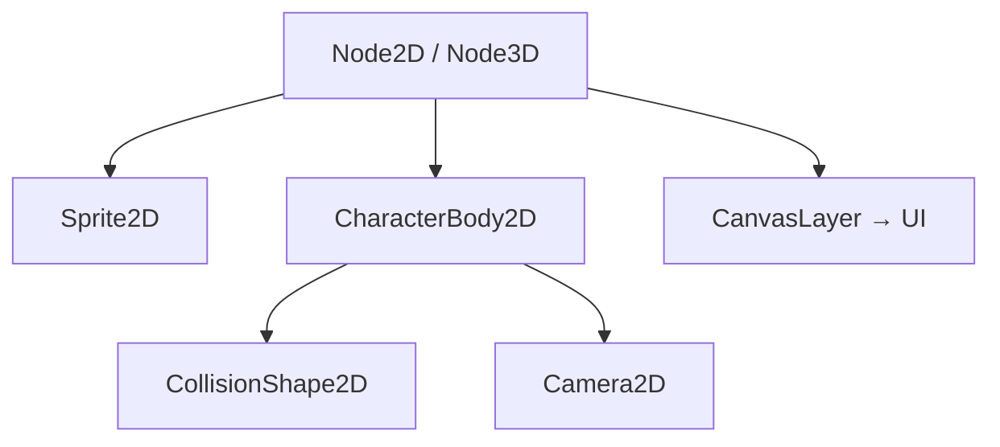
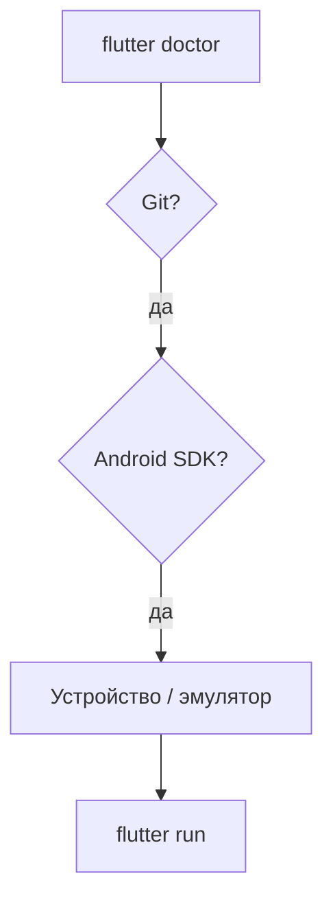
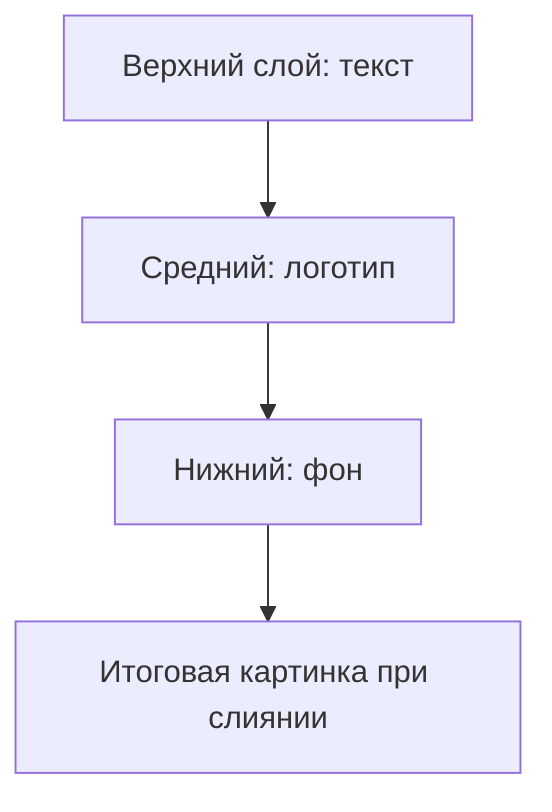
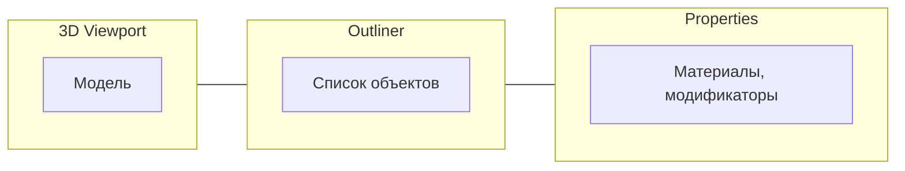
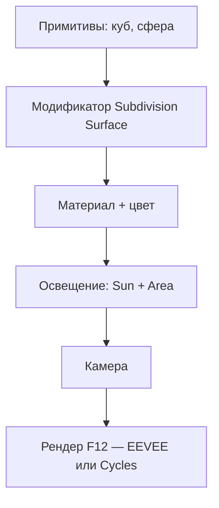
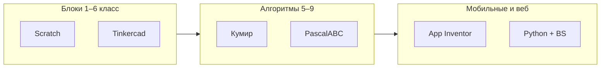
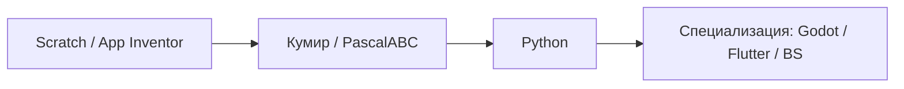
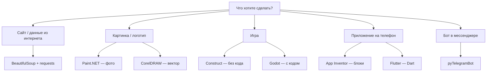

---
tags:
  - all
  - required
  - beginner
  - inprogress
title: Инструменты и среды разработки
description: >-
  Путеводитель по популярным средам — Python-библиотеки, графика, игры, мобильные
  приложения и школьные платформы — с ссылками на подробные главы энциклопедии.
related:
  - title: "Алгоритмы, языки и программирование"
    doc: encyclopedia/1-basics/1-035-bazovaya-informatika/4
  - title: "Для детей — о разделе"
    doc: encyclopedia/9-spinoff/9-11-dlya-detey/forkids
  - title: "Python — о разделе"
    doc: encyclopedia/5-languages/5-02-python/intro
  - title: "Разработка игр — о разделе"
    doc: encyclopedia/9-spinoff/9-04-razrabotka-igr/intro
---

import ExternalPlayEmbed from '@site/src/components/ExternalPlayEmbed';


# Инструменты и среды разработки

<div class="article-tags">
  <span class="tag tag-required">ОБЯЗАТЕЛЬНО</span>
  <span class="tag tag-beginner">ДЛЯ НОВИЧКОВ</span>
  <span class="tag tag-inprogress">В РАЗРАБОТКЕ</span>
</div>

<span class="complexity-badge">Всем</span>

На уроках информатики, в кружках и дома часто встречаются **конкретные программы и библиотеки** — BeautifulSoup, Blender, Godot и другие. Ниже по каждому инструменту.

- что он делает технически;
- с чего начать первый рабочий результат;
- типичные ошибки;
- идеи мини-проектов.

Маршрут по коду — [глава 4](./4), [Инструменты для детей](/encyclopedia/9-spinoff/9-11-dlya-detey/forkids).

---

## Как выбрать инструмент

| Критерий | Вопрос |
|----------|--------|
| **Цель** | Бот, игра, сайт, 3D, мобильное app? |
| **Среда** | Школьные ПК, лицензии, нужен интернет? |
| **Порог входа** | Блоки, визуальная среда или код с первого дня? |
| **Рост** | Хватит на один проект или на годы обучения? |

| Задача | Старт | Профессиональный путь |
|--------|-------|------------------------|
| Алгоритмы и код | [Кумир](/encyclopedia/9-spinoff/9-11-dlya-detey/5-kod/11), [PascalABC.NET](/encyclopedia/9-spinoff/9-11-dlya-detey/5-kod/10), [App Inventor](/encyclopedia/9-spinoff/9-11-dlya-detey/5-kod/9) | Python, [глава 4](/encyclopedia/1-basics/1-035-bazovaya-informatika/4) |
| 2D-игры | [Construct 3](/encyclopedia/9-spinoff/9-11-dlya-detey/2-video-games/27) | [Godot](/encyclopedia/9-spinoff/9-04-razrabotka-igr/113) |
| 3D и графика | [Tinkercad](/encyclopedia/9-spinoff/9-11-dlya-detey/3-development/18) | [Blender](/encyclopedia/9-spinoff/9-08-kompyuternaya-grafika/131) |
| Робототехника, LED, датчики | [Tinkercad Circuits](/encyclopedia/2-system-network/2-10-zhelezo/1013), [примеры Arduino/micro:bit](/lab/Примеры/1135) | Arduino IDE, MakeCode |
| Данные из веба | — | [BeautifulSoup](/encyclopedia/5-languages/5-02-python/316) |
| Мобильные app | App Inventor | [Flutter](/encyclopedia/5-languages/5-22-dart/311) |

---

## Сводная таблица

| Инструмент | Назначение | Кому | Подробнее |
|------------|------------|------|-----------|
| **BeautifulSoup** | Парсинг HTML после загрузки страницы | Python, старшие классы, автоматизация | [BeautifulSoup](/encyclopedia/5-languages/5-02-python/316.md) |
| **pyTelegramBot** (`telebot`) | Telegram-боты на Python | Кружки, хобби, простые боты | [Telegram-боты](/encyclopedia/5-languages/5-02-python/317.md) |
| **Paint.NET** | Растровая обработка изображений | Новички, школа, бытовые задачи | [Paint.NET и CorelDRAW](/encyclopedia/1-basics/1-16-grafika/7.md) |
| **CorelDRAW** | Векторная графика, макеты, печать | Дизайн, полиграфия | [Paint.NET и CorelDRAW](/encyclopedia/1-basics/1-16-grafika/7.md) |
| **Blender** | 3D-моделирование, анимация, рендер | Игры, кино, хобби | [Blender](/encyclopedia/9-spinoff/9-08-kompyuternaya-grafika/131.md) |
| **3ds Max** | Профессиональная 3D-визуализация | Студии, архитектура, игровые ассеты | [3ds Max](/encyclopedia/1-basics/1-16-grafika/8.md) |
| **Flutter** | Кроссплатформенные мобильные и десктоп UI | Разработчики на Dart | [Flutter](/encyclopedia/5-languages/5-22-dart/311.md) |
| **Godot** | Игровой движок 2D/3D, open source | Инди, школьные проекты | [Godot и Construct 3](/encyclopedia/9-spinoff/9-11-dlya-detey/2-video-games/27.md), [движки](/encyclopedia/9-spinoff/9-04-razrabotka-igr/113.md) |
| **Construct 3** | 2D-игры без кода (события) | Начинающие, браузер | [Godot и Construct 3](/encyclopedia/9-spinoff/9-11-dlya-detey/2-video-games/27.md) |
| **MIT App Inventor** | Android-приложения из блоков | Школа, первые мобильные app | [App Inventor](/encyclopedia/9-spinoff/9-11-dlya-detey/5-kod/9.md) |
| **PascalABC.NET** | Pascal в среде .NET для школ РФ | Уроки Pascal, олимпиады | [PascalABC.NET](/encyclopedia/9-spinoff/9-11-dlya-detey/5-kod/10.md), [Lab — типовые программы](/lab/Примеры/1140) |
| **Кумир** | Алгоритмический язык на русском, исполнители | ОГЭ, уроки информатики 5–9 класс | [Кумир](/encyclopedia/9-spinoff/9-11-dlya-detey/5-kod/11.md), [Lab — Чертёжник и Робот](/lab/Примеры/1115) |
| **Tinkercad** | 3D в браузере, 3D-печать; режим **Circuits** — Arduino и micro:bit | Дети, CAD-старт, кружок робототехники | [3D Design](/encyclopedia/9-spinoff/9-11-dlya-detey/3-development/18.md), [Circuits](/encyclopedia/2-system-network/2-10-zhelezo/1013), [примеры в Lab](/lab/Примеры/1135) |
| **CoSpaces Edu** | 3D/VR-сцены и простое кодирование | Уроки, VR-классы | [CoSpaces Edu](/encyclopedia/9-spinoff/9-11-dlya-detey/3-development/17.md) |

---

## Интерактив — витрина инструментов

Откройте витрину с конкретной целью — подобрать один инструмент под ваш мини-проект (бот, сайт, 3D-сцена, игра или мобильное приложение).

<ExternalPlayEmbed example="about/spirzen-online-tools-panel" title="Spirzen Online Tools Panel" />

После блока выберите один основной и один запасной инструмент. Такой "план Б" полезен, если первый вариант окажется слишком сложным или не подойдёт по условиям вашей школы/кружка.

---

## BeautifulSoup — парсинг веб-страниц

**BeautifulSoup** — библиотека Python для разбора HTML и XML. Она **не загружает** страницу из интернета сама: сначала нужен HTTP-клиент (`requests`, `httpx`, `urllib`). Это важно для экзамена и собеседований: парсер работает с **уже полученным** текстом.

Связь с курсом

- [Интернет и сетевые сервисы](./6)
- [Python — раздел](/encyclopedia/5-languages/5-02-python/intro)
- [Как работают сайты](/encyclopedia/2-system-network/2-04-kak-rabotayut-sayty-i-veb-sayty/intro)

### Когда BeautifulSoup — правильный выбор

| Ситуация | Подходит? |
|----------|-----------|
| Статическая HTML-страница с таблицей расписания | Да |
| Новости на сайте без тяжёлого JavaScript | Да |
| Личный блог, документация, википедия | Да |
| SPA (React/Vue), контент только после JS | Нет — Playwright/Selenium |
| Официальное API у сайта | Лучше API, не парсинг |
| Запрещено `robots.txt` | Нет — уважайте правила |

### Архитектура типичного скрипта



### Установка

**Windows / macOS / Linux** (нужен установленный Python 3.10+):

```bash
python -m pip install --upgrade pip
pip install beautifulsoup4 requests lxml
```

Проверка:

```bash
python -c "from bs4 import BeautifulSoup; import requests; print('OK')"
```

| Пакет | Почему важно |
|-------|-------|
| `beautifulsoup4` | Сама библиотека |
| `requests` | HTTP-запросы |
| `lxml` | Быстрый парсер (опционально `html.parser` встроен) |

Виртуальное окружение (рекомендуется):

```bash
python -m venv .venv
# Windows —
.venv\Scripts\activate
# Linux/macOS —
source .venv/bin/activate
pip install beautifulsoup4 requests lxml
```

### Минимальный пример — все ссылки

```python
import requests
from bs4 import BeautifulSoup

r = requests.get("https://example.com", timeout=10)
r.raise_for_status()
soup = BeautifulSoup(r.text, "lxml")
for a in soup.find_all("a", href=True):
    print(a["href"], "→", a.get_text(strip=True))
```

### Поиск по CSS-селектору

```python
titles = soup.select("h2.article-title")
for t in titles:
    print(t.get_text(strip=True))
```

`select` удобен, когда в HTML есть классы и вложенность — как в CSS. Откройте DevTools (F12) → вкладка Elements → правый клик на элемент → Copy → Copy selector.

### Извлечение таблицы

```python
table = soup.find("table", id="prices")
for row in table.find_all("tr")[1:]:
    cols = [c.get_text(strip=True) for c in row.find_all("td")]
    print(cols)
```

Первая строка `[1:]` часто заголовок — пропускаем её.

### Сохранение в CSV

```python
import csv

rows = []
table = soup.find("table")
for tr in table.find_all("tr")[1:]:
    rows.append([td.get_text(strip=True) for td in tr.find_all("td")])

with open("data.csv", "w", newline="", encoding="utf-8") as f:
    writer = csv.writer(f)
    writer.writerows(rows)
```

### Обработка кодировки

Если кириллица "кракозябрами":

```python
r.encoding = r.apparent_encoding
soup = BeautifulSoup(r.text, "lxml")
```

Или явно `response.content` с указанием кодировки в `BeautifulSoup`.

### Заголовки и этика запросов

```python
headers = {
    "User-Agent": "SchoolProject/1.0 (informatics class; contact@school.ru)"
}
r = requests.get(url, headers=headers, timeout=15)
```

- Читайте `robots.txt` сайта (`https://site.ru/robots.txt`).
- Делайте паузу между запросами (`time.sleep(1)`), не "ддосьте" чужой сервер.
- Для учебного проекта достаточно 1–2 страниц, не весь сайт.

### find и select — шпаргалка

| Метод | Синтаксис | Пример |
|-------|-----------|--------|
| `find` | Имя тега, атрибуты | `soup.find("div", class_="news")` |
| `find_all` | Список элементов | `soup.find_all("li")` |
| `select` | CSS-селектор | `soup.select("div.news > h3")` |
| `select_one` | Первый по CSS | `soup.select_one("#main")` |

### Что BeautifulSoup **не** умеет

| Ограничение | Решение |
|-------------|---------|
| Контент рисуется только JavaScript в браузере | [Selenium](/encyclopedia/5-languages/5-02-python/intro), Playwright |
| Сайт требует вход | Сессия `requests` с cookies или API |
| Защита от ботов (капча) | Официальное API, не обход капчи |
| Очень большой HTML | Потоковый парсинг, `lxml` iterparse |

### Troubleshooting BeautifulSoup

| Симптом | Причина | Что делать |
|---------|---------|------------|
| `NoneType` у `find` | Элемент не найден | Проверьте селектор в DevTools (F12) |
| Пустой список ссылок | SPA без серверного HTML | Playwright |
| `403 Forbidden` | Сервер блокирует бота | Заголовок `User-Agent`, уважайте `robots.txt` |
| `Connection timeout` | Сеть или блокировка | `timeout=`, повтор с паузой |
| Дубликаты | Несколько одинаковых тегов | `set()` или фильтр по атрибуту |
| `ModuleNotFoundError: bs4` | Не установлен пакет | `pip install beautifulsoup4` |
| Разный результат дома и в школе | Прокси, блокировка | Проверьте VPN и DNS |

### Идеи проектов (BeautifulSoup)

| Уровень | Проект |
|---------|--------|
| Начальный | Список заголовков новостей с одной статической страницы |
| Средний | Мониторинг цены товара (сравнение раз в день) |
| Старший | Агрегатор расписания с нескольких страниц в CSV |
| Олимпиадный | Парсинг + SQLite + простой веб-интерфейс на Flask |

### Вопросы для самопроверки (BeautifulSoup)

<details>
<summary>Загружает ли BeautifulSoup страницу по URL сам?</summary>

Нет. Нужен отдельный HTTP-клиент (`requests`, `httpx`, `urllib`). BeautifulSoup только разбирает уже полученный HTML-текст.
</details>

<details>
<summary>Чем `select` отличается от `find`?</summary>

`select` использует синтаксис CSS-селекторов (`div.class > p`). `find` ищет по имени тега и атрибутам (`find("div", class_="class")`).
</details>

<details>
<summary>Почему на сайте "пусто", хотя в браузере контент есть?</summary>

Контент подгружается JavaScript после загрузки страницы. BeautifulSoup видит только исходный HTML с сервера — нужен браузерный движок (Playwright) или API.
</details>

Подробнее — [BeautifulSoup](/encyclopedia/5-languages/5-02-python/316).

---

## pyTelegramBot — боты в Telegram

**pyTelegramBot** (`import telebot`) — популярная Python-обёртка над [Bot API](https://core.telegram.org/bots/api). Токен выдаёт [@BotFather](https://t.me/BotFather). Подходит для кружков, домашних проектов и первого опыта с сетевым API.

Связь с курсом

- [Интернет](./6)
- [Python](/encyclopedia/5-languages/5-02-python/intro)
- [Коммуникация](/encyclopedia/1-basics/1-22-kommunikatsiya-i-obschenie/intro)

### Установка

```bash
pip install pyTelegramBotAPI
```

Минимальная версия Python — 3.8+. Токен **никогда** не публикуйте в GitHub — используйте переменную окружения:

```python
import os
import telebot

bot = telebot.TeleBot(os.environ["TELEGRAM_BOT_TOKEN"])
```

В Windows PowerShell перед запуском:

```powershell
$env:TELEGRAM_BOT_TOKEN="123456:ABC..."
python bot.py
```

### Регистрация бота у BotFather

1. Откройте [@BotFather](https://t.me/BotFather) в Telegram.
2. Команда `/newbot` → имя и username (должен заканчиваться на `bot`).
3. Скопируйте токен в безопасное место.
4. Опционально: `/setdescription`, `/setcommands` для меню команд.

### Минимальный бот

```python
import telebot

bot = telebot.TeleBot("TOKEN")

@bot.message_handler(commands=["start"])
def start(m):
    bot.reply_to(m, "Привет! Напиши /help")

@bot.message_handler(commands=["help"])
def help_cmd(m):
    bot.reply_to(m, "Доступные команды: /start, /help")

bot.infinity_polling()
```

Бот должен **постоянно работать** (на ПК, VPS или хостинге), иначе не ответит. Состояние пользователей хранят в `dict`, JSON или SQLite.

### Обработка текста и кнопок

```python
@bot.message_handler(func=lambda m: True)
def echo(m):
    bot.reply_to(m, f"Вы написали: {m.text}")

from telebot.types import ReplyKeyboardMarkup, KeyboardButton

markup = ReplyKeyboardMarkup(resize_keyboard=True)
markup.add(KeyboardButton("Расписание"), KeyboardButton("Помощь"))

@bot.message_handler(commands=["menu"])
def menu(m):
    bot.send_message(m.chat.id, "Выберите:", reply_markup=markup)
```

### Архитектура школьного бота



| Режим | Плюсы | Минусы |
|-------|-------|--------|
| **polling** (`infinity_polling`) | Просто, работает дома | ПК должен быть включён |
| **webhook** | Для сервера 24/7 | Нужен HTTPS и домен |

Для первого проекта — только polling.

### Troubleshooting pyTelegramBot

| Проблема | Решение |
|----------|---------|
| Бот не отвечает | Скрипт не запущен или неверный токен |
| `409 Conflict` | Два процесса с одним токеном — закройте дубликат |
| Долгий ответ | Тяжёлую работу в отдельный поток |
| `401 Unauthorized` | Токен скопирован с ошибкой или отозван в BotFather |
| Бот видит не все сообщения в группе | Отключите Privacy Mode в BotFather или упоминайте @bot |
| Кракозябры | Файл `.py` в UTF-8, в начале `# -*- coding: utf-8 -*-` не обязателен в Py3 |

### Идеи проектов (pyTelegramBot)

| Уровень | Проект |
|---------|--------|
| День 1 | Эхо-бот + /help |
| Неделя | Опрос "какой урок завтра" с кнопками |
| 2 недели | Напоминания о дедлайне (данные в JSON) |
| Месяц | Бот "школьная библиотека" — поиск по списку книг |

### Вопросы для самопроверки

<details>
<summary>Почему бот "молчит", хотя код без ошибок?</summary>

Скрипт не запущен или завершился после старта. Нужен работающий процесс с `infinity_polling()` или webhook на сервере.
</details>

<details>
<summary>Можно ли хранить токен прямо в коде на GitHub?</summary>

Нет — токен станет публичным, ботом смогут воспользоваться другие. Используйте переменные окружения и `.gitignore`.
</details>

Подробнее — [Telegram-боты](/encyclopedia/5-languages/5-02-python/317).

---

## Godot 4 — игровой движок

**Godot** — open-source движок с узлами (Node), сценами и скриптами на **GDScript** (похож на Python), C# или GDExtension. Версия **4.x** — актуальная для новых проектов; в туториалах уточняйте версию.

Связь с курсом

- [Разработка игр](/encyclopedia/9-spinoff/9-04-razrabotka-igr/intro)
- [Алгоритмы](./4)
- [Blender](#blender--3d-моделирование-и-анимация) для 3D-ассетов

### Установка Godot 4

| Платформа | Действие |
|-----------|----------|
| **Windows** | [godotengine.org](https://godotengine.org/download) → Standard (не .NET, если не нужен C#) |
| **macOS** | DMG, разрешить в "Безопасность" при первом запуске |
| **Linux** | AppImage или движок из репозитория |

После установки: **Editor → Manage Export Templates** — скачайте шаблоны той же версии, иначе экспорт не сработает.

<div class="callout callout--tip">
  <div class="callout-title">Godot и Construct 3</div>

  <div class="callout-body">
  <strong>Construct 3</strong> — быстрее первый результат без кода. <strong>Godot</strong> — код, рост до инди-релиза, бесплатный экспорт. Типичный маршрут: Construct в 5–7 классе → Godot в 8–11. Сравнение — <a href="/encyclopedia/9-spinoff/9-11-dlya-detey/2-video-games/27">глава для детей</a>.
</div>
</div>

### Модель "сцена + узлы"



Каждый узел — компонент: спрайт, физика, звук, UI. **Сцена** (.tscn) — сохранённое дерево узлов; сцены вкладывают друг в друга (игрок как отдельная сцена).

### Первый проект — новый 2D

1. Project Manager → New → 2D.
2. Сохраните проект в папку без кириллицы в пути (меньше проблем на Windows).
3. Добавьте `CharacterBody2D` → дочерние `Sprite2D` + `CollisionShape2D`.
4. Привяжите скрипт к `CharacterBody2D`.

### Движение персонажа 2D

```gdscript
extends CharacterBody2D

@export var speed = 200.0

func _physics_process(delta):
    var direction = Input.get_vector("ui_left", "ui_right", "ui_up", "ui_down")
    velocity = direction * speed
    move_and_slide()
```

`@export` — параметр виден в инспекторе без правки кода.

### Ввод и действия (Input Map)

Project → Project Settings → Input Map: задайте `move_left`, `move_right` на WASD и стрелки. В коде:

```gdscript
velocity.x = Input.get_axis("move_left", "move_right") * speed
velocity.y = Input.get_axis("move_up", "move_down") * speed
move_and_slide()
```

### Сигналы (события)

```gdscript
func _on_area_2d_body_entered(body):
    if body.name == "Player":
        get_tree().change_scene_to_file("res://levels/level2.tscn")
```

В редакторе: выделите `Area2D` → вкладка Node → сигнал `body_entered` → подключить к функции на родителе. Аналог "событий" в Construct.

### Сцены и автозагрузка

| Понятие | Описание |
|---------|----------|
| **PackedScene** | Сохранённая сцена — `preload("res://player.tscn")` |
| **Autoload** | Синглтон (менеджер очков, музыки) — Project → Autoload |
| **Groups** | Теги узлов — `add_to_group("enemies")` |

### UI — счёт и меню

```gdscript
# В узле Label, при сборе монеты —
$Label.text = "Очки: " + str(score)
```

Для кнопки "Старт": `Button.pressed.connect(_on_start_pressed)`.

### Экспорт

Project → Export → Add → Windows / Android / Web.

| Платформа | Дополнительно |
|-----------|---------------|
| **Windows** | Export Templates, один .exe |
| **Android** | JDK, Android SDK — мастер в редакторе |
| **Web** | Экспорт HTML5 — нужен веб-сервер для теста |

### Godot 3D — старт за один урок

1. New Project → 3D.
2. Добавьте `MeshInstance3D` (куб), `DirectionalLight3D`, `Camera3D`.
3. `CharacterBody3D` + цилиндр — игрок; скрипт движения как в 2D, но `Vector3`.
4. Импорт `.glb` из Blender: перетащить в FileSystem.

### Сравнение Godot и Unity

| Критерий | Godot 4 | Unity |
|----------|---------|-------|
| Лицензия | MIT, бесплатно | Персональная бесплатна с лимитами |
| Язык | GDScript, C# | C# |
| Размер | Лёгкий редактор | Тяжелее |
| Школа | Часто на кружках | Реже из-за ресурсов ПК |

### Troubleshooting Godot

| Симптом | Решение |
|---------|---------|
| Персонаж проваливается | Нет `CollisionShape2D` или слои коллизий (Layer/Mask) |
| Не двигается | Скрипт не на `CharacterBody2D`; нет `move_and_slide()` |
| Чёрный экран | Нет `Camera2D` / `Camera3D`; объект вне кадра |
| Ошибка при экспорте | Export Templates той же версии |
| Лаги на слабом ПК | Меньше разрешение, отключите тени в 3D |
| Сигнал не срабатывает | Monitoring у Area2D; collision layers |
| "Parse error" в GDScript | Отступы табами; проверьте двоеточия после `func` |

### Идеи проектов (Godot)

| Уровень | Проект |
|---------|--------|
| 1–2 недели | Платформер с одним уровнем и монетами |
| Месяц | Top-down игра с несколькими уровнями и меню |
| Кружок | Визуальная новелла с диалогами (Control + кнопки) |
| 3D старт | Катание шара по плоскости с препятствиями |
| ОГЭ/проект | Обучающая игра по предмету (викторина + уровни) |

### Вопросы для самопроверки (Godot)

<details>
<summary>Что такое сцена (.tscn) в Godot?</summary>

Сохранённое дерево узлов — "шаблон" объекта или уровня. Сцену можно инстанцировать много раз (враги, монеты).
</details>

<details>
<summary>Зачем CharacterBody2D, а не просто Node2D?</summary>

`CharacterBody2D` встроенно работает с физикой и `move_and_slide()` — столкновения со стенами и полом.
</details>

[Godot](/encyclopedia/9-spinoff/9-04-razrabotka-igr/113), [Construct и Godot](/encyclopedia/9-spinoff/9-11-dlya-detey/2-video-games/27).

---

## Flutter — кроссплатформенный UI

**Flutter** — UI-фреймворк на **Dart** от Google. Одна кодовая база → Android, iOS, Web, Windows, macOS, Linux. Виджеты рисуются движком Skia — внешний вид одинаковый на платформах.

Связь с курсом

- [Dart](/encyclopedia/5-languages/5-22-dart/intro)
- [Мобильные приложения](/encyclopedia/4-code-dev/4-12-mobilnye-prilozheniya/intro)
- [App Inventor](#mit-app-inventor) как более простой старт

### Установка Flutter SDK

**Windows (кратко):**

1. Скачайте ZIP с [flutter.dev](https://docs.flutter.dev/get-started/install/windows).
2. Распакуйте в `C:\src\flutter` (без пробелов в пути).
3. Добавьте `C:\src\flutter\bin` в переменную PATH.
4. Установите [Git for Windows](https://git-scm.com/) — требуется Flutter.
5. Android Studio — для Android SDK и эмулятора.
6. В терминале: `flutter doctor` — исправьте все красные пункты.



| Команда | Назначение |
|---------|------------|
| `flutter doctor -v` | Подробная диагностика |
| `flutter devices` | Список телефонов и эмуляторов |
| `flutter create myapp` | Новый проект |
| `flutter pub get` | Скачать зависимости из pubspec.yaml |
| `flutter run` | Сборка и запуск |
| `r` в консоли | Hot reload |
| `R` | Hot restart |

### Старт проекта

```bash
flutter create myapp
cd myapp
flutter run
```

Нужен установленный [Flutter SDK](/encyclopedia/5-languages/5-22-dart/intro) и эмулятор или телефон с USB-отладкой.

**USB-отладка на Android:** Настройки → О телефоне → 7 раз "Номер сборки" → Для разработчиков → Отладка по USB.

### Структура проекта

| Путь | Назначение |
|------|------------|
| `lib/main.dart` | Точка входа, основной UI |
| `pubspec.yaml` | Зависимости, шрифты, картинки |
| `android/`, `ios/` | Нативные оболочки магазинов |
| `test/` | Модульные тесты |
| `web/` | Сборка под браузер |

### Минимальное приложение

```dart
import 'package:flutter/material.dart';

void main() => runApp(const MyApp());

class MyApp extends StatelessWidget {
  const MyApp({super.key});

  @override
  Widget build(BuildContext context) {
    return MaterialApp(
      home: Scaffold(
        appBar: AppBar(title: const Text('Моё app')),
        body: const Center(child: Text('Привет, Flutter!')),
      ),
    );
  }
}
```

### StatelessWidget и StatefulWidget

| Тип | Когда |
|-----|-------|
| **StatelessWidget** | Текст, иконка — не меняется сам |
| **StatefulWidget** | Счётчик, форма, список с добавлением |

### Список элементов

```dart
body: ListView(
  children: const [
    ListTile(title: Text('Пункт 1'), leading: Icon(Icons.star)),
    ListTile(title: Text('Пункт 2'), leading: Icon(Icons.star)),
  ],
),
```

Для длинных списков — `ListView.builder` (ленивая подгрузка).

### StatefulWidget — счётчик

```dart
class CounterPage extends StatefulWidget {
  const CounterPage({super.key});
  @override
  State<CounterPage> createState() => _CounterPageState();
}

class _CounterPageState extends State<CounterPage> {
  int count = 0;

  @override
  Widget build(BuildContext context) {
    return Scaffold(
      body: Center(child: Text('Счёт: $count')),
      floatingActionButton: FloatingActionButton(
        onPressed: () => setState(() => count++),
        child: const Icon(Icons.add),
      ),
    );
  }
}
```

`setState` перерисовывает виджет с новым значением.

### Навигация между экранами

```dart
Navigator.push(
  context,
  MaterialPageRoute(builder: (context) => const SecondPage()),
);
```

### Пакет shared_preferences — простое хранение

В `pubspec.yaml`:

```yaml
dependencies:
  shared_preferences: ^2.2.0
```

Сохранение строки "последний урок" локально на телефоне — типичный школьный проект.

### Flutter и App Inventor

| Критерий | App Inventor | Flutter |
|----------|--------------|---------|
| Порог входа | Блоки, 1–2 урока | Код Dart, недели |
| Платформы | В основном Android | Android, iOS, web, desktop |
| Рост | До школьного проекта | До коммерческого app |
| Интернет в школе | Браузер + телефон | SDK, эмулятор, место на диске |

### Troubleshooting Flutter

| Симптом | Решение |
|---------|---------|
| `flutter doctor` красный | Android Studio / Xcode по подсказкам |
| Не видит телефон | USB-отладка, драйвер OEM, кабель с данными |
| Долгая первая сборка | Gradle качает зависимости — норма 10–20 мин |
| Hot reload не сработал | Hot restart (R) или полный restart |
| Overflow жёлто-чёрные полосы | `SingleChildScrollView`, `Expanded`, меньше виджетов |
| `Gradle task assembleDebug failed` | `flutter clean`, проверьте JDK 17 |
| Кириллица в пути проекта | Перенесите проект в папку без русских букв |

### Идеи проектов (Flutter)

| Уровень | Проект |
|---------|--------|
| Неделя 1 | Счётчик / todo с добавлением строк |
| Неделя 2–3 | Калькулятор или конвертер валют (API) |
| Месяц | Приложение "расписание уроков" с локальным хранением |
| С командой | Мини-каталог школьного музея с фото |
| Выпускной | Справочник формул с поиском |

### Вопросы для самопроверки (Flutter)

<details>
<summary>На каком языке пишут логику Flutter?</summary>

На Dart. Разметка тоже на Dart — виджеты в коде, не отдельный XML как в старых Android-проектах.
</details>

<details>
<summary>Что делает hot reload?</summary>

Подгружает изменения кода без полной пересборки — UI обновляется за секунды. Не срабатывает при смене `main()` или некоторых глобальных инициализаций — тогда hot restart.
</details>

Маршрут: [Dart](/encyclopedia/5-languages/5-22-dart/intro) → [Flutter](/encyclopedia/5-languages/5-22-dart/311).

---

## Construct 3 — 2D без кода

**Construct 3** — браузерный редактор: логика через **события** (Event sheet).

| Паттерн | Пример |
|---------|--------|
| Условие → действие | `Keyboard → On Space pressed` → `Player → Simulate jump` |
| Столкновение | `Player` + `Coin` → `Destroy Coin`, `Add 1 to score` |
| Таймер | `Every 2 seconds` → `Spawn enemy` |

**Плюсы:** быстрый результат, HTML5-экспорт. **Минусы:** подписка, сложнее масштабировать очень большие проекты.

### Идеи проектов

- Бесконечный раннер с одной кнопкой.
- Аркада "собери звёзды за 60 секунд".
- Викторина с переключением layout'ов.

---

## Графика и 3D — обзор

Растр, вектор и 3D решают **разные задачи**. На уроках технологии и в кружках дизайна часто встречаются все три направления — ниже по каждому инструменту отдельный гайд.

| Задача | Инструмент | Формат результата |
|--------|------------|-------------------|
| Фото и ретушь | Paint.NET | `.png`, `.jpg` |
| Логотип, визитка, печать | CorelDRAW | `.cdr`, `.pdf` |
| 3D-модель, анимация, игровой ассет | Blender | `.blend`, `.fbx`, `.glb` |
| Архитектурная визуализация, студии | 3ds Max | `.max`, рендер `.png` |

Теория форматов — [Графика — о разделе](/encyclopedia/1-basics/1-16-grafika/intro). Сравнение растрового и векторного — [Графика, глава 2](/encyclopedia/1-basics/1-16-grafika/2).

---

## Paint.NET — растровая графика

**Paint.NET** — бесплатный редактор растровых изображений для Windows. Работает с пикселями: фото, скриншоты, текстуры для игр.

### Установка Paint.NET

1. Скачайте установщик с [getpaint.net](https://www.getpaint.net/) — только официальный сайт.
2. Запустите `.exe`, примите лицензию, оставьте путь по умолчанию.
3. При первом запуске выберите язык интерфейса (есть русский).
4. Опционально — пакет плагинов с форумов сообщества (фильтры, эффекты).

<div class="callout callout--note">
  <div class="callout-title">Школьный ПК</div>

  <div class="callout-body">
  Если установка запрещена политикой школы — используйте портативную версию с флешки (с разрешения учителя) или онлайн-редактор в браузере. Для экзамена по информатике обычно достаточно знать <strong>назначение</strong> растрового редактора, а не все кнопки.
</div>
</div>

### Интерфейс — что где искать

| Элемент | Назначение |
|---------|------------|
| **Палитра инструментов** слева | Выделение, кисть, заливка, текст, ластик |
| **Панель слоёв** справа внизу | Несколько слоёв — фон, текст, эффекты отдельно |
| **История** | Отмена шагов — Ctrl+Z |
| **Меню "Корректировка"** | Яркость, контраст, оттенок |
| **Файл → Сохранить как** | PNG с прозрачностью или JPG для фото |

### Первый проект — постер к школьному мероприятию

1. Файл → Создать — 1920×1080 пикселей.
2. Заливка фона градиентом (плагин или два слоя).
3. Слой "Текст" — заголовок мероприятия, шрифт крупный.
4. Вставка логотипа школы (Файл → Вставить из файла).
5. Сохранить как PNG для экрана, JPG для печати.

### Слои — зачем нужны



Без слоёв правка заголовка затирает фон. Со слоями — двигаете только текст.

### Troubleshooting Paint.NET

| Симптом | Причина | Решение |
|---------|---------|---------|
| Размытый текст после масштаба | Растр не масштабируется без потери | Вектор в CorelDRAW или крупный шрифт сразу |
| Нет прозрачности в JPG | JPG не поддерживает альфа-канал | Сохраняйте PNG |
| Программа "вылетает" на большом файле | Мало ОЗУ | Уменьшите разрешение холста |
| Плагин не виден | Не в папке Effects | Проверьте путь в настройках |

### Идеи проектов (Paint.NET)

| Уровень | Проект |
|---------|--------|
| 1 урок | Обрезка и яркость школьного фото |
| Неделя | Коллаж из 5 фото с рамками |
| Месяц | Набор иконок 64×64 для сайта или игры |
| Портфолио | Серия баннеров для соцсети класса |

Подробнее — [Paint.NET и CorelDRAW](/encyclopedia/1-basics/1-16-grafika/7).

---

## CorelDRAW — векторная графика

**CorelDRAW** — профессиональный векторный редактор. Объекты — кривые Безье, а не сетка пикселей: логотип масштабируется на визитку и на баннер без "мыла".

### Установка и лицензия

- Коммерческая лицензия — пробный период, подписка или покупка.
- В школах иногда стоит учебная версия — уточните у учителя технологии.
- Формат проекта — `.cdr`; для обмена — `.pdf`, `.svg`, `.eps`.

### Базовые инструменты

| Инструмент | Для чего |
|------------|----------|
| **Прямоугольник / Эллипс** | Простые формы |
| **Кривые (Pen)** | Произвольный контур |
| **Текст** | Надписи с обтеканием по контуру |
| **Заливка и контур** | Цвет, толщина линии, градиент |
| **Сглаживание узлов** | Ровные логотипы |

### Первый проект — визитка

1. Новый документ — размер визитки 90×50 мм, поля 3 мм.
2. Прямоугольник фона, цвет школы.
3. Текст: имя, класс, контакт.
4. Простой значок из примитивов или импорт SVG.
5. Экспорт в PDF для типографии.

### Растр и вектор — когда что

| Критерий | Paint.NET (растр) | CorelDRAW (вектор) |
|----------|-------------------|---------------------|
| Фотография | Да | Нет (только вставка как картинка) |
| Логотип для печати | Плохо при увеличении | Идеально |
| Текстуры для игр | Да | Редко |
| Учебная лицензия в школе | Часто бесплатно | Реже |

### Troubleshooting CorelDRAW

| Симптом | Решение |
|---------|---------|
| Шрифт "квадратиками" | Установите шрифт в Windows или замените |
| PDF не открывается в типографии | Встройте шрифты при экспорте |
| Объекты "разъехались" | Группировка Ctrl+G перед перемещением |
| Тяжёлый файл | Упростите эффекты тени и размытия |

Подробнее — [Paint.NET и CorelDRAW](/encyclopedia/1-basics/1-16-grafika/7), [Векторная графика](/encyclopedia/1-basics/1-16-grafika/3).

---

## Blender — 3D-моделирование и анимация

**Blender** — бесплатный open-source пакет полного цикла: моделирование, UV-развёртка, материалы, анимация, рендер, даже монтаж видео. Используют в инди-играх, на YouTube и в школах на факультативах "3D и дизайн".

### Установка Blender

| Платформа | Шаги |
|-----------|------|
| **Windows** | [blender.org/download](https://www.blender.org/download/) → Installer (.msi) или Portable (.zip) |
| **macOS** | DMG, перетащить в Applications |
| **Linux** | Snap, Flatpak или tar.xz с сайта |

Рекомендуемая версия для новичков — **последняя LTS** (долгая поддержка). После установки при первом запуске можно выбрать мастер настройки — оставьте defaults, если не уверены.

**Системные требования (ориентир):**

| Компонент | Минимум | Комфорт |
|-----------|---------|---------|
| ОЗУ | 8 ГБ | 16 ГБ+ |
| Видеокарта | Поддержка OpenGL 4.3 | Дискретная GPU для Cycles |
| Место на диске | 1 ГБ | 5+ ГБ с ассетами |

### Интерфейс Blender — первые 10 минут



| Зона | Назначение |
|------|------------|
| **3D Viewport** | Вращение средней кнопкой мыши, масштаб колёсиком |
| **Outliner** | Иерархия объектов сцены |
| **Properties** | Материалы, модификаторы, рендер |
| **Timeline** | Кадры анимации |
| **Tab** | Переключение Edit Mode / Object Mode |

Горячие клавиши (запомните тройку):

- **G** — переместить (Grab)
- **R** — повернуть (Rotate)
- **S** — масштаб (Scale)
- **X / Delete** — удалить
- **Shift+A** — добавить объект

### Пайплайн школьного проекта



### Урок 1 — комната low-poly

1. Удалите куб по умолчанию или оставьте как стол.
2. Shift+A → Mesh → Plane — пол; S — растянуть.
3. Plane + Extrude (E) — стены.
4. Shift+A → Light → Sun — освещение.
5. Shift+A → Camera — нажмите Numpad 0 для вида с камеры.
6. Render Properties → Engine: **EEVEE** (быстрее для слабых ПК).
7. F12 — рендер, Image → Save As.

### Модификатор Subdivision Surface

Добавьте кубу модификатор **Subdivision Surface** (уровень 2) — грани сглаживаются. Комбинация с **Bevel** даёт "мягкий" low-poly стиль для игр.

### UV и текстуры (кратко)

Для игры в Godot нужна **развёртка UV**: Edit Mode → U → Smart UV Project. Затем в Shading — Image Texture на материал. Подробнее — [Blender в энциклопедии](/encyclopedia/9-spinoff/9-08-kompyuternaya-grafika/131).

### Экспорт в Godot / Unity

| Формат | Когда |
|--------|-------|
| **.glb / .gltf** | Универсальный для Godot 4, веб |
| **.fbx** | Часто для Unity и анимации |
| **.blend** | Прямо в Godot (ограниченно) |

File → Export → glTF 2.0 (.glb). В Godot: перетащите файл в папку `res://`.

### Рендер — EEVEE и Cycles

| Движок | Скорость | Качество | Школьный ПК |
|--------|----------|----------|-------------|
| **EEVEE** | Быстро, почти в реальном времени | Хорошо для стилизации | Рекомендуется |
| **Cycles** | Медленно | Фотореализм, тени | Нужна мощная GPU |

### Troubleshooting Blender

| Симптом | Причина | Решение |
|---------|---------|---------|
| Чёрный рендер | Нет света или камеры вне сцены | Добавьте Sun, проверьте Numpad 0 |
| Объект не виден | Масштаб 0 или внутри другого меша | Outliner → выделить, Alt+G сброс позиции |
| "Non-manifold" при 3D-печати | Дыры в сетке | 3D Print Toolbox, исправление в Edit Mode |
| Вылет при рендере | Нехватка VRAM | EEVEE, меньше samples |
| Мышь "не так" вращает | Настройки навигации | Edit → Preferences → Navigation → Blender |
| Русская раскладка ломает горячие клавиши | G, R, S — буквы | Переключите на EN при работе в 3D |

### Идеи проектов (Blender)

| Уровень | Проект | Связь с курсом |
|---------|--------|----------------|
| 2 урока | Куб + сфера + стол, один рендер | [Графика](/encyclopedia/1-basics/1-16-grafika/intro) |
| 2 недели | Low-poly комната + 5 сек анимации камеры | Экспорт кадра в презентацию |
| Месяц | Персонаж-стилизованный "робот" для Godot | [Godot](/encyclopedia/9-spinoff/9-04-razrabotka-igr/113) |
| Кружок | Короткий ролик с титрами в Video Sequencer | [Видео](/encyclopedia/1-basics/1-16-grafika/5) |

### Сравнение Blender и 3ds Max

| Критерий | Blender | 3ds Max |
|----------|---------|---------|
| Цена | Бесплатно | Платная подписка Autodesk |
| Школа | Часто на факультативах | Реже, курсы дизайна |
| Игры | glTF, Godot, Unity | FBX, студийный пайплайн |
| Обучение | Огромное сообщество, русские туториалы | Профессиональные курсы |

[Blender — раздел](/encyclopedia/9-spinoff/9-08-kompyuternaya-grafika/131), [3ds Max](/encyclopedia/1-basics/1-16-grafika/8).

---

## 3ds Max — кратко для ориентира

**3ds Max** — студийный стандарт архитектурной визуализации и игровых студий среднего/крупного масштаба. В школьной программе обычно **упоминают**, но редко ставят на все ПК из-за лицензии.

| Если ваша цель… | Старт |
|-----------------|-------|
| Хобби, инди, школа | Blender |
| Архитектурный колледж, вуз дизайна | Изучить интерфейс Max по курсу учебного заведения |
| Игры | Blender → Godot; Max — позже на стажировке |

Подробнее — [3ds Max](/encyclopedia/1-basics/1-16-grafika/8).

---

## Школьные и детские среды

Ниже — среды, которые чаще всего встречаются в российской школе: от блоков в начальной школе до Pascal и Кумир на ОГЭ. Для каждой — установка, первый проект, типичные ошибки и куда расти дальше.



### Scratch

| | |
|---|---|
| **Где** | [scratch.mit.edu](https://scratch.mit.edu) — браузер, бесплатно |
| **Установка** | Не нужна; офлайн — Scratch Desktop с сайта |
| **Идея** | Спрайты + блоки + сцена; событие "когда зелёный флаг" |
| **Первый проект** | Кот двигается по стрелкам (`when key pressed` → `move 10 steps`) |
| **Типичная ошибка** | Блоки не внутри `forever` / `when green flag clicked` |
| **Второй проект** | Счёт очков при касании монеты (`if touching` → `change score`) |
| **Рост** | [Python](/encyclopedia/5-languages/5-02-python/intro), [глава 4](./4) |

**Установка Scratch Desktop (Windows):**

1. scratch.mit.edu/download → Scratch Desktop.
2. Установщик → запуск без прав админа, если разрешено.
3. Войти в аккаунт — проекты синхронизируются в облаке MIT.

| Troubleshooting | Решение |
|-----------------|---------|
| Проект не сохраняется | Войти в аккаунт; проверить интернет |
| Нет звука | Разрешить микрофон/динамики в браузере |
| Лагает на слабом ПК | Меньше спрайтов, упростить костюмы |

[Scratch — глава](/encyclopedia/9-spinoff/9-11-dlya-detey/5-kod/3)

### Кумир

| | |
|---|---|
| **Сайт** | [kpolyakov.spb.ru/kumir](https://kpolyakov.spb.ru/kumir/) |
| **Установка** | Windows installer / portable; Linux — из репозитория |
| **Язык** | Русский алгоритмический, исполнители **Робот** и **Чертёжник** |
| **Для чего** | ОГЭ, визуализация алгоритмов на поле, контрольные 5–9 класс |
| **Первый проект** | Робот обходит стену к клетке |
| **Ошибки** | Путаница "вверх" на поле и в координатах; бесконечный цикл без условия выхода |
| **Файлы** | `.kum` |

```kumir
использовать Робот
алг
  опустить кисть
  нц 4 раза
    вперед(5)
    вправо(90)
  кц
кон
```

**Типовые конструкции для ОГЭ:**

| Конструкция | Пример |
|-------------|--------|
| Цикл `нц … раз` | Повторить N шагов |
| `пока …` | Пока не уперся в стену |
| `если … то` | Выбор направления |
| Вложенные циклы | Обход прямоугольника |

| Troubleshooting | Решение |
|-----------------|---------|
| Робот "не туда" | Проверьте начальную ориентацию и "вверх" поля |
| Программа не останавливается | Условие выхода из `пока` |
| Не рисуется линия | `опустить кисть` перед движением |

[Кумир](/encyclopedia/9-spinoff/9-11-dlya-detey/5-kod/11), [Lab — примеры](/lab/Примеры/1115), [ОГЭ — алгоритмы](/encyclopedia/4-code-dev/4-01-algoritmy/intro)

### PascalABC.NET

| | |
|---|---|
| **Сайт** | [pascalabc.net](https://pascalabc.net/) |
| **Установка** | Installer для Windows; встроенный компилятор |
| **Среда** | Pascal на .NET, русские ключевые слова опционально |
| **Для чего** | Школьный Pascal, олимпиады, подготовка к ЕГЭ по информатике |
| **Первый проект** | Ввод двух чисел, вывод суммы |
| **Ошибки** | `integer` overflow; путаница `=` и `:=` |
| **Рост** | [C#](/encyclopedia/5-languages/5-05-csharp/intro), [Python](/encyclopedia/5-languages/5-02-python/intro) |

```pascal
var a, b: integer;
begin
  readln(a);
  readln(b);
  writeln(a + b);
end.
```

| Элемент Pascal | Назначение |
|----------------|------------|
| `var` | Объявление переменных |
| `:=` | Присваивание |
| `readln` / `writeln` | Ввод / вывод |
| `for`, `while`, `repeat` | Циклы |

[Lab — типовые программы](/lab/Примеры/1140), [PascalABC](/encyclopedia/9-spinoff/9-11-dlya-detey/5-kod/10)

### MIT App Inventor

| | |
|---|---|
| **Где** | [appinventor.mit.edu](https://appinventor.mit.edu) — браузер |
| **Companion** | Приложение MIT AI2 Companion на Android |
| **Идея** | Блоки как Scratch, но для телефона — кнопки, GPS, камера |
| **Первый проект** | Кнопка "Сказать привет" через `TextToSpeech` |
| **Ошибки** | Не установлен Companion; блоки не соединены по типу (пазлы) |
| **Экспорт** | APK для Android — Build → App |

**Пошаговая установка на телефон:**

1. На ПК: создайте проект, подключите телефон по Wi‑Fi в одной сети.
2. На телефоне: установите Companion из Google Play.
3. В меню Connect → AI Companion — отсканируйте QR.
4. Изменения на ПК сразу видны на телефоне.

| Компонент | Школьный проект |
|-----------|-----------------|
| Button + TextToSpeech | Голосовой помощник |
| Camera | Фото-дневник |
| TinyDB | Сохранение заметок локально |
| Accelerometer | "Встряхни — смени цитату" |

[App Inventor](/encyclopedia/9-spinoff/9-11-dlya-detey/5-kod/9)

### Tinkercad

| **Режим** | **Задача** | **Экспорт** |
|-----------|------------|-------------|
| 3D Design | Примитивы, вычитание (отверстие) | STL для 3D-принтера |
| Circuits | Arduino / micro:bit, LED, кнопка | Симуляция, код |
| Codeblocks | Визуальные блоки для 3D-паттернов | 3D-модель |

**Регистрация:** tinkercad.com — аккаунт Autodesk (бесплатно для учёбы).

**Первый проект 3D:** брелок с инициалами — текст `Text` → выдавить `Extrude`.

**Первый проект Circuits:** LED + резистор 220 Ом + кнопка → мигание по нажатию.

| Проблема | Решение |
|----------|---------|
| Модель "дырявая" для печати | Solid, толщина стенок ≥ 2 мм |
| Схема не симулируется | Провода к правильным пинам; общий GND |
| Не логинится в школе | Проверьте блокировку Autodesk |

[Tinkercad 3D](/encyclopedia/9-spinoff/9-11-dlya-detey/3-development/18), [Circuits](/encyclopedia/2-system-network/2-10-zhelezo/1013), [Arduino](/encyclopedia/2-system-network/2-10-zhelezo/intro)

### CoSpaces Edu

| | |
|---|---|
| **Назначение** | 3D-сцены в браузере, Blockly/CoBlocks, VR-просмотр |
| **Для кого** | Уроки истории, виртуальные музеи, презентации |
| **Первый проект** | Комната с экспонатами и подписями |
| **Код** | Blockly — вращение объекта по клику |

[CoSpaces Edu](/encyclopedia/9-spinoff/9-11-dlya-detey/3-development/17)

### Сравнение школьных сред

| Среда | Класс | Код | Офлайн | Экзамен |
|-------|-------|-----|--------|---------|
| Scratch | 1–6 | Блоки | Desktop | Нет |
| Кумир | 5–9 | Текст RU | Да | ОГЭ |
| PascalABC | 7–11 | Текст | Да | ЕГЭ часть |
| App Inventor | 6–9 | Блоки | Частично | Проект |
| Tinkercad | 5–9 | Блоки/схемы | Нет | Нет |
| Python | 8–11 | Текст | Да | ОГЭ/ЕГЭ |

---

## Траектория "блоки → текстовый код"



Хорошая траектория — не застревать в блоках дольше 1–2 учебных годов, если цель — программирование как профессия.

Раздел для детей — [Для детей — о разделе](/encyclopedia/9-spinoff/9-11-dlya-detey/forkids).

---

## Как выбрать инструмент — блок-схема



Четыре вопроса перед стартом:

- **Цель на 2–4 недели** — что должно заработать?
- **Уровень команды** — опыт кода или no-code?
- **Ограничения среды** — школьные ПК, лицензии, интернет.
- **Формат результата** — демо на уроке, магазин app, портфолио.

Если инструмент "тормозит" прогресс — смените в первые недели, не через месяц борьбы.

---

## Сводка идей проектов по инструментам

| Инструмент | Идея на 2 недели | Идея на месяц |
|------------|------------------|---------------|
| BeautifulSoup | Парсер заголовков | CSV-дайджест + график |
| pyTelegramBot | Эхо-бот с /help | Опрос / напоминания |
| Godot | Сбор монет | 3 уровня + меню |
| Flutter | Счётчик / todo | Расписание с иконками |
| Construct 3 | Прыжки по платформам | Враги + очки |
| Кумир | Лабиринт Робота | Олимпиадная задача |
| App Inventor | Кнопка + звук | Мини-викторина |
| Blender | Куб + свет | Комната low-poly |
| Tinkercad | Брелок с именем | Корпус для Arduino |

---

## Связь с курсом

| Глава курса | Связь |
|-------------|-------|
| [4. Алгоритмы](/encyclopedia/1-basics/1-035-bazovaya-informatika/4) | Любая среда — запись алгоритма на языке или блоках |
| [6. Интернет](/encyclopedia/1-basics/1-035-bazovaya-informatika/6) | Парсинг и боты используют HTTP и API |
| [Дорожная карта](/encyclopedia/1-basics/1-03-dorozhnaya-karta-izucheniya/1) | Профессиональный маршрут после базы |

<div class="callout callout--tip">
  <div class="callout-title">Мини-план на месяц</div>

  <div class="callout-body">
  <ol>
    <li>Неделя 1 — выбрать один инструмент и повторить базовый туториал.</li>
    <li>Неделя 2 — сделать маленький проект "по образцу" с одним своим изменением.</li>
    <li>Неделя 3 — добавить новую функцию (кнопку, экран, уровень, команду бота).</li>
    <li>Неделя 4 — оформить результат и коротко защитить — цель, стек, сложности, выводы.</li>
  </ol>
</div>
</div>

---

## Вопросы в стиле ОГЭ и экзамена

| № | Вопрос | Краткий ответ |
|---|--------|---------------|
| 1 | Чем парсер HTML отличается от браузера? | Парсер разбирает готовый текст; браузер ещё выполняет JS и рисует страницу |
| 2 | Назовите open-source игровой движок из статьи | Godot |
| 3 | На каком языке пишут во Flutter? | Dart |
| 4 | Для чего в школе используют Кумир? | Алгоритмы, исполнители Робот/Чертёжник, ОГЭ |
| 5 | Что экспортируют из Tinkercad для 3D-принтера? | STL |
| 6 | Библиотека `telebot` — для чего? | Telegram-боты на Python |
| 7 | Растр или вектор для логотипа? | Вектор (CorelDRAW) |
| 8 | Что такое Input Map в Godot? | Таблица привязки клавиш к действиям |
| 9 | Construct 3 — код или события? | События (no-code) |
| 10 | Зачем `requests` вместе с BeautifulSoup? | Сначала скачать HTML, потом разобрать |

---

## Самопроверка — развернутые ответы

<details>
<summary>Объясните цепочку: URL → данные в CSV для BeautifulSoup</summary>

1. `requests.get(url)` загружает HTML.
2. `BeautifulSoup(html, "lxml")` строит дерево тегов.
3. `find` / `select` извлекают нужные ячейки таблицы.
4. Модуль `csv` записывает строки в файл. Ошибки кодировки — `r.encoding = r.apparent_encoding`.
</details>

<details>
<summary>Почему для мобильного app новичку часто советуют App Inventor, а не Flutter?</summary>

App Inventor — блоки, результат за 1–2 урока, нужен только браузер и телефон. Flutter требует SDK, эмулятор, изучение Dart — это профессиональный путь, но дольше.
</details>

<details>
<summary>Назовите три типичные ошибки новичка в Godot</summary>

Нет CollisionShape2D; скрипт движения не на CharacterBody2D; нет Camera2D — чёрный экран при запуске.
</details>

<details>
<summary>Чем Blender выгоднее 3ds Max для школьника?</summary>

Бесплатная лицензия, меньше требований к лицензированию в школе, достаточен для игр (glTF), анимации и 3D-печати после экспорта STL.
</details>

<details>
<summary>Опишите траекторию от Scratch к профессиональному стеку</summary>

Scratch → Кумир/Pascal (алгоритмы) → Python (универсальный язык) → специализация: Godot (игры), Flutter (мобильные), BeautifulSoup (данные), Blender (3D).
</details>

---

## Construct 3 — углублённый гайд

### Структура проекта

| Объект | Роль |
|--------|------|
| Layout | Уровень / экран |
| Event sheet | Логика уровня |
| Sprite | Картинка с поведением |
| Tilemap | Платформы из плиток |

### Типовые события

```
Every tick → Player set position to Mouse.X, Mouse.Y
On collision Bullet with Enemy → Enemy destroy
Keyboard Space pressed → Player simulate jump
```

### Troubleshooting

| Проблема | Решение |
|----------|---------|
| Объект не виден | Слой, координаты за пределами layout |
| Событие не срабатывает | Порядок событий; условие ложно |
| Нет звука | Формат .ogg/.wav; громкость в браузере |

### Идеи проектов

- Flappy Bird clone за вечер.
- Головоломка "три в ряд".
- Образовательная викторина с таймером.

[Construct и Godot](/encyclopedia/9-spinoff/9-11-dlya-detey/2-video-games/27)

---

## Сравнение инструментов

| Если нужно… | Первый выбор | Запасной |
|-------------|--------------|----------|
| Парсинг HTML | BeautifulSoup | Playwright |
| 2D игра без кода | Construct 3 | Scratch (младшие) |
| 2D игра с кодом | Godot | Python pygame |
| 3D печать | Tinkercad | Blender |
| Android app быстро | App Inventor | Flutter |
| ОГЭ алгоритмы | Кумир | PascalABC |
| Telegram-бот | pyTelegramBot | aiogram |
| Растровая графика | Paint.NET | GIMP |
| Векторная печать | CorelDRAW | Inkscape |

---

## Чек-лист перед защитой проекта

| Пункт | Готово? |
|-------|---------|
| Проект запускается на "чужом" ПК |
| Есть README: цель, стек, как запустить |
| Скриншоты / демо-видео |
| Известны ограничения ("не работает без интернета") |
| Код или блоки прокомментированы |
| План Б при сбое на защите |

---

## Troubleshooting — общие проблемы сред

| Симптом | Универсальные шаги |
|---------|-------------------|
| "Не запускается" | Права админа, антивирус, переустановка |
| "Нет интернета нужен" | Офлайн-документация, зеркало SDK |
| "Слишком медленно" | Закрыть лишнее, снизить качество |
| "Ошибка версии" | Проверить версию Python / Godot / Flutter |
| "Школьный ПК блокирует" | Portable-версия, браузерные IDE |

Дальше — [Итоги](./98) или углубление в [Python](/encyclopedia/5-languages/5-02-python/intro), [графику](/encyclopedia/1-basics/1-16-grafika/intro), [игры](/encyclopedia/9-spinoff/9-04-razrabotka-igr/intro).

---
