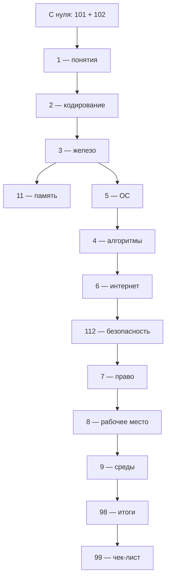
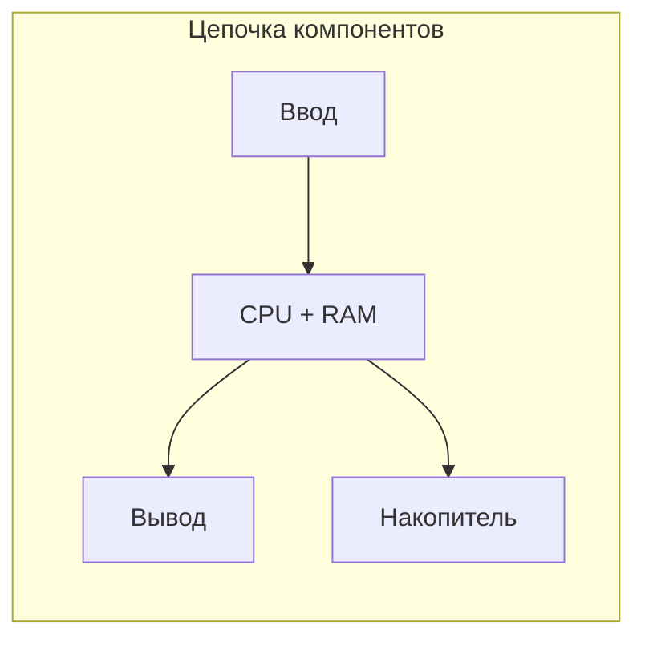

---
title: Базовая информатика — итоги
description: Сводные итоги раздела «Базовая информатика».
sidebar_label: Базовая информатика — итоги
---

# Базовая информатика — итоги

  НЕ ОБЯЗАТЕЛЬНО
  ДЛЯ НОВИЧКОВ
  В РАЗРАБОТКЕ

Всем

Кратко — что стоит унести из раздела **«Базовая информатика»**. Если пункт кажется туманным, откройте соответствующую главу или [оглавление раздела](./intro). Заучивание определений — в [чек-листе самопроверки](./99).

---

## FAQ — Часто задаваемые вопросы

Типичные сбои, ситуации новичков и **ответы на частые запросы в поиске** ("что такое ОЗУ", "чем отличается алгоритм от программы", "что такое DNS"). Краткий ответ здесь; разбор — в статьях раздела.

  
Вопрос. Почему вместо русских букв в текстовом файле или письме появляются "кракозябры"?

  
Ответ. Один и тот же набор байтов прочитали <strong>другой таблицей символов</strong> — файл сохранили в одной кодировке, а программа открыла в другой. Сначала уточните кодировку при открытии (для новых файлов — UTF-8) или пересохраните текст в UTF-8. Подробнее здесь — [Текстовые данные](/encyclopedia/1-basics/1-15-tekst/1).

  
Вопрос. Думал, что компьютер "понимает" русский текст — зачем в разделе столько про байты?

  
Ответ. Машина оперирует только сигналами и числами; смысл появляется, когда есть правило расшифровки и тот, кто его знает. Отсюда цепочка "информация → данные в файле → байты" и ошибка новичка — ждать от программы "понимания" задачи без явного алгоритма. Подробнее здесь — [ключевые понятия](/encyclopedia/1-basics/1-035-bazovaya-informatika/1), [Данные и информация](/encyclopedia/1-basics/1-09-dannye-i-informatsiya/1).

  
Вопрос. Нашёл "факт" в интернете или в переписке — можно сразу вставлять в реферат?

  
Ответ. Сначала проверьте <strong>источник, дату и полноту</strong>: субъективное мнение, устаревшая новость и слух в чате выглядят как факты, пока их не сверили. Для решений важны объективность, достоверность и актуальность. Подробнее здесь — [ключевые понятия](/encyclopedia/1-basics/1-035-bazovaya-informatika/1).

  
Вопрос. Скачал архив ZIP, а внутри "лес" папок и непонятные имена файлов — это нормально?

  
Ответ. Архив <strong>склеивает много файлов</strong> в один контейнер; при распаковке восстанавливается структура каталогов. Если имена "ломаются" — снова проверьте кодировку имён (типично при архивах из старых Windows-программ). Подробнее здесь — [Архивы](/encyclopedia/1-basics/1-20-ispolnyaemye-fayly-i-arhivy/2), [Текстовые данные](/encyclopedia/1-basics/1-15-tekst/1).

  
Вопрос. Архив просит пароль, а я его не задавал — что делать?

  
Ответ. Значит, архив создали <strong>с шифрованием</strong> — пароль должен был передать отправитель отдельным каналом. Подбор пароля на чужих архивах без разрешения недопустим. Уточните пароль у автора или запросите архив заново. Подробнее здесь — [Архивы](/encyclopedia/1-basics/1-20-ispolnyaemye-fayly-i-arhivy/2).

  
Вопрос. Сохраняю одно и то же фото в JPEG снова и снова — картинка всё более "мыльная". Почему?

  
Ответ. JPEG — сжатие <strong>с потерями</strong>: при каждом пересохранении отбрасываются детали. Для правок храните исходник в PNG; JPEG оставляйте для финальной отправки. Подробнее здесь — [Виды информации](/encyclopedia/1-basics/1-09-dannye-i-informatsiya/2).

  
Вопрос. В мессенджере фото было чётким, а после отправки стало размытым — кто "испортил" файл?

  
Ответ. Многие сервисы <strong>пережимают</strong> изображения и видео для экономии трафика — это отдельный этап сжатия с потерями, как у JPEG. Оригинал для важных работ храните у себя и передавайте архивом или облаком без пережатия, если сервис позволяет "файлом". Подробнее здесь — [Виды информации](/encyclopedia/1-basics/1-09-dannye-i-informatsiya/2).

  
Вопрос. Файл в облаке (Google Диск, Яндекс Диск) и файл на диске `C:` — это одно и то же?

  
Ответ. Локальный файл лежит на <strong>вашем накопителе</strong>; облачный — на серверах провайдера, у вас на экране чаще ярлык и кэш. Синхронизация может задерживаться, офлайн-доступ ограничен. Подробнее здесь — [Данные и информация](/encyclopedia/1-basics/1-09-dannye-i-informatsiya/1), [ОС](/encyclopedia/2-system-network/2-01-operatsionnaya-sistema/intro).

  
Вопрос. Компьютер внезапно тормозит: много вкладок, всё "висит". С чего начать?

  
Ответ. Откройте <strong>диспетчер задач</strong>: смотрите загрузку ОЗУ и диска, закройте "тяжёлые" процессы, освободите место на системном диске и проверьте корзину. Постоянные тормоза при слабой загрузке — повод разобрать роли CPU, ОЗУ и SSD/HDD. Подробнее здесь — [Как работает компьютер](/encyclopedia/1-basics/1-08-kak-rabotaet-kompyuter/intro), [ОС](/encyclopedia/2-system-network/2-01-operatsionnaya-sistema/intro).

  
Вопрос. После включения чёрный экран или ПК сразу перезагружается — с чего начать диагностику?

  
Ответ. Цепочка старта идёт через <strong>BIOS/UEFI</strong>, затем загрузчик и ОС. Проверьте кабели монитора, последние изменения (новая флешка, недавняя установка), безопасный режим или загрузочную флешку восстановления. На уроке достаточно понимать слои "прошивка → ОС → программа". Подробнее здесь — [Как работает компьютер](/encyclopedia/1-basics/1-08-kak-rabotaet-kompyuter/intro), [ОС](/encyclopedia/2-system-network/2-01-operatsionnaya-sistema/intro).

  
Вопрос. Появился "синий экран" с кодом ошибки — что это значит?

  
Ответ. Это <strong>критический сбой ядра ОС</strong> — часто драйвер, железо или повреждённые системные файлы. Запишите код ошибки, отключите недавно установленное устройство/драйвер, проверьте обновления Windows и температуру. Повторяющийся BSOD — к специалисту или в школьную лабораторию с админом. Подробнее здесь — [Как работает компьютер](/encyclopedia/1-basics/1-08-kak-rabotaet-kompyuter/intro), [ОС](/encyclopedia/2-system-network/2-01-operatsionnaya-sistema/intro).

  
Вопрос. После обновления Windows мерцает экран или пропал Wi‑Fi — это "сломали" компьютер?

  
Ответ. Частая причина — <strong>несовместимый или устаревший драйвер</strong> видеокарты или сетевого адаптера. Откатите последнее обновление драйвера или поставьте версию с сайта производителя ноутбука/материнской платы. Подробнее здесь — [Как работает компьютер](/encyclopedia/1-basics/1-08-kak-rabotaet-kompyuter/intro).

  
Вопрос. Вставил флешку — компьютер её не видит. Что проверить первым делом?

  
Ответ. Другой USB-порт, другой компьютер (правило "флешка или порт"), виден ли диск в "Управлении дисками", не требует ли носитель <strong>форматирования</strong> после сбоя. Не форматируйте сразу, если на носителе важные данные — сначала попробуйте прочитать на другом ПК. Подробнее здесь — [ОС](/encyclopedia/2-system-network/2-01-operatsionnaya-sistema/intro).

  
Вопрос. Случайно удалил важный файл — можно ли вернуть?

  
Ответ. Сначала <strong>корзина</strong> на этом же компьютере. Если файл уже стёрли из корзины или это флешка — шанс есть, пока секторы диска не перезаписали новыми данными; специализированные утилиты восстановления используйте осторожно и не сохраняйте результат на тот же диск. Лучшая защита — копии и облачная синхронизация. Подробнее здесь — [ОС](/encyclopedia/2-system-network/2-01-operatsionnaya-sistema/intro).

  
Вопрос. Файл не открывается двойным щелчком — программа ругается или предлагает "странное" приложение.

  
Ответ. Проверьте <strong>расширение</strong>, установлена ли нужная программа, не повреждён ли файл при копировании. Открытие текста в Word или бинарника в блокноте даёт "кашу" — это разные форматы данных. Подробнее здесь — [ОС](/encyclopedia/2-system-network/2-01-operatsionnaya-sistema/intro).

  
Вопрос. Система пишет "недостаточно места на диске", хотя "вроде ничего не качал".

  
Ответ. Место съедают <strong>обновления Windows</strong>, кэш браузера, загрузки, корзина, теневые копии и старые точки восстановления. Очистите корзину, папку "Загрузки", временные файлы; крупные видео и игры перенесите на другой диск. Подробнее здесь — [ОС](/encyclopedia/2-system-network/2-01-operatsionnaya-sistema/intro).

  
Вопрос. Установил программу, ярлык есть, но при запуске ничего не происходит.

  
Ответ. Ярлык — только ссылка; нужен <strong>запущенный процесс</strong>. Проверьте диспетчер задач, права администратора, блокировку антивирусом, целостность установки (переустановка). Иногда мешает отсутствие библиотек или .NET/Java. Подробнее здесь — [ОС](/encyclopedia/2-system-network/2-01-operatsionnaya-sistema/intro), [алгоритмы](/encyclopedia/4-code-dev/4-01-algoritmy/intro).

  
Вопрос. Принтер включён, но документ не печатает — очередь "висит".

  
Ответ. Проверьте кабель или Wi‑Fi принтера, <strong>очередь печати</strong> (отмените зависшие задания), драйвер в разделе "Принтеры", не выбран ли неверный принтер по умолчанию. Подробнее здесь — [ОС](/encyclopedia/2-system-network/2-01-operatsionnaya-sistema/intro).

  
Вопрос. Антивирус ругается на файл с флешки друга — можно "разрешить" и открыть?

  
Ответ. Предупреждение означает <strong>подозрительное поведение или сигнатуру</strong>. Игнорировать стоит только если вы сами собрали файл в учебном проекте и понимаете ложное срабатывание; чужой `.exe` из чата лучше не запускать. Попросите друга проверить носитель своим антивирусом или перешлите документ в безопасном формате (PDF без макросов). Подробнее здесь — [ОС](/encyclopedia/2-system-network/2-01-operatsionnaya-sistema/intro).

  
Вопрос. Все файлы на диске переименовались, экран требует перевести деньги — что делать?

  
Ответ. Это признаки <strong>шифровальщика (ransomware)</strong>. Не платите без консультации взрослых и ИТ-специалиста, отключите ПК от сети, сообщите администратору школы/родителям. Восстановление из резервной копии надёжнее "обещаний" злоумышленника. Подробнее здесь — [ОС](/encyclopedia/2-system-network/2-01-operatsionnaya-sistema/intro), [право](/encyclopedia/7-project/7-07-intellektualnye-prava/intro).

  
Вопрос. Wi‑Fi подключён, "интернет есть", а сайты не открываются.

  
Ответ. Проверьте другой сайт, перезагрузите роутер, смените DNS или браузер. Домашний Wi‑Fi — локальная сеть; выход в интернет идёт через провайдера. Подробнее здесь — [сеть](/encyclopedia/2-system-network/2-03-set-i-internet/intro).

  
Вопрос. В адресной строке сайт без замочка или браузер пишет "Не защищено" — опасно ли вводить пароль?

  
Ответ. Для входа в почту, банк и соцсети нужен <strong>HTTPS</strong> (замок): иначе пароль может перехватить в сети. На публичном Wi‑Fi без HTTPS риск выше. Подробнее здесь — [сеть](/encyclopedia/2-system-network/2-03-set-i-internet/intro).

  
Вопрос. Пришло письмо "от банка" со ссылкой — нужно срочно войти?

  
Ответ. Типичный <strong>фишинг</strong>. Пароль вводят только на сайте, адрес которого сами набрали или открыли из закладки. Ссылку из письма и мессенджера для банка и почты считайте подозрительной. Подробнее здесь — [сеть](/encyclopedia/2-system-network/2-03-set-i-internet/intro).

  
Вопрос. Один и тот же простой пароль на игры, почту и школьный аккаунт — почему это плохая идея?

  
Ответ. Утечка с одного сервиса даёт злоумышленнику доступ <strong>везде, где вы повторили пароль</strong>. Используйте разные пароли или менеджер паролей, включите двухфакторную аутентификацию там, где школа или сервис разрешает. Подробнее здесь — [сеть](/encyclopedia/2-system-network/2-03-set-i-internet/intro), [право](/encyclopedia/7-project/7-07-intellektualnye-prava/intro).

  
Вопрос. На видеоуроке звук есть, а картинка замирает — это "сломался" компьютер?

  
Ответ. Чаще <strong>не хватает скорости канала</strong> или перегружен Wi‑Fi: видео буферизуется, аудио идёт отдельным потоком. Подключитесь ближе к роутеру, закройте лишние загрузки, снизьте качество в настройках звонка. Подробнее здесь — [сеть](/encyclopedia/2-system-network/2-03-set-i-internet/intro).

  
Вопрос. Программа "не отвечает" — можно сразу выключать питание?

  
Ответ. Сначала завершите зависший <strong>процесс</strong> в диспетчере задач и сохраните другие документы. Жёсткое отключение рискует потерять несохранённые файлы. Подробнее здесь — [алгоритмы](/encyclopedia/4-code-dev/4-01-algoritmy/intro), [ОС](/encyclopedia/2-system-network/2-01-operatsionnaya-sistema/intro).

  
Вопрос. В Scratch или Python программа крутится бесконечно и ничего не выводит.

  
Ответ. Обычно <strong>бесконечный цикл</strong> — условие выхода никогда не срабатывает. Остановите выполнение, проверьте блок-схему и граничные случаи (ноль, пустой ввод). Подробнее здесь — [алгоритмы](/encyclopedia/4-code-dev/4-01-algoritmy/intro).

  
Вопрос. Код запускается, но ответ неверный — в чём разница с "ошибкой в красном тексте"?

  
Ответ. Красное сообщение при запуске — чаще <strong>синтаксическая</strong> ошибка (опечатка, скобка). Неверный ответ при успешном запуске — <strong>логическая ошибка</strong> (баг): алгоритм выполняется, но план неверен. Ищите через тесты и пошаговую отладку. Подробнее здесь — [алгоритмы](/encyclopedia/4-code-dev/4-01-algoritmy/intro).

  
Вопрос. Скопировал готовый код с сайта в школьную работу — это нормально?

  
Ответ. Чужой код — объект <strong>авторского права</strong>; в школе это ещё и плагиат. Можно учиться по чужому примеру с указанием источника, если учитель разрешил; сдавать как свою работу без понимания нельзя. Подробнее здесь — [право](/encyclopedia/7-project/7-07-intellektualnye-prava/intro).

  
Вопрос. Скачал "бесплатную" игру или кряк — что может случиться?

  
Ответ. Риски <strong>технические</strong> (троян, шифровальщик) и <strong>правовые</strong> (нарушение лицензии). Вредоносное может прийти и с флешки, и из вложения в мессенджере. Подробнее здесь — [ОС](/encyclopedia/2-system-network/2-01-operatsionnaya-sistema/intro), [право](/encyclopedia/7-project/7-07-intellektualnye-prava/intro).

  
Вопрос. Выложил в чат телефон и фамилию одноклассника "для списка" — в чём риск?

  
Ответ. Это <strong>персональные данные</strong> без согласия; их могут использовать для спама и мошенничества. Регулирование — 152-ФЗ. Подробнее здесь — [право](/encyclopedia/7-project/7-07-intellektualnye-prava/intro).

  
Вопрос. Друг просит пароль от игры или "взломать" аккаунт в шутку — можно?

  
Ответ. Передача пароля и вход в чужой аккаунт без разрешения — <strong>неправомерный доступ</strong> (УК РФ, ст. 272–273). "Шутка" ответственность не снимает. Подробнее здесь — [право](/encyclopedia/7-project/7-07-intellektualnye-prava/intro).

  
Вопрос. После долгой работы за монитором режут глаза и болит спина — что изменить в первую очередь?

  
Ответ. Высота стула и монитора, расстояние до экрана (ориентир — вытянутая рука), перерывы 5–10 минут каждый час, свет без бликов на экране. Подробнее здесь — [эргономика](/encyclopedia/1-basics/1-035-bazovaya-informatika/202).

  
Вопрос. Учитель говорит "соберите игру в Godot", а в разделе такого не было — куда идти?

  
Ответ. Это задача из <strong>справочника сред</strong>: сначала блок входа и [алгоритмы](/encyclopedia/4-code-dev/4-01-algoritmy/intro), затем точечно откройте раздел про Godot или другую среду под ваш проект. Подробнее здесь — [среды разработки](/tools/development/1).

  
Вопрос. С чего начать изучение информатики с нуля?

  
Ответ. С цепочки <strong>данные → устройство → ОС → сеть → алгоритм</strong>, затем право и рабочее место. В этом разделе блоки входа и маршруты ведут именно в такой логике; код (Python, Scratch) логичнее после [раздела про алгоритмы](/encyclopedia/4-code-dev/4-01-algoritmy/intro). Для карьеры в IT дальше — дорожная карта энциклопедии. Подробнее здесь — [ключевые понятия](/encyclopedia/1-basics/1-035-bazovaya-informatika/1), [оглавление раздела](./intro).

  
Вопрос. Что такое операционная система (Windows, Linux) простыми словами?

  
Ответ. <strong>ОС</strong> — программа-посредник: запускает приложения, раздаёт память, управляет файлами и устройствами. Без неё пришлось бы вручную общаться с каждым железом. Подробнее здесь — [ОС](/encyclopedia/2-system-network/2-01-operatsionnaya-sistema/intro).

  
Вопрос. Чем оперативная память (ОЗУ) отличается от жёсткого диска и SSD?

  
Ответ. <strong>ОЗУ</strong> — быстрая память "здесь и сейчас" для запущенных программ; при выключении ПК очищается. <strong>Диск/SSD</strong> — долговременное хранение файлов и ОС. Мало ОЗУ — тормоза при многих вкладках; мало места на диске — не ставятся обновления и игры. Подробнее здесь — [Как работает компьютер](/encyclopedia/1-basics/1-08-kak-rabotaet-kompyuter/intro).

  
Вопрос. Сколько гигабайт оперативной памяти нужно для учёбы и браузера?

  
Ответ. Для офиса, браузера с десятком вкладок и онлайн-уроков комфортный ориентир — <strong>8 ГБ минимум</strong>, лучше 16 ГБ; тяжёлая графика, виртуальные машины и игры требуют больше. Узкое место часто именно ОЗУ, реже пропускная способность интернета. Подробнее — [Как работает компьютер](/encyclopedia/1-basics/1-08-kak-rabotaet-kompyuter/intro), [память и вычисления](/encyclopedia/1-basics/1-08-kak-rabotaet-kompyuter/12).

  
Вопрос. Что такое процессор (CPU) и для чего он нужен?

  
Ответ. <strong>CPU</strong> выполняет команды программ — арифметика, сравнения, переходы. Частота и число ядер влияют на скорость, но без достаточной ОЗУ и быстрого диска прирост будет небольшим. Подробнее здесь — [Как работает компьютер](/encyclopedia/1-basics/1-08-kak-rabotaet-kompyuter/intro).

  
Вопрос. Что такое видеокарта — нужна ли для школы и офиса?

  
Ответ. <strong>GPU</strong> рисует изображение на мониторе; встроенной в процессор часто хватает для браузера, документов и Scratch. Отдельная видеокарта нужна для тяжёлых 3D-игр, монтажа и нейросетей. Подробнее здесь — [Как работает компьютер](/encyclopedia/1-basics/1-08-kak-rabotaet-kompyuter/intro).

  
Вопрос. Что такое системный блок — это и есть весь компьютер?

  
Ответ. В быту "компьютером" называют <strong>системный блок</strong> (корпус с платой, CPU, памятью, диском) плюс монитор, клавиатуру и мышь. Ноутбук — те же части, только в одном корпусе. Подробнее здесь — [Как работает компьютер](/encyclopedia/1-basics/1-08-kak-rabotaet-kompyuter/intro).

  
Вопрос. Что такое BIOS и UEFI при включении ПК?

  
Ответ. Это <strong>прошивка материнской платы</strong>: проверяет железо, ищет загрузчик ОС и передаёт управление Windows или Linux. UEFI — современный вариант с графическим меню и поддержкой больших дисков. Подробнее здесь — [Как работает компьютер](/encyclopedia/1-basics/1-08-kak-rabotaet-kompyuter/intro), [ОС](/encyclopedia/2-system-network/2-01-operatsionnaya-sistema/intro).

  
Вопрос. Что такое драйвер устройства в Windows?

  
Ответ. <strong>Драйвер</strong> — программа, которая переводит команды ОС на язык конкретного устройства (принтер, Wi‑Fi, видеокарта). Без актуального драйвера устройство работает плохо или пропадает после обновления. Подробнее здесь — [Как работает компьютер](/encyclopedia/1-basics/1-08-kak-rabotaet-kompyuter/intro), [ОС](/encyclopedia/2-system-network/2-01-operatsionnaya-sistema/intro).

  
Вопрос. Что такое файловая система NTFS и FAT32?

  
Ответ. Это <strong>правила хранения</strong> файлов на диске: имена, размеры, права. NTFS — стандарт Windows для больших дисков; FAT32 часто на флешках, но не принимает очень крупные файлы (лимит около 4 ГБ на файл). Подробнее здесь — [ОС](/encyclopedia/2-system-network/2-01-operatsionnaya-sistema/intro).

  
Вопрос. Что такое расширение файла — docx, pdf, exe?

  
Ответ. Расширение после точки подсказывает <strong>тип данных</strong> и какую программу ОС предложит для открытия. `.exe` — исполняемый файл (запускать только из доверенных источников), `.pdf` — документ, `.zip` — архив. Подробнее здесь — [ОС](/encyclopedia/2-system-network/2-01-operatsionnaya-sistema/intro), [исполняемые файлы и архивы](/encyclopedia/1-basics/1-20-ispolnyaemye-fayly-i-arhivy/intro).

  
Вопрос. Что такое бит и байт в информатике?

  
Ответ. <strong>Бит</strong> — одна ячейка 0 или 1; <strong>байт</strong> — 8 бит, удобная единица для символов и файлов. Размер фото, песни и фильма в мегабайтах и гигабайтах — это счёт байтов на диске. Подробнее здесь — [Данные и информация](/encyclopedia/1-basics/1-09-dannye-i-informatsiya/1).

  
Вопрос. Что такое кодировка UTF-8?

  
Ответ. <strong>UTF-8</strong> — общий стандарт, как буквы (в том числе русские и эмодзи) записываются байтами. Для новых сайтов, JSON и текстовых файлов его используют по умолчанию; старые CP866 и Windows-1251 ещё встречаются в архивах DOS. Подробнее здесь — [Текстовые данные](/encyclopedia/1-basics/1-15-tekst/1).

  
Вопрос. PNG или JPEG — какой формат выбрать для фото и рисунка?

  
Ответ. <strong>PNG</strong> — без потерь, хорош для скриншотов, схем и логотипов с прозрачностью. <strong>JPEG</strong> — с потерями, меньший размер для фотографий в соцсетях и почте. Для учебных работ с текстом на картинке чаще PNG. Подробнее здесь — [Виды информации](/encyclopedia/1-basics/1-09-dannye-i-informatsiya/2).

  
Вопрос. ZIP или RAR — что лучше и зачем вообще архивировать файлы?

  
Ответ. Архив <strong>уменьшает объём</strong> и склеивает много файлов в один для отправки. ZIP открывается везде; RAR и 7z иногда дают лучшее сжатие, но нужна соответствующая программа. Подробнее здесь — [Архивы](/encyclopedia/1-basics/1-20-ispolnyaemye-fayly-i-arhivy/2).

  
Вопрос. Что такое база данных простыми словами?

  
Ответ. <strong>База данных</strong> хранит записи по структуре (таблицы, поля) и позволяет искать и изменять их запросами — школьный журнал, каталог магазина, аккаунты в игре. От обычной папки с файлами отличается строгой схемой и быстрым поиском. Подробнее здесь — [основы БД](/encyclopedia/3-data-markup/3-05-osnovy-baz-dannyh/intro).

  
Вопрос. Что такое алгоритм в информатике простыми словами?

  
Ответ. <strong>Алгоритм</strong> — пошаговый план решения задачи: конечный, понятный, с результатом. Программа на Python или блоки Scratch — уже запись этого плана для компьютера. Подробнее здесь — [алгоритмы](/encyclopedia/4-code-dev/4-01-algoritmy/intro).

  
Вопрос. Чем алгоритм отличается от программы?

  
Ответ. <strong>Алгоритм</strong> можно описать словами или блок-схемой; <strong>программа</strong> — реализация на языке (файл с кодом), которую запускает ОС как процесс. Один алгоритм можно написать на разных языках. Подробнее здесь — [алгоритмы](/encyclopedia/4-code-dev/4-01-algoritmy/intro), [программа](/encyclopedia/1-basics/1-19-programma/intro).

  
Вопрос. Что такое линейный, циклический и разветвляющийся алгоритм?

  
Ответ. <strong>Линейный</strong> — шаги подряд; <strong>разветвляющийся</strong> — выбор по условию (если/иначе); <strong>циклический</strong> — повтор, пока условие истинно. Любая школьная задача собирается из этих трёх кирпичей. Подробнее здесь — [алгоритмы](/encyclopedia/4-code-dev/4-01-algoritmy/intro).

  
Вопрос. Что такое блок-схема алгоритма?

  
Ответ. Это <strong>рисунок из фигур</strong> (начало, ввод, решение, цикл, конец), по которому видно логику до написания кода. Удобно на уроке и при разборе ошибок в цикле. Подробнее здесь — [алгоритмы](/encyclopedia/4-code-dev/4-01-algoritmy/intro).

  
Вопрос. Чем компилятор отличается от интерпретатора — Python, Java, C++?

  
Ответ. <strong>Компилятор</strong> заранее переводит весь код в исполняемый файл (C++, часто Java в байткод). <strong>Интерпретатор</strong> читает код построчно при запуске (классический режим Python). Для новичка важнее понять: сначала алгоритм, потом синтаксис языка. Подробнее здесь — [алгоритмы](/encyclopedia/4-code-dev/4-01-algoritmy/intro), [программа](/encyclopedia/1-basics/1-19-programma/2).

  
Вопрос. С чего начать учить Python школьнику?

  
Ответ. После <strong>алгоритмов и блок-схем</strong> — простые задачи: ввод числа, ветвление, цикл, список. Установите Python 3 с официального сайта или используйте среду школы; сразу приучайтесь к отступам и чтению ошибок в консоли. Подробнее здесь — [алгоритмы](/encyclopedia/4-code-dev/4-01-algoritmy/intro), [Python в энциклопедии](/encyclopedia/5-languages/5-02-python/intro).

  
Вопрос. Что такое Scratch — подходит ли для первого программирования?

  
Ответ. <strong>Scratch</strong> — визуальные блоки вместо текста: удобен для алгоритмов, анимации и игр в младших классах. Переход на Python логичен, когда понятны циклы и переменные. Подробнее здесь — [алгоритмы](/encyclopedia/4-code-dev/4-01-algoritmy/intro), [Lab — примеры](/lab/Примеры/1121).

  
Вопрос. Что такое Git и зачем он в учебном проекте?

  
Ответ. <strong>Git</strong> хранит <strong>историю версий</strong> кода: кто что менял, откат к вчерашней рабочей версии, совместная работа без перезаписи файлов в чате. Для школьной программы достаточно понять идею; на практике — GitHub или GitLab с учительским репозиторием. Подробнее здесь — [алгоритмы](/encyclopedia/4-code-dev/4-01-algoritmy/intro), [основы Git](/encyclopedia/4-code-dev/4-13-osnovy-raboty-s-git/intro).

  
Вопрос. Чем интернет отличается от всемирной паутины (WWW)?

  
Ответ. <strong>Интернет</strong> — инфраструктура сетей и протоколов. <strong>WWW</strong> — сервис сайтов в браузере по HTTP/HTTPS поверх интернета. Мессенджеры и онлайн-игры используют интернет, но не обязательно "сайты". Подробнее здесь — [сеть](/encyclopedia/2-system-network/2-03-set-i-internet/intro).

  
Вопрос. Что такое IP-адрес и доменное имя сайта (например, yandex.ru)?

  
Ответ. <strong>IP</strong> — числовой адрес компьютера или сервера в сети. <strong>Домен</strong> — удобное имя для людей; браузер через DNS узнаёт, какой IP стоит за именем. Подробнее здесь — [сеть](/encyclopedia/2-system-network/2-03-set-i-internet/intro), [сеть и интернет](/encyclopedia/2-system-network/2-03-set-i-internet/1).

  
Вопрос. Что такое DNS простыми словами?

  
Ответ. <strong>DNS</strong> — "телефонная книга" интернета: переводит имя сайта в IP-адрес. Если DNS недоступен, Wi‑Fi есть, а сайты по имени не открываются — попробуйте другой DNS или перезагрузку роутера. Подробнее здесь — [сеть](/encyclopedia/2-system-network/2-03-set-i-internet/intro).

  
Вопрос. Что такое URL в адресной строке браузера?

  
Ответ. <strong>URL</strong> — полный адрес ресурса: протокол (`https://`), домен, путь к странице и параметры (`?id=5`). По нему браузер понимает, какой сервер запросить и какой файл получить. Подробнее здесь — [сеть](/encyclopedia/2-system-network/2-03-set-i-internet/intro).

  
Вопрос. Что такое HTTP и HTTPS — зачем замок в браузере?

  
Ответ. <strong>HTTP</strong> — правила передачи веб-страниц; <strong>HTTPS</strong> добавляет шифрование (замок), чтобы пароли и платежи не читали "по дороге". Для входа в почту и банк нужен именно HTTPS. Подробнее здесь — [сеть](/encyclopedia/2-system-network/2-03-set-i-internet/intro).

  
Вопрос. Роутер и модем — в чём разница дома?

  
Ответ. <strong>Модем</strong> связывает дом с линией провайдера; <strong>роутер</strong> раздаёт интернет и Wi‑Fi внутри квартиры (NAT, локальные IP). Часто оба спрятаны в одной коробке от провайдера. Подробнее здесь — [Как работает компьютер](/encyclopedia/1-basics/1-08-kak-rabotaet-kompyuter/intro), [сеть](/encyclopedia/2-system-network/2-03-set-i-internet/intro).

  
Вопрос. Что такое VPN — нужен ли он школьнику?

  
Ответ. <strong>VPN</strong> шифрует трафик до удалённого сервера; в школе его могут запрещать правила сети. Для учёбы важнее HTTPS, сложные пароли и осторожность с фишингом, чем "обход" без понимания рисков. Подробнее здесь — [сеть](/encyclopedia/2-system-network/2-03-set-i-internet/intro), [основы ИБ](/encyclopedia/2-system-network/2-08-osnovy-informatsionnoy-bezopasnosti/intro).

  
Вопрос. Что такое облачное хранилище — Google Диск, Яндекс Диск?

  
Ответ. Файлы лежат на <strong>серверах компании</strong>, а на ПК видна синхронизированная копия или ярлык. Удобно для бэкапа и совместной работы; нужны аккуратность с доступом и помнить, что это чужая инфраструктура с лимитом места. Подробнее здесь — [сеть](/encyclopedia/2-system-network/2-03-set-i-internet/intro).

  
Вопрос. Что такое фишинг в интернете?

  
Ответ. <strong>Фишинг</strong> — поддельные письма, сайты и сообщения, чтобы выманить пароль или данные карты. Защита — не переходить по ссылкам "от банка", проверять адрес вручную, двухфакторная аутентификация. Подробнее здесь — [сеть](/encyclopedia/2-system-network/2-03-set-i-internet/intro).

  
Вопрос. Можно ли легально скачивать музыку и фильмы из интернета?

  
Ответ. Контент защищён <strong>авторским правом</strong>; легально — покупка, подписка (стриминг), бесплатные официальные источники и лицензии Creative Commons. "Бесплатно без прав" — риск вирусов и нарушения закона. Подробнее здесь — [право](/encyclopedia/7-project/7-07-intellektualnye-prava/intro).

  
Вопрос. Что такое персональные данные по 152-ФЗ?

  
Ответ. Это любые сведения о человеке (ФИО, телефон, фото, оценки), по которым его можно опознать. Закон 152-ФЗ задаёт, <strong>как их собирать, хранить и публиковать</strong> с согласия; в школе и соцсетях действуют дополнительные правила. Подробнее здесь — [право](/encyclopedia/7-project/7-07-intellektualnye-prava/intro).

  
Вопрос. Что такое open source и лицензия на программу?

  
Ответ. <strong>Open source</strong> — исходный код доступен на условиях лицензии (MIT, GPL и др.): можно учиться, копировать и иногда менять. Лицензия всё равно ограничивает коммерческое использование и обязанность указать автора — её нужно читать. Подробнее здесь — [право](/encyclopedia/7-project/7-07-intellektualnye-prava/intro).

  
Вопрос. Как работает антивирус — зачем он, если я ничего не скачиваю?

  
Ответ. Антивирус сверяет файлы с <strong>базой сигнатур</strong> и смотрит подозрительное поведение. Угроза может прийти с флешки, вложением, уязвимостью браузера или взломанным сайтом — не только с "торрентом". Подробнее здесь — [ОС](/encyclopedia/2-system-network/2-01-operatsionnaya-sistema/intro).

  
Вопрос. Что такое RSS-лента — зачем она, если есть соцсети?

  
Ответ. <strong>RSS</strong> — подписка на обновления сайтов (блоги, новости) в одном ридере без алгоритмической ленты. Удобно отслеживать источники для проектов и рефератов. Подробнее здесь — [сеть](/encyclopedia/2-system-network/2-03-set-i-internet/intro).

  
Вопрос. Какая информатика в школе — что входит в базовый блок?

  
Ответ. Обычно: <strong>информация и данные</strong>, устройство ПК, ОС и файлы, сеть и сервисы, алгоритмы и начало программирования, право и безопасность, иногда — основы БД и проект. Этот маршрут в энциклопедии собирает те же темы со ссылками на углубление. Подробнее здесь — [оглавление раздела](./intro), [ключевые понятия](/encyclopedia/1-basics/1-035-bazovaya-informatika/1).

  
Вопрос. Что такое Big-O и нужно ли это школьнику?

  
Ответ. <strong>Big-O</strong> описывает, как растёт время работы алгоритма при увеличении входа. Для начала достаточно интуиции: линейный поиск по списку медленнее при 10 000 элементов, чем при 10. Углубление — [Big-O шпаргалка](/lab/examples/1128), [алгоритмы](/encyclopedia/4-code-dev/4-01-algoritmy/intro).

  
Вопрос. Почему компьютер "зависает", хотя процессор не загружен на 100 %?

  
Ответ. CPU может <strong>ждать данные</strong> с диска или из сети — в диспетчере задач загрузка процессора низкая, а диск или сеть заняты. Ещё причина — нехватка ОЗУ и подкачка. Подробнее — [память и вычисления](/encyclopedia/1-basics/1-08-kak-rabotaet-kompyuter/12), [Как работает компьютер](/encyclopedia/1-basics/1-08-kak-rabotaet-kompyuter/intro).

  
Вопрос. Чем отличается Wi‑Fi от мобильного интернета (4G/5G)?

  
Ответ. <strong>Wi‑Fi</strong> — локальная беспроводная сеть (дом, школа, кафе), дальше трафик идёт через роутер провайдера. <strong>4G/5G</strong> — связь с вышкой оператора напрямую. Для банка в публичном месте часто безопаснее мобильный интернет, чем чужой Wi‑Fi. Подробнее — [сеть](/encyclopedia/2-system-network/2-03-set-i-internet/intro).

  
Вопрос. Можно ли доверять ответу нейросети (ChatGPT и др.) для реферата?

  
Ответ. Нейросеть может <strong>ошибаться и выдумывать</strong> источники. Используйте как черновик идей, но факты сверяйте с учебником и первоисточниками. Не отправляйте в чат пароли и персональные данные. Подробнее — [ИИ для новичка](/encyclopedia/1-basics/1-21-poisk-informatsii/5), [ключевые понятия](/encyclopedia/1-basics/1-035-bazovaya-informatika/1).

  
Вопрос. Что такое passkey и заменяет ли он пароль полностью?

  
Ответ. <strong>Passkey</strong> — вход по криптографическому ключу на устройстве (Face ID, отпечаток). На поддерживающих сайтах заменяет пароль и устойчивее к фишингу. Старые сервисы всё ещё на паролях — нужен менеджер. Подробнее — [Passkeys](/encyclopedia/1-basics/1-035-bazovaya-informatika/113), [цифровая безопасность](/encyclopedia/1-basics/1-035-bazovaya-informatika/112).

  
Вопрос. Зачем в разделе статья про право, если я хочу быть программистом?

  
Ответ. Разработчик работает с <strong>чужими данными, лицензиями и договорами</strong>: 152-ФЗ, авторское право на код, ответственность за утечки. Нарушение — штрафы и увольнение, не только "мораль". Подробнее — [право](/encyclopedia/7-project/7-07-intellektualnye-prava/intro).

  
Вопрос. SSD "изнашивается" — стоит ли бояться записи на диск?

  
Ответ. У современных SSD запас <strong>ресурса записи</strong> велик для обычного пользователя (годы работы). Не стоит специально переносить папку "Загрузки" на HDD из страха; важнее бэкап и свободное место. Подробнее — [Как работает компьютер](/encyclopedia/1-basics/1-08-kak-rabotaet-kompyuter/intro), [память и накопители](/encyclopedia/1-basics/1-08-kak-rabotaet-kompyuter/12).

  
Вопрос. Что такое API простыми словами?

  
Ответ. <strong>API</strong> (Application Programming Interface) — описанный способ, как одна программа просит другую выполнить действие ("отправь сообщение", "верни погоду"). Сайт в браузере тоже общается с сервером по API. Подробнее — [интеграции](/encyclopedia/2-system-network/2-09-osnovy-integratsionnogo-vzaimodeystviya/intro), [сеть](/encyclopedia/2-system-network/2-03-set-i-internet/intro).

  
Вопрос. Почему в школе учат Scratch, а в вузе — другие языки?

  
Ответ. Scratch учит <strong>алгоритмам без синтаксиса</strong>; в вузе нужны языки для серьёзных проектов (Python, C++, Java). Навык "думать шагами" переносится между языками. Подробнее — [алгоритмы](/encyclopedia/4-code-dev/4-01-algoritmy/intro), [среды разработки](/tools/development/1).

---

## Как пользоваться этой страницей

Итоги удобно использовать в трёх режимах.

- **Перед повторением** — пробегите таблицу блоков и отметьте, какие главы нужно перечитать.
- **После раздела** — закройте подсказки и попробуйте объяснить каждую "главную мысль" вслух за 30 секунд.
- **Перед зачётом или собеседованием на стажировку** — сверьтесь с [чек-листом](./99) и доберите слабые темы по ссылкам из таблицы.

Если формулировка "знакома, но объяснить не могу" — сигнал вернуться в главу и разобрать тему заново.

---

## Что запомнить

### Восемь блоков одной картины

| Блок | Главная мысль | Глава |
|------|---------------|-------|
| Данные | Всё в компьютере — **числа и коды**; сжатие и архивы экономят место | [Данные и информация](/encyclopedia/1-basics/1-09-dannye-i-informatsiya/intro), [Архивы](/encyclopedia/1-basics/1-20-ispolnyaemye-fayly-i-arhivy/2) |
| Железо | CPU, память, диск, периферия — **роли** в системе | [Как работает компьютер](/encyclopedia/1-basics/1-08-kak-rabotaet-kompyuter/intro) → [Компьютер](/encyclopedia/1-basics/1-08-kak-rabotaet-kompyuter/intro) |
| ОС и утилиты | ОС управляет ресурсами; **файлы, антивирус, архиватор** — повседневные инструменты | [ОС, файловые системы и служебные программы](/encyclopedia/2-system-network/2-01-operatsionnaya-sistema/intro) |
| Интернет | Сеть + **протоколы** + сервисы (поиск, почта, RSS, стриминг) | [Интернет и сетевые сервисы](/encyclopedia/2-system-network/2-03-set-i-internet/intro) |
| Алгоритмы | **План** задачи → блок-схема → программа на языке | [Алгоритмы, языки и программирование](/encyclopedia/4-code-dev/4-01-algoritmy/intro) → [Программа](/encyclopedia/1-basics/1-19-programma/intro) |
| Право | ПО под **авторским правом**; ПДн — 152-ФЗ; взлом и вирусы — УК РФ | [Право и защита информации в РФ](/encyclopedia/7-project/7-07-intellektualnye-prava/intro) |
| Рабочее место | **Эргономика**, перерывы, правила класса | [Организация рабочего места](/encyclopedia/1-basics/1-035-bazovaya-informatika/202) |
| Инструменты | Справочник сред — парсинг, графика, игры, мобильные app | [Инструменты и среды разработки](//tools/development/1) |

---

### Три принципа, которые связывают темы

1. **Компьютер не понимает смысл** — только данные и инструкции. "Умность" в алгоритмах и программах ([Алгоритмы, языки и программирование](/encyclopedia/4-code-dev/4-01-algoritmy/intro), [Программа](/encyclopedia/1-basics/1-19-programma/1)).
2. **Слои** — приложение → ОС → драйверы → железо ([ОС, файловые системы и служебные программы](/encyclopedia/2-system-network/2-01-operatsionnaya-sistema/intro), [Как работает компьютер](/encyclopedia/1-basics/1-08-kak-rabotaet-kompyuter/7)).
3. **Цифровая грамотность** — техника, право и привычки вместе: легальное ПО, аккуратность с данными, здоровье за экраном ([Право и защита информации в РФ](/encyclopedia/7-project/7-07-intellektualnye-prava/intro), [Организация рабочего места](/encyclopedia/1-basics/1-035-bazovaya-informatika/202)).

---

### Частые путаницы

| Путают | На самом деле | Где повторить |
|--------|---------------|---------------|
| Интернет и "сайт в браузере" | WWW — сервис **поверх** сети; интернет — инфраструктура связи | [Интернет и сетевые сервисы](/encyclopedia/2-system-network/2-03-set-i-internet/intro) |
| ОЗУ и "память на диске" | ОЗУ — быстрое **временное**; диск/SSD — **долговременное** | [Как работает компьютер](/encyclopedia/1-basics/1-08-kak-rabotaet-kompyuter/intro) |
| Алгоритм и программа | Алгоритм — **план**; программа — **реализация** на языке | [Алгоритмы, языки и программирование](/encyclopedia/4-code-dev/4-01-algoritmy/intro) |
| Сжатие и архив | Сжатие уменьшает **один** файл; архив **склеивает** много | [Виды информации](/encyclopedia/1-basics/1-09-dannye-i-informatsiya/2), [Архивы](/encyclopedia/1-basics/1-20-ispolnyaemye-fayly-i-arhivy/2) |
| "Скачал с торрента" и лицензия | Копирование без права — риск по **авторскому праву** | [Право и защита информации в РФ](/encyclopedia/7-project/7-07-intellektualnye-prava/intro) |

---

## Мнемонические приёмы

Короткие формулы помогают вспомнить связи между темами на зачёте или при разговоре с родителями "что вы проходили".

### Восемь глав — одна фраза

**"Данные в Железе крутятся в ОС, выходят в Сеть Алгоритмом, под Правом и Здоровьем, в Инструментах"**

| Слог | Глава | Смысл |
|------|-------|-------|
| Данные | 2 | Байты, кодировки, сжатие |
| Железе | 3 | CPU, RAM, GPU, периферия |
| ОС | 5 | Файлы, процессы, драйверы |
| Сеть | 6 | Интернет, DNS, HTTPS |
| Алгоритмом | 4 | План → код |
| Правом | 7 | Лицензии, ПДн, УК |
| Здоровьем | 8 | Эргономика, перерывы |
| Инструментах | 9 | Среды разработки |

### Три слоя компьютера

**"Программа просит ОС, ОС просит драйвер, драйвер просит железо"** — любая ошибка "не работает принтер" идёт вниз по цепочке.

### Безопасность в интернете

**"Замок, закладка, свой пароль"**

- **Замок** — HTTPS при вводе секретов;
- **Закладка** — открывать банк и почту не по ссылке из письма;
- **Свой пароль** — уникальный на каждый важный сервис (менеджер паролей).

### Файл и данные

**"Расширение подсказывает, кодировка расшифровывает"**

- `.txt` / `.pdf` / `.exe` — тип;
- UTF-8 — как буквы легли в байты.

### Алгоритм

**"ЛРЦ"** — **Л**инейный, **Р**азветвление, **Ц**икл — три кирпича любой школьной задачи.

### Память

**"Быстрое забывает, медленное помнит"** — ОЗУ быстрое и энергозависимое; SSD/HDD медленнее, но хранит после выключения.

### Проверка факта из интернета

**"ИДА"** — **И**сточник, **Д**ата, **А**втор (кто сказал и когда).

---

## Сводные таблицы по статьям раздела

### Глава 1 — Введение в информатику

| Тема | Ключевая мысль | Типичная ошибка |
|------|----------------|-----------------|
| Информация и данные | Смысл появляется при интерпретации | "Компьютер понимает русский" |
| Объективность | Факт проверяем; мнение — нет | Вставить цитату из чата в реферат |
| Цифровая грамотность | Техника + критическое мышление | Доверять первой ссылке в поиске |

### Данные и кодирование — энциклопедические разделы

| Тема | Ключевая мысль | Типичная ошибка | Куда углубиться |
|------|----------------|-----------------|-----------------|
| Бит и байт | Всё в файле — числа | Путать Кб и КБ | [Глава 1](/encyclopedia/1-basics/1-035-bazovaya-informatika/1#системы-счисления) |
| UTF-8 | Стандарт для текста | Открыть UTF-8 как Windows-1251 | [Текстовые данные](/encyclopedia/1-basics/1-15-tekst/1) |
| JPEG и PNG | JPEG с потерями | Многократно пересохранять JPEG | [Виды информации](/encyclopedia/1-basics/1-09-dannye-i-informatsiya/2) |
| ZIP | Контейнер + сжатие | Путать архив с одним сжатым файлом | [Архивы](/encyclopedia/1-basics/1-20-ispolnyaemye-fayly-i-arhivy/2) |

### Железо — раздел «Как работает компьютер»

| Тема | Ключевая мысль | Типичная ошибка |
|------|----------------|-----------------|
| CPU | Выполняет команды | "Чем больше ГГц — тем всегда быстрее ПК" |
| RAM | Рабочая память процессов | Путать с "памятью на диске" |
| SSD/HDD | Долговременное хранение | Забивать системный диск |
| GPU | Графика и параллельные задачи | Путать с "видеопамятью вместо RAM" |

### Глава 4 — Алгоритмы и программирование

| Тема | Ключевая мысль | Типичная ошибка |
|------|----------------|-----------------|
| Алгоритм | Конечный план с результатом | Путать с программой |
| Ошибки | Синтаксис и логика | Искать опечатку при неверном ответе |
| Цикл | Нужно условие выхода | Бесконечный цикл в Scratch/Python |
| Git | История версий | Пересылать файлы в чат вместо репозитория |

### Глава 5 — ОС и файлы

| Тема | Ключевая мысль | Типичная ошибка |
|------|----------------|-----------------|
| ОС | Посредник между программами и железом | Думать, что файл "в ярлыке" |
| Файловая система | Правила имён и размещения | Форматировать флешку с данными сразу |
| Процесс | Запущенная программа | Ярлык ≠ работающая программа |
| Антивирус | Сигнатуры и поведение | Игнорировать предупреждение на чужой .exe |

### Глава 6 — Интернет

| Тема | Ключевая мысль | Типичная ошибка |
|------|----------------|-----------------|
| DNS | Имя → IP | "Wi‑Fi есть, а сайты нет" — не всегда "интернет сломан" |
| HTTPS | Шифрование канала | HTTPS ≠ "сайт честный" |
| Фишинг | Обман пользователя, без взлома шифрования | Входить в банк по ссылке из SMS |
| VPN | Туннель до сервера | VPN не заменяет осторожность |

### Глава 7 — Право

| Тема | Ключевая мысль | Типичная ошибка |
|------|----------------|-----------------|
| 152-ФЗ | Правила для ПДн | Публиковать телефоны одноклассников |
| Авторское право | Код и музыка защищены | Сдавать чужой код как свой |
| УК РФ 272 | Неправомерный доступ | "Взломать в шутку" аккаунт друга |

### Глава 8 — Рабочее место

| Тема | Ключевая мысль | Типичная ошибка |
|------|----------------|-----------------|
| Эргономика | Поза, свет, расстояние | Работать сутками без перерывов |
| Перерывы | 5–10 мин каждый час | Игнорировать боль в спине и глазах |

### Глава 9 — Инструменты

| Тема | Ключевая мысль | Типичная ошибка |
|------|----------------|-----------------|
| Среды | Разные задачи — разные IDE | Требовать от раздела все языки сразу |
| Справочник | Точечное углубление после базы | Прыгнуть в Godot без алгоритмов |

### Главы 11–13 — Углубление (память, безопасность, passkeys)

| Статья | Ключевая мысль |
|--------|----------------|
| [11. Память и вычисления](/encyclopedia/1-basics/1-08-kak-rabotaet-kompyuter/12) | CPU часто ждёт данные, не считает |
| [112. Цифровая безопасность](/encyclopedia/1-basics/1-035-bazovaya-informatika/112) | Менеджер паролей + 2FA + осторожность с ссылками |
| [113. Passkeys](/encyclopedia/1-basics/1-035-bazovaya-informatika/113) | Вход без передачи пароля на сайт |

---

## Упражнения по главам (повторение)

Выполняйте письменно или устно с одноклассником. Ответы — в соответствующих главах; здесь только формулировки.

### Глава 1–2 — данные

1. Объясните разницу между **информацией** и **данными** на примере температуры в градусах.
2. Почему при открытии файла появляются "кракозябры"? Назовите два способа исправить.
3. Сравните **сжатие с потерями** и **без потерь** — по одному формату каждого типа.
4. Сколько байт примерно занимает русское слово "информатика" в UTF-8? (Оцените порядок.)

### Железо

1. Назовите **четыре** компонента системного блока и роль каждого.
2. Почему при 4 ГБ RAM и 30 вкладках браузера ПК может "зависать"?
3. Чем **SSD** лучше **HDD** для системного диска? Что SSD не исправляет?
4. Нужна ли дискретная видеокарта для Word и Zoom? Когда GPU критична?

### Глава 4 — алгоритмы

1. Запишите алгоритм "найти большее из трёх чисел" словами или блок-схемой.
2. Приведите пример **синтаксической** и **логической** ошибки на псевдокоде.
3. Чем **компилятор** отличается от **интерпретатора**?
4. Почему в проекте полезен **Git**, если можно копировать папку на флешку?

### Глава 5 — ОС

1. Что делает ОС при **двойном щелчке** по `.exe`?
2. Чем **NTFS** отличается от **FAT32** для флешки с фильмом 8 ГБ?
3. Опишите порядок действий при **случайном удалении** файла с флешки.
4. Почему антивирус ругается на файл с флешки друга?

### Глава 6 — сеть

1. Объясните цепочку: вы вводите `yandex.ru` → появляется страница (DNS, HTTP, браузер).
2. Чем **интернет** отличается от **WWW**?
3. Назовите **три** признака фишингового письма "от банка".
4. Безопасно ли вводить пароль на сайте без HTTPS в домашнем Wi‑Fi?

### Глава 7 — право

1. Что относится к **персональным данным** в школьном списке класса?
2. Можно ли выложить в открытый чат скан чужого паспорта "для шутки"?
3. Чем **лицензия open source** отличается от "просто скачал с сайта"?
4. Какая статья УК РФ касается неправомерного доступа к аккаунту?

### Глава 8 — рабочее место

1. Назовите **три** правила эргономики за монитором.
2. Как часто делать перерывы при долгой работе за ПК?
3. Почему блики на экране вредны?

### Глава 9 и итоговое

1. Выберите среду из [главы 9](//tools/development/1) под задачу "игра 2D" — обоснуйте.
2. Составьте **личный чек-лист** из пяти пунктов цифровой безопасности после раздела.
3. Объясните родителю за 60 секунд, что такое **2FA** и зачем она на почте.

  
Самопроверка итогов

  

  Если на половину вопросов выше отвечаете без подсказки — материал усвоен на базовом уровне. Слабые главы отметьте в таблице "Восемь блоков" и перечитайте перед [чек-листом](./99).
  

---

## Карта раздела — полный маршрут

| Неделя (пример) | Главы | Цель |
|-----------------|-------|------|
| 1 | 101, 102, 1 | Язык раздела, информация и данные |
| 2 | 2 | Байты, UTF-8, сжатие, архивы |
| 3 | 3, 11 | Железо + почему тормозит RAM |
| 4 | 5 | Файлы, ОС, антивирус |
| 5 | 4 | Алгоритмы, Scratch/Python |
| 6 | 6, 112 | Сеть, HTTPS, пароли |
| 7 | 7, 8 | Право, эргономика |
| 8 | 9, 98, 99 | Среды, повторение, зачёт |

Темп гибкий: **обязательный скелет** — 1 → 2 → 3 → 5 → 4 → 6 → 7 → 8; **11, 9, 112–113** — по интересу и заданию учителя.

---

## Аппаратное обеспечение — краткий обзор

Сжатый повтор [главы 3](../1-08-kak-rabotaet-kompyuter/intro) и [11](/encyclopedia/1-basics/1-035-bazovaya-informatika/207) для зачёта.

| Компонент | Одна фраза | Типичный вопрос |
|-----------|------------|-----------------|
| CPU | Исполняет команды | "Мозг" — бытовая метафора, не официальный термин |
| ОЗУ | Быстро, энергозависимо, для открытых программ | Куда денется несохранённое |
| SSD/HDD | Долговременные файлы | Чем SSD лучше для системы |
| GPU | Картинка и параллельные расчёты | Нужна ли для Word |
| Материнская плата | Связывает всё | Что такое чипсет |
| БП | Питание 220 В → 12/5/3,3 В | Почему важен запас ватт |
| BIOS/UEFI | Старт до ОС | POST, порядок загрузки |
| Драйвер | ОС ↔ устройство | Почему принтеру нужен драйвер |
| Роутер | LAN + выход в интернет | Отличие от модема |
| Кэш | Быстрый буфер у CPU | Почему линия 64 байта |

---

## Расширенная самопроверка — 30 вопросов с ключами

Закройте ответы, отметьте "+" / "−", цель — **24+** без подсказок.

### Блок A — данные и кодирование

1. Сколько бит в байте?
2. Почему UTF-8 предпочтительнее CP1251 для новых файлов?
3. Чем JPEG отличается от PNG?
4. Почему архив ZIP удобен при отправке 50 файлов?
5. Что такое "сжатие с потерями"?

Ключ A

1. 8.
2. Один стандарт для всех языков и эмодзи; меньше путаницы.
3. JPEG — потери, меньше размер; PNG — без потерь, прозрачность.
4. Один файл, меньше размер, сохраняет структуру папок.
5. Часть данных отбрасывается ради размера (JPEG, MP3).

### Блок B — железо и память

6. Назовите три внутренних устройства системного блока.
7. Почему 8 ГБ RAM мало для 40 вкладок?
8. Чем SATA SSD медленнее NVMe?
9. Что делает POST?
10. Почему нужен драйвер видеокарты?

Ключ B

6. CPU, ОЗУ, материнская плата, HDD/SSD, БП (любые три).
7. Нехватка RAM → подкачка на диск → лаги.
8. SATA ~550 МБ/с; NVMe идёт по PCIe, 2000+ МБ/с.
9. Самотест железа при включении.
10. ОС выводит картинку и использует ускорение GPU.

### Блок C — ОС и файлы

11. Чем процесс отличается от файла?
12. Лимит FAT32 на размер одного файла?
13. Первое действие при случайном удалении?
14. Почему антивирус нужен, даже если не качаю с торрентов?
15. Что такое `pagefile.sys`?

Ключ C

11. Файл на диске; процесс — запущенная программа в RAM.
12. Около 4 ГБ.
13. Корзина; не записывать новые данные на тот же диск.
14. Угрозы с флешки, вложений, уязвимостей.
15. Файл подкачки Windows (виртуальная память).

### Блок D — сеть и безопасность

16. Что делает DNS?
17. Чем HTTP отличается от HTTPS?
18. Три признака фишинга.
19. Что такое 2FA?
20. Чем Wi‑Fi отличается от мобильного 4G?

Ключ D

16. Имя сайта → IP-адрес.
17. HTTPS шифрует трафик (TLS).
18. Срочность, чужой домен, просьба пароля по ссылке (любые три).
19. Второй фактор входа (код, приложение, ключ).
20. Wi‑Fi — локальная сеть; 4G — связь с вышкой оператора.

### Блок E — алгоритмы и право

21. Три типа алгоритмических структур школьной программы.
22. Синтаксическая и логическая ошибка — пример.
23. Почему Git полезен в учебном проекте?
24. Что такое персональные данные по 152-ФЗ?
25. Можно ли сдавать чужой код как свой?

Ключ E

21. Линейный, разветвление, цикл.
22. Синтаксис — `prinт` вместо `print`; логика — формула верна, ответ нет.
23. История версий, откат, совместная работа.
24. Сведения, по которым можно идентифицировать человека.
25. Нет — плагиат и нарушение авторских прав.

### Блок F — интеграция

26. Цепочка: набрали URL → открылась страница.
27. Почему CPU "не загружен", но ПК тормозит?
28. Что такое API простыми словами?
29. Почему passkey удобнее пароля на поддерживающих сайтах?
30. Назовите три пункта эргономики за монитором.

Ключ F

26. DNS → IP → TCP → HTTP(S) → HTML → рендер браузером.
27. Ожидание диска/сети или нехватка RAM (см. [11](/encyclopedia/1-basics/1-035-bazovaya-informatika/207)).
28. Способ, как программы просят друг друга о действии.
29. Устойчивее к фишингу, ключ не передаётся как пароль.
30. Высота монитора, расстояние, перерывы, свет без бликов (любые три).

---

## Интеграционные задачи (как на итоговом)

**Задача 1.** Ученица сохранила реферат в Word, не закрыла ноутбук, сел аккумулятор. Файл на диске есть, но последние два абзаца пропали. Объясните, используя понятия ОЗУ, накопитель, процесс.

**Задача 2.** В классе 15 ПК и один выход в интернет. Нарисуйте словами схему: коммутатор, роутер, провайдер. Где DHCP?

**Задача 3.** Программа на Python считает сумму массива верно на 100 элементах и неверно на 10 000. Назовите два типа ошибок, которые стоит проверить (подсказка: логика и тип данных / переполнение).

Разборы

**1.** Последние абзацы были в буфере Word в **ОЗУ**; при разряде процесс завершился без записи на **накопитель**. Сохранённая на диск версия старше.

**2.** 15 ПК → **коммутатор(ы)** → **роутер** → модем/провайдер. **DHCP** на роутере раздаёт локальные IP.

**3.** Логическая (неверная формула при больших N); переполнение типа `int` в других языках; в Python — скорее логика или накопление ошибки float; также таймаут не логическая — принимают логику и границы типа.

---

## Глоссарий раздела — 40 терминов

| Термин | Глава |
|--------|-------|
| Информация | 1 |
| Данные | 1, 2 |
| Бит, байт | 2 |
| UTF-8 | 2 |
| CPU, GPU, RAM | 3 |
| SSD, HDD | 3 |
| ОС, процесс, файл | 5 |
| Алгоритм, программа | 4 |
| Цикл, ветвление | 4 |
| DNS, IP, URL | 6 |
| HTTPS, фишинг | 6 |
| 152-ФЗ, ПДн | 7 |
| Авторское право | 7 |
| Эргономика | 8 |
| Git | 4 |
| Кэш, DRAM, SRAM | 11 |
| Page fault, swap | 11 |
| API | 6 |
| 2FA, passkey | 112, 113 |
| VPN | 6 |
| Драйвер | 3, 5 |
| BIOS/UEFI | 3, 5 |
| Архив, сжатие | 2 |
| База данных | 2 |
| Роутер, модем | 3, 6 |

---

## План повторения за 3 дня до зачёта

| День | Утро (45 мин) | Вечер (45 мин) |
|------|---------------|----------------|
| **−3** | Таблица "8 блоков" + гл. 2 | FAQ: кодировки и архивы |
| **−2** | Гл. 3 + шпаргалка железа выше | Гл. 4: блок-схема, три ошибки |
| **−1** | Гл. 5–6: ОС и HTTPS | 30 вопросов самопроверки |
| **Зачёт** | [Чек-лист 99](./99) без подсказок | Слабые темы по ссылкам из таблицы |

```mermaid
gantt
    title Повторение перед зачётом
    dateFormat X
    axisFormat %s
    section День 1
    Данные и кодирование :0, 1
    section День 2
    Железо и алгоритмы :1, 2
    section День 3
    ОС сеть право :2, 3
    section Экзамен
    Чеклист 99 :3, 4
```

---

## Куда идти дальше

| Цель | Раздел |
|------|--------|
| Профессия в IT | [Дорожная карта](/encyclopedia/1-basics/1-03-dorozhnaya-karta-izucheniya/1) |
| ОС и сеть | [2. Система и сеть](/encyclopedia/2-system-network/2-01-operatsionnaya-sistema/intro) |
| Код и разработка | [4. Код и разработка](/encyclopedia/4-code-dev/4-02-chto-takoe-kod-i-kak-on-rabotaet/intro) |

Проверьте себя — [Чек-лист самопроверки](./99).

---

---

## Советы новичку

# Советы для новичка — итоги

  НЕ ОБЯЗАТЕЛЬНО
  ДЛЯ НОВИЧКОВ

Всем

Кратко — что стоит унести из раздела **"Советы для новичка"**. Если пункт кажется туманным — откройте указанную главу или [оглавление](./intro).

---

## FAQ — Часто задаваемые вопросы

Типичные бытовые проблемы с ПК, телефоном и интернетом — и **запросы, как их вводят в поиске**. Краткий ответ здесь; подробности — в главах. Привычки для самопроверки — в [чек-листе](./99).

  
Вопрос. Компьютер включился, но рабочий стол не появляется — чёрный экран с курсором.

  
Ответ. Подождите 5–10 минут (идут обновления), попробуйте <strong>безопасный режим</strong>, отключите недавно установленное ПО. Запишите, что делали перед сбоем. Подробнее здесь — [советы для начинающего](/encyclopedia/1-basics/1-035-bazovaya-informatika/201), [настройка Windows](/encyclopedia/1-basics/1-035-bazovaya-informatika/207).

  
Вопрос. Windows Update "завис" на 30 % уже час — выключать?

  
Ответ. При длительной установке лучше <strong>не обрывать питание</strong>. Если сутки без прогресса — перезагрузка, очистка кэша обновлений или обращение к админу. Подробнее здесь — [настройка Windows](/encyclopedia/1-basics/1-035-bazovaya-informatika/207).

  
Вопрос. Не могу найти скачанный файл — "он куда-то делся".

  
Ответ. По умолчанию загрузки лежат в папке <strong>"Загрузки"</strong>; в браузере откройте список загрузок (`Ctrl+J`). Поиск по имени через проводник (`Win+S`). Подробнее здесь — [работа с проводником](/encyclopedia/1-basics/1-11-fayly-katalogi-i-puti/221).

  
Вопрос. Случайно переименовал папку "Новая папка (3)" — через месяц не понимаю, что внутри.

  
Ответ. Привычка <strong>осмысленных имён</strong> с датой или темой (`2025-реферат-история`) экономит часы. Для проектов — одна корневая папка с подпапками. Подробнее здесь — [советы для начинающего](/encyclopedia/1-basics/1-035-bazovaya-informatika/201).

  
Вопрос. После "очистки реестра" Windows стала вести себя странно.

  
Ответ. Реестр лучше <strong>не трогать</strong> без точной инструкции. Откат через точку восстановления; в будущем — только штатная очистка диска. Подробнее здесь — [советы для начинающего](/encyclopedia/1-basics/1-035-bazovaya-informatika/201), [настройка Windows](/encyclopedia/1-basics/1-035-bazovaya-informatika/207).

  
Вопрос. Бабушка нажимает не ту кнопку и "ломает" рабочий стол — как упростить?

  
Ответ. Крупные значки, режим "для пожилых", закрепление нужных ярлыков, отключение лишних уведомлений. Обучение <strong>одному сценарию</strong> (видеозвонок, галерея). Подробнее здесь — [настройка телефона для пожилых](/encyclopedia/1-basics/1-035-bazovaya-informatika/206).

  
Вопрос. Ребёнок установил игру с непонятного сайта — ПК стал показывать рекламу.

  
Ответ. Сканирование Defender, удаление подозрительных программ, смена паролей при необходимости. Обсудите правило "игры только из официальных магазинов". Подробнее здесь — [родительский контроль](/encyclopedia/1-basics/1-035-bazovaya-informatika/218), [советы для начинающего](/encyclopedia/1-basics/1-035-bazovaya-informatika/201).

  
Вопрос. YouTube "тормозит", хотя провайдер обещает 100 Мбит.

  
Ответ. Проверьте <strong>кабель vs Wi‑Fi</strong>, загрузки на других устройствах, качество видео (4K требует больше). Speedtest показывает канал до роутера, а не до каждого сервера. Подробнее здесь — [ускорение интернета](/encyclopedia/2-system-network/2-03-set-i-internet/220).

  
Вопрос. Сосед посоветовал "прописать DNS 8.8.8.8 — интернет станет быстрее навсегда".

  
Ответ. DNS влияет на <strong>скорость открытия имён сайтов</strong>, а не на максимальный канал. Иногда помогает при сбоях провайдера; магического ускорения загрузок не даёт. Подробнее здесь — [ускорение интернета](/encyclopedia/2-system-network/2-03-set-i-internet/220).

  
Вопрос. Телефон пишет "память заполнена", хотя приложений мало.

  
Ответ. Часто виноваты <strong>кэш мессенджеров, фото/видео и offline-музыка</strong>. Отчёт о хранилище покажет "тяжёлые" приложения; медиа перенесите на SD или облако. Подробнее здесь — [управление памятью смартфона](/encyclopedia/1-basics/1-035-bazovaya-informatika/217).

  
Вопрос. После обновления Android пропали иконки — это вирус?

  
Ответ. Часто сбросилась <strong>раскладка рабочего стола</strong> или отключился лаунcher. Проверьте ящик приложений и настройки по умолчанию; при странной рекламе — сканирование. Подробнее здесь — [управление памятью смартфона](/encyclopedia/1-basics/1-035-bazovaya-informatika/217).

  
Вопрос. Скриншот для учителя получился с лишними вкладками и перепиской — как не светить лишнее?

  
Ответ. Обрезайте область (`Win+Shift+S`), закройте лишние окна, проверьте <strong>уведомления</strong> в углу экрана перед снимком. Подробнее здесь — [создание скриншотов](/encyclopedia/1-basics/1-035-bazovaya-informatika/205).

  
Вопрос. Горячие клавиши "не работают" в игре или в браузере.

  
Ответ. Игра перехватывает клавиатуру; в браузере <strong>расширения</strong> могут конфликтовать. Проверьте раскладку (EN/RU) и фокус окна. Подробнее здесь — [горячие клавиши](/encyclopedia/1-basics/1-035-bazovaya-informatika/203).

  
Вопрос. Спина и шея болят после дистанционки — монитор стоит "как получилось".

  
Ответ. Верхний край экрана на уровне глаз, стул с опорой, перерывы <strong>20-20-20</strong>. Ноутбук на подставке + внешняя клавиатура при долгой работе. Подробнее здесь — [эргономика](/encyclopedia/1-basics/1-035-bazovaya-informatika/202), [техника безопасности](/encyclopedia/1-basics/1-035-bazovaya-informatika/222).

  
Вопрос. Программа "не отвечает" — куда жать, если мышь тоже замирает?

  
Ответ. `Ctrl+Shift+Esc` открывает диспетчер даже при подвисании; завершите процесс приложения. Жёсткое выключение — крайний случай. Подробнее здесь — [запуск и перезапуск приложений](/encyclopedia/1-basics/1-035-bazovaya-informatika/208).

  
Вопрос. UAC постоянно спрашивает "разрешить изменения" — можно навсегда отключить?

  
Ответ. Отключение UAC повышает риск <strong>тихой установки malware</strong>. Лучше запомнить, какие программы legitimately просят права, и не ставить софт с сомнительных сайтов. Подробнее здесь — [советы для начинающего](/encyclopedia/1-basics/1-035-bazovaya-informatika/201).

  
Вопрос. Резервная копия на флешке — но флешку потерял вместе с ноутбуком.

  
Ответ. Правило <strong>3-2-1</strong> как раз про копию "вне дома" — облако или диск у родственников. Одна флешка в рюкзаке с ноутбуком не считается надёжным backup. Подробнее здесь — [советы для начинающего](/encyclopedia/1-basics/1-035-bazovaya-informatika/201).

  
Вопрос. В Scratch блоки не соединяются — "что-то не так с проектом".

  
Ответ. Несовместимые типы блоков (событие и переменная) или <strong>блок вне стека</strong>. Начните с простого "при зелёном флаге" и одного цикла. Подробнее здесь — [визуальное программирование](/encyclopedia/1-basics/1-035-bazovaya-informatika/204).

  
Вопрос. Контакты разбросаны по телефону, почте и блокноту — как навести порядок?

  
Ответ. Единая <strong>адресная книга</strong> с синхронизацией (Google, Apple, Outlook) и редким экспортом. Дубли объединяйте, а не копируйте вручную. Подробнее здесь — [адресная книга](/encyclopedia/1-basics/1-035-bazovaya-informatika/219).

  
Вопрос. Wi‑Fi дома "отваливается" только на телефоне, ноутбук работает.

  
Ответ. "Забыть сеть" и подключиться заново, отключить <strong>энергосбережение Wi‑Fi</strong> на телефоне, проверить частоту 2.4 vs 5 ГГц. Подробнее здесь — [ускорение интернета](/encyclopedia/2-system-network/2-03-set-i-internet/220).

  
Вопрос. Браузер предлагает "сохранить пароль" — лучше согласиться или нет?

  
Ответ. Встроенный менеджер удобен, но на <strong>общем ПК</strong> рискован. Для личного устройства — да, с блокировкой профиля; для важных сервисов — отдельный менеджер паролей + 2FA. Подробнее здесь — [советы для начинающего](/encyclopedia/1-basics/1-035-bazovaya-informatika/201).

  
Вопрос. "Очистил кэш браузера" — и вышел из всех сайтов. Это нормально?

  
Ответ. Полная очистка с галочкой "cookies" <strong>разлогинивает</strong> аккаунты. Для ускорения достаточно очистить кэш изображений, cookies не трогая. Подробнее здесь — [советы для начинающего](/encyclopedia/1-basics/1-035-bazovaya-informatika/201).

  
Вопрос. Настроил автозагрузку "всё подряд" — ПК долго включается.

  
Ответ. Оставьте только <strong>антивирус, драйверы принтера, облако</strong> если нужно; игровые лаунчеры и мессенджеры можно запускать вручную. Подробнее здесь — [настройка Windows](/encyclopedia/1-basics/1-035-bazovaya-informatika/207).

  
Вопрос. На ноутбуке закрываю крышку — компьютер выключается, а нужен сон.

  
Ответ. Параметры питания → "Действие при закрытии крышки" → <strong>спящий режим</strong>. На стационарном ПК эта настройка не актуальна. Подробнее здесь — [настройка Windows](/encyclopedia/1-basics/1-035-bazovaya-informatika/207).

  
Вопрос. Друг прислал "lifehack" отключить Защитник Windows — стало быстрее. Стоит ли?

  
Ответ. Краткий прирост возможен, но <strong>риск заражения</strong> выше. Легальные способы ускорения — автозагрузка, SSD, закрытие лишних вкладок. Подробнее здесь — [советы для начинающего](/encyclopedia/1-basics/1-035-bazovaya-informatika/201).

  
Вопрос. Не понимаю, зачем раздел про Scratch, если я "просто пользователь".

  
Ответ. Блочное программирование учит <strong>думать шагами</strong> — пригодится при автоматизации и понимании, почему программа "зависла". Можно пройти выборочно. Подробнее здесь — [визуальное программирование](/encyclopedia/1-basics/1-035-bazovaya-informatika/204).

  
Вопрос. После переноса файлов с флешки даты изменения "сбились".

  
Ответ. Копирование может обновить <strong>метку "изменён"</strong> на текущую. Для архива важнее содержимое; исходники проектов храните в облаке с историей версий. Подробнее здесь — [работа с проводником](/encyclopedia/1-basics/1-11-fayly-katalogi-i-puti/221).

  
Вопрос. Почему компьютер тормозит на Windows 11?

  
Ответ. Частые причины — мало места на диске C:, перегрузка ОЗУ, лишняя автозагрузка, фоновые обновления. Начните с диспетчера задач и очистки диска. Подробнее здесь — [настройка Windows](/encyclopedia/1-basics/1-035-bazovaya-informatika/207), [советы для начинающего](/encyclopedia/1-basics/1-035-bazovaya-informatika/201).

  
Вопрос. Как ускорить ноутбук без переустановки Windows?

  
Ответ. Отключите лишнее в автозагрузке, освободите диск, проверьте malware, при возможности добавьте SSD. "Чистильщики реестра" не обязательны. Подробнее здесь — [настройка Windows](/encyclopedia/1-basics/1-035-bazovaya-informatika/207).

  
Вопрос. Как освободить место на диске C в Windows 10 и 11?

  
Ответ. Параметры → Память → Временные файлы, очистка "Загрузок" и корзины, перенос крупных игр/видео на другой диск. Подробнее здесь — [советы для начинающего](/encyclopedia/1-basics/1-035-bazovaya-informatika/201).

  
Вопрос. Как сделать скриншот на Windows 10 — горячие клавиши?

  
Ответ. `Win+Shift+S` — область экрана; `PrtSc` — весь экран в буфер; Xbox Game Bar — запись и снимок. Подробнее здесь — [скриншоты](/encyclopedia/1-basics/1-035-bazovaya-informatika/205), [горячие клавиши](/encyclopedia/1-basics/1-035-bazovaya-informatika/203).

  
Вопрос. Горячие клавиши Windows — где полный список?

  
Ответ. `Win+E` проводник, `Ctrl+C/V` копирование, `Alt+Tab` окна, `Ctrl+Shift+Esc` диспетчер задач — базовый набор в разделе. Подробнее здесь — [горячие клавиши](/encyclopedia/1-basics/1-035-bazovaya-informatika/203).

  
Вопрос. Как отключить автозагрузку программ в Windows?

  
Ответ. `Ctrl+Shift+Esc` → вкладка "Автозагрузка", отключите ненужное. Оставьте антивирус и драйверы принтера при необходимости. Подробнее здесь — [настройка Windows](/encyclopedia/1-basics/1-035-bazovaya-informatika/207).

  
Вопрос. Почему ноутбук греется и шумит вентилятором?

  
Ответ. Нагрузка CPU/GPU, пыль в решётках, слабая вентиляция на подушке. Проверьте фоновые процессы и температуру. Подробнее здесь — [техника безопасности](/encyclopedia/1-basics/1-035-bazovaya-informatika/222), [железо](/encyclopedia/1-basics/1-035-bazovaya-informatika/408).

  
Вопрос. Интернет медленный — что делать дома?

  
Ответ. Перезагрузите роутер, проверьте кабель vs Wi‑Fi, закройте торренты и обновления на других устройствах, смените DNS при сбоях провайдера. Подробнее здесь — [ускорение интернета](/encyclopedia/2-system-network/2-03-set-i-internet/220).

  
Вопрос. Как сделать резервную копию фото с телефона?

  
Ответ. Google Фото, iCloud, Яндекс Диск или копия на ПК по USB. Правило 3-2-1 — копия вне телефона. Подробнее здесь — [советы для начинающего](/encyclopedia/1-basics/1-035-bazovaya-informatika/201).

  
Вопрос. Где хранить пароли безопасно?

  
Ответ. Менеджер паролей (Bitwarden, встроенный в браузер на личном ПК), не текстовый файл на рабочем столе. Включите 2FA на почте. Подробнее здесь — [советы для начинающего](/encyclopedia/1-basics/1-035-bazovaya-informatika/201).

  
Вопрос. Bitwarden или встроенный менеджер Chrome — что лучше?

  
Ответ. Bitwarden удобен на всех устройствах; Chrome — только в экосистеме Google. На общем ПК не сохраняйте пароли в браузере. Подробнее здесь — [советы для начинающего](/encyclopedia/1-basics/1-035-bazovaya-informatika/201).

  
Вопрос. Как включить двухфакторную аутентификацию Google?

  
Ответ. Аккаунт Google → Безопасность → Двухэтапная аутентификация. Резервные коды сохраните отдельно. Подробнее здесь — [советы для начинающего](/encyclopedia/1-basics/1-035-bazovaya-informatika/201).

  
Вопрос. Как настроить компьютер для ребёнка?

  
Ответ. Отдельная учётная запись, родительский контроль Microsoft/Google, лимит времени, разговор о правилах сети. Подробнее здесь — [родительский контроль](/encyclopedia/1-basics/1-035-bazovaya-informatika/218).

  
Вопрос. Как упростить Android для пожилых родителей?

  
Ответ. Крупные значки, режим "простой запуск", закрепите 3–4 нужных приложения, отключите лишние уведомления. Подробнее здесь — [телефон для пожилых](/encyclopedia/1-basics/1-035-bazovaya-informatika/206).

  
Вопрос. Память телефона заполнена — это ОЗУ или хранилище?

  
Ответ. Сообщение "память заполнена" почти всегда про <strong>внутреннее хранилище</strong>, не про RAM. Чистите кэш мессенджеров и переносите фото. Подробнее здесь — [управление памятью смартфона](/encyclopedia/1-basics/1-035-bazovaya-informatika/217).

  
Вопрос. Как очистить кэш браузера Chrome?

  
Ответ. Настройки → Конфиденциальность → Удалить данные. Для ускорения достаточно кэша; cookies трогайте, если готовы перелогиниться. Подробнее здесь — [советы для начинающего](/encyclopedia/1-basics/1-035-bazovaya-informatika/201).

  
Вопрос. Правило 20-20-20 для глаз — что это?

  
Ответ. Каждые 20 минут смотреть 20 секунд на объект в ~6 м — перерыв для глаз при долгой работе за экраном. Подробнее здесь — [эргономика](/encyclopedia/1-basics/1-035-bazovaya-informatika/202).

  
Вопрос. Как правильно сидеть за компьютером?

  
Ответ. Спина опирается, ноги на полу, монитор на уровне глаз, клавиатура на высоте локтей. Подробнее здесь — [эргономика](/encyclopedia/1-basics/1-035-bazovaya-informatika/202).

  
Вопрос. UAC Windows — отключать или оставить?

  
Ответ. Оставьте включённым — запрос прав защищает от тихой установки программ. Подробнее здесь — [советы для начинающего](/encyclopedia/1-basics/1-035-bazovaya-informatika/201).

  
Вопрос. Как восстановить удалённый файл в Windows?

  
Ответ. Сначала корзина; затем "Восстановить прежнюю версию" на папке; на флешке шанс меньше. Лучшая защита — резервная копия. Подробнее здесь — [советы для начинающего](/encyclopedia/1-basics/1-035-bazovaya-informatika/201).

  
Вопрос. Как настроить Wi‑Fi роутер после покупки?

  
Ответ. Подключите к провайдеру, зайдите в веб-интерфейс (192.168.0.1 или 1.1), смените пароль Wi‑Fi, обновите прошивку. Подробнее здесь — [ускорение интернета](/encyclopedia/2-system-network/2-03-set-i-internet/220), [сеть](/encyclopedia/2-system-network/2-03-set-i-internet/intro).

  
Вопрос. Диспетчер задач Windows — как открыть?

  
Ответ. `Ctrl+Shift+Esc` или `Ctrl+Alt+Del` → Диспетчер задач. Там видно, кто грузит CPU и диск. Подробнее здесь — [запуск приложений](/encyclopedia/1-basics/1-035-bazovaya-informatika/208).

  
Вопрос. Как перенести файлы со старого ПК на новый?

  
Ответ. Внешний диск, облако, кабель или "Передача данных Windows". Программы лучше установить заново с официальных сайтов. Подробнее здесь — [проводник](/encyclopedia/1-basics/1-11-fayly-katalogi-i-puti/221).

  
Вопрос. Синий экран Windows — что делать?

  
Ответ. Запишите код ошибки, откатите недавний драйвер/обновление, проверьте диск и память. Повторяющийся BSOD — к специалисту. Подробнее здесь — [базовая информатика](/encyclopedia/1-basics/1-035-bazovaya-informatika/98).

---

## Что запомнить

Раздел "Советы для новичка" сводится к нескольким опорам — их удобно держать в голове как чек-лист привычек, а не как разовую "настройку на выходные".

---

## Безопасность

- Устанавливайте программы только с **официальных** сайтов и магазинов приложений.
- Храните пароли в **менеджере паролей**, включайте **двухфакторную аутентификацию** там, где она есть.
- Делайте **резервные копии** по правилу **3-2-1** — три копии, два типа носителей, одна копия вне дома.
- Не отключайте **антивирус** и **обновления** без веской причины; откладывать обновления на несколько дней — разумно, игнорировать их — нет.

---

## Порядок и производительность

- Осмысленные **имена файлов и папок**, без "Новая папка (47)".
- Контроль **автозагрузки** (`Ctrl + Shift + Esc` → "Автозагрузка").
- Осторожность с "чистильщиками" реестра; для диска — штатные средства (`chkdsk`, очистка места).
- На телефоне следите за **внутренним хранилищем** (не путать с RAM) и периодически чистите кэш тяжёлых приложений.

---

## Комфорт и навыки

- **Эргономика** — монитор на уровне глаз, перерывы по правилу **20-20-20**, нормальный стул.
- **Горячие клавиши** (`Win + E`, `Ctrl + C` / `V`, `Win + Shift + S`) экономят время каждый день.
- Для детей — **родительский контроль** плюс разговор; для пожилых — упрощённый экран и терпеливое обучение.

---

## Три правила "на каждый день"

1. Поддерживайте порядок в файлах и не копите мусор на диске.
2. Регулярно обновляйте backup важных данных.
3. Перед рискованным действием (скачать "кряк", отключить защиту, править реестр) — остановитесь и проверьте источник совета.

---

## Куда идти дальше

| Тема | Раздел |
|------|--------|
| "Дорожная карта" | ["Дорожная карта"](/encyclopedia/1-basics/1-03-dorozhnaya-karta-izucheniya/intro) |
| "Советы для продвинутого" | ["Советы для продвинутого"](/encyclopedia/1-basics/1-035-bazovaya-informatika/intro) |
| "Операционная система — о разделе" | ["Операционная система — о разделе"](/encyclopedia/2-system-network/2-01-operatsionnaya-sistema/intro) |
| "Софт рядового пользователя — о разделе" | ["Софт рядового пользователя — о разделе"](/encyclopedia/1-basics/1-035-bazovaya-informatika/intro) |

Проверьте себя: [Чек-лист самопроверки](./99.md).

---

---

## Софт рядового пользователя

# Софт рядового пользователя — итоги

  НЕ ОБЯЗАТЕЛЬНО
  ДЛЯ НОВИЧКОВ

Всем

Кратко — что стоит унести из раздела **"Софт рядового пользователя"**. Если пункт кажется туманным — откройте указанную главу или [оглавление](./intro).

---

## FAQ — Часто задаваемые вопросы

Типичные ситуации при выборе и использовании повседневных программ — и **формулировки, как их ищут в Google и Яндексе**. Краткий ответ здесь; подробности — в главах раздела. Перечень категорий для самопроверки — в [чек-листе](./99).

  
Вопрос. Скачал "бесплатный аналог Photoshop" с рекламного сайта — установщик предлагает ещё пять программ. Это нормально?

  
Ответ. Частый признак <strong>подмены дистрибутива</strong>. Берите программы с официального сайта или из Microsoft Store / Snap / Flatpak. Снимайте галочки "дополнительного ПО" и не жмите "Далее" вслепую. Подробнее здесь — [безопасность](/encyclopedia/1-basics/1-035-bazovaya-informatika/307), [советы для новичка](/encyclopedia/1-basics/1-035-bazovaya-informatika/201).

  
Вопрос. Нужен ли отдельный "оптимизатор Windows", если уже есть встроенные утилиты?

  
Ответ. Для рядового пользователя достаточно <strong>штатных средств</strong> — очистка места, диспетчер задач, обновления. Сторонние "ускорители" часто ставят рекламу и ломают реестр. Подробнее здесь — [системные приложения](/encyclopedia/1-basics/1-035-bazovaya-informatika/301).

  
Вопрос. Видео в браузере идёт, а в отдельном плеере — чёрный экран или "кодек не найден".

  
Ответ. Браузер тянет кодеки внутри себя; <strong>локальный плеер</strong> зависит от установленных библиотек (MPC-HC, VLC решают большинство случаев). Проверьте, не HEVC/AV1 ли файл без аппаратной поддержки. Подробнее здесь — [медиаплееры](/encyclopedia/1-basics/1-035-bazovaya-informatika/302).

  
Вопрос. На уроке открыли сайт, дома тот же адрес — "сайт недоступен".

  
Ответ. Проверьте <strong>опечатку в URL</strong>, DNS, VPN и блокировки провайдера. Расширения браузера (блокировщики) тоже режут контент. Подробнее здесь — [веб-браузеры](/encyclopedia/1-basics/1-035-bazovaya-informatika/303).

  
Вопрос. Расширение браузера "ускоряет интернет" — стоит ставить?

  
Ответ. Скорость канала расширение <strong>не увеличивает</strong>; часть плагинов собирает историю или подменяет поиск. Ставьте только проверенные блокировщики рекламы и менеджеры паролей с понятной политикой. Подробнее здесь — [веб-браузеры](/encyclopedia/1-basics/1-035-bazovaya-informatika/303), [безопасность](/encyclopedia/1-basics/1-035-bazovaya-informatika/307).

  
Вопрос. На Zoom/Teams меня не слышат, хотя микрофон "включён".

  
Ответ. В Windows проверьте <strong>устройство ввода по умолчанию</strong> и разрешения приложения в "Конфиденциальность → Микрофон". Закройте другие программы, захватившие микрофон. Подробнее здесь — [видеосвязь](/encyclopedia/1-basics/1-035-bazovaya-informatika/304).

  
Вопрос. Камера в видеозвонке показывает зеркальное изображение — так и должно быть?

  
Ответ. Для собеседника картинка обычно <strong>не зеркальная</strong>; локальный предпросмотр часто переворачивает для удобства. Если текст на фоне читается задом наперёд у других — отключите "зеркало" в настройках камеры. Подробнее здесь — [видеосвязь](/encyclopedia/1-basics/1-035-bazovaya-informatika/304).

  
Вопрос. Файл из WhatsApp/Telegram не открывается на компьютере — "неизвестный формат".

  
Ответ. Мессенджеры иногда передают <strong>проприетарные или сжатые</strong> вложения. Сохраните файл с расширением, уточните у отправителя исходник (DOCX, PDF, ZIP). Подробнее здесь — [мессенджеры](/encyclopedia/1-basics/1-035-bazovaya-informatika/305).

  
Вопрос. Одноклассник прислал ссылку "посмотри фото" — браузер просит разрешить уведомления.

  
Ответ. Не спешите жать "Разрешить". Короткая ссылка может вести на <strong>фишинг или рекламную сеть</strong>. Откройте только если доверяете отправителю; для файлов лучше "отправить как документ". Подробнее здесь — [мессенджеры](/encyclopedia/1-basics/1-035-bazovaya-informatika/305), [безопасность](/encyclopedia/1-basics/1-035-bazovaya-informatika/307).

  
Вопрос. Документ Word на домашнем ПК выглядит иначе, чем у учителя в LibreOffice.

  
Ответ. Разные движки по-разному интерпретируют <strong>шрифты и макеты</strong>. Для сдачи работ — PDF или согласованный формат (DOCX + встроенные шрифты). Подробнее здесь — [офисные пакеты](/encyclopedia/1-basics/1-035-bazovaya-informatika/309), [Microsoft 365](/encyclopedia/1-basics/1-035-bazovaya-informatika/310).

  
Вопрос. Нужна ли платная подписка Microsoft 365, если есть бесплатный Google Docs?

  
Ответ. Зависит от задачи: <strong>совместная работа в облаке</strong>, офлайн-редактирование, сложные макros в Excel — разные сценарии. Для школьных текстов часто хватает бесплатного набора; для корпоративных шаблонов — Office. Подробнее здесь — [Microsoft 365](/encyclopedia/1-basics/1-035-bazovaya-informatika/310).

  
Вопрос. GIMP "тяжёлый", Paint хватает — когда всё же нужен полноценный редактор?

  
Ответ. Когда нужны <strong>слои, маски, цветокоррекция без потерь</strong> или подготовка к печати. Для обрезки скриншота хватит простого инструмента. Подробнее здесь — [графика и видео](/encyclopedia/1-basics/1-035-bazovaya-informatika/306), [раздел "Графика"](/encyclopedia/1-basics/1-16-grafika/intro).

  
Вопрос. Антивирус удалил "кряк" к игре — можно добавить в исключения?

  
Ответ. Кряки часто содержат <strong>трояны</strong>; исключение снимает защиту. Легальные альтернативы — бесплатные игры, подписки, учебные лицензии. Подробнее здесь — [безопасность](/encyclopedia/1-basics/1-035-bazovaya-informatika/307).

  
Вопрос. Windows Defender постоянно "сканирует" — компьютер тормозит. Отключить?

  
Ответ. Полное отключение без замены — <strong>плохая идея</strong>. Настройте время сканирования, исключите тяжёлые папки с играми (осторожно), проверьте, не два ли антивируса работают одновременно. Подробнее здесь — [безопасность](/encyclopedia/1-basics/1-035-bazovaya-informatika/307).

  
Вопрос. На Linux нет "привычного" .exe — как вообще ставить программы?

  
Ответ. Через <strong>менеджер пакетов</strong> дистрибутива (apt, dnf), Flatpak или AppImage. .deb/.rpm ставятся пакетным менеджером, не двойным щелчком как в Windows. Подробнее здесь — [системные приложения Linux](/encyclopedia/1-basics/1-035-bazovaya-informatika/308).

  
Вопрос. Перешёл на Ubuntu — где аналог "Диспетчера задач" и "Проводника"?

  
Ответ. Монитор системы (System Monitor) и файловый менеджер Nautilus/другой DE — <strong>аналоги по роли</strong>, не по названию. Терминал дополняет GUI, но не обязателен для бытовых задач. Подробнее здесь — [системные приложения Linux](/encyclopedia/1-basics/1-035-bazovaya-informatika/308).

  
Вопрос. Программа просит права администратора при каждом запуске — это подозрительно?

  
Ответ. Для <strong>системных утилит</strong> (диск, драйвер) — нормально; для игры или мессенджера — повод проверить издателя и цифровую подпись. Подробнее здесь — [системные приложения](/encyclopedia/1-basics/1-035-bazovaya-informatika/301), [безопасность](/encyclopedia/1-basics/1-035-bazovaya-informatika/307).

  
Вопрос. После обновления браузера пропали закладки и пароли.

  
Ответ. Часто включилась <strong>другая учётная запись</strong> или профиль. Проверьте синхронизацию с аккаунтом Google/Microsoft и папку профиля. Экспорт закладок — профилактика. Подробнее здесь — [веб-браузеры](/encyclopedia/1-basics/1-035-bazovaya-informatika/303).

  
Вопрос. Два браузера — Chrome и Edge — нужны оба?

  
Ответ. Для рядового пользователя достаточно <strong>одного основного</strong> плюс запасной, если сайт криво работает (банк, госуслуги). Два "основных" плодят дубли паролей и расширений. Подробнее здесь — [веб-браузеры](/encyclopedia/1-basics/1-035-bazovaya-informatika/303).

  
Вопрос. OBS или встроенная запись в Zoom — что выбрать для урока?

  
Ответ. Zoom записывает <strong>сам звонок</strong>; OBS — весь экран с наложениями, но требует настройки и мощнее грузит ПК. Для архива урока часто хватает облачной записи платформы. Подробнее здесь — [видеосвязь](/encyclopedia/1-basics/1-035-bazovaya-informatika/304), [графика и видео](/encyclopedia/1-basics/1-035-bazovaya-informatika/306).

  
Вопрос. "Бесплатный PDF-редактор" просит данные карты после пробного периода.

  
Ответ. Многие "редакторы PDF" — <strong>конвертеры с подпиской</strong>. Для правки текста используйте исходный DOCX; для пометок — встроенный ридер или LibreOffice Draw. Подробнее здесь — [офисные пакеты](/encyclopedia/1-basics/1-035-bazovaya-informatika/309).

  
Вопрос. На телефоне приложение просит доступ ко всем контактам и файлам — обязательно?

  
Ответ. Выдавайте <strong>минимально нужные</strong> разрешения; для мессенджера контакты логичны, для фонарика — нет. В Android/iOS права можно отозвать позже. Подробнее здесь — [мессенджеры](/encyclopedia/1-basics/1-035-bazovaya-informatika/305), [безопасность](/encyclopedia/1-basics/1-035-bazovaya-informatika/307).

  
Вопрос. Учитель прислал ссылку на Teams, а дома стоит только Zoom — как быть?

  
Ответ. Большинство платформ работают через <strong>браузер</strong> без установки или имеют бесплатный клиент. Уточните у школы список поддерживаемых сервисов; не ставьте "унiversal crack" для обхода. Подробнее здесь — [видеосвязь](/encyclopedia/1-basics/1-035-bazovaya-informatika/304).

  
Вопрос. Программа "вылетает" сразу после запуска — переустановка не помогла.

  
Ответ. Проверьте <strong>совместимость с версией ОС</strong>, Visual C++/.NET, конфликт с антивирусом, логи в "Просмотре событий". На Linux — зависимости пакета и версия библиотек. Подробнее здесь — [системные приложения](/encyclopedia/1-basics/1-035-bazovaya-informatika/301).

  
Вопрос. Хочу одну программу "на всё" — архиватор, плеер, офис, фоторедактор. Так бывает?

  
Ответ. Универсальные "комбайны" редко хороши во всём. Практичнее <strong>набор по ролям</strong>: браузер, офис, медиаплеер, графика — каждый инструмент под задачу. Подробнее здесь — [обзор раздела](/encyclopedia/1-basics/1-035-bazovaya-informatika/intro).

  
Вопрос. Portable-версия программы с флешки — безопаснее установленной?

  
Ответ. Portable <strong>не делает</strong> софт автоматически безопасным — важен источник. Плюс — не засоряет систему; минус — обновления и интеграция с ОС слабее. Подробнее здесь — [системные приложения](/encyclopedia/1-basics/1-035-bazovaya-informatika/301), [исполняемые файлы](/encyclopedia/1-basics/1-20-ispolnyaemye-fayly-i-arhivy/intro).

  
Вопрос. Родители поставили "родительский контроль", а игры всё равно запускаются.

  
Ответ. Дети обходят ограничения через <strong>гостевые профили, VPN, второе устройство</strong>. Техника дополняется разговором и правилами; один только софт не заменяет присмотр. Подробнее здесь — [родительский контроль](/encyclopedia/1-basics/1-035-bazovaya-informatika/218).

  
Вопрос. Какой браузер лучше для Windows — Chrome, Edge или Firefox?

  
Ответ. Все три подходят для учёбы и работы; Edge встроен в Windows, Chrome силён в расширениях, Firefox — акцент на приватности. Выберите один основной и держите его обновлённым. Подробнее здесь — [веб-браузеры](/encyclopedia/1-basics/1-035-bazovaya-informatika/303).

  
Вопрос. Чем Zoom отличается от Google Meet и Microsoft Teams?

  
Ответ. Это разные платформы видеосвязи с похожим базовым сценарием (звонок, экран, чат). Школа или работа часто диктуют конкретный сервис — клиент или браузер обычно бесплатны. Подробнее здесь — [видеосвязь](/encyclopedia/1-basics/1-035-bazovaya-informatika/304).

  
Вопрос. Какой бесплатный офис вместо Microsoft Word и Excel?

  
Ответ. LibreOffice и Google Docs/Sheets закрывают большинство школьных задач. Формулы в Google Таблицах почти те же, что в Excel — [Excel и Google Sheets — формулы — готовые примеры](/lab/Примеры/1139). Для сложных макросов и корпоративных шаблонов чаще нужен Microsoft 365. Подробнее здесь — [офисные пакеты](/encyclopedia/1-basics/1-035-bazovaya-informatika/309).

  
Вопрос. LibreOffice или Microsoft Office — что выбрать студенту?

  
Ответ. LibreOffice — офлайн и бесплатно; Microsoft 365 — совместимость с заданиями "как у учителя" и облако. Для сдачи работ часто достаточно PDF. Подробнее здесь — [Microsoft 365](/encyclopedia/1-basics/1-035-bazovaya-informatika/310).

  
Вопрос. Какой медиаплеер скачать на Windows 10 и 11?

  
Ответ. VLC и MPC-HC/BE проигрывают почти любые форматы без отдельных кодеков. Встроенный "Кино и TV" хватит для простых MP4. Подробнее здесь — [медиаплееры](/encyclopedia/1-basics/1-035-bazovaya-informatika/302).

  
Вопрос. VLC или MPC — какой плеер лучше?

  
Ответ. VLC проще для новичка и кроссплатформенный; MPC часто точнее на Windows с madVR для энтузиастов. Для учебных роликов достаточно VLC. Подробнее здесь — [медиаплееры](/encyclopedia/1-basics/1-035-bazovaya-informatika/302).

  
Вопрос. Telegram или WhatsApp — что безопаснее для переписки?

  
Ответ. Оба популярны; риск чаще в <strong>ссылках, вложениях и доверии к незнакомцам</strong>, чем в названии мессенджера. Не передавайте пароли и коды из SMS. Подробнее здесь — [мессенджеры](/encyclopedia/1-basics/1-035-bazovaya-informatika/305), [безопасность](/encyclopedia/1-basics/1-035-bazovaya-informatika/307).

  
Вопрос. Нужен ли отдельный антивирус, если есть Windows Defender?

  
Ответ. Defender достаточен для домашнего ПК при аккуратных привычках. Второй антивирус одновременно создаёт конфликты. Подробнее здесь — [безопасность](/encyclopedia/1-basics/1-035-bazovaya-informatika/307).

  
Вопрос. Как скачать программу без вирусов?

  
Ответ. Только официальный сайт, Microsoft Store или репозиторий Linux. Избегайте "скачать бесплатно" с рекламных лендингов. Подробнее здесь — [безопасность](/encyclopedia/1-basics/1-035-bazovaya-informatika/307), [советы для новичка](/encyclopedia/1-basics/1-035-bazovaya-informatika/201).

  
Вопрос. Где скачать бесплатный аналог Photoshop?

  
Ответ. GIMP и Photopea (в браузере) — легальные варианты. "Кряк" Photoshop — риск malware и нарушение лицензии. Подробнее здесь — [графика и видео](/encyclopedia/1-basics/1-035-bazovaya-informatika/306), [раздел "Графика"](/encyclopedia/1-basics/1-16-grafika/intro).

  
Вопрос. Как открыть DOCX без установленного Word?

  
Ответ. LibreOffice Writer, Google Docs (загрузка файла) или Word Online. Вёрстку сложных документов проверяйте перед сдачей. Подробнее здесь — [офисные пакеты](/encyclopedia/1-basics/1-035-bazovaya-informatika/309), [текст — DOCX](/encyclopedia/1-basics/1-15-tekst/2).

  
Вопрос. Google Диск или Яндекс Диск — что выбрать?

  
Ответ. Оба дают облачное хранилище и синхронизацию. Смотрите лимит бесплатного места, интеграцию с почтой/офисом и скорость у вашего провайдера. Подробнее здесь — [офисные пакеты](/encyclopedia/1-basics/1-035-bazovaya-informatika/309).

  
Вопрос. Discord — это мессенджер или программа для игр?

  
Ответ. Discord — мессенджер с голосовыми каналами, популярный у геймеров и учебных серверов. Правила безопасности те же: не переходить по подозрительным ссылкам. Подробнее здесь — [мессенджеры](/encyclopedia/1-basics/1-035-bazovaya-informatika/305).

  
Вопрос. Как установить программы в Ubuntu Linux?

  
Ответ. Через Software Center, `sudo apt install`, Flatpak или Snap — зависит от пакета. Файлы .deb ставят двойным щелчком или `dpkg`. Подробнее здесь — [системные приложения Linux](/encyclopedia/1-basics/1-035-bazovaya-informatika/308).

  
Вопрос. Skype ещё работает — чем заменить для звонков?

  
Ответ. Zoom, Meet, Teams, Telegram и WhatsApp video закрывают бытовые сценарии. Выбор часто диктует школа или работодатель. Подробнее здесь — [видеосвязь](/encyclopedia/1-basics/1-035-bazovaya-informatika/304).

  
Вопрос. Какой браузер меньше жрёт оперативную память?

  
Ответ. Зависит от числа вкладок и расширений; "лёгкость" меняется с версиями. Главный рычаг — меньше вкладок и лишних плагинов. Подробнее здесь — [веб-браузеры](/encyclopedia/1-basics/1-035-bazovaya-informatika/303).

  
Вопрос. Как записать экран в Windows бесплатно?

  
Ответ. `Win+G` (Xbox Game Bar), `Win+Shift+S` для коротких фрагментов или OBS для длинных записей с микрофоном. Подробнее здесь — [графика и видео](/encyclopedia/1-basics/1-035-bazovaya-informatika/306), [аудио и видео](/encyclopedia/1-basics/1-17-audio-i-video/5).

  
Вопрос. Signal — зачем он, если уже есть Telegram?

  
Ответ. Signal ориентирован на минимум метаданных и open-source клиент; Telegram шире по функциям (каналы, боты). Для бытовой переписки важнее привычки контактов и осторожность с ссылками. Подробнее здесь — [мессенджеры](/encyclopedia/1-basics/1-035-bazovaya-informatika/305).

  
Вопрос. Какой бесплатный видеоредактор для школьного проекта?

  
Ответ. Clipchamp (в Windows), DaVinci Resolve (бесплатная версия), Shotcut или CapCut — по сложности проекта. Экспорт в MP4 H.264 проще всего открывается везде. Подробнее здесь — [графика и видео](/encyclopedia/1-basics/1-035-bazovaya-informatika/306), [монтаж](/encyclopedia/1-basics/1-17-audio-i-video/5).

  
Вопрос. Microsoft 365 бесплатно для школьников — как получить?

  
Ответ. Через учебный аккаунт организации (почта `@school...`). Личная подписка отдельна; уточните у классного руководителя или IT школы. Подробнее здесь — [Microsoft 365](/encyclopedia/1-basics/1-035-bazovaya-informatika/310).

  
Вопрос. 7-Zip или WinRAR — что лучше скачать?

  
Ответ. 7-Zip бесплатен и открывает ZIP/RAR/7z; WinRAR популярен, но напоминает о лицензии. Оба легальны с официального сайта. Подробнее здесь — [системные приложения](/encyclopedia/1-basics/1-035-bazovaya-informatika/301), [архивы](/encyclopedia/1-basics/1-20-ispolnyaemye-fayly-i-arhivy/intro).

  
Вопрос. Как удалить программу полностью с Windows?

  
Ответ. Параметры → Приложения → Установленные приложения или "Programs and Features". Остатки папок в `%AppData%` удаляйте только если знаете, что это за программа. Подробнее здесь — [системные приложения](/encyclopedia/1-basics/1-035-bazovaya-informatika/301).

  
Вопрос. Программа по умолчанию — как сменить браузер или PDF-ридер?

  
Ответ. Параметры → Приложения → Приложения по умолчанию. Выберите категорию (браузер, PDF) и нужную программу. Подробнее здесь — [системные приложения](/encyclopedia/1-basics/1-035-bazovaya-informatika/301).

---

## Что запомнить

Основные категории программ:

- Системные утилиты ([Windows](/encyclopedia/1-basics/1-035-bazovaya-informatika/301), [Linux](/encyclopedia/1-basics/1-035-bazovaya-informatika/308));
- Медиаплееры;
- Браузеры;
- Инструменты видеосвязи;
- Мессенджеры;
- Офисные пакеты;
- Графические редакторы;
- Средства безопасности.

Три основных правила выбора софта:

1. Соответствие задачам.
2. Совместимость с системой.
3. Надёжность и безопасность.

Три фундаментальных момента:

- Выбор программ зависит от конкретных задач и платформы;
- Существует множество бесплатных альтернатив платному ПО;
- Безопасность требует использования комплексных решений.

---

## Куда идти дальше

| Тема | Раздел |
|------|--------|
| "Софт продвинутого пользователя" | ["Софт продвинутого пользователя"](/encyclopedia/1-basics/1-035-bazovaya-informatika/intro) |
| "Интерфейс" | ["Интерфейс"](/encyclopedia/1-basics/1-25-interfeys/intro) |
| "Советы для новичка — о разделе" | ["Советы для новичка — о разделе"](/encyclopedia/1-basics/1-035-bazovaya-informatika/intro) |
| "Системное администрирование — о разделе" | ["Системное администрирование — о разделе"](/encyclopedia/2-system-network/2-06-sistemnoe-administrirovanie/intro) |

Проверьте себя: [Чек-лист самопроверки](./99.md).

---

---

## Советы продвинутому

# Советы для продвинутого — итоги

  НЕ ОБЯЗАТЕЛЬНО

Опытному пользователю

Раздел собран вокруг одной идеи: **продвинутый пользователь управляет системой инструментами**, а не коллекцией случайных "советов из интернета".

---

## FAQ — Часто задаваемые вопросы

Тупики power user и **типичные поисковые запросы** — скрипты, Home Lab, игры, железо. Краткий ответ здесь; детали — в главах. Самопроверка — [чек-лист](./99).

  
Вопрос. Написал скрипт бэкапа — один раз сработал, на второй день "Access denied".

  
Ответ. Планировщик запускает под другим пользователем, файл открыт в Word, путь с сетевым диском без сохранённых creds. Логируйте ошибки в файл, проверьте права. Подробнее здесь — [скрипты](/encyclopedia/4-code-dev/4-011-instrumenty-razrabotki/402).

  
Вопрос. Автоматизировал всё подряд — трачу больше времени на поддержку скриптов, чем экономлю.

  
Ответ. Автоматизируйте только <strong>частые и формализуемые</strong> задачи (бэкап, отчёт, переименование). Разовые "костыли" не окупаются. Подробнее здесь — [скрипты](/encyclopedia/4-code-dev/4-011-instrumenty-razrabotki/402).

  
Вопрос. Python-скрипт на Windows — `python` не найден в cmd, в VS Code работает.

  
Ответ. Разные PATH в терминале vs IDE; используйте `py -3`, полный путь или venv. В планировщике укажите интерпретатор явно. Подробнее здесь — [скрипты](/encyclopedia/4-code-dev/4-011-instrumenty-razrabotki/402).

  
Вопрос. WSL или VirtualBox — куда ставить Linux для учёбы?

  
Ответ. WSL2 — для CLI, dev и Docker рядом с Windows; VirtualBox — для <strong>полноценного desktop и снапшотов</strong> "сломал — откатил". Подробнее здесь — [Home Lab](/encyclopedia/2-system-network/2-06-sistemnoe-administrirovanie/10).

  
Вопрос. Снапшот ВМ занимает десятки гигабайт — можно удалять старые?

  
Ответ. Да, но цепочка снапшотов влияет на производительность. Держите <strong>1–2 контрольные точки</strong> перед рискованными экспериментами. Подробнее здесь — [Home Lab](/encyclopedia/2-system-network/2-06-sistemnoe-administrirovanie/10).

  
Вопрос. Home Lab на старом ноутбуке — роутер "не пускает" сервер в интернет.

  
Ответ. Port forwarding, CGNAT у провайдера, double NAT. Для учёбы часто хватит <strong>локальной сети</strong> и VPN (Tailscale, WireGuard). Подробнее здесь — [приватность и self-hosting](/encyclopedia/2-system-network/2-03-set-i-internet/404).

  
Вопрос. Поднял Nextcloud дома — семья боится, что "все фото утекут в интернет".

  
Ответ. Self-hosting = данные на <strong>вашем железе</strong>; риск — проброс портов без патчей. Закройте админку, HTTPS, обновления, не открывайте лишнее наружу. Подробнее здесь — [приватность](/encyclopedia/2-system-network/2-03-set-i-internet/404).

  
Вопрос. Pi-hole блокирует сайт, который нужен для работы — как исключить?

  
Ответ. Whitelist домена в DNS-фильтре, временно отключите группу блокlists. Логи запросов покажут, что именно режется. Подробнее здесь — [приватность](/encyclopedia/2-system-network/2-03-set-i-internet/404).

  
Вопрос. WireGuard подключён, но локальные сайты (192.168.x.x) не открываются.

  
Ответ. Split tunnel vs full tunnel, маршруты `AllowedIPs`. Для доступа к LAN через VPN нужен маршрут на сервер. Подробнее здесь — [приватность](/encyclopedia/2-system-network/2-03-set-i-internet/404), [WireGuard](/encyclopedia/2-system-network/2-03-set-i-internet/613).

  
Вопрос. Бэкап 3-2-1 есть, но восстановление ни разу не пробовал — насколько это риск?

  
Ответ. Бэкап без теста восстановления — <strong>надежда, а не стратегия</strong>. Раз в квартал восстановите один файл и одну ВМ из снапшота. Подробнее здесь — [приватность](/encyclopedia/2-system-network/2-03-set-i-internet/404).

  
Вопрос. Выучил 50 горячих клавиш — через неделю забыл половину.

  
Ответ. Внедряйте по <strong>3–5 сочетаний</strong>, которые экономят время каждый день (`Win+V`, `Alt+Tab`, мультикурсор в VS Code). Подробнее здесь — [рабочий процесс](/encyclopedia/1-basics/1-035-bazovaya-informatika/405).

  
Вопрос. FancyZones настроил, но окна всё равно "прыгают" на второй монитор.

  
Ответ. Разные профили зон per monitor, "Move windows between displays" в Windows. Некоторые приложения игнорируют snap API. Подробнее здесь — [рабочий процесс](/encyclopedia/1-basics/1-035-bazovaya-informatika/405).

  
Вопрос. Process Explorer показывает "неизвестный" процесс с высоким CPU — удалять?

  
Ответ. Сначала путь к exe, цифровая подпись, поиск имени. Системные процессы трогать нельзя; подозрительный — сканирование и удаление через установленные программы. Подробнее здесь — [Windows и мониторинг](/encyclopedia/1-basics/1-035-bazovaya-informatika/406).

  
Вопрос. "Очистил" папку Temp и Winsxs через "оптимизатор" — Windows не грузится.

  
Ответ. Winsxs и системные каталоги <strong>не чистят вручную</strong> сторонними утилитами. Восстановление — среда WinRE, точка восстановления. Подробнее здесь — [Windows](/encyclopedia/1-basics/1-035-bazovaya-informatika/406).

  
Вопрос. В игре 200 FPS, но ощущение "мыло" и задержка — почему?

  
Ответ. Смотрите <strong>1% low, frame time и input lag</strong>, а не средний FPS. V-Sync, G-Sync, фоновые оверлеи (Discord, GeForce) добавляют задержку. Подробнее здесь — [игры](/encyclopedia/1-basics/1-035-bazovaya-informatika/407).

  
Вопрос. После обновления драйвера NVIDIA игра стала крашиться.

  
Ответ. DDU + чистая установка предыдущей стабильной версии, очистка shader cache. Подробнее здесь — [игры](/encyclopedia/1-basics/1-035-bazovaya-informatika/407).

  
Вопрос. CPU 90 °C в игре — норма или пора менять термопасту?

  
Ответ. Зависит от модели и TDP; устойчивые <strong>95+ °C с троттлингом</strong> — повод чистить охлаждение и проверить обдув. Подробнее здесь — [железо](/encyclopedia/1-basics/1-035-bazovaya-informatika/408).

  
Вопрос. CrystalDiskInfo показывает "Caution" на HDD — можно ли ещё хранить backup?

  
Ответ. SMART warning — сигнал <strong>заменить диск</strong> и перенести данные; не полагайтесь на него как на единственную копию. Подробнее здесь — [железо](/encyclopedia/1-basics/1-035-bazovaya-informatika/408).

  
Вопрос. Апгрейд RAM не ускорил игру — ожидал чуда.

  
Ответ. Узкое место могло быть в <strong>GPU или CPU</strong>, а не в объёме ОЗУ (если не было свопа). Диагностика по метрикам, а не по совету "добавь память". Подробнее здесь — [железо](/encyclopedia/1-basics/1-035-bazovaya-informatika/408).

  
Вопрос. Хочу "сразу в IT" после этого раздела — достаточно ли?

  
Ответ. Раздел даёт <strong>базу power user</strong>; профессия — отдельные треки (код, админка, ИБ). Карта роста — в первой главе. Подробнее здесь — [путь](/encyclopedia/1-basics/1-035-bazovaya-informatika/201).

  
Вопрос. AutoHotkey и PowerToys Keyboard Manager дублируют друг друга — оставить оба?

  
Ответ. Один слой remapping на систему; конфликты дают "двойные" срабатывания. AHK гибче, PowerToys проще для простых замен. Подробнее здесь — [скрипты](/encyclopedia/4-code-dev/4-011-instrumenty-razrabotki/402), [рабочий процесс](/encyclopedia/1-basics/1-035-bazovaya-informatika/405).

  
Вопрос. Self-hosting почты дома — стоит ли для семьи?

  
Ответ. Почта — один из <strong>самых капризных</strong> сервисов (SPF, DKIM, репутация IP). Для семьи чаще Vaultwarden + Nextcloud + нормальный почтовый провайдер. Подробнее здесь — [приватность](/encyclopedia/2-system-network/2-03-set-i-internet/404).

  
Вопрос. Linux на Home Lab "не видит" общую папку Windows.

  
Ответ. SMB версии, credentials в `/etc/fstab` или `credentials` file, firewall на Windows (File Sharing). Подробнее здесь — [Home Lab](/encyclopedia/2-system-network/2-06-sistemnoe-administrirovanie/10).

  
Вопрос. Игра лагает только в мультиплеере — дело в железе?

  
Ответ. Проверьте <strong>пинг, потери пакетов, серверный tick</strong>; локальный FPS может быть высоким. Wi‑Fi на 2.4 ГГц часто виноват. Подробнее здесь — [игры](/encyclopedia/1-basics/1-035-bazovaya-informatika/407).

  
Вопрос. `winget export` спас после переустановки Windows — что ещё забывают?

  
Ответ. Лицензии, SSH-ключи, конфиги dotfiles, списки расширений VS Code, ключи BitLocker/VeraCrypt. Подробнее здесь — [скрипты](/encyclopedia/4-code-dev/4-011-instrumenty-razrabotki/402).

  
Вопрос. ProcMon показал "ACCESS DENIED" — как понять, кто блокирует?

  
Ответ. Stack trace, имя процесса-инициатора, права файла и UAC. Часто антивirus или другой installer держит lock. Подробнее здесь — [Windows](/encyclopedia/1-basics/1-035-bazovaya-informatika/406).

  
Вопрос. Ноутбук на батарее резко теряет FPS в игре через 20 минут.

  
Ответ. Power limit и <strong>троттлинг</strong> при нагреве на питании от батареи. Играйте от сети, режим "Максимальная производительность". Подробнее здесь — [железо](/encyclopedia/1-basics/1-035-bazovaya-informatika/408), [игры](/encyclopedia/1-basics/1-035-bazovaya-informatika/407).

  
Вопрос. Как научиться PowerShell с нуля на Windows?

  
Ответ. С `Get-ChildItem`, `Copy-Item`, пайплайна; автоматизируйте одну реальную задачу (бэкап папки). Подробнее здесь — [скрипты](/encyclopedia/4-code-dev/4-011-instrumenty-razrabotki/402).

  
Вопрос. Home Lab дома — с чего начать новичку?

  
Ответ. Старый ПК, VirtualBox, один сервис (Pi-hole, WireGuard, Nextcloud). Снапшот перед каждым экспериментом. Подробнее здесь — [Home Lab](/encyclopedia/2-system-network/2-06-sistemnoe-administrirovanie/10).

  
Вопрос. Raspberry Pi 4 для homelab — хватит ли мощности?

  
Ответ. DNS, VPN, лёгкий self-host — да; несколько тяжёлых ВМ — нет. Подробнее здесь — [Home Lab](/encyclopedia/2-system-network/2-06-sistemnoe-administrirovanie/10).

  
Вопрос. Nextcloud self-hosted или Google Drive — что выбрать?

  
Ответ. Nextcloud — данные на вашем железе; Google — проще, но облако провайдера. Подробнее здесь — [приватность](/encyclopedia/2-system-network/2-03-set-i-internet/404).

  
Вопрос. Pi-hole — как заблокировать рекламу во всей домашней сети?

  
Ответ. DNS-фильтр на Pi или роутере; пропишите DNS клиентам. Whitelist для нужных доменов. Подробнее здесь — [приватность](/encyclopedia/2-system-network/2-03-set-i-internet/404).

  
Вопрос. WireGuard VPN — как поднять домашний сервер?

  
Ответ. VPS или домашний хост, ключи клиентов, маршруты AllowedIPs. Подробнее здесь — [приватность](/encyclopedia/2-system-network/2-03-set-i-internet/404), [WireGuard](/encyclopedia/2-system-network/2-03-set-i-internet/613).

  
Вопрос. WSL2 Ubuntu — как установить в Windows 11?

  
Ответ. `wsl --install` в PowerShell или Ubuntu из Store. Подробнее здесь — [Home Lab](/encyclopedia/2-system-network/2-06-sistemnoe-administrirovanie/10).

  
Вопрос. Как автоматически переименовать много файлов в Windows?

  
Ответ. PowerShell `Rename-Item`, PowerToys PowerRename, Python-скрипт. Подробнее здесь — [скрипты](/encyclopedia/4-code-dev/4-011-instrumenty-razrabotki/402).

  
Вопрос. AutoHotkey или PowerToys — что лучше для горячих клавиш?

  
Ответ. AHK гибче для сложных сценариев; PowerToys проще для remapping. Один инструмент на систему. Подробнее здесь — [скрипты](/encyclopedia/4-code-dev/4-011-instrumenty-razrabotki/402), [клавиатура](/encyclopedia/1-basics/1-035-bazovaya-informatika/405).

  
Вопрос. Process Explorer — что смотреть когда Windows тормозит?

  
Ответ. Колонки CPU, Disk, Private Bytes; дерево процессов, кто держит файл. Подробнее здесь — [Windows](/encyclopedia/1-basics/1-035-bazovaya-informatika/406).

  
Вопрос. Как почистить Windows 11 без CCleaner?

  
Ответ. Память → временные файлы, Storage Sense, очистка "Загрузок". System32 не трогать. Подробнее здесь — [Windows](/encyclopedia/1-basics/1-035-bazovaya-informatika/406).

  
Вопрос. Низкий FPS при хорошей видеокарте — в чём причина?

  
Ответ. Узкое место CPU, перегрев, фоновые процессы, смотрите 1% lows. Подробнее здесь — [игры](/encyclopedia/1-basics/1-035-bazovaya-informatika/407).

  
Вопрос. Input lag в играх — как уменьшить?

  
Ответ. Exclusive fullscreen, отключить лишний V-Sync и оверлеи, проводная периферия. Подробнее здесь — [игры](/encyclopedia/1-basics/1-035-bazovaya-informatika/407).

  
Вопрос. Троттлинг процессора — как проверить?

  
Ответ. HWiNFO под нагрузкой: температура и частота ниже заявленной. Подробнее здесь — [железо](/encyclopedia/1-basics/1-035-bazovaya-informatika/408).

  
Вопрос. CrystalDiskInfo показывает Caution — что делать?

  
Ответ. SMART предупреждает о деградации — срочно копируйте данные и планируйте замену диска. Подробнее здесь — [железо](/encyclopedia/1-basics/1-035-bazovaya-informatika/408).

  
Вопрос. Нормальная температура CPU и GPU под нагрузкой?

  
Ответ. Зависит от модели; устойчивые 95+ °C и сброс частоты — повод чистить охлаждение. Подробнее здесь — [железо](/encyclopedia/1-basics/1-035-bazovaya-informatika/408).

  
Вопрос. FancyZones PowerToys — как разделить экран на зоны?

  
Ответ. PowerToys → FancyZones, выберите шаблон, Shift+перетаскивание окна. Подробнее здесь — [клавиатура](/encyclopedia/1-basics/1-035-bazovaya-informatika/405).

  
Вопрос. Vaultwarden self-hosted — зачем свой сервер паролей?

  
Ответ. Совместимость с клиентами Bitwarden при хранении vault у себя. Подробнее здесь — [приватность](/encyclopedia/2-system-network/2-03-set-i-internet/404).

  
Вопрос. Правило 3-2-1 резервного копирования — что значит?

  
Ответ. Три копии данных, два типа носителей, одна копия вне дома. Раз в квартал — тест восстановления. Подробнее здесь — [приватность](/encyclopedia/2-system-network/2-03-set-i-internet/404).

  
Вопрос. Python или Bash — что выбрать для автоматизации?

  
Ответ. Windows — PowerShell/Python; Linux и WSL — Bash. Под задачу и среду. Подробнее здесь — [скрипты](/encyclopedia/4-code-dev/4-011-instrumenty-razrabotki/402).

  
Вопрос. NAT или bridged в VirtualBox — в чём разница?

  
Ответ. NAT — гость за NAT хоста; bridged — ВМ как отдельное устройство в LAN. Подробнее здесь — [Home Lab](/encyclopedia/2-system-network/2-06-sistemnoe-administrirovanie/10).

  
Вопрос. Shader cache в играх — можно ли удалять?

  
Ответ. При артефактах после обновления драйвера — да; иначе долгая пересборка при первом запуске. Подробнее здесь — [игры](/encyclopedia/1-basics/1-035-bazovaya-informatika/407).

  
Вопрос. SMART диска — как проверить здоровье HDD SSD?

  
Ответ. CrystalDiskInfo, `smartctl` в Linux. Жёлтый/красный статус — бэкап и замена. Подробнее здесь — [железо](/encyclopedia/1-basics/1-035-bazovaya-informatika/408).

---

## Семь опорных тем

| # | Тема | Главный вывод |
| :--- | :--- | :--- |
| 1 | [Путь](/encyclopedia/1-basics/1-035-bazovaya-informatika/201) | Рост идёт слоями: скрипты → ВМ → сеть → (опционально) IT-профессия |
| 2 | [Скрипты](/encyclopedia/4-code-dev/4-011-instrumenty-razrabotki/402) | PowerShell / Python / Bash + планировщик; макросы с умом |
| 3 | [Home Lab](/encyclopedia/2-system-network/2-06-sistemnoe-administrirovanie/10) | Снапшоты ВМ и отдельное железо под эксперименты |
| 4 | [Приватность](/encyclopedia/2-system-network/2-03-set-i-internet/404) | Self-host + VPN + DNS + бэкап 3-2-1 |
| 5 | [Клавиатура](/encyclopedia/1-basics/1-035-bazovaya-informatika/405) | PowerToys, VS Code, хоткеи |
| 6 | [Windows](/encyclopedia/1-basics/1-035-bazovaya-informatika/406) | Метрики и ProcMon, не "чистильщики" |
| 7 | [Игры](/encyclopedia/1-basics/1-035-bazovaya-informatika/407) | FPS, frame time, lag, фон |
| 8 | [Железо](/encyclopedia/1-basics/1-035-bazovaya-informatika/408) | Температуры, SMART, узкое место |

---

## Что запомнить

1. **Скрипты** ([Python](/encyclopedia/5-languages/5-02-python/intro), [PowerShell](/encyclopedia/5-languages/5-26-powershell/intro), [Bash](/encyclopedia/5-languages/5-25-bash/intro)) и [макросы](/encyclopedia/4-code-dev/4-011-instrumenty-razrabotki/402) — первый рычаг; автоматизируйте только частые и формализуемые задачи.
2. **Виртуальные машины и Home Lab** — безопасное место для Linux, Docker и [self-hosting](/encyclopedia/2-system-network/2-03-set-i-internet/404).
3. **Приватность** — свои сервисы (Nextcloud, Vaultwarden), [WireGuard](/encyclopedia/2-system-network/2-03-set-i-internet/613), DNS-фильтр и бэкап **3-2-1**.
4. **Клавиатура и редакторы** ([VS Code](/encyclopedia/4-code-dev/4-011-instrumenty-razrabotki/503), [PowerToys](/encyclopedia/2-system-network/2-06-sistemnoe-administrirovanie/11)) ускоряют работу сильнее, чем новая мышь.
5. **Процессы и кэши** — диагностика по метрикам; не "чистильщики", ломающие Windows.
6. **Игры** — FPS, frame time, input lag, shader cache и фоновый софт важнее очередного "бустера".
7. **Железо** — температуры и узкое место; троттлинг объясняет "просадку через время".

---

## Куда идти дальше

| Интерес | Раздел |
| :--- | :--- |
| Программы | [1.035 софт 501+](/encyclopedia/1-basics/1-035-bazovaya-informatika/intro) |
| Серверы и ОС | [2.06 Администрирование](/encyclopedia/2-system-network/2-06-sistemnoe-administrirovanie/intro) |
| Код | [4-code-dev](/encyclopedia/4-code-dev/4-14-razrabotka-i-otladka/intro) |
| ИБ | [8.07](/encyclopedia/8-infra-security/8-07-informatsionnaya-bezopasnost/intro) |

Проверьте себя: [Чек-лист самопроверки](./99.md).

---

---

## Софт продвинутого

# Софт продвинутого пользователя — итоги

  НЕ ОБЯЗАТЕЛЬНО
  ДЛЯ НОВИЧКОВ

Опытному пользователю

Кратко — что стоит унести из раздела **"Софт продвинутого пользователя"**. Если пункт кажется туманным — откройте указанную главу или [оглавление](./intro).

---

## FAQ — Часто задаваемые вопросы

Типичные затыки и **поисковые запросы** по продвинутому софту. Краткий ответ здесь; детали — в главах. Навыки для самопроверки — в [чек-листе](./99).

  
Вопрос. Установил десять утилит из раздела — Windows стала медленнее. Это нормальная цена?

  
Ответ. Часто виноваты <strong>фоновые службы и автозапуск</strong>. Принцип "один инструмент на роль"; лишнее удалите или отключите в автозагрузке. Подробнее здесь — [1.035 / 501](/encyclopedia/1-basics/1-035-bazovaya-informatika/201).

  
Вопрос. Everything не находит файл, который вижу в проводнике.

  
Ответ. Проверьте <strong>индексацию NTFS</strong>, фильтры по типу, не на другом ли диске (сетевой путь индексируется иначе). Обновите индекс (`F5` в Everything). Подробнее здесь — [файловые менеджеры](/encyclopedia/1-basics/1-11-fayly-katalogi-i-puti/502).

  
Вопрос. Total Commander — зачем, если есть проводник Windows?

  
Ответ. Две панели, массовое переименование, синхронизация папок, FTP — <strong>экономия на рутине</strong>, когда файлов много. Для редкого копирования хватит проводника. Подробнее здесь — [файловые менеджеры](/encyclopedia/1-basics/1-11-fayly-katalogi-i-puti/502).

  
Вопрос. VS Code "съел" все расширения — редактор тормозит при открытии папки.

  
Ответ. Отключите лишние extensions, исключите `node_modules` в settings, проверьте <strong>антивирусное сканирование</strong> рабочей папки. Подробнее здесь — [редакторы кода](/encyclopedia/4-code-dev/4-011-instrumenty-razrabotki/503), [VS Code по документации](/encyclopedia/4-code-dev/4-011-instrumenty-razrabotki/511).

  
Вопрос. Открыл конфиг `.yaml` в VS Code — подсветки нет, всё серое.

  
Ответ. Выберите язык вручную (нижний правый угол) или установите extension для YAML. Для одноразового просмотра хватит Notepad++. Подробнее здесь — [редакторы кода](/encyclopedia/4-code-dev/4-011-instrumenty-razrabotki/503).

  
Вопрос. Inkscape или GIMP — что ставить "для диаграмм и схем"?

  
Ответ. Для блок-схем и архитектуры лучше <strong>draw.io</strong>; GIMP — растр, Inkscape — вектор иллюстраций. Подробнее здесь — [графика и 3D](/encyclopedia/1-basics/1-035-bazovaya-informatika/504), [diagrams.net](/encyclopedia/1-basics/1-035-bazovaya-informatika/510).

  
Вопрос. Wireshark показывает тысячи пакетов — с чего начать новичку?

  
Ответ. Фильтр по IP или `http`, захват на <strong>одном интерфейсе</strong>, учебный сценарий (ping, открытие сайта). Не снимайте трафик чужих сетей без разрешения. Подробнее здесь — [сетевые утилиты](/encyclopedia/2-system-network/2-03-set-i-internet/505).

  
Вопрос. PuTTY подключается, но сразу "Connection closed".

  
Ответ. Проверьте порт (22), логин, ключ vs пароль, firewall на сервере. Для Windows-сервера нужен RDP, SSH там может быть выключен. Подробнее здесь — [сетевые утилиты](/encyclopedia/2-system-network/2-03-set-i-internet/505).

  
Вопрос. AutoHotkey-скрипт срабатывает в одной программе, в другой — нет.

  
Ответ. Уточните `#IfWinActive`, права администратора (игры с античитом блокируют синтез ввода), раскладку. Подробнее здесь — [автоматизация](/encyclopedia/1-basics/1-035-bazovaya-informatika/506).

  
Вопрос. PowerShell ругается "выполнение сценариев отключено".

  
Ответ. Политика `ExecutionPolicy` — для своих скриптов часто `RemoteSigned` для текущего пользователя. Не снижайте политику глобально без понимания рисков. Подробнее здесь — [автоматизация](/encyclopedia/1-basics/1-035-bazovaya-informatika/506).

  
Вопрос. Задача в Планировщике "успешна", но скрипт ничего не сделал.

  
Ответ. Часто <strong>другая рабочая папка</strong>, относительные пути и учётная запись без прав. Логируйте вывод в файл, проверьте "Выполнить с наивысшими правами" только если нужно. Подробнее здесь — [автоматизация](/encyclopedia/1-basics/1-035-bazovaya-informatika/506).

  
Вопрос. BitLocker включил — где хранить ключ восстановления?

  
Ответ. Microsoft account, распечатка, отдельный носитель — <strong>не на том же зашифрованном диске</strong>. Без ключа данные при сбое загрузчика не вернуть. Подробнее здесь — [безопасность](/encyclopedia/2-system-network/2-03-set-i-internet/404).

  
Вопрос. VeraCrypt-контейнер открывается только на одном ПК — на другом "неверный пароль".

  
Ответ. Проверьте раскладку, PIM, версию VeraCrypt и целостность файла контейнера. Копируйте контейнер с проверкой хеша. Подробнее здесь — [безопасность](/encyclopedia/2-system-network/2-03-set-i-internet/404).

  
Вопрос. VirtualBox: гостевая Linux не видит интернет.

  
Ответ. Режим сети NAT vs Bridged, установлены ли <strong>Guest Additions</strong>, не конфликтует ли VPN на хосте. Подробнее здесь — [виртуализация](/encyclopedia/2-system-network/2-02-platformy/21).

  
Вопрос. Docker Desktop требует WSL2 — нужен ли ещё VirtualBox?

  
Ответ. Docker на Windows опирается на WSL2/Hyper-V; VirtualBox <strong>может конфликтовать</strong> с Hyper-V на старых конфигурациях. Для полноценных desktop-ВМ — VirtualBox; для контейнеров — Docker. Подробнее здесь — [виртуализация](/encyclopedia/2-system-network/2-02-platformy/21).

  
Вопрос. PowerToys Run (`Alt+Space`) не открывается после обновления Windows.

  
Ответ. Переустановите PowerToys, проверьте конфликт с другими лаунчерами (Listary, Raycast-подобные). Запуск от имени пользователя, не админа. Подробнее здесь — [PowerToys](/encyclopedia/2-system-network/2-06-sistemnoe-administrirovanie/11).

  
Вопрос. FancyZones ломает полноэкранные игры.

  
Ответ. Исключите exe игры в настройках или отключайте зоны на время игры. Подробнее здесь — [PowerToys](/encyclopedia/2-system-network/2-06-sistemnoe-administrirovanie/11).

  
Вопрос. Диаграмма draw.io в Git показывает конфликт — как мёржить?

  
Ответ. `.drawio` — XML; открывайте обе версии, сравнивайте diff или мёржите вручную в редакторе. Не бинарный merge. Подробнее здесь — [diagrams.net](/encyclopedia/1-basics/1-035-bazovaya-informatika/510).

  
Вопрос. VS Code Remote SSH — "Could not establish connection".

  
Ответ. Проверьте SSH-ключ, `AllowTcpForwarding`, место на сервере для server-side VS Code, версию glibc на старом Linux. Подробнее здесь — [VS Code](/encyclopedia/4-code-dev/4-011-instrumenty-razrabotki/511).

  
Вопрос. Notepad++ или VS Code — что держать "по умолчанию" для логов?

  
Ответ. Notepad++ быстрее на <strong>огромных однофайловых логах</strong>; VS Code — для проектов, Git и плагинов. Можно оба. Подробнее здесь — [редакторы кода](/encyclopedia/4-code-dev/4-011-instrumenty-razrabotki/503).

  
Вопрос. Blender "тяжёлый" — ноутбук греется сразу.

  
Ответ. Снизьте samples в preview, используйте Eevee вместо Cycles для учебных сцен, следите за <strong>вентиляцией</strong>. Подробнее здесь — [графика и 3D](/encyclopedia/1-basics/1-035-bazovaya-informatika/504).

  
Вопрос. Менеджер паролей sync — стоит ли доверять облаку?

  
Ответ. Reputable менеджеры шифруют vault <strong>мастер-паролем на клиенте</strong>; риск ниже, чем у одного пароля в блокноте. Включите 2FA на аккаунте менеджера. Подробнее здесь — [безопасность](/encyclopedia/2-system-network/2-03-set-i-internet/404).

  
Вопрос. `winget install` поставил не ту версию программы.

  
Ответ. Уточните Id пакета (`winget search`), зафиксируйте версию в скрипте развёртывания. Экспорт списка — для воспроизводимой установки. Подробнее здесь — [обзор](/encyclopedia/1-basics/1-035-bazovaya-informatika/201), [советы 1.035 / 401+](/encyclopedia/4-code-dev/4-011-instrumenty-razrabotki/402).

  
Вопрос. ProcMon генерирует гигabytes логов за минуту — как не утонуть?

  
Ответ. Фильтры по PID процесса, path contains, operation type. Снимайте короткий trace воспроизведения бага. Подробнее здесь — [сетевые утилиты](/encyclopedia/2-system-network/2-03-set-i-internet/505), [советы 1.035 / 401+ — Windows](/encyclopedia/1-basics/1-035-bazovaya-informatika/406).

  
Вопрос. Хочу весь стек 501+ за выходные — реалистично?

  
Ответ. Лучше <strong>одна роль в неделю</strong>: файлы → редактор → одна утилита автоматизации. Стек наращивается под ваши реальные задачи. Подробнее здесь — [обзор](/encyclopedia/1-basics/1-035-bazovaya-informatika/201), [блок 401+](/encyclopedia/1-basics/1-035-bazovaya-informatika/201).

  
Вопрос. Vim в VS Code включил — теперь не могу нормально печатать.

  
Ответ. Режим Normal/Insert путает новичков; отключите extension или пройдите `vimtutor`. Для конфигов хватит обычного VS Code. Подробнее здесь — [редакторы кода](/encyclopedia/4-code-dev/4-011-instrumenty-razrabotki/503).

  
Вопрос. Старый ПК — какие инструменты из раздела точно не потянет?

  
Ответ. Blender, Docker Desktop, Wireshark на постоянном захвате, несколько ВМ одновременно. Everything, Notepad++, PowerToys Run — лёгкие. Подробнее здесь — [обзор](/encyclopedia/1-basics/1-035-bazovaya-informatika/201).

  
Вопрос. Everything search Windows — как пользоваться и искать файлы?

  
Ответ. С voidtools.com, индекс NTFS, ввод имени — мгновенный результат. Фильтры `ext:pdf`, `dm:` по дате. Подробнее здесь — [файловые менеджеры](/encyclopedia/1-basics/1-11-fayly-katalogi-i-puti/502).

  
Вопрос. VS Code или Notepad++ — что выбрать для конфигов и логов?

  
Ответ. Notepad++ быстрее на гигабайтных логах; VS Code — проекты, Git, расширения. Подробнее здесь — [редакторы](/encyclopedia/4-code-dev/4-011-instrumenty-razrabotki/503).

  
Вопрос. Как установить Visual Studio Code на Windows 10 и 11?

  
Ответ. Installer с code.visualstudio.com, галочка "Add to PATH", расширения из Marketplace. Подробнее здесь — [VS Code](/encyclopedia/4-code-dev/4-011-instrumenty-razrabotki/511).

  
Вопрос. VirtualBox или VMware — что лучше для домашней виртуалки?

  
Ответ. VirtualBox бесплатен для учёбы; VMware удобнее на части железа. Снапшоты — в обоих. Подробнее здесь — [виртуализация](/encyclopedia/2-system-network/2-02-platformy/21).

  
Вопрос. Docker Desktop Windows — зачем нужен обычному пользователю?

  
Ответ. Запуск контейнеров (изолированных сервисов) для dev и self-host без полной ВМ на каждый стек. Подробнее здесь — [виртуализация](/encyclopedia/2-system-network/2-02-platformy/21).

  
Вопрос. PuTTY — как подключиться по SSH к Linux-серверу?

  
Ответ. Host Name = IP, Port 22, SSH; ключ в Connection → SSH → Auth. Подробнее здесь — [сетевые утилиты](/encyclopedia/2-system-network/2-03-set-i-internet/505).

  
Вопрос. AutoHotkey — как назначить горячую клавишу в Windows?

  
Ответ. Файл `.ahk`, строка вроде `^!n::Run "notepad"`. Компиляция в .exe для автозапуска. Подробнее здесь — [автоматизация](/encyclopedia/1-basics/1-035-bazovaya-informatika/506).

  
Вопрос. Microsoft PowerToys — где скачать для Windows 11?

  
Ответ. Microsoft Store или GitHub releases. Run (`Alt+Space`), FancyZones, PowerRename. Подробнее здесь — [PowerToys](/encyclopedia/2-system-network/2-06-sistemnoe-administrirovanie/11).

  
Вопрос. BitLocker — как включить шифрование диска в Windows?

  
Ответ. Параметры → Конфиденциальность → Шифрование устройства (Pro). Сохраните ключ восстановления. Подробнее здесь — [безопасность](/encyclopedia/2-system-network/2-03-set-i-internet/404).

  
Вопрос. VeraCrypt или BitLocker — что выбрать?

  
Ответ. BitLocker — встроенное шифрование системного тома; VeraCrypt — файловые контейнеры и кроссплатформа. Подробнее здесь — [безопасность](/encyclopedia/2-system-network/2-03-set-i-internet/404).

  
Вопрос. draw.io diagrams.net бесплатно — как рисовать блок-схемы?

  
Ответ. app.diagrams.net, сохранение `.drawio` (XML в Git). Экспорт PNG/SVG. Подробнее здесь — [diagrams.net](/encyclopedia/1-basics/1-035-bazovaya-informatika/510).

  
Вопрос. WSL2 или VirtualBox — где лучше запускать Linux?

  
Ответ. WSL2 — CLI и dev рядом с Windows; VirtualBox — полный desktop и снапшоты. Подробнее здесь — [виртуализация](/encyclopedia/2-system-network/2-02-platformy/21).

  
Вопрос. Process Monitor ProcMon — как найти ACCESS DENIED?

  
Ответ. Фильтр по PID и Result, смотрите Path и Stack. Короткий trace при воспроизведении бага. Подробнее здесь — [сетевые утилиты](/encyclopedia/2-system-network/2-03-set-i-internet/505).

  
Вопрос. winget export — как сохранить список установленных программ?

  
Ответ. `winget export -o apps.json`, после переустановки — `winget import`. Подробнее здесь — [обзор](/encyclopedia/1-basics/1-035-bazovaya-informatika/201).

  
Вопрос. VS Code Remote SSH — как подключиться к серверу?

  
Ответ. Extension Remote-SSH, запись в `~/.ssh/config`, F1 → Connect to Host. Подробнее здесь — [VS Code](/encyclopedia/4-code-dev/4-011-instrumenty-razrabotki/511).

  
Вопрос. Wireshark — можно ли смотреть свой Wi‑Fi трафик?

  
Ответ. Свою сеть с разрешением владельца — для обучения. Чужой Wi‑Fi без согласия — нельзя. Подробнее здесь — [сетевые утилиты](/encyclopedia/2-system-network/2-03-set-i-internet/505).

  
Вопрос. Total Commander — стоит ли покупать лицензию?

  
Ответ. Shareware; две панели и массовое переименование окупаются при частой работе с файлами. Подробнее здесь — [файловые менеджеры](/encyclopedia/1-basics/1-11-fayly-katalogi-i-puti/502).

  
Вопрос. Blender бесплатно — с чего начать изучение 3D?

  
Ответ. Официальные tutorials, режим Eevee для старта, простые mesh-сцены. Подробнее здесь — [графика и 3D](/encyclopedia/1-basics/1-035-bazovaya-informatika/504).

  
Вопрос. PowerShell execution policy — как разрешить скрипты?

  
Ответ. `Set-ExecutionPolicy RemoteSigned -Scope CurrentUser` для своих `.ps1`. Подробнее здесь — [автоматизация](/encyclopedia/1-basics/1-035-bazovaya-informatika/506).

  
Вопрос. Как найти файл по содержимому текста в Windows?

  
Ответ. Everything (content), `findstr`, VS Code "Search in folder", PowerShell `Select-String`. Подробнее — [поиск текста в файлах](/encyclopedia/2-system-network/2-05-terminal/104), [файловые менеджеры](/encyclopedia/1-basics/1-11-fayly-katalogi-i-puti/502).

  
Вопрос. Notepad++ plugins — какие установить?

  
Ответ. Compare для diff, JSON Viewer, XML Tools — по задаче, без десятков сразу. Подробнее здесь — [редакторы](/encyclopedia/4-code-dev/4-011-instrumenty-razrabotki/503).

  
Вопрос. Inkscape бесплатно — подойдёт для логотипа вместо Photoshop?

  
Ответ. Для логотипа и иконок — да, это вектор (SVG). Photoshop — растровый редактор. Подробнее здесь — [графика](/encyclopedia/1-basics/1-035-bazovaya-informatika/504).

---

## Что запомнить

## Стек в одном абзаце
Ориентир для повседневной работы: [VS Code](/encyclopedia/4-code-dev/4-011-instrumenty-razrabotki/503) для текста и конфигов, [Everything](/encyclopedia/1-basics/1-11-fayly-katalogi-i-puti/502) и [файловые менеджеры](/encyclopedia/1-basics/1-11-fayly-katalogi-i-puti/502) для данных, [VirtualBox / Docker](/encyclopedia/2-system-network/2-02-platformy/21) для экспериментов, [Wireshark / PuTTY](/encyclopedia/2-system-network/2-03-set-i-internet/505) для сети.

---

## Три правила выбора

1. **Задача первична** — софт под сценарий, не наоборот.
2. **Один инструмент на роль** — меньше конфликтов и фона.
3. **Скрипты + софт** — см. [советы 1.035 / 401+](/encyclopedia/1-basics/1-035-bazovaya-informatika/intro).

---

## Куда дальше

| Цель | Раздел |
| :--- | :--- |
| Практика и философия | [1.035 / 401+](/encyclopedia/1-basics/1-035-bazovaya-informatika/201) |
| Языки | [5-languages](/encyclopedia/5-languages/intro) |
| Администрирование | [2.06](/encyclopedia/2-system-network/2-06-sistemnoe-administrirovanie/intro) |

---

## Куда идти дальше

| Тема | Раздел |
|------|--------|
| Советы для продвинутого | [Советы для продвинутого](/encyclopedia/1-basics/1-035-bazovaya-informatika/intro) |
| Софт рядового пользователя | [Софт рядового пользователя](/encyclopedia/1-basics/1-035-bazovaya-informatika/intro) |
| Терминал | [Терминал](/encyclopedia/2-system-network/2-05-terminal/intro) |

Проверьте себя: [Чек-лист самопроверки](./99.md).

---
