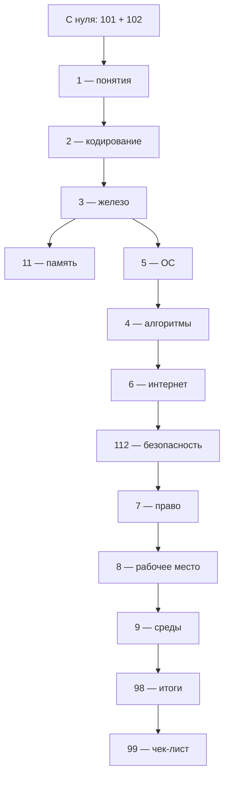
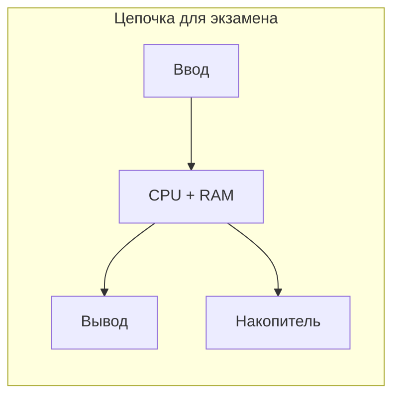

---
tags:
  - inprogress

title: Базовая информатика — итоги
description: >-
  Итоги и FAQ по базовой информатике — ОЗУ, алгоритмы, UTF-8, DNS, Python, Git,
  информатика для школьников, 152-ФЗ и безопасность в интернете.
---

# Базовая информатика — итоги

  НЕ ОБЯЗАТЕЛЬНО
  ДЛЯ НОВИЧКОВ
  В РАЗРАБОТКЕ

Всем

Кратко — что стоит унести из курса **"Базовая информатика"**. Если пункт кажется туманным, откройте соответствующую главу или [оглавление курса](./intro). Заучивание определений — в [чек-листе самопроверки](./99).

---

## FAQ — Часто задаваемые вопросы

Типичные сбои, ситуации новичков и **ответы на частые запросы в поиске** ("что такое ОЗУ", "чем отличается алгоритм от программы", "что такое DNS"). Краткий ответ здесь; разбор — в главах курса.

  
Вопрос. Почему вместо русских букв в текстовом файле или письме появляются "кракозябры"?

  
Ответ. Один и тот же набор байтов прочитали <strong>другой таблицей символов</strong> — файл сохранили в одной кодировке, а программа открыла в другой. Сначала уточните кодировку при открытии (для новых файлов — UTF-8) или пересохраните текст в UTF-8. Подробнее здесь — [глава 2](/encyclopedia/1-basics/1-035-bazovaya-informatika/2).

  
Вопрос. Думал, что компьютер "понимает" русский текст — зачем в курсе столько про байты?

  
Ответ. Машина оперирует только сигналами и числами; смысл появляется, когда есть правило расшифровки и тот, кто его знает. Отсюда цепочка "информация → данные в файле → байты" и ошибка новичка — ждать от программы "понимания" задачи без явного алгоритма. Подробнее здесь — [глава 1](/encyclopedia/1-basics/1-035-bazovaya-informatika/1), [глава 2](/encyclopedia/1-basics/1-035-bazovaya-informatika/2).

  
Вопрос. Нашёл "факт" в интернете или в переписке — можно сразу вставлять в реферат?

  
Ответ. Сначала проверьте <strong>источник, дату и полноту</strong>: субъективное мнение, устаревшая новость и слух в чате выглядят как факты, пока их не сверили. Для решений важны объективность, достоверность и актуальность. Подробнее здесь — [глава 1](/encyclopedia/1-basics/1-035-bazovaya-informatika/1).

  
Вопрос. Скачал архив ZIP, а внутри "лес" папок и непонятные имена файлов — это нормально?

  
Ответ. Архив <strong>склеивает много файлов</strong> в один контейнер; при распаковке восстанавливается структура каталогов. Если имена "ломаются" — снова проверьте кодировку имён (типично при архивах из старых Windows-программ). Подробнее здесь — [глава 2](/encyclopedia/1-basics/1-035-bazovaya-informatika/2).

  
Вопрос. Архив просит пароль, а я его не задавал — что делать?

  
Ответ. Значит, архив создали <strong>с шифрованием</strong> — пароль должен был передать отправитель отдельным каналом. Подбор пароля на чужих архивах без разрешения недопустим. Уточните пароль у автора или запросите архив заново. Подробнее здесь — [глава 2](/encyclopedia/1-basics/1-035-bazovaya-informatika/2).

  
Вопрос. Сохраняю одно и то же фото в JPEG снова и снова — картинка всё более "мыльная". Почему?

  
Ответ. JPEG — сжатие <strong>с потерями</strong>: при каждом пересохранении отбрасываются детали. Для правок храните исходник в PNG; JPEG оставляйте для финальной отправки. Подробнее здесь — [глава 2](/encyclopedia/1-basics/1-035-bazovaya-informatika/2).

  
Вопрос. В мессенджере фото было чётким, а после отправки стало размытым — кто "испортил" файл?

  
Ответ. Многие сервисы <strong>пережимают</strong> изображения и видео для экономии трафика — это отдельный этап сжатия с потерями, как у JPEG. Оригинал для важных работ храните у себя и передавайте архивом или облаком без пережатия, если сервис позволяет "файлом". Подробнее здесь — [глава 2](/encyclopedia/1-basics/1-035-bazovaya-informatika/2).

  
Вопрос. Файл в облаке (Google Диск, Яндекс Диск) и файл на диске `C:` — это одно и то же?

  
Ответ. Локальный файл лежит на <strong>вашем накопителе</strong>; облачный — на серверах провайдера, у вас на экране чаще ярлык и кэш. Синхронизация может задерживаться, офлайн-доступ ограничен. Подробнее здесь — [глава 2](/encyclopedia/1-basics/1-035-bazovaya-informatika/2), [глава 5](/encyclopedia/1-basics/1-035-bazovaya-informatika/5).

  
Вопрос. Компьютер внезапно тормозит: много вкладок, всё "висит". С чего начать?

  
Ответ. Откройте <strong>диспетчер задач</strong>: смотрите загрузку ОЗУ и диска, закройте "тяжёлые" процессы, освободите место на системном диске и проверьте корзину. Постоянные тормоза при слабой загрузке — повод разобрать роли CPU, ОЗУ и SSD/HDD. Подробнее здесь — [глава 3](/encyclopedia/1-basics/1-035-bazovaya-informatika/3), [глава 5](/encyclopedia/1-basics/1-035-bazovaya-informatika/5).

  
Вопрос. После включения чёрный экран или ПК сразу перезагружается — с чего начать диагностику?

  
Ответ. Цепочка старта идёт через <strong>BIOS/UEFI</strong>, затем загрузчик и ОС. Проверьте кабели монитора, последние изменения (новая флешка, недавняя установка), безопасный режим или загрузочную флешку восстановления. На уроке достаточно понимать слои "прошивка → ОС → программа". Подробнее здесь — [глава 3](/encyclopedia/1-basics/1-035-bazovaya-informatika/3), [глава 5](/encyclopedia/1-basics/1-035-bazovaya-informatika/5).

  
Вопрос. Появился "синий экран" с кодом ошибки — что это значит?

  
Ответ. Это <strong>критический сбой ядра ОС</strong> — часто драйвер, железо или повреждённые системные файлы. Запишите код ошибки, отключите недавно установленное устройство/драйвер, проверьте обновления Windows и температуру. Повторяющийся BSOD — к специалисту или в школьную лабораторию с админом. Подробнее здесь — [глава 3](/encyclopedia/1-basics/1-035-bazovaya-informatika/3), [глава 5](/encyclopedia/1-basics/1-035-bazovaya-informatika/5).

  
Вопрос. После обновления Windows мерцает экран или пропал Wi‑Fi — это "сломали" компьютер?

  
Ответ. Частая причина — <strong>несовместимый или устаревший драйвер</strong> видеокарты или сетевого адаптера. Откатите последнее обновление драйвера или поставьте версию с сайта производителя ноутбука/материнской платы. Подробнее здесь — [глава 3](/encyclopedia/1-basics/1-035-bazovaya-informatika/3).

  
Вопрос. Вставил флешку — компьютер её не видит. Что проверить первым делом?

  
Ответ. Другой USB-порт, другой компьютер (правило "флешка или порт"), виден ли диск в "Управлении дисками", не требует ли носитель <strong>форматирования</strong> после сбоя. Не форматируйте сразу, если на носителе важные данные — сначала попробуйте прочитать на другом ПК. Подробнее здесь — [глава 5](/encyclopedia/1-basics/1-035-bazovaya-informatika/5).

  
Вопрос. Случайно удалил важный файл — можно ли вернуть?

  
Ответ. Сначала <strong>корзина</strong> на этом же компьютере. Если файл уже стёрли из корзины или это флешка — шанс есть, пока секторы диска не перезаписали новыми данными; специализированные утилиты восстановления используйте осторожно и не сохраняйте результат на тот же диск. Лучшая защита — копии и облачная синхронизация. Подробнее здесь — [глава 5](/encyclopedia/1-basics/1-035-bazovaya-informatika/5).

  
Вопрос. Файл не открывается двойным щелчком — программа ругается или предлагает "странное" приложение.

  
Ответ. Проверьте <strong>расширение</strong>, установлена ли нужная программа, не повреждён ли файл при копировании. Открытие текста в Word или бинарника в блокноте даёт "кашу" — это разные форматы данных. Подробнее здесь — [глава 5](/encyclopedia/1-basics/1-035-bazovaya-informatika/5).

  
Вопрос. Система пишет "недостаточно места на диске", хотя "вроде ничего не качал".

  
Ответ. Место съедают <strong>обновления Windows</strong>, кэш браузера, загрузки, корзина, теневые копии и старые точки восстановления. Очистите корзину, папку "Загрузки", временные файлы; крупные видео и игры перенесите на другой диск. Подробнее здесь — [глава 5](/encyclopedia/1-basics/1-035-bazovaya-informatika/5).

  
Вопрос. Установил программу, ярлык есть, но при запуске ничего не происходит.

  
Ответ. Ярлык — только ссылка; нужен <strong>запущенный процесс</strong>. Проверьте диспетчер задач, права администратора, блокировку антивирусом, целостность установки (переустановка). Иногда мешает отсутствие библиотек или .NET/Java. Подробнее здесь — [глава 5](/encyclopedia/1-basics/1-035-bazovaya-informatika/5), [глава 4](/encyclopedia/1-basics/1-035-bazovaya-informatika/4).

  
Вопрос. Принтер включён, но документ не печатает — очередь "висит".

  
Ответ. Проверьте кабель или Wi‑Fi принтера, <strong>очередь печати</strong> (отмените зависшие задания), драйвер в разделе "Принтеры", не выбран ли неверный принтер по умолчанию. Подробнее здесь — [глава 5](/encyclopedia/1-basics/1-035-bazovaya-informatika/5).

  
Вопрос. Антивирус ругается на файл с флешки друга — можно "разрешить" и открыть?

  
Ответ. Предупреждение означает <strong>подозрительное поведение или сигнатуру</strong>. Игнорировать стоит только если вы сами собрали файл в учебном проекте и понимаете ложное срабатывание; чужой `.exe` из чата лучше не запускать. Попросите друга проверить носитель своим антивирусом или перешлите документ в безопасном формате (PDF без макросов). Подробнее здесь — [глава 5](/encyclopedia/1-basics/1-035-bazovaya-informatika/5).

  
Вопрос. Все файлы на диске переименовались, экран требует перевести деньги — что делать?

  
Ответ. Это признаки <strong>шифровальщика (ransomware)</strong>. Не платите без консультации взрослых и ИТ-специалиста, отключите ПК от сети, сообщите администратору школы/родителям. Восстановление из резервной копии надёжнее "обещаний" злоумышленника. Подробнее здесь — [глава 5](/encyclopedia/1-basics/1-035-bazovaya-informatika/5), [глава 7](/encyclopedia/1-basics/1-035-bazovaya-informatika/7).

  
Вопрос. Wi‑Fi подключён, "интернет есть", а сайты не открываются.

  
Ответ. Проверьте другой сайт, перезагрузите роутер, смените DNS или браузер. Домашний Wi‑Fi — локальная сеть; выход в интернет идёт через провайдера. Подробнее здесь — [глава 6](/encyclopedia/1-basics/1-035-bazovaya-informatika/6).

  
Вопрос. В адресной строке сайт без замочка или браузер пишет "Не защищено" — опасно ли вводить пароль?

  
Ответ. Для входа в почту, банк и соцсети нужен <strong>HTTPS</strong> (замок): иначе пароль может перехватить в сети. На публичном Wi‑Fi без HTTPS риск выше. Подробнее здесь — [глава 6](/encyclopedia/1-basics/1-035-bazovaya-informatika/6).

  
Вопрос. Пришло письмо "от банка" со ссылкой — нужно срочно войти?

  
Ответ. Типичный <strong>фишинг</strong>. Пароль вводят только на сайте, адрес которого сами набрали или открыли из закладки. Ссылку из письма и мессенджера для банка и почты считайте подозрительной. Подробнее здесь — [глава 6](/encyclopedia/1-basics/1-035-bazovaya-informatika/6).

  
Вопрос. Один и тот же простой пароль на игры, почту и школьный аккаунт — почему это плохая идея?

  
Ответ. Утечка с одного сервиса даёт злоумышленнику доступ <strong>везде, где вы повторили пароль</strong>. Используйте разные пароли или менеджер паролей, включите двухфакторную аутентификацию там, где школа или сервис разрешает. Подробнее здесь — [глава 6](/encyclopedia/1-basics/1-035-bazovaya-informatika/6), [глава 7](/encyclopedia/1-basics/1-035-bazovaya-informatika/7).

  
Вопрос. На видеоуроке звук есть, а картинка замирает — это "сломался" компьютер?

  
Ответ. Чаще <strong>не хватает скорости канала</strong> или перегружен Wi‑Fi: видео буферизуется, аудио идёт отдельным потоком. Подключитесь ближе к роутеру, закройте лишние загрузки, снизьте качество в настройках звонка. Подробнее здесь — [глава 6](/encyclopedia/1-basics/1-035-bazovaya-informatika/6).

  
Вопрос. Программа "не отвечает" — можно сразу выключать питание?

  
Ответ. Сначала завершите зависший <strong>процесс</strong> в диспетчере задач и сохраните другие документы. Жёсткое отключение рискует потерять несохранённые файлы. Подробнее здесь — [глава 4](/encyclopedia/1-basics/1-035-bazovaya-informatika/4), [глава 5](/encyclopedia/1-basics/1-035-bazovaya-informatika/5).

  
Вопрос. В Scratch или Python программа крутится бесконечно и ничего не выводит.

  
Ответ. Обычно <strong>бесконечный цикл</strong> — условие выхода никогда не срабатывает. Остановите выполнение, проверьте блок-схему и граничные случаи (ноль, пустой ввод). Подробнее здесь — [глава 4](/encyclopedia/1-basics/1-035-bazovaya-informatika/4).

  
Вопрос. Код запускается, но ответ неверный — в чём разница с "ошибкой в красном тексте"?

  
Ответ. Красное сообщение при запуске — чаще <strong>синтаксическая</strong> ошибка (опечатка, скобка). Неверный ответ при успешном запуске — <strong>логическая ошибка</strong> (баг): алгоритм выполняется, но план неверен. Ищите через тесты и пошаговую отладку. Подробнее здесь — [глава 4](/encyclopedia/1-basics/1-035-bazovaya-informatika/4).

  
Вопрос. Скопировал готовый код с сайта в школьную работу — это нормально?

  
Ответ. Чужой код — объект <strong>авторского права</strong>; в школе это ещё и плагиат. Можно учиться по чужому примеру с указанием источника, если учитель разрешил; сдавать как свою работу без понимания нельзя. Подробнее здесь — [глава 7](/encyclopedia/1-basics/1-035-bazovaya-informatika/7).

  
Вопрос. Скачал "бесплатную" игру или кряк — что может случиться?

  
Ответ. Риски <strong>технические</strong> (троян, шифровальщик) и <strong>правовые</strong> (нарушение лицензии). Вредоносное может прийти и с флешки, и из вложения в мессенджере. Подробнее здесь — [глава 5](/encyclopedia/1-basics/1-035-bazovaya-informatika/5), [глава 7](/encyclopedia/1-basics/1-035-bazovaya-informatika/7).

  
Вопрос. Выложил в чат телефон и фамилию одноклассника "для списка" — в чём риск?

  
Ответ. Это <strong>персональные данные</strong> без согласия; их могут использовать для спама и мошенничества. Регулирование — 152-ФЗ. Подробнее здесь — [глава 7](/encyclopedia/1-basics/1-035-bazovaya-informatika/7).

  
Вопрос. Друг просит пароль от игры или "взломать" аккаунт в шутку — можно?

  
Ответ. Передача пароля и вход в чужой аккаунт без разрешения — <strong>неправомерный доступ</strong> (УК РФ, ст. 272–273). "Шутка" ответственность не снимает. Подробнее здесь — [глава 7](/encyclopedia/1-basics/1-035-bazovaya-informatika/7).

  
Вопрос. После долгой работы за монитором режут глаза и болит спина — что изменить в первую очередь?

  
Ответ. Высота стула и монитора, расстояние до экрана (ориентир — вытянутая рука), перерывы 5–10 минут каждый час, свет без бликов на экране. Подробнее здесь — [глава 8](/encyclopedia/1-basics/1-035-bazovaya-informatika/8).

  
Вопрос. Учитель говорит "соберите игру в Godot", а в курсе такого не было — куда идти?

  
Ответ. Это задача из <strong>справочника сред</strong>: сначала базовые главы 1–4 (алгоритм, данные), затем точечно откройте раздел про Godot или другую среду под ваш проект. Подробнее здесь — [глава 9](/encyclopedia/1-basics/1-035-bazovaya-informatika/9).

  
Вопрос. С чего начать изучение информатики с нуля?

  
Ответ. С цепочки <strong>данные → устройство → ОС → сеть → алгоритм</strong>, затем право и рабочее место. В этом курсе главы 1→8 идут именно в такой логике; код (Python, Scratch) логичнее после главы 4. Для карьеры в IT дальше — дорожная карта энциклопедии. Подробнее здесь — [глава 1](/encyclopedia/1-basics/1-035-bazovaya-informatika/1), [оглавление курса](./intro).

  
Вопрос. Что такое операционная система (Windows, Linux) простыми словами?

  
Ответ. <strong>ОС</strong> — программа-посредник: запускает приложения, раздаёт память, управляет файлами и устройствами. Без неё пришлось бы вручную общаться с каждым железом. Подробнее здесь — [глава 5](/encyclopedia/1-basics/1-035-bazovaya-informatika/5).

  
Вопрос. Чем оперативная память (ОЗУ) отличается от жёсткого диска и SSD?

  
Ответ. <strong>ОЗУ</strong> — быстрая память "здесь и сейчас" для запущенных программ; при выключении ПК очищается. <strong>Диск/SSD</strong> — долговременное хранение файлов и ОС. Мало ОЗУ — тормоза при многих вкладках; мало места на диске — не ставятся обновления и игры. Подробнее здесь — [глава 3](/encyclopedia/1-basics/1-035-bazovaya-informatika/3).

  
Вопрос. Сколько гигабайт оперативной памяти нужно для учёбы и браузера?

  
Ответ. Для офиса, браузера с десятком вкладок и онлайн-уроков комфортный ориентир — <strong>8 ГБ минимум</strong>, лучше 16 ГБ; тяжёлая графика, виртуальные машины и игры требуют больше. Узкое место часто именно ОЗУ, реже пропускная способность интернета. Подробнее — [глава 3](/encyclopedia/1-basics/1-035-bazovaya-informatika/3), [память и вычисления](/encyclopedia/1-basics/1-035-bazovaya-informatika/11).

  
Вопрос. Что такое процессор (CPU) и для чего он нужен?

  
Ответ. <strong>CPU</strong> выполняет команды программ — арифметика, сравнения, переходы. Частота и число ядер влияют на скорость, но без достаточной ОЗУ и быстрого диска прирост будет небольшим. Подробнее здесь — [глава 3](/encyclopedia/1-basics/1-035-bazovaya-informatika/3).

  
Вопрос. Что такое видеокарта — нужна ли для школы и офиса?

  
Ответ. <strong>GPU</strong> рисует изображение на мониторе; встроенной в процессор часто хватает для браузера, документов и Scratch. Отдельная видеокарта нужна для тяжёлых 3D-игр, монтажа и нейросетей. Подробнее здесь — [глава 3](/encyclopedia/1-basics/1-035-bazovaya-informatika/3).

  
Вопрос. Что такое системный блок — это и есть весь компьютер?

  
Ответ. В быту "компьютером" называют <strong>системный блок</strong> (корпус с платой, CPU, памятью, диском) плюс монитор, клавиатуру и мышь. Ноутбук — те же части, только в одном корпусе. Подробнее здесь — [глава 3](/encyclopedia/1-basics/1-035-bazovaya-informatika/3).

  
Вопрос. Что такое BIOS и UEFI при включении ПК?

  
Ответ. Это <strong>прошивка материнской платы</strong>: проверяет железо, ищет загрузчик ОС и передаёт управление Windows или Linux. UEFI — современный вариант с графическим меню и поддержкой больших дисков. Подробнее здесь — [глава 3](/encyclopedia/1-basics/1-035-bazovaya-informatika/3), [глава 5](/encyclopedia/1-basics/1-035-bazovaya-informatika/5).

  
Вопрос. Что такое драйвер устройства в Windows?

  
Ответ. <strong>Драйвер</strong> — программа, которая переводит команды ОС на язык конкретного устройства (принтер, Wi‑Fi, видеокарта). Без актуального драйвера устройство работает плохо или пропадает после обновления. Подробнее здесь — [глава 3](/encyclopedia/1-basics/1-035-bazovaya-informatika/3), [глава 5](/encyclopedia/1-basics/1-035-bazovaya-informatika/5).

  
Вопрос. Что такое файловая система NTFS и FAT32?

  
Ответ. Это <strong>правила хранения</strong> файлов на диске: имена, размеры, права. NTFS — стандарт Windows для больших дисков; FAT32 часто на флешках, но не принимает очень крупные файлы (лимит около 4 ГБ на файл). Подробнее здесь — [глава 5](/encyclopedia/1-basics/1-035-bazovaya-informatika/5).

  
Вопрос. Что такое расширение файла — docx, pdf, exe?

  
Ответ. Расширение после точки подсказывает <strong>тип данных</strong> и какую программу ОС предложит для открытия. `.exe` — исполняемый файл (запускать только из доверенных источников), `.pdf` — документ, `.zip` — архив. Подробнее здесь — [глава 5](/encyclopedia/1-basics/1-035-bazovaya-informatika/5), [исполняемые файлы и архивы](/encyclopedia/1-basics/1-20-ispolnyaemye-fayly-i-arhivy/intro).

  
Вопрос. Что такое бит и байт в информатике?

  
Ответ. <strong>Бит</strong> — одна ячейка 0 или 1; <strong>байт</strong> — 8 бит, удобная единица для символов и файлов. Размер фото, песни и фильма в мегабайтах и гигабайтах — это счёт байтов на диске. Подробнее здесь — [глава 2](/encyclopedia/1-basics/1-035-bazovaya-informatika/2).

  
Вопрос. Что такое кодировка UTF-8?

  
Ответ. <strong>UTF-8</strong> — общий стандарт, как буквы (в том числе русские и эмодзи) записываются байтами. Для новых сайтов, JSON и текстовых файлов его используют по умолчанию; старые CP866 и Windows-1251 ещё встречаются в архивах DOS. Подробнее здесь — [глава 2](/encyclopedia/1-basics/1-035-bazovaya-informatika/2).

  
Вопрос. PNG или JPEG — какой формат выбрать для фото и рисунка?

  
Ответ. <strong>PNG</strong> — без потерь, хорош для скриншотов, схем и логотипов с прозрачностью. <strong>JPEG</strong> — с потерями, меньший размер для фотографий в соцсетях и почте. Для учебных работ с текстом на картинке чаще PNG. Подробнее здесь — [глава 2](/encyclopedia/1-basics/1-035-bazovaya-informatika/2).

  
Вопрос. ZIP или RAR — что лучше и зачем вообще архивировать файлы?

  
Ответ. Архив <strong>уменьшает объём</strong> и склеивает много файлов в один для отправки. ZIP открывается везде; RAR и 7z иногда дают лучшее сжатие, но нужна соответствующая программа. Подробнее здесь — [глава 2](/encyclopedia/1-basics/1-035-bazovaya-informatika/2), [архивы](/encyclopedia/1-basics/1-20-ispolnyaemye-fayly-i-arhivy/2).

  
Вопрос. Что такое база данных простыми словами?

  
Ответ. <strong>База данных</strong> хранит записи по структуре (таблицы, поля) и позволяет искать и изменять их запросами — школьный журнал, каталог магазина, аккаунты в игре. От обычной папки с файлами отличается строгой схемой и быстрым поиском. Подробнее здесь — [глава 2](/encyclopedia/1-basics/1-035-bazovaya-informatika/2), [основы БД](/encyclopedia/3-data-markup/3-05-osnovy-baz-dannyh/intro).

  
Вопрос. Что такое алгоритм в информатике простыми словами?

  
Ответ. <strong>Алгоритм</strong> — пошаговый план решения задачи: конечный, понятный, с результатом. Программа на Python или блоки Scratch — уже запись этого плана для компьютера. Подробнее здесь — [глава 4](/encyclopedia/1-basics/1-035-bazovaya-informatika/4).

  
Вопрос. Чем алгоритм отличается от программы?

  
Ответ. <strong>Алгоритм</strong> можно описать словами или блок-схемой; <strong>программа</strong> — реализация на языке (файл с кодом), которую запускает ОС как процесс. Один алгоритм можно написать на разных языках. Подробнее здесь — [глава 4](/encyclopedia/1-basics/1-035-bazovaya-informatika/4), [программа](/encyclopedia/1-basics/1-19-programma/intro).

  
Вопрос. Что такое линейный, циклический и разветвляющийся алгоритм?

  
Ответ. <strong>Линейный</strong> — шаги подряд; <strong>разветвляющийся</strong> — выбор по условию (если/иначе); <strong>циклический</strong> — повтор, пока условие истинно. Любая школьная задача собирается из этих трёх кирпичей. Подробнее здесь — [глава 4](/encyclopedia/1-basics/1-035-bazovaya-informatika/4).

  
Вопрос. Что такое блок-схема алгоритма?

  
Ответ. Это <strong>рисунок из фигур</strong> (начало, ввод, решение, цикл, конец), по которому видно логику до написания кода. Удобно на уроке и при разборе ошибок в цикле. Подробнее здесь — [глава 4](/encyclopedia/1-basics/1-035-bazovaya-informatika/4).

  
Вопрос. Чем компилятор отличается от интерпретатора — Python, Java, C++?

  
Ответ. <strong>Компилятор</strong> заранее переводит весь код в исполняемый файл (C++, часто Java в байткод). <strong>Интерпретатор</strong> читает код построчно при запуске (классический режим Python). Для новичка важнее понять: сначала алгоритм, потом синтаксис языка. Подробнее здесь — [глава 4](/encyclopedia/1-basics/1-035-bazovaya-informatika/4), [программа](/encyclopedia/1-basics/1-19-programma/2).

  
Вопрос. С чего начать учить Python школьнику?

  
Ответ. После <strong>алгоритмов и блок-схем</strong> — простые задачи: ввод числа, ветвление, цикл, список. Установите Python 3 с официального сайта или используйте среду школы; сразу приучайтесь к отступам и чтению ошибок в консоли. Подробнее здесь — [глава 4](/encyclopedia/1-basics/1-035-bazovaya-informatika/4), [Python в энциклопедии](/encyclopedia/5-languages/5-02-python/intro).

  
Вопрос. Что такое Scratch — подходит ли для первого программирования?

  
Ответ. <strong>Scratch</strong> — визуальные блоки вместо текста: удобен для алгоритмов, анимации и игр в младших классах. Переход на Python логичен, когда понятны циклы и переменные. Подробнее здесь — [глава 4](/encyclopedia/1-basics/1-035-bazovaya-informatika/4), [Lab — примеры](/lab/Примеры/1121).

  
Вопрос. Что такое Git и зачем он в учебном проекте?

  
Ответ. <strong>Git</strong> хранит <strong>историю версий</strong> кода: кто что менял, откат к вчерашней рабочей версии, совместная работа без перезаписи файлов в чате. Для школьного курса достаточно понять идею; на практике — GitHub или GitLab с учительским репозиторием. Подробнее здесь — [глава 4](/encyclopedia/1-basics/1-035-bazovaya-informatika/4), [основы Git](/encyclopedia/4-code-dev/4-13-osnovy-raboty-s-git/intro).

  
Вопрос. Чем интернет отличается от всемирной паутины (WWW)?

  
Ответ. <strong>Интернет</strong> — инфраструктура сетей и протоколов. <strong>WWW</strong> — сервис сайтов в браузере по HTTP/HTTPS поверх интернета. Мессенджеры и онлайн-игры используют интернет, но не обязательно "сайты". Подробнее здесь — [глава 6](/encyclopedia/1-basics/1-035-bazovaya-informatika/6).

  
Вопрос. Что такое IP-адрес и доменное имя сайта (например, yandex.ru)?

  
Ответ. <strong>IP</strong> — числовой адрес компьютера или сервера в сети. <strong>Домен</strong> — удобное имя для людей; браузер через DNS узнаёт, какой IP стоит за именем. Подробнее здесь — [глава 6](/encyclopedia/1-basics/1-035-bazovaya-informatika/6), [сеть и интернет](/encyclopedia/2-system-network/2-03-set-i-internet/1).

  
Вопрос. Что такое DNS простыми словами?

  
Ответ. <strong>DNS</strong> — "телефонная книга" интернета: переводит имя сайта в IP-адрес. Если DNS недоступен, Wi‑Fi есть, а сайты по имени не открываются — попробуйте другой DNS или перезагрузку роутера. Подробнее здесь — [глава 6](/encyclopedia/1-basics/1-035-bazovaya-informatika/6).

  
Вопрос. Что такое URL в адресной строке браузера?

  
Ответ. <strong>URL</strong> — полный адрес ресурса: протокол (`https://`), домен, путь к странице и параметры (`?id=5`). По нему браузер понимает, какой сервер запросить и какой файл получить. Подробнее здесь — [глава 6](/encyclopedia/1-basics/1-035-bazovaya-informatika/6).

  
Вопрос. Что такое HTTP и HTTPS — зачем замок в браузере?

  
Ответ. <strong>HTTP</strong> — правила передачи веб-страниц; <strong>HTTPS</strong> добавляет шифрование (замок), чтобы пароли и платежи не читали "по дороге". Для входа в почту и банк нужен именно HTTPS. Подробнее здесь — [глава 6](/encyclopedia/1-basics/1-035-bazovaya-informatika/6).

  
Вопрос. Роутер и модем — в чём разница дома?

  
Ответ. <strong>Модем</strong> связывает дом с линией провайдера; <strong>роутер</strong> раздаёт интернет и Wi‑Fi внутри квартиры (NAT, локальные IP). Часто оба спрятаны в одной коробке от провайдера. Подробнее здесь — [глава 3](/encyclopedia/1-basics/1-035-bazovaya-informatika/3), [глава 6](/encyclopedia/1-basics/1-035-bazovaya-informatika/6).

  
Вопрос. Что такое VPN — нужен ли он школьнику?

  
Ответ. <strong>VPN</strong> шифрует трафик до удалённого сервера; в школе его могут запрещать правила сети. Для учёбы важнее HTTPS, сложные пароли и осторожность с фишингом, чем "обход" без понимания рисков. Подробнее здесь — [глава 6](/encyclopedia/1-basics/1-035-bazovaya-informatika/6), [основы ИБ](/encyclopedia/2-system-network/2-08-osnovy-informatsionnoy-bezopasnosti/intro).

  
Вопрос. Что такое облачное хранилище — Google Диск, Яндекс Диск?

  
Ответ. Файлы лежат на <strong>серверах компании</strong>, а на ПК видна синхронизированная копия или ярлык. Удобно для бэкапа и совместной работы; нужны аккуратность с доступом и помнить, что это чужая инфраструктура с лимитом места. Подробнее здесь — [глава 2](/encyclopedia/1-basics/1-035-bazovaya-informatika/2), [глава 6](/encyclopedia/1-basics/1-035-bazovaya-informatika/6).

  
Вопрос. Что такое фишинг в интернете?

  
Ответ. <strong>Фишинг</strong> — поддельные письма, сайты и сообщения, чтобы выманить пароль или данные карты. Защита — не переходить по ссылкам "от банка", проверять адрес вручную, двухфакторная аутентификация. Подробнее здесь — [глава 6](/encyclopedia/1-basics/1-035-bazovaya-informatika/6).

  
Вопрос. Можно ли легально скачивать музыку и фильмы из интернета?

  
Ответ. Контент защищён <strong>авторским правом</strong>; легально — покупка, подписка (стриминг), бесплатные официальные источники и лицензии Creative Commons. "Бесплатно без прав" — риск вирусов и нарушения закона. Подробнее здесь — [глава 7](/encyclopedia/1-basics/1-035-bazovaya-informatika/7).

  
Вопрос. Что такое персональные данные по 152-ФЗ?

  
Ответ. Это любые сведения о человеке (ФИО, телефон, фото, оценки), по которым его можно опознать. Закон 152-ФЗ задаёт, <strong>как их собирать, хранить и публиковать</strong> с согласия; в школе и соцсетях действуют дополнительные правила. Подробнее здесь — [глава 7](/encyclopedia/1-basics/1-035-bazovaya-informatika/7).

  
Вопрос. Что такое open source и лицензия на программу?

  
Ответ. <strong>Open source</strong> — исходный код доступен на условиях лицензии (MIT, GPL и др.): можно учиться, копировать и иногда менять. Лицензия всё равно ограничивает коммерческое использование и обязанность указать автора — её нужно читать. Подробнее здесь — [глава 7](/encyclopedia/1-basics/1-035-bazovaya-informatika/7).

  
Вопрос. Как работает антивирус — зачем он, если я ничего не скачиваю?

  
Ответ. Антивирус сверяет файлы с <strong>базой сигнатур</strong> и смотрит подозрительное поведение. Угроза может прийти с флешки, вложением, уязвимостью браузера или взломанным сайтом — не только с "торрентом". Подробнее здесь — [глава 5](/encyclopedia/1-basics/1-035-bazovaya-informatika/5).

  
Вопрос. Что такое RSS-лента — зачем она, если есть соцсети?

  
Ответ. <strong>RSS</strong> — подписка на обновления сайтов (блоги, новости) в одном ридере без алгоритмической ленты. Удобно отслеживать источники для проектов и рефератов. Подробнее здесь — [глава 6](/encyclopedia/1-basics/1-035-bazovaya-informatika/6).

  
Вопрос. Какая информатика в школе — что входит в базовый курс?

  
Ответ. Обычно: <strong>информация и данные</strong>, устройство ПК, ОС и файлы, сеть и сервисы, алгоритмы и начало программирования, право и безопасность, иногда — основы БД и проект. Этот маршрут в энциклопедии собирает те же темы со ссылками на углубление. Подробнее здесь — [оглавление курса](./intro), [глава 1](/encyclopedia/1-basics/1-035-bazovaya-informatika/1).

  
Вопрос. Что такое Big-O и нужно ли это школьнику?

  
Ответ. <strong>Big-O</strong> описывает, как растёт время работы алгоритма при увеличении входа. Для курса достаточно интуиции: линейный поиск по списку медленнее при 10 000 элементов, чем при 10. Углубление — [Big-O шпаргалка](/lab/examples/1128), [алгоритмы](/encyclopedia/1-basics/1-035-bazovaya-informatika/4).

  
Вопрос. Почему компьютер "зависает", хотя процессор не загружен на 100 %?

  
Ответ. CPU может <strong>ждать данные</strong> с диска или из сети — в диспетчере задач загрузка процессора низкая, а диск или сеть заняты. Ещё причина — нехватка ОЗУ и подкачка. Подробнее — [глава 11](/encyclopedia/1-basics/1-035-bazovaya-informatika/11), [глава 3](/encyclopedia/1-basics/1-035-bazovaya-informatika/3).

  
Вопрос. Чем отличается Wi‑Fi от мобильного интернета (4G/5G)?

  
Ответ. <strong>Wi‑Fi</strong> — локальная беспроводная сеть (дом, школа, кафе), дальше трафик идёт через роутер провайдера. <strong>4G/5G</strong> — связь с вышкой оператора напрямую. Для банка в публичном месте часто безопаснее мобильный интернет, чем чужой Wi‑Fi. Подробнее — [глава 6](/encyclopedia/1-basics/1-035-bazovaya-informatika/6).

  
Вопрос. Можно ли доверять ответу нейросети (ChatGPT и др.) для реферата?

  
Ответ. Нейросеть может <strong>ошибаться и выдумывать</strong> источники. Используйте как черновик идей, но факты сверяйте с учебником и первоисточниками. Не отправляйте в чат пароли и персональные данные. Подробнее — [ИИ для новичка](/encyclopedia/1-basics/1-21-poisk-informatsii/5), [глава 1](/encyclopedia/1-basics/1-035-bazovaya-informatika/1).

  
Вопрос. Что такое passkey и заменяет ли он пароль полностью?

  
Ответ. <strong>Passkey</strong> — вход по криптографическому ключу на устройстве (Face ID, отпечаток). На поддерживающих сайтах заменяет пароль и устойчивее к фишингу. Старые сервисы всё ещё на паролях — нужен менеджер. Подробнее — [глава 113](/encyclopedia/1-basics/1-035-bazovaya-informatika/113), [глава 112](/encyclopedia/1-basics/1-035-bazovaya-informatika/112).

  
Вопрос. Зачем в курсе глава про право, если я хочу быть программистом?

  
Ответ. Разработчик работает с <strong>чужими данными, лицензиями и договорами</strong>: 152-ФЗ, авторское право на код, ответственность за утечки. Нарушение — штрафы и увольнение, не только "мораль". Подробнее — [глава 7](/encyclopedia/1-basics/1-035-bazovaya-informatika/7).

  
Вопрос. SSD "изнашивается" — стоит ли бояться записи на диск?

  
Ответ. У современных SSD запас <strong>ресурса записи</strong> велик для обычного пользователя (годы работы). Не стоит специально переносить папку "Загрузки" на HDD из страха; важнее бэкап и свободное место. Подробнее — [глава 3](/encyclopedia/1-basics/1-035-bazovaya-informatika/3), [память и накопители](/encyclopedia/1-basics/1-08-kak-rabotaet-kompyuter/12).

  
Вопрос. Что такое API простыми словами?

  
Ответ. <strong>API</strong> (Application Programming Interface) — описанный способ, как одна программа просит другую выполнить действие ("отправь сообщение", "верни погоду"). Сайт в браузере тоже общается с сервером по API. Подробнее — [интеграции](/encyclopedia/2-system-network/2-09-osnovy-integratsionnogo-vzaimodeystviya/intro), [глава 6](/encyclopedia/1-basics/1-035-bazovaya-informatika/6).

  
Вопрос. Почему в школе учат Scratch, а в вузе — другие языки?

  
Ответ. Scratch учит <strong>алгоритмам без синтаксиса</strong>; в вузе нужны языки для серьёзных проектов (Python, C++, Java). Навык "думать шагами" переносится между языками. Подробнее — [глава 4](/encyclopedia/1-basics/1-035-bazovaya-informatika/4), [глава 9](/encyclopedia/1-basics/1-035-bazovaya-informatika/9).

---

## Как пользоваться этой страницей

Итоги удобно использовать в трёх режимах.

- **Перед повторением** — пробегите таблицу блоков и отметьте, какие главы нужно перечитать.
- **После курса** — закройте подсказки и попробуйте объяснить каждую "главную мысль" вслух за 30 секунд.
- **Перед зачётом или собеседованием на стажировку** — сверьтесь с [чек-листом](./99) и доберите слабые темы по ссылкам из таблицы.

Если формулировка "знакома, но объяснить не могу" — сигнал вернуться в главу и разобрать тему заново.

---

## Что запомнить

### Восемь блоков одной картины

| Блок | Главная мысль | Глава |
|------|---------------|-------|
| Данные | Всё в компьютере — **числа и коды**; сжатие и архивы экономят место | [Кодирование, сжатие и архивация](/encyclopedia/1-basics/1-035-bazovaya-informatika/2) → [Данные](/encyclopedia/1-basics/1-09-dannye-i-informatsiya/intro) |
| Железо | CPU, память, диск, периферия — **роли** в системе | [Компьютер, периферия и сетевое оборудование](/encyclopedia/1-basics/1-035-bazovaya-informatika/3) → [Компьютер](/encyclopedia/1-basics/1-08-kak-rabotaet-kompyuter/intro) |
| ОС и утилиты | ОС управляет ресурсами; **файлы, антивирус, архиватор** — повседневные инструменты | [ОС, файловые системы и служебные программы](/encyclopedia/1-basics/1-035-bazovaya-informatika/5) |
| Интернет | Сеть + **протоколы** + сервисы (поиск, почта, RSS, стриминг) | [Интернет и сетевые сервисы](/encyclopedia/1-basics/1-035-bazovaya-informatika/6) |
| Алгоритмы | **План** задачи → блок-схема → программа на языке | [Алгоритмы, языки и программирование](/encyclopedia/1-basics/1-035-bazovaya-informatika/4) → [Программа](/encyclopedia/1-basics/1-19-programma/intro) |
| Право | ПО под **авторским правом**; ПДн — 152-ФЗ; взлом и вирусы — УК РФ | [Право и защита информации в РФ](/encyclopedia/1-basics/1-035-bazovaya-informatika/7) |
| Рабочее место | **Эргономика**, перерывы, правила класса | [Организация рабочего места](/encyclopedia/1-basics/1-035-bazovaya-informatika/8) |
| Инструменты | Справочник сред — парсинг, графика, игры, мобильные app | [Инструменты и среды разработки](/encyclopedia/1-basics/1-035-bazovaya-informatika/9) |

---

### Три принципа, которые связывают темы

1. **Компьютер не понимает смысл** — только данные и инструкции. "Умность" в алгоритмах и программах ([Алгоритмы, языки и программирование](/encyclopedia/1-basics/1-035-bazovaya-informatika/4), [Программа](/encyclopedia/1-basics/1-19-programma/1)).
2. **Слои** — приложение → ОС → драйверы → железо ([ОС, файловые системы и служебные программы](/encyclopedia/1-basics/1-035-bazovaya-informatika/5), [Как работает компьютер](/encyclopedia/1-basics/1-08-kak-rabotaet-kompyuter/7)).
3. **Цифровая грамотность** — техника, право и привычки вместе: легальное ПО, аккуратность с данными, здоровье за экраном ([Право и защита информации в РФ](/encyclopedia/1-basics/1-035-bazovaya-informatika/7), [Организация рабочего места](/encyclopedia/1-basics/1-035-bazovaya-informatika/8)).

---

### Частые путаницы

| Путают | На самом деле | Где повторить |
|--------|---------------|---------------|
| Интернет и "сайт в браузере" | WWW — сервис **поверх** сети; интернет — инфраструктура связи | [Интернет и сетевые сервисы](/encyclopedia/1-basics/1-035-bazovaya-informatika/6) |
| ОЗУ и "память на диске" | ОЗУ — быстрое **временное**; диск/SSD — **долговременное** | [Компьютер, периферия и сетевое оборудование](/encyclopedia/1-basics/1-035-bazovaya-informatika/3) |
| Алгоритм и программа | Алгоритм — **план**; программа — **реализация** на языке | [Алгоритмы, языки и программирование](/encyclopedia/1-basics/1-035-bazovaya-informatika/4) |
| Сжатие и архив | Сжатие уменьшает **один** файл; архив **склеивает** много | [Кодирование, сжатие и архивация](/encyclopedia/1-basics/1-035-bazovaya-informatika/2) |
| "Скачал с торрента" и лицензия | Копирование без права — риск по **авторскому праву** | [Право и защита информации в РФ](/encyclopedia/1-basics/1-035-bazovaya-informatika/7) |

---

## Мнемонические приёмы

Короткие формулы помогают вспомнить связи между темами на зачёте или при разговоре с родителями "что вы проходили".

### Восемь глав — одна фраза

**"Данные в Железе крутятся в ОС, выходят в Сеть Алгоритмом, под Правом и Здоровьем, в Инструментах"**

| Слог | Глава | Смысл |
|------|-------|-------|
| Данные | 2 | Байты, кодировки, сжатие |
| Железе | 3 | CPU, RAM, GPU, периферия |
| ОС | 5 | Файлы, процессы, драйверы |
| Сеть | 6 | Интернет, DNS, HTTPS |
| Алгоритмом | 4 | План → код |
| Правом | 7 | Лицензии, ПДн, УК |
| Здоровьем | 8 | Эргономика, перерывы |
| Инструментах | 9 | Среды разработки |

### Три слоя компьютера

**"Программа просит ОС, ОС просит драйвер, драйвер просит железо"** — любая ошибка "не работает принтер" идёт вниз по цепочке.

### Безопасность в интернете

**"Замок, закладка, свой пароль"**

- **Замок** — HTTPS при вводе секретов;
- **Закладка** — открывать банк и почту не по ссылке из письма;
- **Свой пароль** — уникальный на каждый важный сервис (менеджер паролей).

### Файл и данные

**"Расширение подсказывает, кодировка расшифровывает"**

- `.txt` / `.pdf` / `.exe` — тип;
- UTF-8 — как буквы легли в байты.

### Алгоритм

**"ЛРЦ"** — **Л**инейный, **Р**азветвление, **Ц**икл — три кирпича любой школьной задачи.

### Память

**"Быстрое забывает, медленное помнит"** — ОЗУ быстрое и энергозависимое; SSD/HDD медленнее, но хранит после выключения.

### Проверка факта из интернета

**"ИДА"** — **И**сточник, **Д**ата, **А**втор (кто сказал и когда).

---

## Сводные таблицы по главам курса

### Глава 1 — Введение в информатику

| Тема | Ключевая мысль | Типичная ошибка |
|------|----------------|-----------------|
| Информация и данные | Смысл появляется при интерпретации | "Компьютер понимает русский" |
| Объективность | Факт проверяем; мнение — нет | Вставить цитату из чата в реферат |
| Цифровая грамотность | Техника + критическое мышление | Доверять первой ссылке в поиске |

### Глава 2 — Кодирование, сжатие, архивация

| Тема | Ключевая мысль | Типичная ошибка |
|------|----------------|-----------------|
| Бит и байт | Всё в файле — числа | Путать Кб и КБ |
| UTF-8 | Стандарт для текста | Открыть UTF-8 как Windows-1251 |
| JPEG и PNG | JPEG с потерями | Многократно пересохранять JPEG |
| ZIP | Контейнер + сжатие | Путать архив с одним сжатым файлом |

### Глава 3 — Компьютер и периферия

| Тема | Ключевая мысль | Типичная ошибка |
|------|----------------|-----------------|
| CPU | Выполняет команды | "Чем больше ГГц — тем всегда быстрее ПК" |
| RAM | Рабочая память процессов | Путать с "памятью на диске" |
| SSD/HDD | Долговременное хранение | Забивать системный диск |
| GPU | Графика и параллельные задачи | Путать с "видеопамятью вместо RAM" |

### Глава 4 — Алгоритмы и программирование

| Тема | Ключевая мысль | Типичная ошибка |
|------|----------------|-----------------|
| Алгоритм | Конечный план с результатом | Путать с программой |
| Ошибки | Синтаксис и логика | Искать опечатку при неверном ответе |
| Цикл | Нужно условие выхода | Бесконечный цикл в Scratch/Python |
| Git | История версий | Пересылать файлы в чат вместо репозитория |

### Глава 5 — ОС и файлы

| Тема | Ключевая мысль | Типичная ошибка |
|------|----------------|-----------------|
| ОС | Посредник между программами и железом | Думать, что файл "в ярлыке" |
| Файловая система | Правила имён и размещения | Форматировать флешку с данными сразу |
| Процесс | Запущенная программа | Ярлык ≠ работающая программа |
| Антивирус | Сигнатуры и поведение | Игнорировать предупреждение на чужой .exe |

### Глава 6 — Интернет

| Тема | Ключевая мысль | Типичная ошибка |
|------|----------------|-----------------|
| DNS | Имя → IP | "Wi‑Fi есть, а сайты нет" — не всегда "интернет сломан" |
| HTTPS | Шифрование канала | HTTPS ≠ "сайт честный" |
| Фишинг | Обман пользователя, без взлома шифрования | Входить в банк по ссылке из SMS |
| VPN | Туннель до сервера | VPN не заменяет осторожность |

### Глава 7 — Право

| Тема | Ключевая мысль | Типичная ошибка |
|------|----------------|-----------------|
| 152-ФЗ | Правила для ПДн | Публиковать телефоны одноклассников |
| Авторское право | Код и музыка защищены | Сдавать чужой код как свой |
| УК РФ 272 | Неправомерный доступ | "Взломать в шутку" аккаунт друга |

### Глава 8 — Рабочее место

| Тема | Ключевая мысль | Типичная ошибка |
|------|----------------|-----------------|
| Эргономика | Поза, свет, расстояние | Работать сутками без перерывов |
| Перерывы | 5–10 мин каждый час | Игнорировать боль в спине и глазах |

### Глава 9 — Инструменты

| Тема | Ключевая мысль | Типичная ошибка |
|------|----------------|-----------------|
| Среды | Разные задачи — разные IDE | Требовать от курса все языки сразу |
| Справочник | Точечное углубление после базы | Прыгнуть в Godot без алгоритмов |

### Главы 11–13 — Углубление (память, безопасность, passkeys)

| Статья | Ключевая мысль |
|--------|----------------|
| [11. Память и вычисления](/encyclopedia/1-basics/1-035-bazovaya-informatika/11) | CPU часто ждёт данные, не считает |
| [112. Цифровая безопасность](/encyclopedia/1-basics/1-035-bazovaya-informatika/112) | Менеджер паролей + 2FA + осторожность с ссылками |
| [113. Passkeys](/encyclopedia/1-basics/1-035-bazovaya-informatika/113) | Вход без передачи пароля на сайт |

---

## Упражнения по главам (повторение)

Выполняйте письменно или устно с одноклассником. Ответы — в соответствующих главах; здесь только формулировки.

### Глава 1–2 — данные

1. Объясните разницу между **информацией** и **данными** на примере температуры в градусах.
2. Почему при открытии файла появляются "кракозябры"? Назовите два способа исправить.
3. Сравните **сжатие с потерями** и **без потерь** — по одному формату каждого типа.
4. Сколько байт примерно занимает русское слово "информатика" в UTF-8? (Оцените порядок.)

### Глава 3 — железо

1. Назовите **четыре** компонента системного блока и роль каждого.
2. Почему при 4 ГБ RAM и 30 вкладках браузера ПК может "зависать"?
3. Чем **SSD** лучше **HDD** для системного диска? Что SSD не исправляет?
4. Нужна ли дискретная видеокарта для Word и Zoom? Когда GPU критична?

### Глава 4 — алгоритмы

1. Запишите алгоритм "найти большее из трёх чисел" словами или блок-схемой.
2. Приведите пример **синтаксической** и **логической** ошибки на псевдокоде.
3. Чем **компилятор** отличается от **интерпретатора**?
4. Почему в проекте полезен **Git**, если можно копировать папку на флешку?

### Глава 5 — ОС

1. Что делает ОС при **двойном щелчке** по `.exe`?
2. Чем **NTFS** отличается от **FAT32** для флешки с фильмом 8 ГБ?
3. Опишите порядок действий при **случайном удалении** файла с флешки.
4. Почему антивирус ругается на файл с флешки друга?

### Глава 6 — сеть

1. Объясните цепочку: вы вводите `yandex.ru` → появляется страница (DNS, HTTP, браузер).
2. Чем **интернет** отличается от **WWW**?
3. Назовите **три** признака фишингового письма "от банка".
4. Безопасно ли вводить пароль на сайте без HTTPS в домашнем Wi‑Fi?

### Глава 7 — право

1. Что относится к **персональным данным** в школьном списке класса?
2. Можно ли выложить в открытый чат скан чужого паспорта "для шутки"?
3. Чем **лицензия open source** отличается от "просто скачал с сайта"?
4. Какая статья УК РФ касается неправомерного доступа к аккаунту?

### Глава 8 — рабочее место

1. Назовите **три** правила эргономики за монитором.
2. Как часто делать перерывы при долгой работе за ПК?
3. Почему блики на экране вредны?

### Глава 9 и итоговое

1. Выберите среду из [главы 9](/encyclopedia/1-basics/1-035-bazovaya-informatika/9) под задачу "игра 2D" — обоснуйте.
2. Составьте **личный чек-лист** из пяти пунктов цифровой безопасности после курса.
3. Объясните родителю за 60 секунд, что такое **2FA** и зачем она на почте.

  
Самопроверка итогов

  

  Если на половину вопросов выше отвечаете без подсказки — курс усвоен на базовом уровне. Слабые главы отметьте в таблице "Восемь блоков" и перечитайте перед [чек-листом](./99).
  

---

## Карта курса — полный маршрут

| Неделя (пример) | Главы | Цель |
|-----------------|-------|------|
| 1 | 101, 102, 1 | Язык курса, информация и данные |
| 2 | 2 | Байты, UTF-8, сжатие, архивы |
| 3 | 3, 11 | Железо + почему тормозит RAM |
| 4 | 5 | Файлы, ОС, антивирус |
| 5 | 4 | Алгоритмы, Scratch/Python |
| 6 | 6, 112 | Сеть, HTTPS, пароли |
| 7 | 7, 8 | Право, эргономика |
| 8 | 9, 98, 99 | Среды, повторение, зачёт |

Темп гибкий: **обязательный скелет** — 1 → 2 → 3 → 5 → 4 → 6 → 7 → 8; **11, 9, 112–113** — по интересу и заданию учителя.

---

## ОГЭ и ЕГЭ — темы курса в одной таблице

| Тема экзамена | Где в курсе | Ключевые термины |
|---------------|-------------|------------------|
| Информация и данные | [1](./1), [2](./2) | Бит, байт, кодировка, объективность |
| Аппаратное обеспечение | [3](./3), [11](./11) | CPU, RAM, SSD, периферия, иерархия |
| Программное обеспечение | [5](./5) | ОС, файловая система, драйвер |
| Алгоритмы | [4](./4) | Линейный, цикл, ветвление, блок-схема |
| Программирование | [4](./4), [9](./9) | Python, переменные, циклы |
| Сети и интернет | [6](./6) | IP, DNS, HTTP, HTTPS, Wi‑Fi |
| Безопасность | [6](./6), [7](./7), [112](./112) | Фишинг, вирусы, ПДн, 152-ФЗ |
| Правовые нормы | [7](./7) | Авторское право, УК 272 |
| Единицы измерения | [2](./2) | Кб, КБ, перевод скорости |
| Логика и кодирование | [2](./2) | Двоичная система (углубление — [4](/encyclopedia/4-code-dev/4-01-algoritmy/intro)) |

### Частые задания ОГЭ (информатика)

| Тип | Навык | Глава |
|-----|-------|-------|
| Классификация устройств | Ввод/вывод, внутренние/внешние | [3](./3) |
| Размер файла и время | Перевод МБ ↔ Мбит/с | [2](./2) |
| Блок-схема | Линейный, цикл, условие | [4](./4) |
| Безопасность | Фишинг, вирусы, пароли | [6](./6), [112](./112) |

### Профильный ЕГЭ — пересечение с курсом

| Блок ЕГЭ | Базовая глава | Углубление в энциклопедии |
|----------|---------------|----------------------------|
| Системы счисления | [2](./2) | [Алгоритмы](/encyclopedia/4-code-dev/4-01-algoritmy/intro) |
| Исполнение программ | [4](./4) | [Выполнение кода](/encyclopedia/4-code-dev/4-03-vypolnenie-koda/intro) |
| IP и маски | [6](./6) | [Сеть](/encyclopedia/2-system-network/2-03-set-i-internet/1) |
| Базы данных (вводный) | [2](./2) | [Основы БД](/encyclopedia/3-data-markup/3-05-osnovy-baz-dannyh/intro) |

---

## Аппаратное обеспечение — итоговая шпаргалка к экзамену

Сжатый повтор [главы 3](./3) и [11](./11) для зачёта.

| Компонент | Одна фраза | Типичный вопрос |
|-----------|------------|-----------------|
| CPU | Исполняет команды | "Мозг" — неточно, но на ОГЭ принимают |
| ОЗУ | Быстро, энергозависимо, для открытых программ | Куда денется несохранённое |
| SSD/HDD | Долговременные файлы | Чем SSD лучше для системы |
| GPU | Картинка и параллельные расчёты | Нужна ли для Word |
| Материнская плата | Связывает всё | Что такое чипсет |
| БП | Питание 220 В → 12/5/3,3 В | Почему важен запас ватт |
| BIOS/UEFI | Старт до ОС | POST, порядок загрузки |
| Драйвер | ОС ↔ устройство | Почему принтеру нужен драйвер |
| Роутер | LAN + выход в интернет | Отличие от модема |
| Кэш | Быстрый буфер у CPU | Почему линия 64 байта |

---

## Расширенная самопроверка — 30 вопросов с ключами

Закройте ответы, отметьте "+" / "−", цель — **24+** без подсказок.

### Блок A — данные и кодирование

1. Сколько бит в байте?
2. Почему UTF-8 предпочтительнее CP1251 для новых файлов?
3. Чем JPEG отличается от PNG?
4. Почему архив ZIP удобен при отправке 50 файлов?
5. Что такое "сжатие с потерями"?

Ключ A

1. 8.
2. Один стандарт для всех языков и эмодзи; меньше путаницы.
3. JPEG — потери, меньше размер; PNG — без потерь, прозрачность.
4. Один файл, меньше размер, сохраняет структуру папок.
5. Часть данных отбрасывается ради размера (JPEG, MP3).

### Блок B — железо и память

6. Назовите три внутренних устройства системного блока.
7. Почему 8 ГБ RAM мало для 40 вкладок?
8. Чем SATA SSD медленнее NVMe?
9. Что делает POST?
10. Почему нужен драйвер видеокарты?

Ключ B

6. CPU, ОЗУ, материнская плата, HDD/SSD, БП (любые три).
7. Нехватка RAM → подкачка на диск → лаги.
8. SATA ~550 МБ/с; NVMe идёт по PCIe, 2000+ МБ/с.
9. Самотест железа при включении.
10. ОС выводит картинку и использует ускорение GPU.

### Блок C — ОС и файлы

11. Чем процесс отличается от файла?
12. Лимит FAT32 на размер одного файла?
13. Первое действие при случайном удалении?
14. Почему антивирус нужен, даже если не качаю с торрентов?
15. Что такое `pagefile.sys`?

Ключ C

11. Файл на диске; процесс — запущенная программа в RAM.
12. Около 4 ГБ.
13. Корзина; не записывать новые данные на тот же диск.
14. Угрозы с флешки, вложений, уязвимостей.
15. Файл подкачки Windows (виртуальная память).

### Блок D — сеть и безопасность

16. Что делает DNS?
17. Чем HTTP отличается от HTTPS?
18. Три признака фишинга.
19. Что такое 2FA?
20. Чем Wi‑Fi отличается от мобильного 4G?

Ключ D

16. Имя сайта → IP-адрес.
17. HTTPS шифрует трафик (TLS).
18. Срочность, чужой домен, просьба пароля по ссылке (любые три).
19. Второй фактор входа (код, приложение, ключ).
20. Wi‑Fi — локальная сеть; 4G — связь с вышкой оператора.

### Блок E — алгоритмы и право

21. Три типа алгоритмических структур школьного курса.
22. Синтаксическая и логическая ошибка — пример.
23. Почему Git полезен в учебном проекте?
24. Что такое персональные данные по 152-ФЗ?
25. Можно ли сдавать чужой код как свой?

Ключ E

21. Линейный, разветвление, цикл.
22. Синтаксис — `prinт` вместо `print`; логика — формула верна, ответ нет.
23. История версий, откат, совместная работа.
24. Сведения, по которым можно идентифицировать человека.
25. Нет — плагиат и нарушение авторских прав.

### Блок F — интеграция

26. Цепочка: набрали URL → открылась страница.
27. Почему CPU "не загружен", но ПК тормозит?
28. Что такое API простыми словами?
29. Почему passkey удобнее пароля на поддерживающих сайтах?
30. Назовите три пункта эргономики за монитором.

Ключ F

26. DNS → IP → TCP → HTTP(S) → HTML → рендер браузером.
27. Ожидание диска/сети или нехватка RAM (см. [11](./11)).
28. Способ, как программы просят друг друга о действии.
29. Устойчивее к фишингу, ключ не передаётся как пароль.
30. Высота монитора, расстояние, перерывы, свет без бликов (любые три).

---

## Интеграционные задачи (как на итоговом)

**Задача 1.** Ученица сохранила реферат в Word, не закрыла ноутбук, сел аккумулятор. Файл на диске есть, но последние два абзаца пропали. Объясните, используя понятия ОЗУ, накопитель, процесс.

**Задача 2.** В классе 15 ПК и один выход в интернет. Нарисуйте словами схему: коммутатор, роутер, провайдер. Где DHCP?

**Задача 3.** Программа на Python считает сумму массива верно на 100 элементах и неверно на 10 000. Назовите два типа ошибок, которые стоит проверить (подсказка: логика и тип данных / переполнение).

Разборы

**1.** Последние абзацы были в буфере Word в **ОЗУ**; при разряде процесс завершился без записи на **накопитель**. Сохранённая на диск версия старше.

**2.** 15 ПК → **коммутатор(ы)** → **роутер** → модем/провайдер. **DHCP** на роутере раздаёт локальные IP.

**3.** Логическая (неверная формула при больших N); переполнение типа `int` в других языках; в Python — скорее логика или накопление ошибки float; также таймаут не логическая — принимают логику и границы типа.

---

## Глоссарий курса — 40 терминов

| Термин | Глава |
|--------|-------|
| Информация | 1 |
| Данные | 1, 2 |
| Бит, байт | 2 |
| UTF-8 | 2 |
| CPU, GPU, RAM | 3 |
| SSD, HDD | 3 |
| ОС, процесс, файл | 5 |
| Алгоритм, программа | 4 |
| Цикл, ветвление | 4 |
| DNS, IP, URL | 6 |
| HTTPS, фишинг | 6 |
| 152-ФЗ, ПДн | 7 |
| Авторское право | 7 |
| Эргономика | 8 |
| Git | 4 |
| Кэш, DRAM, SRAM | 11 |
| Page fault, swap | 11 |
| API | 6 |
| 2FA, passkey | 112, 113 |
| VPN | 6 |
| Драйвер | 3, 5 |
| BIOS/UEFI | 3, 5 |
| Архив, сжатие | 2 |
| База данных | 2 |
| Роутер, модем | 3, 6 |

---

## План повторения за 3 дня до зачёта

| День | Утро (45 мин) | Вечер (45 мин) |
|------|---------------|----------------|
| **−3** | Таблица "8 блоков" + гл. 2 | FAQ: кодировки и архивы |
| **−2** | Гл. 3 + шпаргалка железа выше | Гл. 4: блок-схема, три ошибки |
| **−1** | Гл. 5–6: ОС и HTTPS | 30 вопросов самопроверки |
| **Зачёт** | [Чек-лист 99](./99) без подсказок | Слабые темы по ссылкам из таблицы |

```mermaid
gantt
    title Повторение перед зачётом
    dateFormat X
    axisFormat %s
    section День 1
    Данные и кодирование :0, 1
    section День 2
    Железо и алгоритмы :1, 2
    section День 3
    ОС сеть право :2, 3
    section Экзамен
    Чеклист 99 :3, 4
```

---

## Куда идти дальше

| Цель | Раздел |
|------|--------|
| Профессия в IT | [Дорожная карта](/encyclopedia/1-basics/1-03-dorozhnaya-karta-izucheniya/1) |
| ОС и сеть | [2. Система и сеть](/encyclopedia/2-system-network/2-01-operatsionnaya-sistema/intro) |
| Код и разработка | [4. Код и разработка](/encyclopedia/4-code-dev/4-02-chto-takoe-kod-i-kak-on-rabotaet/intro) |

Проверьте себя — [Чек-лист самопроверки](./99).

---
