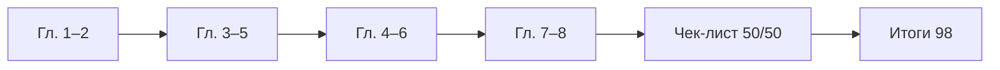

---
tags:
  - inprogress

title: Базовая информатика — чек-лист
description: >-
  Вопросы для самопроверки по курсу "Базовая информатика" — кодирование, железо,
  ОС, интернет, алгоритмы, право и рабочее место; ответы, практика и критерии оценки.
---

import RandomChecklistItem from '@site/src/components/RandomChecklistItem';

# Базовая информатика — чек-лист

  НЕ ОБЯЗАТЕЛЬНО
  ДЛЯ НОВИЧКОВ
  В РАЗРАБОТКЕ

Всем

Страница **самопроверки** по курсу [базовой информатики](./intro). Сначала ответьте на вопросы **без подсказок**; затем сверьтесь с [ключом ответов](#ключ-ответов-к-основным-25-вопросам) и разделом [типичных ошибок](#типичные-ошибки-на-зачёте). Полный маршрут — в [главе 1](./1); итоги — в [98](./98).

Случайный вопрос для разминки:

<RandomChecklistItem />

  
Как пользоваться

  

  <ol>
    <li><strong>После каждой главы</strong> — 2–3 вопроса из таблицы ниже по номеру главы.</li>
    <li><strong>В конце курса</strong> — все 50 пунктов за 1–2 дня; слабые темы отметьте в конспекте.</li>
    <li><strong>Перед зачётом</strong> — только "плавающие" вопросы + <a href="./98">итоги</a> + устный прогон вслух за 30 секунд на тему.</li>
    <li><strong>Для учителя</strong> — см. <a href="#критерии-оценки-школьного-зачёта">критерии оценки</a> и <a href="#практические-сценарии">практические сценарии</a>.</li>
  </ol>

  

---

## Карта вопросов по главам курса

| Глава | Тема | Вопросы в чек-листе |
|-------|------|---------------------|
| [1](./1) | Ключевые понятия | 21, 22, 41–44 |
| [2](./2) | Кодирование и архивы | 1, 2, 16, 24, 26–30 |
| [3](./3) | Железо и периферия | 3, 4, 31–35 |
| [4](./4) | Алгоритмы и код | 10, 11, 18, 23, 36–40 |
| [5](./5) | ОС и файлы | 5, 6, 7, 45–47 |
| [6](./6) | Интернет | 8, 9, 17, 48–50 |
| [7](./7) | Право | 12, 13, 14, 19, 20 |
| [8](./8) | Рабочее место | 15, 20, 25 |
| [101](./101) | Грамотность с нуля | вопросы 45–47 пересекаются |
| [112](./112), [113](./113) | Безопасность | 7, 20, 48 |

---

## Чек-лист самопроверки — основные 25 вопросов

Ответьте вслух или письменно. Если застряли — откройте главу из колонки "Подсказка".

| № | Вопрос | Подсказка (глава) |
|---|--------|-------------------|
| 1 | Чем **данные** отличаются от **информации**? | [Кодирование, сжатие и архивация](/encyclopedia/1-basics/1-035-bazovaya-informatika/2), [Данные](/encyclopedia/1-basics/1-09-dannye-i-informatsiya/1) |
| 2 | Почему важны **архиватор** и **сжатие**? | [Кодирование, сжатие и архивация](/encyclopedia/1-basics/1-035-bazovaya-informatika/2), [Архивы](/encyclopedia/1-basics/1-20-ispolnyaemye-fayly-i-arhivy/2) |
| 3 | Сравните **ОЗУ** (оперативную память) и **диск** (накопитель) | [Компьютер, периферия и сетевое оборудование](/encyclopedia/1-basics/1-035-bazovaya-informatika/3), [Компьютер/3](/encyclopedia/1-basics/1-08-kak-rabotaet-kompyuter/3) |
| 4 | Назовите три **устройства ввода** и два **вывода** | [Компьютер, периферия и сетевое оборудование](/encyclopedia/1-basics/1-035-bazovaya-informatika/3), [Периферия](/encyclopedia/1-basics/1-08-kak-rabotaet-kompyuter/5) |
| 5 | Что такое **операционная система (ОС)** и какие задачи она решает? | [ОС, файловые системы и служебные программы](/encyclopedia/1-basics/1-035-bazovaya-informatika/5), [ОС — о разделе](/encyclopedia/2-system-network/2-01-operatsionnaya-sistema/intro) |
| 6 | Сравните **файл**, **папку** и **расширение** имени | [ОС, файловые системы и служебные программы](/encyclopedia/1-basics/1-035-bazovaya-informatika/5) |
| 7 | Почему нужен **антивирус**, даже если "ничего не скачиваю"? | [ОС, файловые системы и служебные программы](/encyclopedia/1-basics/1-035-bazovaya-informatika/5), [Безопасность](./112) |
| 8 | Что такое **IP-адрес** и **доменное имя**? Как связаны с **DNS**? | [Интернет и сетевые сервисы](/encyclopedia/1-basics/1-035-bazovaya-informatika/6), [Сеть](/encyclopedia/2-system-network/2-03-set-i-internet/1), [DNS](/encyclopedia/2-system-network/2-03-set-i-internet/611) |
| 9 | Назовите три **сетевых сервиса**, которыми вы пользуетесь | [Интернет и сетевые сервисы](/encyclopedia/1-basics/1-035-bazovaya-informatika/6) |
| 10 | Перечислите свойства **алгоритма** | [Алгоритмы, языки и программирование](/encyclopedia/1-basics/1-035-bazovaya-informatika/4) |
| 11 | Сравните **компилятор** и **интерпретатор** | [Алгоритмы, языки и программирование](/encyclopedia/1-basics/1-035-bazovaya-informatika/4), [Программа](/encyclopedia/1-basics/1-19-programma/2) |
| 12 | Почему **программа** — объект авторского права? | [Право и защита информации в РФ](/encyclopedia/1-basics/1-035-bazovaya-informatika/7) |
| 13 | Что регулирует **152-ФЗ** (закон о персональных данных)? | [Право и защита информации в РФ](/encyclopedia/1-basics/1-035-bazovaya-informatika/7) |
| 14 | О чём статьи **272** и **273 УК РФ** (в общих чертах)? | [Право и защита информации в РФ](/encyclopedia/1-basics/1-035-bazovaya-informatika/7) |
| 15 | Как организовать **рабочее место**, чтобы меньше уставали глаза и спина? | [Организация рабочего места](/encyclopedia/1-basics/1-035-bazovaya-informatika/8) |
| 16 | Сравните **сжатие с потерями** и **без потерь** — по одному формату | [Кодирование, сжатие и архивация](/encyclopedia/1-basics/1-035-bazovaya-informatika/2) |
| 17 | Что такое **протокол** в сети? Назовите два примера | [Интернет и сетевые сервисы](/encyclopedia/1-basics/1-035-bazovaya-informatika/6), [Сеть](/encyclopedia/2-system-network/2-03-set-i-internet/1) |
| 18 | Почему в проекте нужна **система контроля версий** ([Git](/encyclopedia/4-code-dev/4-13-osnovy-raboty-s-git/intro))? | [Алгоритмы, языки и программирование](/encyclopedia/1-basics/1-035-bazovaya-informatika/4), [Код](/encyclopedia/4-code-dev/4-02-chto-takoe-kod-i-kak-on-rabotaet/intro) |
| 19 | Что такое **лицензия** open source и почему её читают? | [Право и защита информации в РФ](/encyclopedia/1-basics/1-035-bazovaya-informatika/7), [Лицензирование](/encyclopedia/7-project/7-07-intellektualnye-prava/114) |
| 20 | Назовите **три** правила цифровой гигиены из главы 7–8 | [Право и защита информации в РФ](/encyclopedia/1-basics/1-035-bazovaya-informatika/7), [Организация рабочего места](/encyclopedia/1-basics/1-035-bazovaya-informatika/8) |
| 21 | Перечислите **виды информации** по форме представления (минимум 4) | [Базовая информатика — ключевые понятия и маршрут](/encyclopedia/1-basics/1-035-bazovaya-informatika/1) |
| 22 | Сравните **объективную** и **субъективную** информацию | [Базовая информатика — ключевые понятия и маршрут](/encyclopedia/1-basics/1-035-bazovaya-informatika/1) |
| 23 | Назовите **три свойства алгоритма** и **три типа** алгоритмов по структуре | [Алгоритмы, языки и программирование](/encyclopedia/1-basics/1-035-bazovaya-informatika/4) |
| 24 | Для чего нужны кодировки **CP866** и **Windows-1251**? | [Кодирование, сжатие и архивация](/encyclopedia/1-basics/1-035-bazovaya-informatika/2) |
| 25 | Какая **площадь** на рабочее место с ЖК-монитором по **СанПиН** (ориентир)? | [Организация рабочего места](/encyclopedia/1-basics/1-035-bazovaya-informatika/8) |

---

## Дополнительные вопросы (26–50)

| № | Вопрос | Глава |
|---|--------|-------|
| 26 | Сколько бит в байте? Переведите число 10 в двоичную систему | [2](./2) |
| 27 | Что такое **дискретизация** звука? Назовите частоту 44,1 кГц | [2](./2) |
| 28 | Почему JPEG уменьшает размер фото сильнее PNG? | [2](./2) |
| 29 | Чем **архив** отличается от **сжатия одного файла**? | [2](./2) |
| 30 | Что такое **база данных** и чем она отличается от папки с файлами? | [2](./2) |
| 31 | Что делает **процессор (CPU)**? | [3](./3) |
| 32 | Почему нужен **драйвер** устройства? | [3](./3), [ОС](/encyclopedia/2-system-network/2-01-operatsionnaya-sistema/intro) |
| 33 | Чем **SSD** отличается от **HDD**? | [3](./3) |
| 34 | Что такое **POST** при включении ПК? | [3](./3) |
| 35 | Чем **маршрутизатор** отличается от **коммутатора**? | [3](./3) |
| 36 | Чем **алгоритм** отличается от **программы**? | [4](./4) |
| 37 | Что такое **блок-схема**? Назовите символ "ветвление" | [4](./4) |
| 38 | Что такое **синтаксическая** и **логическая** ошибка? | [4](./4) |
| 39 | Назовите **линейный**, **разветвляющийся** и **циклический** алгоритм — по одному примеру | [4](./4) |
| 40 | Чем **высокоуровневый** язык отличается от **низкоуровневого**? | [4](./4) |
| 41 | Перечислите **информационные процессы** (минимум 4) | [1](./1) |
| 42 | Что такое формула **Хартли** I = log₂(N)? | [1](./1) |
| 43 | Назовите свойства информации: **достоверность**, **актуальность**, **полнота** | [1](./1) |
| 44 | Чем **информатика** отличается от **теории информации**? | [1](./1) |
| 45 | Что такое **процесс** и чем он отличается от **файла программы**? | [5](./5), [4](./4) |
| 46 | Чем **NTFS** отличается от **FAT32**? | [5](./5) |
| 47 | Что такое **корзина** и **путь к файлу**? | [5](./5) |
| 48 | Чем **интернет** шире, чем **WWW**? | [6](./6) |
| 49 | Почему нужен **DNS** (система доменных имён)? | [6](./6), [DNS](/encyclopedia/2-system-network/2-03-set-i-internet/611) |
| 50 | Что такое **HTTPS** (шифрованный HTTP) и **фишинг**? | [6](./6), [112](./112) |

---

## Ключ ответов к основным 25 вопросам

<strong>Ответы 1–10</strong> (раскройте после самостоятельной попытки)

**1.** Информация — смысл для человека; данные — формальная запись (байты). Одни и те же данные без правила расшифровки не несут смысла.

**2.** Сжатие уменьшает размер файла; архиватор объединяет много файлов в один контейнер и часто тоже сжимает (ZIP, 7z).

**3.** **ОЗУ** (оперативная память) — быстрая память для работающих программ, очищается при выключении. **Диск** или **SSD** — долговременное хранение файлов; данные сохраняются после выключения.

**4.** Ввод: клавиатура, мышь, сканер, микрофон, веб-камера… Вывод: монитор, принтер, колонки…

**5.** ОС — посредник между пользователем, программами и железом: процессы, память, файлы, устройства, интерфейс.

**6.** Файл — именованные байты; папка — контейнер для файлов и папок. Расширение (`.txt`, `.pdf`) подсказывает тип и программу.

**7.** Угроза с флешки, вложения, уязвимости ОС, взломанные сайты — не только "скачивание с торрентов".

**8.** **IP-адрес** — числовой адрес устройства в сети. **Доменное имя** — удобная метка (`yandex.ru`). **DNS** (система доменных имён) переводит имя в IP.

**9.** Примеры: веб, почта, мессенджер, поиск, стриминг, облако.

**10.** Дискретность, понятность, конечность, результат (массовость/универсальность в школьном курсе).

<strong>Ответы 11–20</strong>

**11.** Компилятор переводит весь код в исполняемый файл заранее; интерпретатор выполняет построчно при запуске.

**12.** Программа для ЭВМ — объект авторского права (ГК РФ); копирование без лицензии — нарушение.

**13.** **152-ФЗ** (федеральный закон о персональных данных) — правила сбора, хранения, согласия и защиты **ПДн** (персональных данных).

**14.** ст. 272 — неправомерный доступ к информации; ст. 273 — создание/распространение вредоносных программ.

**15.** Монитор на уровне глаз, 50–70 см, освещение без бликов, перерывы 5–10 мин каждый час, правило 20-20-20.

**16.** С потерями — нельзя восстановить точно (JPEG, MP3); без потерь — да (PNG, ZIP, FLAC).

**17.** **Протокол** — правила обмена данными в сети. Примеры: **HTTP/HTTPS** (веб), **SMTP** (почта), **DNS** (имя → IP), **TCP/IP** (транспорт).

**18.** История изменений, откат к рабочей версии, совместная работа без перезаписи файлов в чате.

**19.** Open source — лицензия разрешает использование/изучение кода на условиях (MIT, GPL…); нарушение условий — юридический риск.

**20.** Примеры: легальное ПО; не публиковать чужие ПДн; уникальные пароли; перерывы; не вводить пароль по ссылке из письма.

<strong>Ответы 21–25</strong>

**21.** Текстовая, числовая, графическая, звуковая, видео (и др.).

**22.** Объективная — измерена прибором, проверяема; субъективная — мнение, ощущение ("холодно" без градусов).

**23.** Свойства: дискретность, понятность, конечность, результат. Типы: линейный, разветвляющийся, циклический.

**24.** Исторические кодировки кириллицы в DOS (CP866) и Windows (CP1251); объясняют "кракозябры" при неверной кодировке.

**25.** Не менее **4,5 м²** на место с ЖК-монитором (СанПиН 2.2.2/2.4.1340-03); для ЭЛТ — 6 м².

---

## Ключ к вопросам 26–50 (кратко)

| № | Краткий ответ |
|---|----------------|
| 26 | 8 бит; 10₁₀ = 1010₂ |
| 27 | Непрерывная волна → отсчёты; 44100 отсчётов/с |
| 28 | JPEG — с потерями, убирает незаметные детали |
| 29 | Архив склеивает много файлов; JPEG сжимает один |
| 30 | Структурированное хранение + запросы (СУБД) |
| 31 | Выполняет команды программ |
| 32 | Связь ОС с конкретным устройством |
| 33 | SSD — флэш, быстрее; HDD — пластины |
| 34 | Самотест железа при включении |
| 35 | Switch — внутри LAN; router — выход в интернет |
| 36 | Алгоритм — план; программа — запись на языке |
| 37 | Графическое описание; ветвление — ромб |
| 38 | Синтаксис — текст неверен; логика — неверный результат |
| 39 | Линейный: перевод °C→°F; ветвление: чётное/нечётное; цикл: сумма 1..n |
| 40 | Высокий — абстракции (Python); низкий — близко к CPU (ассемблер) |
| 41 | Создание, хранение, поиск, преобразование, передача, использование |
| 42 | I = log₂(N) бит для N равновероятных исходов |
| 43 | См. таблицу свойств в [главе 1](./1) |
| 44 | Информатика — практика на ПК; теория информации — математические модели |
| 45 | Процесс — живое исполнение в ОЗУ; файл — на диске |
| 46 | NTFS — большие файлы, права; FAT32 — лимит ~4 ГБ на файл |
| 47 | Корзина — временное хранение удалённого; путь — адрес `C:\Users\…` |
| 48 | Интернет — инфраструктура; WWW — веб-страницы в браузере |
| 49 | DNS переводит доменное имя (например, `yandex.ru`) в IP-адрес сервера |
| 50 | HTTPS — HTTP с шифрованием канала; фишинг — поддельный сайт для кражи пароля |

---

## Практические сценарии

Ответьте: **что проверить** и **какая глава** помогает.

### Сценарий A — "Кракозябры" в текстовом файле

| Шаг | Ваш ответ |
|-----|-----------|
| 1 | Какая вероятная причина? |
| 2 | Первое действие? |
| 3 | Как предотвратить в будущем? |

**Эталон:** несовпадение кодировок (UTF-8 и CP1251); пересохранить в UTF-8 или указать кодировку при открытии; для новых файлов — UTF-8. Глава [2](./2).

### Сценарий B — ПК тормозит при 20 вкладках браузера

**Эталон:** проверить ОЗУ в диспетчере задач; закрыть лишнее; при постоянной нехватке — добавить RAM или SSD. Главы [3](./3), [5](./5).

### Сценарий C — Письмо "банк заблокирован, войдите по ссылке"

**Эталон:** фишинг; не кликать; открыть приложение банка или набрать адрес вручную; сообщить в банк. Главы [6](./6), [112](./112).

### Сценарий D — Программа выдаёт неверный ответ без красных ошибок

**Эталон:** логическая ошибка; трассировка, тесты на граничных случаях, блок-схема. Глава [4](./4).

### Сценарий E — Одноклассник просит пароль "для проверки домашки"

**Эталон:** отказ; неправомерный доступ (ст. 272 УК РФ); предложить объяснить задачу устно. Глава [7](./7).

---

## Задачи в стиле контрольной (с ответами)

### Задача 1 — Хартли

Монета: орёл или решка. Сколько бит информации в сообщении о результате?

**Ответ:** N = 2 → I = log₂(2) = **1 бит**.

### Задача 2 — Объём звука

Моно, 16 бит, 44,1 кГц, 10 секунд. Сколько байт (без сжатия)?

**Решение:** 44100 × 2 байта × 10 = 882 000 байт ≈ **861 КБ**.

### Задача 3 — Растровое изображение

800×600, RGB (3 байта/пиксель), без сжатия. Размер в байтах?

**Ответ:** 800 × 600 × 3 = **1 440 000** байт ≈ 1,37 МБ.

### Задача 4 — Двоичная система

Переведите 13₁₀ в двоичную.

**Ответ:** **1101₂**.

### Задача 5 — Алгоритм

Нарисуйте блок-схему: ввести `n`, вывести "чётное" или "нечётное".

**Эталон:** ввод → ромб `n mod 2 = 0?` → две ветки → вывод → конец.

---

## Устный зачёт — шпаргалка на 30 секунд

На экзамене часто просят **коротко объяснить связку из трёх понятий**. Потренируйтесь вслух:

| Тема | Три слова или фразы |
|------|-------------------|
| Данные | байты, кодировка, смысл у человека |
| Железо | CPU, ОЗУ, накопитель |
| ОС | процессы, файлы, драйверы |
| Сеть | IP, DNS, протокол |
| Алгоритм | шаги, конечность, результат |
| Право | авторское право, 152-ФЗ, лицензия |
| Эргономика | монитор, перерывы, освещение |

---

## Типичные ошибки на зачёте

| Ошибка | Правильно |
|--------|-----------|
| "Компьютер понимает русский текст" | Смысл понимает человек; машина обрабатывает [байты](/encyclopedia/1-basics/1-09-dannye-i-informatsiya/2) |
| "Интернет = браузер" | [Интернет](/encyclopedia/2-system-network/2-03-set-i-internet/intro) — инфраструктура; браузер — одна программа для [WWW](/encyclopedia/2-system-network/2-04-kak-rabotayut-sayty-i-veb-sayty/intro) |
| "ОЗУ = память на диске C:" | **ОЗУ** (RAM) — для работающих программ; **диск C:** — долговременное хранение |
| "Алгоритм = программа" | **Алгоритм** — план шагов; **программа** — запись плана на языке |
| "Архив = сжатие фото" | **Архив** (ZIP) — контейнер для многих файлов; **JPEG** — сжатие одного изображения |
| "Антивирус ловит только скачанное" | Угрозы также с флешек, вложений, [уязвимостей ОС](/encyclopedia/2-system-network/2-01-operatsionnaya-sistema/intro) |
| "HTTPS = сайт честный" | **HTTPS** шифрует канал; подделка домена и [фишинг](./112) всё равно возможны |
| "Open source = можно всё без ограничений" | Нужно читать лицензию — [GPL](/encyclopedia/7-project/7-07-intellektualnye-prava/114) и [MIT](/encyclopedia/7-project/7-07-intellektualnye-prava/114) различаются |

---

## Критерии оценки школьного зачёта

Ориентир для самопроверки или работы учителя (шкала 1–5):

| Балл | Критерий |
|------|----------|
| **5** | Уверенно отвечает на 45+ вопросов из 50; решает задачи на кодирование и алгоритмы; приводит бытовые примеры |
| **4** | 35–44 вопроса; мелкие пробелы в сети или праве, но ядро (данные, ОЗУ, ОС, алгоритм) твёрдое |
| **3** | 25–34 вопроса; путает пары "интернет/WWW", "алгоритм/программа", "ОЗУ/диск" |
| **2** | Менее 25; не может объяснить роль ОС или отличие данных от информации |

**Практический минимум для "3":** уметь включить ПК, сохранить файл, объяснить ОЗУ и диск, назвать 3 свойства алгоритма, не вводить пароль по ссылке из письма.

---

## Прогресс-трекер

Отметьте после прохождения глав:

| Глава | Прочитал | Вопросы ✓ | Практика ✓ |
|-------|----------|-----------|------------|
| [101](./101) | ☐ | ☐ | ☐ |
| [1](./1) | ☐ | ☐ | ☐ |
| [2](./2) | ☐ | ☐ | ☐ |
| [3](./3) | ☐ | ☐ | ☐ |
| [4](./4) | ☐ | ☐ | ☐ |
| [5](./5) | ☐ | ☐ | ☐ |
| [6](./6) | ☐ | ☐ | ☐ |
| [7](./7) | ☐ | ☐ | ☐ |
| [8](./8) | ☐ | ☐ | ☐ |
| [112](./112) | ☐ | ☐ | ☐ |

---

## Как проходить чек-лист

- **После каждой главы** — 2–3 вопроса из строк, относящихся к пройденной теме.
- **В конце курса** — все 50 пунктов за один или два дня; слабые отметьте в конспекте.
- **Перед зачётом** — только строки, где ответ "плавает", плюс [итоги](./98).

  
Для преподавателя

  

  Можно выдавать <strong>один сценарий</strong> из раздела "Практические сценарии" + <strong>две задачи</strong> из контрольного блока + <strong>5 устных вопросов</strong> из таблицы 1–25 как мини-зачёт на 15 минут.

  

Итоги курса — [Базовая информатика — итоги](/encyclopedia/1-basics/1-035-bazovaya-informatika/98).

---
