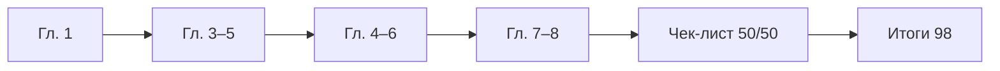

import RandomChecklistItem from '@site/src/components/RandomChecklistItem';

# Базовая информатика — чек-лист

## Вход и грамотность

  НЕ ОБЯЗАТЕЛЬНО
  ДЛЯ НОВИЧКОВ
  В РАЗРАБОТКЕ

Всем

Страница **самопроверки** по [базовой информатике](./intro). Сначала ответьте на вопросы **без подсказок**; затем сверьтесь с [ключом ответов](#ключ-ответов-к-основным-25-вопросам) и разделом [типичных ошибок](#типичные-ошибки). Полный маршрут — в [ключевых понятиях](/encyclopedia/1-basics/1-035-bazovaya-informatika/1); итоги — в [98](./98).

Случайный вопрос для разминки:

<RandomChecklistItem />

  
Как пользоваться

  

  <ol>
    <li><strong>После каждой главы</strong> — 2–3 вопроса из таблицы ниже по номеру главы.</li>
    <li><strong>В конце раздела</strong> — все 50 пунктов за 1–2 дня; слабые темы отметьте в конспекте.</li>
    <li><strong>Перед итоговой самопроверкой</strong> — только «плавающие» вопросы + <a href="./98">итоги</a>.</li>
  </ol>

  

---

## Карта вопросов по статьям раздела

| Глава | Тема | Вопросы в чек-листе |
|-------|------|---------------------|
| [1](/encyclopedia/1-basics/1-035-bazovaya-informatika/1) | Ключевые понятия | 21, 22, 26, 41–44 |
| [Данные и информация](/encyclopedia/1-basics/1-09-dannye-i-informatsiya/intro) | Кодирование, сжатие, архивы | 1, 2, 16, 24, 27–29 |
| [Как работает компьютер](../1-08-kak-rabotaet-kompyuter/intro) | Железо и периферия | 3, 4, 31–35 |
| [4](/encyclopedia/1-basics/1-035-bazovaya-informatika/204) | Алгоритмы и код | 10, 11, 18, 23, 36–40 |
| [5](/encyclopedia/1-basics/1-035-bazovaya-informatika/205) | ОС и файлы | 5, 6, 7, 45–47 |
| [6](/encyclopedia/1-basics/1-035-bazovaya-informatika/206) | Интернет | 8, 9, 17, 48–50 |
| [7](/encyclopedia/1-basics/1-035-bazovaya-informatika/307) | Право | 12, 13, 14, 19, 20 |
| [8](/encyclopedia/1-basics/1-035-bazovaya-informatika/308) | Рабочее место | 15, 20, 25 |
| [101](./101) | Грамотность с нуля | вопросы 45–47 пересекаются |
| [112](./112), [113](./113) | Безопасность | 7, 20, 48 |

---

## Чек-лист самопроверки — основные 25 вопросов

Ответьте вслух или письменно. Если застряли — откройте главу из колонки "Подсказка".

| № | Вопрос | Подсказка (глава) |
|---|--------|-------------------|
| 1 | Чем **данные** отличаются от **информации**? | [Данные и информация](/encyclopedia/1-basics/1-09-dannye-i-informatsiya/1) |
| 2 | Почему важны **архиватор** и **сжатие**? | [Виды информации](/encyclopedia/1-basics/1-09-dannye-i-informatsiya/2), [Архивы](/encyclopedia/1-basics/1-20-ispolnyaemye-fayly-i-arhivy/2) |
| 3 | Сравните **ОЗУ** (оперативную память) и **диск** (накопитель) | [Как работает компьютер](/encyclopedia/1-basics/1-08-kak-rabotaet-kompyuter/intro), [Компьютер/3](/encyclopedia/1-basics/1-08-kak-rabotaet-kompyuter/3) |
| 4 | Назовите три **устройства ввода** и два **вывода** | [Как работает компьютер](/encyclopedia/1-basics/1-08-kak-rabotaet-kompyuter/intro), [Периферия](/encyclopedia/1-basics/1-08-kak-rabotaet-kompyuter/5) |
| 5 | Что такое **операционная система (ОС)** и какие задачи она решает? | [ОС, файловые системы и служебные программы](/encyclopedia/2-system-network/2-01-operatsionnaya-sistema/intro), [ОС — о разделе](/encyclopedia/2-system-network/2-01-operatsionnaya-sistema/intro) |
| 6 | Сравните **файл**, **папку** и **расширение** имени | [ОС, файловые системы и служебные программы](/encyclopedia/2-system-network/2-01-operatsionnaya-sistema/intro) |
| 7 | Почему нужен **антивирус**, даже если "ничего не скачиваю"? | [ОС, файловые системы и служебные программы](/encyclopedia/2-system-network/2-01-operatsionnaya-sistema/intro), [Безопасность](./112) |
| 8 | Что такое **IP-адрес** и **доменное имя**? Как связаны с **DNS**? | [Интернет и сетевые сервисы](/encyclopedia/2-system-network/2-03-set-i-internet/intro), [Сеть](/encyclopedia/2-system-network/2-03-set-i-internet/1), [DNS](/encyclopedia/2-system-network/2-03-set-i-internet/611) |
| 9 | Назовите три **сетевых сервиса**, которыми вы пользуетесь | [Интернет и сетевые сервисы](/encyclopedia/2-system-network/2-03-set-i-internet/intro) |
| 10 | Перечислите свойства **алгоритма** | [Алгоритмы, языки и программирование](/encyclopedia/4-code-dev/4-01-algoritmy/intro) |
| 11 | Сравните **компилятор** и **интерпретатор** | [Алгоритмы, языки и программирование](/encyclopedia/4-code-dev/4-01-algoritmy/intro), [Программа](/encyclopedia/1-basics/1-19-programma/2) |
| 12 | Почему **программа** — объект авторского права? | [Право и защита информации в РФ](/encyclopedia/7-project/7-07-intellektualnye-prava/intro) |
| 13 | Что регулирует **152-ФЗ** (закон о персональных данных)? | [Право и защита информации в РФ](/encyclopedia/7-project/7-07-intellektualnye-prava/intro) |
| 14 | О чём статьи **272** и **273 УК РФ** (в общих чертах)? | [Право и защита информации в РФ](/encyclopedia/7-project/7-07-intellektualnye-prava/intro) |
| 15 | Как организовать **рабочее место**, чтобы меньше уставали глаза и спина? | [Организация рабочего места](/encyclopedia/1-basics/1-035-bazovaya-informatika/202) |
| 16 | Сравните **сжатие с потерями** и **без потерь** — по одному формату | [Виды информации](/encyclopedia/1-basics/1-09-dannye-i-informatsiya/2), [Архивы](/encyclopedia/1-basics/1-20-ispolnyaemye-fayly-i-arhivy/2) |
| 17 | Что такое **протокол** в сети? Назовите два примера | [Интернет и сетевые сервисы](/encyclopedia/2-system-network/2-03-set-i-internet/intro), [Сеть](/encyclopedia/2-system-network/2-03-set-i-internet/1) |
| 18 | Почему в проекте нужна **система контроля версий** ([Git](/encyclopedia/4-code-dev/4-13-osnovy-raboty-s-git/intro))? | [Алгоритмы, языки и программирование](/encyclopedia/4-code-dev/4-01-algoritmy/intro), [Код](/encyclopedia/4-code-dev/4-02-chto-takoe-kod-i-kak-on-rabotaet/intro) |
| 19 | Что такое **лицензия** open source и почему её читают? | [Право и защита информации в РФ](/encyclopedia/7-project/7-07-intellektualnye-prava/intro), [Лицензирование](/encyclopedia/7-project/7-07-intellektualnye-prava/114) |
| 20 | Назовите **три** правила цифровой гигиены из главы 7–8 | [Право и защита информации в РФ](/encyclopedia/7-project/7-07-intellektualnye-prava/intro), [Организация рабочего места](/encyclopedia/1-basics/1-035-bazovaya-informatika/202) |
| 21 | Перечислите **виды информации** по форме представления (минимум 4) | [Базовая информатика — ключевые понятия и маршрут](/encyclopedia/1-basics/1-035-bazovaya-informatika/1) |
| 22 | Сравните **объективную** и **субъективную** информацию | [Базовая информатика — ключевые понятия и маршрут](/encyclopedia/1-basics/1-035-bazovaya-informatika/1) |
| 23 | Назовите **три свойства алгоритма** и **три типа** алгоритмов по структуре | [Алгоритмы, языки и программирование](/encyclopedia/4-code-dev/4-01-algoritmy/intro) |
| 24 | Для чего нужны кодировки **CP866** и **Windows-1251**? | [Текстовые данные](/encyclopedia/1-basics/1-15-tekst/1) |
| 25 | Какая **площадь** на рабочее место с ЖК-монитором по **СанПиН** (ориентир)? | [Организация рабочего места](/encyclopedia/1-basics/1-035-bazovaya-informatika/202) |

---

## Дополнительные вопросы (26–50)

| № | Вопрос | Глава |
|---|--------|-------|
| 26 | Сколько бит в байте? Переведите число 10 в двоичную систему | [1](/encyclopedia/1-basics/1-035-bazovaya-informatika/1#системы-счисления) |
| 27 | Что такое **дискретизация** звука? Назовите частоту 44,1 кГц | [Виды информации](/encyclopedia/1-basics/1-09-dannye-i-informatsiya/2) |
| 28 | Почему JPEG уменьшает размер фото сильнее PNG? | [Виды информации](/encyclopedia/1-basics/1-09-dannye-i-informatsiya/2) |
| 29 | Чем **архив** отличается от **сжатия одного файла**? | [Архивы](/encyclopedia/1-basics/1-20-ispolnyaemye-fayly-i-arhivy/2) |
| 30 | Что такое **база данных** и чем она отличается от папки с файлами? | [Основы БД](/encyclopedia/3-data-markup/3-05-osnovy-baz-dannyh/1) |
| 31 | Что делает **процессор (CPU)**? | [Как работает компьютер](../1-08-kak-rabotaet-kompyuter/intro) |
| 32 | Почему нужен **драйвер** устройства? | [Как работает компьютер](../1-08-kak-rabotaet-kompyuter/intro), [ОС](/encyclopedia/2-system-network/2-01-operatsionnaya-sistema/intro) |
| 33 | Чем **SSD** отличается от **HDD**? | [Как работает компьютер](../1-08-kak-rabotaet-kompyuter/intro) |
| 34 | Что такое **POST** при включении ПК? | [Как работает компьютер](../1-08-kak-rabotaet-kompyuter/intro) |
| 35 | Чем **маршрутизатор** отличается от **коммутатора**? | [Как работает компьютер](../1-08-kak-rabotaet-kompyuter/intro) |
| 36 | Чем **алгоритм** отличается от **программы**? | [4](/encyclopedia/1-basics/1-035-bazovaya-informatika/204) |
| 37 | Что такое **блок-схема**? Назовите символ "ветвление" | [4](/encyclopedia/1-basics/1-035-bazovaya-informatika/204) |
| 38 | Что такое **синтаксическая** и **логическая** ошибка? | [4](/encyclopedia/1-basics/1-035-bazovaya-informatika/204) |
| 39 | Назовите **линейный**, **разветвляющийся** и **циклический** алгоритм — по одному примеру | [4](/encyclopedia/1-basics/1-035-bazovaya-informatika/204) |
| 40 | Чем **высокоуровневый** язык отличается от **низкоуровневого**? | [4](/encyclopedia/1-basics/1-035-bazovaya-informatika/204) |
| 41 | Перечислите **информационные процессы** (минимум 4) | [1](/encyclopedia/1-basics/1-035-bazovaya-informatika/1) |
| 42 | Что такое формула **Хартли** I = log₂(N)? | [1](/encyclopedia/1-basics/1-035-bazovaya-informatika/1) |
| 43 | Назовите свойства информации: **достоверность**, **актуальность**, **полнота** | [1](/encyclopedia/1-basics/1-035-bazovaya-informatika/1) |
| 44 | Чем **информатика** отличается от **теории информации**? | [1](/encyclopedia/1-basics/1-035-bazovaya-informatika/1) |
| 45 | Что такое **процесс** и чем он отличается от **файла программы**? | [5](/encyclopedia/1-basics/1-035-bazovaya-informatika/205), [4](/encyclopedia/1-basics/1-035-bazovaya-informatika/204) |
| 46 | Чем **NTFS** отличается от **FAT32**? | [5](/encyclopedia/1-basics/1-035-bazovaya-informatika/205) |
| 47 | Что такое **корзина** и **путь к файлу**? | [5](/encyclopedia/1-basics/1-035-bazovaya-informatika/205) |
| 48 | Чем **интернет** шире, чем **WWW**? | [6](/encyclopedia/1-basics/1-035-bazovaya-informatika/206) |
| 49 | Почему нужен **DNS** (система доменных имён)? | [6](/encyclopedia/1-basics/1-035-bazovaya-informatika/206), [DNS](/encyclopedia/2-system-network/2-03-set-i-internet/611) |
| 50 | Что такое **HTTPS** (шифрованный HTTP) и **фишинг**? | [6](/encyclopedia/1-basics/1-035-bazovaya-informatika/206), [112](./112) |

---

## Ключ ответов к основным 25 вопросам

<strong>Ответы 1–10</strong> (раскройте после самостоятельной попытки)

**1.** Информация — смысл для человека; данные — формальная запись (байты). Одни и те же данные без правила расшифровки не несут смысла.

**2.** Сжатие уменьшает размер файла; архиватор объединяет много файлов в один контейнер и часто тоже сжимает (ZIP, 7z).

**3.** **ОЗУ** (оперативная память) — быстрая память для работающих программ, очищается при выключении. **Диск** или **SSD** — долговременное хранение файлов; данные сохраняются после выключения.

**4.** Ввод: клавиатура, мышь, сканер, микрофон, веб-камера… Вывод: монитор, принтер, колонки…

**5.** ОС — посредник между пользователем, программами и железом: процессы, память, файлы, устройства, интерфейс.

**6.** Файл — именованные байты; папка — контейнер для файлов и папок. Расширение (`.txt`, `.pdf`) подсказывает тип и программу.

**7.** Угроза с флешки, вложения, уязвимости ОС, взломанные сайты — не только "скачивание с торрентов".

**8.** **IP-адрес** — числовой адрес устройства в сети. **Доменное имя** — удобная метка (`yandex.ru`). **DNS** (система доменных имён) переводит имя в IP.

**9.** Примеры: веб, почта, мессенджер, поиск, стриминг, облако.

**10.** Дискретность, понятность, конечность, результат (массовость/универсальность в школьной программе).

<strong>Ответы 11–20</strong>

**11.** Компилятор переводит весь код в исполняемый файл заранее; интерпретатор выполняет построчно при запуске.

**12.** Программа для ЭВМ — объект авторского права (ГК РФ); копирование без лицензии — нарушение.

**13.** **152-ФЗ** (федеральный закон о персональных данных) — правила сбора, хранения, согласия и защиты **ПДн** (персональных данных).

**14.** ст. 272 — неправомерный доступ к информации; ст. 273 — создание/распространение вредоносных программ.

**15.** Монитор на уровне глаз, 50–70 см, освещение без бликов, перерывы 5–10 мин каждый час, правило 20-20-20.

**16.** С потерями — нельзя восстановить точно (JPEG, MP3); без потерь — да (PNG, ZIP, FLAC).

**17.** **Протокол** — правила обмена данными в сети. Примеры: **HTTP/HTTPS** (веб), **SMTP** (почта), **DNS** (имя → IP), **TCP/IP** (транспорт).

**18.** История изменений, откат к рабочей версии, совместная работа без перезаписи файлов в чате.

**19.** Open source — лицензия разрешает использование/изучение кода на условиях (MIT, GPL…); нарушение условий — юридический риск.

**20.** Примеры: легальное ПО; не публиковать чужие ПДн; уникальные пароли; перерывы; не вводить пароль по ссылке из письма.

<strong>Ответы 21–25</strong>

**21.** Текстовая, числовая, графическая, звуковая, видео (и др.).

**22.** Объективная — измерена прибором, проверяема; субъективная — мнение, ощущение ("холодно" без градусов).

**23.** Свойства: дискретность, понятность, конечность, результат. Типы: линейный, разветвляющийся, циклический.

**24.** Исторические кодировки кириллицы в DOS (CP866) и Windows (CP1251); объясняют "кракозябры" при неверной кодировке.

**25.** Не менее **4,5 м²** на место с ЖК-монитором (СанПиН 2.2.2/2.4.1340-03); для ЭЛТ — 6 м².

---

## Ключ к вопросам 26–50 (кратко)

| № | Краткий ответ |
|---|----------------|
| 26 | 8 бит; 10₁₀ = 1010₂ |
| 27 | Непрерывная волна → отсчёты; 44100 отсчётов/с |
| 28 | JPEG — с потерями, убирает незаметные детали |
| 29 | Архив склеивает много файлов; JPEG сжимает один |
| 30 | Структурированное хранение + запросы (СУБД) |
| 31 | Выполняет команды программ |
| 32 | Связь ОС с конкретным устройством |
| 33 | SSD — флэш, быстрее; HDD — пластины |
| 34 | Самотест железа при включении |
| 35 | Switch — внутри LAN; router — выход в интернет |
| 36 | Алгоритм — план; программа — запись на языке |
| 37 | Графическое описание; ветвление — ромб |
| 38 | Синтаксис — текст неверен; логика — неверный результат |
| 39 | Линейный: перевод °C→°F; ветвление: чётное/нечётное; цикл: сумма 1..n |
| 40 | Высокий — абстракции (Python); низкий — близко к CPU (ассемблер) |
| 41 | Создание, хранение, поиск, преобразование, передача, использование |
| 42 | I = log₂(N) бит для N равновероятных исходов |
| 43 | См. таблицу свойств в [ключевым понятиям](/encyclopedia/1-basics/1-035-bazovaya-informatika/1) |
| 44 | Информатика — практика на ПК; теория информации — математические модели |
| 45 | Процесс — живое исполнение в ОЗУ; файл — на диске |
| 46 | NTFS — большие файлы, права; FAT32 — лимит ~4 ГБ на файл |
| 47 | Корзина — временное хранение удалённого; путь — адрес `C:\Users\…` |
| 48 | Интернет — инфраструктура; WWW — веб-страницы в браузере |
| 49 | DNS переводит доменное имя (например, `yandex.ru`) в IP-адрес сервера |
| 50 | HTTPS — HTTP с шифрованием канала; фишинг — поддельный сайт для кражи пароля |

---

## Практические сценарии

Ответьте: **что проверить** и **какая глава** помогает.

### Сценарий A — "Кракозябры" в текстовом файле

| Шаг | Ваш ответ |
|-----|-----------|
| 1 | Какая вероятная причина? |
| 2 | Первое действие? |
| 3 | Как предотвратить в будущем? |

**Эталон:** несовпадение кодировок (UTF-8 и CP1251); пересохранить в UTF-8 или указать кодировку при открытии; для новых файлов — UTF-8. [Текстовые данные](/encyclopedia/1-basics/1-15-tekst/1).

### Сценарий B — ПК тормозит при 20 вкладках браузера

**Эталон:** проверить ОЗУ в диспетчере задач; закрыть лишнее; при постоянной нехватке — добавить RAM или SSD. Главы [Как работает компьютер](../1-08-kak-rabotaet-kompyuter/intro), [5](/encyclopedia/1-basics/1-035-bazovaya-informatika/205).

### Сценарий C — Письмо "банк заблокирован, войдите по ссылке"

**Эталон:** фишинг; не кликать; открыть приложение банка или набрать адрес вручную; сообщить в банк. Главы [6](/encyclopedia/1-basics/1-035-bazovaya-informatika/206), [112](./112).

### Сценарий D — Программа выдаёт неверный ответ без красных ошибок

**Эталон:** логическая ошибка; трассировка, тесты на граничных случаях, блок-схема. Глава [4](/encyclopedia/1-basics/1-035-bazovaya-informatika/204).

### Сценарий E — Одноклассник просит пароль "для проверки домашки"

**Эталон:** отказ; неправомерный доступ (ст. 272 УК РФ); предложить объяснить задачу устно. Глава [7](/encyclopedia/1-basics/1-035-bazovaya-informatika/307).

---

## Типичные ошибки

| Ошибка | Правильно |
|--------|-----------|
| "Компьютер понимает русский текст" | Смысл понимает человек; машина обрабатывает [байты](/encyclopedia/1-basics/1-09-dannye-i-informatsiya/2) |
| "Интернет = браузер" | [Интернет](/encyclopedia/2-system-network/2-03-set-i-internet/intro) — инфраструктура; браузер — одна программа для [WWW](/encyclopedia/2-system-network/2-04-kak-rabotayut-sayty-i-veb-sayty/intro) |
| "ОЗУ = память на диске C:" | **ОЗУ** (RAM) — для работающих программ; **диск C:** — долговременное хранение |
| "Алгоритм = программа" | **Алгоритм** — план шагов; **программа** — запись плана на языке |
| "Архив = сжатие фото" | **Архив** (ZIP) — контейнер для многих файлов; **JPEG** — сжатие одного изображения |
| "Антивирус ловит только скачанное" | Угрозы также с флешек, вложений, [уязвимостей ОС](/encyclopedia/2-system-network/2-01-operatsionnaya-sistema/intro) |
| "HTTPS = сайт честный" | **HTTPS** шифрует канал; подделка домена и [фишинг](./112) всё равно возможны |
| "Open source = можно всё без ограничений" | Нужно читать лицензию — [GPL](/encyclopedia/7-project/7-07-intellektualnye-prava/114) и [MIT](/encyclopedia/7-project/7-07-intellektualnye-prava/114) различаются |

---

## Прогресс-трекер

Отметьте после прохождения глав:

| Глава | Прочитал | Вопросы ✓ | Практика ✓ |
|-------|----------|-----------|------------|
| [101](./101) | ☐ | ☐ | ☐ |
| [1](/encyclopedia/1-basics/1-035-bazovaya-informatika/1) | ☐ | ☐ | ☐ |
| [Как работает компьютер](../1-08-kak-rabotaet-kompyuter/intro) | ☐ | ☐ | ☐ |
| [4](/encyclopedia/1-basics/1-035-bazovaya-informatika/204) | ☐ | ☐ | ☐ |
| [5](/encyclopedia/1-basics/1-035-bazovaya-informatika/205) | ☐ | ☐ | ☐ |
| [6](/encyclopedia/1-basics/1-035-bazovaya-informatika/206) | ☐ | ☐ | ☐ |
| [7](/encyclopedia/1-basics/1-035-bazovaya-informatika/307) | ☐ | ☐ | ☐ |
| [8](/encyclopedia/1-basics/1-035-bazovaya-informatika/308) | ☐ | ☐ | ☐ |
| [112](./112) | ☐ | ☐ | ☐ |

---

## Как проходить чек-лист

- **После каждой главы** — 2–3 вопроса из строк, относящихся к пройденной теме.
- **В конце раздела** — все 50 пунктов за один или два дня; слабые отметьте в конспекте.
- **Перед итоговой самопроверкой** — только строки, где ответ «плавает», плюс [итоги](./98).

Итоги раздела — [Базовая информатика — итоги](/encyclopedia/1-basics/1-035-bazovaya-informatika/98).

---

---

## Советы новичку

### Советы для новичка — чек-лист

  НЕ ОБЯЗАТЕЛЬНО
  ДЛЯ НОВИЧКОВ

Всем

<RandomChecklistItem />

---

## Чек-лист — 15 пунктов

Отметьте для себя "да / нет / частично" — цель не идеальный балл, а увидеть пробелы.

1. Знаю, откуда безопасно скачивать программы (официальный сайт или магазин).
2. Есть **резервная копия** важных файлов (облако, внешний диск или оба).
3. Пароли не повторяются; для ключевых сервисов включена **2FA**.
4. Понимаю разницу между **кэшем браузера** и сохранёнными паролями в браузере.
5. Проверял **автозагрузку** и отключил лишнее.
6. Знаю сочетание **`Ctrl + Shift + Esc`** для диспетчера задач.
7. Умею сделать скриншот (`Win + Shift + S`) и перед отправкой скрываю личные данные.
8. Не отключаю антивирус и брандмауэр "ради скорости" без замены защиты.
9. На телефоне знаю, что занимает место (отчёт о хранилище), и не путаю **память** с **ОЗУ**.
10. При "медленном интернете" сначала проверяю роутер, кабель и фоновые загрузки, а не мифичный "QoS 20 %".
11. Папки и файлы называю так, чтобы через полгода понять содержимое.
12. За компьютером делаю перерывы для глаз и спины.
13. Если в семье есть ребёнок — настроен **родительский контроль** и обсуждены правила сети.
14. Не следую сомнительным советам (`/nouaccheck`, "никогда не уведомлять UAC", полное отключение точек восстановления).
15. Перед установкой софта читаю шаги мастера и снимаю галочки "дополнительного ПО".

---

---

## Софт рядового пользователя

### Софт рядового пользователя — чек-лист

  НЕ ОБЯЗАТЕЛЬНО
  ДЛЯ НОВИЧКОВ

Всем

<RandomChecklistItem />

---

## Чек-лист самопроверки

1. Какие основные категории программ используются в повседневной работе?
2. Какие системные приложения есть в Windows ([301](/encyclopedia/1-basics/1-035-bazovaya-informatika/301)) и Linux ([308](/encyclopedia/1-basics/1-035-bazovaya-informatika/308))?
3. Какой софт из вышеперечисленных есть у вас на ПК?
4. Каким браузером вы пользуетесь?
5. Какие мессенджеры вы используете?

---

---

## Советы продвинутому

### Советы для продвинутого — чек-лист

  НЕ ОБЯЗАТЕЛЬНО

Опытному пользователю

Отметьте пункты, которые уже делаете осознанно (не "слышал", а "делал хотя бы раз").

---

## Автоматизация и среда

- [ ] Написал скрипт на PowerShell, Python или Bash для реальной задачи (бэкап, отчёт, переименование).
- [ ] Знаю, когда **не** стоит автоматизировать (разовая, нечёткая задача).
- [ ] Использую планировщик (Windows Task Scheduler / cron в WSL).
- [ ] Пробовал AutoHotkey или PowerToys Keyboard Manager для своего сочетания.
- [ ] Есть `winget export` или список установленного ПО в Git.

---

## Виртуализация и Linux

- [ ] Создал ВМ, сделал снапшот, откатился после эксперимента.
- [ ] Установил WSL 2 или отдельный Linux (ВМ / старый ПК).
- [ ] Понимаю разницу NAT и bridged для Home Lab.
- [ ] Понимаю, зачем Home Lab, и знаю один сервис, который хотите поднять (VPN, DNS, облако файлов).

---

## Приватность и данные

- [ ] Менеджер паролей + 2FA на почте и основном облаке.
- [ ] Понимаю разницу облака и self-hosting; есть бэкап по **3-2-1**.
- [ ] Пробовал восстановить файл из бэкапа (тест восстановления).
- [ ] Знаю, что даёт WireGuard или аналог, и где почитать [подробнее](/encyclopedia/2-system-network/2-03-set-i-internet/613).

---

## Рабочий процесс

- [ ] Использую ≥ 15 осознанных горячих клавиш ([шпаргалка](/encyclopedia/1-basics/1-035-bazovaya-informatika/203)).
- [ ] Рабочий редактор — не Блокнот (Notepad++, VS Code, Vim…).
- [ ] Установлены [PowerToys](https://learn.microsoft.com/windows/powertoys/) (Run, FancyZones или аналог).
- [ ] VS Code или аналог: Remote SSH к серверу / NAS хотя бы раз.

---

## Windows и игры

- [ ] Открывал Process Explorer / монитор ресурсов и нашёл процесс, грузивший CPU/диск.
- [ ] Знаю, какие папки кэша можно чистить, и **не** трогал `System32` "оптимизатором".
- [ ] Для игр — проверял температуры, shader cache, отключал лишние оверлеи.
- [ ] Понимаю разницу FPS, 1% low и input lag.

---

## Железо

- [ ] Знаю температуры CPU/GPU под нагрузкой.
- [ ] Понимаю, что такое троттлинг, и когда виновато железо, а не "вирусы".
- [ ] Смотрел SMART диска (CrystalDiskInfo) хотя бы раз.

---

**Ориентир:** меньше половины пунктов — нормальная база, идите по [карте раздела](/encyclopedia/1-basics/1-035-bazovaya-informatika/401); большинство блоков — уверенный power user; почти всё — логично углубляться в [администрирование](/encyclopedia/2-system-network/2-06-sistemnoe-administrirovanie/intro) или [разработку](/encyclopedia/4-code-dev/4-14-razrabotka-i-otladka/intro) по интересу.

Незакрытые пункты — по [карте раздела](/encyclopedia/1-basics/1-035-bazovaya-informatika/401).

---

---

## Софт продвинутого

### Софт продвинутого пользователя — чек-лист

  НЕ ОБЯЗАТЕЛЬНО

Опытному пользователю

<RandomChecklistItem />

---

## Проверьте себя по разделу

Отметьте, что уже можете сделать без подсказки:

1. **Файлы:** найти файл по имени через Everything и скопировать путь в Total Commander или Проводник.
2. **Редактор:** открыть папку конфигов в VS Code (`code .`), включить подсветку для `.json` / `.yaml` / `.ps1`.
3. **Сеть:** проверить доступность сайта (`Test-NetConnection` или `ping`) и DNS (`Resolve-DnsName` / `nslookup`).
4. **Автоматизация:** запустить `.ps1` или `.ahk` вручную и повесить на Планировщик заданий.
5. **Безопасность:** объяснить, зачем менеджер паролей и BitLocker/VeraCrypt на ноутбуке.
6. **ВМ:** создать снапшот в VirtualBox, сломать гостевую ОС, откатиться.
7. **PowerToys:** пользоваться Run (`Alt+Space`) или FancyZones хотя бы раз в день.
8. **Схемы:** сохранить диаграмму в `.drawio` и открыть diff в Git (текст XML, не бинарник).

Если меньше половины пунктов — начните с [обзора стека](/encyclopedia/1-basics/1-035-bazovaya-informatika/501) и [советов продвинутому (401+)](/encyclopedia/1-basics/1-035-bazovaya-informatika/401).

---
