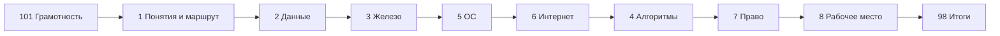
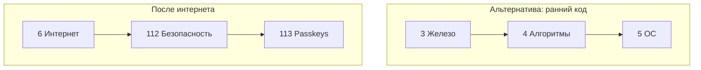
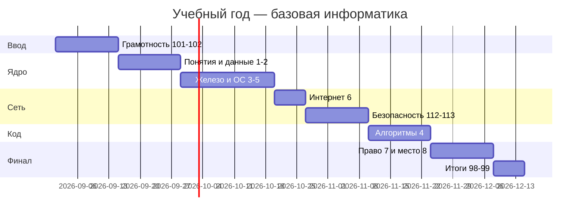
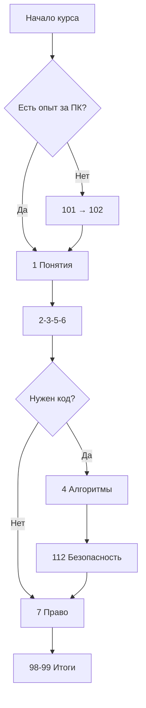

---
tags:
  - inprogress

title: Базовая информатика — о разделе
description: >-
  Учебный маршрут по школьной и начальной информатике — кодирование, железо, ОС,
  интернет, алгоритмы, право и рабочее место — со ссылками на подробные главы
  энциклопедии.
sidebar_label: Базовая информатика — о разделе
related:
  - title: "Дорожная карта изучения"
    doc: encyclopedia/1-basics/1-03-dorozhnaya-karta-izucheniya/1
  - title: "Как работает компьютер"
    doc: encyclopedia/1-basics/1-08-kak-rabotaet-kompyuter/intro
  - title: "Данные и информация"
    doc: encyclopedia/1-basics/1-09-dannye-i-informatsiya/intro
  - title: "Программа"
    doc: encyclopedia/1-basics/1-19-programma/intro
  - title: "Big-O — шпаргалка с примерами"
    doc: lab/examples/1128
  - title: "Алгоритмы на Python — ЕГЭ и олимпиадка"
    doc: lab/examples/1122
  - title: "Восприятие IT в обществе"
    doc: encyclopedia/1-basics/1-04-kak-vidyat-it-obychnye-lyudi/1
  - title: "Советы для новичка — о разделе"
    doc: encyclopedia/1-basics/1-12-sovety-dlya-novichka/intro
  - title: "Дорожная карта изучения — о разделе"
    doc: encyclopedia/1-basics/1-03-dorozhnaya-karta-izucheniya/intro
  - title: "Карьера в IT и мифы — о разделе"
    doc: encyclopedia/1-basics/1-26-karera-v-it-i-mify/intro
---

import ExternalPlayEmbed from '@site/src/components/ExternalPlayEmbed';

import DocCardList from '@theme/DocCardList';

# О разделе

  В РАЗРАБОТКЕ

**Учебный маршрут** по школьной и начальной информатике. Здесь собраны главы в порядке, удобном для школы и для самостоятельного чтения с нуля. Каждая ссылка ведёт в развёрнутую статью энциклопедии.

## Частые путаницы новичка

### Интернет и веб

- **Интернет** — глобальная сеть, по которой передаются данные между устройствами.
- **Веб (WWW)** — сервис сайтов, которые открываются в **браузере**.
- Онлайн-игра и почта используют интернет, но не всегда открываются как "сайт" в браузере.

Подробнее — [Интернет и сетевые сервисы](/encyclopedia/1-basics/1-035-bazovaya-informatika/6).

### ОЗУ и накопитель

- **ОЗУ (RAM)** — память "здесь и сейчас". Пока программа работает, её данные лежат в ОЗУ. После выключения ПК ОЗУ очищается.
- **Накопитель (HDD, SSD)** — хранит файлы годами, даже когда ПК выключен.

См. [Как работает компьютер](/encyclopedia/1-basics/1-08-kak-rabotaet-kompyuter/intro) и [Память](/encyclopedia/1-basics/1-08-kak-rabotaet-kompyuter/12).

### Алгоритм и программа

- **Алгоритм** — пошаговый план решения задачи словами или блок-схемой.
- **Программа** — тот же план, записанный на **языке программирования** для компьютера.

См. [Алгоритмы, языки и программирование](/encyclopedia/1-basics/1-035-bazovaya-informatika/4).

### Файл и процесс

- **Файл** — именованные данные на диске (документ, фото, установщик).
- **Процесс** — запущенная программа в **ОЗУ** (видна в [Диспетчере задач](/encyclopedia/2-system-network/2-06-sistemnoe-administrirovanie/97)).

См. [Программа → процесс](/encyclopedia/1-basics/1-19-programma/1#programma-protsess-potok).

### Данные и информация

- **Данные** — байты в файле или в сети.
- **Информация** — смысл, который понимает человек после расшифровки данных.

См. [Ключевые понятия](/encyclopedia/1-basics/1-035-bazovaya-informatika/1) и [Данные и информация](/encyclopedia/1-basics/1-09-dannye-i-informatsiya/intro).

### Сжатие и архив

- **Сжатие** — уменьшение размера одного файла (ZIP внутри, JPEG для фото).
- **Архив** — один файл-контейнер для **многих** файлов и папок (`.zip`, `.7z`).

См. [Данные и информация](/encyclopedia/1-basics/1-09-dannye-i-informatsiya/intro), [Архивы](/encyclopedia/1-basics/1-20-ispolnyaemye-fayly-i-arhivy/2).

  
Как пользоваться

  

  **Совсем с нуля**

  - [Основы компьютерной грамотности](/encyclopedia/1-basics/1-035-bazovaya-informatika/101) — мышь, окна, сохранение файла
  - [Терминология новичка](/encyclopedia/1-basics/1-035-bazovaya-informatika/102) — словарь на каждый день
  - [Цифровая безопасность](/encyclopedia/1-basics/1-035-bazovaya-informatika/112) — пароли, фишинг, бэкап

  **Школьный маршрут**

  - главы **1 → 8** по порядку или по [расширенной карте](#расширенная-карта-курса)
  - после [Как работает компьютер](/encyclopedia/1-basics/1-08-kak-rabotaet-kompyuter/intro) — [Организация и уровни](/encyclopedia/1-basics/1-035-bazovaya-informatika/10), затем [Память и вычисления](/encyclopedia/1-basics/1-035-bazovaya-informatika/11)
  - глава 9 — справочник сред (Godot, Flutter, Python…) по мере проектов
  - после главы 6 — [Passkeys](/encyclopedia/1-basics/1-035-bazovaya-informatika/113)

  **В конце курса**

  - [Итоги](/encyclopedia/1-basics/1-035-bazovaya-informatika/98)
  - [Чек-лист](/encyclopedia/1-basics/1-035-bazovaya-informatika/99)

  

---

## Карта курса

| № | Тема | Глава курса | Подробнее в энциклопедии |
|---|---------------|-------------|---------------------------|
| 101 | Компьютерная грамотность с нуля | [Основы компьютерной грамотности](/encyclopedia/1-basics/1-035-bazovaya-informatika/101) | [Как работает компьютер](/encyclopedia/1-basics/1-08-kak-rabotaet-kompyuter/intro), [Советы для новичка](/encyclopedia/1-basics/1-12-sovety-dlya-novichka/intro) |
| 102 | Терминология новичка | [Терминология новичка](/encyclopedia/1-basics/1-035-bazovaya-informatika/102) | [Глоссарий](/glossary/intro), [Сленг](/encyclopedia/1-basics/1-06-sleng/intro) |
| 1 | Ключевые понятия и маршрут | [Базовая информатика — ключевые понятия и маршрут](/encyclopedia/1-basics/1-035-bazovaya-informatika/1) | [Дорожная карта](/encyclopedia/1-basics/1-03-dorozhnaya-karta-izucheniya/1), [Данные и информация](/encyclopedia/1-basics/1-09-dannye-i-informatsiya/intro), [Архивы](/encyclopedia/1-basics/1-20-ispolnyaemye-fayly-i-arhivy/2) |
| 3 | Железо, периферия, сети | [Компьютер, периферия и сетевое оборудование](/encyclopedia/1-basics/1-035-bazovaya-informatika/3) | [Как работает компьютер](/encyclopedia/1-basics/1-08-kak-rabotaet-kompyuter/intro), [Аппаратное обеспечение](/encyclopedia/2-system-network/2-10-zhelezo/1) |
| 10 | Организация, архитектура, уровни (фон Нейман, иерархия уровней) | [Организация, архитектура и уровни компьютера](/encyclopedia/1-basics/1-035-bazovaya-informatika/10) | [Многоуровневая организация](/encyclopedia/1-basics/1-08-kak-rabotaet-kompyuter/13), [Архитектура фон Неймана](/encyclopedia/2-system-network/2-10-zhelezo/11) |
| 4 | Алгоритмы, языки, программирование | [Алгоритмы, языки и программирование](/encyclopedia/1-basics/1-035-bazovaya-informatika/4) | [Программа](/encyclopedia/1-basics/1-19-programma/intro), [Код и разработка](/encyclopedia/4-code-dev/code-dev), [Ассемблер](/encyclopedia/5-languages/5-16-starye-yazyki/assembler/intro), [Visual Basic](/encyclopedia/5-languages/5-16-starye-yazyki/visual-basic/intro) |
| 5 | ОС, файловые системы, утилиты | [ОС, файловые системы и служебные программы](/encyclopedia/1-basics/1-035-bazovaya-informatika/5) | [ОС](/encyclopedia/2-system-network/2-01-operatsionnaya-sistema/intro), [модели развёртывания](/encyclopedia/1-basics/1-13-soft-prodvinutogo-polzovatelya/8#chetiryre-modeli-razvertyvaniya) |
| 6 | Интернет и сервисы | [Интернет и сетевые сервисы](/encyclopedia/1-basics/1-035-bazovaya-informatika/6) | [Сеть](/encyclopedia/2-system-network/2-03-set-i-internet/intro), [Поиск](/encyclopedia/1-basics/1-21-poisk-informatsii/intro), [Коммуникация](/encyclopedia/1-basics/1-22-kommunikatsiya-i-obschenie/intro) |
| 112 | Цифровая безопасность | [Цифровая безопасность для пользователя](/encyclopedia/1-basics/1-035-bazovaya-informatika/112) | [Основы ИБ](/encyclopedia/2-system-network/2-08-osnovy-informatsionnoy-bezopasnosti/intro), [Советы новичку](/encyclopedia/1-basics/1-12-sovety-dlya-novichka/intro) |
| 113 | Passkeys | [Passkeys и современный вход](/encyclopedia/1-basics/1-035-bazovaya-informatika/113) | [Пароли](/encyclopedia/2-system-network/2-08-osnovy-informatsionnoy-bezopasnosti/114) |
| 7 | Право и защита информации | [Право и защита информации в РФ](/encyclopedia/1-basics/1-035-bazovaya-informatika/7) | [Интеллектуальные права](/encyclopedia/7-project/7-07-intellektualnye-prava/intro) |
| 8 | Организация рабочего места | [Организация рабочего места](/encyclopedia/1-basics/1-035-bazovaya-informatika/8) | [Эргономика клавиатуры](/encyclopedia/1-basics/1-08-kak-rabotaet-kompyuter/713) |
| 9 | Инструменты и среды (справочник) | [Инструменты и среды разработки](/encyclopedia/1-basics/1-035-bazovaya-informatika/9) | BeautifulSoup, Godot, Flutter, App Inventor и др. |
| 11 | Память и вычисления | [Память и вычисления](/encyclopedia/1-basics/1-035-bazovaya-informatika/11) | [Память и накопители](/encyclopedia/1-basics/1-08-kak-rabotaet-kompyuter/12), [Аппаратное обеспечение](/encyclopedia/2-system-network/2-10-zhelezo/intro) |

---

## Расширенная карта курса

Для каждой главы — **результаты обучения**, **оценка времени**, **что желательно знать заранее** и **как проверить себя**.

### Вводный блок (101, 102)

| Глава | Результаты обучения (что сможете) | Время | Предварительные знания | Самопроверка |
|-------|-----------------------------------|-------|------------------------|--------------|
| **101** | Включить ПК, мышь/клавиатура, окна, сохранение файла, базовая навигация | 2–4 ч | Умение читать; доступ к компьютеру | Практика за столом по шагам статьи |
| **102** | Понимать 30–50 базовых терминов (файл, ОС, браузер, URL…) | 1–2 ч | 101 или опыт "на глаз" | [Глоссарий](/glossary/intro) — узнаёте ли слова |

  
101 и 102 — не пропускайте при полном нуле

  

  Главы 1–8 предполагают, что вы хотя бы раз сохраняли файл и открывали браузер. Если нет — сначала **101**, иначе глава 5 (файлы, ОС) будет ощущаться как прыжок в воду.

  

---

### Глава 1 — Ключевые понятия и маршрут

| Параметр | Содержание |
|----------|------------|
| **Результаты** | Определить информатику; виды информации; объективное/субъективное; карта всего курса; выбрать маршрут (школа / грамотность / вход в код) |
| **Время** | 45–90 мин чтения + 15 мин конспект |
| **Предварительно** | 102 желательно; 101 — если совсем с нуля |
| **Углубление** | [Дорожная карта](/encyclopedia/1-basics/1-03-dorozhnaya-karta-izucheniya/1), [Данные и информация](/encyclopedia/1-basics/1-09-dannye-i-informatsiya/intro) |
| **Самопроверка** | [Чек-лист](/encyclopedia/1-basics/1-035-bazovaya-informatika/99) вопросы 21, 22 |

---

### Углубление после главы 1 — данные, кодирование, архивы

| Параметр | Содержание |
|----------|------------|
| **Результаты** | Объяснить байт, кодировку UTF-8; отличить сжатие с потерями и без; упаковать/распаковать архив; назвать типы БД в общих чертах |
| **Время** | 1,5–2,5 ч + 30 мин практика (архиватор, смена кодировки в редакторе) |
| **Предварительно** | Глава 1; базовые файлы из 101/5 |
| **Углубление** | [Данные и информация](/encyclopedia/1-basics/1-09-dannye-i-informatsiya/intro), [Текстовые данные](/encyclopedia/1-basics/1-15-tekst/1), [Архивы](/encyclopedia/1-basics/1-20-ispolnyaemye-fayly-i-arhivy/2), [типы БД](/encyclopedia/3-data-markup/3-05-osnovy-baz-dannyh/1#chetyre-osnovnyh-tipa-baz-dannyh) |
| **Самопроверка** | Чек-лист: 1, 2, 16, 24; сценарий "кракозябры" в [99](/encyclopedia/1-basics/1-035-bazovaya-informatika/99) |

---

### Железо — раздел «Как работает компьютер»

| Параметр | Содержание |
|----------|------------|
| **Результаты** | Роли CPU, ОЗУ, накопителя; устройства ввода-вывода; отличие компьютера от смартфона как узла; базовые сетевые устройства (роутер, коммутатор — обзорно) |
| **Время** | 1,5–2 ч + осмотр реального ПК или схемы в классе |
| **Предварительно** | Глава 1; при необходимости — [Данные и информация](/encyclopedia/1-basics/1-09-dannye-i-informatsiya/intro) |
| **Углубление** | [Память и вычисления](/encyclopedia/1-basics/1-035-bazovaya-informatika/11), [Железо](/encyclopedia/2-system-network/2-10-zhelezo/intro) |
| **Самопроверка** | Чек-лист: 3, 4 |

---

### Глава 10 — Организация, архитектура и уровни

| Параметр | Содержание |
|----------|------------|
| **Результаты** | Разделить аппаратуру и ПО; объяснить фон Неймана; назвать уровни от логики до приложений; отличить организацию от архитектуры (ISA) |
| **Время** | 1–1,5 ч |
| **Предварительно** | Главы 2–3 |
| **Углубление** | [Многоуровневая организация](/encyclopedia/1-basics/1-08-kak-rabotaet-kompyuter/13), [Архитектура фон Неймана](/encyclopedia/2-system-network/2-10-zhelezo/11) |
| **Самопроверка** | Задачи в конце [главы 10](/encyclopedia/1-basics/1-035-bazovaya-informatika/10) |

  
Зачем эта глава

  
Связывает аппаратуру, программы и уровни абстракции в одну картину — удобно перед главой об ОС и блоком про память.

---

### Глава 4 — Алгоритмы, языки и программирование

| Параметр | Содержание |
|----------|------------|
| **Результаты** | Свойства алгоритма; блок-схема; компилятор и интерпретатор; зачем Git; обзор языков (Python, Pascal, C++ — по программе школы) |
| **Время** | 2–3 ч теории + 2–5 ч практики кода (по желанию) |
| **Предварительно** | Главы 1–3; для кода — установленная среда (Python, Кумир, PascalABC — по школе) |
| **Углубление** | [Big-O](/lab/Примеры/1128), [Python задачи](/lab/Примеры/1122), [Кумир](/encyclopedia/9-spinoff/9-11-dlya-detey/5-kod/11) |
| **Самопроверка** | Чек-лист: 10, 11, 18, 23 |

  
Главу 4 можно раньше

  

  Если на уроках уже пишете код — проходите **4** после **3** (или параллельно с 5–6). От интернета она не зависит. Сеть понадобится для GitHub и онлайн-компиляторов — это глава 6.

  

---

### Глава 5 — ОС, файловые системы и служебные программы

| Параметр | Содержание |
|----------|------------|
| **Результаты** | Роль ОС; файл, папка, путь, расширение; файловые системы (FAT32, NTFS, ext4 — обзор); антивирус и обновления; диспетчер задач |
| **Время** | 2–3 ч + практика в своей ОС |
| **Предварительно** | 101, главы 1–3 |
| **Углубление** | [ОС](/encyclopedia/2-system-network/2-01-operatsionnaya-sistema/intro) |
| **Самопроверка** | Чек-лист: 5, 6, 7 |

---

### Глава 6 — Интернет и сетевые сервисы

| Параметр | Содержание |
|----------|------------|
| **Результаты** | IP, DNS, домен; HTTP/HTTPS; браузер; почта, мессенджеры, облако; критичное мышление при поиске |
| **Время** | 2–3 ч |
| **Предварительно** | Главы 1, 3, 5 |
| **Углубление** | [Сеть](/encyclopedia/2-system-network/2-03-set-i-internet/intro), [Поиск](/encyclopedia/1-basics/1-21-poisk-informatsii/intro) |
| **Самопроверка** | Чек-лист: 8, 9, 17; затем **112** |

---

### Главы 112–113 — Безопасность

| Глава | Результаты | Время | Предварительно |
|-------|------------|-------|----------------|
| **112** | Пароли, фишинг, обновления, резервные копии, базовая гигиена | 1,5–2 ч | 5, 6 |
| **113** | Passkeys и пароли; когда удобны ключи доступа | 45–60 мин | 112 |

---

### Глава 7 — Право и защита информации в РФ

| Параметр | Содержание |
|----------|------------|
| **Результаты** | Авторское право на ПО; лицензии MIT/GPL; 152-ФЗ и ПДн; ст. 272–273 УК РФ — обзор; цифровая этика |
| **Время** | 1,5–2,5 ч |
| **Предварительно** | Главы 1, 4, 6 |
| **Углубление** | [Интеллектуальные права](/encyclopedia/7-project/7-07-intellektualnye-prava/intro) |
| **Самопроверка** | Чек-лист: 12–14, 19, 20 |

---

### Глава 8 — Организация рабочего места

| Параметр | Содержание |
|----------|------------|
| **Результаты** | Эргономика; СанПиН для класса; перерывы; правила кабинета; домашний кабинет |
| **Время** | 1–1,5 ч + настройка своего места 20 мин |
| **Предварительно** | 3, 5 — желательно |
| **Углубление** | [Клавиатура](/encyclopedia/1-basics/1-08-kak-rabotaet-kompyuter/713) |
| **Самопроверка** | Чек-лист: 15, 25 |

---

### Главы 9 и 11 — по необходимости

| Глава | Когда открывать | Время |
|-------|-----------------|-------|
| **9** | Выбрали проект (игра, парсинг, мобильное приложение) — справочник сред | По запросу |
| **11** | Нужны биты, системы счисления, кэш — после главы 3 | 2–4 ч |

---

## Сводка по времени

Ориентиры для **самостоятельного** прохождения (без глубокого программирования):

| Маршрут | Главы | Часы (чтение + лёгкая практика) |
|---------|-------|----------------------------------|
| Минимум для самопроверки | 1, 2, 3, 5, 6, 7, 8 | 12–18 ч |
| Школьный стандарт + код | + 4, 101/102 по необходимости | 20–30 ч |
| С безопасностью и углублением | + 112, 113, 11 | 28–40 ч |
| Полный с проектом | + 9, лабораторные [Lab](/lab/Примеры/1122) | 40+ ч |

Распределение на **четверть** (9 недель по ~2–3 ч в неделю): недели 1–2 — 101, 102, 1, 2; 3–4 — 3, 5; 5–6 — 6, 112; 7–8 — 4; 9 — 7, 8, 98, 99.

---

## Рекомендуемый порядок для новичка

Главу **4** (алгоритмы и программирование) можно пройти раньше, если вы уже на уроках пишете код — она не зависит от интернета. После теории удобно разобрать **сложность алгоритмов на примерах** — [Big-O — шпаргалка](/lab/Примеры/1128), затем задачи на **Python** — [Алгоритмы на Python](/lab/Примеры/1122), на **Java** — [консольные задачи](/lab/Примеры/1131); для лабораторной с окном — [Swing — окна и кнопки](/lab/Примеры/1143), на **Pascal** (PascalABC, Lazarus) — [типовые программы](/lab/Примеры/1140), в **Кумир** (Чертёжник, Робот) — [Lab / 1115](/lab/Примеры/1115) и [глава Кумир](/encyclopedia/9-spinoff/9-11-dlya-detey/5-kod/11). Главы **7** и **8** удобны в любой момент после [Базовая информатика — ключевые понятия и маршрут](/encyclopedia/1-basics/1-035-bazovaya-informatika/1).

---

## Три маршрута под цель

| Цель | Порядок | Итог |
|------|---------|------|
| **Самопроверка** | 1→2→3→5→6→4→7→8→[99](/encyclopedia/1-basics/1-035-bazovaya-informatika/99) | Определения + практика в ОС и браузере |
| **Цифровая грамотность** | 101→102→1→2→3→5→6→112→8 | Без углублённого кода |
| **Вход в разработку** | 101→1→2→3→4→5→6→9→[Lab Python](/lab/Примеры/1122) | Код + Git + среды из главы 9 |

---

## Интерактивная карта маршрута

Если удобнее идти по "живому" дереву тем вместо таблицы, используйте карту —

<ExternalPlayEmbed example="about/interactive-roadmap" title="Interactive Roadmap" minHeight={520} />

После просмотра выберите свой ближайший маршрут из 3 шагов — текущая глава → следующая обязательная → глава для углубления. Это поможет не потеряться в материале и сразу закрепить порядок прохождения.

| Шаг | Ваш выбор (пример) |
|-----|-------------------|
| Сейчас | [Как работает компьютер](/encyclopedia/1-basics/1-08-kak-rabotaet-kompyuter/intro) — железо |
| Дальше обязательно | Глава 5 — ОС |
| Углубление | [Память и вычисления](/encyclopedia/1-basics/1-035-bazovaya-informatika/11) |

<DocCardList />

{/* sidebar-collections */}

---

## FAQ — о разделе и маршруте

  
Вопрос. С чего начать, если в школе уже прошли половину тем?

  
Ответ. Откройте <a href="/encyclopedia/1-basics/1-035-bazovaya-informatika/99">чек-лист</a> и пройдите все 25 вопросов. Слабые номера — ваши главы для чтения. Не обязательно начинать с 101.

  
Вопрос. Нужно ли читать всё подряд?

  
Ответ. Нет. <a href="/encyclopedia/1-basics/1-035-bazovaya-informatika/1">Глава 1</a> даёт карту; <a href="/encyclopedia/1-basics/1-035-bazovaya-informatika/9">глава 9</a> — справочник по запросу. Рекомендуемый скелет курса — 1, 2, 3, 5, 6, 4, 7, 8.

  
Вопрос. Сколько времени займёт весь курс?

  
Ответ. См. <a href="#сводка-по-времени">сводку по времени</a>: от ~12 ч (минимум) до 40+ ч с проектами. По 2–3 ч в неделю — одна учебная четверть.

  
Вопрос. Чем этот раздел отличается от "Как работает компьютер"?

  
Ответ. <strong>Базовая информатика</strong> — учебный маршрут по фундаменту (данные, железо, право, безопасность). <a href="/encyclopedia/1-basics/1-08-kak-rabotaet-kompyuter/intro">Как работает компьютер</a> — глубже про устройство ПК. Они дополняют друг друга; ссылки ведут туда, где тема раскрыта подробнее.

  
Вопрос. Я взрослый, мне не стыдно начать с 101?

  
Ответ. Нет. 101 — про действия за столом, не про возраст. Можно начать с <a href="/encyclopedia/1-basics/1-035-bazovaya-informatika/102">102</a> и <a href="/encyclopedia/1-basics/1-035-bazovaya-informatika/1">1</a>, если уже уверенно пользуетесь мышью и файлами.

  
Вопрос. Где практика по программированию?

  
Ответ. Теория — <a href="/encyclopedia/1-basics/1-035-bazovaya-informatika/4">глава 4</a>. Задачи — <a href="/lab/Примеры/1122">Python</a>, <a href="/lab/Примеры/1140">Pascal</a>, <a href="/lab/Примеры/1115">Кумир</a>, <a href="/lab/Примеры/1128">Big-O</a>. Среды — <a href="/encyclopedia/1-basics/1-035-bazovaya-informatika/9">глава 9</a>.

  
Вопрос. Порядок 5 до 6 или 6 до 5?

  
Ответ. Рекомендуем <strong>5 → 6</strong>: сначала файлы и ОС на своём ПК, потом сеть. Если интерес к браузеру выше — можно 6 раньше, но тогда 5 не откладывайте надолго.

  
Вопрос. 112 и 113 обязательны?

  
Ответ. Для современной грамотности — да, после главы 6. Для быстрого обзора иногда достаточно фрагментов в главах 5–7; мы всё равно рекомендуем 112.

  

  
Вопрос. Раздел "в разработке" — можно ли доверять тексту?

  
Ответ. Метка <code>inprogress</code> значит, что материал дополняется. Основные определения и ссылки проверены; спорные юридические детали — в <a href="/encyclopedia/1-basics/1-035-bazovaya-informatika/7">главе 7</a> с отсылкой к законам.

  
Вопрос. Как связаны 98 и 99?

  
Ответ. <a href="/encyclopedia/1-basics/1-035-bazovaya-informatika/98">98 — итоги и FAQ</a> по темам курса. <a href="/encyclopedia/1-basics/1-035-bazovaya-informatika/99">99 — чек-лист</a> с вопросами, ключами и рубрикой. Сначала читайте главы, потом 99 для проверки, 98 для закрепления.

  
Вопрос. Нет компьютера дома — как проходить курс?

  
Ответ. Теория — все главы. Практика — школьный класс, библиотека, телефон (ограниченно: главы 5–6 частично). 101 и 8 частично применимы к телефону (осанка, перерывы).

---

## Для учителя и самоучки

| Задача | Ресурс |
|--------|--------|
| План на четверть | [Сводка по времени](#сводка-по-времени) + [расширенная карта](#расширенная-карта-курса) |
| Контрольная | [Чек-лист 99](/encyclopedia/1-basics/1-035-bazovaya-informatika/99) — вопросы для самопроверки |
| Домашнее задание | Одна глава + 3 вопроса из 99 |
| Дифференциация | Сильные — Lab и глава 11; слабые — 101, 102, интерактив roadmap |

  
Связь с дорожной картой IT

  

  После базовой информатики логичный следующий шаг — <a href="/encyclopedia/1-basics/1-03-dorozhnaya-karta-izucheniya/intro">дорожная карта изучения</a> (выбор направления: веб, данные, администрирование). Карьера и мифы — <a href="/encyclopedia/1-basics/1-26-karera-v-it-i-mify/intro">отдельный раздел</a>.

  

---

## В подборках

Статья входит в [тематические подборки](/about/collections) и блок "С чего начать?" на [главной](/). Соседние шаги того же маршрута:

**Компьютерная грамотность** — [Основы компьютерной грамотности](/encyclopedia/1-basics/1-035-bazovaya-informatika/101), [Как работает компьютер — о разделе](/encyclopedia/1-basics/1-08-kak-rabotaet-kompyuter/intro), [Программа — о разделе](/encyclopedia/1-basics/1-19-programma/intro), [Операционная система — о разделе](/encyclopedia/2-system-network/2-01-operatsionnaya-sistema/intro), [Советы для новичка — о разделе](/encyclopedia/1-basics/1-12-sovety-dlya-novichka/intro), [Основы информационной безопасности — о разделе](/encyclopedia/2-system-network/2-08-osnovy-informatsionnoy-bezopasnosti/intro).

**Старт в IT** — [Основы компьютерной грамотности](/encyclopedia/1-basics/1-035-bazovaya-informatika/101), [Восприятие IT в обществе](/encyclopedia/1-basics/1-04-kak-vidyat-it-obychnye-lyudi/1), [Советы для новичка — о разделе](/encyclopedia/1-basics/1-12-sovety-dlya-novichka/intro), [Дорожная карта изучения — о разделе](/encyclopedia/1-basics/1-03-dorozhnaya-karta-izucheniya/intro), [Карьера в IT и мифы — о разделе](/encyclopedia/1-basics/1-26-karera-v-it-i-mify/intro), [Обзор структуры Вселенной IT — о разделе](/encyclopedia/1-basics/1-02-vvedenie/intro), [Фронтенд и бэкенд — о разделе](/encyclopedia/1-basics/1-23-frontend-i-bekend/intro).

{/* /sidebar-collections */}

---

## Связь с ФГОС (информатика, обобщённо)

Федеральные рабочие программы по информатике опираются на ФГОС. Раздел "Базовая информатика" закрывает **метапредметные** и **предметные** результаты:

| Код результата (смысл) | Главы раздела |
|------------------------|---------------|
| Использование ИКТ для учёбы и жизни | 101, 5, 6, 8 |
| Информационная безопасность | 112, 113, 7 |
| Алгоритмизация и программирование | 4, 9 |
| Работа с информацией | 1, 2, 6 |
| Правовые и этические нормы | 7 |

| Класс | Типичное соответствие главам |
|-------|------------------------------|
| 5–6 | 101, 102, части 2–3 |
| 7–8 | 1–6, начало 4 |
| 9 | 4–7, 112 |
| 10–11 | углубление 4, 7, 11, Lab |

Подробные формулировки ФГОС публикуются на [edu.gov.ru](https://edu.gov.ru); здесь — **навигация**, не замена официального документа.

---

## Дорожная карта курса — детализация по неделям

### План на 18 недель (2 урока в неделю)

| Нед | Тема | Главы | Домашнее |
|-----|------|-------|----------|
| 1 | Ввод, грамотность | 101, 102 | Сохранить файл, 5 терминов |
| 2 | Понятия, виды информации | 1 | Задачи log₂, чек-лист 21–22 |
| 3 | Кодирование | 2 | Архив, UTF-8 |
| 4 | Железо | 3 | Схема ПК |
| 5 | ОС, файлы | 5 | Дерево каталогов |
| 6 | ОС практика | 5 | Диспетчер задач |
| 7 | Интернет | 6 | DNS, HTTPS |
| 8 | Безопасность | 112 | Пароли, фишинг |
| 9 | Passkeys | 113 | Настройка на телефоне |
| 10 | Алгоритмы | 4 | Блок-схема |
| 11 | Программирование | 4 + Lab | 3 задачи Python |
| 12 | Право | 7 | Кейсы 1–3 |
| 13 | Право + этика | 7 | Дилеммы |
| 14 | Рабочее место | 8 | Эргономика дома |
| 15 | Память (опция) | 11 | Системы счисления |
| 16 | Проект | 9 | Мини-проект |
| 17 | Повторение | 98 | FAQ |
| 18 | Контроль | 99 | Чек-лист полностью |

---

## Школьные сценарии — как выбрать маршрут

| Ситуация ученика | Рекомендуемый маршрут | Почему |
|------------------|----------------------|--------|
| Совсем с нуля | 101 → 102 → 1 → 2 → 3 → 5 | Без прыжков в ОС |
| Уже пишет Python в 8 классе | 1 → 4 → 2 → 3 → 5 → 6 | Код мотивирует |
| Только цифровая грамотность | 101, 1, 5, 6, 112, 8 | Без углублённого кода |
| Взрослый самоучка | 102, 1, 3, 5, 6, [дорожная карта IT](/encyclopedia/1-basics/1-03-dorozhnaya-karta-izucheniya/intro) | Без 101 при опыте |

### Сценарий — перевод из другой школы в середине года

1. Пройти [чек-лист 99](/encyclopedia/1-basics/1-035-bazovaya-informatika/99) за 40 минут.
2. Отметить слабые блоки (кодирование, сеть, право…).
3. Читать только слабые главы + одна сильная для уверенности.
4. Сверить с программой нового учителя (часто расхождение в Pascal и Python).

### Сценарий — нет ПК дома

| Глава | Доступность без домашнего ПК |
|-------|------------------------------|
| 1, 2, 7, 8 | ✅ теория |
| 3 | ⚠️ схемы, фото класса |
| 4 | ⚠️ школьный класс / телефон (ограничено) |
| 5, 6 | ⚠️ телефон частично |
| 112 | ✅ теория + телефон |

---

## Этические дилеммы курса (сквозные)

| Глава | Дилемма | Куда углубиться |
|-------|---------|-----------------|
| 4 | Списать код с интернета на контрольной | [7](./7) — плагиат |
| 6 | Репост новости без проверки | [1](./1) — достоверность |
| 7 | Пиратское ПО и бюджет семьи | [7](./7) — дилеммы |
| 112 | Дать пароль другу "на час" | [112](./112) |

Обсуждение в классе: 10 минут в конце главы 7 — свод всех дилемм курса.

---

## Экзаменационная подготовка — карта вопросов

| Источник | Главы | Тип вопросов |
|----------|-------|--------------|
| Школьная контрольная | 1–8 по программе | Определения, ситуации |
| Чек-лист 99 | все | 25 сквозных вопросов |

| Блок 99 | Тема | Глава |
|---------|------|-------|
| 1–2 | Кодирование | 2 |
| 3–4 | Железо | 3 |
| 5–7 | ОС | 5 |
| 8–9, 17 | Сеть | 6 |
| 10–11, 18, 23 | Алгоритмы | 4 |
| 12–14, 19–20 | Право | 7 |
| 15, 25 | Эргономика | 8 |
| 16, 24 | БД, архивы | 2 |
| 21–22 | Понятия | 1 |

---

## Самопроверка маршрута — 10 вопросов

Ответьте "да/нет" — если больше двух "нет" на блок, вернитесь к главе.

| № | Вопрос | Глава если "нет" |
|---|--------|------------------|
| 1 | Знаю разницу данные/информация | 1 |
| 2 | Могу посчитать log₂(32) | 1, 2 |
| 3 | Называю роли CPU, RAM, SSD | 3 |
| 4 | Пишу простой алгоритм в псевдокоде | 4 |
| 5 | Создаю папку и копирую файл в своей ОС | 5, 101 |
| 6 | Объясняю, что такое DNS | 6 |
| 7 | Не открываю подозрительные вложения | 112 |
| 8 | Знаю, что такое MIT и GPL | 7 |
| 9 | Знаю ст. 272–273 обзорно | 7 |
| 10 | Настроил осанку за столом | 8 |

---

## Для методиста — компетенции по итогам курса

| Компетенция | Индикатор | Глава |
|-------------|-----------|-------|
| Цифровая грамотность | Безопасный поиск, файлы, почта | 5, 6, 112 |
| Алгоритмическое мышление | Блок-схема, отладка | 4 |
| Правовая культура | Лицензии, ПДн, этика | 7 |
| Техническая база | Железо, ОС, кодирование | 2, 3, 5 |
| Самообучение | Карта раздела, Lab | intro, 9 |

---

## Сравнение с другими разделами энциклопедии

| Раздел | Отличие от "Базовой информатики" |
|--------|----------------------------------|
| [Как работает компьютер](/encyclopedia/1-basics/1-08-kak-rabotaet-kompyuter/intro) | Глубже железо и архитектура |
| [Дорожная карта IT](/encyclopedia/1-basics/1-03-dorozhnaya-karta-izucheniya/intro) | Профессия на годы, не школа |
| [Основы ИБ](/encyclopedia/2-system-network/2-08-osnovy-informatsionnoy-bezopasnosti/intro) | Техническая безопасность |
| [Интеллектуальные права](/encyclopedia/7-project/7-07-intellektualnye-prava/intro) | Юридическое углубление для IT |

---

## Расширенный FAQ

  
Вопрос. Можно ли проходить главы в обратном порядке (8 → 1)?

  
Ответ. Теоретически да, но [глава 1](./1) даёт словарь для остальных. [8](./8) без [Как работает компьютер](../1-08-kak-rabotaet-kompyuter/intro) и [5](./5) — только эргономика без контекста ПК.

  
Вопрос. Сколько глав в день — нормально?

  
Ответ. 1 глава среднего объёма (2–6) + практика. [7](./7) и [4](./4) лучше делить на два дня.

  
Вопрос. Нужна ли [глава 11](./11) для базового курса?

  
Ответ. Опциональна для быстрого прохода. Нужна для углубления (системы счисления, память) и углубления после [Как работает компьютер](../1-08-kak-rabotaet-kompyuter/intro).

  
Вопрос. Как связаны Lab и главы?

  
Ответ. [4](./4) — теория; [1122](/lab/Примеры/1122) — практика Python; [1115](/lab/Примеры/1115) — Кумир.

---

## План на 9 недель (четверть)

Ориентир **2,5–3,5 ч в неделю** для школьника 7–9 класса.

| Неделя | Главы | Результат недели | Часы |
|--------|-------|------------------|------|
| 1 | 101, 102 | Уверенно сидите за ПК, знаете базовые термины | 3 |
| 2 | 1, 2 (часть 1) | Понятия информатики, байты, кодировки | 3 |
| 3 | 2 (часть 2), 3 | Архивы, сжатие; железо | 3,5 |
| 4 | 3, 11 (выборочно) | ОЗУ/диск; опционально системы счисления | 3 |
| 5 | 5 | Файлы, ОС, антивирус | 3,5 |
| 6 | 6, 112 | Интернет, DNS, безопасность | 4 |
| 7 | 4 | Алгоритмы + 1–2 задачи в Lab | 4 |
| 8 | 7, 8 | Право, эргономика | 3 |
| 9 | 98, 99 | Итоги, чек-лист, повтор слабых тем | 2,5 |

  
Ускоренный маршрут (каникулы)

  

  За 2 недели по 3–4 ч в день: 101→102→1→2→3→5→6→4→7→8→99. Подходит для повторения перед экзаменом, не для первого знакомства с нуля.

  

---

## Результаты обучения по блокам (для портфолио)

Сформулируйте для себя или учителя — что вы **умеете** после блока.

### Блок "Данные и представление" (1–2)

| Умение | Доказательство |
|--------|----------------|
| Объяснить разницу данных и информации | Устный ответ / конспект |
| Пересохранить текст в UTF-8 | Скриншот редактора |
| Создать и распаковать ZIP | Файлы в папке проекта |
| Назвать JPEG и PNG | Таблица в тетради |

### Блок "Техника" (3, 11)

| Умение | Доказательство |
|--------|----------------|
| Схема: CPU — ОЗУ — диск | Рисунок от руки |
| Перечислить 5 устройств ввода-вывода | Чек-лист 99, вопрос 4 |
| Объяснить, почему при нехватке ОЗУ тормозит | Ответ со ссылкой на диспетчер задач |

### Блок "ПО и сеть" (5–6, 112)

| Умение | Доказательство |
|--------|----------------|
| Создать папку, сохранить файл с понятным именем | Практика в ОС |
| Объяснить IP и домен | Чек-лист 99, вопрос 8 |
| Распознать фишинговое письмо | Примеры из 112 |

### Блок "Алгоритмы" (4)

| Умение | Доказательство |
|--------|----------------|
| Блок-схема с ветвлением и циклом | Рисунок или редактор |
| Простая программа (школьный язык) | Файл .py / .pas / Кумир |
| Объяснить Git в одном абзаце | Конспект |

### Блок "Право и здоровье" (7–8)

| Умение | Доказательство |
|--------|----------------|
| Лицензия MIT и GPL — в чём разница | Устный ответ |
| 152-ФЗ — что такое ПДн | Пример из жизни школы |
| Настроить рабочее место по СанПиН | Фото до/после (8) |

---

## Сопоставление с соседними разделами энциклопедии

| Вопрос | Базовая информатика | Где глубже |
|--------|---------------------|------------|
| Как устроен CPU? | [Как работает компьютер](/encyclopedia/1-basics/1-08-kak-rabotaet-kompyuter/intro) — обзор | [Компоненты ПК](/encyclopedia/1-basics/1-08-kak-rabotaet-kompyuter/2) |
| Что такое Git? | Глава 4 — зачем | [Основы Git](/encyclopedia/4-code-dev/4-13-osnovy-raboty-s-git/intro) |
| SQL и БД | Глава 2 — обзор типов | [Основы БД](/encyclopedia/3-data-markup/3-05-osnovy-baz-dannyh/intro) |
| Пароли и атаки | 112, 113 | [Основы ИБ](/encyclopedia/2-system-network/2-08-osnovy-informatsionnoy-bezopasnosti/intro) |
| Карьера в IT | Ссылка в related | [Карьера и мифы](/encyclopedia/1-basics/1-26-karera-v-it-i-mify/intro) |

Не дублируйте чтение: сначала глава курса, потом ссылка "углубление" — только если тема нужна для проекта или углубления.

---

## FAQ — продолжение

  
Вопрос. Можно ли проходить курс только на телефоне?

  
Ответ. Теорию — да. Практику по файлам, архивам и полноценной ОС — лучше на ПК или в школьном классе. Главы 5, 8 частично применимы к телефону (осанка, перерывы).

  
Вопрос. Какой язык программирования выбрать из главы 4?

  
Ответ. Тот, что удобен вам: Python, Pascal, Кумир. Для самостоятельного углубления — <a href="/lab/Примеры/1122">Python</a>; для исполнителей — <a href="/encyclopedia/9-spinoff/9-11-dlya-detey/5-kod/11">Кумир</a>.

  
Вопрос. Нужна ли глава 11 всем?

  
Ответ. Нет. Обязательна, если в программе — двоичная система, биты, кэш. Иначе — после главы 3 по интересу или перед олимпиадой.

  
Вопрос. Как не выгореть при самостоятельном прохождении?

  
Ответ. <a href="/encyclopedia/1-basics/1-035-bazovaya-informatika/8">Глава 8</a> — перерывы; <a href="#план-на-9-недель-четверть">план на 9 недель</a> — не больше 3–4 ч в день; после каждой главы — 3 вопроса из <a href="/encyclopedia/1-basics/1-035-bazovaya-informatika/99">99</a>, не всё подряд.

  
Вопрос. Есть ли "официальная" программа ФГОС?

  
Ответ. Курс согласован с типичной школьной информатикой (5–11 класс), но школы отличаются. Сверяйте с учебником и заданиями учителя; наш маршрут — карта энциклопедии, не замена приказа школы.

  
Вопрос. Что делать, если интерактив (roadmap) не загружается?

  
Ответ. Идите по <a href="#карта-курса">таблице курса</a> и <a href="#рекомендуемый-порядок-для-новичка">схеме mermaid</a> — содержание то же.

---

## Чек-лист "готов к следующей главе"

Перед переходом отметьте пункты для **текущей** главы:

| Глава | Минимум готовности |
|-------|-------------------|
| После 101 | Включил ПК, сохранил файл, открыл браузер |
| После 1 | Могу объяснить "данные и информация" |
| После 2 | Создал архив; знаю UTF-8 |
| После 3 | Нарисовал схему CPU–ОЗУ–диск |
| После 5 | Создал папку проекта, знаю расширения |
| После 6 | Объяснил IP, DNS, назвал 3 сервиса |
| После 4 | Написал программу с циклом или ветвлением |
| После 7 | Знаю 152-ФЗ, 272, 273 в общих чертах |
| После 8 | Настроил место; знаю 4,5 м² и 20-20-20 |

Полная проверка — [чек-лист 99](/encyclopedia/1-basics/1-035-bazovaya-informatika/99).

---

## Глоссарий маршрута (кратко)

| Термин | Одна фраза | Глава |
|--------|------------|-------|
| Алгоритм | План решения задачи | 4 |
| Программа | Запись алгоритма для ЭВМ | 4 |
| ОЗУ | Память "сейчас", пропадает при выключении | 3 |
| DNS | Имя сайта → IP | 6 |
| UTF-8 | Кодировка символов, предпочтительная | 2 |
| GPL | Лицензия с copyleft | 7 |
| ПДн | Данные о человеке | 7 |
| СанПиН | Нормы для ПК и класса | 8 |

---

## Матрица "цель — главы — артефакт"

| Цель | Главы | Что сдать / показать |
|------|-------|----------------------|
| Зачёт в школе | 1–8, 99 | Ответы на чек-лист |
| Цифровая грамотность | 101, 102, 5, 6, 112 | Практика в ОС |
| Первый репозиторий | 4, 5, 9 | GitHub с README |

---

## Подготовка к первому занятию (чек-лист)

- [ ] Аккаунт на ПК или в классе
- [ ] Блокнот или файл для конспекта
- [ ] Прочитан [intro](./intro) (эта страница)
- [ ] Выбран маршрут: школа / грамотность / код
- [ ] Открыта [101](/encyclopedia/1-basics/1-035-bazovaya-informatika/101) или [1](/encyclopedia/1-basics/1-035-bazovaya-informatika/1)
- [ ] Таймер перерывов (приложение) — для главы 8 заранее

---
