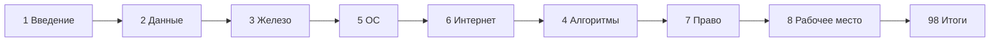

---
tags:
  - inprogress

title: Базовая информатика — о разделе
description: >-
  Учебный маршрут по школьной и начальной информатике — кодирование, железо, ОС,
  интернет, алгоритмы, право и рабочее место — со ссылками на подробные главы
  энциклопедии.
sidebar_label: Базовая информатика — о разделе
related:
  - title: Дорожная карта изучения
    doc: encyclopedia/1-basics/1-03-dorozhnaya-karta-izucheniya/1
  - title: Как работает компьютер
    doc: encyclopedia/1-basics/1-08-kak-rabotaet-kompyuter/intro
  - title: Данные и информация
    doc: encyclopedia/1-basics/1-09-dannye-i-informatsiya/intro
  - title: Программа
    doc: encyclopedia/1-basics/1-19-programma/intro
---

import DocCardList from '@theme/DocCardList';
import InteractiveRoadmap from '@site/src/components/InteractiveRoadmap';

# О разделе

  В РАЗРАБОТКЕ

Это **учебный курс "Базовая информатика"** — **маршрут** по темам энциклопедии — что читать, в каком порядке и где углублаться. Подробные статьи уже есть в энциклопедии ([компьютер](/encyclopedia/1-basics/1-08-kak-rabotaet-kompyuter/intro), [данные](/encyclopedia/1-basics/1-09-dannye-i-informatsiya/intro), [программы](/encyclopedia/1-basics/1-19-programma/intro), [сеть](/encyclopedia/2-system-network/2-03-set-i-internet/intro)); здесь они собраны в логику школьного и начального курса.

Этот раздел — академичный вход в базовый пласт цифровой грамотности. Главная цель — собрать в одной последовательности темы, которые обычно изучаются разрозненно — на уроках, в бытовой практике, в разных учебниках и в случайных видео.

На практике именно разрозненность чаще всего и ломает понимание — путают интернет и веб, ОЗУ и долговременное хранение, алгоритм и программу. Поэтому здесь важна связка между темами — она удерживает факты в единой картине.

Этот курс строится по инженерному принципу "от моделей к действиям" — сначала формируется картина, как устроена система (данные, железо, ОС, сеть), затем — как человек в ней действует безопасно, юридически корректно и продуктивно. Такой подход нужен и школьнику, и взрослому новичку, потому что одинаково полезен для повседневных задач и для дальнейшего профессионального роста в IT.

  
Как пользоваться

  Идите по главам <strong>1 → 8</strong> подряд или выборочно по таблице ниже. Глава <strong>9</strong> — справочник по средам (Godot, Flutter, BeautifulSoup и др.), её можно открывать по мере необходимости. Итоги и чек-лист — в конце ([98](/encyclopedia/1-basics/1-035-bazovaya-informatika/98), [99](/encyclopedia/1-basics/1-035-bazovaya-informatika/99)).

## Карта курса

| № | Тема учебника | Глава курса | Подробнее в энциклопедии |
|---|---------------|-------------|---------------------------|
| 1 | Введение, зачем этот блок | [1](/encyclopedia/1-basics/1-035-bazovaya-informatika/1) | [Дорожная карта](/encyclopedia/1-basics/1-03-dorozhnaya-karta-izucheniya/1) |
| 2 | Кодирование, сжатие, архивы | [2](/encyclopedia/1-basics/1-035-bazovaya-informatika/2) | [Данные и информация](/encyclopedia/1-basics/1-09-dannye-i-informatsiya/intro), [Архивы](/encyclopedia/1-basics/1-20-ispolnyaemye-fayly-i-arhivy/2) |
| 3 | Железо, периферия, сети | [3](/encyclopedia/1-basics/1-035-bazovaya-informatika/3) | [Как работает компьютер](/encyclopedia/1-basics/1-08-kak-rabotaet-kompyuter/intro) |
| 4 | Алгоритмы, языки, VB | [4](/encyclopedia/1-basics/1-035-bazovaya-informatika/4) | [Программа](/encyclopedia/1-basics/1-19-programma/intro), [Visual Basic](/encyclopedia/5-languages/5-16-starye-yazyki/visual-basic/intro) |
| 5 | ОС, файловые системы, утилиты | [5](/encyclopedia/1-basics/1-035-bazovaya-informatika/5) | [ОС](/encyclopedia/2-system-network/2-01-operatsionnaya-sistema/intro) |
| 6 | Интернет и сервисы | [6](/encyclopedia/1-basics/1-035-bazovaya-informatika/6) | [Сеть](/encyclopedia/2-system-network/2-03-set-i-internet/intro), [Поиск](/encyclopedia/1-basics/1-21-poisk-informatsii/intro), [Коммуникация](/encyclopedia/1-basics/1-22-kommunikatsiya-i-obschenie/intro) |
| 7 | Право и защита информации | [7](/encyclopedia/1-basics/1-035-bazovaya-informatika/7) | [Интеллектуальные права](/encyclopedia/7-project/7-07-intellektualnye-prava/intro) |
| 8 | Организация рабочего места | [8](/encyclopedia/1-basics/1-035-bazovaya-informatika/8) | [Эргономика клавиатуры](/encyclopedia/1-basics/1-08-kak-rabotaet-kompyuter/713) |
| 9 | Инструменты и среды (справочник) | [9](/encyclopedia/1-basics/1-035-bazovaya-informatika/9) | BeautifulSoup, Godot, Flutter, App Inventor и др. |

## Рекомендуемый порядок для новичка

Главу **4** (алгоритмы и программирование) можно пройти раньше, если вы уже на уроках пишете код — она не зависит от интернета. Главы **7** и **8** удобны в любой момент после [1](/encyclopedia/1-basics/1-035-bazovaya-informatika/1).

## Интерактивная карта маршрута

Если удобнее идти по "живому" дереву тем вместо таблицы, используйте карту —

<InteractiveRoadmap />

После просмотра выберите свой ближайший маршрут из 3 шагов — текущая глава -> следующая обязательная -> глава для углубления. Это поможет не потеряться в материале и сразу закрепить порядок прохождения.

<DocCardList />
---
