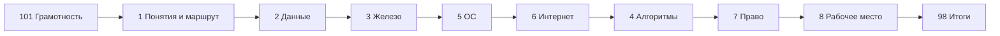

---
tags:
  - inprogress

title: Базовая информатика — о разделе
description: >-
  Учебный маршрут по школьной и начальной информатике — кодирование, железо, ОС,
  интернет, алгоритмы, право и рабочее место — со ссылками на подробные главы
  энциклопедии.
sidebar_label: Базовая информатика — о разделе
related:
  - title: "Дорожная карта изучения"
    doc: encyclopedia/1-basics/1-03-dorozhnaya-karta-izucheniya/1
  - title: "Как работает компьютер"
    doc: encyclopedia/1-basics/1-08-kak-rabotaet-kompyuter/intro
  - title: "Данные и информация"
    doc: encyclopedia/1-basics/1-09-dannye-i-informatsiya/intro
  - title: "Программа"
    doc: encyclopedia/1-basics/1-19-programma/intro
  - title: "Big-O — шпаргалка с примерами"
    doc: lab/examples/1128
  - title: "Алгоритмы на Python — ЕГЭ и олимпиадка"
    doc: lab/examples/1122
  - title: "Восприятие IT в обществе"
    doc: encyclopedia/1-basics/1-04-kak-vidyat-it-obychnye-lyudi/1
  - title: "Советы для новичка — о разделе"
    doc: encyclopedia/1-basics/1-12-sovety-dlya-novichka/intro
  - title: "Дорожная карта изучения — о разделе"
    doc: encyclopedia/1-basics/1-03-dorozhnaya-karta-izucheniya/intro
  - title: "Карьера в IT и мифы — о разделе"
    doc: encyclopedia/1-basics/1-26-karera-v-it-i-mify/intro
---

import ExternalPlayEmbed from '@site/src/components/ExternalPlayEmbed';

import DocCardList from '@theme/DocCardList';

# О разделе

  В РАЗРАБОТКЕ

**Учебный маршрут** по школьной и начальной информатике — что читать, в каком порядке и где углубляться. Подробные статьи уже есть в энциклопедии; здесь они собраны в одну последовательность.

| Частая путаница | Как различать | Где разобрать |
|-----------------|---------------|---------------|
| Интернет и веб | Интернет — инфраструктура; WWW — сервис страниц в браузере | [Интернет и сетевые сервисы](/encyclopedia/1-basics/1-035-bazovaya-informatika/6) |
| ОЗУ и накопитель | ОЗУ — работа "здесь и сейчас"; диск — хранение после выключения | [Компьютер, периферия и сетевое оборудование](/encyclopedia/1-basics/1-035-bazovaya-informatika/3) |
| Алгоритм и программа | Алгоритм — план; программа — запись плана для машины | [Алгоритмы, языки и программирование](/encyclopedia/1-basics/1-035-bazovaya-informatika/4) |
| Файл и процесс | Файл на диске; процесс — исполнение программы в памяти | [Программа](/encyclopedia/1-basics/1-19-programma/1#programma-protsess-potok) |

  
Как пользоваться

  

  Совсем с нуля — начните с [Основы компьютерной грамотности](/encyclopedia/1-basics/1-035-bazovaya-informatika/101) (компьютерная грамотность); незнакомые слова — в [Терминология новичка](/encyclopedia/1-basics/1-035-bazovaya-informatika/102) (терминология новичка). Затем идите по главам **1 → 8** подряд или выборочно по таблице ниже. После [Компьютер, периферия и сетевое оборудование](/encyclopedia/1-basics/1-035-bazovaya-informatika/3) удобно углубиться в [Память и вычисления](/encyclopedia/1-basics/1-035-bazovaya-informatika/11) — память и вычисления. Глава **9** — справочник по средам (Godot, Flutter, BeautifulSoup и др.), её можно открывать по мере необходимости.

  Итоги и чек-лист — в конце ([Базовая информатика — итоги](/encyclopedia/1-basics/1-035-bazovaya-informatika/98), [Базовая информатика — чек-лист](/encyclopedia/1-basics/1-035-bazovaya-informatika/99)).

  

---

## Карта курса

| № | Тема | Глава курса | Подробнее в энциклопедии |
|---|---------------|-------------|---------------------------|
| 101 | Компьютерная грамотность с нуля | [Основы компьютерной грамотности](/encyclopedia/1-basics/1-035-bazovaya-informatika/101) | [Как работает компьютер](/encyclopedia/1-basics/1-08-kak-rabotaet-kompyuter/intro), [Советы для новичка](/encyclopedia/1-basics/1-12-sovety-dlya-novichka/intro) |
| 102 | Терминология новичка | [Терминология новичка](/encyclopedia/1-basics/1-035-bazovaya-informatika/102) | [Глоссарий](/glossary/intro), [Сленг](/encyclopedia/1-basics/1-06-sleng/intro) |
| 1 | Ключевые понятия и маршрут | [Базовая информатика — ключевые понятия и маршрут](/encyclopedia/1-basics/1-035-bazovaya-informatika/1) | [Дорожная карта](/encyclopedia/1-basics/1-03-dorozhnaya-karta-izucheniya/1) |
| 2 | Кодирование, сжатие, архивы, обзор БД | [Кодирование, сжатие и архивация](/encyclopedia/1-basics/1-035-bazovaya-informatika/2) | [Данные и информация](/encyclopedia/1-basics/1-09-dannye-i-informatsiya/intro), [Архивы](/encyclopedia/1-basics/1-20-ispolnyaemye-fayly-i-arhivy/2), [типы баз данных](/encyclopedia/3-data-markup/3-05-osnovy-baz-dannyh/1#chetyre-osnovnyh-tipa-baz-dannyh) |
| 3 | Железо, периферия, сети (компьютер, ЭВМ, устройства) | [Компьютер, периферия и сетевое оборудование](/encyclopedia/1-basics/1-035-bazovaya-informatika/3) | [Как работает компьютер](/encyclopedia/1-basics/1-08-kak-rabotaet-kompyuter/intro), [Аппаратное обеспечение](/encyclopedia/2-system-network/2-10-zhelezo/1) |
| 4 | Алгоритмы, языки, программирование | [Алгоритмы, языки и программирование](/encyclopedia/1-basics/1-035-bazovaya-informatika/4) | [Программа](/encyclopedia/1-basics/1-19-programma/intro), [Код и разработка](/encyclopedia/4-code-dev/code-dev), [Ассемблер](/encyclopedia/5-languages/5-16-starye-yazyki/assembler/intro), [Visual Basic](/encyclopedia/5-languages/5-16-starye-yazyki/visual-basic/intro) |
| 5 | ОС, файловые системы, утилиты | [ОС, файловые системы и служебные программы](/encyclopedia/1-basics/1-035-bazovaya-informatika/5) | [ОС](/encyclopedia/2-system-network/2-01-operatsionnaya-sistema/intro), [модели развёртывания](/encyclopedia/1-basics/1-13-soft-prodvinutogo-polzovatelya/8#chetiryre-modeli-razvertyvaniya) |
| 6 | Интернет и сервисы | [Интернет и сетевые сервисы](/encyclopedia/1-basics/1-035-bazovaya-informatika/6) | [Сеть](/encyclopedia/2-system-network/2-03-set-i-internet/intro), [Поиск](/encyclopedia/1-basics/1-21-poisk-informatsii/intro), [Коммуникация](/encyclopedia/1-basics/1-22-kommunikatsiya-i-obschenie/intro) |
| 7 | Право и защита информации | [Право и защита информации в РФ](/encyclopedia/1-basics/1-035-bazovaya-informatika/7) | [Интеллектуальные права](/encyclopedia/7-project/7-07-intellektualnye-prava/intro) |
| 8 | Организация рабочего места | [Организация рабочего места](/encyclopedia/1-basics/1-035-bazovaya-informatika/8) | [Эргономика клавиатуры](/encyclopedia/1-basics/1-08-kak-rabotaet-kompyuter/713) |
| 9 | Инструменты и среды (справочник) | [Инструменты и среды разработки](/encyclopedia/1-basics/1-035-bazovaya-informatika/9) | BeautifulSoup, Godot, Flutter, App Inventor и др. |
| 11 | Память и вычисления | [Память и вычисления](/encyclopedia/1-basics/1-035-bazovaya-informatika/11) | [Память и накопители](/encyclopedia/1-basics/1-08-kak-rabotaet-kompyuter/12), [Аппаратное обеспечение](/encyclopedia/2-system-network/2-10-zhelezo/intro) |

---

## Рекомендуемый порядок для новичка

Главу **4** (алгоритмы и программирование) можно пройти раньше, если вы уже на уроках пишете код — она не зависит от интернета. После теории удобно разобрать **сложность алгоритмов на примерах** — [Big-O — шпаргалка](/lab/Примеры/1128), затем задачи на **Python** — [Алгоритмы на Python — ЕГЭ и олимпиадка](/lab/Примеры/1122), на **Java** — [консольные задачи](/lab/Примеры/1131); для лабораторной с окном — [Swing — окна и кнопки](/lab/Примеры/1143), на **Pascal** (школа, PascalABC, Lazarus) — [типовые программы](/lab/Примеры/1140), в **Кумир** (ОГЭ, Чертёжник, Робот) — [Lab / 1115](/lab/Примеры/1115) и [глава Кумир](/encyclopedia/9-spinoff/9-11-dlya-detey/5-kod/11). Главы **7** и **8** удобны в любой момент после [Базовая информатика — ключевые понятия и маршрут](/encyclopedia/1-basics/1-035-bazovaya-informatika/1).

---

## Интерактивная карта маршрута

Если удобнее идти по "живому" дереву тем вместо таблицы, используйте карту —

<ExternalPlayEmbed example="about/interactive-roadmap" title="Interactive Roadmap" minHeight={520} />

После просмотра выберите свой ближайший маршрут из 3 шагов — текущая глава -> следующая обязательная -> глава для углубления. Это поможет не потеряться в материале и сразу закрепить порядок прохождения.

<DocCardList />

{/* sidebar-collections */}

---

## В подборках

Статья входит в [тематические подборки](/about/collections) и блок "С чего начать?" на [главной](/). Соседние шаги того же маршрута:

**Компьютерная грамотность** — [Основы компьютерной грамотности](/encyclopedia/1-basics/1-035-bazovaya-informatika/101), [Как работает компьютер — о разделе](/encyclopedia/1-basics/1-08-kak-rabotaet-kompyuter/intro), [Программа — о разделе](/encyclopedia/1-basics/1-19-programma/intro), [Операционная система — о разделе](/encyclopedia/2-system-network/2-01-operatsionnaya-sistema/intro), [Советы для новичка — о разделе](/encyclopedia/1-basics/1-12-sovety-dlya-novichka/intro), [Основы информационной безопасности — о разделе](/encyclopedia/2-system-network/2-08-osnovy-informatsionnoy-bezopasnosti/intro).

**Старт в IT** — [Основы компьютерной грамотности](/encyclopedia/1-basics/1-035-bazovaya-informatika/101), [Восприятие IT в обществе](/encyclopedia/1-basics/1-04-kak-vidyat-it-obychnye-lyudi/1), [Советы для новичка — о разделе](/encyclopedia/1-basics/1-12-sovety-dlya-novichka/intro), [Дорожная карта изучения — о разделе](/encyclopedia/1-basics/1-03-dorozhnaya-karta-izucheniya/intro), [Карьера в IT и мифы — о разделе](/encyclopedia/1-basics/1-26-karera-v-it-i-mify/intro), [Обзор структуры Вселенной IT — о разделе](/encyclopedia/1-basics/1-02-vvedenie/intro), [Фронтенд и бэкенд — о разделе](/encyclopedia/1-basics/1-23-frontend-i-bekend/intro).

{/* /sidebar-collections */}

---
