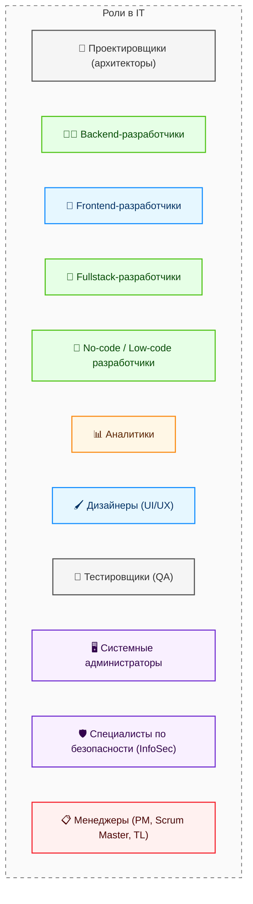

---
tags:
  - all
  - required
  - beginner
title: Восприятие IT в обществе
description: Восприятие сферы информационными технологиями широкой публикой и стереотипы.
related:
  - title: "Английский язык в IT — о разделе"
    doc: encyclopedia/1-basics/1-30-angliyskiy-yazyk/intro
  - title: "Предупреждения при изучении — о разделе"
    doc: encyclopedia/1-basics/1-05-preduprezhdenie/intro
  - title: "Настройка Windows"
    doc: encyclopedia/1-basics/1-12-sovety-dlya-novichka/11
  - title: "Родительский контроль"
    doc: encyclopedia/1-basics/1-12-sovety-dlya-novichka/111
  - title: "Дорожная карта изучения — о разделе"
    doc: encyclopedia/1-basics/1-03-dorozhnaya-karta-izucheniya/intro
  - title: "Базовая информатика — о разделе"
    doc: encyclopedia/1-basics/1-035-bazovaya-informatika/intro
  - title: "Обзор структуры Вселенной IT — о разделе"
    doc: encyclopedia/1-basics/1-02-vvedenie/intro
  - title: "Советы для новичка — о разделе"
    doc: encyclopedia/1-basics/1-12-sovety-dlya-novichka/intro
---

import ExternalPlayEmbed from '@site/src/components/ExternalPlayEmbed';


# Восприятие IT в обществе

<div class="article-tags">
  <span class="tag tag-required">ОБЯЗАТЕЛЬНО</span>
  <span class="tag tag-beginner">ДЛЯ НОВИЧКОВ</span>
</div>

<span class="complexity-badge">Всем</span>

Приветствую!

Здесь мы поговорим о том:
- что такое айти;
- что такое IT-сфера;
- что такое информационные технологии;
- кто такой айтишник;
- чем отличается айтишник от программиста;
- какие бывают виды айтишников;
- обязательно ли быть программистом в IT-сфере.

Давайте начнём с интерактива, и немного поиграем в карте ролей.

Нажмите "Запустить демо" и попробуйте распределить роли по задачам:

<ExternalPlayEmbed example="basics/it-roles-map-play" title="Карта IT-ролей" />

Ну, сначала сразу дам ответ - нет, не обязательно быть программистом, знать языки программировать и в принципе писать код. Это как для работы в медицине не обязательно ампутировать конечности, а в строительстве не обязательно быть крановщиком. Существует множество профессий, направлений и задач.

Вокруг IT часто звучит одно и то же — "ты программист?" На деле в отрасли работают аналитики, дизайнеры, тестировщики, администраторы, технические писатели и менеджеры — и многие из них **не пишут код каждый день**. Ниже — карта ролей без давления "сразу выбрать профессию на всю жизнь".

<div class="callout callout--info">
  <div class="callout-title">Почему в обществе возникает путаница</div>

  <div class="callout-body">
  В публичном поле часто смешивают разные рынки труда в один общий вывод про "работу в IT". Из-за этого появляются противоречивые ощущения.
  <ul>
    <li>В одних сегментах кадровый голод.</li>
    <li>В других сегментах сотни откликов на одну офисную позицию.</li>
  </ul>
  <br /><br />
  Корректнее смотреть на конкретную связку <strong>роль + отрасль + регион + формат работы</strong>.
</div>
  </div>

<div class="callout callout--info">
  <div class="callout-title">Как из идеи получается продукт (очень кратко)</div>

  <div class="callout-body">
  Типичный путь заказной или продуктовой разработки: **планирование** → **требования** → **проектирование** → **код** → **тесты** → **внедрение** → **эксплуатация и сопровождение**.

  В Agile фазы идут короткими циклами и перекрываются, но набор тот же.

  Подробно — в разделе [Жизненный цикл ПО](/encyclopedia/7-project/7-03-metodologiya-i-zhiznennyy-tsikl-po/1); про синтаксис и алгоритмы — в томе [Код и разработка](/encyclopedia/4-code-dev/code-dev).
</div>
  </div>

---

## Что такое информационные технологии?

> **Информационные технологии (ИТ)** — это совокупность методов, производственных процессов и программно-технических средств, интегрированных для сбора, хранения, обработки, передачи, распространения и использования информации с целью решения задач в различных сферах деятельности.

IT, или Information Technology (как раз и произносится "айти") является областью деятельности общества, связанной с с созданием, обработкой, хранением, защитой и передачей информации с помощью компьютеров, программного обеспечения и сетевых технологий. Поэтому всё, что заставляет работать цифровой мир - сайты, сервера, компьютеры, планшеты, смартфоны, смарт-ТВ, игровые приставки и всё что на них работает - это и есть IT в широком смысле.

---

### Что означает "вкатиться в IT"?

Обычно так называют быстрый старт в этой сфере, смена профессии на одну из тех, которые связаны с информационными технологиями. К примеру, человек работал в сфере продаж, но ему понравилось заниматься тестированием программного обеспечения, и вот он теперь QA-инженер.

Часто подразумевается, что человек получает знания самостоятельно, через онлайн-курсы или интенсивы, а высшее или среднее профессиональное образование лишь предоставляет ему формальное подкрепление квалификации.

Для быстрого перехода проще всего начать с разработки.

<div class="callout callout--tip">
  <div class="callout-title">Запомните</div>
  Ваша задача - изучить, понять и научиться, а не просто закрыть вопросы на собеседовании! Вы - не "вкатун", и не обманщик. Вы - хороший, подготовленный специалист, который разбирается в предмете, знает, как всё устроено. Потому что в вашем распоряжение действительно полный материал, позволяющий стать профессионалом.
</div>

---

### Информатика и IT это одно и то же?

Вообще, нет. Та самая информатика, которой обучают в школе, это скорее знакомство с общей наукой.

К сожалению, школьные программы ограничены стандартами и программами обучения, что тормозит прогресс. Новые технологии появляются быстро и так же быстро устаревают - пока государство подготовит, согласует и внедрит новые темы, они уже будут неактуальными. 

Поэтому в школе на информатике учат базе:
- алгоритмам, логике, математике;
- теории информации и данных;
- основам ЭВМ;
- умению работать с компьютером.

Информатику ещё называют Computer Science, наука о компьютерах. Она очень смежная с математикой, больше нужна учёным и инженерам.

Информационные технологии же - это именно сфера, в которой работают и развиваются люди.

Если проще, то:
- информатика - это наука и теория;
- информационные технологии - это практика и бизнес.

---

## Айти – это не только программисты

### Айтишники

<div class="callout callout--tip">
  <div class="callout-title">Важно</div>

  <div class="callout-body">
  Эта статья рассчитана на то, что вы вкратце познакомитесь с основными направлениями специальностей в отрасли. Возможно, вы не кодер, но отличный аналитик, или тестировщик. А, может быть, дизайнер? Кто знает? Пока не попробуете — будем изучать всё.
</div>
  </div>

**Айтишник** — специалист в сфере информационных технологий ("IT-шник"). Эта роль охватывает множество профессий, включая проектировщиков, разработчиков, аналитиков, дизайнеров, тестировщиков, администраторов, специалистов по безопасности и менеджеров.

Бытует мнение, что "айтишник" = кодер. Но это не так. В этой области обитает множество специалистов. Так же как у юристов, строителей, врачей или экономистов, в IT есть направления. Говоря "врач", мы редко уточняем, что человек оториноларинголог или анестезиолог. Людям, не знакомым со сферой, сложно объяснять, кто такой DevOps, поэтому для всех мы так и остаёмся "программистами". Давайте же разберём, кто прячется под этим ярлыком.

---

### Виды айтишников



---

### Проектировщики

**Проектировщики** – архитекторы, которые готовят схему, структуру и набор технологий, и готовят каркас для работы. Зачастую это самые сильные специалисты, которые способны видеть шире других, они создают фундамент, на котором строится весь проект. Их принцип работы очень похож со строительством и архитектурой зданий, ведь нужно решить, сколько будет этажей, где будут окна и как будут проложены коммуникации. Архитекторы выбирают технологии, которые будут использоваться в проекте, продумывают структуру системы и решают, как разные части программы будут взаимодействовать друг с другом. Без них проект будет хаотичным, неповоротливым и даже может провалиться.

Проектировщик — специалист, отвечающий за архитектурное и техническое видение программной системы. Проектировщик определяет состав компонентов системы, их взаимодействие, выбор технологического стека и стратегию масштабирования. Его работа начинается до написания первой строки кода и продолжается на протяжении всего жизненного цикла проекта. Архитектурные решения влияют на производительность, безопасность, стоимость поддержки и скорость дальнейшей разработки.

Проектировщиками и архитекторами программного обеспечения нельзя стать без глубоких знаний и хорошего опыта. Вы сами поймёте, когда приступите к крупным решениям, и столкнётесь с тем, что... не знаете решения. Как раз эта профессия должна выручать, направлять и определять. Поэтому сюда относятся лучшие специалисты с уровнем Senior и выше.

---

### Разработчики

**Разработчики** создают программы — сайты, приложения, сервисы. Часть пишет код, часть собирает решения на low-code/no-code платформах — это тоже разработка, просто другой инструмент.

| Слой | Кто делает | Что видит пользователь |
|------|------------|-------------------------|
| **Frontend** | Frontend-разработчик | Кнопки, формы, анимации |
| **Backend** | Backend-разработчик | Результат после действия: оплата, письмо, ошибка |
| **Fullstack** | Один специалист или маленькая команда | Оба слоя |
| **No-code / low-code** | Сборка из блоков | Готовый сценарий без классического кода |

**Разбор: кнопка "Оплатить"**

Frontend — экран и отклик интерфейса. Backend — проверка корзины, платёж и запись в базу.

```http
POST /api/orders/42/pay
Content-Type: application/json

{ "cardToken": "…", "amount": 1990 }
```

```json
{ "status": "paid", "receiptId": "R-2026-00142" }
```

	- **Backend-разработчики** — API, базы данных, интеграции, безопасность транзакций.

	- **Frontend-разработчики** — интерфейс в браузере или приложении — вёрстка, доступность, скорость отклика.

	- **Fullstack-разработчики** сочетают оба слоя.

	- **No-code/Low-code разработчики** собирают сценарии в конструкторах приложений.

Но разработчики пишут всё не с нуля, а руководствуются документацией, так же, как строители руководствуются проектной документацией. Если заказчик что-то просит, разработчикам сложно будет объяснить причины, почему это невозможно.

Разработка доступна на всех уровнях - от новичка-стажёра или самоучки до максимального знания стека. Разработчикам открыты все пути, и они могут стать в дальнейшем как менеджером, так и архитектором.

---

### Аналитики

**Аналитики** переводят язык бизнеса на язык команды разработки. Заказчик редко формулирует задачу в терминах таблиц и API — аналитик уточняет детали, согласует ограничения и пишет документацию, по которой можно оценить сроки и проверить результат.

Бизнес говорит: "Хочу видеть лучшие товары на главной". Аналитик фиксирует, например:

```text
На главной — блок "Хиты недели":
- топ-10 SKU по сумме продаж за 7 календарных дней;
- сортировка по убыванию выручки;
- обновление раз в сутки в 03:00 МСК.
```

Почему 10, а не 5? Почему 7 дней? Это согласованные компромиссы с заказчиком, а не "додумывание".

Бывают разные виды аналитиков:
- системные аналитики;
- бизнес-аналитики;
- аналитики данных.

Бизнес-аналитики и системные аналитики доступны с уровня Junior, а в перспективе - прокладывают путь к проектированию и архитектуре.

Бизнес-аналитики обычно работают на стороне заказчиков, их цель - определить нужды, потребности и сформировать требования, которые принесут ценные результаты. Они общаются на гибридном языке технических и бизнес-специалистов.

Системные аналитики разбираются в требованиях, представленных бизнес-аналитиками, и переводят с гибридного языка на технический, изучают возможные решения и направляют итоговое задание на разработку.

Аналитики данных связаны вообще с другим. Это изучение массивов данных, собранных с различных источников, с целью вытащить итоговую полезную информацию. К примеру, вкусы покупателей, тенденции развития и прогнозы на будущее. Здесь существует целый пласт профессий - Data Analyst, Data Scientist, ML-Engineer. Объединить их можно как охотников за "паттернами". Они строят модели машинного обучения, нейросети, обрабатывают большие объемы данных.

Некоторые разделяют Data Scientist от аналитика данных двумя простыми фразами:
- Data Scientist смотрит в будущее;
- Аналитик данных смотрит в прошлое.

---

### Инженеры данных

В интернет-магазине события сыпятся из сайта, приложения, платежей и складов. **Инженер данных** строит конвейеры (pipelines): забрать → очистить → сложить в хранилище для аналитиков.

```text
[Сайт] ──► [Очередь событий] ──► [Обработка] ──► [Хранилище] ──► [Отчёты / ML]
```

**Данные-инженеры** - это специалист, который проектирует, строит и поддерживает инфраструктуру для сбора, очистки, хранения и обработки больших объёмов данных. Он создаёт фундамент для других специалистов (аналитиков данных и ML-инженеров), обеспечивая бесперебойную поставку структурированных данных из разрозненных источников в единое хранилище.

Чаще всего здесь нужен Python или Scala/Java, и много глубоких познаний в Big Data, SQL, NoSQL.

Не путать с Data Scientist и Data Analyst. Инженер именно строит инфраструктуру и готовит данные. Это уже техническая роль, но не чистая разработка.

---

### Дизайнеры

**Дизайнеры** – оформители, которые делают так, чтобы программы были удобными и красивыми. Их работа начинается с создания макетов интерфейса, с решениями, где будут находиться кнопки, какого цвета будет текст, и как пользователь будет переходить между экранами. Разработчики могут быть технически одарёнными, но могут совсем не смыслить в дизайне, для чего и приглашаются специальные художники и дизайнеры.

Здесь можно начинать и с нуля, но требуется талант, аккуратность и тяга к визуальному порядку.

---

### Тестировщики

**Тестировщики** – ищут ошибки, воспроизводя поведение пользователя, чтобы всё работало именно так, как задумано. Их работа похожа на проверку автомобиля перед продажей - ведь никто не захочет купить машину, которая ломается через неделю. Аналогично и с программами - никто не будет использовать программу, которая зависает или работает неправильно. Тестировщики ищут ошибки до того, как продукт попадёт к пользователям, и если находят - сообщают об этом разработчикам, чтобы те исправляли.

Тестировщик — специалист, отвечающий за проверку корректности работы программного обеспечения в соответствии с заданными требованиями.

Тестировщик - отличная профессия для новичка. Порой она даже не требует знания технологий, и ограничена запуском процессов или ручной имитацией действий пользователя. Достаточно внимательности к деталям. В перспективе, можно перейти в разработку, аналитику или даже остаться как талантливый Senior тестировщик.

**Автоматизатор тестирования (QA automation)** описывает сценарий в коде; прогон повторяется при каждой сборке.

```python
def test_checkout_shows_success(page):
    page.goto("/cart")
    page.click("button[data-testid=pay]")
    assert page.locator(".order-success").is_visible()
```

На крупных продуктах автотесты экономят сотни часов; ручное тестирование нужно для новых фич и нестандартных сценариев.

---

### Сисадмины и безопасники

**Сисадмины и безопасники** – следят за тем, чтобы всё функционировало стабильно, бесперебойно, а данные были под защитой. Системные администраторы обеспечивают работу серверов, сетей, баз данных. Если сервер сломается, сайт или приложение перестанет работать, и не разработчикам его чинить - а если не решить проблему, будут серьёзные финансовые потери. Специалисты по безопасности же защищают данные от хакеров и других угроз, создавая системы защиты, проверяя уязвимости и обучая сотрудников основам работы с данными. Если кто-то пытается украсть данные, безопасники предотвращают атаку.

Современная сфера информационных технологий добавила также ещё такие профессии, как DevOps-инженер, связывающий разработку и эксплуатацию, поэтому можно разделить такой сектор профессий по зонам:

1. Зона разработки - специалисты, которые обеспечивают:
- безопасность среды разработки;
- безопасность среды тестирования;
- обеспечение инструментами и технологиями.

2. Зона эксплуатации - специалисты, которые обеспечивают:
- безопасность в промышленном (боевом) режиме в реальных условиях;
- обеспечение инструментами и технологиями в продакшене.

3. Промежуточная зона - связь разработки и эксплуатации, где обеспечивается:
- автоматизация процесса разработки;
- автоматизация процесса доставки обновлений;
- автоматизация процесса настройки.

Именно благодаря DevOps-инженерам новые версии приложений выходят каждый день, а не раз в полгода. Потому что серверы настраиваются парой команд, а не вручную. Автоматизируется всё - сборка, тестирование, развёртывание, мониторинг. Программист нажимает на кнопку - и через 10 минут код уже работает на сотнях серверов.

Данный пласт профессий может развиваться независимо от разработки, аналитики, тестирования или архитектуры. Порой можно начать с системного администрирования.

---

### Системный интегратор

**Системный интегратор** — компания или команда, которая **собирает** решение из частей разных поставщиков — лицензии, коробочное ПО, своя доработка, внедрение на площадке заказчика, координация тестов и сопровождения. Типичный сценарий: банк заказывает платформу у вендора, а **интегратор** адаптирует её под регламенты банка и вводит в эксплуатацию ([пример цепочки](/encyclopedia/7-project/7-02-komanda-i-upravlenie/1)). Это отдельная роль от "просто написать код" — ближе к проекту целиком и к [госсектору с ГОСТ](/encyclopedia/1-basics/1-29-gosudarstvo-i-biznes/2).

<div class="callout callout--tip">
  <div class="callout-title">Честно для новичков</div>

  <div class="callout-body">
  Не пытайтесь стать DevOps или Data Scientist без опыта. Это роли для тех, кто уже год-два поработал разработчиком или аналитиком. Но знать, что они существуют — полезно: вдруг это ваша конечная цель?
</div>
  </div>

---

### Менеджеры

**Менеджеры** – организаторы и управленцы, которые следят и дирижируют этим оркестром специалистов. Они координируют работу, следят за сроками, ставят задачи аналитикам, решают конфликты в команде, помогают распределить нагрузку в команде и поддерживают общий прогресс проекта. Без менеджеров проект может застрять на одном месте, ибо никто не будет следить за тем, чтобы всё было сделано в срок и в рамках бюджета.

Где-то роли могут объединяться и комбинироваться, к примеру, проектировщи-сисадмин, или аналитик-тестировщик, а где-то и вовсе может быть один за всех. Но серьёзные проекты требуют большого количества участников, вследствие чего формируется команда менеджеров (заказчиков) и техническая команда (исполнителей). Каждый участник команды важен, ибо это командная работа, где все вносят свой вклад в общий успех.

Иерархия бывает линейная, функциональная, матричная и проектная, но если коротко, то всегда есть кто-то "сверху":

<ExternalPlayEmbed example="basics/org-hierarchy-play" title="Org Hierarchy" />

---

### Технические писатели

Технические писатели – переводчики с технического на человеческий. Разработчики пишут код, архитекторы создают схемы, но обычный пользователь (или даже новый сотрудник) ничего в этом не поймёт. Технический писатель берёт сложную техническую документацию, API-справочники, инструкции по установке и перерабатывает их в понятные тексты, руководства, статьи базы знаний.

Такой специалист выстраивает структуру, добавляет примеры, рисует поясняющие скриншоты и схемы. Хорошая документация снимает типовые вопросы поддержки вроде "куда нажать, чтобы выгрузить отчёт?".

Могут писать документацию:
- для пользователей (базы знаний, руководства и инструкции);
- формальную документацию (отчетные, эксплуатационные, обязательные и ГОСТ документы);
- юридические документы (договора, соглашения, регламенты, правила, акты, протоколы);
- технические документы (описания программ, устройств, комментарии и README к коду).

Часто работа здесь проектная и временная (написал документацию и свободен). Для начала работы достаточно умения писать понятные тексты и базового понимания технологий (хотя бы знать разницу между базой данных и сервером). Часто приходят филологи, журналисты или бывшие разработчики, которые устали от кода.

{/* sidebar-collections */}

---

## В подборках

Статья входит в [тематические подборки](/about/collections) и блок "С чего начать?" на [главной](/). Соседние шаги того же маршрута:

**Старт в IT** — [Дорожная карта изучения — о разделе](/encyclopedia/1-basics/1-03-dorozhnaya-karta-izucheniya/intro), [Базовая информатика — о разделе](/encyclopedia/1-basics/1-035-bazovaya-informatika/intro), [Обзор структуры Вселенной IT — о разделе](/encyclopedia/1-basics/1-02-vvedenie/intro), [Советы для новичка — о разделе](/encyclopedia/1-basics/1-12-sovety-dlya-novichka/intro), [Знакомство с Вселенной IT — о разделе](/encyclopedia/1-basics/1-01-davayte-poznakomimsya/intro), [Карьера в IT и мифы — о разделе](/encyclopedia/1-basics/1-26-karera-v-it-i-mify/intro).

**Цифровая грамотность** — [Английский язык в IT — о разделе](/encyclopedia/1-basics/1-30-angliyskiy-yazyk/intro), [Предупреждения при изучении — о разделе](/encyclopedia/1-basics/1-05-preduprezhdenie/intro), [Настройка Windows](/encyclopedia/1-basics/1-12-sovety-dlya-novichka/11), [Родительский контроль](/encyclopedia/1-basics/1-12-sovety-dlya-novichka/111), [Поисковые системы](/encyclopedia/1-basics/1-21-poisk-informatsii/1), [Эффективный поиск в интернете](/encyclopedia/1-basics/1-21-poisk-informatsii/3).

{/* /sidebar-collections */}

---
