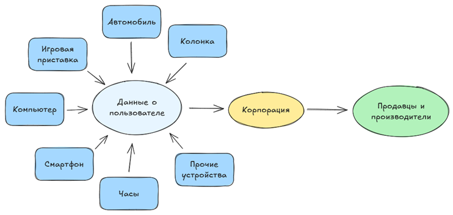

# Классификация технологий в IT

  ОБЯЗАТЕЛЬНО
  ДЛЯ НОВИЧКОВ

Всем

## Какие бывают технологии?

### Краткий обзор

  
Важно

  Кто-то программировал, кто-то играл, кто-то сидел в TikTok, а кто-то вовсе вышел из пещеры. У каждого свой путь и свой уровень понимания. Данная статья рассчитана на знакомство с общими понятиями.

Технологий множество, и чтобы не запутаться в этой паутине разнообразия, можно распределить их по ключевым видам:

	- Программы и приложения – настольные, мобильные, сайты, сервисы – от калькулятора до ERP-систем (системы управления предприятием).
	- Базы данных – хранилища информации, клиентов, товаров, файлов.
	- Сети и интернет – технологии обмена данными и связи устройств.
	- Облака – онлайн-хранилища, не требующие наличия устройств у клиента.
	- Искусственный интеллект – ChatGPT, нейросети-генераторы.
	- Инфобез – информационная и кибербезопасность.
	- Стартапы – мелкие решения, компании или проекты, которые являются ядром прогресса, в отличие от крупных и богатых корпораций с медленным развитием.

  
Интересный момент

  Если общаться с нейросетями или стараться искать актуальность технологий в сети, можно столкнуться с мнением, что актуальными и перспективными технологиями будут ИИ, машинное обучение, блокчейн и VR (виртуальная реальность). Но это не совсем так. Большинство крупнейших систем построены на стабильности и в них вложены колоссальные средства с расчётом на многие годы вперёд. То, что называют «трендами», будет актуально именно как «тренд», им свойственно затухать со временем, поэтому им не следует отдавать всё своё внимание. Лучше начинать с укрепления базовых знаний технологий, иначе, после затухания «тренда» можно остаться ненужным специалистом. А стабильные фундаментальные технологии будут актуальными ещё долго. Но об этом мы ещё поговорим, поэтому вернёмся к основам.

---

### Аппаратное и программное обеспечение

**Программное обеспечение** — совокупность программ, управляющих работой компьютера или предоставляющих функциональность пользователю.

Программы делятся на:
- **Прикладное ПО** — приложения для решения конкретных задач: браузеры, офисные пакеты, мессенджеры, игры.
- **Системное ПО** — программы, обеспечивающие работу устройства: операционные системы, драйверы, утилиты.
- **Сервисное ПО** — облачные и веб-сервисы: почта, CRM, ERP, онлайн-банкинг.

Программы не являются физическими объектами. А вот аппараты как раз наоборот.

**Аппаратное обеспечение** — физические компоненты вычислительных систем: процессоры, память, диски, сетевые адаптеры, периферийные устройства.

Устройства могут быть:
- **Персональными** — компьютеры, ноутбуки, смартфоны.
- **Серверными** — мощные машины для хранения данных и запуска сервисов.
- **Встраиваемыми** — микроконтроллеры в бытовой технике, автомобилях, промышленном оборудовании.

---

### Сетевые технологии

В реальном мире без коммуникации между участниками и элементами никак, и все контакты объединяются в сети.

**Сетевые технологии** — средства передачи данных между устройствами через проводные и беспроводные каналы связи.

Основные элементы:
- **Интернет** — глобальная сеть, объединяющая миллиарды устройств.
- **Локальные сети (LAN)** — соединение устройств в пределах дома или офиса.
- **Протоколы** — правила обмена данными: HTTP, TCP/IP, DNS, MQTT.

---

### Базы данных

Вся информация, которая используется программами, должна структурироваться и где-то храниться. Для этого существуют базы данных.

**База данных** — организованное хранилище структурированной информации, управляемое специализированным программным обеспечением (СУБД).

Типы:
- **Реляционные** — данные хранятся в таблицах с чёткой структурой (PostgreSQL, MySQL).
- **Документные** — данные в формате JSON или XML (MongoDB).
- **Ключ-значение** — простые пары для высокой скорости доступа (Redis).

---

### Облачные технологии

Порой некоторые организации обладают более крупными возможностями и финансами, благодаря чему могут развернуть большие хранилища, и собственные платформы, на которых можно развернуть программы тех, кто такими ресурсами не обладает.

К примеру, я. У меня есть сайт, но чтобы он развернулся, мне нужен сервер. На моём личном компьютере я не смогу обеспечить доступность сервера 24/7, и необходимую пропускную способность, стабильность, безопасность. Для этого я обращусь к владельцу сервера.

**Облачные технологии** — предоставление вычислительных ресурсов (серверы, хранилища, ПО) через интернет по модели подписки или использования.

Модели:
- **IaaS** — инфраструктура как услуга (виртуальные машины, диски).
- **PaaS** — платформа как услуга (среда для разработки и развёртывания).
- **SaaS** — программное обеспечение как услуга (Google Workspace, Microsoft 365).

---

### Искусственный интеллект и машинное обучение

**Искусственный интеллект** — область информатики, направленная на создание систем, способных выполнять задачи, требующие интеллектуальных усилий.

Думаю, в этой части вам наверняка знакомы такие инструменты, как ChatGPT или DeepSeek.

Подразделы:
- **Машинное обучение** — алгоритмы, обучающиеся на данных.
- **Генеративные модели** — нейросети, создающие текст, изображения, музыку.
- **Компьютерное зрение и распознавание речи** — интерпретация сенсорных данных.

---

### Информационная безопасность

**Информационная безопасность** — защита данных и систем от несанкционированного доступа, утечек, повреждений.

Вирусы и антивирусы, с которыми сталкиваются почти все - как раз представители этой категории.

Направления:
- **Кибербезопасность** — защита сетей и сервисов.
- **Криптография** — шифрование данных.
- **Аудит и мониторинг** — выявление угроз и реагирование на инциденты.

---

### Интернет вещей (IoT)

**Интернет вещей** — сеть физических устройств, оснащённых датчиками, процессорами и модулями связи для обмена данными через интернет.

Примеры:
- Умные часы, термостаты, лампочки.
- Промышленные датчики контроля температуры или вибрации.
- Сельскохозяйственные системы автоматического полива.

Пользуетесь ли вы умными устройствами? Чайник, увлажнитель воздуха, лампочка, колонка? Сейчас уже все привыкли, но всё это тоже занимает особое место в мире технологий, и с этим тоже можно работать.

**Интернет вещей, IoT (Internet of Things)** - концепция, которая описывает сеть физических устройств («вещей»), подключенных к интернету и способных обмениваться данными между собой и внешними системами. Эти устройства могут быть чем угодно: от бытовой техники и носимых гаджетов до промышленного оборудования и датчиков.

Устройства (вещи) оснащены датчиками, процессорами и модулями связи. Это умные часы, лампы, термостаты, холодильники. Они собирают данные и передают через интернет на облачные сервера, где всё это анализируется и управляется, к примеру, системами умного дома. Это тоже важная технология современности, когда сенсоры, датчики, связь, протоколы, облачные технологии, искусственный интеллект, безопасность - всё работает в едином пространстве, обеспечивая простых пользователей комфортом, а производителей - повышением прибыли за счёт реализации новых устройств в экосистеме.

IoT связан с такими технологиями, как BigData - когда обрабатываются и анализируются большие объёмы данных, собранных устройствами. Такие наборы данных передаются заинтересованным, которые анализируют всё это, выявляют тенденции, наклонности, к примеру, что люди посещают определённые места именно вечером, что люди покупают именно определённые товары. Компании изучают всё, что есть, делают выводы и даже прогнозы. Для таких манипуляций существует целая профессия аналитика данных.

---

### Методологии и подходы к разработке

**Методологии разработки** — систематизированные подходы к созданию программного обеспечения.

Если проще, то это просто особые взгляды на порядок разработки, правила общения и поведения, принципы, методы, способы решения основных задач в проектах.

Примеры:
- **Agile** — итеративная разработка с акцентом на гибкость и обратную связь.
- **DevOps** — интеграция разработки и эксплуатации для ускорения выпуска обновлений.
- **Waterfall** — последовательная модель с чётким разделением этапов.

---

### Hard и Soft

В процессе работы с технологиями, можно столкнуться с такими понятиями, как «железо», «софт», «хард» и тому подобное. Они возникли не просто так. С английского, **«Hard»** – «твёрдый», «тяжелый», «сложный», и **«Soft»** - «мягкий». Отсюда и разделения различного рода, и в основном они исходят из двух: 
	- *Hardware* – аппаратное обеспечение, устройства, железо;
	- *Software* – программное обеспечение, софт.
	Сейчас разделение на «железо» и «софт» затрагивает и навыки в IT. Их тоже делят по аналогии:
	- *Hard-skills* – «жесткие», усваимые навыки и знания, умения, к примеру, знание языка SQL и умение работать с Docker;
	- *Soft-skills* – «мягкие» навыки, личные качества – к примеру, коммуникабельность, ответственность, пунктуальность.

И если касательно хард-скиллов, технологии связаны с теми, что мы указали выше – к примеру, программирование или знание устройств, то софт-скиллы используют определённые технологии, но в более широком смысле – инструменты, методы и подходы, помогающие развивать и применять мягкие навыки:

	- *коммуникационные технологии* (чаты, видеосвязь, CRM, ИИ-ассистенты);
	- *управление временем и продуктивностью* (тайм-менеджмент, методологии вроде Agile);
	- *эмоциональный интеллект и психология* (медитация, тональность переписки);
	- *коллаборация и командная работа*;
	- *публичные выступления и презентации* (ораторское мастерство, к примеру);
	- *управление конфликтами и переговорами*.

---

### Технологии и инновации

Словом, **«технология»** может быть не только *«жестким»* понятием, связанным с устройствами и программированием, но и *«мягким»*, связанным с развитием личности и улучшения работы команды. Для заказчика, которому нужен результат, очень важно, как именно развита команда в части «мягких» навыков. Если ещё в прошлом веке этот аспект игнорировался, то сейчас, ценой миллионов долларов провалов, подавляющее большинство уже поняли, что традиционное давление и требование не создаст уникальный продукт, поэтому добавили акцент в развитие «мягких» технологий.

**Если переходить с других сфер, то это сразу бросится в глаза** – если, к примеру, юристы или государственные служащие привыкли к императивной модели *«сделай к обеду, не сделаешь – уволю!»* и *«выяснить, кто виноват, и срочно наказать!»*, то в IT-сфере можно сильно удивиться, что порой акцент с поиска виновных смещается в решение проблемы общими силами. Это и есть результат контроля над софт-частью. Бизнесмены давно уже поняли, что, выяснив, кто виноват, и наказав – проблема не решится, а ошибки свойственны всем, и важно изначально построить среду для того, чтобы ошибки возникали как можно реже.

Говоря о бизнесе, на текущий момент, с развитием технологий, устройств и программного обеспечения, появилась необходимость выстраивать вокруг пользователя целую экосистему. Корпорации стали собирать информацию о своих пользователях, продавая собранные данные тем, кто заинтересован в анализе аудитории.

Поэтому **инновации** – это тоже важная часть сферы, которая остаётся актуальной всегда. Не всем нравится работать с приложениями на компьютере или смартфоне, многие в IT сфере выбирают именно программирование операционных систем и программ для других устройств, погружаясь в сложную инженерию и развивая инфраструктуру. Но обо всём этом мы поговорим позднее.

  
Главное

  Всегда может появиться что-то новое, выстрелить и стать актуальным. Изучайте всё.

Так, сейчас мы получили удобство, скорость, доступ к информации, потеряв приватность, автономию решений (ведь не вы решаете, что купить в маркетплейсах, а алгоритмы рекомендаций) и устойчивость бизнеса. Изучая различные технологии, не забывайте задумываться о контексте - некоторые вещи были созданы для контроля, а некоторые из жадности. Возможно, эти мысли помогут вам найти ответы на некоторые вопросы «А почему так?», которые будут возникать постоянно.

---