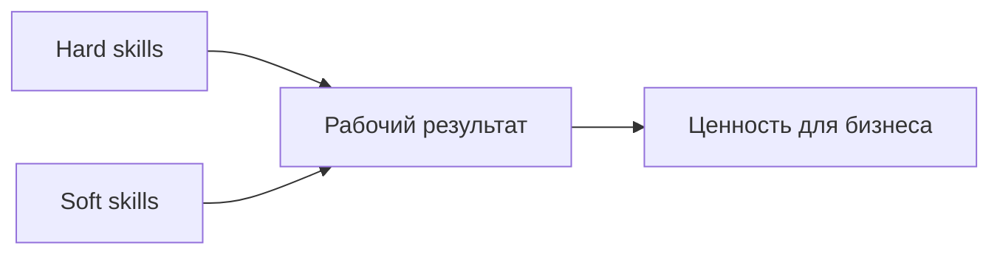

---
tags:
  - all
  - required
  - beginner
title: Секрет прост
description: >-
  Системное обучение в IT, разница между hard skills и soft skills с примерами
  по ролям и практический план для новичка.
---

# Секрет прост

  ОБЯЗАТЕЛЬНО
  ДЛЯ НОВИЧКОВ

Всем

Спрос на IT-специалистов остаётся, но **качество подготовки** стало главным фильтром. Работодатель отличает того, кто понимает основы и умеет доводить задачу до конца, от того, кто прошёл короткий курс без практики. Это похоже на юриспруденцию или медицину — диплом без навыка редко заменяет опыт, просто в IT цикл обновления технологий быстрее.

Главный "секрет", который повторяют опытные коллеги, звучит скучно и честно — **учиться регулярно**, **делать проекты**, **проверять себя на практике** и **не останавливаться после первого оффера**. Ниже — почему реклама "профессии за три месяца" разочаровывает, что такое hard skills и soft skills на человеческом языке, и с чего начать системно.

---

## Секрет прост

### Почему "быстрые курсы" разочаровывают

Реклама "профессия за три месяца" привлекает тех, кто ищет короткий путь. Реальное освоение — это последовательная работа над несколькими слоями сразу.

- **Теория** — как устроены данные, сети, процессы разработки, зачем нужны тесты и ревью.
- **Практика** — задачи, pet-проекты, разбор ошибок, повторение одних и тех же паттернов, пока они не станут привычкой.
- **Обратная связь** — ментор, code review, стажировка, ответы на вопросы в команде.

Курсы, где дают только набор шаблонов "скопируй и получи результат", слабо готовят к ситуации, когда условия задачи меняются. Отсюда ощущение "программистов слишком много" — на рынке много **одинаковых резюме**, а не много людей, которые умеют **объяснить решение** и **доработать продукт** под бизнес.

  
В чём секрет?

  

  Регулярно учиться, делать проекты, проверять себя на практике — и не останавливаться после первого оффера. Технологии меняются; привычка учиться остаётся.

  

---

### Мифы, которые мешают учиться спокойно

| Миф | Как обычно звучит | Что ближе к реальности |
|-----|-------------------|------------------------|
| "Достаточно одного курса" | Сертификат = работа | Работодатель смотрит на **задачи**, которые вы решали, и на **объяснение** решения |
| "Нужен идеальный английский" | Без C1 в IT нельзя | Для старта хватает чтения документации и базовых терминов; язык **докачивают** по мере роли |
| "Программист = всё IT" | Все в IT пишут код | Есть тестирование, аналитика, поддержка, дизайн, DevOps, техписьмо — см. [роли](/encyclopedia/1-basics/1-04-kak-vidyat-it-obychnye-lyudi/1) |
| "ИИ заменит всех" | Зачем учиться, если ChatGPT | ИИ ускоряет черновик; **ответственность**, ревью, безопасность и коммуникация остаются у людей |
| "В 40 лет поздно" | IT только для молодых | Меняют профессию и в 35, и в 45 — важнее **системность** и портфолио, чем возраст в паспорте |

Мифы отнимают энергию сильнее, чем сложная глава по Git. Имеет смысл записать свой страх в одно предложение и проверить его фактами — вакансии на hh.ru, чаты выпускников курсов, истории смены профессии в [карьере и мифах](/encyclopedia/1-basics/1-26-karera-v-it-i-mify/intro).

---

### Регулярное обучение — как это выглядит на практике

"Учиться регулярно" — это **не** сутки без сна перед собеседованием. Рабочая схема для новичка с основной работой или учёбой —

| Элемент | Минимум в неделю | Зачем |
|---------|------------------|--------|
| **Теория** | 2–3 коротких сессии по 30–45 мин | Закрепить одну тему из энциклопедии или официальной документации |
| **Практика** | 1 законченная микрозадача | Скрипт, страница, SQL-запрос, баг-репорт — с понятным "готово" |
| **Обратная связь** | 1 раз | Ревью в чате, вопрос ментору, разбор чужого PR |
| **Фиксация** | 5 минут в конце недели | Что понял, что осталось туманом, что открыть в [дорожной карте](/encyclopedia/1-basics/1-03-dorozhnaya-karta-izucheniya/1) |

Пропуск недели случается у всех. Важно **вернуться к ритму**, а не "догонять всё за выходные" — перегруз ведёт к выгоранию и бросанию.

---

### Hard skills и soft skills — что это за звери

В разговорах про IT часто слышат "хард", "софт", "софт-скиллы". Слова похожи, смысл разный — путаница нормальна.

| Слово в быту | О чём речь | Пример |
|--------------|------------|--------|
| **Hardware** | "Железо", устройства | Сервер, ноутбук, роутер |
| **Software** | Программы | ОС, браузер, CRM |
| **Hard skills** | Профессиональные, **проверяемые** умения | SQL, Git, настройка Linux |
| **Soft skills** | Навыки **работы с людьми и собой** | Обратная связь, договорённости, ясная письменная речь |

Про железо и программы подробнее — в материале ["Классификация технологий в IT"](/encyclopedia/1-basics/1-04-kak-vidyat-it-obychnye-lyudi/3#hard-и-soft). Здесь — про **навыки специалиста**, которые смотрят на собеседовании и в первые месяцы работы.

С английского *hard* — "твёрдый", "жёсткий", *soft* — "мягкий". Слова намекают на **способ проверки**: hard skills видны в задаче и тесте, soft skills — в работе в команде. Без софт-скиллов срываются сроки, ломается доверие, а сильный код может так и остаться в ветке, которую никто не сольёт.

---

### Hard skills — прикладные, измеримые умения

**Hard skills** (хард-скиллы, "жёсткие" навыки) — то, что можно **показать в деле** и часто **проверить за час–два** на тестовом задании или в техническом интервью.

К ним относятся.

- знание **языка программирования** или разметки (Python, JavaScript, SQL);
- работа с **инструментами** (Git, Docker, IDE, CI);
- **предметная** база роли (сети для админа, статистика для аналитика, OWASP Top 10 для начинающего в ИБ);
- умение **читать документацию**, логи, стек-трейсы;
- для части ролей — **математика и алгоритмы** (ML, высоконагруженные системы), для других достаточно логики и аккуратности.

**Как это выглядит в вакансии**

| Роль | Примеры hard skills |
|------|---------------------|
| Frontend | HTML/CSS, React, доступность, сборка (Vite/Webpack) |
| Backend | API, БД, кэш, основы безопасности (auth, валидация) |
| QA | тест-дизайн, автотесты, баг-репорты с шагами воспроизведения |
| DevOps / SRE | Linux, Kubernetes, мониторинг, IaC |
| Аналитик | SQL, визуализация, постановка метрик |
| Техписатель | структура документации, работа с API-справкой |

Hard skills **устаревают по частям** — фреймворк сменился, версия языка вышла. Поэтому важнее **научиться быстро входить в новый инструмент** по официальной документации и примерам, чем заучивать один стек "навсегда".

**Как качать hard skills**

1. Маленькие **законченные** задачи (скрипт, страница, отчёт) с понятным финалом.
2. **Повторение** — один и тот же стек на 2–3 проектах, пока не перестанете гуглить базовый синтаксис.
3. **Чужой код** — pull request в open source, разбор решений коллег на стажировке.
4. **Проверка** — тесты, линтеры, ревью; ошибка, которую поймали до продакшена, тоже опыт.

**Как проверить hard skills до собеседования**

| Уровень готовности | Признак |
|--------------------|---------|
| "Смотрел видео" | Повторяете за автором, без своего кода |
| "Делал по туториалу" | Есть проект, но сложно изменить условие задачи |
| "Могу объяснить" | Рассказываете решение без подсказок, знаете ограничения |
| "Могу починить" | Находите баг по логам/тестам и вносите правку |

Перед откликом на вакансию сравните строки в таблице с требованиями в объявлении. Если по половине пунктов только "смотрел видео" — честнее добрать 2–3 недели практики, чем массово рассылать резюме.

**Типичная ошибка** — путать **знание названия инструмента** с умением. "Знаю Docker" без опыта сборки образа и чтения лога контейнера на собеседовании быстро проверяется одним практическим вопросом.

---

### Soft skills — как вы работаете в команде и с заказчиком

**Soft skills** (софт-скиллы, "мягкие" навыки) — способ **договариваться**, **слушать**, **писать понятно**, **держать слово**, **разбирать конфликт без саботажа**. Их сложнее измерить баллом, но по ним часто решают, останется ли человек в команде после испытательного срока.

В IT софт-скиллы дополняют код: они помогают **довести результат hard skills до пользователя** — через ясные требования, ревью и работу с заказчиком.

| Ситуация | Soft skill | Что будет, если навык слабый |
|----------|------------|------------------------------|
| Code review | Конструктивная обратная связь | Обиды, споры "в лоб", правки без объяснений |
| Созвон с заказчиком | Уточняющие вопросы, перефразирование | Сделали "не то", переделка за свой счёт |
| Инцидент в проде | Спокойствие, факты, postmortem | Поиск виноватого вместо исправления процесса |
| Тикет в Jira | Ясная письменная речь | Разработчик три дня уточняет "что имели в виду" |
| Дедлайн | Честная оценка и эскалация риска | Молчали до последнего дня, сорвали релиз |

**Типичные soft skills в IT** (и зачем они нужны)

| Навык | Зачем в IT |
|-------|------------|
| **Обратная связь** | Ревью кода без личных нападок; рост джуна через конкретные комментарии |
| **Эмпатия** | Понять заказчика и пользователя: сценарий ("кассир не успевает пробить очередь"), затем симптом ("кнопка не работает") |
| **Управление конфликтом** | Спор об архитектуре по критериям — срок, риск, стоимость |
| **Письменная речь** | Тикеты, README, runbook, постмортем — половина работы асинхронная |
| **Тайм-менеджмент** | Оценка задач, приоритеты, "нет" лишним задачам в спринте |
| **Обучаемость** | Признать пробел и закрыть его — через вопросы, документацию, пару с ментором |
| **Ответственность** | Сказал "сделаю к пятнице" — сделал или заранее предупредил |

Софт-скиллы **тренируются** так же, как Git — через практику.

- писать **баг-репорты** с шагами воспроизведения;
- участвовать в **ретроспективах** с одной конкретной идеей улучшения;
- просить **ревью** и благодарить за замечания;
- вести **короткие статусы** в чате ("сделано / блокер / нужна помощь").

**Soft skills на собеседовании и на испытательном сроке**

Работодатель редко ставит отдельный "экзамен по эмпатии". Soft skills проявляются в поведении —

- **Собеседование** — отвечаете на "расскажите про конфликт / ошибку / дедлайн" конкретикой (ситуация → ваши действия → результат), без обвинений коллег.
- **Первые недели** — задаёте уточняющие вопросы по задаче, пишете статусы, признаёте "не успеваю" **до** дедлайна.
- **Ревью** — комментируете код по сути ("здесь риск N+1"), благодарите за замечания к своему PR.

Удобная схема ответа на поведенческий вопрос — **ситуация → действие → результат** (иногда её называют STAR). Пример — "На стажировке тикет был сформулирован размыто (ситуация). Я перечислил три уточняющих вопроса в комментарии и предложил созвон на 15 минут (действие). За день сделали нужную кнопку без переделки (результат)".

---

### Зачем нужны оба типа навыков

Условная картина для новичка.

- Сильный **hard** без **soft** — человек пишет сложный код, но команда боится задавать вопросы, документации нет, сроки горят.
- Сильный **soft** без **hard** — приятный собеседник, но на задаче нужен ментор на каждый шаг; бизнес платит за **решаемые** задачи.

На собеседовании часто проверяют **оба слоя** — тестовое или live-coding (hard) и короткий разговор про прошлый опыт, конфликт, ошибку (soft). На испытательном сроке смотрят то же самое в бою.

  
Про ИИ

  

  Нейросети ускоряют черновик кода, поиск по документации и шаблоны писем. Переговоры, ответственность за релиз, этика данных и доверие в команде остаются за людьми. Спокойный, предсказуемый коллега с средним стеком часто ценнее "звезды", которая тащит задачи в одиночку и ломает процессы.

  

---

### С чего начать системно

Ниже — план, который можно адаптировать под свою нагрузку. Цифры ориентировочные; главное — **одна ветка** и **законченные** микропроекты.

**Шаг 1. Выбрать ветку на 2–3 месяца**

| Ветка | С чего начать hard skills | Первый "законченный" артефакт |
|-------|---------------------------|-------------------------------|
| Тестирование | Тест-дизайн, DevTools, основы API | 5 баг-репортов с шагами и ожидаемым результатом |
| Frontend | HTML/CSS, затем один фреймворк | Страница с формой и адаптивом |
| Backend | Один язык, HTTP, SQL | API с 2–3 эндпоинтами и README |
| Аналитика | SQL, Excel/Sheets, визуализация | Отчёт с выводом "что решить бизнесу" |
| Техподдержка L1/L2 | ОС, сеть, тикеты | Runbook "как диагностировать типовую проблему" |

См. [рынок IT](/encyclopedia/1-basics/1-04-kak-vidyat-it-obychnye-lyudi/5) — кто покупает услуги и какие роли востребованы.

**Шаг 2. Мини-портфолио и журнал**

Ведите один файл (Notion, Google Doc, репозиторий `learning-log`) —

| Поле | Пример |
|------|--------|
| Дата | 2026-05-20 |
| Задача | Скрипт выгрузки CSV из API |
| Hard | Python, `requests`, pandas |
| Soft | Уточнил формат у "заказчика" (друг/ментор) |
| Итог | Ссылка на репозиторий или скрин |

К каждому пункту — **одна фраза "какую проблему решили"**. HR и тимлид читают именно это, а не список просмотренных курсов.

**Шаг 3. Параллельно — soft по мелочи**

- один **понятный** тикет или пост в неделю (даже учебный);
- один **разбор** чужого PR или статьи с вопросом "почему так сделано";
- одна заметка "что узнал / что непонятно".

**Шаг 4. Источники в правильном соотношении**

| Источник | Доля времени (ориентир) |
|----------|-------------------------|
| Официальная документация, спецификации | 30–40% |
| Практика (свой код, задачи) | 40–50% |
| Видео и "обзоры за 10 минут" | 10–20% |

Читать **чужой код** и документацию так же усердно, как туториалы — привычка, которая отличает устойчивого специалиста от "курсового" уровня.

**Примерный календарь на 12 недель (при 5–7 ч/нед)**

| Недели | Фокус hard | Фокус soft |
|--------|------------|------------|
| 1–2 | Среда: Git, терминал, одна глава энциклопедии по роли | Статусы в чате/дневнике |
| 3–4 | Первый микропроект до README | Один баг-репорт или описание задачи для "заказчика" |
| 5–6 | Углубление стека ветки | Ревью чужого кода или разбор PR |
| 7–8 | Второй проект сложнее первого | Созвон-разбор требований (можно с другом) |
| 9–10 | Подготовка к тестовому / pet для резюме | Ответы на 3 поведенческих вопроса вслух |
| 11–12 | Полировка портфолио, 2–3 отклика в неделю | Письмо сопроводительное без шаблонной воды |

Подробнее про мифы "все стали программистами" и реальные траектории входа — [Карьера в IT и мифы](/encyclopedia/1-basics/1-26-karera-v-it-i-mify/intro).

---

### Самопроверка после главы

Ответьте письменно (хотя бы в двух предложениях на пункт) —

1. Чем **hard skills** отличаются от **software** и **hardware** в бытовой речи?
2. Назовите **два** hard и **два** soft skill для выбранной вами ветки.
3. Что вы сделаете на следующей неделе, чтобы проверить hard skill **в деле**?
4. Какой soft skill вы тренируете первым и как измерите прогресс?

Если пункт 1 вызывает сомнение — вернитесь к [классификации технологий](/encyclopedia/1-basics/1-04-kak-vidyat-it-obychnye-lyudi/3#hard-и-soft).

---
