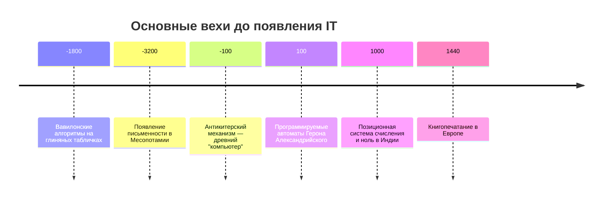
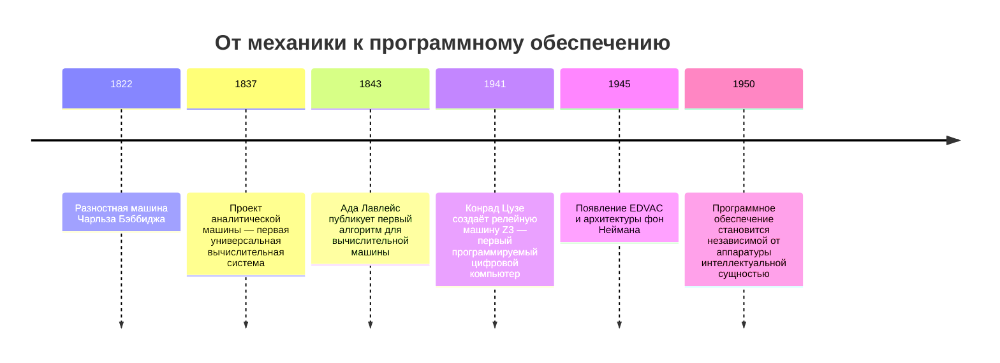
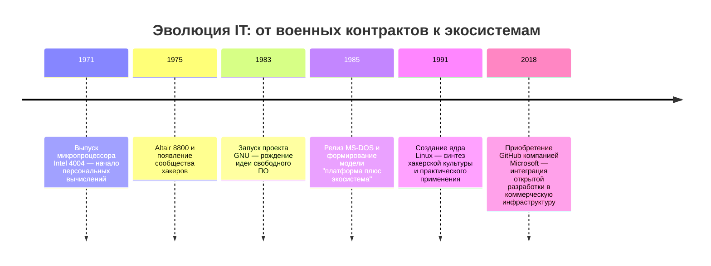
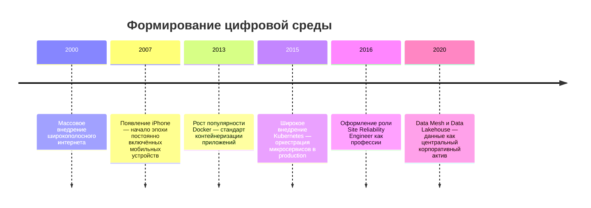
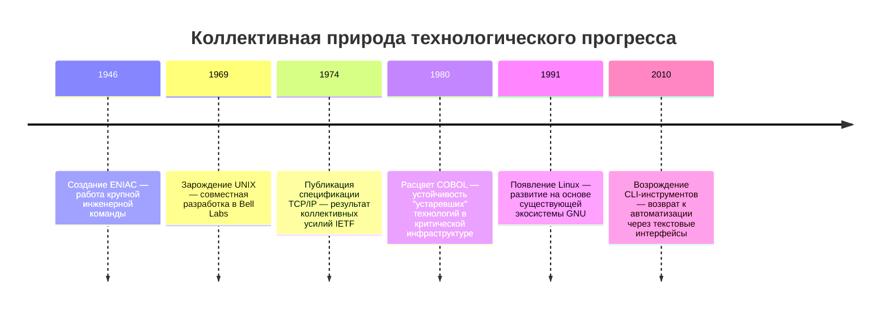

---
tags:
  - all
  - required
  - beginner
title: История информационных технологий
description: "IT особая отрасль, которая всё время развивается."
---

import TechHistoryPlay from '@site/src/components/TechHistoryPlay.jsx';

# История информационных технологий

  ОБЯЗАТЕЛЬНО
  ДЛЯ НОВИЧКОВ

Всем

<TechHistoryPlay topic="it-overview" />

## История?

IT особая отрасль, которая всё время развивается. Наверное, ни одна другая сфера не получила такого развития и не менялась так сильно - механика, химия или электротехника развивались постепенно, накапливая знания десятилетиями, тогда как IT демонстрирует нелинейную динамику, ведь каждое поколение представляет собой качественный скачок. Такое ускорение обусловлено принципиальной природой цифровых систем - их работа основана на абстрактных структурах, алгоритмах, данных и отношениях, а они не подвержены физическому износ, могут быть рекомбинированы почти без ограничений.

Современный разработчик, работающий с облачными платформами, контейнерами и генеративными моделями, зачастую не осознаёт, что большинство используемых им концепций — от архитектуры клиент-сервер до принципов версионного контроля — сформировались в конкретные исторические моменты, часто в ответ на острые практические вызовы, а не в результате теоретического созерцания. Без понимания этих условий возникновения теряется критическая способность различать то, что является принципиальным фундаментом, и то, что представляет собой временное решение, унаследованное из прошлого и сохраняющееся по инерции. Поэтому, чтобы понять, куда мы движемся сегодня, важно вспомнить, откуда пришли. 

Конечно, для тех, кто помнит докомпьютерную эпоху, это будет ностальгией; для молодых читателей — новой историей. Надеюсь, вы узнаете что-то интересное — независимо от того, застали вы эпоху до персональных компьютеров или нет.

Сто лет назад никто не мог представить, что компьютеры станут частью повседневной жизни, что интернет свяжет весь мир, а алгоритмы будут выбирать за нас фильмы, музыку и даже друзей. Многие прогнозы 1980-х годов оказались слишком оптимистичными - летающих машин так и не появилось у нас в гаражах, роботы не заменили людей, а искусственный интеллект работает на статистике, а не на сознании.

Это естественная эволюция. После Второй мировой войны научное сообщество переживало бум - учёные делились идеями, формулы рождали реальные изобретения, а исследования велись ради прогресса, а не прибыли. Почему? Сейчас мы живём с тягой к роскоши, и ставим себе цели получить что-то материальное. А это материальное было создано как раз благодаря прогрессу, и те, кто строил прогресс, жили совсем не богато. Программисты не писали код, попивая коктейли на пляже. Космические полёты, ядерная энергия, первые вычислительные машины - всё это стало возможным благодаря свободе исследований и колоссальному объединению усилий. Тогда университеты были настоящими лабораториями будущего, а не просто местами, где получают диплом. 

Исследование происходило в условиях жёстких ограничений: политических (холодная война, экспортные ограничения), экономических (стоимость памяти в 1960-х превышала стоимость золота), инженерных (предельная частота переключения транзисторов, тепловыделение) и социальных (господство иерархических структур в организациях, консерватизм при внедрении новых методов работы). Многие из этих ограничений сняты сегодня, но их отпечаток остаётся в архитектуре протоколов, в формате данных, в интерфейсах API.

Со временем этот темп немного замедлился. То, что раньше воспринималось как шаг в будущее, стало частью бизнеса, прогресс стал продуктом. Корпорации (которых раньше не было) предпочитают надёжность и масштабируемость новым, но непроверенным идеям, а общество же само поощряет потребление, а не творчество.

Тем не менее, изменения произошли глубокие и масштабные, но преимущественно в трёх областях:

- **Железо** - от огромных мейнфреймов до компактных устройств в карманах - произошла миниатюризация, удешевление и доступность;

- **Софт** - программы стали полноценными продуктами - масштабируемыми, автоматизированными, обновляемыми;

- **Методологии** - подходы к разработке, управлению и взаимодействию полностью изменились, что позволило создавать сложные системы быстрее и эффективнее.

Эти три составляющие сделали возможным то, что сегодня кажется обыденностью - мгновенная связь, цифровая экономика, онлайн-образование, облачные сервисы, да и умная бытовая техника. И если раньше крупнейшие компании мира были связаны с нефтью и металлургией, то теперь их место заняли компании, которые выросли из гаражей и университетских лабораторий. 

Сейчас университет нам кажется чем-то банальным, ведь почти у каждого есть высшее образование. Но раньше такие учреждения были именно двигателем прогресса, где поступавшие были энтузиастами-исследователями, причём они получали полноценные гранты и серьёзные стипендии, что позволяло им относительно полноценно существовать.

А сейчас учёные приравнялись к преподавателям, а преподаватели не так ценятся. Да и с точки зрения бизнеса и государства, вот представьте, много ли шансов сейчас у обычного учёного изобрести что-то кардинально новое? А давно ли вы видели настолько же революционных изобретений, созданных именно конкретными гениями, а не силами производственных маркетинговых машин корпораций?

Параллельно с технологиями всегда существовал и *нарратив прогресса* — то, как общество объясняет себе, зачем нужны новинки. Иногда презентация и ожидания опережают устойчивые изменения в инфраструктуре и практике. Отличать демонстрацию от реального сдвига — полезный навык и для истории IT, и для повседневной работы.

---

## Основание мышления

До появления электронных вычислительных машин понятие "информационные технологии" не существовало как самостоятельной дисциплины. Однако три базовых компонента, определяющие суть IT, были сформированы задолго до середины XX века: *алгоритмическое мышление*, *системы хранения и передачи информации*, и *механизмы автоматизации*.

Алгоритмическое мышление — способность формулировать последовательность действий, ведущих к решению задачи при чётко заданных правилах — возникло в древности. Вавилонские математики, оперировавшие с дробями и квадратными корнями за 1800 лет до нашей эры, фиксировали сами процедуры расчёта на глиняных табличках. Евклид в "Началах" (III век до н. э.) построил целую систему математики на основе аксиом и строгих логических выводов, что является прообразом формальных систем — основы современной теории вычислимости. Аристотель ввёл силлогизмы — правила логического вывода, которые позже легли в основу булевой алгебры, а затем и цифровой логики.

Системы хранения и передачи информации развивались параллельно. Появление письменности в Месопотамии около 3200 года до н. э. означало переход от передачи знаний устно — с её неизбежными искажениями — к фиксации на материальном носителе. Клинопись, иероглифы, алфавит — все эти системы были попытками стандартизировать представление мысли. Важнейшим шагом стала *позиционная* система счисления в Индии (её элементы известны с I тысячелетия до н. э.); в VII в. н. э. Брахмагупта оформил **ноль** как полноценное число. Именно это позволило эффективно выполнять арифметику и вести учёт, не прибегая к механическим устройствам, и стало предпосылкой для развития аналитики. Появление бумаги в Китае (II век до н. э.), книгопечатания (XI век в Китае, XV век в Европе) и почтовых служб (Персидская империя Ахеменидов, VI век до н. э.) создали инфраструктуру для масштабного обмена знаниями.

Механизмы автоматизации первоначально были связаны с контролем движения и энергии. Антикитерский механизм (I век до н. э.), найденный в Средиземном море, представляет собой сложную шестерёнчатую систему, способную предсказывать положение планет и фазы Луны. Его существование доказывает, что античные инженеры владели не только принципами передачи движения, но и пониманием периодичности как основы предсказания — ключевого элемента любого алгоритма. Водяные и песочные часы, автоматические двери в храмах Герона Александрийского (I век н. э.) — всё это примеры "программируемых" устройств: их поведение определялось не только текущим состоянием, но и внутренней структурой механизма, предварительно настроенной человеком.

Эти три линии — мышление, информация, механизмы — развивались раздельно в течение тысячелетий. Их интеграция произошла в XIX веке, когда инженерная мысль столкнулась с необходимостью обработки огромных объёмов данных (переписи населения, страховые расчёты, навигационные таблицы), а математика дала строгий язык для описания вычислительных процессов.

---

## Переход от механики к электронике

Первым шагом к интеграции стал Чарльз Бэббидж. Его разностная машина (1822) была предназначена для автоматического вычисления полиномов и печати математических таблиц — задачи, востребованной мореплаванием и артиллерией. Хотя машина так и не была полностью построена при жизни Бэббиджа, её проект доказал возможность полной автоматизации вычислений без участия человека после задания начальных условий.

Гораздо более важной оказалась его *аналитическая машина* (1837). Она включала все ключевые компоненты современного компьютера: "склад" (память для хранения чисел), "мельницу" (арифметико-логическое устройство), "управляющее устройство" (блок управления последовательностью операций) и устройства ввода-вывода (перфокарты для программ и данных, печатающее устройство). Принципиальным нововведением стало разделение *данных* и *инструкций*: программа могла изменяться независимо от аппаратуры, что делало машину универсальной. Ада Лавлейс, анализируя проект, поняла, что машина способна обрабатывать любые символы, если им приписать числовые коды. Её заметки к переводу статьи об аналитической машине содержат первый в истории алгоритм, предназначенный для выполнения на вычислительном устройстве — программу вычисления чисел Бернулли. Таким образом, в 1843 году была заложена идея *универсального вычислителя*.

Однако реализация этих идей откладывалась на столетие. Причина — технологическая несостоятельность механики. Изготовление тысяч шестерёнок с микронной точностью было невозможно с инструментами XIX века. Решение пришло с развитием электротехники. Электромеханические реле, используемые в телефонных станциях, позволили создавать переключающие схемы, гораздо более надёжные и быстрые, чем механические шестерни. Конрад Цузе построил первую полностью программируемую цифровую машину Z3 в 1941 году на базе реле. Говард Эйкен и IBM в 1944 году представили Harvard Mark I — гибридную машину, сочетающую реле и механические компоненты, использовавшуюся для расчётов в Манхэттенском проекте.

Настоящий прорыв произошёл с переходом к *электронике*. Электронные лампы (вакуумные триоды), изначально созданные для усиления радиосигналов, позволили строить схемы переключения со скоростью в тысячи раз выше, чем реле. В 1945 году Джон фон Нейман в докладе, получившем название "Первый черновик отчёта о EDVAC", сформулировал архитектурные принципы, ставшие основой всех современных компьютеров: хранение программы и данных в единой памяти, последовательное выполнение инструкций, использование двоичной системы. Хотя первые машины (ENIAC, 1945) ещё не соответствовали этой архитектуре полностью (программирование осуществлялось перекоммутацией кабелей), уже к 1950 году все новые разработки следовали фон-неймановской схеме.

Важнейшим следствием этого перехода стало *отделение программного обеспечения от аппаратного*. Программа перестала быть физическим объектом (переключателем или перфокартой), и превратилась в последовательность символов, которую можно было редактировать, копировать, анализировать, улучшать — не затрагивая "железо". Это принципиально изменило характер труда: программирование стало интеллектуальной, а не физической деятельностью. Появилась новая профессия — программист, чья компетенция заключалась не в знании устройства проводов и ламп, а в понимании логики и структуры данных.

---

## Переход к свободному рынку

Первые десятилетия развития IT были полностью определены государственным заказом. Военные нужды — шифрование, наведение артиллерии, расчёт ядерных реакций — обеспечивали финансирование и задавали технические требования. IBM, DEC, Univac — все они выросли на контрактах с Министерством обороны США. Это наложило отпечаток на культуру отрасли: акцент на надёжность, документирование, соответствие строгим стандартам, иерархическое управление проектами.

Изменение началось в конце 1970-х и начале 1980-х с появлением микропроцессора. Intel 4004 (1971), а затем 8080 (1974), позволили создавать вычислительные устройства за тысячи, а не за миллионы долларов. Внезапно компьютер стал доступен не только правительству и крупным корпорациям, но и отдельным энтузиастам. Возникло новое сообщество — хакеры, собиравшиеся в клубах, обменивавшиеся схемами и программами, рассматривавшие компьютер как инструмент личной свободы и творчества, а не как средство контроля. Именно в этой среде зародилась идея *открытого исходного кода*: если знание — это сила, то обмен знаниями делает всех сильнее. Проект GNU, инициированный Ричардом Столлманом в 1983 году, и последующее создание ядра Linux Линусом Торвальдсом в 1991 году — прямые наследники этой культуры.

Одновременно происходил и другой сдвиг — коммерциализация. Microsoft, начавшая с продажи интерпретатора BASIC для Altair 8800, быстро поняла, что реальная ценность — в программном обеспечении. Стратегия продажи операционной системы как отдельного продукта (MS-DOS), а затем и приложений (Word, Excel), создала новую бизнес-модель: *платформа плюс экосистема*. Это привело к формированию сетевых эффектов: чем больше пользователей у платформы, тем привлекательнее она для разработчиков приложений, что, в свою очередь, привлекает ещё больше пользователей. Результат — доминирование одной или двух платформ в каждом сегменте (Windows на ПК, iOS и Android на мобильных устройствах).

Эти две тенденции — открытость и коммерциализация — не противоречат друг другу, а взаимодействуют. Открытые стандарты (TCP/IP, HTML, HTTP) обеспечили совместимость и рост сети, а коммерческие компании создали удобные, массовые продукты на их основе. Linux, изначально хобби-проект, стал ядром коммерческих дистрибутивов (Red Hat, SUSE) и основой облачных инфраструктур, приносящих миллиарды долларов выручки. GitHub, платформа для совместной разработки с открытым исходным кодом, была куплена Microsoft за 7,5 миллиардов долларов. Эта диалектика остаётся движущей силой отрасли и сегодня.

---

## Формирование цифровой среды

Существует точка зрения, согласно которой современный этап развития IT начался с формированием *цифровой среды*. До 2000-х компьютер воспринимался как инструмент — устройство, которое нужно запустить, чтобы выполнить конкретную задачу (написать письмо, сделать расчёт, распечатать документ), а затем выключить. Работа в цифровом пространстве была дискретной.

С распространением широкополосного доступа, мобильных устройств и облачных сервисов это изменилось. Компьютер (в широком смысле — ПК, смартфон, планшет) стал *постоянно включённым интерфейсом* к цифровой среде. Электронная почта, мессенджеры, социальные сети, облачные диски — все эти сервисы не требуют запуска приложения в привычном понимании; они работают непрерывно, синхронизируя данные в фоновом режиме. Пользователь больше не "работает за компьютером" — он *находится в сети*.

Этот сдвиг радикально изменил требования к архитектуре систем. Сервисы должны быть доступны 24/7, масштабироваться под нагрузку, выдерживать сбои отдельных компонентов, обеспечивать консистентность данных в распределённой среде. Ответом на эти проблемы стали микросервисная архитектура, контейнеризация (Docker), оркестрация (Kubernetes), распределённые базы данных с отказоустойчивостью и консистентностью. Появился новый класс специалистов — SRE (Site Reliability Engineer), чья задача — инженерно проектировать надёжность системы.

Ещё более глубокий сдвиг связан с изменением *отношения к данным*. Раньше данные были побочным продуктом работы программ: база данных служила для хранения информации, необходимой текущему приложению. Сегодня данные стали *главным активом*. Их собирают для обучения моделей машинного обучения, персонализации интерфейсов, прогнозирования спроса, оптимизации логистики. Понятия Data Lake, Data Warehouse, Data Mesh отражают переход к централизованной стратегии управления данными как корпоративным ресурсом.

## Переосмысление прогресса

Современное восприятие истории IT зачастую искажено двумя мощными нарративами: *мифом о линейном прогрессе* и *мифом о гениальном изобретателе*.

Миф о линейном прогрессе предполагает, что каждое новое поколение технологий неизбежно лучше предыдущего: быстрее, дешевле, функциональнее. Однако история показывает иное. Многие решения считаются "устаревшими", но сохраняются из-за их надёжности и простоты (COBOL в банковских системах). Некоторые "новые" технологии на самом деле являются возрождением старых идей в новых условиях (паттерн микросервисов повторяет подходы к распределённым системам 1980-х, но использует современные инструменты). А иногда прогресс идёт вбок: развитие графического интерфейса в 1980–1990-х годах привело к потере многих возможностей текстового интерфейса (автоматизация через скрипты, точное управление), которые только сейчас возвращаются через терминалы и CLI-инструменты.

Миф о гениальном изобретателе рисует картину одиночки в гараже, создающего революционный продукт. На самом деле почти все ключевые прорывы были результатом *коллективного труда*. ENIAC разрабатывался командой из десятков инженеров; UNIX — плод сотрудничества Кена Томпсона, Денниса Ритчи, Брайана Кернигана и других; TCP/IP — результат работы Винтона Серфа, Роберта Кана и сотен других участников IETF. Даже Линус Торвальдс подчёркивает, что Linux стал возможен только благодаря существованию GNU и свободного ПО. Знание этих имен важно для понимания того, что технологический прогресс — это социальный процесс, зависящий от инфраструктуры, образования, норм обмена знаниями и защиты интеллектуальной собственности.

Что ж, а теперь пойдёмте дальше.

---
