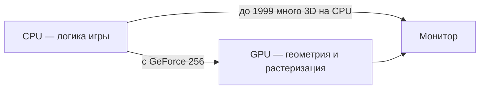
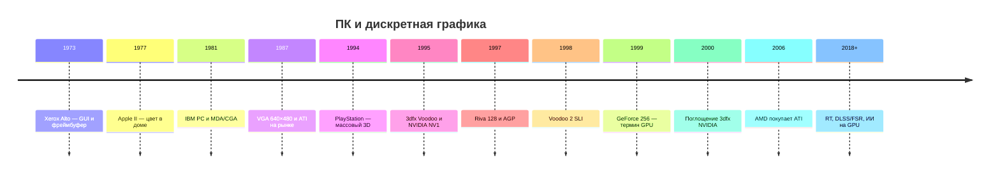

---
tags:
  - all
  - required
  - beginner
title: "История персональных компьютеров и видеокарт"
description: "От Xerox Alto и MDA до GeForce, 3dfx Voodoo и RTX. Как ПК и дискретная графика дошли до современных GPU и ИИ."
related:
  - title: "Поколения вычислительной техники"
    doc: encyclopedia/1-basics/1-07-nemnogo-o-proshlom/12
  - title: "Графические процессоры и видеокарты"
    doc: encyclopedia/1-basics/1-08-kak-rabotaet-kompyuter/4
  - title: "История DirectX — от DOS до нейросетей"
    doc: encyclopedia/9-spinoff/9-03-igrovaya-industriya/11439
  - title: "Дисплеи и технологии отображения"
    doc: encyclopedia/1-basics/1-08-kak-rabotaet-kompyuter/716
  - title: "Как работает компьютер — о разделе"
    doc: encyclopedia/1-basics/1-08-kak-rabotaet-kompyuter/intro
  - title: "История первого iPhone"
    doc: encyclopedia/1-basics/1-07-nemnogo-o-proshlom/14
---

# История персональных компьютеров и видеокарт

  ОБЯЗАТЕЛЬНО
  ДЛЯ НОВИЧКОВ

Всем

[Персональный компьютер](/encyclopedia/1-basics/1-08-kak-rabotaet-kompyuter/1) на столе и [видеокарта](/encyclopedia/1-basics/1-08-kak-rabotaet-kompyuter/4) внутри корпуса складывались десятилетиями. Память была дорогой, шины медленными, а у каждого поколения чипов свой набор команд. Ниже — ключевые вехи от первых машин с окнами и мышью до [GPU](/glossary/G#gpu), на котором сегодня обучают нейросети.

Смежные материалы:

- [Поколения вычислительной техники](./12) — лампы, микропроцессор, смартфон;
- [История DirectX](/encyclopedia/9-spinoff/9-03-igrovaya-industriya/11439) — как игра разговаривает с Windows и видеокартой;
- [Дисплеи и технологии отображения](/encyclopedia/1-basics/1-08-kak-rabotaet-kompyuter/716) — что происходит на стороне монитора;
- [Компоненты компьютерного железа](/encyclopedia/1-basics/1-08-kak-rabotaet-kompyuter/2) — CPU, RAM, шины PCIe сегодня.

---

## Словарь

| Термин | Простое объяснение |
|--------|-------------------|
| **[Пиксель](/glossary/П#пиксель)** | Минимальная точка на экране. Разрешение 1920×1080 — это 1920 столбцов и 1080 строк пикселей. |
| **Фреймбуфер** | Участок памяти с картинкой **текущего кадра**. Видеочип читает его и отправляет сигнал на монитор. |
| **VRAM** | [Видеопамять](/encyclopedia/1-basics/1-08-kak-rabotaet-kompyuter/4) на плате адаптера. Отдельна от [ОЗУ](/glossary/О#озу), которую использует [процессор](/glossary/П#процессор). |
| **[GUI](/glossary/Г#графический-интерфейс-пользователя)** | Графический интерфейс — окна, иконки, меню, курсор мыши вместо одной строки команд. |
| **2D-акселератор** | Чип, ускоряющий плоскую картинку — окна, шрифты, прокрутку в [Windows](/encyclopedia/2-system-network/2-01-operatsionnaya-sistema/2). |
| **3D-ускоритель** | Плата, которая считает [полигоны](/encyclopedia/1-basics/1-18-kompyuternye-igry/7), текстуры и свет в [играх](/encyclopedia/1-basics/1-18-kompyuternye-igry/1). |
| **[GPU](/glossary/G#gpu)** | Графический процессор. С [GeForce 256](/encyclopedia/1-basics/1-08-kak-rabotaet-kompyuter/4) (1999) на кристалле появился блок геометрии — тяжёлую 3D-математику стали делать на видеочипе. |
| **[API](/encyclopedia/1-basics/1-18-kompyuternye-igry/7)** | Стандартные команды между программой и железом — Glide, Direct3D, [Vulkan](/glossary/V#vulkan). |
| **[Драйвер](/encyclopedia/1-basics/1-18-kompyuternye-igry/7)** | Программа производителя карты. Переводит команды API в работу конкретного чипа. |
| **[Шейдер](/glossary/Ш#шейдер)** | Небольшая программа на GPU. Задаёт вид воды, металла, теней. |
| **[Растеризация](/glossary/Р#растеризация)** | Классический способ нарисовать 3D-сцену — разложить треугольники на пиксели экрана. |
| **AGP** | Узкая высокоскоростная шина 1997–2000-х только для видеокарты. Сменила слот ISA/PCI, сама уступила место PCIe. |
| **PCIe** | Современная шина расширения. Видеокарта вставляется в длинный слот PCIe x16 на [материнской плате](/encyclopedia/2-system-network/2-10-zhelezo/2). |
| **SLI** | Две видеокарты в одном ПК. У 3dfx строки экрана чередовались между платами; у NVIDIA позже кадр делили между картами. |

---

## До массового ПК

### Xerox Alto (1973)

**Xerox Alto** в лаборатории PARC показал рабочий стол будущего задолго до дешёвых домашних машин.

- [GUI](/glossary/Г#графический-интерфейс-пользователя) с окнами и иконками;
- трёхкнопочная мышь;
- портретный экран **606×808** [пикселей](/glossary/П#пиксель);
- **побитовое сканирование** — каждый пиксель хранится как бит или группа бит в памяти;
- **аппаратный курсор** на отдельном чипе, чтобы при движении мыши не перерисовывать весь экран.

Фреймбуфер занимал около **2,5 МБ** [ОЗУ](/glossary/О#озу) — для 1970-х это огромный объём. Цена Alto — порядка **32 000 $**. Потребительский **Xerox Star** (1981) стоил до **75 000 $**. Покупали в основном лаборатории и крупные компании.

### Apple II и Macintosh

**Apple II** (1977) принёс цвет в домашний сегмент. У него было **4 КБ** памяти — на фоне мегабайт у Alto это другой класс устройства.

**Macintosh** (1984) сделал ставку на интерфейс:

- монохромный 9-дюймовый экран;
- мышь в комплекте;
- реклама Ridley Scott "1984".

Для Apple серьёзным соперником [IBM PC](/encyclopedia/1-basics/1-07-nemnogo-o-proshlom/12) стал **Macintosh** — ставка на удобный экран вместо совместимости с офисным стандартом.

  
От Alto к Windows

  

  Окна, мышь и битовая карта с Alto пришли в Macintosh, затем в Microsoft Windows. Привычный <strong>рабочий стол</strong> вырос из лабораторий 1970-х. IBM PC пошёл другим путём — сначала текстовый DOS, затем графические адаптеры VGA.
  

---

## Первые видеокарты и VRAM

| Год | Событие |
|-----|---------|
| **1976** | Первая цветная плата для шины **S-100** — две платы в корпусе энтузиаста. Собственного фреймбуфера сначала не было. |
| **1978** | **Matrox Alt-256** — монохром **256×256**, память для кадра на самой плате. Часто отсчитывают отсюда выделенную **VRAM**. |

Пока VRAM не стала нормой, фреймбуфер часто лежал в **общей ОЗУ**. [Процессор](/glossary/П#процессор) и графика делили одну шину — прокрутка окна или смена кадра в игре тормозили друг друга.

---

## Стандарты IBM PC от MDA к VGA

С [IBM PC](/encyclopedia/1-basics/1-07-nemnogo-o-proshlom/12) (1981) графические режимы стали называть по стандарту адаптера.

| Стандарт | Год | Что даёт |
|----------|-----|----------|
| **MDA** | 1981 | Монохромный текст. Без цвета. |
| **CGA** | 1981 | Первый цвет у IBM PC. Мало оттенков, низкое разрешение. |
| **EGA** | 1984 | Больше цветов и режимов. Своя VRAM, [CPU](/glossary/П#процессор) пишет в неё напрямую. |
| **VGA** | 1987 | **640×480**, 16 цветов (позже 256 из палитры). Разъём **D-Sub** держался в мониторах до середины 2010-х. |

В 1990-х появились **SVGA** и **XGA** — выше разрешение, до **1 МБ** памяти, **16-** и **24-битный** цвет.

**S3** выпустила чип **911**, затем режим **32 бита на пиксель** — 24 бита цвета RGB и 8 бит **альфа-канала** (прозрачность для 3D поверх плоского экрана).

**2D-акселераторы** стали нужны для **Windows 3.1** (1992). Без них окна и шрифты полностью грузили [процессор](/glossary/П#процессор).

### IBM Professional Graphics Controller (1984)

**IBM PGC** — профессиональный адаптер примерно за **4000 $**.

- три слота на материнской плате;
- сопроцессор **Intel 8088** на плате;
- **68 КБ** ПЗУ;
- **320 КБ** видеопамяти — рекорд для эпохи;
- ускорение 2D и раннего 3D.

Разработчик — **Кёртис Прим** (Curtis Priem). Позже он соосновал **NVIDIA**.

---

## ПК в СССР

Западные журналы порой описывали СССР карикатурно — будто любой компьютер стоит в здании под охраной. Статья про **"Агат"** в *Byte* (ноябрь 1984) — пример такого настроения.

На практике развитие шло иначе:

- **"Агат"** частично повторял [Apple II](/encyclopedia/1-basics/1-07-nemnogo-o-proshlom/12);
- бытовые **БК-0010**, **ПК-01 "Львов"**;
- школьный курс информатики;
- самодельные ПК из радиодеталей в 1990-е.

Текстовые и **CGA-совместимые** режимы приходили с задержкой, но по тем же идеям — фреймбуфер, адаптер, вывод на монитор или телевизор.

---

## Компании 1980–1990-х

| Компания | Год | Роль |
|----------|-----|------|
| **ATI** | 1985 | Три инженера из Гонконга, Канада. К выходу **VGA** (1987) уже продавала свои платы. |
| **S3** | 1989 | Сильные 2D-чипы, затем цвет и 3D. |
| **Matrox** | с 1976 | Профессиональная графика; позже **DualHead** — два монитора с одной карты. |

**Intel** выпустила дискретную **i740** (1998), затем переключилась на **встроенную** графику в [процессорах](/glossary/П#процессор) — линейки Extreme Graphics, HD Graphics, Iris и позже Arc.

---

## Как в играх появился настоящий 3D

**Doom** и **Wolfenstein 3D** (начало 1990-х) часто называют **"2.5D"**.

- уровень выглядит объёмным;
- камера и геометрия ограничены — нет полноценной произвольной 3D-сцены.

**Descent** и **Quake** (1996) рисовали мир из треугольников с любым ракурсом. На **486** и **Pentium** [процессор](/glossary/П#процессор) не успевал — появился спрос на отдельную плату.

**Sony PlayStation** (1994) первой массово показала 3D в гостиной — фиксированный конвейер треугольников по цене консоли.

На ПК прорывом стал **отдельный 3D-ускоритель** — плата только для трёхмерной графики, рядом с обычной 2D-картой.

Подробнее о полигонах и API — [DirectX, OpenGL и Vulkan — простыми словами](/encyclopedia/1-basics/1-18-kompyuternye-igry/7) и [История DirectX](/encyclopedia/9-spinoff/9-03-igrovaya-industriya/11439).

---

## 3dfx и линейка Voodoo

**3dfx** основана инженерами из **Silicon Graphics**. **Voodoo Graphics** (1995):

- считает только **3D** — картинка рабочего стола идёт через вторую плату;
- игры обращаются к API **Glide** — быстрый, закрытый, только для 3dfx;
- **Voodoo Rush** (2D и 3D на одной плате) оказалась слабее из-за компромиссов в схеме.

**Voodoo 2** (1998):

- до **12 МБ** памяти;
- **SLI (Scanline Interleave)** — две платы чередуют горизонтальные строки, разрешение до **1024×768**;
- в корпусе иногда **три платы** — одна 2D и две 3D.

После 3dfx покупатель ждал от игрового ПК мощный 3D-чип наравне с быстрым [CPU](/glossary/П#процессор).

---

## NVIDIA от NV1 до Riva 128

**NVIDIA** (1993) — **Кёртис Прим**, **Крис Малаховски**, **Дженсон Хуанг**. Название от латинского *invidia* ("зависть").

| Продукт | Год | Что произошло |
|---------|-----|----------------|
| **NV1** | 1995 | 2D, 3D и звук на одном кристалле. 3D строился на **четырёхугольниках**. [Direct3D](/encyclopedia/9-spinoff/9-03-igrovaya-industriya/11439) стандартизировал **треугольники** — игры и драйверы ушли в сторону конкурентов. |
| **NV2** | — | Проект для Sega. Финансирование остановили после провала NV1. |
| **Riva 128** | 1997 | Универсальная 2D+3D карта, [DirectX](/encyclopedia/9-spinoff/9-03-igrovaya-industriya/11439), шина **AGP**. |

С **1998** года **NVIDIA** и **ATI** (чип **3D Rage Pro**) соперничали в каждом ценовом сегменте. ATI переименовала чип Pro в **Turbo** и обещала прирост от [драйверов](/encyclopedia/1-basics/1-18-kompyuternye-igry/7) — в синтетических тестах цифры росли сильнее, чем в реальных играх.

---

## 1999 год и GeForce 256

В **1999** тяжёлую 3D-математику начали переносить с [процессора](/glossary/П#процессор) на видеочип.

| Карта | Итог |
|-------|------|
| **S3 Savage 2000** | Вышла на день раньше GeForce. Геометрический блок похож по идее, но [драйверы](/encyclopedia/1-basics/1-18-kompyuternye-igry/7) сырые — отзывы и продажи пострадали. |
| **GeForce 256** | Первое массовое использование термина **[GPU](/glossary/G#gpu)**. **Геометрический сопроцессор** на кристалле переводит 3D-координаты в 2D и отсекает невидимые треугольники. Производство на **TSMC**, техпроцесс **220 нм**. |
| **Matrox G400** | **DualHead** — два монитора с одной карты. В 3D-играх уступала лидерам и сильно зависела от скорости CPU. |

---

## Сжатие рынка 2000–2001

| Компания | Итог |
|----------|------|
| **3dfx** | Долги, срыв чипа **Rampage**. В конце **2000** компанию купила NVIDIA. Идеи Rampage дошли до **GeForce FX**. |
| **S3** | Куплена **VIA** из-за патентов на шины. Дальше — слабые встроенные чипсеты. |
| **Matrox** | Темп "два поколения чипа за год" оказался слишком высоким. Ушла в узкие профессиональные ниши без гонки за [FPS](/glossary/F#fps-частота-кадров-frames-per-second) в играх. |

На рынке дискретной графики для игр и рабочих станций остались **NVIDIA** и **ATI**.

---

## Radeon и GeForce

В **2000** ATI показала **R100** и бренд **Radeon** (серия 7000). Началось многолетнее соперничество с **GeForce 2**.

Игры стали требовать аппаратные **[шейдеры](/glossary/Ш#шейдер)**. **GeForce 4 MX** продавали как новое поколение, хотя внутри архитектура ближе к **GeForce 2** — без полноценных шейдеров. **Silent Hill 3** на такой карте не запускалась с задуманной графикой.

**2004** — переход на **PCI Express**. У NVIDIA шестое поколение добавило декодирование **H.264** в железе и новую **SLI** — кадр делят между картами (у 3dfx Voodoo 2 чередовали строки). Чип **GeForce 7800 GTX** (в урезанном виде) стал графикой **PlayStation 3**.

Последняя крупная самостоятельная линейка ATI — **X1000** (90 нм, TSMC). В **2006** ATI купила **AMD**. Имя ATI на коробках держали до ~**2010**; с **Radeon HD 6000** — **AMD Radeon**.

---

## Ноутбуки конца 1990-х

| Модель | Год | Особенности |
|--------|-----|-------------|
| **Leo** | 1996 | Pentium 120 МГц, 8 МБ [ОЗУ](/glossary/О#озу), 10" **800×600**, 256 цветов. Графика **Chips & Technologies**. Корпус со временем крошится. |
| **IBM ThinkPad 600i** | 1998 | Pentium II 366 МГц, 13,3" **1024×768**, 24-бит. **NeoMagic MagicMedia 256AV** на **AGP** — GPU и VRAM на одном кристалле для экономии батареи. TrackPoint, USB 1.0. **Need for Speed 3** и **Quake 2** шли плавно на **640×480**. |

NeoMagic показала путь к **SoC** и встроенной графике в современных [ноутбуках](/encyclopedia/1-basics/1-08-kak-rabotaet-kompyuter/711). Выбор экрана сегодня — [Как выбрать монитор](/encyclopedia/1-basics/1-08-kak-rabotaet-kompyuter/717).

---

## Современная эпоха

| Веха | Почему это веха |
|------|-----------------|
| **PCIe** | Заменила AGP. Широкая полоса между [CPU](/glossary/П#процессор) и [GPU](/glossary/G#gpu). |
| **Radeon VII** | **16 ГБ HBM** — быстрая память из серверного сегмента в домашней карте. |
| **[DLSS / FSR](/encyclopedia/1-basics/1-18-kompyuternye-igry/8)** | Картинку рисуют в меньшем разрешении, затем масштабируют нейросетью или [шейдерами](/glossary/Ш#шейдер). Меньше нагрузка при том же визуальном качестве. |
| **Трассировка лучей (RT)** | С **2018** в [играх](/encyclopedia/1-basics/1-18-kompyuternye-igry/1). Полный RT в реальном времени тяжёл — используют смесь [растеризации](/glossary/Р#растеризация) и RT-ядер, как раньше смешивали работу CPU и 3D-платы. |
| **[CUDA](/glossary/C#cuda)** | Платформа NVIDIA для вычислений на GPU. Основа многих задач [машинного обучения](/encyclopedia/6-ai/6-01-vvedenie-v-ii/intro). |
| **Intel Arc** | Возврат Intel в дискретный сегмент. Рынок по-прежнему держат NVIDIA и AMD. |

Современная [видеокарта](/encyclopedia/1-basics/1-08-kak-rabotaet-kompyuter/4) — тысячи ядер, своя память, [драйвер](/encyclopedia/1-basics/1-18-kompyuternye-igry/7) и стек [API](/encyclopedia/1-basics/1-18-kompyuternye-igry/7). Она выводит изображение, ускоряет игры, монтаж, научные расчёты и обучение нейросетей.

---

## Хронология одним взглядом

| Период | Главная задача индустрии |
|--------|---------------------------|
| 1970–1986 | Уместить [GUI](/glossary/Г#графический-интерфейс-пользователя) в память и бюджет |
| 1987–1995 | Стандарты IBM PC и 2D для Windows |
| 1996–1999 | Перенести 3D с [процессора](/glossary/П#процессор) на отдельный чип |
| 2000–2010 | Соперничество ATI и NVIDIA, [шейдеры](/glossary/Ш#шейдер), HD-видео |
| 2010–н.в. | RT, апскейл, [GPGPU](/glossary/G#gpu), дата-центры |

---

## Что запомнить

1. Окна и мышь появились на **Alto** задолго до дешёвого домашнего ПК.
2. **VRAM** и **VGA** сделали графику общим языком IBM-совместимых машин; разъём **D-Sub** жил десятилетиями.
3. Полноценный **3D на ПК** потребовал отдельных ускорителей. **3dfx** научила рынок, **NVIDIA** исправила ошибку **NV1** и закрепила термин **GPU** на **GeForce 256**.
4. После **2000** остались два крупных бренда дискретной графики; Intel периодически возвращается с Arc.
5. Сегодняшняя карта — и игры, и **RT**, и **[CUDA](/glossary/C#cuda)** для ИИ.

---

## Читать дальше

- [Графические процессоры и видеокарты](/encyclopedia/1-basics/1-08-kak-rabotaet-kompyuter/4) — устройство GPU сегодня.
- [История DirectX](/encyclopedia/9-spinoff/9-03-igrovaya-industriya/11439) — программная сторона PC-гейминга.
- [Поколения вычислительной техники](./12) — лампы, микропроцессор, смартфон.
- [Как выбрать монитор](/encyclopedia/1-basics/1-08-kak-rabotaet-kompyuter/717) — экран за видеокартой.
- [DirectX, OpenGL и Vulkan — простыми словами](/encyclopedia/1-basics/1-18-kompyuternye-igry/7) — пункты в настройках игры.
- [DLSS и FSR — апскейлинг в играх](/encyclopedia/1-basics/1-18-kompyuternye-igry/8) — как поднять разрешение без просадки FPS.
- [Аппаратное обеспечение](/encyclopedia/2-system-network/2-10-zhelezo/1) — обзор железа в разделе "Система и сеть".

{/* sidebar-collections */}

---

## В подборках

Статья входит в [тематические подборки](/about/collections).

**История** — [История информационных технологий — о разделе](./intro), [Поколения вычислительной техники](./12), [История первого iPhone](./14), [История DirectX](/encyclopedia/9-spinoff/9-03-igrovaya-industriya/11439).

**Железо** — [Графические процессоры и видеокарты](/encyclopedia/1-basics/1-08-kak-rabotaet-kompyuter/4), [Дисплеи и технологии отображения](/encyclopedia/1-basics/1-08-kak-rabotaet-kompyuter/716), [Как выбрать монитор](/encyclopedia/1-basics/1-08-kak-rabotaet-kompyuter/717), [Аппаратное обеспечение](/encyclopedia/2-system-network/2-10-zhelezo/1).

{/* /sidebar-collections */}

---
