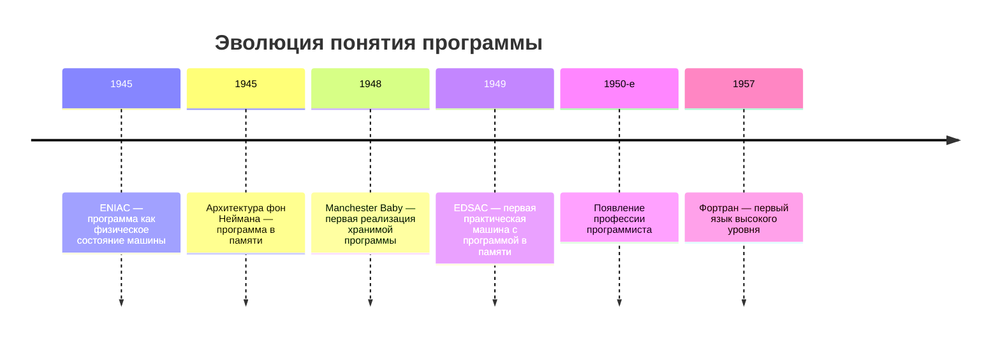
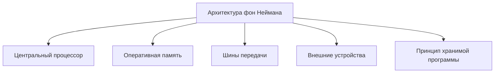
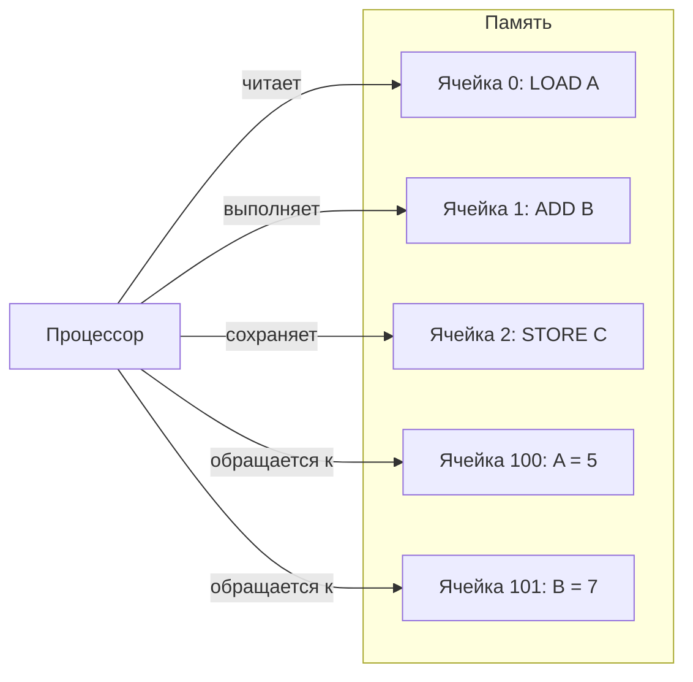
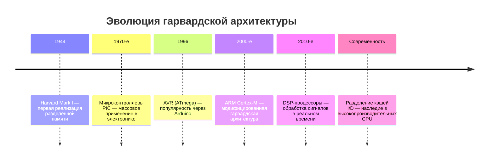
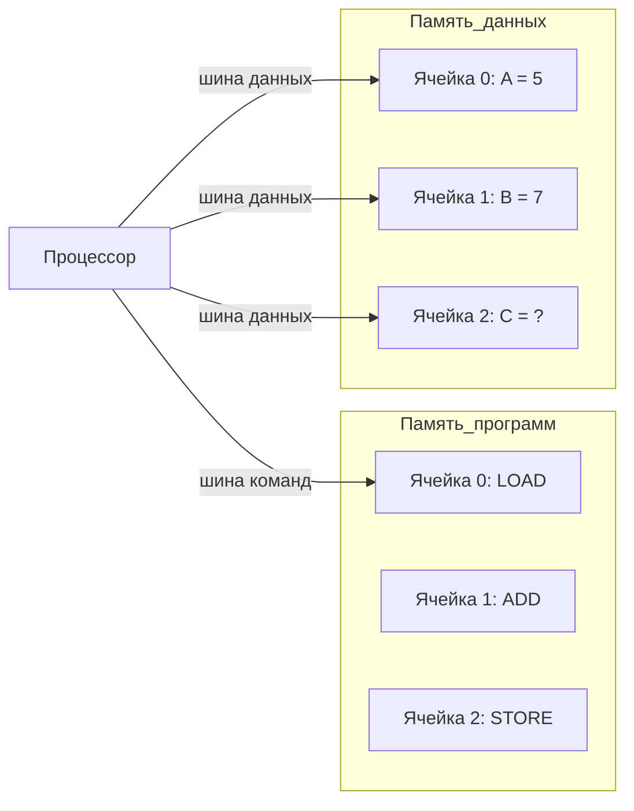
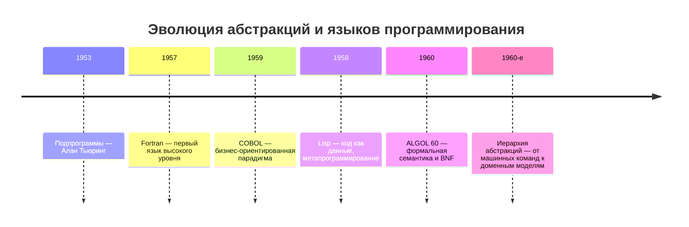
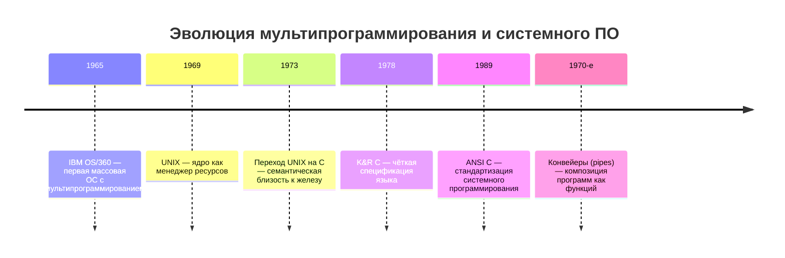
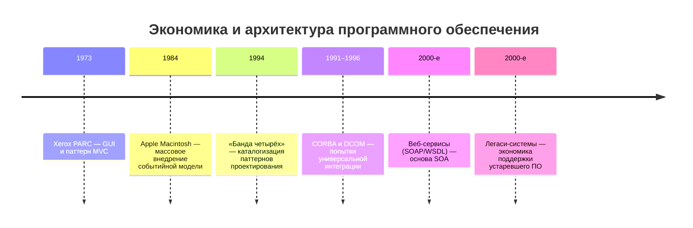
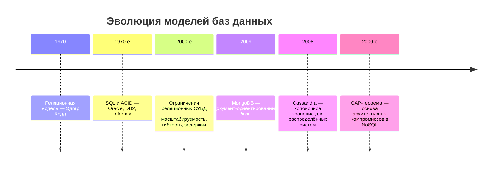
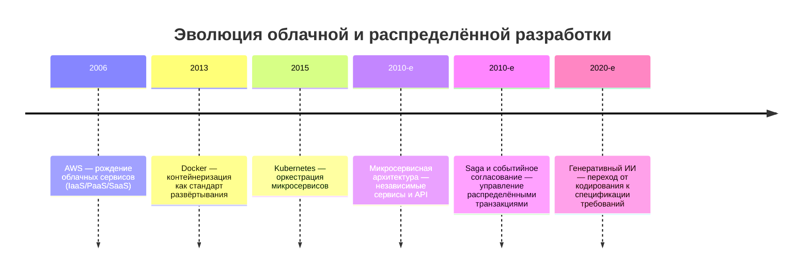

---
tags:
  - all
  - required
  - beginner
title: Эволюция программного обеспечения
description: "timeline title Эволюция понятия программы 1945 : ENIAC — программа как физическое состояние машины 1945 : Архитектура фон Неймана — программа в памяти 1948 : Manchester Baby — первая реализация."
  языкам, ОС, базам данных и облачным платформам.
---

import TechHistoryPlay from '@site/src/components/TechHistoryPlay.jsx';

# Эволюция программного обеспечения

<div class="article-tags">
  <span class="tag tag-required">ОБЯЗАТЕЛЬНО</span>
  <span class="tag tag-beginner">ДЛЯ НОВИЧКОВ</span>
</div>

<span class="complexity-badge">Всем</span>

<TechHistoryPlay topic="computing-stack" />

## Развитие софта

### Архитектура фон Неймана



Понятие «программное обеспечение» как отдельной категории знания возникло не сразу - то есть, в первое время программы были совсем иными.

В эпоху первых электронных вычислительных машин (1940–1950-е) различие между аппаратурой и программой было размыто: программа существовала в виде физической конфигурации — переключателей, штекерных коммутационных панелей, перфокарт. ENIAC, запущенный в 1945 году, требовал для перенастройки на новую задачу нескольких дней физической перекоммутации кабелей и установки переключателей. Программа здесь была *состоянием машины*. Это — прообраз *хардкодинга*: логика вшита в физическую реализацию, и её изменение требует инженерного вмешательства.

**Электронная вычислительная машина** — это устройство, способное автоматически выполнять последовательности операций над данными. Оно принимает входные сигналы, преобразует их по заданному алгоритму и выдаёт результат.

**Аппаратура** — совокупность физических компонентов компьютера: плат, микросхем, проводов, переключателей, источников питания, дисплеев и других элементов, изготовленных из металла, пластика, кремния. Это «тело» машины: то, что можно потрогать, взвесить, собрать и разобрать отвёрткой. Аппаратура задаёт предел возможностей — например, максимальную скорость передачи сигнала или объём хранимой информации.

**Переключатель** — механическое или электронное устройство, имеющее два или более устойчивых состояния. В вычислительных машинах переключатель обычно представляет собой бинарный элемент: «включено» (сигнал проходит) или «выключено» (сигнал блокируется). Комбинация множества переключателей образует логическую цепь — например, схему сложения двух чисел. Настройка переключателей позволяет «запрограммировать» поведение машины — но только до тех пор, пока она не включена. После включения изменить логику без физического вмешательства невозможно.

**Коммутационная панель** — плата с множеством гнёзд и разъёмов, на которую оператор вручную устанавливал провода (часто с штекерами на концах), чтобы соединить одни блоки машины с другими. С помощью такой панели задавалась структура вычислений: какие сигналы куда направляются, какие операции выполняются в каком порядке. Это был аналог современной программы, но реализованный в виде физического монтажа. Ошибка в одном проводе могла привести к полному сбою расчёта.

**Перфокарта** — лист плотного картона с отверстиями, расположенными по строгой сетке. Каждое отверстие (или его отсутствие) на конкретной позиции кодировало один бит информации — например, «да» или «нет», «1» или «0». Стандартные размеры и размещение отверстий позволяли машинам считывать содержимое карты механическими или оптическими датчиками. Перфокарты служили носителем данных и инструкций: одна карта могла содержать число, одна строка программы, или часть управляющей последовательности. Набор карт — колода — составлял полную задачу. Перфокарты можно было сортировать, дублировать, хранить в ящиках — они стали первым внешним способом хранения программ.

**ENIAC (Electronic Numerical Integrator and Computer)** — первая в мире полностью электронная универсальная вычислительная машина. Создана в 1945 году в Пенсильванском университете группой инженеров под руководством Джона Мокли и Дж. Преспера Эккерта. ENIAC весил 27 тонн, занимал 167 квадратных метров, потреблял 150 киловатт электричества и содержал около 18 000 электронных ламп. Он выполнял 5 000 операций сложения в секунду — в сотни раз быстрее предыдущих механических машин. Однако для решения новой задачи требовалось перепрограммирование: команда из шести человек переключала сотни тумблеров и переставляла тысячи кабелей на коммутационных панелях. Процедура занимала от нескольких часов до нескольких дней. Программа здесь не существовала отдельно от машины — она была её физическим состоянием.

Переломный момент наступил с принятием **архитектуры фон Неймана** (1945). Её суть — хранение программы и данных в единой памяти. Это означало, что инструкции становятся *объектами обработки*, равноправными с числами. Машина могла теперь читать команду из памяти, выполнять её, а затем прочитать следующую — без физического переключения. Программа превращалась в *последовательность символов*, которую можно было:  
— **Редактировать** без изменения «железа».  
— **Копировать** с одного носителя на другой.  
— **Анализировать** на предмет корректности.  
— **Оптимизировать** — заменять неэффективные последовательности на более быстрые.  



Архитектура фон Неймана — схема организации вычислительной машины, предложенная в 1945 году. Она определяет пять основных компонентов:  
1. **Центральный процессор** — блок, выполняющий арифметические и логические операции.  
2. **Оперативная память** — единое устройство для хранения как данных, так и инструкций программы.  
3. **Устройства ввода** — каналы получения информации извне (клавиатура, перфокарты, датчики).  
4. **Устройства вывода** — каналы передачи результатов (принтер, дисплей, запись на носитель).  
5. **Шины передачи** — линии связи, по которым сигналы перемещаются между компонентами.  

Ключевой принцип этой архитектуры — *хранимая программа*: инструкции записываются в ту же память, что и данные, в виде последовательных адресуемых ячеек. Процессор забирает команду по текущему адресу, выполняет её, затем переходит к следующему адресу. Благодаря этому программа перестаёт быть постоянной частью конструкции машины — она становится *временным содержимым памяти*, которое можно загрузить, заменить или исправить без вскрытия корпуса.



Джон фон Нейман — венгеро-американский математик, один из создателей квантовой механики, теории игр и современной теории вычислений. В 1944 году он присоединился к проекту ENIAC в качестве консультанта и быстро осознал его главный недостаток: физическая перепрограммируемость. Участники проекта ENIAC, особенно инженеры Эккерт и Мокли, уже обсуждали идею хранения программ в памяти, но не оформили её системно. Фон Нейман собрал эти идеи, добавил математическую строгость и в июне 1945 года написал внутренний отчёт — «*Первый проект отчёта о EDVAC*» (EDVAC — следующая машина после ENIAC). В этом документе впервые чётко описаны принципы единой памяти, последовательного исполнения и адресуемости команд. Отчёт получил широкое распространение в научных кругах и стал основой для большинства последующих компьютеров: Manchester Baby (1948), EDSAC (1949), IBM 701 (1952). Хотя фон Нейман не был единственным автором идеи, его имя закрепилось за архитектурой благодаря ясности изложения и авторитету.

Это был переход от *аппаратной логики* к *логике символьной*. Программа становилась текстом — объектом для *чтения*, а не только для исполнения. Возникала новая профессия — программист, чья компетенция заключалась не в знании электроники, а в умении *мыслить структурно*: разбивать задачу на подзадачи, управлять состоянием, избегать зацикливания. Первые программисты (в основном женщины — Кей Макналти, Бетти Дженнингс и др. в проекте ENIAC) разрабатывали *логические схемы в уме*, которые затем физически реализовывались. Их работа была ближе к архитектуре, чем к написанию инструкций.

Когда программа перестала быть проводом и стала последовательностью слов и цифр в памяти, изменилась сама природа вычислений.

— Появилась возможность *отладки*: можно было остановить машину, заглянуть в память, проверить, какое значение находится в ячейке, и вручную изменить его.  
— Сформировалась *иерархия абстракций*: сначала — машинные команды, затем — мнемонические обозначения (ассемблер), позже — языки высокого уровня (Фортран, Алгол).  
— Возникла *культурная практика программирования*: обмен листингами, публикация алгоритмов в журналах, комментирование кода. Программа стала документом, подлежащим чтению, обсуждению, критике.  
— Развилась *профессия программиста*: человек, владеющий искусством трансляции человеческой задачи в последовательность машинных действий. Первые программисты, такие как Грейс Хоппер, разрабатывали не только алгоритмы, но и средства их записи — компиляторы, библиотеки, стандарты именования.

Архитектура фон Неймана сделала компьютер *инструментом мышления* — устройством, способным имитировать любую дискретную логическую систему, если ей дать нужную последовательность символов. Она позволяет программе анализировать себя, генерировать новые команды, динамически загружать модули — всё это необходимо для операционных систем, компиляторов, интерпретаторов. 

---

### Гарвардская архитектура



Гарвардская архитектура — схема организации вычислительной машины, в которой память для программ и память для данных физически разделены и имеют независимые каналы доступа. Это означает, что процессор может одновременно читать инструкцию из одной памяти и загружать данные из другой — без конфликта за шину, без ожидания.

Истоки архитектуры лежат в проекте **Harvard Mark I** — электромеханического компьютера, построенного в 1944 году в Гарвардском университете совместно с IBM. Программа в нём задавалась с помощью бумажной ленты с перфорацией, а данные вводились отдельно — с перфокарт или с пульта. Лента и карточный накопитель были разными устройствами, с разными механизмами чтения и разными скоростными характеристиками. Программа здесь *не могла* быть изменена в ходе работы — она была внешним, неизменяемым потоком. Зато данные обновлялись свободно, и чтение команд не мешало работе с числами.



Основные черты гарвардской архитектуры:

- **Две физические памяти**: одна — только для чтения инструкций (часто ROM, Flash), другая — для чтения и записи данных (RAM).  
- **Два набора шин**: шина команд и шина данных работают независимо, параллельно.  
- **Фиксированный размер команды**: поскольку программа хранится отдельно, каждая инструкция имеет строго заданную длину — это упрощает выборку и повышает предсказуемость.  
- **Высокая детерминированность**: время выполнения одной команды почти всегда одинаково — важно для встраиваемых и реального времени систем.  
- **Защита от самомодификации**: программа не может случайно или намеренно переписать саму себя — это повышает стабильность и безопасность.

Гарвардская архитектура широко используется в микроконтроллерах — устройствах, встроенных в бытовую технику, автомобильную электронику, датчики, медицинские приборы. Например, семейства **AVR** (Arduino Uno), **PIC**, многие чипы **ARM Cortex-M** реализуют *модифицированную гарвардскую архитектуру*: на уровне ядра — разделение памяти и шин, но на уровне системы — единое адресное пространство или кэширование, позволяющее эмулировать фон Неймана при необходимости.

В современных процессорах чистая гарвардская схема встречается редко, но её принципы живы:
- **Кэш первого уровня** часто разделяется на *I-cache* (инструкции) и *D-cache* (данные) — это прямое наследие гарвардского подхода.  
- В цифровых сигнальных процессорах (**DSP**) разделение команд и данных критично для обработки потоков в реальном времени — например, при кодировании аудио или видео.  
- В безопасных системах (авионика, АЭС) разделение программ и данных снижает риск выполнения вредоносного кода: даже при захвате области данных атакующий не получает доступа к исполняемому коду.

Она оптимизирована под предсказуемость, скорость выборки, отказоустойчивость — всё это необходимо для устройств, которые должны работать без перезагрузки годами.

---

### Языки высокого уровня



Ключевым ограничением ранних систем была *стоимость памяти*. В 1950-х один байт оперативной памяти стоил десятки долларов (сопоставимо со стоимостью грамма золота). Это определяло стиль программирования: код писался как можно короче, даже в ущерб читаемости. Использовались трюки вроде *самомодифицирующегося кода* — программа во время выполнения изменяла собственные инструкции, чтобы сэкономить память. Такой код был крайне хрупким: ошибка в адресе приводила к полной потере управления. Это — прообраз *технического долга*: решение, эффективное в краткосрочной перспективе, но катастрофическое в долгосрочной.

Выходом из этой ситуации стало создание *языков высокого уровня*. Fortran (1957) решал фундаментальную проблему *абстрагирования от архитектуры*. Программист мог писать формулы в привычной математической записи, а компилятор сам генерировал последовательность машинных команд для конкретного процессора:

```fortran
C     Одна строка вместо ручной настройки регистров
      C = A * B + C
```

```text
; псевдокод ассемблера — то, что компилятор делает «под капотом»
LOAD  R1, A
MUL   R1, B
ADD   R1, C
STORE C, R1
``` Это означало, что программа становилась *переносимой*: её можно было скомпилировать для IBM 704 и для UNIVAC без переписывания. Fortran ввёл понятие *типа данных* (целые, вещественные), что позволило компилятору проверять корректность операций на этапе сборки — первая реализация *статической типизации*. Ошибки вроде «сложить число и адрес» теперь ловились до запуска, а не приводили к аварийному останову.

**Абстрагирование** — это процесс выделения существенных характеристик объекта или явления и отбрасывания несущественных деталей. В программировании абстрагирование проявляется как сокрытие внутреннего устройства системы за упрощённым интерфейсом. Программист взаимодействует с тем, что делает компонент, а не с тем, как он это делает. Когда вы нажимаете кнопку «Сохранить» в текстовом редакторе, вы не думаете о том, как устроены драйверы диска, как контроллер SATA передаёт блоки данных или как файловая система распределяет секторы на поверхности носителя. Эта сложность скрыта за абстракцией — простой операцией «сохранить». Чем выше уровень абстракции, тем меньше технических деталей требуется знать пользователю или разработчику.

Абстрагирование строится по уровням:  
- На нижнем уровне — машинные команды и регистры процессора.  
- На следующем — ассемблерные инструкции, отражающие архитектуру конкретного CPU.  
- Затем — библиотеки и системные вызовы операционной системы.  
- Потом — стандартные конструкции языка: переменные, циклы, функции.  
- Далее — фреймворки и доменные модели: «отправить письмо», «начислить зарплату», «провести платеж».  

Каждый уровень обеспечивает устойчивую основу для следующего. Без абстрагирования невозможно было бы создавать сложные системы — разработчик тонул бы в деталях физической реализации.

**Переносимость** — это свойство программного обеспечения сохранять работоспособность при перемещении с одной вычислительной платформы на другую. Платформа включает в себя аппаратную архитектуру (процессор, память, периферия), операционную систему и набор системных библиотек.


COBOL (1959) пошёл дальше: он абстрагировался от *парадигмы мышления*. Его синтаксис имитировал английский язык: «MOVE amount TO total», «IF balance IS GREATER THAN zero THEN...». Цель — сделать программирование доступным для специалистов-предметников (бухгалтеров, экономистов), а не только для математиков. Это был первый шаг к *доменно-ориентированному проектированию* (DDD): язык системы приближался к языку предметной области. COBOL ввёл *иерархические структуры данных* (записи, вложенные группы полей), что позволило естественно описывать бизнес-объекты: «клиент» как совокупность «имени», «адреса», «счёта». Это — прообраз *объектно-реляционного отображения* (ORM): соответствие между структурой данных в памяти и в бизнес-документе.

**Парадигма мышления** — это устойчивая система взглядов, приёмов и моделей, с помощью которых человек воспринимает задачу и строит решение. В контексте разработки программного обеспечения парадигма мышления определяет, как разработчик представляет себе структуру программы, как организует данные и как управляет потоком выполнения.

Языки программирования могут поддерживать одну или несколько парадигм. Выбор парадигмы влияет на архитектуру, читаемость, тестируемость и масштабируемость кода. COBOL, например, был разработан специально под *бизнес-логическую парадигму мышления*: его синтаксис отражал документооборот, деловые правила и терминологию предметной области. Это позволяло экономистам и бухгалтерам участвовать в проектировании программ — не как пользователи, а как соавторы.

Параллельно развивалась и теория. В 1953 году Алан Тьюринг в статье «Цифровые компьютеры, применяемые для игр» ввёл понятие *подпрограммы* — автономного блока кода, который можно вызывать из разных мест программы. Это решало две проблемы:  
1. **Повторное использование**: один и тот же код (например, вычисление квадратного корня) не нужно дублировать.  
2. **Сокрытие сложности**: вызывающий код не обязан знать, *как* реализована функция, только *что* она делает.  

Алан Тьюринг — британский математик, логик, криптограф и один из основоположников теоретической информатики и искусственного интеллекта. Его научные работы заложили фундамент цифровых вычислений задолго до появления первых электронных компьютеров.

В 1936 году Тьюринг публикует статью «О вычислимых числах…», в которой вводит абстрактную вычислительную машину — *машину Тьюринга*. Это теоретическая модель, состоящая из бесконечной ленты, головки чтения-записи и конечного набора состояний. Машина Тьюринга формализует понятие *алгоритма*: любая задача, которую можно решить пошагово по строгим правилам, может быть решена такой машиной. Эта модель доказала существование *неразрешимых задач* — таких, для которых не существует алгоритма решения (например, проблема останова).

Во время Второй мировой войны Тьюринг возглавил группу криптоаналитиков в Блетчли-Парке и сыграл ключевую роль в расшифровке немецкого шифра «Энигма». Разработанный им электромеханический аппарат «Бомба» позволил регулярно читать перехваченные сообщения, что значительно ускорило победу союзников. Эта работа считается одним из первых примеров практического применения программирования: машина настраивалась под конкретный вариант шифра с помощью комбинации проводов и переключателей — своего рода «перфокартной прошивки».

После войны Тьюринг участвует в создании одного из первых программируемых компьютеров — *Pilot ACE* — и пишет одну из первых программ для него. В 1950 году он публикует эссе «Вычислительные машины и разум», где формулирует *тест Тьюринга* — критерий для определения способности машины проявлять интеллектуальное поведение, неотличимое от человеческого.

Его идея *подпрограммы*, введённая в 1953 году, стала одним из важнейших инструментов структурного программирования. Подпрограмма — это именованный фрагмент кода, который можно вызывать из разных точек программы, передавая ему параметры и получая результат. Подпрограммы обеспечивают модульность, повторное использование и локализацию ошибок — без них невозможно представить современную разработку.

Алан Тьюринг заложил три столпа цифрового мира:  
1. Теоретический — машина Тьюринга как модель вычислений.  
2. Практический — участие в создании первых компьютеров и программ.  
3. Философский — размышления о природе разума и возможностях машин.  

Его имя увековечено в единице измерения производительности компьютеров (неофициально — «ту́ринг»), в медали ACM Turing Award — «Нобелевской премии в области информатики» — и в повсеместном признании как «отца компьютерной науки».

В 1958 году Джон Маккарти создаёт Lisp — язык, в котором *код и данные имеют одинаковую структуру* (списки в скобках). Это позволяло программам *порождать другие программы*: функция могла генерировать код на лету и передавать его на выполнение. Lisp ввёл *рекурсию* как основной метод итерации (вместо циклов), *лямбда-исчисление* для описания анонимных функций, и *сборку мусора* — автоматическое освобождение памяти, неиспользуемой объектами. Lisp был языком *метапрограммирования*: программа могла анализировать и модифицировать саму себя, что сделало его основой для систем искусственного интеллекта. Современные языки (JavaScript, Python, Scala) унаследовали его идеи через концепцию *функций первого класса*: функция может быть аргументом, возвращаемым значением, элементом структуры данных.

ALGOL 60 (1960) сыграл ключевую роль в *формализации семантики*. Его описание, написанное с использованием *языка Бэкуса — Наура* (BNF), было первым примером строгой спецификации синтаксиса языка программирования. BNF позволял однозначно определить, является ли последовательность символов корректной программой. Это стало основой для *автоматической генерации парсеров* — компонентов, преобразующих текст программы в древовидную структуру (AST). ALGOL ввёл *лексическую область видимости* (блоки begin...end), *рекурсивные процедуры*, и *динамическое управление памятью* (new, dispose). Его влияние огромно: Pascal, C, Java — все они наследуют синтаксис и многие концепции ALGOL.

---

### Операционные системы



**Мультипрограммирование** — это режим работы операционной системы, при котором в памяти одновременно находятся несколько программ, и центральный процессор поочерёдно переключается между ними, создавая иллюзию параллельного выполнения.

В ранних компьютерах процессор простаивал во время операций ввода-вывода: пока лентопротяжный механизм читал данные с магнитной ленты, CPU ничего не делал. Мультипрограммирование устранило эту неэффективность: пока одна программа ждёт завершения чтения с диска, процессор переключается на другую — ту, которая готова выполнять вычисления. Это резко повысило загрузку оборудования и общую производительность системы.

Мультипрограммирование стало возможным благодаря двум ключевым механизмам:  
- **Вытесняющая многозадачность**: планировщик ОС может приостановить выполнение активного процесса, сохранив его состояние (регистры, указатель команд), и передать управление другому.  
- **Защита памяти**: каждая программа получает собственное адресное пространство, ограниченное аппаратными средствами (MMU — Memory Management Unit). Одна программа не может случайно или намеренно повредить данные другой.

Классический пример — IBM OS/360 (1965), первая массовая ОС с поддержкой мультипрограммирования. Три программы могли одновременно находиться в памяти: одна читала данные с перфокарт, вторая производила расчёты, третья печатала результат. Процессор переключался между ними за доли секунды — пользователь не замечал пауз.

С появлением мультипрограммирования возникла проблема *управления ресурсами*. ОС должны были решать:  
— Как распределять процессорное время между задачами?  
— Как изолировать процессы друг от друга?  
— Как синхронизировать доступ к общим ресурсам (файлам, памяти)?

**Процессорное время** — это интервал, в течение которого центральный процессор выполняет инструкции конкретной программы. В системах с мультипрограммированием процессорное время делится между всеми активными задачами, и каждая из них получает свою долю в соответствии с приоритетом, политикой планирования и текущей загрузкой.

Процессорное время измеряется в тактах (clock cycles) — минимальных временных единицах, определяемых частотой процессора. Например, при частоте 3 ГГц один такт длится около 0.33 наносекунды. Современные ОС оперируют более крупными единицами — *таймслайсами* (time slices), обычно от 1 до 100 миллисекунд. За один таймслайс процесс может выполнить тысячи или миллионы инструкций.

**Ресурс** — это любой ограниченнный элемент вычислительной системы, который требуется программе для выполнения своей работы. Ресурсы бывают аппаратными и программными.

К аппаратным ресурсам относятся:  
- Центральный процессор (его ядра и тактовая частота),  
- Оперативная память (RAM),  
- Постоянное хранилище (HDD, SSD),  
- Сетевой интерфейс (пропускная способность, буферы),  
- Устройства ввода-вывода (клавиатура, дисплей, принтер).

К программным ресурсам относятся:  
- Файловые дескрипторы (открытые файлы, сокеты),  
- Потоки выполнения (threads),  
- Семафоры и мьютексы (объекты синхронизации),  
- Порты ввода-вывода и адреса в памяти.

Любой ресурс характеризуется тремя свойствами:  
1. **Ограниченность** — его нельзя использовать в неограниченном объёме (память закончится, диск заполнится).  
2. **Разделяемость** — некоторые ресурсы могут использоваться несколькими программами одновременно (например, чтение одного файла), другие — только поочерёдно (запись в файл).  
3. **Освобождаемость** — после завершения работы программа должна вернуть ресурс системе, иначе возникает *утечка* (memory leak, file descriptor leak), которая со временем приводит к отказу системы.

Это привело к созданию *ядра операционной системы* как менеджера ресурсов. **UNIX** (1969–1973) — образец *монолитного ядра* с чётким разделением режимов: в привилегированном режиме работает ядро (планирование, память, ввод-вывод), а файловые системы, сетевые службы и утилиты — как процессы *пользовательского пространства*. Позже появились и *микроядерные* ОС (например, MINIX, QNX), где в ядро вынесен минимум функций, но классический UNIX к ним не относится. UNIX ввёл *файловую модель всего* — устройства, процессы, сокеты представлены как файлы с единым интерфейсом (open, read, write, close). Это позволило создавать *конвейеры* (pipes): вывод одной программы напрямую подаётся на вход другой:

```bash
ls | grep '.txt' | wc -l
```

Это — прообраз *функционального программирования*: композиция функций, где выход одной является входом другой.

Операционная система отслеживает два типа процессорного времени для каждой задачи:  
- **Время пользователя** — суммарная длительность выполнения кода самой программы (арифметика, логика, работа со структурами данных).  
- **Время ядра** — суммарная длительность выполнения системных вызовов (чтение файла, отправка сетевого пакета), когда управление переходит в привилегированный режим ядра.

**Синхронизация доступа к общим ресурсам** — это набор механизмов, обеспечивающих корректное и предсказуемое взаимодействие нескольких процессов или потоков с одним и тем же объектом данных или устройства.

**Конвейер** — это механизм передачи выходных данных одной программы напрямую на вход другой, без промежуточного сохранения на диск. В UNIX-подобных системах конвейер обозначается символом `|` (вертикальная черта).

Принцип работы прост: операционная система создаёт *анонимный канал* (pipe) — буфер в памяти ядра, связанный с двумя файловыми дескрипторами: один для записи, другой для чтения. Вывод первой программы (`stdout`) перенаправляется в дескриптор записи, а ввод второй (`stdin`) — в дескриптор чтения. Когда первая программа завершает запись, канал закрывается, и вторая получает сигнал окончания ввода.

Переход UNIX на язык C (1973) был революционным потому что он обеспечил *семантическую близость к железу при синтаксической выразительности*. C сохранил прямой доступ к памяти (указатели), управление битами (побитовые операции), и возможность встраивать ассемблерные вставки, но при этом ввёл структурированные типы (struct), перечисления (enum), и препроцессор для условной компиляции. C стал *языком описания систем*: на нём можно было писать компиляторы, драйверы, ядра ОС. Его спецификация (K&R, 1978) была настолько чёткой, что компиляторы от разных производителей генерировали совместимый код — основа для *стандартизации* (ANSI C, 1989).

Семантика — это смысл, который вкладывается в конструкции языка программирования или команды операционной системы. Если синтаксис отвечает на вопрос «как написать?», то семантика отвечает на вопрос «что произойдёт при выполнении?».

Например, в языке C запись `a = b + c;` имеет чёткую семантику:  
1. Прочитать значение переменной `b` из памяти.  
2. Прочитать значение переменной `c`.  
3. Сложить их как целые числа (если типы `int`) или как числа с плавающей точкой (если `float`).  
4. Записать результат в ячейку памяти, соответствующую переменной `a`.  

Семантика определяет:  
- Порядок вычислений (например, в `f() + g()`, в каком порядке вызовутся функции),  
- Побочные эффекты (изменение глобальных переменных, чтение файла, отправка пакета),  
- Обработку ошибок (что делать при делении на ноль, переполнении),  
- Взаимодействие с окружением (как системный вызов `open()` обращается к драйверу диска).

Ранние языки (например, Fortran IV) имели *нестрогую семантику*: поведение в граничных случаях (например, выход за пределы массива) не было определено и зависело от компилятора и железа. Это приводило к «портабельному коду, который работает по-разному везде».  

Язык C стал прорывом, потому что его семантика была не просто описана, а *сознательно приближена к поведению аппаратуры*. Указатель — это адрес в памяти. Операция `*p = 5` — это запись числа 5 по этому адресу. Побитовый сдвиг `x << 2` — это умножение на 4 на уровне регистров. Такая семантика позволяла программисту точно предсказать, какие машинные инструкции сгенерирует компилятор, и при необходимости вмешаться (встроенный ассемблер, `volatile`, `restrict`).

---

### Развитие архитектуры программного обеспечения



**Экономика софта** — это система закономерностей, определяющих стоимость, ценообразование, распределение и жизненный цикл программного обеспечения как товара или услуги.

Появление персональных компьютеров (1970–1980-е) изменило экономику софта. Ранее программы писались «на заказ» — под конкретную задачу и конкретную машину. С массовым распространением ПК возник рынок *пакетного ПО*: один и тот же продукт (табличный процессор, текстовый редактор) продавался тысячам пользователей. Это породило новые вызовы:  
— **Поддержка множества конфигураций**: одна программа должна работать на IBM PC, Apple II, Commodore 64.  
— **Юзабилити**: пользователь не прошёл месяцы обучения, как оператор мейнфрейма.  
— **Защита от копирования**: пиратство стало угрозой бизнес-модели.  

Ответом стал *графический пользовательский интерфейс* (GUI). Xerox PARC (1973) разработал концепцию *окон*, *иконок*, *меню* и *указателя* (WIMP), реализованную в системе Alto. Но коммерческий успех пришёл с Apple Macintosh (1984) и Microsoft Windows (1985). GUI требовал нового подхода к программированию:  
— **Событийно-ориентированная модель**: программа реагирует на *события* (щелчок мыши, нажатие клавиши).  
— **Модель «публикация-подписка»**: компоненты обмениваются сообщениями, не зная о друг друге напрямую.  
— **Визуальное проектирование**: интерфейс создаётся перетаскиванием компонентов, а не кодом.  

Это привело к появлению *паттернов проектирования*. 

**Паттерн проектирования** — это проверенное решение типовой задачи проектирования программного обеспечения, оформленное в виде шаблона структуры классов, объектов и их взаимодействий.

Паттерн не является готовым фрагментом кода, который можно скопировать и вставить. Это — описательная модель, включающая:  
- **Название** — краткую метафору, помогающую быстро вспомнить суть (например, *Фабрика*, *Наблюдатель*, *Стратегия*).  
- **Проблему** — ситуацию, в которой возникает необходимость в таком решении («нужно создавать объекты, но тип заранее неизвестен»).  
- **Решение** — схему связей между компонентами (диаграмма классов), ключевые роли (Creator, Product, Observer), способы передачи управления.  
- **Последствия** — преимущества и ограничения применения (гибкость при изменении, дополнительная сложность, накладные расходы).  

MVC (Model-View-Controller, 1978) разделял данные (Model), их отображение (View) и логику управления (Controller). Такой подход позволял:  
— Менять интерфейс без переписывания бизнес-логики.  
— Использовать одни и те же данные в разных представлениях (таблица, график, отчёт).  
— Тестировать логику независимо от UI.  

Переписывание бизнес-логики — это процесс замены реализации правил и алгоритмов, управляющих поведением системы, без изменения её внешних наблюдаемых свойств.

Бизнес-логика включает в себя:  
- Правила расчётов (налоги, скидки, штрафы),  
- Последовательности действий (оформление заказа, проведение платежа),  
- Условия принятия решений (кредитный скоринг, модерация контента),  
- Валидации и ограничения (проверка формата ИНН, лимиты на операции).

Переписывание может потребоваться в следующих случаях:  
- **Технологическая модернизация** — переход с устаревшего языка (COBOL) на современный (Java, Python).  
- **Улучшение поддерживаемости** — замена «спагетти-кода» на модульную архитектуру с чётким разделением обязанностей.  
- **Оптимизация производительности** — переписывание «тяжёлых» расчётов с использованием параллелизма или кэширования.  
- **Соответствие нормативным требованиям** — адаптация под новые законы (например, 152-ФЗ о персональных данных).

Процесс переписывания требует особой дисциплины:  
1. **Фиксация поведения** — написание тестов (часто *characterization tests*), которые описывают текущее поведение, даже если оно содержит ошибки.  
2. **Инкрементальное изменение** — замена небольших частей логики с немедленной проверкой через тесты.  
3. **Изоляция домена** — выделение чистой бизнес-логики в отдельный модуль (*Domain Layer*), свободный от зависимостей от базы, UI, сетевых протоколов.  
4. **Валидация на реальных данных** — запуск старой и новой версии параллельно на исторических операциях для сравнения результатов.

Успешное переписывание бизнес-логики не делает систему «другой» для пользователя — интерфейс, время отклика, результаты операций остаются прежними. Но для команды это означает: меньше ошибок, быстрее правки, проще обучение новых разработчиков.

Другие паттерны (Factory, Observer, Strategy) систематизировали решения типовых задач: создание объектов, уведомление об изменениях, выбор алгоритма в runtime. Книга «Банда четырёх» (1994) закрепила эти практики как стандарт индустрии. Банда четырёх — неофициальное название группы из четырёх исследователей: Эриха Гамма, Ричарда Хелма, Ральфа Джонсона и Джона Влиссидеса, — ставшей известной после выхода книги *«Проектирование Patterns: Elements of Reusable Object-Oriented Software»* в 1994 году. Книга систематизировала 23 паттерна проектирования, которые авторы наблюдали в промышленной разработке в течение многих лет. Эти паттерны были сгруппированы по назначению:  
- **Порождающие** — отвечают за создание объектов (Абстрактная Фабрика, Строитель, Одиночка).  
- **Структурные** — определяют способы компоновки объектов и классов (Адаптер, Мост, Компоновщик, Декоратор).  
- **Поведенческие** — описывают распределение обязанностей и взаимодействие между объектами (Наблюдатель, Стратегия, Команда, Посетитель).

Каждый паттерн в книге представлен единообразно: название, мотивация, структура (UML-диаграмма), участники, взаимодействие, пример реализации на C++ и Smalltalk, варианты использования. Такой формат стал стандартом описания архитектурных решений.

Книга не изобретала паттерны — многие из них использовались задолго до 1994 года (например, MVC был предложен в 1978 году в Xerox PARC). Её заслуга — в каталогизации, чёткой формулировке и демонстрации универсальности. После выхода книги паттерны стали частью профессионального языка разработчиков: собеседования включали вопросы по паттернам, фреймворки строились вокруг них (например, Spring использует Фабрику и Прокси), а инструменты вроде UML-редакторов добавили шаблоны на основе книги.

Паттерны возникают там, где одни и те же архитектурные вызовы появляются в разных проектах. Например:  
- Когда интерфейс должен отражать состояние данных без постоянного опроса — применяется паттерн *Наблюдатель*: объекты-наблюдатели подписываются на изменения источника и автоматически получают уведомления.  
- Когда алгоритм должен выбираться во время работы — применяется паттерн *Стратегия*: разные реализации инкапсулируются в отдельные классы, и контекст переключает их в runtime.

Паттерны повышают выразительность кода: разработчик, знакомый с ними, читает `new PaymentStrategyFactory().create(strategyType)` и сразу понимает — здесь реализована гибкая система выбора способа оплаты. Паттерны также облегчают коммуникацию в команде: фраза «сделаем это через Команду» заменяет получасовое объяснение.

С ростом сложности систем возникла потребность в *формальном управлении зависимостями*. CORBA (1991) и DCOM (1996) пытались создать *универсальные шины объектов*: компоненты, написанные на разных языках и запущенные на разных машинах, могли взаимодействовать через единый интерфейс (IDL — Interface Definition Language). Но они провалились из-за сложности: необходимость генерации заглушек, настройки реестров, управления версиями. Прорывом стала *веб-сервисная архитектура* (2000-е):  
— **SOAP** (Simple Object Access Protocol) — обмен структурированными сообщениями через HTTP.  
— **WSDL** (Web Services Description Language) — описание интерфейса сервиса в XML.  
— **UDDI** (Universal Description, Discovery, and Integration) — каталог сервисов.  

Это позволило создавать *сервис-ориентированную архитектуру* (SOA): система как сеть слабосвязанных сервисов, обменивающихся данными через стандартные протоколы. SOA решила проблему *интеграции легаси-систем*: старое приложение на COBOL могло предоставлять данные через SOAP-интерфейс, не требуя переписывания.

**Легаси-система** — это программный комплекс, продолжающий использоваться в производственной эксплуатации, несмотря на устаревание технологий, архитектуры или документации. Банковские ядра, системы ЖКХ, авиадиспетчерские комплексы — всё это работает десятилетиями, обрабатывая миллионы транзакций в день. Их нельзя просто «выключить и переписать» — это приведёт к остановке бизнеса.

---

### Базы данных



Параллельно развивалась *теория баз данных*. Эдгар Кодд в 1970 году предложил *реляционную модель*: данные организованы в таблицы, связи между ними задаются через внешние ключи, запросы формулируются на декларативном языке (SQL). Это было революционно: вместо императивного указания *как* получить данные (перебрать файлы, сравнить поля), программист описывал *что* ему нужно:

```sql
SELECT client_id
FROM orders
WHERE city = 'Москва' AND amount > 1000;
``` SQL стал *языком спецификации данных*: запрос — это описание желаемого результата. Реляционные СУБД (Oracle, DB2, Informix) внедрили *транзакционность* (ACID):  
— **Атомарность**: операция либо выполняется полностью, либо не выполняется вовсе.  
— **Согласованность**: данные всегда остаются в валидном состоянии.  
— **Изолированность**: параллельные транзакции не мешают друг другу.  
— **Долговечность**: результат транзакции сохраняется даже при сбое.  

Это обеспечивало *надёжность* в условиях аппаратных сбоев и конкурентного доступа — критически важно для банков и авиакомпаний.

Но в 2000-е годы возникли задачи, которые реляционные СУБД решали плохо:  
— **Масштабируемость по записи**: социальные сети генерировали миллионы событий в секунду.  
— **Гибкость схемы**: данные пользователей (посты, лайки, друзья) постоянно меняли структуру.  
— **Географическое распределение**: пользователи по всему миру ожидали низкой задержки.  

Ответом стали *NoSQL-системы*:  
— **Документ-ориентированные** (MongoDB): данные хранятся как JSON-подобные документы, не требующие фиксированной схемы.  
— **Колоночные** (Cassandra): оптимизированы для агрегации по одному ключу (например, все действия пользователя за день).  
— **Графовые** (Neo4j): связи между сущностями (друзья, рекомендации) хранятся как первичные объекты.  
— **Ключ-значение** (Redis): ультрабыстрый кэш для часто запрашиваемых данных.  

NoSQL отказался от ACID в пользу CAP-теоремы: в распределённой системе можно выбрать только два из трёх:  
— **Согласованность** (Consistency) — все узлы видят одни и те же данные в один момент.  
— **Доступность** (Availability) — каждый запрос получает ответ, даже при сбое узлов.  
— **Устойчивость к разделению** (Partition tolerance) — система работает при обрыве сетевых связей.  

Это означало *осознанный компромисс*: для соцсетей важнее доступность и устойчивость, чем мгновенная согласованность (можно показать «лайк» с задержкой в секунду).

---

### Облачные платформы и интеграции



С развитием облачных платформ (AWS, 2006) софт стал *инфраструктурой как услуга* (IaaS), *платформой как услуга* (PaaS), *программным обеспечением как услуга* (SaaS). Это изменило модель разработки:  
— **DevOps**: слияние разработки и эксплуатации. Программист отвечает за развертывание, мониторинг, масштабирование.  
— **Непрерывная интеграция/доставка** (CI/CD): каждое изменение кода автоматически тестируется и разворачивается в продакшен.  
— **Контейнеризация** (Docker, 2013): приложение и все его зависимости упаковываются в изолированный контейнер, который работает одинаково на любом хосте.  
— **Оркестрация** (Kubernetes, 2015): управление сотнями контейнеров: распределение нагрузки, обнаружение сбоев, автоматическое масштабирование.  

Микросервисная архитектура — логическое завершение этого процесса. Система разбивается на *независимые сервисы*, каждый со своей:  
— Базой данных.  
— Языком программирования.  
— Циклом разработки.  
— Метриками производительности.  

Связь между сервисами — через *API-шлюзы* и *брокеры сообщений* (Kafka, RabbitMQ). Это обеспечивает:  
— **Гибкость**: один сервис можно переписать на Rust, не затрагивая другие.  
— **Устойчивость**: сбой в сервисе «рекомендаций» не падает весь сайт.  
— **Масштабируемость**: нагруженные сервисы («оплата») масштабируются отдельно от остальных.  

Но возникает новая сложность — *управление распределёнными транзакциями*. В монолите достаточно одной ACID-транзакции, чтобы списать деньги и обновить статус заказа. В микросервисах нужно координировать несколько систем. Решения:  
— **Saga-паттерн**: последовательность локальных транзакций с компенсирующими операциями («отменить списание», если не удалось обновить заказ).  
— **Событийное согласование**: сервис «платежи» публикует событие «Деньги списаны», сервис «заказы» подписывается на него и обновляет статус.  

Сейчас софт переживает новый переход — от *программирования* к *конфигурированию*. Генеративный ИИ (ChatGPT, Copilot) позволяет описывать задачу на естественном языке, а система генерирует код. Это сдвиг в *уровне абстракции*: разработчик определяет *спецификацию* («нужен сервис, который принимает заказ, проверяет наличие, резервирует товар»), а ИИ генерирует *реализацию*. Программист становится *архитектором требований* и *ревьюером качества*, а не писателем строк кода.

При этом фундаментальные принципы остаются неизменными:  
— **Абстрагирование**: скрытие сложности за интерфейсом.  
— **Модульность**: разделение системы на независимые части.  
— **Инкапсуляция**: контроль доступа к внутреннему состоянию.  
— **Полиморфизм**: единый интерфейс для разных реализаций.  

Эти принципы были заложены ещё в древних системах учёта (разделение данных и операций в клинописных табличках), и они будут актуальны, даже когда «код» перестанет существовать в привычном виде.

---
