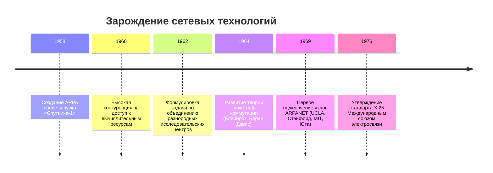
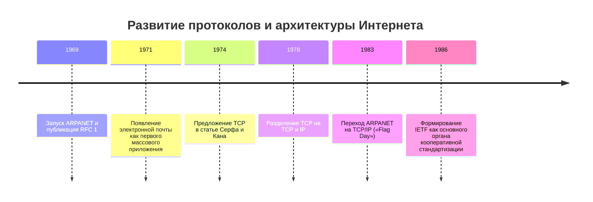
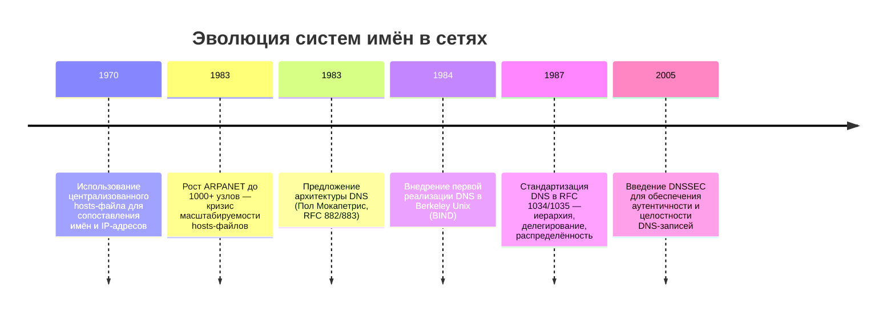
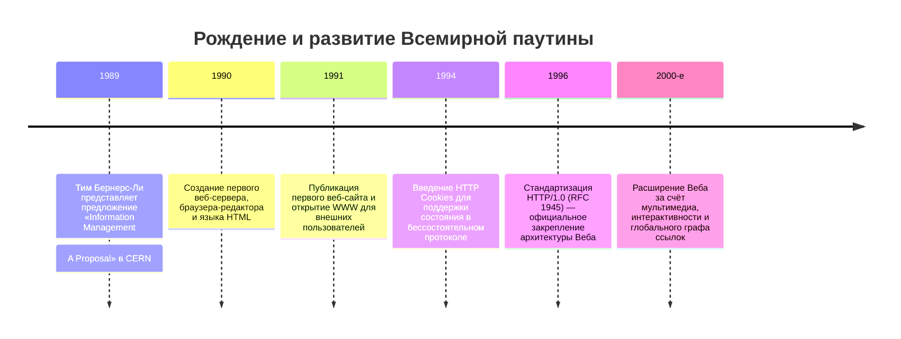
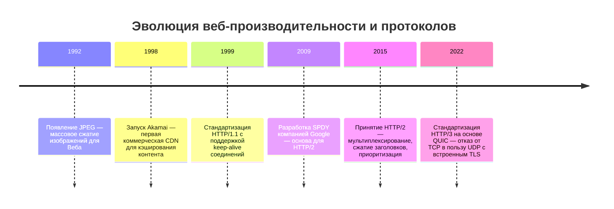
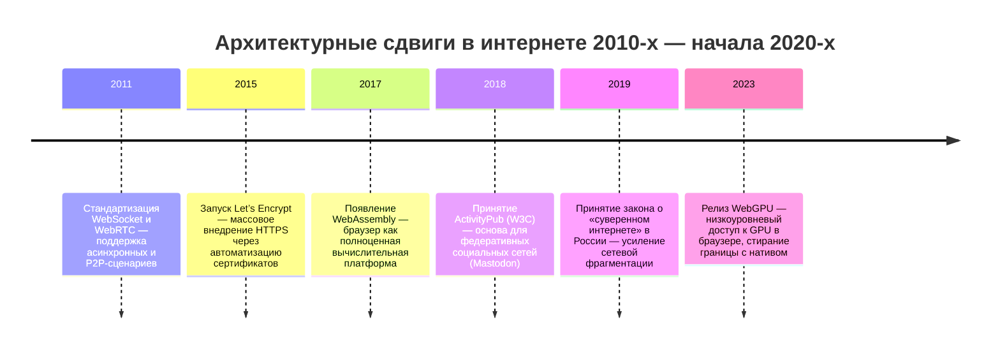

---
tags:
  - all
  - required
  - beginner
title: История интернета
description: >-
  Возникновение интернета, его принципов, стека, протоколов, доменной системы и
  его архитектурные сдвиги.
---

import TechHistoryPlay from '@site/src/components/TechHistoryPlay.jsx';

# История интернета

<div class="article-tags">
  <span class="tag tag-required">ОБЯЗАТЕЛЬНО</span>
  <span class="tag tag-beginner">ДЛЯ НОВИЧКОВ</span>
</div>

<span class="complexity-badge">Всем</span>

<TechHistoryPlay topic="internet" />

## Интернет

### Как появился Интернет?



В конце 1950-х — начале 1960-х годов в США наблюдалась высокая конкуренция между военными, научными и академическими структурами за доступ к вычислительным ресурсам. Компьютеры были дорогими, громоздкими и редкими. Их размещали в специализированных центрах. Учёные и инженеры вынуждены были физически приезжать к машине, чтобы выполнить расчёт или получить результат. Передача данных между такими центрами шла медленно — посредством пересылки магнитных лент, телетайпов или телефонных линий вручную.

В 1958 году, после запуска советского спутника «Спутник-1», США создали Агентство перспективных исследований Министерства обороны — **ARPA** (Advanced Research Projects Agency). Его задачей стало финансирование проектов, способных обеспечить технологическое превосходство. Одной из таких задач стала разработка метода, позволяющего удалённым исследовательским группам эффективно взаимодействовать и обмениваться вычислительными ресурсами.

**Исследовательская группа** — это коллектив специалистов, объединённых общей научной или технической целью. Такая группа работает в лаборатории, университете или исследовательском центре. Её участники совместно формулируют гипотезы, проектируют эксперименты, анализируют данные и публикуют результаты. В контексте зарождения Интернета ключевыми были группы из Массачусетского технологического института (MIT), Стэнфордского университета, Калифорнийского университета в Лос-Анджелесе (UCLA), университета штата Юта и других. Эти группы обладали разными компьютерами, разными операционными системами и разными протоколами обмена. Прямая совместимость между ними отсутствовала.

ARPA поставила перед ними новую цель: создать сеть, которая соединит эти разнородные машины, обеспечит надёжную передачу данных и сохранит работоспособность даже при частичных разрушениях — например, в условиях ядерного конфликта.

Традиционные телефонные сети тех лет использовали **коммутацию каналов**. При установлении вызова между двумя абонентами выделялся выделенный физический или логический канал. Пока разговор длился, этот канал оставался занятым — даже если ни один из собеседников ничего не говорил. Такой подход был простым, но неэффективным: ресурсы сети простаивали в паузах. Более того, при повреждении участка канала связь полностью прерывалась.

Исследователи ARPA обратили внимание на альтернативную идею, предложенную независимо Леонардом Клейнроком (теория очередей), Дональдом Дэвисом (термин *packet* — *пакет*) и Полем Бараном (распределённые сети устойчивости). Эта идея называлась **пакетная коммутация**.

**Пакет** — это ограниченный по размеру фрагмент данных, упакованный в оболочку с технической служебной информацией. Внутри пакета находятся:  
- **Заголовок** — содержит адрес отправителя, адрес получателя, порядковый номер пакета, контрольную сумму для проверки целостности, и другие служебные метки.  
- **Полезная нагрузка** — собственно передаваемые данные (часть текста, фрагмент изображения, команды программы).  
- **Концевик** — иногда используется для дополнительной проверки завершения передачи.

Пакетная коммутация означает, что исходное сообщение разбивается на множество пакетов. Каждый пакет отправляется независимо. Он может пройти по сети своим собственным маршрутом, пересекая разные промежуточные узлы, задерживаясь в очередях, теряясь и пересылаясь заново. Получатель собирает пакеты в исходный порядок, проверяет их целостность и восстанавливает сообщение.

**Доставка пакета** — это процесс перемещения пакета от источника к получателю через цепочку промежуточных устройств. На каждом этапе устройство, называемое **маршрутизатором** (в ранних версиях — **IMP**, Interface Message Processor), читает адрес назначения из заголовка и решает, через какой из доступных выходов отправить пакет дальше. Это решение основано на текущей топологии сети и состоянии каналов. Маршрутизатор не хранит сообщение целиком и не отвечает за его полную доставку — он лишь пересылает пакет дальше. Ответственность за надёжность лежит на конечных узлах.

Такой подход позволял эффективно использовать пропускную способность: каналы не простаивали, а заполнялись пакетами от разных источников. Он обеспечивал **устойчивость**: если один маршрут нарушался, пакеты автоматически шли другими путями. И он поддерживал **масштабируемость**: новые узлы подключались без перестройки всей сети.

Интернет возник как побочный продукт военно-научной программы, развивался за счёт децентрализованного взаимодействия исследовательских групп, и устоял благодаря архитектурному принципу, который можно сформулировать как *глупая сеть — умные концы*. Этот принцип, сформулированный Дэвидом Кларком в 1988 году, означает: сеть должна выполнять минимальный набор функций (доставка пакетов от источника к получателю), а вся логика — обработка ошибок, управление потоком, шифрование, сжатие — должна быть реализована на конечных узлах (хостах). Это резко контрастировало с доминировавшей в 1970-х моделью телекоммуникационных сетей (X.25), где интеллект был сосредоточен в *коммутаторах*: они контролировали качество соединения, гарантировали доставку, управляли приоритетами. Глупая сеть была менее надёжной в отдельных сценариях, но обеспечивала *масштабируемость* и *устойчивость к сбоям*: отказ одного маршрутизатора лишь перенаправлял трафик через другие пути.

В то же время, в 1970-х годах, крупные телекоммуникационные компании (в первую очередь, государственные монополии в Европе и США) разрабатывали собственные стандарты цифровых сетей. Наиболее влиятельным стал стандарт **X.25**, утверждённый Международным союзом электросвязи (ITU) в 1976 году.

**Модель телекоммуникационных сетей** — это общая схема организации взаимодействия между участниками обмена. Она определяет, какие функции выполняют конечные устройства, какие — промежуточные, как устанавливаются соединения, как обрабатываются ошибки, как распределяются ресурсы.

Модель X.25 основана на **интеллектуальной сети с глупыми концами**. В ней **коммутатор** (или узел коммутации пакетов, Packet Switching Exchange — PSE) несёт основную логическую нагрузку. Коммутатор гарантирует:  
- установление и поддержание виртуального канала между двумя точками;  
- контроль за соблюдением приоритетов и выделенной пропускной способности;  
- повторную передачу потерянных пакетов;  
- управление потоком данных во избежание перегрузки;  
- шифрование и сжатие на уровне сети.

Конечные устройства в такой модели могут быть простыми терминалами. Они лишь формируют запрос и получают ответ. Вся сложность — в инфраструктуре.

**Коммутатор** — это устройство, соединяющее несколько сегментов сети и принимающее решения о пересылке данных. В модели X.25 коммутатор хранит состояние каждого активного соединения, ведёт учёт ресурсов, анализирует качество канала в реальном времени и корректирует передачу. Такая сеть обеспечивала высокую надёжность для отдельного соединения, но была сложной в управлении, дорогой в развёртывании и уязвимой к централизованным сбоям. Масштабирование требовало мощных, дорогостоящих коммутаторов и строгого планирования.

---

### ARPANET



ARPANET (1969), первый прототип, изначально использовал протокол NCP (Сеть Control Program), предполагавший установку виртуального канала перед передачей данных — как в телефонной сети. Но уже в 1973 году Винтон Серф и Роберт Кан предложили альтернативу: TCP (Transmission Control Protocol), основанный на *датаграммах* — независимых пакетах, каждый из которых содержит полный адрес получателя. Это позволяло маршрутизаторам принимать решения о пересылке *локально*, без знания состояния всей сети. Позже TCP был разделён на два слоя: IP (Internet Protocol) отвечал за *маршрутизацию* (доставку пакета по адресу), а TCP — за *надёжную передачу* (управление потоком, повторная передача при потере, упорядочивание). Этот принцип *разделения обязанностей* стал фундаментом стека протоколов: каждый уровень решает одну задачу, не вторгаясь в зону ответственности других.

В 1969 году была запущена **ARPANET** — экспериментальная сеть, соединившая четыре исследовательских центра: UCLA, Стэнфордский исследовательский институт (SRI), Калифорнийский университет в Санта-Барбаре (UCSB) и университет штата Юта.

Первое сообщение между узлами UCLA и SRI было отправлено 29 октября 1969 года. Оно содержало всего два символа — «LO». Планировалось передать слово «LOGIN», но система вышла из строя после третьей буквы. Через час связь восстановили, и передача прошла полностью.

Через несколько лет сеть выросла до десятков узлов. Появились первые приложения: удалённый доступ к компьютерам (**Telnet**), передача файлов (**FTP**), и, в 1971 году — **электронная почта**. Именно почта стала первым «вирусным» приложением: учёные начали использовать её не только для задач, но и для неформального общения. Это резко увеличило объём передаваемых данных и изменило характер трафика.

**Трафик** — это поток данных, циркулирующий в сети за определённый период времени. Он измеряется в объёме (байтах) или скорости (битах в секунду). Трафик складывается из всех пакетов, переданных всеми пользователями. В ранней ARPANET преобладал служебный трафик: команды управления, запросы на подключение, передача исходных текстов программ, статистические отчёты. Но с ростом числа пользователей и появлением почты трафик стал включать личные сообщения, обсуждения проектов, обмен новостями, координацию встреч. Это был текст — чистый ASCII-код, без форматирования, изображений или вложений.

Устройства вроде IMP работали как простые маршрутизаторы: они не хранили состояние сеансов, не гарантировали доставку, не управляли потоком. Эти функции реализовывались программным обеспечением на конечных компьютерах — на хостах. Именно этот подход позже получил название **принципа «глупой сети — умных концов»** (end-to-end principle).

Дэвид Кларк, один из ведущих проектировщиков протокола TCP/IP, сформулировал его в 1988 году так:  
> *«Функции, которые могут быть реализованы полностью и корректно только на конечных узлах, не должны дублироваться в промежуточных элементах сети».*

Это означало:  
- сеть отвечает лишь за *возможность* доставки пакета;  
- конечные системы отвечают за *гарантию* доставки (например, через подтверждения и повторные отправки);  
- безопасность, сжатие, кэширование, управление сессией — реализуются приложением или операционной системой на концах.

Такой подход упрощал сеть, снижал её стоимость, ускорял развёртывание новых узлов и позволял экспериментировать с новыми приложениями без согласования с оператором. Не все пакеты доходили — но это было приемлемо ради гибкости и устойчивости.

К началу 1980-х годов ARPANET уже десять лет успешно функционировала. В ней работали сотни исследователей, десятки университетов и лабораторий. Однако внутри сети росли противоречия. Основной протокол передачи данных — **NCP** (Сеть Control Program) — был разработан для *однородной* среды: все компьютеры были подключены к единой физической сети, все использовали один и тот же набор правил, и управление осуществлялось централизованно из штаб-квартиры ARPA.

Но реальность становилась всё более *разнородной*. Появлялись локальные сети (Ethernet в Xerox PARC, Token Ring в IBM), спутниковые каналы, радиосети (Packet Radio Net), мобильные узлы. Эти сети использовали разные физические среды, разные скорости, разные методы кодирования и контроля ошибок. Связь между ними была затруднена: NCP не предусматривал соединения *сетей* — он работал только внутри *одной* сети.

Перед ARPA встала задача: создать архитектуру, способную объединить *любые* сети — независимо от их внутреннего устройства — в единую логическую структуру. Такая структура получила название **Internetwork**, сокращённо — **Internet**.

Решение предложили в 1974 году Винтон Серф и Роберт Кан в статье *«A Protocol for Packet Сеть Intercommunication»*. Они представили набор протоколов, который позже стал известен как **TCP/IP**.

**TCP/IP** — это стек протоколов, разработанный для межсетевого взаимодействия. В самом первом варианте (1974–1978) он состоял из **единого протокола TCP** (Transmission Control Program), совмещающего функции управления соединением и маршрутизации. Позже, в 1978 году, для повышения гибкости и производительности, TCP был разделён на два независимых уровня:

- **IP (Internet Protocol)** — отвечает за *адресацию* и *маршрутизацию*. Он определяет формат пакета (IP-пакет), включая 32-битный адрес отправителя и получателя. IP не гарантирует доставку, не отслеживает порядок, не проверяет дубликаты. Он лишь пытается доставить пакет до назначения, выбирая маршрут на каждом шаге. Это — реализация принципа *глупой сети*.

- **TCP (Transmission Control Protocol)** — работает поверх IP и обеспечивает *надёжную передачу*. Он устанавливает соединение между двумя конечными узлами, нумерует пакеты, подтверждает их получение, повторно отправляет потерянные фрагменты, регулирует скорость передачи, чтобы не перегружать сеть. Это — реализация *умных концов*.

Первые реализации TCP/IP появились в операционных системах Berkeley Unix (BSD) в 1980–1982 годах. Они были открытыми, свободно распространяемыми, легко переносимыми. Университеты и исследовательские центры начали внедрять их параллельно с NCP — сначала для тестирования, затем для реальной работы.

Но существование двух несовместимых протоколов в одной сети создавало хаос. Требовалось единое решение.

1 января 1983 года ARPA объявила **Flag Day** — день, когда все узлы ARPANET обязаны были отключить NCP и перейти на TCP/IP. Сеть была остановлена на несколько часов. Администраторы по всему миру обновляли программное обеспечение. После перезапуска ARPANET стала работать на новой архитектуре. Этот день считается **днём рождения современного Интернета** — не потому, что появилась новая физическая сеть, а потому, что сеть получила *единый язык*, позволяющий соединять *любые* подсети в одно целое.


Переход ARPANET на TCP/IP 1 января 1983 года («Flag Day») был *политическим* решением. Он означал отказ от централизованного управления сетью в пользу *кооперативного стандартизационного процесса*. 

**Кооперативный стандартизационный процесс** — это метод выработки технических стандартов, основанный на добровольном участии, открытой дискуссии и практической проверке. В таком процессе никто не обладает формальной властью навязать решение. Вместо этого участники — инженеры, исследователи, разработчики — совместно проектируют, тестируют, обсуждают и улучшают протоколы. Решение считается принятым, когда оно получает поддержку большинства активных участников и доказывает свою работоспособность в реальных условиях.

Этот подход контрастировал с традиционной моделью стандартизации, принятой в международных телекоммуникационных организациях (например, ITU, ISO), где решения принимались комитетами на основе формальных голосований, часто под влиянием государственных или корпоративных интересов. Такие стандарты могли быть теоретически безупречными, но сложными в реализации, медленными в принятии и оторванными от практики.

Кооперативная модель, напротив, ставила во главу угла *рабочие решения*. Главным критерием была не формальная красота спецификации, а способность протокола успешно функционировать в реальной сети, при реальной нагрузке, на реальном оборудовании.

Вместо того чтобы диктовать решения сверху, разработчики создали IETF (Internet Engineering Task Force) — открытую организацию, где решения принимались консенсусом, а документы публиковались как RFC (Request for Comments). 

**IETF** — это открытое, самоорганизующееся сообщество инженеров и технических специалистов, занимающееся развитием архитектуры и протоколов Интернета. У IETF нет юридического лица, нет офиса, нет постоянного финансирования. Участие в ней — добровольное. Любой желающий может присоединиться к рабочей группе, прочитать черновики документов, оставить комментарии, предложить изменения.

Работа IETF строится вокруг **рабочих групп** (Working Groups), каждая из которых фокусируется на конкретной задаче: маршрутизация, безопасность, именование, мультимедиа и так далее. Решения принимаются не голосованием, а на основе **технического консенсуса** — когда группа приходит к общему пониманию, что предложенное решение является наилучшим из доступных.

Ключевые принципы IETF, сформулированные в RFC 3935 (*«A Mission Statement for the IETF»*), включают:  
- **Работает — стандарт**: протокол должен быть реализован хотя бы в двух независимых системах и успешно пройти испытания в реальной сети.  
- **Открытость**: все материалы, обсуждения и документы доступны публично.  
- **Прагматизм**: предпочтение отдается простым, практичным и масштабируемым решениям, даже если они не являются теоретически оптимальными.  
- **Отказ от патентных ограничений**: стандарты IETF должны быть свободны от лицензионных отчислений, чтобы их мог использовать любой.

IETF не «управляет» Интернетом. Она не контролирует доменные имена, не владеет серверами, не регулирует провайдеров. Её влияние — в авторитете и в качестве решений. Когда тысячи инженеров добровольно следуют предложениям IETF, это создает *де-факто* глобальный стандарт.

**RFC (Request for Comments)** — это серия технических и организационных документов, описывающих протоколы, процедуры, исследования и идеи, связанные с работой и развитием Интернета. Формат RFC был запущен в 1969 году Стивом Кроллом как способ координации работы команды ARPANET.

Первый документ, **RFC 1 «Host Software»**, опубликован 7 апреля 1969 года. Он описывал требования к программному обеспечению хостов для подключения к сети. С тех пор нумерация RFC идёт строго по хронологии, без пропусков. К 2025 году выпущено более 9700 документов.

Серия включает разные типы документов:  
- **Стандартные дорожные карты** (Internet Standards Track) — например, RFC 791 (IP), RFC 793 (TCP), RFC 2616 (HTTP/1.1);  
- **Информационные документы** — обзоры, рекомендации, отчёты о состоянии дел;  
- **Экспериментальные спецификации** — предложения, требующие проверки;  
- **Исторические документы** — устаревшие, но важные с точки зрения развития;  
- **Юмористические RFC** — например, RFC 1149 (IP over Avian Carriers — «передача IP-пакетов с помощью голубиной почты»), опубликованный 1 апреля 1990 года и даже реализованный в 2001 году в Норвегии.

Важнейшая особенность RFC — их **неизменность**. Как только документ опубликован, его текст фиксируется навсегда. Если стандарт уточняется или заменяется, выпускается *новый* RFC, который явно ссылается на предыдущий и указывает его статус (например, *Obsoletes RFC 2616*). Так, HTTP/1.1 был первоначально описан в RFC 2616 (1999), но после десяти лет эксплуатации, анализа ошибок, неоднозначностей и расширений, сообщество IETF выпустило серию из шести документов — RFC 7230–7235 (2014), которые полностью переписали спецификацию, сохранив совместимость, но устранив двусмысленности.

Этот подход гарантирует прозрачность истории: любой может проследить, как развивалась идея — от черновика до стандарта, через ошибки и уточнения.

Ключевой принцип IETF: *работает — стандарт*, *не работает — отбрасывается*. Это обеспечивало *практическую пригодность* стандартов: протокол сначала реализовывался в коде, проверялся в реальных условиях, и лишь потом фиксировался в документе. Так, HTTP/1.1 (RFC 2616, 1999) был переписан как RFC 7230–7235 (2014) после десятилетия эксплуатации и выявления подводных камней.

---

### Доменная система



Каждое устройство в сети TCP/IP имеет уникальный **IP-адрес** — числовой идентификатор (например, `192.0.2.1`). Компьютеры легко работают с числами, но людям запоминать последовательности цифр неудобно. Гораздо проще ввести `mit.edu`, чем `18.62.0.98`.

В первые годы ARPANET этой задачей занимался **hosts-файл** — простой текстовый документ, размещённый на каждом компьютере. В нём хранились пары: *имя → IP-адрес*.

**Пример hosts-файла (1970-е):**  
```
# Этот файл копировался вручную между узлами
128.112.1.10   sri-nic
128.112.2.20   ucla-cs
128.112.3.30   stanford-ai
128.112.4.40   utah-cs
```

Файл обновлялся централизованно: один узел (SRI-NIC — Сеть Information Center) вёл главную копию. Остальные участники сети регулярно скачивали обновлённую версию — сначала по почте, позже — автоматически. Пока сеть состояла из десятков узлов, это работало. Но к 1983 году их стало **более 1000**, и скорость роста ускорялась. Каждое новое добавление требовало обновления у *всех*. Задержки, расхождения версий, конфликты имён — система исчерпала себя.

Ситуация требовала нового подхода. Решение пришло в виде **доменной системы имён**.

**Доменная система (DNS, Domain Name System)** — это глобальная, иерархическая, распределённая служба преобразования человекочитаемых имён (например, `example.com`) в машинные идентификаторы (IP-адреса). Она функционирует как телефонная книга для Интернета: вы вводите имя — система находит соответствующий номер.

DNS не является единой базой данных на одном сервере. Она построена как **сеть независимых серверов**, каждый из которых отвечает за определённую часть пространства имён. Эта структура обеспечивает устойчивость, масштабируемость и делегирование полномочий.

**Масштабируемость имён** — это способность системы присваивать, хранить и разрешать имена при росте числа устройств от тысяч до миллиардов. Она требует:  
- **Иерархии**: имена строятся по принципу *от общего к частному* (`ru` → `spirzen.ru` → `www.spirzen.ru`).  
- **Делегирования**: ответственность за часть имён передаётся от старших уровней младшим.  
- **Локального управления**: владелец домена сам решает, какие поддомены и адреса в нём существуют.  
- **Автоматизации поиска**: клиент не должен знать, где хранится нужная запись — он начинает запрос с верхнего уровня и спускается вниз.

Без масштабируемости именование превращается в административный кошмар. DNS решила эту задачу, сделав имена *неограниченно расширяемыми*.

Формирование доменной системы (DNS, 1983–1987) решало проблему *масштабируемости имён*. При росте сети до тысяч узлов синхронизация файлов стала невозможной. DNS предложил *иерархическую распределённую базу данных*:  
— **Корневые серверы** (13 логических, физически — сотни экземпляров по Anycast).  
— **Домены верхнего уровня** (TLD: .com, .org, .ru) — управляются регистраторами.  
— **Домены второго уровня** (example.com) — управляются владельцами.  

**Распределённая база данных** — это совокупность данных, физически размещённая на множестве независимых серверов, но логически воспринимаемая как единое целое. В такой системе:  
- Данные разбиты на фрагменты по определённому признаку (например, по доменам).  
- Каждый фрагмент управляется отдельным администратором (владельцем домена или регистратором).  
- Запрос к базе может начинаться в любом узле — система сама находит нужный источник.  
- Отказ одного сервера не делает данные недоступными: другие узлы могут кэшировать или перенаправлять запросы.

DNS — классический пример распределённой базы. Запись `spirzen.ru` хранится на серверах, назначенных владельцем этого домена. Запись `.ru` — на серверах Координационного центра домена `.RU`. Запись корня (`.`) — на 13 логических корневых серверах, развёрнутых в сотнях физических точек по технологии **Anycast** (один IP-адрес, много географических копий).

Каждый уровень делегирует полномочия нижестоящему, обеспечивая *децентрализованное управление*. DNS также ввёл *кеширование*: результаты запроса хранятся на промежуточных серверах (например, провайдера), что снижает нагрузку на корневые серверы. Но это породило новую уязвимость — *кэш-отравление*: подмена DNS-записи позволяет перенаправить трафик на злонамеренный сервер. Решение — DNSSEC (Domain Name System Security Extensions), добавляющее цифровые подписи к записям, но его внедрение до сих пор неполное из-за сложности управления ключами.

**Децентрализованность** — это архитектурный принцип, при котором управление системой распределено между множеством независимых участников, без единого центра принятия решений. В децентрализованной системе:  
- Нет единого администратора, обладающего полным контролем.  
- Участники взаимодействуют по заранее согласованным правилам.  
- Новые узлы могут присоединяться без разрешения центра.  
- Система сохраняет работоспособность даже при потере значительной части компонентов.

В DNS децентрализованность проявляется в делегировании:  
- ICANN координирует домены верхнего уровня, но не управляет содержимым `.com` или `.ru`.  
- Регистраторы (например, RU-CENTER) выдают домены второго уровня, но не контролируют их настройки.  
- Владельцы доменов полностью управляют своими зонами, включая поддомены, почтовые серверы, делегирование третьего уровня.

**DNSSEC** — это набор расширений протокола DNS, обеспечивающих **аутентичность** и **целостность** данных. Он работает на основе криптографических цифровых подписей:  
- Владелец зоны генерирует пару ключей — приватный и публичный.  
- Все записи в зоне сопровождаются цифровой подписью, созданной приватным ключом.  
- Резолвер (сервер, выполняющий запрос) проверяет подпись с помощью публичного ключа, полученного из вышестоящей зоны.  
- Цепочка доверия идёт от корня вниз: подпись корня заверена заранее известным «ключом-якорем», встроенным в операционные системы.

DNSSEC не шифрует трафик и не скрывает имена — он лишь подтверждает, что полученная запись исходит от авторизованного источника и не была изменена.

---

### WWW



World Wide Web (1989–1991) — *прикладной протокол* поверх интернета, распределённая информационная система, которую называют Всемирной паутиной. Тим Бернерс-Ли предложил три компонента:  
— **URI** (Uniform Resource Identifier) — единое пространство имён для ресурсов.  
— **HTTP** (HyperText Transfer Protocol) — протокол запрос-ответ для передачи данных.  
— **HTML** (HyperText Markup Language) — язык описания гипертекстовых документов.  

Интернет обеспечивает доставку пакетов между устройствами. Всемирная паутина определяет, какие данные запрашиваются, как они описываются и как связаны между собой. Можно сравнить: Интернет — это дороги и транспорт; WWW — это почтовая система, каталоги, библиотеки и карты, построенные на этих дорогах.

Электронная почта, FTP, SSH — это сервисы Интернета, но не части Веба. WWW — лишь один из многих прикладных уровней, ставший доминирующим благодаря своей простоте и гибкости.

Чисто технически, говоря Веб, имеют в виду WWW.

В 1989 году Тим Бернерс-Ли работал в **CERN** — Европейской организации по ядерным исследованиям. Там ежегодно трудились тысячи физиков из сотен институтов по всему миру. Каждый использовал собственные компьютеры, форматы файлов, программное обеспечение. Результаты экспериментов, технические заметки, чертежи ускорителей хранились в разрознённых системах. Поиск информации требовал звонков, писем, личных встреч. Знания не накапливались — они терялись.

Бернерс-Ли предложил проект под названием **«Information Management: A Proposal»**. В нём он описал систему, способную:  
- хранить документы в едином формате;  
- автоматически связывать их между собой;  
- обеспечивать доступ из любой точки мира через сеть;  
- поддерживать как чтение, так и редактирование.

Проект получил одобрение — с пометкой *«расплывчато, но интересно»*. В течение 1990 года Бернерс-Ли, совместно с Робертом Кайо, реализовал все три ключевых компонента:  
- первый веб-сервер (`info.cern.ch`);  
- первый веб-браузер (одновременно редактор — `WorldWideWeb.app`);  
- первый веб-сайт, описывающий саму систему.

В августе 1991 года сайт был открыт для внешних пользователей. Веб перестал быть внутренним инструментом CERN — он стал достоянием мира.

Название **World Wide Web** отражает три ключевых свойства системы:  
- **World** — глобальный охват. Ресурс может находиться в Швейцарии, запрашиваться из Японии и отображаться на экране в Бразилии. Границы не имеют значения.  
- **Wide** — широкий спектр контента. Веб не ограничивается текстом: он поддерживает изображения, аудио, видео, интерактивные приложения, потоковые сервисы. Расширяемость заложена в основу.  
- **Web** — сетевая, паутинообразная структура. Документы связаны не иерархией (как в файловой системе), а *произвольной сетью ссылок*. Одна страница может ссылаться на десятки других; один ресурс может быть упомянут в тысячах мест. Это создаёт многомерное пространство знаний, в котором можно двигаться нелинейно — как в человеческой памяти.

**Ссылка (hyperlink)** — это элемент документа, содержащий идентификатор другого ресурса и позволяющий перейти к нему одним действием (щелчком, касанием, голосовой командой). В HTML ссылка записывается с помощью тега `<a>` и атрибута `href`:

```html
<a href="https://spirzen.ru/about">О проекте</a>
```

Ссылка включает:  
- **Якорь** — видимая часть (текст, изображение), по которой совершается переход;  
- **Цель** — URI ресурса, к которому ведёт ссылка. Это может быть:  
  - абсолютный адрес (`https://example.com/page.html`);  
  - относительный путь (`/docs/intro.html`);  
  - фрагмент внутри того же документа (`#section-3`);  
  - почтовый адрес (`mailto:contact@example.com`);  
  - действие (`tel:+74951234567`).

Гипертекстовая ссылка создаёт **смысловую связь**: автор документа явно утверждает, что упомянутый ресурс релевантен текущему контексту. Совокупность всех ссылок в Вебе формирует **глобальный граф гипертекста**, где вес рёбер определяется частотой упоминаний, а важность узлов — числом входящих связей. Именно на этом графе работают алгоритмы ранжирования (например, PageRank).

*Гипертекстовая ссылка* — возможность из одного документа ссылаться на другой, находящийся на другом сервере, в другой стране. Это создавало *глобальный граф знаний*, где узлы — документы, а рёбра — ссылки. Но изначальный HTTP был *stateless* — каждый запрос независим, сервер не помнил предыдущих действий клиента. Это упрощало сервер, но мешало реализации сессий (корзины покупок, авторизации).

**State (состояние)** — это совокупность данных, описывающих текущий контекст взаимодействия между двумя сторонами. В вычислениях состояние включает:  
- идентификатор сессии;  
- авторизационные данные (логин, роли);  
- содержимое корзины покупок;  
- история переходов;  
- настройки интерфейса.

System, которая **сохраняет состояние**, помнит предыдущие действия клиента и использует эту информацию при обработке новых запросов. Например, после входа в почтовый ящик пользователь может читать письма, не вводя пароль при каждом открытии страницы — сервер «помнит» его аутентификацию.

**Stateless (бессостоятельная)** система, напротив, обрабатывает каждый запрос как независимое событие. Она не хранит информацию о предыдущих взаимодействиях. HTTP в изначальной спецификации (RFC 1945, 1996) был **бессостоятельным по замыслу**. Это давало преимущества:  
- простота реализации сервера;  
- масштабируемость (любой запрос может обработать любой сервер в кластере);  
- отказоустойчивость (падение одного сервера не разрывает сессию — следующий запрос примет другой узел).

Однако бессостоятельность мешала создавать интерактивные приложения. Чтобы обойти это ограничение, в 1994 году инженеры Netscape предложили механизм **HTTP Cookies**.

**Cookie** — это небольшой фрагмент данных (до 4 КБ), который сервер отправляет клиенту в заголовке `Set-Cookie`. Браузер сохраняет его и автоматически возвращает в каждом последующем запросе к тому же домену через заголовок `Cookie`. Так сервер получает возможность идентифицировать клиента и восстанавливать его контекст.

Пример обмена:  
1. Пользователь вводит логин/пароль → сервер проверяет учётные данные → генерирует идентификатор сессии (`sessid=abc123`) → отправляет `Set-Cookie: sessid=abc123; Path=/; HttpOnly`.  
2. Браузер сохраняет cookie.  
3. При переходе на `/profile` браузер добавляет в запрос: `Cookie: sessid=abc123`.  
4. Сервер находит сессию по `abc123`, извлекает данные пользователя и отдаёт персонализированную страницу.

Cookies стали основой для авторизации, персонализации, аналитики и таргетированной рекламы. Но вместе с этим возникли риски:  
- отслеживание поведения без прозрачного согласия;  
- кража сессионных cookie (атаки типа XSS, MITM);  
- накопление профилей в сторонних доменах (third-party cookies).

Современные браузеры постепенно ограничивают third-party cookies, внедряют режимы «не отслеживать», требуют явного согласия (GDPR, CCPA), и активно развивают альтернативы — например, **Storage Access API**, **Privacy Sandbox**.

Всемирная паутина превратила сеть из инструмента учёных в глобальное пространство общения, творчества, торговли и образования. Именно потому, что любой может опубликовать документ, дать на него ссылку и быть найденным по URI, Веб стал самым мощным инструментом распространения знаний в истории человечества.

---

### Ускорение интернета



Бум коммерческого интернета в середине 1990-х выявил узкое место — *пропускную способность*. Типичное домашнее соединение Dial-up (56 Кбит/с) не справлялось с графикой и мультимедиа. Это привело к трём параллельным разработкам:  
1. **Сжатие данных**: форматы JPEG (1992), PNG (1996), MP3 (1993) позволили уменьшить объём передаваемых данных в 5–10 раз без критической потери качества.  
2. **Кэширование на границе**: CDN (Content Delivery Networks, Akamai, 1998) размещали копии статического контента (изображения, CSS, JS) на серверах, близких к пользователям, снижая задержку и нагрузку на origin-сервер.  
3. **Оптимизация протоколов**: HTTP/1.1 (1999) ввёл *keep-alive* соединения — повторное использование TCP-соединения для нескольких запросов, устраняя накладные расходы на установку (3-way handshake).  

Но фундаментальная проблема TCP осталась: *головная блокировка* (head-of-line blocking). Если один пакет теряется, TCP останавливает передачу всех данных по соединению до его повторной отправки — даже если другие пакеты уже получены. Для веба, где страница состоит из десятков ресурсов, это критично. Решение пришло с HTTP/2 (2015), основанном на SPDY (Google, 2009):  
— **Мультиплексирование**: несколько потоков данных в одном TCP-соединении.  
— **Сжатие заголовков**: уменьшение служебной информации.  
— **Приоритизация**: сервер может отправлять критические ресурсы (CSS, JS) раньше.  

Однако HTTP/2 не решил проблему потерь на уровне TCP. Окончательный прорыв — QUIC (Quick UDP Internet Connections, Google 2012, стандартизирован как HTTP/3 в 2022). QUIC заменяет TCP на *собственный транспортный протокол поверх UDP*, интегрируя:  
— **Криптографию** (TLS 1.3) на уровне соединения — шифрование без дополнительного handshake.  
— **Контроль потока на уровне потока** — потеря пакета в одном потоке не блокирует другие.  
— **Быстрое восстановление соединения** (0-RTT) — возобновление сессии без задержек.  

Это снижает время загрузки страниц на 10–30% в условиях высокой потери пакетов (мобильные сети).

---

### Развитие Интернета



Рост социальных сетей и мобильного интернета в 2010-х изменил характер трафика. Раньше доминировал *запрос-ответ*: клиент запрашивает страницу, сервер отвечает. Теперь — *асинхронные события*: пуш-уведомления, стриминг, онлайн-игры. Это потребовало новых протоколов:  
— **WebSocket** (2011) — постоянное двунаправленное соединение поверх HTTP, без overhead’а на каждый пакет.  
— **WebRTC** (2011) — P2P-передача аудио/видео без сервера-посредника, с NAT-трансляцией через STUN/TURN-серверы.  
— **MQTT** (1999, популяризировано IoT) — лёгкий протокол публикации-подписки для устройств с низкой пропускной способностью.  

Параллельно развивались *механизмы безопасности*. SSL (1995) → TLS (1999) обеспечивали шифрование и аутентификацию сервера. Но в 2010-х выяснилось, что TLS 1.0 уязвим к атакам (BEAST, POODLE), а сертификаты выдаются без должной проверки. Ответ — Let’s Encrypt (2015), бесплатный CA, автоматизировавший выпуск и обновление сертификатов через протокол ACME. К 2023 году `>`95% трафика HTTPS — результат технической целесообразности: браузеры маркируют HTTP как «небезопасный», снижая доверие пользователей.

Однако безопасность породила новую проблему — *фрагментацию сети* («splinternet»). Государства начали вводить ограничения:  
— **Великий китайский файрвол** (2000-е) — блокировка по IP, DNS, ключевым словам.  
— **Российский закон о суверенном интернете** (2019) — требование маршрутизации через национальные узлы.  
— **GDPR** (2018) — ограничение передачи персональных данных за пределы ЕС.  

Это привело к *локализации инфраструктуры*: компании вынуждены размещать данные в региональных дата-центрах, дублировать сервисы, адаптировать контент. Интернет остаётся глобальным на уровне IP, но прикладные протоколы (HTTP, DNS) всё чаще подвергаются трансформации на границах.

Масштабирование сетевой инфраструктуры породило системные вызовы:  
— **Истощение IPv4-адресов** (2011, IANA): 4.3 млрд адресов оказалось недостаточно для IoT. Решение — IPv6 (1998), с 340 ундециллионами адресов, но внедрение затянулось из-за необходимости двойного стека (IPv4/IPv6) и отсутствия обратной совместимости.  
— **Уязвимость BGP** (Border Gateway Protocol): маршрутизаторы доверяют объявлениям о путях без проверки. Атаки типа *BGP hijacking* позволяют перехватывать трафик (например, инцидент с Rostelecom, 2017, когда трафик западных компаний шёл через российские узлы). Решение — RPKI (Resource Public Key Infrastructure), но покрытие `<`20%.  
— **DDoS-атаки**: от простых SYN-flood (забивание очереди соединений) до атак на прикладном уровне (HTTP-flood, медленные запросы). Ответ — распределённые системы защиты (Cloudflare, AWS Shield), использующие машинное обучение для анализа трафика в реальном времени.  

Самый глубокий сдвиг — переход от *клиент-серверной* модели к *децентрализованным архитектурам*. Причины:  
— Централизованные платформы (Facebook, Twitter) монополизировали внимание и данные.  
— Рост цензуры и отключения сервисов (бан аккаунтов, удаление контента).  
— Требования к приватности (шифрование сквозное, а не на сервере).  

Этот тренд проявляется в трёх направлениях:  
1. **Федеративные сети**: Mastodon, Pixelfed. Серверы (инстансы) независимы, но могут обмениваться данными через протокол ActivityPub (W3C, 2018). Пользователь @user@instance1 может подписаться на @user@instance2, как в email. Это — возвращение к архитектуре 1980-х (Usenet, FidoNet), но с современными стандартами.  
2. **P2P-хранилища**: IPFS (InterPlanetary File System, 2015). Контент идентифицируется по хэшу (CID), а не по адресу. Файл скачивается не с одного сервера, а с множества узлов, хранящих его фрагменты. Это обеспечивает *устойчивость к цензуре*: удалить контент можно только удалив все копии.  
3. **Блокчейн-платформы**: Ethereum, IPFS + Filecoin. Данные хранятся в распределённой сети, а доступ управляется смарт-контрактами. Но здесь возникает дилемма CAP: чтобы обеспечить согласованность, жертвуют доступностью (высокая задержка транзакций).  

Важно: децентрализация не означает «лучше». Она решает конкретные проблемы (цензура, монополия), но вводит новые:  
— **Фрагментация аудитории**: сообщество Mastodon раздроблено по инстансам.  
— **Сложность интерфейса**: IPFS требует от пользователя понимания CID, пиннинга, провайдеров.  
— **Энергозатратность**: PoW-блокчейны потребляют сравнимо с малыми странами.  

Будущее, вероятно, за *гибридными моделями*: централизованные сервисы для массового пользователя (простота, скорость), децентрализованные — для критически важных данных (медицинские записи, юридические документы).

Веб-платформа сама по себе превратилась в *операционную систему*.

Браузер — среда выполнения:  
— **WebAssembly** (2017) — бинарный формат, позволяющий запускать код на C++, Rust, Python со скоростью, близкой к нативной. Это устранило главное ограничение JavaScript — производительность для тяжёлых вычислений (видеообработка, игры).  
— **Web APIs** — доступ к аппаратным возможностям: геолокация, камера, микрофон, Bluetooth, USB. Progressive Web Apps (PWA) теперь могут работать оффлайн, отправлять пуш-уведомления, интегрироваться с ОС как нативные приложения.  
— **WebGPU** (2023) — низкоуровневый API для GPU, конкурирующий с Vulkan и Metal.  

Это стирает грань между вебом и нативом: Figma, Photoshop Express, AutoCAD Web — полноценные профессиональные инструменты, работающие в браузере. Причина — в *экономике обновлений*: веб-приложение обновляется централизованно, без участия пользователя, что критично для enterprise-сценариев.

Ключевой вывод: интернет развивался через *серию компромиссов*:  
— Надёжность и масштабируемость (TCP и UDP).  
— Безопасность и производительность (TLS handshake и 0-RTT).  
— Централизация и управляемость (Facebook и Mastodon).  
— Глобальность и Суверенитет (IPv6 и национальные сегменты).  

Каждый компромисс порождал новые инструменты, но лишь переносил старые проблемы на другой уровень абстракции. Сегодняшние вопросы (квантовые компьютеры против криптографии, ИИ-боты против CAPTCHA, метавселенные против пропускной способности) — продолжение этой логики. Интернет остаётся *экосистемой*, а не продуктом — его эволюция определяется не одним вендором, а взаимодействием миллионов участников, каждый из которых решает свою локальную задачу, не зная общей картины.

---
