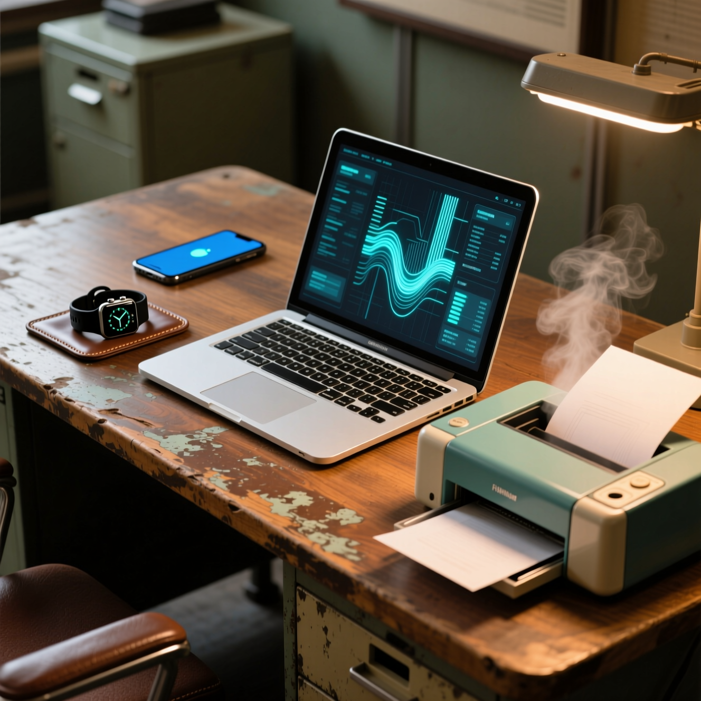

---
tags:
  - all
  - required
  - beginner
title: Принцип работы компьютера
description: "Не нужно недооценивать знания о компьютере. Если вам не интересны \"железки\", это не освобождает вас от необходимости понимать, как работает устройство."
related:
  - title: "Архитектура персонального компьютера"
    doc: encyclopedia/1-basics/1-08-kak-rabotaet-kompyuter/7
  - title: "Операционная система — о разделе"
    doc: encyclopedia/2-system-network/2-01-operatsionnaya-sistema/intro
  - title: "Платформы — о разделе"
    doc: encyclopedia/2-system-network/2-02-platformy/intro
  - title: "Терминал — о разделе"
    doc: encyclopedia/2-system-network/2-05-terminal/intro
---

import ComputerBootSequence from '@site/src/components/ComputerBootSequence';

# Принцип работы компьютера

<div class="article-tags">
  <span class="tag tag-required">ОБЯЗАТЕЛЬНО</span>
  <span class="tag tag-beginner">ДЛЯ НОВИЧКОВ</span>
</div>

<span class="complexity-badge">Всем</span>

Эта глава — вход в раздел: без формул и паяльника, но с честной картиной "что происходит внутри корпуса". Дальше по курсу те же идеи подробнее — [компоненты железа](/encyclopedia/1-basics/1-08-kak-rabotaet-kompyuter/2), [накопители](/encyclopedia/1-basics/1-08-kak-rabotaet-kompyuter/3), [загрузку](/encyclopedia/1-basics/1-08-kak-rabotaet-kompyuter/6) и наглядную [метафору "кабинета"](/encyclopedia/1-basics/1-08-kak-rabotaet-kompyuter/7). Задача здесь — понять общий принцип, чтобы характеристики вроде "16 ГБ ОЗУ" перестали быть магическими цифрами.

---

## О компьютере

<div class="callout callout--tip">
  <div class="callout-title">Совет</div>

  <div class="callout-body">
  Не нужно недооценивать знания о компьютере. Если вам не интересны "железки", это не освобождает от необходимости понимать, как работает устройство. Хотя бы попытайтесь разобраться — даже поверхностно: это сильно упрощает работу с ОС, программами и ошибками вроде "диск заполнен" или "не хватает памяти".
</div>
  </div>


---

### Что такое компьютер?

> **Компьютер** (англ. *computer*, от лат. *computare* — «считать, вычислять») — **функциональное электронное устройство**, способное выполнять большой объём **арифметических и логических операций** по правилам **программы**, без постоянного прямого вмешательства человека. Устройство может быть отдельным блоком или состоять из нескольких связанных между собой частей.

> **Электронно-вычислительная машина (ЭВМ)** — уточняющий термин: комплекс **технических, аппаратных и программных** средств для автоматической обработки информации, вычислений и автоматического управления, где основные функциональные узлы (логика, память, индикация и др.) построены на **электронных элементах**. В быту и в учебниках «компьютер» и «ЭВМ» часто используют как синонимы; подробнее — в главе [ЭВМ](/encyclopedia/1-basics/1-08-kak-rabotaet-kompyuter/8).

> **Не путать с:** «умной колонкой» как гаджетом — многие такие устройства тоже компьютеры, просто с узкой задачей; **сервером** — это роль (обслуживать других по сети), а не другой вид физики.

Слово *computer* в английском изначально обозначало **человека-счётчика** (с механическими приборами или без них). Со временем смысл перешёл на сами машины. В русский язык термин «компьютер» вошёл в 1970‑е как синоним «ЭВМ».

Понятие **компьютер** шире, чем только электронная реализация: теоретически возможны механические, оптические, квантовые и иные принципы работы. На практике почти всё, с чем вы сталкиваетесь дома и в офисе, — **цифровые электронные** системы.

Вы, наверное, уже знаете, что компьютер — это устройство для работы, учёбы, вычислений или развлечений. Возможно, даже сталкивались с характеристиками — вроде частоты процессора или объёма памяти.

Вокруг нас очень много компьютеров: ноутбуки, смарт-часы, смартфоны, МФУ, современные телевизоры и колонки. Почти все "умные" устройства имеют процессор и память — то есть ведут себя как компьютер, пусть и в урезанном виде.



---

### Цифровые и аналоговые вычислители

При проектировании вычислительной системы выбирают способ представления данных:

| Подход | Как хранят и обрабатывают величины | Типичное применение сегодня |
|--------|-------------------------------------|-----------------------------|
| **Цифровой** | Дискретные числа и символы (биты, байты) | ПК, смартфоны, серверы |
| **Аналоговый** | Непрерывные физические величины (напряжение, ток, давление, длина) | Спецрасчёты, моделирование, часть встраиваемой автоматики |

**Аналоговый компьютер** (АВМ) решает **заранее заданный класс задач** структурой схем и настройками; универсальная «программа на диске», как у ПК, у него отсутствует. Цифровые машины доминируют в быту именно из‑за **универсальности** — одно и то же железо под разные программы.

Для школьного курса достаточно помнить: ваш ноутбук — **цифровая ЭВМ**; аналоговые машины встречаются в нишевой инженерии и в истории вычислительной техники.

---

### Чем компьютер так крут?

*Первое*, что бросается в глаза, — *скорость*. Компьютер обрабатывает данные намного быстрее человека. Всю вычислительную работу выполняет **процессор** (CPU), а *как* и *когда* — координирует **операционная система** (Windows, Linux, macOS и др.).

Современный CPU делает **миллиарды тактов в секунду** (гигагерцы). За один такт он может выполнить часть одной машинной инструкции; реальная "скорость программы" зависит ещё от памяти, диска и того, насколько задача распараллеливается. Упрощённо: это не "миллиард готовых задач в секунду", а очень быстрый ритм элементарных шагов.

Такая скорость возможна благодаря тому, что внутри процессора идут простые, но чрезвычайно быстрые **переключения электрических сигналов**. Каждое переключение — шаг в выполнении команды.

*Второе* — *память*. Компьютер можно расширять: внутренние и внешние накопители — HDD, SSD, карты памяти, USB-флешки и т.д.

Память делится на два привычных типа:

- *Оперативную* (англ. **RAM**, рус. **ОЗУ**) — данные "здесь и сейчас", пока включено питание.
- *Долговременную* (**HDD** или **SSD**) — файлы, которые остаются после выключения.

Аналогия с бытом: ОЗУ — стол с открытыми документами; диск — шкаф для папок надолго. После выключения ОЗУ очищается; при открытии видео нужные куски с диска копируются в ОЗУ.

*Третье* — *энергия и тепло*. Компьютер не устаёт, но **перегревается**, если не отводить тепло. Мощная видеокарта без нормального охлаждения и блока питания может выйти из строя даже "просто в игре".

В каждом ПК есть охлаждение: вентиляторы, радиаторы, иногда жидкостное. Сравнение с организмом — **удобная метафора**, не буквальная модель: компьютер не "думает", как мозг, но тоже имеет ограничения по ресурсам и температуре.

---

### Виды компьютеров

Компьютеры различают по масштабу и назначению:

- *Суперкомпьютеры* — задачи глобального масштаба (климат, физика, криптоанализ);
- *Серверы* — услуги множеству клиентов по сети;
- *Персональные компьютеры* — работа одного пользователя за столом;
- *Встраиваемые системы* (Embedded) — компьютер внутри техники, автомобиля, прибора;
- *Мобильные устройства* — смартфоны и планшеты с упором на связь и автономность.

**Суперкомпьютер** — вычислительная система с наивысшей производительностью в своём классе (часто измеряют в **FLOPS** — операциях с плавающей запятой в секунду). Обычно это плотный *кластер* тысяч узлов, связанных быстрой сетью.

*Примеры:*

- *Fugaku (Япония):* моделирование распространения COVID и разработка материалов.
- *Frontier (США):* первый суперкомпьютер, преодолевший 1 эксафлопс (порядка 10¹⁸ операций в секунду); климат и астрофизика.
- *Lomonosov-2 (Россия):* крупнейший суперкомпьютер в РФ (МГУ): физика, химия, биология.

**Сервер** — компьютер (или виртуальная машина), который отдаёт ресурсы другим по сети. Его сила — в **надёжности**, работе 24/7, многопользовательском доступе и масштабировании. Бывает физический (железо) или логический (ВМ в облаке).

*Примеры:*

- *Веб-сервер (Nginx на Linux):* отвечает на HTTP-запросы к сайтам (в том числе к порталу "Вселенная IT").
- *Сервер СУБД (PostgreSQL, MS SQL):* хранит данные для банков, CRM (ELMA365 и аналоги).
- *Файловый сервер (SMB/NFS):* общие папки в компании.
- *Игровой сервер:* сессии Minecraft, Counter-Strike и т.п.

**Персональный компьютер** — устройство для одного пользователя на месте. Модульная сборка, много периферии. Часто мощнее ноутбука за те же деньги, но без мобильности.

*Примеры:*

- *Рабочая станция разработчика:* Core i9 / Ryzen 9, 64 ГБ ОЗУ, дискретная видеокарта для IDE и сборок.
- *Игровой ПК:* топовый GPU (NVIDIA RTX) для современных игр и рендера.
- *Офисный ПК:* средний CPU, документы, браузер, почта.

**Ноутбук** — те же компоненты в одном корпусе: экран, клавиатура, батарея. Главное отличие — автономность и лимит по теплу.

*Примеры:*

- *Ультрабук (Dell XPS 13, MacBook Air):* тонкий, долго держит батарею, поездки и веб-разработка.
- *Игровой ноутбук (ASUS ROG, Lenovo Legion):* тяжёлый, активное охлаждение, игры в дороге.
- *Мобильная рабочая станция (HP ZBook):* для инженеров, часто ECC-память и профессиональные GPU.

**Встраиваемая система** — компьютер внутри большего устройства; строго заданные функции, мало памяти, часто без "установки программ пользователем".

*Примеры:*

- *ЭБУ автомобиля:* двигатель, тормоза, подушки безопасности.
- *Умный термостат (Nest):* температура, анализ поведения, Wi-Fi.
- *Робот-пылесос:* карта комнаты, уборка.
- *Медицинский монитор:* ЭКГ, пульс.

**Мобильное устройство** — карманный компьютер с ОС под сенсор, 4G/5G/Wi-Fi, приложения, датчики (GPS, акселерометр, камера).

*Примеры:*

- *Смартфон (iPhone, Samsung Galaxy):* связь, навигация, приложения, контент.
- *Планшет (iPad, Galaxy Tab):* большой экран, рисование, потребление контента.
- *Смарт-часы (Apple Watch, Garmin):* здоровье, уведомления, оплата.
- *КПК (исторически):* предшественник смартфонов.

---

## Компоненты

### Алгоритм работы компьютера

Главная идея: **компьютер не понимает смысл** вашего текста или фильма. Он обрабатывает числа и биты по правилам программы. Исторически ЭВМ создавали как усилитель расчётов, а не замену человеку — принцип тот же.

★ **Компьютер** — вычислительное устройство, "электронный конструктор", где детали действуют по алгоритму:


Упрощённо: клик мыши → сигнал в ПК → ОС решает, что запустить → программа грузится с диска в ОЗУ → CPU и GPU рисуют окно на мониторе.

**Разбор по шагам** (важно: не CPU "сам" запускает Блокнот — им управляет ОС):

1. Вы нажимаете кнопку мыши.
2. Мышь отправляет данные (USB или Bluetooth) в контроллер ввода.
3. **Драйвер** и **ОС** превращают сигнал в событие "клик в координатах (x, y)".
4. Оболочка (рабочий стол) определяет: под курсором значок "Блокнот" → нужно запустить приложение.
5. **ОС** находит файл программы на **накопителе**, создаёт процесс, загружает код в **ОЗУ**.
6. **CPU** выполняет машинные инструкции программы.
7. **GPU** (или встроенная графика) формирует кадр; результат уходит на **монитор**.

Ни один шаг не "волшебный" — везде заложены правила разработчиков ОС и приложения.

Псевдокод той же цепочки (логика, не реальный язык):

```
событие = мышь.прочитать()
если рабочий_стол.объект_под_курсором(событие.x, событие.y) == "Блокнот":
    процесс = ОС.запустить("C:\\Windows\\notepad.exe")
    пока процесс.работает:
        CPU.выполнить_следующую_инструкцию(процесс)
        GPU.обновить_экран(процесс.окно)
```

Подробнее про включение и загрузку ОС — в интерактиве ниже и в главе [Загрузка операционной системы](/encyclopedia/1-basics/1-08-kak-rabotaet-kompyuter/6).

<ComputerBootSequence />

Даже в смартфоне, планшете или смарт-часах те же роли — процессор, память, накопитель, питание — только в миниатюре под корпусом.

---

## Как это выглядит в жизни

Ниже несколько коротких ситуаций, которые "приземляют" теорию:

- **"Открыл 30 вкладок, все тормозит"**: чаще всего упираемся в ОЗУ. Когда памяти не хватает, ОС переносит часть данных в файл подкачки на диске, а диск медленнее RAM. Поэтому система начинает "думать" дольше, хотя процессор может быть не загружен на 100%.
- **"ПК быстро включается, но игра грузится долго"**: старт ОС зависит от скорости чтения системных файлов и инициализации служб, а загрузка игры дополнительно зависит от объема ресурсов (текстур, карт, шейдеров) и скорости случайного чтения с накопителя.
- **"Курсор дергается, звук заикается"**: это не всегда "слабый компьютер". Часто причина в драйверах, фоновом обновлении или перегреве, когда система снижает частоты для защиты.

Если хотите разобрать это глубже:

- по железу и "узким местам" — [Компоненты компьютерного железа](/encyclopedia/1-basics/1-08-kak-rabotaet-kompyuter/2);
- по накопителям и разметке — [Устройства хранения данных](/encyclopedia/1-basics/1-08-kak-rabotaet-kompyuter/3);
- по старту системы — [Загрузка операционной системы](/encyclopedia/1-basics/1-08-kak-rabotaet-kompyuter/6).

{/* sidebar-collections */}

---

## В подборках

Статья входит в тематические маршруты из меню **Подборки** и блока "С чего начать?" на главной. Соседние шаги того же маршрута:

**Системное программирование** — [Архитектура персонального компьютера](/encyclopedia/1-basics/1-08-kak-rabotaet-kompyuter/7), [Операционная система — о разделе](/encyclopedia/2-system-network/2-01-operatsionnaya-sistema/intro), [Платформы — о разделе](/encyclopedia/2-system-network/2-02-platformy/intro), [Терминал — о разделе](/encyclopedia/2-system-network/2-05-terminal/intro), [Системное администрирование — о разделе](/encyclopedia/2-system-network/2-06-sistemnoe-administrirovanie/intro), [Выполнение кода — о разделе](/encyclopedia/4-code-dev/4-03-vypolnenie-koda/intro).

{/* /sidebar-collections */}

---
