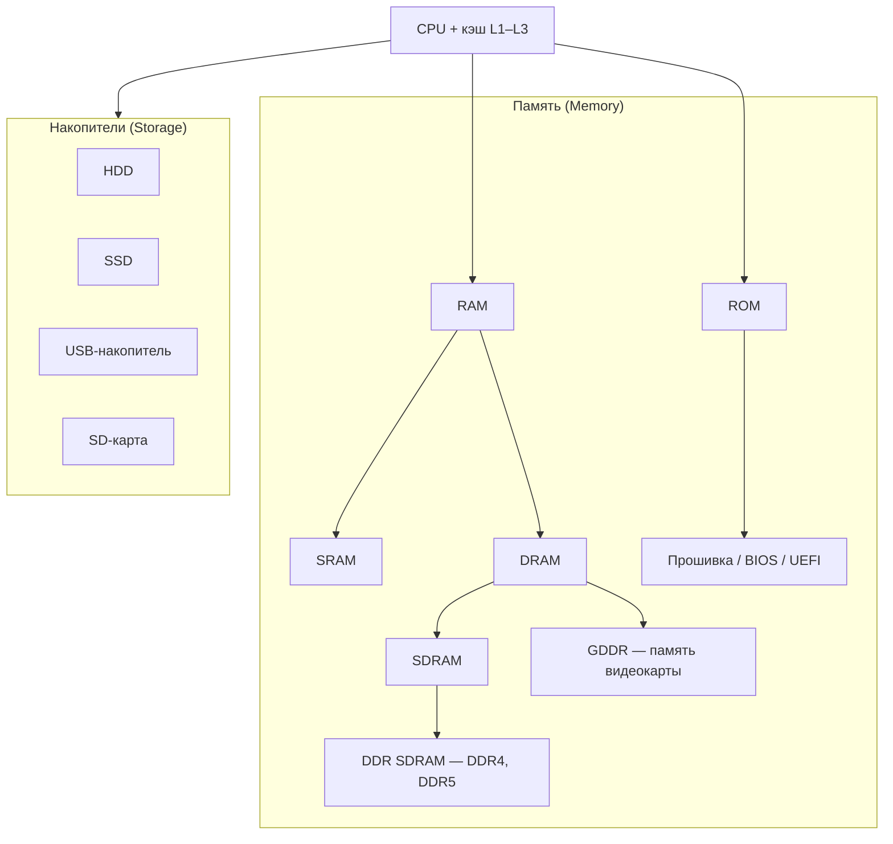

---
tags:
  - all
  - required
  - beginner
title: Память и накопители — типы и иерархия
description: >-
  RAM, ROM, SRAM, DRAM, DDR, HDD и SSD — как устроена иерархия памяти и storage
  в компьютере, чем отличаются волатильные и постоянные носители.
related:
  - title: "Принцип работы компьютера"
    doc: encyclopedia/1-basics/1-08-kak-rabotaet-kompyuter/1
  - title: "Устройства хранения данных"
    doc: encyclopedia/1-basics/1-08-kak-rabotaet-kompyuter/3
  - title: "Аппаратное обеспечение"
    doc: encyclopedia/2-system-network/2-10-zhelezo/1
  - title: "Современные системы хранения данных"
    doc: encyclopedia/2-system-network/2-10-zhelezo/121
  - title: "Многоуровневая организация компьютера"
    doc: encyclopedia/1-basics/1-08-kak-rabotaet-kompyuter/13
  - title: "RISC и CISC"
    doc: encyclopedia/2-system-network/2-10-zhelezo/122
  - title: "RAM (глоссарий)"
    href: /glossary/R#ram
  - title: "DRAM (глоссарий)"
    href: /glossary/D#dram
---

# Память и накопители — типы и иерархия

  ОБЯЗАТЕЛЬНО
  ДЛЯ НОВИЧКОВ

Всем

В [первой главе](/encyclopedia/1-basics/1-08-kak-rabotaet-kompyuter/1) мы разделили **ОЗУ** и **диск** метафорой «стол» и «шкаф». Здесь — та же картина, но точнее: какие бывают **типы памяти** (Memory) и **накопители** (Storage), как они связаны с процессором и почему в спецификациях встречаются SRAM, DRAM, DDR5, ROM и BIOS.

---

## Два больших семейства

| Семейство | Английский термин | Суть | После отключения питания |
|-----------|-------------------|------|--------------------------|
| **Память** | Memory | Быстрый доступ для CPU «здесь и сейчас» | Обычно данные **теряются** (кроме спецтипов вроде ROM) |
| **Накопители** | Storage | Долговременное хранение файлов и системы | Данные **сохраняются** |

**RAM** (Random Access Memory) — оперативная память: процессор и ОС держат в ней открытые программы, стек, буферы. **ROM** (Read-Only Memory) — постоянная память с заранее записанными инструкциями: прошивка материнской платы, микрокод, настройки загрузки.

Накопители (**HDD**, **SSD**, флешка, SD-карта) медленнее RAM, зато годятся для архива документов, игр и установки ОС.

---

## RAM — оперативная, энергозависимая

**RAM** в бытовых ПК — это модули в слотах на материнской плате. Пока компьютер включён, сюда попадают код запущенных программ и рабочие данные. Выключили питание — содержимое ОЗУ исчезает (если не используется гибернация или снимок на диск).

Внутри семейства RAM различают технологии по скорости и цене.

### SRAM — самая быстрая

**SRAM** (Static RAM) хранит бит в триггере, без постоянной «подзарядки» ячейки. Она **быстрее DRAM**, но дороже и занимает больше места на кристалле. Поэтому SRAM делают **кэш процессора** (L1, L2, L3) и сверхбыстрые буферы внутри чипов. Объём кэша измеряют мегабайтами, а не гигабайтами.

### DRAM — основа системной ОЗУ

**DRAM** (Dynamic RAM) — динамическая память: заряд в ячейке со временем утечёт, и контроллер периодически выполняет **регенерацию**. Зато DRAM дешевле и плотнее — из неё собирают те самые планки **8 / 16 / 32 ГБ**, которые указывают в характеристиках ноутбука.

Современные модули ОЗУ — это **DRAM** с интерфейсом синхронизации и удвоенной скоростью передачи по шине.

| Термин | Где встречается | Заметка |
|--------|-----------------|--------|
| **SDRAM** | Исторические и учебные схемы | Синхронная DRAM — такт шины совпадает с контроллером |
| **DDR SDRAM** | Планки DDR4, DDR5 в ПК | Double Data Rate — два передачи данных за такт; поколения DDR3 → DDR4 → DDR5 отличаются скоростью и напряжением |
| **GDDR** | Видеокарта | Graphics DDR — вариант для GPU; больше полосы пропускания под текстуры и кадры |

В магазине вы видите «DDR5-6000 32 ГБ» — это **DRAM** в корпусе DIMM с контроллером DDR5, а не отдельный «вид памяти» вместо RAM.

  
Кэш CPU

  

  Иерархия скорости: **регистры** → **L1/L2/L3 (SRAM)** → **RAM (DRAM)** → **SSD/HDD**. Раздел [Кэш процессора](#kesh-protsessora) ниже — про строки кэша, промахи и split I/D.
  

---

## Кэш процессора — локальность и строки

**Кэш** — быстрая SRAM на кристалле или рядом с CPU. Он хранит **копии** недавно использованных данных и команд из RAM, потому что обращение к ОЗУ в десятки раз медленнее.

### Принцип локальности

Программы редко читают память «случайно». Работают два эффекта:

| Вид | Смысл | Пример |
|-----|-------|--------|
| **Пространственная** | Рядом с нужным байтом скоро понадобятся соседние | Обход массива `for (i…)` |
| **Временная** | Недавно прочитанное прочитают снова | Переменная-счётчик в цикле |

Кэш использует это так: при **промахе** (cache miss) в кэш загружают не один байт, а **строку кэша** (cache line) — обычно 64 байта. Один медленный доступ к RAM приносит целый блок — следующие обращения часто попадают в кэш (**cache hit**).

### Уровни L1, L2, L3

| Уровень | Размещение | Объём (типично) | Задержка |
|---------|------------|-----------------|----------|
| **L1** | На ядре CPU | десятки–сотни КБ | ~1–4 такта |
| **L2** | На ядре или рядом | сотни КБ – несколько МБ | ~10–20 тактов |
| **L3** | Общий для всех ядер | 8–64+ МБ | ~40–75 тактов |

L1 часто **разделён**: **I-cache** (инструкции) и **D-cache** (данные). Это элемент **гарвардской** идеи — параллельный доступ к команде и операнду в конвейере ([ЭВМ](/encyclopedia/1-basics/1-08-kak-rabotaet-kompyuter/8)). L2/L3 обычно **объединённые** (unified).

### Промах кэша и производительность

**Cache hit** — данные уже в кэше, CPU не ждёт RAM. **Cache miss** — конвейер простаивает, пока контроллер подтягивает строку. Поэтому «оптимизация памяти» в коде — это часто **улучшение локальности** (компактные структуры, последовательный обход), а не только «быстрее алгоритм».

Полная «лестница» от кэша до облака — [Современные системы хранения данных](/encyclopedia/2-system-network/2-10-zhelezo/121). Философия **load/store** и регистров — [RISC и CISC](/encyclopedia/2-system-network/2-10-zhelezo/122).

---

## ROM — постоянные инструкции

**ROM** (Read-Only Memory) изначально означала память, которую **нельзя переписать** обычной программой. Сегодня чаще говорят о **прошивке** (firmware) — микропрограммах, которые остаются при выключении.

| Пример | Роль |
|--------|------|
| **BIOS / UEFI** | Первый код при включении: проверка железа (POST), выбор диска загрузки |
| Прошивка SSD, сетевой карты, принтера | Низкоуровневая логика устройства |
| **EEPROM** | Перезаписываемая энергонезависимая память (настройки, серийные данные) |

Пользовательский файл на диске **C:** к ROM не относится. ROM — служебный слой «как машина включается и общается с железом», а не папка с документами.

При обновлении BIOS производитель переписывает чип на материнской плате специальной утилитой. Ошибка на этом этапе опасна — поэтому обновляют прошивку только при необходимости.

---

## Storage — накопители

**Storage** (хранилище) — устройства **долговременного** хранения. Сюда попадают установленная Windows, фотографии, игры, резервные копии.

| Тип | Технология | Типичное применение |
|-----|------------|---------------------|
| **HDD** | Магнитные пластины, механика | Большой объём за меньшие деньги, архив, медиатека |
| **SSD** | Флэш-память NAND | Системный диск, игры, быстрый отклик |
| **USB-накопитель** | Флэш в корпусе | Перенос файлов, загрузочная флешка |
| **SD-карта** | Флэш в карточке | Камера, одноплатник, расширение памяти в ноутбуке |

SSD и USB внутри тоже используют **флэш** (неволатильную память), но по роли в системе это **накопители**, а не «оперативка». Путаница часто возникает из‑за слова «память» в рекламе телефона («128 ГБ памяти») — в спецификации это **встроенный storage**, а «8 ГБ RAM» — отдельная быстрая ОЗУ.

Разделы диска, MBR/GPT, NVMe — в [главе про накопители](/encyclopedia/1-basics/1-08-kak-rabotaet-kompyuter/3). Полная «лестница» от кэша до облака — в [Современные системы хранения данных](/encyclopedia/2-system-network/2-10-zhelezo/121.md).

---

## Как это выглядит при работе программы

1. **Запуск.** UEFI/BIOS (ROM) инициализирует железо и передаёт управление загрузчику с SSD.
2. **Загрузка ОС.** Файлы ядра и драйверов читаются с накопителя и копируются в **RAM**.
3. **Работа.** CPU берёт инструкции из RAM; горячие данные дублируются в **кэш (SRAM)**.
4. **Сохранение.** Нажали «Сохранить» — данные из RAM записываются на **SSD/HDD**.
5. **Выключение.** RAM очищается; на диске остаётся то, что успели сохранить.

Сообщение «**не хватает памяти**» в Windows обычно про **RAM**, а «**мало места на диске C:**» — про **storage**. Это разные узкие места и разные способы лечения (добавить планку ОЗУ или освободить/расширить диск).

---

## Шпаргалка для чтения характеристик

| В спецификации | Семейство | Вопрос, который решает |
|----------------|-----------|-------------------------|
| 16 ГБ DDR5 | RAM (DRAM) | Сколько программ и вкладок тянет одновременно |
| 1 ТБ NVMe SSD | Storage | Сколько файлов и игр поместится, как быстро грузится ОС |
| 12 МБ L3 cache | SRAM (в CPU) | Насколько хорошо процессор «помнит» недавние данные |
| 32 МБ GDDR6 | RAM видеокарты | Объём текстур и кадров для GPU |
| UEFI BIOS | ROM / прошивка | Как плата стартует и откуда грузится система |

---

## Рекомендую читать дальше

- [Многоуровневая организация компьютера](/encyclopedia/1-basics/1-08-kak-rabotaet-kompyuter/13) — уровни от кэша до языков.
- [Принцип работы компьютера](/encyclopedia/1-basics/1-08-kak-rabotaet-kompyuter/1) — ввод в раздел.
- [Компоненты железа](/encyclopedia/1-basics/1-08-kak-rabotaet-kompyuter/2) — слоты RAM, PCIe, материнская плата.
- [Устройства хранения](/encyclopedia/1-basics/1-08-kak-rabotaet-kompyuter/3) — разделы, HDD/SSD, облако.
- [Аппаратное обеспечение](/encyclopedia/2-system-network/2-10-zhelezo/1) — CPU, RAM, накопители в одной статье.
- Глоссарий: [RAM](/glossary/R#ram), [DRAM](/glossary/D#dram), [SRAM](/glossary/S#sram), [ROM](/glossary/R#rom), [SSD](/glossary/S#ssd).
