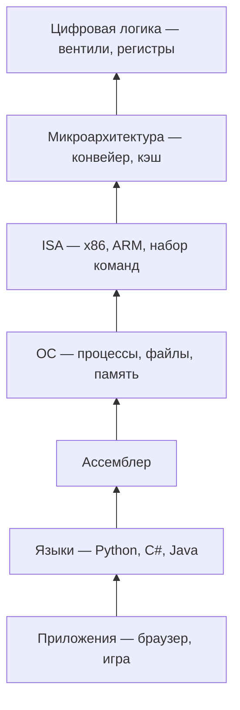

---
tags:
  - all
  - required
  - beginner
title: Многоуровневая организация компьютера
description: >-
  Как устроена «лестница» уровней от транзисторов до Python — виртуальные машины,
  трансляция и интерпретация, связь железа с программой и ОС.
related:
  - title: "Принцип работы компьютера"
    doc: encyclopedia/1-basics/1-08-kak-rabotaet-kompyuter/1
  - title: "Память и накопители — типы и иерархия"
    doc: encyclopedia/1-basics/1-08-kak-rabotaet-kompyuter/12
  - title: "ЭВМ"
    doc: encyclopedia/1-basics/1-08-kak-rabotaet-kompyuter/8
  - title: "Программа — о разделе"
    doc: encyclopedia/1-basics/1-19-programma/intro
  - title: "Операционная система — о разделе"
    doc: encyclopedia/2-system-network/2-01-operatsionnaya-sistema/intro
  - title: "RISC и CISC"
    doc: encyclopedia/2-system-network/2-10-zhelezo/122
  - title: "Архитектура фон Неймана"
    doc: encyclopedia/2-system-network/2-10-zhelezo/11
---

# Многоуровневая организация компьютера

  ОБЯЗАТЕЛЬНО
  ДЛЯ НОВИЧКОВ

Всем

Цифровой компьютер исполняет только **примитивные команды** — сложить числа, сравнить с нулём, скопировать блок памяти. Писать игру или сайт сразу на таком языке трудно и утомительно. Решение — **уровни абстракции**: каждый следующий «язык» удобнее для человека, а нижележащий уровень переводит или исполняет его по правилам.

Эта модель — сквозная нить курса «Как работает компьютер»: она связывает [железо](/encyclopedia/2-system-network/2-10-zhelezo/1), [программу](/encyclopedia/1-basics/1-19-programma/intro) и [операционную систему](/encyclopedia/2-system-network/2-01-operatsionnaya-sistema/intro).

---

## Проблема — два языка

У **реального процессора** есть машинный язык **Я0** — набор инструкций, которые понимает кремний. Программист хочет писать на **Я1** — языке, где есть переменные, циклы и функции.

| Подход | Что происходит | Пример |
|--------|----------------|--------|
| **Трансляция** | Вся программа на Я1 переписывается в программу на Я0, затем исполняется | C → машинный код через компилятор |
| **Интерпретация** | Каждая команда Я1 по очереди разбирается и сразу выполняется на Я0 | Python в CPython (с байт-кодом) |

Удобнее думать так: существует **виртуальная машина M1**, для которой «родным» является Я1. Программы пишут для M1, а реальное железо M0 исполняет их через транслятор или интерпретатор. Подробнее про конвейер компиляции — в [Компиляторы и интерпретаторы](/encyclopedia/1-basics/1-19-programma/2).

---

## Лестница уровней

Если Я1 всё ещё слишком низок, добавляют **Я2**, **Я3** и так далее, пока верхний уровень не станет удобным. Каждый язык опирается на предыдущий — получается **иерархия виртуальных машин**.

**Термин «уровень»** и **«виртуальная машина»** в архитектуре компьютеров часто означают одно и то же. Слово «виртуальная машина» в другом смысле — гостевая ОС в Hyper-V или VirtualBox ([раздел про ОС](/encyclopedia/2-system-network/2-01-operatsionnaya-sistema/9)).

---

## Шесть уровней современного ПК

Типичная схема для настольного компьютера и смартфона:

| Уровень | Название | Что здесь | Как поддерживается |
|---------|----------|-----------|-------------------|
| 0 | Аппаратура | Транзисторы, провода | Физика |
| 1 | Цифровая логика | Вентили, регистры, шины | Схемы на кристалле |
| 2 | Микроархитектура | Конвейер, АЛУ, кэш L1/L2 | «Внутренности» CPU |
| 3 | ISA | Машинные команды x86 / ARM | Спецификация + реализация в CPU |
| 4 | ОС | Файлы, процессы, сокеты | Windows, Linux, Android |
| 5 | Ассемблер | Мнемоники `mov`, `add` | NASM, GNU as |
| 6+ | Языки и приложения | Python, браузер, IDE | Компиляторы, интерпретаторы, JIT |

  
Граница для прикладного программиста

  Уровни 0–3 изучают системные программисты и инженеры по железу. Уровни 4–6 — повседневная работа разработчика. Понимать все шесть не обязательно, но **уровень 4 (ОС)** и **уровень 3 (ISA)** сильно помогают при отладке и производительности.

---

## Уровень 2 — микроархитектура

На этом уровне видны **регистры**, **АЛУ** и **тракт данных**. Одна «микрооперация» — выбрать регистры, выполнить сложение, записать результат.

Современные CPU почти всегда используют **конвейер** и **кэш** — это уровень 2, а не то, что описано в справочнике ISA. Команда `ADD` в ассемблере — уровень 3; то, как Pentium или Apple M2 её разбивает на стадии — уровень 2. Подробнее — [Архитектура фон Неймана](/encyclopedia/2-system-network/2-10-zhelezo/11), [RISC и CISC](/encyclopedia/2-system-network/2-10-zhelezo/122), [ЭВМ](/encyclopedia/1-basics/1-08-kak-rabotaet-kompyuter/8).

---

## Уровень 3 — архитектура набора команд (ISA)

**ISA** (Instruction Set Architecture) — контракт между программой и процессором: какие команды есть, какие регистры, как адресовать память. Программа, собранная под **x86-64**, на **ARM** без пересборки или эмуляции не запустится.

| Семейство | Где встречается | Заметка |
|-----------|-----------------|---------|
| **x86 / x86-64** | ПК, многие серверы | Исторически CISC; внутри — RISC-подобное ядро |
| **ARM** | Смартфоны, одноплатники, Apple Silicon | Доминирует в мобильных и встраиваемых |
| **RISC-V** | Эксперименты, новые чипы | Открытая спецификация |
| **AVR** | Arduino Uno, бытовая электроника | Микроконтроллеры с крошечной памятью — [первые скетчи](/lab/Примеры/1135) |

Три эталонных процессора — **Core i7**, **OMAP4430 (ARM)** и **ATmega168 (AVR)** — показывают один и тот же принцип уровней на разном масштабе: от сервера до микросхемы в бытовой технике. Подробнее — [Встраиваемые системы](/encyclopedia/2-system-network/2-10-zhelezo/112#tri-etala-isa).

---

## Уровень 4 — операционная система (гибридный)

ОС — **гибридный** уровень: часть команд совпадает с ISA (например, системные вызовы опираются на инструкции процессора), часть — **новые абстракции**, которых в железе нет буквально.

| Абстракция ОС | Что скрывает от программы |
|---------------|---------------------------|
| **Файл** | Сектора диска, контроллер NVMe, прерывания |
| **Процесс** | Переключение регистров, таблицы страниц |
| **Сокет** | Пакеты Ethernet, драйвер сетевой карты |
| **Поток** | Планировщик, очереди готовности |

Программист открывает `report.pdf` — это уровень 4. ОС переводит операцию в обращения к драйверу и DMA — уровни 3–1. Две роли ОС — [виртуальная машина и диспетчер ресурсов](/encyclopedia/2-system-network/2-01-operatsionnaya-sistema/1).

---

## Уровни 5–6 — ассемблер и языки

**Ассемблер** — символическая форма ISA: вместо `0x48 0x89 0xE5` пишут `mov rbp, rsp`. **Компилятор C** или **интерпретатор Python** поднимают абстракцию ещё выше.

Цепочка для типичной программы на C:

1. Исходник `.c` → компилятор → объектный модуль (уровень 3–4).
2. Линковщик → исполняемый файл.
3. ОС загружает файл в память, создаёт процесс (уровень 4).
4. CPU исполняет машинные команды (уровни 2–3).

Для Python часть пути — байт-код и виртуальная машина CPython ([исполнение программы](/encyclopedia/1-basics/1-19-programma/1)).

---

## Зачем это знать на практике

| Ситуация | Какой уровень помогает |
|----------|------------------------|
| «Программа тормозит» | 2 (кэш, конвейер), 4 (swap, планировщик) |
| «Не запускается на другом процессоре» | 3 (ISA, ARM vs x86) |
| «Файл не читается» | 4 (права, ФС), иногда 1 (диск) |
| «Сборка под Linux, не под Windows» | 4–6 (API, ABI, линковка) |
| «Прошивка Arduino» | 2–3 (AVR, MMIO) — [встраиваемые системы](/encyclopedia/2-system-network/2-10-zhelezo/112), [скетчи с разбором](/lab/Примеры/1135) |

---

## Куда читать дальше

1. [Принцип работы компьютера](/encyclopedia/1-basics/1-08-kak-rabotaet-kompyuter/1) — обзор железа и видов машин.
2. [Память и накопители](/encyclopedia/1-basics/1-08-kak-rabotaet-kompyuter/12) — иерархия от кэша до SSD.
3. [Поколения вычислительной техники](/encyclopedia/1-basics/1-07-nemnogo-o-proshlom/12) — история от механики до VLSI.
4. [RISC и CISC](/encyclopedia/2-system-network/2-10-zhelezo/122) — философии проектирования ISA.
5. [ЭВМ](/encyclopedia/1-basics/1-08-kak-rabotaet-kompyuter/8) — инженерное углубление (регистры, шины, прерывания).
