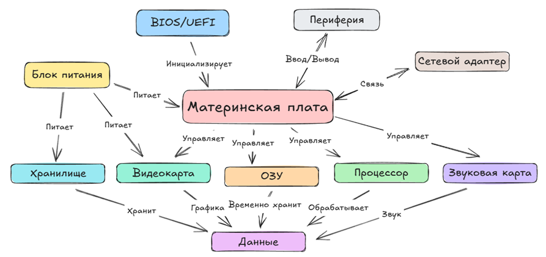
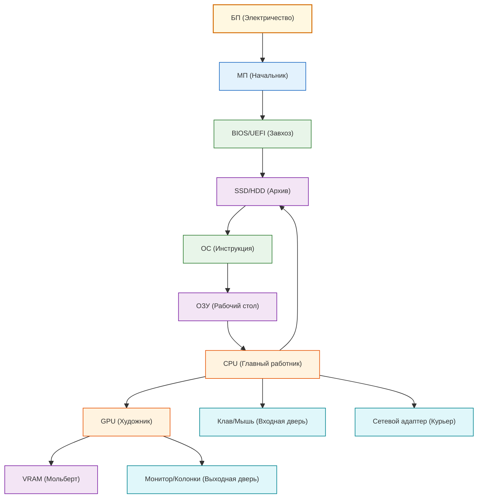

---
title: Архитектура персонального компьютера
tags: [beginner, advanced, required, all]
description: Объясняет принципы работы компьютера через метафору «спектакля», описывая взаимодействие ключевых компонентов (процессора, памяти, накопителей, видеокарты, периферии и др.) как слаженную командную работу.
---

# Архитектура персонального компьютера

  ОБЯЗАТЕЛЬНО
  ДЛЯ НОВИЧКОВ
  НЕ ДЛЯ НОВИЧКОВ
  В РАЗРАБОТКЕ

Всем

## Как устроен компьютер

Компьютер — это электронная система, которая принимает данные, обрабатывает их по заданным правилам и выдаёт результат. Он состоит из физических компонентов («железо») и программного обеспечения, которое управляет этим железом.

### Схема устройства компьютера

Итак, схема устройства компьютера выглядит следующим образом:

---

### Как всё работает?

В главных ролях:

- Компьютер в роли кабинета;
- Блок питания – электричество в кабинете;
- Материнская плата в роли начальника;
- BIOS/UEFI – завхоз;
- Хранилище – архив, а диск - архивариус;
- Процессор – главный работник;
- Операционная система – инструкция для кабинета;
- Оперативная память – рабочий стол;
- Устройства ввода – входная дверь;
- Устройства вывода – выходная дверь;
- Видеокарта – художник, а видеопамять – мольберт;
- Сетевой адаптер – курьер;
- Звуковая карта – музыкант;
- Порты – окна кабинета.

А теперь рассмотрим эту историю как спектакль.

---

### Спектакль

| Спектакль | Реальность |
|----------|-----------|
| В кабинете *включили свет*, люстры включились, *начальник проверил, все ли на месте*, завхоз решает, с чего начать работу (с архива). | Блок питания *подаёт ток*; материнская плата выполняет *самотестирование компонентов* (POST); BIOS/UEFI решает, с чего начать загрузку (например, с жёсткого диска). |
| Подготовка к рабочему дню: архивариус передал *инструкции* по работе для всего кабинета, положил работникам на рабочий стол; главный работник сразу ознакомился с правилами; архивариус также оставил руководство на столе, чтобы можно было заглянуть при необходимости. | *Загрузка операционной системы*: SSD/HDD передаёт ОС в оперативную память; процессор начинает выполнять её инструкции; часть системных данных остаётся в памяти как справочник (например, драйверы, системные библиотеки). |
| Принесли новый документ, занесли через *входную дверь* №1; работник прочитал, понял задачу, пошёл готовить ответ; для работы ему понадобится дело из архива — он отправляется туда; дело положил на рабочий стол, чтобы было под рукой, но если дел много — будет доставать по частям, так как места на столе не так много. У работника есть блокнотик, куда он записывает краткие тезисы. | *Устройство ввода* (мышь/клавиатура) сообщает о действии пользователя; процессор ищёт нужный файл на HDD/SSD и загружает его в оперативную память; если данных слишком много — часть остаётся на диске; процессор использует кэш (L1/L2/L3), чтобы хранить часто используемые данные. |
| *Подготовка ответа, работа с документом*; с текстом работник справляется сам, если нужно нарисовать — зовёт художника; если нужно сыграть мелодию — зовёт музыканта; художник рисует сначала на мольберте, там смешивает цвета, показывает результат главному работнику. Главный работник говорит подчинённым, что делать. | *Процессор обрабатывает текстовые данные*; для графики передаёт задачу видеокарте (GPU); для звука — звуковой карте; GPU использует видеопамять (VRAM), рассчитывает изображение и передаёт результат; процессор координирует взаимодействие всех компонентов. |
| *Уборка в кабинете*; после того как работа была завершена, главный работник убирает всё лишнее со стола, убирает обратно в архив; если стол завален, часть документов временно скидывает в ящик; И вот тебе на! Если отключить свет, то кто-то украдёт всё со стола! | Процессор *очищает оперативную память*, сохраняет важные данные на диск; если ОЗУ переполнена — используется файл подкачки (swap/pagefile); при аварийном выключении все незаписанные данные в ОЗУ теряются безвозвратно. |
| *Документ уходит заявителю*; картину передают в выходную дверь №1; мелодию передают в выходную дверь №2; также есть возможность передать документы курьеру, чтобы он отвёз к заявителю. Есть ещё куча окон, к которым могут припарковаться разные наёмные рабочие. | Изображение *выводится на монитор* через HDMI/DisplayPort; звук передаётся на колонки или наушники через аудиовыход; сетевой адаптер отправляет данные по сети; USB-порты и другие интерфейсы позволяют подключать внешние устройства. |
| *Конец рабочего дня*. Главный работник убирает всё обратно в архив, а начальник по инструкции спрашивает — все всё убрали, закончили? Потом свет выключают и все идут отдыхать. | *Завершение работы*: процессор и ОС сохраняют системные данные на диск; проверяется, что все процессы завершены; блок питания отключает питание компонентов. Компьютер переходит в состояние покоя. |

Таким образом, компьютер – это целая команда, где каждый играет свою роль. Если кто-то медленный и слабый, остальные его ждут. Эффективность компьютера зависит не от одного компонента, а от того, насколько хорошо все части работают вместе. Быстрый процессор не спасёт ситуацию, если память переполнена или диск старый. Как и в команде — успех зависит от слаженности, а не только от одного «звёздного» сотрудника.

---
